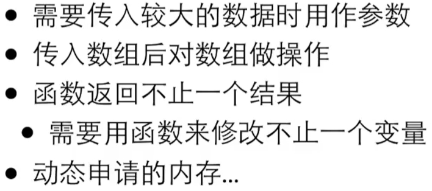

# C

[TOC]


# 1.历史

# 2.程序框架

```c
#include <stdio.h>
int main()
{
    /* 
    多行注释
    多行注释
    */
    
    // 单行注释
    int price = 0;
    const int AMOUNT = 100;
    scanf("%d", &price);
    int change = AMOUNT - price;
    
    printf("hello, world!\n");  
    printf("1+2=%d\n", 1+2);
        
    return 0;
}
```

1. `\n`  换行符

2. `%d`  占位符

3. `&`  指针

4. `scanf("token%d, %d", &a, &b);`  输入格式一定要严格 eg: `token1, 2 `

5. `const`  定义常量（一般全大写）

6. C99写法：变量随时可以定义       ANSI C写法：一开始必须把变量定义完

7. C中，**两个整数**的运算结果只能是**整数**， **浮点数和整数**一起运算时会自动把整数变为浮点数

8. 变量声明  Declaration Statement

   `type_name identifier, identifier;`

9. 交换变量

   ```c
   int a=1;
   int b=2;
   int temp;
   
   temp=a;
   a=b;
   b=temp;
   ```

   


# 3.基础语法

## 3.1.运算符

运算符operator   算子operand

#### 算术运算符

下表显示了 C 语言支持的所有算术运算符。假设变量 **A** 的值为 10，变量 **B** 的值为 20，则：

| 运算符 | 描述                           | 实例             |
| :----- | :----------------------------- | :--------------- |
| +      | 加                             | A + B 将得到 30  |
| -      | 减                             | A - B 将得到 -10 |
| *      | 乘                             | A * B 将得到 200 |
| /      | 除                             | B / A 将得到 2   |
| %      | 取模(取余)运算符，整除后的余数 | B % A 将得到 0   |
| ++     | 自增运算符，整数值增加 1       | A++ 将得到 11    |
| --     | 自减运算符，整数值减少 1       | A-- 将得到 9     |

1. a++是加1以前那个值**先用再加**，++a是加1以后那个值**先加再用**

#### 关系(比较)运算符

下表显示了 C 语言支持的所有关系运算符。假设变量 **A** 的值为 10，变量 **B** 的值为 20，则：

| 运算符 | 描述                                                         | 实例            |
| :----- | :----------------------------------------------------------- | :-------------- |
| ==     | 检查两个操作数的值是否相等，如果相等则条件为真。             | (A == B) 为假。 |
| !=     | 检查两个操作数的值是否相等，如果不相等则条件为真。           | (A != B) 为真。 |
| >      | 检查左操作数的值是否大于右操作数的值，如果是则条件为真。     | (A > B) 为假。  |
| <      | 检查左操作数的值是否小于右操作数的值，如果是则条件为真。     | (A < B) 为真。  |
| >=     | 检查左操作数的值是否大于或等于右操作数的值，如果是则条件为真。 | (A >= B) 为假。 |
| <=     | 检查左操作数的值是否小于或等于右操作数的值，如果是则条件为真。 | (A <= B) 为真。 |

1. **关系成立结果为1，不成立为0**

#### 逻辑运算符

下表显示了 C 语言支持的所有关系逻辑运算符。假设变量 **A** 的值为 1，变量 **B** 的值为 0，则：

| 运算符   | 描述                                                         | 实例              |
| :------- | :----------------------------------------------------------- | :---------------- |
| **&&**   | 称为逻辑**与**运算符。如果两个操作数都非零，则条件为真。     | (A && B) 为假。   |
| **\|\|** | 称为逻辑**或**运算符。如果两个操作数中有任意一个非零，则条件为真。 | (A \|\| B) 为真。 |
| **!**    | 称为逻辑**非**运算符。用来逆转操作数的逻辑状态。如果条件为真则逻辑非运算符将使其为假。 | !(A && B) 为真。  |

1. `4 < x < 6`只是可以正确编译，但不能达到原本的计算目的；正确的应该这样:

    `4 < x && 6 > x`

2. 短路：如果前面的结果能够决定整个结果就，直接返回结果，后面的不再做计算。

   **不要把赋值写进表达式**   eg：`a == 6 && b += 1`后面可能不起作用


#### 赋值运算符

下表列出了 C 语言支持的赋值运算符：

| 运算符 | 描述                                                         | 实例                            |
| :----- | :----------------------------------------------------------- | :------------------------------ |
| =      | 简单的赋值运算符，把右边操作数的值赋给左边操作数             | C = A + B 将把 A + B 的值赋给 C |
| +=     | 加且赋值运算符，把右边操作数加上左边操作数的结果赋值给左边操作数 | C += A 相当于 C = C + A         |
| -=     | 减且赋值运算符，把左边操作数减去右边操作数的结果赋值给左边操作数 | C -= A 相当于 C = C - A         |
| *=     | 乘且赋值运算符，把右边操作数乘以左边操作数的结果赋值给左边操作数 | C *= A 相当于 C = C * A         |
| /=     | 除且赋值运算符，把左边操作数除以右边操作数的结果赋值给左边操作数 | C /= A 相当于 C = C / A         |
| %=     | 求模且赋值运算符，求两个操作数的模赋值给左边操作数           | C %= A 相当于 C = C % A         |
| <<=    | 左移且赋值运算符                                             | C <<= 2 等同于 C = C << 2       |
| >>=    | 右移且赋值运算符                                             | C >>= 2 等同于 C = C >> 2       |
| &=     | 按位与且赋值运算符                                           | C &= 2 等同于 C = C & 2         |
| ^=     | 按位异或且赋值运算符                                         | C ^= 2 等同于 C = C ^ 2         |
| \|=    | 按位或且赋值运算符                                           | C \|= 2 等同于 C = C \| 2       |

#### 条件运算符

```c
// 1. ? :
exp1 ? exp2 : exp3。
exp1真，则exp2；exp1假，则exp3.

eg:
(num%2 == 0) ? printf("偶数") : printf("奇数");
 
// 2. ,
for (i=0, j=10; i<j; i++, j--){
    
}
```


#### 优先级


1. 单目运算：只有一个算子  eg:  `-b`  ，`!isPrime`

2. 运算顺序：一般自左向右，单目和赋值自右向左

3. 算数运算符>关系运算符>逻辑运算符>条件运算符>赋值运算符

4. 关系运算符中 == 和 != 优先级比其他的低，连续的关系运算从左到右

   ```c
   5 > 3 == 6 > 4   // 1
   6 > 5 > 4        // 0，6>5的结果是1，1>4的结果是0
   a == b == 6      // 
   a == b > 6       //
   
   ```

5. 


## 3.2.基本数据类型

| 序号 | 类型与描述                                                   |
| :--: | :----------------------------------------------------------- |
|  1   | **基本数据类型** 它们是算术类型，包括整型（int）、字符型（char）、浮点型（float）和双精度浮点型（double）。 |
|  2   | **枚举类型：** 它们也是算术类型，被用来定义在程序中只能赋予其一定的离散整数值的变量。 |
|  3   | **void 类型：** 类型说明符 *void* 表示没有值的数据类型，通常用于函数返回值。 |
|  4   | **派生类型：** 包括数组类型、指针类型和结构体类型。          |

1. 自动类型转换：两边类型不一样时，会自动转换成大的那一个

   ​                           对于printf，任何小于Int的类型都会被转换为int；float转换为double

2. 强制类型转换：`(type)value   eg: (int)10.2`   强制转换会计算出一个新的值，不改变原来的变量

#### 整数类型

|        类型        |        存储大小        |                        值范围                        |
| :----------------: | :--------------------: | :--------------------------------------------------: |
|      **char**      |         1 字节         |                     -128 到 127                      |
|   unsigned char    |         1 字节         |                       0 到 255                       |
|    signed char     |         1 字节         |                     -128 到 127                      |
|      **int**       | 2 或 4 字节(取决于CPU) | -32,768 到 32,767 或 -2,147,483,648 到 2,147,483,647 |
|    unsigned int    |      2 或 4 字节       |          0 到 65,535 或 0 到 4,294,967,295           |
|     **short**      |         2 字节         |                  -32,768 到 32,767                   |
|   unsigned short   |         2 字节         |                     0 到 65,535                      |
|      **long**      |   4 字节(取决于CPU)    |           -2,147,483,648 到 2,147,483,647            |
|   unsigned long    |         4 字节         |                  0 到 4,294,967,295                  |
|   **long long**    |         8 字节         |                                                      |
| unsigned long long |         8 字节         |                                                      |

1. `sizeof()`用于计算变量或数据类型在内存中所占的 **字节数**

2. 11111111被当作**纯二进制**看待时是255，被当作**补码**看待时是-1。

   补码原理：11111111+00000001 = 100000000（9位，首位的1会溢出变成全0）

   

3. unsigned表示不以补码形式看待，进行纯二进制计算。

   11111111+00000001 = 100000000（9位，首位的1会溢出直接从255变成0）

4. 输入输出：

   - %d：int
   - %u：unsigned int   >>   %o，%O  以八进制显示；%x，%X  以十六进制显示
   - %ld：long long
   - %lu：unsigned long long

5. 没有特殊需要用int

#### 浮点类型

| 类型        | 存储大小       | 值范围                            | 精度        |
| :---------- | :------------- | :-------------------------------- | :---------- |
| **float**   | 4 字节（32位） | 1.2E-38 到 3.4E+38，0，inf，nan   | 6 位有效位  |
| **double**  | 8 字节（64位） | 2.3E-308 到 1.7E+308，0，inf，nan | 15 位有效位 |
| long double | 16 字节        | 3.4E-4932 到 1.1E+4932            | 19 位有效位 |

1. ```c
   float a;
   a = 12.3f;  //float需要用f后缀来表明身份
   
   double a;
   a = 12.3;
   ```

2. 输入输出：

   - %f：float  `%.4f`保留小数点后四位
   - %lf：double
   - %e，%E：科学计数法  1234.56789  >>  1.23468e+03

3. 能表示哪些数

   7.0/0.0 >> inf，-7.0/0.0 >> -inf，0.0/0.0 >> nan

4. 运算精度：

   两个浮点数直接用`f1 == f2`比较可能失败，`fabs(f1 - f2) < 1e-12`只要两个数差的绝对值小于一定的误差就行了。浮点数之间运算误差会累积，一般都用整数计算，eg：1.23元看作123分计算

5. 没有特殊需要用double

#### 字符类型

|   类型   | 存储大小 |   值范围    |
| :------: | :------: | :---------: |
| **char** |  1 字节  | -128 到 127 |

1. 字符是通过ASCII编码对应的，空格也有ASCII码。C语言中，`49 == “1”`

2. 输入输出：

   - %c：char

   ```c
   // 1.当读取为%c时
   char a;
   
   scanf("%c", &a);     // 1
   
   printf("%d\n", a);   // 49
   printf("%c\n", a);   // 1
       
       
   // 2.当读取为%d时
   int a;
   char b;
   
   scanf("%d", &a);     // 1  49
   b = a;               // 这样赋值刚刚输入的整数就对应变成了b变量的ASCII码
       
   printf("%d\n", b);   // 1  49
   printf("%c\n", b);   //    1
   
   
   // 3.读取时有无空格
   int a;
   char b;
   
   scanf("%d %c", &a, &b);
   scanf("%d%c", &a, &b);    // 这种输入空格了就会输出空格的ASCII码32
   
   printf("%d, %d, %c", a, b, b)
   
   ```

3. 字符计算

   ```c
   // 1.
   char a = 'A';
   a++;
   printf("%c\n", a);
       
   // 2.
   int a = 'Z' - 'A';
   printf("%d\n", a);
   ```

4. 逃逸字符：

   

#### 布尔类型

C没有布尔类型，要包含一个头文件`#include <stdbool.h>` 

```c
bool b = 1 > 2;
bool isPrime = true;
// 但实际上其类型还是整数
printf("%d\n", b);
```


## 3.3.判断

```c
// 1.if语句
if (bool expression){
   
}

// 2.else语句
if (bool expression){
    
} else {
    
}

// 3.
if (bool expression)
    printf("yes");
else
    printf("no");

// 4.if-else的嵌套  a nested if statement
if (a > b){
    if (a > c){
        max = a;
    } else {
        max = c;
    }
} else {
    if (b > c){
        max = b;
    }        
    else {
        max = c;
    }
}

// 5.if-else if-else
if (bool expression){
    
} else if (bool expression){
    
} else if (bool expression){
    
} else {
    
}
printf("%d", f)
    
// 6.switch-case语句
switch (type) {      
    case 1:           
        printf("1");
        break;
    case 2:
        printf("2");
        break;
    case 3:
        printf("3");
        break;
    default:
        printf("4");
        break;
}

// 7.三元运算符。exp1 ? exp2 : exp3。
(num%2 == 0) ? printf("偶数") : printf("奇数");


```

1. 可以不要{}，但只有后面一条语句有用。不推荐这样写

2. switch (控制表达式 >> **只能是整数型的结果**)

   case 常量:

3. skill：单一出口

4. case是指的从哪里开始，break指从哪里结束，一般来说每个case要配个break。

5. 三元： exp1真，则exp2；exp1假，则exp3.


## 3.4.循环

```c
// 1.while循环。
while (bool expression){
                        // 循环体
}

// 2.do-while循环。
do{
    // 循环体
}while (bool expression);


// 3.for循环。
for ( init; condition; increment ){
    
}


for (int i = 0; i < n; i++){
    // 这样的循环循环次数是n,结束时i的值一定为n
}
for (int i = 1; i <= n; i++){
    // 这样的循环循环次数也是n,结束时i的值为n+1
}
```

1. 循环体内要有改变条件的机会

2. do-while，先做一遍再判断

3. `for(初始动作；循环继续的条件；循环每轮要做的动作)`，当中的每一个表达式都可以省略，`for(;;)`就是无限循环

4. ```c
   for (; condition;)  等价于  while(condition)
   ```

5. 循环的选择：有固定次数用for；必须执行一次用do-while；其他用while

6. 循环的控制：break跳出循环(只能跳出其所在的循环)    continue跳过当前循环，进入下一轮循环

## 3.5.函数

```c
void cheer(void){            // 函数头
       printf("cheer\n");    // 函数体
}
 

int sum(int begin, int end){
    int i;
    int sum = 0;
    for (i=begin; i<=end; i++){
        sum += i; 
    }
    return sum;
}
```

1. void专门给**没有返回值的函数**

2. 形参与实参：

   **形参（形式参数）**：

   - 形参是在定义函数或方法时所指定的参数。
   - 它相当于一个占位符，用于接收调用该函数时传递的值。
   - 形参在函数体内起作用，并且在函数被调用时被实际参数的值所替代。
   - 例如，Python 中的函数定义 `def add(a, b):` 中的 `a` 和 `b` 就是形参。

   **实参（实际参数）**：

   - 实参是在调用函数或方法时传递给形参的实际值。
   - 实参是用户在调用函数时传递给函数的具体数据。
   - 实参的值替换了形参，并且这些值会在函数内部用于计算或操作。
   - 例如，调用 `add(2, 3)` 时，`2` 和 `3` 就是实参。

3. 函数的先后关系：

   

4. 参数传递：

   


5. 本地变量：

   函数每一次运行，就产生了一个**独立的变量空间**。在这个空间中的变量，是函数这次运行所独有的，称作**本地变量**。

   

6. 生存期，作用域，块

   生存期：变量什么时候开始出现，什么时候开始消亡

   作用域：什么范围内能访问这个变量

   块：大括号`{}`

7. 如果确定了**函数不传参**，`()`里面最好加上void

8. 关于`main()`函数：

   - `return 0;` Q：有人看吗   A：值会报告给操作系统
     - Windows：if errorlevel 1
     - Unix Bash：echo $?
     - Csh：echo $status
     
   - `main()`函数带参数形式（用于命令行参数）:
   
     ```c
     int main(int argc, char *argv[]) {
         // 程序逻辑
         return 0;
     }
     ```
   
     ```c
     // 示例
     #include <stdio.h>
     
     int main(int argc, char *argv[]) {
         printf("Number of arguments: %d\n", argc);
         for(int i = 0; i < argc; i++) {
             printf("Argument %d: %s\n", i, argv[i]);
         }
         return 0;
     }
     
     // 如果你在命令行中运行这个程序并输入：
     ./program_name arg1 arg2 arg3
         
     //输出将会是：
     Number of arguments: 4
     Argument 0: ./program_name
     Argument 1: arg1
     Argument 2: arg2
     Argument 3: arg3
     
     ```
   


# 4.高级语法

## 4.1.数组

```c
// 1.数组的定义
type arrayName[arraySize];

// 2.数组初始化
int myArray[5];
for (i=0; i<5; i++){
    myArray[i] = 0;
}

// 3.集成初始化
int myArray[5] = {0};
int myArray[5] = {1, 2, 3 ,4 ,5};
int myArray[5] = {[0] = 1, [2] = 3, [3] = 4};
int myArray[5] = {[0] = 1, [2] = 3, 4};

// 4.数组的运算
myArray[4] = 5
myArray[4]++
    
// 5.数组的遍历
for (i=0; i<5; i++){
    printf("%d", myArray[i]);
}

// 6.数组的长度（元素数量）
printf("%lu", sizeof(myArray)/sizeof(myArray[0]));

// 7.多维数组
int myArray[3][5];    // 三行五列的矩阵
int myArray[3][5] = {0};
int myArray[3][5] = {1}; /* 只有myArray[0][0]为1，其他所有元素都初始化为0 */
int myArray[][5] = {
    {0, 1, 2, 3, 4},
    {2, 3, 4, 5, 6},
    {3, 4, 5, 6, 7}
};                   // 列数是必须给出的
    
for (i=0; i=3; i++){
    for (j=0; j<5; j++){
        myArray[i][j] = i*j;
    }
}
```

Task：输入数量不确定的[0, 9]范围内的整数，统计每一种数字出现的次数，输入-1表示结束。


1. 数组作为函数参数时，往往必须在用另一个参数来传入数组的长度

2. 遍历数组：通常使用**for循环**+**从0开始小于某个数**

   ```c
   for (i=0, i<length, i++){
   
   }
   ```

3. 数组变量本身不能被赋值

   ```c
   int a[] = {1, 2, 3};
   
   // 错误：
   int b[] = a;
   // 正确：
   int b[];
   for (i=0, i<5, i++){
       b[i] = a[i];
   }
   ```


## 4.2.指针

`&`  **取地址运算符**：

```c
// 1.整数与地址
int i = 0;
int j;
j = (int)&i;
                                 // 32位架构		64位架构
printf("0x%x\n", j);             // 0xbffb6d6c    0x5dd1ad28
printf("%p\n", &i);              // 0xbffb6d6c    0x7fff5dd1ad28
printf("%lu\n", sizeof(int));    // 4             4
printf("%lu\n", sizeof(&i));     // 4             8

// 2.相邻变量的地址
int i;
int j;

printf("%p\n", &i);             // 0xbff81d6c
printf("%p\n", &j);             // 0xbff81d68

// 3.数组的地址
int a[10];

printf("%p\n", &a);             // 0xbff8dd44
printf("%p\n", a);              // 0xbff8dd44
printf("%p\n", &a[0]);          // 0xbff8dd44
printf("%p\n", &a[1]);          // 0xbff8dd48
```

1. 只能对**变量**取地址。

2. 地址和整数并不永远是相同的，和架构有关。

   32位架构 vs 64位架构：

   CUP  << 一次可以处理 32位（4字节）or 64位（8字节）的数据 >> RAM

3. 数组变量本身表达地址。


`*` **指针**

```c
// 1.初始化
int i;
int* p = &i;

int i;
int* p = NULL;
p = &i;        

// 2.通用类型指针(不知道指向什么类型)
void* p;
```

1. 指针就是**保存地址的变量**。

2. `*`是单目运算符，用来返回位于操作数所指定地址（指针的值）的变量的值

3. 指针是跨域访问

   ```c
   void f(int* p);
   
   int main(void){
       int i = 0;
       printf("%p\n", &i);   // 0xbffbcd70
       f(&i);
       printf("%d\n", i);    // 1
       return 0;
   }
   
   void f(int* p){
       printf("%p\n", p);    // 0xbffbcd70
       printf("%d\n", *p);   // 0
       *p = 1;
   }
   ```

4. 指针运用的场景

   ```c
   // 1.交换两个变量的值。（之前交换值是行不通的）
   void swap(int a, int b){
       int temp = a;
       a = b;
       b = temp;
   }
   
   // 指针跨域可以做到
   void swap(int* pa, int* pb)
   
   int main(void){
       int a = 1;
       int b = 2;
       swap(&a, &b);
       printf("%d%d\b", a, b);
       
       return 0;
   }
       
   void swap(int* pa, int* pb){
       int temp = *pa;
       *pa = *pb;
       *pb = temp;
   }
   
   // 2.函数返回多个值，某些值就只能通过指针返回。
   void minmax(int a[], int len, int* min, int* max){
       int i;
       *min = *max = a[0];
       for (i=1; i<len; i++){
            if (a[i] < *min){
                 *min = a[i];   // 实际上就是跨域修改传入变量的值
            }
            if (a[i] > *max){
                 *max = a[i];
            }
       }
   }
   
   // 3. 函数返回运算状态1 or 0，指针返回结果。（异常处理）
   int divide(int a, int b, int* result){
       int ret = 1;
       if (b == 0){
           ret = 0;
       }
       else {
           *result = a/b;
       }
       return ret;
   }
   
   
   ```

5. 指针与数组

   ```c
   // 1.数组变量本身就表达地址(数组的首地址)a <==> &a[0]
   int a[5];
   int* p = a;  // 不用&取地址
   
   // 2.数组作为函数参数传入时，实际传入的是指针。
   int sum(int a[]);
   int sum(int *a);
   
   // 3.[]运算符可以对指针做,*运算符可以对数组做
   int a[5] = {1000, 2000, 3, 4, 5};
   int* p = a;
   printf("%d\n", p[1]);  // 2000
   printf("%d\n", *a);    // 1000
   ```

6. 指针与const

   ```c
   // 1.固定指针指向的变量(p++  //error) p是const
   int i = 1;
   int* const p = &i;
   
   // 2.禁止指针去修改变量(*p = 2  //error) *p是const
   int i = 1;
   const int* p = &i;
   ```

7. 指针的运算：

   ```c
   // 1.指针的加减是以字节sizeof(type)为单位的
   char a[3] = {1, 2, 3};
   char* p = a;
   printf("%p", p);       // 5a
   printf("%p", p+1);     // 5b
   
   int b[3] = {4, 5, 6};
   int* q = b;
   printf("%p", q);       // 2c
   printf("%p", q+1);     // 30
   
   int* r = b[2];         // 两指针相减
   printf("%d", r-q);     // 2
   
   // 2.优先级
   *(p+1) <==> *++p
   *p++
   ```

8. 0地址：每个进程以为自己从0地址开始，最高4G(32位)

   ```c
   int *i = NULL;
   ```

9. 指针的类型转换

   ```c
   int i;
   int* p = &i;
   void* q = (void*) p;
   ```

10. 动态内存分配：

    使用动态内存分配函数要包含头文件`#include <stdlib.h>`

    ```c
    // 1.malloc (Memory Allocation)
    // 用于分配指定大小的连续内存块。它返回一个指向分配的内存的指针，如果分配失败则返回NULL。
    int* p = (int*) malloc(sizeof(int) * 10); // 分配可以容纳10个整数的内存空间
    
    // 2.calloc (Contiguous Allocation)
    // 与malloc类似，但它分配的内存块会初始化为零。它需要两个参数：元素的数量和每个元素的大小。
    int* p = (int*) calloc(10, sizeof(int)); // 分配并初始化10个整数的内存空间
    
    // 3.realloc (Reallocation)
    // 用于调整先前分配的内存块的大小。它可以扩大或缩小内存块的大小。
    int* p = (int*) realloc(p, sizeof(int) * 20); // 调整内存块大小以容纳20个整数
    
    // 4.free
    用于释放先前分配的动态内存，防止内存泄漏。
    free(p); // 释放先前分配的内存
    ```

    

11. 指针的作用：

    


## 4.3.字符串

### 4.3.1.空字符

在 C 语言中，字符串实际上是使用空字符 `\0` 结尾的一维字符数组。因此，`\0` 是用于标记字符串的结束。

**空字符（Null character**）又称结束符，缩写 **NUL**，是一个数值为 **0** 的控制字符，**\0** 是转义字符，意思是告诉编译器，这不是字符 **0**，而是空字符。

下面的声明和初始化创建了一个 **RUNOOB** 字符串。由于在数组的末尾存储了空字符 **\0**，所以字符数组的大小比单词 **RUNOOB** 的字符数多一个。

```c
char site[7] = {'R', 'U', 'N', 'O', 'O', 'B', '\0'};
// 开7个只能读6个
```


### 4.3.2.声明字符串变量

```c
/*
1.指针声明。

s是一个指向字符串字面值 "hello,world" 的指针。字符串字面值通常存储在只读的内存区域（如只读数据段）中，因此试图修改它的内容会导致未定义的行为。

例如，s[0] = 'H'; 是不允许的，可能会导致程序崩溃。
*/
char* myStr = "hello,world";

/* 
2.数组声明。

s是一个字符数组，其大小由初始化时的字符串字面值决定。这种情况下，字符串 "hello,world" 的字符被复制到栈（或者是局部变量的存储区域）中，s 是一个真正的数组，你可以修改它的内容。

例如，s[0] = 'H'; 是合法的，s 的内容会被修改为 "Hello,world"。
*/
char myStr[] = "hello,world";
```

 

### 4.3.3.输入输出

```c
// 1.
char* myStr = NULL;
scanf("%s\n", myStr);
printf("%s\n", myStr);

// 2.
char myStr[5];  // 实际只能容纳四个字符
scanf("%4s\n", myStr);  // scanf是不安全的，必须限制输入的长度
printf("%s\n", myStr);

```


### 4.3.4.空字符串

```c
char myStr[5] = "";
// myStr[0] == "\0"

char myStr[] = "";
// 
```


### 4.3.5.字符串数组

```c
/* 
这表示一个有5行的二维数组，每一行代表一个字符串，每个字符串最多有19个字符（最后一个字符是 '\0' 字符，表示字符串结束）。
*/
char strings[5][20];

// 1.指针声明。
char* myStr[] = {
    "hello",
    "world",
    "C"
};

// 2.数组声明。
char myStr[][6] = {
    "hello",
    "world",
    "C"
};

```


### 4.3.6.单字符输入输出getchar() & putchar()

```c
/*
1. 输入getchar():是一个标准库函数，用于从标准输入（通常是键盘）读取一个字符。
   函数原型：int getchar(void);
   返回值：读取到的字符作为 int 类型返回，如果到达文件末尾（EOF），则返回 EOF。
   
2. 输出putchar():一个标准库函数，用于将一个字符输出到标准输出（通常是显示器）。
   函数原型如下：int putchar(int ch);
   参数：要输出的字符，作为 int 类型。
   返回值：输出的字符，如果出现错误，则返回 EOF。

*/
#include <stdio.h>

int main() {
    int ch;

    printf("Enter text (Ctrl+D to end input on Linux/Mac, Ctrl+Z on Windows):\n");

    // 循环读取字符直到遇到 EOF
    while ((ch = getchar()) != EOF) {
        putchar(ch);  // 输出读取的字符
    }

    printf("\nEnd of input detected.\n");

    return 0;
}
```


### 4.3.7.字符串函数 len cmp cpy cat chr dup tok 

使用字符串函数要包含头文件`#include <string.h>`

`strlen()` - 获取字符串长度

**原型**:

```
csize_t strlen(const char *str);
```

- **参数**:
  - `str`: 指向以 null 终止的字符串的指针。
- **返回值**:
  - 返回字符串的长度（不包括终止的空字符 `\0`）。

`strcmp()` - 比较字符串

`strncmp()` - 比较指定长度的字符串

**原型**:

```c
int strcmp(const char *str1, const char *str2);
int strncmp(const char *str1, const char *str2, size_t n);
```

- **参数**:
  - `str1`: 指向第一个字符串的指针。
  - `str2`: 指向第二个字符串的指针。
- **返回值**:
  - **负值**: 如果 `str1` 小于 `str2`。
  - **零**: 如果 `str1` 等于 `str2`。
  - **正值**: 如果 `str1` 大于 `str2`。


`strcpy()` - 复制字符串

`strncpy()` - 复制指定长度的字符串

**原型**:

```c
char *strcpy(char *dest, const char *src);
char *strncpy(char *dest, const char *src, size_t n);
```

- **参数**:
  - `dest`: 指向目标字符串的指针（要复制到的地方）。
  - `src`: 指向源字符串的指针（要复制的内容）。
- **返回值**:
  - 返回指向目标字符串 `dest` 的指针。


`strcat()` - 连接字符串

**原型**:

```c
char *strcat(char *dest, const char *src);
```

- **参数**:
  - `dest`: 指向目标字符串的指针（要连接到的地方）。
  - `src`: 指向源字符串的指针（要连接的内容）。
- **返回值**:
  - 返回指向目标字符串 `dest` 的指针。


`strchr()` - 查找字符的第一次出现

`strrchr()` - 查找字符的最后一次出现

**原型**:

```c
char *strchr(const char *str, int c);
char *strrchr(const char *str, int c);
```

- **参数**:
  - `str`: 指向要搜索的字符串的指针。
  - `c`: 要查找的字符（作为整数传递）。
- **返回值**:
  - 返回指向首次出现字符 `c` 的指针；如果未找到，返回 `NULL`。


`strdup()`- 复制一个字符串，并返回指向新分配内存中复制字符串的指针。

**原型**:

```c
char *strdup(const char *str);
```

- **参数**:
  - `str`: 指向要复制的字符串的指针。
- **返回值**:
  - 返回指向新复制字符串的指针；如果分配内存失败，则返回 `NULL`。
- **内存管理**:
  - `strdup` 函数在内部使用 `malloc` 分配内存，用户需负责释放返回的指针以避免内存泄漏。


`strtok()`- 将字符串分割为一系列子字符串（标记），基于指定的分隔符。

**原型**:

```c
char *strtok(char *str, const char *delim);
```

- **参数**:
  - `str`: 要分割的字符串。在第一次调用时传入待分割的字符串，后续调用时应传入 `NULL`。
  - `delim`: 指定的分隔符字符串，包含所有用于分割的字符。
- **返回值**:
  - 返回指向下一个标记的指针；如果没有更多标记可供提取，返回 `NULL`。
- **使用注意**:
  - `strtok` 会修改原始字符串，将分隔符替换为 `\0`。
  - 不能在多线程环境中使用，因为它使用静态内部缓冲区。
- **使用方法**
  1. **第一次调用**: 传入要分割的字符串和分隔符。
  2. **后续调用**: 传入 `NULL`，继续分割上一个字符串。
  3. 每次调用 `strtok` 时，原始字符串会被修改，分隔符会被替换为 `\0`。


## 4.4.枚举

枚举相当于自定义一个数据类型 eg：month color。用于为一组相关的常量赋予有意义的名称。

枚举中的每个枚举成员默认关联一个整数值，通常从 `0` 开始递增，但也可以显式指定这些值。

```c
#include <stdio.h>

enum month {
    JANUARY = 1,  // 显式指定1
    FEBRUARY,     // 自动为2
    MARCH = 10,   // 显式指定10
    APRIL,        // 自动为11
    MAY
};

int main() {
    printf("The value of FEBRUARY is: %d\n", FEBRUARY);  // 输出：2
    printf("The value of APRIL is: %d\n", APRIL);        // 输出：11

    return 0;
}
```

```c
#include <stdio.h>

enum color {
    RED,
    GREEN,
    BLUE
};

void paint(enum color c);

int main() {
    enum color favoriteColor = BLUE;

    if (favoriteColor == BLUE) {
        paint(favoriteColor);
    }

    return 0;
}

void paint(enum color c){
    printf("my favoriteColor number is %d\n", c);
}

```


## 4.5.结构体

```c
#include <stdio.h>

// 定义结构体
struct Person {
    char name[50];
    int age;
    float height;
};

typedef struct {
    int x;
    int y;
} Point;

Point p1; // 现在可以用 Point 来声明变量


int main() {
    // 声明结构体变量
    struct Person person1;

    // 给结构体成员赋值
    strcpy(person1.name, "Alice");
    person1.age = 25;
    person1.height = 1.65;

    // 访问并打印结构体成员
    printf("Name: %s\n", person1.name);
    printf("Age: %d\n", person1.age);
    printf("Height: %.2f\n", person1.height);

    return 0;
}

```


## 4.6.宏

### 4.6.1.宏常量

Macro Constants）是 C 语言中的一种预处理指令，用于定义在编译时替换的常量值。使用宏常量可以提高代码的可读性和可维护性。

**如何定义和使用宏常量**

使用 `#define` 指令来定义宏常量，通常的语法是：

```
c#define 宏名称 值
```

**示例**

```c
#define PI 3.14159
#define MAX_SIZE 100
#define ROW_A 2
```

**在这个示例中**：

- `PI` 被定义为 `3.14159`。
- `MAX_SIZE` 被定义为 `100`。
- `ROW_A 2`: 定义矩阵 A 的行数为 `2`

**宏常量的优点**

1. **提高可读性**: 使用有意义的名称代替数字或字符串，使代码更容易理解。例如，`MAX_SIZE` 比 `100` 更清晰。
2. **便于维护**: 如果需要更改某个常量的值，只需修改宏定义，而不需要在代码中查找和替换所有出现的位置。
3. **避免魔法数字**: 在代码中避免使用没有解释的数字（魔法数字），使代码更规范。
4. **可以用于条件编译**: 宏常量也可以用于条件编译，以便在不同条件下编译不同的代码。


# 5.格式化&输入输出

## 5.1.格式化

### 5.1.1.int

**输入：%d**

**进阶用法**

```c
// 1.读取带空格的整数
scanf("%d %d %d", &a, &b, &c);   //输入: "1 21 3"
```

**输出：%d**

**进阶用法**

```c
// 1.指定宽度
int num = 42;
printf("Number with width 5: %5d\n", num);   // 输出: "  42"
printf("Number with width 5, left-aligned: %-5d\n", num); // 输出: "42  "

// 2.用0填充字符
int num = 42;
printf("Zero-padded number: %05d\n", num); // 输出: "00042"
```


### 5.1.2.float & double

**输入：%f (float)    %lf (double)**

**进阶用法**

```c
// 1.读取带空格的浮点数
scanf("%3.1f %.3f %f", &a, &b, &c);   // 输入: "1.5 21.903 3"

/* 
a 会被赋值为 1.5
b 会被赋值为 21.903
c 会被赋值为 **3.0**
*/
```

**输出：%f (float&double)     %lf (在输出中与%f没有区别，一般都用%f)     %e (float&double)**

**进阶用法**

```c
// 1.指定精度
double num = 3.141592653589793;
printf("Default: %f\n", num);          // 默认精度
printf("Two decimal places: %.2f\n", num); // 输出: 3.14
printf("Four decimal places: %.4f\n", num); // 输出: 3.1416

// 2.指定宽度和精度
double num = 3.141592653589793;
printf("Width 8, 2 decimal places: |%5.2f|\n", num); // 输出: " | 3.14|"  (多一个空格)
printf("Width 10, 4 decimal places: |%10.4f|\n", num); // 输出: "|    3.1416|"

// 3.使用科学计数法
float num = 1234567.89;
printf("Scientific notation: %e\n", num); // 输出: 1.234568e+06
printf("Uppercase scientific notation: %E\n", num); // 输出: 1.234568E+06
```


### 5.1.3.char

**输入：%c**

**进阶用法**

```c
// 1.读取时有无空格
int num;
char ch;

scanf("%d %c", &num, &ch);   // 输入: 11 a  输出: |11, 97, a|
scanf("%d%c", &num, &ch);    // 输入: 11a   输出: |11, 97, a|
                             /* 
                                输入: 11 a  输出: |11, 32,  |
                                (这种输入空格了就会输出**空格**的ASCII码32,
                                且读不到a, 11会被当作整数而不是两个1分别被%d%c读取) 
                             */

printf("|%d, %d, %c|", num, ch, ch);
```

**输出：%c   %d**

**进阶用法**

```c
// 1.输出字符的 ASCII 值
char ch = '1';
printf("%d\n", ch);   // 输出: 49  ('1'的ASCII码)
printf("%c\n", ch);   // 输出: 1 

// 2.用整形(int)给字符变量赋值
int num_1 = 1;
int num_49 = 49;
char ch_1;
char ch_49;
ch_1 = num_1;
ch_49 = num_49;

printf("%d\n", ch_1);   // 输出: 1
printf("%c\n", ch_1);   // 输出: (不可见的)控制字符“Start of Heading” (SOH)

printf("%d\n", ch_49);   // 输出: 49
printf("%c\n", ch_49);   // 输出: 1

// 3.
```


## 5.2.输入输出函数

### 5.2.1.scanf() & printf()

`printf`

```c
printf (“format string”, expression, …);
```

`scanf`

```c
scanf ("conversion string", &variable);
```

### 5.2.2.sscanf()

`sscanf()`用于从字符串中读取格式化的数据

**函数原型**：

```c
int sscanf(const char *str, const char *format, ...);
```

- **参数：**
  - **`str`**: 要读取的源字符串。
  - **`format`**: 格式控制字符串，指定如何解析源字符串中的数据。
  - **`...`**: 可变参数，用于存储解析后的结果。
- **返回值**
  - `sscanf()` 返回成功读取的项数。如果没有成功读取任何数据，则返回 0。如果发生错误，则返回负值。

**示例**：

```c
const char *input = "25 1.75 Hello";
int age;
float height;
char name[50];

// 使用 sscanf 解析字符串
int items = sscanf(input, "%d %f %s", &age, &height, name);
```


### 5.2.3.sprintf()

`sprintf()`用于将格式化的数据写入字符串中

**函数原型**：

```c
int sprintf(char *str, const char *format, ...);
```

- **参数**
  - `str`: 目标字符串，存储格式化后的结果。
  - `format`: 格式控制字符串，指定如何格式化后续的参数。
  - `...`: 可变参数，根据 `format` 字符串中指定的格式进行传递。
- **返回值**
  - `sprintf()` 返回写入字符串的字符数，不包括终止的空字符。如果发生错误，返回一个负值。


# 6.特殊函数

## rand()

要使用 `rand()`，需要包含 `<stdlib.h>` 头文件。用于生成一个范围从 0 到 `RAND_MAX` （通常是32767）的伪随机**整数int**。每次调用 `rand()` 都会返回一个新的随机数。


```c
#include <time.h>
#include <stdlib.h>
srand(time(NULL));

// 1.生成一定范围的随机整数[min, max]

int random_number = (rand() % (max - min + 1)) + min;

int random_number = (rand() % (100 - 70 + 1)) + 70;  // [70, 100]
int random_number = rand() % 26;   // [0, 25]
```


## srand()


## time()


## abs()


## fabs()


## main()

`main()` 函数是 C 和 C++ 程序的入口点，也就是说，程序从这个函数开始执行。每个 C/C++ 程序必须有一个 `main()` 函数，尽管可以有多个函数，但程序的执行始终从 `main()` 开始。

**函数原型：**

```c
// 不带参数的 main 函数原型
int main(void);

// 带**命令行参数**的 main 函数原型
int main(int argc, char *argv[]);
```


### 命令行参数

命令行参数是指在程序启动时通过命令行传递给程序的输入。这些参数允许用户在运行程序时提供特定的信息或控制程序的行为。命令行参数通常用于 C、C++、Python 等多种编程语言的程序中。

#### 基本概念

在命令行中，用户可以输入程序名称后跟随参数。典型的命令行输入形式如下：

```shell
bash./my_program arg1 arg2 arg3
```

这里，`./my_program` 是程序名称，`arg1`、`arg2` 和 `arg3` 是传递给程序的参数。

#### 在 C 中

在 C 和 C++ 中，命令行参数通过 `main` 函数的参数接收：

```c
int main(int argc, char *argv[]) {
    // ...
}
```

- **`argc`**（Argument Count）：一个整数，表示命令行参数的数量，包括程序名称本身。比如在上述例子中，`argc` 为 4。
- **`argv`**（Argument Vector）：一个字符串数组（字符指针数组），包含每个命令行参数的值。`argv[0]` 通常是程序的名称，后面的 `argv[1]`、`argv[2]` 等是用户传入的参数。

#### 示例

以下是一个简单的示例，演示如何使用命令行参数：

```c
#include <stdio.h>

int main(int argc, char *argv[]) {
    printf("参数个数: %d\n", argc);
    for (int i = 0; i < argc; i++) {
        printf("参数 %d: %s\n", i, argv[i]);
    }
    return 0;
}
```

如果你运行这个程序如下：

```shell
bash./my_program Hello World
```

输出将是：

```c
参数个数: 3
参数 0: ./my_program
参数 1: Hello
参数 2: World
```

#### 常见用途

命令行参数可以用于多种目的，包括但不限于：

1. **配置**：指定程序运行时的配置选项，例如文件路径、模式等。
2. **输入数据**：传递输入文件名或其他数据，供程序处理。
3. **选项开关**：设置程序的运行选项，例如调试模式、详细输出等。

#### 注意事项

- **参数解析**：通常需要解析命令行参数，以便根据传入的值采取不同的行动。可以手动解析，或使用库（如 `getopt`）来处理选项。
- **类型**：命令行参数是字符串，若要将其用于数值计算，需要进行类型转换（例如使用 `atoi`、`atof` 等函数）。
- **错误处理**：应对不合法的输入进行适当的错误处理，提示用户使用正确的参数。


# 7.文件操作

**`FILE` 结构体**是 C 语言标准库中用于处理文件的一个重要数据结构，它定义在 `<stdio.h>` 头文件中。这个结构体用于表示与文件的交互，包括文件的状态、缓冲区等信息。具体实现可能因系统和编译器而异，但通常包含以下内容：

## 7.1.常见的 `FILE` 结构体成员

1. **文件指针**：
   - 指向文件在内存中的位置，通常用于跟踪读取或写入的位置。
2. **缓冲区**：
   - 处理文件输入/输出时，`FILE` 结构体内部会使用缓冲区来提高效率，减少对磁盘的直接操作。
3. **状态标志**：
   - 包含文件的状态信息，例如是否成功打开、是否到达文件末尾（EOF）、是否发生错误等。
4. **文件类型**：
   - 指示文件是文本文件还是二进制文件。
5. **文件描述符**：
   - 在某些实现中，可能还包含一个整型的文件描述符，用于系统调用。


## 7.2.常用函数

### fopen()

**`fopen()`**：打开文件并返回一个指向 `FILE` 结构的指针。

**函数原型**：

```c
FILE *fopen(const char *filename, const char *mode);
```

- **参数**：
  - `filename`：要打开的文件名（包括路径）。
  - `mode`：打开文件的模式，可以是以下之一：
    - `"r"`：以只读模式打开文件（文件必须存在）。
    - `"w"`：以写入模式打开文件（如果文件存在，则清空文件，如果不存在则创建新文件）。
    - `"a"`：以追加模式打开文件（如果文件存在，则在文件末尾添加内容，如果不存在则创建新文件）。
    - `"r+"`：以读写模式打开文件（文件必须存在）。
    - `"w+"`：以读写模式打开文件（如果文件存在，则清空文件，如果不存在则创建新文件）。
    - `"a+"`：以读写追加模式打开文件（如果文件存在，则在文件末尾添加内容，如果不存在则创建新文件）。
- **返回值**：如果成功打开文件，返回指向 `FILE` 结构的指针；如果失败，返回 `NULL`。


### fclose()

**`fclose()`**：关闭打开的文件。

**函数原型**：

```c
int fclose(FILE *stream);
```

- **参数**：
  - `stream`：指向要关闭的 `FILE` 对象的指针。
- **返回值**：如果成功关闭文件，返回 0；如果失败，返回 EOF。


### fgets()

**`fgets()`**：从文件中读取一个字符串。

**函数原型**：

```c
char *fgets(char *str, int num, FILE *stream);
```

- **参数**：
  - `str`：指向一个字符数组的指针，用于存储读取的**字符串**。
  - `num`：要读取的最大字符数（包括结束符 `\0`）。
  - `stream`：指向要读取的文件流。
- **返回值**：成功时返回 `str`；如果发生错误或到达文件末尾，则返回 `NULL`。


### fputs()

**`fputs()`**：向文件写入一个字符串。

**函数原型**：

```c
int fputs(const char *str, FILE *stream);
```

- **参数**：
  - `str`：指向要写入的字符串的指针。
  - `stream`：指向要写入的文件流。
- **返回值**：如果成功写入字符串，返回非负值；如果发生错误，返回 `EOF`。


### fread()

**`fread()`** ：用于批量读取数据。

**函数原型**：

```c
size_t fread(void *ptr, size_t size, size_t count, FILE *stream);
```

- **参数**：
  - `ptr`：指向一个内存块的指针，用于存储读取的数据。
  - `size`：每个元素的字节大小。
  - `count`：要读取的元素数量。
  - `stream`：指向要读取的文件流。
- **返回值**：成功读取的元素数量。返回值可能小于 `count`，这可能是由于到达文件末尾或发生了错误。

### fwrite()

**`fwrite()`**：用于批量写入数据。

**函数原型**：

```c
size_t fwrite(const void *ptr, size_t size, size_t count, FILE *stream);
```

- **参数**：
  - `ptr`：指向要写入的数据的指针。
  - `size`：每个元素的字节大小。
  - `count`：要写入的元素数量。
  - `stream`：指向要写入的文件流。
- **返回值**：成功写入的元素数量。如果返回值小于 `count`，则可能发生了错误或文件已满。


### fprintf()

**`fprintf()`** ：用于格式化输出。

**函数原型**：

```c
int fprintf(FILE *stream, const char *format, ...);
```

- **参数**：
  - `stream`：指向要写入的文件流。
  - `format`：格式字符串，类似于 `printf()` 的格式字符串，用于指定输出格式。
  - `...`：要输出的值，可以是多个。
- **返回值**：成功写入的字符数。如果发生错误，返回一个负值。


### fscanf()

 **`fscanf()`**：用于格式化输入。

**函数原型**：

```c
int fscanf(FILE *stream, const char *format, ...);
```

- **参数**：
  - `stream`：指向要读取的文件流。
  - `format`：格式字符串，用于指定输入的格式。
  - `...`：用于存储读取值的变量地址，可以是多个。
- **返回值**：成功读取的项目数量。如果到达文件末尾或发生错误，返回值可能小于请求的项目数量。


### feof()

**`feof()`**：检测文件流是否已到达文件末尾（EOF, End Of File）

**函数原型**：

```c
int feof(FILE *stream);
```

- **参数**：
  - `stream`：指向要检查的文件流。
- **返回值**：如果到达文件末尾，返回一个非零值（通常是 1）；如果没有到达末尾，返回 0。


### getc()

`getc()` 函数是从文件流读取字符

**函数原型**：

```c
int getc(FILE *stream);
```

- **参数**：
  - `stream`：指向 `FILE` 对象的指针，表示源文件流（例如，标准输入 `stdin`）。
- **返回值**：如果读取成功，返回读取的字符（作为 `int`）。如果到达文件末尾或发生错误，返回 `EOF`。


### putc()

`putc()` 函数是从将字符写入文件流

**函数原型**：

```c
int putc(int char, FILE *stream);
```

- **参数**：
  - `char`：要写入的字符，可以是一个 `int`，通常传递字符的 ASCII 值。
  - `stream`：指向 `FILE` 对象的指针，表示目标文件流（例如，标准输出 `stdout`）。
- **返回值**：如果写入成功，返回写入的字符。如果失败，返回 `EOF`（表示错误）。


