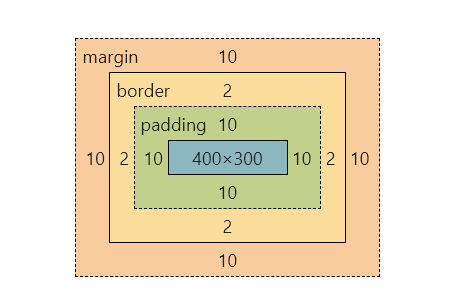
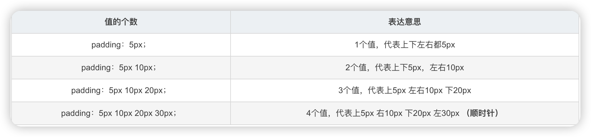
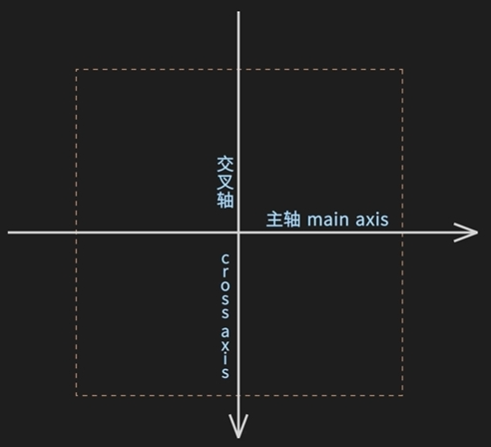
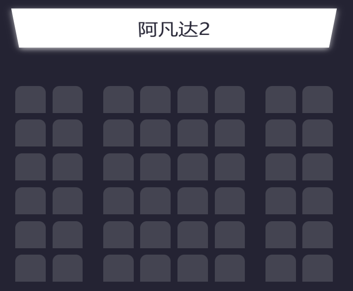

# CSS (Cascading Style Sheets) 层叠样式表 

[TOC]


# 1.简介

一种用于网页设计的样式表语言。它用于控制 HTML 或 XML 文档的视觉表现，包括布局、颜色、字体等，使网页的内容与样式分离。

语法：

```css
p
{
    color:red;
    text-align:center;
}

/* 这是一个注释 */
```

文档流：

文档流（Document Flow）是 HTML 元素在页面中自然排列的方式，指的是元素在页面上的默认位置和布局规则。浏览器会根据标准的 HTML 结构和 CSS 样式规则来排列页面中的元素。

- **块级元素**：在文档流中，块级元素（如 `<div>`、`<h1>`、`<p>` 等）会独占一行，默认宽度是父容器的 100%，下一个元素会从它的下方开始排列。
- **行内元素**：行内元素（如 `<span>`、`<a>`、`<strong>` 等）不会独占一行，而是与其他行内元素或文本内容并列在同一行。
- **浮动元素**：使用 `float` 属性的元素会脱离文档流，其他元素会根据浮动元素的布局重新调整位置。


# 2.基础样式

## 2.1.选择器

### id选择器

```css
#para1 {
    text-align:center;
    color:red;
}
```


### class选择器

```css
.address {
    text-align:center;
    color:#ff0000;
}

/* 可以指定是什么元素的类 */
p.address {
    text-align:center;
}
```


### 通用选择器

```css
* {
  margin: 0;
  padding: 0;
}
```


### 组合选择器

```css
/* 
1.后代选择器 
选择某个元素内的所有特定子元素。写法是两个元素选择器之间不加任何符号。
上例会选中所有在 <div> 内部的 <p> 元素。
*/

div p {
  color: red;
}

/* 
2.子元素选择器
选中直接子元素，使用 > 表示。
上例会选中所有直接位于 <ul> 内的 <li> 元素，并去除列表样式。
*/

ul > li {
  list-style: none;
}

/*
3.相邻兄弟选择器
选择紧邻目标元素之后的兄弟元素，使用 + 表示。
*/

h2 + p {
  margin-top: 10px;
}

/*
4.组合选择器
任意元素可以用,链接组合
*/
#p1, .zh {
  font-size: small;
  color: pink;
}

/* 
5.属性选择器
根据属性名和属性值进行选择。
如下代码，input[type="text"] 选择器将选择所有 type 属性为 "text" 的 <input> 元素。
*/
input[type="text"] {
  border: 1px solid gray;
}
```


### 伪类选择器

```css
a:link {
    color:#FF0000;
} /* 未访问的链接 */

a:visited {
    color:#00FF00;
} /* 已访问的链接 */

a:hover {
    color:#FF00FF;
} /* 鼠标划过链接 */

a:active {
    color:#0000FF;
} /* 已选中的链接 */

input:focus {
    border: 1px solid green;
} /* 当元素获得焦点时（如输入框被点击时）应用样式 */

input:checked {
    background-color: yellow;
} /* 用于选中状态的表单元素（如复选框和单选按钮）。*/

p:first-child {
    font-weight: bold;
}

p:last-child {
    color: red;
}

li:nth-child(2) {
    color: green;
}

```

**伪元素**：

| 选择器                                                       | 示例             | 示例说明                                                     |
| :----------------------------------------------------------- | :--------------- | :----------------------------------------------------------- |
| [:link](https://www.runoob.com/cssref/sel-link.html)         | a:link           | 选择所有未访问链接                                           |
| [:visited](https://www.runoob.com/cssref/sel-visited.html)   | a:visited        | 选择所有访问过的链接                                         |
| [:active](https://www.runoob.com/cssref/sel-active.html)     | a:active         | 选择正在活动链接                                             |
| [:hover](https://www.runoob.com/cssref/sel-hover.html)       | a:hover          | 把鼠标放在链接上的状态                                       |
| [:focus](https://www.runoob.com/cssref/sel-focus.html)       | input:focus      | 选择元素输入后具有焦点                                       |
| [:first-letter](https://www.runoob.com/cssref/sel-firstletter.html) | p:first-letter   | 选择每个<p> 元素的第一个字母                                 |
| [:first-line](https://www.runoob.com/cssref/sel-firstline.html) | p:first-line     | 选择每个<p> 元素的第一行                                     |
| [:first-child](https://www.runoob.com/cssref/sel-firstchild.html) | p:first-child    | 选择器匹配属于任意元素的第一个子元素的 <p> 元素              |
| :nth-child(n)                                                | div:nth-child(n) | 选择父元素的第 N 个子元素。它允许你通过数学表达式来选择特定的子元素。这个伪类可以接受多种形式的参数。 |
| [::before](https://www.runoob.com/cssref/sel-before.html)    | p::before        | 其将成为匹配选中的元素的第一个子元素。常通过content属性来为一个元素添加修饰性的内容。此元素默认为行内元素。 |
| [::after](https://www.runoob.com/cssref/sel-after.html)      | p::after         | 用来创建一个伪元素，作为已选中元素的最后一个子元素。通常会配合content属性来为该元素添加装饰内容。这个虚拟元素默认是行内元素。 |
| [:lang(*language*)](https://www.runoob.com/cssref/sel-lang.html) | p:lang(it)       | 为<p>元素的lang属性选择一个开始值                            |


## 2.2.背景

- **background-attachment**：背景图像是否固定或者随着页面的其余部分滚动。

  - **fixed**

- **background-color**：

  - **\#000000**：十六进制
  - **black**：名称
  - **rgb(0,0,0)**：RGB

- **background-image**：

  - **url(‘ ’)**

  - **linear-gradient**：线性渐变

    - **(direction, color-stop1, color-stop2, ...);**

      ```css
      #grad {
        height: 200px;
        background-image: linear-gradient(to bottom right, red, yellow, green);
      }
      ```

      

  - **radial-gradient**：径向渐变

    - **(shape size at position, start-color, ..., last-color);**

      ```css
      #grad {
        background-image: radial-gradient(circle, red 5%, yellow 15%, green 60%);
      }
      ```

      

- **background-position**：

  | 值                                                           | 描述                                                         |
  | :----------------------------------------------------------- | :----------------------------------------------------------- |
  | left top left center left bottom right top right center right bottom center top center center center bottom | 如果仅指定一个关键字，其他值将会是"center"                   |
  | *x% y%*                                                      | 第一个值是水平位置，第二个值是垂直。左上角是0％0％。右下角是100％100％。如果仅指定了一个值，其他值将是50％。 。默认值为：0％0％ |
  | *xpos ypos*                                                  | 第一个值是水平位置，第二个值是垂直。左上角是0。单位可以是像素（0px0px）或任何其他 [CSS单位](https://www.runoob.com/try/css-units.html)。如果仅指定了一个值，其他值将是50％。你可以混合使用％和positions |
  | inherit                                                      | 指定background-position属性设置应该从父元素继承              |

- **background-repeat**：设置背景图像是否及如何重复。

  - **repeat-x**
  - **repeat-y**
  - **no-repeat**
  
- **background-origin**：指定了背景图像的位置区域

  - 

- **background-clip**：剪裁属性是从指定位置开始绘制

```css
body {
    background-image: url('paper.gif');
    background-repeat: repaet-x;
    background-origin: content-box;
}
```


## 2.3.文字

### 文本

- **color**
- **direction**
  - **ltr**：默认
  - **rtl**：right-to-left
- **text-align**：对齐方式
  - **center**
  - **left**
  - **right**
- **text-decoration**：线
  - **overline**
  - **line-through**
  - **underline**
- **text-transform**：大小写
  - **uppercase**
  - **lowercase**
  - **capitalize**
- **text-indent**：首行缩进，**word-spacing**：字间距，**letter-spacing**：字符间距
  - 20px
- **line-height**：行高
  - 默认110%-120%
- **text-shadow**：文本阴影
  - **x, y, color**

```css
p{
    color: black;
    text-align: center;
    text-decoration: line-through;
    text-transform: uppercase;
    text-indent: 30px;
    line-height: 120%;
    text-shadow: 10px 10px red;
}
```


### 字体

- **font-family**：字体系列

  | Generic family | 字体系列        | 说明                                        |
  | :------------- | :-------------- | :------------------------------------------ |
  | Serif          | Times New Roman | Serif字体中字符在行的末端拥有额外的装饰     |
  | Sans-serif     | Arial           | "Sans"是指无 - 这些字体在末端没有额外的装饰 |
  | Monospace      | Lucida Console  | 所有的等宽字符具有相同的宽度                |

  - **“Times New Roman”**
  - **serif**，**sans-serif**，**monospace**

- **font-style**：样式

  - **normal**
  - **italic**

- **font-size**：大小

  - **10px**

- **font-weight**：粗细

  - **normal**  400
  - **bold**  700
  - **100**

```css
p{
    font-family: "宋体", sans-serif;
    font-style: italic;
    font-size: 15px;
    font-weight: bold;
}
```


### 列表

- **list-style-type**
  - **none**：消除小标记
  - **square**
  - **circle**
  - **upper-roman**：大写罗马
  - **lower-alpha**：小写希腊
- **list-style-position**
  - **inside**
  - **outside**
- **list-style-image**
  - **url(‘ ’)**

```css
ul {
    list-style-type: circle;
    list-style-position: outside;
	list-style-image:url('sqpurple.gif');
}
```


### 表格

**table**，**th**，**td**都可以设置的属性：

- **border**：**px  border-style  color**
  - **border-style**
    - **dashed**：虚线边框
    - **solid**：实线边框
    - **dotted**：点边框
    - **double**：双实线
    - **groove**：沟槽边框
    - **ridge**：脊边框
    - **inside**：嵌入边框
    - **outside**：突出边框
- **width**
  - **100%**
- **height**
  - **10px**

```css
table {
    border-collapse: collapse;  /* 设置表格的边框是否被折叠成一个单一的边框或隔开 */
    width: 100%;
}
th {
    height: 50px;
    background-color: green;
	color: white;
}
td {
    text-align: right;
    vertical-align: bottom;     /* 垂直校准 */
}
table, th, td {
    border: 1px solid green;
}
```


## 2.4.布局

### display属性

#### 1. **`block`**

- 元素以块级元素形式显示，占据父元素的整个水平空间，默认换行。
- 块级元素通常用于构建页面的大结构，比如 `<div>`, `<h1>` 到 `<h6>`, `<p>`, `<section>` 等。

```css
div {
    display: block;
}
```

#### 2. **`inline`**

- 元素以内联元素形式显示，只占据它所需的内容宽度，不会换行。
- 常见的内联元素包括 `<span>`, `<a>`, `<strong>`, `<em>` 等。

```css
span {
    display: inline;
}
```

#### 3. **`inline-block`**

- 元素像内联元素一样排列在同一行，但像块级元素一样可以设置宽度和高度。
- 它适用于既希望元素保持内联排列，又需要它有块级属性（如宽度、边距等）的情况。

```css
.inline-block-item {
    display: inline-block;
    width: 100px;
    height: 50px;
}
```

#### 4. **`none`**

- 元素不显示，不占据任何空间，相当于从页面中被移除了。

```css
.hidden {
    display: none;
}
```

#### 5. **`flex`**

- 将元素定义为弹性盒子容器，使其子元素成为弹性盒子项，按照弹性盒子布局规则排列。

```css
.container {
    display: flex;
}
```

#### 6. **`inline-flex`**

- 与 `flex` 相同，但容器本身是内联元素，容器仍会按照内联元素的方式显示，但其子元素按照弹性盒子布局排列。

```css
.container {
    display: inline-flex;
}
```

#### 7. **`grid`**

- 将元素定义为网格容器，使其子元素按照网格布局排列。

```css
.grid-container {
    display: grid;
}
```

#### 8. **`inline-grid`**

- 与 `grid` 相同，但容器本身是内联元素。

```css
.grid-container {
    display: inline-grid;
}
```

#### 9. **`table`**

- 元素将表现得像表格，类似 HTML 中的 `<table>` 元素。

```css
.table {
    display: table;
}
```

#### 10. **`list-item`**

- 元素将表现得像列表项，类似 HTML 中的 `<li>` 元素，通常会带有项目符号。

```css
li {
    display: list-item;
}
```


### 盒子模型

盒子模型是网页设计中经常用到的一种思维模型，由四个部分构成，从内到外分别为内容区（content）、内边距（padding）、边框（border）和外边距（margin），CSS 为这四个部分提供了一系列相关属性，通过对这些属性的设置可以丰富盒子的表现效果。



```css
div {
	background-color: pink;
	width: 250px;
	border: 25px solid deeppink;
	padding: 25px;
	margin: auto;
}
```

属性：

- **box-shadow**：盒阴影

#### 宽度width

- width就是这个区块的总宽度

#### 外边距margin

- 盒子的外边距，是透明的只能设置他的边距

```
margin-top：上边距
margin-buttom：下边距
margin-left：左边距
margin-right：右边距
```

#### 内边距padding

- padding不是只能完全透明的，可以设置背景颜色和图片

```
padding-top：上部填充
padding-bottom：下部填充
padding-left：左部填充
padding-right：右部填充
```



#### 边框border

- border表示盒子的边界，它可以设置成可见的，样式多样的。
- border像margin和padding一样可以分别对每一条边进行设置。

~~~HTML
border-top：上边界
border-bottom：下边界
border-left：左边界
border-right：右边界
~~~

属性：

- **boder-style**
- **border-radius**：圆角，边界半径
- **border-image**：边界图形

### 定位

- **position**：

  - **static**：默认值，元素按照文档流正常排列。
  - **relative**：相对定位，元素仍在文档流中，但可以通过 `top`、`right`、`bottom`、`left` 属性相对于其正常位置进行偏移。
  - **absolute**：绝对定位，元素完全脱离文档流，相对于其最近的有定位（非 `static`）的父元素进行定位。如果没有这样的父元素，则相对于浏览器窗口进行定位。
  - **fixed**：固定定位，元素相对于浏览器窗口进行定位，通常用于制作固定头部或导航栏。即使页面滚动，元素也不会移动。
  - **sticky**：粘性定位，元素在一定条件下相对于文档流是固定的，但在其他情况下则是相对定位的。通常用于制作在页面滚动到某个位置时变为固定的元素。

  ```css
  .father {
      position: absolute;
      width: 500px;
      height: 500px;
      background-color: pink;
  }
  
  .son {
      position: absolute;
      left: 30px;
      bottom: 0;
      width: 200px;
      height: 200px;
      background-color: blue;
  }
  ```

  ```html
  <div class="father">
      <div class="son">
          
      </div>
  </div>
  ```

  


### 溢出

- **overflow**：当元素的内容溢出其区域时发生的事情。

  | 值      | 描述                                                     |
  | :------ | :------------------------------------------------------- |
  | visible | 默认值。内容不会被修剪，会呈现在元素框之外。             |
  | hidden  | 内容会被修剪，并且其余内容是不可见的。                   |
  | scroll  | 内容会被修剪，但是浏览器会显示滚动条以便查看其余的内容。 |
  | auto    | 如果内容被修剪，则浏览器会显示滚动条以便查看其余的内容。 |
  | inherit | 规定应该从父元素继承 overflow 属性的值。                 |


### 浮动

- **float**：元素在设置 `float` 后，会脱离文档流，后续元素会围绕它排列，但不会完全占据其位置。
  - **left**
  - **right**
  - **none**
- **clear**：属性用于清除浮动效果，常用在浮动元素后面的元素上，确保它们不会受到浮动元素的影响。

  - `clear: left`：元素不会靠近左侧的浮动元素。
  - `clear: right`：元素不会靠近右侧的浮动元素。
  - `clear: both`：元素不会靠近左右两边的浮动元素。


清除浮动的法方：

1. 

```css
.one, .two {
    float: left
}

.clear {
    clear: both
}
```

```html
<div class="box">
    <div class="one"></div>
    <div class="two"></div>
    <div class="clear"></div>
</div>
```

2. 

```css
.clearfix {
    display: block;
    content: "";
    height: 0;
    visibility: hidden;
    clear: both;
}
```

```html
<div class="box clearfix">
    <div class="one"></div>
    <div class="two"></div>
</div>
```

3. 

```css
.clearfix:before, .clearfix:after {
    content:"";
    display: table;
}

.clearfix:after {
    clear: both;
}

.clearfix {
    *zoom: 1;
}
```


### 对齐

- **居中对齐**

要水平居中对齐一个元素(如 **< div>**), 可以使用 **margin: auto;**。设置到元素的宽度将防止它溢出到容器的边缘。元素通过指定宽度，并将两边的空外边距平均分配。

```css
.center {
    margin: auto;
    width: 50%;
    border: 3px solid green;
    padding: 10px;
}

img {
    display: block;
    margin: auto;
    width: 40%;
}
```

**注意**: 如果没有设置 width 属性(或者设置 100%)，居中对齐将不起作用。


- **左右对齐**

使用定位position

```css
.right {
    position: absolute;
    right: 0px;
    width: 300px;
    border: 3px solid #73AD21;
    padding: 10px;
}
```

设置浮动float

```css
.right {
    float: right;
    width: 300px;
    border: 3px solid #73AD21;
    padding: 10px;
}
```


### 弹性盒子flex

一种当页面需要适应不同的屏幕大小以及设备类型时确保元素拥有恰当的行为的布局方式。

- **display: flex**

- **flex-direction**：决定主轴的方向（子项排列方向）一般不用。

  - `row`: 默认值，水平排列（从左到右）。
  - `row-reverse`: 水平反转排列（从右到左）。
  - `column`: 垂直排列（从上到下）。
  - `column-reverse`: 垂直反转排列（从下到上）。

  

- **justify-content**：沿主轴方向（水平或垂直）对齐子项。

  - `flex-start`: 主轴前对齐。
  - `flex-end`: 主轴后对齐。
  - `center`: 主轴居中对齐。
  - `space-between`: 子项等距，首尾贴紧容器。
  - `space-around`: 子项之间和周围均匀分布。
  - `space-evenly`: 子项与容器边缘都等距。

- **align-items**：沿交叉轴（与**主轴垂直方向**）对齐子项。

  - `stretch`: 默认值，子项将被拉伸以适应容器。
  - `flex-start`: 交叉轴起始位置对齐。
  - `flex-end`: 交叉轴末端对齐。
  - `center`: 居中对齐。
  - `baseline`: 根据文字基线对齐。

- **flex-wrap**: 决定子项是否换行。

  - `nowrap`: 默认值，不换行。
  - `wrap`: 子项超出容器宽度时换行。
  - `wrap-reverse`: 反方向换行。

- **align-content**：多行项目在交叉轴上的对齐方式

  - `stretch`: 默认值，子项将被拉伸以适应容器。
  - `flex-start`: 主轴前对齐。
  - `flex-end`: 主轴后对齐。
  - `center`: 主轴居中对齐。
  - `space-between`: 子项等距，首尾贴紧容器。
  - `space-around`: 子项之间和周围均匀分布。


### 网格gird


- **display: grid**

- **grid-template-columns**：定义列的数量和宽度。

  ```css
  grid-template-columns: 100px 200px auto; /* 指定不同列的宽度 */
  ```

- **grid-template-rows**：定义行的数量和高度。

  ```css
  grid-template-rows: 50px 100px; /* 指定不同行的高度 */
  ```

- **grid-template-areas**：为网格区域命名，方便布局。

  ```css
  grid-template-areas:
    "header header header"
    "sidebar content content"
    "footer footer footer";
  ```

- **grid-gap**：定义行和列之间的间距。

  ```css
  grid-gap: 10px; /* 行和列间距 */
  grid-column-gap: 10px;
  grid-row-gap: 10px;
  
  ```

- **grid-auto-flow**：指定项目在网格中的排列方式。

  ```css
  grid-auto-flow: row; /* 默认是行 */
  ```

#### 

- **grid-column**：设置项目所占的列。

  ```css
  grid-column: 1 / 3; /* 从第一列到第二列 */
  ```

- **grid-row**：设置项目所占的行。

  ```css
  grid-row: 1 / 2; /* 占据第一行 */
  ```

- **grid-area**：简写属性，可以同时设置行和列。

  ```css
  grid-area: header; /* 使用命名的网格区域 */
  grid-area: 1 / 2 / 3 / 4; /* 使用网格的行和列的行号来定义网格区域 row-start / column-start / row-end / column-end */
  ```


## 2.5.自定义属性

自定义属性（有时候也被称作CSS 变量或者级联变量）是由 CSS 作者定义的，它包含的值可以在整个文 档中重复使用。由自定义属性标记设定值（比如：  值（比如：  color: var(--main-color); ）。

**基本用法**

声明一个自定义属性，属性名需要以两个减号（--）开始，属性值则可以是任何有效的 CSS 值。和其他 属性一样，自定义属性也是写在规则集之内的，如下：

```css
element {
	--main-bg-color: brown;
}
element {
 	background-color: var(--main-bg-color);
}
```

注意，规则集所指定的选择器定义了自定义属性的可见作用域。通常的最佳实践是定义在根伪类  :root  下，这样就可以在 HTML 文档的任何地方访问到它了：

```css
:root {
    --main-bg-color: brown;
}
```


# 3.高级样式

## 3.1转换


```css
div {
	transform: rotate(45deg);
	transform-origin:20% 40%;
}
```


**2D 转换方法**

| 函数                            | 描述                                     |
| :------------------------------ | :--------------------------------------- |
| matrix(*n*,*n*,*n*,*n*,*n*,*n*) | 定义 2D 转换，使用六个值的矩阵。         |
| translate(*x*,*y*)              | 定义 2D 转换，沿着 X 和 Y 轴移动元素。   |
| translateX(*n*)                 | 定义 2D 转换，沿着 X 轴移动元素。        |
| translateY(*n*)                 | 定义 2D 转换，沿着 Y 轴移动元素。        |
| scale(*x*,*y*)                  | 定义 2D 缩放转换，改变元素的宽度和高度。 |
| scaleX(*n*)                     | 定义 2D 缩放转换，改变元素的宽度。       |
| scaleY(*n*)                     | 定义 2D 缩放转换，改变元素的高度。       |
| rotate(*angle*)                 | 定义 2D 旋转，在参数中规定角度。         |
| skew(*x-angle*,*y-angle*)       | 定义 2D 倾斜转换，沿着 X 和 Y 轴。       |
| skewX(*angle*)                  | 定义 2D 倾斜转换，沿着 X 轴。            |
| skewY(*angle*)                  | 定义 2D 倾斜转换，沿着 Y 轴。            |


**3D 转换方法**

| 函数                                                         | 描述                                      |
| :----------------------------------------------------------- | :---------------------------------------- |
| matrix3d(*n*,*n*,*n*,*n*,*n*,*n*, *n*,*n*,*n*,*n*,*n*,*n*,*n*,*n*,*n*,*n*) | 定义 3D 转换，使用 16 个值的 4x4 矩阵。   |
| translate3d(*x*,*y*,*z*)                                     | 定义 3D 转化。                            |
| translateX(*x*)                                              | 定义 3D 转化，仅使用用于 X 轴的值。       |
| translateY(*y*)                                              | 定义 3D 转化，仅使用用于 Y 轴的值。       |
| translateZ(*z*)                                              | 定义 3D 转化，仅使用用于 Z 轴的值。       |
| scale3d(*x*,*y*,*z*)                                         | 定义 3D 缩放转换。                        |
| scaleX(*x*)                                                  | 定义 3D 缩放转换，通过给定一个 X 轴的值。 |
| scaleY(*y*)                                                  | 定义 3D 缩放转换，通过给定一个 Y 轴的值。 |
| scaleZ(*z*)                                                  | 定义 3D 缩放转换，通过给定一个 Z 轴的值。 |
| rotate3d(*x*,*y*,*z*,*angle*)                                | 定义 3D 旋转。                            |
| rotateX(*angle*)                                             | 定义沿 X 轴的 3D 旋转。                   |
| rotateY(*angle*)                                             | 定义沿 Y 轴的 3D 旋转。                   |
| rotateZ(*angle*)                                             | 定义沿 Z 轴的 3D 旋转。                   |
| perspective(*n*)                                             | 定义 3D 转换元素的透视视图。              |


| 属性                                                         | 描述                                 | CSS  |
| :----------------------------------------------------------- | :----------------------------------- | :--- |
| [transform](https://www.runoob.com/cssref/css3-pr-transform.html) | 向元素应用 2D 或 3D 转换。           | 3    |
| [transform-origin](https://www.runoob.com/cssref/css3-pr-transform-origin.html) | 允许你改变被转换元素的位置。         | 3    |
| [transform-style](https://www.runoob.com/cssref/css3-pr-transform-style.html) | 规定被嵌套元素如何在 3D 空间中显示。 | 3    |
| [perspective](https://www.runoob.com/cssref/css3-pr-perspective.html) | 规定 3D 元素的透视效果。             | 3    |
| [perspective-origin](https://www.runoob.com/cssref/css3-pr-perspective-origin.html) | 规定 3D 元素的底部位置。             | 3    |
| [backface-visibility](https://www.runoob.com/cssref/css3-pr-backface-visibility.html) | 定义元素在不面对屏幕时是否可见。     | 3    |


## 3.2过渡

```css
.gramma {
    transition: property duration timing-function delay;
}

.item {
    transition: color 0.3s ease-in-out;
}
```


| 属性                                                         | 描述                                         | CSS  |
| :----------------------------------------------------------- | :------------------------------------------- | :--- |
| [transition](https://www.runoob.com/cssref/css3-pr-transition.html) | 简写属性，用于在一个属性中设置四个过渡属性。 | 3    |
| [transition-property](https://www.runoob.com/cssref/css3-pr-transition-property.html) | 规定应用过渡的 CSS 属性的名称。              | 3    |
| [transition-duration](https://www.runoob.com/cssref/css3-pr-transition-duration.html) | 定义过渡效果花费的时间。默认是 0。           | 3    |
| [transition-timing-function](https://www.runoob.com/cssref/css3-pr-transition-timing-function.html) | 规定过渡效果的时间曲线。默认是 "ease"。      | 3    |
| [transition-delay](https://www.runoob.com/cssref/css3-pr-transition-delay.html) | 规定过渡效果何时开始。默认是 0。             | 3    |


## 3.3动画

```css
.gramma {
    animation: name duration timing-function delay iteration-count direction fill-mode play-state;
}

@keyframes mymove
{
from {top:0px;}
to {top:200px;}
}

.item {
    animation: mymove 36.5s linear infinite;
}

```


| 属性                                                         | 描述                                                         | CSS  |
| :----------------------------------------------------------- | :----------------------------------------------------------- | :--- |
| [@keyframes](https://www.runoob.com/cssref/css3-pr-animation-keyframes.html) | 规定动画。                                                   | 3    |
| [animation](https://www.runoob.com/cssref/css3-pr-animation.html) | 所有动画属性的简写属性。                                     | 3    |
| [animation-name](https://www.runoob.com/cssref/css3-pr-animation-name.html) | 规定 @keyframes 动画的名称。                                 | 3    |
| [animation-duration](https://www.runoob.com/cssref/css3-pr-animation-duration.html) | 规定动画完成一个周期所花费的秒或毫秒。默认是 0。             | 3    |
| [animation-timing-function](https://www.runoob.com/cssref/css3-pr-animation-timing-function.html) | 规定动画的速度曲线。默认是 "ease"。                          | 3    |
| [animation-fill-mode](https://www.runoob.com/cssref/css3-pr-animation-fill-mode.html) | 规定当动画不播放时（当动画完成时，或当动画有一个延迟未开始播放时），要应用到元素的样式。 | 3    |
| [animation-delay](https://www.runoob.com/cssref/css3-pr-animation-delay.html) | 规定动画何时开始。默认是 0。                                 | 3    |
| [animation-iteration-count](https://www.runoob.com/cssref/css3-pr-animation-iteration-count.html) | 规定动画被播放的次数。默认是 1。                             | 3    |
| [animation-direction](https://www.runoob.com/cssref/css3-pr-animation-direction.html) | 规定动画是否在下一周期逆向地播放。默认是 "normal"。          | 3    |
| [animation-play-state](https://www.runoob.com/cssref/css3-pr-animation-play-state.html) | 规定动画是否正在运行或暂停。默认是 "running"。               | 3    |


# 4.技巧


## 水平垂直居中

```html
<div class="banner">
  
  
</div>

```


```css
.banner {
  position: relative;
  height: 960px;             /* 示例高度 */
}

.banner-bg {
  position: absolute;         /* 背景图绝对定位 */
  object-fit: cover;         /* 保持图像比例并填充父元素 */
}

.banner-title {
  position: absolute; 
  top: 50%;                  /* 上边距为 50% */
  left: 50%;                 /* 左边距为 50% */
  transform: translate(-50%, -50%); /* 将元素中心移至父元素中心 */
  z-index: 1;                /* 将标题提升到最上层 */
}

```


## :nth-child()

**基本语法：**

```css
:nth-child(n)
```

- `n` 是一个表达式，表示子元素的位置，可以是数字、关键词（odd, even…），甚至是包含 `n` 的公式（n从0开始）。

```html
<div class="seat-area">
    <div class="seat"></div> * 48个
</div>
```

```css
.seat-area {
  padding-top: 50px;
  display: grid;  /* 从左往右排列 */
  grid-template-columns: repeat(8, 1fr);
  grid-template-rows: repeat(6, 1fr);
  gap: 10px;
}

.seat:nth-child(4n+3){
  margin-left: 20px;
}
```




## 实现width: 100%

```html
<div class="container">
    <div class="box1">
        box1
    </div>
	<div class="box2">
        box2
    </div>
</div>
```

```css
.container {
	position: relative;
}

.box2 {
    position: absolute;
    left: 0;
    right: 0;
}
```


## JS 修改 CSS

```js
element.style.getPropertyValue("class")
element.style.setProperty("class", 'test')
element.style.removeProperty('class')

element.classList.add("class")
element.classList.remove("plug")
```


