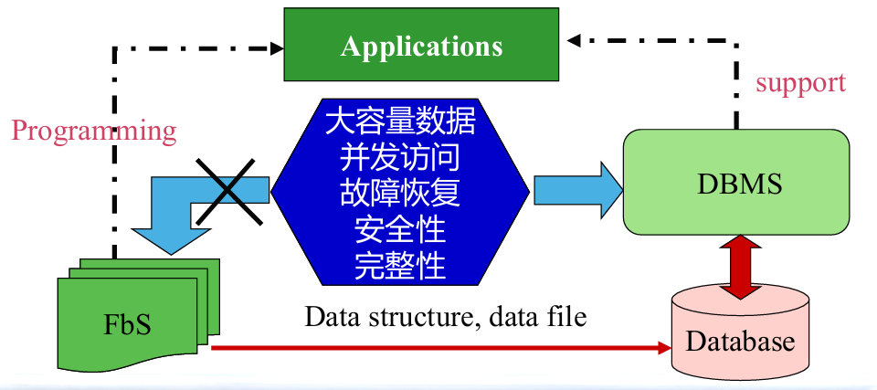
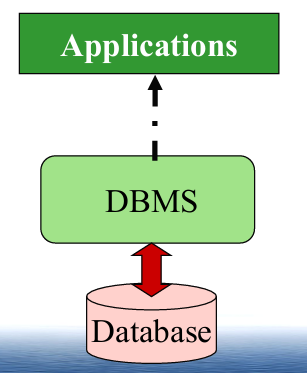
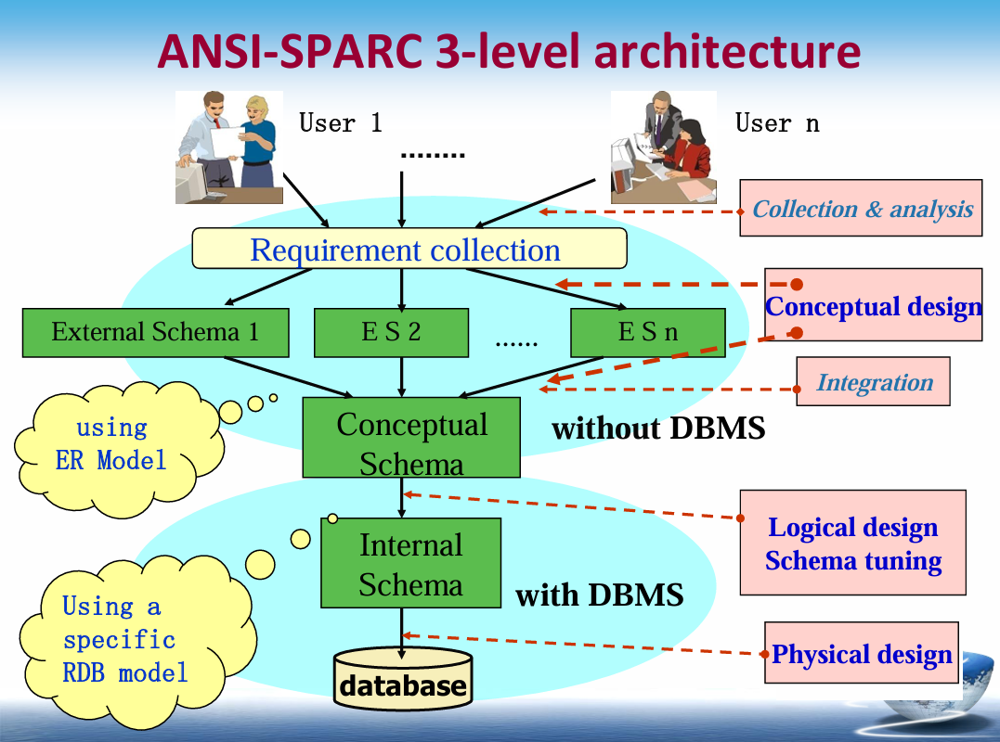
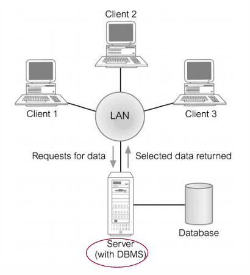
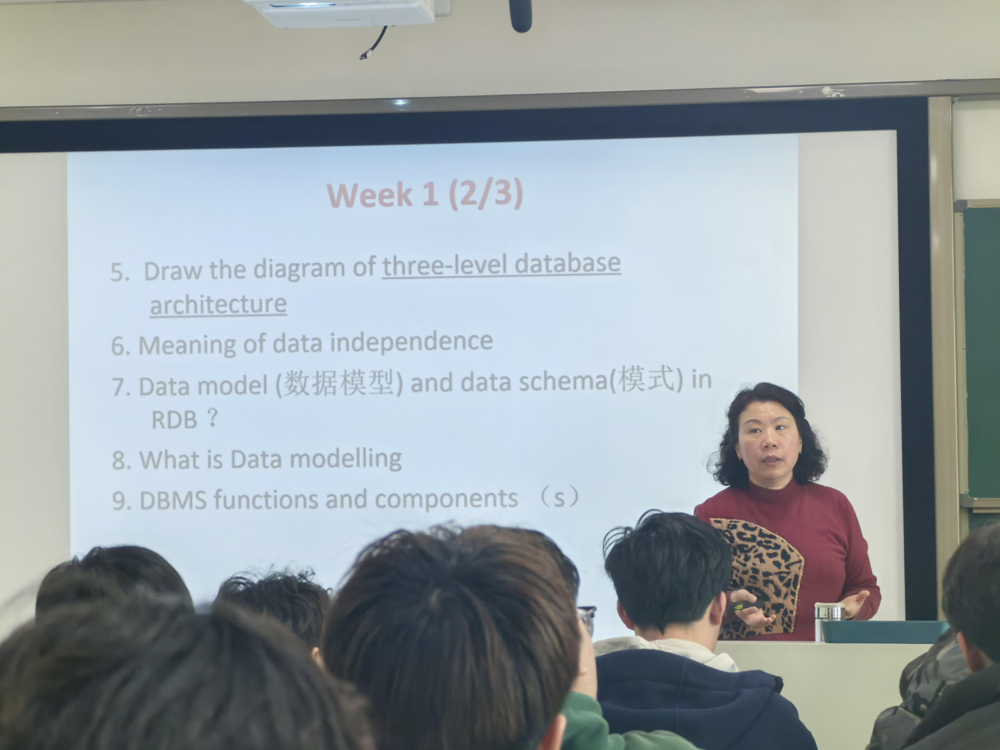
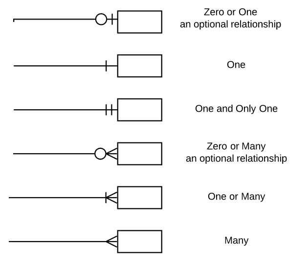
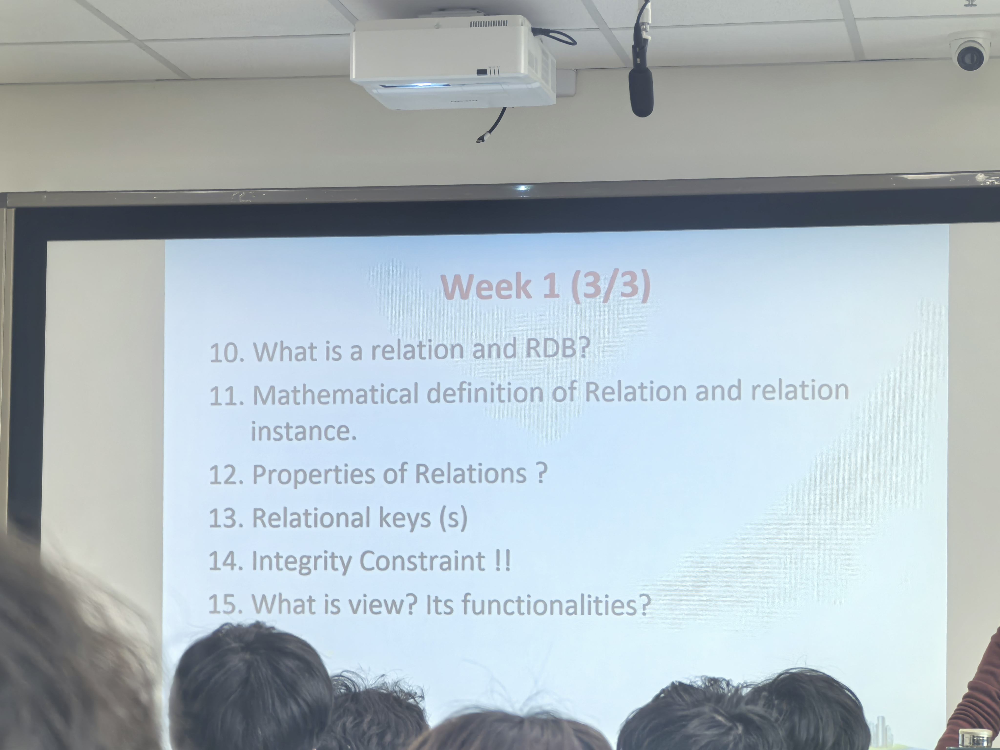
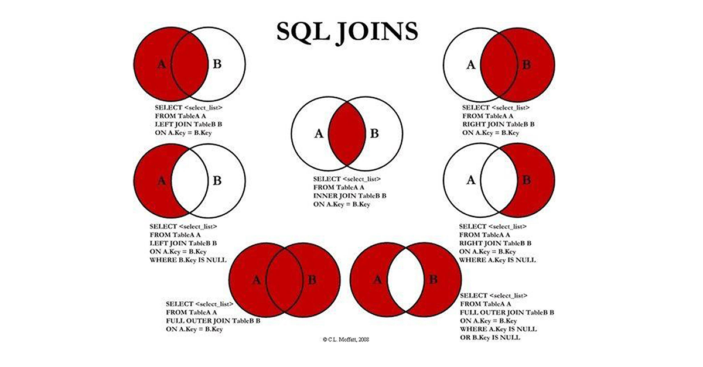
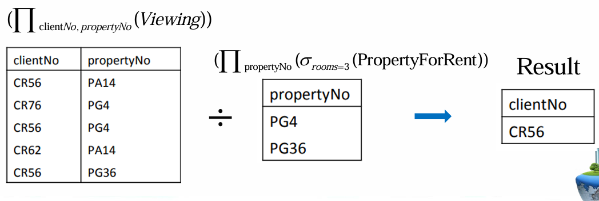

# Database


[TOC]


# 1.Introduction


## 1.1.File-based System

**文件系统 FBS 与 数据库系统 DB 的对比**

- **文件系统**：
  - 定义：一系列应用程序，为终端用户提供服务，如生成报告。Each  program defines and manages its own data. 每个程序定义和管理自己的数据。
  - 例子：销售文件、租赁合同、客户信息等。
  - 局限性：
    - Big volume 数据量大：无法处理大量数据（TB、PB、EB）。32位计算机上单个文件不超过4GB（2^32），64位计算机上为16TB。
    - Concurrent Access 并发访问：多个用户同时访问时无效。
    - Data integrity issue 数据完整性问题：duplication of data 数据重复，修改一个文件中的数据可能导致另一个文件中的数据错误。
    - Program-data dependence 程序与数据的依赖性。
    - Ad-hoc queries are not welcome. 临时查询不受欢迎。
    - Data security 数据安全：不同用户的授权。
    - Crash recovery 故障恢复。



## 1.2.Database

**数据库方法** **Database Approach**

- 起因：数据定义嵌入在应用程序中，而不是独立存储。数据的访问和操作控制仅由应用程序施加。
- 结果：数据库和数据库管理系统（DBMS）的诞生。

**数据库的定义**

- 数据库：Shared collection of logically related data (and a  description of this data), designed to meet the  information needs of an organization.  一个组织内逻辑相关的数据（及其描述）的共享集合，旨在满足组织的信息需求。

- System catalog (**metadata**) 系统目录（元数据）：提供数据描述，实现程序与数据的独立性  program–data independence。

  > **Metadata** ，即**元数据** ，是一种非常重要的数据类型，它用于**描述其他数据的特征、属性和结构** ，以便更好地理解、管理、检索和利用数据。以下是关于 metadata 的详细介绍：
  >
  > - **狭义定义** ：元数据是关于数据的数据。例如，一本电子书的文件大小、格式、作者、出版日期等信息就是该电子书数据的元数据。
  > - **广义定义** ：它涵盖了对各种数据对象的描述，包括但不限于数据的内容、质量、条件、其他数据的来源、数据的结构等。

- 逻辑相关的数据：包括实体、属性和组织信息之间的关系。

**数据库的优势**

- Data independence 数据独立性
- Efficient data access 高效的数据访问
- Data integrity(consistency) and security 数据完整性（一致性）和安全性
- Redundancy management 冗余管理
- Concurrent access and Crash recovery 并发访问和故障恢复
- Reduced application development time 减少应用程序开发时间
- Persistent storage 持久存储

## 1.3.Database Management System (DBMS)

**数据库管理系统**

- 定义：使用户能够定义、创建、维护和控制数据库访问的软件系统 software system。
- 数据库应用程序：与数据库交互的计算机程序，通过向DBMS发出适当的请求（SQL语句）。



**DBMS的历史**

- 1960年代中期：IDS（GE）、IMS（IBM）。
- 1973年：**C. Bachman**因**网络DBMS**（IDS）获得图灵奖。
- 1970年：E. Codd（IBM）提出关系数据模型，被誉为关系**数据库之父**。
- 1981年：**E. Codd**因**关系数据库**获得图灵奖。
- 1970年代末：IBM的System R项目，产生了SQL语言，并导致了商业RDBMS产品的实现，如DB2、Oracle。
- 1998年：James. Gray获得图灵奖。

- 2022年：全球最受欢迎的数据库管理系统：Oracle、MySQL、Microsoft SQL Server、PostgreSQL、Apache Cassandra。


## 1.4.Structured Query Language (SQL)

- **数据定义语言（DDL - Data Definition Language）**
  - **主要包括的语句** ：CREATE（创建数据库对象）、ALTER（修改数据库对象）、DROP（删除数据库对象）、TRUNCATE（清空表数据）、COMMENT（为数据库对象添加注释）等。
  - **示例** ：`ALTER TABLE students ADD email VARCHAR(100);` 用于在 students 表中添加一个名为 email 的列，数据类型为长度为 100 的字符串。
- **数据操纵语言（DML - Data Manipulation Language）**
  - **主要包括的语句** ：SELECT（查询数据）、INSERT（插入数据）、UPDATE（更新数据）、DELETE（删除数据）等。
  - **示例** ：`SELECT * FROM students ORDER BY age DESC;` 从 students 表中查询所有数据，并按照年龄（age）降序排列。
- **数据控制语言（DCL - Data Control Language）**
  - **主要包括的语句** ：GRANT（授予权限）、REVOKE（收回权限）等。
  - **示例** ：`CREATE USER user2 IDENTIFIED BY 'password';` 创建一个名为 user2 的新用户，密码为 'password'。
- **事务控制语言（TCL - Transaction Control Language）**
  - **主要包括的语句** ：COMMIT（提交事务）、ROLLBACK（回滚事务）、SAVEPOINT（设置保存点）、SET TRANSACTION（设置事务的属性）等。
  - **示例** ：`START TRANSACTION; INSERT INTO students VALUES (2, 'Alice', 22); SAVEPOINT sp1; UPDATE students SET age = 23 WHERE id = 2; ROLLBACK TO sp1;` 这段代码首先开启一个事务，插入一条学生记录，设置一个保存点 sp1，然后更新该学生的年龄，最后回滚到保存点 sp1，撤销更新操作。


## 1.5.Views

- Allows each user to have his or her own view of the database. 允许每个用户有自己的数据库视图。
- **A view is essentially some subset of the database.** 视图本质上是数据库的某个子集。
- Reduce complexity 减少复杂性
- 提供安全级别
- Provide a mechanism to customize the appearance of the database 提供定制数据库外观的机制
- Present a consistent, unchanging picture of the structure of the  database, even if the underlying database is changed 即使底层数据库发生变化，也能呈现一致、不变的数据库结构视图。


# 2.Database Environment


## 2.1.ANSI-SPARC 3-level architecture



- **外部层 External Level**：
  - 用户的数据库视图。**Users’ view** of the database.
  - 描述与特定用户相关的数据库部分。Describes that part of database that is relevant to a  particular user. 
- **概念层 Conceptual Level **：
  - 数据库的社区视图。Community view of the database. 
  - 描述数据库中存储的数据及其关系。Describes what **data** is stored in database and  **relationships among the data**. 
- **内部层 Internal Level **：
  - 数据库在计算机上的物理表示。Physical representation of the database on the computer. 
  - 描述数据在数据库中的存储方式。Describes **how the data is stored in the database**. 


## 2.2.Data Independence

- **逻辑数据独立性 Logical Data Independence**：
  - 指外部模式对概念模式变化的免疫。
  - 概念模式的变化（如实体的添加/删除）不应要求更改外部模式或重写应用程序。
- **物理数据独立性 Physical Data Independence**：
  - 指概念模式对内部模式变化的免疫。
  - 内部模式的变化（如使用不同的文件组织、存储结构/设备）不应要求更改概念或外部模式。


## 2.3.Database Languages


## 2.4.Data Model

**数据模型**

- **定义**：用于描述数据、数据之间的关系以及组织中数据约束的一组概念。Integrated collection of concepts for describing  data , relationships between data constraints on the data , and  in an organization.
- **目的**：以可理解的方式表示数据。
- **类别**：
  - **基于对象的数据模型**：Entity-Relationship (ER) 实体-关系（ER）、语义、功能、面向对象。
  - **基于记录的数据模型**：Relational Data Model（RDB）关系数据模型、网络数据模型、层次数据模型。
  - **物理数据模型**。

**关系数据模型**

- **示例**：
  - **Branch**：
    - Branch No, street, city, postCode
  - **Staff**：
    - Staff No, fName, lName, position, sex, DOB, salary, branchNo

**网络数据模型**

- **网络数据模型**（Bachman, IDS）

**层次数据模型**

- **层次数据模型**（IBM, IMS）


## 2.5.Conceptual Modeling

- **定义**：开发一个独立于实现细节的信息模型的过程。
- **结果**：概念数据模型。
- **概念模式**：支持所有用户视图的系统的核心。
- **应是组织数据需求的完整和准确的表示**。


## 2.6.three-level Architecture Modelling

**DBMS的功能**

- **数据存储、检索和更新 Data Storage, Retrieval, and Update**。
- **用户可访问的系统目录 A User-Accessible System Catalog**。
- **事务支持 Transaction Support**。
- **并发控制服务 Concurrency Control Services**。
- **恢复服务 Recovery Services**。
- **授权服务 Authorization Services**。
- **支持数据通信 Support for Data Communication**。
- **完整性服务 Integrity Services**。
- **促进数据独立性的服务 Services to Promote Data Independence**。
- **实用服务 Utility Services**。


**系统目录 System Catalog**

- **定义**：描述数据库中数据的信息（元数据）的存储库。
- **DBMS的基本组件之一**。
- **通常存储**：
  - 数据项的名称、类型和大小。
  - 数据的约束。
  - 授权用户的名称。
  - 用户可访问的数据项及其访问类型。
  - 使用统计信息。


**DBMS的组件**

- **查询处理器 Query processor**：将查询转换为一系列低级指令，指向数据库管理器。
- **数据库管理器 Database manager（DM）**：与用户提交的应用程序和查询交互。DM检查外部和概念模式，确定满足请求所需的概念记录。DM然后调用文件管理器执行请求。
- **文件管理器 File manager**：操纵底层存储文件，管理磁盘上的存储空间分配。它建立和维护内部模式中定义的结构和索引列表。
- **DML预处理器 DML preprocessor**：将嵌入在应用程序中的DML语句转换为主机语言的标准函数调用。DML预处理器必须与查询处理器交互以生成适当的代码。
- **DDL编译器 DDL compiler**：将DDL语句转换为包含元数据的一组表。这些表存储在系统目录中，而控制信息存储在数据文件头中。
- **目录管理器 Catalog manager**：管理对系统目录的访问并维护系统目录。系统目录被大多数DBMS组件访问。


**数据库管理器的组件**

- **授权控制**：确认用户是否有执行所需操作的必要权限。
- **命令处理器**：在确认用户权限后，控制权传递给命令处理器。
- **完整性检查器**：确保请求的操作满足所有必要的完整性约束（例如键约束）。
- **查询优化器**：确定查询执行的最优策略。
- **事务管理器**：执行从事务接收到的操作。
- **调度器**：确保对数据库的并发操作不会相互冲突。它控制事务操作的执行顺序。
- **恢复管理器**：确保数据库在发生故障时保持一致状态。它负责事务提交和中止。
- **缓冲管理器**：负责在主存储器和二级存储（如磁盘和磁带）之间传输数据。


**DBMS架构**

- **多用户DBMS架构 Multi-User DBMS Architectures**：

  - **远程处理 Teleprocessing**：传统架构，单个大型机连接多个终端。Single mainframe with a number of terminals attached  (directly).

  - **文件服务器架构 File-server **：传统两层客户端-服务器架构。

    

  - **客户端-服务器架构 Client-server**：

    - **两层客户端/服务器 2-tier Client/Server**：客户端提出业务请求，控制事务，显示结果。DBMS服务器处理数据I/O和数据处理。

      

    - **三层客户端/服务器 3-tier Client/Server**：客户端提出业务请求，显示结果。应用服务器控制事务，平衡负载。DBMS服务器处理数据I/O和数据处理。

  - **浏览器/服务器架构 Browser/Server**：客户端通过浏览器提出业务请求，显示结果。Web服务器通过HTTP与应用服务器和DBMS服务器交互。





# 3.Relational Model


## 3.1.Relational Model Terminology

**关系数据模型**

- **发明者**：Edgar Codd（1970年）。
- **Codd的信息原则**：数据库中的所有信息都必须明确地以关系中的值来表示，而不是其他方式。

**关系模型术语**

- **关系 Relation**：一个逻辑结构的表，具有列和行。
- **属性 Attribute**：关系中的命名列。
- **域 Domain**：一个或多个属性的允许值集。
- **元组 Tuple**：关系中的一**行**。
- **度数 Degree**：关系中的属性数量。
- **基数 Cardinality**：关系中的元组数量。
- **关系数据库**：具有不同关系名称的规范化关系的集合。


## 3.2.Relation Definition

**关系模型的数学定义 Mathematical Definition of Relation**

- **笛卡尔乘积**：两个或多个集合的有序对集合。
- **关系**：笛卡尔乘积的子集。

**数据库关系 Database Relations**

- **关系模式 Relation schema**：由属性和域定义的关系名称。Named relation defined by a set of attribute and domain name  pairs.

  > **Rel(A1:D1, A2:D2, A3:D3,…, An:Dn)**,    
  >
  > **Rel**—relation name, **Ai**—ith attribute,   **Ai:Di**—attribute and domain name pairs

- **关系实例 Relation instance**：关系模式的具体实例。

  > **rel-1(a1:d1, a2:d2, a3:d3,…, an:dn), ai∊Ai , di∊Di** 

- **关系型数据库模式 Relational database schema **: Set of relation schemas,  each with a distinct name. 




## 3.3.Properties of Relations

- 关系名称在关系模式中是唯一的 。 (no two same table names)

- 每个单元格包含一个原子值 。 (no more than one value of a certain attribute in one  tuple) 

- 每个属性在表中有一个不同的名称 。

- 一个属性的所有值都来自同一个域 。

- 每个元组是唯一的，没有重复的元组 。

- 关系中的列（即属性）**没有特别的数学顺序**或排名意义；然而，一旦数据库管理系统（DBMS）定义了属性，属性位置顺序就确定了，**不能变动**。

  Columns don’t have any special mathematic order，but  attributes are defined by DBM system, once defined, the  attributes are order-sensitive. 

- 元组（即行）在理论上**没有顺序**。然而，为了**高效地访问数据**，索引（Index）可以定义元组的访问顺序。

  Order of tuples has no significance, theoretically. (index  defines an efficient access order to tuples) .

- 关系是由元组（行）组成的集合。

**Key features of relational tables** 

1. 关系名应该是唯一的：
   - 每个关系（表）都有一个唯一的名字，以便于区分不同的表。
2. 单元格中的值是原子的：
   - 关系表中的每个单元格只能包含一个值，即不允许在同一单元格中存储多个值。这称为原子性。
3. 元组（行）的顺序无关紧要：
   - 在理论上，关系表中的行（元组）的顺序没有任何意义，表中的行是无序的，关系数据库中主要是通过集合来组织数据。
4. 行和列是唯一的：
   - 关系表中的每一行（元组）是唯一的，不应当有重复的元组（行）。每一行代表一个唯一的数据项。例如，在“书籍表”中，B-number（书号）是唯一标识每本书的属性。
5. 列的值没有特别的顺序（没有排名），但属性一旦被定义，顺序变得敏感：
   - 列的值在关系中没有特定的顺序（没有数学上的排名意义），但每个属性的顺序在系统定义后变得重要，一旦定义，列的位置顺序就会被视为有效并且不应随意改变。


## 3.4.Relational Keys 

**关系键**

- **超键（Superkey）**：

  - **定义**：超键是一个或多个属性的集合，能够唯一标识关系中的每一行（元组）。An attribute, or set of attributes , that uniquely identifies a tuple within  a relation.（ no two different tuples have the same values of superkey.）

    超键的特点是，只要它能够唯一标识一个元组，它就可以是超键。一个超键不一定是最小的，可能包含冗余属性。

  - **举例**：假设有一个学生表（Student），其中包含属性：学生ID（StudentID），姓名（Name），和邮箱（Email）。如果“学生ID”和“姓名”一起组成一个超键，那么它可以唯一标识每个学生的记录，尽管"学生ID"本身就可以作为一个超键，"学生ID + 姓名"也可以。

- **候选键（Candidate Key）**：

  - **定义**：候选键是一个超键，但它是**最小的**，即没有冗余的属性。也就是说，候选键中的每个属性都是必要的，移除任何属性后，它就不再是唯一标识元组的超键。
  - **举例**：如果在上述学生表中，"学生ID"本身就能够唯一标识学生，而“学生ID + 姓名”也能唯一标识学生，那么"学生ID"就是一个候选键，因为它是最小的（没有冗余的属性）。“学生ID + 姓名”虽然也是超键，但它不是候选键，因为它包含了冗余属性。

- **主键（Primary Key）**：

  - **定义**：主键是从候选键中选择的一个，用来唯一标识关系中的元组。关系中只能有一个主键，它确保每一行记录的唯一性。
  - **举例**：在学生表中，假设我们选择"学生ID"作为主键，因为它能够唯一标识每一个学生。虽然"学生ID"是候选键，最终我们选它作为主键，来确保每个学生的记录不会重复。

- **替代键（Alternate Key）**：

  - **定义**：替代键是候选键中未被选为主键的那些键。它们依然是能够唯一标识元组的超键，只是没有被选作主键。
  - **举例**：继续以学生表为例，如果"学生ID"被选为主键，那么"邮箱"可能也是一个候选键（能够唯一标识学生），但是因为"学生ID"已经被选为主键，所以"邮箱"就变成了替代键。

- **外键（Foreign Key）**：

  - **定义**：外键是一个关系中的属性，它对应另一个关系中的候选键。外键用于在不同的关系之间建立连接和关联。外键可以是一个属性或一组属性，它们指向其他关系中的主键或候选键。
  - **举例**：假设有一个“课程表”与“学生表”相关联。在“课程表”中，可能有一个属性“学生ID”作为外键，它对应的是“学生表”中的主键“学生ID”。这样，"课程表"中的“学生ID”作为外键，用来表示每门课程与特定学生的关联。

**总结**：

- **超键** 是一个能够唯一标识元组的属性集，可能包含冗余。
- **候选键** 是最小的超键，没有冗余属性。
- **主键** 是从候选键中选出的唯一标识元组的属性。
- **替代键** 是未被选为主键的候选键。
- **外键** 是用来在不同关系之间建立联系的属性，它指向另一个关系的候选键。


## 3.5.Integrity Constraints

**完整性约束**

1. **空值（Null Value）**：
   - **定义**：空值（NULL）表示当前属性值的未知或不适用状态。它与空字符串、零或任何其他实际的值不同。空值表示没有数据，可能是因为信息尚未提供，或者该字段对某些记录来说不相关。
   - **举例**：例如，在一个学生表中，"出生日期"字段可能为空，表示该信息未知或没有提供。在这种情况下，"出生日期"字段的值为NULL。
2. **实体完整性（Entity Integrity）**：
   - **定义**：实体完整性要求基关系（表）中每个记录的主键（Primary Key）值必须是唯一的，并且**主键的任何属性都不能为空**。换句话说，主键不能有NULL值。主键的作用是唯一标识表中的每一行记录，如果主键允许为空，数据库就无法有效地标识每一条记录，导致数据不一致。
   - **举例**：假设在一个“学生表”中，"学生ID"是主键。根据实体完整性要求，"学生ID"字段不能为NULL，否则该记录就无法唯一标识。即每个学生必须有一个唯一且非空的学生ID。
3. **参照完整性（Referential Integrity）**：
   - **定义**：参照完整性确保外键（Foreign Key）与另一个表（主表）的主键或候选键（Candidate Key）之间保持一致性。如果一个表包含指向另一个表的外键，那么外键的值必须匹配主表中的候选键值，或者外键值可以为空（NULL）。参照完整性防止数据库中出现无效的引用。
   - **举例**：假设有一个“课程表”与“学生表”之间的关系。在“课程表”中，可能有一个“学生ID”字段作为外键，它指向“学生表”中的“学生ID”字段。参照完整性要求“课程表”中的“学生ID”必须存在于“学生表”的“学生ID”字段中，或者该字段可以为空（如果课程没有学生选修）。如果“课程表”中的“学生ID”引用了“学生表”中不存在的“学生ID”，就会违反参照完整性。
4. **一般约束（General Constraints）**：
   - **定义**：一般约束（有时称为业务规则）是用户或数据库管理员根据特定应用场景和业务需求定义的规则。它们用于进一步限制数据的有效范围和格式，确保数据的业务一致性。一般约束通常包括数据类型约束、取值范围约束、正则表达式等。
   - 举例：
     - 一个业务规则可能要求“年龄”字段只能接受介于18到100之间的整数。
     - 如果在“员工表”中定义“工资”字段，可能有一个规则要求工资不能小于最低工资标准。
     - 在“订单表”中，“订单日期”可能有一个规则，要求它必须大于或等于当前日期，确保订单日期的有效性。


## 3.6.Views

在关系型数据库中，**视图（Views）** 和 **基表（Base Relation）** 是两个重要的概念。它们帮助我们管理和使用数据库中的数据。以下是对这两个概念的详细解释：

1. **Base Relation（基表）**

- **定义**：基表是数据库中的基本关系，它对应于概念模型中的一个实体，并且这些关系（表）中的元组（记录）是物理存储在数据库中的。基表直接存储数据，它包含了实际的数据，并且可以通过查询（SQL）进行操作。
- **特点**：
  - 基表是实际存在于数据库中的表，它们持久化存储数据。
  - 每个基表通常有一个固定的结构（字段），并且这些字段与概念模型中的实体属性相关联。
  - 基表中的数据通常直接来自现实世界的记录。
- **例子**： 假设你有一个学生表（`Students`），它包含了学生的基本信息，如学生ID、姓名、年龄等。这个表就是一个基表，因为它实际存储了关于学生的信息。

2. **View（视图）**

- **定义**：视图是通过对一个或多个基表进行操作（如选择、连接、聚合等）所产生的一个虚拟关系。视图并不直接存储数据，而是从基表中动态生成的结果。它表现为一个查询结果集，通常用于简化复杂查询、提高安全性或为用户提供定制化的数据视图。
- **特点**：
  - **动态性**：视图的内容并不在数据库中实际存储。每次查询视图时，数据库会基于定义的查询语句动态生成视图的内容。
  - **虚拟表**：视图可以看作是一个虚拟表，它看起来像是一个普通的表，但它实际上是基于查询语句对基表的数据进行动态计算和展示。
  - **方便性**：视图简化了查询，用户可以像查询表一样查询视图，而无需关心底层表的复杂结构或查询逻辑。
  - **安全性**：视图可以隐藏某些敏感数据字段，通过限制用户访问视图而非基表，可以提高数据安全性。

- **例子**： 假设你有一个 `Employees`（员工）表和一个 `Departments`（部门）表。你可以定义一个视图来显示每个员工的姓名及其所在的部门名称：

  ```sql
  CREATE VIEW EmployeeDepartment AS
  SELECT Employees.EmployeeName, Departments.DepartmentName
  FROM Employees
  JOIN Departments ON Employees.DepartmentID = Departments.DepartmentID;
  ```

  这个视图 `EmployeeDepartment` 并不存储数据，而是每次查询时动态从 `Employees` 和 `Departments` 表中检索和连接数据。


**视图的目的 Purpose of Views**

1. **安全机制**：
   - 视图通过**隐藏数据库的某些部分**，为不同用户提供**强大而灵活的安全机制**。
   - 在一些情况下，某些用户不应访问所有数据。比如，敏感信息（如薪资或个人信息）可以通过创建视图来隐藏，确保根据用户角色进行访问控制。
2. **定制化的数据访问**：
   - 视图允许用户**以定制化的方式访问数据**。同一份数据可以以不同的方式呈现给不同的用户或用户组。
   - 例如，在一个销售数据库中，经理可能看到的是带有销售数字和利润的完整数据，而其他员工可能只看到基本的交易数据，尽管他们都在使用同一份数据库。
   - 这种定制化的方式允许不同的用户以适合他们需求的方式与同一份数据进行交互，而无需更改数据库的原始结构。
3. **简化复杂操作**：
   - 视图可以**简化对基础关系的复杂操作**。
   - 如果经常需要执行复杂的SQL查询（如连接、聚合或过滤操作），可以创建一个视图，将这些操作封装在其中。用户只需查询视图，就像查询一个简单的表一样，避免了重复编写和优化复杂查询的需要。


**更新视图（Views）的规则 Updating Views**

更新视图涉及如何确保视图中的数据变动能够正确地反映到其底层的基表（Base Relation），并且在通过视图进行更新时会有一些限制。

1. **更新基表与视图的关系**

- **更新基表时，视图要反映变化 All updates to a base relation should be immediately  reflected in all views that reference that base  relation.**： 当基表中的数据发生更新时（例如插入、删除或修改记录），这些更新必须立即反映到所有引用该基表的视图中。视图是动态生成的，当基表的数据发生变化时，查询视图时所得到的结果也应该随之更新。
- **更新视图时，基表也应反映变化 If view is updated, underlying base relation should  reflect change. **： 如果通过视图更新数据，底层的基表应该正确地反映这个变化。这意味着当对视图执行插入、删除或修改操作时，相关的基表也会受到影响。

2. **通过视图进行更新时的限制**

虽然视图能够通过一些更新操作来修改底层的基表数据，但并不是所有类型的更新都被允许。以下是对视图更新的限制：

- **单一基表更新  a single base relation**： 视图的更新操作只允许涉及一个单一的基表，并且视图必须包含基表的候选键（Candidate Key）。候选键是表中可以唯一标识每一行记录的字段。通过候选键，系统可以知道如何精确地定位要更新的记录。
  - 例如，如果视图是通过一个 `Employees`（员工）表创建的，并且这个表的主键（候选键）是 `EmployeeID`，则你可以通过该视图更新 `Employees` 表中的数据，因为视图的更新是明确的，基于唯一标识符来修改数据。
- **多基表更新不被允许  multiple base relations**： 如果视图涉及多个基表（如通过连接操作 `JOIN` 将多个表结合起来的视图），则不能通过该视图进行更新。这是因为，涉及多个表的视图更新会导致数据一致性和确定性的困难，系统无法准确地判断应该更新哪个表的哪些字段。
  - 例如，假设你有一个 `Employees` 表和一个 `Departments` 表，并通过连接这两个表创建了一个视图。在这种情况下，更新视图会很复杂，因为你无法确定到底是更新 `Employees` 表还是 `Departments` 表，尤其当更新影响到两个表的数据时。
- **聚合和分组操作中的更新不被允许 aggregation or grouping  operations （sum, avg, group by）**： 当视图涉及聚合函数（如 `SUM`、`AVG`）或 `GROUP BY` 操作时，更新也不被允许。聚合函数对数据进行汇总或计算，无法确定如何将这些变化映射回基表的具体行，因为聚合操作通常会将多行数据合并成单个结果。这样的更新不具备明确的行级映射关系，因此无法通过视图进行更新。
  - 例如，假设你有一个视图，它通过 `SUM` 函数对销售额进行聚合，并按部门进行分组。如果你尝试更新这个视图，系统无法确定如何在 `Sales`（销售）表或 `Departments`（部门）表中更新数据，因为聚合结果并不对应于某一特定的记录。





# 4.SQL (DDL, DML)

## 4.1.SQL Intro

- **定义**：SQL（结构化查询语言 Structured Query Language）用于管理关系数据库。
- **发音**：“ess-que-ell”或“sequel”。
- **特点**：用户指定所需信息，而非获取方式；使用标准英语单词（如CREATE TABLE、INSERT INTO、SELECT ... FROM ... WHERE）；适用于DBA、管理层、应用开发者等；ISO标准语言。


## 4.2.Writing SQL Commands

- **组成**：保留字 **reserved words**（如SELECT、FROM、WHERE、CREATE）和用户定义字 **user defined words**（如关系、列、视图名称）。
- **大小写敏感性**：除字符数据外，大多数组件不区分大小写  **case  insensitive**。


## 4.3.Data Definition Language  (DDL)

- **环境 environment**：关系和其他数据库对象存在于环境中，每个环境包含一个或多个目录  **catalogs**，每个目录包含一组模式 **Schema**
- **模式 Schema **：命名的数据库对象集合，对象包括表、视图、域等，所有对象具有相同所有者。
- **主要DDL语句**：
  - **CREATE SCHEMA**：创建模式。
  - **CREATE/ALTER DOMAIN**：创建或修改域。
  - **CREATE/ALTER TABLE**：创建或修改表。
  - **CREATE VIEW**：创建视图。
  - **CREATE INDEX**：创建索引。(Many DBMSs also provide)


### 4.3.1.CREATE TABLE

- **语法**：

  ```sql
  CREATE TABLE TableName (
      colName1 dataType [NOT NULL] [UNIQUE] [DEFAULT defaultOption] [CHECK searchCondition],
      colName2 dataType [NOT NULL] [UNIQUE] [DEFAULT defaultOption] [CHECK searchCondition],
      ...
      [PRIMARY KEY (listOfColumns),]
      [[UNIQUE (listOfColumns),] ...]
      {{FOREIGN KEY (listOfFKColumns)
          REFERENCES ParentTableName [(listOfCKColumns)],
          [ON UPDATE referentialAction]
          [ON DELETE referentialAction] 
      }, ...}
      [[CHECK (searchCondition)] ...]
  ) [ON {filegroup | DEFAULT}];
  
  ```

  **语法说明：**

  1. **基本表定义**：

     - `TableName`：表的名称。
     - `colName`：列的名称。
     - `dataType`：列的数据类型（如 `INT`, `VARCHAR`, `DATE` 等）。

  2. **列约束**：

     - `NOT NULL`：该列不能有 `NULL` 值。
     - `UNIQUE`：该列的所有值必须唯一。
     - `DEFAULT defaultOption`：为该列提供一个默认值。
     - `CHECK searchCondition`：定义该列的值必须满足的条件（例如 `CHECK (Salary > 0)`）。

  3. **表约束**：

     - `PRIMARY KEY (listOfColumns)`：为表指定主键。`listOfColumns` 是构成主键的列名列表。
     - `UNIQUE (listOfColumns)`：组合唯一约束，确保列的组合值唯一。

  4. **外键约束**：

     - `FOREIGN KEY (listOfFKColumns)`：定义外键列的名称，`listOfFKColumns` 是外键列的名称列表。

     - `REFERENCES ParentTableName [(listOfCKColumns)]`：定义外键约束，`ParentTableName` 是父表的名称，`listOfCKColumns` 是父表中的引用列（通常是主键或唯一列）。

     - ```
       ON UPDATE referentialAction
       ```

       ：在父表更新时的参考行为。常见的行为包括：

       - `CASCADE`：父表更新时，子表的相关行也会自动更新。
       - `SET NULL`：父表更新时，子表相关列的值会设为 `NULL`。
       - `NO ACTION` 或 `RESTRICT`：如果父表有更新，会阻止该操作，保持子表不变。

     - ```
       ON DELETE referentialAction
       ```

       ：在父表删除时的参考行为，常见的行为包括：

       - `CASCADE`：父表删除时，子表相关行也会自动删除。
       - `SET NULL`：父表删除时，子表相关列的值会设为 `NULL`。
       - `NO ACTION` 或 `RESTRICT`：如果父表有删除，会阻止该操作，保持子表不变。

  5. **额外的表级检查约束**：

     - `CHECK (searchCondition)`：确保表中所有行都符合某个条件。

  6. **规定表存储位置**

     - `[ON {filegroup| DEFAULT}]`：指明该表放在 数据库中的哪 个文件里，默认时为主文件

- **示例**：

  ```sql
  CREATE TABLE Orders (
      OrderID INT NOT NULL,
      CustomerID INT NOT NULL,
      OrderDate DATE DEFAULT CURRENT_DATE,       -- 默认日期为当前日期
      Amount DECIMAL(10, 2) CHECK (Amount > 0),  -- 确保金额大于 0
      PRIMARY KEY (OrderID),                     -- 设置 OrderID 为主键
      UNIQUE (CustomerID, OrderDate),            -- 组合唯一约束，CustomerID 和 OrderDate 的组合唯一
      FOREIGN KEY (CustomerID) REFERENCES Customers(CustomerID)
          ON UPDATE CASCADE
          ON DELETE SET NULL,                    -- 外键约束，父表更新时子表更新，父表删除时子表设置 NULL
      CHECK (Amount < 10000)                     -- 确保金额小于 10000
  ) ON SalesFileGroup;
  
  ```

- **规范**：
  1. 创建一个包含一个或多个列的表，并指定数据类型：
  2. **使用 `NOT NULL`**，**系统拒绝插入空值**（NULL）：
  3. 可以为列指定默认值（DEFAULT）：
  4. 主键（Primary Key）**应总是**指定为 `NOT NULL`：
  5. 外键（FOREIGN KEY）约束和引用操作（Referential Action）：


### 4.3.2.ALTER TABLE

- **功能**：添加新列、删除列、添加或删除表约束、设置或删除列默认值。

- **示例**：

  ```sql
  # 课件
  ALTER TABLE Staff 
  ALTER position DROP DEFAULT;
  
  ALTER TABLE Staff 
  ALTER sex SET DEFAULT 'F';
  
  ALTER TABLE PropertyForRent
  DROP CONSTRAINT StaffNotHandlingTooMuch;
  
  ALTER TABLE Client 
  ADD prefNoRooms SMALLINT;
  ```

  ```sql
  # Mysql
  # 添加列
  ALTER TABLE Employees 
  ADD Email VARCHAR(100);
  
  # 删除列
  ALTER TABLE Employees
  DROP COLUMN Email;
  
  # 修改列的数据类型或约束
  ALTER TABLE Employees
  MODIFY COLUMN Email VARCHAR(150) NOT NULL;
  
  # 重命名列
  ALTER TABLE Employees
  RENAME COLUMN Email TO ContactEmail;
  
  # 重命名表
  ALTER TABLE Employees
  RENAME TO Staff;
  
  # 添加表约束
  ALTER TABLE Employees
  ADD CONSTRAINT PK_EmployeeID PRIMARY KEY (EmployeeID);
  
  # 删除表约束
  ALTER TABLE Employees
  DROP CONSTRAINT PK_EmployeeID;
  
  ```


### 4.3.3.DROP TABLE

- **功能**：删除表及其所有行，RESTRICT表示如果其他对象依赖于该表则不允许删除，CASCADE表示删除所有依赖对象。

- **语法**：

  ```sql
  DROP TABLE TableName [RESTRICT | CASCADE];
  ```


## 4.4.Data Manipulation Language  (DML)

**Data Manipulation Language (DML)** 是用于管理数据库中数据的语言，它提供了对数据进行插入、查询、更新和删除的功能。DML 是 SQL（结构化查询语言）的一部分，用于操作数据库中的数据，而不是数据库的结构。


### 4.4.1.INSERT

`INSERT INTO` 语句用于向数据库表中插入新数据。

- **语法**

  ```sql
  INSERT INTO TableName [ (columnList) ]
  VALUES (dataValueList);
  ```

  **语法说明**：

  - **TableName**：表示要插入数据的表名。

  - **columnList**（可选）：指定要插入数据的列名。如果省略 `columnList`，SQL 会认为你在插入数据时为表中的所有列提供了值，并且这些值的顺序应与表在创建时的列顺序一致。
  - **dataValueList**：表示要插入的数据值，值的顺序和类型必须与列名对应。

- **示例**：

  ```sql
  INSERT INTO Staff 
  VALUES ('SG16', 'Alan', 'Brown', 'Assistant', 'M', '1957-05-25', 8300, 'B003');
  
  INSERT INTO Staff (staffNo, fName, lName, position, salary, branchNo) 
  VALUES ('SG44', 'Anne', 'Jones', 'Assistant', 8100, 'B003');
  ```


### 4.4.2.UPDATE

`UPDATE` 语句用于修改数据库表中现有的记录。

- **语法**

  ```sql
  UPDATE TableName
  SET columnName1 = dataValue1 [, columnName2 = dataValue2 ...]
  [WHERE searchCondition];
  ```

  **语法说明**：

  - **SET 子句**：`SET` 子句指定要更新的一个或多个列的名称，以及它们的新值。你可以在此子句中同时更新多个列，列和值之间用等号连接，多个列和值之间用逗号分隔。
  - **WHERE 子句（可选）**：`WHERE` 子句是可选的，如果省略了 `WHERE` 子句，SQL 会更新表中所有行的指定列。如果包含了 `WHERE` 子句，则只有那些符合 `searchCondition` 的行会被更新。
  - **数据类型兼容性**：更新的 `dataValue` 必须与相应列的原数据类型兼容。例如，如果某列的数据类型是 `INT`，你不能给该列赋一个字符串值。

- **示例**：

  ```sql
  UPDATE Staff SET salary = salary*1.03;
  
  UPDATE Staff SET salary = salary*1.05 WHERE position = 'Manager';
  
  UPDATE Staff SET position = 'Manager', salary = 18000 WHERE staffNo = 'SG14';
  ```

  


### 4.4.3.DELETE

`DELETE` 语句用于从数据库表中删除一条(行)或多条记录。

- **语法**

  ```sql
  DELETE FROM TableName
  [WHERE searchCondition];
  ```

  **语法说明**：

  - **FROM 子句**：`FROM` 子句指定了要从中删除记录的表名。
  - **WHERE 子句（可选）**：
    - `WHERE` 子句是可选的，指定删除记录的条件。
    - 如果省略 `WHERE` 子句，**所有行**都会被删除，但表结构不会被删除，表本身依然存在。
    - 如果包含 `WHERE` 子句，只有那些符合条件的记录会被删除。

- **示例**：

  ```sql
  # 这条语句会删除 Viewing 表中所有 propertyNo 为 'PG4' 的记录。只有符合条件的行会被删除。
  DELETE FROM Viewing WHERE propertyNo = 'PG4';
  
  DELETE FROM Viewing;
  ```

  

### 4.4.4.SELECT

`SELECT` 语句是 SQL 中用于从数据库中查询数据的基本语句。

- **语法**

  ```sql
  SELECT column1, column2, ...
  FROM table_name [alias]
  [WHERE condition]
  [GROUP BY column]
  [ORDER BY column]
  [LIMIT number];
  ```

  **语法说明**：

  - **SELECT 子句**：用来指定要查询的列（可以是单个列，也可以是多个列）。你可以使用 `*` 来表示查询所有列。
  - **FROM 子句**：指定要查询的表名。你可以从单个表或多个表（通过联接）中选择数据。
  - **WHERE 子句（可选）**：用于指定查询条件。只有满足条件的记录才会被返回。
  - **GROUP BY 子句（可选）**：:question::question::question:
    - 用于对查询结果进行分组，通常与聚合函数（如 `COUNT()`, `SUM()`, `AVG()` 等）一起使用。这些聚合函数每次只操作**一个表的一个列**，并返**回一个单一的值**（即聚合结果）。:star:
    - `SELECT` 列表中的所有列名**必须**出现在 `GROUP BY` 子句中，**除非**该列名只在聚合函数中使用。换句话说，`SELECT` 中引用的每个字段要么是分组依据字段，要么是聚合函数的结果。**SELECT and GROUP BY closely integrated: each item in  SELECT list must be single-valued per group.**
    - 如果 `WHERE` 子句与 `GROUP BY` 一起使用，`WHERE` 先对数据进行筛选（在分组之前），然后再根据满足条件的行进行分组。
    - `HAVING` 子句是用于与 `GROUP BY` 一起使用的，用来限制在最终结果表中显示的分组。它的作用是对分组后的结果进行筛选。
  - **ORDER BY 子句（可选）**：用于对查询结果进行排序。你可以指定一个或多个列，并选择升序（`ASC`）或降序（`DESC`）排序。**Default ordering is ascending.**
    - 数字
    - 字母
  - **LIMIT 子句（可选）**：用于限制返回的记录数量。常用于分页或限制查询的结果条数。

- **示例**：

  ```sql
  # 全选
  SELECT staffNo, fName, lName, address, position, sex, DOB, salary, branchNo FROM Staff;
  
  SELECT * FROM Staff;
  
  # 去重
  SELECT DISTINCT propertyNo FROM Viewing;
  
  # 计算字段
  SELECT staffNo, fName, lName, salary/12 AS monthlySalary FROM Staff;
  
  # 条件查询
  SELECT staffNo, fName, lName, position, salary FROM Staff WHERE salary > 10000;
  
  SELECT * FROM Branch WHERE city = 'London' OR city = 'Glasgow';
  
  SELECT staffNo, fName, lName, position, salary FROM Staff WHERE salary BETWEEN 20000 AND 30000;
  
  SELECT staffNo, fName, lName, position FROM Staff WHERE position IN ('Manager', 'Supervisor');
  
  SELECT ownerNo, fName, lName, address, telNo FROM PrivateOwner WHERE address LIKE '%Glasgow%';
  
  # 排序结果
  SELECT staffNo, fName, lName, salary FROM Staff ORDER BY salary DESC;
  
  SELECT propertyNo, type, rooms, rent FROM PropertyForRent ORDER BY type, rent DESC;
  
  # 聚合函数
  SELECT COUNT(staffNo) AS myCount, SUM(salary) AS mySum FROM Staff WHERE position = 'Manager';
  
  SELECT MIN(salary) AS myMin, MAX(salary) AS myMax, AVG(salary) AS myAvg FROM Staff;
  
  # 分组
  SELECT branchNo, COUNT(staffNo) AS myCount, SUM(salary) AS mySum FROM Staff GROUP BY branchNo ORDER BY branchNo;
  
  SELECT branchNo, COUNT(staffNo) AS myCount, SUM(salary) AS mySum FROM Staff GROUP BY branchNo HAVING COUNT(staffNo) > 1 ORDER BY branchNo;
  ```

  


# 5.SQL (Subquery, Integrity, View)


## 5.1.Subquery

**定义**：子查询是在另一个SQL语句中嵌套的`SELECT`语句，通常用于`WHERE`或`HAVING`子句中。

**用途**：用于检索嵌套条件的数据。

**示例**：

- 列出在“163 Main St”分行工作的员工：

  ```sql
  SELECT staffNo, fName, lName, position FROM Staff WHERE branchNo = (SELECT branchNo FROM Branch WHERE street = '163 Main St');
  ```

- 列出薪水高于平均薪水的员工及其差额：

  ```sql
  SELECT staffNo, fName, lName, position, salary - (SELECT AVG(salary) FROM Staff) AS SalDiff FROM Staff WHERE salary > (SELECT AVG(salary) FROM Staff);
  ```

- **嵌套子查询**：列出由“163 Main St”分行的员工处理的房产：

  ```sql
  SELECT propertyNo, street, city, postcode, type, rooms, rent FROM PropertyForRent WHERE staffNo IN (SELECT staffNo FROM Staff WHERE branchNo = (SELECT branchNo FROM Branch WHERE street = '163 Main St'));
  ```

**规则**：

- **ORDER BY**：子查询中不能使用`ORDER BY`，但最外层的`SELECT`可以使用。
- **单列 a single column  name or expression**：子查询的`SELECT`列表必须是单列，除非使用`EXISTS`。
- **列名引用**：子查询中的列名**默认**引用子查询的`FROM`子句中的表名，可以使用别名。:question::question::question:
- **比较操作**：子查询作为比较操作的运算符时，必须出现在**右侧**。


### ANY 和 ALL|SOME

1. **ANY 和 ALL 可与返回单列数字的子查询一起使用**：`ANY` 和 `ALL` 关键字通常与返回一个单独列的子查询一起使用，这些子查询的结果通常是一个数字列。
2. **使用ALL时，条件只有在被子查询返回的所有值满足时才为真**：当使用`ALL`时，外部查询中的条件必须对子查询返回的每一个值都成立，条件才会为真。例如，`SELECT * FROM table WHERE column > ALL (SELECT value FROM table)`，这个条件要求`column`的值大于子查询返回的所有`value`值。
3. **使用ANY时，条件只要满足子查询返回的任何一个值就为真**：与`ALL`不同，使用`ANY`时，外部查询中的条件只需要对子查询返回的某一个值满足就为真。例如，`SELECT * FROM table WHERE column > ANY (SELECT value FROM table)`，这个条件要求`column`的值大于子查询返回的任何一个`value`值。
4. **如果子查询为空，ALL返回真，ANY返回假**：如果子查询没有返回任何结果，则`ALL`会返回真（因为没有值需要满足条件），而`ANY`会返回假（因为没有任何值满足条件）。
5. **SOME可以替代ANY使用**：`SOME`和`ANY`在功能上是相同的，`SOME`是`ANY`的同义词，二者可以互换使用。

**示例**：

- 找出薪水高于“B003”分行至少一名员工薪水的员工：

  ```sql
  SELECT staffNo, fName, lName, position, salary FROM Staff WHERE salary > SOME (SELECT salary FROM Staff WHERE branchNo = 'B003');
  ```

- 找出薪水高于“B003”分行所有员工薪水的员工：

  ```sql
  SELECT staffNo, fName, lName, position, salary FROM Staff WHERE salary > ALL (SELECT salary FROM Staff WHERE branchNo = 'B003');
  ```


### EXISTS and NOT EXISTS

`EXISTS` 和 `NOT EXISTS` 只能与子查询一起使用，它们用于检查子查询的结果是否为空，具体说明如下：

1. **`EXISTS`**：

   - `EXISTS` 用于检查子查询是否返回至少一行数据。
   - 如果子查询返回的结果集包含至少一行数据，则 `EXISTS` 返回 `TRUE`。
   - 如果子查询返回的是空结果集，则 `EXISTS` 返回 `FALSE`。

   **示例**：

   ```sql
   SELECT *
   FROM Employees E
   WHERE EXISTS (
       SELECT 1
       FROM Departments D
       WHERE D.DepartmentID = E.DepartmentID
   );
   ```

   - **解释**：在这个查询中，`EXISTS` 会检查是否有部门与员工表中的每一行匹配（即，是否有员工属于某个部门）。如果子查询返回了至少一行数据，表示该员工属于某个部门，`EXISTS` 返回 `TRUE`，员工信息将会出现在结果中。

2. **`NOT EXISTS`**：

   - `NOT EXISTS` 是 `EXISTS` 的反向操作，检查子查询是否**没有返回任何行**。
   - 如果子查询返回空结果集，则 `NOT EXISTS` 返回 `TRUE`。
   - 如果子查询返回至少一行数据，则 `NOT EXISTS` 返回 `FALSE`。

   **示例**：

   ```sql
   SELECT *
   FROM Employees E
   WHERE NOT EXISTS (
       SELECT 1
       FROM Departments D
       WHERE D.DepartmentID = E.DepartmentID
   );
   ```

   - **解释**：在这个查询中，`NOT EXISTS` 会检查是否没有任何部门与员工表中的某个员工匹配。如果子查询返回空结果集，表示该员工没有属于任何部门，`NOT EXISTS` 返回 `TRUE`，该员工信息会出现在结果中。


## 5.2.Multi-Table Queries

### 5.2.1.Comma JOIN

**使用逗号作为分隔符，并通常包含WHERE子句来指定连接列**：在`FROM`子句中，多个表之间用逗号分隔。通常，在查询的`WHERE`子句中，我们会指定哪些列用于连接（比如通过主键和外键进行匹配），这样才能正确地将不同表中的数据关联起来。Use comma as separator and typically include WHERE  clause to specify join column(s). 

```sql
# 隐式内连接
SELECT c.clientNo, fName, lName, propertyNo, comment FROM Client c, Viewing v WHERE c.clientNo = v.clientNo; # c, v ~  alias (别名)
```

### 5.2.2.JOIN Constructs

1. **显式内连接**：

```sql
# 显式内连接
SELECT c.clientNo, fName, lName, propertyNo, comment
FROM Client c
[INNER] JOIN Viewing v 
ON c.clientNo = v.clientNo;
```

- **解释**：这是最常见的JOIN语法，通过`ON`子句明确指定连接条件。在这个例子中，`Client`表和`Viewing`表通过`clientNo`列连接。
- **结果**：这种方式会生成一个包含两个`clientNo`列的结果集，分别来自`Client`表和`Viewing`表。

2. **使用 `USING` 子句的JOIN**：

```sql
SELECT clientNo, fName, lName, propertyNo, comment
FROM Client 
JOIN Viewing 
USING (clientNo);
```

- **解释**：在这个例子中，使用`USING`子句来简化连接条件。`USING`指定连接的列名（这里是`clientNo`），SQL会自动基于这个列进行连接。
- **结果**：结果集中的`clientNo`列只会出现一次，因为`USING`自动避免了重复列。

3. **自动连接（Natural Join）**：

```sql
SELECT clientNo, fName, lName, propertyNo, comment
FROM Client 
NATURAL JOIN Viewing;
```

- **解释**：`NATURAL JOIN`会自动根据两个表中具有相同列名的所有列进行连接。它不需要显式指定连接条件。
- **结果**：结果集中只有一个`clientNo`列，连接是根据具有相同名称的列自动进行的。

4. **左外连接（Left Outer Join）**：

```sql
SELECT *
FROM Table1 LEFT [OUTER] JOIN Table2
ON Table1.id = Table2.id;
```

- 左外连接包括**第一张表（左表）**中没有与第二张表（右表）匹配的行。这些未匹配的行会被保留，右表中的字段值会填充为`NULL`。
- **解释**：如果`Table1`中的某行没有与`Table2`中的对应行匹配，那么该行仍然会出现在结果中，而`Table2`中的相关列将填充为`NULL`。

5. **右外连接（Right Outer Join）**：

```sql
SELECT *
FROM Table1 RIGHT [OUTER] JOIN Table2
ON Table1.id = Table2.id;
```

- 右外连接包括**第二张表（右表）**中没有与第一张表（左表）匹配的行。这些未匹配的行会被保留，左表中的字段值会填充为`NULL`。
- **解释**：如果`Table2`中的某行没有与`Table1`中的对应行匹配，那么该行仍然会出现在结果中，而`Table1`中的相关列将填充为`NULL`。

6. **笛卡尔积连接（Cross Join）**：

```sql
SELECT *
FROM Table1 CROSS JOIN Table2;
```

- 笛卡尔积连接返回两个表中的**所有可能的行组合**，即两个表中每一行都会与对方表的每一行组合。它的结果就是**笛卡尔积（Cartesian product）**，即每一对不同的行都会被组合。
- **解释**：如果`Table1`有3行，`Table2`有4行，笛卡尔积连接的结果将会有3×4=12行，所有可能的行组合都会出现在结果中。




### 5.2.3.Combining Result Tables

在SQL中，合并结果表的操作可以使用以下几种方式，它们分别是 `UNION`、`INTERSECT` 和 `EXCEPT`，用于将两个表的数据进行组合。下面是这些操作的具体解释：

1. **UNION（并集）**

- **定义**：`UNION` 是将两个表（A 和 B）中的所有行合并成一个新表，结果表包含 A 和 B 中的所有行，不会重复相同的行。

- **特点**：默认去除重复的行（如果两表有重复行，结果中只会出现一次）。

  **示例**：

  ```sql
  SELECT column1 FROM TableA
  UNION
  SELECT column1 FROM TableB;
  ```

  - **解释**：此查询将返回 `TableA` 和 `TableB` 中 `column1` 列的所有不同值。如果两个表中有重复的行，只保留一行。

2. **INTERSECT（交集）**

- **定义**：`INTERSECT` 返回两个表（A 和 B）中**共有的行**，即两个表中都存在的行。

- **特点**：只保留两个表中都出现的行。

  **示例**：

  ```sql
  SELECT column1 FROM TableA
  INTERSECT
  SELECT column1 FROM TableB;
  ```

  - **解释**：此查询返回 `TableA` 和 `TableB` 中 `column1` 列的交集，只有两个表中都存在的行才会出现在结果中。

3. **EXCEPT（差集）**

- **定义**：`EXCEPT` 返回表 A 中存在但表 B 中没有的行，实际上是 A 和 B 的差集。

- **特点**：只保留在 A 中存在但不在 B 中存在的行。

  **示例**：

  ```sql
  SELECT column1 FROM TableA
  EXCEPT
  SELECT column1 FROM TableB;
  ```

  - **解释**：此查询返回 `TableA` 中 `column1` 列的值，但不包括在 `TableB` 中出现的相同值。换句话说，它返回 `TableA` 中有的，`TableB` 中没有的行。

4. **联合兼容性（Union Compatible）**

- **定义**：要进行 `UNION`、`INTERSECT`或 `EXCEPT`操作，两个表必须是联合兼容的。这意味着：
  - 两个表的列数必须相同。
  - 相同位置的列必须具有相同的数据类型或兼容的数据类型。


## 5.3.Integrity constraints

在SQL中，**完整性约束（Integrity Constraints）**是用来确保数据库数据的准确性和一致性的规则。下面介绍五种常见的完整性约束：

### 1.Required Data Constraints（必需数据约束）

- **定义**：要求某些字段在数据库中必须有值（不可为空）。
- **作用**：确保在插入或更新记录时，某些字段不会留空，这对于保持数据的完整性至关重要。
- **实现**：通过 `NOT NULL` 约束来确保字段不能为空。

**示例**：

```sql
CREATE TABLE Employees (
    EmployeeID INT NOT NULL,
    Name VARCHAR(100) NOT NULL,
    Age INT
);
```

- **解释**：在此示例中，`EmployeeID` 和 `Name` 字段不能为空，如果插入数据时这两个字段没有值，将导致插入失败。

### 2.Domain Constraints（域约束）

- **定义**：域约束用于限制字段的取值范围或数据类型，确保字段的值属于某个特定的范围或类型。
- **作用**：通过域约束，能够防止不符合业务逻辑的错误数据插入数据库。
- **实现**：通常使用 `CHECK` 约束来规定数据的有效范围，或者通过数据类型来限制数据的格式。

**示例**：

```sql
CREATE TABLE Employees (
    EmployeeID INT,
    Age INT CHECK (Age >= 18 AND Age <= 65)
);
```

- **解释**：在此示例中，`Age` 字段的值必须在 18 到 65 之间，任何不符合该条件的值都将被拒绝。

### 3.Entity Integrity（实体完整性约束）

- **定义**：实体完整性约束确保每个实体（即表中的每一行）都是唯一的，并且可以通过一个唯一的标识符（通常是主键）来区分。
- **作用**：确保每一行都有唯一标识符，并且不会有重复的记录。
- **实现**：通过使用 `PRIMARY KEY` 约束来保证实体完整性。

**示例**：

```sql
CREATE TABLE Employees (
    EmployeeID INT PRIMARY KEY,
    Name VARCHAR(100)
);
```

- **解释**：在此示例中，`EmployeeID` 是主键，确保每个员工都有唯一的标识符，因此不会出现重复的员工记录。

### 4.Referential Integrity（参照完整性约束）

- **定义**：参照完整性约束确保两个表之间的关系是有效的，具体来说，确保一个表中的外键值在另一个表中有对应的主键。
- **作用**：保证表与表之间的关系正确，防止出现“孤立”记录。
- **实现**：通过使用 `FOREIGN KEY` 约束来定义外键，并确保外键在目标表中有对应的主键值。

**示例**：

```sql
CREATE TABLE Departments (
    DepartmentID INT NOT NULL,
    DepartmentName VARCHAR(100),
    # 定义组合主键
    PRIMARY KEY (DepartmentID, EmployeeID)
);

CREATE TABLE Employees (
    EmployeeID INT NOT NULL PRIMARY KEY,
    Name VARCHAR(100),
    DepartmentID INT,
    FOREIGN KEY (DepartmentID) REFERENCES Departments(DepartmentID)
);
```

- **解释**：在此示例中，`Employees` 表中的 `DepartmentID` 是外键，它引用了 `Departments` 表中的 `DepartmentID` 主键。参照完整性约束确保了 `Employees` 表中的 `DepartmentID` 必须在 `Departments` 表中存在。

### 5.General Constraints（一般约束）

- **定义**：一般约束是一些其他的数据约束，用于实施特定的业务规则和逻辑。它们可以包括各种条件和逻辑约束。
- **作用**：用于支持特定应用程序需求的更复杂的约束，确保数据满足业务规则。
- **实现**：一般约束通常通过 `CHECK` 约束、`UNIQUE` 约束等方式来实现。

**示例**：

```sql
CREATE TABLE Employees (
    EmployeeID INT PRIMARY KEY,
    Name VARCHAR(100),
    Age INT,
    Salary DECIMAL(10, 2),
    CHECK (Salary > 0)
);
```

- **解释**：在此示例中，`Salary` 字段有一个 `CHECK` 约束，确保员工的薪资必须大于 0。

### 总结：

- **必需数据约束**：确保某些字段不能为空（`NOT NULL`）。
- **域约束**：限制字段的取值范围或类型（如 `CHECK`）。
- **实体完整性约束**：确保每个记录都有唯一标识符（`PRIMARY KEY`）。
- **参照完整性约束**：确保外键在目标表中有对应的主键（`FOREIGN KEY`、`DEFAULT`）。
- **一般约束**：实现特定的业务规则和其他逻辑约束（如 `CHECK`、`UNIQUE`）。

### FK constraints :question::question::question:


## 5.4.Views

**视图（Views）** 是数据库中一种虚拟的表格，它是对一个或多个基本关系（表）通过关系操作（如选择、联接、聚合等）产生的动态结果集。视图并不一定在数据库中实际存储，而是当用户请求时即时生成的结果。

**视图的特点**：

1. **动态结果**：视图是对一个或多个基本关系（表）通过各种关系操作（如筛选、联接、聚合等）生成的动态结果。它不是存储在数据库中，而是按需生成的。
2. **虚拟关系**：视图是一个虚拟的关系，它并不需要在数据库中实际存在。它的内容是在每次请求时，根据查询即时生成的。
3. **定义为查询**：视图的内容是通过查询定义的，这些查询通常是对一个或多个基本表的操作。

**创建视图的语法**：

```sql
CREATE VIEW ViewName [(newColumnName[,...])]
AS subselect
[WITH [CASCADED | LOCAL] CHECK OPTION]
```

- **ViewName**：视图的名称。
- **newColumnName**：视图中列的新名称（如果需要的话）。
- **subselect**：视图的查询语句，可以是对一个或多个表的选择、联接等操作。
- **WITH CHECK OPTION**：用于确保对视图的修改操作符合视图的定义，`CASCADED` 表示检查在整个视图层次结构中，`LOCAL` 表示只检查当前视图。

**删除视图的语法**：

```sql
DROP VIEW ViewName [RESTRICT | CASCADE]
```

- **RESTRICT**：如果视图正在被引用，删除操作会失败。
- **CASCADE**：如果视图正在被引用，删除操作会级联删除所有引用它的对象。

**视图示例**：

假设有一个管理者（例如B003分支的经理）只希望看到自己办公室内员工的详细信息。可以通过创建如下视图实现：

```sql
CREATE VIEW Manager3Staff AS
SELECT *
FROM Staff
WHERE branchNo = 'B003';
```

在这个例子中：

- 创建了一个名为 `Manager3Staff` 的视图。
- 该视图包含了 `Staff` 表中所有属于 `branchNo` 为 'B003' 的员工信息。
- 经理通过查询该视图，就只能看到属于他们分支的员工信息，而无需直接访问 `Staff` 表。


## 5.5.Triggers

**触发器（Triggers）** 是数据库中的一种特殊机制，用于在特定事件发生时自动执行预定义的操作。触发器通常与数据库表的操作（如插入、更新或删除）相关联，并且能够确保在这些操作发生时执行特定的逻辑。

**触发器的概念**：

1. **定义：** 触发器定义了一种在应用程序中发生特定事件时，数据库应该采取的动作。
2. 类型：
   - **行级触发器（Row-level）：** 针对每一行数据的操作都会触发。
   - **语句级触发器（Statement-level）：** 仅针对整个操作语句触发，不论操作影响了多少行数据。
3. 事件类型：
   - **INSERT：** 插入数据时触发。
   - **UPDATE：** 更新数据时触发。
   - **DELETE：** 删除数据时触发。
4. 触发时间：
   - **BEFORE：** 在执行操作之前触发。
   - **AFTER：** 在操作执行之后触发。
   - **INSTEAD OF：** 用新的操作替代原操作，通常用于视图。

**触发器的语法**：

```sql
CREATE TRIGGER TriggerName
BEFORE | AFTER | INSTEAD OF
INSERT | DELETE | UPDATE [OF TriggerColumnList]
ON TableName
[REFERENCING {OLD | NEW} AS {OldName | NewName}]
[FOR EACH {ROW | STATEMENT}]
[WHEN Condition]
<Trigger action>
DROP TRIGGER TriggerName;
```

- **TriggerName**：触发器的名称。
- **BEFORE | AFTER | INSTEAD OF**：触发器的触发时间。
- **INSERT | DELETE | UPDATE**：指定触发器针对的操作类型。
- **TriggerColumnList**：指定操作中触发器关注的列（可选）。
- **TableName**：触发器作用的表格。
- **REFERENCING {OLD | NEW}**：指定触发器使用的旧数据（OLD）或新数据（NEW）。
- **FOR EACH {ROW | STATEMENT}**：指定触发器的执行级别，是按行还是按语句执行。
- **WHEN Condition**：指定触发器触发的条件。

**触发器示例**：

1. **BEFORE 触发器示例：**

假设你想在向 `Staff` 表中插入数据之前，检查职位是否符合要求（例如，职位必须是“经理”，“助理”或“主管”）。

```sql
CREATE TRIGGER check_position_before_insert
BEFORE INSERT ON Staff
BEGIN
    SELECT CASE
        WHEN NEW.position NOT IN ('Manager', 'Assistant', 'Supervisor') THEN
            RAISE(ABORT, 'Position not recognised')
    END;
END;
```

在这个例子中，触发器 `check_position_before_insert` 在向 `Staff` 表插入数据之前检查 `position` 列的值，如果不是预定义的职位（经理、助理或主管），则触发器会中止插入操作，并给出错误消息。

2. **INSTEAD OF 触发器示例：**

有两个表：`Student`（学生表，字段包括学号和姓名）和 `BorrowRec`（借书记录表，字段包括学号和图书编号）。当尝试删除学生表中的记录时，如果该学生仍有借书记录，删除操作应该被阻止。

```sql
CREATE TRIGGER trigger_Student_Delete
INSTEAD OF DELETE ON Student AS
BEGIN
    IF NOT EXISTS (
        SELECT * FROM BorrowRec b, deleted
        WHERE b.ID = deleted.ID
    ) 
    DELETE FROM Student s 
    WHERE s.ID IN (SELECT ID FROM deleted);
END;
```

在这个例子中，触发器 `trigger_Student_Delete` 会在删除 `Student` 表中的学生记录时执行，如果该学生存在借书记录，删除操作将不会进行。

**触发器的优缺点**：

**优点**：

1. **消除冗余代码 Elimination of redundant code：** 可以将重复的操作封装在触发器中，减少代码重复。
2. **简化修改 Simplifying modifications：** 可以在一个地方集中管理业务逻辑，而不需要在多个应用中修改代码。
3. **提高安全性 Increased security：** 触发器可以用于确保数据完整性或安全性，例如在删除操作之前进行验证。
4. **改进数据完整性 Improved integrity：** 触发器可以在数据修改时保证数据的一致性和约束条件。
5. **提高处理能力 Improved  processing power：** 触发器可以在数据库级别自动执行一些操作，减轻应用层的负担。
6. **适用于客户端-服务器架构 Good fit with client-server architecture：** 可以在数据库中处理某些操作，而不是将复杂逻辑放在客户端。

**缺点**：

1. **性能开销 Performance overhead：** 触发器会增加数据库的额外处理，可能影响系统性能，特别是在大量数据操作时。
2. **级联效应 Cascading effects：** 触发器可能会引起级联的操作，即一个触发器触发另一个触发器，导致复杂的依赖关系。
3. **不能调度 Cannot be  scheduled：** 触发器的执行是由事件触发的，不能像定时任务那样被调度和控制。
4. **可移植性差  Less portable：** 不同的数据库管理系统（DBMS）可能有不同的触发器实现方式，导致跨平台的迁移和兼容性问题。


# 6.Relation Algebra and Relation Calculus


## 6.1.Introduction

- 关系代数和关系演算是**关系模型的形式语言**。Relational algebra（代数） and relational calculus （验算）are formal languages associated with the relational model.

- **关系代数**是高级过程语言 relational algebra is a (high-level)  procedural language，关系演算是非过程语言。

- 两者在形式上**等价**。
- **关系完备性**：A language that produces a relation that can be derived using relational calculus is **relationally complete**. 


## 6.2.Relation Algebra

**特点**:

- 操作基于一个或多个关系，生成新关系，原关系不变。
- 操作结果仍是关系，支持嵌套操作（闭包性  closure）。

**基本操作**:

1. Selection (选择)
2. Projection (投影)
3. Cartesian Product (笛卡尔积)
4. Union (并)
5. Set Difference (差)

**扩展操作**:

- Join (连接)、Intersection (交)、Division (除)，可用基本操作表达。


### 6.2.1.Relational Algebra Operations

1. **选择 (Selection (or Restriction), σ)**

   - **定义**: 从单一关系中选择满足条件的元组。

       >Works on **a single relation R** and defines a relation  that contains only those tuples (rows) of R that satisfy  the specified condition (predicate).

   - **符号**: σ~predicate~(R) 

       >=, >, !=, <, ∧, ∨

   - 示例: 列出薪资大于 £20,000 的员工。
     - σ~salary~ ~>~ ~20000~(Staff)
     - 结果: SL21 (John White), SG5 (Susan Brand)
     
   - 示例: 列出住在成都犀浦的。

     - σ~city=‘Chengdu’∧street=’XipuRoad’~(Staff)

2. **投影 (Projection, π)**

   - **定义**: 从单一关系中提取指定属性，去除重复。

       > Works on a single relation R and defines a relation that contains a vertical subset of R, extracting the values of  specified attributes and eliminating duplicates. 

   - **符号**: π~attributes~(R)

   - 示例: 列出员工编号和薪资。
     - π~staffNo,salary~(Staff)
     - 结果: SL21 (30000), SG37 (12000), 等。

3. **并 (Union, ∪)**

   - **定义**: 合并两个关系的元组，去除重复，要求并兼容。
   - **符号**: R ∪ S
   - 示例: 列出有分支机构或出租物业的城市。
     - π~city~(Branch) ∪ π~city~(PropertyForRent)
     - 结果: London, Aberdeen, Glasgow, Bristol

4. **差 (Set Difference, -)**

   - **定义**: 返回在 R 中但不在 S 中的元组，要求并兼容。
   - **符号**: R - S
   - 示例: 列出有分支机构但无出租物业的城市。
     - π~city~(Branch) - π~city~(PropertyForRent)
     - 结果: Bristol

5. **交 (Intersection, ∩)**

   - **定义**: 返回 R 和 S 共有的元组，要求并兼容。
   - **符号**: R ∩ S
   - **等价表达**: R ∩ S = R - (R - S)
   - 示例: 列出既有分支机构又有出租物业的城市。
     - π~city~(Branch) ∩ π~city~(PropertyForRent)
     - 结果: London, Aberdeen, Glasgow

6. **笛卡尔积 (Cartesian Product, ×)**

   - **定义**: 将 R 和 S 的每个元组组合。

   - **符号**: R × S

       > m+n columns, p×q  rows

   - 示例: 列出所有客户姓名及其查看评论。
     - π~clientNo,fName,lName~(Client) × π~clientNo,propertyNo,comment~(Viewing)
     - 结果: 20 个元组 (4 个客户 × 5 个查看记录)
     
   - **结合选择**: σ~Client.clientNo~ = Viewing.clientNo(...)

7. **连接 (Join)**

   - **定义**: 笛卡尔积后根据条件选择。
   - 类型:
     - **Theta Join (θ-join)**: R ⋈~F~ S = σ~F~ (R×S) 为比较条件。
     - **Equijoin**: F 仅含等值条件。
     - **Natural Join (⋈)**: 等值连接，去除重复属性。
   - 示例: 列出客户姓名和查看评论。
     - π~clientNo,fName,lName~(Client) ⋈ π~clientNo,propertyNo,comment~(Viewing)
     - 结果: CR76 (John Kay, too remote), 等。

8. **外连接 (Outer Join)**

   - **定义**: 保留不匹配的元组。
   - **符号**: R ⟕ S (左外连接)
   - 示例: 生成物业查看状态报告。
     - π~propertyNo,street,city~(PropertyForRent) ⟕ Viewing
     - 结果: 包括未被查看的物业 (PL94, null)。

9. **半连接 (Semijoin)**

   - **定义**: 返回参与连接的 R 的元组。

   - **符号**: R ▷~F~ S = π~RAA~ (R ⋈~F~ S)  

       > RAA means R’s All Attrs

   - 示例: 列出在 Glasgow 分支工作的员工。

     - Staff ▷_Staff.branchNo = Branch.branchNo σ_~city='Glasgow'~(Branch)
   - 结果: SG37, SG14, SG5。

10. **除 (Division, ÷)**

    - **定义**: 返回与 S 中每个元组匹配的 R 的子集。

        >Defines a relation over the attributes C that consists of set of tuples from R that match the combination of every tuple in S.

    - **符号**: R ÷ S

    - 示例: 找出查看所有三居室物业的客户。
    
      - π~clientNo,propertyNo~(Viewing) ÷ π~propertyNo~(σ~rooms=3~(PropertyForRent))
  - 结果: CR56 (Aline Stewart)。
      - 

11. **聚合操作 (Aggregate Operations)**

    - **定义**: 对关系应用聚合函数。

    - **符号**: F~AL~(R)

    - **函数**: COUNT, SUM, AVG, MIN, MAX

    - 示例: 计算租金大于 £350 的物业数量。

      - ρ~Q~(myCount) F~COUNT~ ~propertyNo~ (σ~rent>350~(PropertyForRent))

          > ρ~S~(E)  or  ρ~S~(a1, a2, . . . , an)(E) ~ Rename operation ρ
          >
          > ρ~Q~(myCount) (E) provides a new name Q for the output  relation of operation E
      
      - 结果: 5。
    
12. **分组操作 (Grouping Operation)**

    - **定义**: 按分组属性分组后应用聚合函数。

    - **符号**: ~GA~F~AL~(R)

    - 示例

      : 统计每个分支的员工数和薪资总和。

      - ρ~Q~(branchNo,myCount,mySum) ~branchNo~F~COUNT~ ~staffNo,~ ~SUM~ ~salary~(Staff)
  - 结果: B003 (3, 54000), B005 (2, 39000), B007 (1, 9000)。


### 6.2.2.Example

