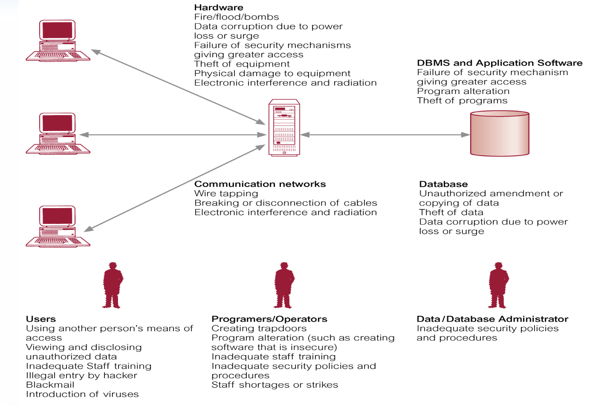

# Databases 数据库


[TOC]


# 1.Introduction


## 1.1.File-based System

“史前时代：基于文件的系统”: 

> Prehistoric age: File-based system

**文件系统 FBS 与 数据库系统 DB 的对比**

- **文件系统**：
  - 定义：基于文件的系统是一组应用程序，这些程序为最终用户提供服务，例如生成报告。每个程序都定义并管理自己的数据。
  
      > Def: A collection of application programs that perform services for the end-users, such as the production of reports. Each program defines and manages its own data.
  
  - 例子：销售文件、租赁合同、客户信息等。
  
  - 局限性：
    - Big volume 数据量大：无法处理大量数据（TB、PB、EB）。32位计算机上单个文件不超过4GB（2^32），64位计算机上为16TB。
    - Concurrent Access 并发访问：多个用户同时访问时无效。
    - Data integrity issue 数据完整性问题：duplication of data 数据重复，修改一个文件中的数据可能导致另一个文件中的数据错误。
    - Program-data dependence 程序与数据的依赖性。
    - Ad-hoc queries are not welcome. 临时查询不受欢迎。
    - Data security 数据安全：不同用户的授权。
    - Crash recovery 故障恢复。


## 1.2.Database

**数据库方法** **Database Approach**

- 起因：

- 数据定义嵌入在应用程序中，而不是独立存储。

    > Definition of **data was embedded in application  programs**, rather than being stored separately and  independently. 

- 数据的访问和操作控制仅由应用程序施加。

    > **No control over access and manipulation** of data  beyond that imposed by application programs. 

- 结果：数据库和数据库管理系统（DBMS）的诞生。

**数据库的定义**

- 数据库：一个组织内逻辑相关的数据（及其描述）的共享集合，旨在满足组织的信息需求。

    > Shared collection of logically related data (and a  description of this data), designed to meet the  information needs of an organization.  

- System catalog (**metadata**) 系统目录（元数据）：提供数据描述，实现程序与数据的独立性

  > System catalog (**metadata**) provides description of  data to **enable program–data independence**.

  > **Metadata** ，即**元数据** ，是一种非常重要的数据类型，它用于**描述其他数据的特征、属性和结构** ，以便更好地理解、管理、检索和利用数据。以下是关于 metadata 的详细介绍：
  >
  > - **狭义定义** ：元数据是关于数据的数据。例如，一本电子书的文件大小、格式、作者、出版日期等信息就是该电子书数据的元数据。
  > - **广义定义** ：它涵盖了对各种数据对象的描述，包括但不限于数据的内容、质量、条件、其他数据的来源、数据的结构等。

- 逻辑相关的数据：包括实体、属性和组织信息之间的关系。

    > Logically related data comprises entities, attributes,  and relationships of an organization’s information

**数据库的优势**

- Data independence 数据独立性
- Efficient data access 高效的数据访问
- Data integrity(consistency) and security 数据完整性（一致性）和安全性
- Redundancy management 冗余管理
- Concurrent access and Crash recovery 并发访问和故障恢复
- Reduced application development time 减少应用程序开发时间
- Persistent storage 持久存储

## 1.3.Database Management System (DBMS)

**数据库管理系统**

- 定义：使用户能够定义、创建、维护和控制数据库访问的软件系统。

    > A **software system** that enables users to define, create, maintain, and control access to the database. 

- 数据库应用程序：与数据库交互的计算机程序，通过向DBMS发出适当的请求（SQL语句）。

    > (Database) application program: a computer  program that interacts with database by issuing an  appropriate request (SQL statement) to the DBMS.


**DBMS的历史**

- 1960年代中期：IDS（GE）、IMS（IBM）。
- 1973年：**C. Bachman**因**网络DBMS**（IDS）获得图灵奖。
- 1970年：E. Codd（IBM）提出关系数据模型，被誉为关系**数据库之父**。
- 1981年：**E. Codd**因**关系数据库**获得图灵奖。
- 1970年代末：IBM的System R项目，产生了SQL语言，并导致了商业RDBMS产品的实现，如DB2、Oracle。
- 1998年：James. Gray获得图灵奖。

- 2022年：全球最受欢迎的数据库管理系统：Oracle、MySQL、Microsoft SQL Server、PostgreSQL、Apache Cassandra。


## 1.4.Structured Query Language (SQL)

- **数据定义语言（DDL - Data Definition Language）**
  - **主要包括的语句** ：CREATE（创建数据库对象）、ALTER（修改数据库对象）、DROP（删除数据库对象）、TRUNCATE（清空表数据）、COMMENT（为数据库对象添加注释）等。
  - **示例** ：`ALTER TABLE students ADD email VARCHAR(100);` 用于在 students 表中添加一个名为 email 的列，数据类型为长度为 100 的字符串。
- **数据操纵语言（DML - Data Manipulation Language）**
  - **主要包括的语句** ：SELECT（查询数据）、INSERT（插入数据）、UPDATE（更新数据）、DELETE（删除数据）等。
  - **示例** ：`SELECT * FROM students ORDER BY age DESC;` 从 students 表中查询所有数据，并按照年龄（age）降序排列。
- **数据控制语言（DCL - Data Control Language）**
  - **主要包括的语句** ：GRANT（授予权限）、REVOKE（收回权限）等。
  - **示例** ：`CREATE USER user2 IDENTIFIED BY 'password';` 创建一个名为 user2 的新用户，密码为 'password'。
- **事务控制语言（TCL - Transaction Control Language）**
  - **主要包括的语句** ：COMMIT（提交事务）、ROLLBACK（回滚事务）、SAVEPOINT（设置保存点）、SET TRANSACTION（设置事务的属性）等。
  - **示例** ：`START TRANSACTION; INSERT INTO students VALUES (2, 'Alice', 22); SAVEPOINT sp1; UPDATE students SET age = 23 WHERE id = 2; ROLLBACK TO sp1;` 这段代码首先开启一个事务，插入一条学生记录，设置一个保存点 sp1，然后更新该学生的年龄，最后回滚到保存点 sp1，撤销更新操作。


## 1.5.Views

- Allows each user to have his or her own view of the database. 允许每个用户有自己的数据库视图。
- **A view is essentially some subset of the database.** 视图本质上是数据库的某个子集。
- Reduce complexity 减少复杂性
- 提供安全级别
- Provide a mechanism to customize the appearance of the database 提供定制数据库外观的机制
- Present a consistent, unchanging picture of the structure of the  database, even if the underlying database is changed 即使底层数据库发生变化，也能呈现一致、不变的数据库结构视图。


# 2.Database Environment


## 2.1.ANSI-SPARC 3-level architecture

Objectives of Three-Level Architecture

- All users should be able to access same data. 

    > 所有用户应该能够访问相同的数据。

- A user’s view is immune （免疫） to changes made  in other views. 

    > 用户的视图应对其他视图中的更改免疫。

- Users should not need to know physical database  storage details.  

    > 用户不需要了解数据库的物理存储细节。

- DBA should be able to change database storage  structures without affecting the users’ views.  

    > 数据库管理员（DBA）应该能够在不影响用户视图的情况下更改数据库存储结构。

- Internal structure of database should be unaffected  by changes to physical aspects of storage.

    > 数据库的内部结构应不受物理存储方面变化的影响。

- DBA should be able to change conceptual structure  of database without affecting all users.

    > 数据库管理员（DBA）应该能够在不影响所有用户的情况下更改数据库的概念结构。


- **外部层 External Level**：
  - 用户的数据库视图。**Users’ view** of the database.
  - 描述与特定用户相关的数据库部分。Describes that part of database that is relevant to a  particular user. 
- **概念层 Conceptual Level **：
  - 数据库的社区视图。Community view of the database. 
  - 描述数据库中存储的数据及其关系。Describes what **data** is stored in database and  **relationships among the data**. 
- **内部层 Internal Level **：
  - 数据库在计算机上的物理表示。Physical representation of the database on the computer. 
  - 描述数据在数据库中的存储方式。Describes **how the data is stored in the database**. 


## 2.2.Data Independence

- **逻辑数据独立性 Logical Data Independence**：
  - 指外部模式对概念模式变化的免疫。
  
      > Refers to immunity of external schemas to  changes in conceptual schema. 
  
  - 概念模式的变化（如实体的添加/删除）不应要求更改外部模式或重写应用程序。
  
      > Conceptual schema change (e.g. addition/removal  of entities) should not require changes to external  schema or rewrites of application programs.
  
- **物理数据独立性 Physical Data Independence**：
  
  - 指概念模式对内部模式变化的免疫。
  
      > Refers to immunity of conceptual schema to  changes in the internal schema.
  
  - 内部模式的变化（如使用不同的文件组织、存储结构/设备）不应要求更改概念或外部模式。
  
      > Internal schema change (e.g. using different file  organizations, storage structures/devices)  should not require change to **conceptual or external** schemas.


## 2.3.Database Languages

Data Definition Language (DDL)  defines database schema.

Data Manipulation Language (DML) provides basic data manipulation operations on data held  in the database. 

 程序化DML Procedural DML

- 允许用户精确地告诉系统如何操作数据。

    > allows user to tell system exactly how to manipulate  data. 

非程序化DML Non-Procedural DML

- 允许用户指定所需的数据，而不是指定如何检索这些数据。

    > allows user to state what data is needed rather than  how it is to be retrieved. 

第四代语言（4GLs） Fourth Generation Languages 

- 表单生成器、报告生成器、图形生成器、应用程序生成器

    > Form generators, Report generators, Graphics  generators Application generators

## 2.4.Data Model

**数据模型**

- **定义**：用于描述数据、数据之间的关系以及组织中数据约束的一组概念。

    > Integrated collection of concepts for **describing  data , relationships between data, constraints on the data** in an organization.

- **目的**：以可理解的方式表示数据。

- **类别**：
  
  - **基于对象的数据模型**：Entity-Relationship (ER) 实体-关系（ER）、语义、功能、面向对象。
  
      > Entity-Relationship (ER)  − Semantic  − Functional  − Object-Oriented. 
  
  - **基于记录的数据模型**：Relational Data Model（RDB）关系数据模型、网络数据模型、层次数据模型。
  
      > Relational Data Model − Network Data Model  − Hierarchical Data Model.
  
  - **物理数据模型**。

**关系数据模型**

- **示例**：
  - **Branch**：
    - Branch No, street, city, postCode
  - **Staff**：
    - Staff No, fName, lName, position, sex, DOB, salary, branchNo

**网络数据模型**

- **网络数据模型**（Bachman, IDS）

**层次数据模型**

- **层次数据模型**（IBM, IMS）


## 2.5.Conceptual Modeling

- **定义**：开发一个独立于实现细节的信息模型的过程。

    > Conceptual modeling is  process of developing a  model of information that is  independent of  implementation details. 

- **结果**：概念数据模型。

- **概念模式**：支持所有用户视图的系统的核心。

    > Conceptual schema is the core of a system supporting all  user views.

- **应是组织数据需求的完整和准确的表示**。


## 2.6.three-level Architecture Modelling

**DBMS的功能**

- **数据存储、检索和更新 Data Storage, Retrieval, and Update**。
- **用户可访问的系统目录 A User-Accessible System Catalog**。
- **事务支持 Transaction Support**。
- **并发控制服务 Concurrency Control Services**。
- **恢复服务 Recovery Services**。
- **授权服务 Authorization Services**。
- **支持数据通信 Support for Data Communication**。
- **完整性服务 Integrity Services**。
- **促进数据独立性的服务 Services to Promote Data Independence**。
- **实用服务 Utility Services**。


**系统目录 System Catalog**

- **定义**：描述数据库中数据的信息（元数据）的存储库。
- **DBMS的基本组件之一**。
- **通常存储**：
  - 数据项的名称、类型和大小。names, types, and sizes of data items; 
  - 数据的约束。constraints on the data; 
  - 授权用户的名称。names of authorized users; 
  - 用户可访问的数据项及其访问类型。data items accessible by a user and the type of  access;
  - 使用统计信息。usage statistics


**DBMS的组件**

- **查询处理器 Query processor**：将查询转换为一系列低级指令，指向数据库管理器。

    > Query processor is a major DBMS component  that transforms queries into a series of low-level  instructions directed to the database manager.

- **数据库管理器 Database manager（DM）**：与用户提交的应用程序和查询交互。DM检查外部和概念模式，确定满足请求所需的概念记录。DM然后调用文件管理器执行请求。

    > Database manager (DM) interfaces with user submitted application programs and queries. The  DM examines the external and conceptual  schemas to determine what conceptual records  are required to satisfy the request. The DM then  places a call to the file manager to perform the  request.

- **文件管理器 File manager**：操纵底层存储文件，管理磁盘上的存储空间分配。它建立和维护内部模式中定义的结构和索引列表。

    > File manager manipulates the underlying storage  files and manages the allocation of storage space  on disk. It establishes and maintains the list of  structures and indexes defined in the internal  schema.

- **DML预处理器 DML preprocessor**：将嵌入在应用程序中的DML语句转换为主机语言的标准函数调用。DML预处理器必须与查询处理器交互以生成适当的代码。

    > DML preprocessor converts DML statements  embedded in an application program into  standard function calls in the host language. The  DML preprocessor must interact with the query  processor to generate the appropriate code.

- **DDL编译器 DDL compiler**：将DDL语句转换为包含元数据的一组表。这些表存储在系统目录中，而控制信息存储在数据文件头中。

    > DDL compiler converts DDL statements into a set  of tables containing metadata. These tables are  then stored in the system catalog while control  information is stored in data file headers. 

- **目录管理器 Catalog manager**：管理对系统目录的访问并维护系统目录。系统目录被大多数DBMS组件访问。

    > Catalog manager manages access to and  maintains the system catalog. The system catalog  is accessed by most DBMS components. 


**数据库管理器的组件**

- **授权控制**：确认用户是否有执行所需操作的必要权限。

    > Authorization control to confirm whether the  user has the necessary permission to carry out  the required operation.

- **命令处理器**：在确认用户权限后，控制权传递给命令处理器。

    > Command processor on confirmation of user  authority, control is passed to the command  processor.

- **完整性检查器**：确保请求的操作满足所有必要的完整性约束（例如键约束）。

    > Integrity checker ensures that requested  operation satisfies all necessary integrity  constraints (e.g. key constraints) for an operation  that changes the database.

- **查询优化器**：确定查询执行的最优策略。

    > Query optimizer determines an optimal strategy  for the query execution. 

- **事务管理器**：执行从事务接收到的操作。

    > Transaction manager performs the required  processing of operations that it receives from  transactions.

- **调度器**：确保对数据库的并发操作不会相互冲突。它控制事务操作的执行顺序。

    > Scheduler ensures that concurrent operations  on the database proceed without conflicting  with one another. It controls the relative order  in which transaction operations are executed.

- **恢复管理器**：确保数据库在发生故障时保持一致状态。它负责事务提交和中止。

    > **Recovery manager (aka. data manager)** ensures that the database  remains in a consistent state in the presence of  failures. It is responsible for transaction commit  and abort. 

- **缓冲管理器**：负责在主存储器和二级存储（如磁盘和磁带）之间传输数据。

    > **Buffer manager (aka. cache manager)** responsible for the transfer of  data between main memory and secondary  storage, such as disk and tape. 


**DBMS架构**

- **多用户DBMS架构 Multi-User DBMS Architectures**：

  - **远程处理 Teleprocessing**：传统架构，单个大型机连接多个终端。Single mainframe with a number of terminals attached  (directly).

      

  - **文件服务器架构 File-server **：传统两层客户端-服务器架构。

    

  - **客户端-服务器架构 Client-server**：

    - **两层客户端/服务器 2-tier Client/Server**：客户端提出业务请求，控制事务，显示结果。DBMS服务器处理数据I/O和数据处理。

      

    - **三层客户端/服务器 3-tier Client/Server**：客户端提出业务请求，显示结果。应用服务器控制事务，平衡负载。DBMS服务器处理数据I/O和数据处理。
  
  - **浏览器/服务器架构 Browser/Server**：客户端通过浏览器提出业务请求，显示结果。Web服务器通过HTTP与应用服务器和DBMS服务器交互。


# 3.Relational Model


## 3.1.Relational Model Terminology

**关系数据模型**

- **发明者**：Edgar Codd（1970年）。
- **Codd的信息原则**：数据库中的所有信息都必须明确地以关系中的值来表示，而不是其他方式。

**关系模型术语**

- **关系 Relation**：一个逻辑结构的表，具有列和行。A relation is a table with columns and rows.
- **属性 Attribute**：关系中的命名列。Attribute is a named column of a relation.
- **域 Domain**：一个或多个属性的允许值集。Domain is the set of allowable values for one or more  attributes. 
- **元组 Tuple**：关系中的一**行**。Tuple is a row of a relation.
- **度数 Degree**：关系中的属性数量。Degree is the number of attributes in a relation.
- **基数 Cardinality**：关系中的元组数量。Cardinality is the number of tuples in a relation. 
- **关系数据库**：具有不同关系名称的规范化关系的集合。Relational Database is a collection of **normalized relations** with **distinct relation names.**


## 3.2.Relation Definition

**关系模型的数学定义 Mathematical Definition of Relation**

- **笛卡尔乘积**：两个或多个集合的有序对集合。
- **关系**：笛卡尔乘积的子集。

**数据库关系 Database Relations**

- **关系模式 Relation schema**：由属性和域定义的关系名称。Named relation defined by a set of attribute and domain name  pairs.

  > **Rel(A1:D1, A2:D2, A3:D3,…, An:Dn)**,    
  >
  > **Rel**—relation name, **Ai**—ith attribute,   **Ai:Di**—attribute and domain name pairs

- **关系实例 Relation instance**：关系模式的具体实例。

  > **rel-1(a1:d1, a2:d2, a3:d3,…, an:dn), ai∊Ai , di∊Di** 

- **关系型数据库模式 Relational database schema **: **Set of relation schemas,  each with a distinct name.** 


## 3.3.Properties of Relations

- 关系名称在关系模式中是唯一的 。Relation name is distinct from all other relation names in  relational schema. (no two same table names)

- 每个单元格包含一个原子值 。 Each cell of relation contains exactly one atomic  (no more than one value of a certain attribute in one  tuple) 

- 每个属性在表中有一个不同的名称 。Each attribute in the table has a distinct name.

- 一个属性的所有值都来自同一个域 。Values of an attribute are all from the same domain.

- 每个元组是唯一的，没有重复的元组 。Each tuple is distinct; there are no duplicate tuples.

- 关系中的列（即属性）**没有特别的数学顺序**或排名意义；然而，一旦数据库管理系统（DBMS）定义了属性，属性位置顺序就确定了，**不能变动**。

  Columns don’t have any special mathematic order，but  attributes are defined by DBM system, once defined, the  attributes are order-sensitive. 

- 元组（即行）在理论上**没有顺序**。然而，为了**高效地访问数据**，索引（Index）可以定义元组的访问顺序。

  Order of tuples has no significance, theoretically. (index  defines an efficient access order to tuples) .

- 关系是由元组（行）组成的集合。

**Key features of relational tables** 

1. 关系名应该是唯一的：
   - 每个关系（表）都有一个唯一的名字，以便于区分不同的表。
2. 单元格中的值是原子的：
   - 关系表中的每个单元格只能包含一个值，即不允许在同一单元格中存储多个值。这称为原子性。
3. 元组（行）的顺序无关紧要：
   - 在理论上，关系表中的行（元组）的顺序没有任何意义，表中的行是无序的，关系数据库中主要是通过集合来组织数据。
4. 行和列是唯一的：
   - 关系表中的每一行（元组）是唯一的，不应当有重复的元组（行）。每一行代表一个唯一的数据项。例如，在“书籍表”中，B-number（书号）是唯一标识每本书的属性。
5. 列的值没有特别的顺序（没有排名），但属性一旦被定义，顺序变得敏感：
   - 列的值在关系中没有特定的顺序（没有数学上的排名意义），但每个属性的顺序在系统定义后变得重要，一旦定义，列的位置顺序就会被视为有效并且不应随意改变。


## 3.4.Relational Keys 

**关系键**

- **超键（Superkey）**：

  - **定义**：超键是一个或多个属性的集合，能够唯一标识关系中的每一行（元组）。An attribute, or set of attributes , that uniquely identifies a tuple within  a relation.（ no two different tuples have the same values of superkey.）

    超键的特点是，只要它能够唯一标识一个元组，它就可以是超键。一个超键不一定是最小的，可能包含冗余属性。

  - **举例**：假设有一个学生表（Student），其中包含属性：学生ID（StudentID），姓名（Name），和邮箱（Email）。如果“学生ID”和“姓名”一起组成一个超键，那么它可以唯一标识每个学生的记录，尽管"学生ID"本身就可以作为一个超键，"学生ID + 姓名"也可以。

- **候选键（Candidate Key）**：

  - **定义**：候选键是一个超键，但它是**最小的**，即没有冗余的属性。也就是说，候选键中的每个属性都是必要的，移除任何属性后，它就不再是唯一标识元组的超键。
  - **举例**：如果在上述学生表中，"学生ID"本身就能够唯一标识学生，而“学生ID + 姓名”也能唯一标识学生，那么"学生ID"就是一个候选键，因为它是最小的（没有冗余的属性）。“学生ID + 姓名”虽然也是超键，但它不是候选键，因为它包含了冗余属性。

- **主键（Primary Key）**：

  - **定义**：主键是从候选键中选择的一个，用来唯一标识关系中的元组。关系中只能有一个主键，它确保每一行记录的唯一性。
  - **举例**：在学生表中，假设我们选择"学生ID"作为主键，因为它能够唯一标识每一个学生。虽然"学生ID"是候选键，最终我们选它作为主键，来确保每个学生的记录不会重复。

- **替代键（Alternate Key）**：

  - **定义**：替代键是候选键中未被选为主键的那些键。它们依然是能够唯一标识元组的超键，只是没有被选作主键。
  - **举例**：继续以学生表为例，如果"学生ID"被选为主键，那么"邮箱"可能也是一个候选键（能够唯一标识学生），但是因为"学生ID"已经被选为主键，所以"邮箱"就变成了替代键。

- **外键（Foreign Key）**：

  - **定义**：外键是一个关系中的属性，它对应另一个关系中的**候选键**。外键用于在不同的关系之间建立连接和关联。外键可以是一个属性或一组属性，它们指向其他关系中的主键或候选键。
  - **举例**：假设有一个“课程表”与“学生表”相关联。在“课程表”中，可能有一个属性“学生ID”作为外键，它对应的是“学生表”中的主键“学生ID”。这样，"课程表"中的“学生ID”作为外键，用来表示每门课程与特定学生的关联。

**总结**：

- xxxxxxxxxx5 1#!/bin/bash2​3set -e4​5# 您的脚本放在这里bash
- **候选键** 是最小的超键，没有冗余属性。
- **主键** 是从候选键中选出的唯一标识元组的属性。
- **替代键** 是未被选为主键的候选键。
- **外键** 是用来在不同关系之间建立联系的属性，它指向另一个关系的候选键。


## 3.5.Integrity Constraints

**完整性约束**

1. **空值（Null Value）**：
   - **定义**：空值（NULL）表示当前属性值的未知或不适用状态。它与空字符串、零或任何其他实际的值不同。空值表示没有数据，可能是因为信息尚未提供，或者该字段对某些记录来说不相关。
   
       > Represents value for an attribute that is currently unknown  or not applicable for tuple.
       >
       > Deals with incomplete or exceptional data. 
   
   - **举例**：例如，在一个学生表中，"出生日期"字段可能为空，表示该信息未知或没有提供。在这种情况下，"出生日期"字段的值为NULL。
   
2. **实体完整性（Entity Integrity）**：
   - **定义**：实体完整性要求基关系（表）中每个记录的主键（Primary Key）值必须是唯一的，并且**主键的任何属性都不能为空**。换句话说，主键不能有NULL值。主键的作用是唯一标识表中的每一行记录，如果主键允许为空，数据库就无法有效地标识每一条记录，导致数据不一致。
   
       > In a base relation, no attribute of a primary key can be null.
   
   - **举例**：假设在一个“学生表”中，"学生ID"是主键。根据实体完整性要求，"学生ID"字段不能为NULL，否则该记录就无法唯一标识。即每个学生必须有一个唯一且非空的学生ID。
   
3. **参照完整性（Referential Integrity）**：
   - **定义**：参照完整性确保外键（Foreign Key）与另一个表（主表）的主键或候选键（Candidate Key）之间保持一致性。
   
   - 如果一个表包含指向另一个表的外键，那么外键的值必须匹配主表中的**候选键值**，或者外键值**可以为空**（NULL）。参照完整性防止数据库中出现无效的引用。
   
       > If foreign key  exists in a relation, either foreign key  value must **match a candidate key** value of some tuple in its home relation  or foreign key value must be **wholly null**.
   
   - **举例**：假设有一个“课程表”与“学生表”之间的关系。在“课程表”中，可能有一个“学生ID”字段作为外键，它指向“学生表”中的“学生ID”字段。参照完整性要求“课程表”中的“学生ID”必须存在于“学生表”的“学生ID”字段中，或者该字段可以为空（如果课程没有学生选修）。如果“课程表”中的“学生ID”引用了“学生表”中不存在的“学生ID”，就会违反参照完整性。
   
4. **一般约束（General Constraints）**：
   - **定义**：一般约束（有时称为业务规则）是用户或数据库管理员根据特定应用场景和业务需求定义的规则。它们用于进一步限制数据的有效范围和格式，确保数据的业务一致性。一般约束通常包括数据类型约束、取值范围约束、正则表达式等。
   
       > Additional rules specified by users or database  administrators that define or constrain some aspect of the  enterprise.
   
   - 举例：
     - 一个业务规则可能要求“年龄”字段只能接受介于18到100之间的整数。
     - 如果在“员工表”中定义“工资”字段，可能有一个规则要求工资不能小于最低工资标准。
     - 在“订单表”中，“订单日期”可能有一个规则，要求它必须大于或等于当前日期，确保订单日期的有效性。


## 3.6.Views

在关系型数据库中，**视图（Views）** 和 **基表（Base Relation）** 是两个重要的概念。它们帮助我们管理和使用数据库中的数据。以下是对这两个概念的详细解释：

1. **Base Relation（基表）**

- **定义**：基表是数据库中的基本关系，它对应于概念模型中的一个实体，并且这些关系（表）中的元组（记录）是物理存储在数据库中的。基表直接存储数据，它包含了实际的数据，并且可以通过查询（SQL）进行操作。

    > Named relation **corresponding to an entity** in conceptual  schema, whose tuples are physically stored in database.

- **特点**：
  
  - 基表是实际存在于数据库中的表，它们持久化存储数据。
  - 每个基表通常有一个固定的结构（字段），并且这些字段与概念模型中的实体属性相关联。
  - 基表中的数据通常直接来自现实世界的记录。
  
- **例子**： 假设你有一个学生表（`Students`），它包含了学生的基本信息，如学生ID、姓名、年龄等。这个表就是一个基表，因为它实际存储了关于学生的信息。

2. **View（视图）**

- **定义**：视图是通过对一个或多个基表进行操作（如选择、连接、聚合等）所产生的一个虚拟关系。视图并不直接存储数据，而是从基表中动态生成的结果。它表现为一个查询结果集，通常用于简化复杂查询、提高安全性或为用户提供定制化的数据视图。

    > Dynamic result of one or more relational operations operating on base relations (基表） to produce another relation.

- **特点**：
  - **动态性**：视图的内容并不在数据库中实际存储。每次查询视图时，数据库会基于定义的查询语句动态生成视图的内容。
  
      > Views are **dynamic**, meaning that changes made to base relations that affect view attributes are immediately reflected in the view. 
  
  - **虚拟关系**：视图是一个虚拟关系，它不一定实际存在于数据库中，而是在请求时动态生成。
  
      > **A virtual relation** that does not necessarily actually exist  in the database but is produced upon request, at time of  request.
  
  - 视图的内容是通过对一个或多个基础关系的查询定义的。
  
      > Contents of a view are defined as a query on one or more **base relations**.
  
- **例子**： 假设你有一个 `Employees`（员工）表和一个 `Departments`（部门）表。你可以定义一个视图来显示每个员工的姓名及其所在的部门名称：

  ```sql
  CREATE VIEW EmployeeDepartment AS
  SELECT Employees.EmployeeName, Departments.DepartmentName
  FROM Employees
  JOIN Departments ON Employees.DepartmentID = Departments.DepartmentID;
  ```

  这个视图 `EmployeeDepartment` 并不存储数据，而是每次查询时动态从 `Employees` 和 `Departments` 表中检索和连接数据。


**视图的目的 Purpose of Views**

1. **安全机制**：
   - 视图通过**隐藏数据库的某些部分**，为不同用户提供**强大而灵活的安全机制**。
   
       > Provides powerful and flexible security mechanism by  hiding parts of database from certain users. 
   
   - 在一些情况下，某些用户不应访问所有数据。比如，敏感信息（如薪资或个人信息）可以通过创建视图来隐藏，确保根据用户角色进行访问控制。
   
2. **定制化的数据访问**：
   - 视图允许用户**以定制化的方式访问数据**。同一份数据可以以不同的方式呈现给不同的用户或用户组。
   
       > Permits users to access data in a customized way, so  that same data can be seen by different users in different  ways, at same time.
   
   - 例如，在一个销售数据库中，经理可能看到的是带有销售数字和利润的完整数据，而其他员工可能只看到基本的交易数据，尽管他们都在使用同一份数据库。
   
   - 这种定制化的方式允许不同的用户以适合他们需求的方式与同一份数据进行交互，而无需更改数据库的原始结构。
   
3. **简化复杂操作**：
   
   - 视图可以**简化对基础关系的复杂操作**。
   
       > Can simplify complex operations on base relations.
   
   - 如果经常需要执行复杂的SQL查询（如连接、聚合或过滤操作），可以创建一个视图，将这些操作封装在其中。用户只需查询视图，就像查询一个简单的表一样，避免了重复编写和优化复杂查询的需要。


**更新视图（Views）的规则 Updating Views**

更新视图涉及如何确保视图中的数据变动能够正确地反映到其底层的基表（Base Relation），并且在通过视图进行更新时会有一些限制。

1. **更新基表与视图的关系**

- **更新基表时，视图要反映变化 All updates to a base relation should be immediately  reflected in all views that reference that base  relation.**： 当基表中的数据发生更新时（例如插入、删除或修改记录），这些更新必须立即反映到所有引用该基表的视图中。视图是动态生成的，当基表的数据发生变化时，查询视图时所得到的结果也应该随之更新。
- **更新视图时，基表也应反映变化 If view is updated, underlying base relation should  reflect change. **： 如果通过视图更新数据，底层的基表应该正确地反映这个变化。这意味着当对视图执行插入、删除或修改操作时，相关的基表也会受到影响。

2. **通过视图进行更新时的限制**

虽然视图能够通过一些更新操作来修改底层的基表数据，但并不是所有类型的更新都被允许。以下是对视图更新的限制：

- **单一基表更新  a single base relation**： 视图的更新操作只允许涉及一个单一的基表，并且视图必须包含基表的候选键（Candidate Key）。候选键是表中可以唯一标识每一行记录的字段。通过候选键，系统可以知道如何精确地定位要更新的记录。
  - 例如，如果视图是通过一个 `Employees`（员工）表创建的，并且这个表的主键（候选键）是 `EmployeeID`，则你可以通过该视图更新 `Employees` 表中的数据，因为视图的更新是明确的，基于唯一标识符来修改数据。
- **多基表更新不被允许  multiple base relations**： 如果视图涉及多个基表（如通过连接操作 `JOIN` 将多个表结合起来的视图），则不能通过该视图进行更新。这是因为，涉及多个表的视图更新会导致数据一致性和确定性的困难，系统无法准确地判断应该更新哪个表的哪些字段。
  - 例如，假设你有一个 `Employees` 表和一个 `Departments` 表，并通过连接这两个表创建了一个视图。在这种情况下，更新视图会很复杂，因为你无法确定到底是更新 `Employees` 表还是 `Departments` 表，尤其当更新影响到两个表的数据时。
- **聚合和分组操作中的更新不被允许 aggregation or grouping  operations （sum, avg, group by）**： 当视图涉及聚合函数（如 `SUM`、`AVG`）或 `GROUP BY` 操作时，更新也不被允许。聚合函数对数据进行汇总或计算，无法确定如何将这些变化映射回基表的具体行，因为聚合操作通常会将多行数据合并成单个结果。这样的更新不具备明确的行级映射关系，因此无法通过视图进行更新。
  - 例如，假设你有一个视图，它通过 `SUM` 函数对销售额进行聚合，并按部门进行分组。如果你尝试更新这个视图，系统无法确定如何在 `Sales`（销售）表或 `Departments`（部门）表中更新数据，因为聚合结果并不对应于某一特定的记录。


# 4.SQL (DDL, DML)

## 4.1.SQL Intro

- **定义**：SQL（结构化查询语言 Structured Query Language）用于管理关系数据库。
- **发音**：“ess-que-ell”或“sequel”。
- **特点**：用户指定所需信息，而非获取方式；使用标准英语单词（如CREATE TABLE、INSERT INTO、SELECT ... FROM ... WHERE）；适用于DBA、管理层、应用开发者等；ISO标准语言。


## 4.2.Writing SQL Commands

- **组成**：保留字 **reserved words**（如SELECT、FROM、WHERE、CREATE）和用户定义字 **user defined words**（如关系、列、视图名称）。

    > SQL statement consists of reserved words and user defined words.
    >
    > **Reserved words**: fixed part of SQL and must be spelt  exactly -> SELECT, FROM, WHERE, CREATE
    >
    > **User-defined words**: made up by users such as names for relations, columns, views

- **大小写敏感性**：除字符数据外，大多数组件不区分大小写  **case insensitive**。

    > Most components of an SQL statement are case  insensitive, except for literal character data.


## 4.3.Data Definition Language  (DDL)

- **环境 environment**：关系和其他数据库对象存在于环境中，每个环境包含一个或多个目录  **catalogs**，每个目录包含一组模式 **Schema**

    > Relations and other database objects exist in an **environment**. 
    >
    > Each environment contains **one or more catalogs**,  and each catalog consists of set of schemas.

- **模式 Schema **：命名的数据库对象集合，对象包括表、视图、域等，所有对象具有相同所有者。

    > Schema is named collection of related database  objects.
    >
    > Objects in a schema can be **tables, views, domains,  assertions, collations（校对）, translations, and  character sets.** All have same owner.

- **主要DDL语句**：
  
  - **CREATE SCHEMA**：创建模式。
  - **CREATE/ALTER DOMAIN**：创建或修改域。
  - **CREATE/ALTER TABLE**：创建或修改表。
  - **CREATE VIEW**：创建视图。
  - **CREATE INDEX**：创建索引。(Many DBMSs also provide)


### 4.3.1.CREATE TABLE

- **语法**：

  ```sql
  CREATE TABLE TableName (
      colName1 dataType [NOT NULL] [UNIQUE] [DEFAULT defaultOption] [CHECK searchCondition],
      colName2 dataType [NOT NULL] [UNIQUE] [DEFAULT defaultOption] [CHECK searchCondition],
      ...
      [PRIMARY KEY (listOfColumns),]
      [[UNIQUE (listOfColumns),] ...]
      {{FOREIGN KEY (listOfFKColumns)
          REFERENCES ParentTableName [(listOfCKColumns)],
          [ON UPDATE referentialAction]
          [ON DELETE referentialAction] 
      }, ...}
      [[CHECK (searchCondition)] ...]
  ) [ON {filegroup | DEFAULT}];
  ```

  **语法说明：**

  1. **基本表定义**：

     - `TableName`：表的名称。
     - `colName`：列的名称。
     - `dataType`：列的数据类型（如 `INT`, `VARCHAR`, `DATE` 等）。

  2. **列约束**：

     - `NOT NULL`：该列不能有 `NULL` 值。
     - `UNIQUE`：该列的所有值必须唯一。
     - `DEFAULT defaultOption`：为该列提供一个默认值。
     - `CHECK searchCondition`：定义该列的值必须满足的条件（例如 `CHECK (Salary > 0)`）。

  3. **表约束**：

     - `PRIMARY KEY (listOfColumns)`：为表指定主键。`listOfColumns` 是构成主键的列名列表。
     - `UNIQUE (listOfColumns)`：组合唯一约束，确保列的组合值唯一。

  4. **外键约束**：

     - `FOREIGN KEY (listOfFKColumns)`：定义外键列的名称，`listOfFKColumns` 是外键列的名称列表。

     - `REFERENCES ParentTableName [(listOfCKColumns)]`：定义外键约束，`ParentTableName` 是父表的名称，`listOfCKColumns` 是父表中的引用列（通常是主键或唯一列）。

     - ```
       ON UPDATE referentialAction
       ```

       ：在父表更新时的参考行为。常见的行为包括：

       - `CASCADE`：父表更新时，子表的相关行也会自动更新。
       - `SET NULL`：父表更新时，子表相关列的值会设为 `NULL`。
       - `NO ACTION` 或 `RESTRICT`：如果父表有更新，会阻止该操作，保持子表不变。

     - ```
       ON DELETE referentialAction
       ```

       ：在父表删除时的参考行为，常见的行为包括：

       - `CASCADE`：父表删除时，子表相关行也会自动删除。
       - `SET NULL`：父表删除时，子表相关列的值会设为 `NULL`。
       - `NO ACTION` 或 `RESTRICT`：如果父表有删除，会阻止该操作，保持子表不变。

  5. **额外的表级检查约束**：

     - `CHECK (searchCondition)`：确保表中所有行都符合某个条件。

  6. **规定表存储位置**

     - `[ON {filegroup| DEFAULT}]`：指明该表放在 数据库中的哪 个文件里，默认时为主文件

- **示例**：

  ```sql
  CREATE TABLE Orders (
      OrderID INT NOT NULL,
      CustomerID INT NOT NULL,
      OrderDate DATE DEFAULT CURRENT_DATE,       -- 默认日期为当前日期
      Amount DECIMAL(10, 2) CHECK (Amount > 0),  -- 确保金额大于 0
      PRIMARY KEY (OrderID),                     -- 设置 OrderID 为主键
      UNIQUE (CustomerID, OrderDate),            -- 组合唯一约束，CustomerID 和 OrderDate 的组合唯一
      FOREIGN KEY (CustomerID) REFERENCES Customers(CustomerID)
          ON UPDATE CASCADE
          ON DELETE SET NULL,                    -- 外键约束，父表更新时子表更新，父表删除时子表设置 NULL
      CHECK (Amount < 10000)                     -- 确保金额小于 10000
  ) ON SalesFileGroup;
  
  ```

- **规范**：
  1. 创建一个包含一个或多个列的表，并指定数据类型：
  
      > Creates a table with one or more columns of the  specified **dataType**.
  
  2. **使用 `NOT NULL`**，**系统拒绝插入空值**（NULL）：
  
      > With **NOT NULL**, system rejects any attempt to insert  a null in the column.
  
  3. 可以为列指定默认值（DEFAULT）：
  
      > Can specify a **DEFAULT** value for the column
  
  4. 主键（Primary Key）**应总是**指定为 `NOT NULL`：
  
      > **Primary keys should always be specified as NOT  NULL.**
  
  5. 外键（FOREIGN KEY）约束和引用操作（Referential Action）：
  
      > **FOREIGN KEY** clause specifies FK along with the referential action.


### 4.3.2.ALTER TABLE

- **功能**：添加新列、删除列、添加或删除表约束、设置或删除列默认值。

- **示例**：

  ```sql
  # 课件
  ALTER TABLE Staff 
  ALTER position DROP DEFAULT;
  
  ALTER TABLE Staff 
  ALTER sex SET DEFAULT 'F';
  
  ALTER TABLE PropertyForRent
  DROP CONSTRAINT StaffNotHandlingTooMuch;
  
  ALTER TABLE Client 
  ADD prefNoRooms SMALLINT;
  ```

  ```sql
  # Mysql
  # 添加列
  ALTER TABLE Employees 
  ADD Email VARCHAR(100);
  
  # 删除列
  ALTER TABLE Employees
  DROP COLUMN Email;
  
  # 修改列的数据类型或约束
  ALTER TABLE Employees
  MODIFY COLUMN Email VARCHAR(150) NOT NULL;
  
  # 重命名列
  ALTER TABLE Employees
  RENAME COLUMN Email TO ContactEmail;
  
  # 重命名表
  ALTER TABLE Employees
  RENAME TO Staff;
  
  # 添加表约束
  ALTER TABLE Employees
  ADD CONSTRAINT PK_EmployeeID PRIMARY KEY (EmployeeID);
  
  # 删除表约束
  ALTER TABLE Employees
  DROP CONSTRAINT PK_EmployeeID;
  
  ```


### 4.3.3.DROP TABLE

- **功能**：删除表及其所有行，RESTRICT表示如果其他对象依赖于该表则不允许删除，CASCADE表示删除所有依赖对象。

    > with RESTRICT,  if any other objects depend for  their existence on continued existence of this table, SQL  does not allow request.
    >
    > with CASCADE, SQL drops all dependent objects  (and objects dependent on these objects)

- **语法**：

  ```sql
  # 严格/级联
  DROP TABLE TableName [RESTRICT | CASCADE];
  ```


### 4.3.4. INDEX

索引（Index） 是一种数据库结构，用于加速基于一个或多个列的值的数据访问。它通过为特定列创建一个高效的查找机制，减少查询时需要扫描的数据量，从而提高查询性能。

> Index –structure that provides faster access to data  based on values of one or more columns.

```sql
# Format
CREATE [UNIQUE] INDEX indexName
 ON TableName(columnName[ASC|DESC][,,,])
 
# To create an index
CREATE INDEX RentInd
 ON PropertyForRent(city,rent); 
 
# To drop an index
DROP INDEX IndexName
```


## 4.4.Data Manipulation Language  (DML)

**Data Manipulation Language (DML)** 是用于管理数据库中数据的语言，它提供了对数据进行插入、查询、更新和删除的功能。DML 是 SQL（结构化查询语言）的一部分，用于操作数据库中的数据，而不是数据库的结构。


### 4.4.1.INSERT

`INSERT INTO` 语句用于向数据库表中插入新数据。

- **语法**

  ```sql
  INSERT INTO TableName [ (columnList) ]
  VALUES (dataValueList);
  ```

  **语法说明**：

  - **TableName**：表示要插入数据的表名。

  - **columnList**（可选）：指定要插入数据的列名。如果省略 `columnList`，SQL 会认为你在插入数据时为表中的所有列提供了值，并且这些值的顺序应与表在创建时的列顺序一致。

      > columnList is optional; if omitted, SQL assumes a list of all  columns in their original CREATE TABLE order (reviewing that  position order of columns is sensitive after the relation is  defined)

  - **dataValueList**：表示要插入的数据值，值的顺序和类型必须与列名对应。

      > dataValueList must match columnList as follows:
      >
      > − number of items in each list must be same;
      >
      > − must be direct correspondence in position of items in two  lists; 
      >
      > − data type of each item in dataValueList must be  compatible with data type of corresponding column.

- **示例**：

  ```sql
  INSERT INTO Staff 
  VALUES ('SG16', 'Alan', 'Brown', 'Assistant', 'M', '1957-05-25', 8300, 'B003');
  
  INSERT INTO Staff (staffNo, fName, lName, position, salary, branchNo) 
  VALUES ('SG44', 'Anne', 'Jones', 'Assistant', 8100, 'B003');
  ```


### 4.4.2.UPDATE

`UPDATE` 语句用于修改数据库表中现有的记录。

- **语法**

  ```sql
  UPDATE TableName
  SET columnName1 = dataValue1 [, columnName2 = dataValue2 ...]
  [WHERE searchCondition];
  ```

  **语法说明**：

  - **SET 子句**：`SET` 子句指定要更新的一个或多个列的名称，以及它们的新值。你可以在此子句中同时更新多个列，列和值之间用等号连接，多个列和值之间用逗号分隔。

      > SET clause specifies names of one or more columns that are to be updated.

  - **WHERE 子句（可选）**：`WHERE` 子句是可选的，如果省略了 `WHERE` 子句，SQL 会更新表中所有行的指定列。如果包含了 `WHERE` 子句，则只有那些符合 `searchCondition` 的行会被更新。

      > WHERE clause is optional: 
      >
      > − if omitted, named columns are updated for all rows in  table; 
      >
      > − If specified, only those rows that satisfy  searchCondition are updated.

  - **数据类型兼容性**：更新的 `dataValue` 必须与相应列的原数据类型兼容。例如，如果某列的数据类型是 `INT`，你不能给该列赋一个字符串值。

      > New dataValue(s) must be compatible with data type for  corresponding column.

- **示例**：

  ```sql
  UPDATE Staff SET salary = salary*1.03;
  
  UPDATE Staff SET salary = salary*1.05 WHERE position = 'Manager';
  
  UPDATE Staff SET position = 'Manager', salary = 18000 WHERE staffNo = 'SG14';
  ```

  


### 4.4.3.DELETE

`DELETE` 语句用于从数据库表中删除一条(行)或多条记录。

- **语法**

  ```sql
  DELETE FROM TableName
  [WHERE searchCondition];
  ```

  **语法说明**：

  - **FROM 子句**：`FROM` 子句指定了要从中删除记录的表名。

  - **WHERE 子句（可选）**：
    - `WHERE` 子句是可选的，指定删除记录的条件。
    
        > searchCondition is optional; 
    
    - 如果省略 `WHERE` 子句，**所有行**都会被删除，但表结构不会被删除，表本身依然存在。
    
        > if omitted, all rows are  deleted from table. This does not delete table .
    
    - 如果包含 `WHERE` 子句，只有那些符合条件的记录会被删除。
    
        > If  searchCondition is specified, only those rows that  satisfy condition are deleted.

- **示例**：

  ```sql
  # 这条语句会删除 Viewing 表中所有 propertyNo 为 'PG4' 的记录。只有符合条件的行会被删除。
  DELETE FROM Viewing WHERE propertyNo = 'PG4';
  
  DELETE FROM Viewing;
  ```

  

### 4.4.4.SELECT

`SELECT` 语句是 SQL 中用于从数据库中查询数据的基本语句。

- **语法**

  ```sql
  SELECT column1, column2, ...
  FROM table_name [alias]
  [WHERE condition]
  [GROUP BY column]
  [ORDER BY column]
  [LIMIT number];
  ```

  **语法说明**：

  - **SELECT 子句**：用来指定要查询的列（可以是单个列，也可以是多个列）。你可以使用 `*` 来表示查询所有列。
  - **FROM 子句**：指定要查询的表名。你可以从单个表或多个表（通过联接）中选择数据。
  - **WHERE 子句（可选）**：用于指定查询条件。只有满足条件的记录才会被返回。
  - **GROUP BY 子句（可选）**：:question::question::question:
    - 用于对查询结果进行分组，通常与聚合函数（如 `COUNT()`, `SUM()`, `AVG()` 等）一起使用。这些聚合函数每次只操作**一个表的一个列**，并返**回一个单一的值**（即聚合结果）。:star:
    - `SELECT` 列表中的所有列名**必须**出现在 `GROUP BY` 子句中，**除非**该列名只在聚合函数中使用。换句话说，`SELECT` 中引用的每个字段要么是分组依据字段，要么是聚合函数的结果。**SELECT and GROUP BY closely integrated: each item in  SELECT list must be single-valued per group.**
    - 如果 `WHERE` 子句与 `GROUP BY` 一起使用，`WHERE` 先对数据进行筛选（在分组之前），然后再根据满足条件的行进行分组。
    - `HAVING` 子句是用于与 `GROUP BY` 一起使用的，用来限制在最终结果表中显示的分组。它的作用是对分组后的结果进行筛选。
  - **ORDER BY 子句（可选）**：用于对查询结果进行排序。你可以指定一个或多个列，并选择升序（`ASC`）或降序（`DESC`）排序。**Default ordering is ascending.**
    - 数字
    - 字母
  - **LIMIT 子句（可选）**：用于限制返回的记录数量。常用于分页或限制查询的结果条数。

- **示例**：

  ```sql
  # 全选
  SELECT staffNo, fName, lName, address, position, sex, DOB, salary, branchNo FROM Staff;
  
  SELECT * FROM Staff;
  
  # 去重
  SELECT DISTINCT propertyNo FROM Viewing;
  
  # 计算字段
  SELECT staffNo, fName, lName, salary/12 AS monthlySalary FROM Staff;
  
  # 条件查询
  SELECT staffNo, fName, lName, position, salary FROM Staff WHERE salary > 10000;
  
  SELECT * FROM Branch WHERE city = 'London' OR city = 'Glasgow';
  
  SELECT staffNo, fName, lName, position, salary FROM Staff WHERE salary BETWEEN 20000 AND 30000;
  
  SELECT staffNo, fName, lName, position FROM Staff WHERE position IN ('Manager', 'Supervisor');
  
  SELECT ownerNo, fName, lName, address, telNo FROM PrivateOwner WHERE address LIKE '%Glasgow%';
  
  # 排序结果
  SELECT staffNo, fName, lName, salary FROM Staff ORDER BY salary DESC;
  
  SELECT propertyNo, type, rooms, rent FROM PropertyForRent ORDER BY type, rent DESC;
  
  # 聚合函数
  SELECT COUNT(staffNo) AS myCount, SUM(salary) AS mySum FROM Staff WHERE position = 'Manager';
  
  SELECT MIN(salary) AS myMin, MAX(salary) AS myMax, AVG(salary) AS myAvg FROM Staff;
  
  # 分组
  SELECT branchNo, COUNT(staffNo) AS myCount, SUM(salary) AS mySum FROM Staff GROUP BY branchNo ORDER BY branchNo;
  
  SELECT branchNo, COUNT(staffNo) AS myCount, SUM(salary) AS mySum FROM Staff GROUP BY branchNo HAVING COUNT(staffNo) > 1 ORDER BY branchNo;
  ```

  


# 5.SQL (Subquery, Integrity, View)


## 5.1.Subquery

**定义**：子查询是在另一个SQL语句中嵌套的`SELECT`语句，通常用于`WHERE`或`HAVING`子句中。

**用途**：用于检索嵌套条件的数据。

**示例**：

- 列出在“163 Main St”分行工作的员工：

  ```sql
  SELECT staffNo, fName, lName, position FROM Staff WHERE branchNo = (SELECT branchNo FROM Branch WHERE street = '163 Main St');
  ```

- 列出薪水高于平均薪水的员工及其差额：

  ```sql
  SELECT staffNo, fName, lName, position, salary - (SELECT AVG(salary) FROM Staff) AS SalDiff FROM Staff WHERE salary > (SELECT AVG(salary) FROM Staff);
  ```

- **嵌套子查询**：列出由“163 Main St”分行的员工处理的房产：

  ```sql
  SELECT propertyNo, street, city, postcode, type, rooms, rent FROM PropertyForRent WHERE staffNo IN (SELECT staffNo FROM Staff WHERE branchNo = (SELECT branchNo FROM Branch WHERE street = '163 Main St'));
  ```

**规则**：

- **ORDER BY**：子查询中不能使用`ORDER BY`，但最外层的`SELECT`可以使用。

- **单列 a single column name or expression**：子查询的`SELECT`列表必须是单列，除非使用`EXISTS`。

    > Subquery SELECT list must consist of **a single column  name or expression**, except for subqueries that use  EXISTS.

- **列名引用**：子查询中的列名**默认**引用子查询的`FROM`子句中的表名，可以使用别名。:question::question::question:

    > By default, column names refer to table name in FROM  clause of subquery. Can refer to a table in FROM using an  **alias.**

- **比较操作**：子查询作为比较操作的运算符时，必须出现在**右侧**。


### ANY 和 ALL|SOME

1. **ANY 和 ALL 可与返回单列数字的子查询一起使用**：`ANY` 和 `ALL` 关键字通常与返回一个单独列的子查询一起使用，这些子查询的结果通常是一个数字列。
2. **使用ALL时，条件只有在被子查询返回的所有值满足时才为真**：当使用`ALL`时，外部查询中的条件必须对子查询返回的每一个值都成立，条件才会为真。例如，`SELECT * FROM table WHERE column > ALL (SELECT value FROM table)`，这个条件要求`column`的值大于子查询返回的所有`value`值。
3. **使用ANY时，条件只要满足子查询返回的任何一个值就为真**：与`ALL`不同，使用`ANY`时，外部查询中的条件只需要对子查询返回的某一个值满足就为真。例如，`SELECT * FROM table WHERE column > ANY (SELECT value FROM table)`，这个条件要求`column`的值大于子查询返回的任何一个`value`值。
4. **如果子查询为空，ALL返回真，ANY返回假**：如果子查询没有返回任何结果，则`ALL`会返回真（因为没有值需要满足条件），而`ANY`会返回假（因为没有任何值满足条件）。
5. **SOME可以替代ANY使用**：`SOME`和`ANY`在功能上是相同的，`SOME`是`ANY`的同义词，二者可以互换使用。

**示例**：

- 找出薪水高于“B003”分行至少一名员工薪水的员工：

  ```sql
  SELECT staffNo, fName, lName, position, salary FROM Staff WHERE salary > SOME (SELECT salary FROM Staff WHERE branchNo = 'B003');
  ```

- 找出薪水高于“B003”分行所有员工薪水的员工：

  ```sql
  SELECT staffNo, fName, lName, position, salary FROM Staff WHERE salary > ALL (SELECT salary FROM Staff WHERE branchNo = 'B003');
  ```


### EXISTS and NOT EXISTS

`EXISTS` 和 `NOT EXISTS` 只能与子查询一起使用，它们用于检查子查询的结果是否为空，具体说明如下：

1. **`EXISTS`**：

   - `EXISTS` 用于检查子查询是否返回至少一行数据。
   - 如果子查询返回的结果集包含至少一行数据，则 `EXISTS` 返回 `TRUE`。
   - 如果子查询返回的是空结果集，则 `EXISTS` 返回 `FALSE`。

   **示例**：

   ```sql
   SELECT *
   FROM Employees E
   WHERE EXISTS (
       SELECT 1
       FROM Departments D
       WHERE D.DepartmentID = E.DepartmentID
   );
   ```

   - **解释**：在这个查询中，`EXISTS` 会检查是否有部门与员工表中的每一行匹配（即，是否有员工属于某个部门）。如果子查询返回了至少一行数据，表示该员工属于某个部门，`EXISTS` 返回 `TRUE`，员工信息将会出现在结果中。

2. **`NOT EXISTS`**：

   - `NOT EXISTS` 是 `EXISTS` 的反向操作，检查子查询是否**没有返回任何行**。
   - 如果子查询返回空结果集，则 `NOT EXISTS` 返回 `TRUE`。
   - 如果子查询返回至少一行数据，则 `NOT EXISTS` 返回 `FALSE`。

   **示例**：

   ```sql
   SELECT *
   FROM Employees E
   WHERE NOT EXISTS (
       SELECT 1
       FROM Departments D
       WHERE D.DepartmentID = E.DepartmentID
   );
   ```

   - **解释**：在这个查询中，`NOT EXISTS` 会检查是否没有任何部门与员工表中的某个员工匹配。如果子查询返回空结果集，表示该员工没有属于任何部门，`NOT EXISTS` 返回 `TRUE`，该员工信息会出现在结果中。


## 5.2.Multi-Table Queries

### 5.2.1.Comma JOIN

**使用逗号作为分隔符，并通常包含WHERE子句来指定连接列**：在`FROM`子句中，多个表之间用逗号分隔。通常，在查询的`WHERE`子句中，我们会指定哪些列用于连接（比如通过主键和外键进行匹配），这样才能正确地将不同表中的数据关联起来。Use comma as separator and typically include WHERE  clause to specify join column(s). 

```sql
# 隐式内连接
SELECT c.clientNo, fName, lName, propertyNo, comment FROM Client c, Viewing v WHERE c.clientNo = v.clientNo; # c, v ~  alias (别名)
```

### 5.2.2.JOIN Constructs

1. **显式内连接**：

```sql
# 显式内连接
SELECT c.clientNo, fName, lName, propertyNo, comment
FROM Client c
[INNER] JOIN Viewing v 
ON c.clientNo = v.clientNo;
```

- **解释**：这是最常见的JOIN语法，通过`ON`子句明确指定连接条件。在这个例子中，`Client`表和`Viewing`表通过`clientNo`列连接。
- **结果**：这种方式会生成一个包含两个`clientNo`列的结果集，分别来自`Client`表和`Viewing`表。

2. **使用 `USING` 子句的JOIN**：

```sql
SELECT clientNo, fName, lName, propertyNo, comment
FROM Client 
JOIN Viewing 
USING (clientNo);
```

- **解释**：在这个例子中，使用`USING`子句来简化连接条件。`USING`指定连接的列名（这里是`clientNo`），SQL会自动基于这个列进行连接。
- **结果**：结果集中的`clientNo`列只会出现一次，因为`USING`自动避免了重复列。

3. **自动连接（Natural Join）**：

```sql
SELECT clientNo, fName, lName, propertyNo, comment
FROM Client 
NATURAL JOIN Viewing;
```

- **解释**：`NATURAL JOIN`会自动根据两个表中具有相同列名的所有列进行连接。它不需要显式指定连接条件。
- **结果**：结果集中只有一个`clientNo`列，连接是根据具有相同名称的列自动进行的。

4. **左外连接（Left Outer Join）**：

```sql
SELECT *
FROM Table1 LEFT [OUTER] JOIN Table2
ON Table1.id = Table2.id;
```

- 左外连接包括**第一张表（左表）**中没有与第二张表（右表）匹配的行。这些未匹配的行会被保留，右表中的字段值会填充为`NULL`。
- **解释**：如果`Table1`中的某行没有与`Table2`中的对应行匹配，那么该行仍然会出现在结果中，而`Table2`中的相关列将填充为`NULL`。

5. **右外连接（Right Outer Join）**：

```sql
SELECT *
FROM Table1 RIGHT [OUTER] JOIN Table2
ON Table1.id = Table2.id;
```

- 右外连接包括**第二张表（右表）**中没有与第一张表（左表）匹配的行。这些未匹配的行会被保留，左表中的字段值会填充为`NULL`。
- **解释**：如果`Table2`中的某行没有与`Table1`中的对应行匹配，那么该行仍然会出现在结果中，而`Table1`中的相关列将填充为`NULL`。

6. **笛卡尔积连接（Cross Join）**：

```sql
SELECT *
FROM Table1 CROSS JOIN Table2;
```

- 笛卡尔积连接返回两个表中的**所有可能的行组合**，即两个表中每一行都会与对方表的每一行组合。它的结果就是**笛卡尔积（Cartesian product）**，即每一对不同的行都会被组合。
- **解释**：如果`Table1`有3行，`Table2`有4行，笛卡尔积连接的结果将会有3×4=12行，所有可能的行组合都会出现在结果中。


### 5.2.3.Combining Result Tables

在SQL中，合并结果表的操作可以使用以下几种方式，它们分别是 `UNION`、`INTERSECT` 和 `EXCEPT`，用于将两个表的数据进行组合。下面是这些操作的具体解释：

1. **UNION（并集）**

- **定义**：`UNION` 是将两个表（A 和 B）中的所有行合并成一个新表，结果表包含 A 和 B 中的所有行，不会重复相同的行。

- **特点**：默认去除重复的行（如果两表有重复行，结果中只会出现一次）。

  **示例**：

  ```sql
  SELECT column1 FROM TableA
  UNION
  SELECT column1 FROM TableB;
  ```

  - **解释**：此查询将返回 `TableA` 和 `TableB` 中 `column1` 列的所有不同值。如果两个表中有重复的行，只保留一行。

2. **INTERSECT（交集）**

- **定义**：`INTERSECT` 返回两个表（A 和 B）中**共有的行**，即两个表中都存在的行。

- **特点**：只保留两个表中都出现的行。

  **示例**：

  ```sql
  SELECT column1 FROM TableA
  INTERSECT
  SELECT column1 FROM TableB;
  ```

  - **解释**：此查询返回 `TableA` 和 `TableB` 中 `column1` 列的交集，只有两个表中都存在的行才会出现在结果中。

3. **EXCEPT（差集）**

- **定义**：`EXCEPT` 返回表 A 中存在但表 B 中没有的行，实际上是 A 和 B 的差集。

- **特点**：只保留在 A 中存在但不在 B 中存在的行。

  **示例**：

  ```sql
  SELECT column1 FROM TableA
  EXCEPT
  SELECT column1 FROM TableB;
  ```

  - **解释**：此查询返回 `TableA` 中 `column1` 列的值，但不包括在 `TableB` 中出现的相同值。换句话说，它返回 `TableA` 中有的，`TableB` 中没有的行。

4. **联合兼容性（Union Compatible）**

- **定义**：要进行 `UNION`、`INTERSECT`或 `EXCEPT`操作，两个表必须是联合兼容的。这意味着：
  - 两个表的列数必须相同。
  - 相同位置的列必须具有相同的数据类型或兼容的数据类型。


## 5.3.Integrity constraints

在SQL中，**完整性约束（Integrity Constraints）**是用来确保数据库数据的准确性和一致性的规则。下面介绍五种常见的完整性约束：

### 1.Required Data Constraints（必需数据约束）

- **定义**：要求某些字段在数据库中必须有值（不可为空）。
- **作用**：确保在插入或更新记录时，某些字段不会留空，这对于保持数据的完整性至关重要。
- **实现**：通过 `NOT NULL` 约束来确保字段不能为空。

**示例**：

```sql
CREATE TABLE Employees (
    EmployeeID INT NOT NULL,
    Name VARCHAR(100) NOT NULL,
    Age INT
);
```

- **解释**：在此示例中，`EmployeeID` 和 `Name` 字段不能为空，如果插入数据时这两个字段没有值，将导致插入失败。

### 2.Domain Constraints（域约束）

- **定义**：域约束用于限制字段的取值范围或数据类型，确保字段的值属于某个特定的范围或类型。
- **作用**：通过域约束，能够防止不符合业务逻辑的错误数据插入数据库。
- **实现**：通常使用 `CHECK` 约束来规定数据的有效范围，或者通过数据类型来限制数据的格式。

**示例**：

```sql
CREATE TABLE Employees (
    EmployeeID INT,
    Age INT CHECK (Age >= 18 AND Age <= 65)
);
```

- **解释**：在此示例中，`Age` 字段的值必须在 18 到 65 之间，任何不符合该条件的值都将被拒绝。

### 3.Entity Integrity（实体完整性约束）

- **定义**：实体完整性约束确保每个实体（即表中的每一行）都是唯一的，并且可以通过一个唯一的标识符（通常是主键）来区分。

    > Primary key of a table must contain a **unique, non-null value** for each row.
    >
    > Can only have one PRIMARY KEY clause per table. 
    >
    > Can still ensure uniqueness for alternate keys using  UNIQUE

- **作用**：确保每一行都有唯一标识符，并且不会有重复的记录。

- **实现**：通过使用 `PRIMARY KEY` 约束来保证实体完整性。

**示例**：

```sql
CREATE TABLE Employees (
    EmployeeID INT PRIMARY KEY,
    Name VARCHAR(100)
);
```

- **解释**：在此示例中，`EmployeeID` 是主键，确保每个员工都有唯一的标识符，因此不会出现重复的员工记录。

### 4.Referential Integrity（参照完整性约束）

- **定义**：参照完整性约束确保两个表之间的关系是有效的，具体来说，确保一个表中的外键值在另一个表中有对应的主键。

    > Referential integrity (参照完整性) means that, if FK contains a value, that value must refer to existing row in parent table.

- **作用**：保证表与表之间的关系正确，防止出现“孤立”记录。

- **实现**：通过使用 `FOREIGN KEY` 约束来定义外键，并确保外键在目标表中有对应的主键值。

**示例**：

```sql
CREATE TABLE Departments (
    DepartmentID INT NOT NULL,
    DepartmentName VARCHAR(100),
    # 定义组合主键
    PRIMARY KEY (DepartmentID, EmployeeID)
);

CREATE TABLE Employees (
    EmployeeID INT NOT NULL PRIMARY KEY,
    Name VARCHAR(100),
    DepartmentID INT,
    FOREIGN KEY (DepartmentID) REFERENCES Departments(DepartmentID)
);
```

- **解释**：在此示例中，`Employees` 表中的 `DepartmentID` 是外键，它引用了 `Departments` 表中的 `DepartmentID` 主键。参照完整性约束确保了 `Employees` 表中的 `DepartmentID` 必须在 `Departments` 表中存在。

### 5.General Constraints（一般约束）

- **定义**：一般约束是一些其他的数据约束，用于实施特定的业务规则和逻辑。它们可以包括各种条件和逻辑约束。
- **作用**：用于支持特定应用程序需求的更复杂的约束，确保数据满足业务规则。
- **实现**：一般约束通常通过 `CHECK` 约束、`UNIQUE` 约束等方式来实现。

**示例**：

```sql
CREATE TABLE Employees (
    EmployeeID INT PRIMARY KEY,
    Name VARCHAR(100),
    Age INT,
    Salary DECIMAL(10, 2),
    CHECK (Salary > 0)
);
```

- **解释**：在此示例中，`Salary` 字段有一个 `CHECK` 约束，确保员工的薪资必须大于 0。

### 总结：

- **必需数据约束**：确保某些字段不能为空（`NOT NULL`）。
- **域约束**：限制字段的取值范围或类型（如 `CHECK`）。
- **实体完整性约束**：确保每个记录都有唯一标识符（`PRIMARY KEY`）。
- **参照完整性约束**：确保外键在目标表中有对应的主键（`FOREIGN KEY`、`DEFAULT`）。
- **一般约束**：实现特定的业务规则和其他逻辑约束（如 `CHECK`、`UNIQUE`）。

### FK constraints :question::question::question:


## 5.4.Views

**视图（Views）** 是数据库中一种虚拟的表格，它是对一个或多个基本关系（表）通过关系操作（如选择、联接、聚合等）产生的动态结果集。视图并不一定在数据库中实际存储，而是当用户请求时即时生成的结果。

**视图的特点**：

1. **动态结果**：视图是对一个或多个基本关系（表）通过各种关系操作（如筛选、联接、聚合等）生成的动态结果。它不是存储在数据库中，而是按需生成的。

    > Dynamic result of one or more relational operations  operating on base relations to produce another  relation.

2. **虚拟关系**：视图是一个虚拟的关系，它并不需要在数据库中实际存在。它的内容是在每次请求时，根据查询即时生成的。

    > Virtual relation that does not necessarily actually  exist in the database but is produced upon request,  at time of request.

3. **定义为查询**：视图的内容是通过查询定义的，这些查询通常是对一个或多个基本表的操作。

    > Contents of a view are defined as a query on one or  more base relations

**创建视图的语法**：

```sql
CREATE VIEW ViewName [(newColumnName[,...])]
AS subselect
[WITH [CASCADED | LOCAL] CHECK OPTION]
```

- **ViewName**：视图的名称。
- **newColumnName**：视图中列的新名称（如果需要的话）。
- **subselect**：视图的查询语句，可以是对一个或多个表的选择、联接等操作。
- **WITH CHECK OPTION**：用于确保对视图的修改操作符合视图的定义，`CASCADED` 表示检查在整个视图层次结构中，`LOCAL` 表示只检查当前视图。

**删除视图的语法**：

```sql
DROP VIEW ViewName [RESTRICT | CASCADE]
```

- **RESTRICT**：如果视图正在被引用，删除操作会失败。
- **CASCADE**：如果视图正在被引用，删除操作会级联删除所有引用它的对象。

**视图示例**：

假设有一个管理者（例如B003分支的经理）只希望看到自己办公室内员工的详细信息。可以通过创建如下视图实现：

```sql
CREATE VIEW Manager3Staff AS
SELECT *
FROM Staff
WHERE branchNo = 'B003';
```

在这个例子中：

- 创建了一个名为 `Manager3Staff` 的视图。
- 该视图包含了 `Staff` 表中所有属于 `branchNo` 为 'B003' 的员工信息。
- 经理通过查询该视图，就只能看到属于他们分支的员工信息，而无需直接访问 `Staff` 表。


## 5.5.Triggers

**触发器（Triggers）** 是数据库中的一种特殊机制，用于在特定事件发生时自动执行预定义的操作。触发器通常与数据库表的操作（如插入、更新或删除）相关联，并且能够确保在这些操作发生时执行特定的逻辑。

> Defines an action that the database should take when  some event occurs in the application

**触发器的概念**：

1. **定义：** 触发器定义了一种在应用程序中发生特定事件时，数据库应该采取的动作。
2. 类型：
   - **行级触发器（Row-level）：** 针对每一行数据的操作都会触发。
   - **语句级触发器（Statement-level）：** 仅针对整个操作语句触发，不论操作影响了多少行数据。
3. 事件类型：
   - **INSERT：** 插入数据时触发。
   - **UPDATE：** 更新数据时触发。
   - **DELETE：** 删除数据时触发。
4. 触发时间：
   - **BEFORE：** 在执行操作之前触发。
   - **AFTER：** 在操作执行之后触发。
   - **INSTEAD OF：** 用新的操作替代原操作，通常用于视图。

**触发器的语法**：

```sql
CREATE TRIGGER TriggerName
BEFORE | AFTER | INSTEAD OF
INSERT | DELETE | UPDATE [OF TriggerColumnList]
ON TableName
[REFERENCING {OLD | NEW} AS {OldName | NewName}]
[FOR EACH {ROW | STATEMENT}]
[WHEN Condition]
<Trigger action>
DROP TRIGGER TriggerName;
```

- **TriggerName**：触发器的名称。
- **BEFORE | AFTER | INSTEAD OF**：触发器的触发时间。
- **INSERT | DELETE | UPDATE**：指定触发器针对的操作类型。
- **TriggerColumnList**：指定操作中触发器关注的列（可选）。
- **TableName**：触发器作用的表格。
- **REFERENCING {OLD | NEW}**：指定触发器使用的旧数据（OLD）或新数据（NEW）。
- **FOR EACH {ROW | STATEMENT}**：指定触发器的执行级别，是按行还是按语句执行。
- **WHEN Condition**：指定触发器触发的条件。

**触发器示例**：

1. **BEFORE 触发器示例：**

假设你想在向 `Staff` 表中插入数据之前，检查职位是否符合要求（例如，职位必须是“经理”，“助理”或“主管”）。

```sql
CREATE TRIGGER check_position_before_insert
BEFORE INSERT ON Staff
BEGIN
    SELECT CASE
        WHEN NEW.position NOT IN ('Manager', 'Assistant', 'Supervisor') THEN
            RAISE(ABORT, 'Position not recognised')
    END;
END;
```

在这个例子中，触发器 `check_position_before_insert` 在向 `Staff` 表插入数据之前检查 `position` 列的值，如果不是预定义的职位（经理、助理或主管），则触发器会中止插入操作，并给出错误消息。

2. **INSTEAD OF 触发器示例：**

有两个表：`Student`（学生表，字段包括学号和姓名）和 `BorrowRec`（借书记录表，字段包括学号和图书编号）。当尝试删除学生表中的记录时，如果该学生仍有借书记录，删除操作应该被阻止。

```sql
CREATE TRIGGER trigger_Student_Delete
INSTEAD OF DELETE ON Student AS
BEGIN
    IF NOT EXISTS (
        SELECT * FROM BorrowRec b, deleted
        WHERE b.ID = deleted.ID
    ) 
    DELETE FROM Student s 
    WHERE s.ID IN (SELECT ID FROM deleted);
END;
```

在这个例子中，触发器 `trigger_Student_Delete` 会在删除 `Student` 表中的学生记录时执行，如果该学生存在借书记录，删除操作将不会进行。

**触发器的优缺点**：

**优点**：

1. **消除冗余代码 Elimination of redundant code：** 可以将重复的操作封装在触发器中，减少代码重复。
2. **简化修改 Simplifying modifications：** 可以在一个地方集中管理业务逻辑，而不需要在多个应用中修改代码。
3. **提高安全性 Increased security：** 触发器可以用于确保数据完整性或安全性，例如在删除操作之前进行验证。
4. **改进数据完整性 Improved integrity：** 触发器可以在数据修改时保证数据的一致性和约束条件。
5. **提高处理能力 Improved  processing power：** 触发器可以在数据库级别自动执行一些操作，减轻应用层的负担。
6. **适用于客户端-服务器架构 Good fit with client-server architecture：** 可以在数据库中处理某些操作，而不是将复杂逻辑放在客户端。

**缺点**：

1. **性能开销 Performance overhead：** 触发器会增加数据库的额外处理，可能影响系统性能，特别是在大量数据操作时。
2. **级联效应 Cascading effects：** 触发器可能会引起级联的操作，即一个触发器触发另一个触发器，导致复杂的依赖关系。
3. **不能调度 Cannot be scheduled：** 触发器的执行是由事件触发的，不能像定时任务那样被调度和控制。
4. **可移植性差  Less portable：** 不同的数据库管理系统（DBMS）可能有不同的触发器实现方式，导致跨平台的迁移和兼容性问题。


# 6.Relation Algebra and Relation Calculus


## 6.1.Introduction

- 关系代数和关系演算是**关系模型的形式语言**。

    > Relational algebra（代数） and relational calculus （验算）are formal languages associated with the relational model.

- **关系代数**是高级过程语言

    > relational algebra is a (high-level)  procedural language，关系演算是非过程语言。
    >
    > ```sql
    > σ_{rent > 600}(PropertyForRent) #algebra 
    > ```
    >
    > ```sql
    > { t | t ∈ PropertyForRent ∧ t.rent > 600 } #calculus
    > ```

- 两者在形式上**等价**。

- **关系完备性**：

    > A language that produces a relation that can be derived using relational calculus is **relationally complete**. 


## 6.2.Relation Algebra

**特点**:

- 操作基于一个或多个关系，生成新关系，原关系不变。

    > Relational algebra operations work on one or more  relations to define another relation without changing  the original relations. 

- 操作结果仍是关系，支持嵌套操作（闭包性  **closure**）。

    > Both operands and results are relations, so output  from one operation can become input to another  operation.
    >
    > Allows expressions to be nested, just as in arithmetic.  This property is called closure. 

**基本操作**:

1. Selection (选择)
2. Projection (投影)
3. Cartesian Product (笛卡尔积)
4. Union (并)
5. Set Difference (差)

**扩展操作**:

- Join (连接)、Intersection (交)、Division (除)，可用基本操作表达。


### 6.2.1.Relational Algebra Operations

1. **选择 (Selection (or Restriction), σ)**

   - **定义**: 从单一关系中选择满足条件的元组。

       >Works on **a single relation R** and defines a relation  that contains only **those tuples (rows)** of R that satisfy the specified condition (predicate).

   - **符号**: σ~predicate~(R)

       >=, >, !=, <, ∧, ∨

   - 示例: 列出薪资大于 £20,000 的员工。
     - σ~salary~ ~>~ ~20000~(Staff)
     - 结果: SL21 (John White), SG5 (Susan Brand)
     
   - 示例: 列出住在成都犀浦的。

     - σ~city=‘Chengdu’∧street=’XipuRoad’~(Staff)

2. **投影 (Projection, π)**

   - **定义**: 从单一关系中提取指定属性的所有值，去除重复。

       > Works on a single relation R and defines a relation that contains **a vertical subset** of R, extracting **the values of specified attributes** and eliminating duplicates. 

   - **符号**: π~attributes~(R)

   - 示例: 列出员工编号和薪资。
     - π~staffNo,salary~(Staff)
     - 结果: SL21 (30000), SG37 (12000), 等。

3. **并 (Union, ∪)**

   - **定义**: 合并两个关系的元组，去除重复，要求并兼容。

       > Union of two relations R and S defines a relation  that contains all the tuples of R, or S, or both R  and S, duplicate tuples being eliminated.
       >
       > R and S must be union-compatible.

   - **符号**: R ∪ S

   - 示例: 列出有分支机构或出租物业的城市。
     - π~city~(Branch) ∪ π~city~(PropertyForRent)
     - 结果: London, Aberdeen, Glasgow, Bristol

4. **差 (Set Difference, -)**

   - **定义**: 返回在 R 中但不在 S 中的元组，要求并兼容。

       > Defines a relation consisting of the tuples that are  in relation R, but not in S.
       >
       > R and S must be union-compatible.

   - **符号**: R - S

   - 示例: 列出有分支机构但无出租物业的城市。
     - π~city~(Branch) - π~city~(PropertyForRent)
     - 结果: Bristol

5. **交 (Intersection, ∩)**

   - **定义**: 返回 R 和 S 共有的元组，要求并兼容。

       > Defines a relation consisting of the set of all tuples  that are in both R and S. 
       >
       > R and S must be union-compatible.

   - **符号**: R ∩ S

   - **等价表达**: R ∩ S = R - (R - S)

   - 示例: 列出既有分支机构又有出租物业的城市。
     - π~city~(Branch) ∩ π~city~(PropertyForRent)
     - 结果: London, Aberdeen, Glasgow

6. **笛卡尔积 (Cartesian Product, ×)**

   - **定义**: 将 R 和 S 的每个元组组合。

       > Defines a relation that is the concatenation (连结） of every tuple of relation R with every tuple of  relation S.

   - **符号**: R × S

       > m+n columns, p×q  rows

   - 示例: 列出所有客户姓名及其查看评论。
     - π~clientNo,fName,lName~(Client) × π~clientNo,propertyNo,comment~(Viewing)
     - 结果: 20 个元组 (4 个客户 × 5 个查看记录)
     
     
     
   - **结合选择**: σ~Client.clientNo~ = Viewing.clientNo(...)

7. **连接 (Join)**

   - **定义**: 笛卡尔积后根据条件选择。

       > Join is a very important operation, combines Cartesian product of the two operand relations and a Selection.
       >
       > ```sql
       > Join = σ_c（R X S）

   - 类型:
     - **Theta Join (θ-join)**: R ⋈~F~ S = σ~F~ (R×S) 为比较条件。
     
     - **Equijoin**: F 仅含等值条件。
     
     - **Natural Join (⋈)**: 等值连接，去除重复属性。
     
         
     
   - 示例: 列出客户姓名和查看评论。
     - π~clientNo,fName,lName~(Client) ⋈ π~clientNo,propertyNo,comment~(Viewing)
     - 结果: CR76 (John Kay, too remote), 等。

8. **外连接 (Outer Join)**

   - **定义**: 保留不匹配的元组。
   - **符号**: R ⟕ S (左外连接)
   - 示例: 生成物业查看状态报告。
     - π~propertyNo,street,city~(PropertyForRent) ⟕ Viewing
     - 结果: 包括未被查看的物业 (PL94, null)。
     
     

9. **半连接 (Semijoin)**

   - **定义**: 返回参与连接的 R 的元组。

       > Defines a relation that contains the tuples of R that  participate in the join of R with S.

   - **符号**: R ▷~F~ S = π~RAA~ (R ⋈~F~ S)  

       > RAA means R’s All Attrs

   - 示例: 列出在 Glasgow 分支工作的员工。

     - Staff ▷_Staff.branchNo = Branch.branchNo σ_~city='Glasgow'~(Branch)
     
   - 结果: SG37, SG14, SG5。

       

10. **除 (Division, ÷)**

    - **定义**: 返回与 S 中每个元组匹配的 R 的子集。

        >Defines a relation over the attributes C that consists of set of tuples from R that match the combination of every tuple in S.

    - **符号**: R ÷ S

    - 示例: 找出查看所有三居室物业的客户。
    
      - π~clientNo,propertyNo~(Viewing) ÷ π~propertyNo~(σ~rooms=3~(PropertyForRent))
  - 结果: CR56 (Aline Stewart)。
      - 

11. **聚合操作 (Aggregate Operations)**

    - **定义**: 对关系应用聚合函数。

    - **符号**: F~AL~(R)

    - **函数**: COUNT, SUM, AVG, MIN, MAX

    - 示例: 计算租金大于 £350 的物业数量。

      - ρ~Q~(myCount) F~COUNT~ ~propertyNo~ (σ~rent>350~(PropertyForRent))

          > ρ~S~(E)  or  ρ~S~(a1, a2, . . . , an)(E) ~ Rename operation ρ
          >
          > ρ~Q~(myCount) (E) provides a new name Q for the output relation of operation E
      
      - 结果: 5。
    
12. **分组操作 (Grouping Operation)**

    - **定义**: 按分组属性分组后应用聚合函数。

    - **符号**: ~GA~F~AL~(R)

    - 示例: 统计每个分支的员工数和薪资总和。

      - ρ~Q~(branchNo,myCount,mySum) ~branchNo~F~COUNT~ ~staffNo,~ ~SUM~ ~salary~(Staff)
  - 结果: B003 (3, 54000), B005 (2, 39000), B007 (1, 9000)。


### 6.2.2.Example


# 7.Entity Relationship Modeling


## 7.1.ER Modeling

**定义**：ER建模通过系统分析数据需求，帮助设计良好的数据库。

> Entity-relationship modeling analyses data  requirements in a systematic way to help produce a well-designed database.

**实施时机**：应在数据库实现之前完成。

> E-R modeling should always be completed before you implement your database.

**基本概念**：

- **实体（Entities）**：需要存储数据的对象。
- **属性（Attributes）**：实体或关系的特性。
- **关系（Relationships）**：实体之间的关联。

**两要素**：

- static data structure
- constraints
- 没有 dynamic data operation


## 7.2.ER Diagram


1. Entities with Attributes and Keys
2. Relations with Arrows, sometimes with Attributes connected with dash line
3. Multiplicty

How to map ERD to the corresponding relations ? :question:


## 7.3.Entity Types

**定义**：具有相同属性的对象组，由企业识别为独立存在。

> Group of objects with same properties, identified by enterprise as having an independent existence.

**实体实例（Entity Occurrence）**：实体类型的具体对象。

> Uniquely identifiable object of an entity type

**分类**：

- **强实体类型（Strong Entity Type）**：不依赖其他实体类型存在，如Staff。
- **弱实体类型（Weak Entity Type）**：依赖其他实体类型存在，如建筑中的房间。

**示例**：

- 物理实体：Staff、Property、Customer。

    > Physical entity types (e.g. a car, a person, a football team) 

- 活动/事件实体：Registration、Concert。

    > Activity/event entity types (e.g. a concert, registration) 

- 概念实体：Timetable、Program。

    > Conceptual entity types (a concert programme, a timetable)


## 7.4.Relationship Types

**定义**：实体类型之间有意义的关联集合。

> Set of meaningful associations among entity types.

**关系实例**：每个参与实体类型的一个实例组成的唯一关联。

> Uniquely identifiable association, which includes one occurrence from each participating entity type. :question::question:

**语义网（Semantic Network）：**

> Semantic Net of Has Relationship Type


**关系的度（Degree）**：

> Number of participating entities in relationship.

- 二元关系（Binary）：如PrivateOwner owns PropertyForRent。
- 三元关系（Ternary）：如Staff registers Client at Branch。
- 四元关系（Quaternary）：如Arranges。

**递归关系（Recursive Relationship）**：同一实体类型以不同角色多次参与，如Staff supervises Staff。

> Relationship type where same entity type participates more than once in different roles.

**角色名（Role Names）**：指示实体在关系中的目的，如Supervisor和Supervisee。

> Relationships may be given **role names** to indicate  purpose that each participating entity type plays in a  relationship.


## 7.5.Attributes

**定义**：实体或关系类型的特性。

> Property of an entity or a relationship type.

**属性域（Attribute Domain）**：属性的允许值集合。

> Set of allowable values for one or more attributes.
>
> :star:Relationship Attribute Domain hasn’t {PK} and {FK}

**类型**：

- **简单属性（Simple Attribute）**：单一组件，如DOB（出生日期）。

    > Attribute composed of a single component with an  independent existence.  
    >
    > − E.g.  DOB: 1990-10-11

- **复合属性（Composite Attribute）**：多个组件，如Address（地址）。

    > Attribute composed of multiple components, each with  an independent existence.
    >
    > − E.g.  Address:  Xiaoyuan Road 100, Pidu, Chengdu

- **单值属性（Single-valued Attribute）**：每个实例一个值，如stuID（学号）。

    > Attribute that holds a single value for each occurrence of  an entity type.  
    >
    > − E.g. stuID: 2020112233

- **多值属性（Multi-valued Attribute）**：每个实例多个值，如Author of Book（书籍作者）。

    >Attribute that holds multiple values for each occurrence  of an entity type. 
    >
    >− E.g.  Author of Book：Li Fan, T. Hanks, M. Burton

- **派生属性（Derived Attribute）**：从其他属性值推导，如Age从DOB派生。

    >Attribute that represents a value that is derivable from  value of a related attribute, or set of attributes, not  necessarily in the same entity type. 
    >
    >− E.g.  Age is derived attr. of DOB


## 7.6.Keys

**候选键（Candidate Key）**：唯一标识实体实例的最小属性集。

>Minimal set of attributes that uniquely identifies each  occurrence of an entity type.

**主键（Primary Key）**：选定的候选键，用于唯一标识实体实例。

>Candidate key selected to uniquely identify each occurrence of an entity type.

**复合键（Composite Key）**：由多个属性组成的**候选键**。

>**A candidate key** that consists of two or more attributes.


## 7.7.Structural Constraints

**二元关系类型**：

- :star:**EntityOne’s Cardinality:EntityTwo’s Cardinality**

- **一对一（1:1）**：如Staff manages Branch。
- **一对多（1:\*）**：如Staff oversees PropertyForRent。
- **多对多（\*:\*）**：如Newspaper advertises PropertyForRent。

**多重性（Multiplicity）**：关系的主要约束类型，由以下组成：

> Main type of constraint on relationships is called multiplicity.

- **参与（Participation）**：**所有或部分**实体实例是否参与关系。

    > Determines whether all or only some entity occurrences (实体实例) participate in a relationship.

- **基数（Cardinality）**：实体参与关系实例的最大数量。

    > Describes maximum number of possible relationship  occurrences (关系实例) for an entity participating in a given relationship type.

- :star:**Multiplicity = Participation + Cardinality**

**复杂关系的多重性（Multiplicity for Complex Relationships）**：在n元关系中，当其他(n-1)个值固定时，实体类型的可能实例数量。

> Number (or range) of possible occurrences of an entity  type in an n-ary relationship when other (n-1) values  are fixed.

**多重性表示**：

- :star:**Participation..Cardinality**

- **0..1**：零或一个。
- **1..1**：恰好一个。
- **0..\***：零或多个。
- **1..\***：一个或多个。


## 7.8.Problems with ER Models


**连接陷阱（Connection Traps）**：设计概念模型时可能出现的问题。

> Problems may arise when designing a conceptual data model called connection traps. 

**类型**：

- **扇形陷阱（Fan Trap）**：实体类型间关系路径不明确，如Staff-Division-Branch模型中无法确定员工所在分支。

    > Where a model represents a relationship between entity types,  but pathway between certain entity occurrences  is ambiguous

    

    

- **断层陷阱（Chasm Trap）**：模型暗示关系存在，但某些实例间无路径，如Branch-Staff-PropertyForRent中某些物业无关联员工。

    > Where a model suggests the existence of a relationship between entity types, but pathway does not exist between certain entity occurrences.
    
    
    
    

**解决方法**：重构模型，确保路径清晰。


# 8.Normalization


## 8.1.Why Normalisation

**避免更新异常 update  anomalies**:

- **插入异常 insertion**: 无法在没有员工的情况下添加分支（例如StaffBranch表中的B008）。
- **删除异常 deletion**: 删除员工可能意外删除分支信息。
- **修改异常 modification**: 数据冗余（例如分支地址重复）导致一致性风险。

**目标**:

- 最小化所需的属性数量。minimal number of attributes required;
- 将逻辑上密切相关的属性分组到同一关系中。 attributes with a close logical relationship in the same  relation;
- 减少冗余。minimal redundancy.

**示例（StaffBranch表）**

| staffNo    | sName      | position   | salary     | branchNo | bAddress             |
| ---------- | ---------- | ---------- | ---------- | -------- | -------------------- |
| SL21       | John White | Manager    | 30000      | B005     | 22 Deer Rd, London   |
| SG37       | Ann Beech  | Assistant  | 12000      | B003     | 163 Main St, Glasgow |
| SG14       | David Ford | Supervisor | 18000      | B003     | 163 Main St, Glasgow |
| SL41       | Julie Lee  | Assistant  | 9000       | B005     | 22 Deer Rd, London   |
| :question: | :question: | :question: | :question: | B008     | 12, Main St, Leeds   |

- **问题**:
    1. B003的bAddress重复冗余。
    
    2. 无法在没有员工的情况下插入分支（例如B008）。
    3. 删除SG37和SG14会导致B003信息丢失。
    4. 修改SL21的B005的bAddress时，无法使SL41的B005的bAddress保持一致


## 8.2.Normalisation Supports Database Design

**规范化在数据库设计中的作用**

- 自顶向下方法 Use top-down approach:
    - 使用ER建模，从用户需求、表单/报告、数据字典等推导关系。
    - 将ER模型映射为一组关系。
- 规范化作为验证 Use normalization as a validation technique:
    - 通过检查关系结构确保设计合理（本讲及第16章第2.2步有详细描述）。

**重要性**

- 反映现实世界中的实体关系（例如家族企业、办公室恋情）。

    > Relations in DB reflect complicated relationships among  Entities in the real world.
    >
    >  e.g, relationship in family corporation, office romance.

- 防止“非纯”或复杂关系导致的**异常**（例如经理叔叔与员工侄子的依赖关系）。

    > If the relation in a table is not pure, a number of **anomalies**  are produced, which can make analysis of the  data troublesome.
    >
    > Not pure relations or complicate relations means **the dependency（依赖）among  data.**
    >
    >  e.g, Uncle as a manager, his nephew as a staff.

**解决方案**

- 数据标准化是数据库优化和数据管理的一个关键部分，它可以帮助改进数据清洗、潜在客户路由、数据分割以及其他数据质量管理过程。

    > Data normalization is  a key part of **DB refine** and **data management** that can help improve **data  cleansing**, **lead routing**, **segmentation**, and **other data quality processes**.

- 将模式分解为更小、更纯的关系，消除问题依赖。

    > The only way to avoid the problem in schema is to decompose（分解）the schema into two or more  schemas to eliminate dependency and purify  relations.


## 8.3.Properties of Decomposition

**无损连接性质**:

- 从分解后的小关系中可重构原始关系（例如通过连接Staff和Branch表恢复bAddress）。

    > **Lossless-join property** enables us to find any instance of the original relation from corresponding instances in  the smaller relations. 
    >
    > • bAddress can be retrieved by joining Staff and  Branch

**依赖保持性质**:

- 原始关系的约束可在分解后的小关系上强制执行（例如分解后staffNo → sName依然保持）。

    > **Dependency preservation property** enables us to  enforce a constraint on the original relation by enforcing  some constraint on each of the smaller relations. 
    >
    > • sName is **functionally dependent** on staffNo in  StaffBranch. When decomposed, staffNo still refers  to the same sName.


## 8.4.Functional Dependencies (FD)

**定义**：

Functional dependency describes relationship between attributes.

- **A → B**: 如果在关系R中，属性A唯一确定属性B的一个值（可以是1:1或1:n关系）。

    - **A: 决定因素 determinant**
    - **B: 依赖项 dependent**

    > If A and B are attributes of relation R, B is **functionally dependent** on A (denoted A → B), if **each value of A** in R **is associated** with **exactly one value of B** in R (may be 1:1 or 1:n relationship).

**示例**：

- 员工分行 StaffBranch：
    - staffNo → sName
    - branchNo → bAddress
    - staffNo → position, salary, branchNo, bAddress
- 学生表  Table records for each student：
    - Grade → Pass/Fail
    - StudentID, Module → Grade

**关键概念**

- **完全函数依赖 Full Functional Dependencies**: B完全依赖于A，且不依赖于A的任何真子集（例如staffNo → branchNo，(StudentID, CourseID) →^f^ Score）。单属性一定是完全函数依赖。

    > Full functional dependency indicates that if A and B are  attributes of a relation, **B is fully functionally dependent on A**, if B is functionally dependent on A, **but not on any  proper subset of A .**

- **部分函数依赖 Partial Functional Dependency**：当一个属性仅依赖于复合主键的一部分，而不是整个复合主键时，产生的依赖关系。（例如 (staffNo, sName) →^P^ branchNo，staffNo一个就可以决定branchNo所以是部分依赖）

    > It refers to a situation where an attribute in a relational database is functionally dependent on part of a composite primary key rather than the whole primary key.

- **传递依赖 Transitive Dependencies**: 如果A → B且B → C，则C通过B传递依赖于A（例如staffNo → branchNo → bAddress）。

    >Transitive dependency describes a condition where A, B,  and C are attributes of a relation such that if **A → B and  B →C**, then **C is transitively dependent on A via B**  (provided that A is not functionally dependent on B or  C).

**Armstrong公理**

1. **关系的完整函数依赖集可能非常大**：

    - 对于一个给定的关系，可能存在很多函数依赖。这些依赖描述了在该关系中如何从某些属性推导出其他属性。因此，关系的完整函数依赖集可能非常庞大。

        > The complete set of functional dependencies for a  given relation can be very large.

2. **Closure闭包**：

    - **F的闭包（F^+^）** 是由给定的函数依赖集 **F** 推导出的所有函数依赖的集合。换句话说，F+ 包含了由 F 中的函数依赖推导出的所有可能的函数依赖。

        > The set of all functional dependencies that are  implied by a given set of functional dependencies F is  called the closure of F, written F+.

    - F^+^ 是一个包含 **F** 中所有显式的函数依赖及所有隐式的（通过推导得出的）函数依赖的集合。

    - **Closure on functional dependencies**：

        Given relation R(A, B, C, D) with functional  dependencies F {A->B, B->C}.

        **The closure of F, F+** : A → A, A → B, A → C, B → B, B → C, C → C, D → D, AB → A,  AB → B, AB → C, AC → A, AC → B, AC → C, AD → A, AD → B,  AD → C, AD → D, BC → B, BC → C, BD → B, BD → C, BD → D,  CD → C, CD → D, ABC → A, ABC → B, ABC → C, ABD → A,  ABD → B, ABD → C, ABD → D, BCD → B, BCD → C, BCD → D,  ABCD → A, ABCD → B, ABCD → C, ABCD → D.

    - **Closure on attribute set**：

        Given relation R(A, B, C, D, E) with functional  dependencies F {A->B, B->C, D-> E, E-> D}.

        **The closure of attributes**：{A}^+^ = {A, B, C}，{B}^+^={B, C}，{C}^+^={C}，{D}^+^={D, E}，{E}^+^={D, E}，{AB}^+^ = {A, B, C}，etc…

3. **Armstrong公理（Armstrong's Axioms）**：

    - **Armstrong公理** 是一组规则，用来推导出一个函数依赖集的闭包（F+）。它们提供了一种标准化的方法来从一个已知的函数依赖集推导出所有可能的函数依赖。

        > **Armstrong’s axioms** is used to find F+.
        >
        > A set of inference(推理推断) rules, called **Armstrong’s axioms**, specifies how new functional  dependencies can be inferred from given ones.

    - **Armstrong’s axioms**：

        Let **A, B, and C** be **subsets of the attributes** of **the relation R**. Armstrong’s axioms are as follows:

    1. **反射律（Reflexivity）**：If B is a subset of A, then A → B
    2. **增加律（Augmentation）**： If A → B, then A,C → B,C
    3. **传递律（Transitivity）**：If A → B and B → C, then A → C

    - **Further rules**：

        Let **D** be another subset of the attributes of  **relation R**

    4. **Self  Determination（自决定）**: A → A
    5. **Decomposition（分解）**: If A → B,C then A → B and A → C
    6. **Union（合并）**: IfA → B and A → C thenA → B,C
    7. **Composition（组合）**: If A → B and C → D then A,C → B,D


## 8.5.The Process of Normalisation

- **定义**: 基于主键和函数依赖分析关系的正式技术。
- **步骤**: 通过一系列范式（1NF → 2NF → 3NF → BCNF），逐步强化格式并减少异常。
- **权衡**: 规范化程度越高，异常越少，但查询效率可能降低。

**范式层次 Grade of normalization**

- UNF < 1NF < 2NF < **3NF** < **BCNF** < 4NF < 5NF < 6NF

- **6NF**: 每行仅包含主键和最多一个其他属性。

    > FYI：6NF - a table is in 6NF when the row contains the Primary  Key, and at most one other attribute.


**未规范化形式（UNF Unnormalised Form）**

- **要求**:包含重复组（例如单元格内多个值）。
- **示例**: StaffPropertyInspection表中一个物业有多次检查。


**第一范式**（1NF First Normal Form）

- **要求**: 原子值（每个单元格仅一个值）。

    > A relation in which the intersection of each row and  column contains one and only one value **(atomic  value)**.

- **UNF to 1NF**：

    1. **选择关键属性**： 选择一个属性或一组属性作为未经规范化表的主键（Key）。主键是用来唯一标识每一行的属性或属性组合。

        > Nominate an attribute or group of attributes to act as  the key for the unnormalised table.

    2. **识别重复组**： 在未经规范化的表中，识别出哪些属性是重复出现的，特别是那些与主键属性相关联的重复数据组**（Repeating Groups）**。这些重复的数据通常存在于一行的多个列中。

        > Identify the repeating group(s) in the unnormalised  table which repeats for the key attribute(s).

    3. **去除重复组**： 通过以下两种方法之一去除重复数据组：

        - **“扁平化”表格**：将重复的数据填入每一行中对应空列，以确保每一行的数据都能唯一标识，不再存在重复组。

            > Entering appropriate data into the empty columns of rows  containing the repeating data (‘flattening’ the table)

        - **分离重复数据**：将重复的数据与原主键属性一起，放入一个新的关系（即新的表）中。这样原来的表只保留主键和非重复的属性。

            > Placing the repeating data along with a copy of the original  key attribute(s) into a separate relation.


**第二范式（2NF Second Normal Form）**

- **要求**: 1NF + 无部分依赖（每个非主键属性完全依赖于候选键）。

    > A relation that is in 1NF and every non-primary-key  attribute is fully functionally dependent on  **any  candidate key .** 

- **1NF to 2NF**：

    1. **识别功能依赖**： 在关系中识别功能依赖（Functional Dependencies）。

        > Identify the functional dependencies in the relation.

    2. **识别主键**： 确定 1NF 关系中的主键（Primary Key）。

        > Identify the primary key for the 1NF relation.

    3. **消除部分依赖**： 如果存在部分依赖（Partial Dependency），即某个非主属性仅依赖于主键的一部分（而不是整个主键），则需要消除这些部分依赖。消除部分依赖的方法是：

        > If partial dependencies exist on the primary key  remove them by placing then in a new relation along  with a copy of their determinant .

        - 将存在部分依赖的非主属性与其决定因子（Determinant，指的是决定属性值的属性或属性组合）一起，放入一个**新的关系（新的表）**中。
        - 原始表中则只保留主键的其他部分和那些完全依赖于整个主键的属性。


**第三范式（3NF）**

- **要求**: 2NF + 无传递依赖（任何非主键属性不能依赖于另一个非主键属性，它必须直接依赖于候选键）。

    > A relation that is in 1NF and 2NF and in which no non-primary-key attribute is transitively dependent on any candidate key.

- **2NF to 3NF**：

    1. **识别功能依赖**： 在关系中识别功能依赖（Functional Dependencies）。

        > Identify the functional dependencies in the relation.

    2. **识别主键**： 确定 2NF 关系中的主键（Primary Key）。

        > Identify the primary key for the 2NF relation.

    3. **消除传递依赖**： 如果在关系中存在 **传递依赖**（transitive dependencies），则需要通过将这些依赖关系移到一个新的关系中来消除传递依赖，同时保留它们的 **决定因素**（determinant）。

        > If transitive dependencies exist on the primary key remove them by placing them in a new relation along  with a copy of their determinant.
    
    

**Boyce-Codd范式（BCNF Boyce–Codd Normal Form）**

- **要求**: 3NF+每个决定因素（determinant）必须是候选键。

    >  A relation is in BCNF if and only if every determinant is a  candidate key.

- **3NF to BCNF**：

    如果一个关系包含以下特征（伪候选键，即**非候选键的超键**），可能会违反BCNF：

    1. **包含两个（或更多）复合候选键**：复合候选键是由多个属性组成的候选键。

        > contains two (or more) composite candidate keys;

    2. **这些候选键有重叠**：即它们有至少一个属性是相同的。

        > the candidate keys overlap, that is have at least one attribute in common.
    
- **分解规则**

    - 如果 R 不满足 BCNF，找到违反 BCNF 的函数依赖 X→Y。

    - 将 R 分解为两个关系：
        1. R1=(X∪Y)，包含X和 Y 的属性。
        2. R2=(R−Y)，包含 R 中除 Y 外的所有属性。

    


**总结**


# 9.Logical Databases Design


ER Diagram -> R(A1, A2, A3, …)


## Build and Validate Logical Data Model

**构建和验证逻辑数据模型**

在这一阶段，我们的目标是将概念数据模型转化为逻辑数据模型，并通过规范化等方法验证该模型的结构是否正确，确保它支持所需的事务处理。

> To **translate the conceptual data model into a logical  data model** and then to validate this model to check  that it is structurally correct using normalization and  supports the required transactions.

### Derive relations for logical data model

**为逻辑数据模型推导关系**

这一步的任务是根据已识别的实体、关系和属性，为逻辑数据模型创建关系（即数据表）。通过这些关系，我们能够表示出系统中各个实体之间的联系，以及这些实体的特征。

> To create relations for the logical data model to represent the entities, relationships, and  attributes that have been identified.

在概念数据模型中，可能会出现多种不同的结构。


以下是针对每种结构，我们如何推导逻辑数据模型中的关系（即数据表）的方法：

**(1) Strong entity types 强实体类型**

- 对于数据模型中的每一个强实体类型，需要创建一个关系（通常表示为数据库表）。这个关系应包含该实体的所有简单属性。
- 对于复合属性（即由多个简单属性组成的属性），在创建关系时，只需包含这些复合属性中的各个简单属性部分。也就是说，要将复合属性“展平”（flatten attribute），即将复合属性分解成单独的简单属性并分别列出。

> For each strong entity in the data model, create **a relation that includes all the simple attributes** of that entity. 
>
> **For composite attributes, include only the constituent(成分) simple attributes**  (flatten attribute hierarchy). 

**(2)  Weak entity types 弱实体类型**

- 对于数据模型中的每个弱实体类型，需要创建一个关系（即表），该关系应包含该实体的所有简单属性。
- 弱实体的主键是部分或完全由其所有者实体**派生**而来的。因此，在确定弱实体的主键之前，必须先映射出与所有者实体的所有关系。

> For each weak entity in the data model, create **a relation that includes all the simple attributes** of that entity. 
>
> **The primary key of a weak entity is partially or fully derived from each owner entity** and so the identification of the primary key of a weak entity cannot be made until after all the relationships with the owner entities have been mapped.


**(3) One-to-many binary relationship types 一对多二元关系类型** (子加父主键)

- 对于每个1:*二元关系，关系中“单方”（一方）的实体被指定为父实体，而“多方”（多方）的实体被指定为子实体。
- 为了表示这种关系，需要将父实体的主键属性的副本**添加**到表示子实体的关系（表）中，作为外键。

> For each 1:* binary relationship, the entity on the ‘one  side’ of the relationship is designated as **the parent entity** and the entity on the ‘many side’ is designated as **the child  entity**. 
>
> To represent this relationship, **post a copy of the primary key attribute(s) of parent entity into the relation  representing the child entity, to act as a foreign key.**


**(4) One-to-one (1:1) binary relationship types 一对一（1:1）二元关系类型**

- 创建关系来表示1:1关系较为复杂，因为在这种关系中，基数（即一方和多方的区分）不能用来识别父实体和子实体。
- 相反，使用**参与约束**来决定最佳的表示方式：是将涉及的实体合并为一个关系（表），还是创建两个关系，并将其中一个关系的主键副本作为外键放入另一个关系中。

> Creating relations to represent a 1:1 relationship is more  complex as the cardinality cannot be used to identify the  parent and child entities in a relationship. 
>
> Instead, **the participation constraints are used** to decide whether it is best  to represent the relationship by combining the entities  involved into one relation or by creating two relations and  posting a copy of the primary key from one relation to the  other.

**(a) Mandatory participation on both sides of 1:1 relationship 1:1关系中双方都必需参与**（合并造新表，选一个当主键）

- 在这种情况下，两个参与1:1关系的实体都必须参与关系。
- 将这两个实体**合并**为一个关系（表），并选择其中一个实体的主键作为新关系的主键。另一个实体的主键（如果存在）将作为备用键（Alternate Key）来使用。
- 这种方式的优势是将两个实体的属性合并到一个表中，同时仍然保持它们的唯一标识（主键）。

> Combine entities involved into one relation and choose one of  the primary keys of original entities to be primary key of the  new relation, while the other (if one exists) is used as an  alternate key. 


**举例**：如果有“员工”和“办公桌”两个实体，每个员工必须有一个办公桌，每个办公桌只能分配给一个员工。在这种情况下，可以将“员工”和“办公桌”两个实体合并为一个表，其中“员工ID”作为主键，“办公桌ID”作为备用键。

**(b) Mandatory participation on one side of a 1:1 relationship 1:1关系中一方必需参与，另一方可选参与**（子加父主键）

- 在这种情况下，首先需要根据参与约束来确定哪个实体是父实体，哪个是子实体。
- 在1:1关系中，参与关系的实体如果是**可选的**，则它被视为**父实体**；如果是**必需参与的**，则它被视为**子实体**。
- 将父实体的主键作为外键**放入**表示子实体的关系中。
- 如果关系中有其他属性，这些属性应在主键外键关系建立之后添加到子实体的关系表中。

> **Identify parent and child entities** using participation constraints.  
>
> **Entity with optional participation** in relationship is  designated **as parent entity**, and entity with mandatory  participation is designated **as child entity**. 
>
> A copy of **primary key of the parent entity is placed** in the relation  representing the child entity. 
>
> If the relationship has one or  more attributes, these attributes should follow the posting  of the primary key to the child relation. 


**举例**：假设有“员工”和“办公室钥匙”两个实体，其中一个员工必定拥有办公室钥匙，而办公室钥匙是可选的（即并非所有员工都有钥匙）。在这种情况下，“员工”是父实体，“办公室钥匙”是子实体。可以将“员工ID”作为外键放入“办公室钥匙”表，并且如果“办公室钥匙”表中有其他属性（如钥匙类型），则这些属性应在外键字段之后添加。

**(c) Optional participation on both sides of a 1:1 relationship 1:1关系中双方都可选参与**（创新表和加父主键都行）

- 在这种情况下，父实体和子实体的区分是任意的，除非可以通过其他信息（如业务逻辑或其他约束条件）来帮助做出决定。
- 如果无法从关系中直接判断哪个实体是父实体，哪个是子实体，可以根据实际情况选择任意一个作为父实体，另一个作为子实体。
- **选择哪个表作为父表，哪个表作为子表**：这可能是一个任意的选择。父表的主键会被复制到子表中作为外键，形成表之间的关联关系。简而言之，就是将父表的主键复制到子表中，作为子表的外键。
- **创建一个新关系表**：在这种方法中，会创建一个新的关系表，这个表包含了参与的两个实体（表）的主键的副本。通过这种方式，可以在新表中建立这两个实体之间的关系，而不直接在原有的子表中复制父表的主键。

> In this case, the designation of the parent and child entities is  arbitrary unless we can find out more about the relationship that  can help a decision to be made one way or the other.
>
> **Decide which side to make parent and which child.** May be an arbitrary choice.  Post copy of primary key of parent table into child table.
>
> Another possibility would be to **create a new relation** with copies of both the participating entities’ primary keys.

**举例**：假设有“员工”和“办公车位”两个实体，其中每个员工可能有一个办公车位，而不是所有员工都一定拥有车位，同样也不是所有车位都一定被分配给员工。在这种情况下，是否选择“员工”作为父实体，还是选择“办公车位”作为父实体取决于更多的业务约束或逻辑。


produce 3 tables. Female Male Married

**(5)  One-to-one 1:1 recursive relationship  一对一递归关系**

- 1:1 递归关系指的是同一个实体与自身之间存在一对一的关系。换句话说，实体中的一个实例与该实体中的另一个实例建立关系。在这种关系中，每个实体的一个实例都与同一实体的另一个实例相关联，并且这种关系是一对一的。

> For a 1:1 recursive relationship, follow **the rules for participation as  described above for a 1:1 relationship**
>
> These are dealt with in a similar way to the case of two different entity types.


**(6) Superclass/Subclass Relationship Types 超类/子类关系类型**

超类/子类关系是面向对象建模中常见的概念，表示一个更一般化的实体（超类）与其特定子类之间的关系。在关系型数据库中，可以通过不同的方式来表示这种超类/子类的关系，选择哪种方式取决于以下几个因素：

1. **超类和子类的识别**：

    > Identify superclass entity as parent entity and subclass  entity as the child entity.

    - **超类实体**：是父实体，通常代表一类广义的实体。
    - **子类实体**：是子实体，通常是从超类中派生出来的、更为具体的实体。

2. **表示超类/子类关系的选项**： 有多种方法可以将超类/子类关系表示为一个或多个关系（表）。常见的表示方法包括：

    > There are various options on  how to represent such a relationship as one or more  relations.

    - **单表继承**：将超类和所有子类的属性放入同一个表中。
    - **具体表继承**：为每个子类创建单独的表，且子类表中包含超类的外键。
    - **类表继承**：为每个超类和子类对创建独立的表，超类的表只包含通用属性，子类表则包含特有属性，并通过外键与超类表关联。

3. **选择最合适的表示方式的因素**： 选择哪种方式来表示超类/子类关系，通常取决于以下几个因素：

    > The selection of the most appropriate option is dependent  on a number of factors such as the **disjointness** and  **participation constraints** on the superclass/subclass  relationship, whether the subclasses are involved in  **distinct relationships**, and the **number of participants** in  the superclass/subclass relationship.

    - **互斥性 (Disjointness)**：指子类是否能有重叠的实例。若子类是互斥的（每个实例只能属于一个子类），则可以选择不同的表示方式。
    - **参与约束 (Participation Constraints)**：即子类是否必须参与到超类的关系中，或者子类是否是可选的参与者。
    - **子类的独立性 (Distinct Relationships)**：如果子类涉及不同的业务逻辑或具有独立的关系，可以考虑为每个子类设计独立的表结构。
    - **参与人数 (Number of Participants)**：即超类/子类关系中的参与实体数量。如果参与实体数量较多或关系复杂，可能需要更加复杂的表示方法来确保数据的完整性和查询效率。

**(7)  Many-to-many (\*:\*) binary relationship types  多对多 (\*:\*) 二元关系类型**（创新表，分别做为外键形成复合主键）

- 创建关系表来表示多对多关系

- 将参与关系的实体的主键作为外键放入新表
    - 例如，假设有两个实体“学生”和“课程”，学生和课程之间存在多对多关系。我们可以在新表中将“学生ID”和“课程ID”作为外键，表示学生和课程之间的关系。
- 外键组合形成新表的复合主键，可能包括关系的其他属性

> Create a relation to represent the relationship and  include any attributes that are part of the relationship.
>
> We post a copy of the primary key attribute(s) of the  entities that participate in the relationship into the new  relation, to act as foreign keys.
>
> These foreign keys will also form the primary key(复合 主键) of the new relation, possibly in combination with  some of the attributes of the relationship.


**(8) Complex Relationship Types 复杂关系类型**

- 创建关系表来表示复杂关系，将参与复杂关系的实体的主键作为外键存入新表
- 外键代表‘多’的关系并可能构成主键，可能包含关系的其他属性

> Create a relation to represent the relationship and include  any attributes that are part of the relationship. Post a copy  of the primary key attribute(s) of the entities that  participate in the complex relationship into the new  relation, to act as foreign keys.  
>
> Any **foreign keys that represent a ‘many’ relationship (for  example, 1..*, 0..*) generally will also form the primary  key** of this new relation, possibly in combination with  some of the attributes of the relationship. 

**(9) Multi-valued Attributes 多值属性**（建新表）

- 创建新关系来表示多值属性，将实体的主键作为外键引入新表
    - 例如，如果“学生”有多个“电话号码”，我们会在新表中存储“学生ID”作为外键。
- 除非多值属性本身是实体的一个替代主键（alternate key），否则新表的主键通常是多值属性和实体主键的组合。
    - 比如，在“学生”与“电话号码”的关系中，假设一个学生有多个电话号码，那么新表的主键可能由“学生ID”和“电话号码”组成，从而确保每个学生的每个电话号码在新表中都是唯一的。

> Create a new relation to represent multi-valued  attributes and include primary key of entity(实体) in new  relation, to act as a foreign key. 
>
> Unless the multi-valued attribute is itself an alternate  key of the entity, the primary key of the new relation is  the combination of the multi-valued attribute and the  primary key of the entity.


**Ex**


:star:先把所有实体转化为表，再看关系需不需要加新表，所以最少4张表，最多7张。

Students(<u>sid</u>, …)

Course Offerings(<u>coNumber</u>, …, InstructorID{FK}, coNumber{FK})

Intructor(<u>id</u>, coNumber{FK}, …)

Course(<u>number</u>, …)


Eroll(<u>sid+coNumber</u>, grade)

Teach(<u>id</u>,  …)

Offer(<u>number</u>, coNumber{FK}, …)


### Validate Relations Using Normalisation

**使用规范化验证关系**

确保数据表设计符合规范，减少冗余，保证数据的一致性和完整性。To validate the relations in the logical data model using normalisation.

### Validate Relations Against User Transactions

**验证关系是否支持用户事务**

检查数据库的关系设计是否能满足用户的实际需求，确保数据库能够顺利执行所需的事务，并支持用户的业务操作。To ensure that the relations in the logical data model  support the required transactions.

### Check Integrity Constraints

**检查完整性约束**

确保逻辑数据模型中的完整性约束被正确表示和遵循，以保证数据的一致性、准确性和完整性。 To check integrity constraints are represented in the  logical data model.


### Review Logical Data Model with User

**与用户审查逻辑数据模型**

确保逻辑数据模型与用户的实际需求一致，避免设计上的误差或忽略了某些关键的数据需求。 To review the logical data model with the users to  ensure that they consider the model to be a true  representation of the data requirements of the enterprise.

### Merge Logical Data Models into Global Model

**将逻辑数据模型合并为全局模型**

通过合并多个逻辑数据模型，创建一个全面的数据库模型，涵盖所有用户视图，确保数据库设计能够服务于所有相关方的需求。To merge logical data models into a single global  logical data model that represents all user views of a  database.

#### Merge Local  Logical Data Models into Global Model

**将本地逻辑数据模型合并为全局模型**

(1) Review the names and contents of entities/relations and  their candidate keys.  

(2) Review the names and contents of relationships/ foreign  keys.  

(3) Merge entities/relations from the local data models  

(4) Include (without merging) entities/relations unique to each  local data model  

(5) Merge relationships/foreign keys from the local data  models. 

(6) Include (without merging) relationships/foreign keys unique  to each local data model.  

(7) Check for missing entities/relations and relationships/  foreign keys.  

(8) Check foreign keys.  

(9) Check Integrity Constraints.  

(10) Draw the **global ER/relation diagram**  

(11) Update the documentation. 

#### Validate global logical data model

**验证全局逻辑数据模型**

通过规范化技术验证从全局逻辑数据模型创建的关系，确保这些关系结构符合数据设计的规范。规范化过程旨在消除数据冗余和更新异常，提高数据一致性和完整性。验证的目标是确保数据模型能够高效地支持所需的事务处理和查询需求。如果有必要，还需要进行调整，以保证其能支持所有必要的操作。

To validate the relations created from the global logical data model using the technique of normalization and to ensure they support the required transactions, if necessary.

#### Review global logical data model with users

**与用户共同审查全局逻辑数据模型**

将全局逻辑数据模型与最终用户进行审查，以确保模型能够准确反映企业的数据需求。用户反馈对于确保模型的实际可用性和适应性至关重要，因为他们最了解业务操作中的实际需求和挑战。通过这种审查过程，可以确保数据模型不仅从技术角度有效，而且能够在实际业务环境中满足需求。

To review the global logical data model with the users to ensure that they consider the model to be a true representation of the data requirements of an enterprise.


# 10.Security and Administration


## Database Security

**4 damages**: illegal users, illegal data, fault, concurrent access

**数据库安全**：保护数据库免受故意或意外威胁的机制。

> Database security – mechanisms that protect the  database against intentional or accidental threats.

- 数据是宝贵的资源，必须像其他公司资源一样严格控制和管理。

    > Data is a valuable resource that must be strictly  controlled and managed, as with any corporate  resource.

- 保护的目标包括：

    - **机密性/隐私丧失**（C）Loss of confidentiality /privacy (C)
    - **完整性丧失**（I）Loss of integrity (I)
    - **可用性丧失**（A）Loss of availability (A)
    - **盗窃与欺诈**    Theft and fraud

**威胁**：任何可能对系统及其所依赖的组织产生不利影响的情况或事件，无论是故意的还是无意的。

> Threat - any situation or event, whether intentional or  unintentional, that will adversely affect a system and  consequently an organization.

- 威胁类型包括： Interception(截取，窃听）, interruption,  modification, fabrication （伪造）
    - **截取**（窃听）
    - **中断**
    - **修改**
    - **伪造**

- 需要考虑的不仅仅是数据库中存储的数据，还应涵盖整个生态系统。

    > Need to consider not only the data held in a database but the whole ecosystem.

- 未能保护数据库可能导致以下后果：

    - 机密性丧失
    - 竞争力丧失
    - 隐私丧失
    - 法律诉讼
    - 数据损坏
    - 财务损失等。

    > Failure to protect could lead to loss of confidentiality, loss  of competitiveness, loss of privacy, legal action, corrupted  data（损坏数据）, financial loss, etc…
    
- **威胁来源**：

    - **硬件**：火灾、洪水、电源故障、设备盗窃等。
    - **通信网络**：窃听、电缆断裂、电磁干扰。
    - **程序员/操作员**：创建后门、程序篡改、培训不足。
    - **DBMS和应用软件**：安全机制失效、程序盗窃。
    - **数据库**：未经授权的数据修改、数据盗窃。
    - **用户**：冒用他人身份、非法访问、引入病毒。
    - **管理员**：安全策略不足。
    
    

## Countermeasures – Computer-Based Controls

**对策 -  基于计算机的控制**

1. **授权（Authorisation）**：授权是指确定和批准用户访问系统资源的权限。只有获得授权的用户才能执行特定操作或访问特定数据。
2. **访问控制（Access controls）**：访问控制是用来限制用户和系统之间的交互，确保只有经过授权的用户才能访问特定的数据、应用程序或系统资源。
3. **视图（Views）**：视图是数据访问控制的一种方式，允许用户仅查看数据的特定部分，而不是整个数据集。通过创建定制的视图，可以防止用户看到他们没有权限查看的信息。
4. **备份与恢复（Backup and recovery）**：备份是定期保存数据的副本，以防原始数据丢失。恢复则是在数据丢失或损坏时，将备份数据恢复到系统中，确保系统能够继续正常运作。
5. **完整性（Integrity）**：数据完整性确保数据在存储和传输过程中不被未经授权的修改或破坏。通过使用校验和、哈希函数等方法，可以检测和防止数据的篡改。
6. **加密（Encryption）**：加密是将数据转换为只有授权用户才能解读的形式，防止未经授权的访问者获取敏感信息。加密保护数据的机密性和隐私。
7. **RAID技术（RAID technology）**：RAID（独立冗余磁盘阵列）技术通过将多个硬盘组合成一个虚拟硬盘阵列，提供数据冗余、性能提升或两者兼备的功能。RAID可以提高数据存储的可靠性和速度，减少数据丢失的风险。

### Authorisation

1. **授予特权**：授予用户合法访问系统或对象的权利/特权。
2. **涉及认证（Authentication）**：涉及**认证（Authentication）**，验证用户身份。

> The granting of a right or privilege（特权）, which  enables a subject to legitimately （合理正当） have  access to a system or a system’s object. 
>
> Involves authentication（认证） which determines  whether a user is, who he or she claims to be.

### Access control

通过授予和撤销特权来强制执行授权。

> Methods used to **enforce authorisation** is based on the **granting** and **revoking** of privileges.

**特权**：允许用户创建或访问数据库对象（读、写、修改）或运行DBMS工具。

> **A privilege** allows a user to create or access (that is  read, write, or modify) some database object (such  as a relation, view, and index) or to run certain  DBMS utilities.

**自主访问控制（DAC）**：

Most DBMS provide an approach called Discretionary  Access Control (DAC，自主访问控制).

- SQL标准支持，通过GRANT和REVOKE命令实现。

    > SQL standard supports DAC through the GRANT and  REVOKEcommands.

- 示例：

    - **GRANT** SELECT, UPDATE (salary) ON Staff TO Personnel, Director;
    - **REVOKE** SELECT ON Branch FROM PUBLIC;

**强制访问控制（MAC）**：

DAC while effective has certain weaknesses. In  particular an unauthorized user can trick（欺诈） an  authorized user into disclosing sensitive data.

- 为对象分配安全级别，用户分配权限级别，规则限制读写。

    > Each database object is assigned **a security class** and  each user is assigned a **clearance（准许）** for a  security class, and **rules** are imposed on reading and  writing of database objects by users.

- SQL标准不支持，弥补DAC的弱点（如诱骗授权用户泄露数据）。

    > An additional approach is required called Mandatory  Access Control (MAC，强制访问控制), not supported  by SQL standard.

### View

隐藏部分数据，限制用户访问。

>Hiding parts of the database from certain users.

### Backup & recovery

定期备份数据到安全位置。

**日志（Journaling）**：记录所有数据库更改，便于故障恢复。

>Backup data at regular intervals to secure location.
>
>Keep and maintain a log file (or journal) of all changes made to database to enable effective  recovery in event of failure.

### Integrity

通过完整性约束确保数据一致性。

>Through enforcing integrity constraints.

### Encryption

对数据应用加密算法。

**对称加密**：DES、AES、3DES。

**非对称加密**：RSA。

>Applying encryption algorithm on data. 
>
>**Symmetric encryption**: DES, AES, 3DES 
>
>**Asymmetric encryption**: RSA (Rivest–Shamir–Adleman)

### RAID Technology

- **独立磁盘冗余阵列（Redundant Array of Independent Disks, RAID）**。
- 数据库管理系统（DBMS）运行的硬件必须具备容错能力。
- 具有冗余组件，可以在一个或多个组件发生故障时，毫不间断地将其无缝集成到正常工作的系统中。
- 冗余硬件组件包括：磁盘驱动器、磁盘控制器、中央处理单元（CPU）、电源供应器和冷却风扇。

> Redundant Array of Independent Disks（独立磁盘冗余 阵列）. 
>
> Hardware that the D B M S is running on must be **fault-tolerant**. 
>
> With redundant components that can be seamlessly  integrated into the working system whenever there is one  or more component failures. 
>
> Redundant hardware components: **disk drives**, **disk  controllers**, **CPU**, **power supplies**, and **cooling fans**.

- 一个由多个独立磁盘组成的大型磁盘阵列，旨在提高可靠性，同时增加性能。
- 通过**数据条带化（data striping）**提升性能：数据被分割成相等大小的分区（条带单元），并透明地分布在多个磁盘上。
- 通过使用**奇偶校验编码（parity scheme）**或**纠错编码（error-correcting scheme）**在磁盘间存储冗余信息，从而提高可靠性。

> A large disk array with several independent disks organized to improve reliability and at the same time increase performance. 
>
> Performance through **data striping（数据条带化）**:the data is segmented into equal-size partitions (the striping unit), which are transparently distributed across multiple disks. 
>
> Reliability through storing redundant information across the disks using a **parity scheme（奇偶校验编码）**or an **error-correcting scheme（纠错编码）**

有多种不同的磁盘配置，称为RAID级别：

- **RAID 0**：无冗余
- **RAID 1**：镜像（镜像冗余）
- **RAID 0+1**：无冗余和镜像
- **RAID 2**：内存式错误校正码
- **RAID 3**：位交叉奇偶校验（Bit-Interleaved Parity）
- **RAID 4**：块交叉奇偶校验（Block-Interleaved Parity）
- **RAID 5**：块交叉分布式奇偶校验（Block-Interleaved Distributed Parity）
- **RAID 6**：P+Q冗余（P+Q Redundancy）

> There are a number of different disk configurations called  RAID levels. 
>
> - RAID 0 Nonredundant 
> - RAID 1 Mirrored
> - RAID 0+1 Nonredundant and Mirrored
> - RAID 2 Memory-Style Error-Correcting Codes
> - RAID 3 Bit-Interleaved Parity（位交叉奇偶校验）
> - RAID 4 Block-Interleaved Parity
> - RAID 5 Block-Interleaved Distributed Parity
> - RAID 6 P+Q Redundancy


## DBMSs and Web Security 

互联网通信基于TCP/IP和HTTP，未考虑安全性，数据默认“明文”传输，易被拦截。

> Internet communication relies on TCP/IP as the underlying protocol. However, TCP/IP and HTTP were not designed with security in mind. Without special software, all Internet traffic travels ‘in the clear’ and anyone who monitors traffic can read it.

确保传输数据：

- 仅限发送者和接收者访问（隐私）。
- 未被篡改（完整性）。
- 接收者确认发送者身份（真实性）。
- 发送者确认接收者身份（非伪造）。
- 发送者不可否认发送（不可否认性）。

> Must ensure transmission over the Internet is: 
>
> - inaccessible to anyone but sender and receiver  (privacy); 
>
> - not changed during transmission (integrity); 
>
> - receiver can be sure it came from sender  (authenticity); 
>
> - sender can be sure receiver is genuine (non fabrication，伪造); 
>
> - sender cannot deny he or she sent it (non repudiation，不可否认).

措施

- 代理服务器（Proxy Servers）、防火墙（Firewalls）。
- 消息摘要算法（Message Digest）和数字签名（Digital Signatures）。
- 数字证书（Digital Certificates）、Kerberos认证。
- SSL（Secure Sockets Layer）和HTTPS。
- 安全电子交易（SET）、Java和ActiveX安全。

> Measures include: 
>
> − Proxy servers （代理服务器） 
>
> − Firewalls 
>
> − Message digest（摘要）algorithms and digital signatures（ 数字签名） 
>
> − Digital certificates 
>
> − Kerberos （一种安全认证系统） 
>
> − Secure sockets layer (SSL) and Secure HTTP (S-HTTP，HTTPs) 
>
> − Secure Electronic Transactions (SET) and Secure Transaction  Technology (SST) 
>
> − Java security 
>
> − ActiveX security

## Data & Database Administration

**数据管理员（DA）**：

- 管理数据资源，包括规划、标准制定、概念和逻辑设计。
- 任务：制定数据模型、确定数据需求、制定安全政策等。

> Data administrator (DA) 
>
> −Managing data resource, including database  planning, development, maintenance of standards,  policies, procedures, conceptual and logical  database design

**数据库管理员（DBA）**：

- 负责物理设计、实现、安全控制、性能监控。
- 任务：选择DBMS、定义约束、备份、性能调优等。

> Database administrator (DBA) 
>
> −Application/physical database design to  operational management including setting security  and integrity control, monitoring system  performance.

## Legal and Ethical Issues

**相关法规**

- **GDPR（欧盟通用数据保护条例）**、**UK DPA（英国数据保护法）**。
- 其他：SEC NMS、Sarbanes-Oxley Act、HIPAA、BASEL II等。

>  Lecture 3 & 4 talked about legal and ethical issues on  capturing, storing and processing data. 
>
> − EU General Data Protection Regulation (GDPR) − UK Data Protection Act (DPA) 
>
> Other regulations 
>
> − Securities and Exchange Commission (SEC) Regulation  National Market System (NMS) 
>
> − The Sarbanes-Oxley Act, COBIT, and COSO 
>
> − The Health Insurance Portability and Accountability Act 
>
> − Access to Information Laws 
>
> − International banking 
>
> – BASEL II Accords

**IT治理**

- DA和DBA需了解公司运营相关法规，制定政策并传达给员工。
- 推广法规和最佳实践，减少非法行为，提高效率，降低IT失败风险。

> IT Governance
>
> DA & DBA need to be aware of relevant regulations  concerning the operations within the company. 
>
> Policies related to those regulations need to be  created and articulated to employees at all levels. 
>
> Promote legislative/voluntary regulations, standards  and best practice to reduce illegal behavior, improve  efficiencies, and risks of IT failures on other  companies, national infrastructure, consumers and  the natural environment.

**建立法律与伦理数据管理文化**

- 制定全组织范围的法律和伦理行为政策。
- 遵循专业组织道德规范：
    - **ACM道德与职业实践准则**：24条责任声明，涵盖伦理、专业行为、领导角色和合规性。
    - **BCS行为准则**：公共利益、专业能力与诚信、对权威的责任、对职业的责任。

> Establishing a Culture of Legal and Ethical  Data Stewardship(管理工作)
>
> Steps to consider include: 
>
> −Develop an organization-wide policy for legal and  ethical behavior. 
>
> −Professional organizations and codes of ethics (道德规范，职业道德准则)
>
> • ACM Code of Ethics and Professional Practice  
>
> • BCS Code of Conducts


> 24 statements of personal responsibility in 4 main categories: 
>
> −Fundamental ethical considerations, 
>
> −Specific considerations of professional conduct, 
>
> −Considerations for individuals in leadership roles, 
>
> −Compliance with the code.


> BCS Code of conduct comprises four key principles:
>
>  − Public interest: you make IT for everyone 
>
> − Professional competence and integrity: show what you  know, learn what you don’t. 
>
> − Duty to relevant authority: respect the organisation or  individual you work for. 
>
> − Duty to profession: keep IT real. Keep IT professional.  Pass IT on.


# 11.Transaction Management 1


## An example of Transaction

```SQL
BEGIN TRAN accout_transfer

-- 更新账户 'A' 的余额
UPDATE Accounts
SET balance = balance - 90
WHERE account_id = 'A';
-- 检查更新是否成功（如果出错，则回滚事务）
IF @@TRANSTATE = 2
    ROLLBACK TRAN;

-- 更新账户 'B' 的余额
UPDATE Accounts
SET balance = balance + 90
WHERE account_id = 'B';
-- 检查更新是否成功（如果出错，则回滚事务）
IF @@TRANSTATE = 2
    ROLLBACK TRAN;
ELSE
	COMMIT TRAN;
```


## Transaction Support

事务是用户或应用程序执行的一个或一系列操作，涉及数据库的读或写。

> Action, or series of actions, carried out by user or  application, which reads or updates contents of  database.

- 它是数据库上的一个逻辑工作单元。
- 应用程序是由一系列事务组成的，事务之间可能包含非数据库处理。
- 事务将数据库从一个一致的状态转换为另一个一致的状态，尽管在事务执行过程中，一致性可能会被暂时违反。

> - **Logical unit of work** on the database.
>
> - Application program is series of transactions with  non-database processing in between.
> - **Transforms database from one consistent state to  another**, although consistency may be violated  during transaction.

事务可以有两种结果：

- **成功** - 事务提交，数据库达到一个新的一致状态。
- **失败** \- 事务中止，数据库必须恢复到事务开始前的一致状态。
- 这样的事务会被回滚或撤销。

>  Success - transaction **commits** and database reaches a **new  consistent state**. 
>
> Failure - transaction **aborts**, and database must be restored  to **consistent state before it started**.
>
> Such a transaction is **rolled back** or **undone**.

提交的事务不能被中止。

> Committed transaction cannot be aborted.

被中止并回滚的事务可以在之后重新启动。

> Aborted transaction that is rolled back can be restarted  later.

### State Transition Diagram for Transaction


### Properties of Transactions

定义事务的四个基本（ACID）属性：

- **原子性 (Atomicity)** - “全有或全无”属性，事务中的所有操作要么全部成功，要么全部失败。

    > ‘All or nothing’ property.

- **一致性 (Consistency)** - 事务必须将数据库从一个一致的状态转换到另一个一致的状态。

    >  Must transform database from one  consistent state to another.

- **隔离性 (Isolation)** - 不完整事务的部分效果不应对其他事务可见。

    > Partial effects of incomplete transactions should  not be visible to other transactions.

- **持久性 (Durability)** - 已提交事务的效果是永久性的，不能因为之后的故障而丢失。

    > Effects of a committed transaction are  permanent and must not be lost because of later failure.


### DBMS Transaction Subsystem


## Two Principle Tasks on Transaction

### Concurrency control

**多个用户-并发事件** Multiple Users-Concurrent events

尽管两个事务本身可能是正确的，但操作的交错执行可能会导致不正确的结果。

> Although two transactions may be correct in  themselves, interleaving of operations may produce  an incorrect result.

**并发控制**

- 并发控制是管理同时发生的数据库操作的过程，确保它们彼此之间不互相干扰。

    > Process of managing simultaneous(同时发生的) operations on the database without having them  interfere(干扰) with one another.

- 当两个或更多用户同时访问数据库且至少有一个在更新数据时，防止它们之间的干扰。

    > Prevents interference when two or more users are  accessing database simultaneously and at least one is  updating data.

**并发控制的必要性**

- 丢失更新 Lost update problem. 

    > 这是指当两个事务同时修改相同的数据，并且没有适当的并发控制时，一个事务的更新可能会被另一个事务的更新覆盖，从而导致其中一个事务的修改丢失。
    >
    > Successfully completed update is overridden by  another user.  **~ write-write conflict**

- 读脏数据 Uncommitted dependency problem(dirty read). 

    > 脏读发生在一个事务读取了另一个事务尚未提交的修改。这意味着读取的数据可能是临时的、无效的，甚至可能会被回滚。
    >
    > Occurs when one transaction can see intermediate  results of another transaction before it has  committed. **~ write-read conflict**

- 不一致分析问题 Inconsistent analysis problem.

    > Occurs when transaction reads several values but second  transaction updates some of them during execution of first.
    >
    > 当**事务A**在执行过程中读取了多个值，但在它执行期间，**事务B**对其中一些值进行了更新，这就导致了**事务A**在后续读取相同数据时，得到不同的结果。
    >
    >  **~ write-read conflict**

-  读值不可复现 Nonrepeatable (fuzzy) Read. 

    > The unrepeatable problem occurs when two or more read operations of the same transaction read different values of the same variable. 
    >
    > **~ read-write conflict**

#### Serialisability

并发事务执行时，不会相互干扰，仿佛这些事务是按顺序串行执行的。

> Concurrent transactions execution without interfering with  one another, as if the transactions are run in **serial  execution**.

在串行化中，多事务的执行是正确的。

> In serializability (line up, 排队),  multi-transactions execution  is correct.

**在串行化（排队）中，读/写的顺序非常重要：**

- 如果两个事务只读取某个数据项，它们不会冲突，顺序也不重要。

    > If two transactions only read a data item, they do  not conflict and order is not important.

- 如果两个事务要么读取，要么写入不同的数据项，它们不会冲突，顺序也不重要。

    > If two transactions either read or write separate data items, they do not conflict and order is not important.

- 如果一个事务写入某个数据项，而另一个事务读取或写入相同的数据项，则执行顺序变得非常重要。

    > **If one transaction writes a data item and another reads or writes same data item, order of execution is  important.**

#### Concurrency Control Techniques

- 锁定（Locking）
- 时间戳（Time stamping）

**它们都是保守的策略：** 在事务可能与其他事务冲突时，会延迟事务的执行。

> Both are conservative approaches: **delay transactions**  in case they conflict with other transactions.

**乐观方法**假设冲突很少发生，并且只在提交时检查冲突。

> Optimistic methods assume conflict is rare and only  check for conflicts at commit.

#### Locking

事务使用锁来拒绝其他事务的访问，从而防止不正确的更新。

两种类型：

- **共享锁（shared lock）**：用于读取数据项。
- **排他锁（exclusive lock）**：用于读取或写入数据项。

读取操作不会产生冲突，因此多个事务可以同时在同一个数据项上持有共享锁。

> **Reads cannot conflict**, so **more** than one **transaction can hold  shared locks simultaneously** on same item.

排他锁使事务对该数据项拥有独占访问权限。

> Exclusive lock gives transaction exclusive access to that item

一些系统允许事务将读取锁升级为排他锁，或将排他锁降级为共享锁。

> Somesystems allow transaction to upgrade read lock to an  exclusive lock, or downgrade exclusive lock to a shared lock.

**Example: Incorrect Locking Schedule**


- 问题在于事务过早释放锁，导致丧失了完全的隔离性和原子性。

    > Problem is that transactions release locks too soon,  resulting in loss of total **isolation** and **atomicity**.

- 为了保证串行化，需要在每个事务中增加一个关于锁定和解锁操作顺序的协议。

    > To guarantee **serializability**, need an additional  protocol concerning the positioning of lock and  unlock operations in every transaction.

#### Two-Phase Locking (2PL)

如果所有锁定操作都发生在事务中的**第一个解锁操作之前**，则事务遵循2PL协议。

> Transaction follows 2PL protocol if all locking operations precede first unlock operation in the transaction. 

**事务的两个阶段：**

- **增长阶段（Growing phase）**：获取所有锁，但不能释放任何锁。
- **收缩阶段（Shrinking phase）**：释放锁，但不能再获取任何新锁。

> Two phases for transaction: 
>
> - Growing phase - acquires all locks but cannot  release any locks. 
>
> - Shrinking phase - releases locks but cannot acquire  any new locks.

Example: 

Preventing Lost Update Problem using 2PL

Preventing Uncommitted Dependency  Problem using 2PL

Preventing Inconsistent Analysis Problem using 2PL

#### Cascading Rollback

**级联回退**

如果事务遵循2PL，调度是可串行化的，但锁释放时机不当可能导致问题。

> If every transaction in a schedule follows 2PL,  schedule is serializable. 
>
> However, problems can occur with interpretation of  when locks can be released.

To prevent this with 2PL, leave **release of all locks**  until **end of transaction**.

> 为避免级联回退，要求不管是写操作锁还是读操作 锁都应保持到事务结束(End of Transaction, EOT)才释放。该 补丁对其后的加锁协议也适用。


# 12.Transaction Management 2


## Deadlock

**定义**：两个或多个事务相互等待对方释放锁而导致的僵局

>  An impasse that may result when two (or more)  transactions are each waiting for locks held by the  other to be released.

解决死锁的唯一方法：中止一个或多个事务。

> Only one way **to break deadlock: abort one or more  of the transactions**.

死锁应该对用户透明，因此数据库管理系统（DBMS）应重新启动事务。

> Deadlock should be transparent to user, so DBMS  should restart transaction(s).

然而，在实际操作中，DBMS无法重新启动已中止的事务，因为它无法理解事务逻辑，即使它知道事务历史（除非事务中没有用户输入，或者输入与数据库状态无关）。

> However, **in practice DBMS cannot restart aborted  transaction** since it is unaware of transaction logic  even if it was aware of the transaction history (unless  there is no user input in the transaction or the input  is not a function of the database state).

**解决方案**：

1. **超时法 Timeouts**
2. **死锁预防 Deadlock prevention**
3. **死锁检测与恢复 Deadlock detection and recovery**


### Timeouts

请求锁的事务只会等待一个系统定义的时间段，例如20分钟。

> Transaction that requests lock will only wait for a  system-defined period of time. 
>
> e.g. 20min.

如果在这个时间段内没有获得锁，锁请求将超时。

> If lock has not been granted within this period, lock  request times out.

在这种情况下，数据库管理系统（DBMS）假定事务可能发生了死锁，即使实际上并没有发生，并会中止并自动重新启动该事务。

> In this case, DBMS assumes transaction may be  deadlocked, even though it may not be, and it aborts  and automatically restarts the transaction.

### Deadlock Prevention

数据库管理系统（DBMS）会预先检查事务是否会导致死锁，并永远不允许死锁发生。

> DBMS looks ahead to see if transaction would cause  deadlock and never allows deadlock to occur.

可以使用事务时间戳对事务进行排序：

> Could order transactions using transaction  timestamps:

- Wait-Die（等待-终止）：只有较旧的事务可以等待较新的事务，否则较旧的事务会被中止（终止），并以相同的时间戳重新启动。

>Wait-Die- only an older transaction can wait for younger  one(只允许单向等待), otherwise transaction is aborted  (dies) and restarted with **same timestamp**.

- Wound-Wait（伤害-等待）：只有较新的事务可以等待较旧的事务。如果较旧的事务请求较新的事务持有的锁，则较新的事务会被中止（伤害）。

>Wound-Wait-only a younger transaction can wait for an  older one. If older transaction requests lock held by  younger one, younger one is aborted **(wounded)**.

### Deadlock Detection and Recovery

 数据库管理系统（DBMS）允许死锁发生，但会识别并打破死锁。

> DBMS allows deadlock to occur but recognizes it and  breaks it.

 通常通过构建等待图（Wait-for Graph，WFG）来处理死锁，显示事务之间的依赖关系：

> Usually handled by construction of **wait-for graph** (W FG) showing transaction dependencies:

- 为每个事务创建一个节点。

> Create a node for each transaction.

- 如果事务T~i~等待锁定由事务T~j~持有的项，则创建边T~i~ -> T~j~。

> Create edge T~i~ -> T~j~ if T~i~ waiting to lock item locked  by T~j~

仅当WFG中存在循环时，才表示死锁发生。

> Deadlock exists if and only if WFG contains cycle.


## Recovery from Deadlock Detection

问题：

选择死锁牺牲者 choice of deadlock victim

- 事务持续时间 Duration of transaction
- 更新的数据项 Data items updated
- 需要更新的数据项 Data items to update

事务回滚的深度 how far to roll a transaction back

避免饥饿（Starvation）avoiding starvation

- 同一个事务总是成为牺牲 Same transaction is always the victim


## Timestamping

事务按全局顺序排序，以便较旧的事务（时间戳较小的事务）在发生冲突时优先处理。（技术原则）

> Transactions ordered globally **so that older transactions,  transactions with smaller timestamps, get priority in the  event of conflict.**

冲突通过回滚并重新启动事务来解决。

>Conflict is resolved by rolling back and restarting transaction.

不使用锁，因此没有死锁。

> No locks so no deadlock.

**时间戳**方法不需要锁机制（假设无冲突，事务执行，发现冲突，回退年青事务，直至无冲突，年老事务顺利执行）， **冲突的事务只需要简单回滚（roll back）并重启即可**。

### Timestamp

由数据库管理系统（DBMS）创建的唯一标识符，表示事务的相对启动时间（事务时间戳）。

> A unique identifier created by DBMS that indicates  relative starting time of a transaction.

可以通过使用系统时钟在事务开始时生成，或者通过每次启动新事务时递增一个逻辑计数器来生成。

> Can be generated by using system clock at time  transaction started, or by incrementing a logical  counter every time a new transaction starts.

**单向等待 One-way waiting**：具体是年轻的等年老的，还是反过来，看DBMS怎么规定，只能用一种。这里讨论老事务的优先级高。

**等待死亡策略 Wait-Die Method**：T~B~是新事务，但先用到R~X~。等旧事务T~A~用到R~X~时，T~B~还在用，这时T~B~只能回退。

T~A~—————————>R~X~

​        T~B~—>R~X~(rollback)

```js
if ts(T_A) < ts(T_B)   T_A wait;
else
T_A rollback;
T_A restart with ts(T_A);       // 用以前的时间戳，让自己变为旧事物务
```


**事务级时间戳与数据操作级时间戳组合考量**

只有在该数据项的最后更新由较旧的事务执行时，才允许进行读/写操作。

> Read/write proceeds only if last update on that data  item was carried out by an older transaction.

否则，请求读/写的事务将被重新启动，并分配一个新的时间戳（变成新事务）。

> Otherwise, transaction requesting read/write is restarted  and given a new timestamp.

数据项的时间戳（数据时间戳）：

> Also timestamps for data items (数据时间戳):

- 读时间戳（read-timestamp）— 最后一个读取该项的事务的时间戳；
- 写时间戳（write-timestamp）— 最后一个写入该项的事务的时间戳。

### Read(x)

这里讨论新事务的优先级高。

**冲突检测通常在事务提交时进行。**

考虑一个时间戳为 ts(T) 的事务 T 请求读取 x：

> Consider a transaction T with timestamp ts(T)  requesting to read(x):

- `ts(T) < write_timestamp(x)`

    - x 已经被较年轻（后来的）事务更新。

    > x already updated by younger (later) transaction.

    - 事务 T 必须被中止并使用新的时间戳重新启动。

    > Transaction T must be aborted and restarted with  a new timestamp.

- 否则
    - 更新 `read_timestamp(x)`

### Write(x)

考虑一个时间戳为 ts(T) 的事务 T 请求写入 x：

- `ts(T) < read_timestamp(x)`

    - x 已经被较年轻的事务读取。

    > x already read by younger transaction.

    - 回滚事务并使用较晚的时间戳重新启动。

    > Roll back transaction and restart it using a later timestamp.

- `ts(T) < write_timestamp(x)`

    - x 已经被较年轻的事务写入。

    >  x already written by younger transaction.

    - 回滚事务并使用较晚的时间戳重新启动。

    > Roll back transaction and restart it using a later timestamp.

    - 对于这种情况，Thomas 写规则提供了一个更宽松的版本，即可以安全地忽略写操作 - 忽略过时的写规则。

    > A more relaxed version for this case called **Thomas’s write rule** is that the write can safely be ignored - **ignore obsolete（过时，废弃）write** rule.

- 否则

    - 更新 `write_timestamp(x)`

**Thomas’s write rule** 这个例子是年轻的优先级高。

**先比较事务，在比较数据。**


## Optimistic Techniques

基于假设冲突很少发生，并且让事务无延迟地进行更高效，以确保可串行化。

>Based on **assumption** that **conflict is rare** and more  efficient to let transactions proceed without delays to  ensure serializability.

在提交时，检查是否发生了冲突。

>At **commit, check is made** to determine whether  conflict has occurred.

如果发生冲突，事务必须回滚并重新启动。

>If there is a conflict, transaction must be rolled back  and restarted.

三个阶段：

- 读取 Read
- 验证 Validation
- 写入 Write

### Read Phase

从开始直到提交前立即为止。

>Extends from start until immediately **before commit.**

事务从数据库中读取值并将其存储在本地变量中。

>Transaction reads values from database and stores  them in local variables. 

更新仅应用于数据的本地副本。

>Updates are applied to a **local copy** of the data.

（更新只应用在本地副本上，回滚也仅涉及数据的本地副本，并没有真正写入数据库，因此不会引起级联回滚）

### Validation Phase

读取阶段之后，开始验证阶段

对于只读事务，检查读取的数据是否仍然是当前值。如果没有干扰，事务提交，否则回滚并重新启动。

> For read-only transaction, checks that data read are  still current values. If no interference, transaction is  committed, else aborted and restarted.

对于更新事务，检查事务是否将数据库保持在一致状态，并确保可串行化得以维护。

> **For update transaction**, checks transaction leaves  database in a consistent state, with serializability maintained.


### Write Phase

对于更新事务，成功通过验证阶段后。

> After successful validation phase for update  transactions.

> Updates made to local copy are applied to the  database. （此阶段，本地副本的数据更新才会写入DB）


## Granularity of Data Items

**数据项粒度**

 数据项的大小被选择作为并发控制协议的保护单位。

> Size of data items chosen as unit of protection by  concurrency control protocol.

从粗粒度到细粒度不等：

- 整个数据库。The entire database.
- 一个文件。A file
- 一个页（或区域或数据库空间）。 A page (or area or database spaced).
- 一条记录。A record.
- 记录的一个字段值。 A field value of a record.


 权衡 Tradeoff：

- 粗粒度时，并发度较低；

    > coarser, the lower the degree of concurrency;

- 细粒度时，需要存储更多的锁定信息。

    > finer, more locking information that is needed to be stored.

例如：
 锁定整座大楼——粗粒度，大楼内的并发操作是不可能的。
 锁定大楼中的一个房间——细粒度，其他房间的并发操作是可能的。

> E.g. 
>
> Lock a building—coarse, concurrency in the building is  impossible. 
>
> lock a room in the building —fine, concurrency in other rooms  of the same building is possible.

最佳数据项大小取决于事务类型。

> Best item size depends on the types of transactions.


### Hierarchy of Granularity 

当一个节点被锁定时，所有其后代节点也会被锁定。

> When node is locked, all its descendants are also  locked.

数据库管理系统（DBMS）应在授予锁之前检查层次路径。

> DBMS should check hierarchical path before granting  lock.

为了减少查找锁的过程，可以使用意向锁（Intention Lock）来锁定所有被锁定节点的祖先节点。

>To reduce searching involved in locating locks,  **intention lock (意向锁)** could be used to lock all  ancestors of a locked node.

意向锁可以是读锁或写锁。意向锁是自上而下应用，且自下而上释放。

>Intention locks can be read or write. Applied top down, **released bottom-up.**


## Database Recovery

在发生故障时，将数据库恢复到正确状态的过程。

> Process of restoring database to a correct state in the  event of a failure

恢复控制的必要性

- 两种存储类型：易失性（主内存）和非易失性（非易失）。

    > Two types of storage: volatile (main memory, 易失)  and nonvolatile （非易失）.

- 易失性存储在系统崩溃时无法保存数据。

    > Volatile storage does not survive system crashes.

- 稳定存储表示已在多个非易失性存储介质中复制的信息，这些介质具有独立的故障模式。

    > Stable storage represents information that has  been replicated in several nonvolatile storage  media with independent failure modes.

### Types of Failures

系统崩溃，因硬件/软件错误、主内存丢失引起。

- 媒体故障，如磁头崩溃或无法读取的媒体，导致部分辅助存储丢失。
- 应用软件错误，如逻辑错误。
- 自然灾害，如火灾、洪水等。
- 粗心或无意中破坏数据或设施。
- 蓄意破坏，故意的损坏/毁坏。

### Transactions and Recovery

事务代表了恢复和并发的基本单元。

> Transactions represent basic unit of recovery and  concurrency.

恢复管理器负责原子性和持久性。

> Recovery manager responsible for **atomicity** and **durability**.

如果在提交和数据库缓冲区被刷新到辅助存储之间发生故障，为了确保持久性，恢复管理器必须重做（向前滚动）事务的更新

> If failure occurs between commit and database buffers  being flushed to secondary storage then, to ensure  durability, recovery manager has to **redo** (rollforward, 使用log的**BI**恢复)  transaction’s updates.

如果事务在故障发生时未提交，恢复管理器必须撤销（回滚）该事务的所有影响，以确保原子性。

>If transaction had not committed at failure time,  recovery manager has to **undo** (rollback, 使用log的**AI**恢复) any effects  of that transaction for atomicity.

- 部分回滚 - 只需要回滚一个事务。

    > Partial undo - only one transaction has to be undone.

- 全局回滚 - 需要回滚所有事务。

    > Global undo - all transactions have to be undone.


## Recovery Facilities

数据库管理系统（DBMS）应提供以下设施以协助恢复：

- 备份机制，定期备份数据库的副本。

    > Backup mechanism, which makes periodic backup  copies of database.

- 日志设施，跟踪事务的当前状态和数据库更改。

    >Logging facilities, which keep track of current state of  transactions and database changes

- 检查点设施，使数据库中的更新进程能够变为永久性。

    >Checkpoint facility, which enables updates to  database in progress to be made permanent.

- 恢复管理器，允许数据库管理系统在故障后将数据库恢复到一致状态。

    >Recovery manager, which allows DBMS to restore  database to consistent state following a failure.


### Log file

包含有关数据库所有更新的信息：

- 事务记录 Transaction records

- 检查点记录 Checkpoint records

通常用于其他目的（例如，审计）。 Often used for other purposes (for example,  auditing)

事务记录包含：

- 事务标识符。**Transaction identifier.**
- 日志记录类型（事务开始、插入、更新、删除、回滚、提交）。 **Type of log record** (transaction start, insert, update, delete,  abort, commit).
- 受数据库操作影响的数据项标识符（插入、删除和更新操作）。 **Identifier of data item affected by database action** (insert,  delete, and update operations).
-  数据项的前图像。**Before-image of data item.**
- 数据项的后图像。**After-image of data item.**
- 日志管理信息。Log management information.


日志文件可以进行双倍复制（duplexed）或三倍复制（triplexed）。

> Log file may be duplexed(双倍复制) or triplexed(三 倍)

有时日志文件会被拆分成两个独立的随机访问文件。

>Log file sometimes split into two separate random access files.

可能成为瓶颈；对整体性能至关重要。

>Potential bottleneck; critical in determining overall  performance.


### Checkpointing

检查点 - 数据库和日志文件之间的同步点。所有缓冲区都被强制写入到辅助存储。

> Checkpoint - point of synchronization between  database and log file. All buffers are force-written to  secondary storage.

创建检查点记录，包含所有活动事务的标识符。

> Checkpoint record is created containing identifiers of  all active transactions.

当发生故障时，重新执行自检查点以来已提交的所有事务，并撤销故障发生时仍处于活动状态的所有事务。

> When failure occurs, redo all transactions that  committed since the checkpoint and undo all  transactions active at time of crash.


### Recovery Techniques

如果数据库已损坏：

- 需要恢复数据库的最后备份副本，并使用日志文件重新应用已提交事务的更新。

    > Need to restore last **backup copy** of database and reapply  updates of committed transactions using log file.

如果数据库仅不一致：

- 需要撤销导致不一致的更改。可能还需要重新执行一些事务，以确保更新写入辅助存储。

    > Need to undo changes that caused inconsistency. May also  need to redo some transactions to ensure updates reach  secondary storage.

- 不需要备份，但可以使用日志文件中的前图像和后图像恢复数据库。

    > Do not need **backup**, but can restore database using  before- and after-images in the **log file**.


#### Deferred Update

更新在事务到达提交点之前不会写入数据库。

> Updates are not written to the database until after a  transaction has reached its commit point

如果事务在提交之前失败，则不会修改数据库，因此不需要撤销更改。

> If transaction fails before commit, it will not have  modified database and so **no undoing** of changes  required.

可能需要重新执行已提交事务的更新，因为它们的效果可能尚未到达数据库。

> May be necessary to **redo updates of committed  transactions** as their effect may not have reached  database.

#### Immediate Update

更新在发生时立即应用到数据库，而无需等待到达提交点。

> Updates are applied to database as they occur  without waiting to reach the commit point.

在发生故障后，需要重新执行已提交事务的更新。

> Need to **redo updates of committed transactions**  following a failure.

可能需要撤销在故障发生时尚未提交的事务的影响。

>May need to **undo effects of transactions** that had  not committed at time of failure.

必须确保日志记录在写入数据库之前完成。采用先记后写日志协议。

>Essential that log records are written before write to  database. **Write-ahead log protocol（先记后写）.**


如果日志中没有“事务提交”记录，则表示该事务在故障时仍处于活动状态，必须撤销。

> If no **“transaction commit”** record in log, then that  transaction was active at failure and must be undone.

撤销操作按照它们写入日志的逆序进行。（通常事务对数据项有多次修改，撤销操作要按逆向顺序进行）

> Undo operations are performed **in reverse order in which they were written to log.**（一般事务对数据项有 多次修改，undo要逆向进行）

#### Shadow Paging

 在事务生命周期中，维护两个页面表：当前页面表和影像页面表。

> Maintain two page tables during life of a transaction:  **current** page and **shadow** page table.

当事务开始时，这两个页面表是相同的。

>When transaction starts, two pages are the same.

影像页面表之后永远不会被修改，用于在发生故障时恢复数据库。

>Shadow page table is never changed thereafter and is  used to restore database in event of failure.

在事务期间，当前页面表记录所有数据库的更新。

>During transaction, current page table records all  updates to database.

当事务完成时，当前页面表变为影像页面表。

> When transaction completes, current page table  becomes shadow page table.

