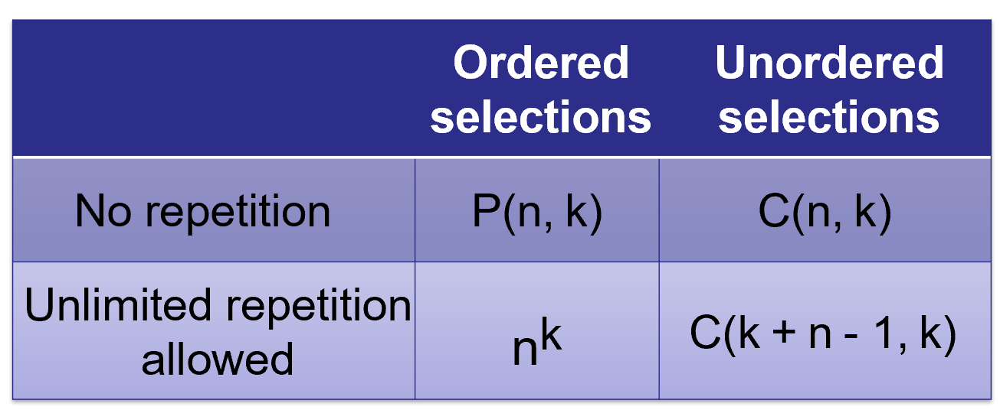
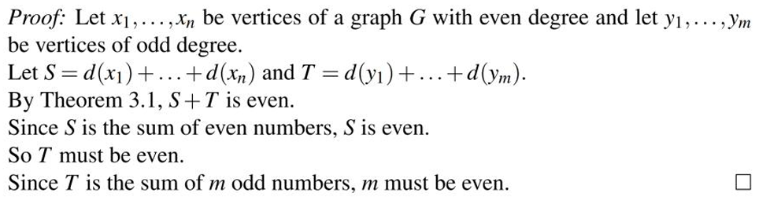

# Discrete Mathematics

[TOC]

# 1.Combinatorics


## 1.1.Basic Counting Principles 

- The Multiplication Principle (MP) for Counting Procedures (or the Product Rule)

- The Addition Principle (AP) for Counting Procedures (or the Sum Rule)


## 1.2.Selections

**排列（Permutations）和组合（Combinations）** 是组合数学的两个核心概念，它们的主要区别在于**顺序是否重要**。

------

### 排列（Permutations）

**定义**

- **排列** 指的是从 **n** 个元素中选出 **r** 个，并且**考虑顺序**的安排方式。
- 例如，选 3 个人排成一排，A、B、C 和 B、A、C 是**不同**的排列。

**排列公式**

$P(n, r) = \frac{n!}{(n - r)!}$

其中：

- $n!$（n 的阶乘）表示从 **n** 个元素中选出所有元素的排列总数。
- $(n - r)!$ 代表未选择的元素的排列数。

**示例**

从 **5** 个人中选 **2** 个，并考虑顺序（比如选出队长和副队长），计算方式：

$P(5,2) = \frac{5!}{(5-2)!} = \frac{5!}{3!} = \frac{5 \times 4 \times 3!}{3!} = 5 \times 4 = 20$

**答案：** 共有 **20** 种不同的排列方式。

------

### 组合（Combinations）

**定义**

- **组合** 指的是从 **n** 个元素中选出 **r** 个，不考虑顺序的方式。
- 例如，选 3 个人组成一个小组，A、B、C 和 B、A、C 视为**相同**的组合。

**组合公式**

$C(n, r) = \frac{n!}{r!(n - r)!}$

与排列公式相比，组合公式**多除了一个 $r!$**，因为选择的顺序无关，因此需要除去重复的排列。

**示例**

从 **5** 个人中选 **2** 个，不考虑顺序，计算方式：

$C(5,2) = \frac{5!}{2!(5-2)!} = \frac{5!}{2! \times 3!} = \frac{5 \times 4}{2 \times 1} = 10$

**答案：** 共有 **10** 种不同的组合方式。

------

### 允许重复选择的组合（Combinations with Repetition）

- 在某些情况下，选取元素时**可以重复**（如选择糖果、点菜问题）。**种类为n，选r个物品。**

- 计算方式不同，公式如下：
    $$
    C(n+r-1, r) = \frac{(n+r-1)!}{r!(n-1)!}
    $$

- 例如，有 4 种饮料，每次选 2 杯（可以重复选），共有：**三个板，两个球，共五个位置，选两个放球；**
    $$
    C(4+2-1, 2) = C(5,2) = \frac{5!}{2!(5-2)!} = 10
    $$
    **答案：** 有 **10** 种选择方式。




## 1.3.Binomial Coefficients and Combinatorial Identities


### Binomial Coefficients（二项式系数）

**定义：**

二项式系数（Binomial Coefficient）表示从 $n$ 个元素中选取 $r$ 个的方式数，通常用符号表示为：
$$
C(n, r) = \binom{n}{r} = \frac{n!}{r!(n-r)!}
$$
其中：

- $n!$（n 的阶乘）表示从 **n** 个元素中排列所有元素的方式数。
- $r!$ 由于选取顺序无关，因此需要除去重复排列的情况。
- $(n - r)!$ 处理未被选取的部分。


### Binomial Theorem（二项式定理）

**公式：**
$$
(a + b)^n = \sum_{r=0}^{n} C(n, r) a^{n-r} b^r
$$
其中：

- $C(n, r)$ 是组合数，表示选取 $r$ 项的方式数。

- 该公式用于展开二项式，如：
    $$
    (x + y)^3 = C(3,0)x^3y^0 + C(3,1)x^2y^1 + C(3,2)x^1y^2 + C(3,3)x^0y^3
    $$
    计算得：
    $$
    (x + y)^3 = x^3 + 3x^2y + 3xy^2 + y^3
    $$


### Pascal’s Identity（帕斯卡恒等式）

**1. 公式**

Pascal’s Identity（帕斯卡恒等式）是组合数学中的一个重要公式，用于计算二项式系数：
$$
C(n, r) = C(n-1, r-1) + C(n-1, r)
$$
其中：

- **左侧** $C(n, r)$ 代表从 **n** 个元素中选 **r** 个的方法数。
- **右侧第一项** $C(n-1, r-1)$ 代表**包含特定元素**的选取方式（选定某个特定元素后，从剩下的 $n-1$ 个元素中再选 $r-1$ 个）。
- **右侧第二项** $C(n-1, r)$ 代表**不包含该元素**的选取方式（完全从剩下的 $n-1$ 个元素中选 $r$ 个）。

**2. 证明**

**组合数的计数方法**

我们有 $n$ 个元素，要选 $r$ 个。假设固定选取一个特定元素 $A$：

- 如果选了 $A$，那么剩下的 $r-1$ 个必须从其余 $n-1$ 个元素中选，方式数为 $C(n-1, r-1)$。
- 如果没选 $A$，那么全部 $r$ 个必须从剩下的 $n-1$ 个元素中选，方式数为 $C(n-1, r)$。

这两种情况包含了所有可能的选法，因此：
$$
C(n, r) = C(n-1, r-1) + C(n-1, r)
$$


### Vandermonde’s Identity（范德蒙德恒等式）

**1. 公式**
$$
C(m+n, r) = \sum_{k=0}^{r} C(m, k) C(n, r-k)
$$
其中：

- $C(m+n, r)$ 是从 $m+n$ 个元素中选 $r$ 个的组合数。
- $C(m, k)$ 代表从 $m$ 个元素中选 $k$ 个的方法数。
- $C(n, r-k)$ 代表从 $n$ 个元素中选 $r-k$ 个的方法数。
- 右侧的求和表示所有可能的拆分情况。

**2. 直观理解**

Vandermonde’s Identity 说明：

- 假设有 **两组元素**：第一组有 **m** 个，第二组有 **n** 个。
- 我们想要从 **m + n** 个元素中选择 **r** 个。
- 选法可以拆分为：
    - **从第一组选 k 个**（方式数 $C(m, k)$）。
    - **从第二组选 r-k 个**（方式数 $C(n, r-k)$）。
    - 对所有可能的 $k$ 进行求和，即遍历所有可能的组合方式。


## 1.4.The Pigeonhole Principle

### 1.Directive Understanding

鸽巢原理（Pigeonhole Principle）是一个简单但非常有用的组合数学原理。它的基本思想是：

> **如果有 $n$ 只鸽子放入 $m$ 个鸽巢，并且 $n > m$，那么至少有一个鸽巢里会有两只或更多的鸽子。**

换句话说：

- **当物品的数量超过容器的数量时，至少有一个容器会包含多于一个的物品。**

------

### 2. Basic Format

**简单版**：
$$
\text{如果 } n > m, \text{ 则至少有一个鸽巢包含 } \left\lceil \frac{n}{m} \right\rceil \text{ 只鸽子。}
$$

- 例子：
    - **假设有 10 只鸽子要放入 9 个鸽巢**，那么至少有 **一个鸽巢** 里会有 **2 只鸽子**。
    - **假设有 100 名学生，分成 12 个月出生**，那么至少有一个月份会有 **至少 9 名学生**（因为 $\lceil 100 / 12 \rceil = 9$）。

------

### 3. Generalized Pigeonhole Principle

**扩展版**：
$$
\text{如果 } n > km, \text{ 那么至少有一个鸽巢包含 } k+1 \text{ 只鸽子。}
$$

- 例子：
    - **假设 31 个人被分配到 7 个不同的星期几出生**，那么至少有 **$\lceil 31/7 \rceil = 5$ 个人在同一天出生**。


# 2.Probability Theory


## 2.1.Basic Concept

- **实验（Experiment）**：产生结果的过程（如掷骰子、抛硬币）。
- **样本空间（Sample Space, S）**：所有可能结果的集合（如骰子的 S={1,2,3,4,5,6}*S*={1,2,3,4,5,6}）。
- **事件（Event, A）**：样本空间的子集（如“骰子点数为奇数”对应 A={1,3,5}*A*={1,3,5}）。
- **互斥事件（Mutually Exclusive）**：两事件无共同结果（A∩B=∅*A*∩*B*=∅）。


## 2.2.Definition

- **拉普拉斯概率（Laplace’s Probability）**（等可能空间）：
    $$
    P(A) = \frac{\text{事件 } A \text{ 中基本事件的个数}}{\text{样本空间中总的基本事件个数}} = \frac{|A|}{|\Omega|} = \frac{m}{n}
    $$

- **一般概率空间**：

    - 每个结果 $p_i$ 赋予概率 $a_i$，满足： 

        **非负性**：$ p_i \geq 0 $；

        **归一化**：$ \sum p_i = 1 $。


## 2.3.Compute Probability

- **事件概率**：$P(A) = \sum_{a_i \in A} P(a_i)$

- **并集概率（Theorem 2.2）**：
    $$
    P(A_1 \cup A_2) = P(A_1) + P(A_2) - P(A_1 \cap A_2)
    $$
    

    - 若 A1 和 A2互斥，则 

    $$
    P(A_1 \cup A_2) = P(A_1) + P(A_2)
    $$

    

## 2.4.Conditional Probability & Independent Events

- **条件概率（Conditional Probability）**：
    $$
    P(A∣E)=\frac {P(A∩E)}{P(E)} \space\space (P(E)>0)
    $$

    - 例：已知骰子点数为偶数，求点数大于3的概率。

- **独立事件（Independent Events）**：

    - 定义：$P(A∩B)=P(A)⋅P(B)$
    - 例：连续两次掷硬币的结果相互独立。


## 2.5.Bayes' Theorem

贝叶斯理论是基于**主观信念**或**已有信息**的概率框架，强调通过**新证据（数据）动态更新概率**。其核心公式为**贝叶斯定理,H代表假说，E代表证据**：


$$
P(H \mid E) = \frac{P(E \mid H) \cdot P(H)}{P(E)}
$$

- $P(H)$：先验概率（Prior），即在观察到 \( B \) 之前对 \( A \) 的初始信念。  

- **$P(E \mid H)$**：似然（Likelihood），即在 \( A \) 发生时观察到 \( B \) 的概率。  

- **$P(H \mid E)$**：后验概率（Posterior），即在观察到 \( B \) 后对 \( A \) 的更新信念。  

- $P(E)$：边缘概率（Evidence），通常通过全概率公式计算：
  $$
  P(E) = \sum_i P(E \mid H_i) \cdot P(H_i)
  $$

---

#### 2. 与经典概率的区别
| **经典概率（频率学派）**               | **贝叶斯概率**                 |
| -------------------------------------- | ------------------------------ |
| 基于长期重复事件的频率（如骰子实验）。 | 基于主观信念和证据的动态更新。 |
| 概率是客观的、固定的。                 | 概率是主观的、可随数据调整的。 |
| 不依赖先验知识。                       | 依赖先验分布（Prior）。        |

---

#### 3. 关键应用场景
1. **垃圾邮件过滤**  
   - **先验**：历史邮件中垃圾邮件的比例 $P(\text{Spam}) $
   - **似然**：垃圾邮件中出现特定关键词的概率 $P(\text{Keyword} \mid \text{Spam}) $  
   - **后验**：收到含该关键词的邮件是垃圾邮件的概率 $P(\text{Spam} \mid \text{Keyword}) $

2. **医学诊断**  
   - **先验**：人群中疾病的患病率 $P(\text{Disease}) $
   - **似然**：患者检测呈阳性的概率 $P(\text{Test+} \mid \text{Disease}) $
   - **后验**：检测呈阳性时实际患病的概率 $P(\text{Disease} \mid \text{Test+}) $

3. **机器学习**  
   - 贝叶斯网络、朴素贝叶斯分类器等模型直接基于贝叶斯定理。

---

#### 4. 贝叶斯定理的推导
从条件概率定义出发：  
$$
P(A \cap B) = P(A \mid B) \cdot P(B) = P(B \mid A) \cdot P(A)
$$

两边除以 $ P(B) $ 即得贝叶斯公式。

---

#### 5. 经典例题
**问题**：某种疾病的患病率为 $ 1\%$（先验）。检测的准确率为：  

- 真阳性率（患病且检测阳性）$ P(\text{Test+} \mid \text{Disease}) = 99\% $
- 假阳性率（未患病但检测阳性）$ P(\text{Test+} \mid \text{No Disease}) = 5\% $
求：检测呈阳性时实际患病的概率 $P(\text{Disease} \mid \text{Test+})？$

**解答**：  

1. 计算边缘概率 $P(\text{Test+}) $：  
   $$
   P(\text{Test+}) = P(\text{Test+} \mid \text{Disease}) \cdot P(\text{Disease}) + P(\text{Test+} \mid \text{No Disease}) \cdot P(\text{No Disease}) = 0.99 \times 0.01 + 0.05 \times 0.99 = 0.0594
   $$
2. 代入贝叶斯公式： 
   $$
   P(\text{Disease} \mid \text{Test+}) = \frac{0.99 \times 0.01}{0.0594} \approx 16.7\%
   $$
   
   **结论**：即使检测呈阳性，实际患病概率仅16.7%，凸显先验信息的重要性。

---

#### 6. 贝叶斯方法的优势
- **动态更新**：随着数据积累，后验概率可不断修正（如机器学习中的在线学习）。  
- **处理不确定性**：量化对未知参数的置信度（如置信区间）。  
- **结合领域知识**：通过先验分布引入专家经验。

---

#### 7. 注意事项
- **先验选择**：主观性可能导致结果偏差（需合理设定或使用无信息先验）。  
- **计算复杂度**：高维问题需依赖马尔可夫链蒙特卡洛（MCMC）等近似方法。  

---

**附：贝叶斯与频率学派的对比图示**  

```  
频率学派：参数固定 → 数据随机 → 用数据估计参数。  
贝叶斯学派：参数随机 → 数据固定 → 用数据更新参数分布。  
```


# 3.Graph Theory

图是一种由**顶点（Vertex）**和**边（Edge）**组成的结构，用于建模对象之间的关系。

## 3.1.Basic concept

- **图（Graph）**：记为 G=(V,E)，其中：
    - V 是顶点的集合（非空）。
    - E 是边的集合，边是顶点的无序对（无向图）或有序对（有向图）。
- **无向图 vs 有向图**：
    - 无向图的边无方向（如 (u,v) 和 (v,u) 等价）。
    - 有向图的边有方向（如 ⟨u,v⟩ 表示从 u 指向 v）。
- **简单图**：无自环（顶点到自身的边）和平行边（两顶点间多条边）的图。
- **多图**：允许自环和平行边。
- **权重图**：包括有向加权图和简单加权图。
- **邻接（Adjacency）**：两顶点间有边则称它们邻接。

- **度数（Degree）**：
    - 无向图：顶点的边数。
    - 有向图：分为**入度（In-degree）**和**出度（Out-degree）**。
- **路径（Path）**：顶点序列，相邻顶点间有边。
- **连通性（Connectivity）**：
    - 无向图连通：任意两顶点间存在路径。
    - 有向图强连通：任意两顶点双向可达。
- **子图（Subgraph）**：顶点和边均为原图子集的图。


## 3.2.Isomorphic Graphs

**同构图（Isomorphic Graphs）**是指两个图在**结构上完全相同**，尽管它们的顶点或边的标号可能不同。换句话说，如果两个图可以通过**重新标记顶点**的方式变得完全一致，那么它们就是同构的。

### Definition

两个图 $G_1=(V_1,E_1)$ 和 $G_2=(V_2,E_2)$ 是**同构的（isomorphic）**，记作 $G_1≅G_2$，如果存在一个**双射（bijection）**函数 $f:V_1→V_2$，使得：
$$
(u,v)∈E_1  ⟺  (f(u),f(v))∈E_2(u,v)∈E_1⟺(f(u),f(v))∈E_2
$$
即，**两个顶点在 G~1~ 中有边相连，当且仅当它们在 G~2~ 中的对应顶点也有边相连**。


## 3.3.Degree

**顶点的度数（Degree of a Vertex）** 是指与该顶点**直接相连的边的数量**，用于衡量该顶点在图中的“连接程度”。


### Handshaking Lemma — Degree-Sum Formula

对于任意无向图 $G=(V,E)$，所有顶点的度数之和等于 **2 × 边数**：
$$
\sum_{v \in V} \deg(v) = 2|E|
$$
其中：

- $deg⁡(v)$是顶点 $v$ 的度数（相邻边的数量）。
- $|E|$是图的边数。


#### Corollary

在任何无向图中，**度数为奇数的顶点个数必为偶数**。




## 3.4.Path and Cycle

### Path

**路径** 是指一个顶点序列 $v_0,v_1,v_2,…,v_k$，使得对任意 $0≤i<k$，边 $(v_i,v_{i+1})$ 都存在于图中。

**长度**：路径的边数（如 $k$ 条边）。

**简单路径（Simple Path）**：所有顶点**不重复**（无重复访问的顶点）。

- **Lemma**：在任何图中，如果两个顶点之间存在一条路径，那么它们之间**必定存在一条简单路径**（即没有重复顶点的路径）。

**欧拉路径**：

> a path that includes all of the vertices of G , traverses every edge of G exactly once and it begins and ends at distinct vertices.

- **Corollary**：一个连通图有一个欧拉路径**当且仅当**它有且仅有**两个奇度的顶点**。


### Connected

- **连通（connected）**：

    > Two vertices u and v of a graph G are connected if there is a path from u to v.

- **连通图（connected graph）**：任意两点之间都有路径。

    > A graph G is connected if for every pair of vertices u and v of G there is a path from u to v . Otherwise G is disconnected.


### Cycle

**环**（或称为**圈**）是指在图 \( G \) 中，从顶点 $v_0$ 到顶点 $v_n$ 的一个长度为 $n$ 的路径是一个由 $n+1$ 个顶点和 $n$ 条边组成的交替序列：
$$
v_0, e_1, v_1, e_2, \dots, v_{n-1}, e_n, v_n
$$


其中，每条边 $e_i$ 连接顶点 $v_{i-1}$ 和 $v_i$，对于 $i = 1, \dots, n$。**（无重复边，可以有重复点）**

**简单环（Simple Cycle）**：如果环中所有的顶点（除了起始点和终止点）都不重复，那么这个环是一个简单环。**（无重复边，除起点外无重复点）**

> A simple cycle is a cycle from v to v in which, **except for the beginning and ending vertices** that are both equal to v, there are no repeated vertices. 

**欧拉回路（Euler Cycle）**：通过图中每条边且每条边只被经过一次的路径。

- **Euler’s Theorem**：一个至少有一条边的连通图，具有一个欧拉循环**当且仅当**它没有奇度的顶点。


## 3.5.Subgraph

Let H and G be graph 

**子图**。H is a **subgraph** of G (H ⊆G), if V(H) ⊆ V(G) and E(H) ⊆ E(G) . 

**真子图**。H is a **proper subgraph** of G if H is a subgraph of G and H ≠ G.（H ≠ G:点集合，边集合 有一个不同即可） 

**诱导子图**（难理解）。H is an **induced subgraph** of G,if H is a subgraph of G such that every edge with both endnodes in V(H) is also an edge of H.  称His the subgraph of G induced by the node set V(H).

> 当我们从图G中选取一部分顶点V'⊆V，然后构造一个新的图G'=(V', E')，其中E'包含了所有在V'中顶点之间的边，这样的图G'就称为G的诱导子图。


## 3.6.Connected Component

**第一种定义**从顶点划分的角度出发，将图分成若干连通的“块”，每个块是一个诱导子图，且这些子图是图的连通分量。

**第二种定义**从子图的角度出发，强调连通分量是最大的连通子图，无法再通过添加顶点或边而保持连通。

**等价性**：第一种定义中的每个诱导子图 $ G_i $（由 $ V_i $ 诱导）正是第二种定义中的一个最大连通子图。因为：

- $ G_i $ 是连通的（内部顶点间有路径）。
- $ G_i $ 是最大的（如果加入任何不在 $ V_i $ 的顶点或边，会破坏连通性，因为不同 $ V_i $ 和 $ V_j $ 的顶点间无路径）。

> Note that connected graphs only have one component.


## 3.7.Bipartite Graphs

**二分图**： 一个图 $ G = (V, E) $ 是**二分图**，如果其顶点集 $ V $ 可以被划分为两个**不相交的子集** $ V_1 $ 和 $ V_2 $，满足：

1. $ V = V_1 \cup V_2 $ 且 $ V_1 \cap V_2 = \emptyset $（顶点集被划分为两个互斥的部分）。
2. 图中每条边 $e \in E$的两个端点分别属于 $V_1 $和 $V_2$，即：
    - 对于每条边 $ e = (u, v) \in E $，若 $ u \in V_1 $，则 $ v \in V_2 $，反之亦然。
    - 换句话说，$ V_1 $ 内部和 $ V_2 $ 内部没有边。

**二分区（bipartition）**：二分图可以表示为 $G = (V_1, V_2, E)$ 或者 $G = (V_1, V_2)$，其中 $ E \subseteq V_1 \times V_2 $。这种划分称为**二部划分**（bipartition）。

>  Note that a simple graph G on one vertex u is bipartite because we can let X = {u} and Y = ∅ 。

**闭合回路（closed path）**：起点终点相同的路径。

>  A closed path is a path that begins and ends at the same vertex .

:star: A path or a cycle is even or odd depending on the parity（奇偶性）of its length.

- **Lemma**：Every odd closed path contains an odd simple cycle.

    > 注意：every even closed path contains an even simple cycle 这句话是错的。

- **Theorem**：A graph is bipartite if and only if it contains no odd simple cycle.


## 3.8.Deletion

### Edge Deletion

- Let $$G$$ be a graph.

- **删边（只删边不删点）**： For $$M⊆ E(G)$$,$$G/\ M$$ is the graph obtained from $$G$$ by removing the edges from $$M$$. So $$G /\ M = (V(G),E(G) /\ M) $$. 
- **Lemma**：Let G be a connected graph. An edge e is not a cut-edge if and only if it belongs to a cycle.

### Vertex Deletion

- For $$S ⊆V(G)$$, $$G[S]$$ is the subgraph of $$G$$ induced by $$S$$.

- **删点（删点也删边）**： For $$ S ⊆V(G)$$, $$G /\ S$$ is the graph obtained from $$G$$ by removing the vertices from $$S$$（and we also remove all edges of $E(G)$ that are incident to a vertex in $$S$$). So $G/\ S = G[V(G) /\ S]$.


## 3.9.Tree

- **树**：A tree is a connected graph with no cycles.

- **叶**：A leaf is a vertex of degree 1.

- **Lemma**：
    1. Every tree with at least two vertices has at least two leaves.
    2. Delete a leaf from a tree with n vertices, results in a tree with n − 1 vertices.(删点也删边)


