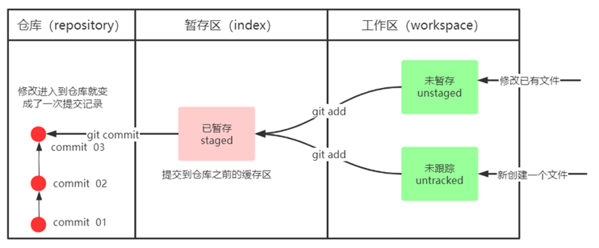
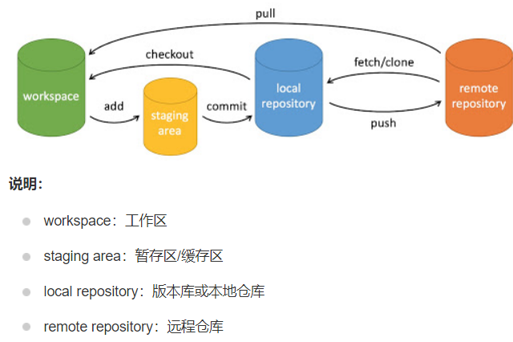

# Git 分布式版本控制工具

[TOC] 

# 简介

Git 是一个分布式版本控制系统，用于跟踪计算机文件的修改，尤其是源代码。它允许多个开发者协作，同时维护项目的历史记录。

应用场景：

1. 场景一：**备份** 小明负责的模块就要完成了，就在即将Release之前的一瞬间，电脑突然蓝屏，硬盘光荣牺牲！几个月 来的努力付之东流 
2. 场景二：**代码还原** 这个项目中需要一个很复杂的功能，老王摸索了一个星期终于有眉目了，可是这被改得面目全非的 代码已经回不到从前了。什么地方能买到哆啦A梦的时光机啊？ 
3. 场景三：**协同开发** 小刚和小强先后从文件服务器上下载了同一个文件：Analysis.java。小刚在Analysis.java 文件中的第30行声明了一个方法，叫count()，先保存到了文件服务器上；小强在Analysis.java文件中的 第50行声明了一个方法，叫sum()，也随后保存到了文件服务器上，于是，count()方法就只存在于小刚的记 忆中了 
4. 场景四：**追溯问题代码的编写人和编写时间！** 老王是另一位项目经理，每次因为项目进度挨骂之后，他都不知道该扣哪个程序员的工资！就拿这 次来说吧，有个Bug调试了30多个小时才知道是因为相关属性没有在应用初始化时赋值！可是二胖、王东、刘 流和正经牛都不承认是自己干的！






# 基本命令

```shell
# 配置信息
git config --global user.name “itcast”
git config --global user.email “hello@itcast.cn”


# 1. 打开用户目录，创建.bashrc 文件
# 2. 在.bashrc 文件中输入如下内容：
#用于输出git提交日志
alias git-log='git log --pretty=oneline --all --graph --abbrev-commit'
#用于输出当前目录所有文件及基本信息
alias ll='ls -al'


# 初始化一个新的 Git 仓库(在工作文件夹里新建.git文件)
git init

# 查看当前状态
git status [filename]

# 查看git日志
git log [--option]
    options
    --all 显示所有分支
 	--pretty=oneline 将提交信息显示为一行
 	--abbrev-commit 使得输出的commitId更简短
 	--graph 以图的形式显
git-log

# 从工作区添加到缓存区
git add [filename]
git add .             #或者添加所有修改的文件

# 从缓存区提交到仓库
git commit
git commit -m "message"    #提交暂存区的更改，附上提交信息。
```


# 分支

```shell
# 创建本地分支
git branch branchname

# 查看分支
git branch     #本地所有分支
git branch -r  #远程所有分支
git branch -a  #本地和远程所有分支

# 切换分支
git checkout branchname
git checkout -b branchname #创建新分支并切换到该分支

# 合并分支(将其他分支合并到当前分支)
git checkout curBranch
git merge otherBranch


# 删除分支
git checkout -d branchname  #本地
git push origin --delete <branchname>  #远程
```


# 远程仓库

每远程仓库有相应的代码托管平台为你提供对应的`url`。在本地，远程仓库可以被命名以便使用。

在 Git 中，当你使用 `git clone` 克隆一个仓库时，Git 会自动将远程仓库命名为 `origin`。这是默认行为，所以你通常不需要手动添加远程仓库。

```shell
git clone git@github.com:user/repo.git

# 查看远程信息
git remote -v
> origin  git@github.com:user/repo.git (fetch)
> origin  git@github.com:user/repo.git (push)
```

# 工作流程

## 克隆仓库

如果你要参与一个已有的项目，首先需要将远程仓库克隆到本地：

```shell
git clone https://github.com/username/repo.git
cd repo
```

## 创建新分支

为了避免直接在 main 或 master 分支上进行开发，通常会创建一个新的分支：

```shell
git checkout -b new-feature
```

## 工作目录

在工作目录中进行代码编辑、添加新文件或删除不需要的文件。

## 暂存文件

将修改过的文件添加到暂存区，以便进行下一步的提交操作：

```shell
git add filename
# 或者添加所有修改的文件
git add .
```

## 提交更改

将暂存区的更改提交到本地仓库，并添加提交信息：

```shell
git commit -m "Add new feature"
```

## 拉取最新更改

在推送本地更改之前，最好从远程仓库拉取最新的更改，以避免冲突：

```shell
git pull origin main
# 或者如果在新的分支上工作
git pull origin new-feature
```

## 推送更改

将本地的提交推送到远程仓库：

```shell
git push origin new-feature
```

## 创建 Pull Request（PR）

在 GitHub 或其他托管平台上创建 Pull Request，邀请团队成员进行代码审查。PR 合并后，你的更改就会合并到主分支。

## 合并更改

在 PR 审核通过并合并后，可以将远程仓库的主分支合并到本地分支：

```shell
git checkout main
git pull origin main
git merge new-feature
```

## 删除分支

如果不再需要新功能分支，可以将其删除：

```shell
git branch -d new-feature
```

或者从远程仓库删除分支：

```shell
git push origin --delete new-feature
```


# 常用操作

## 推送至远程仓库 git push

如果是参与到已有的项目（远程仓库里已经有代码的情况）

```shell
# 参与已有项目 git clone <url>
git clone git@github.com:glim137137/mynotes.git

# working ... ...

git branch -m main
git branch -a

git add .
git commit -m "2025-3-15"

# 推送至远程仓库 git push <remote_name> <branch_name>
git push origin main
```

如果是新项目（远程仓库里是个空项目），

```shell
# 新项目
git init

# working ... ...

git branch -m main
git branch -a

git add .
git commit -m "2025-3-15"

# 添加远程库 git remote add <remote_name> <url>
git remote add origin git@github.com:glim137137/mynotes.git

# 推送至远程仓库 git push <remote_name> <branch_name>
git push origin main
```

## 描述规范 git commit -m

### 提交信息的标准格式

推荐使用 **Conventional Commits** 规范（类似 Angular 规范），结构如下：

```plaintext
<类型>(<作用域>): <简短描述>
```

- **类型（Type）**：说明提交的性质（如功能、修复、文档等）。
- **作用域（Scope）**（可选）：说明改动影响的范围（如模块、文件名）。
- **简短描述**：用一句话说明本次提交的目的。

------

### 常见提交类型（Type）

| 类型       | 说明                                                 | 示例                               |
| :--------- | :--------------------------------------------------- | :--------------------------------- |
| `feat`     | 新增功能（Feature）                                  | `feat(user): 添加用户登录功能`     |
| `fix`      | 修复 Bug                                             | `fix(auth): 修复密码验证失败问题`  |
| `docs`     | 文档更新（如 README、注释）                          | `docs(README): 更新安装步骤`       |
| `style`    | 代码样式调整（空格、分号等，不改变逻辑）             | `style: 格式化代码缩进`            |
| `refactor` | 代码重构（既不是修复 Bug，也不是新增功能）           | `refactor(payment): 优化支付逻辑`  |
| `perf`     | 性能优化                                             | `perf(db): 优化查询性能`           |
| `test`     | 测试用例相关                                         | `test(api): 添加用户接口测试`      |
| `chore`    | 构建流程或辅助工具的变动（如依赖更新、配置文件修改） | `chore: 升级 Spring Boot 到 3.1.0` |
| `revert`   | 回滚某次提交                                         | `revert: 撤销某次错误提交`         |

## 修改提交历史 git rebase

首先启动交互式 `rebase`

```shell
git rebase -i --root # 从仓库的第一个提交（根提交）开始操作
git rebase -i HEAD~n # 只能操作最近的 n 个提交
```

这会打开编辑器，显示类似以下内容：

```shell
pick a1b2c3d Commit message 1
pick b2c3d4e Commit message 2
pick c3d4e5f Commit message 3
```

你可以修改这些行来：

- **pick**: 保留提交不变
- **reword**: 保留提交但修改提交信息
- **edit**: 保留提交但暂停以进行修改
- **squash**: 将提交合并到前一个提交中
- **fixup**: 类似 squash 但丢弃提交信息
- **drop**: 删除提交

最后将 rebase 后的更改推送到远程

```shell
# 强制推送到远程
git push -f origin main
git push origin branch-name --force
# 或更安全的
git push origin branch-name --force-with-lease
```


