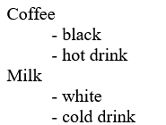

# HTML (Hyper Text Markup Language) 超文本标记语言 

[TOC]

# 1.简介

## HTML 标签

HTML 标记标签通常被称为 HTML 标签 (HTML tag)。

- HTML 标签是由*尖括号*包围的关键词，比如 `<html>`
- HTML 标签通常是*成对出现*的，比如` <b> `和 `</b>`
- 标签对中的第一个标签是*开始标签*，第二个标签是*结束标签*
- 开始和结束标签也被称为*开放标签*和*闭合标签*

## HTML 文档 = 网页

- HTML 文档*描述网页*
- HTML 文档*包含 HTML 标签*和纯文本
- HTML 文档也被称为*网页*

Web 浏览器的作用是读取 HTML 文档，并以网页的形式显示出它们。浏览器不会显示 HTML 标签，而是使用标签来解释页面的内容：

```html
<!DOCTYPE html>
<html>
<head>
<meta charset="utf-8">
<title>菜鸟教程(runoob.com)</title>
</head>
<body>
 
<h1>我的第一个标题</h1>
 
<p>我的第一个段落。</p>
 
</body>
</html>
```


# 2.标签

## 2.1.文字

### 注释< !-- -->

```html
<!-- 这是一个注释 -->
```


### 标题< h1>< /h1>

```html
<h1> 这是一个标题 </h1>
<h2> 这是一个标题 </h2>
<h3> 这是一个标题 </h3>
<h4> 这是一个标题 </h4>
<h5> 这是一个标题 </h5>
<h6> 这是一个标题 </h6>
```


### 段落< p>< /p>

```html
<p>这是一个段落</p>
<hr>
<p>这是一个段落</p>
<hr>
<p>这是一个段落</p>
```


### 链接< a>

属性：

- **href**：指定链接目标的URL，这是链接的最重要属性。可以是另一个网页的URL、文件的URL或其他资源的URL。

- **target**（可选）：指定链接如何在浏览器中打开。

  - `_blank`（在新标签或窗口中打开链接）
  - `_self`（在当前标签或窗口中打开链接）。

- **title**（可选）：提供链接的额外信息，通常在鼠标悬停在链接上时显示为工具提示。

- **rel**（可选）：规定当前文档与目标 URL 之间的关系。

  | 值         | 描述                                                         |
  | :--------- | :----------------------------------------------------------- |
  | alternate  | 文档的替代版本（比如打印页、翻译或镜像）。                   |
  | author     | 链接到文档的作者。                                           |
  | bookmark   | 用于书签的永久网址                                           |
  | help       | 链接到帮助文档                                               |
  | license    | 链接到文档的版权信息。                                       |
  | next       | 选项中的下一个文档                                           |
  | nofollow   | nofollow 是一个HTML标签的属性值。这个标签的意义是告诉搜索引擎"不要追踪此网页上的链接"或"不要追踪此特定链接。 |
  | noreferrer | 如果用户点击链接指定浏览不要发送 HTTP referer 头部信息。     |
  | prefetch   | 指定的目标文件应该被缓存                                     |
  | prev       | 选项中的前一个文档                                           |
  | search     | 文档链接到搜索工具                                           |
  | tag        | 当前文档的标签(关键词)                                       |

```html
<a href="https://www.baidu.com/">这是一个链接</a>
```


### 表格< table>< /table>

```html
<table>
  <caption>表格标题</caption>
    
  <colgroup>
    <col span="2" style="background-color:red">
    <col style="background-color:yellow">
  </colgroup>
    
  <thead>
    <tr>
      <th>列标题1</th>
      <th>列标题2</th>
      <th>列标题3</th>
    </tr>
  </thead>
    
  <tfoot>
    <tr>
      <td>行3，列1</td>
      <td>行3，列2</td>
      <td>行3，列3</td>
    </tr>
  </tfoot>
    
  <tbody>
    <tr>
      <td>行1，列1</td>
      <td>行1，列2</td>
      <td>行1，列3</td>
    </tr>
    <tr>
      <td>行2，列1</td>
      <td>行2，列2</td>
      <td>行2，列3</td>
    </tr>
  </tbody>
</table>
```

子标签：

- **caption**：标签定义表格的标题。
- **colgroup**：标签用于对表格中的列进行组合，以便对其进行格式化。
- **col**：标签规定了 元素内部的每一列的列属性。


- **thead**：用于定义表格的标题部分，在 < thead > 中，使用 < th > 元素定义列的标题，以上实例中列标题分别为"列标题1"，"列标题2"和"列标题3"。
- **th**：th 是 table header的缩写，表示表格的表头单元格。
- **tfoot**：标签用于组合 HTML 表格的页脚内容，页脚就是最后一行

- **tbody**：用于定义表格的主体部分， 在 < tbody > 中，使用 < tr > 元素定义行，并在每行中使用 < td > 元素定义单元格数据，以上实例中有两行数据，每行包含三个单元格。

- **tr**：tr 是 table row 的缩写，表示表格的一行。

- **td**：td 是 table data 的缩写，表示表格的数据单元格。

  

### 列表< ul>< /ul> < ol>< /ol> < dl>< /dl>

```html
<!-- 无序列表 -->
<ul>
  <li>Coffee</li>
  <li>Milk</li>
</ul>

<!-- 有序列表 -->
<ol>
  <li>Coffee</li>
  <li>Milk</li>
</ol>

<!-- 自定义列表 -->
<dl>
  <dt>Coffee</dt>
    <dd>- black</dd>
    <dd>- hot drink</dd>
  <dt>Milk</dt>
    <dd>- white</dd>
    <dd>- cold drink</dd>
</dl>
```

子标签：

- **li**：定义列表项目

- **dt**：自定义列表项目

- **dd**：定义自定列表项目的描述

  

### 表单< form>< /form>

属性：

- `action` 属性定义了表单数据提交的目标 URL。

- `method` 属性定义了提交数据的 HTTP 方法（这里使用的是 "post"）。
  - **post**
  - **get**

```html
<form action="url" method="post">
    <!-- 文本输入框 -->
    <label for="name">用户名:</label>
    <input type="text" id="name" name="name" required>

    <br>

    <!-- 密码输入框 -->
    <label for="password">密码:</label>
    <input type="password" id="password" name="password" required>

    <br>

    <!-- 单选按钮 -->
    <label>性别:</label>
    <input type="radio" id="male" name="gender" value="male" checked>
    <label for="male">男</label>
    <input type="radio" id="female" name="gender" value="female">
    <label for="female">女</label>

    <br>

    <!-- 复选框 -->
    <input type="checkbox" id="subscribe" name="subscribe" checked>
    <label for="subscribe">订阅推送信息</label>

    <br>

    <!-- 下拉列表 -->
    <label for="country">国家:</label>
    <select id="country" name="country">
        <optgroup label="asia">
            <option value="cn">CN</option>
            <option value="jpn">JPN</option>
        </optgroup>
        <optgroup label="europe">
            <option value="uk">UK</option>
            <option value="ger">GER</option>
        </optgroup>
    </select>
    
    <br>
    
    <!-- 文本域 -->
    <label for="profile">简介：</label>
    <textarea id="profile" rows="10" cols="30"></textarea>

    <br>

    <!-- 提交按钮 -->
    <input type="submit" value="提交">
</form>
```

子标签：

- **label**：为表单元素添加标签，提高可访问性。
  - **for**：用于关联**id**属性
- **input**：文本输入框、密码框、单选按钮、复选框等。
  - **type**：定义了输入框的类型。
    - **text**：普通的单行文本输入框。
    - **password**：隐藏输入字符的密码输入框。
    - **radio**：单选按钮。
    - **checkbox**：创建复选框。
    - **email**：验证输入内容为电子邮件地址格式的输入框。
    - **number**：只允许输入数字的输入框。
    - **date**：允许用户选择日期的输入框。
    - **file**：允许用户上传文件的输入框。
    - **submit**：提交表单的按钮。
    - **button**：普通按钮，不会自动提交表单，可以通过 JavaScript 进行事件处理。
    - **reset**：重置表单的按钮，恢复表单中的所有输入内容为默认值。
  - **id**：用于关联 `<label>` 元素
  - **name**：用于标识表单字段
  - **value**：指定其初始值
- **select**：下拉列表。
  - **option**：用于定义下拉列表中的选项。
  - **optgroup**：选项组。
    - **label**：选项组名称。
- **textarea**：文本域 (一个多行的输入控件)。
- **fieldset**：一组相关的表单元素，并使用外框包含起来。
  - **legand**：**fieldset** 元素的标题
- **button**：按钮。比 `<input type="button">` 更灵活，可以包含其他 HTML 元素，如图片、表情符号等
  - **type**：
    - **submit**：提交表单
    - **button**：不会自动提交表单的按钮，通常与 JavaScript 一起使用
    - **reset**：重置表单
  - **disabled**：如果设置为 `disabled`，按钮将不可点击。
  - **form**：指定按钮要关联的表单的 `id`（在按钮不在表单内时很有用）

## 2.2.符号

### 水平线< hr>

```html
<p>下面的是水平线</p>
<hr>
<p>上面的是水平线</p>
```


### 换行< br>

```html
<p>这个<br>段落<br>演示了分行的效果</p>
```


### 空格& nbsp;  < pre>

```html
<!-- 不间断空格 -->
<p>这&nbsp;&nbsp;&nbsp;里&nbsp;&nbsp;有多个空格。</p>

<!-- 保持原样格式 -->
<pre>
这里     有很多空格
  以及缩进。
</pre>
```


### 文本格式化

| 标签          | 描述                                                  |
| :------------ | :---------------------------------------------------- |
| < b>          | 粗体                                                  |
| < i>          | 斜体                                                  |
| < del>        | 删除字（删除线）                                      |
| < sup> < sub> | 上标下标                                              |
| < ins>        | 插入字（下划线）                                      |
| < code>       | 计算机代码文本。                                      |
| < var>        | 变量。可以将此标签与 < pre> 及 < code> 标签配合使用。 |
| < abbr>       | 缩写。                                                |
| < center>     | 剧中。                                                |

## 2.3.多媒体

### 图像< img>

属性：

- **src**：图像的 URL 地址
- **alt**：为图像定义一串预备的可替换的文本
- **width**，**height**
- **usemap**

```html


<map name="planetmap">
  <area shape="rect" coords="0,0,82,126" alt="Sun" href="sun.html">
  <area shape="circle" coords="90,58,3" alt="Mercury" href="mercur.html">
  <area shape="circle" coords="124,58,8" alt="Venus" href="venus.html">
</map>
```

子标签：

- **map**：地图图像，带有可点击区域的图像映射
  - **area**：定义图像映射内部的区域（图像映射指的是带有可点击区域的图像）
    - **href**，**herflang**，**target**，**rel**
    - **alt**
    - **shape**：规定区域的形状
      - **rect**：矩形区域。使用左上角和右下角的坐标来定义，例如 `coords="x1,y1,x2,y2"`
      - **circle**：圆形区域。使用圆心坐标和半径来定义，例如 `coords="x,y,r"`
      - **poly**：多边形区域。使用一系列坐标定义多边形的各个顶点，例如 `coords="x1,y1,x2,y2,..."`。
      - **default**：定义图像映射中除其他区域外的所有剩余部分作为可点击区域。
    - **coords**：可点击区域的坐标。


### 画布< canvas>< /canvas>

Canvas 通过 JavaScript 来绘制 2D 图形。

```html
<canvas id="myCanvas" width="200" height="100" style="border:1px solid #000000;"></canvas>
```

canvas 元素本身是没有绘图能力的。所有的绘制工作必须在 JavaScript 内部完成：

```js
var c=document.getElementById("myCanvas");
var ctx=c.getContext("2d");
ctx.fillStyle="#FF0000";
ctx.fillRect(0,0,150,75);
```


### 可伸缩矢量图形< svg>< /svg>

SVG 是一种使用 XML 描述 2D 图形的语言。

```html
<!-- 原型 -->
<svg xmlns="http://www.w3.org/2000/svg" version="1.1">
   <circle cx="100" cy="50" r="40" stroke="black" stroke-width="2" fill="red" />
</svg>

<!-- 五角星 -->
<svg xmlns="http://www.w3.org/2000/svg" version="1.1" height="190">
  <polygon points="100,10 40,180 190,60 10,60 160,180"
  style="fill:lime;stroke:purple;stroke-width:5;fill-rule:evenodd;">
</svg>
```

SVG（Scalable Vector Graphics）是一种基于XML的矢量图形格式，用于在网页上展示图形和图像。它的最大特点是可缩放，能够在不同大小的屏幕上保持高质量。通过SVG，你可以绘制各种形状、文本、路径、渐变、动画等。

### SVG 基本结构

一个基本的 SVG 文件结构如下所示：

```xml
<svg width="200" height="200" xmlns="http://www.w3.org/2000/svg">
  <!-- 这里是图形元素 -->
</svg>
```

- `width` 和 `height` 属性指定了 SVG 画布的宽度和高度。
- `xmlns` 是一个命名空间属性，指示这是一个 SVG 文件。

#### 常用的 SVG 元素

1. **矩形（）**

   用于绘制矩形，支持圆角、填充颜色等属性。

   ```xml
   <svg width="200" height="200" xmlns="http://www.w3.org/2000/svg">
     <rect x="10" y="10" width="100" height="50" fill="blue" />
   </svg>
   ```

   - `x`, `y`：矩形的左上角坐标。
   - `width`, `height`：矩形的宽度和高度。
   - `fill`：矩形的填充颜色。

2. **圆形（）**

   用于绘制圆形，通过圆心坐标和半径定义。

   ```xml
   <svg width="200" height="200" xmlns="http://www.w3.org/2000/svg">
     <circle cx="100" cy="100" r="50" fill="green" />
   </svg>
   ```

   - `cx`, `cy`：圆心的坐标。
   - `r`：圆的半径。
   - `fill`：圆的填充颜色。

3. **椭圆（）**

   用于绘制椭圆，通过圆心坐标、水平半径和垂直半径定义。

   ```xml
   <svg width="200" height="200" xmlns="http://www.w3.org/2000/svg">
     <ellipse cx="100" cy="100" rx="80" ry="40" fill="red" />
   </svg>
   ```

   - `cx`, `cy`：椭圆的圆心坐标。
   - `rx`, `ry`：水平和垂直半径。

4. **线段（）**

   用于绘制一条从指定坐标到指定坐标的直线。

   ```xml
   <svg width="200" height="200" xmlns="http://www.w3.org/2000/svg">
     <line x1="10" y1="10" x2="100" y2="100" stroke="black" stroke-width="2" />
   </svg>
   ```

   - `x1`, `y1`：线段的起点坐标。
   - `x2`, `y2`：线段的终点坐标。
   - `stroke`：线条的颜色。
   - `stroke-width`：线条的宽度。

5. **多边形（）**

   用于绘制任意形状的多边形，通过指定多个点坐标。

   ```xml
   <svg width="200" height="200" xmlns="http://www.w3.org/2000/svg">
     <polygon points="50,150 100,50 150,150" fill="yellow" stroke="black" stroke-width="2" />
   </svg>
   ```

   - `points`：多个点的坐标，顶点之间用空格分开。

6. **路径（）**

   路径是 SVG 中最强大的绘制工具，允许绘制复杂的形状和曲线。路径由一系列的命令组成，如 `M`（移动到）、`L`（直线到）、`C`（贝塞尔曲线）等。

   ```xml
   <svg width="200" height="200" xmlns="http://www.w3.org/2000/svg">
     <path d="M10 10 H 90 V 90 H 10 L 10 10" fill="transparent" stroke="black" stroke-width="2" />
   </svg>
   ```

   - ```
     d
     ```

     ：路径的数据。

     - `M`：移动到某个点。
     - `H`：水平直线。
     - `V`：垂直直线。
     - `L`：画直线。
     - `C`：贝塞尔曲线。

#### 常用属性

- **fill**：指定图形的填充颜色。
- **stroke**：指定图形的边框颜色。
- **stroke-width**：指定图形边框的宽度。
- **opacity**：设置透明度。
- **transform**：对图形进行变换，如平移、旋转、缩放等。

#### 示例：组合形状

```xml
<svg width="200" height="200" xmlns="http://www.w3.org/2000/svg">
  <!-- 绘制矩形 -->
  <rect x="10" y="10" width="100" height="50" fill="blue" />
  <!-- 绘制圆形 -->
  <circle cx="150" cy="30" r="20" fill="red" />
  <!-- 绘制路径 -->
  <path d="M10 100 L100 150 L10 150 Z" fill="green" />
</svg>
```

#### 动画和交互

SVG 也支持动画。你可以通过 `<animate>` 元素在 SVG 中创建动画。

```xml
<svg width="200" height="200" xmlns="http://www.w3.org/2000/svg">
  <circle cx="50" cy="50" r="20" fill="green">
    <animate attributeName="cx" from="50" to="150" dur="2s" repeatCount="indefinite" />
  </circle>
</svg>
```

这个示例会使圆形在横向上做来回动画。

#### 总结

SVG 是一种非常强大且灵活的绘图语言，适用于Web开发中的图形展示。它的优势在于图形可以缩放而不失真，适用于从简单的形状到复杂的图形和动画的表现。你可以根据需求选择合适的元素、属性和方法来绘制和控制图形。

如果你对某个部分有更详细的需求或问题，欢迎随时提出！


### 视频< video>< /video>

属性：

- **width**，**height**
- **controls**：用于向用户显示视频的播放控件

```html
<video width="320" height="240" controls>
  <source src="movie.mp4" type="video/mp4">
  <source src="movie.ogg" type="video/ogg">
</video>
```

子标签：

- **source**：定义多种媒体资源

  - **src**

  - **type**：视频的MIME类型

    | 格式 | MIME-type  |
    | :--- | :--------- |
    | MP4  | video/mp4  |
    | WebM | video/webm |
    | Ogg  | video/ogg  |

- **track**：定义在媒体播放器文本轨迹


### 音频< audio>< /audio>

属性：

- **controls**：用于向用户显示音频的播放控件

```html
<audio controls>
  <source src="horse.ogg" type="audio/ogg">
  <source src="horse.mp3" type="audio/mpeg">
</audio>
```

子标签：

- **source**：定义多种媒体资源

  - **src**

  - **type**：音频的MIME类型

    | 格式 | MIME-type  |
    | :--- | :--------- |
    | MP3  | audio/mpeg |
    | Ogg  | audio/ogg  |
    | Wav  | audio/wav  |

  

## 2.4.布局

### 头部< header>< /header>

```html
<!DOCTYPE html>
<html lang='en'>
<head> 
  <meta charset="utf-8">
  <meta name="keywords" content="HTML, learning">
  <meta name="description" content="免费 Web & 编程 教程">
  <meta name="author" content="glim">
    
  <base href="http://www.runoob.com/images/" target="_blank">
    
  <link rel="stylesheet" type="text/css" href="mystyle.css">
    
  <style type="text/css">
    body {
        background-color:yellow;
    }
    p {
        color:blue;
    }
  </style>

  <title>文档标题</title>
</head>
</html>
```


子标签：

- **meta**：提供了一些元数据，也不显示在页面上，但会被浏览器解析。通常用于指定网页的描述，关键词，文件的最后修改时间，作者，和其他元数据。元数据可以使用于浏览器（如何显示内容或重新加载页面），搜索引擎（关键词），或其他Web服务。

  - **charset**：定义 HTML 文档的字符编码。

  - **name**：元数据的名称。通常与 `content` 属性配合使用，描述页面的一些信息。
    - **description**：网页的简短描述，通常显示在搜索引擎的结果中。
    
    - **keywords**：与网页内容相关的关键词，用于搜索引擎优化（SEO）。
    
    - **author**：文档的作者。
    
  - **http-equipv**：相当于 HTTP 头部的一些功能。
  
    - **refresh**：设置自动刷新或跳转页面的时间。
    - **content-type**：设置文档的 MIME 类型和字符编码。
  
  - **content**：与 `name, http-equipv ` 属性配合使用
  
- **title：**文档的标题

- **base**：描述了基本的链接地址/链接目标，该标签作为HTML文档中所有的链接标签的默认链接
  - **href**，**target**
  
- **link**：定义了文档与外部资源之间的关系，常用于链接到样式表。

  - **rel**，**type**，**href**

- **style**：直接添加样式来渲染 HTML 文档

- **script**：用于加载脚本文件

### 主体< body>< /body>

```html
<!DOCTYPE html>
<html lang="zh">
<head>
  <meta charset="UTF-8">
  <meta name="viewport" content="width=device-width, initial-scale=1.0">
  <title>我的博客</title>
</head>
<body>

  <header>
    <h1>我的博客</h1>
    <nav>
      <ul>
        <li><a href="#home">首页</a></li>
        <li><a href="#about">关于</a></li>
        <li><a href="#blog">博客</a></li>
        <li><a href="#contact">联系</a></li>
      </ul>
    </nav>
  </header>

  <main>
    <article>
      <h2>博客文章标题</h2>
      <p>这是博客文章的主要内容。</p>
    </article>
  </main>

  <footer>
    <p>版权所有 &copy; 2024 我的博客</p>
    <ul>
      <li><a href="#privacy">隐私政策</a></li>
      <li><a href="#terms">使用条款</a></li>
    </ul>
  </footer>

</body>
</html>

```

子标签：

- **header**：定义页面或某个部分的头部内容，通常包含导航、标题、Logo等内容。
  - **nav**：导航栏，一般后面是无序列表
- **main**：用于包含页面的主要内容，它是页面中最重要的部分，应该是唯一的，不能在一个页面中使用多次。它的内容应与页面的核心主题相关。
- **footer**：定义页面或部分的底部内容，通常包括版权声明、联系信息、友情链接、社交媒体链接等。


### 区块< div>< /div> < span>< /span>

```html
<!-- 文档中的一个区域将显示为蓝色 -->
<div style="color:#0000FF">
  <h3>这是一个在 div 元素中的标题。</h3>
  <p>这是一个在 div 元素中的文本。</p>
</div>

<!-- 使用 <span> 元素对文本中的一部分进行着色 -->
<p>我的母亲有 <span style="color:blue">蓝色</span>的眼睛。</p>
```


### 框架< iframe>< /iframe>

属性：

- **src**
- **width**，**height**
- **frameborder**：边框粗细
- **name**：显示一个目标链接的页面，目标链接的属性必须使用 iframe 的属性。

```html
<iframe src="demo_iframe.html" width="200" height="200" frameborder="0" name="iframe_a"></iframe>

<p><a href="https://www.runoob.com" target="iframe_a" rel="noopener">RUNOOB.COM</a></p>
```


## 2.5.其他

### 颜色

141个颜色名称是在HTML和CSS颜色规范定义的（17标准颜色，再加124）。

### 脚本


### ISO 639-1 语言代码

两字符语言代码。主要用于标识最广泛使用的语言。

- 例子：
  - `en`：英语
  - `zh`：中文
  - `fr`：法语
