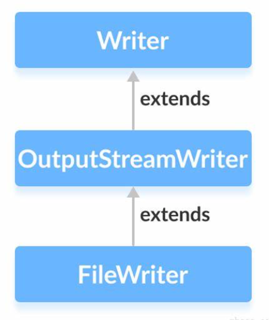

# Java

[TOC]


**起源与发展**

1. **诞生**：Java由Sun Microsystems（现已被Oracle收购）的詹姆斯·高斯林（James Gosling）等人开发。项目始于1991年，最初被称为“Green Project”，目标是为智能家电（如机顶盒）创建一种通用的编程语言。
2. **命名**：最初语言名叫“Oak”（橡树），但由于商标冲突，后来改名为“Java”，灵感据说来自开发团队常喝的爪哇咖啡（Java Coffee）。
3. **首次发布**：Java 1.0于1995年正式发布，其口号“Write Once, Run Anywhere”（WORA，一次编写，到处运行）强调了其跨平台特性。

**核心特性**

- **平台无关性**：Java通过Java虚拟机（JVM）实现代码的可移植性。程序被编译成字节码（bytecode），可以在任何安装了JVM的设备上运行。
- **面向对象**：Java完全基于面向对象编程（OOP）原则，强调封装、继承和多态。
- **健壮性与安全性**：Java内置了内存管理（垃圾回收机制）和异常处理，避免了许多常见的编程错误，同时在网络环境中提供了安全保障。
- **多线程支持**：Java从一开始就支持多线程编程，适合开发高并发应用。

**演变与影响**

- **版本迭代**：Java不断更新，从Java 1.0发展到如今的Java 21（截至2025年3月，最新版本可能更高）。重要的版本包括Java 5（引入泛型）、Java 8（引入Lambda表达式和流API）等。
- **应用领域**：Java被广泛用于企业级应用（如Java EE）、安卓开发（Android SDK主要基于Java）、Web开发（如Spring框架）、大数据处理（如Hadoop）等领域。
- **社区与生态**：Java拥有庞大的开发者社区和丰富的库支持（如Apache Commons、Guava），其生态系统非常成熟。

**Java 源程序与编译型运行区别**


[TOC]

# 基本语法


## 基本数据类型

Java语言提供了八种基本类型。六种数字类型（四个整数型，两个浮点型），一种字符类型，还有一种布尔型。


### byte

- byte 数据类型是8位、有符号的，以二进制补码表示的整数；
- 最小值是 **-128（-2^7）**；
- 最大值是 **127（2^7-1）**；
- 默认值是 **0**；
- byte 类型用在大型数组中节约空间，主要代替整数，因为 byte 变量占用的空间只有 int 类型的四分之一；
- 例子：byte a = 100，byte b = -50。

### short

- short 数据类型是 16 位、有符号的以二进制补码表示的整数
- 最小值是 **-32768（-2^15）**；
- 最大值是 **32767（2^15 - 1）**；
- Short 数据类型也可以像 byte 那样节省空间。一个short变量是int型变量所占空间的二分之一；
- 默认值是 **0**；
- 例子：short s = 1000，short r = -20000。

### int

- int 数据类型是32位、有符号的以二进制补码表示的整数；
- 最小值是 **-2,147,483,648（-2^31）**；
- 最大值是 **2,147,483,647（2^31 - 1）**；
- 一般地整型变量默认为 int 类型；
- 默认值是 **0** ；
- 例子：int a = 100000, int b = -200000。

### long

- long 数据类型是 64 位、有符号的以二进制补码表示的整数；
- 最小值是 **-9,223,372,036,854,775,808（-2^63）**；
- 最大值是 **9,223,372,036,854,775,807（2^63 -1）**；
- 这种类型主要使用在需要比较大整数的系统上；
- 默认值是 **0L**；
- 例子： **long a = 100000L**，**long b = -200000L**。
  "L"理论上不分大小写，但是若写成"l"容易与数字"1"混淆，不容易分辩。所以最好大写。
- **必须加l或L**

### float

- float 数据类型是单精度、32位、符合IEEE 754标准的浮点数；
- float 在储存大型浮点数组的时候可节省内存空间；
- 默认值是 **0.0f**；
- 浮点数不能用来表示精确的值，如货币；
- 例子：float f1 = 234.5f。
- **必须加f或F**

### double

- double 数据类型是双精度、64 位、符合 IEEE 754 标准的浮点数；

- 浮点数的默认类型为 double 类型；

- double类型同样不能表示精确的值，如货币；

- 默认值是 **0.0d**；

- 例子：

  ```
  double   d1  = 7D ;
  double   d2  = 7.; 
  double   d3  =  8.0; 
  double   d4  =  8.D; 
  double   d5  =  12.9867; 
  ```

  7 是一个 int 字面量，而 7D，7. 和 8.0 是 double 字面量。

### boolean

- boolean数据类型表示一位的信息；
- 只有两个取值：true 和 false；
- 这种类型只作为一种标志来记录 true/false 情况；
- 默认值是 **false**；
- 例子：boolean one = true。

### char

- char 类型是一个单一的 16 位 Unicode 字符；
- 最小值是 **\u0000**（十进制等效值为 0）；
- 最大值是 **\uffff**（即为 65535）；
- char 数据类型可以储存任何字符；
- 例子：char letter = 'A';。


### 类型转换

Java 中的类型转换分为两种：自动类型转换（隐式转换）和强制类型转换（显式转换）。

#### 自动转换

自动类型转换是指当**小范围(低精度)**数据类型向**大范围(高精度)**数据类型转换时，Java 会自动完成转换，不需要程序员显式地指定。

转换规则如下：

```java
//          1. char -> int -> long -> float -> double
// 2. byte -> short -> int -> long -> float -> double
double d = 'd';
             
// 3. 多种类型混合运算时，系统自动全部转换为其中最高精度的类型
int i =  1;
float sum = i + 1.2; // 错误
float sum = i + 1.2f;

// 4. char, byte, short 三者可以计算，在计算时自动提升为int
byte b = 2;
short s = 1;
int sum = b + s;

byte b1 = 2;
byte b2 = 1;
byte sum = b1 + b2; // 错误
int sum = b1 + b2;
```

#### 强制转换

强制类型转换是指当**大范围(高精度)**数据类型向**小范围(低精度)**数据类型转换时，需要程序员显式地指定转换，可能会造成数据精度丢失。

```java
// 1. 精度损失
int i = (int) 1.9;

// 2. 数据溢出
int i = 2000;
byte b = (byte) i;

// 3. 强转只对最近的操作数有效
int i = (int) 10 * 3.5 + 9.3; // 错误
int i = (int) (10 * 3.5 + 9.3); // 错误

// 4. char可以保存int常量值, 不能保存int变量值(需要强转)
char c = 100;

int i = 100;
char c = i; // 错误
char c = (char) i;
```

#### 基本数据与String转换

##### 基本数据 -> String

```java
// 1. 使用 String.valueOf() 方法
int i = 123;
String s = String.valueOf(i);  // "123"

// 2. 使用基本数据类型包装类的 toString() 方法
int i = 123;
String s = Integer.toString(i);  // "123"

// 3. 使用字符串拼接
int i = 123;
double d = 45.67;
boolean b = true;
String sum = i + " " + d + " " + b;  // "123" "45.67" "true"

// 4. 使用 String.format() 方法
int i = 123;
String s = String.format("%d", i);  // "123"
```


##### String -> 基本数据

```java
// 1. 使用基本数据类型对应包装类的 parse 方法
String s = "123";

byte b = Byte.parseByte(s); // 123
int i = Integer.parseInt(s); // 123
double d = Double.parseDouble(s); // 123.0
boolean b = Boolean.parseBoolean("true"); // true
char c = s.charAt(0)
```


## 变量

### 命名规则

- **使用有意义的名字：** 变量名应该具有清晰的含义，能够准确地反映变量的用途。避免使用单个字符或无意义的缩写。
- **驼峰命名法（Camel Case）：** 在变量名中使用驼峰命名法，即将每个单词的首字母大写，除了第一个单词外，其余单词的首字母都采用大写形式。例如：`myVariableName`。
- **避免关键字：** 不要使用 Java 关键字（例如，class、int、boolean等）作为变量名。
- **区分大小写：** Java 是大小写敏感的，因此变量名中的大小写字母被视为不同的符号。例如，`myVariable` 和 `myvariable` 是两个不同的变量。
- **不以数字开头：** 变量名不能以数字开头，但可以包含数字。
- **遵循命名约定：** 对于不同类型的变量（局部变量、实例变量、静态变量等），可以采用不同的命名约定，例如使用前缀或后缀来区分。

### 格式说明

- type -- 数据类型。
- identifier -- 是变量名，可以使用逗号 **,** 隔开来声明多个同类型变量。

以下列出了一些变量的声明实例。注意有些包含了初始化过程。

```java
int a, b, c;         // 声明三个int型整数：a、 b、c
int d = 3, e = 4, f = 5; // 声明三个整数并赋予初值
byte z = 22;         // 声明并初始化 z
String s = "runoob";  // 声明并初始化字符串 s
double pi = 3.14159; // 声明了双精度浮点型变量 pi
char x = 'x';        // 声明变量 x 的值是字符 'x'。
```

### 变量类型

- **局部变量（Local Variables）：**局部变量是在方法、构造函数或块内部声明的变量，它们在声明的方法、构造函数或块执行结束后被销毁，局部变量在声明时需要初始化，否则会导致编译错误。

    ```java
    public void exampleMethod() {
        int localVar = 10; // 局部变量
        // ...
    }
    ```

- **实例变量（Instance Variables）：**实例变量是在类中声明，但在方法、构造函数或块之外，它们属于类的实例，每个类的实例都有自己的副本，如果不明确初始化，实例变量会被赋予默认值（数值类型为0，boolean类型为false，对象引用类型为null）。

    ```java
    public class ExampleClass {
        int instanceVar; // 实例变量
    }
    ```

- **静态变量或类变量（Class Variables）：**类变量是在类中用 static 关键字声明的变量，它们属于类而不是实例，所有该类的实例共享同一个类变量的值，类变量在类加载时被初始化，而且只初始化一次。

    ```java
    public class ExampleClass {
        static int classVar; // 类变量
    }
    ```

- **参数变量（Parameters）：**参数是方法或构造函数声明中的变量，用于接收调用该方法或构造函数时传递的值，参数变量的作用域只限于方法内部。

    ```java
    public void exampleMethod(int parameterVar) {
        // 参数变量
        // ...
    }
    ```


## 运算符

### 算术运算符

算术运算符用在数学表达式中，它们的作用和在数学中的作用一样。下表列出了所有的算术运算符。

表格中的实例假设整数变量A的值为10，变量B的值为20：

| 操作符 | 描述                              | 例子                               |
| :----- | :-------------------------------- | :--------------------------------- |
| +      | 加法 - 相加运算符两侧的值         | A + B 等于 30                      |
| -      | 减法 - 左操作数减去右操作数       | A – B 等于 -10                     |
| *      | 乘法 - 相乘操作符两侧的值         | A * B等于200                       |
| /      | 除法 - 左操作数除以右操作数       | B / A等于2                         |
| ％     | 取余 - 左操作数除以右操作数的余数 | B%A等于0                           |
| ++     | 自增: 操作数的值增加1             | B++ 或 ++B 等于 21（区别详见下文） |
| --     | 自减: 操作数的值减少1             | B-- 或 --B 等于 19（区别详见下文） |

### 关系运算符

下表为Java支持的关系运算符

表格中的实例整数变量A的值为10，变量B的值为20：

| 运算符 | 描述                                                         | 例子             |
| :----- | :----------------------------------------------------------- | :--------------- |
| ==     | 检查如果两个操作数的值是否相等，如果相等则条件为真。**用==比较对象是比较地址是否相同，不是比较内容。** | （A == B）为假。 |
| !=     | 检查如果两个操作数的值是否相等，如果值不相等则条件为真。     | (A != B) 为真。  |
| >      | 检查左操作数的值是否大于右操作数的值，如果是那么条件为真。   | （A> B）为假。   |
| <      | 检查左操作数的值是否小于右操作数的值，如果是那么条件为真。   | （A <B）为真。   |
| >=     | 检查左操作数的值是否大于或等于右操作数的值，如果是那么条件为真。 | （A> = B）为假。 |
| <=     | 检查左操作数的值是否小于或等于右操作数的值，如果是那么条件为真。 | （A <= B）为真。 |

### 位运算符

Java定义了位运算符，应用于整数类型(int)，长整型(long)，短整型(short)，字符型(char)，和字节型(byte)等类型。

位运算符作用在所有的位上，并且按位运算。假设a = 60，b = 13;它们的二进制格式表示将如下：

```
A = 0011 1100
B = 0000 1101
-----------------
A&B = 0000 1100
A | B = 0011 1101
A ^ B = 0011 0001
~A= 1100 0011
```

下表列出了位运算符的基本运算，假设整数变量 A 的值为 60 和变量 B 的值为 13：

| 操作符 | 描述                                                         | 例子                           |
| :----- | :----------------------------------------------------------- | :----------------------------- |
| ＆     | 如果相对应位都是1，则结果为1，否则为0                        | （A＆B），得到12，即0000 1100  |
| \|     | 如果相对应位都是 0，则结果为 0，否则为 1                     | （A \| B）得到61，即 0011 1101 |
| ^      | 如果相对应位值相同，则结果为0，否则为1                       | （A ^ B）得到49，即 0011 0001  |
| 〜     | 按位取反运算符翻转操作数的每一位，即0变成1，1变成0。         | （〜A）得到-61，即1100 0011    |
| <<     | 按位左移运算符。左操作数按位左移右操作数指定的位数。         | A << 2得到240，即 1111 0000    |
| >>     | 按位右移运算符。左操作数按位右移右操作数指定的位数。         | A >> 2得到15即 1111            |
| >>>    | 按位右移补零操作符。左操作数的值按右操作数指定的位数右移，移动得到的空位以零填充。 | A>>>2得到15即0000 1111         |

### 逻辑运算符

下表列出了逻辑运算符的基本运算，假设布尔变量A为真，变量B为假

| 操作符 | 描述                                                         | 例子                |
| :----- | :----------------------------------------------------------- | :------------------ |
| &&     | 短路与。第一个条件为false，则不判断第二个。（推荐）          | （A && B）为假。    |
| &      | 逻辑与。                                                     |                     |
| \| \|  | 短路或。第一个条件为true，则不判断第二个。（推荐）           | （A \| \| B）为真。 |
| \|     | 逻辑或。                                                     |                     |
| ！     | 称为逻辑非运算符。用来反转操作数的逻辑状态。如果条件为true，则逻辑非运算符将得到false。 | ！（A && B）为真。  |
| ^      | 异或。                                                       |                     |

### 赋值运算符

下面是Java语言支持的赋值运算符：

| 操作符  | 描述                                                         | 例子                                     |
| :------ | :----------------------------------------------------------- | :--------------------------------------- |
| =       | 简单的赋值运算符，将右操作数的值赋给左侧操作数               | C = A + B将把A + B得到的值赋给C          |
| + =     | 加和赋值操作符，它把左操作数和右操作数相加赋值给左操作数     | C + = A等价于C = C + A                   |
| - =     | 减和赋值操作符，它把左操作数和右操作数相减赋值给左操作数     | C - = A等价于C = C - A                   |
| * =     | 乘和赋值操作符，它把左操作数和右操作数相乘赋值给左操作数     | C * = A等价于C = C * A                   |
| / =     | 除和赋值操作符，它把左操作数和右操作数相除赋值给左操作数     | C / = A，C 与 A 同类型时等价于 C = C / A |
| （％）= | 取模和赋值操作符，它把左操作数和右操作数取模后赋值给左操作数 | C％= A等价于C = C％A                     |
| << =    | 左移位赋值运算符                                             | C << = 2等价于C = C << 2                 |
| >> =    | 右移位赋值运算符                                             | C >> = 2等价于C = C >> 2                 |
| ＆=     | 按位与赋值运算符                                             | C＆= 2等价于C = C＆2                     |
| ^ =     | 按位异或赋值操作符                                           | C ^ = 2等价于C = C ^ 2                   |
| \| =    | 按位或赋值操作符                                             | C \| = 2等价于C = C \| 2                 |

### 条件运算符

条件运算符也被称为三元运算符。该运算符有3个操作数，并且需要判断布尔表达式的值。该运算符的主要是决定哪个值应该赋值给变量。

```java
variable x = (expression) ? value if true : value if false
```

### instanceof 运算符

该运算符用于操作对象实例，检查该对象的**运行类型**是否是一个特定类型（类类型或接口类型）或特定类型的子类型。

instanceof运算符使用格式如下：

```java
( Object reference variable ) instanceof  (class/interface type)
```

下面是一个例子：

```java
String name = "James";
boolean result1 = name instanceof String; // 由于 name 是 String 类型，所以返回真
boolean result2 = name instanceof Object; // String 是 Object 的子类型。
```


## 控制语句

### while & do while

```java
// 循环10次
int i = 0;
while( i < 10 ) {
    i++;
}

// do..while 循环9次
int i = 0;
do{
    i++;
} while( i < 10 )
```

### for 遍历数组

Java5 引入了一种主要用于数组的增强型 for 循环。

Java 增强 for 循环语法格式如下:

```java
for(声明语句 : 表达式)
{
   //代码句子
}
```

**声明语句：**声明新的局部变量，该变量的类型必须和数组元素的类型匹配。其作用域限定在循环语句块，其值与此时数组元素的值相等。

**表达式：**表达式是要访问的数组名，或者是返回值为数组的方法。

**示例：**

```java
public class Test {
   public static void main(String[] args){
      int [] numbers = {10, 20, 30, 40, 50};
 
      for(int x : numbers ){
         System.out.print( x );
         System.out.print(",");
      }
      System.out.print("\n");
      String [] names ={"James", "Larry", "Tom", "Lacy"};
      for( String name : names ) {
         System.out.print( name );
         System.out.print(",");
      }
   }
}
```

### break & continue

```java
// 标签：可以指定从哪个循环break & continue
label1:
	while( i < 10 ) {
        label2:
        while( j < 5 ) {
            if (i == 2) {
                continue label1;
            }
            j++;
        }
        i++;
    }
```


### swicth语句

```java
switch(expression){
    case value :
       //语句
       break; //可选
    case value :
       //语句
       break; //可选
    //你可以有任意数量的case语句
    default : //可选
       //语句
}

// 1. 表达式的值类型必须是：byte, short, int, char, enum, String
// 2. case子句的值只能是常量
// 3. break语句用于跳出switch语句块；如果没有break，程序会顺序执行到结尾
// 4. while里面嵌套switch，break有限跳出switch而不是while
```


## 数组

Java数组是存储**固定大小**的同类型元素的数据结构。数组在Java中是对象，它们提供了一种有效的方式来存储和访问多个**相同类型**的值。

数组中的元素可以是基本类型也可以是引用类型。

### 声明与创建

```java
// 1. 声明
double[] myList;         // 首选的方法
double myList[];         //  效果相同，但不是首选方法，在Java中采用是为了让 C/C++ 程序员能够快速理解java语言。

// 2. 创建
int size = 10;  					// 数组大小
double[] myList = new double[size]; // 定义数组
myList = {1.0, 2.0, 3.0} // 错误：一旦数组已经用 new 创建，就不能再用 {...} 语法重新赋值
myList[0] = 1.0;
myList[1] = 2.0;
myList[2] = 3.0;

double[] myList = {1.0, 2.0, 3.0}
```

数组创建后，没有赋值会有默认值。

```
byte, short, int, long = 0
float, double = 0.0
char = \u0000
boolean = false
String = null
```

### 多维数组

多维数组可以看成是数组的数组，比如二维数组就是一个特殊的一维数组，其每一个元素都是一个一维数组，例如：

```java
String[][] str = new String[3][4];
```

### 数组 vs ArrayList

| 特性         | 数组 (`Array`)                                     | `ArrayList`                                    |
| ------------ | -------------------------------------------------- | ---------------------------------------------- |
| **大小**     | 固定大小，声明时确定，一旦创建不能更改             | 动态大小，自动扩展或收缩                       |
| **类型**     | 可以存储基本数据类型（如 `int`, `char`）和对象类型 | 只能存储对象类型（如 `Integer`, `String`）     |
| **线程安全** | 不涉及同步，多个线程访问时需要自己处理             | 不是线程安全的，多个线程操作时需要外部同步     |
| **创建方式** | `int[] arr = new int[5];`                          | `ArrayList<Integer> list = new ArrayList<>();` |
| **遍历方式** | 使用传统 `for` 循环或增强 `for` 循环               | 使用 `for` 循环或增强 `for` 循环               |

### 数组常用操作

1. **获取数组长度**

    ```java
    int length = array.length;
    ```

2. **遍历数组**

    ```java
    // 使用for循环
    for (int i = 0; i < array.length; i++) {
        System.out.println(array[i]);
    }
    
    // 使用增强for循环
    for (int num : array) {
        System.out.println(num);
    }
    ```

3. **数组排序**

    ```java
    Arrays.sort(array);
    ```

4. **数组复制**

    ```java
    int[] copy = Arrays.copyOf(original, newLength);
    
    // ❌：同一个数组
    int[] i1 = {1, 2, 3};
    int[] i2 = i1;
    
    // ✔：开劈新空间存储
    int[] i2 = new int[3];
    for(int i = 0; i < i1.length; i++) {
        i2[i] = i1[i];
    }
    ```


## 异常处理

Java 的异常处理机制用于处理程序运行过程中可能发生的错误，使程序能够更健壮地应对异常情况，而**不会直接崩溃**。


所有的异常类是从 `java.lang.Exception` 类继承的子类。

`Exception` 类是 `Throwable` 类的子类。除了`Exception`类外，`Throwable`还有一个子类`Error` 。

Java 程序通常不捕获错误。错误一般发生在严重故障时，它们在Java程序处理的范畴之外。

`Error` 用来指示运行时环境发生的错误。

例如，JVM 内存溢出。一般地，程序不会从错误中恢复。

异常类有两个主要的子类：`IOException` 类和 `RuntimeException` 类。


### 异常的分类

#### 已检查异常（Checked Exception）

- 这些异常在**编译阶段**就会被检查，必须在代码中**显式处理**（使用 `try-catch` 或 `throws`）。
- 例如：
    - `IOException`
    - `SQLException`
    - `FileNotFoundException`

#### 运行时异常（Unchecked Exception）

- 这些异常发生在**运行时**，编译器不会强制要求开发者处理，但可以选择捕获。
- 例如：
    - `NullPointerException`
    - `ArrayIndexOutOfBoundsException`
    - `ArithmeticException`
    - `ClassCastException`
    - `NumberFormatException`

#### 错误（Error）

- 这种类型的异常通常表示**JVM 或系统层面**的问题，无法通过代码处理。
- 例如：
    - `StackOverflowError`
    - `OutOfMemoryError`

------

### 异常处理的方式

Java 提供了 **`try-catch-finally`** 机制来处理异常，以及 **`throws`** 关键字用于声明异常。

#### try-catch 语句

```java
try {
    int result = 10 / 0; // 可能会发生 ArithmeticException
} catch (ArithmeticException e) {
    System.out.println("捕获异常：" + e.getMessage());
}
```

##### 多异常捕获

如果 `try` 代码块可能抛出多种不同类型的异常，可以使用多个 `catch` 语句：

```java
try {
    String str = null;
    System.out.println(str.length()); // NullPointerException
} catch (NullPointerException e) {
    System.out.println("空指针异常：" + e.getMessage());
} catch (Exception e) {
    System.out.println("其他异常：" + e.getMessage());
}
```

也可以使用 **`|`**（管道符）捕获多个异常：

```java
try {
    int num = Integer.parseInt("abc"); // NumberFormatException
} catch (NumberFormatException | NullPointerException e) {
    System.out.println("格式转换异常：" + e.getMessage());
}
```

#### try-catch-finally 语句

`finally` 语句块无论是否发生异常都会执行，通常用于**关闭资源**。

```java
try {
    int[] arr = new int[3];
    System.out.println(arr[5]); // 访问越界
} catch (ArrayIndexOutOfBoundsException e) {
    System.out.println("捕获异常：" + e.getMessage());
} finally {
    System.out.println("执行 finally 代码块");
}
```

#### try-with-resources 语句

`try-with-resources` 是 **Java 7** 引入的一种语法，用于简化资源的管理和自动关闭资源。它的核心目的是确保在 `try` 块结束时，无论是否发生异常，资源都能够被正确关闭（例如：文件流、数据库连接等）。

**关键点**

1. **资源声明在 `try` 语句括号内**：资源是在 `try` 语句的圆括号 `()` 内声明的。这些资源必须实现 `AutoCloseable` 接口（包括 `Closeable`）。
2. **自动关闭资源**：当 `try` 块执行完毕后（包括发生异常时），会自动调用这些资源的 `close()` 方法，不需要显式地在 `finally` 块中关闭。
3. **多个资源**：可以在 `try` 语句的括号中声明多个资源，资源之间用分号 `;` 分隔。

```java
try (FileReader reader = new FileReader("example.txt");
     BufferedReader bufferedReader = new BufferedReader(reader)) {
    // 使用 bufferedReader 进行文件读取
    String line = bufferedReader.readLine();
    // 处理数据...
} catch (IOException e) {
    // 处理 IOException 异常
    e.printStackTrace();
}
// 在这里，reader 和 bufferedReader 都会被自动关闭
```

#### throws 关键字

如果一个方法可能抛出异常，可以在方法声明中使用 `throws` 关键字向上抛出：

```java
public void readFile() throws IOException {
    FileReader file = new FileReader("test.txt"); // 可能抛出 FileNotFoundException
}
```

调用者必须显式处理：

```java
try {
    readFile();
} catch (IOException e) {
    System.out.println("文件读取失败：" + e.getMessage());
}
```

#### throw 关键字

`throw` 用于**手动抛出异常**：

```java
public void checkAge(int age) {
    if (age < 18) {
        throw new IllegalArgumentException("未成年人禁止入内");
    }
}
```

调用时：

```java
try {
    checkAge(16);
} catch (IllegalArgumentException e) {
    System.out.println("异常：" + e.getMessage());
}
```

------

### 自定义异常

如果 Java 内置异常不满足需求，可以创建自定义异常：

```java
class MyException extends Exception {
    public MyException(String message) {
        super(message);
    }
}
```

使用：

```java
public void test(int value) throws MyException {
    if (value < 0) {
        throw new MyException("值不能为负数");
    }
}
```

------

### 异常处理最佳实践

1. **尽量捕获具体异常**，而不是直接 `catch (Exception e)`，这样可以更精确地定位问题。
2. **避免过度捕获**，如果异常无法恢复，应该让它继续传播，而不是强行捕获。
3. **正确使用 `finally` 释放资源**，如关闭数据库连接、文件流等。
4. **日志记录（Logging）**，使用 `Logger` 记录异常信息，而不是简单地 `System.out.println(e)`。

------

### 总结

| 关键字    | 用途                           |
| --------- | ------------------------------ |
| `try`     | 监控可能发生异常的代码块       |
| `catch`   | 捕获异常并处理                 |
| `finally` | 代码块无论是否发生异常都会执行 |
| `throw`   | 手动抛出异常                   |
| `throws`  | 方法声明抛出异常，由调用者处理 |

Java 的异常机制是保证程序稳定性的关键部分，合理地使用异常处理可以提高代码的健壮性和可维护性。


# 进阶语法


## 源文件声明规则

### 源文件声明规则

在本节的最后部分，我们将学习源文件的声明规则。当在一个源文件中定义多个类，并且还有 import 语句和 package 语句时，要特别注意这些规则。

- 一个源文件中只能有一个 public 类
- 一个源文件可以有多个非 public 类
- 源文件的名称应该和 public 类的类名保持一致。例如：源文件中 public 类的类名是 Employee，那么源文件应该命名为Employee.java。
- 如果一个类定义在某个包中，那么 package 语句应该在源文件的首行。
- 如果源文件包含 import 语句，那么应该放在 package 语句和类定义之间。如果没有 package 语句，那么 import 语句应该在源文件中最前面。
- import 语句和 package 语句对源文件中定义的所有类都有效。在同一源文件中，不能给不同的类不同的包声明。

类有若干种访问级别，并且类也分不同的类型：抽象类和 final 类等。这些将在访问控制章节介绍。

除了上面提到的几种类型，Java 还有一些特殊的类，如：[内部类](https://www.runoob.com/java/java-inner-class.html)、[匿名类](https://www.runoob.com/java/java-anonymous-class.html)。


## Java包机制

在 Java 中，**包（package）** 是一种组织和管理代码的机制，用于将相关的类和接口分组，避免命名冲突，并提供访问控制。包是 Java 面向对象编程中的重要概念，尤其在大型项目中起到模块化的作用。以下是对 Java 包的详细说明：

---

### 什么是 Java 包？

包是类的命名空间（namespace），类似于文件系统中的目录。它通过将类、接口和其他资源组织到不同的包中，帮助开发者管理代码结构。

- **命名空间**：防止类名冲突。例如，两个不同的开发者可以定义名为 `Util` 的类，只要它们在不同的包中（如 `com.myapp.Util` 和 `org.lib.Util`），就不会冲突。
- **访问控制**：包与访问修饰符（如 `public`, `protected`, 默认（包级））结合，控制类和成员的可见性。
- **模块化**：将功能相似的类分组，提高代码的可维护性和可读性。

### 包的语法

#### 声明包

在 Java 文件的开头使用 `package` 关键字声明包名：

```java
package com.example.myapp;

public class MyClass {
    // 类的内容
}
```

- 包名通常使用反向域名命名约定（如 `com.company.project`），以确保全局唯一性。
- 包名必须与文件所在的目录结构一致。例如，`com.example.myapp.MyClass` 应位于 `com/example/myapp/` 目录下。

#### 默认包

如果没有显式声明 `package`，类将被放入**默认包（default package）**。但不推荐使用默认包，尤其是在大型项目中。

### 导入包

#### 使用 `import`

要使用其他包中的类，需要通过 `import` 语句引入：

```java
import java.util.ArrayList;  // 导入特定类
import java.util.*;          // 导入整个包（通配符）

public class Main {
    public static void main(String[] args) {
        ArrayList<String> list = new ArrayList<>();
        list.add("Hello");
        System.out.println(list);
    }
}
```

- `import java.util.*` 会导入 `java.util` 包中的所有公共类，但不会导入子包（如 `java.util.concurrent`）。
- **完全限定名**：也可以不使用 `import`，直接用类的全名，如 `java.util.ArrayList`。

#### 静态导入（Static Import）

从 Java 5 开始，可以导入类的静态成员：

```java
import static java.lang.Math.PI;
import static java.lang.Math.sqrt;

public class Test {
    public static void main(String[] args) {
        System.out.println(PI);       // 直接使用 PI
        System.out.println(sqrt(16)); // 直接使用 sqrt
    }
}
```

### Java 中的常见包

Java 标准库（Java API）包含许多内置包，例如：

- **`java.lang`**：核心类（如 `String`, `Math`, `System`），无需显式导入。
- **`java.util`**：实用工具类（如 `ArrayList`, `HashMap`, `Date`, `Scanner`）。
- **`java.io`**：输入输出相关类（如 `File`, `BufferedReader`）。
- **`java.net`**：网络相关类（如 `Socket`, `URL`）。
- **`javax.swing`**：GUI 组件（如 `JFrame`, `JButton`）。

### 包的访问控制

包与 Java 的访问修饰符密切相关：

- **`public`**：类或成员对所有包可见。
- **`protected`**：对同一包内的类或子类可见。
- **默认（包级访问）**：如果不指定修饰符（如 `class MyClass`），类或成员只对同一包内的类可见。
- **`private`**：仅类内部可见，与包无关。

```java
package com.example;

class PackagePrivateClass {  // 默认访问权限，仅同一包可见
    void sayHello() {
        System.out.println("Hello from package-private class");
    }
}

public class PublicClass {
    public void sayHello() {
        System.out.println("Hello from public class");
    }
}
```

- `PackagePrivateClass` 只能在 `com.example` 包内访问，而 `PublicClass` 可被任何包访问。

---

### 包的物理结构

包名对应于文件系统的目录结构。例如：

```
src/
  com/
    example/
      myapp/
        MyClass.java
```

`MyClass.java` 的内容：

```java
package com.example.myapp;

public class MyClass {
    public void doSomething() {
        System.out.println("Doing something");
    }
}
```

编译后，生成的 `.class` 文件也会位于相同的目录结构中：

```
com/example/myapp/MyClass.class
```

#### 编译和运行

- 编译：`javac com/example/myapp/MyClass.java`
- 运行：`java com.example.myapp.MyClass`（需要在包含 `com` 的目录下执行）。

---

### 包的作用

1. **命名冲突解决**：
    - 不同包中的同名类不会冲突。
2. **代码组织**：
    - 将功能相关的类放在同一包中，如 `com.example.model`（数据模型）、`com.example.util`（工具类）。
3. **访问控制**：
    - 通过包级访问限制某些类的可见性。
4. **模块化开发**：
    - 大型项目中，包可以按功能模块划分（如 MVC 架构中的 `controller`, `service`, `dao`）。

---

### Java 9+ 的模块化（Module System）

从 Java 9 开始，引入了 **模块系统（Java Platform Module System, JPMS）**，通过 `module-info.java` 文件进一步增强包的管理：

```java
module com.example.myapp {
    exports com.example.myapp;  // 导出包供其他模块使用
    requires java.base;         // 依赖的模块
}
```

- 模块是对包的更高层次封装，提供更强的访问控制和依赖管理。
- 包仍然是模块的基础单位。

---

### 实际示例

假设一个简单的项目：

```
src/
  com/
    example/
      model/
        User.java
      util/
        Logger.java
```

- `User.java`：

```java
package com.example.model;

public class User {
    private String name;

    public User(String name) {
        this.name = name;
    }

    public String getName() {
        return name;
    }
}
```

- `Logger.java`：

```java
package com.example.util;

public class Logger {
    public static void log(String message) {
        System.out.println("Log: " + message);
    }
}
```

- `Main.java`：

```java
package com.example;

import com.example.model.User;
import com.example.util.Logger;

public class Main {
    public static void main(String[] args) {
        User user = new User("Alice");
        Logger.log("User created: " + user.getName());
    }
}
```

运行结果：

```
Log: User created: Alice
```


## 对象和类

### 类（Class）

对象的蓝图或模板。它定义了对象的属性（字段）和行为（方法）。可以将类看作一个抽象的结构或数据类型，用于创建对象。

通常情况下，**每个Java文件**应该包含**一个公共类**（`public class`），且这个公共类的名称必须与文件名相同。除此之外，文件中还可以包含其他非公共类。如果一个类没有显式地声明为 `public`，那么它的访问权限默认是 **包级私有**（package-private）。

```java
// MainClass.java

public class MainClass {
    public void start() {
        HelperClass helper = new HelperClass();
        helper.sayHello();
    }
}

class HelperClass {
    void sayHello() {
        System.out.println("Hello from HelperClass!");
    }
}
```

#### 内部类（Inner Class）

**内部类（Inner Class）**指的是一个类的内部又完整嵌套了另一个类结构。

##### 局部内部类（Local Inner Class）

定义在外部类局部位置上（如方法内）的类。

```java
public void method() {
    class LocalInnerClass {
        // 类的内容
        // 1.可以访问外部类的所有成员，包含私有的
        // 2.不能添加访问修饰符，因为它的地位就是一个私有变量
        // 3.如果外部类与局部内部类的成员重名时，默认就近；同名外部类成员通过（外部类名.this.成员）访问
    }
    // 实例化局部内部类
    LocalInnerClass local = new LocalInnerClass();
}
```

##### 匿名内部类（Anonymous Inner Class）

这是一种**特殊的局部内部类**，它**没有显式的类名**，直接在代码中定义并**实例化**（既是类也是对象）。

通常用于实现接口或继承[抽象]类。

```java
new InterfaceName/AbstructClassName(params) {
    // code
};
```

基于接口的匿名内部类。

```java
public class OuterClass {
    public static void test() {
        /*
        底层原理：
        class OuterClass$1 implements Animal {
            @Override
            void eat() {
                System.out.println("Eat!");
            }
        }
        OuterClass$1 usb = new OuterClass$1();
        */ 
        Animal tiger = new Animal() {
            @Override
            public void eat() {
                System.out.println("Eat!");
            }
        };
        tiger.eat();
        // 匿名内部类实际有名字，由系统分配。这里是OuterClass$1
        System.out.println(tiger.getClass());
    }

    public static void main(String[] args) {
        test();
    }
}

interface Animal {
    void eat();
}
```

基于类的匿名内部类。

```java
public class OuterClass {
    public static void test() {
        Person webb = new Person("Webb") {
            @Override
            public void introSelf() {
                System.out.println("I'm Webb!");
            }
        };
        /*
        底层原理：
        class OuterClass$2 extends Person {
        	@Override
            public void introSelf() {
                System.out.println("I'm Pete!");
            }
		}
		OuterClass$2 pete = new OuterClass$2("Pete")
        */
        Person pete = new Person("Pete") {
            @Override
            public void introSelf() {
                System.out.println("I'm Pete!");
            }
        };
        
        webb.introSelf();
        pete.introSelf();
        
        System.out.println(webb.getClass()); // OuterClass$1
        System.out.println(pete.getClass()); // OuterClass$2
    }

    public static void main(String[] args) {
        test();
    }
}

class Person {
    public Person(String name) {
    }
    public void introSelf() {
    }
}
```

##### 成员内部类（Member Inner Class）

定义在外部类成员位置上的类。

```java
public class OuterClass {
    // 成员内部类
    class InnerClass {
        // 内部类的成员
        // 1.可以访问外部类的所有成员，包含私有的。
        // 2.能添加任意访问修饰符
    }
    static class StaticInnerClass {
        // 1.可以访问外部类的所有静态成员，包含私有的。
        // 2.能添加任意访问修饰符
    }
    
}
```

###### 普通成员内部类

```java
public class TexPoke {
    class Player {
        Boolean isFall = false;
    }
    Player button = new Player();
    
    public static void main(String[] args) {
        // ❌：静态方法不能访问普通成员，这里内部类也是普通成员。
        Player button = new Player();
    }
}
```

###### 静态成员内部类

```java
public class TexPoke {
    public static int round = 4;
    
    static class Player {
        public static int round = 2;
        
        public int getSelfRound() {
            return TexPoke.round; // 2
        }
        public int getCurrRound() {
            return TexPoke.round; // 4
        }
    }
    
    public static void main(String[] args) {
        // 正确
        Player button = new Player();
    }
}

class Test {
    // 其他外部类使用内部类。
    TexPoke.Player underGun = new TexPoke.Player;
}
```

#### 类什么时候被加载？

1. 创建对象实例时（new）
2. 子类实例化时，父类也会被加载
3. 使用类的静态成员时


### 成员（Member）

成员是类中定义的变量和方法，它们代表类的属性和行为。成员可以分为两种类型：

- **字段（Fields）**：类中的变量，用来存储对象的状态或数据。
- **方法（Methods）**：类中的函数，用来定义对象的行为或操作。
- **构造器（Constructor）**：特殊的方法，用于创建和初始化对象。
- **代码块（Code Block）**：用大括号 {} 括起来的一段代码。
- **内部类（Inner Class）**：类的嵌套成员， 用于增强外部类的功能。

此外还有一些容易混淆的名称：

**成员变量**就是类的属性或者说字段。**局部变量**一般指在成员方法或者代码块中定义的变量。


### 对象（Object）

类的实例，具有状态和行为。

```java
Car myCar = new Car();
```

#### `new` 关键字

使用 `new` 关键字可以创建一个类的实例，也就是对象。它不仅仅是分配内存，还会调用类的构造方法来初始化对象。

```java
ClassName objectName = new ClassName();
```

使用 `new` 关键字可以创建数组。数组的大小必须在创建时确定，并且数组会在内存中连续存储指定类型的元素。

```java
Type[] arrayName = new Type[size];
```


### 方法（Method）

定义类的行为，包含在类中的函数。

````java
public void displayInfo() {
    System.out.println("Info"); 
}
````

#### 传参机制


#### 静态方法

静态方法是属于类本身的，而不是类的实例。因此，静态方法不能直接访问实例变量和实例方法，只能访问静态变量和静态方法。

静态方法可以通过类名或实例来调用，但**通常通过类名**来调用。

```java
class MathUtil {
    // 静态方法
    public static int square(int number) {
        return number * number;
    }

    public static void main(String[] args) {
        // 使用类名调用静态方法
        int result = MathUtil.square(5);
        System.out.println("Square of 5 is: " + result);  // 输出: Square of 5 is: 25
    }
}
```


### 方法重载（Method Overload）

重载是指**在同一个类中**，**定义多个方法名相同但参数列表不同的方法。**Java 会根据方法调用时传递的参数类型和数量来决定调用哪个具体的方法。

```java
public class MathUtils {
    public int add(int a, int b) {
        return a + b;
    }

    public double add(double a, double b) {
        return a + b;
    }
}

// 方法名必须相同，形参列表必须不同，返回值无要求
```

#### 可变参数

可变参数（Variable Arguments，简称 Varargs）是 Java 5 引入的一个特性，它允许方法接受数量可变的同类型参数。

1. **语法**：使用三个点(`...`)表示可变参数
2. **内部实现**：在方法内部，可变参数被当作数组处理
3. **位置限制**：必须是方法参数的最后一个参数
4. **数量限制**：一个方法只能有一个可变参数

```java
public int sum(int n1, int n2) {
	return n1 + n2;
}

public int sum(int n1, int n2, int n3) {
	return n1 + n2 + n3;
}

public int sum(int n1, int n2, int n3, int n4) {
	return n1 + n2 + n3 + n4;
}

public int sum(int... nums) {
	int total = 0;
    for (int num : nums) {
        total += num;
    }
    return total;
}
```


### 方法重写（Method Override）

重写是指**子类重新定义父类中已有的方法**，以覆盖父类的实现。重写是实现运行时多态的基础，通常与继承和多态相关。

- 子类方法的参数，方法名称，要和父类方法的参数，方法名称完全一样。

    ```java
    class Parent {
    	public String getInfo() {
    		return "Parent";
    	}
    }
    
    class Child extends Parent{
        @Override
    	public String getInfo() {
            // 父类的方法只能在子类内部调用
    		return super.getInfo() + "'s Child";
    	}
    }
    
    public class Test {
    	public static void main(String[] args) {
            Child c = new Child();
            // 在外部，此时调用的是子类方法，实例化子类无法再调用父类重写之前的父类方法
            System.out.println(c.getInfo());
        } 
    }
    ```

- 子类方法的返回类型和父类返回类型一样，或者是**父类返回类型的子类**。

    ```java
    // 父类
    Object printName() {}
    // 子类
    public String printName() {}

- 子类方法**不能缩小**父类方法的访问权限。

    ```java
    // 错误：子类只能增大权限
    // 父类
    public void eat() {}
    // 子类
    void eat() {}
    ```

#### `@override` 注解

如果使用了 `@Override` 注解，编译器会检查方法签名是否与父类中的方法匹配。如果不匹配，编译器会报错。这有助于捕获潜在的错误，避免因为签名错误导致的意外问题。

- 例如，如果你不小心拼写错误，编译器会告知你没有正确重写父类的方法。

```java
class Parent {
    public void display() {
        System.out.println("Display from Parent");
    }
}

class Child extends Parent {
    @Override
    public void display() {
        System.out.println("Display from Child");
    }
}

public class OverrideExample {
    public static void main(String[] args) {
        Parent parent = new Parent();
        Parent child = new Child();

        parent.display();  // 输出 "Display from Parent"
        child.display();   // 输出 "Display from Child"（运行时多态）
    }
}
```

### 构造器（Constructor）

#### 初始化顺序

1. 静态初始化（类加载时，仅执行一次）
2. 实例初始化（每次创建对象时）
3. 父类优先
4. 按成员定义顺序执行
5. 构造方法靠后

```java
Constructor() {
	// 父类静态成员
    // 子类静态成员
    // 父类普通成员
    // 父类构造方法 super
    // 子类普通成员
    // 子类构造方法 this
}
```

#### 默认构造器（Default Constructor）

- 如果类中**没有显式定义任何构造器**，Java 编译器会自动提供一个无参的默认构造器。
- 默认构造器的作用是简单地创建对象，不进行额外初始化。
- **程序员一旦显示使用构造器，默认构造器就被覆盖掉了。** :star:

```java
class Person {
    String name;
    int age;

    // 默认构造器 (由编译器自动生成，如果没有其他构造器)
    // public Person() {} // 编译器自动提供
}
```

#### 无参构造器（No-Argument Constructor）

- 由程序员**显式定义**的无参数构造器。
- 可以用来设置字段的**默认值**。

```java
class Person {
    String name;
    int age;

    // 无参构造器（由程序员手动定义）
    public Person() {
        // 可以在无参构造器中添加自定义初始化逻辑
        this.name = "Unknown";
        this.age = 0;
    }
}

public class Main {
    public static void main(String[] args) {
        // 使用无参构造器
        Person person = new Person();
        System.out.println("Name: " + person.name + ", Age: " + person.age);
    }
}
```

#### 带参构造器（Parameterized Constructor）

- 接受参数，用于根据传入的值初始化对象。
- 支持灵活的初始化方式。

#### 重写构造器（Overloaded Constructor）

- 与普通方法类似，构造器可以被重载。重载的构造器具有相同的名称（类名），但参数列表不同。

```java
public class Person {
    String name;
    int age;

    // 无参构造器
    public Person() {
        name = "Unknown";
        age = 18;
    }

    // 带一个参数的构造器
    public Person(String n) {
        name = n;
        age = 18;
    }

    // 带两个参数的构造器
    public Person(String n, int a) {
        name = n;
        age = a;
    }
}

class Test {
    public static void main(String[] args) {
        Person p1 = new Person();           // Unknown, 18
        Person p2 = new Person("Bob");      // Bob, 18
        Person p3 = new Person("Alice", 20); // Alice, 20
        System.out.println(p1.name + ", " + p1.age);
        System.out.println(p2.name + ", " + p2.age);
        System.out.println(p3.name + ", " + p3.age);
    }
}
```

#### `this` 关键字

**访问本类的属性，没有则向上查找，找到为止。**

当局部变量（例如方法的参数）与实例变量（类的属性）同名时，可以使用 `this` 来区分实例变量和局部变量。

```java
class Person {
    String name;  // 实例变量
    
    Person(String name) {
        // 参数 name 与实例变量 name 同名，使用 this 来区分
        this.name = name;
    }
    
    void printName() {
        System.out.println("Name: " + this.name);
    }
}
```

同样，`this` 可以用来调用当前对象的实例方法。通常在**没有歧义时可以省略** `this`，但如果需要明确表示是调用当前对象的方法，可以使用 `this`。

```java
class Car {
    void start() {
        System.out.println("Car is starting...");
    }
    
    void drive() {
        // 使用 this 调用当前对象的方法
        this.start();
        System.out.println("Car is driving...");
    }
}
```

`this` 可以**作为参数**传递给方法或构造函数。当你希望传递当前对象的引用时，可以使用 `this`。

```java
class Printer {
    void print(Person person) {
        System.out.println("Printing: " + person.getName());
    }
}

class Person {
    String name;
    
    Person(String name) {
        this.name = name;
    }
    
    String getName() {
        return this.name;
    }
    
    void printDetails() {
        Printer printer = new Printer();
        // 传递当前对象（this）作为参数
        printer.print(this);
    }
}
```

> 在静态方法或静态上下文中，不能使用 `this`，因为静态方法是属于类的，而不是属于某个具体的对象实例的。
>
> ```java
> class MyClass {
>  static void myMethod() {
>      // 不能在静态方法中使用 this
>      // System.out.println(this);  // 编译错误
>  }
> }
> ```

##### 使用 `this()` 调用其他构造方法

`this()` 允许一个构造方法调用同一个类中的另一个构造方法，从而实现构造器的重载。它使得代码更加简洁，减少了冗余的代码。

值得注意的是，`this()` 只能是构造器中的第一行。

```java
class Person {
    String name;
    int age;

    // 构造器1：无参构造器
    public Person() {
        this("Unknown", 0);  // 调用构造器3，传递两个参数：String 和 int
    }

    // 构造器2：带有 name 参数的构造器
    public Person(String name) {
        this(name, 0);  // 调用构造器3，传递一个参数 name 和默认值 0 给 age
    }

    // 构造器3：带有 name 和 age 参数的构造器
    public Person(String name, int age) {
        this.name = name;
        this.age = age;
    }
}
```

### 继承（Inheritance）

一个子类可以继承另一个父类的**属性**和**方法**。但是 java 只支持单继承，也就是一个子类只能继承自一个父类。而 python 支持多继承。

**java所有类都是Object子类。**

- 示例：

    ```java
    public class Dog extends Animal { ... }
    ```

#### 继承本质

```java
class GrandPa {
    String name = "Peter";
    String hobby = "Tour";
}

class Father extends GrandPa {
    String name = "Webb";
    int age = 20;
}

class Son extends Father {
    String name = "Rob";
}

Son son = new Son();
// 自下而上的找。一直都没找到就会报错
System.out.println(son.name);  // Rob
System.out.println(son.age);   // 20
System.out.println(son.hobby); // Tour
```

#### `super` 关键字

**访问父类的属性，没有则向上查找，找到为止。**

如果子类和父类有同名的成员变量，使用 `super` 可以访问父类的成员变量，而避免与子类的同名变量产生冲突。

```java
class Animal {
    String name = "animal";
}

class Dog extends Animal {
    String name = "dog";
    
    void printName() {
        // 访问父类的成员变量
        System.out.println("父类的名字: " + super.name);
        // 访问子类的成员变量
        System.out.println("子类的名字: " + this.name);
    }
}
```

如果子类重写了父类的方法，使用 `super` 可以访问父类中被重写的方法。

```java
class Animal {
    void sound() {
        System.out.println("animal voice");
    }
}

class Dog extends Animal {
    @Override
    void sound() {
        System.out.println("bark");
    }
    
    void callSuperSound() {
        // 使用 super 调用父类的方法
        super.sound();
    }
}
```

##### 使用`super()`调用父类的构造函数

子类必需调用父类的构造器。

- 无论子类使用哪种构造器，子类默认情况下总会调用父类的**无参构造器（无论是默认的还是声明的）**。

```java
class Parent {
	Parent() {
		System.out.printl("first");
	}
}

class Child extends Parent {
    private int age;
	Child() {
        // 默认调用 super();
		System.out.printl("second");
	}
    Child(int age) {
        // 默认调用 super();
		this.age = age;
        System.out.printl("second");
	}
}
```

 `super()` 只能放在构造器的第一行。

- 如果父类有**无参构造器**，`super()` 会默认调用该构造函数。如果父类有**带参构造器**，子类需要显式调用父类的带参数构造函数。

- 如果父类有多个构造函数，子类可以通过 `super()` **选择性**地调用父类的某个构造函数。

```java
class Animal {
    private String name;
    
    Animal() {
        this.name = "Bee";
    }
    
    Animal(String name) {
        this.name = name;
    }
}

class Dog extends Animal {
    private int age;
    
    Dog(int age) {
        // 使用 super 调用父类的构造函数
        super();
        this.age = age;
    }
    
    Dog(String name, int age) {
        // 使用 super 调用父类的构造函数
        super(name);
        this.age = age;
    }
}
```


### 封装（Encapsulation）

- 将对象的状态（字段）私有化，通过**公共方法访问**。

- 示例：

    ```java
    private String name; 
    public String getName() { return name; }
    ```

### 多态（Polymorphism）

多态就是同一个接口，使用不同的实例而执行不同操作。

> 对象的编译类型与运行类型：
>
> ```java
> Animal animal = new Dog();
> animal = new Cat();
> ```
>
> - 编译类型（编译时确定）：`Animal`
> - 运行类型（运行时可以改变）：`Dog`，`Cat`

#### 实现多态的条件

1. **封装与继承**：两个对象存在继承关系。

2. **方法重载与方法重写**：方法名相同，但参数列表（数量、类型或顺序）不同；子类重写父类或接口中的方法。

3. **向上转型**：**父类引用指向子类对象**，使用父类或接口类型的引用指向子类对象。如 `Animal animal = new Dog();`    `Animal(getName)` ，`Dog(getName, bark)`。

    > 能否调用看编译类型：
    >
    > - 可以**调用**父类中的**所有**成员。
    >
    >     ```java
    >     animal.getName(); // 可以
    >     ```
    >
    > - 不能**调用**子类中的**特有**成员。
    >
    >     ```java
    >     animal.bark(); // 不行
    >     ```
    >
    > 能否执行看运行类型：
    >
    > - **执行**时由子类子类实现。
    >
    >     ```java
    >     animal.getName(); // 这里运行时还是从子类开始找。
    >     ```

    **向下转型**：将父类类型的引用转换为子类类型。如 `Dog dog = (Dog) animal;`

    > 前提：要有通过**向上转型**创建的引用。
    >
    > 作用：**调用**子类中的**特有**成员。
    >
    > 要求：父类的引用必须指向当前目标类型的对象，否则报错。`animal -> Dog -> new Dog()`

4. **动态绑定机制**：

    - 当调用**对象方法**时，该方法会和该对象的**内存地址/运行类型**绑定。
    - 当调用**对象属性**时，没有动态绑定机制，**哪里声明，哪里调用。**

    ```java
    class Calculator {
        public int a = 20;
        
        public int getA() {
            return a;
        }
        public int add() {
            return a + 3;
        }
        public int addA() {
            return getA() + 3;
        }
    }
    
    class Adder extends Calculator {
        public int a = 10;
    
        public int getA() {
            return a;
        }
    }
    
    Adder a = new Adder();
    a.add();  // 23		A: add[没有] -> C: add -> C: a(20)
    a.addA(); // 13		A: addA[没有] -> C: addA -> A: getA[] -> A: a(10)
    ```

#### 编译时多态

通过**方法重载（Overloading）**实现，即方法名相同，但参数不同。

```java
class Calculator {
    // 方法重载：不同参数的同名方法
    public int add(int a, int b) {
        return a + b;
    }

    public double add(double a, double b) {
        return a + b;
    }
}

public class Demo {
    public static void main(String[] args) {
        Calculator calc = new Calculator();
        System.out.println(calc.add(5, 10));        // 调用 int 参数的 add 方法
        System.out.println(calc.add(5.5, 10.5));    // 调用 double 参数的 add 方法
    }
}

```

#### 运行时多态

通过**方法重写（Overriding）**实现，即子类重写父类的方法，具体调用哪个方法由实际对象的类型决定（通常通过父类引用指向子类对象实现）。

**方法调用顺序**：在 Java 中，方法调用遵循**动态绑定**原则。如果当前类没有，JVM 会通过继承链向上查找，直到找到方法为止。

```java
// Animal.java (name, getName)
// Animal子类：Dog(bark), Cat, Pig

// Food.java (name)
// Food子类：Bone, Fish, Rice

// Master.java (name)
public void feed(Animal animal, Food food) {
    System.out.println(name + " feeds " + animal.getName() + " with " + food.getName());
}
// 不需要每种动物写一个feed方法。
public void feed(Dog dog, Bone bone) {
    System.out.println(name + " feeds " + dog.getName() + " with " + bone.getName());
}
public void feed(Cat cat, Fish fish) {
    System.out.println(name + " feeds " + cat.getName() + " with " + fish.getName());
}
...

// Daily.java
Master tom = new Master("Tom");

// 向上转型。
Animal dog = new Dog("Webb");
Animal cat = new Cat("Sands");
Animal pig = new Pig("Dave");

Food bone = new Bone("bone");
Food fish = new Fish("fish");
Food rice = new Rice("rice");

tom.feed(dog, bone);

// 向下转型。
Dog dogLower = (dog) dog;
dogLower.bark();

// 与直接创建对象的区别。
Dog dog = new Dog("Leoooooo");
Bone bone = new Bone("bone");
tom.feed(dog, bone); // 无法使用feed。不是多态。

```

#### 多态的应用

##### 多态数组

多态数组是一个数组的创建时**向上转型**，而遍历时**动态绑定**。

```java
// 父类
class Animal {
    void makeSound() {
        System.out.println("Some generic sound");
    }
}

// 子类1
class Dog extends Animal {
    @Override
    void makeSound() {
        System.out.println("Woof!");
    }
    void bark() {
        System.out.println("WangWang!");
    }
}

// 子类2
class Cat extends Animal {
    @Override
    void makeSound() {
        System.out.println("Meow!");
    }
}

public class Main {
    public static void main(String[] args) {
        // 创建数组，声明类型为Animal
        Animal[] animals = new Animal[3];
        // 向上转型，存储不同子类对象
        animals[0] = new Dog();
        animals[1] = new Cat();
        animals[2] = new Dog();

        // 遍历数组，调用makeSound方法
        for (Animal animal : animals) {
            // 动态绑定，调用实际类型的makeSound
            animal.makeSound();
            if (animal instanceof Dog) {
                ((Dog) animal).bark();
            }
        }
    }
}
```

##### 多态参数

方法的形参类型是父类，但传入的实参类型是子类。通过**动态绑定**，方法内部调用参数的方法时，会根据实参类型执行对应的重写方法。

```java
// 父类
class Animal {
    void makeSound() {
        System.out.println("Some generic sound");
    }
}

// 子类1
class Dog extends Animal {
    @Override
    void makeSound() {
        System.out.println("Woof!");
    }
}

// 子类2
class Cat extends Animal {
    @Override
    void makeSound() {
        System.out.println("Meow!");
    }
}

// 类包含多态参数方法
class Zoo {
    // 多态参数：参数类型为Animal
    void performSound(Animal animal) {
        animal.makeSound(); // 动态绑定，调用实际类型的makeSound
    }
}

public class Main {
    public static void main(String[] args) {
        Zoo zoo = new Zoo();

        // 创建不同子类对象
        Animal dog = new Dog();
        Animal cat = new Cat();

        // 传入多态参数
        zoo.performSound(dog); // 输出: Woof!
        zoo.performSound(cat); // 输出: Meow!

        // 直接传入子类对象（向上转型）
        zoo.performSound(new Dog()); // 输出: Woof!
        zoo.performSound(new Cat()); // 输出: Meow!
    }
}
```


### 抽象（Abstraction）

**抽象**（`abstract`）指的是将类的共同特性提取出来，放到一个抽象层面，而不关注其具体实现细节。

#### 抽象类

**抽象类**（`abstract class`）是一种**不能被实例化**的类，它是为了被继承而设计的。

类的其它功能依然存在，成员变量、成员方法和构造方法的访问方式和普通类一样。

抽象类可以包含**抽象方法**和**非抽象方法**。抽象方法没有方法体，只声明方法的签名，具体的实现由子类提供。

```java
abstract class Animal {
    abstract void sound();  // 抽象方法，没有方法体
    
    void eat() {  // 非抽象方法，有方法体
        System.out.println("This animal eats food.");
    }
}
```

#### 抽象方法

`abstract` 关键字同样可以用来声明抽象方法，抽象方法只包含一个方法名，而没有方法体。抽象方法没有定义，方法名后面直接跟一个分号，而不是花括号。

声明抽象方法会造成以下两个结果：

- 如果一个类包含抽象方法，那么该类必须是抽象类。
- 任何子类必须重写父类的抽象方法，或者声明自身为抽象类。

```java
public abstract class Employee {
   private String name;
   private String address;
   private int number;
   
   public abstract double computePay();
   
   //其余代码
}
```

#### 继承抽象类

```java
public class Salary extends Employee {
   private double salary; // Annual salary
  
   public double computePay() {
      System.out.println("Computing salary pay for " + getName());
      return salary/52;
   }
 
   //其余代码
}
```

#### 最佳实践-模板模式


## 修饰符

### 访问修饰符（Access Modifiers）

访问修饰符控制成员的可见性，也就是定义了类、方法、字段等可以被哪些其他类访问。Java提供了四种访问修饰符：

- **`public`**：表示该成员可以被**任何类**访问，不受包限制。
- **`protected`**：表示该成员可以被**同一个包中的其他类**或**不同包中的子类**访问。
- **`private`**：表示该成员只能在**当前类**内部访问，不能被其他类访问。
- **默认（无修饰符）**：如果没有使用访问修饰符，表示该成员只能被同一个包中的其他类访问**（包内访问）**。

### 非访问修饰符（Non-access Modifiers）

非访问修饰符用于定义类、方法、字段等的其他特性，比如是否为静态、是否为常量等。常见的非访问修饰符有：

- **`static`**：表示该成员属于类，而不是某个具体的对象。可以通过类名直接访问，而不需要实例化对象。
- **`final`**：表示该成员不可改变。对于类来说，表示**该类不能被继承**；对于方法来说，表示**该方法不能被重写**；对于变量来说，表示**该变量的值不能被改变**。
- **`abstract`**：表示该类或方法是抽象的，不能实例化或者必须在子类中实现。
- **`synchronized`**：表示该方法是线程安全的，多个线程访问时会按顺序执行，确保同一时间只有一个线程访问该方法。
- **`volatile`**：表示该字段可能会被多个线程修改，确保所有线程都能看到该字段的最新值。
- **`transient`**：表示该字段不会被序列化，当对象被转换为字节流时，标记为`transient`的字段会被忽略。
- **`native`**：表示该方法是用其他语言（如C/C++）实现的，通常与Java的本地方法接口（JNI）一起使用。
- **`strictfp`**：表示严格遵循浮点运算的IEEE 754标准，确保浮点运算在不同平台上具有一致性。

### 常见使用

#### 组合使用

修饰符可以组合使用，例如：

```java
public final static  int MAX_VALUE = 100;
```

#### `final`

一般来说，如果一个类已经是`final`类了，就没有必要再将方法修饰成`final`方法。

此外，`final` 与 `static` 组合使用，效率更高，**不会导致类加载**，底层编译器做了优化处理。

```java
class Player {
    public final static int count = 0;
    static {
        // 类没有加载，不会输出
        System.out.println("Class loaded!");
    }
}
public class Test { 
    public static void main(String[] args) {
        System.out.println(Player.count);
    }
}
```


## 类成员

### 类变量（Static Variable）

类变量属于类本身而非类的实例的变量。用 `static` 关键字声明。

- 类变量被同一个类的所有对象共享。
- 类变量在类加载的时候就生成了。

```java
class Student {
    static String name = "Peter";
    static int age = 12;
}

public class Test {
    public static void main(String[] args) {
        // 用类名访问（推荐）
        System.out.println(Student.name);
        Student s = new Student();
        // 用对象访问也可以。
        System.out.println(s.age);
    }
}
```

### 类方法（Static Method）

类方法属于类本身而非类的实例的方法。用 `static` 关键字声明。

- 类方法不允许使用与对象有关的关键字，如`this`，`super`…
- **类方法只能访问类成员；普通方法可以访问普通成员和类成员。**:star::star::star:

```java
class Student {
    private static String name = "Peter";
    private static int age = 12;
    
    public static String getName() {
        return name;
    }
}

public class Test {
    public static void main(String[] args) {
        System.out.println(Student.getName());
    }
}
```

### 使用场景

类变量适用于存储类级别的**共享数据**或**全局状态**。

- 计数器
- 常量
- 配置或共享状态
- 缓存：存储昂贵计算结果或共享资源，供所有实例使用。

类方法适用于实现与类相关但**不依赖实例状态**的功能。

- 访问或修改类变量

- 工具方法：`Math`，`Collections`，自定义工具类…

    ```java
    class MyTools {
        public static double calSum(double n1, double n2) {
            return n1 + n2;
        }
    }
    
    public class Test {
        public static void main(String[] args) {
            // 直接使用。
            System.out.println(MyTools.calSum(1.0, 1.1));
        }
    }

- 工厂方法：用于创建对象，替代构造函数，提供更灵活的实例化方式。

### `main` 方法

`main` 方法是一个特殊的类方法（静态方法），它是 Java 程序的入口点。

```java
public static void main(String[] args) {
    // 程序入口逻辑
}
```

说明：

1. `public`：方法是公开的，JVM（Java 虚拟机）可以从外部调用。

2. `static`：方法属于类，不需要创建类的实例即可调用。

3. `void`：方法没有返回值。

4. `main`：方法名，JVM 识别的入口点名称。

5. `String[] args`：字符串数组，用于接收命令行参数。

    

值得注意的是，`main` 方法不能直接访问本类中的普通成员，必须本类实例化才能访问。

```java
public class Baccarat { 
    public class Player {
        
    }
    private Player player;
    private Player banker;
    private int round;

    public Baccarat() {
        this.round = 0;
        this.player = new Player();
        this.banker = new Player();
    }

    public static void main(String[] args) {

        // 报错：Player不是本类，不能实例化。
        // 非静态内部类与外部类的实例绑定，必须通过外部类的实例来创建内部类的对象。直接通过 new Player() 无法实例化，因为它缺少外部类 Baccarat 的上下文。
        Player banker = new Player();
        // 报错：不能用round
        System.out.println(Baccarat.round);
        Baccarat game = new Baccarat();
    }
}
```

### 最佳实践-单例设计模式


## 代码块

代码块是指用大括号 `{}` 括起来的语句集合，用于定义一段逻辑范围；相当于构造器的补充机制，减少构造器中重复的部分。它又称**初始化块**，属于**类成员**。

```java
修饰符 {
    // 代码
};
```

> 修饰符可选，但只能是`static`；分号可有可无。

### 普通代码块

初始化实例变量或执行对象创建时先被调用。

```java
public class MyClass extends HisClass{
    int value;
    String name;
    {
        value = 42; // 实例初始化代码块
        System.out.println("Instance block executed");
    }
    public MyClass() {
        // 1.隐式的执行要求
        // super();
        // 普通代码块{}初始化;
        // 2.显示初始化
        this.name = "aka";
    }
}
```

限定变量作用域，代码块结束后局部变量被销毁。

```java
public void example() {
    int x = 10;
    {
        int y = 20; // y 仅在此代码块内有效
        System.out.println("x = " + x + ", y = " + y);
    }
    // System.out.println(y); // 错误，y 已不可访问
}
```

### 静态代码块

初始化静态变量或执行**一次性**类初始化逻辑。

```java
public class MyClass extends HisClass {
    static int count;
    String name;
    static {
        count = 100; // 静态代码块初始化
        System.out.println("Static block executed");
    }
    public MyClass(){
        // 1.隐式的执行要求
        // 静态代码块{}初始化;
        // super();
        // 2.显示初始化
        this.name = "aka";
    }
}
```


## 接口（Interface）

**接口**（`interface`）是一种**特殊的抽象类**，它是定义一组方法声明，但**不提供实现细节**。接口主要用于定义类之间的**契约**，规定类必须实现的行为，而不关心具体的实现方式。接口强调的是"做什么"，而不是"怎么做"。

### 声明一个接口

- 接口是隐式抽象的，当声明一个接口的时候，不必使用**`abstract`**关键字。
- 接口中**每一个方法**也是隐式抽象的，声明时同样不需要**`abstract`**关键字。
- 接口中的方法都是公有的 **`public`** 。

```java
interface Animal {
    void sound();  // 接口方法，子类需要实现
    void eat();    // 接口方法，子类需要实现
}
```

### 实现接口

类使用 `implements` 关键字实现接口。当类实现接口的时候，普通类要实现接口中**所有方法**，抽象类不用。

```java
interface Animal {
    void sound();
}

interface Walkable {
    void walk();
}

// 一个类可以实现多个接口。
class Dog implements Animal, Walkable {
    public void sound() {
        System.out.println("Woof!");
    }

    public void walk() {
        System.out.println("The dog is walking.");
    }
}

```

此外，接口也是类，也具有多态特性。

```java
// 定义一个接口
interface Animal {
    void makeSound(); // 抽象方法
}

// 实现类：Dog
class Dog implements Animal {
    @Override
    public void makeSound() {
        System.out.println("汪汪汪");
    }
}

// 实现类：Cat
class Cat implements Animal {
    @Override
    public void makeSound() {
        System.out.println("喵喵喵");
    }
}

// 测试类
public class Main {
    public static void main(String[] args) {
        // 使用接口类型引用指向不同实现类对象
        Animal animal1 = new Dog(); // 接口多态
        Animal animal2 = new Cat();

        animal1.makeSound(); // 输出：汪汪汪
        animal2.makeSound(); // 输出：喵喵喵
    }
}
```

### 接口的继承

接口可以继承其他接口，一个接口也可以继承多个接口，这样可以组合不同的行为。

**Java支持多重继承的接口，但不支持多重继承的类**。

```JAVA
interface Animal {
    void sound();
}

interface Walkable {
    void walk();
}

// 一个接口可以继承多个接口
interface DogActions extends Animal, Walkable {
    void fetch();
}
```


## 枚举

枚举是一个**特殊的类**，一般表示一组常量，比如一年的 4 个季节，一年的 12 个月份，一个星期的 7 天，方向有东南西北等。

Java 枚举类使用 `enum` 关键字来定义，各个常量使用逗号 **`,`** 来分割。实际上隐式继承了`java.lang.Enum`类，所以不能再继承任何类，但可以实现接口。

### 自定义枚举类

```java
public class Season {
    private String name;
    private String description;
    
    // 私有构造器：限制了外部代码直接通过 new 创建对象，强制通过特定方式（如工厂方法、单例模式）实例化。
    private Season(String n, String d) {
        name = n;
        description = d;
    }
    
    public static final Season SPRING = new Season("Spring", "Warm");
    public static final Season SUMMER = new Season("Summer", "Hot");
    public static final Season AUTUMN = new Season("Autumn", "Cool");
    public static final Season WINTER = new Season("Winter", "Cold");
    
}
```

### 声明一个枚举类

```java
public enum Day {
    MONDAY, TUESDAY, WEDNESDAY, THURSDAY, FRIDAY, SATURDAY, SUNDAY;
}
```

### 使用枚举

```java
public class Main {
    public static void main(String[] args) {
        Day today = Day.MONDAY;
        System.out.println("Today is: " + today); // 输出: Today is: MONDAY
    }
}
```

### 遍历枚举

```java
public class Main {
    public static void main(String[] args) {
        // 遍历所有枚举值
        for (Day day : Day.values()) {
            System.out.println(day);
        }
    }
}
```

### 常用方法

| 方法                   | 说明                            |
| :--------------------- | :------------------------------ |
| 静态方法               |                                 |
| `values()`             | 返回枚举的所有值（数组）        |
| `valueOf(String name)` | 根据名称返回枚举常量            |
| 对象方法               |                                 |
| `compareTo(E o)`       | 比较枚举常量的序号              |
| `ordinal()`            | 返回枚举常量的序号（从 0 开始） |
| `name()`               | 返回枚举常量的名称（字符串）    |

```java
Day day = Day.MONDAY;
Day day = Day.valueOf("TUESDAY") // Day.TUESDAY
day.ordinal()  // 0（MONDAY 是第一个）
day.name()    // "MONDAY"
```

### 枚举类与普通类一样

枚举类与普通类一样，也可以有字段、方法和构造函数。

```java
public enum Planet {
    MERCURY(3.303e+23, 2.4397e6),  // 调用构造函数
    VENUS(4.869e+24, 6.0518e6),
    EARTH(5.976e+24, 6.37814e6);

    private final double mass;   // 枚举可以有自己的字段
    private final double radius;

    // 枚举的构造函数（必须是 private 或默认）
    Planet(double mass, double radius) {
        this.mass = mass;
        this.radius = radius;
    }

    // 枚举可以有方法
    public double surfaceGravity() {
        return 6.67300E-11 * mass / (radius * radius);
    }
}
```

```java
Plant earthSurfaceGravity = Plant.EARTH.surfaceGravity()
```

枚举还可以实现接口。

```java
public interface Greetable {
    void greet();
}

public enum Greeting implements Greetable {
    HELLO {
        @Override
        public void greet() {
            System.out.println("Hello!");
        }
    },
    GOODBYE {
        @Override
        public void greet() {
            System.out.println("Goodbye!");
        }
    };
}
```

```java
Greeting.HELLO.greet(); // 输出: 你好！
```


## 注解

注解（Annotations）是Java 5引入的一种元数据机制，用于在代码中添加额外信息，供编译器、工具或运行时处理。

### 什么是Java注解

- 注解是一种特殊的元数据标记，以`@`开头，附加在代码元素（如类、方法、字段等）上。

- 注解本身不直接影响代码逻辑，但可以通过反射、编译器或工具处理来实现特定功能。

- 用途：代码文档、编译检查、运行时处理（如依赖注入、日志、测试）等。

### 标准注解

#### `@Override`

标记方法是重写父类或接口的方法。编译器检查方法是否重写，若不匹配则报错。

```java
@Override
public String toString() {
    return "Example";
}
```

源码

```java
@Target(ElementType.METHOD)
@Retention(RetentionPolicy.SOURCE)
public @interface Override {
}
```

#### `@Deprecated`

标记方法、类或字段已过时，不建议使用。编译器发出警告，提示开发者避免使用。

为版本升级做兼容过渡。

```java
@Deprecated
public void oldMethod() { ... }
```

源码

```java
@Documented
@Retention(RetentionPolicy.RUNTIME)
@Target(value={CONSTRUCTOR, FIELD, LOCAL_VARIABLE, METHOD, PACKAGE, MODULE, PARAMETER, TYPE})
public @interface Deprecated {
    String since() default "";
    boolean forRemoval() default false;
}
```

#### `@SuppressWarnings`

抑制编译器警告（如未使用变量、类型转换等）。指定警告类型，如`@SuppressWarnings("unchecked")`。

```java
@SuppressWarnings("rawtypes")
public static void main(String[] args) {
    Person p = new Person(null);
}
```

源码

```java
@Retention(RetentionPolicy.SOURCE)
public @interface SuppressWarnings {
    String[] value();
}
```

以下是常用的警告类型及其描述，

| 警告类型      | 描述                                                         |
| ------------- | ------------------------------------------------------------ |
| `unchecked`   | 用于原生类型（如泛型）中存在未检查的类型转换，通常是由于泛型类型的使用不当。 |
| `deprecation` | 使用了已弃用的类、方法或字段。                               |
| `rawtypes`    | 使用了原始类型（未指定泛型参数），这种用法会丧失类型安全性。 |
| `fallthrough` | 在 `switch` 语句中，某个 `case` 标签下没有 `break` 语句，可能导致控制流进入下一个 `case`。 |
| `serial`      | 未声明 `serialVersionUID`，这可能会导致 `Serializable` 类的序列化和反序列化出错。 |
| `unused`      | 变量、方法或参数声明后没有使用。                             |
| `null`        | 可能存在空指针异常，编译器无法保证某个引用是否为 `null`。    |
| `cast`        | 强制类型转换可能会导致 `ClassCastException`。                |
| `rawtypes`    | 在使用泛型时，没有提供具体的类型参数（使用原始类型）。       |
| `package`     | 包的声明与文件路径不匹配。                                   |

### 元注解

**注解的注解**。它们指定自定义注解的行为和使用范围，常用于注解的声明中。

#### `@Target`

指定注解可以应用的代码元素（如类、方法、字段等）。

```java
import java.lang.annotation.ElementType;
import java.lang.annotation.Target;

@Target({ElementType.METHOD, ElementType.FIELD})
public @interface MyAnnotation {}
```

**参数**：`ElementType`枚举值，支持以下类型：

- `TYPE`：类、接口、枚举、注解
- `FIELD`：字段（包括枚举常量）
- `METHOD`：方法
- `PARAMETER`：方法参数
- `CONSTRUCTOR`：构造方法
- `LOCAL_VARIABLE`：局部变量
- `ANNOTATION_TYPE`：注解类型
- `PACKAGE`：包
- `TYPE_PARAMETER`（Java 8+）：类型参数（如泛型）
- `TYPE_USE`（Java 8+）：类型使用（如@NonNull String）

#### `@Retention`

指定注解的生命周期，即注解在何时保留。

```java
import java.lang.annotation.Retention;
import java.lang.annotation.RetentionPolicy;

@Retention(RetentionPolicy.RUNTIME)
public @interface MyAnnotation {}
```

**参数**：`RetentionPolicy`枚举值：

- `SOURCE`：仅在源码中，编译后丢弃（如@Override）。
- `CLASS`：保留在字节码中，运行时不可见（默认）。
- `RUNTIME`：保留到运行时，可通过反射获取（最常用）。

#### `@Documented`

标记注解会包含在Javadoc文档中。

```java
import java.lang.annotation.Documented;

@Documented
public @interface MyAnnotation {}
```

#### `@Inherited`

允许子类自动继承父类的注解（仅适用于类注解）。

```java
import java.lang.annotation.Inherited;

@Inherited
public @interface MyAnnotation {}

@MyAnnotation
class Parent {}
class Child extends Parent {} // Child自动继承@MyAnnotation
```


## 泛型

泛型（）是 Java 5 引入的重要特性，它提供了编译时类型安全检查机制，并消除了强制类型转换的需要。

泛型的本质是**参数化类型**，也就是说所操作的数据类型被指定为一个参数。

### 泛型标记符

| 标记符   | 常见用途               | 示例            |
| :------- | :--------------------- | :-------------- |
| `T`      | Type（任意类型）       | `Box<T>`        |
| `E`      | Element（集合元素）    | `List<E>`       |
| `K`      | Key（键）              | `Map<K,V>`      |
| `V`      | Value（值）            | `Map<K,V>`      |
| `N`      | Number（数字类型）     | `Calculator<N>` |
| `S`, `U` | 第二、第三类型参数     | `Pair<T,U>`     |
| `?`      | 表示不确定的 java 类型 | `List<?>`       |

### 泛型类

泛型类允许我们创建可以操作多种数据类型的类，同时保持类型安全。

```java
public class Box<T> {
    private T content;
    
    public void setContent(T content) {
        this.content = content;
    }
    
    public T getContent() {
        return content;
    }
}

// 使用泛型类
// 存储String类型
Box<String> stringBox = new Box<>();
stringBox.setContent("Hello");
String str = stringBox.getContent(); // 不需要强制类型转换

// 存储Integer类型
Box<Integer> intBox = new Box<>();
intBox.setContent(123);
int num = intBox.getContent(); // 自动拆箱
```

#### 多类型参数的泛型类

```java
public class Pair<K, V> {
    private K key;
    private V value;
    
    public Pair(K key, V value) {
        this.key = key;
        this.value = value;
    }
    
    public K getKey() { return key; }
    public V getValue() { return value; }
    
    public void setKey(K key) { this.key = key; }
    public void setValue(V value) { this.value = value; }
}
```

### 泛型方法

所有泛型方法声明都有一个类型参数声明部分（由尖括号`<>`分隔），该类型参数声明部分**在方法返回类型之前**。

泛型方法体的声明和其他方法一样。注意类型参数只能代表**引用型类型**，不能是原始类型（像 int、double、char 等）。

```java
public class Util {
    // 泛型方法
    public static <T> void printArray(T[] array) {
        for (T element : array) {
            System.out.print(element + " ");
        }
        System.out.println();
    }
}

// 使用泛型方法
Integer[] intArray = {1, 2, 3};
String[] stringArray = {"A", "B", "C"};
Util.printArray(intArray);
Util.printArray(stringArray);
```

### 泛型接口

```java
public interface List<T> {
    void add(T element);
    T get(int index);
}

public class ArrayList<T> implements List<T> {
    // 实现接口方法
}
```


# 内置类


## Object

`Object`类是所有类的根类，位于`java.lang`包中。

### 常用方法

```java
// 示例类，实现Cloneable以支持clone()
class Person implements Cloneable {
    private String name;
    private int age;

    public Person(String name, int age) {
        this.name = name;
        this.age = age;
    }

    // 重写toString
    @Override
    public String toString() {
        return "Person{name='" + name + "', age=" + age + "}";
    }

    // 重写equals
    @Override
    public boolean equals(Object obj) {
        if (this == obj) return true;
        if (!(obj instanceof Person)) return false;
        Person other = (Person) obj;
        return this.name.equals(other.name) && this.age == other.age;
    }

    // 重写hashCode
    @Override
    public int hashCode() {
        return 31 * name.hashCode() + age;
    }

    // 重写clone
    @Override
    protected Object clone() throws CloneNotSupportedException {
        return super.clone();
    }
}

public class ObjectMethodsDemo {
    public static void main(String[] args) {
        try {
            // 创建测试对象
            Person p1 = new Person("Alice", 25);
            Person p2 = new Person("Alice", 25);
            Person p3 = new Person("Bob", 30);

            // 1. getClass()
            Class<?> clazz = p1.getClass(); // 获取对象的运行时类
            System.out.println("Class of p1: " + clazz.getName()); // 输出: Person

            // 2. hashCode()
            int hashCode = p1.hashCode(); // 获取对象的哈希码
            System.out.println("HashCode of p1: " + hashCode); // 输出: 哈希码（整数）

            // 3. equals(Object obj)
            boolean isEqual = p1.equals(p2); // 比较两个对象的内容是否相同 -> true
            System.out.println("Equals p2: " + isEqual); // 输出: true
            boolean notEqual = p1.equals(p3); // 比较不同对象 -> false
            System.out.println("Equals p3: " + notEqual); // 输出: false

            // 4. toString()
            String str = p1.toString(); // 获取对象的字符串表示
            System.out.println("toString of p1: " + str); // 输出: Person{name='Alice', age=25}

            // 5. clone()
            Person p1Clone = (Person) p1.clone(); // 创建p1的副本
            System.out.println("Cloned object: " + p1Clone); // 输出: Person{name='Alice', age=25}
            System.out.println("Clone equals p1: " + p1.equals(p1Clone)); // 输出: true

            // 6. wait() 和 notify()
            Object lock = new Object();
            Thread waiter = new Thread(() -> {
                synchronized (lock) {
                    try {
                        System.out.println("Thread waiting...");
                        lock.wait(); // 线程等待
                        System.out.println("Thread awakened");
                    } catch (InterruptedException e) {
                        e.printStackTrace();
                    }
                }
            });
            waiter.start();
            Thread.sleep(1000); // 确保waiter线程先运行
            synchronized (lock) {
                lock.notify(); // 唤醒等待的线程
                System.out.println("Notified waiting thread");
            }

        } catch (CloneNotSupportedException | InterruptedException e) {
            e.printStackTrace();
        }
    }
}
```

#### `equals()`

`Object` 类的 `equals()` 方法比较两个对象的引用地址（即是否是同一个对象）是否相同。

> 何时重写：
>
> - 需要基于内容比较相等性时（如自定义类）。如`String`，`Integer`...
> - 用于集合（如 HashSet、HashMap）时。

##### `==` vs `equals()`

| 特性         | ==                                     | equals()                                                     |
| ------------ | -------------------------------------- | ------------------------------------------------------------ |
| **类型**     | 关系运算符                             | Object 类的方法                                              |
| **适用对象** | 基本类型和引用类型                     | 仅适用于引用类型（对象）                                     |
| **默认行为** | 基本类型：比较值；引用类型：比较地址   | Object 默认实现：比较引用地址；**但许多类（如 String, Integer）重写了 equals() 以比较内容。** |
| **可自定义** | 不可重定义                             | **可重写**自定义内容比较逻辑                                 |
| **典型用途** | 检查对象是否为同一实例或基本类型值相等 | 检查是否为同一对象；检查对象的内容是否逻辑上相等             |

###### `==`

`==`可以比较基本类型和引用类型。

```java
// 1.
class Parent;
class Child extends Parent;
Child c = new Child();
Child c1 = c;
Parent p = c;
c == c1;	// true
c == p;		// true

// 2.
int a = 5; 
int b = 5; 
a == b; // true（值相等） 

Integer i1 = new Integer(1000);
Integer i2 = new Integer(1000);
i1 == i2; // false（不同对象，地址不同）

// 3.
String s1 = new String("Hello"); 
String s2 = new String("Hello"); 
s1 == s2; // false（不同对象，地址不同）
```

###### `equals()`

`equals()`仅适用于引用类型（对象）。

```java
// 1.
class Parent;
class Child extends Parent;
Child c = new Child();

Child c1 = c;
Parent p = c;

c.equals(c1);	// true
c.equals(p);	// true

// 2.
int i1 = 1;
int i2 = 2;
i1.equals(i2); // 基本类型，不能比较

Integer i1 = new Integer(1);
Integer i2 = new Integer(2);
i1.equals(i2); // false（内容不同）

// 3.
String s1 = new String("Hello"); 
String s2 = new String("Hello"); 
s1.equals(s2); // true（内容相同）
```

以下是部分类`equals`的源码。

```java
// 1. Object.java
public boolean equals(Object obj) {
    return (this == obj);
}
// 2. String.java
public boolean equals(Object anObject) {
	if (this == anObject) {
	    return true;
	}
	return (anObject instanceof String aString)
	        && (!COMPACT_STRINGS || this.coder == aString.coder)
	        && StringLatin1.equals(value, aString.value);
}
// 3. Integer.java
public boolean equals(Object obj) {
    if (obj instanceof Integer) {
        return value == ((Integer)obj).intValue();
    }
    return false;
}
```

#### `hashCode()`

`Object` 类中的 `hashCode()` 方法，用于返回对象的哈希码，即一个整数值，通常用于哈希表（如 `HashMap`、`HashSet`）等数据结构中，以优化对象的存储和查找。

> 何时重写：
>
> - 重写 `equals()` 后，必须同时重写 `hashCode()`，确保相等对象有相同哈希码。

##### hashCode() 的作用

- 性能优化：

    - 在哈希表中，`hashCode()` 确定对象存储的桶位置。哈希码相等的对象会被放入同一个桶，减少查找范围。减少哈希冲突（不同对象映射到同一桶），提高哈希表性能。

    - 示例：`HashMap` 使用 `key.hashCode()` 计算键的存储位置。

- 对象比较：

    - 两个引用，如果指向的是同一个对象，则哈希值肯定是一样的。

```java
A a1 = new A();
A a2 = new A();
A a3 = a1;

a1.hashCode() == a2.hashCode(); // false
a1.hashCode() == a3.hashCode(); // true
```

#### `toString()`

`Object` 类中的 `toString()` 方法，用于返回对象的字符串表示，返回格式为 `getClass().getName() + "@" + Integer.toHexString(hashCode())` 表示类名（包括包名）+ `@` + 哈希码的十六进制表示。

> 何时重写：
>
> - 当需要以人类可读的方式展示对象内容时。如`String`，`Integer`...

```java
Object obj = new Object();
System.out.println(obj.toString()); // 输出: java.lang.Object@15db9742
System.out.println(obj); // 默认调用toString()
```


## 包装类

**包装类**（Wrapper Classes）是将基本数据类型（如int、double等）封装成对象的类，位于`java.lang`包中。

包装类是`final`且不可变的（`immutable`），类似`String`。对应关系如下：

| 基本类型 | 包装类    |
| -------- | --------- |
| byte     | Byte      |
| short    | Short     |
| int      | Integer   |
| long     | Long      |
| float    | Float     |
| double   | Double    |
| char     | Character |
| boolean  | Boolean   |

### 继承关系


### 包装类与基本数据转换

这里以`Integer`与`int`转换为例，

```java
// 手动装箱与拆箱.（jdk5之前）
int num = 5;
Integer integer1 = new Integer(num);
Integer integer2 = Integer.valueOf(num);

int i = integer1.intValue();

// 自动装箱与拆箱
int num = 5;
Integer integer3 = num;
int i = integer3;
```

#### Integer 缓存机制

```java
Integer a = 1;
Integer b = 1;
System.out.println(a == b); // 输出什么？true

Integer a = 128;
Integer b = 128;
System.out.println(a == b); // 输出什么？false
```

`Integer` 类内部通过 `Integer.IntegerCache` 缓存了值在 -128 到 127 范围内的 `Integer` 对象。这是 Java 的优化机制，减少对象创建。

当调用 `Integer.valueOf(1)` 时，会返回缓存中的同一个 Integer 对象（因为 1 在缓存范围内）。因此，`a` 和 `b` 引用的是**同一个 Integer 对象**。

### 包装类与 `String` 转换

这里以`Integer`与`String`转换为例，

```java
Integer i = 100;
String str1 = i + "";
String str2 = i.toString;
String str3 = String.valueOf(i);

String str = "12345";
Integer i1 = Integer.parseInt(str);
Integer i2 = new Ingeter(str);
```


## String


### 创建 `String` 对象

```java
// 1.直接创建
String s1 = "Runoob";              // String 直接创建
String s2 = "Runoob";              // String 直接创建
String s3 = s1;                    // 相同引用
// 2.对象创建
String s4 = new String("Runoob");   // String 对象创建
String s5 = new String("Runoob");   // String 对象创建

public class StringDemo {
    public static void main(String args[]) {     
        String string1 = "菜鸟教程网址：";     
        System.out.println("1、" + string1 + "www.runoob.com");  
    }
}
```

**直接创建**是先从常量池查看是否有`“Runoob”`数据空间，如果没有则创建并指向，如果有则直接指向。最终指向的是常量池的空间地址。

**对象创建**是先在堆中创建空间，里面的`value`属性指向常量池的`“Runoob”`数据空间。如果常量池没有，则先在常量池创建。


> **注意:**String 类是不可改变的，所以你一旦创建了 String 对象，那它的值就无法改变了（详看笔记部分解析）。

### 常用方法

```java
public class StringMethodsExample {
    public static void main(String[] args) {
        String str = "Hello World";
        String strObj = new String("Hello World");

        // 1. length()
        int length = str.length();  // 返回字符串的长度（字符数） -> 11
        System.out.println("Length: " + length);

        // 2. charAt(int index)
        char ch = str.charAt(1);  // 返回指定索引位置的字符 -> 'e'
        System.out.println("Character at index 1: " + ch);

        // 3. substring(int beginIndex, int endIndex)
        String sub = str.substring(0, 5);  // 返回从指定索引开始到指定结束索引（不包括 endIndex）的子字符串 -> "Hello"
        System.out.println("Substring (0, 5): " + sub);

        // 4. indexOf(String str, int fromIndex)
        int index = str.indexOf("l");  // 返回指定子字符串首次出现的索引位置 -> 2
        System.out.println("Index of 'l': " + index);

        // 7. lastIndexOf(String str)
        int lastIndex = str.lastIndexOf("l");  // 返回指定子字符串最后一次出现的索引位置 -> 9
        System.out.println("Last index of 'l': " + lastIndex);

        // 8. equals(Object obj)
        boolean isEqual = str.equals("Hello World");  // 比较两个字符串的内容是否相同 -> true
        System.out.println("Equals 'Hello World': " + isEqual);

        // 9. equalsIgnoreCase(String anotherString)
        boolean isEqualIgnoreCase = str.equalsIgnoreCase("hello world");  // 比较两个字符串的内容是否相同，忽略大小写 -> true
        System.out.println("EqualsIgnoreCase 'hello world': " + isEqualIgnoreCase);

        // 10. toLowerCase()
        String lower = str.toLowerCase();  // 返回将字符串转换为小写字母后的新字符串 -> "hello world"
        System.out.println("Lowercase: " + lower);

        // 11. toUpperCase()
        String upper = str.toUpperCase();  // 返回将字符串转换为大写字母后的新字符串 -> "HELLO WORLD"
        System.out.println("Uppercase: " + upper);

        // 12. trim()
        String trimmed = "  Hello World  ".trim();  // 返回删除前后空白字符的新字符串 -> "Hello World"
        System.out.println("Trimmed: '" + trimmed + "'");

        // 13. replace(char oldChar, char newChar)
        String replaced = str.replace('l', 'p');  // 替换字符串中所有指定字符的出现 -> "Heppo Word"
        System.out.println("Replaced 'l' with 'p': " + replaced);

        // 14. replace(String target, String replacement)
        String replacedWord = str.replace("World", "Java");  // 替换字符串中所有指定子字符串的出现 -> "Hello Java"
        System.out.println("Replaced 'World' with 'Java': " + replacedWord);

        // 15. split(String regex)
        String[] fruits = "apple,banana,orange".split(",");  // 根据指定的正则表达式分割字符串，返回一个字符串数组 -> ["apple", "banana", "orange"]
        System.out.print("Split fruits: ");
        for (String fruit : fruits) {
            System.out.print(fruit + " ");
        }
        System.out.println();

        // 16. startsWith(String prefix)
        boolean starts = str.startsWith("Hello");  // 判断字符串是否以指定的前缀开始 -> true
        System.out.println("Starts with 'Hello': " + starts);

        // 17. endsWith(String suffix)
        boolean ends = str.endsWith("World");  // 判断字符串是否以指定的后缀结尾 -> true
        System.out.println("Ends with 'World': " + ends);

        // 18. contains(CharSequence sequence)
        boolean contains = str.contains("lo");  // 判断字符串是否包含指定的子字符串 -> true
        System.out.println("Contains 'lo': " + contains);

        // 19. format(String format, Object... args)
        String formatted = String.format("Hello %s", "Java");  // 使用指定的格式字符串和参数返回格式化后的字符串 -> "Hello Java"
        System.out.println("Formatted: " + formatted);

        // 20. valueOf(int i)
        int num = 123;
        String numStr = String.valueOf(num);  // 将整数转换为字符串 -> "123"
        System.out.println("Value of num: " + numStr);

        // 21. join(CharSequence delimiter, CharSequence... elements)
        String joined = String.join(", ", "Apple", "Banana", "Orange");  // 用指定的分隔符连接多个字符串元素 -> "Apple, Banana, Orange"
        System.out.println("Joined fruits: " + joined);

        // 22. matches(String regex)
        boolean isMatch = "12345".matches("\\d+");  // 判断字符串是否与指定的正则表达式匹配 -> true
        System.out.println("Matches '\\d+': " + isMatch);
        
        // 23. intern()
        boolean isEqual = (str == strObj.intern());  // 将字符串对象放入字符串常量池（String Constant Pool）中，或者返回常量池中已存在的相同内容的字符串的引用。 -> true
        System.out.println(isEqual);
    }
}
```


## StringBuffer

`StringBuffer` 是一个可变的字符串类，用于处理需要频繁修改的字符串操作。

与 `String` 不同，`StringBuffer` 的内容可以动态改变，而不会每次修改都创建新的对象。


实际上，`StringBuffer`继承了父类`AbstractStringBuilder`，而字符串是储存在**父类的字段**中，并且字段没有`final`修饰，所以存储在**堆**中。

```java
abstract sealed class AbstractStringBuilder implements Appendable, CharSequence
    permits StringBuilder, StringBuffer {
    /**
     * The value is used for character storage.
     */
    byte[] value; // 不是final
}
```

### 创建 `StringBuffer` 对象

```java
// 1.创建一个空的 StringBuffer，初始容量为 16
StringBuffer();
// 2.指定初始容量
StringBuffer(int capacity);
// 3.包含指定字符串
StringBuffer(String str);
```

###  `StringBuffer` 与 `String` 转换

```java
// StringBuffer -> String
StringBuffer sb = new StringBuffer("test");
// 1.
String s = sb.toString();
// 2.
String s = new String(sb);

// String -> StringBuffer
String s = "test";
// 1.
StringBuffer sb = new StringBuffer(s);
// 2.
StringBuffer sb = new StringBuffer();
sb.append(s);
```

### 常用方法

```java
public class StringBufferMethodsExample {
    public static void main(String[] args) {
        // 初始化 StringBuffer 对象
        StringBuffer sb = new StringBuffer("Hello World");

        // 1. append(String str)
        sb.append("!");  // 在字符串末尾追加内容 -> "Hello World!"
        System.out.println("After append: " + sb);

        // 2. insert(int offset, String str)
        sb.insert(5, ",");  // 在指定索引位置插入字符串 -> "Hello, World!"
        System.out.println("After insert: " + sb);

        // 3. delete(int start, int end)
        sb.delete(5, 6);  // 删除指定范围的字符（start 包括，end 不包括） -> "Hello World!"
        System.out.println("After delete: " + sb);

        // 4. replace(int start, int end, String str)
        sb.replace(6, 11, "Java");  // 替换指定范围的字符为新字符串 -> "Hello Java!"
        System.out.println("After replace: " + sb);

        // 5. reverse()
        sb.reverse();  // 反转整个字符串 -> "!avaJ olleH"
        System.out.println("After reverse: " + sb);

        // 6. setCharAt(int index, char ch)
        sb.setCharAt(0, '@');  // 修改指定索引位置的字符 -> "@avaJ olleH"
        System.out.println("After setCharAt: " + sb);

        // 7. charAt(int index)
        char ch = sb.charAt(1);  // 获取指定索引位置的字符 -> 'a'
        System.out.println("Character at index 1: " + ch);

        // 8. substring(int start, int end)
        String sub = sb.substring(1, 5);  // 提取指定范围的子字符串 -> "avaJ"
        System.out.println("Substring (1, 5): " + sub);

        // 9. length()
        int length = sb.length();  // 返回字符串的长度（字符数） -> 11
        System.out.println("Length: " + length);

        // 10. capacity()
        int capacity = sb.capacity();  // 返回当前缓冲区的容量 -> 27（初始 16 + "Hello World".length()）
        System.out.println("Capacity: " + capacity);

        // 11. indexOf(String str)
        int index = sb.indexOf("a");  // 返回指定子字符串首次出现的索引位置 -> 1
        System.out.println("Index of 'a': " + index);

        // 12. lastIndexOf(String str)
        int lastIndex = sb.lastIndexOf("a");  // 返回指定子字符串最后一次出现的索引位置 -> 3
        System.out.println("Last index of 'a': " + lastIndex);

        // 13. toString()
        String result = sb.toString();  // 将 StringBuffer 转换为 String -> "@avaJ olleH"
        System.out.println("To String: " + result);

        // 14. ensureCapacity(int minimumCapacity)
        sb.ensureCapacity(50);  // 确保缓冲区容量至少为 50
        System.out.println("Capacity after ensureCapacity: " + sb.capacity()); // 输出新容量（可能 >= 50）

        // 15. setLength(int newLength)
        sb.setLength(5);  // 设置字符串长度，截断或填充空字符 -> "@avaJ"
        System.out.println("After setLength(5): " + sb);
    }
}
```


## StringBuilder

`StringBuilder` 是一个可变的字符串类，用于高效处理需要频繁修改的字符串操作。

它与 `StringBuffer` 类似，但主要区别在于 `StringBuilder` 的方法没有做互斥的处理，即没有`synchronized`关键字。

它是**非线程安全**的，因此只能在**单线程环境**中使用。


### 与 `String` 和 `StringBuffer` 的对比

| 特性         | String                       | StringBuffer               | StringBuilder              |
| ------------ | ---------------------------- | -------------------------- | -------------------------- |
| **可变性**   | 不可变（每次修改创建新对象） | 可变                       | 可变                       |
| **线程安全** | 线程安全（不可变性保证）     | 线程安全（同步方法）       | 非线程安全                 |
| **性能**     | 低（频繁修改时）             | 中等（同步开销）           | 高（无同步开销）           |
| **使用场景** | 字符串内容固定               | 多线程环境，频繁修改字符串 | 单线程环境，频繁修改字符串 |


## Character

| 序号 | 方法与描述                                                   |
| :--- | :----------------------------------------------------------- |
| 1    | [isLetter()](https://www.runoob.com/java/character-isletter.html) 是否是一个字母 |
| 2    | [isDigit()](https://www.runoob.com/java/character-isdigit.html) 是否是一个数字字符 |
| 3    | [isWhitespace()](https://www.runoob.com/java/character-iswhitespace.html) 是否是一个空白字符 |
| 4    | [isUpperCase()](https://www.runoob.com/java/character-isuppercase.html) 是否是大写字母 |
| 5    | [isLowerCase()](https://www.runoob.com/java/character-islowercase.html) 是否是小写字母 |
| 6    | [toUpperCase()](https://www.runoob.com/java/character-touppercase.html) 指定字母的大写形式 |
| 7    | [toLowerCase](https://www.runoob.com/java/character-tolowercase.html)() 指定字母的小写形式 |
| 8    | [toString](https://www.runoob.com/java/character-tostring.html)() 返回字符的字符串形式，字符串的长度仅为1 |
| 9    | forDigit() 将数字（指定基数）转换为相应的字符。              |
| 10   | digit() 将字符转换为数字，基于给定的基数。                   |

### 常用方法

```java
public class CharacterMethodsExample {
    public static void main(String[] args) {
        char ch1 = 'A';
        char ch2 = 'a';
        char ch3 = '5';
        char ch4 = ' ';

        // 1. isLetter() 示例
        System.out.println(Character.isLetter(ch1));  // 输出: true

        // 2. isDigit() 示例
        System.out.println(Character.isDigit(ch3));  // 输出: true

        // 3. isWhitespace() 示例
        System.out.println(Character.isWhitespace(ch4));  // 输出: true

        // 4. isUpperCase() 示例
        System.out.println(Character.isUpperCase(ch1));  // 输出: true

        // 5. isLowerCase() 示例
        System.out.println(Character.isLowerCase(ch2));  // 输出: true

        // 6. toUpperCase() 示例
        System.out.println(Character.toUpperCase(ch2));  // 输出: A

        // 7. toLowerCase() 示例
        System.out.println(Character.toLowerCase(ch1));  // 输出: a

        // 8. toString() 示例
        System.out.println(Character.toString(ch1));  // 输出: "A"
        
        // 9. forDigit() 示例
        System.out.println(Character.forDigit(10, 16)); // 输出: 'A' （十六进制中的 10 对应 A）

        // 10. digit() 示例
        System.out.println(Character.digit('A', 16)); // 输出: 10 （'A' 对应十六进制的 10）
    }
}

```

### 转义序列

前面有反斜杠（\）的字符代表转义字符，它对编译器来说是有特殊含义的。

下面列表展示了Java的转义序列：

| 转义序列 | 描述                     |
| :------- | :----------------------- |
| \t       | 在文中该处插入一个tab键  |
| \b       | 在文中该处插入一个后退键 |
| \n       | 在文中该处换行           |
| \r       | 在文中该处插入回车       |
| \f       | 在文中该处插入换页符     |
| \'       | 在文中该处插入单引号     |
| \"       | 在文中该处插入双引号     |
| \\       | 在文中该处插入反斜杠     |


## Number

| 序号 | 方法与描述                                                   |
| :--- | :----------------------------------------------------------- |
| 1    | [xxxValue()](https://www.runoob.com/java/number-xxxvalue.html) 将 Number 对象转换为xxx数据类型的值并返回。 |
| 2    | [compareTo()](https://www.runoob.com/java/number-compareto.html) 将number对象与参数比较。 |
| 3    | [equals()](https://www.runoob.com/java/number-equals.html) 判断number对象是否与参数相等。 |
| 4    | [valueOf()](https://www.runoob.com/java/number-valueof.html) 返回一个 Number 对象指定的内置数据类型 |
| 5    | [toString()](https://www.runoob.com/java/number-tostring.html) 以字符串形式返回值。 |
| 6    | [parseInt()](https://www.runoob.com/java/number-parseInt.html) 将字符串解析为int类型。 |

### 常用方法

```java
public class NumberMethodsExample {
    public static void main(String[] args) {
        Number num1 = new Integer(42);
        Number num2 = new Double(42.42);

        // 1. xxxValue() 示例
        System.out.println(num1.intValue());   // 输出: 42
        System.out.println(num2.doubleValue()); // 输出: 42.42

        // 2. compareTo() 示例
        System.out.println(num1.compareTo(40));   // 输出: 1 (num1 大于 40)
        System.out.println(num2.compareTo(42.42)); // 输出: 0 (相等)

        // 3. equals() 示例
        System.out.println(num1.equals(42));  // 输出: true
        System.out.println(num2.equals(42.43)); // 输出: false

        // 4. valueOf() 示例
        Integer intObj = Integer.valueOf("100");
        System.out.println(intObj);  // 输出: 100

        // 5. toString() 示例
        System.out.println(num1.toString());  // 输出: 42
        System.out.println(num2.toString());  // 输出: 42.42

        // 6. parseInt() 示例 (此方法为 Integer 类中的方法)
        int parsedValue = Integer.parseInt("123");
        System.out.println(parsedValue);  // 输出: 123
    }
}

```


## BigInteger

`BigInteger` 类位于 `java.math` 包中，用于处理任意精度的整数运算，特别适合需要处理超出 `long` 类型范围的超大整数的场景。

### 创建 `BigInteger` 对象

```java
// 1. BigInteger(String val)：从字符串表示的十进制数创建对象。
BigInteger num = new BigInteger("12345678901234567890");

// 2. BigInteger(String val, int radix)：从指定进制（2-36）的字符串创建对象。
BigInteger num = new BigInteger("FF", 16); // 十六进制 FF = 255

// 3. BigInteger.valueOf(long val)：从 long 值创建 BigInteger。
BigInteger num = BigInteger.valueOf(123);
```

### 常用方法

```java
import java.math.BigInteger;

public class BigIntegerMethodsExample {
    public static void main(String[] args) {
        // 初始化 BigInteger 对象
        BigInteger num1 = new BigInteger("12345678901234567890");
        BigInteger num2 = BigInteger.valueOf(100);

        // 1. add(BigInteger val)
        BigInteger sum = num1.add(num2);  // 相加 -> 12345678901234567990
        System.out.println("After add: " + sum);

        // 2. subtract(BigInteger val)
        BigInteger difference = num1.subtract(num2);  // 相减 -> 12345678901234567790
        System.out.println("After subtract: " + difference);

        // 3. multiply(BigInteger val)
        BigInteger product = num1.multiply(num2);  // 相乘 -> 1234567890123456789000
        System.out.println("After multiply: " + product);

        // 4. divide(BigInteger val)
        BigInteger quotient = num1.divide(num2);  // 相除（整除） -> 123456789012345678
        System.out.println("After divide: " + quotient);

        // 5. mod(BigInteger val)
        BigInteger mod = num1.mod(BigInteger.TEN);  // 取模 -> 0
        System.out.println("After mod 10: " + mod);

        // 6. pow(int exponent)
        BigInteger power = num2.pow(3);  // 幂运算 -> 100^3 = 1000000
        System.out.println("100^3: " + power);

        // 7. compareTo(BigInteger val)
        int comparison = num1.compareTo(num2);  // 比较大小 -> 1（num1 > num2）
        System.out.println("Compare num1 to num2: " + comparison);

        // 8. abs()
        BigInteger negative = new BigInteger("-123");
        BigInteger absValue = negative.abs();  // 取绝对值 -> 123
        System.out.println("Absolute value of -123: " + absValue);

        // 9. gcd(BigInteger val)
        BigInteger a = new BigInteger("48");
        BigInteger b = new BigInteger("36");
        BigInteger gcd = a.gcd(b);  // 最大公约数 -> 12
        System.out.println("GCD of 48 and 36: " + gcd);

        // 10. toString()
        String str = num1.toString();  // 转换为十进制字符串 -> "12345678901234567890"
        System.out.println("To String: " + str);

        // 11. toString(int radix)
        String hexStr = num2.toString(16);  // 转换为十六进制字符串 -> "64"
        System.out.println("100 in hex: " + hexStr);

        // 12. shiftLeft(int n)
        BigInteger shifted = num2.shiftLeft(2);  // 左移 2 位 -> 100 << 2 = 400
        System.out.println("100 shift left 2: " + shifted);

        // 13. and(BigInteger val)
        BigInteger x = new BigInteger("10");  // 1010 in binary
        BigInteger y = new BigInteger("12");  // 1100 in binary
        BigInteger andResult = x.and(y);  // 按位与 -> 1000 (8)
        System.out.println("10 AND 12: " + andResult);

        // 14. isProbablePrime(int certainty)
        BigInteger primeTest = new BigInteger("17");
        boolean isPrime = primeTest.isProbablePrime(10);  // 测试是否可能是素数 -> true
        System.out.println("Is 17 probably prime? " + isPrime);

        // 15. signum()
        int sign = num1.signum();  // 返回符号 -> 1（正数）
        System.out.println("Signum of num1: " + sign);
    }
}
```


## BigDecimal

`BigDecimal` 类位于 `java.math` 包中，用于高精度小数运算，特别适合金融、科学计算等需要精确控制精度的场景。

### 创建 `BigDecimal` 对象

```java
// 1. BigDecimal.valueOf(double val)
BigDecimal num = BigDecimal.valueOf(0.1);
System.out.println("From valueOf(double): " + num); // 输出: 0.1

// 2. 使用 String 构造
BigDecimal fromString = new BigDecimal("123.456789");

// 3. 使用静态常量
BigDecimal zero = BigDecimal.ZERO;
BigDecimal one = BigDecimal.ONE;
BigDecimal ten = BigDecimal.TEN;
```

### 常用方法

```java
import java.math.BigDecimal;
import java.math.RoundingMode;

public class BigDecimalMethodsExample {
    public static void main(String[] args) {
        // 初始化 BigDecimal 对象
        BigDecimal num1 = new BigDecimal("1234567890.1234567890");
        BigDecimal num2 = new BigDecimal("100.50");

        // 1. add(BigDecimal augend)
        BigDecimal sum = num1.add(num2);  // 相加 -> 1234567990.6234567890
        System.out.println("After add: " + sum);

        // 2. subtract(BigDecimal subtrahend)
        BigDecimal difference = num1.subtract(num2);  // 相减 -> 1234567789.6234567890
        System.out.println("After subtract: " + difference);

        // 3. multiply(BigDecimal multiplicand)
        BigDecimal product = num1.multiply(num2);  // 相乘 -> 123580245813.7037039445225
        System.out.println("After multiply: " + product);

        // 4. divide(BigDecimal divisor, int scale, RoundingMode roundingMode)
        BigDecimal quotient = num1.divide(num2, 4, RoundingMode.HALF_UP);  // 相除，保留4位小数，四舍五入 -> 12282865.5626
        System.out.println("After divide: " + quotient);

        // 5. remainder(BigDecimal divisor)
        BigDecimal remainder = num1.remainder(num2);  // 取余 -> 90.1234567890
        System.out.println("After remainder: " + remainder);

        // 6. pow(int n)
        BigDecimal power = num2.pow(2);  // 幂运算 -> 100.50^2 = 10100.25
        System.out.println("100.50^2: " + power);

        // 7. compareTo(BigDecimal val)
        int comparison = num1.compareTo(num2);  // 比较大小 -> 1（num1 > num2）
        System.out.println("Compare num1 to num2: " + comparison);

        // 8. abs()
        BigDecimal negative = new BigDecimal("-123.45");
        BigDecimal absValue = negative.abs();  // 取绝对值 -> 123.45
        System.out.println("Absolute value of -123.45: " + absValue);

        // 9. setScale(int newScale, RoundingMode roundingMode)
        BigDecimal scaled = num1.setScale(2, RoundingMode.HALF_UP);  // 设置小数位数为2，四舍五入 -> 1234567890.12
        System.out.println("After setScale(2): " + scaled);

        // 10. toString()
        String str = num1.toString();  // 转换为字符串 -> "1234567890.1234567890"
        System.out.println("To String: " + str);

        // 11. stripTrailingZeros()
        BigDecimal withZeros = new BigDecimal("123.45000");
        BigDecimal stripped = withZeros.stripTrailingZeros();  // 去除尾部零 -> 123.45
        System.out.println("After stripTrailingZeros: " + stripped);

        // 12. movePointLeft(int n)
        BigDecimal movedLeft = num2.movePointLeft(2);  // 小数点左移2位 -> 1.0050
        System.out.println("100.50 move point left 2: " + movedLeft);

        // 13. movePointRight(int n)
        BigDecimal movedRight = num2.movePointRight(2);  // 小数点右移2位 -> 10050.00
        System.out.println("100.50 move point right 2: " + movedRight);

        // 14. max(BigDecimal val)
        BigDecimal max = num1.max(num2);  // 返回较大值 -> 1234567890.1234567890
        System.out.println("Max of num1 and num2: " + max);

        // 15. signum()
        int sign = num1.signum();  // 返回符号 -> 1（正数）
        System.out.println("Signum of num1: " + sign);
    }
}
```


## Arrays

`Arrays` 类是 `java.util` 包中的一个实用工具类，提供了大量静态方法来操作数组，包括排序、搜索、比较、填充、复制等操作。

### 常用方法

以下是 `java.util.Arrays` 类的主要方法及其使用示例。

```java
import java.util.Arrays;
import java.util.Comparator;
import java.util.List;
import java.util.stream.IntStream;

public class ArraysMethodsExample {
    public static void main(String[] args) {
        // 1. 创建测试数组
        int[] intArray = {5, 2, 8, 1, 6};
        int[] intArray2 = {1, 2, 3, 4, 5};
        int[] intArrayCopy = new int[5];
        String[] strArray = {"banana", "apple", "orange", "grape"};
        int[][] deepArray1 = {{1, 2}, {3, 4}};
        int[][] deepArray2 = {{1, 2}, {3, 4}};
        
        // 2. toString(array) 打印原始数组
        System.out.println("原始int数组: " + Arrays.toString(intArray)); // [5, 2, 8, 1, 6]
        System.out.println("原始str数组: " + Arrays.toString(strArray)); // [banana, apple, orange, grape]
        
        // 3. Arrays.sort(array) 排序方法
        Arrays.sort(intArray); // 基本类型快速排序（默认升序）
        System.out.println("排序后int数组: " + Arrays.toString(intArray));
        
        Arrays.sort(strArray); // 对象类型归并排序
        System.out.println("排序后str数组: " + Arrays.toString(strArray));
        
        // Arrays.sort(array[, order])自定义排序
        Arrays.sort(strArray, new Comparator() {
            @Override
            public int compare(Object o1, Object o2) {
                Integer i1 = (Integer) o1;
                Integer i2 = (Integer) o2;
                return i2 - i1; // 
            }
        }); // 实现了Comparator接口的匿名内部类，要求实现compare方法。
        System.out.println("逆序排序str数组: " + Arrays.toString(strArray));
        
        Arrays.sort(strArray, Comparator.reverseOrder());
        System.out.println("逆序排序str数组: " + Arrays.toString(strArray));
        
        
        // 4. Arrays.binarySearch(array, target) 二分查找（必须先排序）
        int index = Arrays.binarySearch(intArray, 5);
        System.out.println("数字5的索引位置: " + index);
        
        // 5. Arrays.equals(arr1, arr2) 比较方法
        boolean isEqual = Arrays.equals(intArray, intArray2);
        System.out.println("数组是否相等: " + isEqual);
        
        boolean isDeepEqual = Arrays.deepEquals(deepArray1, deepArray2);
        System.out.println("多维数组是否深度相等: " + isDeepEqual);
        
        // 6. Arrays.fill(array, item) 填充方法
        Arrays.fill(intArrayCopy, 10);
        System.out.println("填充后的数组: " + Arrays.toString(intArrayCopy));
        
        // 7. Arrays.copyOf(array, num) 复制方法
        int[] copiedArray = Arrays.copyOf(intArray, 3);
        System.out.println("复制前3个元素: " + Arrays.toString(copiedArray));
        
        int[] rangeCopied = Arrays.copyOfRange(intArray, 1, 4);
        System.out.println("复制1-4索引元素: " + Arrays.toString(rangeCopied));
        
        // 8. Arrays.deepToString(array) 转换为字符串
        System.out.println("多维数组字符串表示: " + Arrays.deepToString(deepArray1));
        
        // 9. Arrays.deepHashCode(array) 哈希码方法
        int hashCode = Arrays.hashCode(intArray);
        System.out.println("数组哈希码: " + hashCode);
        
        int deepHashCode = Arrays.deepHashCode(deepArray1);
        System.out.println("多维数组深度哈希码: " + deepHashCode);
        
        // 10. 流操作 (Java 8+)
        IntStream stream = Arrays.stream(intArray);
        System.out.print("数组流中的元素: ");
        stream.forEach(n -> System.out.print(n + " "));
        System.out.println();
        
        // 11. 并行前缀计算 (Java 8+)
        int[] prefixArray = {1, 2, 3, 4, 5};
        Arrays.parallelPrefix(prefixArray, (a, b) -> a + b);
        System.out.println("并行前缀求和结果: " + Arrays.toString(prefixArray));
        
        // 12. 并行排序
        int[] bigArray = new int[10000];
        Arrays.setAll(bigArray, i -> (int)(Math.random() * 10000));
        Arrays.parallelSort(bigArray);
        System.out.println("前10个并行排序结果: " + Arrays.toString(Arrays.copyOf(bigArray, 10)));
        
        // 13. Arrays.setAll(array, callback) 设置所有元素 (Java 8+)
        Arrays.setAll(intArrayCopy, i -> i * 2);
        System.out.println("设置所有元素后的数组: " + Arrays.toString(intArrayCopy));
        
        // 14. 转换为List (注意返回的是固定大小的List)
        List<String> list = Arrays.asList(strArray);
        System.out.println("转换为List: " + list);
        
        // 15. 不匹配索引 (Java 9+)
        int mismatch = Arrays.mismatch(intArray, intArray2);
        System.out.println("第一个不匹配的索引: " + mismatch);
        
        // 16. 比较无符号 (Java 9+)
        int[] unsignedCompare1 = {0, 1, 2};
        int[] unsignedCompare2 = {0, 1, -2};
        int unsignedResult = Arrays.compareUnsigned(unsignedCompare1, unsignedCompare2);
        System.out.println("无符号比较结果: " + unsignedResult);
    }
}
```


## Math

在 Java 中，`Math` 类是一个提供了多种数学运算的方法的工具类，它位于 `java.lang` 包中。该类是 **不可实例化** 的，即不能通过 `new Math()` 来创建对象，所有方法都是静态的，直接通过类名调用。

### 常量

1. **`Math.PI`**

    - **定义**：表示圆周率 π，约等于 3.14159。
    - **用途**：常用于与圆形、周期性运动等相关的数学计算。

    **示例**：

    ```java
    System.out.println(Math.PI);  // 输出 3.141592653589793
    ```

2. **`Math.E`**

    - **定义**：表示自然对数的底数 e，约等于 2.71828。
    - **用途**：在指数运算、对数运算等数学公式中广泛使用。

    **示例**：

    ```java
    System.out.println(Math.E);  // 输出 2.718281828459045
    ```

### 常用方法

```java
// 1. 绝对值: Math.abs(double a)
System.out.println(Math.abs(-5));  // 输出: 5

// 2. 最大值: Math.max(int a, int b)
System.out.println(Math.max(10, 20));  // 输出: 20

// 3. 最小值: 
System.out.println(Math.min(10, 20));  // 输出: 10

// 4. 平方根: Math.sqrt(double a)
System.out.println(Math.sqrt(16));  // 输出: 4.0

// 5. 次方: Math.pow(double a, double b)
System.out.println(Math.pow(2, 3));  // 输出: 8.0

// 6. 随机数: Math.round(double a) 返回一个介于0.0（包括）和1.0（不包括）之间的随机数。
System.out.println(Math.random());  // 输出: 一个0到1之间的随机数

// 7. 四舍五入: 返回四舍五入后的最接近整数（long类型）。
System.out.println(Math.round(3.6));  // 输出: 4

// 8. 向上取整: Math.ceil(double a)
System.out.println(Math.ceil(3.1));  // 输出: 4.0

// 9. 向下取整: Math.floor(double a)
System.out.println(Math.floor(3.9));  // 输出: 3.0

// 10. 弧度转角度
System.out.println(Math.toDegrees(Math.PI));  // 输出: 180.0

// 11. 角度转弧度
System.out.println(Math.toRadians(180));  // 输出: 3.141592653589793

// 12. 正弦: Math.sin(double a)
System.out.println(Math.sin(Math.toRadians(30)));  // 输出: 0.49999999999999994

// 13. 余弦
System.out.println(Math.cos(Math.toRadians(60)));  // 输出: 0.5

// 14. 正切
System.out.println(Math.tan(Math.toRadians(45)));  // 输出: 1.0

// 15. 自然对数: Math.log(double a)
System.out.println(Math.log(Math.E));  // 输出: 1.0

// 16. 以10为底的对数
System.out.println(Math.log10(100));  // 输出: 2.0

```


## System

`System` 类是 `java.lang` 包中的一个核心类，提供了与系统相关的功能，包括标准输入输出、环境变量、系统属性、当前时间、数组复制、垃圾回收等。

`System` 类是 `final` 的，不能被继承，且其构造方法是私有的，因此无法实例化。所有方法均为静态，方便直接调用。

### 主要字段

```java
// 1.标准输入流，默认从键盘读取数据。可以用来接收用户输入，通常与 Scanner 类结合使用。
Scanner scanner = new Scanner(System.in);
System.out.println("输入内容：" + scanner.nextLine());

// 2.标准输出流，默认输出到控制台。用于打印信息到屏幕。
System.out.println("Hello, World!");

// 3.标准错误输出流，默认输出到控制台，通常用于输出错误信息（通常以红色显示）。
System.err.println("发生错误！");
```

### 常用方法

```java
public class SystemMethodsExample {
    public static void main(String[] args) {
        // 1. System.out.println() - 标准输出
        System.out.println("Welcome to System Class!"); // 输出到控制台 -> Welcome to System Class!

        // 2. System.err.println() - 标准错误输出
        System.err.println("This is an error message"); // 输出到错误流 -> This is an error message

        // 3. getProperty(String key) - 获取系统属性
        String osName = System.getProperty("os.name"); // 获取操作系统名称
        System.out.println("Operating System: " + osName); // 例如 -> Operating System: Windows 11

        // 4. setProperty(String key, String value) - 设置系统属性
        System.setProperty("my.app.version", "1.0.0"); // 设置自定义属性
        String appVersion = System.getProperty("systems.my.app.version"); // 获取自定义属性
        System.out.println("App Version: " + appVersion); // -> App Version: 1.0.0

        // 5. getenv(String name) - 获取环境变量
        String userHome = System.getenv("HOME"); // 获取 HOME 环境变量
        System.out.println("User Home Directory: " + userHome); // 例如 -> User Home Directory: /home/user

        // 6. currentTimeMillis() - 获取当前时间
        long currentTime = System.currentTimeMillis(); // 当前时间（毫秒）
        System.out.println("Current Time (ms): " + currentTime); // 例如 -> Current Time (ms): 1742153880000

        // 7. nanoTime() - 高精度时间
        long startTime = System.nanoTime(); // 记录开始时间
        // 模拟简单计算
        long sum = 0;
        for (int i = 0; i < 100000; i++) {
            sum += i;
        }
        long endTime = System.nanoTime(); // 记录结束时间
        System.out.println("Calculation Time (ns): " + (endTime - startTime)); // 例如 -> Calculation Time (ns): 123456

        // 8. arraycopy(Object src, int srcPos, Object dest, int destPos, int length)
        int[] src = {10, 20, 30, 40, 50};
        int[] dest = new int[5];
        System.arraycopy(src, 2, dest, 1, 3); // 复制索引 2-4 到 dest 索引 1-3 -> [0, 30, 40, 50, 0]
        System.out.print("Copied Array: [");
        for (int i = 0; i < dest.length; i++) {
            System.out.print(dest[i] + (i < dest.length - 1 ? ", " : ""));
        }
        System.out.println("]");

        // 9. gc() - 建议垃圾回收
        System.gc(); // 建议 JVM 进行垃圾回收
        System.out.println("Garbage Collection Requested");

        // 10. identityHashCode(Object x) - 获取对象默认哈希码
        Object obj = new Object();
        int hashCode = System.identityHashCode(obj); // 默认哈希码
        System.out.println("Identity Hash Code of obj: " + hashCode); // 例如 -> Identity Hash Code of obj: 123456789

        // 11. lineSeparator() - 获取系统换行符
        String lineSep = System.lineSeparator(); // 系统换行符
        System.out.println("Line Separator: '" + lineSep + "'"); // 例如 -> Line Separator: '\n'

        // 12. exit(int status) - 终止 JVM
        System.exit(0); // 正常退出 JVM
    }
}
```


## Scanner

### 创建 Scanner 对象

- 从键盘读取数据：

    ```java
    Scanner scanner = new Scanner(System.in);
    ```

- 从文件读取数据：

    ```java
    Scanner scanner = new Scanner(new File("filename.txt"));
    ```

### 常用方法

```java
import java.util.Scanner;

public class ScannerExample {

    public static void main(String[] args) {
        // 创建 Scanner 对象
        Scanner scanner = new Scanner(System.in);

        // 1. 使用 nextLine() 读取一整行字符串
        System.out.println("Enter a line of text:");
        String line = scanner.nextLine();  // 读取一整行文本
        System.out.println("You entered: " + line);

        // 2. 使用 next() 读取单个单词
        System.out.println("Enter a word:");
        String word = scanner.next();  // 读取一个单词
        System.out.println("You entered: " + word);

        // 3. 使用 nextInt() 读取整数
        System.out.println("Enter an integer:");
        int integer = scanner.nextInt();  // 读取一个整数
        System.out.println("You entered integer: " + integer);

        // 4. 使用 nextDouble() 读取浮点数
        System.out.println("Enter a double:");
        double doubleValue = scanner.nextDouble();  // 读取一个双精度浮点数
        System.out.println("You entered double: " + doubleValue);

        // 5. 使用 nextBoolean() 读取布尔值
        System.out.println("Enter a boolean (true/false):");
        boolean boolValue = scanner.nextBoolean();  // 读取一个布尔值
        System.out.println("You entered boolean: " + boolValue);

        // 6. 使用 nextFloat() 读取浮点数
        System.out.println("Enter a float:");
        float floatValue = scanner.nextFloat();  // 读取一个浮点数
        System.out.println("You entered float: " + floatValue);

        // 7. 使用 nextLong() 读取长整型
        System.out.println("Enter a long number:");
        long longValue = scanner.nextLong();  // 读取一个长整型
        System.out.println("You entered long: " + longValue);

        // 8. 使用 hasNext() 检查是否有下一个输入项
        System.out.println("Do you want to enter another word? (yes/no):");
        if (scanner.hasNext()) {  // 检查是否有下一个单词
            String response = scanner.next();  // 读取一个单词
            System.out.println("You entered: " + response);
        }

        // 9. 使用 hasNextInt() 检查是否下一个输入是整数
        System.out.println("Enter a number (int) or a non-integer to quit:");
        if (scanner.hasNextInt()) {  // 检查下一个输入是否是整数
            int nextInt = scanner.nextInt();  // 读取整数
            System.out.println("You entered integer: " + nextInt);
        } else {
            System.out.println("You entered a non-integer. Exiting...");
        }

        // 10. 使用 skip() 跳过输入中的特定字符或模式
        scanner.nextLine();  // 清除输入缓冲区中的换行符
        System.out.println("Enter a sentence (we'll skip the first word):");
        String sentence = scanner.nextLine();
        scanner.skip(".*? ");  // 跳过句子中的第一个单词及空格
        System.out.println("Remaining sentence: " + sentence.substring(sentence.indexOf(" ") + 1));

        // 11. 使用 close() 关闭 Scanner
        scanner.close();  // 关闭 scanner，释放资源
    }
}

```


## Date

`Date` 类（位于 `java.util` 包）用于表示日期和时间，精确到毫秒。

尽管 `Date` 类在早期的 Java 版本中广泛使用，但自 Java 8 引入 `java.time` 包（如 `LocalDate`、`LocalDateTime` 等）后，`Date` 类在现代 Java 开发中已被部分替代，因为其设计存在一些局限性（如线程安全问题和 API 不够直观）。不过，`Date` 类在遗留代码和某些场景中仍然有用。


### 创建 `Date` 对象

```java
// 1. 当前系统时间
Date now = new Date();

// 2. Date(long time)：创建指定毫秒数（自 1970-01-01 00:00:00 GMT）
Date specific = new Date(1747274880000L); // 2025-05-15 08:48:00 HKT
```

### 常用方法

```java
import java.util.Date;

public class DateMethodsExample {
    public static void main(String[] args) {
        // 初始化 Date 对象（当前日期和时间）
        Date date = new Date();
        Date date2 = new Date(System.currentTimeMillis() - 24 * 60 * 60 * 1000); // 昨天

        // 1. getTime()
        long time = date.getTime();  // 返回自 1970-01-01 00:00:00 GMT 以来的毫秒数
        System.out.println("Milliseconds since epoch: " + time);

        // 2. setTime(long time)
        Date newDate = new Date();
        newDate.setTime(time - 3600 * 1000);  // 设置为一小时前
        System.out.println("After setTime (1 hour ago): " + newDate);

        // 3. before(Date when)
        boolean isBefore = date.before(date2);  // 检查 date 是否早于 date2 -> false
        System.out.println("Is date before date2? " + isBefore);

        // 4. after(Date when)
        boolean isAfter = date.after(date2);  // 检查 date 是否晚于 date2 -> true
        System.out.println("Is date after date2? " + isAfter);

        // 5. compareTo(Date anotherDate)
        int comparison = date.compareTo(date2);  // 比较两个日期 -> 1（date > date2）
        System.out.println("Compare date to date2: " + comparison);

        // 6. equals(Object obj)
        Date sameDate = new Date(date.getTime());
        boolean isEqual = date.equals(sameDate);  // 检查是否相等 -> true
        System.out.println("Is date equal to sameDate? " + isEqual);

        // 7. toString()
        String dateStr = date.toString();  // 转换为字符串，格式如 "Thu May 15 08:48:00 HKT 2025"
        System.out.println("To String: " + dateStr);

        // 8. getYear() - 已弃用
        @SuppressWarnings("deprecation")
        int year = date.getYear() + 1900;  // 返回年份（需加1900） -> 2025
        System.out.println("Year: " + year);

        // 9. getMonth() - 已弃用
        @SuppressWarnings("deprecation")
        int month = date.getMonth() + 1;  // 返回月份（0-11，需加1） -> 5
        System.out.println("Month: " + month);

        // 10. getDate() - 已弃用
        @SuppressWarnings("deprecation")
        int day = date.getDate();  // 返回日 -> 15
        System.out.println("Day of month: " + day);

        // 11. getHours() - 已弃用
        @SuppressWarnings("deprecation")
        int hours = date.getHours();  // 返回小时 -> 8
        System.out.println("Hours: " + hours);

        // 12. getMinutes() - 已弃用.dot
        @SuppressWarnings("deprecation")
        int minutes = date.getMinutes();  // 返回分钟 -> 48
        System.out.println("Minutes: " + minutes);

        // 13. getSeconds() - 已弃用
        @SuppressWarnings("deprecation")
        int seconds = date.getSeconds();  // 返回秒 -> 0
        System.out.println("Seconds: " + seconds);

        // 14. getDay() - 已弃用
        @SuppressWarnings("deprecation")
        int dayOfWeek = date.getDay();  // 返回星期几（0=周日，6=周六） -> 4（周四）
        System.out.println("Day of week (0=Sun): " + dayOfWeek);

        // 15. clone()
        Date clonedDate = (Date) date.clone();  // 创建日期副本
        System.out.println("Cloned date: " + clonedDate);
    }
}
```


## Calendar

`Calendar` 类（位于 `java.util` 包）是一个用于处理日期和时间的抽象类，常用于操作日期的年、月、日、时、分、秒等字段。

它比 `Date` 类更灵活，特别是在需要操作日期或获取特定日期组件时。

`Calendar` 是一个抽象类，不能直接实例化，通常通过 `Calendar.getInstance()` 获取实例。

```java
import java.text.SimpleDateFormat;
import java.util.Calendar;
import java.util.Date;
import java.util.Locale;

public class Main {
    public static void main(String[] args) {
        // 获取 Calendar 实例（默认当前时间和系统时区）
        Calendar calendar = Calendar.getInstance();

        // 获取 Date 对象
        Date date = calendar.getTime();

        // 格式化日期为中文
        SimpleDateFormat sdf1 = new SimpleDateFormat("yyyy-MM-dd", Locale.CHINA);
        SimpleDateFormat sdf2 = new SimpleDateFormat("EEEE, MMMM dd, yyyy", Locale.CHINA);
        SimpleDateFormat sdf3 = new SimpleDateFormat("EEEE", Locale.CHINA);

        System.out.println("格式1: " + sdf1.format(date)); // 输出：2025-05-16
        System.out.println("格式2: " + sdf2.format(date)); // 输出：星期五, 五月 16, 2025
        System.out.println("格式3: " + sdf3.format(date)); // 输出：星期五

        // 示例：操作日期（加7天）
        calendar.add(Calendar.DAY_OF_MONTH, 7);
        date = calendar.getTime();
        System.out.println("7天后的日期: " + sdf2.format(date)); // 输出：星期五, 五月 23, 2025

        // 示例：获取特定字段
        int year = calendar.get(Calendar.YEAR);
        int month = calendar.get(Calendar.MONTH) + 1; // 注意：月份从0开始，需加1
        int day = calendar.get(Calendar.DAY_OF_MONTH);
        System.out.printf("年: %d, 月: %d, 日: %d%n", year, month, day); // 输出：年: 2025, 月: 5, 日: 23
    }
}
```


## SimpleDateFormat

`SimpleDateFormat` 类（位于 `java.text` 包）用于格式化和解析日期与时间。

它允许将 `Date` 对象格式化为特定模式的字符串，或将符合特定模式的字符串解析为 `Date` 对象。`SimpleDateFormat` 常用于处理日期的显示和输入，但它不是线程安全的，在多线程环境中需小心使用。

### 创建 `SimpleDateFormat` 对象

```java
SimpleDateFormat sdf = new SimpleDateFormat("yyyy-MM-dd");

SimpleDateFormat sdf = new SimpleDateFormat("EEEE, MMMM dd, yyyy", Locale.US);

SimpleDateFormat sdf = new SimpleDateFormat("EEEE", new DateFormatSymbols(Locale.US));
```

### 常用格式模式

以下是 `SimpleDateFormat` 中常用的格式符号：

- `yyyy`：四位年份（2025）
- `MM`：两位月份（05）
- `dd`：两位日期（15）
- `HH`：24小时制小时（09）
- `mm`：分钟（02）
- `ss`：秒（00）
- `SSS`：毫秒（000）
- `E`：星期几（Thu）
- `a`：AM/PM 标记
- `z`：时区（HKT）

### 常用方法

```java
import java.text.SimpleDateFormat;
import java.util.Date;
import java.text.ParseException;
import java.util.Locale;
import java.util.TimeZone;

public class SimpleDateFormatMethodsExample {
    public static void main(String[] args) {
        // 初始化 Date 对象（当前日期和时间：2025-05-15 09:02:00 HKT）
        Date date = new Date();
        // 初始化 SimpleDateFormat 对象
        SimpleDateFormat sdf = new SimpleDateFormat("yyyy-MM-dd HH:mm:ss");

        // 1. format(Date date)
        String formatted = sdf.format(date);  // 将 Date 格式化为字符串 -> "2025-05-15 09:02:00"
        System.out.println("After format: " + formatted);

        // 2. parse(String source)
        try {
            Date parsedDate = sdf.parse("2025-05-15 09:02:00");  // 解析字符串为 Date
            System.out.println("After parse: " + parsedDate);
        } catch (ParseException e) {
            System.out.println("Parse error: " + e.getMessage());
        }

        // 3. setDateFormatSymbols(DateFormatSymbols symbols)
        SimpleDateFormat sdfWithSymbols = new SimpleDateFormat("EEEE, MMMM dd, yyyy");
        sdfWithSymbols.setDateFormatSymbols(new java.text.DateFormatSymbols(Locale.US));  // 设置美国英语符号
        String formattedWithSymbols = sdfWithSymbols.format(date);  // -> "Thursday, May 15, 2025"
        System.out.println("After setDateFormatSymbols (US): " + formattedWithSymbols);

        // 4. setLenient(boolean lenient)
        sdf.setLenient(false);  // 设置严格解析（非宽松）
        try {
            sdf.parse("2025-13-15 09:02:00");  // 无效月份，应抛出异常
        } catch (ParseException e) {
            System.out.println("Strict parse error (non-lenient): " + e.getMessage());
        }

        // 5. setTimeZone(TimeZone zone)
        sdf.setTimeZone(TimeZone.getTimeZone("UTC"));  // 设置时区为 UTC
        String utcFormatted = sdf.format(date);  // 转换为 UTC 时间 -> "2025-05-15 01:02:00"
        System.out.println("After setTimeZone (UTC): " + utcFormatted);

        // 6. getTimeZone()
        TimeZone timeZone = sdf.getTimeZone();  // 获取当前时区 -> UTC
        System.out.println("Current time zone: " + timeZone.getID());

        // 7. applyPattern(String pattern)
        sdf.applyPattern("dd/MM/yyyy");  // 应用新格式模式 -> "15/05/2025"
        String newPattern = sdf.format(date);
        System.out.println("After applyPattern (dd/MM/yyyy): " + newPattern);

        // 8. toPattern()
        String pattern = sdf.toPattern();  // 获取当前格式模式 -> "dd/MM/yyyy"
        System.out.println("Current pattern: " + pattern);

        // 9. Format with custom Locale
        SimpleDateFormat sdfLocale = new SimpleDateFormat("EEEE, MMMM dd, yyyy", Locale.FRANCE);
        String frenchFormat = sdfLocale.format(date);  // 使用法语格式 -> "jeudi, mai 15, 2025"
        System.out.println("Format with French locale: " + frenchFormat);

        // 10. Format with milliseconds
        SimpleDateFormat sdfMillis = new SimpleDateFormat("yyyy-MM-dd HH:mm:ss.SSS");
        String millisFormat = sdfMillis.format(date);  // 包含毫秒 -> "2025-05-15 09:02:00.000"
        System.out.println("Format with milliseconds: " + millisFormat);

        // 11. Format with AM/PM
        SimpleDateFormat sdfAmPm = new SimpleDateFormat("hh:mm a");
        String amPmFormat = sdfAmPm.format(date);  // 12小时制 -> "09:02 AM"
        System.out.println("Format with AM/PM: " + amPmFormat);

        // 12. Format with day of week
        SimpleDateFormat sdfDay = new SimpleDateFormat("E, yyyy-MM-dd");
        String dayFormat = sdfDay.format(date);  // 包含星期 -> "Thu, 2025-05-15"
        System.out.println("Format with day of week: " + dayFormat);

        // 13. Parse with different pattern
        SimpleDateFormat sdfParse = new SimpleDateFormat("dd-MM-yyyy");
        try {
            Date parsedCustom = sdfParse.parse("15-05-2025");  // 解析不同格式 -> 2025-05-15
            System.out.println("After parse (dd-MM-yyyy): " + parsedCustom);
        } catch (ParseException e) {
            System.out.println("Parse error: " + e.getMessage());
        }

        // 14. Format with short date
        SimpleDateFormat sdfShort = new SimpleDateFormat("MM/dd/yy");
        String shortFormat = sdfShort.format(date);  // 短日期格式 -> "05/15/25"
        System.out.println("Format with short date: " + shortFormat);

        // 15. clone()
        SimpleDateFormat sdfClone = (SimpleDateFormat) sdf.clone();  // 克隆 SimpleDateFormat 对象
        String clonedFormat = sdfClone.format(date);  // 使用克隆对象格式化 -> "15/05/2025"
        System.out.println("Format with cloned SDF: " + clonedFormat);
    }
}
```


## LocalDateTime

`LocalDateTime` 类用于表示日期和时间，不包含时区信息，精确到纳秒。

它是 Java 8 引入的 `java.time` 包的一部分，设计现代化、线程安全且 API 直观，广泛用于替代 `java.util.Date` 和 `java.util.Calendar`。

### 创建 `LocalDateTime` 对象

```java
import java.time.LocalDateTime;

// 1. 当前系统时间
LocalDateTime now = LocalDateTime.now();

// 2. 指定日期和时间
LocalDateTime specific = LocalDateTime.of(2025, 5, 15, 8, 48, 0); // 2025-05-15 08:48:00

// 3. 解析字符串
LocalDateTime parsed = LocalDateTime.parse("2025-05-15T08:48:00"); // ISO_LOCAL_DATE_TIME 格式
```

### 常用方法

```java
import java.time.LocalDateTime;
import java.time.temporal.ChronoUnit;

public class LocalDateTimeMethodsExample {
    public static void main(String[] args) {
        // 初始化 LocalDateTime 对象（当前日期和时间）
        LocalDateTime now = LocalDateTime.now();
        LocalDateTime yesterday = now.minusDays(1); // 昨天

        // 1. getYear()
        int year = now.getYear(); // 返回年份 -> 2025
        System.out.println("Year: " + year);

        // 2. getMonth() 或 getMonthValue()
        int month = now.getMonthValue(); // 返回月份（1-12） -> 5
        System.out.println("Month: " + month);

        // 3. getDayOfMonth()
        int day = now.getDayOfMonth(); // 返回日 -> 15
        System.out.println("Day of month: " + day);

        // 4. getDayOfWeek()
        int dayOfWeek = now.getDayOfWeek().getValue(); // 返回星期几（1=周一，7=周日） -> 4（周四）
        System.out.println("Day of week (1=Mon): " + dayOfWeek);

        // 5. getHour()
        int hours = now.getHour(); // 返回小时 -> 8
        System.out.println("Hours: " + hours);

        // 6. getMinute()
        int minutes = now.getMinute(); // 返回分钟 -> 48
        System.out.println("Minutes: " + minutes);

        // 7. getSecond()
        int seconds = now.getSecond(); // 返回秒 -> 0
        System.out.println("Seconds: " + seconds);

        // 8. getNano()
        int nanos = now.getNano(); // 返回纳秒
        System.out.println("Nanoseconds: " + nanos);

        // 9. plusXxx() / minusXxx() - 时间增减
        LocalDateTime oneHourAgo = now.minusHours(1); // 减1小时
        System.out.println("One hour ago: " + oneHourAgo);
        LocalDateTime oneDayLater = now.plus(1, ChronoUnit.DAYS); // 加1天
        System.out.println("One day later: " + oneDayLater);

        // 10. withXxx() - 修改特定字段
        LocalDateTime modified = now.withYear(2026).withHour(10); // 修改年为2026，小时为10
        System.out.println("Modified date: " + modified);

        // 11. isBefore()
        boolean isBefore = now.isBefore(yesterday); // 检查 now 是否早于 yesterday -> false
        System.out.println("Is now before yesterday? " + isBefore);

        // 12. isAfter()
        boolean isAfter = now.isAfter(yesterday); // 检查 now 是否晚于 yesterday -> true
        System.out.println("Is now after yesterday? " + isAfter);

        // 13. isEqual()
        LocalDateTime sameTime = LocalDateTime.of(now.getYear(), now.getMonth(), now.getDayOfMonth(),
                                                  now.getHour(), now.getMinute(), now.getSecond());
        boolean isEqual = now.isEqual(sameTime); // 检查是否相等 -> true
        System.out.println("Is now equal to sameTime? " + isEqual);

        // 14. toString()
        String dateStr = now.toString(); // 转换为字符串，格式如 "2025-05-15T08:48:00"
        System.out.println("To String: " + dateStr);

        // 15. truncatedTo()
        LocalDateTime truncated = now.truncatedTo(ChronoUnit.MINUTES); // 截断到分钟（秒和纳秒置零）
        System.out.println("Truncated to minutes: " + truncated);

        // 16. until() 或 between()
        long hoursBetween = ChronoUnit.HOURS.between(yesterday, now); // 计算时间差（小时）
        System.out.println("Hours between yesterday and now: " + hoursBetween);

        // 17. toLocalDate() / toLocalTime()
        System.out.println("LocalDate: " + now.toLocalDate()); // 提取日期部分
        System.out.println("LocalTime: " + now.toLocalTime()); // 提取时间部分
    }
}
```

### 三代日期对比

| 特性           | Date                                | Calendar                        | java.time (LocalDate/LocalDateTime/ZonedDateTime) |
| -------------- | ----------------------------------- | ------------------------------- | ------------------------------------------------- |
| **引入时间**   | JDK 1.0                             | JDK 1.1                         | JDK 8 (2014)                                      |
| **线程安全**   | 非线程安全                          | 非线程安全                      | 线程安全（不可变对象）                            |
| **不可变性**   | 可变（可修改时间）                  | 可变（可修改字段）              | 不可变（操作返回新对象）                          |
| **API 直观性** | 不直观，许多方法已废弃              | 较复杂（如 get(DAY_OF_MONTH)）  | 直观（如 getDayOfMonth()、plusDays()）            |
| **日期操作**   | 有限（仅支持毫秒操作）              | 支持字段操作（年、月、日等）    | 强大（支持加减、比较、区间等）                    |
| **时区支持**   | 有限（依赖 TimeZone）               | 支持，但操作繁琐                | 强大（ZonedDateTime 提供完整时区支持）            |
| **月份索引**   | 不适用（无月份操作）                | 0 起始（0=一月）                | 1 起始（1=一月）                                  |
| **中文支持**   | 依赖 SimpleDateFormat 和 Locale     | 依赖 SimpleDateFormat 和 Locale | 依赖 DateTimeFormatter 和 Locale                  |
| **格式化**     | 依赖 SimpleDateFormat（非线程安全） | 依赖 SimpleDateFormat           | 使用 DateTimeFormatter（线程安全）                |
| **性能**       | 较差（高并发下问题明显）            | 一般（复杂操作较慢）            | 较好（优化并发场景）                              |
| **推荐场景**   | 遗留代码                            | 遗留代码或需兼容旧 API          | 新项目或现代应用                                  |


## DateTimeFormatter

`DateTimeFormatter` 是 Java 中 `java.time.format` 包下的一个类，引入于 Java 8，用于格式化和解析日期时间对象（如 `LocalDate`、`LocalDateTime` 等）。

它提供了强大的功能来定义日期时间的格式，取代了老旧的 `SimpleDateFormat`，并且是**线程安全**的，适合在并发环境中使用。

### 创建 `DateTimeFormatter` 对象

```java
// 1. 通过 DateTimeFormatter.ofPattern 方法指定自定义格式.
DateTimeFormatter formatter = DateTimeFormatter.ofPattern("yyyy-MM-dd HH:mm:ss");

// 2. DateTimeFormatter 提供了一些内置的格式化器
DateTimeFormatter formatter = DateTimeFormatter.ISO_LOCAL_DATE; // 格式：2025-05-17
DateTimeFormatter formatter2 = DateTimeFormatter.ISO_LOCAL_DATE_TIME; // 格式：2025-05-17T15:56:00
DateTimeFormatter formatter3 = DateTimeFormatter.ISO_OFFSET_DATE_TIME; // 格式：2025-05-17T15:56:00+08:00
```

### 常用格式模式

以下是 `SimpleDateFormat` 中常用的格式符号：

- `yyyy`：四位年份（2025）
- `MM`：两位月份（05）
- `dd`：两位日期（15）
- `HH`：24小时制小时（09）
- `mm`：分钟（02）
- `ss`：秒（00）
- `SSS`：毫秒（000）
- `E`：星期几（Thu）
- `a`：AM/PM 标记
- `z`：时区（HKT）

### 常用方法

```java
import java.time.LocalDateTime;
import java.time.ZonedDateTime;
import java.time.ZoneId;
import java.time.format.DateTimeFormatter;
import java.time.format.DateTimeParseException;
import java.time.format.FormatStyle;
import java.util.Locale;

public class DateTimeFormatterMethodsExample {
    public static void main(String[] args) {
        // 初始化 LocalDateTime 对象（当前日期和时间：2025-05-17 16:03:00 HKT）
        LocalDateTime dateTime = LocalDateTime.now();
        // 初始化 DateTimeFormatter 对象
        DateTimeFormatter formatter = DateTimeFormatter.ofPattern("yyyy-MM-dd HH:mm:ss");

        // 1. format(TemporalAccessor temporal)
        String formatted = dateTime.format(formatter); // 将 LocalDateTime 格式化为字符串 -> "2025-05-17 16:03:00"
        System.out.println("After format: " + formatted);

        // 2. parse(CharSequence text)
        try {
            LocalDateTime parsedDateTime = LocalDateTime.parse("2025-05-17 16:03:00", formatter); // 解析字符串为 LocalDateTime
            System.out.println("After parse: " + parsedDateTime);
        } catch (DateTimeParseException e) {
            System.out.println("Parse error: " + e.getMessage());
        }

        // 3. ofLocalizedDateTime(FormatStyle dateTimeStyle)
        DateTimeFormatter localizedFormatter = DateTimeFormatter.ofLocalizedDateTime(FormatStyle.FULL)
                                                              .withLocale(Locale.US); // 设置美国英语格式
        String localizedFormat = dateTime.format(localizedFormatter); // -> "Saturday, May 17, 2025 at 4:03:00 PM"
        System.out.println("After ofLocalizedDateTime (US): " + localizedFormat);

        // 4. withResolverStyle(ResolverStyle resolverStyle)
        DateTimeFormatter strictFormatter = DateTimeFormatter.ofPattern("yyyy-MM-dd")
                                                            .withResolverStyle(java.time.format.ResolverStyle.STRICT);
        try {
            strictFormatter.parse("2025-13-17"); // 无效月份，应抛出异常
        } catch (DateTimeParseException e) {
            System.out.println("Strict parse error (STRICT): " + e.getMessage());
        }

        // 5. withZone(ZoneId zone)
        DateTimeFormatter zonedFormatter = formatter.withZone(ZoneId.of("UTC")); // 设置时区为 UTC
        ZonedDateTime zonedDateTime = ZonedDateTime.of(dateTime, ZoneId.of("Asia/Hong_Kong"));
        String utcFormatted = zonedFormatter.format(zonedDateTime); // 转换为 UTC 时间 -> "2025-05-17 08:03:00"
        System.out.println("After withZone (UTC): " + utcFormatted);

        // 6. getZone()
        ZoneId zone = zonedFormatter.getZone(); // 获取当前时区 -> UTC
        System.out.println("Current time zone: " + zone.getId());

        // 7. ofPattern(String pattern)
        DateTimeFormatter newPatternFormatter = DateTimeFormatter.ofPattern("dd/MM/yyyy"); // 应用新格式模式 -> "17/05/2025"
        String newPattern = dateTime.format(newPatternFormatter);
        System.out.println("After ofPattern (dd/MM/yyyy): " + newPattern);

        // 8. toString()
        String pattern = formatter.toString(); // 获取当前格式模式 -> "yyyy-MM-dd HH:mm:ss"
        System.out.println("Current pattern: " + pattern);

        // 9. Format with custom Locale
        DateTimeFormatter frenchFormatter = DateTimeFormatter.ofLocalizedDateTime(FormatStyle.FULL, FormatStyle.MEDIUM)
                                                            .withLocale(Locale.FRANCE);
        String frenchFormat = dateTime.format(frenchFormatter); // 使用法语格式 -> "samedi 17 mai 2025 à 16:03:00"
        System.out.println("Format with French locale: " + frenchFormat);

        // 10. Format with milliseconds
        DateTimeFormatter millisFormatter = DateTimeFormatter.ofPattern("yyyy-MM-dd HH:mm:ss.SSS");
        String millisFormat = dateTime.format(millisFormatter); // 包含毫秒 -> "2025-05-17 16:03:00.000"
        System.out.println("Format with milliseconds: " + millisFormat);

        // 11. Format with AM/PM
        DateTimeFormatter amPmFormatter = DateTimeFormatter.ofPattern("hh:mm a");
        String amPmFormat = dateTime.format(amPmFormatter); // 12小时制 -> "04:03 PM"
        System.out.println("Format with AM/PM: " + amPmFormat);

        // 12. Format with day of week
        DateTimeFormatter dayFormatter = DateTimeFormatter.ofPattern("E, yyyy-MM-dd");
        String dayFormat = dateTime.format(dayFormatter); // 包含星期 -> "Sat, 2025-05-17"
        System.out.println("Format with day of week: " + dayFormat);

        // 13. Parse with different pattern
        DateTimeFormatter customParseFormatter = DateTimeFormatter.ofPattern("dd-MM-yyyy");
        try {
            LocalDateTime parsedCustom = LocalDateTime.parse("17-05-2025 00:00:00", 
                DateTimeFormatter.ofPattern("dd-MM-yyyy HH:mm:ss")); // 解析不同格式 -> 2025-05-17T00:00
            System.out.println("After parse (dd-MM-yyyy): " + parsedCustom);
        } catch (DateTimeParseException e) {
            System.out.println("Parse error: " + e.getMessage());
        }

        // 14. Format with short date
        DateTimeFormatter shortFormatter = DateTimeFormatter.ofPattern("MM/dd/yy");
        String shortFormat = dateTime.format(shortFormatter); // 短日期格式 -> "05/17/25"
        System.out.println("Format with short date: " + shortFormat);

        // 15. ISO_LOCAL_DATE_TIME
        DateTimeFormatter isoFormatter = DateTimeFormatter.ISO_LOCAL_DATE_TIME;
        String isoFormat = dateTime.format(isoFormatter); // ISO 格式 -> "2025-05-17T16:03:00"
        System.out.println("Format with ISO_LOCAL_DATE_TIME: " + isoFormat
```


# 集合框架

集合（Collections）和映射（Maps）是 Java 集合框架（Java Collections Framework）的两大核心组成部分，用于存储和操作一组数据。

## Collection


`Collection` 接口是 Java 集合框架的根接口，位于 `java.util` 包中，定义了所有集合类（如 `List`、`Set`、`Queue`）的通用操作。

### Collection 接口方法

`Collection` 接口定义了以下**核心方法**（以下以泛型 `Collection<E>` 为例）：

| 方法签名                                              | 描述                                                         |
| ----------------------------------------------------- | ------------------------------------------------------------ |
| boolean add(E e)                                      | 添加元素到集合，成功返回 true，失败（如重复元素被拒绝）返回 false。 |
| boolean addAll(Collection<? extends E> c)             | 添加指定集合中的所有元素。                                   |
| boolean remove(Object o)                              | 删除指定元素，成功返回 true。                                |
| boolean removeAll(Collection<?> c)                    | 删除与指定集合中的元素匹配的所有元素。                       |
| boolean retainAll(Collection<?> c)                    | 仅保留与指定集合中的元素匹配的元素（交集）。                 |
| void clear()                                          | 清空集合中的所有元素。                                       |
| boolean contains(Object o)                            | 检查集合是否包含指定元素。                                   |
| boolean containsAll(Collection<?> c)                  | 检查集合是否包含指定集合中的所有元素。                       |
| boolean isEmpty()                                     | 检查集合是否为空。                                           |
| int size()                                            | 返回集合中的元素数量。                                       |
| Iterator<E> iterator()                                | 返回用于遍历集合的迭代器。                                   |
| Object[] toArray()                                    | 将集合转换为对象数组。                                       |
| <T> T[] toArray(T[] a)                                | 将集合转换为指定类型的数组。                                 |
| default boolean removeIf(Predicate<? super E> filter) | 删除满足指定条件的元素（Java 8+）。                          |
| default Stream<E> stream()                            | 返回集合的顺序流（Java 8+）。                                |
| default Stream<E> parallelStream()                    | 返回集合的并行流（Java 8+）。                                |

### Iterable & Iterator

`Iterable` 接口里的 `iterator()` 方法返回一个迭代器。

```java
public interface Iterable<T> {
    // Returns an iterator over elements of type {@code T}.
    Iterator<T> iterator();
}
```

`Iterator` 是一个泛型接口，`E` 表示集合中元素的类型。

```java
public interface Iterator<E> {
    // Returns {@code true} if the iteration has more elements.
    boolean hasNext();
    // Returns the next element in the iteration.
    E next();
}
```

以下通过一个例子解释迭代器原理。通过 `Collection` 接口的 `iterator()` 方法获取迭代器，

```java
Collection col = new ArrayList<>();
col.add("a");
col.add("b");
col.add("c");
Iterator iter = col.iterator();

while (iter.hasNext()) {
    Object obj = iter.next();
    System.out.println(obj);
}

// 此时，iter.next()已经指向最后一个元素
// 如果希望再次遍历，需要重置迭代器
iter = col.iterator();

// 增强for循环
for (String obj : col) {
    System.out.println(obj);
}
```


## List

`List` 接口是 Java 集合框架中的核心接口之一，位于 `java.util` 包中，继承自 `Collection` 接口。

它表示一个**有序集合**，允许**存储重复元素**，并支持通过索引访问元素。

### List 接口方法

```java
import java.util.*;
import java.time.LocalDateTime;

public class ListMethodsExample {
    public static void main(String[] args) {
        // 初始化 List 对象（当前时间：2025-05-17 21:12:00 HKT）
        List<String> list = new ArrayList<>();
        // 添加初始元素
        list.add("Apple");
        list.add("Banana");

        // 1. add(E e)
        list.add("Orange"); // 在列表末尾添加元素 -> [Apple, Banana, Orange]
        System.out.println("After add: " + list);

        // 2. add(int index, E element)
        list.add(1, "Mango"); // 在索引 1 插入元素 -> [Apple, Mango, Banana, Orange]
        System.out.println("After add at index 1: " + list);

        // 3. get(int index)
        String element = list.get(2); // 获取索引 2 的元素 -> "Banana"
        System.out.println("Element at index 2: " + element);

        // 4. set(int index, E element)
        list.set(2, "Grape"); // 替换索引 2 的元素 -> [Apple, Mango, Grape, Orange]
        System.out.println("After set at index 2: " + list);

        // 5. remove(int index)
        list.remove(1); // 删除索引 1 的元素 -> [Apple, Grape, Orange]
        System.out.println("After remove at index 1: " + list);

        // 6. remove(Object o)
        list.remove("Orange"); // 删除首次出现的指定元素 -> [Apple, Grape]
        System.out.println("After remove Orange: " + list);

        // 7. contains(Object o)
        boolean contains = list.contains("Apple"); // 检查是否包含 "Apple" -> true
        System.out.println("Contains Apple: " + contains);

        // 8. indexOf(Object o)
        int index = list.indexOf("Grape"); // 获取 "Grape" 的首次索引 -> 1
        System.out.println("Index of Grape: " + index);

        // 9. listIterator()
        ListIterator<String> iterator = list.listIterator(); // 获取双向迭代器
        System.out.print("Forward traverse with listIterator: ");
        while (iterator.hasNext()) {
            System.out.print(iterator.next() + " ");
        }
        System.out.println(); // Apple Grape

        // 10. subList(int fromIndex, int toIndex)
        List<String> subList = list.subList(0, 1); // 获取子列表 -> [Apple]
        System.out.println("SubList (0-1): " + subList);

        // 11. sort(Comparator<? super E> c)
        list.add("Cherry");
        list.sort(Comparator.naturalOrder()); // 按自然顺序排序 -> [Apple, Cherry, Grape]
        System.out.println("After sort: " + list);

        // 12. replaceAll(UnaryOperator<E> operator)
        list.replaceAll(String::toUpperCase); // 将所有元素转为大写 -> [APPLE, CHERRY, GRAPE]
        System.out.println("After replaceAll to uppercase: " + list);

        // 13. addAll(Collection<? extends E> c)
        List<String> moreFruits = Arrays.asList("Mango", "Orange");
        list.addAll(moreFruits); // 添加集合中的所有元素 -> [APPLE, CHERRY, GRAPE, Mango, Orange]
        System.out.println("After addAll: " + list);

        // 14. clear()
        list.clear(); // 清空列表 -> []
        System.out.println("After clear: " + list);

        // 15. isEmpty()
        boolean isEmpty = list.isEmpty(); // 检查列表是否为空 -> true
        System.out.println("Is empty: " + isEmpty);
        
        // 16. size()
        System.out.println("Size of empty list: " + list.size()); // 0
    }
}
```


## ArrayList


### `ArrayList` 私有方法

```java
import java.util.*;
import java.time.LocalDateTime;

public class ArrayListPrivateMethodsExample {
    public static void main(String[] args) {
        // 初始化 List 对象（当前时间：2025-05-18 12:52:00 HKT）
        List<String> list = new ArrayList<>(2); // 初始容量 2
        // 添加初始元素
        list.add("Apple");
        list.add("Banana");

        // 1. ensureCapacityInternal(int minCapacity) 确保底层数组的容量足以容纳指定数量的元素。如果当前容量不足，会触发扩容。
        list.add("Orange"); // 触发扩容，调用 ensureCapacityInternal -> [Apple, Banana, Orange]
        System.out.println("After ensureCapacityInternal (add Orange): " + list);

        // 2. grow(int minCapacity) 通常将容量增加到当前容量的 1.5 倍
        list.add("Mango"); // 容量不足，触发 grow（新容量 3） -> [Apple, Banana, Orange, Mango]
        System.out.println("After grow (add Mango): " + list);

        // 3. rangeCheck(int index)
        try {
            list.get(10); // 触发 rangeCheck，抛出 IndexOutOfBoundsException
        } catch (IndexOutOfBoundsException e) {
            System.out.println("After rangeCheck: " + e.getMessage()); // Index 10 out of bounds
        }

        // 4. rangeCheckForAdd(int index)
        try {
            list.add(10, "Grape"); // 触发 rangeCheckForAdd，抛出 IndexOutOfBoundsException
        } catch (IndexOutOfBoundsException e) {
            System.out.println("After rangeCheckForAdd: " + e.getMessage()); // Index 10 out of bounds
        }

        // 5. fastRemove(int index)
        Iterator<String> iterator = list.iterator();
        while (iterator.hasNext()) {
            if (iterator.next().equals("Banana")) {
                iterator.remove(); // 触发 fastRemove -> [Apple, Orange, Mango]
            }
        }
        System.out.println("After fastRemove (remove Banana): " + list);

        // 6. shiftTailOverGap(Object[] es, int lo, int hi)
        list.subList(1, 2).clear(); // 触发 shiftTailOverGap -> [Apple, Mango]
        System.out.println("After shiftTailOverGap (clear sublist): " + list);

        // 7. ensureExplicitCapacity(int minCapacity)
        list.ensureCapacity(10); // 触发 ensureExplicitCapacity，扩容到 10
        System.out.println("After ensureExplicitCapacity: " + list); // [Apple, Mango]

        // 8. calculateCapacity(Object[] elementData, int minCapacity)
        List<String> newList = new ArrayList<>(); // 空列表
        newList.add("Cherry"); // 触发 calculateCapacity，分配默认容量 10
        System.out.println("After calculateCapacity (add to empty list): " + newList); // [Cherry]

        // 9. outOfBoundsMsg(int index)
        try {
            list.get(-1); // 触发 outOfBoundsMsg，生成异常消息
        } catch (IndexOutOfBoundsException e) {
            System.out.println("After outOfBoundsMsg: " + e.getMessage()); // Index -1 out of bounds
        }

        // 10. elementData(int index)
        String element = list.get(0); // 触发 elementData，获取元素 -> "Apple"
        System.out.println("After elementData (get index 0): " + element);

        // 11. hugeCapacity(int minCapacity)
        // 难以直接触发（需要超大容量），通过 ensureCapacity 模拟
        list.ensureCapacity(Integer.MAX_VALUE - 8); // 触发 hugeCapacity
        System.out.println("After hugeCapacity: " + list); // [Apple, Mango]

        // 12. batchRemove(Collection<?> c, boolean complement)
        List<String> toRemove = Arrays.asList("Apple");
        list.retainAll(toRemove); // 触发 batchRemove -> [Apple]
        System.out.println("After batchRemove (retain Apple): " + list);

        // 13. checkInvariants()
        // 内部调试方法，难以直接触发，通常在开发版本中检查一致性
        System.out.println("checkInvariants: Not directly triggered in production");

        // 14. writeObject(java.io.ObjectOutputStream s)
        try {
            java.io.ByteArrayOutputStream bos = new java.io.ByteArrayOutputStream();
            java.io.ObjectOutputStream oos = new java.io.ObjectOutputStream(bos);
            oos.writeObject(list); // 触发 writeObject（序列化）
            oos.close();
            System.out.println("After writeObject: List serialized");
        } catch (java.io.IOException e) {
            System.out.println("Serialization error: " + e.getMessage());
        }

        // 15. readObject(java.io.ObjectInputStream s)
        // 需序列化后再反序列化，简化示例仅说明
        System.out.println("readObject: Triggered during deserialization, not shown here");
    }
}
```

### 扩容机制

`ArrayList`中维护了一个`Object`类型的数组`ElementData`。

```java
public ArrayList() {
    this.elementData = DEFAULTCAPACITY_EMPTY_ELEMENTDATA;
}

private static final Object[] DEFAULTCAPACITY_EMPTY_ELEMENTDATA = {};
```

当创建`ArrayLists`对象时，如果使用的是无参构造器，则初始`elementData`容量为0，第一次添加，则扩容为10，如需再次扩容，则扩容为`elementData`为1.5倍。

如果使用的是指定大小的构造器，则初始elementData容量为指定大小，如需再次扩容，则直接扩容为`elementData`为1.5倍。


## Vecotr

`Vector` 是 Java 集合框架中的一个类，位于 `java.util` 包中。

它实现了一个**动态数组**，类似于 `ArrayList`，可以根据需要增长或缩小。但是是**线程安全**的，其大多数方法是同步的（使用 `synchronized` 关键字），适合多线程环境。但这也导致性能较 ArrayList 低。

```java
public class Vector<E>
    extends AbstractList<E>
    implements List<E>, RandomAccess, Cloneable, java.io.Serializable
```

### 扩容机制

`Vector`中也维护了一个`Object`类型的数组`ElementData`。

```java
public Vector(int initialCapacity) {
    this(initialCapacity, 0);
}

public Vector() {
    this(10);
}
```

当创建`ArrayLists`对象时，如果使用的是无参构造器，则初始`elementData`容量为**10**，如需再次扩容，则扩容为`elementData`为2倍。

如果指定大小，则直接扩容为`elementData`为2倍。


## LinkedList

`LinkedList` 是一个**双向链表**（doubly-linked list）实现的集合类。

它既可以作为**列表**（List），也可以作为**双端队列**（Deque）或栈使用。但是**线程不安全**。

继承自 `AbstractSequentialList`，并实现了 `List`、`Deque`、`Cloneable` 和 `Serializable` 接口。

```java
public class LinkedList<E>
    extends AbstractSequentialList<E>
    implements List<E>, Deque<E>, Cloneable, java.io.Serializable
```

### 内部实现

`LinkedList` 不是通过数组实现的，增删的效率较高。每个节点由 `Node` 内部类实现，

```java
private static class Node<E> {
    E item;          // 元素数据
    Node<E> next;    // 后继节点
    Node<E> prev;    // 前驱节点
    Node(Node<E> prev, E element, Node<E> next) {
        this.item = element;
        this.next = next;
        this.prev = prev;
    }
}
```

### 三种 `List` 对比

#### 容量管理

| 特性         | ArrayList                                      | Vector                                                       | LinkedList                        |
| ------------ | ---------------------------------------------- | ------------------------------------------------------------ | --------------------------------- |
| **默认容量** | 10（DEFAULT_CAPACITY = 10）                    | 10                                                           | 无固定容量（按需分配节点）        |
| **扩展机制** | 容量不足时，新容量 ≈ 旧容量 * 1.5（grow 方法） | 容量不足时，新容量 = 旧容量 + capacityIncrement（若为 0，则翻倍） | 无扩展机制，动态添加节点          |
| **扩展开     | 扩展时复制数组（Arrays.copyOf）                | 扩展时复制数组                                               | 无数组，直接调整节点引用          |
| **内存开销** | 数组预分配，浪费少量空间                       | 数组预分配，浪费少量空间                                     | 每个节点含 prev 和 next，额外开销 |

#### 适用场景

| 特性         | ArrayList                          | Vector                            | LinkedList                                   |
| ------------ | ---------------------------------- | --------------------------------- | -------------------------------------------- |
| **推荐场景** | **频繁修改查询**                   | - **线程安全需求** - 遗留代码维护 | - **频繁插入/删除** - 队列/栈 - 动态调整列表 |
| **避免场景** | - 多线程无同步 - 频繁中间插入/删除 | - 高性能单线程 - 现代并发需求     | - 随机访问 - 大量索引操作                    |

在程序中，百分之八九十都是查询，因此大部分情况选`ArrayList`。

## File

在 Java 中，`File` 类用于表示文件和目录。

### 创建 File 对象

```java
// 引入File类
import java.io.File;

public class FileExample {
    public static void main(String[] args) {
        try {
        	// 使用文件路径创建 File 对象
        	File file = new File("example.txt");
        	// 使用目录路径创建 File 对象
        	File directory = new File("myDirectory");
        	// 使用绝对路径创建 File 对象
        	File file = new File("/home/user/docs/example.txt");
        } catch () {
            
        }
    }
}
```

### 常用方法

```java
import java.io.File;
import java.io.IOException;
import java.nio.file.Files;
import java.util.Date;

public class FileExample {
    public static void main(String[] args) {
        try {
            // 1. 创建File对象的方式
            File file1 = new File("example.txt");              // 当前目录下的文件
            File file2 = new File("C:/test/example.txt");      // 绝对路径
            File dir = new File("testDir");                    // 目录
            
            // 2. 创建文件和目录
            System.out.println("创建新文件: " + file1.createNewFile());
            System.out.println("创建目录: " + dir.mkdir());
            
            // 3. 文件基本信息获取
            System.out.println("文件名: " + file1.getName());
            System.out.println("绝对路径: " + file1.getAbsolutePath());
            System.out.println("父目录: " + file1.getParent());
            System.out.println("路径: " + file1.getPath());
            System.out.println("文件大小: " + file1.length() + " bytes");
            System.out.println("最后修改时间: " + new Date(file1.lastModified()));
            
            // 4. 文件状态检查
            System.out.println("是否存在: " + file1.exists());
            System.out.println("是文件吗: " + file1.isFile());
            System.out.println("是目录吗: " + file1.isDirectory());
            System.out.println("可读吗: " + file1.canRead());
            System.out.println("可写吗: " + file1.canWrite());
            System.out.println("可执行吗: " + file1.canExecute());
            System.out.println("是隐藏文件吗: " + file1.isHidden());
            
            // 5. 文件权限设置
            System.out.println("设置为只读: " + file1.setReadOnly());
            System.out.println("设置可写: " + file1.setWritable(true));
            System.out.println("设置可执行: " + file1.setExecutable(true));
            
            // 6. 创建临时文件
            File tempFile = File.createTempFile("prefix", ".tmp");
            System.out.println("临时文件路径: " + tempFile.getAbsolutePath());
            
            // 7. 文件空间信息
            System.out.println("总空间: " + file1.getTotalSpace() / 1024 / 1024 + " MB");
            System.out.println("剩余空间: " + file1.getFreeSpace() / 1024 / 1024 + " MB");
            System.out.println("可用空间: " + file1.getUsableSpace() / 1024 / 1024 + " MB");
            
            // 8. 列出目录内容
            File rootDir = new File(".");
            File[] files = rootDir.listFiles();
            if (files != null) {
                System.out.println("当前目录文件列表:");
                for (File f : files) {
                    System.out.println(f.getName() + (f.isDirectory() ? " [DIR]" : ""));
                }
            }
            
            // 9. 文件重命名
            File newFile = new File("example_new.txt");
            System.out.println("重命名: " + file1.renameTo(newFile));
            
            // 10. 删除文件
            System.out.println("删除临时文件: " + tempFile.delete());
            
            // 11. 设置最后修改时间
            System.out.println("设置修改时间: " + newFile.setLastModified(System.currentTimeMillis()));
            
            // 清理示例文件
            newFile.delete();
            dir.delete();

        } catch (IOException e) {
            System.out.println("发生错误: " + e.getMessage());
        }
    }
}
```


## FileWriter

`FileWriter` 是 Java 中的一个类，用于向文件中写入字符数据。



### 创建 FileWriter 对象

创建`FileWriter` 对象时，一般配合`try-catch`使用。

```java
import java.io.FileWriter;
import java.io.IOException;

public class FileWriterExample {
    public static void main(String[] args) {
        // 创建一个 FileWriter 对象并指定文件路径。
        // 如果文件存在，FileWriter 会覆盖原有内容。
        // 如果文件不存在，FileWriter 会自动创建它。
        try (FileWriter writer = new FileWriter("example.txt")) {
        
        } catch (IOException e) {
            
        }
        
        // 创建一个 FileWriter 对象，并指定追加模式 (第二个参数为 true)
        try (FileWriter writer = new FileWriter("example.txt", true)) {

        } catch (IOException e) {

        }
    }
}
```


### 常用方法

```java
import java.io.FileWriter;
import java.io.IOException;

public class FileWriterExample {
    public static void main(String[] args) {
        // 创建一个 FileWriter 对象并指定文件路径
        try (FileWriter writer = new FileWriter("example.txt")) {
            // 使用 write(int c) 写入单个字符
            writer.write(65); // 'A' 的 ASCII 值
            System.out.println("Single character 'A' written.");

            // 使用 write(char[] cbuf) 写入字符数组
            char[] data = "This is a character array.".toCharArray();
            writer.write(data);
            System.out.println("Character array written.");

            // 使用 write(String str) 写入字符串
            String message = "This is a simple string message.";
            writer.write(message);
            System.out.println("String message written.");

            // 使用 flush() 强制刷新缓冲区内容到文件
            writer.flush();
            System.out.println("Flushed content to the file.");

            // 再次写入一些内容，验证 flush 的效果
            writer.write("\nThis is after flush.");
            System.out.println("New line written after flush.");

            // 最后关闭 FileWriter，释放资源
            writer.close();
            System.out.println("FileWriter closed.");
            
        } catch (IOException e) {
            // 处理文件操作时可能抛出的异常
            System.out.println("An error occurred: " + e.getMessage());
        }
    }
}

```

