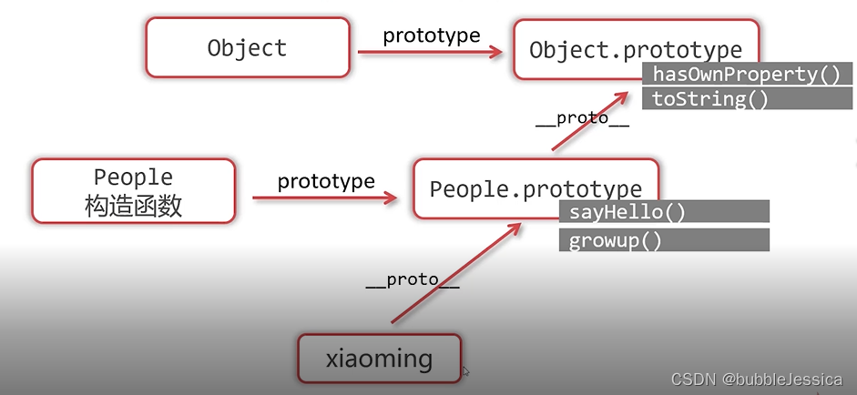
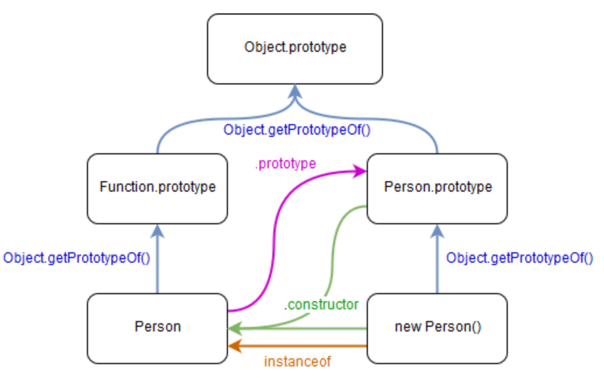
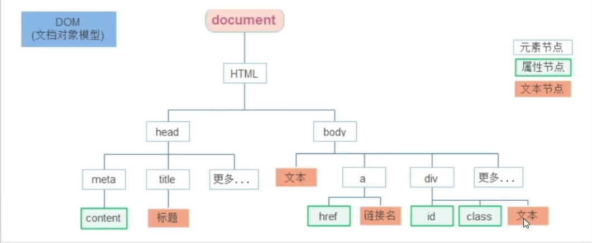

# JavaScript

文章参考：

JS全称JavaScript，是一种轻量级的面向对象的编程语言，既能用在浏览器中控制页面交互，也能用在服务器端作为网站后台（借助 Node.js），因此 JavaScript 是一种全栈式的编程语言。

[TOC]

# 基本语法

## 数据类型

JavaScript 拥有**动态类型**。这意味着相同的变量可用作不同的类型：

```js
typeof "John"                // 返回 string
typeof 3.14                  // 返回 number
typeof false                 // 返回 boolean
typeof [1,2,3,4]             // 返回 object
typeof {name:'John', age:34} // 返回 object
```


### 字符串（String）

#### 创建字符串

在js中，单引号和双引号没有本质区别，主要选择取决于个人或团队的编码规范。

```js
let str1 = 'Hello, World!';
let str2 = "Hello, World!";
```

你还可以用模板字符串：

```js
let name = 'John';
let greeting = `Hello, ${name}!`;

let multilineStr = `Hello,
World!`;
```

你也可以用`String()`方法

```js
let arr = [1, 2, 3];
let str = String(arr);
console.log(str);  // 输出 "1,2,3"

let obj = { name: "Alice", age: 30 };
let str = String(obj);
console.log(str);  // 输出 "[object Object]"
```

#### 字符串方法

大多数方法是`String`对象原型的方法，即`String.prototype.methodFunc()`；此外的是**静态方法**`String.methodFunc()`。

```js
// 示例字符串
const str = "  Hello, World!  ";
const anotherStr = "JavaScript";

// 1. at() - 返回指定索引处的字符（支持负索引）
console.log("at:", str.at(2)); // 输出: "l"
// 注释: 索引 2 是 "l"，负索引从末尾计数，如 str.at(-1) 返回 " "

// 2. charAt() - 返回指定索引处的字符
console.log("charAt:", str.charAt(1)); // 输出: "H"
// 注释: 如果索引超出范围，返回空字符串 ""

// 3. charCodeAt() - 返回指定索引处字符的 UTF-16 编码
console.log("charCodeAt:", str.charCodeAt(1)); // 输出: 72
// 注释: "H" 的 UTF-16 编码是 72，超出范围返回 NaN

// 4. codePointAt() - 返回指定索引处字符的 Unicode 码点
console.log("codePointAt:", str.codePointAt(1)); // 输出: 72
// 注释: 支持完整的 Unicode（如表情符号），超出范围返回 undefined

// 5. concat() - 连接两个或多个字符串
const concatenated = str.concat(" ", anotherStr);
console.log("concat:", concatenated); // 输出: "  Hello, World! JavaScript"
// 注释: 返回新字符串，不修改原字符串

// 6. endsWith() - 检查字符串是否以指定子串结尾
console.log("endsWith:", str.endsWith("!  ")); // 输出: true
// 注释: 可指定长度参数，如 str.endsWith("!", 15)

// 7. includes() - 检查字符串是否包含指定子串
console.log("includes:", str.includes("World")); // 输出: true
// 注释: 区分大小写，可指定起始搜索位置

// 8. indexOf() - 返回子串首次出现的索引
console.log("indexOf:", str.indexOf("l")); // 输出: 2
// 注释: 未找到返回 -1，可指定起始搜索位置

// 9. lastIndexOf() - 返回子串最后一次出现的索引
console.log("lastIndexOf:", str.lastIndexOf("l")); // 输出: 10
// 注释: 从右向左搜索，未找到返回 -1

// 10. localeCompare() - 比较两个字符串在本地化排序中的顺序
console.log("localeCompare:", str.localeCompare("  Hello, World!  ")); // 输出: 0
// 注释: 返回负数（前者小）、0（相等）或正数（后者小）

// 11. match(regexp) - 使用正则表达式匹配字符串
const matches = str.match(/[A-Z]/g);
console.log("match:", matches); // 输出: ["H", "W"]
// 注释: 返回匹配数组，未匹配返回 null

// 12. matchAll(regexp) - 返回正则表达式所有匹配的迭代器
const allMatches = [...str.matchAll(/l/g)];
console.log("matchAll:", allMatches.map(m => m[0])); // 输出: ["l", "l", "l"]
// 注释: 需要全局标志 /g，返回迭代器

// 13. normalize() - 返回字符串的 Unicode 规范化形式
const accented = "café";
console.log("normalize:", accented.normalize("NFC")); // 输出: "café"
// 注释: 处理组合字符，默认 NFC（完全组合）

// 14. padEnd(targetLength[, padString]) - 在字符串末尾填充字符到指定长度
console.log("padEnd:", str.padEnd(20, "-")); // 输出: "  Hello, World!  ----"
// 注释: 不截断原字符串，只填充

// 15. padStart(targetLength[, padString]) - 在字符串开头填充字符到指定长度
console.log("padStart:", str.padStart(20, "-")); // 输出: "----  Hello, World!  "
// 注释: 常用于对齐文本

// 16. repeat(count) - 重复字符串指定次数
console.log("repeat:", "ha".repeat(3)); // 输出: "hahaha"
// 注释: 参数必须是非负整数

// 17. replace(pattern, replacement) - 替换第一个匹配的子串
console.log("replace:", str.replace("World", "Earth")); // 输出: "  Hello, Earth!  "
// 注释: 可使用正则表达式，只替换首次匹配

// 18. replaceAll(pattern, replacement) - 替换所有匹配的子串
console.log("replaceAll:", str.replaceAll("l", "L")); // 输出: "  HeLLo, WorLd!  "
// 注释: 无需正则表达式即可替换所有匹配

// 19. search(regexp) - 返回正则表达式首次匹配的索引
console.log("search:", str.search(/o/)); // 输出: 5
// 注释: 未找到返回 -1，类似 indexOf 但支持正则

// 20. slice(start[, end]) - 提取字符串的一部分
console.log("slice:", str.slice(2, 7)); // 输出: "Hello"
// 注释: 从 start（包含）到 end（不包含），支持负索引

// 21. split([separator[, limit]]) - 将字符串按指定分隔符拆分为数组
console.log("split:", str.split(" ")); // 输出: ["", "", "Hello,", "World!", "", ""]
// 注释: 可指定最大拆分次数

// 22. startsWith() - 检查字符串是否以指定子串开头
console.log("startsWith:", str.startsWith("  ")); // 输出: true
// 注释: 可指定起始搜索位置

// 23. substring(start[, end]) - 提取指定索引之间的子串
console.log("substring:", str.substring(2, 7)); // 输出: "Hello"
// 注释: 不支持负索引，与 slice 类似但处理不同

// 24. toLocaleLowerCase() - 转换为本地化小写
console.log("toLocaleLowerCase:", str.toLocaleLowerCase()); // 输出: "  hello, world!  "
// 注释: 根据语言环境转换（如土耳其语的 "I"）

// 25. toLocaleUpperCase() - 转换为本地化大写
console.log("toLocaleUpperCase:", str.toLocaleUpperCase()); // 输出: "  HELLO, WORLD!  "
// 注释: 根据语言环境转换

// 26. toLowerCase() - 转换为小写
console.log("toLowerCase:", str.toLowerCase()); // 输出: "  hello, world!  "
// 注释: 标准 ASCII 转换

// 27. toString() - 返回字符串本身
console.log("toString:", str.toString()); // 输出: "  Hello, World!  "
// 注释: 对于字符串对象，返回原始字符串

// 28. toUpperCase() - 转换为大写
console.log("toUpperCase:", str.toUpperCase()); // 输出: "  HELLO, WORLD!  "
// 注释: 标准 ASCII 转换

// 29. trim() - 移除字符串两端的空白字符
console.log("trim:", str.trim()); // 输出: "Hello, World!"
// 注释: 只移除首尾的空格、换行等

// 30. trimEnd() - 移除字符串末尾的空白字符
console.log("trimEnd:", str.trimEnd()); // 输出: "  Hello, World!"
// 注释: 只移除尾部空白

// 31. trimStart() - 移除字符串开头的空白字符
console.log("trimStart:", str.trimStart()); // 输出: "Hello, World!  "
// 注释: 只移除头部空白

// 32. valueOf() - 返回字符串的原始值
console.log("valueOf:", str.valueOf()); // 输出: "  Hello, World!  "
// 注释: 与 toString() 类似，用于获取原始字符串


// 静态方法
// 33. String.fromCharCode() - 从 UTF-16 码点创建字符串
console.log("fromCharCode:", String.fromCharCode(72, 101, 108, 108, 111)); // 输出: "Hello"
// 注释: 静态方法，输入数字码点

// 34. String.fromCodePoint() - 从 Unicode 码点创建字符串
console.log("fromCodePoint:", String.fromCodePoint(128512)); // 输出: "😀"
// 注释: 静态方法，支持完整的 Unicode（如表情符号）

// 35. String.raw() - 创建原始字符串（忽略转义字符）
console.log("raw:", String.raw`Hi\nWorld`); // 输出: "Hi\\nWorld"
// 注释: 静态方法，常用于模板字面量
```

#### 常用方法

str.includes

str.match(reg)

str.search(reg)

str.replace

str.split

str.splice

str.substring

str.concat

str.repeat


### 数字（Number）

#### 创建数字

```js
// 数字可以带小数点，也可以不带
var x1=34.00;      //使用小数点来写
var x2=34;         //不使用小数点来写

// 通过科学（指数）计数法来书写
var y=123e5;      // 12300000
var z=123e-5;     // 0.00123
```

#### 数字方法

大多数方法是Number对象原型的方法**[实例方法]**，即`Number.prototype.methodFunc()`；此外的是**[静态方法]**`Number.methodFunc()`

```js
// 示例数字
const num = 123.456;
const integer = 42;

// 实例方法
// 1. toExponential([fractionDigits]) - 将数字转换为指数记数法
console.log("toExponential:", num.toExponential(2)); // 输出: "1.23e+2"
// 注释: 参数指定小数点后位数，返回字符串，123.456 ≈ 1.23 × 10²

// 2. toFixed([digits]) - 将数字格式化为指定小数位数
console.log("toFixed:", num.toFixed(1)); // 输出: "123.5"
// 注释: 四舍五入到指定位数，返回字符串

// 3. toLocaleString([locales[, options]]) - 将数字转换为本地化字符串
console.log("toLocaleString:", num.toLocaleString('en-US')); // 输出: "123.456"
// 注释: 根据语言环境格式化，可指定选项，如货币格式

// 4. toPrecision([precision]) - 将数字格式化为指定有效数字
console.log("toPrecision:", num.toPrecision(4)); // 输出: "123.5"
// 注释: 返回指定有效位数的字符串，可能用指数记数法

// 5. toString([radix]) - 将数字转换为字符串（指定进制）
console.log("toString:", integer.toString(16)); // 输出: "2a"
// 注释: 参数指定进制（2-36），默认 10 进制

// 6. valueOf() - 返回数字的原始值
const numObj = new Number(42);
console.log("valueOf:", numObj.valueOf()); // 输出: 42
// 注释: 返回基本数字值，区分 Number 对象和原始值

// 静态方法
// 7. Number.parseInt(string[, radix]) - 将字符串解析为整数
console.log("parseInt:", Number.parseInt("123.45", 10)); // 输出: 123
// 注释: 参数：字符串、进制（2-36），忽略小数部分

// 8. Number.parseFloat(string) - 将字符串解析为浮点数
console.log("parseFloat:", Number.parseFloat("123.45abc")); // 输出: 123.45
// 注释: 解析字符串直到无效字符，返回浮点数

// 9. Number.isFinite() - 检查数字是否为有限值
console.log("isFinite:", Number.isFinite(42)); // 输出: true
console.log("isFinite:", Number.isFinite(Infinity)); // 输出: false
// 注释: 不强制转换参数，区分全局 isFinite()

// 10. Number.isInteger() - 检查数字是否为整数
console.log("isInteger:", Number.isInteger(42)); // 输出: true
console.log("isInteger:", Number.isInteger(42.0)); // 输出: true
console.log("isInteger:", Number.isInteger(42.1)); // 输出: false
// 注释: 检查是否为整数，不强制转换

// 11. Number.isNaN() - 检查值是否为 NaN
console.log("isNaN:", Number.isNaN(NaN)); // 输出: true
console.log("isNaN:", Number.isNaN(42)); // 输出: false
// 注释: 不强制转换参数，区分全局 isNaN()

// 12. Number.isSafeInteger() - 检查数字是否为安全整数
console.log("isSafeInteger:", Number.isSafeInteger(42)); // 输出: true
console.log("isSafeInteger:", Number.isSafeInteger(2 ** 53)); // 输出: false
// 注释: 安全整数范围：-(2^53 - 1) 到 2^53 - 1

// 13. Number.toInteger() - 已废弃，使用 Math.trunc() 替代
// console.log("toInteger:", Number.toInteger(42.7)); // 未定义
// 注释: ES6 之前提案，现不可用，改为 Math.trunc(42.7) 输出 42

// 示例：结合使用
const value = "123.456";
const parsed = Number.parseFloat(value); // 转换为数字
console.log("Combined example:");
console.log("parsed:", parsed);                    // 输出: 123.456
console.log("toFixed:", parsed.toFixed(2));        // 输出: "123.46"
console.log("toExponential:", parsed.toExponential(1)); // 输出: "1.2e+2"
console.log("toString:", parsed.toString(2));      // 输出: "1111011.01110100101111000110101"
console.log("isInteger:", Number.isInteger(parsed)); // 输出: false
console.log("isSafeInteger:", Number.isSafeInteger(parsed)); // 输出: false

// 特殊值测试
console.log("Special values:");
console.log("isFinite Infinity:", Number.isFinite(Infinity)); // 输出: false
console.log("isNaN NaN:", Number.isNaN(NaN)); // 输出: true
console.log("parseInt 'abc':", Number.parseInt("abc")); // 输出: NaN
console.log("parseFloat '12.3.4':", Number.parseFloat("12.3.4")); // 输出: 12.3
```

#### 常用方法

num.toFixed([digits])

num.toPercesion([percesion])

num.toString([radix])

Number.parseInt(string[, radix])

Number.parseFloat(string)


### 布尔（Boolean）

#### 创建布尔值

```js
let isTrue = true;  // 布尔值 true
let isFalse = false;  // 布尔值 false
```

#### 布尔转换

你可以使用 `Boolean()` 函数将其他类型的值转换为布尔值。JavaScript 中的其他数据类型会根据某些规则转换为 `true` 或 `false`。

```js
Boolean(1);        // true (非零数字转换为 true)
Boolean("Hello");  // true (非空字符串转换为 true)
Boolean([]);       // true (空数组转换为 true)
Boolean({});       // true (空对象转换为 true)

Boolean(0);        // false (0 被转换为 false)
Boolean("");       // false (空字符串转换为 false)
Boolean(null);     // false (null 转换为 false)
Boolean(undefined); // false (undefined 转换为 false)
```


### 空（Null）& 未定义（Undefined）

```js
console.log(null == undefined);  // true，非严格比较时相等
console.log(null === undefined); // false，严格比较时不相等
```

**`null`** 用于：

- **初始化变量**，表示该变量暂时没有值。
- 函数返回空值或没有找到数据时返回 `null`。

**`undefined`** 用于：

- 变量声明但未赋值时的默认值。
- 函数没有显式返回值时，默认返回 `undefined`。
- **访问对象中不存在的属性**时，返回 `undefined`。


### 符号（Symbol）

在 JavaScript 中，**符号（Symbols）**是一种原始数据类型，表示唯一且不可变的值。

#### 创建符号

```js
// 使用 Symbol 函数创建一个新的符号。可以选择性地传入一个描述字符串，用于调试：
const sym1 = Symbol('description');
const sym2 = Symbol('description');

console.log(sym1 === sym2); // false，因为每个 Symbol 都是唯一的

// 可以使用 Symbol 作为对象的属性键：
const myObject = {
  [sym1]: 'value1'
};

console.log(myObject[sym1]); // 'value1'
console.log(myObject[sym2]); // undefined，因为 sym2 是不同的 Symbol
```

#### 符号方法

Symbol对象原型的**[实例方法]**

```
symbol.toString()
symbol.ofValue()
```

Symbol对象原型的**[静态方法]**`Symbol.methodFunc()`。

```js
// Symbol.for()：在全局符号注册表中查找符号，如果没有找到，则创建一个新的符号，并将其注册到全局符号注册表中。
const sym1 = Symbol.for('global');
const sym2 = Symbol.for('global');

console.log(sym1 === sym2); // true，符号是相同的，因为它们在全局注册表中

const sym3 = Symbol('local');
// Symbol.keyFor()：返回全局符号注册表中符号的键（即描述）。如果符号没有在全局符号注册表中注册，返回 undefined。
console.log(Symbol.keyFor(sym1)); // 'global'
console.log(Symbol.keyFor(sym3)); // undefined，sym3 不在全局符号注册表中
```


### 对象（Object）

#### 创建对象

- **字面量方式**

  ```javascript
  const person = {
      name: 'Alice',
      age: 30
  };
  ```

-  **使用 new Object()**

  ```js
  // 1.
  const person = new Objcet()
  person.name = 'Alice'
  person.age = 30
  
  // 2.
  const person = new Objcet({
      name: 'Alice',
      age: 30
  })
  ```

- **构造函数**

  ```javascript
  function Person(name, age) {
      this.name = name;
      this.age = age;
  }
  const Alice = new Person('Alice', 30);
  ```

#### 访问和修改属性

- **点符号**

  ```javascript
  person.age = 31;
  ```
  
- **方括号符号**

  ```javascript
  person['name'] = 'Bob';
  ```

#### 对象方法

所有方法全是Object对象原型的**静态方法**`Object.methodFunc()`

```js
// 示例对象
const person = {
  name: 'Alice',
  age: 25,
  hobbies: ['reading', 'gaming'],
  address: {
    city: 'New York',
    zip: 10001
  }
};

// 另一个对象用于演示继承或合并
const extraInfo = {
  job: 'Engineer',
  age: 26 // 将覆盖 person 中的 age
};

// 1. Object.assign(target, ...sources) - 将一个或多个源对象的属性复制到目标对象
const mergedObject = Object.assign({}, person, extraInfo);
console.log('Object.assign:', mergedObject);
// 输出: { name: 'Alice', age: 26, hobbies: ['reading', 'gaming'], address: { city: 'New York', zip: 10001 }, job: 'Engineer' }
// 注释: 修改目标对象并返回它，浅拷贝，后面的对象会覆盖前面的同名属性

// 2. Object.create() - 创建一个新对象，使用指定的原型对象
const newPerson = Object.create(person);
console.log('Object.create:', newPerson.name); // 输出: 'Alice'
// 注释: newPerson 继承了 person 的属性，但自身没有这些属性，访问通过原型链

// 3. Object.defineProperty() - 直接在一个对象上定义新属性或修改现有属性
const obj = {};
Object.defineProperty(obj, 'key', {
  value: 'static',
  writable: false, // 不可写
  enumerable: true, // 可枚举
  configurable: true // 可配置
});
console.log('Object.defineProperty:', obj.key); // 输出: 'static'
// 尝试修改
obj.key = 'changed'; // 不会生效，因为 writable: false
console.log('Object.defineProperty after attempt:', obj.key); // 输出: 'static'

// 4. Object.defineProperties() - 定义多个属性
const multiProps = {};
Object.defineProperties(multiProps, {
  name: { value: 'Bob', writable: true },
  age: { value: 30, enumerable: true }
});
console.log('Object.defineProperties:', multiProps); // 输出: { name: 'Bob', age: 30 }

// 5. Object.entries() - 返回对象可枚举属性的 [key, value] 数组
const entries = Object.entries(person);
console.log('Object.entries:', entries);
// 输出: [['name', 'Alice'], ['age', 25], ['hobbies', ['reading', 'gaming']], ['address', { city: 'New York', zip: 10001 }]]
// 注释: 可用于 for...of 循环或转换为 Map

// 6. Object.freeze() - 冻结对象，阻止修改
const frozen = Object.freeze({ x: 1 });
frozen.x = 2; // 不会生效
console.log('Object.freeze:', frozen); // 输出: { x: 1 }
// 注释: 浅冻结，嵌套对象仍可修改

// 7. Object.fromEntries() - 从键值对数组创建对象
const pairs = [['a', 1], ['b', 2]];
const fromEntriesObj = Object.fromEntries(pairs);
console.log('Object.fromEntries:', fromEntriesObj); // 输出: { a: 1, b: 2 }
// 注释: 与 Object.entries() 相反

// 8. Object.getOwnPropertyDescriptor() - 获取属性的描述符
const descriptor = Object.getOwnPropertyDescriptor(person, 'name');
console.log('Object.getOwnPropertyDescriptor:', descriptor);
// 输出: { value: 'Alice', writable: true, enumerable: true, configurable: true }

// 9. Object.getOwnPropertyDescriptors() - 获取所有自有属性的描述符
const descriptors = Object.getOwnPropertyDescriptors(person);
console.log('Object.getOwnPropertyDescriptors:', descriptors);
// 输出: 包含 name、age、hobbies、address 的描述符对象

// 10. Object.getOwnPropertyNames() - 返回所有自有属性名（包括不可枚举）
const propNames = Object.getOwnPropertyNames(person);
console.log('Object.getOwnPropertyNames:', propNames);
// 输出: ['name', 'age', 'hobbies', 'address']

// 11. Object.getPrototypeOf() - 获取对象的原型
const proto = Object.getPrototypeOf(newPerson);
console.log('Object.getPrototypeOf:', proto === person); // 输出: true

// 12. Object.hasOwn() - 检查对象是否具有指定自有属性
console.log('Object.hasOwn:', Object.hasOwn(person, 'name')); // 输出: true
console.log('Object.hasOwn:', Object.hasOwn(person, 'toString')); // 输出: false
// 注释: 不检查原型链上的属性

// 13. Object.is() - 比较两个值是否相同（严格相等，处理特殊情况）
console.log('Object.is:', Object.is(NaN, NaN)); // 输出: true
console.log('Object.is:', Object.is(0, -0)); // 输出: false
// 注释: 与 === 类似，但区分 0 和 -0，且 NaN 被视为相同

// 14. Object.isExtensible() - 检查对象是否可扩展（能否添加新属性）
console.log('Object.isExtensible:', Object.isExtensible(person)); // 输出: true

// 15. Object.isFrozen() - 检查对象是否被冻结
console.log('Object.isFrozen:', Object.isFrozen(frozen)); // 输出: true
console.log('Object.isFrozen:', Object.isFrozen(person)); // 输出: false

// 16. Object.isSealed() - 检查对象是否被密封（不可添加属性，但可修改现有属性）
const sealed = Object.seal({ y: 2 });
console.log('Object.isSealed:', Object.isSealed(sealed)); // 输出: true

// 17. Object.keys() - 返回对象可枚举的自有属性名数组
const keys = Object.keys(person);
console.log('Object.keys:', keys); // 输出: ['name', 'age', 'hobbies', 'address']

// 18. Object.preventExtensions() - 阻止对象扩展（不能添加新属性）
const noExt = Object.preventExtensions({ z: 3 });
noExt.newProp = 'test'; // 不会添加
console.log('Object.preventExtensions:', noExt); // 输出: { z: 3 }

// 19. Object.seal() - 密封对象（不可添加或删除属性，但可修改现有属性值）
const sealedObj = Object.seal({ a: 1 });
sealedObj.a = 2; // 可以修改
delete sealedObj.a; // 无法删除
console.log('Object.seal:', sealedObj); // 输出: { a: 2 }

// 20. Object.setPrototypeOf() - 设置对象的原型
const base = { baseProp: 'base' };
const derived = {};
Object.setPrototypeOf(derived, base);
console.log('Object.setPrototypeOf:', derived.baseProp); // 输出: 'base'

// 21. Object.values() - 返回对象可枚举的自有属性值数组
const values = Object.values(person);
console.log('Object.values:', values);
// 输出: ['Alice', 25, ['reading', 'gaming'], { city: 'New York', zip: 10001 }]
```

#### 常用方法

Object.entries()

Object.keys()

Object.assign(target, ...sources)

### 数组（Array）

#### 创建数组

使用数组字面量

```js
const fruits = ['apple', 'banana', 'cherry'];
```

使用 `Array` 构造函数

```js
const numbers = new Array(1, 2, 3, 4, 5);
const emptyArray = new Array(5); // 创建一个长度为5的空数组
```

#### 数组方法

大多数方法是Array对象原型的方法，即`Array.prototype.methodFunc()`；此外的是**静态方法**`Array.methodFunc()`

```js
// 创建一个初始的数组
let arr = [1, 2, 3, 4, 5];

// 1. push() - 向数组的末尾添加一个或多个元素
arr.push(6); // arr = [1, 2, 3, 4, 5, 6]
console.log("push:", arr);

// 2. pop() - 删除数组的最后一个元素，并返回该元素
let popped = arr.pop(); // popped = 6, arr = [1, 2, 3, 4, 5]
console.log("pop:", popped, arr);

// 3. shift() - 删除数组的第一个元素，并返回该元素
let shifted = arr.shift(); // shifted = 1, arr = [2, 3, 4, 5]
console.log("shift:", shifted, arr);

// 4. unshift() - 向数组的开头添加一个或多个元素
arr.unshift(1); // arr = [1, 2, 3, 4, 5]
console.log("unshift:", arr);

// 5. concat() - 合并两个或多个数组
let newArr = arr.concat([6, 7]); // newArr = [1, 2, 3, 4, 5, 6, 7]
console.log("concat:", newArr);

// 6. slice([begin[, end]]) - 返回数组的一个子数组（浅拷贝），不修改原数组
let slicedArr = arr.slice(1, 4); // slicedArr = [2, 3, 4]
console.log("slice:", slicedArr);

// 7. splice(start[, deleteCount[, item1[, item2[, ...]]]]) - 在数组中添加或删除元素，并返回删除的元素
let splicedArr = arr.splice(2, 2, 8, 9); // 删除2个元素并添加8, 9
// splicedArr = [3, 4], arr = [1, 2, 8, 9, 5]
console.log("splice:", splicedArr, arr);

// 8. forEach() - 对数组的每一项执行一个回调函数
arr.forEach((item, index) => {
  console.log(`forEach: Item at index ${index} is ${item}`);
});

// 9. map() - 创建一个新数组，数组中的元素是调用函数处理原数组元素后的结果
let mappedArr = arr.map(x => x * 2); // mappedArr = [2, 4, 16, 18, 10]
console.log("map:", mappedArr);

// 10. filter() - 创建一个新数组，包含通过测试的所有元素
let filteredArr = arr.filter(x => x > 5); // filteredArr = [8, 9]
console.log("filter:", filteredArr);

// 11. reduce(callback(accumulator, currentValue[, index[, array]])[, initialValue]) - 对数组的每一项执行一个回调函数，返回一个最终的累积结果
let sum = arr.reduce((acc, current) => acc + current, 0); // sum = 20
console.log("reduce:", sum);

// 12. reduceRight() - 从数组的右端开始执行回调函数，返回一个最终的累积结果
let reversedSum = arr.reduceRight((acc, current) => acc - current, 0); // reversedSum = -3
console.log("reduceRight:", reversedSum);

// 13. some(callback(element[, index[, array]])[, thisArg]) - 如果数组中至少有一个元素满足条件，则返回 true
let hasEven = arr.some(x => x % 2 === 0); // hasEven = true (因为8是偶数)
console.log("some:", hasEven);

// 14. every(callback(element[, index[, array]])[, thisArg]) - 如果数组中的所有元素都满足条件，则返回 true
let allEven = arr.every(x => x % 2 === 0); // allEven = false
console.log("every:", allEven);

// 15. find(callback(element[, index[, array]])[, thisArg]) - 返回数组中第一个符合条件的元素
let firstEven = arr.find(x => x % 2 === 0); // firstEven = 2
console.log("find:", firstEven);

// 16. findIndex(callback(element[, index[, array]])[, thisArg]) - 返回数组中第一个符合条件的元素的索引
let firstEvenIndex = arr.findIndex(x => x % 2 === 0); // firstEvenIndex = 1
console.log("findIndex:", firstEvenIndex);

// 17. includes() - 检查数组是否包含某个指定的元素，返回 true 或 false
let includesFive = arr.includes(5); // includesFive = true
console.log("includes:", includesFive);

// 18. indexOf() - 返回数组中第一个指定元素的索引，如果未找到返回 -1
let indexOfFive = arr.indexOf(5); // indexOfFive = 4
console.log("indexOf:", indexOfFive);

// 19. join() - 将数组的所有元素连接成一个字符串，并返回该字符串
let joinedArr = arr.join(", "); // joinedArr = "1, 2, 8, 9, 5"
console.log("join:", joinedArr);

// 20. sort(compareFunction) - 对数组的元素进行排序，默认按字符顺序排序，修改原数组
arr.sort(); // arr = [1, 2, 5, 8, 9]
console.log("sort:", arr);

const arr1 = [3, 1, 4, 2, 5];
arr.sort((a, b) => a - b);  // 升序排列：如果返回值小于 0，则 a 会排在 b 前面。
console.log(arr1);  // 输出: [1, 2, 3, 4, 5]

// 21. reverse() - 反转数组的元素
arr.reverse(); // arr = [9, 8, 5, 2, 1]
console.log("reverse:", arr);

// 22. fill(value[, start[, end]]) - 用一个固定值填充数组的指定部分
arr.fill(0, 1, 4); // arr = [9, 0, 0, 0, 1]
console.log("fill:", arr);

// 23. copyWithin() - 浅拷贝并覆盖数组的指定部分
arr.copyWithin(0, 1, 4); // arr = [0, 0, 0, 0, 1]
console.log("copyWithin:", arr);

// 24. flat([depth]) - 将嵌套数组“拉平”成一维数组
let nestedArr = [1, [2, 3], [4, 5], 6];
let flatArr = nestedArr.flat(); // flatArr = [1, 2, 3, 4, 5, 6]
console.log("flat:", flatArr);

// 25. flatMap(callback(currentValue[, index[, array]])[, thisArg]) - 首先映射每个元素，然后将结果“拉平”，深度为1
let flatMappedArr = nestedArr.flatMap(x => x); // flatMappedArr = [1, 2, 3, 4, 5, 6]
console.log("flatMap:", flatMappedArr);

// 27. keys() - 返回一个新的数组迭代器对象，包含数组中每个索引
let keys = arr.keys();
console.log("keys:");
for (let key of keys) {
  console.log(key); // 输出数组的索引
}

// 28. values() - 返回一个新的数组迭代器对象，包含数组中的值
let values = arr.values();
console.log("values:");
for (let value of values) {
  console.log(value); // 输出数组的值
}

// 29. entries() - 返回一个新的数组迭代器对象，包含数组的键值对
let entries = arr.entries();
console.log("entries:");
for (let [index, value] of entries) {
  console.log(index, value); // 输出数组的索引和值
}

// 30. at() - 返回指定位置的元素，可以使用负数索引
let elementAtIndex = arr.at(-1); // elementAtIndex = 1 (最后一个元素)
console.log("at:", elementAtIndex);

// 31. toString() - 返回数组的字符串表示
console.log("toString:", arr.toString()); // 输出: "4,10,20,1"
// 注释: 相当于 join() 无参数

// 32. findLast() - 返回最后一个满足条件的元素
const foundLast = arr.findLast(x => x < 4);
console.log("findLast:", foundLast); // 输出: 3
// 注释: 从右向左查找，未找到返回 undefined

// 33. findLastIndex() - 返回最后一个满足条件的元素的索引
const foundLastIndex = arr.findLastIndex(x => x < 4);
console.log("findLastIndex:", foundLastIndex); // 输出: 2
// 注释: 从右向左查找，未找到返回 -1

// 34. lastIndexOf() - 返回元素最后一次出现的索引
console.log("lastIndexOf:", arr.lastIndexOf(3)); // 输出: 2
// 注释: 从右向左搜索，未找到返回 -1

// 35. Array.isArray() - 检查是否为数组
console.log("Array.isArray:", Array.isArray(arr)); // 输出: true
console.log("Array.isArray:", Array.isArray("not array")); // 输出: false
// 注释: 静态方法，返回布尔值

// 36. Array.of() - 从一组参数创建数组
const ofArr = Array.of(1, 2, 3);
console.log("Array.of:", ofArr); // 输出: [1, 2, 3]
// 注释: 静态方法，与 Array() 不同，不会创建稀疏数组

// 37. Array.from(arrayLike[, mapFn[, thisArg]]) - 从类数组对象或可迭代对象创建一个新的数组实例
let arrFrom = Array.from("hello"); // arrFrom = ["h", "e", "l", "l", "o"]
console.log("from:", arrFrom);


```

#### 常用方法

arr.push()

arr.pop()

arr.sort()

arr.reverse()

arr.join()

arr.includes()

arr.find()

arr.findIndex()

arr.map()

arr.fillter()

arr.forEach()

arr.entries()

arr.slice()

arr.splice()

#### 多维数组

JavaScript 也支持多维数组（数组中的数组）：

```javascript
const matrix = [
  [1, 2, 3],
  [4, 5, 6],
  [7, 8, 9]
];
```

#### 伪数组与数组的区别

| 特性              | 数组（Array）                              | 伪数组（Array-like）                            |
| ----------------- | ------------------------------------------ | ----------------------------------------------- |
| **类型**          | 是 `Array` 类型                            | 不是 `Array` 类型（通常是普通对象）             |
| **索引访问**      | 支持使用索引访问元素                       | 支持使用索引访问元素                            |
| **`length` 属性** | 有 `length` 属性                           | 也有 `length` 属性                              |
| **数组方法**      | 可以直接使用数组方法，如 `push()`、`map()` | 无法直接使用数组方法（需要转换为数组）          |
| **转换为数组**    | 可以直接操作                               | 需要通过 `Array.from()` 或扩展运算符 `...` 转换 |
| **实例**          | `let arr = [1, 2, 3]`                      | `arguments`、`NodeList`、`HTMLCollection`       |


### 函数（Function）

```js
function myFunction(var1, var2) {
    var x = var1 + var2;
    return x;
}
```


### 正则（RegExp）

**JavaScript**：内置的 `RegExp` 对象

#### 创建 `RegExp` 对象

可以通过两种方式来创建 `RegExp` 对象：

**字面量方式**：

```javascript
const regex = /pattern/;
```

例如，匹配数字：

```javascript
const regex = /\d+/;
```

**构造函数方式**：

你可以使用“模板”+“标志”的方式创建正则表达式`RegExp(pattern[, flags])`

```javascript
const stopWord = ['a', 'b', 'c']
const regStopWords = new RegExp([...stopWords, '\w', '\s', '[（：、，。）]'].join`|`);
```

生成的正则表达式将是：

```txt
/a|b|c|\w|\s|[（：、，。）]/
```

例如，匹配数字并设置全局标志：

```javascript
const regex = new RegExp("\\d+", "g");
```

#### 正则属性

- `regex.source`：返回正则表达式的源字符串。
- `regex.flags`：返回正则表达式的标志字符串（如 "g", "i", "m"）。
- `regex.lastIndex`：返回或设置下次匹配开始的索引。

#### 常用标志

- `g`：全局匹配（查找所有匹配项，而不是只匹配第一个）。

- `i`：忽略大小写。

- `m`：多行匹配。

- `u`：启用 Unicode 匹配。

- `y`：粘性匹配，要求匹配从 `lastIndex` 位置开始。

#### 正则方法

以下都是**[实例方法]**

1. `test()` - 测试字符串是否匹配正则表达式

该方法返回一个布尔值，表示字符串是否匹配正则表达式。

```javascript
let regex = /abc/;
console.log(regex.test("abcdef"));  // true
console.log(regex.test("xyz"));     // false
```

2. `exec()` - 提取匹配的结果（字符串在正则里的）

该方法返回一个包含匹配信息的数组，若没有匹配，返回 `null`。

```javascript
let regex = /a(bc)/;
let result = regex.exec("abcdef");
console.log(result);  // ["abc", "bc"]
```

如果没有匹配，`exec()` 返回 `null`。

#### 字符串方法

以下都是**[实例方法]**

`match()` - 在字符串中执行匹配（正则在字符串里的），方法用于匹配正则表达式，返回匹配的结果。

```javascript
// 不带 g 的 match()：返回第一个匹配项的数组，包含完整匹配 + 所有捕获组，所以你看到 3 个元素。
const str = "2021-05-01 100, 2022-06-02 200, 2023-07-03 300";
const regex = /(\d{4}-\d{2}-\d{2}) (\d+)/;
const result = str.match(regex);
console.log(result);

// ['2021-05-01 100', '2021-05-01', '100']
```

> 捕获组是用括号 `()` 包裹起来的正则表达式的一部分，匹配到的内容会被单独保存下来，可以通过编号或名称引用。

- 如果使用全局标志 `g`，它会返回一个所有匹配项的数组。

```javascript
// 带 g 的 match()：返回所有完整匹配项的数组，但不包含捕获组。
const regex = /(\d{4}-\d{2}-\d{2}) (\d+)/g;
const result = str.match(regex);
console.log(result);

// ["2021-05-01 100", "2022-06-02 200", "2023-07-03 300"]
```

- 如果使用 `matchAll()`，则会在全局匹配中保留捕获组。

```
[
  ["2021-05-01 100", "2021-05-01", "100"],
  ["2022-06-02 200", "2022-06-02", "200"],
  ["2023-07-03 300", "2023-07-03", "300"]
]
```

`replace()` - 替换匹配的内容，用于查找匹配的部分并替换成指定的内容。

```javascript
let str = "hello world";
let result = str.replace(/world/, "JavaScript");
console.log(result);  // "hello JavaScript"
```

- 如果使用全局标志 `g`，它会替换所有匹配项。

```javascript
let str = "abc abc abc";
let result = str.replace(/abc/g, "xyz");
console.log(result);  // "xyz xyz xyz"
```

`split()` - 按匹配分割字符串，将字符串按匹配的正则表达式分割成数组。

```javascript
let str = "apple,banana,orange";
let result = str.split(/,/);
console.log(result);  // ["apple", "banana", "orange"]
```


### 日期（Date）

#### 创建一个日期

当前日期和时间

```javascript
const now = new Date();
```

特定日期和时间

```javascript
const specificDate = new Date('2024-11-01T10:00:00');
```

使用时间戳

```javascript
const timestampDate = new Date(1633046400000); // 代表特定的时间戳
```

#### 日期常用方法

**获取日期和时间组件**

- `getFullYear()`：获取四位年份。
- `getMonth()`：获取月份（0-11）。
- `getDate()`：获取一个月中的日期（1-31）。
- `getHours()`：获取小时（0-23）。
- `getMinutes()`：获取分钟（0-59）。
- `getSeconds()`：获取秒（0-59）。
- `getMilliseconds()`：获取毫秒（0-999）。
- `getTime()`：返回自1970年1月1日00:00:00 UTC以来的毫秒数。

```javascript
const date = new Date();
console.log(date.getFullYear()); // 2024
console.log(date.getMonth()); // 10 (11月)
```

**设置日期和时间组件**

- `setFullYear(year)`：设置年份。
- `setMonth(month)`：设置月份（0-11）。
- `setDate(date)`：设置日期（1-31）。
- `setHours(hours)`：设置小时（0-23）。
- `setMinutes(minutes)`：设置分钟（0-59）。
- `setSeconds(seconds)`：设置秒（0-59）。
- `setMilliseconds(milliseconds)`：设置毫秒（0-999）。

```javascript
const date = new Date();
date.setFullYear(2025);
date.setMonth(11); // 12月
```

**格式化日期**

- `toString()`：返回日期对象的字符串表示。
- `toISOString()`：返回 ISO 格式的字符串（YYYY-MM-DDTHH:mm:ss.sssZ）。
- `toLocaleDateString()`：返回本地日期字符串。
- `toLocaleTimeString()`：返回本地时间字符串。
- `toUTCString()`：返回 UTC 字符串表示。

```javascript
const date = new Date();
console.log(date.toISOString()); // 2024-11-01T10:00:00.000Z
console.log(date.toLocaleDateString()); // 根据本地设置格式化日期
```

**比较和计算日期**

- 可以直接使用比较运算符（如 `<`、`>`）来比较日期对象。
- 可以通过时间戳进行计算。

```javascript
const date1 = new Date('2024-11-01');
const date2 = new Date('2025-01-01');
console.log(date1 < date2); // true
```

## 运算符

### 算数运算符

| 运算符 | 描述                           | 实例             |
| :----- | :----------------------------- | :--------------- |
| +      | 加                             | A + B 将得到 30  |
| -      | 减                             | A - B 将得到 -10 |
| *      | 乘                             | A * B 将得到 200 |
| /      | 除                             | B / A 将得到 2   |
| %      | 取模(取余)运算符，整除后的余数 | B % A 将得到 0   |
| ++     | 自增运算符，整数值增加 1       | A++ 将得到 11    |
| --     | 自减运算符，整数值减少 1       | A-- 将得到 9     |

### 比较运算符

**x = 5**

| 运算符  | 描述             | 实例                   |
| :------ | :--------------- | :--------------------- |
| **==**  | 值相等           | x == ‘5’   ->  true    |
| **===** | 类型和值都相等   | x === ‘5’   ->   false |
| **!=**  | 值不相等         | x != 5   ->  false     |
| **!==** | 类型和值都不相等 | x !== ‘5’   ->  false  |
| >       | 大于             |                        |
| <       | 小于             |                        |
| >=      | 大于等于         |                        |
| <=      | 小于等于         |                        |

### 逻辑运算符

**x=6, y=3**

| 运算符 | 描述 | 例子                          |
| :----- | :--- | :---------------------------- |
| &&     | and  | (x < 10 && y > 1) 为 true     |
| \|\|   | or   | (x == 5 \|\| y == 5) 为 false |
| !      | not  | !(x==y) 为 true               |

### 条件运算符

```js
variablename = (condition) ? value1 : value2 
```

### typeof 运算符

`typeof`运算符返回一个字符串，表示操作数的类型。

| 变量类型      | `typeof` 返回值 |
| ------------- | --------------- |
| `undefined`   | `"undefined"`   |
| `null`        | **`"object"`**  |
| `Boolean**`** | **`"boolean"`** |
| `Number`      | **`"number"`**  |
| `BigInt`      | `"bigint"`      |
| `String`      | **`"string"`**  |
| `Symbol**`**  | **`"symbol"`**  |
| `Function`    | `"function"`    |
| `Object`      | `"object"`      |
| `Array`       | **`"object"`**  |
| `Date`        | `"object"`      |
| `RegExp`      | **`"object"`**  |
| `Error`       | `"object"`      |

### instanceof 运算符

`instanceof` 运算符是 JavaScript 中用于判断对象是否是某个构造函数的实例的运算符。它通过检查对象的原型链上是否包含构造函数的 `prototype` 属性来进行判断。

**语法**：

```javascript
object instanceof constructor
```

- `object`：要检查的对象。
- `constructor`：构造函数，通常是类或构造函数的名称。

**返回值**：

- 如果 `object` 是 `constructor` 的实例（即对象的原型链上存在构造函数的 `prototype` 属性），`instanceof` 返回 `true`。
- 否则，返回 `false`。

**示例**：

```js
function Person(name) {
  this.name = name;
}

const person1 = new Person("Alice");

console.log(person1 instanceof Person);  // true
console.log(Person instanceof Object);  // true
console.log(person1 instanceof Object);  // true
console.log(person1 instanceof Array);   // false
```

```js
// 定义构造函数
function C() {}
function D() {}
var o = new C();
o instanceof C; // true，因为 Object.getPrototypeOf(o) === C.prototype
o instanceof D; // false，因为 D.prototype 不在 o 的原型链上
o instanceof Object; // true，因为 Object.prototype.isPrototypeOf(o) 返回 true
C.prototype instanceof Object; // true，同上
C.prototype = {};
var o2 = new C();
o2 instanceof C; // true
o instanceof C; // false，C.prototype 指向了一个空对象，这个空对象不在 o 的原型链上。
D.prototype = new C(); // 继承
var o3 = new D();
o3 instanceof D; // true
o3 instanceof C; // true 因为 C.prototype 现在在 o3 的原型链上
```

### in 运算符

`in` 操作符用于检查一个对象是否具有某个属性

```js
let person = { name: "Alice", age: 25 };

console.log("name" in person);  // true
console.log("gender" in person); // false

let person = { name: "Bob" };
console.log("toString" in person);  // true，toString 是 Object.prototype 的方法
```

## 判断 & 循环

**同C**

```js
// 新增特性
for (key in object) {
  // code block to be executed
}

for (variable of iterable) {
  // code block to be executed
}
```


### 异常处理

在 JavaScript 中，异常处理是通过 `try...catch` 语句实现的，允许捕获和处理运行时错误。异常处理机制主要包括 `try`、`catch`、`finally` 这三个部分。下面是详细的介绍：

#### 1. `try` 块

`try` 块包含可能抛出错误的代码。当代码抛出异常时，程序会跳到 `catch` 块执行。

```javascript
try {
  // 可能会抛出错误的代码
  let result = someFunction();
} 
```

#### 2. `catch` 块

`catch` 块用于捕获并处理 `try` 块中抛出的异常。`catch` 会接收一个参数，通常是一个错误对象，用于获取详细的错误信息。

```javascript
try {
  let result = someFunction();
} catch (error) {
  // 捕获并处理错误
  console.error("Error occurred:", error);
}
```

#### 3. `finally` 块

`finally` 块中的代码无论 `try` 块是否抛出异常都会执行。通常用于清理操作，如关闭文件、释放资源等。

```javascript
try {
  let result = someFunction();
} catch (error) {
  console.error("Error occurred:", error);
} finally {
  console.log("This will run no matter what.");
}
```

#### 4. `throw` 语句

`throw` 用来手动抛出一个异常，可以是任何类型的值，通常是一个错误对象或字符串。

```javascript
try {
  let age = -1;
  if (age < 0) {
    throw new Error("Age cannot be negative.");
  }
} catch (error) {
  console.error(error.message);  // 输出: Age cannot be negative.
}
```

#### 完整示例

```javascript
function divide(a, b) {
  try {
    if (b === 0) {
      throw new Error("Cannot divide by zero.");
    }
    return a / b;
  } catch (error) {
    console.error(error.message);  // 输出: Cannot divide by zero.
  } finally {
    console.log("Division attempt finished.");
  }
}

divide(10, 0);
```

#### 错误对象（`Error` 对象）

当异常被抛出时，可以创建一个 `Error` 对象，它有几个常用的属性：

- `message`：包含错误信息的字符串。
- `name`：错误的名称，默认是 `Error`，可以自定义。
- `stack`：包含错误发生时的堆栈追踪信息（浏览器中通常可以访问）。

```javascript
try {
  throw new Error("Something went wrong");
} catch (error) {
  console.error(error.name);    // 输出: Error
  console.error(error.message); // 输出: Something went wrong
  console.error(error.stack);   // 输出: 错误堆栈信息
}
```

除了 `Error` 外，JavaScript 还提供了一些内置的错误类型，它们是 `Error` 的子类，通常用于特定的错误场景：

- **`TypeError`**：表示变量或参数的类型不正确。
- **`SyntaxError`**：表示代码语法错误。
- **`ReferenceError`**：表示访问一个不存在的变量。
- **`RangeError`**：表示一个值超出了有效范围。
- **`EvalError`**：与 `eval()` 函数相关的错误。


## 函数

```js
function myFunction(var1, var2)
{
    var x = var1 + var2;
    return x;
}
```

### eval()

`eval()` 是 JavaScript 中的一个内置函数，它将一个字符串作为 JavaScript 代码执行。简单来说，`eval()` 可以执行传入的字符串，并返回执行结果。

```js
eval(string)
```

**基本用法：**

```javascript
let x = 10;
let result = eval('x + 5');
console.log(result);  // 15
```

在这个例子中，`eval()` 执行了字符串 `'x + 5'`，并返回了 `x + 5` 的值，最终结果是 `15`。

**例子 2：执行表达式**

```javascript
javascriptlet expression = '2 + 3 * 4';
let result = eval(expression);
console.log(result);  // 14
```

此例中，`eval()` 计算了表达式 `2 + 3 * 4` 并返回了结果 `14`。

**例子 3：执行函数调用**

```javascript
function greet() {
  return 'Hello, World!';
}

let result = eval('greet()');
console.log(result);  // "Hello, World!"
```

在这个例子中，`eval()` 执行了 `greet()` 函数，并返回了 `"Hello, World!"`。

**例子 4：执行赋值语句**

```javascript
let x = 5;
eval('x = x + 10');
console.log(x);  // 15
```

`eval()` 允许执行赋值语句，因此 `x` 的值变成了 `15`。

### Math

**常用的 `Math` 方法**

1. **`Math.abs(x)`**
    返回数值 `x` 的绝对值：

   ```javascript
   console.log(Math.abs(-5));  // 5
   ```

2. **`Math.ceil(x)`**
    向上取整，返回大于或等于 `x` 的最小整数：

   ```javascript
   console.log(Math.ceil(4.2));  // 5
   ```

3. **`Math.floor(x)`**
    向下取整，返回小于或等于 `x` 的最大整数：

   ```javascript
   console.log(Math.floor(4.8));  // 4
   ```

4. **`Math.round(x)`**
    四舍五入，返回最接近 `x` 的整数：

   ```javascript
   console.log(Math.round(4.5));  // 5
   ```

5. **`Math.max(a, b, c, ...)`**
    返回给定的一组数值中的最大值：

   ```javascript
   console.log(Math.max(1, 5, 3));  // 5
   ```

6. **`Math.min(a, b, c, ...)`**
    返回给定的一组数值中的最小值：

   ```javascript
   console.log(Math.min(1, 5, 3));  // 1
   ```

7. **`Math.random()`**
    返回一个介于 `0`（包含）和 `1`（不包含）之间的随机数：

   ```javascript
   console.log(Math.random());  // 例如：0.3928
   ```

8. **`Math.pow(x, y)`**
    返回 `x` 的 `y` 次方：

   ```javascript
   console.log(Math.pow(2, 3));  // 8
   ```

9. **`Math.sqrt(x)`**
    返回 `x` 的平方根：

   ```javascript
   console.log(Math.sqrt(16));  // 4
   ```

10. **`Math.sin(x)`**, **`Math.cos(x)`**, **`Math.tan(x)`**
     返回角度 `x` 的正弦、余弦和正切值（角度需要转换为弧度）：

    ```javascript
    console.log(Math.sin(Math.PI / 2));  // 1
    ```

11. **`Math.log(x)`**
     返回 `x` 的自然对数（以 `e` 为底）：

    ```javascript
    console.log(Math.log(10));  // 2.302585
    ```

12. **`Math.exp(x)`**
     返回 `e` 的 `x` 次方：

    ```javascript
    console.log(Math.exp(2));  // 7.389056
    ```


### localStorage

`localStorage` 是 Web 存储 API 提供的一部分，它允许在用户的浏览器中以键值对的形式永久性地存储数据。`localStorage` 的数据在浏览器会话结束后仍然存在，并且不会过期，直到被显式删除。它适用于存储需要长期保存的数据，例如用户设置、登录信息等。

**主要特点**：

- **数据持久性**：`localStorage` 存储的数据没有过期时间，除非被显式删除。
- **同源策略**：存储的数据只能在同一域名下的页面中访问，不同的域名、协议或端口之间的数据是隔离的。
- **存储大小限制**：`localStorage` 通常允许存储每个域名约 5MB 的数据，具体大小可能因浏览器而异。
- **同步存储**：对 `localStorage` 的操作是同步的，即在操作完成后，数据会立即可用。

**常用方法**：

1. **`localStorage.setItem(key, value)`**

    - 用于将数据存储在 `localStorage` 中。
    - 参数：
        - `key`: 键名，表示数据的名称。
        - `value`: 值，存储的数据，通常是字符串类型。

    ```javascript
    localStorage.setItem('username', 'Alice');
    ```

2. **`localStorage.getItem(key)`**

    - 用于从 `localStorage` 获取指定 `key` 的数据。

    - 参数：

        - `key`: 键名，表示要获取的数据。

    - **返回值**：如果找到了对应的值，返回该值；如果没有找到，返回 `null`。

    ```javascript
    const username = localStorage.getItem('username');
    console.log(username);  // 输出: Alice
    ```
    
3. **`localStorage.removeItem(key)`**

    - 用于从 `localStorage` 删除指定 `key` 的数据。
    - 参数：
        - `key`: 键名，表示要删除的数据。

    ```javascript
    localStorage.removeItem('username');
    ```

4. **`localStorage.clear()`**

    - 用于清空 `localStorage` 中的所有数据。

    ```javascript
    localStorage.clear();
    ```

5. **`localStorage.length`**

    - 返回 `localStorage` 中存储的键值对数量。

    ```javascript
    console.log(localStorage.length);  // 输出存储的键值对数量
    ```

6. **`localStorage.key(index)`**

    - 根据索引获取 `localStorage` 中的键名。

    ```js
    const key = localStorage.key(0);
    console.log(key);  // 输出第一个键名
    ```


## 输入输出

**输入**

```js
// 1.页面弹出输入对话框
prompt('plz enter your name:')
```

**输出**

```js
// 1.向body内输出内容
document.write('<h1>title</h1>')

// 2.页面弹出警告对话框
window.alert('warning:invalid action')

// 3.控制台输出，程序员调试使用
console.log('console-print')
```


# ES6 语法

ES6（也称为 ECMAScript 2015）是 ECMAScript 标准的第 6 版，它引入了许多重要的新特性和改进，使得 JavaScript 更加强大、灵活且易于使用。以下是 ES6 的一些关键特性：

**ECMAScript 的背景**

JavaScript 是大家所了解的语言名称，但是这个语言名称是商标（ Oracle 公司注册的商标）。因此，JavaScript 的正式名称是 ECMAScript 。1996年11月，JavaScript 的创造者网景公司将 JS 提交给国际化标准组织 ECMA（European computer manufactures association，欧洲计算机制造联合会），希望这种语言能够成为国际标准，随后 ECMA 发布了规定浏览器脚本语言的标准，即 ECMAScript。这也有利于这门语言的开放和中立。

## 变量与常量的声明

```js
// 1.常量
const BASE_URL = 'http://filmhub.com/api';

// 2.变量
let i = 0;
i++;
```

## 闭包

在 JavaScript 中，**闭包（Closure）** 是一个函数与其词法作用域（即函数声明时所在的作用域）的组合。换句话说，闭包允许一个函数访问并操作它外部函数的变量，即使外部函数已经返回。

简而言之，闭包可以理解为：**函数被定义时的作用域**，而不仅仅是它执行时的作用域  <==>  **内层函数 + 外层函数的变量**

### 闭包的工作原理

闭包的实现依赖于 **词法作用域**。当一个函数被定义时，它会记住外部函数的作用域，这就是闭包的核心。

例子：闭包的作用域链

```javascript
function outer() {
  let outerVar = "I'm an outer variable";

  function inner() {
    console.log(outerVar);  // 访问外部函数的变量
  }

  return inner;
}

const closureFunc = outer();
closureFunc();  // 输出 "I'm an outer variable"
```

### 闭包的使用场景

#### 模拟私有变量

在 JavaScript 中，我们可以通过闭包来模拟私有变量的行为。通过将变量封装在函数内部，只暴露需要的函数来操作这些私有变量。

```javascript
function createCounter() {
  let count = 0; // 私有变量
  return {
    increment: function() {
      count++;
      return count;
    },
    decrement: function() {
      count--;
      return count;
    },
    getCount: function() {
      return count;
    }
  };
}

const counter = createCounter();
console.log(counter.increment()); // 1
console.log(counter.increment()); // 2
console.log(counter.getCount()); // 2
console.log(counter.decrement()); // 1
```

在上面的例子中，`count` 是 `createCounter` 函数的私有变量，它无法直接访问，但是通过闭包暴露了 `increment`、`decrement` 和 `getCount` 等方法，可以访问和修改它。

#### 延迟执行或回调函数

闭包常用于异步编程，例如，回调函数、定时器等，可以在不同的时间点使用外部函数的变量。

```javascript
function createDelayedMessage(message) {
  return function() {
    console.log(message);
  };
}

const delayedHello = createDelayedMessage("Hello, World!");
setTimeout(delayedHello, 1000);  // 1秒后输出 "Hello, World!"
```

在这个例子中，`setTimeout` 延迟执行的回调函数可以访问 `createDelayedMessage` 函数中的 `message` 变量，即使 `createDelayedMessage` 函数已经执行完毕。


## 拓展

### 数组的拓展

#### 扩展运算符 `...`

扩展运算符 (`...`) 可以用于数组，来快速复制、合并或提取元素。

数组合并：

```javascript
let arr1 = [1, 2];
let arr2 = [3, 4];

let mergedArr = [...arr1, ...arr2];
console.log(mergedArr); // [1, 2, 3, 4]
```

数组复制：

```javascript
let arr = [1, 2, 3];
let copiedArr = [...arr];

console.log(copiedArr); // [1, 2, 3]
```

插入元素：

```javascript
let arr = [1, 2, 3];
let extendedArr = [0, ...arr, 4];

console.log(extendedArr); // [0, 1, 2, 3, 4]
```

####  `Array.from()`

`Array.from()` 方法可以将类似数组的对象（如字符串、Set、Map等）转换为数组。

**语法**：

```javascript
Array.from(arrayLike, mapFn, thisArg)
```

- **arrayLike**：类数组对象或可迭代对象（如 `String`、`Set`、`Map`、`NodeList` 等）。
- **mapFn**（可选）：一个映射函数，用于对每个元素进行处理。在创建新数组时，它会应用于每个元素。
- **thisArg**（可选）：用于执行映射函数时的 `this` 值。

**返回值**：

返回一个新的数组，包含由 `arrayLike` 中的元素组成的值，经过 `mapFn` 处理后（如果提供了该函数）。

```javascript
let str = "hello";
let arr = Array.from(str);

console.log(arr); // ['h', 'e', 'l', 'l', 'o']
```

### 对象的拓展

#### 扩展运算符 `...`

同样，扩展运算符也可以用于对象的合并、复制和提取属性。

对象合并：

```javascript
let obj1 = { a: 1, b: 2 };
let obj2 = { b: 3, c: 4 };

let mergedObj = { ...obj1, ...obj2 };
console.log(mergedObj); // { a: 1, b: 3, c: 4 }
```

对象复制：

```javascript
let obj = { a: 1, b: 2 };

let copiedObj = { ...obj };
console.log(copiedObj); // { a: 1, b: 2 }
```

####  `Object.assign()`

`Object.assign()` 方法用于将一个或多个源对象的可枚举属性复制到目标对象中。

**语法**：

```javascript
Object.assign(target, ...sources)
```

- **target**：目标对象，`Object.assign()` 会将源对象的属性复制到这个目标对象中。
- **sources**：一个或多个源对象，其属性会被复制到目标对象中。如果有多个源对象，它们的属性会依次复制到目标对象。

**返回值**：

返回目标对象 `target`，其中包含所有源对象的属性。

```javascript
let obj1 = { a: 1 };
let obj2 = { b: 2 };

let mergedObj = Object.assign({}, obj1, obj2);
console.log(mergedObj); // { a: 1, b: 2 }
```


## 解构赋值

### 数组的解构赋值

```js
// 1.解构赋值
let arr = [1, 2, 3];
let [a, b, c] = arr;

console.log(a); // 1
console.log(b); // 2
console.log(c); // 3

// 2.跳过某些元素
let arr = [1, 2, 3];
let [, b, c] = arr;

console.log(b); // 2
console.log(c); // 3

// 3.默认值
let arr = [1];

// 如果没有提供第二个值，使用默认值
let [a, b = 2] = arr;

console.log(a); // 1
console.log(b); // 2


// 4.剩余操作
let arr = [1, 2, 3, 4, 5];

// 获取前两个元素，剩下的部分放在其他变量中
let [a, b, ...rest] = arr;

console.log(a);     // 1
console.log(b);     // 2
console.log(rest);  // [3, 4, 5]
```

### 对象的解构赋值

```js
// 1.解构赋值
let person = { name: 'Alice', age: 25 };
let { name, age } = person;

console.log(name); // Alice
console.log(age);  // 25

// 2.重命名变量
let person = { name: 'Alice', age: 25 };
let { name: fullName, age: years } = person;

console.log(fullName); // Alice
console.log(years);    // 25

// 3.默认值
let person = { name: 'Alice' };

// 如果没有提供 age 属性，使用默认值
let { name, age = 30 } = person;

console.log(name); // Alice
console.log(age);  // 30

// 4.嵌套解构
let person = { name: 'Alice', address: { city: 'New York', zip: 10001 } };

// 解构嵌套对象
let { name, address: { city, zip } } = person;

console.log(name); // Alice
console.log(city); // New York
console.log(zip);  // 10001

// 5.剩余操作
let person = { name: 'Alice', age: 25, gender: 'female' };

// 提取剩余属性
let { name, ...otherInfo } = person;

console.log(name);  // Alice
console.log(otherInfo);  // { age: 25, gender: 'female' }
```

### 解构赋值可以直接用在函数参数中

```js
// 1.
function print([a, b]) {
  console.log(a, b);
}

print([1, 2]); // 1 2

// 2.
function greet({ name, age }) {
  console.log(`Hello, ${name}. You are ${age} years old.`);
}

greet({ name: 'Alice', age: 25 }); // Hello, Alice. You are 25 years old.

```


## 原型

在 JavaScript 中，**原型**`.prototype`是每个**构造函数**（实质是对象）都有的一个内部属性，它指向另一个对象，称为“原型对象”。原型是 JavaScript 实现继承和共享方法、属性的基础。每个 Java式对象都有一个原型对象（通过`__proto__` 或者 `Object.getPrototypeOf()` 访问），原型对象也可以有自己的原型对象，从而形成一个链式结构，叫做**原型链**。





在 JavaScript 中，`.prototype`、`__proto__` 和 `.constructor` 是与对象和原型链密切相关的概念，它们之间的关系有点像“家族树”里的角色分工。让我用通俗的方式一步步讲解它们是什么，以及它们如何关联。

#### 构造函数原型 `.prototype`

- **是什么**：`.prototype` 是**函数**的一个属性（普通对象没有这个属性）。当你用 `new` 创建实例时，这个属性决定了新对象的原型。
- **特点**：它是一个对象，包含了实例可以继承的属性和方法。
- **谁有它**：只有函数（包括构造函数）有 `.prototype`。

例子：
```javascript
function Person(name) {
    this.name = name;
}
Person.prototype.sayHello = function() {
    console.log("Hello, " + this.name);
};
```

#### 对象原型 `__proto__`

- **是什么**：`__proto__` 是**对象**的一个隐藏属性（准确说是 `[[Prototype]]` 的 getter/setter），指向该对象的原型。
- **特点**：它是原型链的“连接线”，告诉你这个对象从哪里继承属性。
- **谁有它**：几乎所有对象都有（通过原型链最终指向 `Object.prototype`）。

例子：
```javascript
let person = new Person("Alice");
console.log(person.__proto__ === Person.prototype); // true
console.log(person.__proto__ === Object.getPrototypeOf(person)); // true
```

#### 构造器 `.constructor`

- **是什么**：`.constructor` 是对象的一个属性，指向创建这个对象的构造函数。
- **特点**：它是通过原型继承来的，默认情况下存在于 `.prototype` 上。
- **谁有它**：实例对象通过原型链访问到。

例子：
```javascript
let person = new Person("Alice");
console.log(person.constructor === Person); // true
console.log(Person.prototype.constructor === Person); // true
```

#### 原型链的终点
所有对象的 `__proto__` 最终会指向 `Object.prototype`，而 `Object.prototype.__proto__` 是 `null`，这是原型链的尽头：
```javascript
let obj = {};
console.log(obj.__proto__ === Object.prototype);      // true
console.log(Object.prototype.__proto__ === null);     // true
```

#### 简单公式

- `实例.__proto__ === 构造函数.prototype`
- `实例.constructor === 构造函数`（通过原型继承）
- `构造函数.prototype.constructor === 构造函数`

如果你还有疑问，比如想深入原型链的某个细节，随时问我！

##### 图解关系

```
Person (构造函数)
   |
   | .prototype (蓝图对象)
   |       |
   |       | .constructor 指向 Person
   |
person (实例)
   |
   | .__proto__ 指向 Person.prototype
   |
   | .constructor (通过 __proto__ 继承) 指向 Person
```

#### 原型方法

Object.create(proto)

- **作用**：以指定对象作为原型创建新对象。

```js
const personPrototype = {
 greet() {
 console.log("hello!");
 },
};
const Carl = Object.create(personPrototype);

carl.greet(); // hello!

console.log(Carl.__proto__ === personPrototype); // true
```

Object.getPrototypeOf(object)

用于获取对象的原型（即该对象的构造函数的 `prototype` 对象）。

```js
const obj = {};
console.log(Object.getPrototypeOf(obj));  // 输出：{}
console.log(Object.getPrototypeOf(obj) === Object.prototype);  // true

```

Object.setPrototypeOf()

用于设置对象的原型（即指定对象的 `[[Prototype]]`）。

```js
const obj = {};
const proto = { greet: function() { console.log("Hello!"); } };

Object.setPrototypeOf(obj, proto);
obj.greet();  // 输出：Hello!

```

obj.isPrototypeOf(obj2)

- **作用**：检查当前对象是否在另一个对象的原型链中。
- **返回值**：true（在原型链中）或 false（不在）。

```js
function Person() {}
let p = new Person();
console.log(Person.prototype.isPrototypeOf(p)); // true
console.log(Object.prototype.isPrototypeOf(p)); // true（更上层的原型）
```

obj.hasOwnProperty(prop)

- **作用**：检查对象**自身**是否具有某个属性，不包括原型链上的属性。
- **返回值**：true（有该属性）或 false（没有）。

```js
let obj = { a: 1 };
console.log(obj.hasOwnProperty("a"));        // true
console.log(obj.hasOwnProperty("toString")); // false（toString 是原型上的）
```


## 类 `class`

在 JavaScript 中，`class` 是一种定义对象和构造函数的语法糖，它使得创建和管理对象更加简洁和直观。`class` 语法引入了面向对象编程（OOP）的概念，如构造函数、方法和继承等。

#### 基本语法

```javascript
class ClassName {
  constructor() {
    // 构造函数，用于创建实例
  }

  // 实例方法
  methodName() {
    // 方法逻辑
  }

  // 静态方法
  static staticMethod() {
    // 静态方法逻辑
  }
}
```

1. **`constructor`**：构造函数，用来初始化类的实例。每次创建类的实例时，`constructor` 会被调用。
2. **实例方法**：可以在类中定义方法，这些方法会成为类的实例的属性。
3. **静态方法**：静态方法使用 `static` 关键字定义，不能通过实例调用，而是通过类本身调用。

这是一个实例：

```javascript
class Person {
  // 构造函数
  constructor(name, age) {
    this.name = name;
    this.age = age;
  }

  // 实例方法
  greet() {
    console.log(`Hello, my name is ${this.name} and I am ${this.age} years old.`);
  }

  // 静态方法
  static species() {
    return 'Homo sapiens';
  }
}

// 创建类的实例
const person1 = new Person('Alice', 30);
person1.greet(); // 输出: Hello, my name is Alice and I am 30 years old.

// 调用静态方法
console.log(Person.species()); // 输出: Homo sapiens
```

1. **`constructor()`**：是一个特殊的方法，用来初始化对象的状态。当你通过 `new` 创建类的实例时，`constructor` 方法会自动被调用。它可以接受参数并将它们赋值给实例属性。
2. **实例方法**：是定义在类中的普通方法。实例化该类时，所有实例都会继承这些方法。
3. **静态方法**：通过 `static` 关键字定义的静态方法与类本身关联，而不是与实例关联。因此，静态方法只能通过类来访问，而不能通过实例访问。

#### 继承 `extends`

JavaScript 中的类支持继承，可以通过 `extends` 关键字继承父类的功能。子类可以继承父类的属性和方法，也可以重写父类的方法。

```javascript
class Animal {
  constructor(name) {
    this.name = name;
  }

  speak() {
    console.log(`${this.name} makes a sound.`);
  }
}

class Dog extends Animal {
  constructor(name, breed) {
    super(name); // 调用父类的构造函数
    this.breed = breed;
  }

  // 重写父类的方法
  speak() {
    console.log(`${this.name} barks.`);
  }
}

const dog = new Dog('Rex', 'Golden Retriever');
dog.speak(); // 输出: Rex barks.
```

- **`extends`**：用于继承父类。`Dog` 类继承自 `Animal` 类。
- **`super()`**：在子类的构造函数中调用父类的构造函数，通常用来初始化继承的属性。

#### 自定义行为 `get` & `set`

JavaScript 中的类还支持 getter 和 setter，允许你定义访问和设置对象属性时的自定义行为。

```javascript
class Circle {
  constructor(radius) {
    this._radius = radius;
  }

  // getter
  get radius() {
    return this._radius;
  }

  // setter
  set radius(value) {
    if (value <= 0) {
      console.log('Radius must be positive');
    } else {
      this._radius = value;
    }
  }

  area() {
    return Math.PI * this._radius ** 2;
  }
}

const circle = new Circle(10);
console.log(circle.area()); // 输出: 314.1592653589793

circle.radius = -5; // 输出: Radius must be positive
circle.radius = 15; // 修改半径为 15
console.log(circle.area()); // 输出: 706.8583470577034
```

- **getter**：定义了一个获取属性的自定义方法。
- **setter**：定义了一个设置属性时的自定义行为。

### ES6 对象方法简写

```javascript
const obj = {
  greet(name) {
    return `Hello, ${name}`;
  }
};
console.log(obj.greet("Alice")); // Hello, Alice

// 传统方式（ES5）
const obj = {
  greet: function(name) {
    return "Hello, " + name;
  }
};
console.log(obj.greet("Alice")); // Hello, Alice

```

**简写规则：**

- 省略 `function` 关键字。
- 直接在对象中定义方法，保持 `key: value` 的结构。
- `this` 仍然指向当前对象，与传统写法一致。


## this关键字

JavaScript `this` 关键词指的是**它所属的对象**。

它拥有不同的值，具体取决于它的使用位置：

- 在方法中，`this` 指的是**所有者对象**。eg: fullName

  ```js
  const person = {
    firstName: "John",
    lastName: "Doe",
    fullName: function() {
      return this.firstName + " " + this.lastName; // this 代表 person 对象
    }
  };
  
  console.log(person.fullName());  // 输出: "John Doe"
  ```

- 单独的情况下，`this` 指的是**全局对象window**。

  ```js
  var x = this;
  ```

- 在普通函数中，`this` 指的是**全局对象window**。

- 在箭头函数中，`this` 指的是**最近作用域中的this**（向外层作用域中，一层一层查找）

- 在函数中，严格模式下，`this` 是 **undefined**。

  ```js
  function myFunction() {
    return this;
  }
  
  "use strict";
  function myFunction() {
    return this;
  }
  ```

- 在事件中，`this` 指的是接收事件的元素。

  ```js
  const button = document.querySelector('.button');
  button.addEventListener('click', function() {
    console.log(this);  // this 指向 button 元素
  });
  
  ```


### 将 this 引用到任何对象

像 `call()` 和 `apply()` 这样的方法可以将 this 引用到任何对象。

- `call()`：立即调用函数，并明确指定 `this` 的值。。当一个 参数为null或undefined的时候，表示指向window（在浏览器中），和apply一样，call也只是临时改变 一次this指向，并立即执行。

  ```javascript
  func.call(thisArg, arg1, arg2, ...);
  
  var arr=[1,10,5,8,3];
  console.log(Math.max.call(null,arr[0],arr[1],arr[2],arr[3],arr[4])); //10
  
  ```

- `apply()`：与 `call` 类似，区别在于 `apply` 接收的是一个数组作为参数。

  ```javascript
  func.apply(thisArg, [arg1, arg2, ...]);
  ```

- `bind()`：`bind` 返回一个新函数，绑定了指定的 `this` 值。

  ```javascript
  const newFunc = func.bind(thisArg, arg1, arg2, ...);
                    
  var arr=[1,10,5,8,12];
  var max=Math.max.bind(null,arr[0],arr[1],arr[2],arr[3])
  console.log(max(arr[4])); //12，分两次传参
  ```
  
  ```js
  // call()
  function greet() {
    console.log(this.name);
  }
  
  const person = { name: 'David' };
  greet.call(person);  // 输出 'David'，this 指向 person 对象
  
  
  // apply()
  function greet(city, country) {
    console.log(this.name + ' from ' + city + ', ' + country);
  }
  
  const person = { name: 'David' };
  greet.apply(person, ['New York', 'USA']);  // 输出 'David from New York, USA'
  
  
  // bind()
  function greet() {
    console.log(this.name);
  }
  
  const person = { name: 'David' };
  const boundGreet = greet.bind(person);
  boundGreet();  // 输出 'David'
  
  ```
  
  


## 自执行函数 & 箭头函数

**自执行函数（Immediately Invoked Function Expression，简称 IIFE）**是一种 JavaScript 函数，它在定义时立即执行。这种模式常常用来创建一个独立的作用域，避免全局作用域污染，尤其在模块化编程中非常常见。

**IIFE 的基本形式**

IIFE 的语法是将一个函数表达式包裹在圆括号中，然后在末尾加上一对小括号来立即调用它。

```javascript
(function() {
    // 代码
    console.log('This is an IIFE!');
})();

// 2.带参数的 IIFE：
(function(name) {
    console.log("Hello, " + name + "!");
})('Alice');
```

**解释**

1. `function()` 是一个匿名函数表达式。
2. 外面的圆括号 `( ... )` 是将函数表达式包装起来，使其成为一个表达式，而不是声明。
3. 函数的末尾 `()` 表示立即调用该函数。

<hr>

**箭头函数（Arrow Function）**是 JavaScript 中的一种简化函数表达式的语法。它在 ES6（ECMAScript 2015）中引入，提供了比传统函数表达式更简洁的写法，并且在函数内部的 `this` 行为上有所不同。

**语法**

箭头函数的基本语法如下：

```javascript
const functionName = (parameters) => {
    // function body
}
```

- **`parameters`**：函数的参数，可以是一个或多个参数。如果只有一个参数，可以省略括号。
- **`=>`**：箭头符号，表示函数的定义。
- **`function body`**：函数的主体，执行逻辑。如果函数体只有一行，可以省略大括号和 `return` 关键字。

**示例**

1. **没有参数的箭头函数：**

   ```javascript
   const sayHello = () => {
       console.log('Hello!');
   };
   
   sayHello();  // 输出: Hello!
   ```

2. **一个参数的箭头函数：**

   ```javascript
   const square = (x) => {
       return x * x;
   };
   
   console.log(square(5));  // 输出: 25
   ```

   如果参数只有一个，圆括号可以省略：

   ```javascript
   const square = x => x * x;
   
   console.log(square(5));  // 输出: 25
   ```

3. **多个参数的箭头函数：**

   ```javascript
   const add = (a, b) => {
       return a + b;
   };
   
   console.log(add(3, 4));  // 输出: 7
   ```

   如果参数有多个，圆括号是必须的。

4. **没有函数体的箭头函数（隐式返回）：**

   当箭头函数的主体只有一个表达式时，返回值会自动返回，无需使用 `return` 关键字。这个特性叫做 **隐式返回**。

   ```javascript
   const multiply = (a, b) => a * b;
   
   console.log(multiply(2, 3));  // 输出: 6
   ```

   这相当于：

   ```javascript
   const multiply = (a, b) => {
       return a * b;
   };
   ```

**箭头函数的特点**

1. **简洁的语法**： 箭头函数的语法更简洁，尤其是在处理简短的逻辑时。它可以显著减少函数表达式的代码量。

2. **`this` 绑定**： 箭头函数与传统函数的一个重要区别在于，它不会创建自己的 `this`，而是继承**外部上下文**的 `this`。这意味着箭头函数不会改变 `this` 的指向，它的 `this` 由它定义时的上下文决定，而传统的函数会根据调用方式来动态绑定 `this`。

   例如：

   ```javascript
   function Person(name) {
       this.name = name;
       this.sayHello = function() {
           setTimeout(function() {
               console.log('Hello, ' + this.name);  // 'this' 在这里指向 global 或 window
           }, 1000);
       };
   }
   
   const john = new Person('John');
   john.sayHello();  // 输出: Hello, undefined
   ```

   在传统函数中，`this` 由调用环境决定，因此在 `setTimeout` 中，`this` 会指向 `window` 或 `global`，导致 `this.name` 为 `undefined`。

   使用箭头函数可以避免这个问题：

   ```javascript
   function Person(name) {
       this.name = name;
       this.sayHello = function() {
           setTimeout(() => {
               console.log('Hello, ' + this.name);  // 'this' 继承自 Person 构造函数
           }, 1000);
       };
   }
   
   const john = new Person('John');
   john.sayHello();  // 输出: Hello, John
   ```

   在这种情况下，箭头函数不会改变 `this` 的指向，它继承了 `sayHello` 方法所在的 `Person` 构造函数的 `this`，因此能够正确地访问到 `this.name`。


## 异步

在 JavaScript 中，异步编程允许你执行时间较长的操作（如网络请求、文件读取等）而不会阻塞主线程，从而保持用户界面的响应性。**异步任务会在当前存在的同步任务都执行完毕后再触发。**

举个例子：

想象你正在做一顿晚餐。你在切菜时，把水壶放在炉子上加热水，但是你并不需要一直站在水壶旁边等待它烧开。你可以去做其他事情，比如继续切菜或者准备其他食材。等水烧开了，水壶会提醒你“好了，可以用了”。你就去接水，继续做晚餐。

这个过程中的“烧水”就是一个**异步**操作——你不需要等待它完成才去做其他的事情，烧水的过程和你做其他事是**同时进行**的，等水烧开后，系统会通知你。

关键点：

1. **同时进行**：可以做多个事情，而不需要一个完成了才能做下一个。
2. **不阻塞**：不需要等待某个任务完成，程序可以继续执行其他任务。
3. **通知完成**：任务完成后，系统或程序会通知你结果。

| 特性             | 同步                                         | 异步                                       |
| ---------------- | -------------------------------------------- | ------------------------------------------ |
| **执行顺序**     | 按顺序执行，前一个任务完成后再执行下一个任务 | 不按顺序执行，任务可以并行进行             |
| **是否阻塞**     | 阻塞，前一个任务未完成，后续任务无法开始     | 非阻塞，任务可以并行进行                   |
| **执行效率**     | 在I/O操作较多时效率较低                      | 可以在I/O操作时继续执行其他任务，提高效率  |
| **代码复杂性**   | 简单易懂                                     | 需要处理回调函数、`Promise` 等，代码较复杂 |
| **常见应用场景** | 计算密集型任务，顺序操作                     | I/O密集型任务，网络请求，文件操作等        |

### 事件循环机制

1. **执行栈（Call Stack）**：
    - JavaScript 是单线程的，所有的同步代码都会被推入执行栈。
    - 执行栈是一个后进先出（LIFO，Last In First Out）的结构，意味着最先被压入的任务会最晚执行。
2. **任务队列（Task Queue）**：
    - 异步任务的回调函数会被放入任务队列（也称为消息队列）中，等待主线程空闲时执行。
    - 比如，`setTimeout`、`setInterval`、I/O 操作等任务会被放入任务队列。
3. **事件循环（Event Loop）**：
    - 事件循环会监视执行栈和任务队列。它的工作方式是：
        1. 如果执行栈为空，事件循环会将任务队列中的第一个任务推入执行栈。
        2. 执行栈为空时，事件循环将从任务队列中获取任务并执行，直到任务队列为空或者有新的同步任务进来。
4. **宏任务和微任务（Macro Task & Micro Task）**：
    - **宏任务**：包括 `setTimeout`、`setInterval`、I/O 操作等。
    - **微任务**：包括 `Promise.then`、`process.nextTick` 等。微任务会在每轮事件循环结束后，所有宏任务执行前执行。

```js
console.log("开始");

setTimeout(() => {
    console.log("setTimeout 任务");
}, 0);

Promise.resolve().then(() => {
    console.log("Promise 任务");
});

console.log("结束");

/*
开始
结束
Promise 任务
setTimeout 任务
*/
```

1. "开始" 会立即打印。
2. `setTimeout` 设置的任务会被放到宏任务队列中，等待事件循环执行。
3. `Promise.then` 的回调会放到微任务队列中，优先于宏任务执行。
4. "结束" 会立即打印。
5. 微任务队列中的任务（`Promise` 回调）会在当前任务完成后立刻执行，打印 "Promise 任务"。
6. 最后，宏任务队列中的 `setTimeout` 回调被执行，打印 "setTimeout 任务"。

事件循环使得 JavaScript 在单线程环境下能够高效处理异步任务。它通过**执行栈**、**任务队列**和**事件循环**的配合，确保异步操作不阻塞主线程，并按优先级处理任务。

### 回调函数 Callback

回调函数是最基本的异步编程方式。当异步操作完成时，传入的回调函数会被调用。

```javascript
// 异步操作示例：setTimeout
setTimeout(function() {
    console.log('异步操作完成');
}, 1000);

console.log('这条语句会先执行');
```

**输出：**

```
这条语句会先执行
异步操作完成
```


**setTimeout 和 setInterval**

这两个方法可以用于延时执行代码：

- `setTimeout`: 在指定的延时之后执行一次代码。
- `setInterval`: 每隔指定的时间间隔执行一次代码。

```js
// setTimeout 示例
setTimeout(() => {
    console.log('1秒后执行');
}, 1000);

// setInterval 示例
let counter = 0;
let intervalId = setInterval(() => {
    counter++;
    console.log('每秒执行一次', counter);
    if (counter === 5) {
        clearInterval(intervalId);  // 停止定时器
    }
}, 1000);
```


### `Promise`

在 JavaScript 中，**`Promise`** 是一种用于表示**异步操作最终完成（或失败）及其结果值的对象**。它可以帮助你管理异步操作，避免**回调地狱（callback hell）**，使得异步代码更加简洁、可读。

**Promise 的三种状态**

1. **pending（等待中）**：Promise 被创建后，初始状态是“等待中”，即异步操作还没有完成。
2. **resolved/fulfilled（已解决/已完成）**：异步操作成功完成，Promise 的状态变为已解决，值是异步操作的结果。
3. **rejected（已拒绝）**：异步操作失败，Promise 的状态变为已拒绝，值是错误信息或原因。

**如何创建和使用 Promise**

```javascript
// 创建一个 Promise
const promise = new Promise((resolve, reject) => {
  // 模拟异步操作
  let success = true;  // 这个可以根据需求改变

  if (success) {
    resolve("操作成功！");  // 成功时调用 resolve()
  } else {
    reject("操作失败！");   // 失败时调用 reject()
  }
});

// 使用 Promise
promise.then((result) => {
  console.log(result);  // 输出：操作成功！
}).catch((error) => {
  console.log(error);   // 如果失败，输出：操作失败！
});
```

**Promise 的链式调用**

由于 `then()` 和 `catch()` 方法返回一个新的 Promise，你可以将它们链式调用，使得代码更加简洁和直观。

```javascript
const promise = new Promise((resolve, reject) => {
  setTimeout(() => {
    resolve("步骤 1 完成");
  }, 1000);
});

promise
  .then((result) => {
    console.log(result);  // 输出：步骤 1 完成
    return "步骤 2 完成"; // 返回一个新的 Promise 或值
  })
  .then((result) => {
    console.log(result);  // 输出：步骤 2 完成
  })
  .catch((error) => {
    console.log(error);  // 如果中间发生错误会被捕获
  });
```

**`Promise.all` 和 `Promise.race`**

- **`Promise.all()`**：接受一个包含多个 Promise 的数组，当所有 Promise 都成功完成时，它会返回一个新的 Promise，结果是一个包含所有 Promise 结果的数组。如果其中有任何一个 Promise 失败，它会直接被拒绝。

  ```javascript
  const promise1 = Promise.resolve(3);
  const promise2 = new Promise((resolve, reject) => setTimeout(resolve, 100, "foo"));
  const promise3 = 42;
  
  Promise.all([promise1, promise2, promise3]).then((values) => {
    console.log(values);  // 输出: [3, "foo", 42]
  });
  ```

- **`Promise.race()`**：接受一个包含多个 Promise 的数组，返回的 Promise 将根据第一个完成（无论是成功还是失败）而决定结果。

  ```javascript
  const promise1 = new Promise((resolve, reject) => setTimeout(resolve, 500, "First"));
  const promise2 = new Promise((resolve, reject) => setTimeout(resolve, 100, "Second"));
  
  Promise.race([promise1, promise2]).then((value) => {
    console.log(value);  // 输出: Second（因为 promise2 最先完成）
  });
  ```

**Promise 的优点**

1. **链式调用**：可以在 `.then()` 中逐步处理多个异步操作，而不需要嵌套。
2. **错误处理**：可以通过 `.catch()` 来捕获和处理异步操作中的错误。
3. **避免回调地狱**：相比于传统的回调函数，`Promise` 使异步代码更加清晰和可维护。

### `async` 和 `await`

- **`async`**：用于声明一个函数为异步函数，异步函数总是返回一个 `Promise` 对象。如果函数中有返回值，`Promise` 会自动被解析为该值。如果函数抛出错误，`Promise` 会变为拒绝状态。
- **`await`**：只能在 `async` 函数内部使用。它会等待一个 `Promise` 完成，并返回该 `Promise` 的结果。如果 `Promise` 被拒绝（即失败），`await` 会抛出错误。

基本用法：

```javascript
// 声明一个异步函数
async function myAsyncFunction() {
  // 等待一个 Promise 完成并返回结果
  const result = await new Promise((resolve, reject) => {
    setTimeout(() => resolve("操作成功！"), 1000);
  });

  console.log(result); // 输出：操作成功！
}

// 调用异步函数
myAsyncFunction();
```

理解：

- **`async` 函数**：无论你在函数内写什么内容，它都会返回一个 `Promise`。如果函数返回的是一个普通值，它会被自动封装成一个 `Promise` 并解析。
- **`await`**：它使得代码在执行时“等待”一个 `Promise` 的完成，而不是阻塞整个程序。`await` 后面必须跟一个 `Promise`，它会暂停当前函数的执行，直到 `Promise` 完成，然后返回其结果。

**示例：等待异步操作**

```javascript
async function fetchData() {
  const data = await new Promise((resolve) => {
    setTimeout(() => resolve("从服务器获取的数据"), 2000);
  });
  console.log(data);  // 输出：从服务器获取的数据
}

fetchData();
```

**处理错误**

在 `async/await` 中，错误处理使用 `try/catch` 语法来捕获和处理异常，就像同步代码一样。

```javascript
async function fetchData() {
  try {
    const data = await new Promise((resolve, reject) => {
      setTimeout(() => reject("获取数据失败"), 2000);
    });
    console.log(data); 
  } catch (error) {
    console.log("错误：", error);  // 输出：错误： 获取数据失败
  }
}

fetchData();
```

**多个异步操作**

如果有多个异步操作，`await` 会按顺序一个个等待每个异步操作完成，但如果这些异步操作可以并发执行，我们可以使用 `Promise.all()` 来提高效率。

```javascript
async function fetchData() {
  const promise1 = new Promise((resolve) => setTimeout(() => resolve("数据 1"), 1000));
  const promise2 = new Promise((resolve) => setTimeout(() => resolve("数据 2"), 2000));

  // 按顺序执行
  const result1 = await promise1;
  const result2 = await promise2;
  console.log(result1, result2);  // 输出：数据 1 数据 2
}

fetchData();
```

如果不需要按顺序执行这些异步操作，可以同时执行它们，再使用 `await` 等待所有操作完成。

```javascript
async function fetchData() {
  const promise1 = new Promise((resolve) => setTimeout(() => resolve("数据 1"), 1000));
  const promise2 = new Promise((resolve) => setTimeout(() => resolve("数据 2"), 2000));

  const [result1, result2] = await Promise.all([promise1, promise2]);
  console.log(result1, result2);  // 输出：数据 1 数据 2
}

fetchData();
```

**总结**

- **`async`**：声明一个异步函数，它总是返回一个 `Promise`。
- **`await`**：暂停异步函数的执行，等待 `Promise` 解决后再继续执行。
- `async/await` 使得异步代码的编写像同步代码一样清晰和简洁，避免了回调函数的嵌套，并且让错误处理更加直观。


## 代理 Proxy

在 JavaScript 中，`Proxy` 是一个非常强大的工具，它允许你定义自定义的行为来拦截和修改对对象的基本操作，比如属性访问、赋值、函数调用等。

### 基本概念

`Proxy` 是一种用于创建对象代理的机制，允许你拦截和定义对象的基本操作，如属性读取、写入、函数调用等。这对于调试、日志记录、性能监控、数据绑定等场景非常有用。

### Proxy 的构造函数

`Proxy` 是通过构造函数创建的，接受两个参数：

- **目标对象（target）**：要被代理的对象。
- **处理程序（handler）**：定义如何拦截对象操作的对象。

#### 语法：

```javascript
let proxy = new Proxy(target, handler);
```

- **target**：原始对象。
- **handler**：一个对象，它包含拦截方法，定义了如何处理对 `target` 的操作。

### 常用的拦截操作

`Proxy` 的 `handler` 对象可以包含多个方法，每个方法对应一种对象操作的拦截。这些方法被称为“陷阱”（traps）。以下是一些常见的陷阱方法：

- **get**：拦截对象的属性读取。
- **set**：拦截对象的属性赋值。
- **has**：拦截 `in` 操作符。
- **deleteProperty**：拦截 `delete` 操作符。
- **apply**：拦截函数调用。
- **construct**：拦截构造函数的调用。

### 示例代码

1. 基本使用示例

```javascript
const target = {
  message: "Hello, Proxy!"
};

const handler = {
  get: function(target, prop, receiver) {
    if (prop in target) {
      return `Property ${prop} is: ${target[prop]}`;
    } else {
      return `Property ${prop} does not exist`;
    }
  }
};

const proxy = new Proxy(target, handler);

console.log(proxy.message); // "Property message is: Hello, Proxy!"
console.log(proxy.nonExistent); // "Property nonExistent does not exist"
```

在这个例子中，`handler.get` 方法定义了如何处理属性的读取。它检查目标对象是否有该属性，如果有则返回相应的值，如果没有则返回自定义的消息。

2. 拦截 `set` 操作

```javascript
const target = { name: 'John' };

const handler = {
  set: function(target, prop, value) {
    console.log(`Setting ${prop} to ${value}`);
    target[prop] = value;  // 必须执行操作，确保属性被正确赋值
  }
};

const proxy = new Proxy(target, handler);
proxy.name = 'Alice'; // 输出: "Setting name to Alice"
console.log(target.name); // "Alice"
```

在这个例子中，`set` 方法在每次给属性赋值时被调用。

3. 拦截 `delete` 操作

```javascript
const target = { name: 'John', age: 30 };

const handler = {
  deleteProperty: function(target, prop) {
    if (prop in target) {
      console.log(`Deleting property: ${prop}`);
      delete target[prop];
      return true; // 表示操作成功
    } else {
      console.log(`Property ${prop} does not exist`);
      return false; // 表示操作失败
    }
  }
};

const proxy = new Proxy(target, handler);
delete proxy.name; // 输出: "Deleting property: name"
console.log(target); // { age: 30 }
```

这里，`deleteProperty` 用于拦截 `delete` 操作，确保我们能够在删除属性时做一些额外的操作。

### 应用场景

- **数据验证**：通过 `set` 陷阱，可以在属性赋值时进行验证，确保数据的正确性。
- **属性访问监控**：通过 `get` 陷阱，可以监控对象的属性访问，记录日志或进行性能分析。
- **虚拟属性**：通过拦截访问不存在的属性，`Proxy` 可以实现虚拟属性或动态计算属性。


## 模块 Module

### CommonJS

CommonJS 是 Node.js 最早采用的模块系统，它在服务器端 JavaScript 中广泛使用。CommonJS 模块的主要特点是同步加载，它适用于服务器端环境。

CommonJS 的基本语法：

- **导出模块**：使用 `module.exports` 或 `exports` 来导出模块。
- **导入模块**：使用 `require()` 来导入模块。

示例：

```javascript
// 导出模块 (myModule.js)
module.exports = {
    id: 1
};
module.exports = function greeting(name) {
  return `Hello, ${name}!`;
};

exports.a = 1
exports.b = 2

// 导入模块 (index.js)
const moduleName = require('./myModule');
console.log(myModule.greet('World')); // 输出: Hello, World!
```

特点：

- **同步加载**：`require()` 是同步的，这意味着模块会在程序运行时阻塞直到被完全加载。
- **每个模块只有一个缓存实例**：模块一旦被加载，后续的 `require` 会直接返回之前加载的缓存，避免重复加载。
- **在 Node.js 中普遍使用**：CommonJS 是 Node.js 默认的模块系统，因此许多 Node.js 应用程序和库都采用 CommonJS。

------

### ESM (ECMAScript Modules)

ESM 是现代 JavaScript 模块化的标准，逐步被现代浏览器和 Node.js 所支持。ESM 是基于浏览器原生的模块化支持，并且使用了静态分析的方式进行模块加载，因此它的性能在某些场景下优于 CommonJS。

ESM 的基本语法：

- **导出模块**：使用 `export` 关键字导出模块。
- **导入模块**：使用 `import` 关键字导入模块。

示例：

```javascript
// 引入module的文件，type="module"
// 即：<script src="index.js" type="module"></script>

// 导出模块 (myModule.js)
export default {
    id: 1
}
export const name = "Peter";
export function greeting(name) {
  return `Hello, ${name}!`;
}

// 导入模块 (index.js)
import moduleName from './myModule.js';
import { name, greeting as greet } from './myModule.js';
console.log(moduleName); // 输出: {id: 1;}
console.log(name); // 输出: Peter
console.log(greet(name)); // 输出: Hello, Peter!
```

特点：

- **异步加载**：`import` 是异步加载的，它支持浏览器中的延迟加载，并且可以在运行时动态加载模块。
- **静态分析**：ESM 通过静态分析文件的导入和导出，允许浏览器和打包工具（如 Webpack）进行优化，如树摇（tree shaking）。
- **支持顶级 `await`**：在 ESM 中，可以直接在模块的顶层使用 `await`，而 CommonJS 不支持。
- **默认导入和命名导入**：ESM 支持命名导入和默认导入，这在模块化设计中非常灵活。

------

### CommonJS vs ESM

| 特性                  | CommonJS                               | ESM (ECMAScript Modules)                |
| --------------------- | -------------------------------------- | --------------------------------------- |
| **导出语法**          | `module.exports` / `exports`           | `export` / `export default`             |
| **导入语法**          | `require()`                            | `import`                                |
| **加载方式**          | 同步加载（服务器端）                   | 异步加载（支持浏览器端）                |
| **模块缓存**          | 加载一次后会缓存，后续引用直接返回缓存 | 也是缓存，但每次都会进行静态分析        |
| **兼容性**            | 主要用于 Node.js，浏览器不支持         | 现代浏览器和 Node.js 都支持（ES6 标准） |
| **静态分析**          | 不支持，不能进行树摇优化               | 支持，可以进行树摇优化                  |
| **顶级 `await` 支持** | 不支持                                 | 支持                                    |
| **使用场景**          | 主要用于 Node.js                       | 适用于浏览器和 Node.js，支持前后端统一  |


## 新数据类型


### Symbol()

`Symbol` 是 JavaScript 中的一种原始数据类型，最早在 ECMAScript 6（ES6）中引入。它代表一个独一无二且不可变的值，通常用于作为对象属性的标识符。`Symbol` 主要用来创建唯一的对象属性键，从而避免不同属性之间发生命名冲突。

```js
// 1. 创建一个Symbol
const sym1 = Symbol('description1');
const sym2 = Symbol('description2');

// 2. 每个Symbol都是唯一的
console.log(sym1 === sym2);  // false, 因为每个Symbol都是唯一的，即使它们有相同的描述

// 3. Symbol的描述（description）只是一个提示，无法用于比较
console.log(sym1.toString()); // "Symbol(description1)"
console.log(sym2.toString()); // "Symbol(description2)"

// 4. 使用Symbol作为对象属性键
const obj = {
  [sym1]: 'value1',
  [sym2]: 'value2'
};

console.log(obj[sym1]);  // 'value1'
console.log(obj[sym2]);  // 'value2'

// 5. Symbol不能被枚举
for (let key in obj) {
  console.log(key);  // 不会打印出Symbol键
}

console.log(Object.getOwnPropertyNames(obj));  // 只返回普通属性
console.log(Object.getOwnPropertySymbols(obj)); // ["Symbol(description1)", "Symbol(description2)"]

// 6. Symbol.for() 和 Symbol.keyFor()
// Symbol.for() 会在全局注册一个Symbol，如果存在相同的Symbol，它会返回相同的Symbol
const sym3 = Symbol.for('shared');
const sym4 = Symbol.for('shared');

console.log(sym3 === sym4);  // true, 因为它们指向同一个Symbol

// Symbol.keyFor() 用来获取全局注册Symbol的键
console.log(Symbol.keyFor(sym3));  // 'shared'

// 7. 使用Symbol作为常量
const STATUS = {
  PENDING: Symbol('pending'),
  SUCCESS: Symbol('success'),
  ERROR: Symbol('error')
};

function fetchData(status) {
  switch (status) {
    case STATUS.PENDING:
      console.log('Fetching data...');
      break;
    case STATUS.SUCCESS:
      console.log('Data fetched successfully!');
      break;
    case STATUS.ERROR:
      console.log('An error occurred while fetching data.');
      break;
    default:
      console.log('Unknown status');
  }
}

fetchData(STATUS.PENDING);   // Fetching data...
fetchData(STATUS.SUCCESS);   // Data fetched successfully!
fetchData(STATUS.ERROR);     // An error occurred while fetching data.

// 8. Symbol作为私有属性的模拟
class MyClass {
  constructor(name) {
    this.name = name;
    this[_privateSymbol] = 'This is a private property';
  }

  getPrivateData() {
    return this[_privateSymbol];
  }
}

const _privateSymbol = Symbol('private');

const obj2 = new MyClass('John');
console.log(obj2.name);  // 'John'
console.log(obj2.getPrivateData());  // 'This is a private property'

// 9. Symbol作为迭代器
const myIterator = {
  [Symbol.iterator]() {
    let step = 0;
    const values = ['a', 'b', 'c'];
    
    return {
      next() {
        if (step < values.length) {
          return { value: values[step++], done: false };
        } else {
          return { done: true };
        }
      }
    };
  }
};

for (let value of myIterator) {
  console.log(value);  // a, b, c
}


```

**常见用途**：

1. **唯一的属性键**： `Symbol` 经常用作对象的唯一属性键，确保不会和其他属性名称冲突。

```js
const user = {
  name: 'Alice',
  age: 25
};

const uniqueKey = Symbol('id');
user[uniqueKey] = 12345;

console.log(user[uniqueKey]);  // 输出: 12345
```


### Set()

`Set` 是 JavaScript 中的一种集合数据结构，它存储唯一的值（即去重）。不同于数组，`Set` 中的值是无序的，且不允许重复的元素。

```js
// 创建一个新的 Set
const mySet = new Set();

// 向 Set 中添加元素
mySet.add(1);
mySet.add(2);
mySet.add(3);
mySet.add(2);  // 不会添加重复元素
// 也可以使用一个数组来初始化 Set 对象。
mySet = new Set([1, 2, 3, 2]);

console.log(mySet);  // Set { 1, 2, 3 }

// 删除元素
mySet.delete(2);
console.log(mySet);  // Set { 1, 3 }

// 判断元素是否存在
console.log(mySet.has(3));  // true
console.log(mySet.has(2));  // false

// 获取 Set 的大小
console.log(mySet.size);  // 2

// 遍历 Set
mySet.forEach((value) => {
  console.log(value);  // 输出 1 和 3
});

// 使用 for...of 遍历
for (let item of mySet) {
  console.log(item);  // 输出 1 和 3
}

// 将 Set 转换为数组
const myArray = [...mySet];
console.log(myArray);  // [1, 3]

// 使用 Set 去重数组
const arr = [1, 2, 3, 3, 4, 4, 5];
const uniqueArray = [...new Set(arr)];
console.log(uniqueArray);  // [1, 2, 3, 4, 5]

// 清空 Set
mySet.clear();
console.log(mySet);  // Set {}
```

`Set` 是一个很有用的 JavaScript 数据结构，特别适用于去重、检查元素是否存在和集合操作。它具有以下几个常用方法：

- `add(value)`：添加元素。
- `delete(value)`：删除指定元素。
- `clear()`：清空集合。
- `has(value)`：判断元素是否存在。
- `size`：返回集合大小。
- `forEach(callback)`：遍历集合。


### Map()

`Map()` 是 JavaScript 中的一个内置对象，它用于存储键值对。与普通的 JavaScript 对象（Object）不同，`Map` 的键可以是任何类型（例如：对象、函数、任何原始类型），而不仅限于字符串或符号。

```js
// 创建一个新的 Map
const myMap = new Map();

// 向 Map 中添加键值对
myMap.set('name', 'Alice');
myMap.set('age', 30);
myMap.set('city', 'New York');
// 也可以使用一个数组来初始化 Map 对象。
myMap = new Map([
  ['name', 'Alice'],
  ['age', 30],
  ['city', 'New York']
]);

// 输出整个 Map
console.log(myMap);  // Map { 'name' => 'Alice', 'age' => 30, 'city' => 'New York' }

// 获取 Map 中的值
console.log(myMap.get('name'));  // Alice
console.log(myMap.get('age'));   // 30
console.log(myMap.get('city'));  // New York

// 检查 Map 中是否存在某个键
console.log(myMap.has('name'));  // true
console.log(myMap.has('country')); // false

// 删除 Map 中的某个键值对
myMap.delete('age');
console.log(myMap);  // Map { 'name' => 'Alice', 'city' => 'New York' }

// 获取 Map 的大小
console.log(myMap.size);  // 2

// 清空 Map
myMap.clear();
console.log(myMap);  // Map {}

// 重新添加一些元素
myMap.set('name', 'Bob');
myMap.set('age', 25);
myMap.set('city', 'Los Angeles');

// 使用 forEach 遍历 Map
myMap.forEach((value, key) => {
  console.log(`${key}: ${value}`);
});
// 输出：
// name: Bob
// age: 25
// city: Los Angeles

// 使用 for...of 遍历 Map
for (let [key, value] of myMap) {
  console.log(`${key}: ${value}`);
}
// 输出：
// name: Bob
// age: 25
// city: Los Angeles

// 使用数组初始化 Map
const arr = [
  ['name', 'Charlie'],
  ['age', 35],
  ['city', 'Chicago']
];
const newMap = new Map(arr);
console.log(newMap);  // Map { 'name' => 'Charlie', 'age' => 35, 'city' => 'Chicago' }

// 将 Map 转换为数组
const mapArray = [...myMap];
console.log(mapArray);  
// 输出：[ [ 'name', 'Bob' ], [ 'age', 25 ], [ 'city', 'Los Angeles' ] ]

// 获取 Map 中所有的键和所有的值
console.log([...myMap.keys()]);  // ['name', 'age', 'city']
console.log([...myMap.values()]);  // ['Bob', 25, 'Los Angeles']

```

**总结**

- `Map` 是一个存储键值对的集合，支持任何类型的键。
- `set(key, value)`：添加键值对。
- `get(key)`：获取值。
- `has(key)`：检查是否存在指定键。
- `delete(key)`：删除指定键值对。
- `size`：返回 `Map` 中元素的数量。
- `clear()`：清空 `Map` 中的所有元素。
- 可以通过 `forEach()` 或 `for...of` 遍历 `Map`。
- `Map` 中的键是有序的。

# 文档对象模型 DOM

**文档对象模型**（Document Object Model，DOM）是一种用于表示任何基于 [HTML](https://developer.mozilla.org/zh-CN/docs/Glossary/HTML) 或 [XML](https://developer.mozilla.org/zh-CN/docs/Glossary/XML) 的标记语言文档并能与之交互的 [API](https://developer.mozilla.org/zh-CN/docs/Glossary/API)。它是加载在[浏览器](https://developer.mozilla.org/zh-CN/docs/Glossary/Browser)中的文档模型，可以将文档表示为[节点](https://developer.mozilla.org/zh-CN/docs/Glossary/Node/DOM)树，或称 **DOM 树**，其中每个节点代表文档的一部分（例如，[元素](https://developer.mozilla.org/zh-CN/docs/Glossary/Element)、文本字符串或注释）。

DOM 是 [Web](https://developer.mozilla.org/zh-CN/docs/Glossary/World_Wide_Web) 上最常用的 [API](https://developer.mozilla.org/zh-CN/docs/Glossary/API) 之一，因为它允许在浏览器中运行的代码访问文档中的每个节点并与之交互。可以创建、移动和更改节点，还可以将事件监听器添加到节点，并在特定事件发生时触发。

## DOM 树

```js
Document
 └── html
      ├── head
      │    └── title
      │         └── "My Page"
      └── body
           ├── h1
           │    └── "Welcome to My Page"
           └── p
                └── "This is a paragraph."

```

## DOM 节点

在 **DOM (文档对象模型)** 中，**节点 (Node)** 是构成网页的基本元素。DOM将网页结构表示为一个树形结构，每个部分（如标签、文本、属性等）都是一个节点。通过DOM API，我们可以操作这些节点，修改网页内容和结构。

### 节点分类

- **元素节点（Element Node）**：代表HTML标签元素。例如，`<div>`, `<p>`, `<a>` 等都是元素节点。
    - 使用 `nodeType === 1` 判断。
- **文本节点（Text Node）**：代表HTML标签中的文本内容。例如，`<p>Hello World</p>` 中的 "Hello World" 是一个文本节点。
    - 使用 `nodeType === 3` 判断。
- **属性节点（Attribute Node）**：代表HTML元素的属性。例如，`<a href="https://example.com">` 中的 `href="https://example.com"` 就是一个属性节点。现有的DOM标准（如HTML5）不再使用单独的属性节点，它们通常作为元素节点的属性来访问。
- **注释节点（Comment Node）**：代表HTML中的注释。例如，`<!-- This is a comment -->` 是一个注释节点。
    - 使用 `nodeType === 8` 判断。
- **文档节点（Document Node）**：代表整个HTML文档。文档节点是DOM树的根节点。
    - 使用 `nodeType === 9` 判断。
- **文档片段节点（DocumentFragment Node）**：是一个轻量级的文档容器，可以包含多个节点，用来暂时存储节点，操作后再批量添加到DOM中。
    - 使用 `nodeType === 11` 判断。
- **文档类型节点（DocumentType Node）**：表示文档类型声明（如 `<!DOCTYPE html>`）。
    - 使用 `nodeType === 10` 判断。




### 节点属性

DOM节点提供了许多属性和方法，常见的有：

#### 普通属性

- **`nodeName`**：返回节点的名称（如 `div`、`p`、`#text`）。
- **`nodeValue`**：返回节点的值（如文本节点的文本内容）。
- **`nodeType`**：返回节点的类型。

**nodeName**

`nodeName` 属性规定节点的名称。

- nodeName 是只读的
- 元素节点的 nodeName 等同于标签名
- 属性节点的 nodeName 是属性名称
- 文本节点的 nodeName 总是 #text
- 文档节点的 nodeName 总是 #document

```html
<h1 id="id01">我的第一张网页</h1>
<p id="id02">Hello!</p>

<script>
document.getElementById("id02").innerHTML = document.getElementById("id01").nodeName;
</script>
```

**nodeValue** 

`nodeValue` 属性规定节点的值。

- 元素节点的 nodeValue 是 undefined
- 文本节点的 nodeValue 是文本文本
- 属性节点的 nodeValue 是属性值

```html
<h1 id="id01">我的第一张页面</h1>
<p id="id02">Hello!</p>

<script>
document.getElementById("id02").innerHTML = document.getElementById("id01").firstChild.nodeValue;
</script>
```

**nodeType** 

`nodeType` 属性返回节点的类型。`nodeType` 是只读的。

```html
<h1 id="id01">我的第一张网页</h1>
<p id="id02">Hello!</p>

<script>
document.getElementById("id02").innerHTML  = document.getElementById("id01").nodeType;
</script>
```

| 节点               | 类型 | 例子                              |
| :----------------- | :--- | :-------------------------------- |
| ELEMENT_NODE       | 1    | <h1 class="heading">W3School</h1> |
| ATTRIBUTE_NODE     | 2    | class = "heading" （弃用）        |
| TEXT_NODE          | 3    | W3School                          |
| COMMENT_NODE       | 8    | <!-- 这是注释 -->                 |
| DOCUMENT_NODE      | 9    | HTML 文档本身（<html> 的父）      |
| DOCUMENT_TYPE_NODE | 10   | <!Doctype html>                   |

#### 节点的导航

**主要操作的是元素节点**

使用以下节点属性在节点之间导航：

- **`parentNode`**：返回当前节点的父节点。
- **`childNodes[nodeNumber]`**：返回当前节点的所有子节点（包括元素节点、文本节点、注释节点等）。
- **`children`：**返回的是一个 HTMLCollection 对象（类数组对象），包含了所有该元素的子元素节点。
- **`firstChild`** 和 **`lastChild`**：分别返回当前节点的第一个和最后一个子节点。
- **`previousSibling`** 和 **`nextSibling`**：返回当前节点的前一个或后一个兄弟节点。

### 节点操作

| 操作类别                     | 方法及描述                                                   |
| ---------------------------- | ------------------------------------------------------------ |
| **创建新 HTML 元素（节点）** | `appendChild()`：将一个节点追加为目标节点的最后一个子节点。  |
|                              | `document.createElement()`：创建一个新的 HTML 元素节点。     |
|                              | `createTextNode()`：创建一个新的文本节点。                   |
|                              | `parentNode.insertBefore(newNode, referenceNode)`：在指定的参考节点前插入新节点。 |
| **删除已有 HTML 元素**       | `removeChild()`：删除指定的子节点。                          |
| **替换 HTML 元素**           | `replaceChild()`：替换目标节点的指定子节点。                 |
| **克隆 HTML 元素**           | `cloneNode(deep)`：克隆一个节点，支持深度克隆（包括子节点）。`deep: true / false` |

### 节点列表

1. **定义**

- **`NodeList`**：是一个类数组对象，表示一组 DOM 节点。它可以包含任何类型的节点，如元素节点、文本节点、注释节点等。
- **`HTMLCollection`**：是一个专门的类数组对象，表示一组 **HTML 元素节点**（即 `Element` 节点），它只包含 DOM 树中的元素节点。

2. **包含的内容**

- **`NodeList`**：可以包含任何类型的节点（包括元素节点、文本节点、注释节点等）。

    - 例如，通过 `document.querySelectorAll()` 获取的返回值就是一个 `NodeList`，它可以包含各种类型的节点。

    ```javascript
    const nodes = document.querySelectorAll('*');  // NodeList 包含所有节点，包括元素、文本等
    ```

- **`HTMLCollection`**：只包含 **元素节点**，即 DOM 中的 `<div>`, `<span>`, `<p>` 等 HTML 标签。

    - 例如，`document.getElementsByTagName()` 或 `document.getElementsByClassName()` 返回的就是 `HTMLCollection`。

    ```javascript
    const elements = document.getElementsByTagName('div');  // HTMLCollection 只包含 <div> 元素
    ```

3. **实时性（Live vs Non-Live）**

- **`HTMLCollection`**：通常是 **实时的（live）**，这意味着当 DOM 中的元素发生变化时，`HTMLCollection` 会自动更新。例如，如果你向 DOM 中添加或删除元素，`HTMLCollection` 会反映这些变化。

    ```javascript
    let divs = document.getElementsByTagName('div');
    console.log(divs.length);  // 初始 div 的数量
    // 假设动态添加或删除了 div 元素
    divs = document.getElementsByTagName('div');
    console.log(divs.length);  // div 的数量会自动更新
    ```

- **`NodeList`**：取决于方法的不同，可以是实时的，也可以是非实时的（静态的）。

    - 例如，`document.querySelectorAll()` 返回的是 **非实时的（static）** `NodeList`，它不会随着 DOM 的变化而自动更新。
    - 但某些方法返回的 `NodeList`（例如 `childNodes`）是 **实时的**。

    ```javascript
    const nodes = document.querySelectorAll('div');  // 返回非实时 NodeList
    console.log(nodes.length);  // 初始数量
    // 添加/删除 div 后，nodes 不会自动更新
    ```

4. **访问方式**

- **`NodeList` 和 `HTMLCollection`** 都是类数组对象，意味着它们都可以通过索引访问单个元素（如 `nodeList[0]`）。

    - **`NodeList`**：

        ```javascript
        let node = document.querySelectorAll('div');
        console.log(node[0]);  // 获取第一个 <div>
        ```

    - **`HTMLCollection`**：

        ```javascript
        let divs = document.getElementsByTagName('div');
        console.log(divs[0]);  // 获取第一个 <div>
        ```

- **`NodeList`**：通常支持 `forEach()` 方法来遍历所有节点，但并不是所有 `NodeList` 对象都支持。

    **语法**：

    ```javascript
    array.forEach(function(element, index, array) {
      // 执行操作
    });
    
    array.forEach((element, index, array) => {
      // 执行操作
    });
    ```

    **参数说明**：

    - `element`：当前遍历的元素。
    - `index`：当前元素的索引（可选）。
    - `array`：原始数组（可选）。

    **示例**：

    ```javascript
    const nodes = document.querySelectorAll('div');
    nodes.forEach(node => console.log(node));  // 可以直接使用 forEach() 遍历
    ```

    **注意**：`HTMLCollection` 不支持 `forEach()` 方法（在早期的浏览器中），但现代浏览器（如 Chrome 和 Firefox）现在支持 `forEach()`。

    ```javascript
    const divs = document.getElementsByTagName('div');
    Array.from(divs).forEach(div => console.log(div));  // 通过转换为数组使用 forEach()
    ```


5. **常见方法**

- **`NodeList`** 通常由 `document.querySelectorAll()` 或 `parentNode.childNodes` 等方法返回。
- **`HTMLCollection`** 通常由 `document.getElementsByTagName()`, `document.getElementsByClassName()` 或 `parentNode.getElementsByTagName()` 等方法返回。

| **特性**           | **NodeList**                                                 | **HTMLCollection**                                           |
| ------------------ | ------------------------------------------------------------ | ------------------------------------------------------------ |
| **包含的内容**     | 可以是任何类型的节点（元素、文本、注释等）。                 | 只包含 HTML 元素节点。                                       |
| **实时性**         | 可以是实时的（如 `childNodes`），也可以是非实时的（如 `querySelectorAll()`）。 | 是实时的（即会随着 DOM 的变化而更新）。                      |
| **支持的遍历方法** | 支持 `forEach()` 遍历（大部分浏览器）。                      | 只支持通过索引访问元素，不支持 `forEach()`，但可以转为数组遍历。 |
| **返回的方式**     | 由 `document.querySelectorAll()`, `parentNode.childNodes` 等返回。 | 由 `document.getElementsByTagName()`, `document.getElementsByClassName()` ，`parentNode.getElementsByTagName()`等返回。 |


### DOM 元素

#### 查找 HTML 元素

| 方法                                 | 描述                                |
| :----------------------------------- | :---------------------------------- |
| **element.getElementById(id)**       | 通过元素 id 来查找元素              |
| element.getElementsByTagName(name)   | 通过标签名来查找元素                |
| element.getElementsByClassName(name) | 通过类名来查找元素                  |
| **element.querySelector(name)**      | 通过 CSS 选择器查找元素**(第一个)** |
| **element.querySelectorAll(name)**   | 通过 CSS 选择器查找元素**(所有)**   |

```js
// 1.通过 id 查找 HTML 元素
const main = document.getElementById("main");

// 2.通过标签名查找 HTML 元素。
const passage = x.getElementsByTagName("p");

// 3.通过类名查找 HTML 元素
const intro = document.getElementsByClassName("intro");

// 4.通过 CSS 选择器查找 HTML 元素
const intro = document.querySelectorAll(".intro");
const main = document.querySelectorAll("#main");

// 5.通过 HTML 对象选择器查找 HTML 对象
function myFunction() {
  var x = document.forms["frm1"];
  var text = "";
  var i;
  for (i = 0; i < x.length ;i++) {
    text += x.elements[i].value + "<br>";
  }
  document.getElementById("demo").innerHTML = text;
}
/*
以下 HTML 对象（和对象集合）也是可访问的：
document.anchors
document.body
document.documentElement
document.embeds
document.forms
document.head
document.images
document.links
document.scripts
document.title
*/
```

#### 改变 HTML 元素

| 方法                                       | 描述                                  |
| :----------------------------------------- | :------------------------------------ |
| **element.innerHTML = *new html content*** | 改变元素的 inner HTML                 |
| element.innerTEXT = *new html text conent* | 改变元素的 inner TEXT**(不解析标签)** |
| **element.attribute = *new value***        | 改变 HTML 元素的属性值                |
| element.setAttribute(*attribute*, *value*) | 改变 HTML 元素的属性值                |
| **element.style.property = *new style***   | 改变 HTML 元素的样式                  |

```html
<!DOCTYPE html>
<html>
<body>
<!-- 1. -->
<h1 id="title">旧标题</h1>
<!-- 2. -->

<!-- 3. -->
<p id='myText'>Hello World!</p>
</body>
</html>
```

```js
// 1.改变 HTML 内容
let element = document.getElementById("title"); // 获取
element.innerHTML = "<i>新标题</i>";  // 改变

// 2.改变属性的值
document.getElementById("myImage").src = "landscape.jpg";
document.getElementById("myImage").setAttribute('src', 'landscape.jpg');

// 3.改变 HTML 元素的样式
document.getElementById("myText").style.color = 'red';
```

#### 添加和删除元素

| 方法                                 | 描述             |
| :----------------------------------- | :--------------- |
| **element.createElement(*element*)** | 创建 HTML 元素   |
| **element.appendChild(*element*)**   | 添加 HTML 元素   |
| **element.insertBefore(*element*)**  | 插入 HTML 元素   |
| **element.removeChild(*element*)**   | 删除 HTML 元素   |
| **element.replaceChild(*element*)**  | 替换 HTML 元素   |
| **element.write(*text*)**            | 写入 HTML 输出流 |

#### Document 对象属性

| 属性                                                         | 描述                                                         |
| :----------------------------------------------------------- | :----------------------------------------------------------- |
| **[document.activeElement](https://www.runoob.com/jsref/prop-document-activeelement.html)** | 返回当前获取焦点元素                                         |
| [document.anchors](https://www.runoob.com/jsref/coll-doc-anchors.html) | 返回对文档中所有 Anchor 对象的引用。                         |
| document.applets                                             | 返回对文档中所有 Applet 对象的引用。**注意:** HTML5 已不支持 <applet> 元素。 |
| [document.baseURI](https://www.runoob.com/jsref/prop-doc-baseuri.html) | 返回文档的绝对基础 URI                                       |
| **[document.body](https://www.runoob.com/jsref/prop-doc-body.html)** | 返回文档的body元素                                           |
| [document.cookie](https://www.runoob.com/jsref/prop-doc-cookie.html) | 设置或返回与当前文档有关的所有 cookie。                      |
| [document.doctype](https://www.runoob.com/jsref/prop-document-doctype.html) | 返回与文档相关的文档类型声明 (DTD)。                         |
| [document.documentElement](https://www.runoob.com/jsref/prop-document-documentelement.html) | 返回文档的根节点                                             |
| [document.documentMode](https://www.runoob.com/jsref/prop-doc-documentmode.html) | 返回用于通过浏览器渲染文档的模式                             |
| [document.documentURI](https://www.runoob.com/jsref/prop-document-documenturi.html) | 设置或返回文档的位置                                         |
| [document.domain](https://www.runoob.com/jsref/prop-doc-domain.html) | 返回当前文档的域名。                                         |
| document.domConfig                                           | **已废弃**。返回 normalizeDocument() 被调用时所使用的配置。  |
| [document.embeds](https://www.runoob.com/jsref/coll-doc-embeds.html) | 返回文档中所有嵌入的内容（embed）集合                        |
| [document.forms](https://www.runoob.com/jsref/coll-doc-forms.html) | 返回对文档中所有 Form 对象引用。                             |
| **[document.images](https://www.runoob.com/jsref/coll-doc-images.html)** | 返回对文档中所有 Image 对象引用。                            |
| [document.implementation](https://www.runoob.com/jsref/prop-document-implementation.html) | 返回处理该文档的 DOMImplementation 对象。                    |
| [document.inputEncoding](https://www.runoob.com/jsref/prop-document-inputencoding.html) | 返回用于文档的编码方式（在解析时）。                         |
| [document.lastModified](https://www.runoob.com/jsref/prop-doc-lastmodified.html) | 返回文档被最后修改的日期和时间。                             |
| [document.links](https://www.runoob.com/jsref/coll-doc-links.html) | 返回对文档中所有 Area 和 Link 对象引用。                     |
| [document.readyState](https://www.runoob.com/jsref/prop-doc-readystate.html) | 返回文档状态 (载入中……)                                      |
| [document.referrer](https://www.runoob.com/jsref/prop-doc-referrer.html) | 返回载入当前文档的文档的 URL。                               |
| [document.scripts](https://www.runoob.com/jsref/coll-doc-scripts.html) | 返回页面中所有脚本的集合。                                   |
| [document.strictErrorChecking](https://www.runoob.com/jsref/prop-document-stricterrorchecking.html) | 设置或返回是否强制进行错误检查。                             |
| **[document.title](https://www.runoob.com/jsref/prop-doc-title.html)** | 返回当前文档的标题。                                         |
| [document.URL](https://www.runoob.com/jsref/prop-doc-url.html) | 返回文档完整的URL                                            |

#### Element 对象属性

| 属性                                                         | 描述                                                         |
| :----------------------------------------------------------- | :----------------------------------------------------------- |
| [*element*.accessKey](https://www.runoob.com/jsref/prop-html-accesskey.html) | 设置或返回accesskey一个元素                                  |
| [*element*.attributes](https://www.runoob.com/jsref/prop-node-attributes.html) | 返回一个元素的属性数组                                       |
| [***element*.classList**](https://www.runoob.com/jsref/prop-element-classList.html) | 返回元素的类名，作为 DOMTokenList 对象。                     |
| [*element*.className](https://www.runoob.com/jsref/prop-html-classname.html) | 设置或返回元素的class属性                                    |
| [*element*.clientTop](https://www.runoob.com/jsref/prop-element-clienttop.html) | 表示一个元素的顶部边框的宽度，以像素表示。                   |
| [*element*.clientLeft](https://www.runoob.com/jsref/prop-element-clientleft.html) | 表示一个元素的左边框的宽度，以像素表示。                     |
| [*element*.clientHeight](https://www.runoob.com/jsref/prop-element-clientheight.html) | 在页面上返回内容的可视高度（高度包含内边距（padding），不包含边框（border），外边距（margin）和滚动条） |
| [*element*.clientWidth](https://www.runoob.com/jsref/prop-element-clientwidth.html) | 在页面上返回内容的可视宽度（宽度包含内边距（padding），不包含边框（border），外边距（margin）和滚动条） |
| [*element*.contentEditable](https://www.runoob.com/jsref/prop-html-contenteditable.html) | 设置或返回元素的内容是否可编辑                               |
| [*element*.dir](https://www.runoob.com/jsref/prop-html-dir.html) | 设置或返回一个元素中的文本方向                               |
| [*element*.id](https://www.runoob.com/jsref/prop-html-id.html) | 设置或者返回元素的 id。                                      |
| [*element*.isContentEditable](https://www.runoob.com/jsref/prop-html-iscontenteditable.html) | 如果元素内容可编辑返回 true，否则返回false                   |
| [*element*.lang](https://www.runoob.com/jsref/prop-html-lang.html) | 设置或者返回一个元素的语言。                                 |
| [*element*.namespaceURI](https://www.runoob.com/jsref/prop-node-namespaceuri.html) | 返回命名空间的 URI。                                         |
| [*element*.nextElementSibling](https://www.runoob.com/jsref/prop-element-nextelementsibling.html) | 返回指定元素之后的下一个兄弟元素（相同节点树层中的下一个元素节点）。 |
| [*element*.nodeName](https://www.runoob.com/jsref/prop-node-nodename.html) | 返回元素的标记名（大写）                                     |
| [*element*.nodeType](https://www.runoob.com/jsref/prop-node-nodetype.html) | 返回元素的节点类型                                           |
| [*element*.nodeValue](https://www.runoob.com/jsref/prop-node-nodevalue.html) | 返回元素的节点值                                             |
| [*element*.offsetHeight](https://www.runoob.com/jsref/prop-element-offsetheight.html) | 返回任何一个元素的高度包括边框（border）和内边距（padding），但不包含外边距（margin） |
| [*element*.offsetWidth](https://www.runoob.com/jsref/prop-element-offsetwidth.html) | 返回元素的宽度，包括边框（border）和内边距（padding），但不包含外边距（margin） |
| [*element*.offsetLeft](https://www.runoob.com/jsref/prop-element-offsetleft.html) | 返回当前元素的相对水平偏移位置的偏移容器                     |
| [*element*.offsetParent](https://www.runoob.com/jsref/prop-element-offsetparent.html) | 返回元素的偏移容器                                           |
| [*element*.offsetTop](https://www.runoob.com/jsref/prop-element-offsettop.html) | 返回当前元素的相对垂直偏移位置的偏移容器                     |
| [*element*.ownerDocument](https://www.runoob.com/jsref/prop-node-ownerdocument.html) | 返回元素的根元素（文档对象）                                 |
| [*element*.previousElementSibling](https://www.runoob.com/jsref/prop-element-previouselementsibling.html) | 返回指定元素的前一个兄弟元素（相同节点树层中的前一个元素节点）。 |
| [*element*.scrollHeight](https://www.runoob.com/jsref/prop-element-scrollheight.html) | 返回整个元素的高度（包括带滚动条的隐蔽的地方）               |
| [*element*.scrollLeft](https://www.runoob.com/jsref/prop-element-scrollleft.html) | 返回当前视图中的实际元素的左边缘和左边缘之间的距离           |
| [***element*.scrollTop**](https://www.runoob.com/jsref/prop-element-scrolltop.html) | 返回当前视图中的实际元素的顶部边缘和顶部边缘之间的距离       |
| [*element*.scrollWidth](https://www.runoob.com/jsref/prop-element-scrollwidth.html) | 返回元素的整个宽度（包括带滚动条的隐蔽的地方）               |
| [***element*.style**](https://www.runoob.com/jsref/prop-element-style.html) | 设置或返回元素的样式属性                                     |
| [*element*.tabIndex](https://www.runoob.com/jsref/prop-html-tabindex.html) | 设置或返回元素的标签顺序。                                   |
| **[*element*.tagName](https://www.runoob.com/jsref/prop-element-tagname.html)** | 作为一个字符串返回某个元素的标记名（大写）e.g. \<p> -> P     |
| [*element*.textContent](https://www.runoob.com/jsref/prop-node-textcontent.html) | 设置或返回一个节点和它的文本内容                             |
| [*element*.title](https://www.runoob.com/jsref/prop-html-title.html) | 设置或返回元素的title属性                                    |
| **[*nodelist*.length](https://www.runoob.com/jsref/prop-nodelist-length.html)** | 返回节点列表的节点数目。                                     |


## DOM 事件

DOM 事件（Document Object Model 事件）是指在网页上的元素发生某些操作时触发的事件，允许我们对网页上的交互进行响应。事件可以是用户的操作，如点击按钮、输入文本或鼠标移动等，也可以是浏览器或文档本身的事件，如页面加载、窗口调整大小等。

### 事件类型

| 事件                  | 描述                                                         |
| --------------------- | ------------------------------------------------------------ |
| **鼠标事件**          |                                                              |
| **onclick**           | 点击鼠标时触发此事件                                         |
| ondblclick            | 双击鼠标时触发此事件                                         |
| onmousedown           | 按下鼠标时触发此事件                                         |
| onmouseup             | 鼠标按下后又松开时触发此事件                                 |
| onmouseover           | 当鼠标移动到某个元素上方时触发此事件                         |
| onmousemove           | 移动鼠标时触发此事件                                         |
| **onmouseenter**      | 当鼠标进入某个元素范围时触发此事件                           |
| **onmouseleave**      | 当鼠标离开某个元素范围时触发此事件                           |
| **键盘事件**          |                                                              |
| onkeypress            | 当按下并松开键盘上的某个键时触发此事件                       |
| onkeydown             | 当按下键盘上的某个按键时触发此事件                           |
| **onkeyup**           | 当放开键盘上的某个按键时触发此事件                           |
| **页面/文件加载事件** |                                                              |
| onabort               | 图片在下载过程中被用户中断时触发此事件                       |
| onbeforeunload        | 当前页面的内容将要被改变时触发此事件                         |
| onerror               | 出现错误时触发此事件                                         |
| onload                | 页面内容加载完成时触发此事件                                 |
| onunload              | 改变当前页面时触发此事件                                     |
| **浏览器/窗口事件**   |                                                              |
| onmove                | 当移动浏览器的窗口时触发此事件                               |
| onresize              | 当改变浏览器的窗口大小时触发此事件                           |
| onscroll              | 当滚动浏览器的滚动条时触发此事件                             |
| onstop                | 当按下浏览器的停止按钮或者正在下载的文件被中断时触发此事件   |
| oncontextmenu         | 当弹出右键上下文菜单时触发此事件                             |
| **表单事件**          |                                                              |
| onblur                | 当前元素失去焦点时触发此事件<select>                         |
| onfocus               | 当某个元素获得焦点时触发此事件<select>                       |
| onreset               | 当点击表单中的重置按钮时触发此事件                           |
| **onsubmit**          | 当提交表单时触发此事件                                       |
| **onchange**          | 当前元素失去焦点并且元素的内容发生改变时触发此事件，<select> |
| **oninput**           | 用户输入时触发，实时监控输入变化<input>`、`<textarea>        |
| **onselect**          | 用户选中文本时触发<input>`、`<textarea>                      |

### 事件监听程序

#### 添加与移除事件监听器

`addEventListener` 方法允许你为指定的元素绑定事件监听程序，它的基本语法如下：

```js
element.addEventListener(event, handler, options);
```

- `event`：事件类型（字符串），如 `'click'`、`'keydown'`、`'submit'` 等。

  **注意：**请勿对事件使用 **"on" 前缀**；请使用 "click" 代替 "onclick"。

- `handler`：事件发生时调用的回调函数，事件对象会作为参数传入该函数。
- `options`：可选参数，允许你指定额外的选项，通常包括：
  - `capture`（布尔值）：指定事件是在哪个阶段触发（捕获阶段或冒泡阶段）。默认是 `false`，即冒泡阶段。如果为 `true`，则在捕获阶段触发。
  - `once`（布尔值）：如果为 `true`，事件监听程序会在触发一次之后自动移除。 **`{ once: true }`**
  - `passive`（布尔值）：如果为 `true`，表示事件处理程序不会调用 `preventDefault()`，提高性能。**` { passive: true }`**


```
element.removeEventListener(event, handler, options);
```

### 事件对象

事件对象（`event`）包含了与事件相关的所有信息。你可以通过该对象访问关于事件的详细信息，比如：

- `event.type`：事件的类型（如 `'click'`、`'keydown'`）。
- `event.target`：触发事件的元素。
- `event.clientX` 和 `event.clientY`：鼠标事件中，鼠标指针相对于视口的位置。
- `event.key`：键盘事件中，按下的键的值。

```js
<input type="text" id="myInput" placeholder="输入一些文字">

<script>
  const input = document.getElementById('myInput');

  // 监听键盘按键事件
  // 在这个例子中，keydown 事件会在用户按下任何键时触发，事件对象 event 会包含有关按下的键的信息。
  input.addEventListener('keydown', function(event) {
    console.log('按下了键：', event.key);
  });
</script>

```

### 事件捕获与冒泡

在浏览器中，事件会按层级结构传播。事件传播有两种模式：**捕获阶段**和**冒泡阶段**。

- **捕获阶段**：事件从文档根节点开始，逐层向下传播到事件目标。
- **冒泡阶段**：事件从事件目标开始，逐层向上传播到文档根节点。

```js
element.addEventListener('click', function(event) {
  console.log('捕获阶段触发');
}, true); // 捕获阶段

element.addEventListener('click', function(event) {
  console.log('冒泡阶段触发');
}, false); // 冒泡阶段（默认）

```

### 默认事件

**默认事件**（也称为默认行为）是浏览器在某些用户交互或事件发生时自动执行的操作。不同类型的事件会触发不同的默认行为，通常由浏览器来处理。例如，点击一个超链接会跳转到指定的 URL，提交一个表单会将数据发送到服务器。

1. **表单提交**：
    - 当用户点击表单中的提交按钮时，表单会默认被提交到指定的 URL。
    - 默认行为：提交表单。
    - 示例：`<form action="/submit" method="POST">`
2. **超链接点击**：
    - 当用户点击一个 `<a>` 元素时，浏览器会默认跳转到该链接的 URL。
    - 默认行为：跳转到链接。
    - 示例：`<a href="https://www.example.com">Visit Example</a>`
3. **复选框和单选框**：
    - 复选框被勾选或取消勾选时，默认行为是更改它的状态。
    - 默认行为：更改选中状态。
    - 示例：`<input type="checkbox" />`
4. **文本框输入**：
    - 当用户在文本框中输入内容时，浏览器默认更新该文本框的值。
    - 默认行为：更新输入框内容。
    - 示例：`<input type="text" />`
5. **图片点击**：
    - 用户点击图片时，如果图片有链接，浏览器会默认跳转到该链接。
    - 默认行为：跳转到图片的 `href` 链接（如果有）。
    - 示例：`<a href="https://www.example.com"></a>`

### 阻止冒泡与默认事件

1. `stopPropagation()`，阻止冒泡，默认事件仍会执行 
2. `preventDefault()`，阻止默认事件，冒泡仍会进行  
3. `return false`，同时阻止冒泡和默认事件


# 浏览器对象模型 BOM

**BOM**（Browser Object Model，浏览器对象模型）是浏览器中用于表示和管理浏览器窗口及其相关功能的一组对象和接口。通过 BOM，开发者可以与浏览器的窗口、历史记录、位置、屏幕等进行交互，以实现动态网页和更复杂的用户体验。

BOM 并没有像 DOM（文档对象模型）那样的标准结构，而是由不同的浏览器提供一些方法和属性来实现特定功能。因此，BOM 实际上是一个集合，它的功能主要用于浏览器环境下操作窗口、导航、控制浏览器行为等。

## window

- window.innerHeight - 浏览器窗口的内高度（以像素计）
- window.innerWidth - 浏览器窗口的内宽度（以像素计）
- window.open() - 打开新窗口
- window.close() - 关闭当前窗口
- window.moveTo(x, y) -移动当前窗口
- window.resizeTo(w, h) -重新调整当前窗口
- **window.scrollTo(x, y)** - 滚动窗口到指定的位置。
- window.moveBy(x, y) -将浏览器窗口相对于当前的位置移动指定的距离。
- window.resizeBy(w, h) -根据给定的宽度和高度，调整浏览器窗口的大小。
- window.scrollBy(x, y) - 在当前页面位置基础上滚动指定的距离。

## screen

**window.screen 对象包含用户屏幕的信息。**

- screen.width - 属性返回以像素计的访问者屏幕宽度。
- screen.height - 属性返回以像素计的访问者屏幕的高度。
- screen.availWidth - 属性返回访问者屏幕的宽度，以像素计，减去诸如窗口工具条之类的界面特征。
- screen.availHeight - 属性返回访问者屏幕的高度，以像素计，减去诸如窗口工具条之类的界面特征。
- screen.colorDepth - 属性返回用于显示一种颜色的比特数。
- screen.pixelDepth - 属性返回屏幕的像素深度。

## location

**window.location 对象可用于获取当前页面地址（URL）并把浏览器重定向到新页面。**

- location.href - 返回当前页面的 href (URL)
- location.hostname - 返回 web 主机的域名
- location.pathname - 返回当前页面的路径或文件名
- location.protocol - 返回使用的 web 协议（http: 或 https:）
- location.assign - 加载新文档


## history

**window.history 对象包含浏览器历史。**为了保护用户的隐私，JavaScript 访问此对象存在限制。

- history.back() - 等同于在浏览器点击后退按钮
- history.forward() - 等同于在浏览器中点击前进按钮

## navigator

**window.navigator 对象包含有关访问者的信息。**

- navigator.appName
- navigator.appCodeName
- navigator.platform

## pop-up

**JavaScript 有三种类型的弹出框：警告框、确认框和提示框。**

- window.alert() - 用于显示一个简单的提示框，通常只包含一条消息和一个“确定”按钮。
- window.confirm() -  用于显示一个确认框，通常包含“确定”和“取消”两个按钮，返回 `true` 或 `false`。
- window.prompt() - 用于显示一个输入框，用户可以在框中输入内容，返回用户输入的值。如果用户点击取消，会返回 `null`。

## timing

`setTimeout(function, milliseconds)` 用于在指定的时间延迟后执行一次代码。

`setInterval(function, milliseconds)` 用于在指定的时间间隔内重复执行代码，直到手动清除。

`requestAnimationFrame()` 用于在浏览器重绘之前执行代码，通常用于动画效果，具有更好的性能。

`clearTimeout()` 和 `clearInterval()`用于清除已设置的 `setTimeout()` 或 `setInterval()`，避免重复执行。

示例

```js
myVar = setTimeout(function, milliseconds);
clearTimeout(myVar);
```


## cookies

**Cookie 让您在网页中存储用户信息。**

```js
function setCookie(cname, cvalue, exdays) {
    var d = new Date();
    d.setTime(d.getTime() + (exdays * 24 * 60 * 60 * 1000));
    var expires = "expires="+d.toUTCString();
    document.cookie = cname + "=" + cvalue + ";" + expires + ";path=/";
}

function getCookie(cname) {
    var name = cname + "=";
    var ca = document.cookie.split(';');
    for(var i = 0; i < ca.length; i++) {
        var c = ca[i];
        while (c.charAt(0) == ' ') {
            c = c.substring(1);
         }
        if (c.indexOf(name)  == 0) {
            return c.substring(name.length, c.length);
         }
    }
    return "";
}

function checkCookie() {
    var user = getCookie("username");
    if (user != "") {
        alert("Welcome again " + user);
    } else {
        user = prompt("Please enter your name:", "");
        if (user != "" && user != null) {
            setCookie("username", user, 365);
        }
    }
}
```


# jQuery

**jQuery** 是一个快速、简洁的 JavaScript 库，旨在简化 HTML 文档遍历、事件处理、动画效果和 Ajax 操作等常见任务的处理。它使得网页开发变得更加简便，并且具有很好的跨浏览器兼容性。jQuery 是基于 JavaScript 语言的，提供了简化的语法，使得开发者无需编写复杂的 JavaScript 代码即可实现许多功能。

## 特点

1. **简化的 DOM 操作**：jQuery 提供了更简洁的语法来操作 HTML 元素，使得对 DOM（文档对象模型）的操作更方便。
2. **事件处理**：jQuery 可以简化事件的绑定和处理，如鼠标点击、悬停、表单提交等事件。
3. **动画效果**：jQuery 内置了许多动画效果（如淡入淡出、滑动、隐藏等），让开发者可以轻松实现网页交互效果。
4. **Ajax 操作**：通过 jQuery，可以快速实现异步数据请求（AJAX），而无需直接编写原生的 JavaScript。
5. **跨浏览器兼容性**：jQuery 自动处理浏览器之间的差异性，确保代码在不同浏览器中运行一致。

## 基本用法

1. **引入 jQuery**
    在网页中使用 jQuery，首先需要引入 jQuery 库。你可以从 jQuery 官网下载并引入本地文件，或者通过 CDN 引入。例如：

   ```html
   <!-- 引入 jQuery 库 -->
   <script src="https://code.jquery.com/jquery-3.6.0.min.js"></script>
   ```

   如果你使用的是本地文件，文件路径可以是：

   ```html
   <script src="js/jquery.min.js"></script>
   ```

2. **基本选择器和操作**
    jQuery 的选择器语法与 CSS 类似，你可以使用它来选择页面元素并对其进行操作：

   ```html
   <!DOCTYPE html>
   <html lang="en">
   <head>
       <meta charset="UTF-8">
       <meta name="viewport" content="width=device-width, initial-scale=1.0">
       <title>jQuery 示例</title>
       <script src="https://code.jquery.com/jquery-3.6.0.min.js"></script>
   </head>
   <body>
       <h1>Hello, jQuery!</h1>
       <button id="myButton">Click Me!</button>
   
       <script>
           // 当文档加载完成后，执行以下代码
           $(document).ready(function(){
               // 绑定点击事件
               $('#myButton').click(function(){
                   $('h1').text('Hello, World!'); // 修改 <h1> 标签的内容
               });
           });
       </script>
   </body>
   </html>
   ```

   这里使用了 `$(document).ready()` 来确保在文档加载完成后才执行代码。`$('#myButton')` 是通过 ID 选择器选择元素，`click()` 用于绑定点击事件。

3. **链式调用**
    jQuery 允许链式调用，即你可以将多个操作串联在一起，减少代码量：

   ```javascript
   $('#myButton').css('color', 'red').text('Click Me Again!').fadeOut(1000);
   ```

   上面的代码首先将按钮文本颜色改为红色，再更改按钮文本内容，最后使按钮淡出。

4. **常见的 jQuery 动画效果** jQuery 提供了几个内置的动画方法，例如：`fadeIn()`、`fadeOut()`、`slideUp()`、`slideDown()` 等。

   ```javascript
   // 淡入效果
   $('#myButton').fadeIn(1000);
   
   // 淡出效果
   $('#myButton').fadeOut(1000);
   
   // 滑动隐藏
   $('#myButton').slideUp(1000);
   ```

5. **Ajax 请求**
    jQuery 使得发送异步请求变得非常简单：

   ```javascript
   $.ajax({
       url: 'data.json',  // 请求的 URL
       method: 'GET',     // 请求方式
       success: function(data) {
           console.log(data);  // 请求成功后的回调函数
       },
       error: function(xhr, status, error) {
           console.error('请求失败:', error);
       }
   });
   ```

   你可以使用 `$.ajax()` 发送 GET 或 POST 请求，从服务器加载数据或提交数据。

## 常用方法

1. **选择器**：

   - `$('#id')`：通过 ID 选择元素

     ```js
     var myElement = $("#id01");
     var myElement = document.getElementById("id01");
     ```

   - `$('.class')`：通过类名选择元素

     ```js
     var myElements = $(".intro");
     var myElements = document.getElementsByClassName("intro");
     ```

   - `$('tag')`：通过标签名选择元素

     ```js
     var myElements = $("p");
     var myElements = document.getElementsByTagName("p");
     ```

   - `$('css selector')`：通过CSS选择器选择元素

     ```js
     var myElements = $("p.intro");
     var myElements = document.querySelectorAll("p.intro");
     ```

   - `$(this)`：当前选中的元素（通常在事件回调函数中使用）

     

     

2. **操作 DOM**：

   - `text()`：获取或设置元素的文本内容

     ```js
     var myText = myElement.text();
     var myText = myElement.textContent || myElement.innerText;
     
     var myElement.text("Hello China!");
     var myElement.textContent = "Hello China!";
     ```

   - `html()`：获取或设置元素的 HTML 内容

     ```js
     var content = myElement.html();
     var content = myElement.innerHTML;
     
     var myElement.html("<p>Hello World</p>");
     var myElement.innerHTML = "<p>Hello World</p>";
     ```

   - `val()`：获取或设置表单元素的值（如 `<input>`、`<textarea>` 等）

   - 

     ```js
     var myElement.css("font-size","35px");
     var myElement.style.fontSize = "35px";
     ```

   - `hide()`,`show()`：隐藏或展示元素

     ```js
     var myElement.hide();
     var myElement.style.display = "none";
     var myElement.show();
     var myElement.style.display = "";
     ```

   - `addClass()`, `removeClass()`, `toggleClass()`：修改元素的类

3. **事件处理**：

   - `click()`: 绑定点击事件
   - `hover()`: 绑定鼠标进入和离开事件
   - `keydown()`, `keyup()`: 绑定键盘事件
   - `submit()`: 绑定表单提交事件

4. **动画效果**：

   - `fadeIn()`, `fadeOut()`, `fadeToggle()`: 淡入、淡出、切换效果
   - `slideUp()`, `slideDown()`, `slideToggle()`: 滑动上升、下降、切换效果
   - `animate()`: 自定义动画

## 优缺点

**优点**

- **简洁易用**：提供了更简洁的语法来操作 DOM，减少了编写 JavaScript 的复杂度。
- **跨浏览器兼容性**：jQuery 自动处理了浏览器之间的差异性，保证代码在不同浏览器中的表现一致。
- **丰富的插件生态**：有大量的 jQuery 插件可以用来实现各种功能（如日期选择器、图表、弹窗等）。

**缺点**

- **性能问题**：由于 jQuery 是一个库，相较于原生 JavaScript，可能会有些性能损失，尤其是在复杂的页面或大量操作时。
- **过于依赖**：jQuery 使用简单，但过度依赖它可能会导致无法充分利用现代浏览器本身的原生 API，随着浏览器更新，很多 jQuery 的功能已被原生 JavaScript 取代。


# 技巧


## 电梯栏

```html
<div id="lift">
	<a class="default-color active-color" onclick="toFunction.call(this,0)">顶部</a>
	<span class="line"></span>
	<a class="default-color" onclick="toFunction.call(this,960)">中间</a>
	<span class="line"></span>
	<a class="default-color" onclick="toFunction.call(this,2000)">底部</a>
</div>
```


```js
// warning: 当写 window.addEventListener("scroll", s()) 时，s() 会立即执行
window.addEventListener("scroll", s)

function s () {
  // 用于获取当前文档的垂直滚动位置，即网页的滚动条位置
  let height = document.documentElement.scrollTop;
  const btns = document.querySelectorAll("#lift a");
  console.log(height)

  if (height < 960) {
    document.querySelector(".active-color").classList.remove("active-color")
    btns[0].classList.add("active-color");
  } else if (height >= 960 && height < 1920) {
    document.querySelector(".active-color").classList.remove("active-color")
    btns[1].classList.add("active-color");
  } else if (height >= 1920){
    document.querySelector(".active-color").classList.remove("active-color")
    btns[2].classList.add("active-color");
  }

}
/**
 * @param {Object} scrollTopVal：到达指定位置需要滚动的高度
 * 点击按钮，滚动到指定位置
 */
function toFunction(scrollTopVal) {
  window.scrollTo({
    top: scrollTopVal,
    behavior: 'smooth'
  })
  s();
}
```


```js
// TODO：请补充代码
function startGame() {
    let score = 0

    let flag = 0
    let remain = 16
    let prev = {}
    const imgs = document.querySelectorAll(".img-box img")

    imgs.forEach(element => {
        element.style.transition = "0.3s ease-in-out"
        element.style.display = "block"
    });
    setTimeout(() => {
        imgs.forEach(element => {
            element.style.display = "none"
        });
    }, 1000)

    const items = document.querySelectorAll(".img-box")

    function flip(alt) {
        console.log(alt)
    }

    items.forEach(element => {
        element.addEventListener('click', () => {flip(element)})
    });

    function flip(f) {
        flag++
        if (flag == 1) {
            f.childNodes[1].style.display = 'block'
            prev = f.childNodes[1]
            console.log(prev.parentNode)
        }
        if (flag == 2) {
            f.childNodes[1].style.display = 'block'
            if (prev.alt != f.childNodes[1].alt) {
                setTimeout(() => {
                    prev.style.display = 'none'
                    f.childNodes[1].style.display = 'none'
                }, 1000)
                score = score-2
            } else {
                setTimeout(() => {
                    prev.parentNode.style.all = 'unset'
                    f.style.all = 'unset'
                    prev.style.display = 'none'
                    f.childNodes[1].style.display = 'none'
                }, 1000)
                score = score+2
                
            }
            flag = 0
            document.getElementById("score").innerHTML = `${score}`
        }
    }

}

```


## 判断类型

```js
typeof data[1][key] === 'string'
```


## 随机功能

### 随机整数

在 JavaScript 中，要生成一个介于 `n` 和 `m` 之间的随机整数，可以使用 `Math.random()` 结合 `Math.floor()` 来实现。

这里是一个简单的函数：

```javascript
function getRandomBetween(n, m) {
  return Math.floor(Math.random() * (m - n + 1)) + n;
}
```

解释：

- `Math.random()` 生成一个介于 `0`（包括）和 `1`（不包括）之间的随机小数。
- `Math.random() * (m - n + 1)` 生成一个介于 `0` 和 `(m - n + 1)` 之间的随机小数。
- `Math.floor()` 用来将这个小数向下取整，确保返回的是一个整数。
- 最后，`+ n` 是为了确保随机数的范围是从 `n` 到 `m`（包括 `n` 和 `m`）。

### 1/2概率

```js
  function bool() {
    return Math.random() < 0.5
  }
```


## 可选链操作符

**可选链操作符**（Optional Chaining Operator）`?.` 是 JavaScript 中的一种新语法，它允许你在访问对象的深层嵌套属性时安全地避免出现 `TypeError` 错误。如果在访问某个属性或方法时，目标对象是 `null` 或 `undefined`，则表达式会短路并返回 `undefined`，而不会抛出错误。:star: 通常用来做判断

### 语法：

```javascript
obj?.property
obj?.[property]
obj?.method()
```

### 解释：

1. **`obj?.property`**：访问对象 `obj` 的属性 `property`，如果 `obj` 是 `null` 或 `undefined`，则返回 `undefined`，而不是抛出错误。
2. **`obj?.[property]`**：使用可选链访问对象的动态属性（通过变量 `property`），如果 `obj` 是 `null` 或 `undefined`，返回 `undefined`。
3. **`obj?.method()`**：调用对象的 `method` 方法，如果 `obj` 是 `null` 或 `undefined`，则不会执行方法，而是返回 `undefined`。

### 例子：

#### 1. 访问对象属性

```javascript
const user = { name: 'Alice', address: { city: 'New York' } };

console.log(user?.address?.city); // 输出: 'New York'
console.log(user?.address?.zipcode); // 输出: undefined (address 存在，但 zipcode 不存在)
console.log(user?.contact?.phone); // 输出: undefined (contact 是 null 或 undefined)
```

#### 2. 调用对象方法

```javascript
const obj = {
  greet: () => 'Hello, world!',
};

console.log(obj?.greet()); // 输出: 'Hello, world!'
console.log(obj?.nonExistentMethod()); // 输出: undefined (不会抛出错误)
```

#### 3. 访问数组元素

```javascript
const arr = [{ name: 'Alice' }, { name: 'Bob' }];

console.log(arr?.[1]?.name); // 输出: 'Bob'
console.log(arr?.[2]?.name); // 输出: undefined (数组长度不足)
```

### 优势：

1. **避免错误**：在传统的代码中，访问 `null` 或 `undefined` 的属性会抛出 `TypeError`，而可选链操作符允许你安全地访问深层嵌套的属性。
2. **简化代码**：在使用可选链时，你不再需要显式地检查每一层对象是否为 `null` 或 `undefined`，这使得代码更加简洁和易读。

### 使用场景：

- **访问深层嵌套的对象属性**：当你不确定某个对象的深层嵌套属性是否存在时，可选链可以避免访问不存在的属性时抛出错误。
- **函数调用**：当你调用一个可能不存在的方法时，使用可选链可以避免错误。
- **动态属性访问**：当你访问的属性名是动态的，例如通过变量来访问属性时，可选链同样有效。

### 总结：

可选链操作符 `?.` 是一种让代码更加安全和简洁的特性。它能让你在访问对象的属性、调用方法、或访问数组元素时，如果目标对象是 `null` 或 `undefined`，不会抛出错误，而是返回 `undefined`。这大大简化了代码并减少了错误发生的风险。


## DOM位置操作

### 1.同级DOM从后方插入

```html
<div id="parent">
    <div id="1"></div>
    <div id="2"></div>
</div>
```

```javascript
// 获取节点1和节点2
const node1 = document.getElementById('1');
const node2 = document.getElementById('2');

// 获取节点2的父节点
const parent = node2.parentNode;

// 获取节点2的下一个兄弟节点（即节点2之后的第一个兄弟节点）
const nextSibling = node2.nextSibling;***

// 将节点1插入到节点2之后
parent.insertBefore(node1, nextSibling);
```


## 类型转换


### 1.String -> Number

```js
const numInt = Number.parseInt(String)
const numFloat = Number.parseFloat(String)
```


### 2.Array-like -> Array

```js
const arr = Array.from(arrayLike, mapFn, thisArg)
```


## 正则


### split(reg).join‘|‘.filter(Boolean)

```js
const stopWords = new Set([
  "的","为","了","是","在",
  "我","有","和","就","不",
  "都","上","也","很","到",
]);

function wordSegmentation(words) {
  return words.split(RegExp([...stopWords, '\\w', '\\s', '[（：、，。）]'].join`|`)).filter(Boolean)
}

wordSegmentation(stopWord);
```

```js
// 第一个测试用例原文：
"人工智能（英语：Artificial Intelligence，缩写为AI）是研究、开发用于模拟、延伸和扩展人的智能的理论、
方法、技术及应用系统的一门新技术科学。"
// 分词结果：
["人工智能","英语","缩写","研究","开发用于模拟","延伸","扩展人","智能","理论","方法","技术",
"应用系统","一门新技术科学"];

// 第二个测试用例原文：
"自然语言处理（Natural Language Processing）是计算机科学、人工智能、语言学三者交叉的领域，
涉及人类语言与计算机的相互作用。"
// 分词结果：
["自然语言处理","计算机科学","人工智能","语言学三者交叉","领域","人类语言","计算机","相互作用"];

// 第三个测试用例原文：
"人工智能（Artificial Intelligence，缩写为AI）是一门涉及机器智能的新兴科技，它的发展将会改变我们的
生活方式和工作方式。机器学习（Machine Learning）是人工智能的一个分支，它使用算法和统计学来让计算机学习从数据中提取规律，
从而不断改进自身的性能。"
// 分词结果：
["人工智能","缩写","一门","机器智能","新兴科技","发展","改变","生活方式","工作方式","机器学习",
"人工智能","一个分支","使用算法","统计学","计算机学习","数据中提取规律","改进自身","性能"];

// 第四个测试用例原文：
"人工智能（Artificial Intelligence，缩写为AI）英文名。是研究、开发用于模拟、延伸和扩展人的智能的理论
、方法、技术及应用系统的一门新技术科学。"
// 分词结果：
["人工智能","缩写","英文名","研究","开发用于模拟","延伸","扩展人","智能","理论","方法","技术",
"应用系统","一门新技术科学"];
```


## 浅拷贝 & 深拷贝

### 数组

**浅拷贝（Shallow Copy）**

对于数组的浅拷贝，当数组中的元素是基本数据类型（如数字、字符串等）时，浅拷贝会创建一个新的数组，包含原数组的值。若数组中的元素是引用类型（如对象或其他数组），那么浅拷贝只会复制它们的引用地址，导致新数组与原数组共享这些引用类型的元素。

1. **`slice()` 方法**：

```js
let arr1 = [1, 2, { a: 3 }];
let arr2 = arr1.slice();  // 使用 slice() 方法创建浅拷贝

arr2[0] = 10;  // 修改 arr2 中的第一个元素
arr2[2].a = 20;  // 修改 arr2 中对象元素的属性

console.log(arr1);  // [1, 2, { a: 20 }]  --> arr1 的第 2 个元素被修改
console.log(arr2);  // [10, 2, { a: 20 }]  --> arr2 中的元素发生了变化
```

2. **扩展运算符 (`...`)**：

```js
let arr1 = [1, 2, 3];
let arr2 = [...arr1];  // 创建浅拷贝
```

3. **`concat()` 方法**：

```js
let arr1 = [1, 2, 3];
let arr2 = arr1.concat();  // 创建浅拷贝
```

**深拷贝（Deep Copy）**

深拷贝会创建一个新的数组，并递归地复制数组中的所有元素（包括嵌套的数组或对象），确保新数组与原数组完全独立。修改新数组中的任何元素（包括引用类型元素）不会影响原数组。

1. **`JSON.parse(JSON.stringify())`**：

```js
let arr1 = [1, 2, { a: 3 }];
let arr2 = JSON.parse(JSON.stringify(arr1));  // 使用 JSON 方法进行深拷贝

arr2[0] = 10;  // 修改 arr2 中的第一个元素
arr2[2].a = 20;  // 修改 arr2 中对象元素的属性

console.log(arr1);  // [1, 2, { a: 3 }]  --> arr1 保持不变
console.log(arr2);  // [10, 2, { a: 20 }]  --> arr2 中的元素发生了变化
```

2. **递归实现深拷贝**： 如果需要支持更多复杂的数据类型，可以手动实现递归深拷贝。

```js
function deepCopyArray(arr) {
  return arr.map(item => (typeof item === 'object' && item !== null) ? deepCopyArray(item) : item);
}

let arr1 = [1, 2, [3, 4], { a: 5 }];
let arr2 = deepCopyArray(arr1);  // 自定义深拷贝函数
```

### 对象

**浅拷贝（Shallow Copy）**

浅拷贝是指创建一个新的对象，但对象的属性仍然指向原始对象中的值。

- 如果对象的属性是基本数据类型（如字符串、数字、布尔值），则会复制其值。
- 如果对象的属性是引用类型（如数组或对象），则会复制其引用，导致原始对象和新对象共享对这些引用类型的访问。

1. **`Object.assign()` 方法**：

```js
// 示例：浅拷贝基本数据类型
let obj1 = { a: 1, b: 2 };
let obj2 = Object.assign({}, obj1);  // 浅拷贝
```

2. **扩展运算符 (`...`)**：

```js
let obj1 = { a: 1, b: { c: 2 } };
let obj2 = { ...obj1 };  // 使用对象扩展运算符进行浅拷贝

obj2.a = 10;  // 修改 obj2 的 a 属性
obj2.b.c = 20;  // 修改 obj2 中 b 对象的 c 属性

console.log(obj1);  // { a: 1, b: { c: 20 } }
console.log(obj2);  // { a: 10, b: { c: 20 } }
```

**深拷贝 (Deep Copy)**

深拷贝是指创建一个新对象，并且递归地拷贝对象的所有属性，包括嵌套的对象。深拷贝后的对象与原对象完全独立，修改新对象的任何属性不会影响原对象，反之亦然。

1. **`JSON.parse(JSON.stringify())`**：

```js
let obj1 = { a: 1, b: { c: 2 } };

// 使用 JSON 方法实现深拷贝
let obj2 = JSON.parse(JSON.stringify(obj1));

obj2.a = 10;  // 修改 obj2 的 a 属性
obj2.b.c = 20;  // 修改 obj2 中 b 对象的 c 属性

console.log(obj1);  // { a: 1, b: { c: 2 } }
console.log(obj2);  // { a: 10, b: { c: 20 } }
```


