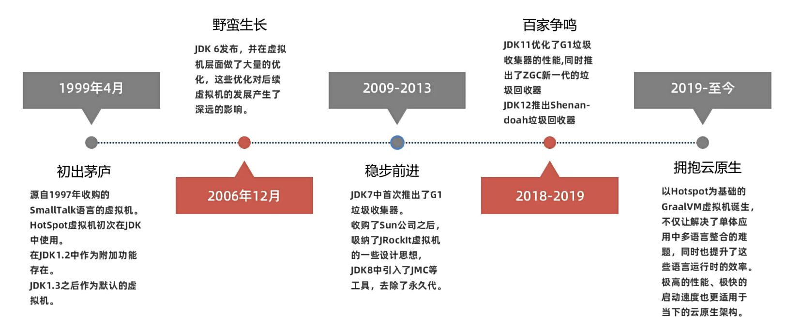
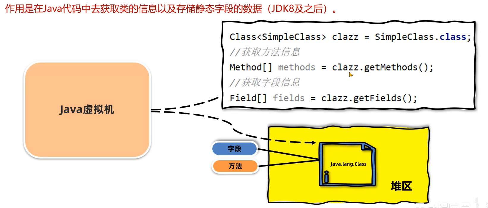
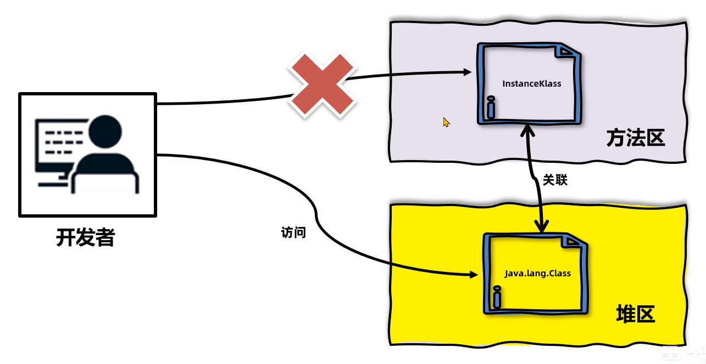

# Java Virtual Machine

本文参考：

[TOC]

# 简介

**JVM** 的全称是 **Java Virtual Machine**。

- **通俗理解**：它是一个“虚拟的计算机”，专门用来执行“Java字节码”。它运行在操作系统之上，与硬件没有直接的交互。
- **核心价值**：JVM 是实现 Java 语言 **“一次编写，到处运行”** 的核心与基石。开发者只需要编译一次，生成字节码文件，这个文件就可以在任何安装了对应 JVM 的操作系统上运行。

## 核心功能

### 解释和运行

- **它是什么？** 这是JVM作为“虚拟机”的根本职责。它充当了一个介于Java字节码和物理机硬件之间的“翻译官”。
- **如何工作？**
    - **解释执行**：JVM中的**解释器**会逐条读取字节码，将其翻译成本地机器指令并立即执行。优点是启动快，无需等待；缺点是每条指令每次都需要翻译，执行速度较慢。
    - **编译执行**：为了弥补解释器的速度缺陷，JVM内置了**即时编译器**。
- **图片中的“机器码”** 指的就是JIT编译器将热点代码编译成本地机器码的结果，这些机器码可以被CPU直接、高效地执行。

### 内存管理

- **它是什么？** JVM提供了自动化的内存管理机制，解放了程序员，无需像在C/C++中那样手动调用 `malloc/free` 或 `new/delete`。
- **如何工作？**
    - **自动分配**：当您使用 `new` 关键字创建对象时，JVM会自动在**堆内存**中为其分配空间。
    - **自动垃圾回收**：JVM的垃圾收集器会定期运行，通过**可达性分析算法**等策略，标记那些不再被任何引用的对象（即“垃圾”），然后回收它们占用的内存，防止内存泄漏。
- **重要性**：这是Java/C#等语言能够流行起来的关键特性之一，极大地减少了程序员的内存管理负担和由此产生的错误。

### 即时编译

- **它是什么？** 这是现代JVM提升性能的核心技术，是对“解释执行”的强力优化。
- **如何工作？**
    - JVM在程序运行时**监控**各个方法或代码块被调用的频率。
    - 对于那些被频繁执行的 **“热点代码”** ，JVM的**即时编译器**会将其直接编译成本地机器码，并缓存起来。
    - 下次再执行到这段代码时，就不再需要解释，直接运行高效的本地机器码即可。

## 主流 JVM

| 名称                     | 作者    | 支持版本                       | 社区活跃度 | 特性                                                         | 适用场景                               |
| :----------------------- | :------ | :----------------------------- | :--------- | :----------------------------------------------------------- | :------------------------------------- |
| HotSpot(Oracle JDK版)    | Oracle  | 所有版本                       | 高(精深)   | 使用最广泛、稳定可靠、社区活跃，Oracle JDK默认虚拟机         | 默认                                   |
| HotSpot(OpenJDK版)       | Oracle  | 所有版本                       | 中(16.1k)  | 开源、OpenJDK默认虚拟机                                      | 对JDK有二次开发需求                    |
| GraalVM                  | Oracle  | 11, 17, 19 企业版支持8         | 高         | 多语言支持Ruby、Python、C++等，高性能、JIT、AOT支持          | 微服务、云原生架构，需要多语言融合编程 |
| Dragonwell JDK           | Alibaba | 标准版 8, 11, 17 扩展版 11, 17 | 中         | 基于OpenJDK的增强，高性能、bug修复、安全性提升，JWarmup、ElasticHeap、Wisp特性支持 | 电商、物流、金融领域，对性能要求比较高 |
| Eclipse OpenJ9(原IBM J9) | IBM     | 8, 11, 17, 19, 20              | 低(3.9k)   | 高性能、可扩展，JIT、AOT特性支持                             | 微服务、云原生架构                     |

### HotSpot 发展历程




# JVM 体系结构


## 类加载子系统

这是 JVM 的“入口”和“搬运工”，负责将 `.class` 字节码文件加载到内存中，并进行初始化。

*   **加载**：通过类的全限定名获取其二进制字节流，将类的静态存储结构转化为方法区的运行时数据结构，并在堆中生成一个代表该类的 `Class` 对象，作为访问方法区这些数据的入口。
*   **链接**：
    *   **验证**：确保被加载的类信息符合 JVM 规范，保证虚拟机的安全（如文件格式验证、元数据验证、字节码验证、符号引用验证）。
    *   **准备**：为类的**静态变量**分配内存并设置**初始值**（零值），例如 `static int value = 123;` 在此阶段 `value` 会被初始化为 0，而非 123。
    *   **解析**：将常量池内的**符号引用**替换为**直接引用**（内存地址偏移量）。
*   **初始化**：开始执行类构造器 `<clinit>()` 方法的过程，真正为静态变量赋代码中指定的值（如上面的 `value` 在此阶段被赋值为 123），并执行静态代码块。

**特点**：采用**父委托机制**，即一个类加载器在加载类时，首先会委托给其父类加载器尝试加载，只有当父加载器无法完成时，子加载器才会自己加载。这保证了 Java 核心库的类型安全。

## 运行时数据区

这是 JVM 管理的内存区域，是 JVM 的“工作记忆库”，也是我们讨论最多的部分。它分为以下几个核心部分：

*   **方法区**：
    *   **存储内容**：已被加载的**类信息、常量、静态变量、即时编译器编译后的代码缓存**等。
    *   **实现**：在 HotSpot JVM 中，JDK 8 之前称为“永久代”，JDK 8 及之后改为 **“元空间”**，并使用本地内存而非 JVM 内存。
    *   **包含运行时常量池**：用于存放编译期生成的各种字面量和符号引用。

*   **堆**：
    *   **存储内容**：**对象实例和数组**。这是 JVM 中最大的一块内存区域。
    *   **特点**：是**垃圾收集器**管理的主要区域，因此也被称为 **GC 堆**。为了优化 GC，从分代收集的角度，堆又可分为**新生代**和**老年代**。

*   **Java 虚拟机栈**：
    *   **生命周期**：与线程相同。
    *   **存储内容**：描述的是 **Java 方法执行的内存模型**。每个方法在执行的同时都会创建一个**栈帧**，用于存储**局部变量表、操作数栈、动态链接、方法出口**等信息。一个方法从调用到执行完成，就对应着一个栈帧在虚拟机栈中从入栈到出栈的过程。
    *   **我们常说的“堆栈”中的“栈”，指的就是它。**

*   **程序计数器**：
    *   **作用**：一块较小的内存空间，可以看作是**当前线程所执行的字节码的行号指示器**。分支、循环、跳转、异常处理、线程恢复等基础功能都需要依赖它来完成。
    *   **特点**：线程私有，且是唯一一个没有规定任何 `OutOfMemoryError` 情况的区域。

*   **本地方法栈**：
    *   **作用**：与 Java 虚拟机栈非常相似，其区别在于：**虚拟机栈为执行 Java 方法服务，而本地方法栈则为执行 Native 方法服务。**

## 执行引擎

这是 JVM 的“心脏”和“大脑”，负责执行字节码。它由以下部分组成：

*   **解释器**：逐条读取字节码，解释并执行。优点是启动快，无需等待；缺点是执行效率相对较低。
*   **即时编译器**：这是提升 JVM 性能的关键。它将**频繁执行的热点代码**编译成本地机器码，并进行深度优化，然后缓存起来。下次执行时直接运行机器码，极大提升效率。
*   **垃圾收集器**：是执行引擎的一部分，负责自动回收堆中不再使用的对象，释放内存。它使用各种算法（如标记-清除、复制、标记-整理）和策略（分代收集）来管理堆内存。

## 本地方法接口

这是一个供 Java 代码调用的本地编程接口，允许 Java 程序调用用 C/C++ 等语言编写的**本地方法**。这使得 Java 能够与操作系统底层或硬件进行交互，突破 JVM 的限制。

## 本地方法库

这是由 C/C++ 等语言实现的、供 JNI 调用的方法库集合。

**总结**

| 组成部分         | 核心职责                         | 类比                                                         |
| :--------------- | :------------------------------- | :----------------------------------------------------------- |
| **类加载子系统** | 加载、验证、准备、解析和初始化类 | **仓库管理员**：接收和检查货物（.class文件），并将其整理上架。 |
| **运行时数据区** | 存储程序运行时的所有数据         | **仓库和车间**：包括原料库（方法区）、生产车间（堆）、工人工作台（栈）等。 |
| **执行引擎**     | 执行字节码，进行垃圾回收         | **生产线和工人**：解释指令（解释器），优化生产流程（JIT编译器），清理废料（GC）。 |
| **本地方法接口** | 作为桥梁，调用本地库             | **翻译官**：让生产线（Java）能够使用外部的特殊工具（本地库）。 |


# 字节码文件


## 组成部分

字节码文件采用一种类似于 C 语言结构体的伪结构来存储数据，它包含两种数据类型：

- **无符号数**：以 `u1`、`u2`、`u4`、`u8` 分别代表 1、2、4、8 字节的无符号数，用于描述数字、索引引用、数量值或按照 UTF-8 编码构成的字符串值。
- **表**：由多个无符号数或其他表作为数据项构成的复合数据类型。所有表都习惯性地以 `_info` 结尾。

整个 Class 文件本质上就是一张表，它由下面所示的数据项按严格顺序排列构成。

### 魔数与版本信息

- **魔数**：文件头 4 个字节，固定为 `0xCAFEBABE`。它的唯一作用是**确定这个文件是否为一个能被 JVM 接受的 Class 文件**。这就像是文件的“身份证”，即文件头。

    > **文件头**
    >
    > - 文件是无法通过文件扩展名来确定文件类型的，文件扩展名可以随意修改，不影响文件的内容。
    > - 软件使用文件的头几个字节（文件头）去校验文件的类型，如果软件不支持该种类型就会出错。
    >
    > | 文件类型                | 字节数 | 文件头                     |
    > | :---------------------- | :----- | :------------------------- |
    > | JPEG (jpg)              | 3      | FFD8FF                     |
    > | PNG (png)               | 4      | 89504E47（文件尾也有要求） |
    > | bmp                     | 2      | 424D                       |
    > | XML (xml)               | 5      | 3C3F786D6C                 |
    > | AVI (avi)               | 4      | 41564920                   |
    > | Java字节码文件 (.class) | 4      | CAFEBABE                   |

- **版本号**：魔数之后的 4 个字节。

    - **次版本号**：前 2 个字节。
    - **主版本号**：后 2 个字节。例如，Java 8 的主版本号是 52（主版本号 - 44 = JDK版本号）。JVM 会检查版本号以确保它能运行这个版本的 Class 文件。

### 常量池

这是 Class 文件结构中第一个也是内容最丰富的部分，可以看作是 Class 文件的**资源仓库**。

- **常量池计数器**：一个 u2 类型的数值，表示常量池中有多少项常量。**注意：计数从 1 开始而不是 0**。例如，如果这个值是 22，代表有 21 项常量。
- **常量池**：由 `常量池计数器 - 1` 项组成。每一项都是一个表，其第一个字节是“标签”，用于标识常量的类型。
    - **主要存放两大类常量**：
        1. **字面量**：接近于 Java 语言层面的常量概念，如**文本字符串**、被声明为 `final` 的常量值等。
        2. **符号引用**：编译原理方面的概念，包括：
            - 被模块导出或开放的包
            - 类和接口的**全限定名**
            - 字段的**名称和描述符**
            - 方法的**名称和描述符**
            - 方法句柄和方法类型
            - 动态调用点和动态常量

### 访问标志

紧接在常量池之后的 2 个字节，用于标识一些类或接口层次的访问信息。例如：

- 这个 Class 是类还是接口？
- 是否是 `public`？
- 是否是 `abstract`？
- 是否是 `final`？
- 等等。

### 类索引、父类索引与接口索引集合

- **类索引**：一个 u2 类型的值，用于确定这个类的全限定名。它指向常量池中的一个 `CONSTANT_Class_info` 类型的常量。
- **父类索引**：一个 u2 类型的值，用于确定这个类的父类的全限定名。除了 `java.lang.Object` 之外，所有类都有父类。
- **接口索引集合**：一组 u2 类型的数据的集合，描述了这个类实现了哪些接口。包括接口计数器和接口索引列表。

### 字段表集合

用于描述类或接口中声明的**变量（字段）**。包括类级变量和实例变量，但不包括方法内部的局部变量。

- 字段表集合中不会列出从父类或父接口继承而来的字段。
- 每个字段表都包含字段的访问标志（如 `public`, `private`, `static`, `final` 等）、名称、描述符（表示字段的数据类型）和属性表集合（如记录常量值的 `ConstantValue` 属性）。

### 方法表集合

用于描述类或接口中声明的**方法**。

- 方法表的结构与字段表非常相似，依次包括了：
    - **访问标志**（如 `public`, `synchronized`, `native`, `abstract` 等）
    - **名称索引**
    - **描述符索引**（表示方法的参数列表和返回值）
    - **属性表集合**
- **最重要的属性：`Code` 属性**：
    - 这是方法表中的核心属性，Java 方法体中的代码经过编译后，最终变为**字节码指令**存储在 `Code` 属性中。
    - `Code` 属性本身也是一个复杂的结构，包含：
        - **操作数栈的最大深度**
        - **局部变量表所需的存储空间**
        - **字节码指令序列**
        - 异常表
        - 其他属性（如 `LineNumberTable` 用于调试，建立字节码偏移量与源代码行号的对应关系）。

> [基础篇-4-字节码文件的组成-常量池和方法_哔哩哔哩_bilibili](https://www.bilibili.com/video/BV1r94y1b7eS?spm_id_from=333.788.videopod.episodes&vd_source=53ce3c6946a5aed7c975753cd24f0e3f&p=6)
>
> ```java
> int i = 0;          // 对应指令 0-1
> i = i++;            // 对应指令 2-6
> System.out.println(i); // result: 0
> ```
>
> 对应字节码指令：
>
> ```shell
> iconst_0
> istore_1
> iload_1		# 先把当前数复制到操作数栈, 栈内是0
> iinc 1 by 1 # 再对局部变量表的i进行++
> istore_1	# 弹出栈顶元素0到i的局部变量槽
> return
> ```
>
> **详细步骤解释**
>
> - **`iconst_0`**: 将整型常量 `0` 压入**操作数栈**。
>     - **栈状态**: [0]
> - **`istore_1`**: 将栈顶的整数值弹出，并存入**局部变量表**中索引为 `1` 的变量槽（这个变量就是 `i`）。
>     - **栈状态**: [ ]
>     - **局部变量 `i` (槽1)**: 0
> - **`iload_1`**: 将局部变量表索引为 `1` 的变量（即 `i` 的值 `0`）加载到操作数栈。
>     - **栈状态**: [0]
>     - **局部变量 `i` (槽1)**: 0
> - **`iinc 1 by 1`**: 这是关键指令。它**直接在局部变量表**中，将索引为 `1` 的变量（即 `i`）的值增加 `1`。这个操作**不涉及操作数栈**。
>     - **栈状态**: [0] (栈没有变化)
>     - **局部变量 `i` (槽1)**: 1 (值已经被改变)
> - **`istore_1`**: 将当前操作数栈的栈顶值（仍然是 `0`）弹出，并存储回局部变量表索引为 `1` 的变量槽（即 `i`）。这一步**覆盖**了上一步 `iinc` 指令的结果。
>     - **栈状态**: [ ]
>     - **局部变量 `i` (槽1)**: 0 (被旧值覆盖)
> - **`return`**: 方法返回。
>
> 但是如果，
>
> ```java
> int i = 0;
> i = ++i;
> System.out.println(i);
> ```
>
> 对应指令为，
>
> ```shell
> iconst_0
> istore_1
> iinc 1 by 1	# 先加再放入操作数栈
> iload_1
> istore_1	
> return
> ```

### 属性表集合

用于描述某些场景专有的信息。它出现在 Class 文件、字段表、方法表的多处。

- 除了上面提到的 `Code`、`LineNumberTable`、`ConstantValue` 等预定义属性外，JVM 规范允许编译器自己实现并向属性表中写入自定义属性。


## 常用工具


### `javap`

- **来源**：Oracle JDK 和 OpenJDK 自带。

- **描述**：这是最基础、最常用的字节码反汇编工具，无需安装任何额外软件。

- **常用命令**：

    ```bash
    # 最基本用法，显示包、字段、方法信息
    javap java.lang.String
    
    # -c 输出反编译的代码（即字节码指令）
    javap -c com.example.MyClass
    
    # -v 输出详细信息，包括常量池、行号表、局部变量表等
    javap -v com.example.MyClass
    
    # -p 显示所有类和成员（包括private）
    javap -p -c com.example.MyClass
    
    # 将结果输出到文件
    javap -v com.example.MyClass > MyClass.bytecode.txt
    ```

- **适用场景**：快速查看方法实现、理解语法糖背后的原理、验证代码逻辑。


### JClassLib

- **描述**：一个独立的、功能强大的图形化字节码查看器。它也可以作为 IDEA 的插件使用。
- **特点**：
    - 以树形结构清晰展示 Class 文件的各个组成部分（魔数、版本、常量池、方法、属性等）。
    - 点击任意条目，会显示详细的解释和十六进制值。
    - 可以实时关联到官方 JVM 规范文档。
- **适用场景**：系统性地学习 Class 文件结构，进行深入的字节码分析。


### Arthas

**Arthas** 是一款**在线监控、诊断和管理 Java 应用程序**的工具。它最大的特点是**无需修改代码、无需重启服务**，即可动态地查看应用的运行状态。

1. 启动与连接

```bash
# 1. 下载 Arthas
wget https://github.com/alibaba/arthas/releases/download/arthas-all-3.7.2/arthas-boot.jar

# 2. 启动 Arthas，它会列出当前所有的 Java 进程
java -jar arthas-boot.jar

# 3. 输入目标进程号（比如 1）前面的编号，然后回车连接
[INFO] arthas-boot version: 3.7.2
[INFO] Found existing java process, please choose one and input the serial number of the process, eg: 1. Then hit ENTER.
* [1]: 1234 com.example.Application
  [2]: 5678 org.apache.catalina.startup.Bootstrap
```

2. 常用命令
    - `dashboard` - 当前系统的实时数据面板
    - `dump` - 转存已加载类的 bytecode 到特定目录
    - `jad` - 反编译字节码
    - `thread` - 线程诊断


# 类的生命周期

 **类的生命周期**描述了从一个 `.class` 字节码文件被加载到内存，到最终被卸载的完整过程。

好的，我们来详细解析 **类的生命周期**。这是一个非常核心的 JVM 知识点，描述了从一个 `.class` 字节码文件被加载到内存，到最终被卸载的完整过程。

类的生命周期完整地包括以下七个阶段：

```mermaid
flowchart TD
    A[“.class 文件”] --> B[“加载 Loading”]
    B --> C[“验证 Verification”]
    C --> D[“准备 Preparation”]
    D --> E[“解析 Resolution”]
    E --> F[“初始化 Initialization”]
    F --> G[“使用 Using”]
    G --> H[“卸载 Unloading”]

    subgraph Linking [“链接 (Linking)”]
        C
        D
        E
    end
```

其中，**加载、验证、准备、初始化和卸载**这5个阶段的顺序是确定的。而**解析**阶段则不一定：它在某些情况下可以在初始化之后开始，这是为了支持 Java 语言的动态绑定（晚期绑定）特性。

下面我们详细讲解前六个阶段（“使用”阶段是程序的正常执行，无需多言）。

## 加载 Loading

此阶段是“类加载”过程的一个阶段，不要将两者混淆。加载阶段，JVM 需要完成三件事：

1. **通过类的全限定名获取定义此类的二进制字节流**。
    *   JVM 规范并没有指定字节流必须来自一个 `.class` 文件，它可以从 ZIP 包（JAR、WAR）、网络、运行时计算生成（动态代理）、由其他文件生成（JSP）等来源获取。

2. **将这个字节流所代表的静态存储结构转化为方法区（虚拟概念：早期为永久代，现在为原空间）的运行时数据结构**。

    

3. **在内存（堆区）中生成一个代表这个类的 `java.lang.Class` 对象**，作为方法区这个类的各种数据的访问入口。JDK8以后，堆区还会储存**静态字段**的数据。



**注意**：数组类本身不通过类加载器创建，而是由 JVM 直接创建，但其元素类型最终仍然需要靠类加载器加载。



## 链接 Linking

### 验证 Verification

这是连接阶段的第一步，目的是确保 **Class 文件的字节流中包含的信息符合《Java虚拟机规范》的全部约束要求**，保证这些信息不会危害虚拟机自身的安全。

验证阶段大致会完成以下四个动作：

*   **文件格式验证**：验证字节流是否符合 Class 文件格式的规范，并能被当前版本的虚拟机处理。例如：魔数是否正确、主次版本号是否在当前虚拟机处理范围内、常量池中的常量是否有不支持的类型等。
    *   **只有这个阶段的验证是基于二进制字节流进行的**，之后阶段都是基于方法区的存储结构进行的。
*   **元数据验证**：对字节码描述的信息进行语义分析，以保证其符合 Java 语言规范的要求。例如：这个类是否有父类（除了 `java.lang.Object`）、是否继承了不允许被继承的类（final 类）、如果不是抽象类是否实现了其父类或接口要求实现的所有方法等。
*   **字节码验证**：最复杂的一个阶段，通过数据流分析和控制流分析，确定程序语义是合法的、符合逻辑的。例如：保证任意时刻操作数栈的数据类型与指令代码序列都能配合工作、保证跳转指令不会跳转到方法体以外的字节码指令上、保证方法体中的类型转换是有效的等。
*   **符号引用验证**：发生在**解析阶段**，JVM 将符号引用转化为直接引用时。例如：通过字符串描述的全限定名是否能找到对应的类、在指定类中是否存在符合方法的字段描述符及简单名称所描述的方法和字段等。

### 准备 Preparation

**准备阶段是正式为类中定义的静态变量分配内存并设置类变量初始值的阶段**。

*   **分配内存**：这些变量所使用的内存都将在**方法区**中进行分配。
*   **初始值**：这里所说的“初始值”通常是**数据类型的零值**。
    ```java
    public static int value = 123;
    ```
    在准备阶段，变量 `value` 的初始值是 `0`，而不是 `123`。将 `value` 赋值为 123 的 `putstatic` 指令是在程序被编译后，存放于类构造器 `<clinit>()` 方法之中，所以赋值为 123 的动作要到类的**初始化**阶段才会被执行。

*   **特殊情况**：如果类字段的字段属性表中存在 `ConstantValue` 属性（即被 `final static` 修饰），那么在准备阶段变量值就会被初始化为代码中指定的值。
    ```java
    public static final int value = 123;
    ```
    在准备阶段，`value` 就会被直接赋值为 `123`。

### 解析 Resolution

**解析阶段是 JVM 将常量池内的符号引用替换为直接引用的过程**。

*   **符号引用**：以一组符号来描述所引用的目标，符号可以是任何形式的字面量，只要使用时能无歧义地定位到目标即可。符号引用与虚拟机实现的内存布局无关。
*   **直接引用**：可以是直接指向目标的指针、相对偏移量或一个能间接定位到目标的句柄。直接引用是和虚拟机实现的内存布局直接相关的。

解析动作主要针对以下七类符号引用进行：
1.  类或接口
2.  字段
3.  类方法
4.  接口方法
5.  方法类型
6.  方法句柄
7.  调用点限定符

## 初始化 Initialization

**初始化阶段就是执行类构造器 `<clinit>()` 方法的过程**。

*   `<clinit>()` 方法是什么？
    *   它是由编译器自动收集类中的所有**类变量的赋值动作**和**静态语句块中的语句**合并产生的。编译器收集的顺序是由语句在源文件中出现的顺序决定的。
    *   它与类的构造函数（实例构造器 `<init>()`）不同，它不需要显式地调用父类构造器，JVM 会保证在子类的 `<clinit>()` 方法执行前，父类的 `<clinit>()` 方法已经执行完毕。
    *   如果类中没有静态变量赋值也没有静态语句块，那么编译器可以不为这个类生成 `<clinit>()` 方法。

*   **JVM 保证 `<clinit>()` 方法在多线程环境下被正确地加锁同步**。如果多个线程同时去初始化一个类，那么只会有一个线程去执行这个类的 `<clinit>()` 方法，其他线程都需要阻塞等待，直到活动线程执行完毕 `<clinit>()` 方法。

## 使用 Using

类在完成初始化之后，就可以被正常使用了，包括：
*   创建类的实例对象
*   调用类的静态方法
*   访问类或接口的静态字段

## 卸载 Unloading

当一个类被加载、连接和初始化之后，它的生命周期就开始了。当代表类的 `Class` 对象不再被引用，即不可触及时，`Class` 对象就会结束生命周期，类数据在方法区中的数据也会被卸载，从而结束类的生命周期。

**一个类何时结束生命周期，取决于代表它的 `Class` 对象何时结束生命周期**。

由 Java 虚拟机自带的三种类加载器（启动类加载器、扩展类加载器、系统类加载器）加载的类，在虚拟机的生命周期中，始终不会被卸载。由用户自定义类加载器加载的类是可以被卸载的。