# Java Virtual Machine

本文参考：

[TOC]

# 简介

**JVM** 的全称是 **Java Virtual Machine**。

- **通俗理解**：它是一个“虚拟的计算机”，专门用来执行“Java字节码”。它运行在操作系统之上，与硬件没有直接的交互。
- **核心价值**：JVM 是实现 Java 语言 **“一次编写，到处运行”** 的核心与基石。开发者只需要编译一次，生成字节码文件，这个文件就可以在任何安装了对应 JVM 的操作系统上运行。

## 核心功能

### 解释和运行

- **它是什么？** 这是JVM作为“虚拟机”的根本职责。它充当了一个介于Java字节码和物理机硬件之间的“翻译官”。
- **如何工作？**
    - **解释执行**：JVM中的**解释器**会逐条读取字节码，将其翻译成本地机器指令并立即执行。优点是启动快，无需等待；缺点是每条指令每次都需要翻译，执行速度较慢。
    - **编译执行**：为了弥补解释器的速度缺陷，JVM内置了**即时编译器**。
- **图片中的“机器码”** 指的就是JIT编译器将热点代码编译成本地机器码的结果，这些机器码可以被CPU直接、高效地执行。

### 内存管理

- **它是什么？** JVM提供了自动化的内存管理机制，解放了程序员，无需像在C/C++中那样手动调用 `malloc/free` 或 `new/delete`。
- **如何工作？**
    - **自动分配**：当您使用 `new` 关键字创建对象时，JVM会自动在**堆内存**中为其分配空间。
    - **自动垃圾回收**：JVM的垃圾收集器会定期运行，通过**可达性分析算法**等策略，标记那些不再被任何引用的对象（即“垃圾”），然后回收它们占用的内存，防止内存泄漏。
- **重要性**：这是Java/C#等语言能够流行起来的关键特性之一，极大地减少了程序员的内存管理负担和由此产生的错误。

### 即时编译

- **它是什么？** 这是现代JVM提升性能的核心技术，是对“解释执行”的强力优化。
- **如何工作？**
    - JVM在程序运行时**监控**各个方法或代码块被调用的频率。
    - 对于那些被频繁执行的 **“热点代码”** ，JVM的**即时编译器**会将其直接编译成本地机器码，并缓存起来。
    - 下次再执行到这段代码时，就不再需要解释，直接运行高效的本地机器码即可。

## 主流 JVM

| 名称                     | 作者    | 支持版本                       | 社区活跃度 | 特性                                                         | 适用场景                               |
| :----------------------- | :------ | :----------------------------- | :--------- | :----------------------------------------------------------- | :------------------------------------- |
| HotSpot(Oracle JDK版)    | Oracle  | 所有版本                       | 高(精深)   | 使用最广泛、稳定可靠、社区活跃，Oracle JDK默认虚拟机         | 默认                                   |
| HotSpot(OpenJDK版)       | Oracle  | 所有版本                       | 中(16.1k)  | 开源、OpenJDK默认虚拟机                                      | 对JDK有二次开发需求                    |
| GraalVM                  | Oracle  | 11, 17, 19 企业版支持8         | 高         | 多语言支持Ruby、Python、C++等，高性能、JIT、AOT支持          | 微服务、云原生架构，需要多语言融合编程 |
| Dragonwell JDK           | Alibaba | 标准版 8, 11, 17 扩展版 11, 17 | 中         | 基于OpenJDK的增强，高性能、bug修复、安全性提升，JWarmup、ElasticHeap、Wisp特性支持 | 电商、物流、金融领域，对性能要求比较高 |
| Eclipse OpenJ9(原IBM J9) | IBM     | 8, 11, 17, 19, 20              | 低(3.9k)   | 高性能、可扩展，JIT、AOT特性支持                             | 微服务、云原生架构                     |

### HotSpot 发展历程


# JVM 体系结构


## 类加载子系统

这是 JVM 的“入口”和“搬运工”，负责将 `.class` 字节码文件加载到内存中，并进行初始化。

*   **加载**：通过类的全限定名获取其二进制字节流，将类的静态存储结构转化为方法区的运行时数据结构，并在堆中生成一个代表该类的 `Class` 对象，作为访问方法区这些数据的入口。
*   **链接**：
    *   **验证**：确保被加载的类信息符合 JVM 规范，保证虚拟机的安全（如文件格式验证、元数据验证、字节码验证、符号引用验证）。
    *   **准备**：为类的**静态变量**分配内存并设置**初始值**（零值），例如 `static int value = 123;` 在此阶段 `value` 会被初始化为 0，而非 123。
    *   **解析**：将常量池内的**符号引用**替换为**直接引用**（内存地址偏移量）。
*   **初始化**：开始执行类构造器 `<clinit>()` 方法的过程，真正为静态变量赋代码中指定的值（如上面的 `value` 在此阶段被赋值为 123），并执行静态代码块。

**特点**：采用**父委托机制**，即一个类加载器在加载类时，首先会委托给其父类加载器尝试加载，只有当父加载器无法完成时，子加载器才会自己加载。这保证了 Java 核心库的类型安全。

## 运行时数据区

这是 JVM 管理的内存区域，是 JVM 的“工作记忆库”，也是我们讨论最多的部分。它分为以下几个核心部分：

*   **方法区**：
    *   **存储内容**：已被加载的**类信息、常量、静态变量、即时编译器编译后的代码缓存**等。
    *   **实现**：在 HotSpot JVM 中，JDK 8 之前称为“永久代”，JDK 8 及之后改为 **“元空间”**，并使用本地内存而非 JVM 内存。
    *   **包含运行时常量池**：用于存放编译期生成的各种字面量和符号引用。

*   **堆**：
    *   **存储内容**：**对象实例和数组**。这是 JVM 中最大的一块内存区域。
    *   **特点**：是**垃圾收集器**管理的主要区域，因此也被称为 **GC 堆**。为了优化 GC，从分代收集的角度，堆又可分为**新生代**和**老年代**。

*   **Java 虚拟机栈**：
    *   **生命周期**：与线程相同。
    *   **存储内容**：描述的是 **Java 方法执行的内存模型**。每个方法在执行的同时都会创建一个**栈帧**，用于存储**局部变量表、操作数栈、动态链接、方法出口**等信息。一个方法从调用到执行完成，就对应着一个栈帧在虚拟机栈中从入栈到出栈的过程。
    *   **我们常说的“堆栈”中的“栈”，指的就是它。**

*   **程序计数器**：
    *   **作用**：一块较小的内存空间，可以看作是**当前线程所执行的字节码的行号指示器**。分支、循环、跳转、异常处理、线程恢复等基础功能都需要依赖它来完成。
    *   **特点**：线程私有，且是唯一一个没有规定任何 `OutOfMemoryError` 情况的区域。

*   **本地方法栈**：
    *   **作用**：与 Java 虚拟机栈非常相似，其区别在于：**虚拟机栈为执行 Java 方法服务，而本地方法栈则为执行 Native 方法服务。**

## 执行引擎

这是 JVM 的“心脏”和“大脑”，负责执行字节码。它由以下部分组成：

*   **解释器**：逐条读取字节码，解释并执行。优点是启动快，无需等待；缺点是执行效率相对较低。
*   **即时编译器**：这是提升 JVM 性能的关键。它将**频繁执行的热点代码**编译成本地机器码，并进行深度优化，然后缓存起来。下次执行时直接运行机器码，极大提升效率。
*   **垃圾收集器**：是执行引擎的一部分，负责自动回收堆中不再使用的对象，释放内存。它使用各种算法（如标记-清除、复制、标记-整理）和策略（分代收集）来管理堆内存。

## 本地方法接口

这是一个供 Java 代码调用的本地编程接口，允许 Java 程序调用用 C/C++ 等语言编写的**本地方法**。这使得 Java 能够与操作系统底层或硬件进行交互，突破 JVM 的限制。

## 本地方法库

这是由 C/C++ 等语言实现的、供 JNI 调用的方法库集合。

**总结**

| 组成部分         | 核心职责                         | 类比                                                         |
| :--------------- | :------------------------------- | :----------------------------------------------------------- |
| **类加载子系统** | 加载、验证、准备、解析和初始化类 | **仓库管理员**：接收和检查货物（.class文件），并将其整理上架。 |
| **运行时数据区** | 存储程序运行时的所有数据         | **仓库和车间**：包括原料库（方法区）、生产车间（堆）、工人工作台（栈）等。 |
| **执行引擎**     | 执行字节码，进行垃圾回收         | **生产线和工人**：解释指令（解释器），优化生产流程（JIT编译器），清理废料（GC）。 |
| **本地方法接口** | 作为桥梁，调用本地库             | **翻译官**：让生产线（Java）能够使用外部的特殊工具（本地库）。 |


# 字节码文件


## 组成部分

字节码文件采用一种类似于 C 语言结构体的伪结构来存储数据，它包含两种数据类型：

- **无符号数**：以 `u1`、`u2`、`u4`、`u8` 分别代表 1、2、4、8 字节的无符号数，用于描述数字、索引引用、数量值或按照 UTF-8 编码构成的字符串值。
- **表**：由多个无符号数或其他表作为数据项构成的复合数据类型。所有表都习惯性地以 `_info` 结尾。

整个 Class 文件本质上就是一张表，它由下面所示的数据项按严格顺序排列构成。

### 魔数与版本信息

- **魔数**：文件头 4 个字节，固定为 `0xCAFEBABE`。它的唯一作用是**确定这个文件是否为一个能被 JVM 接受的 Class 文件**。这就像是文件的“身份证”，即文件头。

    > **文件头**
    >
    > - 文件是无法通过文件扩展名来确定文件类型的，文件扩展名可以随意修改，不影响文件的内容。
    > - 软件使用文件的头几个字节（文件头）去校验文件的类型，如果软件不支持该种类型就会出错。
    >
    > | 文件类型                | 字节数 | 文件头                     |
    > | :---------------------- | :----- | :------------------------- |
    > | JPEG (jpg)              | 3      | FFD8FF                     |
    > | PNG (png)               | 4      | 89504E47（文件尾也有要求） |
    > | bmp                     | 2      | 424D                       |
    > | XML (xml)               | 5      | 3C3F786D6C                 |
    > | AVI (avi)               | 4      | 41564920                   |
    > | Java字节码文件 (.class) | 4      | CAFEBABE                   |

- **版本号**：魔数之后的 4 个字节。

    - **次版本号**：前 2 个字节。
    - **主版本号**：后 2 个字节。例如，Java 8 的主版本号是 52（主版本号 - 44 = JDK版本号）。JVM 会检查版本号以确保它能运行这个版本的 Class 文件。

### 常量池

这是 Class 文件结构中第一个也是内容最丰富的部分，可以看作是 Class 文件的**资源仓库**。**这是编译期就确定的数据。**

- **常量池计数器**：一个 u2 类型的数值，表示常量池中有多少项常量。**注意：计数从 1 开始而不是 0**。例如，如果这个值是 22，代表有 21 项常量。
- **常量池**：由 `常量池计数器 - 1` 项组成。每一项都是一个表，其第一个字节是“标签”，用于标识常量的类型。
    - **主要存放两大类常量**：
        1. **字面量**：接近于 Java 语言层面的常量概念，如**文本字符串**、被声明为 `final` 的常量值等。
        2. **符号引用**：编译原理方面的概念，包括：
            - 被模块导出或开放的包
            - 类和接口的**全限定名**
            - 字段的**名称和描述符**
            - 方法的**名称和描述符**
            - 方法句柄和方法类型
            - 动态调用点和动态常量

### 访问标志

紧接在常量池之后的 2 个字节，用于标识一些类或接口层次的访问信息。例如：

- 这个 Class 是类还是接口？
- 是否是 `public`？
- 是否是 `abstract`？
- 是否是 `final`？
- 等等。

### 类引用、父类引用与接口引用集合

- **类索引**：一个 u2 类型的值，用于确定这个类的全限定名。它指向常量池中的一个 `CONSTANT_Class_info` 类型的常量。
- **父类索引**：一个 u2 类型的值，用于确定这个类的父类的全限定名。除了 `java.lang.Object` 之外，所有类都有父类。
- **接口索引集合**：一组 u2 类型的数据的集合，描述了这个类实现了哪些接口。包括接口计数器和接口索引列表。

### 字段表集合

用于描述类或接口中声明的**变量（字段）**。包括类级变量和实例变量，但不包括方法内部的局部变量。

- 字段表集合中不会列出从父类或父接口继承而来的字段。
- 每个字段表都包含字段的访问标志（如 `public`, `private`, `static`, `final` 等）、名称、描述符（表示字段的数据类型）和属性表集合（如记录常量值的 `ConstantValue` 属性）。

### 方法表集合

用于描述类或接口中声明的**方法**。

- 方法表的结构与字段表非常相似，依次包括了：
    - **访问标志**（如 `public`, `synchronized`, `native`, `abstract` 等）
    - **名称索引**
    - **描述符索引**（表示方法的参数列表和返回值）
    - **属性表集合**
- **最重要的属性：`Code` 属性**：
    - 这是方法表中的核心属性，Java 方法体中的代码经过编译后，最终变为**字节码指令**存储在 `Code` 属性中。
    - `Code` 属性本身也是一个复杂的结构，包含：
        - **操作数栈的最大深度**
        - **局部变量表所需的存储空间**
        - **字节码指令序列**
        - 异常表
        - 其他属性（如 `LineNumberTable` 用于调试，建立字节码偏移量与源代码行号的对应关系）。

> [基础篇-4-字节码文件的组成-常量池和方法_哔哩哔哩_bilibili](https://www.bilibili.com/video/BV1r94y1b7eS?spm_id_from=333.788.videopod.episodes&vd_source=53ce3c6946a5aed7c975753cd24f0e3f&p=6)
>
> ```java
> int i = 0;          // 对应指令 0-1
> i = i++;            // 对应指令 2-6
> System.out.println(i); // result: 0
> ```
>
> 对应字节码指令：
>
> ```shell
> iconst_0
> istore_1
> iload_1		# 先把当前数复制到操作数栈, 栈内是0
> iinc 1 by 1 # 再对局部变量表的i进行++
> istore_1	# 弹出栈顶元素0到i的局部变量槽
> return
> ```
>
> **详细步骤解释**
>
> - **`iconst_0`**: 将整型常量 `0` 压入**操作数栈**。
>     - **栈状态**: [0]
> - **`istore_1`**: 将栈顶的整数值弹出，并存入**局部变量表**中索引为 `1` 的变量槽（这个变量就是 `i`）。
>     - **栈状态**: [ ]
>     - **局部变量 `i` (槽1)**: 0
> - **`iload_1`**: 将局部变量表索引为 `1` 的变量（即 `i` 的值 `0`）加载到操作数栈。
>     - **栈状态**: [0]
>     - **局部变量 `i` (槽1)**: 0
> - **`iinc 1 by 1`**: 这是关键指令。它**直接在局部变量表**中，将索引为 `1` 的变量（即 `i`）的值增加 `1`。这个操作**不涉及操作数栈**。
>     - **栈状态**: [0] (栈没有变化)
>     - **局部变量 `i` (槽1)**: 1 (值已经被改变)
> - **`istore_1`**: 将当前操作数栈的栈顶值（仍然是 `0`）弹出，并存储回局部变量表索引为 `1` 的变量槽（即 `i`）。这一步**覆盖**了上一步 `iinc` 指令的结果。
>     - **栈状态**: [ ]
>     - **局部变量 `i` (槽1)**: 0 (被旧值覆盖)
> - **`return`**: 方法返回。
>
> 但是如果，
>
> ```java
> int i = 0;
> i = ++i;
> System.out.println(i);
> ```
>
> 对应指令为，
>
> ```shell
> iconst_0
> istore_1
> iinc 1 by 1	# 先加再放入操作数栈
> iload_1
> istore_1	
> return
> ```

### 属性表集合

用于描述某些场景专有的信息。它出现在 Class 文件、字段表、方法表的多处。

- 除了上面提到的 `Code`、`LineNumberTable`、`ConstantValue` 等预定义属性外，JVM 规范允许编译器自己实现并向属性表中写入自定义属性。


## 常用工具


### `javap`

- **来源**：Oracle JDK 和 OpenJDK 自带。

- **描述**：这是最基础、最常用的字节码反汇编工具，无需安装任何额外软件。

- **常用命令**：

    ```bash
    # 最基本用法，显示包、字段、方法信息
    javap java.lang.String
    
    # -c 输出反编译的代码（即字节码指令）
    javap -c com.example.MyClass
    
    # -v 输出详细信息，包括常量池、行号表、局部变量表等
    javap -v com.example.MyClass
    
    # -p 显示所有类和成员（包括private）
    javap -p -c com.example.MyClass
    
    # 将结果输出到文件
    javap -v com.example.MyClass > MyClass.bytecode.txt
    ```

- **适用场景**：快速查看方法实现、理解语法糖背后的原理、验证代码逻辑。


### JClassLib

- **描述**：一个独立的、功能强大的图形化字节码查看器。它也可以作为 IDEA 的插件使用。
- **特点**：
    - 以树形结构清晰展示 Class 文件的各个组成部分（魔数、版本、常量池、方法、属性等）。
    - 点击任意条目，会显示详细的解释和十六进制值。
    - 可以实时关联到官方 JVM 规范文档。
- **适用场景**：系统性地学习 Class 文件结构，进行深入的字节码分析。


### Arthas

**Arthas** 是一款**在线监控、诊断和管理 Java 应用程序**的工具。它最大的特点是**无需修改代码、无需重启服务**，即可动态地查看应用的运行状态。

1. 启动与连接

```bash
# 1. 下载 Arthas
wget https://github.com/alibaba/arthas/releases/download/arthas-all-3.7.2/arthas-boot.jar

# 2. 启动 Arthas，它会列出当前所有的 Java 进程
java -jar arthas-boot.jar

# 3. 输入目标进程号（比如 1）前面的编号，然后回车连接
[INFO] arthas-boot version: 3.7.2
[INFO] Found existing java process, please choose one and input the serial number of the process, eg: 1. Then hit ENTER.
* [1]: 1234 com.example.Application
  [2]: 5678 org.apache.catalina.startup.Bootstrap
```

2. 常用命令
    - `dashboard` - 当前系统的实时数据面板
    - `dump` - 转存已加载类的 bytecode 到特定目录
    - `jad` - 反编译字节码
    - `thread` - 线程诊断


# 类的生命周期

 **类的生命周期**描述了从一个 `.class` 字节码文件被加载到内存，到最终被卸载的完整过程。

好的，我们来详细解析 **类的生命周期**。这是一个非常核心的 JVM 知识点，描述了从一个 `.class` 字节码文件被加载到内存，到最终被卸载的完整过程。

类的生命周期完整地包括以下七个阶段：

```mermaid
flowchart TD
    A[“.class 文件”] --> B[“加载 Loading”]
    B --> C[“验证 Verification”]
    C --> D[“准备 Preparation”]
    D --> E[“解析 Resolution”]
    E --> F[“初始化 Initialization”]
    F --> G[“使用 Using”]
    G --> H[“卸载 Unloading”]

    subgraph Linking [“链接 (Linking)”]
        C
        D
        E
    end
```

其中，**加载、验证、准备、初始化和卸载**这5个阶段的顺序是确定的。而**解析**阶段则不一定：它在某些情况下可以在初始化之后开始，这是为了支持 Java 语言的动态绑定（晚期绑定）特性。

下面我们详细讲解前六个阶段（“使用”阶段是程序的正常执行，无需多言）。

## 加载 Loading

此阶段是“类加载”过程的一个阶段，不要将两者混淆。加载阶段，JVM 需要完成三件事：

1. **通过类的全限定名获取定义此类的二进制字节流**。
    *   JVM 规范并没有指定字节流必须来自一个 `.class` 文件，它可以从 ZIP 包（JAR、WAR）、网络、运行时计算生成（动态代理）、由其他文件生成（JSP）等来源获取。

2. **将这个字节流所代表的静态存储结构转化为方法区（虚拟概念：早期为永久代，现在为原空间）的运行时数据结构**。

    

3. **在内存（堆区）中生成一个代表这个类的 `java.lang.Class` 对象**，作为方法区这个类的各种数据的访问入口。JDK8以后，堆区还会储存**静态字段**的数据。


**注意**：数组类本身不通过类加载器创建，而是由 JVM 直接创建，但其元素类型最终仍然需要靠类加载器加载。


## 链接 Linking

### 验证 Verification

这是连接阶段的第一步，目的是确保 **Class 文件的字节流中包含的信息符合《Java虚拟机规范》的全部约束要求**，保证这些信息不会危害虚拟机自身的安全。

验证阶段大致会完成以下四个动作：

* **文件格式验证**：验证字节流是否符合 Class 文件格式的规范，并能被当前版本的虚拟机处理。例如：魔数（文件头）是否正确、主次版本号是否在当前虚拟机处理范围内、常量池中的常量是否有不支持的类型等。

    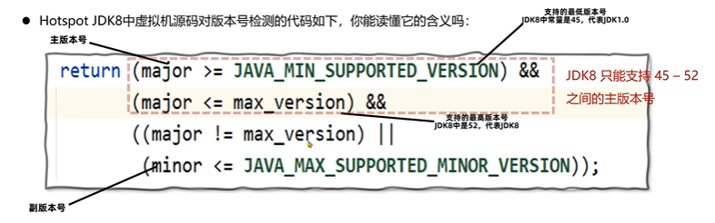

    *   **只有这个阶段的验证是基于二进制字节流进行的**，之后阶段都是基于方法区的存储结构进行的。

* **元数据验证**：对字节码描述的信息进行语义分析，以保证其符合 Java 语言规范的要求。例如：这个类是否有父类（除了 `java.lang.Object`）、是否继承了不允许被继承的类（final 类）、如果不是抽象类是否实现了其父类或接口要求实现的所有方法等。

* **字节码验证**：最复杂的一个阶段，通过数据流分析和控制流分析，**确定程序语义（字节码指令）是合法的**、符合逻辑的。例如：保证任意时刻操作数栈的数据类型与指令代码序列都能配合工作、保证跳转指令不会跳转到方法体以外的字节码指令上、保证方法体中的类型转换是有效的等。

*   **符号引用验证**：发生在**解析阶段**，JVM 将符号引用转化为直接引用时。例如：是否访问了其它类中的 `private` 的方法。

### 准备 Preparation

**准备阶段是正式为类中定义的静态变量分配内存并设置类变量初始值的阶段**。

*   **分配内存**：这些变量所使用的内存都将在**方法区**中进行分配。
*   **初始值**：这里所说的“初始值”通常是**数据类型的零值**。
    ```java
    public static int value = 123;
    ```
    在准备阶段，变量 `value` 的初始值是 `0`，而不是 `123`。将 `value` 赋值为 123 的 `putstatic` 指令是在程序被编译后，存放于类构造器 `<clinit>()` 方法之中，所以赋值为 123 的动作要到类的**初始化**阶段才会被执行。

*   **特殊情况**：如果类字段的字段属性表中存在 `ConstantValue` 属性（即被 `final static` 修饰），那么在准备阶段变量值就会被初始化为代码中指定的值。
    
    ```java
    public static final int value = 123;
    ```
    在准备阶段，`value` 就会被直接赋值为 `123`。
    
    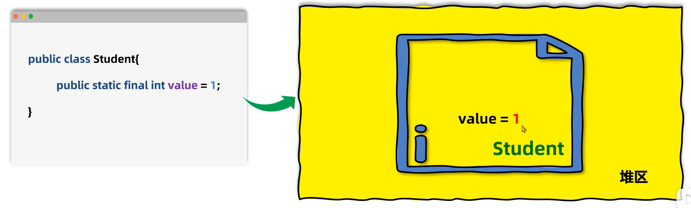

### 解析 Resolution

**解析阶段是 JVM 将常量池内的符号引用替换为直接引用的过程**。

*   **符号引用**：以一组符号来描述所引用的目标，符号可以是任何形式的字面量，只要使用时能无歧义地定位到目标即可。符号引用与虚拟机实现的内存布局无关。
*   **直接引用**：可以是直接指向目标的指针、相对偏移量或一个能间接定位到目标的句柄。直接引用是和虚拟机实现的内存布局直接相关的。

#### 具体例子

假设我们有这样一段简单的代码：

```java
// 在另一个文件中，比如 com/example/MyClass.java
package com.example;

public class MyClass {
    public void greet() {
        Object obj = new Object();
        System.out.println(obj.toString());
    }
}
```

当这段代码被编译成 `MyClass.class` 后，它的常量池中会包含类似以下的**符号引用**：

1. **类的符号引用**：
    - 为了创建 `Object`，需要引用 `java/lang/Object` 类。在常量池中会有一个 `CONSTANT_Class_info` 项，其名称指向一个 `CONSTANT_Utf8_info` 项，值为 `"java/lang/Object"`。
2. **方法的符号引用**：
    - 为了调用 `obj.toString()`，需要引用 `Object` 类的 `toString` 方法。在常量池中会有一个 `CONSTANT_Methodref_info` 项，它内部会包含：
        - 对 `java/lang/Object` 类的符号引用。
        - 对方法名称和描述符的符号引用：一个 `CONSTANT_NameAndType_info`，其中包含：
            - 名称索引：指向 `"toString"`。
            - 描述符索引：指向 `"()Ljava/lang/String;"`（表示一个无参且返回String的方法）。

**这些 `"java/lang/Object"`、`"toString"`、`"()Ljava/lang/String;"` 就是符号引用。它们只是一串文本，并不知道 `Object` 类在内存中的具体位置。**

#### 解析：从符号引用到直接引用

当JVM第一次执行 `new Object()` 或 `obj.toString()` 时，会触发**解析**过程：

1. **查找**：JVM根据符号引用 `"java/lang/Object"`，去方法区（元空间）中查找是否已经加载了这个类。
2. **验证与准备**：如果没有加载，则先加载、验证、准备、初始化这个类。
3. **转换**：一旦 `Object` 类在内存中的位置确定（比如它的类元数据在方法区的地址是 `0x7f123000`），那么：
    - 对于 **类引用**：符号引用 `"java/lang/Object"` 就被转换成了一个**直接引用**，这个直接引用可能是指向 `Object` 类元数据结构的指针（如 `0x7f123000`）。
    - 对于 **方法引用**：符号引用 `"java/lang/Object.toString:()Ljava/lang/String;"` 也被转换成了一个**直接引用**。这个直接引用可能是：
        - 一个指向该方法的代码块在内存中入口地址的指针。
        - 一个方法表的索引（对于虚方法，如 `toString`，通常通过虚方法表vtable来解析）。

**这个 `0x7f123000` 地址或方法表索引就是直接引用。它直接对应了内存布局，JVM可以通过它快速地定位到目标。**

解析动作主要针对以下七类符号引用进行：
1.  类或接口
2.  字段
3.  类方法
4.  接口方法
5.  方法类型
6.  方法句柄
7.  调用点限定符

## 初始化 Initialization

**初始化阶段就是执行类构造器 `<clinit>()` 方法的过程**。

*   `<clinit>()` 方法是什么？
    * 它是由编译器自动收集类中的所有**类变量的赋值动作**和**静态语句块中的语句**合并产生的。**编译器收集的顺序是由语句在源文件中出现的顺序决定的。**
    
        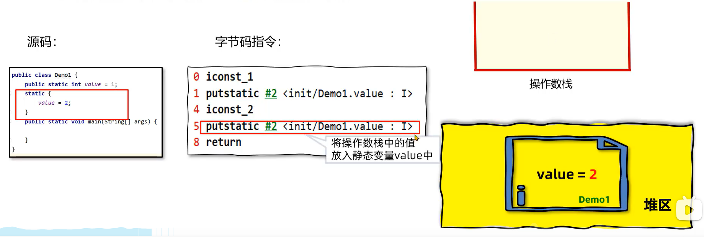

    * 它与类的构造函数（实例构造器 `<init>()`）不同，它不需要显式地调用父类构造器，JVM 会保证在子类的 `<clinit>()` 方法执行前，父类的 `<clinit>()` 方法已经执行完毕。
    
    *   如果类中没有静态变量赋值也没有静态语句块，那么编译器可以不为这个类生成 `<clinit>()` 方法。
    
* **JVM 保证 `<clinit>()` 方法在多线程环境下被正确地加锁同步**。如果多个线程同时去初始化一个类，那么只会有一个线程去执行这个类的 `<clinit>()` 方法，其他线程都需要阻塞等待，直到活动线程执行完毕 `<clinit>()` 方法。

* 以下几种方式会导致类的初始化：

    1. 访问一个类的静态变量或者静态方法，注意变量是final修饰的并且等号右边是常量不会触发初始化。
    2. 调用Class.forName(String className)。
    3. new一个该类的对象时。
    4. 执行Main方法的当前类。

    ```java
    public class Test1 {
        public static void main(String[] args) {
            System.out.println("A");
            new Test1();
            new Test1();
        }
    
        public Test1() {
            System.out.println("B");
        }
    
        {
            System.out.println("C");
        }
    
        static {
            System.out.println("D");
        }
    }
    
    // 执行结果：DACBCB

* `clinit`指令在特定情况下不会出现，比如：如下几种情况是不会进行初始化指令执行的。

    1. 无静态代码块且无静态变量赋值语句。
    2. 有静态变量的声明，但是没有赋值语句。
    3. 静态变量的定义使用final关键字，这类变量会在准备阶段直接进行初始化。

* 有继承关系的类：

    - 直接访问父类的静态变量，不会触发子类的初始化。
    - 子类的初始化clinit调用之前，会先调用父类的clinit初始化方法。

    ```java
    public class Demo02 {
        public static void main(String[] args) {
            new B02();
            System.out.println(B02.a);
        }
    }
    
    class A02{
        static int a = 0;
        static {
            a = 1;
        }
    }
    
    class B02 extends A02{
        static{
            a = 2;
        }
    }
    // 输出：2
    // 如果去掉new B02(); 输出：1
    ```

## 使用 Using

类在完成初始化之后，就可以被正常使用了，包括：
*   创建类的实例对象
*   调用类的静态方法
*   访问类或接口的静态字段

## 卸载 Unloading

当一个类被加载、连接和初始化之后，它的生命周期就开始了。当代表类的 `Class` 对象不再被引用，即不可触及时，`Class` 对象就会结束生命周期，类数据在方法区中的数据也会被卸载，从而结束类的生命周期。

**一个类何时结束生命周期，取决于代表它的 `Class` 对象何时结束生命周期**。

由 Java 虚拟机自带的三种类加载器（启动类加载器、扩展类加载器、系统类加载器）加载的类，在虚拟机的生命周期中，始终不会被卸载。由用户自定义类加载器加载的类是可以被卸载的。


## HotSpot Debugger

HSDB（HotSpot Debugger）是一个强大的Java虚拟机调试工具，可以深入查看JVM内部状态。

**启动方式**

```bash
# 方式1：使用java命令启动
java -cp $JAVA_HOME/lib/sa-jdi.jar sun.jvm.hotspot.HSDB

# 方式2：或者直接执行（某些JDK版本）
java -cp sa-jdi.jar sun.jvm.hotspot.HSDB

# 现代方式
jhsdb hsdb
```


# 类加载器

**类加载器** 是JVM用来动态加载Java类到内存中的子系统。它负责将 `.class` 文件的二进制数据读入内存，并生成对应的 `java.lang.Class` 对象。

## 分类

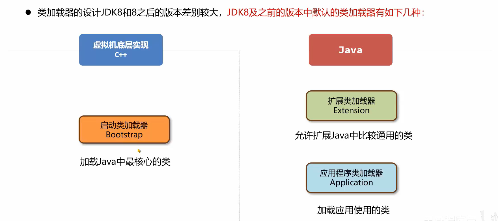

你可以直接使用`Arthus`的`classloader`指令查看所有类加载器。

### 虚拟机底层实现的类加载器

**特点：**

- 源代码位于Java虚拟机底层源码中
- 实现语言与虚拟机底层语言一致（如HotSpot使用C++）
- 由虚拟机自身提供，开发者无法直接操作

**主要职责：**

- 加载程序运行时的基础核心类
- 保证Java程序运行中基础类被正确加载
- 确保核心类（如`java.lang.String`）的可靠性和安全性

**典型代表：**

- **启动类加载器（Bootstrap ClassLoader）**

#### 启动类加载器

**启动类加载器** 是JVM类加载器层次结构的根节点，负责加载Java运行时的最核心类库。默认加载`jdk`安装目录`${JAVA_HOME}/jre/lib`下的类文件，如**rt.jar** (Runtime Library)，**resources.jar**，**charsets.jar**…

- **实现语言**
    - **由C/C++语言实现**，不是Java类
    - 嵌入在JVM内核中
    - 是JVM自身的一部分

- **在Java代码中的表现**

    ```java
    public class BootstrapLoaderDemo {
        public static void main(String[] args) {
            // 获取String类的类加载器
            ClassLoader stringLoader = String.class.getClassLoader();
            System.out.println("String类的加载器: " + stringLoader); // 输出: null
            
            // 获取Object类的类加载器  
            ClassLoader objectLoader = Object.class.getClassLoader();
            System.out.println("Object类的加载器: " + objectLoader); // 输出: null
        }
    }
    ```

    **为什么返回null？**

    - 启动类加载器不是Java类，没有对应的`ClassLoader`对象
    - 在Java层面用`null`表示启动类加载器
    - 这是一种特殊的设计约定

- **启动类路径扩展参数**

    ```bash
    java -Xbootclasspath/a:D:\my\custom\ext\dir # <jar包目录或jar包名>
    ```

    **参数含义**：

    - **`-Xbootclasspath/a:`** 中的 `a` 代表 **append**（追加）
    - 用于在**启动类加载器**的搜索路径后**追加**新的类路径
    - 不会覆盖原有的启动类路径

    

### Java代码实现的类加载器

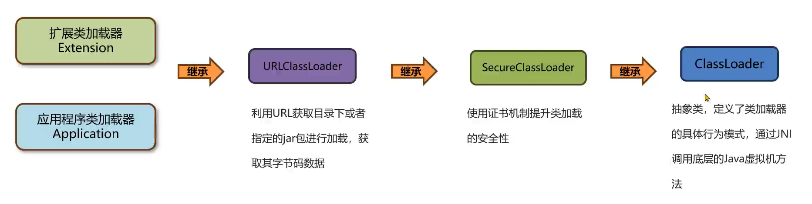

**特点：**

- 继承自抽象类 `java.lang.ClassLoader`
- 所有Java中实现的类加载器都需要继承这个抽象类
- 可以由JDK默认提供或程序员自定义

**JDK默认提供的类加载器：**

- **扩展类加载器（Extension ClassLoader）**
- **应用程序类加载器（Application ClassLoader）**
- 他们的源码都位于sun.misc.Launcher中，是一个静态内部类。

**自定义类加载器：**

- 开发者根据特定需求继承`ClassLoader`并重写`findClass()`方法

#### 扩展类加载器

**扩展类加载器** 是Java类加载器层次结构中的中间层，负责加载Java的扩展类库。扩展类加载器负责加载的目录`${JAVA_HOME}/jre/lib/ext/`。

- **实现方式**
    - **由Java语言实现**
    - 具体类是 `sun.misc.Launcher$ExtClassLoader`
    - 是 `java.lang.ClassLoader` 的子类

- **验证扩展路径**

    ```java
    public class ExtensionLoaderDemo {
        public static void main(String[] args) {
            // 查看扩展类加载器的加载路径
            String extDirs = System.getProperty("java.ext.dirs");
            System.out.println("扩展类路径:");
            String[] paths = extDirs.split(":");
            for (String path : paths) {
                System.out.println("  " + path);
            }
            
            // 获取扩展类加载器实例
            ClassLoader extLoader = ClassLoader.getSystemClassLoader().getParent();
            System.out.println("扩展类加载器: " + extLoader);
            System.out.println("扩展类加载器类名: " + extLoader.getClass().getName());
        }
    }
    ```

    输出：

    ```
    扩展类路径:
      /usr/lib/jvm/java-8-openjdk/jre/lib/ext
      /usr/java/packages/lib/ext
    
    扩展类加载器: sun.misc.Launcher$ExtClassLoader@hashcode
    扩展类加载器类名: sun.misc.Launcher$ExtClassLoader
    ```

- **自定义扩展路径**

    ```bash
    # 默认路径要保留，不然会被替换
    # windows用分号分隔，linux用冒号
    java -Djava.ext.dirs="D:\jdk-1.8\jre\lib\ext;D:\my\custom\ext\dir"

#### 应用程序类加载器

**应用程序类加载器** 也叫**系统类加载器**，是负责加载用户类路径（classpath）上类的加载器。

- **实现方式**
  
    - **由Java语言实现**
    - 具体类是 `sun.misc.Launcher$AppClassLoader`
    - 是 `java.lang.ClassLoader` 的子类
    
- **加载范围与类路径**

    应用程序类加载器负责加载以下位置的类：

    - **classpath** 指定的所有目录和JAR文件
    - **当前工作目录** 下的类文件
    - **通过 `-cp` 或 `-classpath` 参数指定的路径**


## 双亲委派机制

**双亲委派模型** 是 Java 类加载器在加载一个类时所采用的一种**工作模式**。它的核心思想可以概括为：

> **当一个类加载器收到了类加载的请求，它首先不会自己去尝试加载这个类，而是把这个请求委派给父类加载器去完成。每一层的类加载器都是如此，因此所有的加载请求最终都应该传送到最顶层的启动类加载器中。只有当父类加载器反馈自己无法完成这个加载请求（它的搜索范围中没有找到所需的类）时，子加载器才会尝试自己去加载。**

简单来说，就是 **“先让爸爸找，爸爸找不到，儿子再自己找”**。

### 工作流程

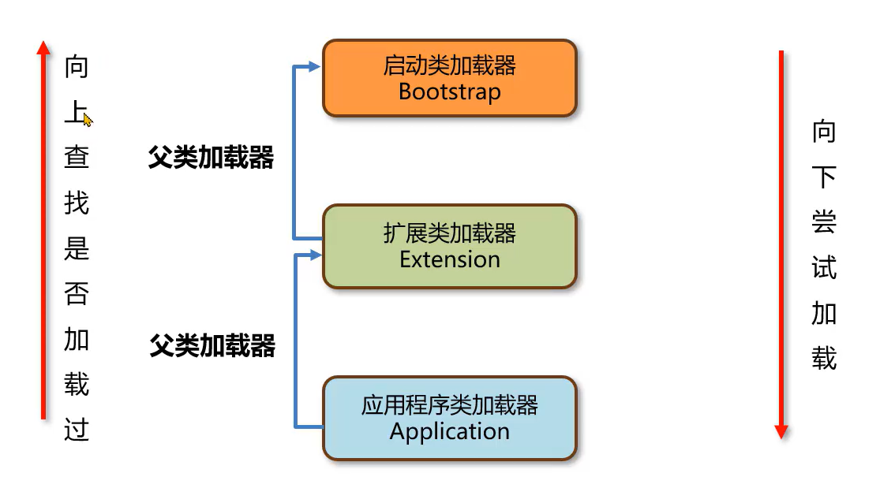

1. **收到请求**：应用程序类加载器收到一个加载类的请求（例如，`com.example.MyClass`）。
2. **向上委派**：应用程序类加载器不会立即自己加载，而是将请求委派给它的父加载器——扩展类加载器。
3. **继续向上委派**：扩展类加载器收到请求后，同样不会自己加载，而是继续向上委派给它的父加载器——启动类加载器。
4. **顶层尝试加载**：
    - **如果成功**：启动类加载器在其负责的目录（如 `JAVA_HOME/lib` 下的 `rt.jar` 等）中找到了这个类，则加载并返回该类。流程结束。
    - **如果失败**：启动类加载器无法在自己的路径中找到该类（例如，它显然不是核心类），则向下通知扩展类加载器。
5. **中层尝试加载**：
    - 扩展类加载器收到通知后，在自己负责的目录（如 `JAVA_HOME/lib/ext`）中尝试加载。
    - **如果成功**：加载并返回。流程结束。
    - **如果失败**：向下通知应用程序类加载器。
6. **底层尝试加载**：
    - 应用程序类加载器收到通知后，在自己负责的类路径（ClassPath）下尝试加载。
    - **如果成功**：加载并返回。流程结束。
    - **如果失败**：此时，它会抛出 `ClassNotFoundException` 异常，表示在所有的委派路径中都找不到这个类。

### 作用

这种机制主要有三个核心目的：

1. **确保类的唯一性和全局一致性**
    - 可以避免同一个类被不同的类加载器重复加载到内存中。如果一个类由不同的加载器加载，在 JVM 看来，它们就是两个完全不同的类，这会导致类型转换异常（`ClassCastException`）等问题。
    - 例如，`java.lang.Object` 类，无论哪个类加载器要加载它，最终都会委派给最顶层的启动类加载器去加载，从而保证了在 JVM 的任何一个角落，`Object` 类都是同一个。
2. **保证 Java 核心 API 的安全**
    - 防止用户自定义的类动态替换掉 Java 的核心类库（如 `java.lang.String`, `java.lang.Integer` 等）。
    - 例如，如果有人恶意编写了一个 `java.lang.String` 类并试图加载，根据双亲委派机制，这个请求会先交给启动类加载器。启动类加载器在核心 `rt.jar` 中找到了 `String` 类，就会直接使用它，而不会加载用户自定义的 `String` 类，从而保护了 Java 核心类库不被篡改。这构成了 Java 沙箱安全机制的第一道屏障。
3. **避免重复加载**
    - 当父加载器已经加载了某个类时，子加载器就没有必要也没有机会再次加载它，这节省了内存和计算资源。

### 并非继承关系

存放了一个`parent`变量

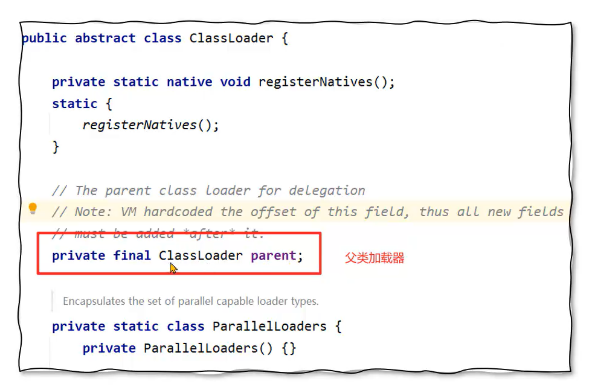

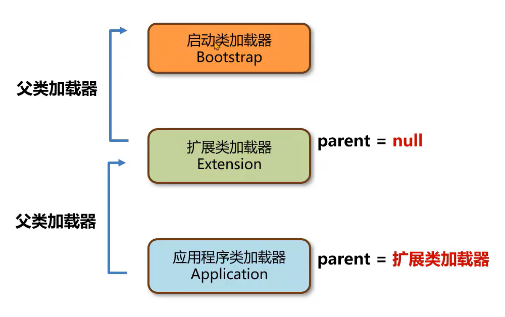

### 打破

在某些场景下，双亲委派机制反而会成为限制：

**典型应用场景**：

- **SPI 服务发现**：JDBC、JNDI 等需要父加载器访问子加载器加载的类
- **模块热部署**：OSGi、Tomcat 等需要实现类隔离和动态加载
- **应用隔离**：同一个类在不同模块中需要有不同的版本
- **代码热替换**：在不重启 JVM 的情况下更新类

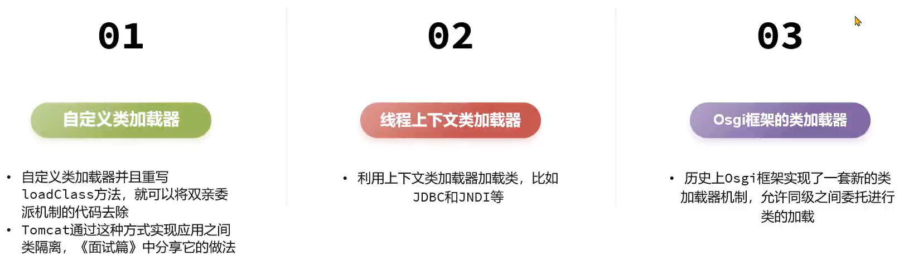

#### ClassLoader 原理

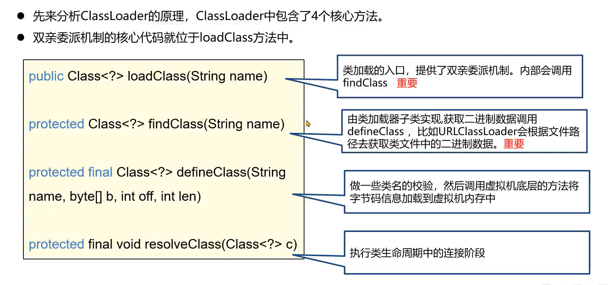

```java
// ClassLoader.java

// loadClass 内部调用了 findClass
public Class<?> loadClass(String name) throws ClassNotFoundException {
    return loadClass(name, false);
}

protected Class<?> loadClass(String name, boolean resolve)
    throws ClassNotFoundException
{
    synchronized (getClassLoadingLock(name)) {
        // First, check if the class has already been loaded
        Class<?> c = findLoadedClass(name);
        if (c == null) {
            long t0 = System.nanoTime();
            try {
                if (parent != null) {
                    c = parent.loadClass(name, false);
                } else {
                    c = findBootstrapClassOrNull(name);
                }
            } catch (ClassNotFoundException e) {
                // ClassNotFoundException thrown if class not found
                // from the non-null parent class loader
            }
            if (c == null) {
                // If still not found, then invoke findClass in order
                // to find the class.
                long t1 = System.nanoTime();
                c = findClass(name);
                // this is the defining class loader; record the stats
                sun.misc.PerfCounter.getParentDelegationTime().addTime(t1 - t0);
                sun.misc.PerfCounter.getFindClassTime().addElapsedTimeFrom(t1);
                sun.misc.PerfCounter.getFindClasses().increment();
            }
        }
        if (resolve) {
            resolveClass(c);
        }
        return c;
    }
}

// findClass 空方法，等待实现
protected Class<?> findClass(String name) throws ClassNotFoundException {
    throw new ClassNotFoundException(name);
}


// resolveClass调本地方法
protected final void resolveClass(Class<?> c) {
    resolveClass0(c);
}
```

重写`loadClass()`与`findClass()`方法

```java
public class CustomClassLoader extends ClassLoader {
    
    @Override
    public Class<?> loadClass(String name) throws ClassNotFoundException {
        // 1. 对于某些特定的包，由本加载器直接加载
        if (name.startsWith("com.myapp.hotdeploy")) {
            return findClass(name);
        }
        
        // 2. 对于其他类，仍然遵循双亲委派
        return super.loadClass(name);
    }
    
    @Override
    protected Class<?> findClass(String name) throws ClassNotFoundException {
        // 自定义的类加载逻辑
        byte[] classData = loadClassData(name);
        if (classData == null) {
            throw new ClassNotFoundException();
        }
        return defineClass(name, classData, 0, classData.length);
    }
    
    private byte[] loadClassData(String className) {
        // 从自定义路径加载类字节码
        // 例如：文件系统、网络、数据库等
        return null; // 实现省略
    }
}
```


#### 自定义类加载器 - Tomcat

**Tomcat 的类加载器体系**

- 一个Tomcat程序中是可以运行多个Web应用的，如果这两个应用中出现了相同限定名的类，比如Servlet类，Tomcat要保证这两个类都能加载并且它们应该是不同的类。
- 如果不打破双亲委派机制，当应用类加载器加载Web应用1中的MyServlet之后，Web应用2中相同限定名的MyServlet类就无法被加载了。


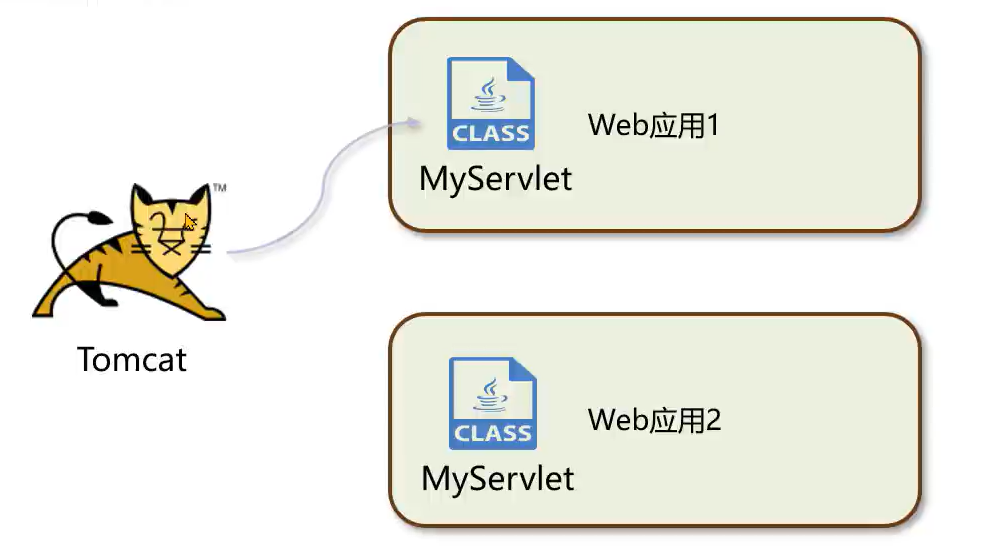

**加载策略**

```java
public class WebappClassLoader extends URLClassLoader {
    
    @Override
    public Class<?> loadClass(String name, boolean resolve) 
        throws ClassNotFoundException {
        
        synchronized (getClassLoadingLock(name)) {
            Class<?> clazz = findLoadedClass(name);
            
            if (clazz != null) {
                return clazz;
            }
            
            // 1. 首先检查本地 JVM 的类加载器缓存
            clazz = findLoadedClass0(name);
            if (clazz != null) {
                return clazz;
            }
            
            // 2. 对于 JRE 核心类，使用系统类加载器
            if (name.startsWith("java.")) {
                try {
                    clazz = getSystemClassLoader().loadClass(name);
                    if (clazz != null) {
                        return clazz;
                    }
                } catch (ClassNotFoundException e) {
                    // 继续
                }
            }
            
            // 3. 尝试本地 Webapp 类加载器
            try {
                clazz = findClass(name);
                if (clazz != null) {
                    return clazz;
                }
            } catch (ClassNotFoundException e) {
                // 继续
            }
            
            // 4. 最后委派给父加载器（遵循双亲委派）
            try {
                clazz = super.loadClass(name, resolve);
                if (clazz != null) {
                    return clazz;
                }
            } catch (ClassNotFoundException e) {
                // 继续
            }
        }
        
        throw new ClassNotFoundException(name);
    }
}
```


#### 线程上下文类加载器 - JDBC

- JDBC中使用了DriverManager来管理项目中引入的不同数据库的驱动，比如mysql驱动、oracle驱动。

    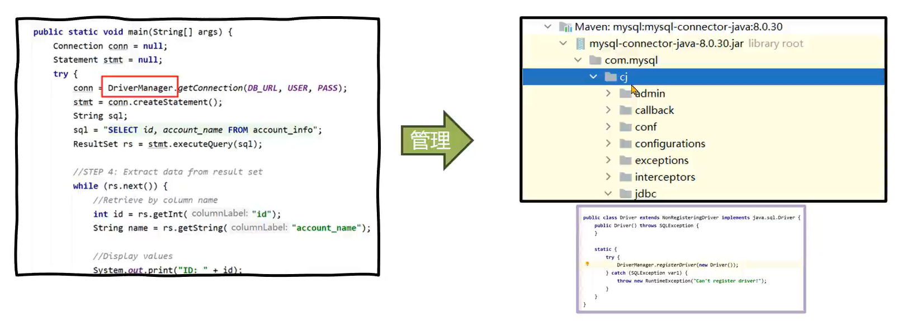

- DriverManager属于rt.jar是启动类加载器加载的。而用户jar包中的驱动需要由应用类加载器加载，这就违反了双亲委派机制。

    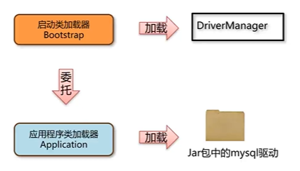

**加载过程**

 ```java
 // 在 java.sql.DriverManager 中
 public class DriverManager {
     static {
         loadInitialDrivers();
         println("JDBC DriverManager initialized");
     }
     
     private static void loadInitialDrivers() {
         // 使用上下文类加载器加载具体的数据库驱动
         AccessController.doPrivileged(new PrivilegedAction<Void>() {
             public Void run() {
                 // 遍历所有通过 SPI 机制注册的驱动
                 ServiceLoader<Driver> loadedDrivers = 
                     ServiceLoader.load(Driver.class);
                 Iterator<Driver> driversIterator = loadedDrivers.iterator();
                 try {
                     while(driversIterator.hasNext()) {
                         driversIterator.next();
                     }
                 } catch(Throwable t) {
                     // Do nothing
                 }
                 return null;
             }
         });
     }
 }
 ```

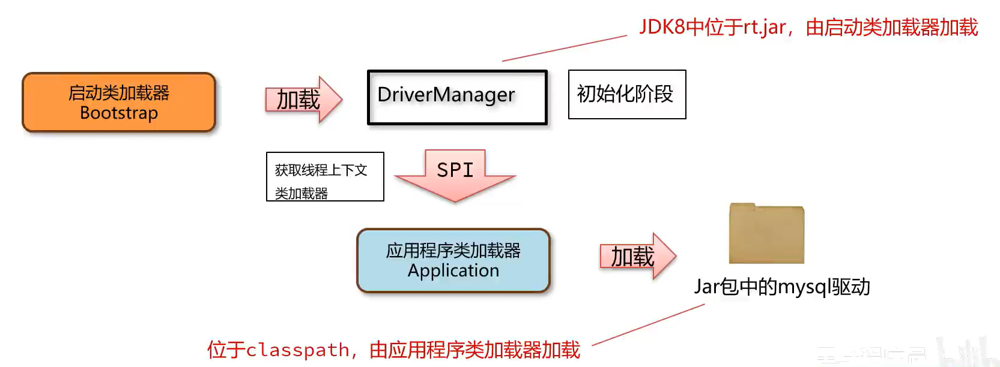

实际上，没有打破双亲委派机制。JDBC只是在`DriverManager`加载完之后，通过初始化阶段触发了驱动类的加载，类的加载依然遵循双亲委派机制。


#### OSGi 的类加载器架构

OSGi 实现了一套复杂的类加载网络，完全打破了传统的双亲委派模型。

**OSGi 的类查找顺序**：

1. **父委托**：委派给父加载器（有限制，不是所有类都委托）
2. **导入包**：查找导入的包
3. **本地查找**：在当前 Bundle 中查找
4. **动态导入**：动态解析导入的包
5. **Fragment**：查找 Fragment Bundle
6. **Require-Bundle**：查找依赖的 Bundle

```java
// 简化的 OSGi 类加载逻辑
public class OSGiClassLoader extends ClassLoader {
    private List<ClassLoader> delegates = new ArrayList<>();
    
    @Override
    protected Class<?> loadClass(String name, boolean resolve) 
        throws ClassNotFoundException {
        
        // 1. 检查是否已加载
        Class<?> clazz = findLoadedClass(name);
        if (clazz != null) {
            return clazz;
        }
        
        // 2. 根据 OSGi 规则决定加载顺序
        // 不是简单的父委派，而是复杂的图遍历
        
        // 3. 尝试从导入的包中加载
        for (ClassLoader delegate : delegates) {
            try {
                clazz = delegate.loadClass(name);
                if (clazz != null) {
                    return clazz;
                }
            } catch (ClassNotFoundException e) {
                // 继续尝试下一个
            }
        }
        
        // 4. 最后尝试本地加载
        clazz = findClass(name);
        if (clazz != null) {
            return clazz;
        }
        
        throw new ClassNotFoundException(name);
    }
}
```


## JDK9 及之后

由于JDK9引入了`module`的概念，类加载器在设计上发生了很多变化。

1. **启动类加载器**使用Java编写，位于`jdk.internal.loader.ClassLoaders`类中。 Java中的`BootClassLoader`继承自`BuiltinClassLoader`实现从模块中找到要加载的字节码资源文件。 

    **启动类加载器依然无法通过java代码获取到，返回的仍然是null，保持了统一。**

2. **扩展类加载器**被替换成了平台类加载器（Platform Class Loader）。 平台类加载器遵循模块化方式加载字节码文件，所以继承关系从`URLClassLoader`变成了`BuiltinClassLoader`，BuiltinClassLoader实现了从模块中加载字节码文件。**平台类加载器的存在更多的是为了与老版本的设计方案兼容，自身没有特殊的逻辑。**

3. 应用类加载器只是发生了继承关系的变化，继承关系从`URLClassLoader`变成了`BuiltinClassLoader`。其他的与之前版本区别并不是很大。

### Bootstrap ClassLoader

- **职责**：加载 Java 平台的核心模块（`java.base`, `java.sql` 等）
- **特点**：仍然由 C++ 实现，在 Java 中表示为 `null`
- **加载范围**：`jrt:/` 文件系统中的 Java 平台模块

### Platform ClassLoader（替代 Extension ClassLoader）

- **职责**：加载 Java 平台的其他模块和非关键JDK模块
- **父加载器**：Bootstrap ClassLoader
- **加载的典型模块**：`java.xml`, `java.corba`, `java.activation` 等

### Application ClassLoader（也称 SystemClassLoader）

- **职责**：加载应用程序模块路径和类路径上的类
- **父加载器**：Platform ClassLoader
- **重大变化**：现在可以**同时加载模块和传统的 JAR 包**


# 运行时数据区

**运行时数据区**是 JVM 在执行 Java 程序过程中会使用到的内存区域，主要分为以下几个部分，

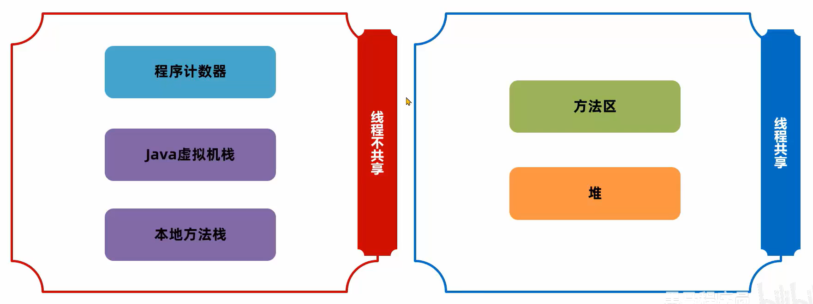

**JDK 1.7**：


**JDK 1.8**：


## 程序计数器

**程序计数器**（Program Counter Register）也叫PC寄存器，每个线程会通过程序计数器记录当前要执行的字节码指令的地址。

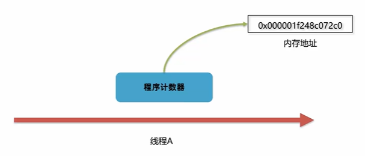

**核心特点**：

- **线程私有**：每个线程都有自己独立的程序计数器
- **占用内存极小**：在 JVM 规范中，没有规定 `OutOfMemoryError` 情况。因为每个线程只存储一个固定长度的内存地址，程序计数器是不会发生内存溢出的。
- **执行控制**：**字节码解释器**通过改变程序计数器的值来选取下一条需要执行的字节码指令

例如，

```java
public static void main(String[] args) {
    int i = 0;
    if(i == 0){
        i--;
    }
    i++;
}
```

字节码指令，如下

```
0 iconst_0
1 istore_1
2 iload_1
3 ifne 9 (+6)
6 iinc 1 by -1
9 iinc 1 by 1
12 return
```

- 在加载阶段，虚拟机将字节码文件中的指令读取到内存之后，会**将原文件中的偏移量转换成内存地址**。每一条字节码指令都会拥有一个内存地址。

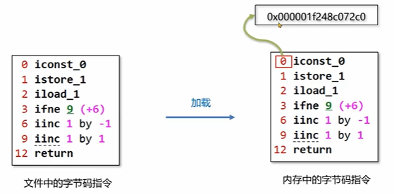

- 在代码执行过程中，程序计数器会记录下一行字节码指令的地址。执行完当前指令之后，虚拟机的**执行引擎**根据程序计数器执行下一行指令。

- 在多线程执行情况下，Java虚拟机需要通过程序计数器记录CPU切换前解释执行到哪一句指令并继续解释运行。

    

    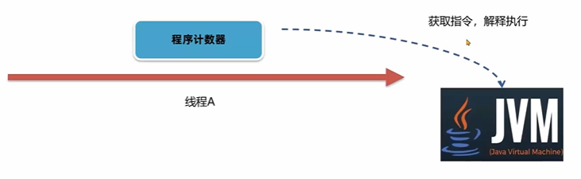

## Java 虚拟机栈

**Java 虚拟机栈**是线程私有的内存区域，每个方法在执行的同时都会创建一个**栈帧**用于存储局部变量表、操作数栈、动态链接、方法出口等信息。

**核心特点**：

- **线程私有**：每个线程都有自己的 Java 栈
- **后进先出**：栈数据结构，方法调用对应入栈，方法返回对应出栈
- **栈帧结构**：**每个方法对应一个栈帧**
- **可能异常**：
    - `StackOverflowError`：栈深度超过限制
    - `OutOfMemoryError`：栈无法动态扩展

Java 虚拟机栈由以下三个部分组成，


### 局部变量表

**局部变量表**的作用是在方法执行过程中存放所有的局部变量。编译成字节码文件时就可以确定局部变量表的内容。

例如，

```java
public class Demo1 {
    public static void test1(){
        int i = 0;
        long j = 1;
    }
}
```

字节码文件中的局部变量表，

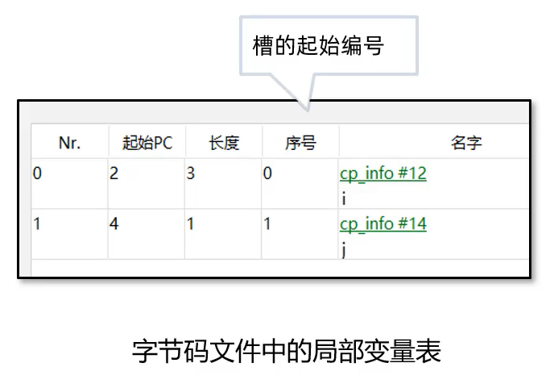

1. **起始PC（Start PC）**：局部变量的起始偏移量，表示局部变量从哪一条字节码指令开始有效。
2. **长度（Length）**：局部变量的作用域长度，即该变量在字节码中的有效范围。
3. **序号（Index）**：局部变量所在槽的起始编号。
4. **名字（Name）**：局部变量的名称。

但实际中，局部变量是存在变量槽（slot）里面的。

变量槽实际就是一个数组。

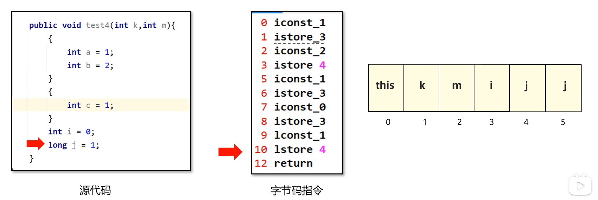

- 为了节省空间，局部变量表中的槽是可以复用的，一旦某个局部变量不再生效，当前槽就可以再次被使用。所以只需要六个槽位。

### 操作数栈

**操作数栈**是栈帧中虚拟机在执行指令过程中用来存放中间数据的一块区域。他是一种栈式的数据结构，如果一条指令将一个值压入操作数栈，则后面的指令可以弹出并使用该值。

- 在编译期就可以确定操作数栈的**最大深度**，从而在执行时正确的分配内存大小。

    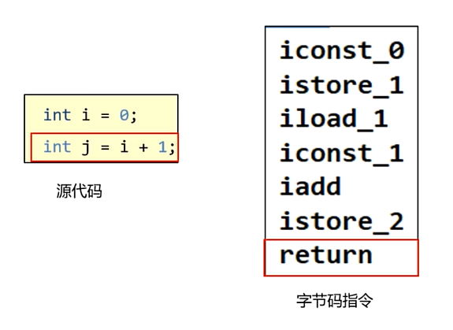

    编译器会模拟整个过程，从而获取操作数栈的**最大深度**。

### 帧数据

**帧数据**是栈帧的完整表示，包含了方法执行所需的所有信息。

#### 动态链接

**当前类的字节码指令引用了其他类的属性或者方法时**，在解析阶段`jvm`是不会对这类符号引用进行解析的，也就是将符号引用（编号）转换成对应的运行时常量池中的内存地址。**动态链接**就保存了这类符号引用到**运行时常量池**（属于方法区）的内存地址的映射关系。

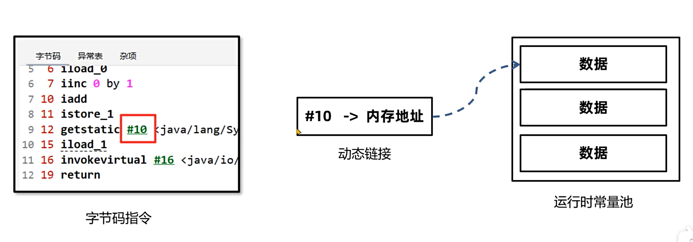

也就是说，**方法内的符号引用**解析在动态链接，而**方法自身的符号引用**解析在类链接阶段的解析。

```java
class User {
    public void hello() {
        Greeting.hi();
    }
}

class Greeting {
    public void hi() {
        System.out.print("hi"); 
    }
}

public class StaticVsInstance {
    public void methodWithDifferentCalls() {
        // 情况1: 静态方法调用 - 特殊处理
        Greeting.hi();		// 静态方法
        
        // 情况2: 实例方法调用 - 典型的动态链接
        User user = new User();
        user.hello();       // 实例方法 - 动态链接
        
        // 情况3: 接口方法调用 - 动态链接
        List<String> list = new ArrayList<>();
        list.add("item");   // 接口方法 - 动态链接
    }
}
```


#### 方法出口

**方法出口**指的是方法在正确或者异常结束时，当前栈帧会被弹出，同时程序计数器应该指向上一个栈帧中的下一条指令的地址。所以在当前栈帧中，需要存储此方法出口的地址。

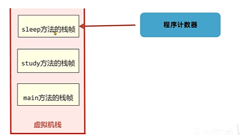

#### 异常表

**异常表**存放的是代码中异常的处理信息，包含了异常捕获的生效范围以及异常发生后跳转到的字节码指令位置。

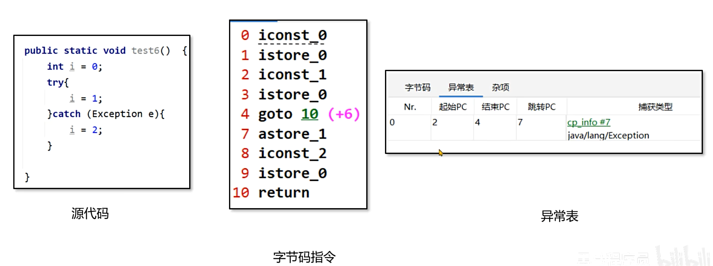


### 内存溢出

Java虚拟机栈如果**栈帧过多**，占用内存超过栈内存可以分配的最大大小就会出现**内存溢出**。

Java虚拟机栈内存溢出时会出现`StackOverflowError`的错误。

**模拟栈内存溢出**

```java
public class Demo {
    public static int count = 0;

    public static void main(String[] args) throws InterruptedException, IOException, ClassNotFoundException {
        recursion();
    }

    public static void recursion() {
        System.out.println(++count);
        recursion();
    }
}
```

#### 默认大小

如果我们不指定栈的大小，JVM 将创建一个具有**默认大小的栈**。大小取决于操作系统和计算机的体系结构。

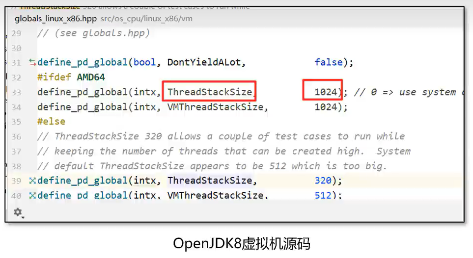


#### 设置栈大小

要修改Java虚拟机栈的大小，可以使用虚拟机参数 `java -Xss`。

- 单位：字节（默认，必须是1024的倍数）、k（KB）、m（MB）、g（GB）

**示例**：

- `-Xss1048576`：设置栈大小为1MB。
- `-Xss1024k`：设置栈大小为1024KB。
- `-Xss1m`：设置栈大小为1MB。
- `-Xss1g`：设置栈大小为1GB。

一般情况下，工作中即便使用了递归进行操作，栈的深度最多也只能到几百，不会出现栈的溢出。所以此参数可以手动指定为`-Xss256k`节省内存。


### 本地方法栈

- Java虚拟机栈存储了Java方法调用时的栈帧，而本地方法栈存储的是`native`本地方法的栈帧。
- 在Hotspot虚拟机中，Java虚拟机栈和本地方法栈实现上使用了**同一个栈空间**。本地方法栈会在栈内存上生成一个栈帧，临时保存方法的参数同时方便出现异常时也把本地方法的栈信息打印出来。

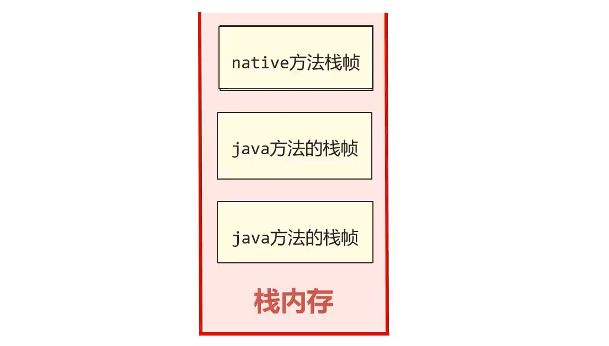


## 堆

**堆**是 JVM 管理的最大一块内存区域，是所有**线程共享**的运行时数据区，用于**存储对象实例和数组**。


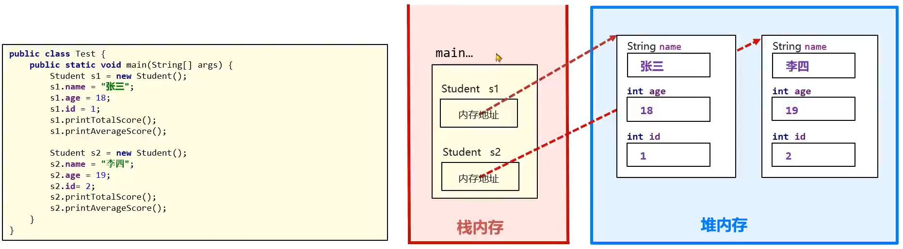

- 栈上的局部变量表中，可以**存放堆上对象的引用**。静态变量也可以存放堆对象的引用，通过静态变量就可以实现**对象在线程之间共享**。

```java
public class SharedObject {
    // 静态变量，引用一个堆中的对象
    private static SomeClass sharedInstance = new SomeClass();

    public static void main(String[] args) {
        // 线程1
        Thread thread1 = new Thread(() -> {
            System.out.println("Thread 1: " + sharedInstance.getInstanceValue());
            sharedInstance.setInstanceValue("Value set by Thread 1");
        });

        // 线程2
        Thread thread2 = new Thread(() -> {
            System.out.println("Thread 2: " + sharedInstance.getInstanceValue());
            sharedInstance.setInstanceValue("Value set by Thread 2");
        });

        thread1.start();
        thread2.start();
    }
}

class SomeClass {
    private String instanceValue;

    public String getInstanceValue() {
        return instanceValue;
    }

    public void setInstanceValue(String instanceValue) {
        this.instanceValue = instanceValue;
    }
}
```

### 堆内存监控

堆空间有三个需要关注的值，`used` `total` `max`。在 Java 堆内存监控中，这三个值代表了堆的不同状态：

- `used`指的是当前已使用的堆内存。
- `total`是java虚拟机已经分配的可用堆内存。
- `max`是java虚拟机可以分配的最大堆内存。


你可以使用Arthas 诊断工具，`dashboard -i 1000` 每1000毫秒刷新一次，去查看堆内存的三个值。

#### 默认大小

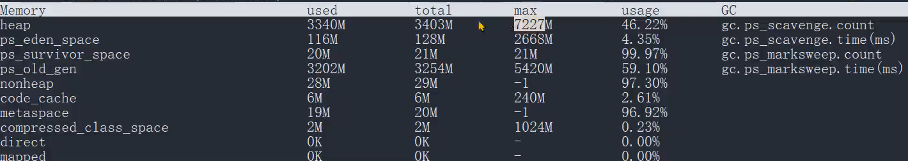

- 随着堆中的对象增多，当total可以使用的内存即将不足时，java虚拟机会继续分配内存给堆。
- `max`默认值为系统内存的1/4，`total`默认值为系统内存的1/64。

#### 设置堆大小

要修改堆的大小，可以使用虚拟机参数 `-Xmx`（`max`最大值）和 `-Xms`（初始的`total`）。

限制：`Xmx`必须大于 2 MB，`Xms`必须大于1MB

```bash
# 使用字节单位（必须是1024的倍数）
java -Xms6291456 -Xmx8388608 MyApp      # 6MB - 8MB
java -Xms10485760 -Xmx20971520 MyApp    # 10MB - 20MB
```

> Java服务端程序开发时，**建议将`-Xmx`和`-Xms`设置为相同的值**，这样在程序启动之后可使用的总内存就是最大内存，而无需向java虚拟机再次申请，**减少了申请并分配内存时间上的开销**，同时也不会出现内存过剩之后堆收缩的情况。


## 方法区

**方法区**是各个线程共享的内存区域，用于存储**已被虚拟机加载的类型信息、常量、静态变量、即时编译器编译后的代码缓存等数据**。


### 元信息

方法区是用来存储每个类的**基本信息（元信息）**，一般称之为**InstanceKlass对象**。在类的**加载阶段**完成。

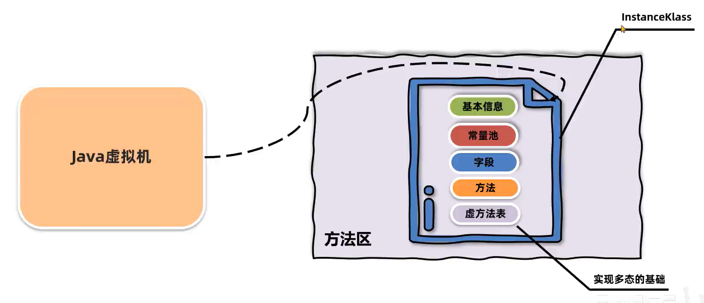


### 运行时常量池

**运行时常量池**中存放的是字节码中的常量池内容。

- 字节码文件中通过编号查表的方式找到常量，这种常量池称为静态常量池。**当常量池加载到内存中之后**，可以通过内存地址快速的定位到常量池中的内容，这种常量池称为运行时常量池。

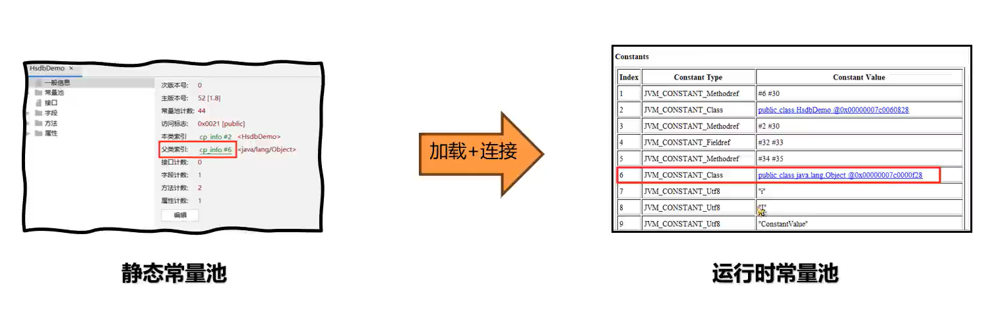

### 字符串常量池

**字符串常量池** 是 JVM 为了提升性能和减少内存消耗针对字符串（String 类）专门开辟的一块区域，主要目的是为了避免字符串的重复创建。

```java
// 在字符串常量池中创建字符串对象 ”ab“
// 将字符串对象 ”ab“ 的引用赋值给给 aa
String aa = "ab";
// 直接返回字符串常量池中字符串对象 ”ab“，赋值给引用 bb
String bb = "ab";
System.out.println(aa==bb); // true
```

JDK1.7 之前，字符串常量池存放在永久代。JDK1.7 字符串常量池和静态变量从永久代移动到了 Java 堆中。

**JDK1.6**：


**JDK1.7**：


如下示例比较1.6与1.7，

```java
public static void main(String[] args) {
    String s1 = new StringBuilder().append("think").append("123").toString();
    System.out.println(s1.intern() == s1);

    String s2 = new StringBuilder().append("ja").append("va").toString();
    System.out.println(s2.intern() == s2);
}
```

对于JDK1.6，

`s1` 是在堆上创建对象，而 `s1.intern()` 在把字符串又创建在字符串常量池中，所以为`false`。而针对字符串`java`，常量池中原本就有，`s2.intern()` 只需返回字符串常量池中的之就行。`s2`同样也是在堆上创建对象，所以也为`false`。

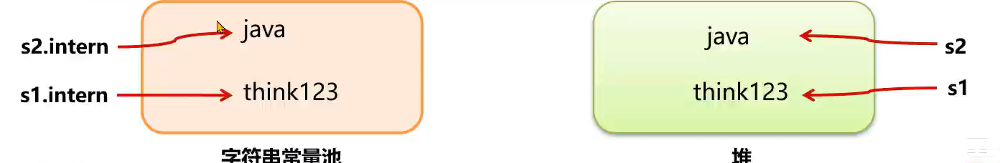

对于JDK1.7，

`intern()`不再把字符串搬到字符串常量池中，而是把第一次遇到的字符串的引用放入字符串常量池中。所以第一个为`true`，二为`false`。


#### \+ 连接字符串

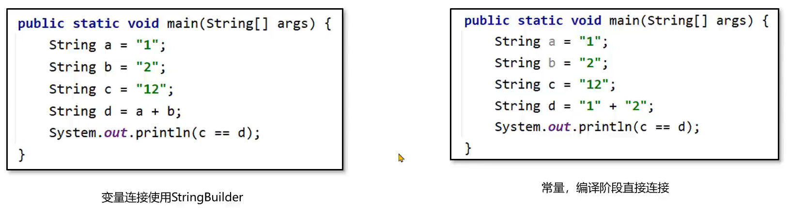

第一个为`false`，第二个为`true`。


### 方法区实现

方法区是《Java虚拟机规范》中设计的虚拟概念，每款Java虚拟机在实现上都各不相同。Hotspot设计如下：

- **JDK7及之前的版本**将方法区存放在**堆区域中的永久代空间**，堆的大小由虚拟机参数来控制。
- **JDK8及之后的版本**将方法区存放在**元空间**中，元空间位于操作系统维护的直接内存中，默认情况下只要不超过操作系统承受的上限，可以一直分配。


### 方法区溢出

- JDK7将方法区存放在**堆区域中的永久代空间**，堆的大小由虚拟机参数`-XX:MaxPermSize=`来控制。
- JDK8将方法区存放在**元空间**中，元空间位于操作系统维护的直接内存中，默认情况下只要不超过操作系统承受的上限，可以一直分配。可以使用`-XX:MaxMetaspaceSize=`将元空间最大大小进行限制。


## 直接内存

**直接内存**是一种特殊的内存缓冲区，并不在 Java 堆或方法区中分配的，而是通过 JNI 的方式在本地内存上分配的。

直接内存并不是虚拟机运行时数据区的一部分，也不是《Java虚拟机规范》中定义的内存区域，但是这部分内存也被频繁地使用。而且也可能导致 `OutOfMemoryError` 错误出现。

- 在JDK 1.4中引入了**NIO机制**，使用了直接内存，主要为了解决以下两个问题：

    > NIO（Non-Blocking I/O，也被称为 New I/O），引入了一种基于**通道**（**Channel**）与**缓存区**（**Buffer**）的 I/O 方式，它可以直接使用 **Native** 函数库直接分配堆外内存，然后通过一个存储在 Java 堆中的 `DirectByteBuffer` 对象作为这块内存的引用进行操作。这样就能在一些场景中显著提高性能，因为避免了在 Java 堆和 Native 堆之间来回复制数据。

    1. Java堆中的对象如果不再使用要回收，回收时会影响对象的创建和使用。
    2. IO操作比如读文件，需要先把文件读入直接内存（缓冲区）再把数据复制到Java堆中。 现在直接放入直接内存即可，同时Java堆上维护直接内存的引用，减少了数据复制的开销。写文件也是类似的思路。

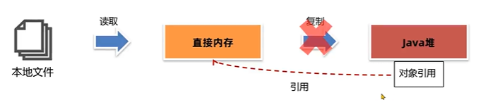

### 操作直接内存

```java
public class Demo1 {
    public static int size = 1024 * 1024 * 100; // 100mb
    public static List<ByteBuffer> list = new ArrayList<>();
    public static int count = 0;

    public static void main(String[] args) throws IOException, InterruptedException {
        System.in.read(); // 回车后每5秒增加100M
        while (true) {
            ByteBuffer directBuffer = ByteBuffer.allocateDirect(size);
            list.add(directBuffer);
            System.out.println(++count);
            Thread.sleep(5000);
        }
    }
}
```

### 设置大小

如果需要手动调整直接内存的大小，可以使用`-XX:MaxDirectMemorySize=`。单位k或K表示千字节，m或M表示兆字节，g或G表示千兆字节。默认不设置该参数情况下，JVM 自动选择最大分配的大小。

以下示例以不同的单位说明如何将 直接内存大小设置为 1024 KB：

- `-XX:MaxDirectMemorySize=1m`
- `-XX:MaxDirectMemorySize=1024k`
- `-XX:MaxDirectMemorySize=1048576`


# 自动垃圾回收

> **C/Cpp 内存管理**
>
> - **在C/Cpp这类没有自动垃圾回收机制的语言中**，一个对象如果不再使用，需要手动释放，否则就会出现内存泄漏。我们称这种释放对象的过程为垃圾回收，而需要程序员编写代码进行回收的方式为手动回收。
> - **内存泄漏**指的是**不再使用的对象在系统中未被回收**，内存泄漏的积累可能会导致**内存溢出**。

Java中为了简化对象的释放，引入了**自动的垃圾回收（Garbage Collection简称GC）机制**。通过垃圾回收器来对不再使用的对象完成自动的回收，垃圾回收器**主要负责对堆上的内存进行回收**。

其他很多现代语言比如C#、Python、Go都拥有自己的垃圾回收器。


## 方法区回收

方法区中能回收的内容主要就是不再使用的类。 

判定一个类可以被卸载。需要同时满足下面三个条件： 

1. 加载该类的类加载器已经被回收。 

    ```java
    URLClassLoader loader = new URLClassLoader(
        new URL[]{new URL("spec=file:B:\\lib\\")});
    loader = null;

2. 该类对应的 `java.lang.Class` 对象没有在任何地方被引用。

    ```java
    Class<?> clazz = loader.loadClass("com.itheima.my.A");
    clazz = null;
    ```

3. 此类所有实例对象都已经被回收，在堆中不存在任何该类的实例对象以及子类对象。 

    ```java
    Object o = clazz.newInstance();
    o = null;


## 堆回收

Java中的对象是否能被回收，是根据对象是否被引用来决定的。如果对象被引用了，说明该对象还在使用，不允许被回收。

如下图例子（循环引用），

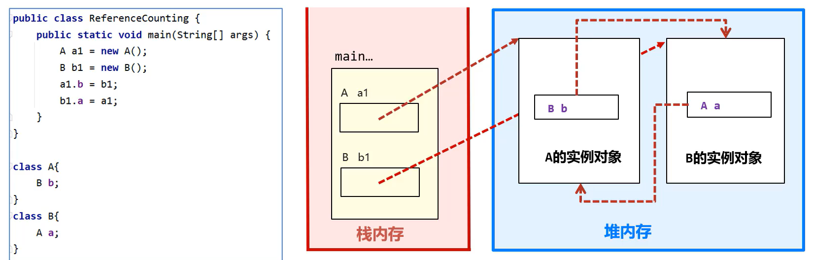

如果在main方法中最后执行 a1 = null，b1 = null，是否能回收A和B对象呢？

可以回收，方法中已经没有办法使用引用去访问A和B对象了。

## 可达性分析算法

> ### 引用计数法
>
> **引用计数法**会为每个对象维护一个引用计数器，当对象被引用时加1，取消引用时减1。
>
> 引用计数法的优点是实现简单，**C++中的智能指针**就采用了引用计数法，但是它也存在缺点，主要有两点：
>
> 1. 每次引用和取消引用都需要维护计数器，**对系统性能会有一定的影响**。
> 2. 存在**循环引用**问题，所谓循环引用就是当A引用B，B同时引用A时会出现对象无法回收的问题。


Java使用的是可达性分析算法来判断对象是否可以被回收。可达性分析将对象分为两类：**垃圾回收的根对象（GC Root）**和**普通对象**，对象与对象之间存在引用关系。

下图中A到B再到C和D，形成了一个**引用链**，**可达性分析算法**指的是如果从某个到**GC Root对象**是可达的，对象就不可被回收。

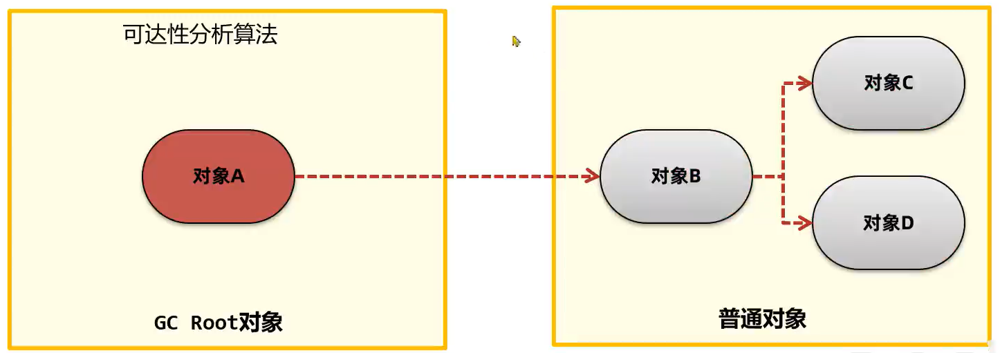

### GC Root对象

哪些对象被称之为GC Root对象呢？

- 线程Thread对象

    > 引用线程栈帧中的方法参数、局部变量等。

    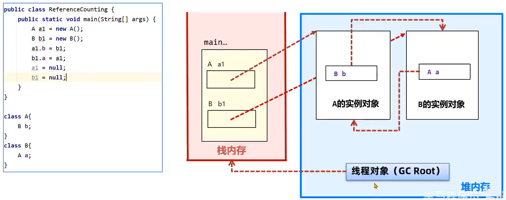

- 系统类加载器加载的`java.lang.Class`对象。

    > 引用类中的静态变量。

    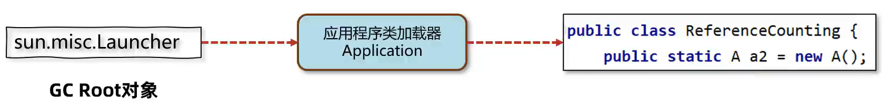

- 监视器对象，用来保存同步锁`synchronized`关键字持有的对象。

    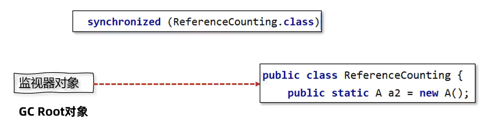

- 本地方法调用时使用的全局对象。


## 五种对象引用

对象引用分为五种类型，这些引用类型主要定义在`java.lang.ref`包中。它们的主要区别在于**垃圾收集器（GC）对待这些引用的方式不同**。

在Java虚拟机（JVM）中，对象引用分为五种类型，这些引用类型主要定义在`java.lang.ref`包中。它们的主要区别在于**垃圾收集器（GC）对待这些引用的方式不同**，从而提供了不同级别的内存管理灵活性。

以下是五种对象引用的详细说明：

### 强引用（Strong Reference）

**定义**：最常见的引用类型，通过`new`关键字创建的对象都是强引用。

**特点**：
- 只要强引用存在，垃圾收集器就永远不会回收该对象
- 即使内存不足，JVM也会抛出`OutOfMemoryError`而不是回收强引用对象

```java
// 强引用示例
Object obj = new Object();  // obj就是强引用
String str = "Hello World"; // str也是强引用
```

### 软引用（Soft Reference）

**定义**：通过`SoftReference`类实现的引用。

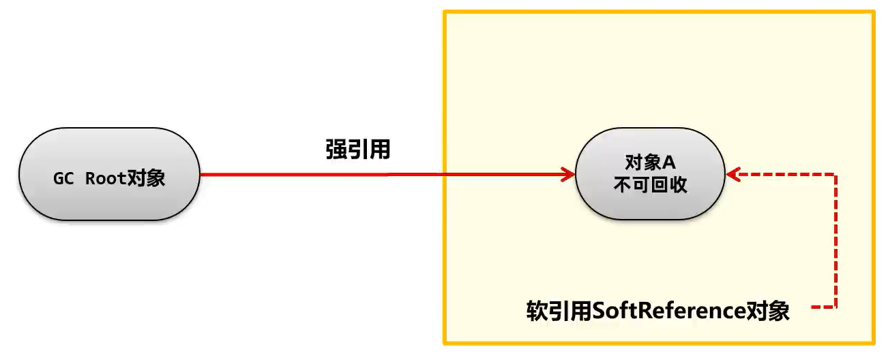

**特点**：

- 只有在**堆内存不足**时，垃圾收集器才会回收软引用对象
- 适合**用于实现内存敏感的缓存**

```java
import java.lang.ref.SoftReference;

// 软引用示例
Object object = new Object();
SoftReference<Object> softRef = new SoftReference<>(object);

// 获取引用的对象
Object obj = softRef.get(); // 如果对象未被回收，返回对象；否则返回null

// 清除强引用，只保留软引用
object = null; // 当内存不足时，对象才被回收
```

看如下示例，JVM 参数-Xmx200m，即堆最大内存为200m

```java
byte[] bytes = new byte[1024 * 1024 * 100];
SoftReference<byte[]> softReference = new SoftReference<byte[]>(bytes);
bytes = null;
System.out.println(softReference.get());

byte[] bytes2 = new byte[1024 * 1024 * 100];
System.out.println(softReference.get());

// 输出：[B@7dc5e7b4    null
```

### 弱引用（Weak Reference）

**定义**：通过`WeakReference`类实现的引用。实际机制与软引用基本一致。

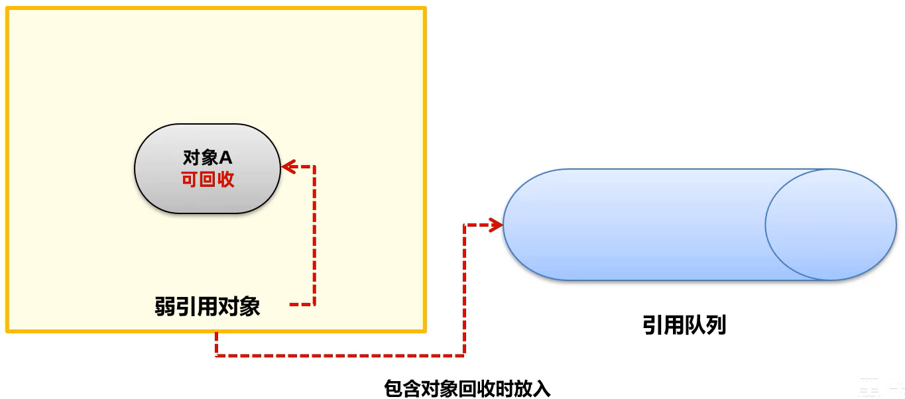

**特点**：

- 无论内存是否充足，只要发生垃圾回收，弱引用对象就会被回收
- 适合用于实现规范化映射（canonicalizing mappings）
- 弱引用主要在`ThreadLocal`源码中使用。

```java
import java.lang.ref.WeakReference;

// 弱引用示例
Object object = new Object();
WeakReference<Object> weakRef = new WeakReference<>(object);

// 清除强引用
object = null;
System.out.println(weakRef.get()); // java.lang.Object@7dc5e7b4

// 强制垃圾回收（通常不建议在生产环境中使用）
System.gc();

// 此时weakRef.get()很可能返回null
System.out.println(weakRef.get()); // null
```

### 虚引用（Phantom Reference）

**定义**：通过`PhantomReference`类实现的引用，是最弱的一种引用。

**虚引用**也叫幽灵引用/幻影引用，不能通过虚引用对象获取到包含的对象。虚引用**唯一的用途**是**当对象被垃圾回收器回收时可以接收到对应的通知**。

**特点**：

- 无法通过虚引用获取对象实例，`get()`方法总是返回`null`
- **主要用于跟踪对象被垃圾回收的状态。**例如，直接内存中为了及时知道直接内存对象不再使用，从而回收内存，使用了虚引用来实现。
- 必须与引用队列（ReferenceQueue）一起使用

```java
import java.lang.ref.PhantomReference;
import java.lang.ref.ReferenceQueue;

// 虚引用示例
ReferenceQueue<Object> queue = new ReferenceQueue<>();
Object object = new Object();
PhantomReference<Object> phantomRef = new PhantomReference<>(object, queue);

// 虚引用的get()方法总是返回null
System.out.println(phantomRef.get()); // 输出：null

// 清除强引用
object = null;

// 当对象被回收时，phantomRef会被加入到queue中
```

### 终结器引用（Final Reference）

**定义**：JVM内部使用的特殊引用，用于实现`finalize()`方法。

**终结器引用**指的是在对象需要被回收时，终结器引用会关联对象并放置在Finalizer类中的引用队列中，在稍后由一条由`FinalizerThread`线程从队列中获取对象，然后执行对象的`finalize`方法，在对象第二次被回收时，该对象才真正的被回收。

> `finalize()` 是 Java 中 `Object` 类的一个受保护方法，用于在对象被垃圾回收器回收之前执行清理操作。

**特点**：
- 由JVM自动创建和管理，开发者无法直接使用
- 当对象重写了`finalize()`方法时，JVM会为其创建终结器引用
- 对象在被回收前会先被放入`F-Queue`队列，由Finalizer线程执行`finalize()`方法

```java
// 终结器引用示例（开发者无法直接创建）
public class MyClass {
    @Override
    protected void finalize() throws Throwable {
        try {
            // 清理资源
            System.out.println("finalize method called");
        } finally {
            super.finalize();
        }
    }
}
```

### 引用队列

**引用队列**与软引用、弱引用、虚引用配合使用，用于跟踪引用对象的状态变化。

例如，软引用中的对象如果在内存不足时回收，`SoftReference`对象本身也需要被回收。如何知道哪些`SoftReference`对象需要回收呢？

`SoftReference`提供了一套队列机制：

1. 软引用创建时，**通过构造器传入引用队列**

2. 在软引用中包含的对象被回收时，该软引用对象会被放入引用队列

3. 通过代码遍历引用队列，将`SoftReference`的强引用删除

```java
// -Xmx200m 只能存一个bytes（100m）
public static void main(String[] args) throws IOException {
    ArrayList<SoftReference> softReferences = new ArrayList<>();
    ReferenceQueue<byte[]> queues = new ReferenceQueue<byte[]>(); // 引用队列
    for (int i = 0; i < 10; i++) {
        byte[] bytes = new byte[1024 * 1024 * 100];
        SoftReference studentRef = new SoftReference<byte[]>(bytes, queues); // 构造软引用时，加入队列参数
        softReferences.add(studentRef);
    }

    SoftReference<byte[]> ref = null;
    int count = 0;
    while ((ref = (SoftReference<byte[]>) queues.poll()) != null) {
        count++;
    }
    System.out.println(count);  // 9
}
```


## 垃圾回收算法

- 1960年John McCarthy发布了第一个GC算法：标记-清除算法。
- 1963年Marvin L. Minsky 发布了复制算法。

本质上后续所有的垃圾回收算法，都是在上述两种算法的基础上优化而来。

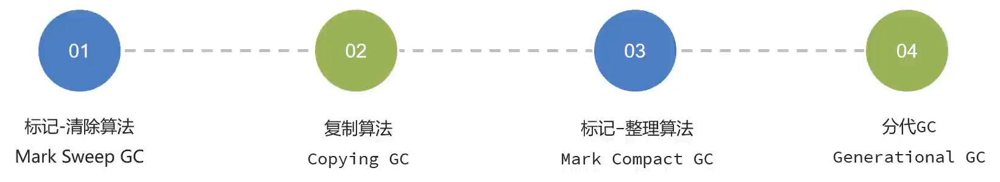

### 评价标准

Java垃圾回收过程会通过单独的GC线程来完成，但是不管使用哪一种GC算法，都会有部分阶段需要**停止所有的用户线程**。

这个过程被称之为**`Stop The World`**简称`STW`，如果`STW`时间过长则会影响用户的使用。


所以判断GC算法是否优秀，可以从三个方面来考虑：

1. **吞吐量**

    吞吐量指的是CPU用于执行用户代码的时间与CPU总执行时间的比值，即 **吞吐量 = 执行用户代码时间 / （执行用户代码时间 + GC时间）**。吞吐量数值越高，垃圾回收的效率就越高。

2. **最大暂停时间**

    最大暂停时间指的是所有在垃圾回收过程中的STW时间最大值。比如如下的图中，黄色部分的STW就是最大暂停时间，显而易见上面的图比下面的图拥有更少的最大暂停时间。最大暂停时间越短，用户使用系统时受到的影响就越短。

    

3. **堆使用效率**

    不同垃圾回收算法，对堆内存的使用方式是不同的。比如**标记清除算法**，可以使用完整的堆内存。而**复制算法**会将堆内存一分为二，每次只能使用一半内存。**从堆使用效率上来说，标记清除算法要优于复制算法。**

    

上述三种评价标准：堆使用效率、吞吐量，以及最大暂停时间不可兼得。

一般来说，堆内存越大，最大暂停时间就越长。想要减少最大暂停时间，就会降低吞吐量。不同的垃圾回收算法，适用于不同的场景。

### 标记-清除算法（Mark-Sweep）

**工作原理**：

1. **标记阶段**：从GC Roots开始遍历，标记所有可达对象
2. **清除阶段**：遍历堆内存，回收未被标记的对象

**优点**：实现简单，只需要在第一阶段给每个对象维护标志位，第二阶段删除对象即可。 

**缺点**：

1. **碎片化问题**

    由于内存是连续的，所以在对象被删除之后，内存中会出现很多细小的可用内存单元。如果我们需要的是一个比较大的空间，很有可能这些内存单元的大小过小无法进行分配。

2. **分配速度慢**

    由于内存碎片的存在，需要维护一个空闲链表，极有可能发生每次需要遍历到链表的最后才能获得合适的内存空间。

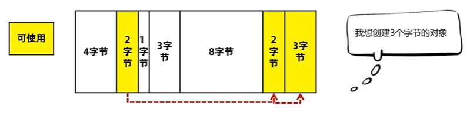

### 复制算法（Copy）

**工作原理**：

将内存分为两个相等的区域：From空间和To空间

1. 只使用From空间分配对象
2. GC时将存活对象复制到To空间
3. 交换From和To空间角色
4. 清除From空间对象，再次交换空间角色

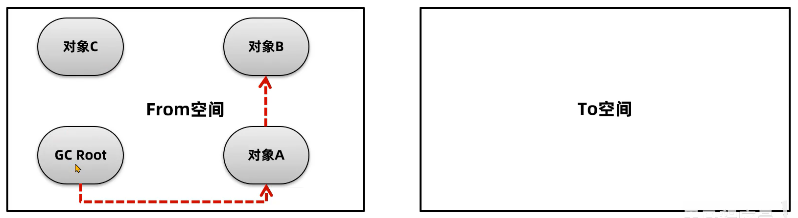

**优点**：

1. **吞吐量高**

    复制算法只需要遍历一次存活对象复制到To空间即可，比标记-整理算法少了一次遍历的过程，因而性能较好，但是不如标记-清除算法，因为标记清除算法不需要进行对象的移动

2. **不会发生碎片化**

    复制算法在复制之后就会将对象按顺序放入To空间中，所以对象以外的区域都是可用空间，不存在碎片化内存空间。

**缺点**：**内存使用效率低** 每次只能让一半的内存空间来为创建对象使用

### 标记-整理算法（Mark-Compact）

**工作原理**：

1. **标记阶段**：同标记-清除算法
2. **整理阶段**：将存活对象向内存一端移动

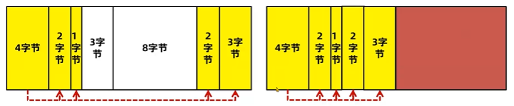

**优点**：

1. **内存使用效率高**

    整个堆内存都可以使用，不会像复制算法只能使用半个堆内存

2. **不会发生碎片化**

    在整理阶段可以将对象往内存的一侧进行移动，剩下的空间都是可以分配对象的有效空间

**缺点**：

- **整理阶段的效率不高**

    整理算法有很多种，比如Lisp2整理算法需要对整个堆中的对象搜索3次，整体性能不佳。可以通过Two-Finger、表格算法、ImmixGC等高效的整理算法优化此阶段的性能

### 分代GC

在 JDK 7 版本及 JDK 7 版本之前，堆内存被通常分为下面三部分：

1. 年轻代(Young Generation) `Eden + S0(To) + S1(From)`
2. 老年代(Old Generation)
3. 永久代(Permanent Generation)


**JDK 8 版本之后 PermGen(永久代) 已被 Metaspace(元空间) 取代，元空间使用的是本地内存。** （我会在方法区这部分内容详细介绍到）。

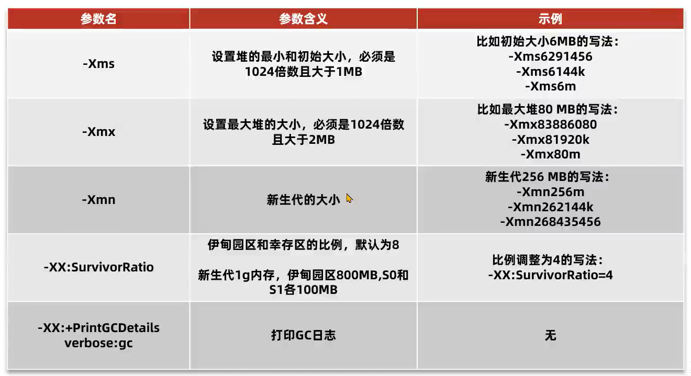

你可以用

#### 对象分配阶段

- **新对象优先在Eden区分配**：绝大多数对象首先在年轻代的Eden区创建
- **大对象直接进入老年代**：避免大对象在年轻代频繁复制
- **指针碰撞分配**：Eden区使用连续分配，分配速度极快

#### Minor GC（年轻代回收）

**触发条件**：Eden区空间不足时自动触发

**执行步骤**：

1. **STW暂停**：暂停所有应用线程
2. **初始标记**：从GC Roots开始标记年轻代中的存活对象
3. **复制存活对象**：将Eden区和From Survivor区的存活对象复制到To Survivor区
4. **年龄计数**：存活对象的年龄计数器+1
5. **处理晋升**：检查对象是否达到晋升条件
6. **空间交换**：交换Survivor区的角色（From ↔ To）
7. **恢复运行**：恢复应用线程

#### 对象晋升机制

- **年龄晋升**：对象经历一定次数Minor GC后（默认15次）晋升老年代
- **提前晋升**：Survivor区空间不足时，部分对象提前晋升
- **大对象直接晋升**：避免复制开销

#### Major GC（老年代回收）

**触发条件**：

- 老年代空间不足
- 晋升失败
- 大对象分配失败

**执行策略**：

- **标记-清除算法**：标记存活对象，清除死亡对象
- **标记-整理算法**：标记后整理内存，消除碎片
- **并发收集**：部分阶段与应用线程并发执行

#### Full GC（整堆回收）

**触发条件**：

- `System.gc()`显示调用
- 方法区/元空间不足
- 堆内存使用率超过阈值
- Minor GC后老年代空间不足

**执行过程**：

1. 回收年轻代（Minor GC）
2. 回收老年代（Major GC）
3. 回收永久代/元空间
4. 堆内存整理


## 垃圾回收器

**垃圾回收器**是垃圾回收算法的具体实现。

由于垃圾回收器分为年轻代和老年代，除了G1之外其他垃圾回收器必须成对组合进行使用。

具体的关系图如下：

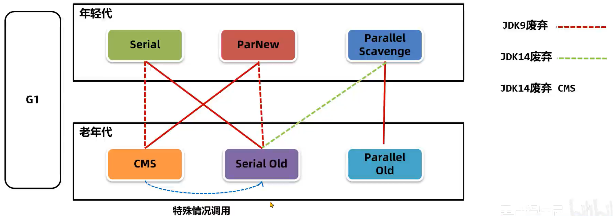

### Serial & Serial Old

`-XX:+UseSerialGC` 新生代、老年代都使用串行回收器

**年轻代-Serial 垃圾回收器**：Serial是一种单线程串行回收年轻代的垃圾回收器。

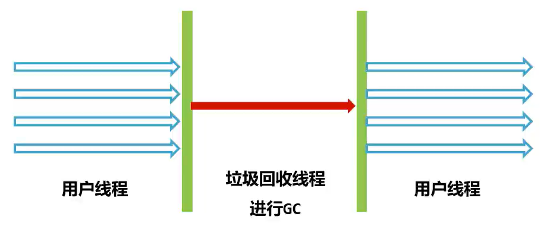

> 算法：**复制算法**
>
> 优点：单CPU处理器下吞吐量非常出色
>
> 缺点：多CPU下吞吐量不如其他垃圾回收器，堆如果偏大会让用户线程处于长时间的等待
>
> 适用场景：**Java编写的客户端程序**或者**硬件配置有限**的场景

**老年代-SerialOld 垃圾回收器**：SerialOld是Serial垃圾回收器的老年代版本，采用单线程串行回收


> 算法：**标记-整理算法**
>
> 优点：单CPU处理器下吞吐量非常出色
>
> 缺点：多CPU下吞吐量不如其他垃圾回收器，堆如果偏大会让用户线程处于长时间的等待
>
> 适用场景：与Serial垃圾回收器搭配使用，或者在CMS特殊情况下使用

### ParNew & CMS

**年轻代-ParNew 垃圾回收器**：

`-XX:+UseParNewGC` 新生代使用ParNew回收器，老年代使用串行回收器

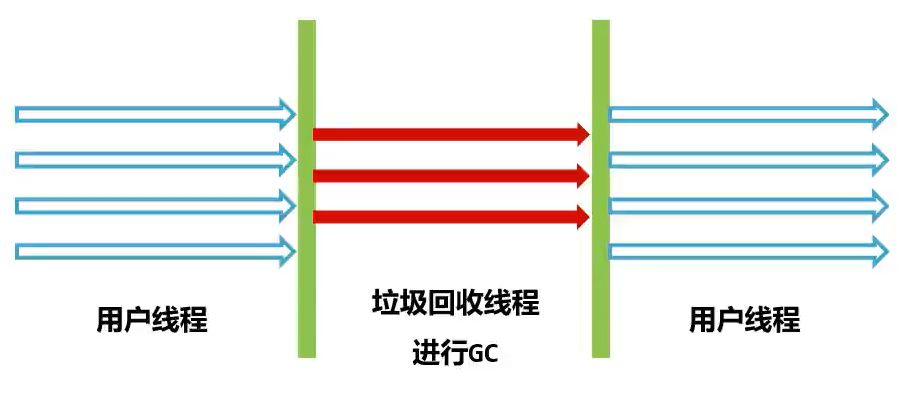

ParNew垃圾回收器本质上是对Serial在多CPU下的优化，使用多线程进行垃圾回收

> 算法：**复制算法**
>
> 优点：多CPU处理器下停顿时间较短
>
> 缺点：若吐量和停顿时间不如G1，所以在JDK9之后不建议使用
>
> 适用场景：JDK8及之前的版本中，与CMS老年代垃圾回收器搭配使用

**老年代-CMS(Concurrent Mark Sweep) 垃圾回收器**：

参数：`-XX:+UseConcMarkSweepGC`

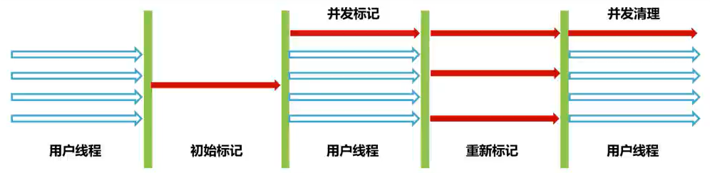

CMS垃圾回收器关注的是系统的暂停时间，允许用户线程和垃圾回收线程在某些步骤中同时执行，减少了用户线程的等待时间。

> 算法：**标记-清除算法**
>
> 优点：系统由于垃圾回收出现的停顿时间较短，用户体验好
>
> 缺点：
>
> 1. 内存碎片问题
> 2. 退化问题
> 3. 浮动垃圾问题
>
> 适用场景：
>
> - 大型的互联网系统中**用户请求数量大**、频率高的场景
> - 比如订单接口、商品接口等

### Parallel Scavenge & Parallel Old

参数：`-XX:+UseParallelGC` 或 `-XX:+UseParallelOldGC`可以使用Parallel Scavenge + Parallel Old这种组合

> Parallel Scavenge允许手动设置最大暂停时间和吞吐量。
>
> Oracle官方建议在使用这个组合时，不要设置堆内存的最大值，垃圾回收器会根据最大暂停时间和吞吐量自动调整内存大小。
>
> **最大暂停时间**：`-XX:MaxGCPauseMillis=n` 设置每次垃圾回收时的最大停顿毫秒数
>
> **吞吐量**：`-XX:GCTimeRatio=n` 设置吞吐量为n（用户线程执行时间 = n/n + 1）
>
> **自动调整内存大小**：`-XX:+UseAdaptiveSizePolicy`设置可以让垃圾回收器根据吞吐量和最大停顿的毫秒数自动调整内存大小


**年轻代-Parallel Scavenge 垃圾回收器**：


Parallel Scavenge是JDK8默认的年轻代垃圾回收器，多线程并行回收，关注的是系统的吞吐量。具备自动调整堆内存大小的特点。

> 算法：**复制算法**
>
> 优点：吞吐量高，而且手动可控。为了提高吞吐量，虚拟机会动态调整堆的参数
>
> 缺点：不能保证单次的停顿时间
>
> 适用场景
>
> - **后台任务**，不需要与用户交互，并且容易产生大量的对象
> - 比如：大数据的处理，大文件导出


以下是提取的文字内容：

---

**老年代-Parallel Old 垃圾回收器**：


Parallel Old是为Parallel Scavenge收集器设计的老年代版本，利用多线程并发收集。

算法：**标记-整理算法**

优点：并发收集，在多核CPU下效率较高

缺点：暂停时间会比较长

适用场景：与Parallel Scavenge配套使用


### G1 - Garbage First

**参数1**：`-XX:+UseG1GC` 打开G1的开关，JDK9之后默认不需要打开 

**参数2**：`-XX:MaxGCPauseMillis=`毫秒值 最大暂停的时间

JDK9之后默认的垃圾回收器是**G1（Garbage First）垃圾回收器**。

> Parallel Scavenge关注吞吐量，允许用户设置最大暂停时间，但是会减少年轻代可用空间的大小。
>
> CMS关注暂停时间，但是吞吐吐量方面会下降。
>
> 而G1设计目标就是将上述两种垃圾回收器的优点融合：
>
> 1. 支持巨大的堆空间回收，并有较高的吞吐吐量。
> 2. 支持多CPU并行垃圾回收。
> 3. 允许用户设置最大暂停时间。

G1 之前内存结构一般是**连续的**。

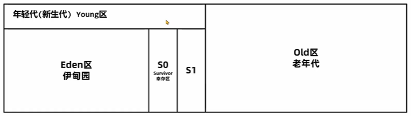

G1的整个堆会被划分成**多个大小相等的区域**，称之为区**Region**，区域不要求是连续的。分为Eden、Survivor、Old区。

Region的大小通过**堆空间大小/2048**计算得到，也可以通过参数`-XX:G1HeapRegionSize=32m` 指定(其中32m指定region大小为32M)，**Region size必须是2的指数幂**，取值范围从1M到32M。

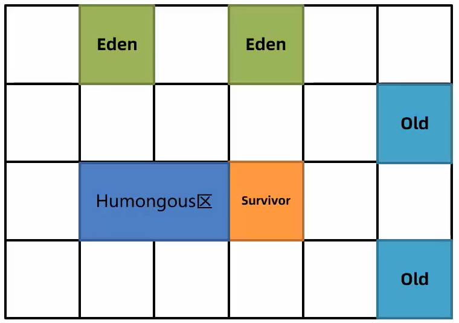


#### 年轻代回收（Young GC）

**触发条件**：总Eden区不足时（max默认60%）

**执行流程**：

1. **STW初始暂停**：停止所有应用线程

2. **根扫描**：从GC Roots开始标记存活对象

    > 部分对象如果大小超过Region的一半，会直接放入老年代，这类老年代被称为Humongous区。比如堆内存是4G，每个Region是2M，只要一个大对象超过了1M就被放入Humongous区，如果对象过大会横跨多个Region。

3. **更新RSet**：处理Remembered Set中的跨Region引用

4. **对象拷贝**：根据**最大暂停时间**选择某些Region存活对象拷贝到Survivor Region，或晋升到Old Region

    > G1在进行Young GC的过程中会去记录每次垃圾回收时每个Eden区和Survivor区的平均耗时，以作为下次回收时的参考依据。这样就可以根据配置的最大暂停时间计算出本次回收时最多能回收多少个Region区域了。
    >
    > 比如：-XX:MaxGCPauseMillis=n（默认200），每个Region回收耗时40ms，那么这次回收最多只能回收4个Region。

5. **Region回收**：清空已回收的Eden Region，加入空闲列表

6. **恢复运行**：重启应用线程

**特点**：只回收年轻代Region，停顿时间较短


#### 并发标记周期（Concurrent Marking Cycle）

**触发条件**：堆内存使用率达到阈值（默认45%）

**五阶段流程**：

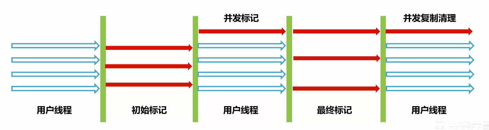

**阶段1**：初始标记（Initial Mark）

- **STW暂停**：与Young GC共用停顿
- **标记根对象**：标记GC Roots直接可达的对象
- **快速执行**：时间很短，通常<1ms

**阶段2**：根区域扫描（Root Region Scanning）

- **并发执行**：与应用线程同时运行
- **扫描Survivor**：扫描Survivor Region中的引用
- **关键约束**：必须在下次Young GC前完成

**阶段3**：并发标记（Concurrent Marking）

- **完全并发**：与应用线程并行执行
- **全堆标记**：标记整个堆中的存活对象
- **SATB算法**：使用Snapshot-At-The-Beginning处理并发修改

**阶段4**：最终标记（Remark）

- **STW暂停**：处理并发标记期间漏掉的对象
- **SATB处理**：清空SATB缓冲区，完成标记
- **引用处理**：处理软引用、弱引用等

**阶段5**：清理（Cleanup）

- **STW暂停**：统计各Region垃圾比例
- **更新RSet**：清理Remembered Sets
- **选择候选**：为Mixed GC选择高价值回收Region


#### 混合回收（Mixed GC）

**触发条件**：并发标记周期完成后立即开始

**执行流程**：

1. **年轻代回收**：回收所有Eden和Survivor Region
2. **老年代选择**：根据暂停时间目标选择部分Old Region
3. **垃圾优先**：优先选择**垃圾比例最高的Region**
4. **统一回收**：同时回收年轻代和选中的老年代Region
5. **循环执行**：多次Mixed GC直到回收足够内存

**特点**：渐进式回收老年代，避免长时间停顿


#### FULL GC

**触发条件**：如果清理过程中发现没有足够的空Region存放转移的对象，会出现Full GC。

单线程执行标记-整理算法，此时会导致用户线程的暂停。所以尽量保证应该用的堆内存有一定多余的空间。


#### G1核心机制

**Remembered Set（RSet）**

- **跨代引用跟踪**：记录其他Region指向本Region的引用
- **精确扫描**：避免全堆扫描，提高GC效率
- **卡表实现**：使用Card Table记录脏内存区域

**Collection Set（CSet）**

- **回收集合**：单次GC中要回收的Region集合
- **动态选择**：基于回收价值和暂停时间预测选择
- **混合组成**：包含年轻代Region和选中的老年代Region

**SATB算法**

- **快照标记**：在并发标记开始时对对象图做快照
- **写屏障**：记录对象修改前的状态
- **完整性保证**：确保不遗漏任何存活对象
