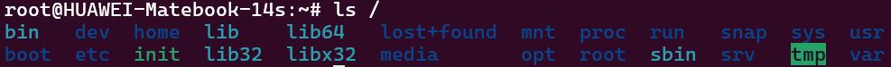

# Linux

**文章参考**：[runboon](https://www.runoob.com/linux/linux-tutorial.html)

[TOC]

## 简介

Linux 内核最初只是由芬兰人林纳斯·托瓦兹（Linus Torvalds）在赫尔辛基大学上学时出于个人爱好而编写的。

Linux 是一套免费使用和自由传播的类 Unix 操作系统，是一个基于 POSIX 和 UNIX 的多用户、多任务、支持多线程和多 CPU 的操作系统。

Linux 能运行主要的 UNIX 工具软件、应用程序和网络协议。它支持 32 位和 64 位硬件。Linux 继承了 Unix 以网络为核心的设计思想，是一个性能稳定的多用户网络操作系统。

### 发行版

Linux 的发行版说简单点就是将 Linux 内核与应用软件做一个打包。


## 系统如何启动

Linux启动时我们会看到许多启动信息。

Linux系统的启动过程并不是想象中的那么复杂，其过程可以分为5个阶段：

- 内核的引导。
- 运行 init。
- 系统初始化。
- 建立终端 。
- 用户登录系统。

### 内核引导

当计算机打开电源后，首先是BIOS开机自检，按照BIOS中设置的启动设备（通常是硬盘）来启动。

操作系统接管硬件以后，首先读入 `/boot` 目录下的内核文件。


### 运行init

init 进程是系统所有进程的起点，你可以把它比拟成系统所有进程的老祖宗，没有这个进程，系统中任何进程都不会启动。

init 程序首先是需要读取配置文件 `/etc/inittab`。


**运行级别**

许多程序需要开机启动。它们在Windows叫做**"服务"（service）**，在Linux就叫做**"守护进程"（daemon）**。

init进程的一大任务，就是去运行这些开机启动的程序。

但是，不同的场合需要启动不同的程序，比如用作服务器时，需要启动Apache，用作桌面就不需要。

Linux允许为不同的场合，分配不同的开机启动程序，这就叫做"运行级别"（runlevel）。也就是说，启动时根据"运行级别"，确定要运行哪些程序。


Linux系统有7个运行级别(runlevel)：

- 运行级别0：系统停机状态，系统默认运行级别不能设为0，否则不能正常启动
- 运行级别1：单用户工作状态，root权限，用于系统维护，禁止远程登录
- 运行级别2：多用户状态(没有NFS)
- 运行级别3：完全的多用户状态(有NFS)，登录后进入控制台命令行模式
- 运行级别4：系统未使用，保留
- 运行级别5：X11控制台，登录后进入图形GUI模式
- 运行级别6：系统正常关闭并重启，默认运行级别不能设为6，否则不能正常启动

### 系统初始化

在init的配置文件中有这么一行： `si::sysinit:/etc/rc.d/rc.sysinit`　它调用执行了`/etc/rc.d/rc.sysinit`，而`rc.sysinit`是一个bash shell的脚本，它主要是完成一些系统初始化的工作，`rc.sysinit`是每一个运行级别都要首先运行的重要脚本。

它主要完成的工作有：激活交换分区，检查磁盘，加载硬件模块以及其它一些需要优先执行任务。

```
l5:5:wait:/etc/rc.d/rc 5
```

这一行表示以5为参数运行`/etc/rc.d/rc`，`/etc/rc.d/rc`是一个Shell脚本，它接受5作为参数，去执行`/etc/rc.d/rc5.d/`目录下的所有的rc启动脚本，`/etc/rc.d/rc5.d/`目录中的这些启动脚本实际上都是一些连接文件，而不是真正的rc启动脚本，真正的rc启动脚本实际上都是放在`/etc/rc.d/init.d/`目录下。

而这些rc启动脚本有着类似的用法，它们一般能接受`start`、`stop`、`restart`、`status`等参数。

`/etc/rc.d/rc5.d/`中的rc启动脚本通常是K或S开头的连接文件，对于以 S 开头的启动脚本，将以`start`参数来运行。

而如果发现存在相应的脚本也存在K打头的连接，而且已经处于运行态了(以`/var/lock/subsys/`下的文件作为标志)，则将首先以`stop`为参数停止这些已经启动了的守护进程，然后再重新运行。

这样做是为了保证是当`init`改变**运行级别**时，所有相关的**守护进程**都将重启。

至于在每个运行级中将运行哪些守护进程，用户可以通过`chkconfig`或`setup`中的"`System Services`"来自行设定。


### 建立终端

`rc`执行完毕后，返回init。这时基本系统环境已经设置好了，各种**守护进程**也已经启动了。

`init`接下来会打开6个终端，以便用户登录系统。在inittab中的以下6行就是定义了6个终端：

```
1:2345:respawn:/sbin/mingetty tty1
2:2345:respawn:/sbin/mingetty tty2
3:2345:respawn:/sbin/mingetty tty3
4:2345:respawn:/sbin/mingetty tty4
5:2345:respawn:/sbin/mingetty tty5
6:2345:respawn:/sbin/mingetty tty6
```

从上面可以看出在2、3、4、5的运行级别中都将以`respawn`方式运行`mingetty`程序，`mingetty`程序能打开终端、设置模式。

同时它会显示一个文本登录界面，这个界面就是我们经常看到的登录界面，在这个登录界面中会提示用户输入用户名，而用户输入的用户将作为参数传给login程序来验证用户的身份。

### 用户登录系统

一般来说，用户的登录方式有三种：

- （1）命令行登录
- （2）ssh登录
- （3）图形界面登录


对于运行级别为5的图形方式用户来说，他们的登录是通过一个图形化的登录界面。登录成功后可以直接进入 `KDE`、`Gnome` 等窗口管理器。

而本文主要讲的还是文本方式登录的情况：当我们看到`mingetty`的登录界面时，我们就可以输入用户名和密码来登录系统了。

Linux 的账号验证程序是 `login`，`login` 会接收 `mingetty` 传来的用户名作为用户名参数。

然后 login 会对用户名进行分析：如果用户名不是 `root`，且存在 `/etc/nologin` 文件，`login` 将输出 `nologin` 文件的内容，然后退出。

这通常用来系统维护时防止非root用户登录。只有`/etc/securetty`中登记了的终端才允许 `root` 用户登录，如果不存在这个文件，则 `root` 用户可以在任何终端上登录。

`/etc/usertty`文件用于对用户作出附加访问限制，如果不存在这个文件，则没有其他限制。


## Linux 系统目录结构

登录系统后，在当前命令窗口下输入命令：

```shell
ls /
```

你会看到如下图所示:



树状目录结构：


**/**（根目录）所有文件和目录的起点，是文件系统的顶层。类似于 Windows 的“我的电脑”，但它是单一入口。

**/bin**（Binary，二进制文件）存放系统基本的可执行文件（如命令 ls、cp、mv）。普通用户和管理员都可以使用这些命令。

**/sbin**（System Binary，系统二进制文件）存放系统管理相关的命令（如 ifconfig、reboot），通常需要 root 权限。

**/etc**（Etcetera，配置文件）存放系统和应用程序的配置文件，例如：

- `/etc/passwd`（用户信息）
- `/etc/hosts`（主机名解析）
- `/etc/apt/sources.list`（Ubuntu 的软件源配置）。

**/home**用户的主目录，每个用户都有一个子目录（如 /home/username），存放个人文件和设置。

**/root**超级用户（root）的家目录，与普通用户的 /home 分开。

**/var**（Variable，变量数据）存放经常变化的数据，例如：

- `/var/log`（系统日志，如 syslog）
- `/var/www`（网站文件，默认 web 服务器目录）。

**/tmp**（Temporary，临时文件）存放临时文件，系统重启后可能会被清空。

**/usr**（Unix System Resources）存放用户安装的软件和资源，例如：

- `/usr/bin`（用户安装的命令）
- `/usr/lib`（库文件）
- `/usr/local`（手动安装的软件）。

**/boot**存放系统启动相关文件，如内核（vmlinuz）和引导加载程序（GRUB 配置）。

**/dev**（Devices，设备文件）存放设备文件，例如：

- `/dev/sda`（硬盘）
- `/dev/null`（空设备，丢弃输出）。

**/proc**虚拟文件系统，反映系统运行时的信息（如进程、内存），例如：

- `/proc/cpuinfo`（CPU 信息）
- `/proc/meminfo`（内存信息）。

**/mnt** 和 **/media**用于挂载外部设备：

- `/mnt`（手动挂载，如硬盘分区）
- `/media`（自动挂载，如 U 盘、CD）。


## Linux 系统命令

Linux 系统命令是操作和管理 Linux 的核心工具，主要通过终端（Terminal）输入。

### 文件管理

#### 文件和目录操作

`cd` 全称是 "change directory"（更改目录），用于切换当前工作目录。

``` shell
cd /etc

cd    # 回到当前用户的家目录（如 /home/username）
cd ~  # 同上，~ 表示家目录。
cd .. # 切换到当前目录的上级目录。
cd -  # 切换到上一次所在的目录（类似“后退”功能）。
```

`ls` 是 "list" 的缩写，用于显示指定目录中的文件和子目录。

```shell
ls /etc

ls -l # 长格式。显示详细信息，包括权限、所有者、文件大小、修改时间等。
ls -a # 显示所有文件。包括隐藏文件（以 . 开头的文件，如 .bashrc）
ls -lh # 人类可读。将文件大小显示为 KB、MB 等（需配合 -l 使用）
```

`pwd` 全称是 "print working directory"（打印工作目录）

`mkdir` 全称是 "make directory"（创建目录）

`touch` 用于创建空文件或更新现有文件的时间戳。

```shell
touch file.txt

touch -a file.txt # 仅修改访问时间。只更新文件的最后访问时间（atime）。
touch -m file.txt # 仅修改内容修改时间。只更新文件的最后修改时间（mtime）。
touch -r ref.txt file.txt # 参考文件。将 file.txt 的时间戳设置为 ref.txt 的时间戳。
```

`cp` 全称是 "copy"（复制），用于复制文件或目录。

```shell
cp file.txt file_copy.txt
cp file.txt /tmp
cp file1.txt file2.txt /tmp # 复制多个文件到/tmp

cp -f file.txt /tmp # 强制覆盖目标文件，不提示。
# 递归复制。复制目录及其所有内容（包括子目录和文件）。
cp -r dir1 dir2
cp -R dir1 dir2
cp -u file.txt /tmp # 更新复制。仅当源文件比目标文件新，或目标文件不存在时才复制。
```

此外`cp`还支持**交互模式**和**显示详细信息**。

```shell
# 如果目标文件已存在，会提示是否覆盖。
cp -i file.txt /tmp
root@localhost~# cp: overwrite '/tmp/file.txt'?（输入 y 覆盖，n 取消）

# 显示复制过程。
cp -v file.txt file_copy.txt
root@localhost~# 'file.txt' -> 'file_copy.txt'
```

`mv` 全称是 "move"（移动），用于移动文件或目录，也可以用来重命名文件。

```shell
mv file.txt /tmp

mv -i file.txt /tmp
root@localhost~# mv: overwrite '/tmp/file.txt'?（输入 y 覆盖，n 取消）

mv -f file.txt /tmp

mv -v file.txt file_new.txt
root@localhost~# 'file.txt' -> 'file_new.txt'

mv -u file.txt /tmp
```

`rm` 全称是 "remove"（移除），用于删除文件或目录。

```shell
rm -rf / # 强制递归删除。危险！！！
rm -v
rm -i
```

`find` 用于在文件系统中搜索文件或目录。

```shell
find . # 在当前目录查找所有文件

# 按文件名查找，区分大小写。-iname 不区分大小写
find /etc -name "passwd" 

# 按文件类型查找。
# f 表示普通文件，d 表示目录，l 表示符号链接
find . -type f

# 按文件大小查找。
# + 表示大于，- 表示小于，单位有 k、M、G
find . -size +10M 
```

找到文件后，可以执行特定操作。

```shell
# 默认动作，打印路径
find . -name "*.txt" -print
# 直接删除
find . -name "*.log" -delete
# 执行命令。{} 表示找到的文件，\; 表示命令结束。
find . -name "*.txt" -exec rm -v {} \;
```

#### 文件查看和编辑

`cat` 全称是 "concatenate"（连接），主要用于显示文件内容、合并文件或将内容输出到终端。

```shell
cat file.txt # 显示文件 file.txt 的内容

# -n（显示行号）
# -b（显示非空行号）
# -s（压缩连续空行）

# 显示行尾符。在每行末尾显示 $ 符号，表示换行。
cat -E file.txt
root@localhost~# Hello, world!$

# 显示制表符。将制表符（Tab）显示为 ^I
cat -T file.txt
```

此外`cat`还可以**合并文件**，**创建文件**，**追加内容**。

```shell
# 假设有一个文件 test.txt，内容如下：
# Hello, world!
#
# This is a test.
# 假设还有 test2.txt，内容为：
# Goodbye!

cat test.txt test2.txt
root@localhost~# 
> Hello, world!
>
> This is a test.
> Goodbye!

cat > newfile.txt # 创建文件。输入内容（按 Ctrl+D 结束）
cat >> test.txt # 追加内容。输入内容（按 Ctrl+D 结束）
```

`less` 用于分页查看文件内容。`less` 打开文件后，进入**交互模式**，用户可以通过键盘命令导航。

```shell
less log.txt 
less -N log.txt # 显示行号。每行前显示行号。
less -S log.txt # 不换行。长行不自动换行，用左右箭头滚动查看。
less -X log.txt # 不清除屏幕。退出后保留内容在终端。
```

`head` 用于显示文件的开头部分，**默认显示前 10 行**。 

```shell
head log.txt

# 指定行数
head -n 5 log.txt
head -5 log.txt
# 按字节数显示
head -c 20 log.txt

# 显示文件名
head -v log.txt
root@localhost~# 
> ==> log.txt <==
> Line 1
> Line 2
> ...
```

`tail` 用于显示文件的末尾部分，**默认显示最后 10 行**。

```shell
tail log.txt
# -n -c -v

# 跟踪文件。实时显示文件末尾的新增内容，常用于监控日志。
tail -f /var/log/syslog
```

`nano`

`vim`

`grep` 用于在文本中搜索匹配特定模式（正则表达式）的行。它特别适合处理日志文件、配置文件或任何需要快速查找内容的场景。

```shell
grep "error" /var/log/syslog
# 忽略大小写
grep -i "error" file.txt
# 显示行号
grep -n "error" /var/log/syslog
# 反向匹配, 显示不包含 "error" 的行。
grep -v "error" file.txt
# 精确匹配单词
grep -w "error" file.txt
# 统计匹配行数
grep -c "error" file.txt
```

此外，grep 还有一个 "quiet"（**安静模式**）。它不会输出任何匹配结果,而是默默地检查模式是否存在,并通过**退出状态**（exit status）来表示结果。常用于 Shell 脚本中配合 if 判断。

**退出状态**：

- 0：找到匹配（成功）。
- 1：未找到匹配。
- 2：发生错误（如文件不存在）。

```bash
# 可以用 $? 查看 grep -q 的结果
grep -q "error" file.txt
echo $?

# 假设有一个文件file.txt
# Hello world
# This is an error message
# No issues here

grep -q "error" file.txt
if [ $? -eq 0 ]; then
    echo "找到 'error'"
else
    echo "未找到 'error'"
fi

if grep -qi "error" file.txt; then
    echo "找到 'error'（忽略大小写）"
fi
```

`grep` 常与管道（|）结合使用，处理其他命令的输出。

```shell
ps aux | grep "python"
cat /etc/passwd | grep "root"
tail -n 100 /var/log/syslog | grep "error"
```

#### 文件权限管理

`chmod` 用于更改文件或目录权限的命令，全称是 "change mode"。

在此之前，你需要了解linux权限基础。Linux 文件权限分为**三类用户**：

- **u**（user）：文件所有者。
- **g**（group）：文件所属组。
- **o**（others）：其他用户。

每类用户有**三种权限**：

- **r**（read，读）：值为 4。
- **w**（write，写）：值为 2。
- **x**（execute，执行）：值为 1。

这样就可以对具体用户进行权限的表示了。Linux系统中支持**数字表示法**，三位数字（如 `755`），分别表示用户、组、其他权限的总和。`755 = rwxr-xr-x`（所有者：`7=4+2+1`，组：`5=4+1`，其他：`5=4+1`）。但也可以使用**符号表示法**，如 `u+rwx`（所有者添加读写执行权限）。

`421`三位数字相加的结果巧妙地表示出每种独特的权限类型组合。常见的组合有：

- `755：rwxr-xr-x`（可执行文件常用）。
- `644：rw-r--r--`（普通文件常用）。
- `700：rwx------`（私有目录或脚本）。

```shell
ls -l # 查看权限
root@localhost~# -rwxr-xr-x 1 user user 1234 Mar 29 12:00 script.sh

chmod -R 755 dir # 递归修改。
chmod -v 644 file.txt # 显示详细信息
root@localhost~# mode of 'file.txt' changed from 0666 (rw-rw-rw-) to 0644 (rw-r--r--)
chmod -c 755 script.sh # 仅在权限实际改变时显示信息。

chmod u+x file.txt
chmod o-w file.txt
chmod g=rx file.txt
```

`chown` 用于更改文件或目录所有者的命令，全称是 "change owner"。

```shell
ls -l # 查看归属(文件的所有者和所属组)
> -rw-r--r-- 1 user group 1234 Mar 29 12:00 file.txt

# 修改所有者，所属组，所有者和所属组
chown john file.txt
chown :staff file.txt
chown john:staff docs

# -R -v -c

# 修改符号链接本身。更改符号链接的所有者，而不是链接指向的目标。
chown -h john link.txt
```

### 磁盘管理

`df`

`du`

`fdisk`

### 系统管理

#### 用户与组

`login`

`logout`

`useradd`

`userdel`

`usermod`

`userconf`

`who`

`sudo`

`newgrp`

`groupadd`

`groupdel`

`groupmod`

#### 进程管理

`ps` 用于显示系统进程状态的命令，全称是 "process status"。

```shell
ps
>    PID TTY          TIME CMD
>    313 pts/0    00:00:00 bash
>   1652 pts/0    00:00:00 ps

ps -a # 显示所有终端的进程（不包括无终端的进程）。
ps -u # 显示用户信息。
ps -x # 显示没有关联终端的进程（如后台服务）。
ps -e # 显示所有进程
ps -f # 显示详细格式
> UID          PID    PPID  C STIME TTY          TIME CMD
> root         313     312  0 10:52 pts/0    00:00:00 -bash
> root        1667     313  0 16:32 pts/0    00:00:00 ps -f

ps aux # BSD 风格常用组合。即-aux
> USER   PID  %CPU %MEM    VSZ   RSS TTY   STAT START TIME COMMAND
> user  1234   0.1  1.2  12345  6789 pts/0 S    12:00 0:01 /bin/bash
> root  5678   0.0  0.5  54321  2345 ?     Ss   11:00 0:00 /usr/sbin/sshd

# 配合管道符查找进程
ps aux | grep "firefox"
```

`kill` 用于终止进程。

终止进程之前，`kill` 通过信号与进程通信，常用信号包括：

- `-1` SIGHUP：挂起信号，常用于重启服务。
- `-2` SIGINT：中断信号（类似 Ctrl+C）。
- `-9` SIGKILL：强制终止，无法被进程捕获。
- `-15` SIGTERM：默认信号，请求进程优雅退出。

```shell
# 查找进程
ps aux | grep "bash"

kill -l # 查看所有信号
> 1) SIGHUP   2) SIGINT   3) SIGQUIT  9) SIGKILL  15) SIGTERM ...
kill 1234 # 终止 PID 为 1234 的进程
kill -9 5678 # 强制杀死 PID 为 5678 的进程
```

`exit`

`halt`

`shutdown` 用来进行关机程序，并且在关机以前传送讯息给所有使用者正在执行的程序，shutdown 也可以用来重开机。

```shell
shutdown -t seconds : # 设定在几秒钟之后进行关机程序。
shutdown -k : # 并不会真的关机，只是将警告讯息传送给所有使用者。
shutdown -r : # 关机后重新开机。
shutdown -h : # 关机后停机。
```

`reboot` 用于用来重新启动计算机。若系统的 `runlevel` 为 0 或 6 ，则重新开机，否则以 `shutdown` 指令（加上 `-r` 参数）来取代

```shell
reboot -f # 强制重启
```

#### 系统设置

`time`

`date`

`passwd`

`free`

### 网络通讯

`ping`

```
```

`ifconfig`

```
```

`wget`

```
```

`curl`

```
```

`ssh`

```
```

`httpd`

```
```

`who`

`whoami`

`whois`

### 备份压缩

`zip`

```
```

`unzip`

```
```

`tar`

```
```

### 包管理

`apt`

`yum`

### 其他实用命令

`man`

```
```

`history`

```