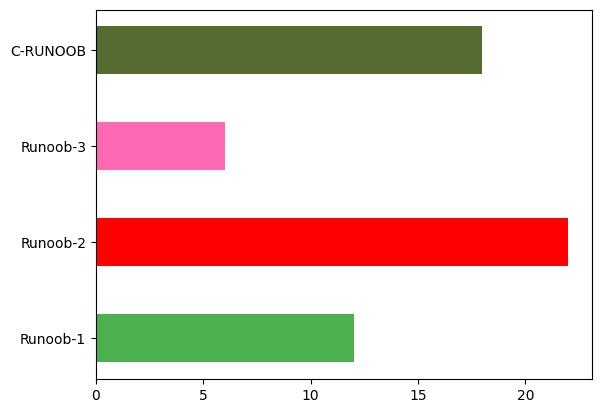
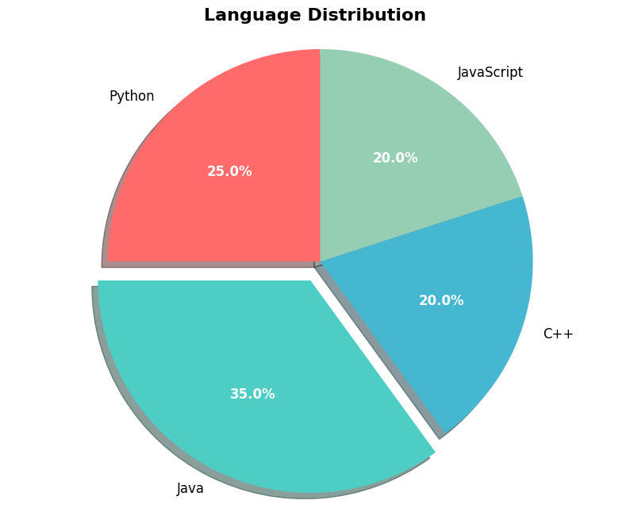

# Matplotlib

文章参考：[Matplotlib 教程](https://www.runoob.com/matplotlib/matplotlib-tutorial.html)

[TOC]

Matplotlib 是 Python 的绘图库，它能让使用者很轻松地将数据图形化，并且提供多样化的输出格式。

Matplotlib 可以用来绘制各种静态，动态，交互式的图表。

Matplotlib 是一个非常强大的 Python 画图工具，我们可以使用该工具将很多数据通过图表的形式更直观的呈现出来。

Matplotlib 可以绘制线图、散点图、等高线图、条形图、柱状图、3D 图形、甚至是图形动画等等。

# 核心


## Pyplot

Pyplot 是 Matplotlib 的子库，提供了和 MATLAB 类似的绘图 API。

Pyplot 是常用的绘图模块，能很方便让用户绘制 2D 图表。

Pyplot 包含一系列绘图函数的相关函数，每个函数会对当前的图像进行一些修改，例如：给图像加上标记，生新的图像，在图像中产生新的绘图区域等等。

使用的时候，我们可以使用 import 导入 pyplot 库，并设置一个别名 **plt**：

```python
import matplotlib.pyplot as plt
```

以下是一些常用的 pyplot 函数：

- `plot()`：用于绘制线图或点图
- `scatter()`：用于绘制散点图
- `bar()`：用于绘制垂直条形图和水平条形图
- `hist()`：用于绘制直方图
- `pie()`：用于绘制饼图
- `imshow()`：用于绘制图像
- `subplots()`：用于创建子图

除了这些基本的函数，pyplot 还提供了很多其他的函数，例如用于设置图表属性的函数、用于添加文本和注释的函数、用于保存图表到文件的函数等等。

## `plot()`

以下实例，我们通过两个坐标 **(0,0)** 到 **(6,100)** 来绘制一条线:

```python
import matplotlib.pyplot as plt
import numpy as np

xpoints = np.array([0, 6])
ypoints = np.array([0, 100])

plt.plot(xpoints, ypoints)
plt.show()
```


以上实例中我们使用了 Pyplot 的 **plot()** 函数， **plot()** 函数是绘制二维图形的最基本函数。

**plot()** 用于画图它可以绘制点和线，语法格式如下：

```python
# 画单条线
plot([x], y, [fmt], *, data=None, **kwargs)
# 画多条线
plot([x], y, [fmt], [x2], y2, [fmt2], ..., **kwargs)
```

参数说明：

- **`x, y`**：点或线的节点，x 为 x 轴数据，y 为 y 轴数据，数据可以列表或数组。

- **`fmt`**：可选，定义基本格式（如颜色、标记和线条样式）。

    > fmt 参数定义了基本格式，如标记、线条样式和颜色。
    >
    > ```python
    > fmt = '[marker][line][color]'
    > ```
    >
    > **颜色字符：** `b` 蓝色，`m` 洋红色，`g` 绿色，`y` 黄色，`r` 红色，`k` 黑色，`w` 白色，`c` 青绿色，`#008000` RGB 颜色字符串。多条曲线不指定颜色时，会自动选择不同颜色。
    >
    > **线型参数：** `-` 实线，`--` 破折线，`-.` 点划线，`:` 虚线。
    >
    > **标记字符：** `.` 点标记，`,` 像素标记(极小点)，`o` 实心圈标记，`v` 倒三角标记，`^` 上三角标记，`>` 右三角标记，`<` 左三角标记...等等。
    >
    > e.g. `o:r`，**o** 表示实心圆标记，**:** 表示虚线，**r** 表示颜色为红色。
    >
    > 
    >
    > 你也可以使用关键字参数单独设置，
    >
    > ```python
    > plt.plot(ypoints, marker = 'o', ms = 20, mec = '#4CAF50', mfc = '#4CAF50')
    > ```
    >
    > - markersize，简写为 **ms**：定义标记的大小。
    > - markerfacecolor，简写为 **mfc**：定义标记内部的颜色。
    > - markeredgecolor，简写为 **mec**：定义标记边框的颜色。
    >
    > ```python
    > plt.plot(ypoints, linewidth = '12.5', c='#8FBC8F', linestyle='-')
    > ```
    >
    > - 线的颜色可以使用 **color** 参数来定义，简写为 **c**。
    > - 线的宽度可以使用 **linewidth** 参数来定义，简写为 **lw**，值可以是浮点数，如：**1**、**2.0**、**5.67** 等。

- **`**kwargs`**：可选，用在二维平面图上，设置指定属性，如标签，线的宽度等。


如果我们只想绘制两个坐标点，而不是一条线，可以使用 **o** 参数，表示一个实心圈的标记：

```python
import matplotlib.pyplot as plt
import numpy as np

xpoints = np.array([1, 8])
ypoints = np.array([3, 10])

plt.plot(xpoints, ypoints, 'o')
plt.show()
```

如果我们不指定 x 轴上的点，则 x 会根据 y 的值来设置为 **0, 1, 2, 3..N-1**。

```python
import matplotlib.pyplot as plt
import numpy as np

ypoints = np.array([3, 8, 1, 10, 5, 7])

plt.plot(ypoints)
plt.show()
```


## 轴标签和标题

我们可以使用 **xlabel()** 和 **ylabel()** 方法来设置 x 轴和 y 轴的标签，使用 **title()** 方法来设置标题。

```python
import numpy as np
import matplotlib.pyplot as plt

x = np.array([1, 2, 3, 4])
y = np.array([1, 4, 9, 16])
plt.plot(x, y)

plt.title("RUNOOB TEST TITLE", fontsize=20)
plt.xlabel("x - label")
plt.ylabel("y - label")

plt.show()
```


## 网格线

我们可以使用 pyplot 中的 grid() 方法来设置图表中的网格线。

grid() 方法语法格式如下：

```python
grid(b=None, which='major', axis='both', **kwargs)
```

**参数说明：**

- **`b`**：可选，默认为 None，可以设置布尔值，true 为显示网格线，false 为不显示，如果设置 **kwargs 参数，则值为 true。
- **`which`**：可选，可选值有 'major'、'minor' 和 'both'，默认为 'major'，表示应用更改的网格线。
- **`axis`**：可选，设置显示哪个方向的网格线，可以是取 'both'（默认），'x' 或 'y'，分别表示两个方向，x 轴方向或 y 轴方向。
- **`**kwargs`**：可选，设置网格样式，可以是 color='r', linestyle='-' 和 linewidth=2，分别表示网格线的颜色，样式和宽度。

```python
import numpy as np
import matplotlib.pyplot as plt

x = np.array([1, 2, 3, 4])
y = np.array([1, 4, 9, 16])


plt.title("RUNOOB grid() Test")
plt.xlabel("x - label")
plt.ylabel("y - label")

plt.plot(x, y)

plt.grid(axis='x', color = 'r', linestyle = '--', linewidth = 0.5)

plt.show()
```


## 绘制多图

我们可以使用 pyplot 中的 **subplot()** 和 **subplots()** 方法来绘制多个子图。

**subplot()** 方法在绘图时需要指定位置，**subplots()** 方法可以一次生成多个，在调用时只需要调用生成对象的 ax 即可。

### `subplot()`

```python
subplot(nrows, ncols, index, **kwargs)
```

以上函数将整个绘图区域分成 nrows 行和 ncols 列，然后从左到右，从上到下的顺序对每个子区域进行编号 **1...N** ，左上的子区域的编号为 1、右下的区域编号为 N，编号可以通过参数 **index** 来设置。

```python
import matplotlib.pyplot as plt
import numpy as np

# 生成示例数据
x = np.linspace(0, 10, 100)
y1 = np.sin(x)
y2 = np.cos(x)
y3 = np.tan(x)
y4 = np.exp(x/10)

# 创建 2x2 的子图布局
plt.figure(figsize=(10, 8))

# 第一个子图
plt.subplot(2, 2, 1)  # 2行2列，第1个位置
plt.plot(x, y1, 'r-', linewidth=2)
plt.title('正弦函数')
plt.grid(True)

# 第二个子图
plt.subplot(2, 2, 2)  # 2行2列，第2个位置
plt.plot(x, y2, 'b-', linewidth=2)
plt.title('余弦函数')
plt.grid(True)

# 第三个子图
plt.subplot(2, 2, 3)  # 2行2列，第3个位置
plt.plot(x, y3, 'g-', linewidth=2)
plt.title('正切函数')
plt.grid(True)

# 第四个子图
plt.subplot(2, 2, 4)  # 2行2列，第4个位置
plt.plot(x, y4, 'm-', linewidth=2)
plt.title('指数函数')
plt.grid(True)

plt.tight_layout()  # 自动调整子图参数，使之填充整个图像区域
plt.show()
```

### `subplots()`

`subplots()` 方法语法格式如下：

```python
subplots(nrows=1, ncols=1, *, sharex=False, sharey=False, squeeze=True, subplot_kw=None, gridspec_kw=None, **fig_kw)
```

**参数说明：**

- **`nrows`**：默认为 1，设置图表的行数。
- **`ncols`**：默认为 1，设置图表的列数。
- **`sharex、sharey`**：设置 x、y 轴是否共享属性，默认为 false，可设置为 'none'、'all'、'row' 或 'col'。 False 或 none 每个子图的 x 轴或 y 轴都是独立的，True 或 'all'：所有子图共享 x 轴或 y 轴，'row' 设置每个子图行共享一个 x 轴或 y 轴，'col'：设置每个子图列共享一个 x 轴或 y 轴。
- **`squeeze`**：布尔值，默认为 True，表示额外的维度从返回的 Axes(轴)对象中挤出，对于 N*1 或 1*N 个子图，返回一个 1 维数组，对于 N*M，N>1 和 M>1 返回一个 2 维数组。如果设置为 False，则不进行挤压操作，返回一个元素为 Axes 实例的2维数组，即使它最终是1x1。
- **`subplot_kw`**：可选，字典类型。把字典的关键字传递给 add_subplot() 来创建每个子图。
- **`gridspec_kw`**：可选，字典类型。把字典的关键字传递给 GridSpec 构造函数创建子图放在网格里(grid)。
- **`**fig_kw`**：把详细的关键字参数传给 figure() 函数。

```python
import matplotlib.pyplot as plt
import numpy as np

# 生成示例数据
x = np.linspace(0, 10, 100)
y1 = np.sin(x)
y2 = np.cos(x)
y3 = np.tan(x)
y4 = np.exp(x/10)

# 创建 2x2 的子图布局
fig, axes = plt.subplots(2, 2, figsize=(10, 8))

# 绘制第一个子图
axes[0, 0].plot(x, y1, 'r-', linewidth=2)
axes[0, 0].set_title('正弦函数')
axes[0, 0].grid(True)

# 绘制第二个子图
axes[0, 1].plot(x, y2, 'b-', linewidth=2)
axes[0, 1].set_title('余弦函数')
axes[0, 1].grid(True)

# 绘制第三个子图
axes[1, 0].plot(x, y3, 'g-', linewidth=2)
axes[1, 0].set_title('正切函数')
axes[1, 0].grid(True)
axes[1, 0].set_ylim(-5, 5)  # 限制y轴范围，因为正切函数在某些点趋于无穷

# 绘制第四个子图
axes[1, 1].plot(x, y4, 'm-', linewidth=2)
axes[1, 1].set_title('指数函数')
axes[1, 1].grid(True)

# 添加总标题
fig.suptitle('常见函数图像', fontsize=16)

plt.tight_layout()
plt.show()
```


## `figure()`

`plt.figure()` 用于**创建一个新的图形窗口**，可以把它想象成一张"画布"，所有的图表都将在这张画布上绘制。

### `figsize` 参数

- `figsize=(10, 8)` 表示图形的尺寸
- 10 = 宽度（单位：英寸）
- 8 = 高度（单位：英寸）
- 这个尺寸决定了最终输出图像的大小

```python
import matplotlib.pyplot as plt
import numpy as np

# 示例1：创建不同尺寸的图形
x = np.linspace(0, 10, 100)
y = np.sin(x)

# 创建一个小图形
plt.figure(figsize=(6, 4))
plt.plot(x, y)
plt.title('6x4 inch')
plt.show()

# 创建一个大图形
plt.figure(figsize=(12, 6))
plt.plot(x, y)
plt.title('12x6 inch')
plt.show()
```


# 绘图


## 散点图

我们可以使用 pyplot 中的 scatter() 方法来绘制散点图。

scatter() 方法语法格式如下：

```python
scatter(x, y, s=None, c=None, marker=None, cmap=None, norm=None, vmin=None, vmax=None, alpha=None, linewidths=None, *, edgecolors=None, plotnonfinite=False, data=None, **kwargs)
```

**参数说明：**

- **`x，y`**：长度相同的数组，也就是我们即将绘制散点图的数据点，输入数据。
- **`s`**：点的大小，默认 20，也可以是个数组，数组每个参数为对应点的大小。
- **`c`**：点的颜色，默认蓝色 'b'，也可以是个 RGB 或 RGBA 二维行数组。
- **`marker`**：点的样式，默认小圆圈 'o'。
- **`cmap`**：Colormap，默认 None，标量或者是一个 colormap 的名字，只有 c 是一个浮点数数组的时才使用。如果没有申明就是 image.cmap。
- **`norm`**：Normalize，默认 None，数据亮度在 0-1 之间，只有 c 是一个浮点数的数组的时才使用。
- **`vmin，vmax`**：亮度设置，在 norm 参数存在时会忽略。
- **`alpha`**：透明度设置，0-1 之间，默认 None，即不透明。
- **`linewidths`**：标记点的长度。
- **`edgecolors`**：颜色或颜色序列，默认为 'face'，可选值有 'face', 'none', None
- **`plotnonfinite`**：布尔值，设置是否使用非限定的 c ( inf, -inf 或 nan) 绘制点。
- **\**`kwargs`**：其他参数。


设置图标大小，

```python
import matplotlib.pyplot as plt
import numpy as np

x = np.array([1, 2, 3, 4, 5, 6, 7, 8])
y = np.array([1, 4, 9, 16, 7, 11, 23, 18])
sizes = np.array([20,50,100,200,500,1000,60,90])
plt.scatter(x, y, s=sizes)
plt.show()
```


使用随机数来设置散点图，

```python
import numpy as np
import matplotlib.pyplot as plt

# 随机数生成器的种子
np.random.seed(19680801)


N = 50
x = np.random.rand(N)
y = np.random.rand(N)
colors = np.random.rand(N)
area = (30 * np.random.rand(N))**2  # 0 to 15 point radii

plt.scatter(x, y, s=area, c=colors, alpha=0.5) # 设置颜色及透明度

plt.title("RUNOOB Scatter Test") # 设置标题

plt.show()
```


## 柱形图

我们可以使用 pyplot 中的 bar() 方法来绘制柱形图。

`bar()` 方法语法格式如下：

```python
bar(x, height, width=0.8, bottom=None, *, align='center', data=None, **kwargs)
```

**参数说明**：

- **`x`**：浮点型数组，柱形图的 x 轴数据。

- **`height`**：浮点型数组，柱形图的高度。

- **`width`**：浮点型数组，柱形图的宽度。

- **`bottom`**：浮点型数组，底座的 y 坐标，默认 0。

- **`align`**：柱形图与 x 坐标的对齐方式，'center' 以 x 位置为中心，这是默认值。 'edge'：将柱形图的左边缘与 x 位置对齐。要对齐右边缘的条形，可以传递负数的宽度值及 align='edge'。

- **`**kwargs`**：其他参数。

```python
import matplotlib.pyplot as plt
import numpy as np

x = np.array(["Runoob-1", "Runoob-2", "Runoob-3", "C-RUNOOB"])
y = np.array([12, 22, 6, 18])

plt.bar(x, y, color = ["#4CAF50","red","hotpink","#556B2F"], width = 0.5)
plt.show()
```

垂直方向的柱形图可以使用 **`barh()`** 方法来设置，

```python
plt.barh(x, y, color = ["#4CAF50","red","hotpink","#556B2F"], height = 0.5)
plt.show()
```



## 饼图

`pie()` 方法语法格式如下：

```python
pie(x, explode=None, labels=None, colors=None, autopct=None, pctdistance=0.6, shadow=False, labeldistance=1.1, startangle=0, radius=1, counterclock=True, wedgeprops=None, textprops=None, center=(0, 0), frame=False, rotatelabels=False, *, data=None)
```

**参数说明**：

- **`x`**：类数组结构，饼图中每个扇形的数值大小。
- **`explode`**：类数组结构，指定饼图中某些扇形突出的偏移量。例如 `[0, 0.1, 0, 0]` 表示第二个扇形突出。
- **`labels`**：列表，每个扇形的标签文本。
- **`colors`**：颜色列表，指定每个扇形的颜色。
- **`autopct`**：字符串或函数，用于在扇形内部显示百分比。
    - `'%1.1f%%'`：显示一位小数的百分比
    - `'%1.0f%%'`：显示整数百分比
    - `'%1.2f'`：显示两位小数（不带百分号）
- **`pctdistance`**：浮点数，百分比文本距离圆心的比例（默认0.6）。
- **`shadow`**：布尔值，是否显示阴影效果（默认False）。
- **`labeldistance`**：浮点数，标签距离圆心的比例（默认1.1）。
- **`startangle`**：浮点数，起始绘制角度，从x轴逆时针旋转（默认0）。
- **`radius`**：浮点数，饼图的半径（默认1）。
- **`counterclock`**：布尔值，是否逆时针方向绘制（默认True）。
- **`wedgeprops`**：字典，设置扇形属性，如边框颜色、宽度等。
- **`textprops`**：字典，设置文本属性，如字体大小、颜色等。
- **`center`**：元组，饼图中心坐标（默认(0,0)）。
- **`frame`**：布尔值，是否显示坐标轴框架（默认False）。
- **`rotatelabels`**：布尔值，是否旋转标签以适应扇形（默认False）。

```python
import matplotlib.pyplot as plt

# 数据准备
sizes = [25, 35, 20, 20]
labels = ['Python', 'Java', 'C++', 'JavaScript']
colors = ['#ff6b6b', '#4ecdc4', '#45b7d1', '#96ceb4']
explode = (0, 0.1, 0, 0)  # 突出显示第二个扇形

# 绘制饼图
plt.figure(figsize=(10, 8))
wedges, texts, autotexts = plt.pie(
    sizes,
    explode=explode,
    labels=labels,
    colors=colors,
    autopct='%1.1f%%',
    shadow=True,
    startangle=90,
    textprops={'fontsize': 12}
)

# 美化百分比文本
for autotext in autotexts:
    autotext.set_color('white')
    autotext.set_fontweight('bold')

plt.title('Language Distribution', fontsize=16, fontweight='bold')
plt.axis('equal')  # 确保饼图是圆形
plt.show()
```




## 直方图

我们可以使用 pyplot 中的 hist() 方法来绘制直方图。

```python
hist(x, bins=None, range=None, density=False, weights=None, cumulative=False, bottom=None, histtype='bar', align='mid', orientation='vertical', rwidth=None, log=False, color=None, label=None, stacked=False, **kwargs)
```

**参数说明**：

- **`x`**：类数组结构，输入数据，可以是多维数组。
- **`bins`**：整数、序列或字符串，定义直方图的柱子数量或边界。
    - 整数：柱子数量
    - 序列：柱子的边界值，如 `[0, 10, 20, 30]`
    - 字符串：自动计算方法，如 `'auto'`, `'fd'`, `'sqrt'`
- **`range`**：元组，数据的范围，如 `(min, max)`，超出范围的数据将被忽略。
- **`density`**：布尔值，如果为 True，直方图将显示为概率密度（面积和为1）。
- **`weights`**：类数组结构，与 x 形状相同的权重数组。默认为None。
- **`cumulative`**：布尔值或数值，如果为 True，绘制累积直方图。默认为False。
- **`bottom`**：数值或数组，柱子的底部 y 坐标。
- **`histtype`**：字符串，直方图类型：
    - `'bar'`：传统直方图（默认）
    - `'barstacked'`：堆叠直方图
    - `'step'`：未填充的线图
    - `'stepfilled'`：填充的线图
- **`align`**：字符串，柱子与 bin 边界的对齐方式：
    - `'left'`：柱子左边缘与 bin 边界对齐
    - `'mid'`：柱子中心与 bin 边界对齐（默认）
    - `'right'`：柱子右边缘与 bin 边界对齐
- **`orientation`**：字符串，直方图方向：
    - `'vertical'`：垂直直方图（默认）
    - `'horizontal'`：水平直方图
- **`rwidth`**：数值，柱子的相对宽度（0到1之间）。
- **`log`**：布尔值，如果为 True，y 轴将使用对数刻度。
- **`color`**：颜色或颜色列表，柱子的颜色。
- **`label`**：字符串或字符串列表，图例标签。
- **`stacked`**：布尔值，如果为 True，多组数据将堆叠显示。默认为False。

```python
import matplotlib.pyplot as plt
import numpy as np

# 生成三组随机数据
data1 = np.random.normal(0, 1, 1000)
data2 = np.random.normal(2, 1, 1000)
data3 = np.random.normal(-2, 1, 1000)

# 绘制直方图
plt.hist(data1, bins=30, alpha=0.5, label='Data 1')
plt.hist(data2, bins=30, alpha=0.5, label='Data 2')
plt.hist(data3, bins=30, alpha=0.5, label='Data 3')

# 设置图表属性
plt.title('RUNOOB hist() TEST')
plt.xlabel('Value')
plt.ylabel('Frequency')
plt.legend()

# 显示图表
plt.show()
```

以上实例中我们生成了三组不同的随机数据，并使用 `hist()` 函数绘制了它们的直方图。通过设置不同的均值和标准差，我们可以生成具有不同分布特征的随机数据。

我们设置了 bins 参数为 30，这意味着将数据范围分成 30 个等宽的区间，然后统计每个区间内数据的频数。

我们设置了 alpha 参数为 0.5，这意味着每个直方图的颜色透明度为 50%。

显示结果如下：


