# MySQL

文章参考：[JavaGuide](https://javaguide.cn/database/basis.html)

[TOC]

**MySQL 是一种关系型数据库，主要用于持久化存储我们的系统中的一些数据比如用户信息。**

由于 MySQL 是开源免费并且比较成熟的数据库，因此，MySQL 被大量使用在各种系统中。任何人都可以在 GPL(General Public License) 的许可下下载并根据个性化的需要对其进行修改。MySQL 的默认端口号是**3306**。


# 字段类型

MySQL 字段类型可以简单分为三大类：

- **数值类型**：整型（TINYINT、SMALLINT、MEDIUMINT、INT 和 BIGINT）、浮点型（FLOAT 和 DOUBLE）、定点型（DECIMAL）
- **字符串类型**：CHAR、VARCHAR、TINYTEXT、TEXT、MEDIUMTEXT、LONGTEXT、TINYBLOB、BLOB、MEDIUMBLOB 和 LONGBLOB 等，最常用的是 CHAR 和 VARCHAR。
- **日期时间类型**：YEAR、TIME、DATE、DATETIME 和 TIMESTAMP 等。

下面这张图不是我画的，忘记是从哪里保存下来的了，总结的还蛮不错的。


## 字段长度范围

| 类型分类     | 具体类型       | 字节长度范围                     | 说明                                                         |
| ------------ | -------------- | -------------------------------- | ------------------------------------------------------------ |
| 数值类型     | TINYINT        | 1 字节                           | 范围：-128 ~ 127（有符号）                                   |
|              | SMALLINT       | 2 字节                           | 范围：-32768 ~ 32767（有符号）                               |
|              | MEDIUMINT      | 3 字节                           | 范围：-8388608 ~ 8388607（有符号）                           |
|              | **INT**        | 4 字节                           | 范围：-2147483648 ~ 2147483647                               |
|              | BIGINT         | 8 字节                           | 范围：-9223372036854775808 ~ 9223372036854775807             |
|              | **FLOAT**      | 4 字节                           | 单精度浮点型                                                 |
|              | **DOUBLE**     | 8 字节                           | 双精度浮点型                                                 |
|              | DECIMAL(M,D)   | 可变（约 M+2 字节）              | 高精度小数，M 为总位数，D 为小数位数                         |
| 字符串类型   | **CHAR(N)**    | N 字节（1≤N≤255）                | **固定长度**字符串                                           |
|              | **VARCHAR(N)** | 1-2 字节 + 实际长度（1≤N≤65535） | **可变长度**字符串                                           |
|              | TINYTEXT       | 1 字节 + 实际长度（≤255）        | 小型文本                                                     |
|              | TEXT           | 2 字节 + 实际长度（≤65535）      | 标准文本                                                     |
|              | MEDIUMTEXT     | 3 字节 + 实际长度（≤16777215）   | 中型文本                                                     |
|              | LONGTEXT       | 4 字节 + 实际长度（≤4294967295） | 大型文本                                                     |
|              | TINYBLOB       | 1 字节 + 实际长度（≤255）        | 小型二进制数据                                               |
|              | BLOB           | 2 字节 + 实际长度（≤65535）      | 标准二进制数据                                               |
|              | MEDIUMBLOB     | 3 字节 + 实际长度（≤16777215）   | 中型二进制数据                                               |
|              | LONGBLOB       | 4 字节 + 实际长度（≤4294967295） | 大型二进制数据                                               |
| 日期时间类型 | YEAR           | 1 字节                           | 存储年份（范围：1901-2155）                                  |
|              | **TIME**       | 3 字节                           | 存储时间（范围：-838:59:59 ~ 838:59:59）                     |
|              | **DATE**       | 3 字节                           | 存储日期（范围：1000-01-01 ~ 9999-12-31）                    |
|              | **DATETIME**   | 8 字节                           | 存储日期时间（范围：1000-01-01 00:00:00 ~ 9999-12-31 23:59:59） |
|              | TIMESTAMP      | 4 字节                           | 存储时间戳（范围：1970-01-01 00:00:01 ~ 2038-01-19 03:14:07） |

### 整数类型的 UNSIGNED 属性有什么用

MySQL 中的整数类型可以使用可选的 UNSIGNED 属性来表示不允许负值的无符号整数。使用 UNSIGNED 属性可以将正整数的上限提高一倍，因为它不需要存储负数值。

例如， TINYINT UNSIGNED 类型的取值范围是 0 ~ 255，而普通的 TINYINT 类型的值范围是 -128 ~ 127。INT UNSIGNED 类型的取值范围是 0 ~ 4,294,967,295，而普通的 INT 类型的值范围是 -2,147,483,648 ~ 2,147,483,647。

对于从 0 开始递增的 ID 列，使用 UNSIGNED 属性可以非常适合，因为不允许负值并且可以拥有更大的上限范围，提供了更多的 ID 值可用。

### CHAR 和 VARCHAR 的区别是什么

CHAR 和 VARCHAR 是最常用到的字符串类型，两者的主要区别在于：**CHAR 是定长字符串，VARCHAR 是变长字符串。**

CHAR 在存储时会在右边填充空格以达到指定的长度，检索时会去掉空格；VARCHAR 在存储时需要使用 1 或 2 个额外字节记录字符串的长度，检索时不需要处理。

CHAR 更适合存储长度较短或者长度都差不多的字符串，例如 Bcrypt 算法、MD5 算法加密后的密码、身份证号码。VARCHAR 类型适合存储长度不确定或者差异较大的字符串，例如用户昵称、文章标题等。

CHAR(M) 和 VARCHAR(M) 的 M 都代表能够保存的字符数的最大值，无论是字母、数字还是中文，每个都只占用一个字符。

### VARCHAR(100)和 VARCHAR(10)的区别是什么

VARCHAR(100)和 VARCHAR(10)都是变长类型，表示能存储最多 100 个字符和 10 个字符。因此，VARCHAR (100) 可以满足更大范围的字符存储需求，有更好的业务拓展性。而 VARCHAR(10)存储超过 10 个字符时，就需要修改表结构才可以。

虽说 VARCHAR(100)和 VARCHAR(10)能存储的字符范围不同，但二者存储相同的字符串，所占用磁盘的存储空间其实是一样的，这也是很多人容易误解的一点。

不过，VARCHAR(100) 会消耗更多的内存。这是因为 VARCHAR 类型在内存中操作时，通常会分配固定大小的内存块来保存值，即使用字符类型中定义的长度。例如在进行排序的时候，VARCHAR(100)是按照 100 这个长度来进行的，也就会消耗更多内存。

### DECIMAL 和 FLOAT/DOUBLE 的区别是什么

DECIMAL 和 FLOAT 的区别是：**DECIMAL 是定点数，FLOAT/DOUBLE 是浮点数。DECIMAL 可以存储精确的小数值，FLOAT/DOUBLE 只能存储近似的小数值。**

DECIMAL 用于存储具有精度要求的小数，例如与货币相关的数据，可以避免浮点数带来的精度损失。

在 Java 中，MySQL 的 DECIMAL 类型对应的是 Java 类 `java.math.BigDecimal`。

### 为什么不推荐使用 TEXT 和 BLOB

TEXT 类型类似于 CHAR（0-255 字节）和 VARCHAR（0-65,535 字节），但可以存储更长的字符串，即长文本数据，例如博客内容。

| 类型       | 可存储大小           | 用途           |
| ---------- | -------------------- | -------------- |
| TINYTEXT   | 0-255 字节           | 一般文本字符串 |
| TEXT       | 0-65,535 字节        | 长文本字符串   |
| MEDIUMTEXT | 0-16,772,150 字节    | 较大文本数据   |
| LONGTEXT   | 0-4,294,967,295 字节 | 极大文本数据   |

BLOB 类型主要用于存储二进制大对象，例如图片、音视频等文件。

| 类型       | 可存储大小 | 用途                     |
| ---------- | ---------- | ------------------------ |
| TINYBLOB   | 0-255 字节 | 短文本二进制字符串       |
| BLOB       | 0-65KB     | 二进制字符串             |
| MEDIUMBLOB | 0-16MB     | 二进制形式的长文本数据   |
| LONGBLOB   | 0-4GB      | 二进制形式的极大文本数据 |

在日常开发中，很少使用 TEXT 类型，但偶尔会用到，而 BLOB 类型则基本不常用。如果预期长度范围可以通过 VARCHAR 来满足，建议避免使用 TEXT。

数据库规范通常不推荐使用 BLOB 和 TEXT 类型，这两种类型具有一些缺点和限制，例如：

- 不能有默认值。
- 在使用临时表时无法使用内存临时表，只能在磁盘上创建临时表（《高性能 MySQL》书中有提到）。
- 检索效率较低。
- 不能直接创建索引，需要指定前缀长度。
- 可能会消耗大量的网络和 IO 带宽。
- 可能导致表上的 DML 操作变慢。
- ……

### DATETIME 和 TIMESTAMP 的区别是什么

DATETIME 类型没有时区信息，TIMESTAMP 和时区有关。

TIMESTAMP 只需要使用 4 个字节的存储空间，但是 DATETIME 需要耗费 8 个字节的存储空间。但是，这样同样造成了一个问题，Timestamp 表示的时间范围更小。

- DATETIME：'1000-01-01 00:00:00.000000' 到 '9999-12-31 23:59:59.999999'
- Timestamp：'1970-01-01 00:00:01.000000' UTC 到 '2038-01-19 03:14:07.999999' UTC

关于两者的详细对比，请参考我写的 [MySQL 时间类型数据存储建议]()。

### NULL 和 '' 的区别是什么？

`NULL` 和 `''` (空字符串) 是两个完全不同的值，它们分别表示不同的含义，并在数据库中有着不同的行为。`NULL` 代表缺失或未知的数据，而 `''` 表示一个已知存在的空字符串。它们的主要区别如下：

1. 含义:
    - `NULL` 代表一个不确定的值，它不等于任何值，包括它自身。因此，`SELECT NULL = NULL` 的结果是 `NULL`，而不是 `true` 或 `false`。 `NULL` 意味着缺失或未知的信息。虽然 `NULL` 不等于任何值，但在某些操作中，数据库系统会将 `NULL` 值视为相同的类别进行处理，例如：`DISTINCT`,`GROUP BY`,`ORDER BY`。需要注意的是，这些操作将 `NULL` 值视为相同的类别进行处理，并不意味着 `NULL` 值之间是相等的。 它们只是在特定操作中被特殊处理，以保证结果的正确性和一致性。 这种处理方式是为了方便数据操作，而不是改变了 `NULL` 的语义。
    - `''` 表示一个空字符串，它是一个已知的值。
2. 存储空间:
    - `NULL` 的存储空间占用取决于数据库的实现，通常需要一些空间来标记该值为空。
    - `''` 的存储空间占用通常较小，因为它只存储一个空字符串的标志，不需要存储实际的字符。
3. 比较运算:
    - 任何值与 `NULL` 进行比较（例如 `=`, `!=`, `>`, `<` 等）的结果都是 `NULL`，表示结果不确定。要判断一个值是否为 `NULL`，必须使用 `IS NULL` 或 `IS NOT NULL`。
    - `''` 可以像其他字符串一样进行比较运算。例如，`'' = ''` 的结果是 `true`。
4. 聚合函数:
    - 大多数聚合函数（例如 `SUM`, `AVG`, `MIN`, `MAX`）会忽略 `NULL` 值。
    - `COUNT(*)` 会统计所有行数，包括包含 `NULL` 值的行。`COUNT(列名)` 会统计指定列中非 `NULL` 值的行数。
    - 空字符串 `''` 会被聚合函数计算在内。例如，`SUM` 会将其视为 0，`MIN` 和 `MAX` 会将其视为一个空字符串。

看了上面的介绍之后，相信你对另外一个高频面试题：“为什么 MySQL 不建议使用 `NULL` 作为列默认值？”也有了答案。

### Boolean 类型如何表示？

MySQL 中没有专门的布尔类型，而是用 TINYINT(1) 类型来表示布尔值。TINYINT(1) 类型可以存储 0 或 1，分别对应 false 或 true。

### 手机号存储用 INT 还是 VARCHAR？

存储手机号，**强烈推荐使用 VARCHAR 类型**，而不是 INT 或 BIGINT。主要原因如下：

1. **格式兼容性与完整性：**
    - 手机号可能包含前导零（如某些地区的固话区号）、国家代码前缀（'+'），甚至可能带有分隔符（'-' 或空格）。INT 或 BIGINT 这种数字类型会自动丢失这些重要的格式信息（比如前导零会被去掉，'+' 和 '-' 无法存储）。
    - VARCHAR 可以原样存储各种格式的号码，无论是国内的 11 位手机号，还是带有国家代码的国际号码，都能完美兼容。
2. **非算术性：**手机号虽然看起来是数字，但我们从不对它进行数学运算（比如求和、平均值）。它本质上是一个标识符，更像是一个字符串。用 VARCHAR 更符合其数据性质。
3. **查询灵活性：**
    - 业务中常常需要根据号段（前缀）进行查询，例如查找所有 "138" 开头的用户。使用 VARCHAR 类型配合 `LIKE '138%'` 这样的 SQL 查询既直观又高效。
    - 如果使用数字类型，进行类似的前缀匹配通常需要复杂的函数转换（如 CAST 或 SUBSTRING），或者使用范围查询（如 `WHERE phone >= 13800000000 AND phone < 13900000000`），这不仅写法繁琐，而且可能无法有效利用索引，导致性能下降。
4. **加密存储的要求（非常关键）：**
    - 出于数据安全和隐私合规的要求，手机号这类敏感个人信息通常必须加密存储在数据库中。
    - 加密后的数据（密文）是一长串字符串（通常由字母、数字、符号组成，或经过 Base64/Hex 编码），INT 或 BIGINT 类型根本无法存储这种密文。只有 VARCHAR、TEXT 或 BLOB 等类型可以。

**关于 VARCHAR 长度的选择：**

- **如果不加密存储（强烈不推荐！）：** 考虑到国际号码和可能的格式符，VARCHAR(20) 到 VARCHAR(32) 通常是一个比较安全的范围，足以覆盖全球绝大多数手机号格式。VARCHAR(15) 可能对某些带国家码和格式符的号码来说不够用。
- **如果进行加密存储（推荐的标准做法）：** 长度必须根据所选加密算法产生的密文最大长度，以及可能的编码方式（如 Base64 会使长度增加约 1/3）来精确计算和设定。通常会需要更长的 VARCHAR 长度，例如 VARCHAR(128), VARCHAR(256) 甚至更长。

最后，来一张表格总结一下：

| 对比维度         | VARCHAR 类型（推荐）             | INT/BIGINT 类型（不推荐）    | 说明/备注                                                    |
| ---------------- | -------------------------------- | ---------------------------- | ------------------------------------------------------------ |
| **格式兼容性**   | ✔ 能存前导零、"+"、"-"、空格等   | ✘ 自动丢失前导零，不能存符号 | VARCHAR 能原样存储各种手机号格式，INT/BIGINT 只支持单纯数字，且前导零会消失 |
| **完整性**       | ✔ 不丢失任何格式信息             | ✘ 丢失格式信息               | 例如 "013800012345" 存进 INT 会变成 13800012345，"+" 也无法存储 |
| **非算术性**     | ✔ 适合存储“标识符”               | ✘ 只适合做数值运算           | 手机号本质是字符串标识符，不做数学运算，VARCHAR 更贴合实际用途 |
| **查询灵活性**   | ✔ 支持 `LIKE '138%'` 等          | ✘ 查询前缀不方便或性能差     | 使用 VARCHAR 可高效按号段/前缀查询，数字类型需转为字符串或其他复杂处理 |
| **加密存储支持** | ✔ 可存储加密密文（字母、符号等） | ✘ 无法存储密文               | 加密手机号后密文是字符串/二进制，只有 VARCHAR、TEXT、BLOB 等能兼容 |
| **长度设置建议** | 15~20（未加密），加密视情况而定  | 无意义                       | 不加密时 VARCHAR(15~20) 通用，加密后长度取决于算法和编码方式 |


# SQL语句


## DDL

**DDL**（Data Definition Language，数据定义语言）是用于定义和管理数据库对象（如数据库本身、表、索引、视图等）的结构的一组 SQL 语句。


### CREATE 语句

用于创建新的数据库对象。

#### 创建数据库 (CREATE DATABASE)

```mysql
CREATE DATABASE database_name;
CREATE DATABASE IF NOT EXISTS database_name; -- 推荐：避免因数据库已存在而报错
CREATE DATABASE my_app_db CHARACTER SET utf8mb4 COLLATE utf8mb4_unicode_ci; -- 指定字符集和校对规则
```

使用`SHOW`语句查看所有数据库；

```sql
SHOW DATABASES;
```

使用`DATABASE()`查看当前数据库；

```sql
SELECT DATABASE();
```

最后，你可以使用`USE`语句来使用数据库；

```sql
USE my_app_db;
```

#### 创建表 (CREATE TABLE)

这是最复杂也是最重要的 DDL 语句。基本语法如下，

```sql
CREATE TABLE table_name (
    column1_name data_type [column_constraint],
    column2_name data_type [column_constraint],
    ...,
    [table_constraint]
) [table_options];
```

下面是一个简单示例，

```sql
CREATE TABLE IF NOT EXISTS users (
    -- 列定义
    user_id INT AUTO_INCREMENT PRIMARY KEY, -- 主键，自增
    username VARCHAR(50) NOT NULL UNIQUE,   -- 非空，唯一
    email VARCHAR(100) NOT NULL UNIQUE,     -- 非空，唯一
    password_hash CHAR(60) NOT NULL,        -- 固定长度，存储加密后的密码
    date_of_birth DATE,                     -- 日期类型，允许为空
    is_active BOOLEAN DEFAULT TRUE,         -- 布尔类型，默认值为 true
    created_at TIMESTAMP DEFAULT CURRENT_TIMESTAMP, -- 默认值为当前时间戳
    updated_at TIMESTAMP DEFAULT CURRENT_TIMESTAMP ON UPDATE CURRENT_TIMESTAMP, -- 自动更新

    -- 表级约束示例（此处用列级约束已足够，仅为演示）
    INDEX idx_username (username), -- 为 username 创建普通索引以提高查询速度
    INDEX idx_email (email)        -- 为 email 创建索引
) ENGINE=InnoDB DEFAULT CHARSET=utf8mb4 COLLATE=utf8mb4_unicode_ci; -- 表选项：存储引擎和字符集
```

查询当前数据库所有表

```sql
SHOW TABLES;
```

查询表结构

```sql
DESC users;
```

查询指定表的建表语句

```sql
SHOW CREATE TABLE users;
```

#### 创建索引 (CREATE INDEX)

虽然索引通常在 `CREATE TABLE` 时定义，但也可以单独创建。

```sql
CREATE INDEX index_name ON table_name (column_name); -- 创建普通索引
CREATE UNIQUE INDEX index_name ON table_name (column_name); -- 创建唯一索引
```


### ALTER 语句

用于修改现有数据库对象的结构。

#### 添加列 (ADD COLUMN)

```sql
ALTER TABLE table_name
ADD COLUMN new_column_name data_type [constraint] [AFTER existing_column];
-- 示例：添加一个 'phone' 列到 'email' 列后面
ALTER TABLE users ADD COLUMN phone VARCHAR(20) AFTER email;
```

#### 修改列 (MODIFY COLUMN)

主要用于修改数据类型和约束。

```sql
ALTER TABLE table_name
MODIFY COLUMN column_name new_data_type [new_constraint];
-- 示例：将 'username' 的长度从 50 改为 75，并保持 NOT NULL
ALTER TABLE users MODIFY COLUMN username VARCHAR(75) NOT NULL;
```

#### 重命名列 (CHANGE COLUMN)

可以同时修改列名和数据类型。

```sql
ALTER TABLE table_name
CHANGE COLUMN old_column_name new_column_name data_type [constraint];
-- 示例：将 'date_of_birth' 列重命名为 'birthday'，并修改为 DATETIME 类型
ALTER TABLE users CHANGE COLUMN date_of_birth birthday DATETIME;
```

#### 删除列 (DROP COLUMN)

```sql
ALTER TABLE table_name
DROP COLUMN column_name;
-- 示例：删除 'phone' 列
ALTER TABLE users DROP COLUMN phone;
```

#### 添加约束

```sql
-- 添加主键
ALTER TABLE table_name ADD PRIMARY KEY (column_name);

-- 添加外键
ALTER TABLE orders ADD CONSTRAINT fk_orders_user_id
FOREIGN KEY (user_id) REFERENCES users(user_id);

-- 添加唯一约束
ALTER TABLE table_name ADD UNIQUE (column_name);
```

#### 删除约束

```sql
-- 删除主键
ALTER TABLE table_name DROP PRIMARY KEY;

-- 删除外键 (需要知道外键约束的名称)
ALTER TABLE table_name DROP FOREIGN KEY fk_constraint_name;

-- 删除唯一索引/约束 (在 MySQL 中，唯一约束通过索引实现)
ALTER TABLE table_name DROP INDEX index_name;
```

#### 重命名表 (RENAME TO)

```sql
ALTER TABLE old_table_name RENAME TO new_table_name;
```


### DROP 语句

用于删除整个数据库对象（结构和数据一起删除）。

#### 删除表 (DROP TABLE)

```mysql
DROP TABLE table_name;
DROP TABLE IF EXISTS table_name; -- 推荐：避免因表不存在而报错
```

你也可以重建表，

```sql
TRUNCATE TABLE table_name;
```

#### 删除数据库 (DROP DATABASE)

```mysql
DROP DATABASE database_name;
DROP DATABASE IF EXISTS database_name; -- 推荐
```

#### 删除索引 (DROP INDEX)

```mysql
DROP INDEX index_name ON table_name;
-- 示例：删除 users 表上的 idx_email 索引
DROP INDEX idx_email ON users;
```


## DML


### INSERT INTO 插入行

用于向表中添加新的行，基本语法如下，

```sql
INSERT INTO table_name (column1, column2, column3, ...)
VALUES (value1, value2, value3, ...);
```

多种插入方式，

```sql
-- 1. 指定列插入（推荐）
INSERT INTO employees (first_name, last_name, email, hire_date, job_id)
VALUES ('John', 'Doe', 'john.doe@email.com', '2023-10-27', 'IT_PROG');

-- 2. 为所有列插入（必须按表结构顺序提供所有值）
INSERT INTO employees 
VALUES (DEFAULT, 'Jane', 'Smith', 'jane.smith@email.com', '555-1234', '2023-10-27', 'IT_PROG', 6000, NULL, 103, 60);

-- 3. 一次插入多行
INSERT INTO employees (first_name, last_name, email, hire_date, job_id)
VALUES 
    ('Alice', 'Johnson', 'alice@email.com', '2023-10-27', 'SA_REP'),
    ('Bob', 'Williams', 'bob@email.com', '2023-10-28', 'HR_REP'),
    ('Charlie', 'Brown', 'charlie@email.com', '2023-10-29', 'IT_PROG');

-- 4. 从其他表复制数据插入
INSERT INTO employees_archive (first_name, last_name, email, hire_date)
SELECT first_name, last_name, email, hire_date 
FROM employees 
WHERE hire_date < '2020-01-01';
```


### UPDATE - 更新行

用于修改表中现有的数据。基本语法，

```sql
UPDATE table_name
SET column1 = value1, column2 = value2, ...
WHERE condition; -- ⚠️ 警告：没有 WHERE 子句将更新所有行！
```

示例：

```sql
-- 更新特定员工的工资
UPDATE employees
SET salary = 6500
WHERE employee_id = 101;

-- 一次更新多个字段
UPDATE employees
SET salary = salary * 1.1, -- 涨薪10%
    job_id = 'SR_PROG'
WHERE employee_id = 102;

-- 基于子查询更新
UPDATE employees
SET salary = (
    SELECT AVG(salary) FROM employees WHERE department_id = 60
)
WHERE employee_id = 103;

-- ⚠️ 危险操作：更新所有行（除非确实需要）
UPDATE products SET price = price * 0.9; -- 所有商品打9折
```


### DELETE FROM - 删除行

用于从表中删除行。基本语法，

```sql
DELETE FROM table_name
WHERE condition; -- ⚠️ 警告：没有 WHERE 子句将删除所有行！
```

示例：

```sql
-- 删除特定员工
DELETE FROM employees 
WHERE employee_id = 150;

-- 删除符合多个条件的记录
DELETE FROM orders 
WHERE order_date < '2022-01-01' AND status = 'CANCELLED';

-- ⚠️ 危险操作：删除所有行（清空表）
DELETE FROM temp_log; -- 清空临时日志表
```


## DQL

**DQL（Data Query Language，数据查询语言）**简单来说：**DQL = SELECT 语句**。它的唯一目的就是从数据库中查询（检索）数据，而不对数据本身进行任何修改。

### SELECT 核心语法

`SELECT` 语句的强大之处在于其丰富的子句，每个子句承担着不同的职责，像流水线一样对数据进行处理：

```sql
SELECT
    [DISTINCT | ALL] column_list | *
FROM table_name(s)
[JOIN table_name ON join_condition]
[WHERE condition]
[GROUP BY column_name]
[HAVING group_condition]
[ORDER BY column_name [ASC | DESC]]
[LIMIT [offset,] row_count];
[FOR UPDATE | LOCK IN SHARE MODE] -- (高级并发控制选项)
```

**执行的逻辑顺序**（非书写顺序）大致为：
`FROM` → `JOIN` → `WHERE` → `GROUP BY` → `HAVING` → `SELECT` → `DISTINCT` → `ORDER BY` → `LIMIT`

### 选择数据 (SELECT FROM)

这是最基础的部分，指定要从哪些表查询哪些数据。

```sql
-- 查询指定表的全部列（生产环境慎用*）
SELECT * FROM employees;

-- 查询特定列
SELECT employee_id, first_name, last_name, salary FROM employees;

-- 使用表达式并赋予别名 (AS)
SELECT 
    employee_id,
    first_name,
    last_name,
    salary,
    salary * 12 AS annual_salary, -- 计算年薪
    CONCAT(first_name, ' ', last_name) AS full_name -- 拼接全名
FROM employees;

-- 去重查询 (DISTINCT)
SELECT DISTINCT department_id FROM employees; -- 找出公司所有存在的部门ID
SELECT DISTINCT job_id, department_id FROM employees; -- 找出所有不同的(职位, 部门)组合
```

### 过滤数据 (WHERE)

用于筛选满足特定条件的行。这是精确获取所需数据的关键。

```sql
-- 基础比较: =, !=或<>, >, <, >=, <=
SELECT * FROM products WHERE price > 100;
SELECT * FROM customers WHERE country <> 'USA';

-- 逻辑运算: AND, OR, NOT
SELECT * FROM employees 
WHERE salary > 5000 AND department_id = 80;

SELECT * FROM products 
WHERE category = 'Electronics' OR price < 50;

SELECT * FROM employees 
WHERE NOT (job_id = 'SA_REP' OR commission_pct IS NULL);

-- 范围匹配: BETWEEN, IN
SELECT * FROM orders 
WHERE order_date BETWEEN '2023-01-01' AND '2023-12-31';

SELECT * FROM employees 
WHERE job_id IN ('IT_PROG', 'SA_MAN', 'AD_VP');

-- 模糊匹配: LIKE (通配符 % 匹配任意字符，_ 匹配单个字符)
SELECT * FROM customers 
WHERE contact_name LIKE 'A%'; -- 名字以A开头

SELECT * FROM products 
WHERE product_name LIKE '%phone%'; -- 名称中包含'phone'

SELECT * FROM users 
WHERE username LIKE 'j_hn'; -- 匹配'john', 'jahn'等

-- 空值判断: IS NULL, IS NOT NULL
SELECT * FROM employees WHERE commission_pct IS NULL;
SELECT * FROM orders WHERE shipped_date IS NOT NULL;
```

### 排序数据 (ORDER BY)

控制结果集的显示顺序。

```sql
-- 单列排序 (默认ASC升序)
SELECT * FROM products ORDER BY price;
SELECT * FROM employees ORDER BY hire_date DESC; -- DESC降序

-- 多列排序 (先按第一列排，相同再按第二列排)
SELECT * FROM employees 
ORDER BY department_id ASC, salary DESC; -- 先部门升序，同部门内薪资降序
```

### 限制结果集 (LIMIT)

MySQL 特有的子句，用于分页或仅获取部分结果，非常实用。

```sql
-- 获取前10条最贵的商品
SELECT * FROM products ORDER BY price DESC LIMIT 10;

-- 分页查询: LIMIT offset, count
-- 获取第6到第10条记录 (跳过前5条，取5条)
SELECT * FROM products LIMIT 5, 5;
-- MySQL 8.0+ 更清晰的写法
SELECT * FROM products LIMIT 5 OFFSET 5;
```

### 聚合与分组 (GROUP BY & HAVING)

用于对数据进行汇总统计。

```sql
-- 聚合函数: COUNT(), SUM(), AVG(), MAX(), MIN()
SELECT 
    COUNT(*) AS total_employees, -- 总行数/人数
    AVG(salary) AS average_salary, -- 平均工资
    MAX(salary) AS max_salary, -- 最高工资
    MIN(hire_date) AS earliest_hire -- 最早雇佣日期
FROM employees;

-- GROUP BY: 按指定列分组后进行聚合
-- 统计每个部门的员工数、平均工资和最高工资
SELECT 
    department_id,
    COUNT(*) AS num_employees,
    AVG(salary) AS avg_salary,
    MAX(salary) AS max_salary
FROM employees
GROUP BY department_id;

-- HAVING: 对分组后的结果进行过滤 (WHERE是分组前过滤行)
-- 找出员工数量超过5人的部门
SELECT 
    department_id,
    COUNT(*) AS num_employees
FROM employees
GROUP BY department_id
HAVING num_employees > 5;

-- 找出平均工资超过8000的部门
SELECT 
    department_id,
    AVG(salary) AS avg_salary
FROM employees
GROUP BY department_id
HAVING avg_salary > 8000;
```

---

### 连接查询 (JOIN)

DQL 最强大的功能之一，用于从多个相关表中组合数据。

```sql
-- 内连接 (INNER JOIN): 只返回两个表都匹配的行
-- 查询订单及其客户信息
SELECT 
    o.order_id, 
    o.order_date,
    c.customer_name,
    c.country
FROM orders o
INNER JOIN customers c ON o.customer_id = c.customer_id;

-- 左连接 (LEFT JOIN): 返回左表所有行，即使右表无匹配
-- 查询所有员工及其部门名（包括未分配部门的员工）
SELECT 
    e.first_name,
    e.last_name,
    d.department_name
FROM employees e
LEFT JOIN departments d ON e.department_id = d.department_id;

-- 多表连接
-- 查询订单详情，包含客户名和产品名
SELECT 
    o.order_id,
    c.customer_name,
    p.product_name,
    od.quantity,
    od.unit_price
FROM orders o
INNER JOIN customers c ON o.customer_id = c.customer_id
INNER JOIN order_details od ON o.order_id = od.order_id
INNER JOIN products p ON od.product_id = p.product_id;
```

---

### 子查询 (Subquery)

将一个查询嵌套在另一个查询中。

```sql
-- 在WHERE中使用子查询（单行子查询）
-- 找出工资高于平均工资的员工
SELECT * FROM employees 
WHERE salary > (SELECT AVG(salary) FROM employees);

-- 在WHERE中使用子查询（多行子查询 + IN）
-- 找出所有经理的员工
SELECT * FROM employees 
WHERE employee_id IN (SELECT DISTINCT manager_id FROM employees WHERE manager_id IS NOT NULL);

-- 在FROM中使用子查询（派生表）
-- 找出每个部门工资最高的员工
SELECT 
    e.department_id,
    e.first_name,
    e.last_name,
    e.salary
FROM employees e
INNER JOIN (
    SELECT department_id, MAX(salary) AS max_salary
    FROM employees
    GROUP BY department_id
) dept_max ON e.department_id = dept_max.department_id AND e.salary = dept_max.max_salary;

-- 在SELECT中使用标量子查询（相关子查询）
-- 显示每个员工及其与部门平均工资的差值
SELECT 
    employee_id,
    first_name,
    salary,
    (SELECT AVG(salary) FROM employees e2 WHERE e2.department_id = e1.department_id) AS dept_avg_salary,
    salary - (SELECT AVG(salary) FROM employees e2 WHERE e2.department_id = e1.department_id) AS difference
FROM employees e1;
```


## DCL

**DCL（Data Control Language，数据控制语言）**。

DCL 是 SQL 中用于**控制数据库访问权限和安全**的一组语句。它不用于操作数据或结构，而是用于定义谁可以访问什么数据，以及可以执行哪些操作。核心 DCL 语句包括：`GRANT`, `REVOKE`。

### 核心概念

在理解 DCL 之前，需要先了解几个关键概念：

1.  **用户 (User)**：连接到 MySQL 服务器的账户。
2.  **权限 (Privilege)**：允许在数据库对象上执行特定操作的权力（如 `SELECT`, `INSERT`, `UPDATE`, `DELETE` 等）。
3.  **数据库对象 (Database Object)**：权限的授予目标，如数据库、表、视图、存储过程等。
4.  **角色 (Role)** (MySQL 8.0+)：一组权限的集合。可以先将权限授予角色，再将角色授予用户，简化权限管理。

但在此之前，你需要学会创建用户。你可以通过 `CREATE USER` 语句创建新用户，再可以根据需要设置密码、限制访问主机等。

语法如下，

```sql
CREATE USER '用户名'@'访问主机' IDENTIFIED BY '密码';
```

示例：

```sql
-- 创建只能通过本地机（localhost）访问的用户
CREATE USER 'testuser'@'localhost' IDENTIFIED BY 'Test@123456';

-- '%' 表示允许从任何主机访问（谨慎使用，存在安全风险）
CREATE USER 'testuser'@'%' IDENTIFIED BY 'Test@123456';

-- 仅允许从 192.168.1.100 这个 IP 访问
CREATE USER 'testuser'@'192.168.1.100' IDENTIFIED BY 'Test@123456';

-- 允许 192.168.1.x 整个网段访问
CREATE USER 'testuser'@'192.168.1.%' IDENTIFIED BY 'Test@123456';
```

你也可以修改密码和删除用户，

```sql
ALTER USER 'testuser'@'192.168.1.100' IDENTIFIED BY '1111111';

DROP USER 'testuser'@'192.168.1.100';
```


### GRANT - 授予权限

用于将特定权限授予用户或角色。

基本语法：

```sql
GRANT privilege_type [(column_list)]
    ON [object_type] privilege_level
    TO user_or_role [, user_or_role] ...
    [WITH GRANT OPTION];
```

参数解释：

*   `privilege_type`: 要授予的权限（见下方常用权限列表）。
*   `column_list`: 可选项，指定权限应用于表的哪些列（仅适用于 `INSERT`, `UPDATE`, `REFERENCES`）。
*   `object_type`: 可选项，对象类型（如 `TABLE`, `FUNCTION` 等），通常可省略。
*   `privilege_level`: 权限级别，决定权限的应用范围。
    *   `*.*`：所有数据库的所有对象（全局权限）
    *   `database_name.*`：指定数据库的所有对象
    *   `database_name.table_name`：指定数据库的指定表
    *   `table_name`：当前use的数据库的指定表
*   `user_or_role`: 用户名或角色名。用户名格式为 `'username'@'hostname'`。`'%'` 表示任何主机。
*   `WITH GRANT OPTION`: 可选项，允许被授权者将自己获得的权限再授予其他用户。

#### 常用权限列表 (Privilege Types)

| 权限                   | 说明                                    |
| :--------------------- | :-------------------------------------- |
| **`ALL [PRIVILEGES]`** | 授予**所有**权限（除了 `GRANT OPTION`） |
| **`SELECT`**           | 允许查询数据                            |
| **`INSERT`**           | 允许插入数据                            |
| **`UPDATE`**           | 允许更新数据                            |
| **`DELETE`**           | 允许删除数据                            |
| **`CREATE`**           | 允许创建数据库和表                      |
| **`DROP`**             | 允许删除数据库和表                      |
| **`ALTER`**            | 允许修改表结构                          |
| **`INDEX`**            | 允许创建和删除索引                      |
| **`REFERENCES`**       | 允许创建外键约束                        |
| **`EXECUTE`**          | 允许执行存储过程/函数                   |
| **`CREATE VIEW`**      | 允许创建视图                            |
| **`SHOW DATABASES`**   | 允许查看数据库列表                      |
| **`GRANT OPTION`**     | 允许授予权限                            |

示例

```sql
-- 1. 授予用户 'app_user' 从任何主机 (%) 连接的所有权限（超级用户，危险！）
GRANT ALL PRIVILEGES ON *.* TO 'app_user'@'%' WITH GRANT OPTION;

-- 2. 授予用户 'readonly_user' 在特定数据库 'ecommerce_db' 上的只读权限
GRANT SELECT ON ecommerce_db.* TO 'readonly_user'@'localhost';

-- 3. 授予用户 'data_entry' 在特定表 'products' 上的插入和选择权限
GRANT SELECT, INSERT ON ecommerce_db.products TO 'data_entry'@'%';

-- 4. 授予用户 'manager' 在 'hr_db' 数据库上的所有权限
GRANT ALL PRIVILEGES ON hr_db.* TO 'manager'@'10.0.%.%'; -- 只允许从 10.0.x.x 网段连接

-- 5. 授予用户 'analyst' 对 'sales' 表特定列的更新权限（只能更新 price 和 stock 列）
GRANT UPDATE (price, stock_quantity) ON ecommerce_db.products TO 'analyst'@'localhost';

-- 6. 授予用户 'dev' 创建临时表的权限（全局权限）
GRANT CREATE TEMPORARY TABLES ON *.* TO 'dev'@'localhost';

-- 7. 授予执行存储过程的权限
GRANT EXECUTE ON PROCEDURE my_database.calculate_bonus TO 'user'@'localhost';

-- 8. 将权限授予一个角色（MySQL 8.0+）
GRANT SELECT, INSERT ON my_db.* TO 'data_operator_role';
```

**重要提示**：使用 `GRANT` 语句时，如果指定的用户不存在，**在 MySQL 中会自动创建该用户**（这与某些数据库系统不同）。

### REVOKE - 撤销权限

用于撤销之前授予用户或角色的权限。语法与 `GRANT` 几乎对称。

基本语法：

```sql
REVOKE privilege_type [(column_list)]
    ON [object_type] privilege_level
    FROM user_or_role [, user_or_role] ...;

REVOKE ALL [PRIVILEGES], GRANT OPTION -- 撤销所有权限和授予权限的能力
    ON [object_type] privilege_level
    FROM user_or_role [, user_or_role] ...;
```

示例：

```sql
-- 1. 撤销用户 'app_user' 的授予权限能力（但保留其他权限）
REVOKE GRANT OPTION ON *.* FROM 'app_user'@'%';

-- 2. 撤销用户 'data_entry' 在 'products' 表上的插入权限
REVOKE INSERT ON ecommerce_db.products FROM 'data_entry'@'%';

-- 3. 撤销用户 'readonly_user' 在 'ecommerce_db' 上的所有权限
REVOKE ALL PRIVILEGES ON ecommerce_db.* FROM 'readonly_user'@'localhost';

-- 4. 撤销用户 'analyst' 对 'products' 表特定列的更新权限
REVOKE UPDATE (price, stock_quantity) ON ecommerce_db.products FROM 'analyst'@'localhost';

-- 5. 撤销角色上的权限
REVOKE SELECT ON my_db.* FROM 'data_operator_role';
```

### 查看权限

DCL 本身没有专门的查看语句，但需要通过 `SHOW GRANTS` 来查看现有权限。

#### 查看特定用户的权限
```sql
-- 查看当前用户的权限
SHOW GRANTS;

-- 查看指定用户的权限
SHOW GRANTS FOR 'readonly_user'@'localhost';
SHOW GRANTS FOR 'app_user'@'%';
```

执行结果类似：
```sql
+-------------------------------------------------------+
| Grants for readonly_user@localhost                    |
+-------------------------------------------------------+
| GRANT USAGE ON *.* TO `readonly_user`@`localhost`     |
| GRANT SELECT ON `ecommerce_db`.* TO `readonly_user`@`localhost` |
+-------------------------------------------------------+
```
*   `USAGE` 权限意味着用户“无权限”，仅允许连接服务器。

### 权限生效

使用 `GRANT` 和 `REVOKE` 语句后，权限信息会立即更新到 MySQL 的系统表（如 `mysql.user`, `mysql.db` 等）中。

*   **表级别权限**：更改会**立即生效**。
*   **全局权限**：更改后需要用户**重新连接**才能生效。
*   如果想立即让所有更改生效，可以执行 `FLUSH PRIVILEGES;` 命令。但在大多数情况下，**不需要**手动执行此命令，因为 `GRANT`/`REVOKE` 会自动刷新权限缓存。

### 最佳实践与安全原则

1.  **最小权限原则**：只授予用户完成其工作所必需的**最小权限**。永远不要随意使用 `GRANT ALL`。
2.  **限制主机访问**：尽量使用 `'user'@'specific-host-or-IP'` 而不是 `'user'@'%'`，将访问限制在特定的网络位置。
3.  **避免使用 root**：应用程序永远不要使用 `root` 用户连接数据库。应为每个应用创建专属用户并授予所需的最小权限。
4.  **使用角色 (MySQL 8.0+)**：对于复杂的权限管理，先创建角色并授予权限，然后将角色分配给用户。这样权限变更只需在角色层面进行一次。
5.  **定期审计权限**：使用 `SHOW GRANTS` 定期检查用户的权限，确保没有不必要的权限被分配。
6.  **测试权限**：在授予权限后，使用对应用户账户进行连接，测试权限是否按预期工作。

DCL 是数据库安全的核心。正确配置权限可以极大地降低数据泄露、误操作或恶意破坏的风险。


## 函数


### 字符串函数

| 类别           | 语法                               | 功能描述                 | 示例                           | 返回值       |
| :------------- | :--------------------------------- | :----------------------- | :----------------------------- | :----------- |
| **连接函数**   | **`CONCAT(str1, str2, ...)`**      | 连接多个字符串           | `CONCAT('My', 'SQL')`          | `'MySQL'`    |
|                | `CONCAT_WS(sep, str1, str2, ...)`  | 用分隔符连接字符串       | `CONCAT_WS('-', '2023', '10')` | `'2023-10'`  |
| **长度函数**   | `LENGTH(str)`                      | 返回字符串的**字节**长度 | `LENGTH('你好')`               | `6` (UTF-8)  |
|                | `CHAR_LENGTH(str)`                 | 返回字符串的**字符**长度 | `CHAR_LENGTH('你好')`          | `2`          |
| **大小写转换** | **`UPPER(str)`**                   | 转换为大写               | `UPPER('hello')`               | `'HELLO'`    |
|                | **`LOWER(str)`**                   | 转换为小写               | `LOWER('HELLO')`               | `'hello'`    |
| **截取函数**   | `SUBSTRING(str, pos, len)`         | 从指定位置截取子串       | `SUBSTRING('Hello', 2, 3)`     | `'ell'`      |
|                | `LEFT(str, len)`                   | 返回左侧的len个字符      | `LEFT('Hello', 2)`             | `'He'`       |
|                | `RIGHT(str, len)`                  | 返回右侧的len个字符      | `RIGHT('Hello', 3)`            | `'llo'`      |
| **修剪函数**   | **`TRIM([方向] [字符] FROM str)`** | 去除首尾指定字符         | `TRIM(' hello ')`              | `'hello'`    |
|                | `LTRIM(str)`                       | 去除左侧空格             | `LTRIM(' hello')`              | `'hello'`    |
|                | `RTRIM(str)`                       | 去除右侧空格             | `RTRIM('hello ')`              | `'hello'`    |
| **填充函数**   | `LPAD(str, len, padstr)`           | 左侧填充到指定长度       | `LPAD('12', 5, '0')`           | `'00012'`    |
|                | `RPAD(str, len, padstr)`           | 右侧填充到指定长度       | `RPAD('Hi', 5, '!')`           | `'Hi!!!'`    |
| **替换函数**   | `REPLACE(str, from, to)`           | 替换所有匹配的子串       | `REPLACE('a-b-c', '-', '')`    | `'abc'`      |
| **查找函数**   | `LOCATE(substr, str, [pos])`       | 返回子串首次出现的位置   | `LOCATE('l', 'hello')`         | `3`          |
|                | `POSITION(substr IN str)`          | 标准SQL的定位函数        | `POSITION('l' IN 'hello')`     | `3`          |
|                | `INSTR(str, substr)`               | 查找子串位置             | `INSTR('hello', 'e')`          | `2`          |
| **其他函数**   | `REPEAT(str, count)`               | 重复字符串               | `REPEAT('*', 5)`               | `'*****'`    |
|                | `REVERSE(str)`                     | 反转字符串               | `REVERSE('abc')`               | `'cba'`      |
|                | `STRCMP(str1, str2)`               | 比较两个字符串           | `STRCMP('a', 'b')`             | `-1`         |
|                | `FORMAT(X, D)`                     | 格式化数字               | `FORMAT(1234.567, 2)`          | `'1,234.57'` |
|                | `SPACE(N)`                         | 生成N个空格              | `CONCAT('a', SPACE(3), 'b')`   | `'a b'`      |

#### 示例

```sql
-- 1. 格式化用户全名 (首字母大写，其余小写)
SELECT 
    CONCAT(
        UPPER(SUBSTRING(first_name, 1, 1)),
        LOWER(SUBSTRING(first_name, 2)),
        ' ',
        UPPER(SUBSTRING(last_name, 1, 1)),
        LOWER(SUBSTRING(last_name, 2))
    ) AS proper_name
FROM users;

-- 2. 从邮箱地址提取域名
SELECT 
    email,
    SUBSTRING(email, LOCATE('@', email) + 1) AS domain
FROM users;

-- 3. 生成员工ID卡片号
SELECT 
    employee_id,
    CONCAT(
        'EMP-',
        LPAD(employee_id, 6, '0'),
        '-',
        UPPER(SUBSTRING(last_name, 1, 3))
    ) AS employee_card_id
FROM employees;

-- 4. 清理和标准化电话号码
SELECT 
    phone,
    REPLACE(REPLACE(REPLACE(phone, '(', ''), ')', ''), '-', '') AS clean_phone
FROM customers;
```


### 数值函数

| 类别         | 语法                            | 功能描述               | 示例                   | 返回值      |
| :----------- | :------------------------------ | :--------------------- | :--------------------- | :---------- |
| **基本运算** | `+`, `-`, `*`, `/`, `%`, `DIV`  | 加减乘除、取模、整除   | `7 / 2`, `7 DIV 2`     | `3.50`, `3` |
| **绝对值**   | **`ABS(X)`**                    | 返回绝对值             | `ABS(-5.5)`            | `5.5`       |
| **取整函数** | **`CEILING(X)` / `CEIL(X)`**    | 向上取整               | `CEIL(3.14)`           | `4`         |
|              | **`FLOOR(X)`**                  | 向下取整               | `FLOOR(3.99)`          | `3`         |
|              | **`ROUND(X, D)`**               | 四舍五入到D位小数      | `ROUND(3.14159, 2)`    | `3.14`      |
|              | `TRUNCATE(X, D)`                | 直接截断到D位小数      | `TRUNCATE(3.14159, 2)` | `3.14`      |
| **符号判断** | `SIGN(X)`                       | 返回数值的符号         | `SIGN(-5)`, `SIGN(0)`  | `-1`, `0`   |
| **幂运算**   | `POWER(X, Y)` / `POW(X, Y)`     | X的Y次幂               | `POWER(2, 3)`          | `8`         |
|              | `SQRT(X)`                       | 平方根                 | `SQRT(16)`             | `4`         |
| **指数对数** | `EXP(X)`                        | e的X次幂               | `EXP(1)`               | `2.71828`   |
|              | `LN(X)` / `LOG(X)`              | 自然对数（以e为底）    | `LN(2.71828)`          | `1`         |
|              | `LOG(B, X)`                     | 以B为底X的对数         | `LOG(2, 8)`            | `3`         |
|              | `LOG10(X)`                      | 以10为底的对数         | `LOG10(100)`           | `2`         |
| **三角函数** | `SIN(X)`, `COS(X)`, `TAN(X)`    | 正弦、余弦、正切       | `SIN(PI()/2)`          | `1`         |
|              | `ASIN(X)`, `ACOS(X)`, `ATAN(X)` | 反正弦、反余弦、反正切 | `ASIN(1)`              | `1.5708`    |
|              | `ATAN2(Y, X)`                   | 反正切（Y/X）          | `ATAN2(1, 1)`          | `0.7854`    |
| **角度转换** | `DEGREES(X)`                    | 弧度转角度             | `DEGREES(PI())`        | `180`       |
|              | `RADIANS(X)`                    | 角度转弧度             | `RADIANS(180)`         | `3.14159`   |
| **随机数**   | `RAND()` / `RAND(N)`            | 生成0-1的随机数        | `RAND()`               | `0.1234`    |
| **数学常数** | `PI()`                          | 返回圆周率π            | `PI()`                 | `3.141593`  |
| **比较函数** | `GREATEST(X, Y, Z, ...)`        | 返回最大值             | `GREATEST(1, 5, 3)`    | `5`         |
|              | `LEAST(X, Y, Z, ...)`           | 返回最小值             | `LEAST(1, 5, 3)`       | `1`         |
| **进制转换** | `BIN(N)`                        | 十进制转二进制         | `BIN(10)`              | `'1010'`    |
|              | `OCT(N)`                        | 十进制转八进制         | `OCT(10)`              | `'12'`      |
|              | `HEX(N)`                        | 十进制转十六进制       | `HEX(255)`             | `'FF'`      |
|              | `CONV(N, from_base, to_base)`   | 任意进制转换           | `CONV('A', 16, 10)`    | `'10'`      |

#### 示例

```sql
-- 计算商品折扣后价格（四舍五入到2位小数）
SELECT product_name, price, 
       ROUND(price * 0.8, 2) AS discounted_price 
FROM products;

-- 生成6位随机验证码
SELECT LPAD(FLOOR(RAND() * 1000000), 6, '0') AS verification_code;

-- 计算两点之间的距离（使用三角函数）
SELECT SQRT(POWER(x2 - x1, 2) + POWER(y2 - y1, 2)) AS distance 
FROM coordinates;

-- 数值范围标准化（0-100分转换为A-F等级）
SELECT score,
       CASE 
         WHEN score >= 90 THEN 'A'
         WHEN score >= 80 THEN 'B' 
         WHEN score >= 70 THEN 'C'
         WHEN score >= 60 THEN 'D'
         ELSE 'F'
       END AS grade
FROM student_scores;
```


### 日期函数

| 类别           | 语法                                 | 功能描述         | 示例                                               | 返回值                |
| :------------- | :----------------------------------- | :--------------- | :------------------------------------------------- | :-------------------- |
| **当前时间**   | `NOW()`                              | 当前日期和时间   | `NOW()`                                            | `2023-10-27 15:30:45` |
|                | `CURDATE()`                          | 当前日期         | `CURDATE()`                                        | `2023-10-27`          |
|                | `CURTIME()`                          | 当前时间         | `CURTIME()`                                        | `15:30:45`            |
|                | `SYSDATE()`                          | 系统日期时间     | `SYSDATE()`                                        | `2023-10-27 15:30:45` |
| **日期提取**   | `YEAR(date)`                         | 提取年份         | `YEAR('2023-10-27')`                               | `2023`                |
|                | `MONTH(date)`                        | 提取月份         | `MONTH('2023-10-27')`                              | `10`                  |
|                | `DAY(date)` / `DAYOFMONTH(date)`     | 提取日期         | `DAY('2023-10-27')`                                | `27`                  |
|                | `HOUR(time)`                         | 提取小时         | `HOUR('15:30:45')`                                 | `15`                  |
|                | `MINUTE(time)`                       | 提取分钟         | `MINUTE('15:30:45')`                               | `30`                  |
|                | `SECOND(time)`                       | 提取秒数         | `SECOND('15:30:45')`                               | `45`                  |
|                | `MICROSECOND(time)`                  | 提取微秒         | `MICROSECOND('15:30:45.123456')`                   | `123456`              |
| **星期相关**   | `DAYNAME(date)`                      | 星期名称         | `DAYNAME('2023-10-27')`                            | `'Friday'`            |
|                | `DAYOFWEEK(date)`                    | 星期索引(1=周日) | `DAYOFWEEK('2023-10-27')`                          | `6` (周五)            |
|                | `WEEKDAY(date)`                      | 星期索引(0=周一) | `WEEKDAY('2023-10-27')`                            | `4` (周五)            |
|                | `WEEK(date)`                         | 年份中的周数     | `WEEK('2023-10-27')`                               | `43`                  |
| **年份相关**   | `DAYOFYEAR(date)`                    | 年份中的天数     | `DAYOFYEAR('2023-12-31')`                          | `365`                 |
|                | `QUARTER(date)`                      | 季度             | `QUARTER('2023-10-27')`                            | `4`                   |
| **日期计算**   | `DATE_ADD(date, INTERVAL expr unit)` | 日期加法         | `DATE_ADD('2023-10-27', INTERVAL 7 DAY)`           | `2023-11-03`          |
|                | `DATE_SUB(date, INTERVAL expr unit)` | 日期减法         | `DATE_SUB('2023-10-27', INTERVAL 1 MONTH)`         | `2023-09-27`          |
|                | `DATEDIFF(date1, date2)`             | 日期差(天数)     | `DATEDIFF('2023-10-27', '2023-10-20')`             | `7`                   |
|                | `TIMEDIFF(time1, time2)`             | 时间差           | `TIMEDIFF('15:30:00', '14:00:00')`                 | `01:30:00`            |
|                | `TIMESTAMPDIFF(unit, start, end)`    | 时间差(指定单位) | `TIMESTAMPDIFF(MONTH, '2023-01-01', '2023-10-27')` | `9`                   |
| **日期格式化** | `DATE_FORMAT(date, format)`          | 日期格式化       | `DATE_FORMAT(NOW(), '%Y-%m-%d %H:%i:%s')`          | `2023-10-27 15:30:45` |
|                | `STR_TO_DATE(str, format)`           | 字符串转日期     | `STR_TO_DATE('27/10/2023', '%d/%m/%Y')`            | `2023-10-27`          |
| **日期转换**   | `UNIX_TIMESTAMP()`                   | 当前Unix时间戳   | `UNIX_TIMESTAMP()`                                 | `1698413445`          |
|                | `UNIX_TIMESTAMP(date)`               | 日期转Unix时间戳 | `UNIX_TIMESTAMP('2023-10-27')`                     | `1698336000`          |
|                | `FROM_UNIXTIME(timestamp)`           | 时间戳转日期     | `FROM_UNIXTIME(1698413445)`                        | `2023-10-27 15:30:45` |
| **其他函数**   | `LAST_DAY(date)`                     | 月份最后一天     | `LAST_DAY('2023-10-27')`                           | `2023-10-31`          |
|                | `MAKEDATE(year, dayofyear)`          | 创建日期         | `MAKEDATE(2023, 300)`                              | `2023-10-27`          |
|                | `MAKETIME(hour, minute, second)`     | 创建时间         | `MAKETIME(15, 30, 45)`                             | `15:30:45`            |
|                | `ADDDATE(date, days)`                | 日期加法(简写)   | `ADDDATE('2023-10-27', 7)`                         | `2023-11-03`          |
|                | `SUBDATE(date, days)`                | 日期减法(简写)   | `SUBDATE('2023-10-27', 7)`                         | `2023-10-20`          |

#### DATE_FORMAT 常用格式符

| 格式符 | 描述        | 示例      |
| :----- | :---------- | :-------- |
| `%Y`   | 4位年份     | `2023`    |
| `%y`   | 2位年份     | `23`      |
| `%m`   | 月份(01-12) | `10`      |
| `%c`   | 月份(1-12)  | `10`      |
| `%d`   | 日期(01-31) | `27`      |
| `%e`   | 日期(1-31)  | `27`      |
| `%H`   | 小时(00-23) | `15`      |
| `%h`   | 小时(01-12) | `03`      |
| `%i`   | 分钟(00-59) | `30`      |
| `%s`   | 秒数(00-59) | `45`      |
| `%W`   | 星期名称    | `Friday`  |
| `%a`   | 缩写星期名  | `Fri`     |
| `%M`   | 月份名称    | `October` |
| `%b`   | 缩写月份名  | `Oct`     |

#### INTERVAL 可用单位

| 单位          | 描述 | 示例                       |
| :------------ | :--- | :------------------------- |
| `MICROSECOND` | 微秒 | `INTERVAL 100 MICROSECOND` |
| `SECOND`      | 秒   | `INTERVAL 30 SECOND`       |
| `MINUTE`      | 分钟 | `INTERVAL 15 MINUTE`       |
| `HOUR`        | 小时 | `INTERVAL 2 HOUR`          |
| `DAY`         | 天   | `INTERVAL 7 DAY`           |
| `WEEK`        | 周   | `INTERVAL 2 WEEK`          |
| `MONTH`       | 月   | `INTERVAL 3 MONTH`         |
| `QUARTER`     | 季度 | `INTERVAL 1 QUARTER`       |
| `YEAR`        | 年   | `INTERVAL 1 YEAR`          |

#### 示例

```sql
-- 1. 计算年龄
SELECT name, birth_date, 
       TIMESTAMPDIFF(YEAR, birth_date, CURDATE()) AS age 
FROM users;

-- 2. 本周一的日期
SELECT DATE_SUB(CURDATE(), INTERVAL (WEEKDAY(CURDATE())) DAY) AS monday;

-- 3. 格式化日期显示
SELECT order_id, 
       DATE_FORMAT(order_date, '%Y年%m月%d日 %W') AS formatted_date 
FROM orders;

-- 4. 查询最近30天的订单
SELECT * FROM orders 
WHERE order_date >= DATE_SUB(CURDATE(), INTERVAL 30 DAY);

-- 5. 计算工作时长（精确到小时）
SELECT employee_id,
       TIMESTAMPDIFF(HOUR, check_in_time, check_out_time) AS work_hours
FROM attendance;

-- 6. 生成月度报告（按月份分组）
SELECT YEAR(order_date) AS year,
       MONTH(order_date) AS month,
       COUNT(*) AS order_count,
       SUM(amount) AS total_amount
FROM orders
GROUP BY YEAR(order_date), MONTH(order_date)
ORDER BY year, month;

-- 7. 判断闰年
SELECT year,
       CASE 
         WHEN (year % 4 = 0 AND year % 100 != 0) OR year % 400 = 0 
         THEN '闰年' 
         ELSE '平年' 
       END AS leap_year
FROM years;
```


### 流程控制函数

| 函数名         | 语法                                                         | 功能描述                     | 示例                                | 返回值     |
| :------------- | :----------------------------------------------------------- | :--------------------------- | :---------------------------------- | :--------- |
| **条件判断**   | `IF(condition, value_if_true, value_if_false)`               | 简单的三元判断               | `IF(score >= 60, '及格', '不及格')` | `'及格'`   |
| **逻辑判断**   | `IFNULL(expr1, expr2)`                                       | 如果expr1为NULL则返回expr2   | `IFNULL(NULL, '默认值')`            | `'默认值'` |
|                | `NULLIF(expr1, expr2)`                                       | 如果两个表达式相等则返回NULL | `NULLIF(10, 10)`                    | `NULL`     |
| **多条件分支** | `CASE WHEN condition THEN result [WHEN... THEN...] [ELSE result] END` | 复杂的多条件判断             | 见下方详细示例                      | 取决于条件 |
| **空值处理**   | `COALESCE(expr1, expr2, expr3, ...)`                         | 返回参数列表中第一个非NULL值 | `COALESCE(NULL, NULL, '第三值')`    | `'第三值'` |

#### 示例

```sql
-- 示例1：简单CASE（成绩等级评定）
SELECT student_name, score,
       CASE FLOOR(score / 10)
           WHEN 10 THEN '满分'
           WHEN 9 THEN '优秀'
           WHEN 8 THEN '良好'
           WHEN 7 THEN '中等'
           WHEN 6 THEN '及格'
           ELSE '不及格'
       END AS grade
FROM students;

-- 示例2：搜索式CASE（更灵活的条件）
SELECT product_name, price,
       CASE
           WHEN price > 1000 THEN '高价'
           WHEN price BETWEEN 500 AND 1000 THEN '中价'
           WHEN price BETWEEN 100 AND 500 THEN '低价'
           WHEN price < 100 THEN '特价'
           ELSE '价格未知'
       END AS price_level
FROM products;

-- 示例3：在UPDATE中使用CASE
UPDATE employees
SET salary = CASE
    WHEN performance = 'A' THEN salary * 1.2
    WHEN performance = 'B' THEN salary * 1.1
    WHEN performance = 'C' THEN salary * 1.05
    ELSE salary
END;

-- 示例4：在ORDER BY中使用CASE实现自定义排序
SELECT * FROM tasks
ORDER BY CASE status
    WHEN '紧急' THEN 1
    WHEN '高' THEN 2
    WHEN '中' THEN 3
    WHEN '低' THEN 4
    ELSE 5
END;

-- 输出：
-- student_name | score | grade
-- 张三         | 95    | 优秀
-- 李四         | 78    | 中等
-- 王五         | 55    | 不及格
```


## 约束

好的，我们来详细讲解一下 MySQL 中的约束。

**约束**是作用于表上列级别的规则，用于限制表中数据的类型，确保数据库中数据的**准确性**和**可靠性**。如果存在违反约束的数据行为，该行为会被约束阻止。

MySQL 中主要有以下六种约束：

1.  **主键约束** - `PRIMARY KEY`
2.  **外键约束** - `FOREIGN KEY`
3.  **唯一约束** - `UNIQUE`
4.  **非空约束** - `NOT NULL`
5.  **默认值约束** - `DEFAULT`
6.  **检查约束** - `CHECK` (MySQL 8.0.16 及以上版本完全支持)

### 主键约束

主键是表中唯一标识每一行记录的列。它必须包含**唯一**且**非空**的值。一个表只能有一个主键，但主键可以由单个列或多个列（复合主键）组成。

**作用**：保证实体的完整性。

**创建方式**：

**A. 创建表时定义（单列主键）**

```sql
CREATE TABLE users (
    id INT PRIMARY KEY AUTO_INCREMENT,           -- 方式一：直接在列定义后指定, AUTO_INCREMENT是自动为列生成唯一的、递增的标识符
    username VARCHAR(50) NOT NULL,
    email VARCHAR(100)
);

-- 或者（推荐，尤其对于复合主键或需要自定义名称的情况）
CREATE TABLE users (
    id INT,
    username VARCHAR(50) NOT NULL,
    email VARCHAR(100),
    CONSTRAINT pk_user_id PRIMARY KEY (id) -- 方式二：在表约束部分指定，pk_user_id是约束名
);
```

**B. 创建表时定义（复合主键）**
当单个列无法唯一标识一行时，可以使用多个列。
```sql
CREATE TABLE order_items (
    order_id INT,
    product_id INT,
    quantity INT,
    CONSTRAINT pk_order_product PRIMARY KEY (order_id, product_id) -- 联合主键
);
```

**C. 表已存在，添加主键**
```sql
ALTER TABLE users
ADD PRIMARY KEY (id);

-- 或指定约束名
ALTER TABLE users
ADD CONSTRAINT pk_user_id PRIMARY KEY (id);
```

**删除主键**：
```sql
ALTER TABLE users DROP PRIMARY KEY;
```

### 外键约束

外键用于建立两个表数据之间的链接。它是一个表（子表）中的字段（或字段集合），指向另一个表（父表）的主键。

**作用**：保证**引用完整性**。确保一个表的值必须在另一个表中存在。

**创建方式**：

**A. 创建表时定义**

```sql
CREATE TABLE orders (
    order_id INT PRIMARY KEY,
    order_date DATE,
    customer_id INT,
    CONSTRAINT fk_order_customer  -- fk_order_customer是外键约束的名称
        FOREIGN KEY (customer_id) -- 指定当前表中作为外键的列
        REFERENCES customers(customer_id) -- 指定被引用的主表和主键列
        ON DELETE CASCADE         -- 可选：定义删除时的行为
        ON UPDATE NO ACTION       -- 可选：定义更新时的行为
);
```

**B. 表已存在，添加外键**

```sql
ALTER TABLE orders
ADD CONSTRAINT fk_order_customer
FOREIGN KEY (customer_id) REFERENCES customers(customer_id);
```

**引用操作** (`ON DELETE` 和 `ON UPDATE`)：

*   `CASCADE`：当主表记录被删除或更新时，自动删除或更新从表中对应的记录。
*   `SET NULL`：当主表记录被删除或更新时，将外键值设置为 `NULL`（要求外键列允许为NULL）。
*   `RESTRICT` 或 `NO ACTION`：**默认行为**。拒绝删除或更新主表记录，如果存在与之关联的从表记录。
*   `SET DEFAULT`：设置为默认值（InnoDB不支持）。

**删除外键**：
需要知道外键约束的**名称**。

```sql
ALTER TABLE orders DROP FOREIGN KEY fk_order_customer;
```

### 唯一约束

确保某列中的所有值都是**各不相同**的。与主键类似，但一个表可以有多个唯一约束，并且唯一约束的列允许包含 `NULL` 值（但只能有一个 `NULL`，具体取决于数据库的 SQL 模式）。

**作用**：保证数据的唯一性。

**创建方式**：

**A. 创建表时定义**
```sql
CREATE TABLE employees (
    id INT PRIMARY KEY,
    email VARCHAR(255) UNIQUE, -- 方式一
    phone_number VARCHAR(20),
    CONSTRAINT uk_emp_phone UNIQUE (phone_number) -- 方式二，uk_emp_phone是约束名
);
```

**B. 表已存在，添加唯一约束**
```sql
ALTER TABLE employees
ADD CONSTRAINT uk_emp_phone UNIQUE (phone_number);
```

**删除唯一约束**：
唯一约束也是一个索引。
```sql
ALTER TABLE employees DROP INDEX uk_emp_phone;
```

### 非空约束

强制列不能接受 `NULL` 值。这意味着在插入或更新数据时，该字段**必须**包含一个值。

**创建方式**：
只能在列定义时指定。
```sql
CREATE TABLE customers (
    customer_id INT PRIMARY KEY,
    first_name VARCHAR(50) NOT NULL, -- 非空约束
    last_name VARCHAR(50) NOT NULL,
    email VARCHAR(100) -- 此列允许为NULL
);
```

**修改现有表**：
```sql
-- 添加非空约束
ALTER TABLE customers MODIFY first_name VARCHAR(50) NOT NULL;

-- 移除非空约束（即允许为NULL）
ALTER TABLE customers MODIFY first_name VARCHAR(50) NULL;
```

### 默认值约束

当向表中插入新记录时，如果没有为某个列指定值，数据库会自动使用默认值。

**创建方式**：
```sql
CREATE TABLE products (
    product_id INT PRIMARY KEY,
    name VARCHAR(100),
    price DECIMAL(10, 2) DEFAULT 0.00, -- 默认值为0.00
    created_date TIMESTAMP DEFAULT CURRENT_TIMESTAMP -- 默认值为当前时间戳
);
```

**修改现有表**：
```sql
-- 添加默认值约束
ALTER TABLE products ALTER price SET DEFAULT 0.00;

-- 删除默认值约束
ALTER TABLE products ALTER price DROP DEFAULT;
```

### 检查约束

检查约束用于限制列中的值的范围。如果不在定义的范围之内，数据无法插入或更新。

**注意**：在 **MySQL 8.0.16 之前**，CHECK 约束会被解析但会被静默忽略。从 **8.0.16 版本开始**，才被完全支持。

**创建方式**：

**A. 创建表时定义**

```sql
CREATE TABLE employees (
    id INT PRIMARY KEY,
    name VARCHAR(100),
    salary DECIMAL(10, 2),
    age INT,
    -- 保证薪水大于0
    CONSTRAINT chk_salary CHECK (salary > 0),
    -- 保证年龄在18到65之间
    CONSTRAINT chk_age CHECK (age >= 18 AND age <= 65)
);
```

**B. 表已存在，添加检查约束**
```sql
ALTER TABLE employees
ADD CONSTRAINT chk_age CHECK (age >= 18 AND age <= 65);
```

**删除检查约束**：
```sql
ALTER TABLE employees DROP CHECK chk_age;
```


## 多表查询

多表查询是 SQL 的核心，它允许你从多个相关联的表中组合数据，从而得到完整、有价值的信息。关系型数据库通过**外键**建立表与表之间的联系，多表查询就是基于这些联系来工作的。

### 多表关系与数据准备

在学习查询前，先理解常见的表关系。我们创建两个经典的表作为示例：

**1. 部门表 `dept`** (一的一方)
```sql
CREATE TABLE dept (
    id INT PRIMARY KEY AUTO_INCREMENT,
    name VARCHAR(20) -- 部门名称
);
INSERT INTO dept (name) VALUES ('研发部'), ('市场部'), ('财务部');
```

**2. 员工表 `emp`** (多的一方)
```sql
CREATE TABLE emp (
    id INT PRIMARY KEY AUTO_INCREMENT,
    name VARCHAR(10),
    gender CHAR(1), -- 性别
    salary DOUBLE, -- 工资
    join_date DATE, -- 入职日期
    dept_id INT, -- 外键，关联部门表的主键
    CONSTRAINT fk_emp_dept FOREIGN KEY (dept_id) REFERENCES dept(id)
);
INSERT INTO emp (name, gender, salary, join_date, dept_id) VALUES
('孙悟空', '男', 7200, '2013-02-24', 1),
('猪八戒', '男', 3600, '2010-12-02', 2),
('唐僧', '男', 9000, '2008-08-08', 2),
('白骨精', '女', 5000, '2015-10-07', 3),
('蜘蛛精', '女', 4500, '2011-03-14', 1),
('小龙女', '女', 4500, '2011-03-14', NULL); -- 注意：这位员工没有分配部门
```

**关系**：一个部门对应多个员工，一个员工对应一个部门。这是一种**一对多**的关系。

> 多表查询主要分为两大类：**连接查询**和**子查询**。

### 连接查询 (JOIN)

连接查询是最常见的多表查询方式。

#### 内连接 (INNER JOIN) - 查询交集部分

内连接返回两个表中**连接条件匹配**的所有行。

**隐式内连接 (SQL92语法)**
使用 `WHERE` 子句来消除笛卡尔积的无用数据。

```sql
SELECT
    emp.name, -- 员工姓名
    emp.salary, -- 员工工资
    dept.name -- 部门名称
FROM
    emp,
    dept
WHERE
    emp.dept_id = dept.id; -- 连接条件
```
**结果**：查询到所有有部门的员工及其部门信息。`dept_id` 为 `NULL` 的“小龙女”不会被查询出来。

**显式内连接 (SQL99语法)【推荐】**
使用 `INNER JOIN ... ON` 语法，结构更清晰。
```sql
SELECT
    e.name,
    e.salary,
    d.name
FROM
    emp e -- 给表起别名
INNER JOIN dept d ON e.dept_id = d.id; -- INNER 关键字可以省略
```

#### 外连接 (OUTER JOIN) - 查询某一方的全部数据

外连接返回一个表的所有行，即使另一个表中没有匹配的行。

**左外连接 (LEFT [OUTER] JOIN)**
返回**左表**的所有记录，以及右表中连接条件匹配的记录。如果右表无匹配，则结果中右表的字段为 `NULL`。
```sql
-- 查询所有员工信息，即使他们没有部门
SELECT
    e.*, -- 员工表所有字段
    d.name '部门名称' -- 部门名字段，起了别名
FROM
    emp e
LEFT OUTER JOIN dept d ON e.dept_id = d.id;
```
**结果**：会包含“小龙女”，她的 `部门名称` 字段为 `NULL`。

**右外连接 (RIGHT [OUTER] JOIN)**
返回**右表**的所有记录，以及左表中连接条件匹配的记录。如果左表无匹配，则结果中左表的字段为 `NULL`。

```sql
-- 查询所有部门信息，包括没有员工的部门
SELECT
    d.*, -- 部门表所有字段
    e.name '员工姓名' -- 员工名字段
FROM
    emp e
RIGHT JOIN dept d ON e.dept_id = d.id; -- OUTER 关键字可省略
```
**结果**：会包含所有部门。如果一个部门（如新成立的部门）没有员工，则 `员工姓名` 字段为 `NULL`。

> **提示**：`LEFT JOIN` 和 `RIGHT JOIN` 可以相互转换，开发中 `LEFT JOIN` 使用更频繁。

#### 自连接 (Self Join)

一张表与自己连接查询。通常用于处理**树形结构**或**层级数据**（如员工和领导在同一张表里）。

假设 `emp` 表增加一个 `manager_id` 字段，指向该员工的领导id。
```sql
-- 查询员工及其领导的姓名
SELECT
    e1.name '员工',
    e2.name '领导'
FROM
    emp e1
LEFT JOIN emp e2 ON e1.manager_id = e2.id; -- 使用左外连接，因为最高领导的管理者id为NULL
```

### 子查询 (Subquery)

子查询是指嵌套在其他 SQL 语句（`SELECT`, `INSERT`, `UPDATE`, `DELETE`）中的查询，也称为**嵌套查询**。

#### 标量子查询

子查询的结果是**单行单列**

可以直接用比较运算符（`=`, `<>`, `>`, `>=`, `<`, `<=`）判断。
```sql
-- 查询工资小于平均工资的员工
SELECT * FROM emp WHERE salary < (SELECT AVG(salary) FROM emp);
```

#### 列子查询

子查询的结果是**多行单列**

需要用 `IN`, `NOT IN`, `ANY`, `SOME`, `ALL` 等关键字。
```sql
-- 查询‘财务部’和‘市场部’的所有员工信息
SELECT * FROM emp WHERE dept_id IN (
    SELECT id FROM dept WHERE name = '财务部' OR name = '市场部'
);

-- 查询比所有‘市场部’员工工资都高的员工
SELECT * FROM emp WHERE salary > ALL (
    SELECT salary FROM emp WHERE dept_id = (SELECT id FROM dept WHERE name = '市场部')
);
```

#### 表子查询

子查询的结果是**多行多列**

可以将子查询的结果作为一张**虚拟表**来进行连接查询。
```sql
-- 查询入职日期是‘2011-11-11’之后的员工信息和部门信息
SELECT * FROM (
    SELECT * FROM emp WHERE join_date > '2011-11-11'
) e -- 必须给子查询起的虚拟表起别名
LEFT JOIN dept d ON e.dept_id = d.id;
```

### 联合查询 (UNION)

用于合并多个具有**相同列数**和**相似数据类型**的 `SELECT` 语句的结果集。
*   `UNION`：自动去除重复行。
*   `UNION ALL`：包含所有行，包括重复的。性能更高。

```sql
-- 查询工资大于5000和性别为女的员工（可能会重复）
SELECT * FROM emp WHERE salary > 5000
UNION ALL
SELECT * FROM emp WHERE gender = '女';

-- 去重版本
SELECT * FROM emp WHERE salary > 5000
UNION
SELECT * FROM emp WHERE gender = '女';
```


# 事务

好的，我们来深入讲解 MySQL 中的**事务**。这是数据库系统中一个至关重要且强大的概念。

## 什么是事务？

**事务**是一个不可分割的数据库操作序列，这些操作要么**全部成功**，要么**全部失败**。它是最小的执行单位。

一个经典的例子就是**银行转账**：
1.  从 A 账户扣款 1000 元。
2.  向 B 账户增加 1000 元。

这两个步骤必须作为一个整体来对待。如果第一步成功而第二步失败，导致钱扣了却没到账，将是灾难性的。事务就是为了防止这种情况发生。

## 事务的四大特性 (ACID)

ACID 是衡量事务的四个核心标准：

| 特性  | 全称                     | 描述                                                         |
| :---- | :----------------------- | :----------------------------------------------------------- |
| **A** | **原子性** (Atomicity)   | 事务是一个原子操作单元，对数据的修改要么全部执行，要么全部不执行。 |
| **C** | **一致性** (Consistency) | 事务必须使数据库从一个一致性状态变换到另一个一致性状态。转账前后，两个账户的总金额必须不变。 |
| **I** | **隔离性** (Isolation)   | 一个事务的执行不能被其他事务干扰。并发事务之间要相互隔离。   |
| **D** | **持久性** (Durability)  | 一旦事务提交，它对数据库中数据的改变就是永久性的，即使系统故障也不会丢失。 |

## MySQL 中的事务操作

MySQL 默认使用 **自动提交 (AUTOCOMMIT)** 模式。这意味着每条单独的 SQL 语句都会被当作一个事务自动提交。

要显式地使用事务，需要按以下步骤操作：

```sql
-- 查看当前提交模式；1，表示当前处于自动提交模式。0，表示当前处于手动提交模式。
SELECT @@autocommit;
-- 开启手动提交
SET autocommit = 0;

-- 1. 开启事务：关闭自动提交，后续SQL语句都在一个事务中
START TRANSACTION; -- 或者 BEGIN;

-- 2. 执行一系列SQL操作（DML：INSERT, UPDATE, DELETE）
UPDATE account SET money = money - 1000 WHERE name = 'A';
UPDATE account SET money = money + 1000 WHERE name = 'B';

-- 3. 提交事务：如果所有操作都成功，则确认更改，持久化到数据库
COMMIT;

-- 或 回滚事务：如果任何操作失败，则撤销所有更改，回到事务开始前的状态
ROLLBACK;
```

### 示例：模拟银行转账

我们先创建表并插入数据：
```sql
CREATE TABLE account (
    id INT PRIMARY KEY AUTO_INCREMENT,
    name VARCHAR(10),
    money DECIMAL(10, 2)
);
INSERT INTO account (name, money) VALUES ('A', 5000), ('B', 5000);
```

**场景一：正常转账（提交）**
```sql
-- 开启事务
START TRANSACTION;

-- A 账户减少1000
UPDATE account SET money = money - 1000 WHERE name = 'A';
-- B 账户增加1000
UPDATE account SET money = money + 1000 WHERE name = 'B';

-- 提交事务
COMMIT;

-- 查询结果：A有4000，B有6000
SELECT * FROM account;
```

**场景二：模拟失败（回滚）**
```sql
-- 开启事务
START TRANSACTION;

-- A 账户减少1000
UPDATE account SET money = money - 1000 WHERE name = 'A';

-- 假设这里出现了一个错误（例如：数据库连接断开、应用异常、或是我们主动发现业务逻辑问题）

-- 回滚事务：上面那条UPDATE操作将被撤销，A的钱不会减少
ROLLBACK;

-- 查询结果：A和B的钱都还是原来的数额，就像什么都没发生过
SELECT * FROM account;
```

## 隔离性问题和隔离级别

当多个事务并发执行时，如果不加以控制，可能会引发一些问题。SQL标准定义了四种隔离级别来解决它们。

### 并发事务可能带来的问题

| 问题                                 | 描述                                                         |
| :----------------------------------- | :----------------------------------------------------------- |
| **脏读** (Dirty Read)                | 一个事务读到了另一个**未提交事务**修改的数据。如果那个事务回滚，读到的就是无效的“脏”数据。 |
| **不可重复读** (Non-Repeatable Read) | 一个事务内，多次读取同一数据，结果不一致。这是因为在两次读取之间，另一个事务**提交**了修改。 |
| **幻读** (Phantom Read)              | 一个事务内，多次查询符合条件的**记录数量**，结果不一致。这是因为在两次查询之间，另一个事务**提交**了新增或删除操作。 |

**简单区分**：

*   **不可重复读**的重点是**修改**（UPDATE）。
*   **幻读**的重点是**新增或删除**（INSERT, DELETE）。

### 四种隔离级别

MySQL 的默认隔离级别是 **REPEATABLE READ**。

| 隔离级别                           | 脏读   | 不可重复读 | 幻读   | 描述                                              |
| :--------------------------------- | :----- | :--------- | :----- | :------------------------------------------------ |
| **READ UNCOMMITTED**<br>(读未提交) | ❌ 可能 | ❌ 可能     | ❌ 可能 | 性能最高，但问题最多。几乎不用。                  |
| **READ COMMITTED**<br>(读已提交)   | ✅ 避免 | ❌ 可能     | ❌ 可能 | 可以避免脏读。Oracle等数据库的默认级别。          |
| **REPEATABLE READ**<br>(可重复读)  | ✅ 避免 | ✅ 避免     | ❌ 可能 | MySQL的默认级别。确保同一事务内多次读取结果一致。 |
| **SERIALIZABLE**<br>(可串行化)     | ✅ 避免 | ✅ 避免     | ✅ 避免 | 性能最低，锁表，完全串行化执行。                  |

### 查看和设置隔离级别

```sql
-- 查看当前会话的隔离级别
SELECT @@transaction_isolation;

-- 查看全局的隔离级别
SELECT @@global.transaction_isolation;

-- 设置当前会话的隔离级别为 READ COMMITTED
SET SESSION TRANSACTION ISOLATION LEVEL READ COMMITTED;

-- 设置全局的隔离级别为 REPEATABLE READ (需要重启会话生效)
SET GLOBAL TRANSACTION ISOLATION LEVEL REPEATABLE READ;
```

## 持久性和日志

为了保证持久性（Durability），MySQL 使用了 **Write-Ahead Logging (WAL)** 策略，具体来说是 **redo log**。

**简单过程**：
1.  当事务提交时，MySQL 并不会立即将数据页的修改写回磁盘数据文件（因为这是随机IO，很慢）。
2.  而是会先将修改的内容顺序地、快速地写入 **redo log** 文件（这是顺序IO，很快）。
3.  此时事务就被认为是提交成功了，持久性得到了保证。
4.  之后，MySQL 会在合适的时机（如系统空闲时）再将 redo log 中的修改**刷新**到磁盘上的数据文件中。

**优点**：
*   **高性能**：将随机写磁盘变成了顺序写日志。
*   **崩溃恢复**：如果数据库突然崩溃，重启后可以通过 redo log 重新执行（重做）那些已经提交但尚未写入数据文件的事务，从而保证数据不丢失。

## 总结与实践

1.  **核心思想**：事务用于保证一组相关操作的整体性，遵循 ACID 原则。
2.  **基本操作**：`START TRANSACTION` -> `[DML SQL]` -> `COMMIT` / `ROLLBACK`。
3.  **默认行为**：MySQL 默认是自动提交和可重复读的隔离级别。
4.  **选择隔离级别**：
    *   大多数情况下，使用默认的 `REPEATABLE READ` 即可。
    *   对数据一致性要求极高，不计性能代价，可用 `SERIALIZABLE`。
    *   追求更高并发性且可以接受不可重复读，可考虑 `READ COMMITTED`。
5.  **应用场景**：但凡涉及连续多个步骤且需要保证整体性的业务操作，都必须使用事务，如：转账、下单扣库存、发布文章（文章表+统计表）等。


# 存储引擎


## MySQL 体系结构

MySQL 的核心体系结构可以概括为 **“三层架构 + 插件式存储引擎”**。


### 第一层：连接层 (Client Connectors)

这是最上层，负责处理客户端连接、身份认证和安全管理。

1.  **连接处理**：客户端（如应用程序、命令行工具、MySQL Workbench）通过多种协议（如 TCP/IP、Unix Socket、命名管道）连接到 MySQL 服务器。MySQL 使用一个**线程池（Thread Pool）** 来管理这些连接（早期版本是“每连接一线程”模型）。
2.  **认证授权**：当客户端尝试连接时，连接层会进行身份验证（验证用户名、密码、主机名）。一旦认证通过，连接层还会根据用户的权限配置，判断该用户是否有权执行某个特定查询。
3.  **安全加密**：支持使用 SSL 等协议对连接进行加密，保证数据传输的安全性。

**核心要点**：这一层管理的是“谁，能连上来”的问题。

### 第二层：服务层 (MySQL Server Layer / SQL Layer)

这是 MySQL 的核心，负责解析、优化和执行 SQL 语句。**绝大部分与存储引擎无关的通用功能都在这一层实现**，所以有时也被称为 “SQL Layer”。

主要组件包括：

1.  **管理服务与工具组件 (Management Services & Utilities)**：提供数据库的备份恢复、安全管理、集群管理等基础服务。
2.  **连接池 (Connection Pool)**：负责管理并缓存用户连接线程，用于高效处理客户端请求。
3.  **SQL 接口 (SQL Interface)**：接收客户端发送的 SQL 命令（如 DML、DDL、存储过程、视图等），并将执行结果返回给客户端。
4.  **解析器 (Parser)**：
    *   **词法分析**：将完整的 SQL 语句拆分成一个个的单词（Tokens）。
    *   **语法分析**：根据 MySQL 的语法规则，判断 SQL 语句是否合法，并生成一个对应的**解析树 (Parse Tree)**。
5.  **查询优化器 (Optimizer)**：**这是大脑，非常关键！**
    *   它对解析器生成的解析树进行优化，决定 SQL 语句的最佳执行方式。
    *   例如：选择使用哪个索引（如果有多个索引可用）、多表关联（JOIN）的顺序、如何优化 `WHERE` 子句等。
    *   优化器基于成本（Cost-Based Optimizer, CBO），它会预测各种执行方式的成本（CPU、IO 等），并选择它认为成本最低的那个方案。
    *   你可以使用 `EXPLAIN` 命令来查看优化器选择的执行计划。
6.  **缓存与缓冲 (Caches & Buffers)**：
    *   **查询缓存 (Query Cache)** (在 MySQL 8.0 中已被移除)：缓存 `SELECT` 语句及其结果集。如果后续有完全相同的查询，则直接返回缓存结果。但由于其严重的瓶颈问题（任何表有更新，该表的所有查询缓存都会失效），在 8.0 版本被彻底废弃。
    *   **表缓存、权限缓存等**：缓存表定义、权限信息等元数据，以减少磁盘 IO 和解析开销。

**核心要点**：这一层负责“理解你要做什么，并想出最好的办法去做”。它不关心数据具体存在哪里，怎么存。

### 第三层：存储引擎层 (Pluggable Storage Engines)

存储引擎负责数据的**存储和提取**。这是 MySQL 最具特色的一个设计：**插件式存储引擎架构**。

*   **核心思想**：服务层和存储引擎是分离的。服务层通过预定义的 **API** 与各种存储引擎进行通信。这些 API 屏蔽了不同存储引擎之间的差异。
*   **好处**：你可以根据应用的需求，为不同的表甚至不同的数据库选择最适合的存储引擎，就像给汽车换发动机一样灵活。

**常见的存储引擎：**

| 存储引擎            | 主要特点                                                     | 适用场景                                                     |
| :------------------ | :----------------------------------------------------------- | :----------------------------------------------------------- |
| **InnoDB** (默认)   | 支持**事务**、**行级锁**、**外键**、MVCC。提供提交、回滚、崩溃恢复能力。数据存储在**聚簇索引**中，能有效提高主键查询性能。 | **绝大多数场景**：需要事务支持、高并发读写、数据一致性要求高的应用。 |
| **MyISAM** (已过时) | **不支持事务和外键**。**表级锁**，并发性能差。支持全文索引。读取速度快。 | MySQL 5.5 之前默认。现已不推荐使用，仅适用于**只读**或**读多写极少**且不需要事务的场景。 |
| **Memory**          | 所有数据都存储在**内存**中，速度极快。表级锁。服务器重启后数据丢失，但表结构保留。 | 临时表、缓存、会话管理等需要极快访问速度的非关键临时数据。   |
| **Archive**         | 只支持 `INSERT` 和 `SELECT` 操作。使用高压缩比存储，适合存储大量归档历史数据。 | **日志**、**归档**等只需要插入和查询的应用。                 |
| **CSV**             | 将表存储为逗号分隔值的 CSV 文件。                            | 与外部系统进行数据交换。                                     |

**核心要点**：这一层负责“数据怎么存、怎么拿”。服务层下达指令，存储引擎负责具体执行。

### 物理存储结构

数据最终是以文件的形式存储在磁盘上的，不同存储引擎的文件格式也不同。

*   **InnoDB**：
    *   `.ibd` 文件：在 `innodb_file_per_table=ON` 时，每个表都有一个对应的 `.ibd` 文件，存储**表的数据和索引**。
    *   `ibdata` 文件：系统表空间文件，存储**数据字典、undo logs** 等信息。
    *   `ib_logfile0`, `ib_logfile1`：重做日志文件（Redo Log），用于崩溃恢复。
*   **MyISAM**：
    *   `.frm` 文件：存储**表结构**定义（所有引擎都有这个文件）。
    *   `.MYD` 文件：存储**表数据** (MyData)。
    *   `.MYI` 文件：存储**表索引** (MyIndex)。

### 工作流程

一个 `SELECT * FROM users WHERE id = 1;` 语句的执行流程，完美体现了这三层结构：

1.  **连接层**：你的应用程序与 MySQL 建立连接，并通过认证。
2.  **服务层**：
    *   **SQL接口**：接收该 SQL 语句。
    *   **解析器**：解析 SQL，确认语法正确，生成解析树。
    *   **优化器**：决定是使用全表扫描还是使用主键索引（假设 `id` 是主键）来查询。这里显然会选择主键索引。
    *   （如果是 8.0 以前，还会先检查**查询缓存**）。
3.  **存储引擎层**：
    *   服务层调用存储引擎（例如 InnoDB）的 API：“请读取 `users` 表中 `id=1` 的这条记录”。
    *   InnoDB 引擎通过**索引**在 `.ibd` 文件中定位到这条数据，并将其返回给服务层。
4.  **服务层**：将最终结果返回给客户端。

**核心思想**：**服务层处理逻辑，存储引擎处理存储**。这种分层和插件式的设计使得 MySQL 在保持强大功能的同时，又具备了极高的灵活性和可扩展性。


## 什么是存储引擎？

存储引擎是 MySQL 中一个关键的底层软件组件，它决定了：

- **数据如何被存储**：以何种格式和结构保存在磁盘上。
- **数据如何被索引**：支持哪些索引类型（如 B-Tree, Hash, R-Tree, Full-Text）。
- **数据如何被操作**：如何读取、插入、更新和删除数据。
- **支持哪些特性和功能**：是否支持事务、行级锁、外键、崩溃恢复等。

MySQL 的独特之处在于其**插件式存储引擎架构**。这意味着数据库的服务层与存储层是解耦的。你可以根据不同的应用场景，为不同的表选择最合适的存储引擎，就像给汽车更换不同的发动机以适应不同的赛道。

MySQL默认使用InnoDB存储引擎，你可以在建表时就指定存储引擎，

```sql
-- 创建日志表，指定 MyISAM 引擎（适合只读场景）
CREATE TABLE system_log (
    log_id INT PRIMARY KEY AUTO_INCREMENT,
    log_content VARCHAR(2000) NOT NULL,
    log_time DATETIME NOT NULL DEFAULT CURRENT_TIMESTAMP
) ENGINE = MyISAM -- 指定 MyISAM 引擎
  DEFAULT CHARSET = utf8mb4
  COMMENT = '系统日志表';
```


## InnoDB

InnoDB 是 MySQL 最受欢迎、使用最广泛的**存储引擎**，从 MySQL 5.5 版本开始，它成为了默认的存储引擎。它因其在**事务安全（ACID 兼容）** 和**高并发性能**方面的卓越表现而备受青睐。

### 核心特性

1.  **事务支持 (Transactions)**
    *   InnoDB 完全支持事务，遵循 ACID 原则：
        *   **原子性 (Atomicity)**： 事务中的所有操作要么全部成功，要么全部失败回滚。InnoDB 通过 **Undo Log** 实现。
        *   **一致性 (Consistency)**： 事务总是使数据库从一个一致的状态转换到另一个一致的状态。
        *   **隔离性 (Isolation)**： 多个并发事务之间互不干扰。InnoDB 提供了 SQL 标准定义的四个隔离级别（读未提交、读已提交、可重复读、串行化），默认级别是 **可重复读 (REPEATABLE READ)**。
        *   **持久性 (Durability)**： 一旦事务提交，其修改就会永久保存在数据库中，即使系统崩溃也不会丢失。InnoDB 通过 **Redo Log** 实现。

2.  **行级锁 (Row-Level Locking)**
    *   InnoDB 提供行级锁，这大大提高了多用户并发操作的性能。
    *   与 MyISAM 的表级锁相比，行级锁的粒度更小。当多个用户同时读写不同行的数据时，他们不会互相等待，从而允许更高的并发量。
    *   行级锁是通过在索引项上加锁实现的，因此**如果查询没有用到索引，InnoDB 会退化为表级锁**。

3.  **外键约束 (Foreign Key Constraints)**
    *   InnoDB 是唯一一个原生支持外键关系的 MySQL 存储引擎。
    *   外键保证了数据的引用完整性和一致性，会自动检查父表和子表之间的数据关系，防止无效数据的插入。

4.  **崩溃恢复 (Crash Recovery)**
    *   InnoDB 拥有一套强大的崩溃恢复机制，这主要依赖于其 **Write-Ahead Logging (WAL)** 技术。
    *   在修改数据之前，它会先将修改内容记录到 **Redo Log** 中。即使系统突然断电，在重启后 InnoDB 也能通过重放 Redo Log 将数据恢复到崩溃前的状态，保证数据的持久性。

5.  **MVCC (多版本并发控制)**
    *   MVCC 是 InnoDB 实现高并发的重要技术。它通过在事务中提供数据的历史版本，使得读操作不会阻塞写操作，写操作也不会阻塞读操作。
    *   它为每个事务提供了一个一致性的数据快照，避免了不必要的锁等待。这是实现“可重复读”和“读已提交”隔离级别的基础。

### 核心概念与机制

1.  **表空间 (Tablespaces)**
    *   InnoDB 使用表空间来存储数据和索引。
    *   **系统表空间 (ibdata文件)**： 在旧版本中，所有表的数据和索引都存储在这个共享文件中。它还存储了 Undo Log 和 Doublewrite Buffer 等信息。
    *   **独立表空间 (File-Per-Table Tablespaces)**： 现代版本默认启用（`innodb_file_per_table=ON`），这意味着每个 InnoDB 表都有自己独立的 `.ibd` 文件来存储数据和索引。这样做的好处是更容易回收磁盘空间，并且可以更方便地进行表管理和迁移。

2.  **缓冲池 (Buffer Pool)**
    *   这是 InnoDB 的**核心内存区域**，是影响其性能的关键配置。
    *   它就像是一个缓存，存储了经常被访问的表数据和索引。
    *   当从磁盘读取数据时，会先将其放入缓冲池；修改数据时，也是先修改缓冲池中的页（“脏页”），然后再通过特定机制刷新到磁盘。
    *   通常建议将 `innodb_buffer_pool_size` 设置为服务器物理内存的 50% - 80%。

3.  **日志文件 (Log Files)**
    *   **Redo Log (ib_logfile0, ib_logfile1)**： 物理日志，记录的是对每个页的物理修改。用于崩溃恢复，保证事务的持久性。采用循环写入的方式。
    *   **Undo Log**： 逻辑日志，存储在系统表空间或独立的 Undo 表空间中。它记录了与事务相反的操作（例如，INSERT 对应 DELETE），用于事务回滚和实现 MVCC。

### 逻辑存储结构

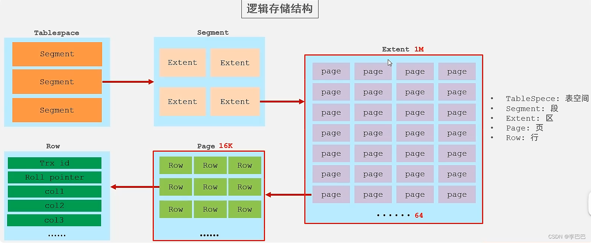


# 索引

数据库的**索引 (Index)**

你可以把数据库索引想象成**一本书的目录**。

- 如果没有目录，你要找书中某一个特定的知识点，只能从第一页开始一页一页地翻（这叫做**全表扫描**），效率极低。
- 而有了目录，你可以通过知识点名称（**键**）快速定位到它所在的页码（**磁盘地址**），然后直接翻到那一页。

索引就是这样一种帮助数据库**快速查找和排序数据**的数据结构。


## 结构

- **B+Tree 索引**：**最常用、最核心**的索引类型。InnoDB 和 MyISAM 存储引擎的默认索引。
    - **特点**：
        - 树形结构，矮胖，层级低，通常只需要很少的几次磁盘 I/O 就能找到数据。
        - 数据都存储在**叶子节点**，且叶子节点之间通过指针相连，形成一个双向链表，非常适合范围查询（如 `WHERE id > 100`）。
- **哈希索引 (Hash Index)**：
    - **特点**：
        - 基于哈希表实现，只能进行等值查询（`=`、`IN`），**无法进行范围查询**。
        - 检索速度非常快，理论上为 O(1)。
    - **InnoDB 的自适应哈希索引**：InnoDB 引擎会监控对表上索引的查询，如果发现某个值被频繁访问，它会在内存中基于 B-Tree 索引的键值再构建一个哈希索引，以提升查询速度。这是一个自动的、内部的行为。
- **全文索引 (Full-Text Index)**：
    - **特点**：用于快速查找文本中的关键字，类似于搜索引擎。适用于 `MATCH ... AGAINST` 操作。
- **R-Tree 索引（空间索引）**：
    - **特点**：主要用于地理空间数据类型（如 `GEOMETRY`），支持地图、位置等查询。

### B+Tree Index

**B+Tree 索引**是现代关系型数据库（如 MySQL InnoDB、PostgreSQL）索引结构的绝对核心。

#### 为什么是 B+Tree？—— 要解决的问题

数据库数据存储在磁盘上，磁盘 I/O（即从磁盘读取数据到内存）是耗时最大的操作。因此，索引的核心设计目标就是：**尽量减少磁盘 I/O 次数**。

B+Tree 就是为了在磁盘这种块设备上高效查找而量身定制的数据结构。它是对 **B-Tree** 的一个优化变种。

#### B-Tree

**BTree**（B 树）是一种**自平衡的多路搜索树**，广泛应用于数据库索引、文件系统等场景，尤其适合磁盘存储系统。它的设计目标是减少磁盘 I/O 操作，提高大数据量下的查询效率。

1. **多路平衡**
    - 不同于二叉树（每个节点最多 2 个子节点），BTree 的每个节点可以有多个子节点（通常称为 **“阶”**，如 m 阶 BTree 每个节点最多有 m 个子节点）。
    - 所有叶子节点位于同一层，保证树的高度平衡，查询效率稳定。
2. **节点存储结构**
    - 每个非叶子节点存储 **关键字（key）** 和 **子节点指针**，关键字按升序排列。
    - 假设一个 m 阶 BTree 的节点有`k`个关键字，则子节点数为`k+1`，且满足：`⌈m/2⌉ - 1 ≤ k ≤ m - 1`（保证节点不会过空或过满）。
3. **查询效率**
    - 查找、插入、删除操作的时间复杂度均为 `O(log n)`，其中`n`为数据总量。
    - 树的高度较低（相比二叉树），可显著减少磁盘 I/O 次数（磁盘访问成本远高于内存操作）。


上图分析：

#### B+Tree

1. **数据存储位置**
    - BTree：非叶子节点和叶子节点都存储数据（关键字 + 值或指针）。
    - B+Tree：**仅叶子节点存储实际数据**，非叶子节点只存储关键字（作为索引引导），不存储具体值。
2. **叶子节点的连接方式**
    - B+Tree 的所有叶子节点通过**单向链表**连接（InnoDB中的优化为了双向链表），形成一个有序链表，极大优化范围查询效率。
    - BTree 叶子节点之间无连接，范围查询需频繁回溯父节点。


| 特性             | **B-Tree**                                           | **B+Tree**                                                   | **对比分析与优势**                                           |
| :--------------- | :--------------------------------------------------- | :----------------------------------------------------------- | :----------------------------------------------------------- |
| **数据存储位置** | **所有节点**（包括非叶子节点）都可以存储数据指针。   | **仅叶子节点**存储数据指针（或完整数据行）。                 | **B+Tree 胜**：非叶子节点不存数据，**一个磁盘页（节点）能容纳的键更多**，导致树更**矮胖**，**查询的 I/O 次数更少**。 |
| **叶子节点链接** | 叶子节点之间**没有**相互链接。                       | 所有叶子节点通过指针**串联成一个有序双向链表**。             | **B+Tree 胜**：这是**范围查询性能**的关键。只需找到起点，然后沿链表遍历即可，**效率极高**。B-Tree 做范围查询需要在树中来回穿梭，性能差。 |
| **查询性能**     | 等值查询可能在任何一层找到数据，查询速度**不稳定**。 | **任何查询都必须走到叶子节点**，速度**非常稳定**，总是 O(log N)。 | **B+Tree 胜**：稳定性对数据库更重要。且由于树更矮，平均性能更好。 |
| **全表扫描**     | 需要对整棵树进行**中序遍历**，过程复杂。             | 相当于**遍历一个有序链表**（叶子节点链表），极其高效。       | **B+Tree 胜**：对于需要频繁全表扫描或范围扫描的数据库操作来说，这是巨大优势。 |
| **空间利用率**   | 非叶子节点也存储数据，空间利用率相对较低。           | 非叶子节点只存键，不存数据，**空间利用率更高**。             | **B+Tree 胜**：更高的空间利用率同样有助于降低树高。          |


### Hash Index

哈希索引的核心是使用一个**哈希函数 (Hash Function)**。

1. **对索引列计算哈希码**：当存储一行数据时，系统会对索引列的值（如 `user_id`）应用一个哈希函数（如 MD5、CRC64 或数据库自研的函数），计算出一个固定长度的**哈希值 (Hash Value)** 或**哈希码 (Hash Code)**。
2. **存储哈希值与指针**：这个哈希值并不直接代表数据存储的位置（比如第几页）。实际上，数据库会在内存或磁盘中维护一个**哈希表 (Hash Table)**。这个表将计算出的哈希值映射到对应数据行的实际存储地址（指针）。
3. **查找过程**：
    - 当根据索引列进行查询时（如 `WHERE user_id = 123`），数据库会**使用相同的哈希函数**对查询值 `123` 进行计算，得到其哈希值 `H1`。
    - 然后，它直接在哈希表中查找这个哈希值 `H1`。
    - 如果找到，就根据其中存储的指针，**一次定位**到磁盘上确切的物理位置，取出数据。

这个过程非常直接，理想情况下其时间复杂度是 **O(1)**，即常数时间，与数据量大小无关。

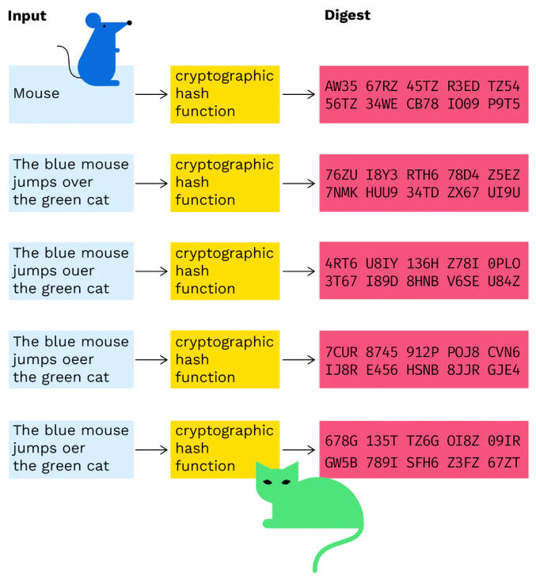

#### 优缺点

优点：

1. **极高的等值查询速度**：这是它最大的优势。对于**精确的等值查询**（`=`, `IN`），速度极快，理论上一次查找就能定位数据，效率远高于需要从树根遍历到树叶的 B+Tree。

缺点：

1. **无法支持范围查询**：这是它最致命的缺点。哈希索引中的数据是**完全无序**的（哈希函数的目的就是产生分散、随机的值）。
    - 它无法进行 `>`、`<`、`BETWEEN` 等范围查询。
    - 同样，`ORDER BY` 排序操作也无法利用哈希索引。
2. **不支持部分索引列查询（最左前缀原则）**：哈希索引计算哈希值时，需要**使用索引列的全部值**。它不支持像 B+Tree 那样使用组合索引的最左前缀。例如，一个在 `(last_name, first_name)` 上的哈希索引，无法只通过 `last_name` 来查找。
3. **哈希冲突 (Hash Collisions)**：
    - 不同的索引键值经过哈希函数计算后，可能会得到**相同的哈希值**，这就是哈希冲突。
    - 数据库必须要有方法处理冲突（例如**链地址法**，即每个哈希值对应一个链表(见下图)，存放所有产生该哈希值的键的指针）。这会在冲突发生时轻微降低性能。
4. **性能不稳定**：在极端情况下，如果大量键值发生哈希冲突，查询效率会退化为 O(N)，即需要遍历一个很长的链表。而 B+Tree 的查询效率始终是稳定的 O(log N)。


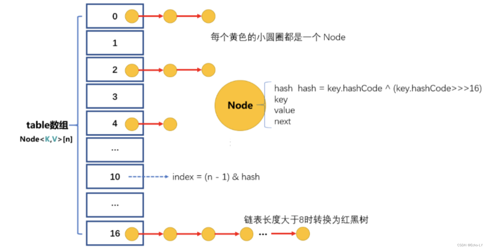


## 分类

- **聚集索引** 就像一本英文教科书的目录。

    - **目录的顺序（页码）就是书本内容的实际物理顺序。**
    - 通过目录找到页码后，翻到那一页，**内容就在那里**。

    > 在 InnoDB 中，聚集索引就是**主键 (Primary Key)**。如果没有定义主键，InnoDB 会选择一个唯一的非空索引代替。如果也没有，则会隐式创建一个 `rowid` 来作为聚集索引。
    >
    > 聚集索引是一棵 **B+Tree**。
    >
    > **叶子节点** 存储的不是指针，而是**完整的行数据 (Full Row Data)**。正因为数据和索引绑定在一起，所以称之为“聚集”。

- **二级索引** 就像这本教科书后面的 **索引**。

    - 比如，你想找所有提到 "B+Tree" 的页面，你会在索引里查到：`B+Tree: 17, 35, 89`。
    - 但这**并没有直接给你内容**，而是给了你一个**页码（主键）**。你必须再根据这个页码，**回到前面的目录（聚集索引）**，才能找到具体的内容。

    > 常见的二级索引包括：**普通索引 (INDEX)**、**唯一索引 (UNIQUE INDEX)**、**复合索引**等。
    >
    > **一个表可以有多个二级索引**。
    >
    > 二级索引也是一棵 **B+Tree**。但它的 **叶子节点** 存储的内容与聚集索引完全不同：
    >
    > 1. 该索引列的值。
    > 2. 对应的**主键值**（而不是数据行的直接磁盘地址）。
    >
    > **需要回表 (Bookmark Lookup)**：这是最关键的特点。使用二级索引查询时，数据库需要**两次查找**：
    >
    > 1. 在二级索引的 B+Tree 中查找，得到对应的**主键值**。
    > 2. 拿着这个主键值，**回到聚集索引的 B+Tree 中再查找一次**，最终获取完整的行数据。
    >     这个“回去”的过程就叫做**回表**。多出来的这次查找会有额外的性能开销。

一本书只有一个物理顺序（目录），但可以有多个索引。数据库也是如此。

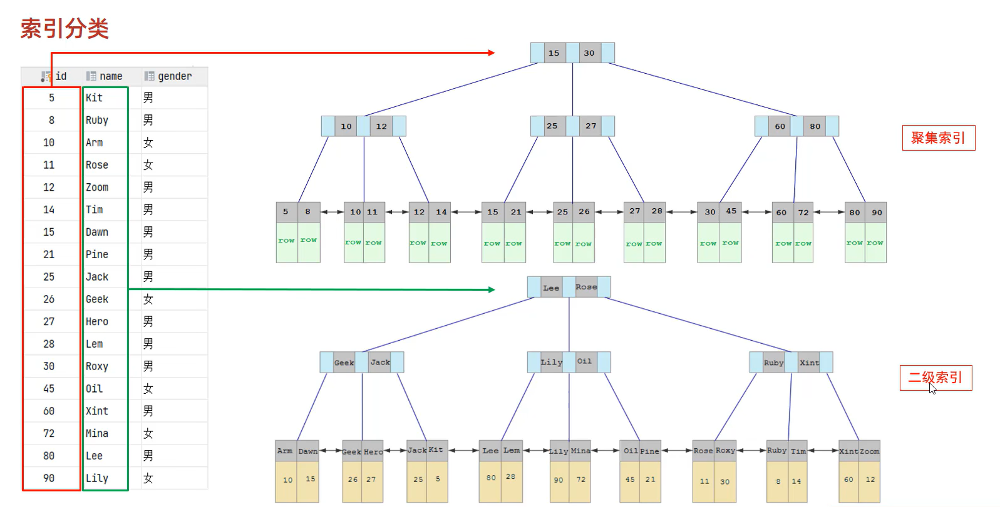


## 语法


### 创建索引

```sql
-- 1. 建表时创建索引 (CREATE TABLE)
CREATE TABLE table_name (
    column1 datatype CONSTRAINT,
    column2 datatype,
    column3 datatype,
    ...
    -- 创建主键索引 (方式一)
    PRIMARY KEY (column1),

    -- 创建唯一索引 (方式一)
    UNIQUE KEY index_name (column2),

    -- 创建普通索引 (方式一)
    KEY index_name (column3),

    -- 创建组合索引
    KEY index_name (column2, column3, ...),

    -- 创建全文索引 (适用于 MyISAM 和 InnoDB)
    FULLTEXT KEY index_name (column4)
);

-- 2. 使用 ALTER TABLE 添加索引
ALTER TABLE table_name
ADD INDEX_TYPE INDEX index_name (column1, column2, ...);

-- 3. 使用 CREATE INDEX 创建索引
CREATE INDEX_TYPE INDEX index_name
ON table_name (column1, column2, ...);
```

**INDEX_TYPE**：

1. **普通索引**：最基本的索引，没有任何限制。

    ```sql
    CREATE INDEX idx_name ON table_name (column_name);
    ```

2. **唯一索引**：索引列的值必须唯一，但允许有空值。

    ```sql
    CREATE UNIQUE INDEX idx_unique_email ON users (email);
    ```

3. **主键索引**：一种特殊的唯一索引，不允许有空值。一张表只能有一个主键。

    ```sql
    ALTER TABLE table_name ADD PRIMARY KEY (column_name);
    ```

4. **组合索引**（复合索引）：在多个列上建立的索引。

    ```sql
    CREATE INDEX idx_name_age ON users (last_name, age);
    ```

5. **全文索引**：主要用于快速检索大文本数据中的关键字，适用于 `MyISAM` 和 `InnoDB` 引擎。MySQL 5.6 之后 InnoDB 也支持了。

    ```sql
    CREATE FULLTEXT INDEX idx_content ON articles (content);
    ```

6. **前缀索引**：是指**只对字符串列的前面一部分字符创建索引**，而不是对整个字符串创建索引。因为当字段类型是字符串（像 `varchar`、`text` 这类）时，要是直接对很长的字符串建索引，索引会变得很大。

    ```sql
    -- 为 email 字段的前10个字符创建索引
    CREATE INDEX idx_email_prefix ON users (email(10));
    ```

    **如何选择前缀长度 `n`？**

    **选择性**是指不重复的索引值（也称为基数 Cardinality）与数据表记录总数的比值。

    ```sql
    -- 1. 计算完整列的选择性
    SELECT 
        COUNT(DISTINCT email) / COUNT(*) AS full_selectivity
    FROM users;
    -- 假设返回 `0.9500`（即 95% 的邮箱地址都是唯一的）。
    
    -- 计算不同前缀长度的选择性
    SELECT 
        COUNT(DISTINCT LEFT(email, 5)) / COUNT(*) AS sel5,
        COUNT(DISTINCT LEFT(email, 6)) / COUNT(*) AS sel6,
        COUNT(DISTINCT LEFT(email, 7)) / COUNT(*) AS sel7,
        COUNT(DISTINCT LEFT(email, 8)) / COUNT(*) AS sel8,
        COUNT(DISTINCT LEFT(email, 9)) / COUNT(*) AS sel9,
        COUNT(DISTINCT LEFT(email, 10)) / COUNT(*) AS sel10,
        COUNT(DISTINCT LEFT(email, 11)) / COUNT(*) AS sel11
    FROM users;
    ```

    假设结果如下：

    | sel5 | sel6 | sel7 | sel8 | sel9 | sel10 | sel11 |
    | :--- | :--- | :--- | :--- | :--- | :---- | :---- |
    | 0.65 | 0.75 | 0.82 | 0.89 | 0.92 | 0.94  | 0.95  |

​	显而易见，我们的目标是：**用最小的 `n`，获得接近完整列的选择性**。所以选10。


### 查看索引

查看某张表上已经建立了哪些索引，可以使用以下命令：

```sql
SHOW INDEX FROM table_name;
```

或者

```sql
SHOW KEYS FROM table_name;
```

**输出结果详解（重要列）：**

- `Table`: 表名
- `Non_unique`: 是否唯一。0 是唯一索引，1 是非唯一索引。
- `Key_name`: 索引的名称。如果为 `PRIMARY`，则是主键索引。
- `Seq_in_index`: 索引中的列序列号，从1开始。对于组合索引，可以看出列的顺序。
- `Column_name`: 索引的列名。
- `Collation`: 列在索引中的存储方式。`A` 表示升序，`NULL` 表示未排序。
- `Cardinality`: 基数值，**估算**索引中唯一值的数量。这个值越大，索引的选择性就越高，查询效率可能越好（需要 `ANALYZE TABLE` 更新才是准的）。
- `Index_type`: 索引类型，最常见的是 `BTREE`。

### 删除索引

同样，删除索引也有两种主要方式。

使用 `ALTER TABLE` 删除索引

```sql
ALTER TABLE table_name
DROP INDEX_TYPE INDEX index_name;
```

**示例：**

```sql
-- 删除一个普通索引或唯一索引
ALTER TABLE users DROP INDEX idx_username;

-- 删除主键索引 (较特殊)
ALTER TABLE users DROP PRIMARY KEY;
```

使用 `DROP INDEX` 删除索引

```sql
DROP INDEX index_name ON table_name;
```


## 性能分析

性能优化应遵循一个从宏观到微观的排查过程，就像金字塔一样，先解决影响面最大的问题：

**80% 的性能问题由糟糕的 SQL 和索引引起**。这是优化的首要目标。


### 慢查询日志

MySQL 内置的功能，可以记录执行时间超过指定阈值的所有 SQL 语句。**这是定位问题 SQL 的最强大工具。**

- **开启与配置** (`my.cnf`):

    ```ini
    slow_query_log = 1
    slow_query_log_file = /var/log/mysql/mysql-slow.log
    long_query_time = 2               # 单位：秒，记录超过2秒的查询
    log_queries_not_using_indexes = 1 # 记录未使用索引的查询（谨慎开启，可能日志量巨大）
    ```

- **分析工具：`mysqldumpslow`**
    日志文件是文本格式，但直接阅读困难。使用 MySQL 自带的工具分析：

    ```bash
    # 查看记录次数最多的10条慢SQL
    mysqldumpslow -s c -t 10 /var/log/mysql/mysql-slow.log
    
    # 查看平均执行时间最长的10条慢SQL
    mysqldumpslow -s at -t 10 /var/log/mysql/mysql-slow.log
    
    # 查看含有'SELECT'的慢SQL
    mysqldumpslow -g "SELECT" /var/log/mysql/mysql-slow.log
    ```

- **更强大的分析工具：`pt-query-digest` (Percona Toolkit)**
    这是业界标准，功能远超 `mysqldumpslow`。

    ```bash
    pt-query-digest /var/log/mysql/mysql-slow.log
    ```

    它会生成一份非常详细的报告，包括：

    - **最耗时的查询**
    - **执行次数最多的查询**
    - **哪些查询锁定了太久**
    - **查询的响应时间分布**


### `SHOW PROFILE` (已弃用) / `Performance Schema`

`SHOW PROFILE`: 可以查看 SQL 语句执行过程中每个步骤的耗时（如解析、优化、执行、锁等待等）。但在 MySQL 5.7 后期及 8.0 中已被标记为弃用。

> 但你也可以手动启用
>
> ```sql
> -- 查看 profiling 是否开启 (YES/NO)
> SELECT @@profiling;
> 
> -- 或者在较新版本中查看
> SHOW VARIABLES LIKE 'profiling';
> 
> -- 在当前会话中开启 profiling (设置为1)
> SET profiling = 1;
> -- 或者
> SET SESSION profiling = 1;
> ```
>
> 执行你想要分析的 SQL 语句。你可以运行多条语句，`SHOW PROFILE` 会记录它们。
>
> 查看当前会话中所有被记录的语句及其 Query_ID。
>
> ```sql
> SHOW PROFILES;
> ```
>
> 输出示例：
>
> | Query_ID | Duration   | Query                                                        |
> | :------- | :--------- | :----------------------------------------------------------- |
> | 1        | 0.00012345 | SELECT @@profiling                                           |
> | 2        | 0.45678910 | SELECT * FROM orders o INNER JOIN users u ON o.user_id ... (你的慢SQL) |
>
> 使用 `SHOW PROFILE` 命令，并指定 `Query_ID`。查看详细的性能分析结果。
>
> ```sql
> SHOW PROFILES FOR QUERY 2;


**`Performance Schema`**: 是更现代、更强大的替代方案。它提供了服务器内部运行的详细性能指标，但配置和使用较为复杂。通常用于深度诊断锁、IO、内存等问题。


### `EXPLAIN` 命令（执行计划）

#### 如何使用？

在你要分析的 `SELECT`, `DELETE`, `INSERT`, `REPLACE`, 或 `UPDATE` 语句前加上 `EXPLAIN` 关键字即可。

```sql
EXPLAIN SELECT * FROM users WHERE email = 'user@example.com';
```

#### 解读输出列

`EXPLAIN` 的输出是一个表格，包含以下关键列。我们将用一颗星（⭐）来标记最重要的列。

⭐ 1. **id** (查询标识符)

- **含义**：表示 `SELECT` 查询的序列号。通常一个 `SELECT` 一个 `id`。
- **如何解读**：
    - **`id` 相同**：执行顺序从上到下。通常出现在多表 `JOIN` 时，表示表的连接顺序。
    - **`id` 不同**：如果是子查询，`id` 会递增。`id` 值越大，优先级越高，越先执行。
    - **`id` 为 NULL**：通常表示这是一个结果集合并（如 `UNION`）后的行。

⭐ 2. **select_type** (查询类型)

- **含义**：说明了查询的类型，是简单查询还是复杂查询。
- **常见值**：
    - **`SIMPLE`**：最简单的查询，不包含子查询或 `UNION`。
    - **`PRIMARY`**：查询中若包含任何复杂的子部分，最外层的 `SELECT` 被标记为 `PRIMARY`。
    - **`SUBQUERY`**：在 `SELECT` 或 `WHERE` 列表中包含了子查询。
    - **`DERIVED`**（派生表）：在 `FROM` 子句的子查询中被标记为 `DERIVED`。MySQL 会递归执行并将结果放在一个临时表中。
    - **`UNION`**：`UNION` 中的第二个或后面的 `SELECT` 语句。
    - **`UNION RESULT`**：从 `UNION` 临时表检索结果的 `SELECT`。

3. **table** (访问的表)

- **含义**：显示这一步访问的是哪张表。
- **如何解读**：
    - 有时不是表名，可能是 `<derivedN>`（其中 N 是 id），表示这是一个派生表（子查询结果）。
    - 也可能是 `<unionM,N>`，表示这是 UNION 的结果。

4. **partitions** (匹配的分区)

- **含义**：查询匹配到的分区。如果表没有分区，则该值为 `NULL`。

⭐ 5. **type** (访问类型) — **这是最重要的列**

- **含义**：表示 MySQL 在表中找到所需行的方式，即**访问类型**。从好到坏依次是：

    - **`system`** > **`const`** > **`eq_ref`** > **`ref`** > **`fulltext`** > **`ref_or_null`** > **`index_merge`** > **`unique_subquery`** > **`index_subquery`** > **`range`** > **`index`** > **`ALL`**

- **必须掌握的几个**：

    - **`system` / `const`**：最优级别。通过主键（PRIMARY KEY）或唯一索引（UNIQUE INDEX）一次就找到一行数据。`system` 是 `const` 的特例（表里只有一行）。

        ```sql
        EXPLAIN SELECT * FROM users WHERE id = 1; -- id是主键
        ```

    - **`eq_ref`**：非常好。通常出现在使用**主键或唯一索引**进行表连接时。对于前表的每一行，后表只有一行与之匹配。

        ```sql
        EXPLAIN SELECT * FROM orders o JOIN users u ON o.user_id = u.id; -- u.id是主键
        ```

    - **`ref`**：很好。使用**非唯一索引**进行查找，或者使用了索引的**最左前缀**规则。可能返回多行。

        ```sql
        EXPLAIN SELECT * FROM users WHERE email = 'test@example.com'; -- email上有普通索引
        ```

    - **`range`**：好。使用索引检索**给定范围**的行。`WHERE` 子句中出现了 `BETWEEN`, `<`, `>`, `IN()`, `LIKE 'prefix%'` 等操作。

        ```sql
        EXPLAIN SELECT * FROM users WHERE age > 20; -- age上有索引
        ```

    - **`index`**：一般。扫描了整个**索引树**（比全表扫描快，因为索引文件通常比数据文件小）。通常发生在`覆盖索引`（只需要读索引，不需要回表）或全索引扫描排序时。

    - **`ALL`**：**最差**。**全表扫描**（Full Table Scan）。意味着MySQL必须从头到尾扫描整张表来找到匹配的行。**这是必须要优化的信号！**

6. **possible_keys** (可能用到的索引)

- **含义**：查询时**可能**使用到的索引。注意，这个列表中的索引不一定真正被使用。

⭐ 7. **key** (实际使用的索引)

- **含义**：查询时**实际**使用的索引。如果为 `NULL`，则说明没有使用索引。
- **注意**：有可能 `key` 列显示的索引不在 `possible_keys` 列中。这意味着优化器基于成本考虑，选择了一个更优的索引，而不是开发者直观认为的索引。

8. **key_len** (使用的索引长度)

- **含义**：表示索引中使用的字节数。可通过该值计算查询中使用的索引部分（对于组合索引非常有用）。
- **如何解读**：长度越短越好。如果是组合索引，`key_len` 显示了MySQL实际使用了索引的哪些部分。

9. **ref** (索引的引用)

- **含义**：显示 `key` 列记录的索引中，表查找值所用到的列或常量。
- **常见值**：
    - `const`：常量值，如 `WHERE column = 'constant'`。
    - 列名：表示使用另一表的列来匹配。
    - `func`：表示使用了函数。

⭐ 10. **rows** (预估扫描行数)

- **含义**：MySQL **估算**为了找到所需的行而**需要读取的行数**。这是一个预估值，不一定准确，但非常重要。
- **如何解读**：**值越小越好**。如果值很大，说明查询效率低下，可能需要优化索引。

⭐ 11. **filtered** (按条件过滤的百分比)

- **含义**：表示存储引擎返回的数据在服务器层过滤后，剩下的满足查询的记录数量的**百分比估算**。
- **如何解读**：`rows * filtered / 100` 可以估算出将要与前表连接的行数。值越大越好。

12. **Extra** (额外信息) — **包含重要细节**

- **含义**：包含不适合在其他列显示的额外信息，但**非常重要**。
- **常见的重要值**：
    - **`Using index`**：**好现象**。表示查询使用了**覆盖索引**（Covering Index），即所有需要的数据都可以从索引中获取，无需回表读取数据行。
    - **`Using where`**：表示 MySQL 服务器在存储引擎**拿到行之后进行了过滤**。不是所有带 `WHERE` 的查询都有这个。
    - **`Using temporary`**：**坏现象**。表示查询需要创建临时表来保存中间结果。常见于排序 (`ORDER BY`) 和分组 (`GROUP BY`) 操作。**需要优化**。
    - **`Using filesort`**：**坏现象**。表示 MySQL 无法利用索引完成排序，而是使用了外部排序。**需要优化**（为 `ORDER BY` 或 `GROUP BY` 子句创建合适的索引）。
    - **`Using join buffer`**：表示连接查询时，无法使用索引，需要用到连接缓冲区。
    - **`Impossible WHERE`**：`WHERE` 子句的值总是 `false`，无法获取任何行。


## 规则


### 最左前缀匹配原则 (Leftmost Prefix Principle)

这是**组合索引最重要、最核心的规则**。

- **规则**：MySQL 会一直向右匹配索引中的列，直到遇到**范围查询**（`>`, `<`, `BETWEEN`, `LIKE`）就停止匹配。**查询时索引最左边的字段必需存在，才会使用索引。**
- **示例**：假设有组合索引 `idx_name_age_sex (name, age, sex)`
    - `WHERE name = 'Alice'` ✅ **使用索引** (匹配第1列)
    - `WHERE name = 'Alice' AND age = 25` ✅ **使用索引** (匹配第1,2列)
    - `WHERE name = 'Alice' AND age = 25 AND sex = 'M'` ✅ **使用索引** (匹配所有列)
    - `WHERE age = 25 AND sex = 'M'` ❌ **不使用索引** (违反最左前缀，跳过了 `name`)
    - `WHERE name = 'Alice' AND sex = 'M'` ⚠️ **部分使用索引** (只使用了 `name` 列，因为跳过了 `age`，`sex` 无法被使用)

### 覆盖索引 (Covering Index)

- **规则**：如果一个索引包含（或者说覆盖）了所有需要查询的字段的值，MySQL 就无需**回表**（无需根据主键ID再去数据文件中查找整行），只需读取索引文件即可返回结果。这极大地提升性能。
- **示例**：表 `users` 有 `(id PK, name, age)`，索引 `idx_name_age (name, age)`
    - `SELECT name, age FROM users WHERE name = 'Alice'` ✅ **覆盖索引**。只需查索引，无需回表。
    - `SELECT * FROM users WHERE name = 'Alice'` ❌ **不是覆盖索引**。`SELECT *` 需要获取所有列，索引中没有的数据需要回表查询。

### 索引下推 (Index Condition Pushdown, ICP) - MySQL 5.6+

- **规则**：在存储引擎层过滤掉不满足条件的记录，**减少回表次数**。
- **示例**：索引 `idx_name_age (name, age)`，查询 `WHERE name LIKE 'A%' AND age = 20`
    - **无ICP**：存储引擎根据 `name LIKE 'A%'` 找到所有记录并回表，再由 Server 层过滤 `age = 20`。
    - **有ICP**：存储引擎根据 `name LIKE 'A%'` 找到记录后，**直接在存储引擎层用 `age=20` 进行过滤**，只将过滤后的记录回表。大大减少了回表次数。

### 其他索引失效情况

- **范围查询**：复合索引（多列索引）中，若某一列使用了范围查询（`>`, `<`, `BETWEEN`, `IN`），则**该列右侧的所有索引列无法被利用**。

    > **例**：复合索引 `(a, b, c)` 
    >
    > - 有效：`WHERE a=1 AND b>2 AND c=3`（仅 `a` 和 `b` 能用到索引，`c` 失效）
    >
    > - 无效：`WHERE a>1 AND b=2 AND c=3`（仅 `a` 能用到索引，`b` 和 `c` 失效）
    >
    > **规避**：在业务允许的情况下，尽量使用`>=`或`<=`

- **列运算**：不要在索引列进行运算操作，否则索引将失效。

    ```sql
    -- 错误写法（索引失效）
    SELECT * FROM orders WHERE YEAR(create_time) = 2023;
    -- 优化
    WHERE create_time >= '2023-01-01' AND create_time < '2024-01-01'

- **字符串**：字符串类型字段查询时不加引号会导致索引失效。

- **模糊匹配**：模糊查询是否使用索引，**完全取决于通配符 `%` 的位置**。尾部模糊匹配（索引有效）；头部模糊匹配（索引失效）。

- **or 连接条件**：用 or 分割开的条件，如果 or 前的条件中的列有索引，而后面的列中没有索引，那么涉及的索引都不会被用到（需要执行全表扫描）。

- **在索引列上使用 `IS NULL` 或 `IS NOT NULL`**：这取决于数据的分布。如果表中绝大多数值都是 `NULL`，查询非 `NULL` 值可能会走索引；反之亦然。优化器会根据成本决定。
- **在索引列上使用 `NOT` (!=, <>)**：很难直接优化，考虑改为 `IN()` 查询或结合业务逻辑改写。

### SQL 提示

**SQL 提示（SQL Hints）** 是嵌入在 SQL 语句中的特殊注释，用于向数据库优化器**提供建议或指令**，以影响其执行计划的选择。

- **`USE INDEX (index_name)`**：
    **建议**优化器使用指定的索引。

    ```sql
    -- 建议优化器考虑使用 idx_age 索引
    SELECT /*+ USE INDEX(table_name idx_age) */ * 
    FROM table_name 
    WHERE age > 20;
    
    -- 传统语法（也有效，但官方推荐上述注释语法）
    SELECT * FROM table_name USE INDEX(idx_age) WHERE age > 20;
    ```

- **`FORCE INDEX (index_name)`**：
    **强制**优化器使用指定的索引。其强度比 `USE INDEX` 更高。

    ```sql
    -- 强制优化器使用 idx_age 索引
    SELECT /*+ FORCE INDEX(table_name idx_age) */ * 
    FROM table_name 
    WHERE age > 20;
    
    -- 传统语法
    SELECT * FROM table_name FORCE INDEX(idx_age) WHERE age > 20;
    ```

    > **何时使用？** 当你非常确定某个索引是最优选择，但优化器固执地选择全表扫描或其他索引时。

- **`IGNORE INDEX (index_name)`**：
    **建议**优化器忽略指定的索引。

    ```sql
    -- 建议优化器忽略 idx_age 索引
    SELECT /*+ IGNORE INDEX(table_name idx_age) */ * 
    FROM table_name 
    WHERE age > 20;
    
    -- 传统语法
    SELECT * FROM table_name IGNORE INDEX(idx_age) WHERE age > 20;
    ```

    > **何时使用？** 当优化器错误地选择了一个低效的索引（例如，一个选择性很低的索引），导致性能反而下降时，可以强制它忽略该索引。


## 设计原则

1. 针对于数据量较大，且查询比较频繁的表建立索引。

2. 针对于常作为查询条件（where）、排序（order by）、分组（group by）操作的字段建立索引。

3. 尽量选择区分度高的列作为索引，**尽量建立唯一索引**，区分度越高，使用索引的效率越高。

4. 如果是字符串类型的的字段，字段的长度较长，可以针对于字段的特点，建立前缀索引。

5. **尽量使用联合索引**，减少单例索引，查询时，联合索引很多时候可以覆盖索引，节省存储空间，避免回表，提高查询效率。

6. 要控制索引的数量，**索引并不是多多益善**，索引越多，维护索引结构的代价也就越大，**会影响增删改的效率**。

7. 如果索引列不能存储 NULL 值，请在创建表时使用 NOT NULL 约束它。当优化器知道每列是否包含 NULL 值时，它可以更好地确定哪个索引最有效地用于查询

    


# 语句优化


## 插入数据


### 批量插入 (Batch Insert)

这是最重要的优化手段。不要使用单条 `INSERT` 语句，而是将多条数据合并为一条 `INSERT` 语句。

- **不推荐 (性能极差):**

    ```sql
    INSERT INTO table_name (col1, col2) VALUES ('value1', 'value2');
    INSERT INTO table_name (col1, col2) VALUES ('value3', 'value4');
    INSERT INTO table_name (col1, col2) VALUES ('value5', 'value6');
    ...
    ```

    每执行一次 `INSERT`，都需要与数据库进行一次完整的网络通信（如果应用和数据库分离）、语法解析、索引更新等开销。

- **强烈推荐 (性能极佳):**

    ```sql
    INSERT INTO table_name (col1, col2) VALUES 
    ('value1', 'value2'),
    ('value3', 'value4'),
    ('value5', 'value6'),
    ...;
    -- 例如，一次插入 100 到 1000 条
    ```

    **优点:** 大幅减少网络 round-trips、SQL 解析开销，事务日志刷写次数也更少。
    **建议批量大小:** 通常建议每批 500-1000 条数据。太大可能会超过 `max_allowed_packet` 参数限制，导致错误。

### 禁用和启用索引 (针对大量数据插入)

当你需要导入海量数据（例如 10W+ 条）时，先删除索引，插入数据后再重建索引，比逐条维护索引要快得多。

- **操作步骤:**
    1. `ALTER TABLE table_name DROP INDEX index_name;` -- 删除非唯一索引
    2. 执行批量插入操作。
    3. `ALTER TABLE table_name ADD INDEX index_name (column_name);` -- 重建索引
- **注意:**
    - 主键和唯一索引不能随意删除，需确保数据不会违反唯一性约束。
    - 此方法在**空表或准备大规模刷新数据**时效果最显著。

### 使用事务

将多个插入操作包裹在一个事务中，可以大幅提升性能。

- **不推荐 (每条语句都自动提交):**

    ```sql
    -- Autocommit = 1 (默认模式)
    INSERT INTO ... VALUES (...);
    INSERT INTO ... VALUES (...); -- 每次插入都立即磁盘刷写
    ```

- **推荐:**

    ```sql
    START TRANSACTION;
    INSERT INTO table_name ... VALUES (...);
    INSERT INTO table_name ... VALUES (...);
    ... -- 成千上万次插入
    COMMIT; -- 所有操作完成后一次性刷写磁盘
    ```

    **原理:** 在一个事务内，InnoDB 只需要在 `COMMIT` 时进行一次磁盘 I/O（重做日志刷写），而不是每次插入都刷写。

### LOAD DATA INFILE (终极速度)

如果一次性需要插入大批量数据，使用 insert 语句插入性能较低，此时可以使用 MySQL 数据库提供的 load 指令进行插入。

客户端连接服务端时，加上参数 --local-infile

```sql
mysql --local-infile -u root -p
```


设置全局参数 local_infile 为 1，开启从本地加载文件导入数据的开关

```sql
set global local_infile = 1;
```


执行 load 指令将准备好的数据，加载到表结构中

```sql
LOAD DATA INFILE '/path/to/your/data.csv'
INTO TABLE table_name
FIELDS TERMINATED BY ',' -- 字段分隔符，CSV 文件常用逗号
ENCLOSED BY '"'         -- 字段引用符
LINES TERMINATED BY '\n' -- 行终止符
IGNORE 1 ROWS;          -- 忽略第一行标题
```


## 主键优化

- 满足业务需求的情况下，尽量**降低主键的长度**。
- 插入数据时，尽量选择顺序插入，选择使用 AUTO_INCREMENT 自增主键，避免**页分裂**。
- 尽量不要使用 UUID 做主键或者是其他自然主键，如身份证号，避免**页分裂**。
- 业务操作时，避免对主键的修改。

### 页分裂

**页分裂** 发生在当一个新的行记录需要插入到一个**已满**的页中，并且根据索引规则，新数据必须插入到这个页的**中间某个位置**，而不能简单地追加到页尾时。

为了给新数据腾出空间，InnoDB 必须执行一个昂贵的操作：**将大约一半的内容从已满的页移动到一个新创建的页中**。这个过程就叫做**页分裂**。

页可以为空，也可以填充一半，也可以填充 100%。每个页包含了 2 - N 行数据 (如果一行数据多大，全行溢出)，根据主键排列。

### 页合并

当删除一行记录时，实际上记录并没有被物理删除，只是记录被标记（flaged）为删除并且它的空间变得允许被其他记录声明使用。

当页中删除的记录达到 MERGE_THRESHOLD（默认为页的 50%），InnoDB 会开始寻找最靠近的页（前或后）看看是否可以将两个页合并以优化空间使用。


## ORDER BY 优化

优化的目标是让 MySQL **直接利用索引的有序性**来返回数据，从而避免额外的排序步骤`using filesort`。

- 根据排序字段建立合适的索引，多字段排序时，也遵循最左前缀法则。
- 尽量使用覆盖索引。
- 多字段排序，一个升序一个降序，此时需要注意联合索引在创建时的规则（ASC/DESC）。
- 如果不可避免的出现 filesort，大数据量排序时，可以适当增大排序缓冲区大小 sort_buffer_size (默认 256K)。

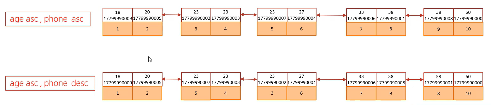

### `using filesort`

通过表的索引或全表扫描，读取满足条件的数据行，然后在排序缓冲区 sort buffer 中完成排序操作，所有不是通过索引直接返回排序结果的排序都叫 Filesort 排序。

### `using index`

通过有序索引顺序扫描直接返回有序数据，这种情况即为 using index，不需要额外排序，操作效率高。


## GROUP BY 优化

- 在分组操作时，可以通过索引来提高效率。
- 分组操作时，索引的使用也是满足最左前缀法则的。


## LIMIT 优化

一个常见又非常头疼的问题就是 `limit 2000000,10`，此时需要 MySQL 排序前 2000010 记录，仅仅返回 2000000 - 2000010 的记录，其他记录丢弃，查询排序的代价非常大。

**优化思路**：一般分页查询时，通过创建覆盖索引能够比较好地提高性能，可以通过覆盖索引加子查询形式进行优化。

```sql
SELECT * FROM articles ORDER BY created_time DESC LIMIT 1000000, 20;

-- 创建覆盖索引
CREATE INDEX idx_created_time ON articles (created_time DESC);

-- 重写查询（延迟关联）
SELECT a.*
FROM articles AS a
INNER JOIN (
    -- 子查询：利用覆盖索引，只快速找出需要的主键
    SELECT id
    FROM articles
    ORDER BY created_time DESC
    LIMIT 1000000, 20 -- 这里的offset很大，但因为只查id，索引覆盖，速度飞快
) AS tmp ON a.id = tmp.id -- 主查询：用20个明确的主键值快速回表查询所有列
ORDER BY created_time DESC; -- 保持顺序
```


## COUNT 优化

- `count（主键）`
    InnoDB 引擎会遍历整张表，把每一行的主键 id 值都取出来，返回给服务层。服务层拿到主键后，直接按行进行累加 (主键不可能为 null)。
- `count（字段）`
    没有 not null 约束：InnoDB 引擎会遍历整张表把每一行的字段值都取出来，返回给服务层，服务层判断是否为 null，不为 null，计数累加。
    有 not null 约束：InnoDB 引擎会遍历整张表把每一行的字段值都取出来，返回给服务层，直接按行进行累加。
- `count（1）`
    InnoDB 引擎遍历整张表，但不取值。服务层对于返回的每一行，放一个数字 “1” 进去，直接按行进行累加。
- `count（*）`
    InnoDB 引擎并不会把全部字段取出来，而是专门做了优化，不取值，服务层直接按行进行累加。

**按照效率排序的话，count (字段) < count (主键 id) < count (1) = count (\*)，所以尽量使用 count (*)。**


## UPDATE 优化

- 为 WHERE 条件建立有效的索引，这是避免全表扫描和锁升级的关键。InnoDB的行锁是针对索引加的锁，不是针对记录加的锁，并且该索引不能失效，否则会从行锁升级为表锁。

```sql
UPDATE student SET no = '2000100100' WHERE id = 1;
-- 如果name没有索引，会从行锁升级为表锁
UPDATE student SET no = '2000100105' WHERE name = '韦一笑';
```


# 存储对象

MySQL 中的三大程序化数据库对象：视图、存储过程和触发器。

## 视图

视图是一个虚拟表，其内容由查询定义。它不存储数据本身，而是存储查询逻辑。

作用：

- 简单
    视图不仅可以简化用户对数据的理解，也可以简化他们的操作。那些被经常使用的查询可以被定义为视图，从而使得用户不必为以后的操作每次指定全部的条件。
- 安全
    数据库可以授权，但不能授权到数据库特定行和特定的列上。通过视图用户只能查询和修改他们所能见到的数据。
- 数据独立
    视图可帮助用户屏蔽真实表结构变化带来的影响。

### 创建视图

```sql
-- 创建简单视图
CREATE VIEW vw_customer_orders AS
SELECT 
    c.customer_id,
    c.first_name,
    c.last_name,
    o.order_date,
    o.total_amount
FROM customers c
JOIN orders o ON c.customer_id = o.customer_id;

-- 创建带条件的视图
CREATE VIEW vw_high_value_orders AS
SELECT *
FROM orders
WHERE total_amount > 1000;
```

### 使用视图

```sql
-- 像普通表一样查询视图
SELECT * FROM vw_customer_orders WHERE last_name LIKE '张%';

-- 视图的视图
CREATE VIEW vw_recent_high_orders AS
SELECT * FROM vw_high_value_orders 
WHERE order_date > '2024-01-01';
```

### 修改和删除视图

```sql
-- 修改视图（使用 CREATE OR REPLACE）
CREATE OR REPLACE VIEW vw_customer_orders AS
SELECT 
    c.customer_id,
    c.first_name,
    c.last_name,
    c.email,  -- 新增字段
    o.order_date,
    o.total_amount
FROM customers c
JOIN orders o ON c.customer_id = o.customer_id;

-- 删除视图
DROP VIEW IF EXISTS vw_customer_orders;
```

### 视图更新

对视图执行**更新**操作时，**修改的是视图所基于的底层基表（Base Table）**，而不是视图本身。

要使视图可更新，视图中的行与基础表中的行之间必须存在**一对一的关系**。如果视图包含以下任何一项，则该视图不可更新：

1. 聚合函数或窗口函数（SUM ()、MIN ()、MAX ()、COUNT () 等）
2. DISTINCT
3. GROUP BY
4. HAVING
5. UNION 或者 UNION ALL

### 检查选项

没有检查选项时，可能会出现数据不一致的问题：

```sql
-- 创建没有检查选项的视图
CREATE VIEW vw_active_users AS
SELECT * FROM users WHERE status = 'active';

-- 可以通过视图插入不符合条件的数据
INSERT INTO vw_active_users (name, status) 
VALUES ('John', 'inactive'); -- 这会被插入，但视图查不到
```

#### 级联检查选项

最严格的选项，要求所有底层视图都满足条件。

```sql
-- 创建带级联检查的视图
CREATE VIEW vw_active_hr_users AS
SELECT * FROM vw_hr_users WHERE status = 'active'
WITH CASCADED CHECK OPTION;
```

#### 本地检查选项

相对宽松，只检查当前视图的条件。

```sql
-- 创建带本地检查的视图
CREATE VIEW vw_active_hr_users_local AS
SELECT * FROM vw_hr_users WHERE status = 'active'
WITH LOCAL CHECK OPTION;
```


## 存储过程

存储过程是一种在数据库中预编译并存储的一组 SQL 语句的集合。它可以被视为数据库中的一种函数，用于执行复杂的操作、封装业务逻辑、减少网络传输并提高性能。

### 基本语法

#### 创建存储过程

```sql
DELIMITER //

CREATE PROCEDURE procedure_name (
    [IN | OUT | INOUT] parameter_name parameter_type [(length)], ...
)
[characteristic ...]
BEGIN
    -- 存储过程的主体，包含SQL语句和逻辑
END //

DELIMITER ;
```

**关键点解释：**

- **DELIMITER //**： 更改语句结束符。因为存储过程主体中包含多个以 `;` 结尾的 SQL 语句，临时将结束符改为 `//`（或其他符号），以便 MySQL 能将整个存储过程作为一个整体来解析。

- **CREATE PROCEDURE**： 创建存储过程的关键字。
- **参数模式**：
    - **IN** (默认)： 输入参数，调用者将值传入存储过程。存储过程内部对其修改不会影响外部变量。
    - **OUT**： 输出参数，存储过程内部可修改其值，并将结果返回给调用者。调用时传入的变量值会被忽略。
    - **INOUT**： 兼具 IN 和 OUT 的功能，调用者传入值，存储过程可修改并将其返回。
- **BEGIN ... END**： 定义存储过程的代码块。
- **DELIMITER ;**： 将语句结束符恢复为默认的 `;`。

#### 调用存储过程

```sql
CALL procedure_name([parameter, ...]);
```

#### 删除存储过程

```sql
DROP PROCEDURE [IF EXISTS] procedure_name;
```

### 变量

#### 系统变量

可以是全局的（GLOBAL）、会话级的（SESSION），或两者兼有。

```sql
-- 查看所有会话变量（默认是SESSION）
SHOW VARIABLES;
SHOW SESSION VARIABLES;

-- 查看所有全局变量
SHOW GLOBAL VARIABLES;

-- 使用LIKE子句模糊查找变量（非常常用）
SHOW GLOBAL VARIABLES LIKE '%timeout%';
SHOW SESSION VARIABLES LIKE 'character_set%';

-- 查看特定变量的值
SELECT @@GLOBAL.max_connections;
SELECT @@SESSION.sql_mode;
SELECT @@sql_mode; -- 默认是SESSION作用域
```

动态设置系统变量：

这种方式在服务器运行时立即生效，但**服务器重启后会失效**，恢复为配置文件中的设置或默认值。

```sql
-- 设置全局变量（需要相应权限）
SET GLOBAL max_connections = 500;
SET @@GLOBAL.max_connections = 500;

-- 设置会话变量（只影响当前连接）
SET SESSION sql_mode = 'STRICT_TRANS_TABLES';
SET @@SESSION.sql_mode = 'STRICT_TRANS_TABLES';
SET sql_mode = 'STRICT_TRANS_TABLES'; -- SESSION是默认作用域

-- 同时将全局值设置为新值，并影响当前会话的值
SET PERSIST max_connections = 1000;
```

在**存储过程**中，可以使用用户变量和局部变量。

#### 用户变量 (Session变量)

以 `@` 开头，在会话期间有效。

```sql
SET @my_var = 10;
```

#### 局部变量

在 `BEGIN ... END` 块中声明和使用，使用 `DECLARE` 关键字。

```sql
DECLARE variable_name datatype [DEFAULT default_value];
```

**示例：**

```sql
DECLARE total_count INT DEFAULT 0;
SET total_count = 100;
```

### 控制流语句

存储过程支持丰富的流程控制语句，使其能够实现复杂的逻辑。

- **IF 语句**:

    ```sql
    IF condition THEN
        statements;
    ELSEIF condition THEN
        statements;
    ELSE
        statements;
    END IF;
    ```

- **CASE 语句**:

    ```sql
    CASE case_value
        WHEN value1 THEN statements;
        WHEN value2 THEN statements;
        ...
        ELSE statements;
    END CASE;
    ```

- **循环语句**:

    - **WHILE**:

        ```sql
        WHILE condition DO
            statements;
        END WHILE;
        ```

    - **REPEAT** (类似 do-while):

        ```sql
        REPEAT
            statements;
        UNTIL condition
        END REPEAT;
        ```

    - **LOOP** (需要手动退出):

        ```sql
        my_loop: LOOP
            statements;
            IF condition THEN
                LEAVE my_loop; -- 退出循环
            END IF;
        END LOOP my_loop;
        ```

### 一个完整的示例

假设我们有一个 `employees` 表，现在要创建一个存储过程来根据部门调整薪资，并返回受影响的行数。

**表结构:**

```sql
CREATE TABLE employees (
    id INT PRIMARY KEY,
    name VARCHAR(100),
    department VARCHAR(50),
    salary DECIMAL(10, 2)
);
```

**存储过程：给指定部门的员工加薪，并返回受影响人数**

```sql
DELIMITER //

CREATE PROCEDURE raise_salary(
    IN dept_name VARCHAR(50),
    IN raise_amount DECIMAL(10, 2),
    OUT affected_rows INT
)
BEGIN
    -- 声明一个局部变量来存储更新前的计数（可选，用于演示）
    DECLARE old_count INT;

    -- 获取更新前该部门的人数
    SELECT COUNT(*) INTO old_count FROM employees WHERE department = dept_name;

    -- 执行更新操作
    UPDATE employees
    SET salary = salary + raise_amount
    WHERE department = dept_name;

    -- 获取被更新的行数（受影响的行数）并赋给输出参数
    SELECT ROW_COUNT() INTO affected_rows;

    -- 你也可以做一些其他逻辑，比如记录日志等
    -- IF affected_rows > 0 THEN ... END IF;

END //

DELIMITER ;
```

**调用存储过程：**

```sql
-- 假设有一个变量接收输出参数
SET @affected = 0;
-- 调用过程，给 'IT' 部门的员工每人加薪 500
CALL raise_salary('IT', 500.00, @affected);
-- 查看受影响的行数
SELECT @affected AS 'Employees Updated';
```

### 查看和删除存储过程

- **查看所有存储过程**：

    ```sql
    SHOW PROCEDURE STATUS [LIKE 'pattern'];
    ```

- **查看存储过程的定义**：

    ```sql
    SHOW CREATE PROCEDURE procedure_name;
    ```

- **删除存储过程**：

    ```sql
    DROP PROCEDURE IF EXISTS raise_salary;
    ```
    
    

## 触发器

触发器是数据库中的一种特殊类型的存储过程，它**自动响应**特定的数据库事件（`INSERT`, `UPDATE`, `DELETE`）而发生。你可以把它想象成一个**事件监听器**，当表发生数据变化时，它会自动执行预定义好的操作。

### 语法

```sql
DELIMITER //

CREATE TRIGGER trigger_name
{BEFORE | AFTER} {INSERT | UPDATE | DELETE} ON table_name
FOR EACH ROW -- MySQL 触发器总是行级的，这句是固定写法
[trigger_order] -- MySQL 5.7+ 支持定义多个同类触发器的执行顺序
BEGIN
    -- 触发器逻辑主体
    -- 这里可以使用 NEW 和 OLD 伪记录来访问数据
END;//

DELIMITER ;
```

- `trigger_name`：触发器的名称，在同一数据库中必须唯一。
- `BEFORE/AFTER`：指定触发器在事件之前还是之后执行。
- `INSERT/UPDATE/DELETE`：指定监听的事件类型。
- `table_name`：触发器所依附的表。
- `FOR EACH ROW`：声明这是一个行级触发器（MySQL 强制要求）。意味着受事件影响的每一行都会执行一次触发器代码。
- `trigger_order`：（可选，MySQL 5.7+）`FOLLOWS` 或 `PRECEDES` 另一个触发器名，用于定义执行顺序。
- `NEW` 和 `OLD`：**最重要的两个关键字**，用于在触发器体内访问正在处理的数据。
    - **`NEW`**：引用**即将被插入**或**已经被更新**的新数据行。（在 `INSERT` 和 `UPDATE` 触发器中可用）
    - **`OLD`**：引用**即将被更新**的旧数据行或**即将被删除**的数据行。（在 `UPDATE` 和 `DELETE` 触发器中可用）

### 示例

假设我们有两个表：

1. `employees`：员工表
2. `audit_log`：审计日志表，用于记录谁在什么时候修改了员工表。

```sql
CREATE TABLE employees (
    id INT PRIMARY KEY AUTO_INCREMENT,
    name VARCHAR(100),
    salary DECIMAL(10, 2),
    last_modified TIMESTAMP DEFAULT CURRENT_TIMESTAMP ON UPDATE CURRENT_TIMESTAMP,
    modified_by VARCHAR(100)
);

CREATE TABLE audit_log (
    id INT PRIMARY KEY AUTO_INCREMENT,
    action_type ENUM('INSERT', 'UPDATE', 'DELETE'),
    employee_id INT,
    old_salary DECIMAL(10, 2),
    new_salary DECIMAL(10, 2),
    change_time TIMESTAMP DEFAULT CURRENT_TIMESTAMP,
    changed_by VARCHAR(100)
);
```

**创建触发器：在更新员工薪资后，自动记录审计日志**

```sql
DELIMITER //

CREATE TRIGGER after_employee_update
AFTER UPDATE ON employees
FOR EACH ROW
BEGIN
    -- 只有当薪水真正发生变化时才记录日志，<> 等价 !=
    IF OLD.salary <> NEW.salary THEN
        INSERT INTO audit_log (
            action_type,
            employee_id,
            old_salary,
            new_salary,
            changed_by
        ) VALUES (
            'UPDATE',
            NEW.id, -- 使用NEW获取更新后的员工ID
            OLD.salary, -- 使用OLD获取更新前的薪水
            NEW.salary, -- 使用NEW获取更新后的薪水
            NEW.modified_by -- 假设应用程序在更新时会设置这个字段
        );
    END IF;
END;//

DELIMITER ;
```

**测试触发器：**

```sql
-- 更新一个员工的薪水
UPDATE employees
SET salary = 75000, modified_by = 'admin@company.com'
WHERE id = 123;

-- 查看审计日志是否自动生成
SELECT * FROM audit_log;
```

### 查看、删除和修改触发器

**查看触发器**

```sql
-- 查看当前数据库的所有触发器
SHOW TRIGGERS;

-- 查看特定触发器的定义
SHOW CREATE TRIGGER trigger_name;

-- 从 INFORMATION_SCHEMA 中查询
SELECT * FROM INFORMATION_SCHEMA.TRIGGERS 
WHERE TRIGGER_SCHEMA = 'your_database_name';
```

**删除触发器**

```sql
DROP TRIGGER [IF EXISTS] [schema_name.]trigger_name;
-- 示例
DROP TRIGGER IF EXISTS after_employee_update;
```

**修改触发器**

MySQL **不支持**像 `ALTER TRIGGER` 这样的命令。要修改一个触发器，你必须先删除它，然后用新的定义重新创建。


# 锁


## 全局锁

全局锁，顾名思义，就是**锁住整个数据库实例**。当你对数据库施加全局锁后，整个实例将处于一种只读状态，所有以下类型的语句都会被阻塞：DML，DDL

通常，只有**数据查询语言 (DQL)**，即 `SELECT` 语句，可以被正常执行。

### 全库逻辑备份

全局锁最主要的应用场景就是**做全库的逻辑备份**。

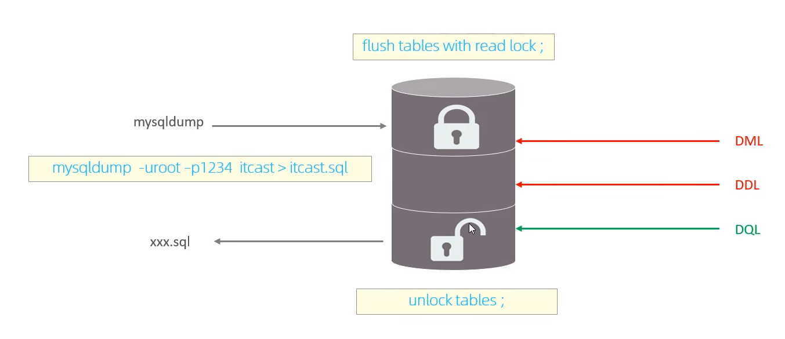

MySQL 提供了一个命令来加全局读锁：

```sql
FLUSH TABLES WITH READ LOCK;
```

这个命令通常简称为 **FTWRL**。

**执行 FTWRL 后，整个数据库实例就处于只读状态，直到你显式地释放这个锁。**

然后如图执行备份命令`mysqldump`。

释放全局锁的命令是：

```sql
UNLOCK TABLES;
```

**非常重要的一点**： 这个锁是**会话 (Session) 级别**的。也就是说：

- 你在 `Session A` 中执行了 `FTWRL`。
- 如果你断开了 `Session A` 的连接，MySQL 会自动为你释放这个锁。
- 锁的释放也必须在 `Session A` 中执行 `UNLOCK TABLES`。在 `Session B` 中执行 `UNLOCK TABLES` 是无效的。


## 表锁

表锁是 MySQL 中最基本的锁策略，也是开销最小的策略。它的特点是：**锁住整张表**。

### 读锁 vs 表锁

表锁的行为可以概括为以下矩阵：

| 当前锁模式 vs 请求锁模式 | **读锁** | **写锁** |
| :----------------------- | :------- | :------- |
| **读锁**                 | **兼容** | 不兼容   |
| **写锁**                 | 不兼容   | 不兼容   |

**解释：**

1. **读锁（共享锁 - Shared Read Lock）**：
    - **特性**：多个会话可以同时获取同一张表的读锁。
    - **效果**：所有会话都可以读该表，但**任何会话（包括持有读锁的会话）都不能写该表**。
    - **示例**：Session A 和 Session B 都可以同时给表 `t` 加读锁并执行 `SELECT`。但如果 Session A 尝试 `UPDATE t`，它会等待；如果 Session C（没有锁）尝试 `UPDATE t`，它也会被阻塞。
2. **写锁（排他锁 - Exclusive Write Lock）**：
    - **特性**：一次只有一个会话能获取某张表的写锁。
    - **效果**：只有持有写锁的会话可以**读写**该表，其他会话的**所有读写操作**都会被阻塞。
    - **示例**：Session A 给表 `t` 加了写锁。Session A 可以执行 `SELECT * FROM t` 和 `UPDATE t ...`。此时 Session B 尝试 `SELECT * FROM t` 会被阻塞，Session C 尝试 `UPDATE t` 也会被阻塞。

### 如何显式地使用表锁

MySQL 提供了命令来手动获取和释放表锁，通常用于需要避免并发干扰的特定操作场景。

**加锁语法：**

```sql
LOCK TABLES 
    table_name [READ | WRITE],
    table_name2 [READ | WRITE],
    ...;
```

**释放锁语法：**

```sql
UNLOCK TABLES; -- 释放当前会话持有的所有表锁
```

**示例 1：加读锁**

```sql
-- Session A
LOCK TABLES users READ; -- 获取 users 表的读锁
SELECT * FROM users; -- 成功
-- 在解锁前，本会话和其他会话都无法执行 INSERT/UPDATE/DELETE
UPDATE users SET name = 'foo' WHERE id = 1; -- ERROR! (即使在本会话也不行)
UNLOCK TABLES; -- 释放锁
```

**示例 2：加写锁**

```sql
-- Session A
LOCK TABLES orders WRITE; -- 获取 orders 表的写锁
DELETE FROM orders WHERE status = 'expired'; -- 成功
SELECT * FROM orders; -- 成功
-- 此时，其他会话的任何读写操作都会被阻塞
UNLOCK TABLES; -- 释放锁，其他被阻塞的操作得以继续
```

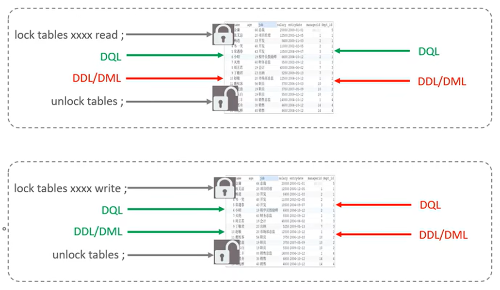


## 表锁 - 元数据锁

**元数据锁 (Metadata Lock)** 是 MySQL 自动加的一种**表级锁**，它的主要目的是**保证表结构（元数据）的一致性**，防止在查询或事务过程中，表结构被另一个会话修改，从而导致数据混乱。

你可以把它理解为表的“结构锁”。

MDL 的加锁是**完全自动**的，你无法像表锁一样手动控制。不同类型的操作会请求不同级别的 MDL。

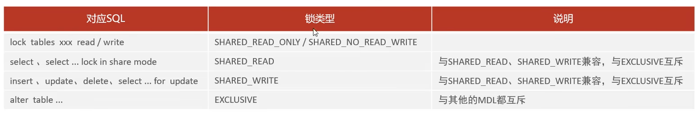

### 兼容性矩阵

| 当前锁 vs 请求锁 | **SHARED_READ** | **SHARED_WRITE** | **EXCLUSIVE** |
| :--------------- | :-------------- | :--------------- | :------------ |
| **SHARED_READ**  | ✅ **兼容**      | ✅ **兼容**       | ❌ **冲突**    |
| **SHARED_WRITE** | ✅ **兼容**      | ✅ **兼容**       | ❌ **冲突**    |
| **EXCLUSIVE**    | ❌ **冲突**      | ❌ **冲突**       | ❌ **冲突**    |

**规则解读：**

- **DML 之间是兼容的**：多个 `SELECT` 或 `INSERT` 可以同时进行，不会因为 MDL 而阻塞。
- **DDL 与所有操作都不兼容**：一个 `ALTER TABLE` 需要获取最高级别的 `EXCLUSIVE` 锁，它必须等待所有正在进行的 DML 操作释放它们的读/写锁，并且在它自己执行期间，会阻塞所有新的 DML 操作。

### 生命周期

这是理解 MDL 问题的关键：

- **对于普通语句（非事务）**：MDL 锁的持有时间是从语句开始执行到**语句结束**。
- **对于事务中的语句**：MDL 锁的持有时间是从语句开始直到**整个事务结束（COMMIT 或 ROLLBACK）**。

**这意味着：一个未提交的事务，即使它只执行了一条简单的 `SELECT \* FROM users LIMIT 1;`，它也会一直持有 `users` 表的 MDL 读锁，直到事务提交！**

### 查看 `performance_schema.metadata_locks` 表

从 MySQL 5.7 开始，`performance_schema` 提供了 `metadata_locks` 表，可以用来查看当前的元数据锁信息。

```sql
SELECT 
    OBJECT_TYPE,
    OBJECT_SCHEMA,
    OBJECT_NAME,
    LOCK_TYPE,
    LOCK_STATUS,
    OWNER_THREAD_ID,
    OWNER_EVENT_ID
FROM 
    performance_schema.metadata_locks;
```

- `OBJECT_TYPE`：锁的对象类型，如 `TABLE`、`SCHEMA` 等。
- `OBJECT_SCHEMA`：锁所属的数据库名称。
- `OBJECT_NAME`：锁所属的对象名称。
- `LOCK_TYPE`：锁的类型，如 `SHARED`（共享锁）、`EXCLUSIVE`（排他锁）等。
- `LOCK_STATUS`：锁的状态，通常是 `GRANTED` 或 `PENDING`。
- `OWNER_THREAD_ID`：持有锁的线程 ID。
- `OWNER_EVENT_ID`：持有锁的事件 ID。


## 表锁 - 意向锁

意向锁是一种**表级锁**，但它**表明了一种“意向”（Intention）**：即一个事务**打算**在表中的某些行上设置哪种类型的行锁。

它本身并不锁定任何数据行，它的存在只是为了向其他事务“宣告”自己的锁意图，从而避免繁琐的行级检查。

### 为什么需要意向锁？

要理解意向锁，首先要明白它要解决的问题。

- **InnoDB 支持行锁**：这是实现高并发的基础。
- **但也需要表锁**：用户可以通过 `LOCK TABLES ... READ/WRITE` 手动加表锁，某些 DDL 语句（如 `ALTER TABLE`）也会需要表级的元数据锁（MDL）。

现在想象一个场景：

1. 事务 A 给表中的**某一行**加了一个**行级排他锁（X Lock）**，正在修改该行。
2. 此时，事务 B 想给**整个表**加一个**表级排他锁**（比如执行 `LOCK TABLES t WRITE`）。

**问题来了**：事务 B 怎么知道现在能不能给表 `t` 加锁？
如果没有意向锁，事务 B 必须**遍历表中的每一行**，检查是否有行被其他事务锁住。对于一个有上亿行记录的表，这种检查是灾难性的，效率极低。

**意向锁就是为了解决这个“检查效率”问题而生的。**

### 分类

意向锁分为两种：

1. **意向共享锁 (Intention Shared Lock, IS)**
    - **含义**：事务**打算**给表中的某些行加**行级共享锁（S Lock）**。
    - **SQL 示例**：`SELECT ... LOCK IN SHARE MODE` 语句会在获取行级 S 锁之前，先获取该表的 IS 锁。
2. **意向排他锁 (Intention Exclusive Lock, IX)**
    - **含义**：事务**打算**给表中的某些行加**行级排他锁（X Lock）**。
    - **SQL 示例**：`SELECT ... FOR UPDATE`、`UPDATE`、`DELETE` 语句会在获取行级 X 锁之前，先获取该表的 IX 锁。

**规则**：一个事务在获取行的 S 锁或 X 锁**之前**，必须**先**获取相应表的 IS 或 IX 锁。

### 兼容矩阵

| 当前锁模式 vs 请求锁模式 | **X（表排他锁）** | **IX（意向排他）** | **S（表共享锁）** | **IS（意向共享）** |
| :----------------------- | :---------------- | :----------------- | :---------------- | :----------------- |
| **X（表排他锁）**        | ❌ 冲突            | ❌ 冲突             | ❌ 冲突            | ❌ 冲突             |
| **IX（意向排他）**       | ❌ 冲突            | ✅ 兼容             | ❌ 冲突            | ✅ 兼容             |
| **S（表共享锁）**        | ❌ 冲突            | ❌ 冲突             | ✅ 兼容            | ✅ 兼容             |
| **IS（意向共享）**       | ❌ 冲突            | ✅ 兼容             | ✅ 兼容            | ✅ 兼容             |

意向锁之间是兼容的，意向锁与相应表级锁冲突。

### 查看意向锁

意向锁是内部机制，通常不可见，但可以通过 `information_schema` 库查询（需要权限）：

```sql
SELECT 
    ENGINE_TRANSACTION_ID as trx_id,
    OBJECT_NAME as `table`,
    INDEX_NAME as `index`,
    LOCK_TYPE,
    LOCK_MODE,
    LOCK_STATUS,
    LOCK_DATA
FROM 
    performance_schema.data_locks 
WHERE 
    LOCK_TYPE = 'TABLE'; -- 筛选出表级锁（其中就包括意向锁）
```


## 行级锁

级锁是 MySQL 中**粒度最细**的锁。顾名思义，它的锁定对象是数据表中的**行记录**。

- **最大优势**：**高并发**。允许多个会话同时读写同一张表的不同行，极大减少了锁冲突。
- **存储引擎**：**仅 InnoDB 引擎支持**行级锁。MyISAM 引擎只支持表锁。
- **实现方式**：InnoDB 的行锁是通过给**索引上的索引项**加锁来实现的。这意味着：**如果查询没有使用到索引，InnoDB 将无法使用行锁，而是退化为更粗粒度的锁（锁住整个索引或表）**。

### 三种基本算法

InnoDB 的行锁并非简单锁住一行，它有三种算法，用于解决**幻读（Phantom Read）** 问题。

#### 记录锁（Record Locks）

- **作用**：锁住**单条索引记录**。

- **模式**：共享锁（S）或排他锁（X）。

    | SQL 语句                        | 行锁类型           | 说明                            |
    | :------------------------------ | :----------------- | :------------------------------ |
    | `SELECT ...`                    | **不加锁**（通常） | 一致性读（快照读），利用 MVCC。 |
    | `SELECT ... LOCK IN SHARE MODE` | **共享锁 (S)**     | 当前读，加共享锁。              |
    | `SELECT ... FOR UPDATE`         | **排他锁 (X)**     | 当前读，加排他锁。              |
    | `UPDATE ...`                    | **排他锁 (X)**     | 自动加排他锁。                  |
    | `DELETE ...`                    | **排他锁 (X)**     | 自动加排他锁。                  |
    | `INSERT ...`                    | **排他锁 (X)**     | 对新插入的记录加排他锁。        |

- **示例**：`SELECT * FROM users WHERE id = 10 FOR UPDATE;`

    - 会在 `id=10` 这条记录的索引项上加一个**排他型的记录锁（X）**。
    - 其他事务无法再对 `id=10` 这条记录进行修改或加 `FOR UPDATE` 锁。

#### 间隙锁（Gap Locks）

- **作用**：锁住一个**索引区间**，但**不包含记录本身**。即锁住一个“空隙”（Gap）。

- **目的**：防止其他事务在区间内**插入新的记录**，从而解决**幻读**问题。

- **模式**：间隙锁之间不互斥。多个事务可以同时锁住同一个间隙。它的作用只是防止插入。

- **示例**：假设 `users` 表的 `age` 字段有索引，且有年龄 10, 20, 30 的记录。

    ```sql
    -- Transaction A
    SELECT * FROM users WHERE age BETWEEN 15 AND 25 FOR UPDATE;
    ```

    - 这条语句不仅会在 `age=20` 的记录上加**记录锁（X）**。
    - 还会在区间 `(10, 20)` 和 `(20, 30)` 上加**间隙锁（Gap Lock）**。
    - **Transaction B** 尝试执行 `INSERT INTO users (age) VALUES (15);` 或 `INSERT ... (25)` 都会被**阻塞**，因为落入了被锁定的间隙。

#### 临键锁（Next-Key Locks）

- **作用**：**记录锁（Record Lock） + 间隙锁（Gap Lock）** 的组合。它锁住一条记录及其之前的间隙。
- **目的**：它是 InnoDB **默认的行锁算法**，同时解决了脏写和幻读问题。
- **示例**：同上例，`SELECT ... WHERE age BETWEEN 15 AND 25 FOR UPDATE;`
    - 默认情况下，它会为 `age=20` 的记录加上 **Next-Key Lock**，锁定的范围是 `(10, 20]`。
    - 同时，它也会为下一个区间加上 Gap Lock，防止插入，即 `(20, 30)`。
    - 所以，最终锁定的范围是 `(10, 30)`，但不包括 10 和 30 本身。

**总结三种算法：**

- **记录锁**：锁住存在的记录。
- **间隙锁**：锁住不存在的空间，防插入。
- **临键锁**：前两者的结合，是默认行为。

### 两种基本类型

在上述三种算法中，都会应用以下两种基本锁类型：

| 锁类型     | 简称       | 说明                                                       | 兼容性                               |
| :--------- | :--------- | :--------------------------------------------------------- | :----------------------------------- |
| **共享锁** | **S Lock** | 又称“读锁”。允许其他事务读，但不能写。                     | 与其他 S Lock 兼容，与 X Lock 冲突。 |
| **排他锁** | **X Lock** | 又称“写锁”。不允许其他事务读（指`FOR UPDATE`这类读）或写。 | 与所有 S Lock 和 X Lock 都冲突。     |

**兼容性矩阵：**

| 当前锁 vs 请求锁 | **S（共享锁）** | **X（排他锁）** |
| :--------------- | :-------------- | :-------------- |
| **S（共享锁）**  | ✅ 兼容          | ❌ 冲突          |
| **X（排他锁）**  | ❌ 冲突          | ❌ 冲突          |

### 显式加锁与事务

行锁的生命周期与事务绑定。

```sql
-- 开始一个事务
START TRANSACTION;

-- 显式地给某些行加排他锁（X Lock）
SELECT * FROM orders WHERE user_id = 100 AND status = 'unpaid' FOR UPDATE;

-- 检查库存、计算总价等业务逻辑...
-- 此时，其他事务无法修改或锁定这些被锁定的行。

-- 更新这些行的状态
UPDATE orders SET status = 'paid' WHERE user_id = 100 AND status = 'unpaid';

-- 提交事务，释放所有锁
COMMIT;
```

**关键点**：如果不显式地使用 `START TRANSACTION` 和 `COMMIT`，每条 SQL 语句本身就是一个独立的事务，执行完后会立即释放锁。

### 行锁的释放

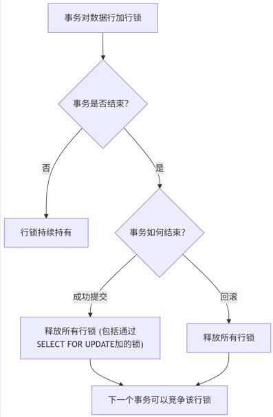


# InnoDB 引擎


## 逻辑存储结构

与物理存储（.ibd 文件）相对应，逻辑存储结构描述的是数据在表空间内的组织方式，它像一套清晰的“文件夹系统”，将数据有序地管理起来。

InnoDB 的逻辑存储结构是一个从大到小的层级体系，如下图所示：


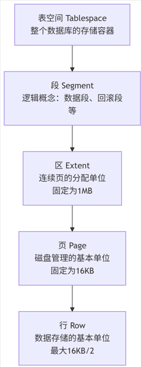

### 表空间 (Tablespace)

表空间是 InnoDB 中最高级的逻辑存储结构，也是所有数据的逻辑容器。它对应着磁盘上的一个或多个物理文件（如 `ibdata1` 或 `table.ibd`）。

**类型包括：**

- **系统表空间 (The System Tablespace)**
    - 默认文件名为 `ibdata1`。
    - 存储：**数据字典**、**Change Buffer**、**Doublewrite Buffer** 和 **Undo Logs**。
    - 如果开启 `innodb_file_per_table=OFF`，用户表的数据和索引也会存放在这里（不推荐）。
- **独立表空间 (File-Per-Table Tablespaces)**
    - 每个 InnoDB 表都有一个独立的 `.ibd` 文件。
    - 存储：该表的**数据**、**索引**和**插入缓冲位图**。
    - **强烈推荐开启**（`innodb_file_per_table=ON`），优点包括：
        - 易于管理和回收空间（`OPTIMIZE TABLE` 或 `ALTER TABLE` 可以释放空间）。
        - 备份和恢复单张表更方便（MySQL Enterprise Backup 或 `Transportable Tablespaces`）。
        - 不会导致系统表空间无限增大。
- **通用表空间 (General Tablespaces)**
    - 类似系统表空间，但由用户创建（`CREATE TABLESPACE ...`）。
    - 可以将多张表集中存储在一个共享的表空间中。
    - 用途：方便管理或为了节省内存（缓冲池页可以更高效地用于压缩表）。
- **Undo 表空间 (Undo Tablespaces)**
    - 存储 Undo Log 记录。
    - 通常有2个（默认），用于支持事务的回滚和 MVCC。
- **临时表空间 (Temporary Tablespaces)**
    - 存储用户创建的临时表和磁盘内部的临时表。
    - 对应 `ibtmp1` 文件，重启后会重新创建。

### 段 (Segment)

- 段是表空间内的主要组织结构，是一个**逻辑概念**。
- 常见的段有：
    - **数据段 (Data Segment)**： 即 **B+Tree 的叶子节点段 (Leaf Segment)**，存储了表的**实际行数据**。
    - **索引段 (Index Segment)**： 即 **B+Tree 的非叶子节点段 (Non-Leaf Segment)**，存储了表的**索引数据**（B+Tree 的分支节点）。
    - **回滚段 (Rollback Segment)**： 存储 **Undo Log** 记录。
- **注意**：一张表通常对应至少两个段：一个数据段和一个索引段。如果表上有多个索引，则每个索引都会有自己的数据段和索引段。

### 区 (Extent / Extent)

- 区是由**连续页面**组成的空间，**固定大小为 1MB**（在默认页大小为 16KB 的情况下，一个区包含 **64 个连续的页**）。
- **作用**：为了高效管理空间。当表需要分配新空间时，InnoDB 不是一次分配一页，而是直接分配一个完整的区（64页），这样可以减少随机 I/O，提升性能（顺序分配，顺序写入）。
- 这也是为什么即使是一张空表，它的 `.ibd` 文件大小也可能是 96KB 或更多，因为它已经预先分配了几个页（如段头页）甚至区。

### 页 (Page) / 块 (Block)

- 页是 InnoDB **磁盘管理的最小单元**，也是内存（缓冲池）和磁盘之间数据传输的基本单位。**默认大小为 16KB**（可通过 `innodb_page_size` 调整，但一旦数据库创建就不能更改）。
- 所有读写操作都是以页为单位进行的。缓冲池（Buffer Pool）中缓存的也是页。
- 页有很多类型，每种类型用于存储不同的内容：
    - **数据页 (B-tree Node)**： 存储行数据，是最常见的页类型。
    - **Undo 页 (Undo Log Page)**： 存储 Undo Log 记录。
    - **系统页 (System Page)**： 存储元数据信息。
    - **事务数据页 (Transaction System Page)**： 存储事务信息。
    - **插入缓冲位图页 (Insert Buffer Bitmap)**： 管理 Change Buffer。
    - **插入缓冲空闲列表页 (Insert Buffer Free List)**： 管理 Change Buffer。
    - **自适应哈希索引页 (Adaptive Hash Index)**： 存储 AHI。
    - **锁信息页 (Lock System Page)**： 存储锁信息（在内存中）。

### 行 (Row)

- 行是 InnoDB 中**数据存储的最小逻辑单元**，即我们表中的一行记录。
- InnoDB 是**行存储引擎**，数据是按行存储在页中的。
- **行格式 (Row Format)**： 一行数据如何存储在页中是由**行格式**决定的，这是一个非常重要的概念，直接影响性能和存储空间。
    - **行格式类型**（通过 `ROW_FORMAT` 表选项设置）：
        - `REDUNDANT`： 冗余格式，较老。
        - `COMPACT`： 紧凑格式，MySQL 5.1 后的默认值，节省空间。
        - `DYNAMIC`： **MySQL 5.7+ 的默认格式**。对于可变长列（如 `TEXT`, `VARCHAR`, `BLOB`），采用完全off-page（溢出页）存储，只在行内存储20字节的指针。能有效避免页分裂和空间浪费。
        - `COMPRESSED`： 类似 `DYNAMIC`，但会增加压缩功能，节省更多空间，但消耗 CPU。
- **建议**：通常使用默认的 `DYNAMIC` 行格式即可。


## 架构

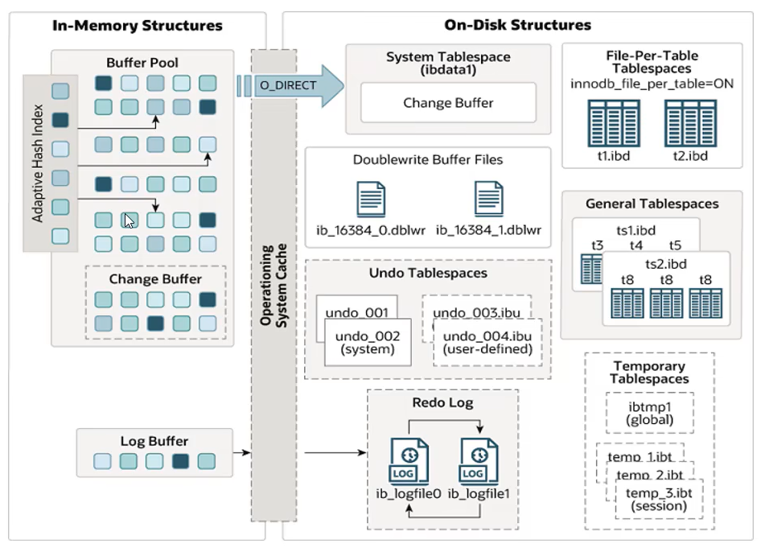

### 内存结构 (In-Memory Structures)

这是 InnoDB 的“工作车间”，所有操作都在这里进行，速度极快。

#### 缓冲池 (Buffer Pool)

**这是 InnoDB 架构中最重要的组成部分，是主内存中的一个区域。** 它像是一个缓存，用来存放从磁盘上读取的表数据和索引页。所有操作首先在缓冲池中进行，从而极大减少磁盘 I/O，提升性能。

- **工作方式**：采用 **LRU (Least Recently Used)** 算法来管理页的淘汰。当需要新空间时，最近最少使用的页会被刷到磁盘并移出缓冲池。
- **包含内容**：
    - **数据页 (Data pages)**：表的行数据。
    - **索引页 (Index pages)**：表的索引数据。
    - **自适应哈希索引 (Adaptive Hash Index)**：自动为频繁访问的页构建哈希索引，加速查询。
    - **更改缓冲区 (Change Buffer)**：**特殊的数据结构**，用于缓存**非唯一辅助索引 (Secondary Index)** 的变更（INSERT, UPDATE, DELETE）。当这些索引页不在缓冲池中时，变更先缓存在 Change Buffer，待后续需要时再合并（merge），避免大量随机 I/O。
    - **锁信息 (Lock info)**：行锁信息（对于 InnoDB，行锁是存储在内存中的）。
- **配置参数**：`innodb_buffer_pool_size`，通常建议设置为服务器物理内存的 **50% - 80%**。

#### 日志缓冲区 (Log Buffer)

- 一个内存区域，用于缓存**重做日志 (Redo Log)** 信息。
- 日志缓冲区中的内容会定期批量刷新到磁盘的重做日志文件中。这种批量刷新减少了磁盘 I/O，提升了性能。
- **配置参数**：`innodb_log_buffer_size`。

### 磁盘结构 (On-Disk Structures)

这是数据的最终归宿，用于持久化存储。

#### 表空间 (Tablespaces)

表空间是数据的逻辑存储容器，对应一个或多个物理文件。

- **系统表空间 (The System Tablespace, `ibdata1`)**
    - 存储：**数据字典**、**Change Buffer** 的磁盘部分、**双写缓冲区 (Doublewrite Buffer)** 和 **Undo Logs**。
- **独立表空间 (File-Per-Table Tablespaces, `.ibd`)**
    - 每张表一个独立的 `.ibd` 文件，存储该表的**数据**和**索引**。通过 `innodb_file_per_table=ON` 开启（强烈推荐）。
- **通用表空间 (General Tablespaces)**
- **Undo 表空间 (Undo Tablespaces)**
- **临时表空间 (Temporary Tablespaces)**

#### 重做日志文件 (Redo Log Files, `ib_logfile0`, `ib_logfile1`)

- **这是保证 InnoDB 崩溃恢复和持久性 (Durability) 的核心**。
- **工作原理 (Write-Ahead Logging - WAL)**：所有修改数据的操作**不会直接写入数据文件**，而是先记录到重做日志文件中。
- 它采用**循环写入**的方式。当写满第一个文件，会切换到第二个，写满第二个后，又会覆盖第一个文件。
- **配置参数**：`innodb_log_file_size`（单个文件大小），`innodb_log_files_in_group`（文件数量，通常为2）。

#### 双写缓冲区 (Doublewrite Buffer)

- 位于系统表空间中的一个区域，用于解决**部分页写入 (Partial Page Write)** 问题（16KB的页只写了4KB时发生宕机）。
- **工作流程**：在将缓冲池中的“脏页”刷到数据文件**之前**，InnoDB 会先将它们顺序地写入双写缓冲区。然后再将页写入数据文件中的最终位置。
- **宕机恢复**：如果发生页断裂，InnoDB 可以从双写缓冲区中找到该页的一个完好副本，用来恢复数据文件中的损坏页。**它是数据安全的重要保障**。

### 后台线程 (Background Threads)

这些线程负责在后台完成各种维护任务，是 InnoDB 的“自动化工人”。

1. **Master Thread**
    - 核心后台线程，负责协调其他线程的工作。主要任务包括：将缓冲池中的**脏页 (Dirty Page)** 刷新到磁盘、合并 Change Buffer、回收 Undo 页等。
2. **IO Threads**
    - 负责处理各种类型的 IO 请求。通常有**写线程**、**读线程**、**插入缓冲线程**和**日志线程**。
    - 参数：`innodb_write_io_threads`, `innodb_read_io_threads`。
3. **Purge Thread**
    - 事务提交后，其使用的 Undo Log 不再需要。Purge Thread 负责回收这些已分配的 Undo 页。
4. **Page Cleaner Thread**
    - 从 Master Thread 中分离出来，专门负责**脏页的刷新**，减轻 Master Thread 的压力，提升性能。


## 事务原理


### 事务的 ACID 特性及其实现原理

#### 原子性 (Atomicity)

- **定义**：一个事务中的所有操作，要么全部完成，要么全部不完成，不会结束在中间某个环节。
- **实现原理：Undo Log**
    - **作用**：用于记录数据被修改**前**的副本。
    - **工作流程**：
        1. 在事务中**修改任何数据之前**，InnoDB 会先将数据的原始值拷贝一份，存入 **Undo Log**。
        2. 如果事务**成功提交**，这些 Undo Log 记录会在不再需要时（没有其他事务需要它来实现 MVCC）被**清除**。
        3. 如果事务**需要回滚**，InnoDB 会使用 Undo Log 中的记录，将数据**恢复**到事务开始前的状态。
    - **简而言之**：Undo Log 是事务回滚和 MVCC 的基础。

#### 持久性 (Durability)

- **定义**：一旦事务提交，则其所做的修改就会永久保存在数据库中，即使系统崩溃也不会丢失。
- **实现原理：Redo Log + Doublewrite Buffer**
    - **Redo Log (重做日志)**
        - **作用**：记录数据被修改**后**的物理日志，即“在某个位置做了什么修改”。
        - **工作流程 (Write-Ahead Logging - WAL)**：
            1. 事务修改数据时，不会直接写入磁盘的数据文件，而是先写入**重做日志缓冲区 (Log Buffer)**。
            2. 事务提交时，会根据配置 (`innodb_flush_log_at_trx_commit`) 将 Log Buffer 中的内容**刷盘**到 **Redo Log 文件** (`ib_logfile`) 中。
            3. **后台线程**再择机将修改的数据页从缓冲池刷到磁盘的数据文件中。
        - **崩溃恢复**：如果数据库宕机，重启后 InnoDB 会读取 Redo Log，**重做** (Redo) 所有已提交但尚未写入数据文件的事务，从而保证持久性。
    - **Doublewrite Buffer (双写缓冲区)**
        - **作用**：防止**部分页写入 (Partial Page Write)** 问题（例如，16KB 的页只写了 4KB 时发生宕机，导致页数据损坏）。
        - **工作流程**：在脏页刷到数据文件的**真实位置之前**，InnoDB 会先将它们写入磁盘上的一个临时区域（双写缓冲区）。然后再将它们写入最终位置。
        - **恢复**：如果发生页断裂，InnoDB 可以用双写缓冲区中的副本来修复数据文件中的损坏页。

#### 隔离性 (Isolation)

- **定义**：数据库允许多个并发事务同时对其数据进行读写和修改的能力。隔离性可以防止多个事务并发执行时由于交叉执行而导致数据的不一致。
- **实现原理：锁机制 (Locking) + MVCC (多版本并发控制)**
    - **锁机制 (Locking)**
        - **写操作（增、删、改）** 会默认加**行级排他锁 (X Lock)**，阻止其他事务修改相同的数据。
        - `SELECT ... FOR UPDATE` 和 `SELECT ... LOCK IN SHARE MODE` 也会显式加锁。
        - 锁保证了数据的“**串行化**”访问，是隔离性的基础。
    - **MVCC (Multi-Version Concurrency Control)**
        - **作用**：为了实现**非阻塞读**，即读不阻塞写，写也不阻塞读。这是 InnoDB 高并发性能的关键。
        - **实现原理**：
            - 每行记录都有两个（或三个）**隐藏字段**：`DB_TRX_ID`（最后修改该行的事务ID）、`DB_ROLL_PTR`（指向该行上一个版本的 Undo Log 记录的指针）。
            - 当一个事务开始时，它会获取一个“**快照**”（Snapshot）。这个快照是该时间点的数据视图。
            - **读操作**（普通 `SELECT`）会从这个快照中读取数据。它通过 `DB_ROLL_PTR` 指针在 **Undo Log** 中构建一条版本链，找到对自己可见的版本（即，行的版本事务ID早于当前事务）。
            - **写操作**则创建新的版本。
        - **简而言之**：MVCC 通过保存数据的历史版本，使得读写操作可以访问不同时间点的数据快照，从而避免了加锁等待，提升了并发能力。

#### 一致性 (Consistency)

- **定义**：事务执行前后，数据库都必须处于一致性状态。例如，转账前后，总额必须不变。
- **实现原理**：
    - 一致性是事务的**最终目标**，而不是某种单一技术。
    - 它是由**应用层**、**数据库层**和 **业务逻辑** **共同保证**的。
    - **原子性**、**持久性**和**隔离性**是实现一致性的**手段**。它们从不同角度确保了数据在事务中的状态变换不会被打断或破坏。
    - 此外，数据库的**约束**（主键、外键、唯一索引、非空等）也在事务执行过程中时刻校验，确保数据符合规则，从而保证一致性。

### 事务的工作流程

（以 UPDATE 为例）

1. **开始事务**：`BEGIN` 或 `START TRANSACTION`。
2. **数据读取与锁定**：
    - 从磁盘或缓冲池 (Buffer Pool) 读取目标数据行到内存。
    - 为该行加**排他锁 (X Lock)**。
3. **记录 Undo Log**：将修改前的数据行拷贝到 Undo Log 中。
4. **修改数据**：在 Buffer Pool 中修改数据行，该页变为“**脏页**”。
5. **记录 Redo Log**：将“如何修改”这个操作记录到 **Redo Log Buffer**。
6. **提交事务 (COMMIT)**：
    - 将 **Redo Log Buffer** 的内容刷盘到 **Redo Log File**（根据 `innodb_flush_log_at_trx_commit` 配置）。
    - **这是保证持久性的关键一步。**
    - 释放行锁。
7. **后台操作**：
    - 后台线程 (**Page Cleaner**) 会择机将 Buffer Pool 中的**脏页**通过 **Doublewrite Buffer** 刷回到磁盘的数据文件中。

**如果在第6步之前发生错误或执行 ROLLBACK**：

- InnoDB 会利用 **Undo Log** 中的记录，将数据恢复原状。
- 释放锁。


## MVCC

Multi-Version Concurrency Control，**多版本并发控制**，是一种并发控制的方法，通过对数据行维护**多个版本**，来实现**非阻塞读**。它的核心思想是：

> **为每一个数据更改创建一個快照（Snapshot），读操作只需要读取特定时刻的快照，而无需等待写操作完成。**

这使得：

- **读不阻塞写**：一个事务正在读数据时，另一个事务可以同时修改它（读的是旧版本）。
- **写不阻塞读**：一个事务正在修改数据时，另一个事务可以同时读取它的旧版本。

这极大地提高了数据库的并发性能，尤其是在读多写少的场景下。

MVCC的具体实现，还需要依赖于数据库记录中的**三个隐式字段**，**undo log日志**，**readView**。

### 基本概念

- **当前读**
    读取的是记录的最新版本，读取时还要保证其他并发事务不能修改当前记录，会对读取的记录进行加锁。对于我们日常的操作，如：
    `select ... lock in share mode`(共享锁), `select ... for update`, `update`, `insert`, `delete`(排他锁)都是一种当前读。

-  **快照读**
    简单的 `select`（不加锁）就是快照读，快照读，读取的是记录数据的可见版本，有可能是历史数据，不加锁，是非阻塞读。
    - Read Committed：每次select，都生成一个快照读。
    - Repeatable Read：开启事务后第一个select语句才是快照读的地方。
    - Serializable：快照读会退化为当前读。

### 隐藏字段与 Undo Log

InnoDB 为每一行数据（在聚集索引中）都添加了（至少）两个重要的**隐藏字段**：

1. **`DB_TRX_ID` (6字节)**：
    - **事务ID**。记录最后一次**插入**或**更新**该行数据的事务ID。
    - 删除操作在 InnoDB 内部也被视为一次更新，会设置一个特殊的删除标记。
2. **`DB_ROLL_PTR` (7字节)**：
    - **回滚指针**。指向该行数据**上一个版本**在 **Undo Log** 中的存储位置。
    - 所有旧版本的数据通过这个指针连接成一条**版本链**。
3. **(可选) `DB_ROW_ID` (6字节)**：
    - 行ID。如果表没有定义主键，InnoDB 会自动生成一个聚集索引，这个字段就作为 rowid。

**版本链的形成**：
每次对数据进行更新时，都会将旧版本的数据拷贝到 **Undo Log** 中，并用 `DB_ROLL_PTR` 指针将新旧版本串联起来。链头是最新的记录，链尾是最老的记录。

### Read View

MVCC 的关键在于，**事务在读取数据时，如何决定能看到版本链中的哪个版本？** 这个判断依据就是 **Read View（一致性读视图）**。

当一个事务执行**快照读**（普通 `SELECT`）时，会创建一个 Read View。Read View 可以理解为**事务开启时的一个快照**，它定义了当前事务的“可见性规则”。

> **不同的隔离级别，生成ReadView的时机不同**：
>
> - READ COMMITTED：在事务中每一次执行快照读时生成ReadView。
>
> - REPEATABLE READ：仅在事务中第一次执行快照读时生成ReadView，后续复用该ReadView。
> - SERIALIZABLE：此隔离级别下，InnoDB 会**退化为使用锁**来实现隔离。所有的 `SELECT` 语句都会自动转换为 `SELECT ... LOCK IN SHARE MODE`，即加共享锁。读读不互斥，但读写会互斥，并发度最低，几乎不使用 MVCC。

Read View 主要包含以下关键属性：

- **`m_ids`**： 生成 Read View 时，系统中**活跃**（已启动但未提交）的读写事务ID列表。
- **`min_trx_id`**： `m_ids` 中的最小值。
- **`max_trx_id`**： 生成 Read View 时，系统应该分配给下一个事务的ID。
- **`creator_trx_id`**： 创建该 Read View 的事务ID（只有写操作才会分配事务ID，只读事务的ID为0）。

### 可见性算法：如何判断版本是否可见？

有了 Read View 和版本链，InnoDB 使用以下算法来判断某个版本对当前事务是否可见。它会从最新的版本开始，沿着版本链依次判断：

对于版本链中的某个版本，其事务ID为 `trx_id`，判断规则如下：

1. **如果 `trx_id == creator_trx_id`**：
    - 说明该版本是当前事务自己修改的，**可见**。
2. **如果 `trx_id < min_trx_id`**：
    - 说明该版本的事务在生成 Read View 时**已经提交**，**可见**。
3. **如果 `trx_id >= max_trx_id`**：
    - 说明该版本的事务在生成 Read View **之后才开启**，**不可见**。
4. **如果 `min_trx_id <= trx_id < max_trx_id`**：
    - 需要判断 `trx_id` 是否在**活跃事务列表 `m_ids`** 中：
        - **如果在**： 说明创建 Read View 时，该版本的事务还处于活跃状态（未提交），**不可见**。
        - **如果不在**： 说明该版本的事务在创建 Read View 时**已经提交**，**可见**。

如果某个版本对当前事务**不可见**，则沿着回滚指针 `DB_ROLL_PTR` 找到上一个版本，**重复上述判断规则**，直到找到最早的一个可见版本。

如果最终都找不到可见的版本，则返回空。

### MVCC 如何工作？一个具体示例

假设我们有一行数据 `name: 'Alice'`，经历了两次修改：

1. 事务ID=10 将其更新为 `'Bob'`。
2. 事务ID=20 又将其更新为 `'Charlie'`。

现在，这行数据的版本链如下（链头是最新版本）：
`(‘Charlie’, trx_id=20, roll_ptr -> v2)` --> `(‘Bob’, trx_id=10, roll_ptr -> v1)` --> `(‘Alice’, trx_id=5, roll_ptr=null)`

**场景：** 此时，开启了一个新的事务TRX30（只读），执行 `SELECT * FROM t WHERE ...`。

**步骤：**

1. TRX30 会生成一个 Read View，假设此时系统中活跃的事务有 `[20, 25]`，则：
    - `m_ids = [20, 25]`
    - `min_trx_id = 20`
    - `max_trx_id = 31` (下一个要分配的事务ID)
    - `creator_trx_id = 0` (因为它是只读事务)
2. TRX30 从最新版本开始检查：
    - 最新版本 `‘Charlie’` 的 `trx_id=20`。它在 `m_ids` 中，说明事务20在创建快照时还未提交，因此**对 TRX30 不可见**。
3. 沿指针找到上一个版本 `‘Bob’`，其 `trx_id=10`。
    - `10 < min_trx_id (20)`，说明事务10早已提交，因此 `‘Bob’` 这个版本**对 TRX30 可见**。
4. TRX30 的查询结果就是 `‘Bob’`。

**结论**：即使当前最新的值是 `‘Charlie’`，但在 TRX30 的事务快照里，它读到的值是 `‘Bob’`。这就是**可重复读**隔离级别的实现原理。


# Mysql 管理


## 系统数据库

**系统数据库（System Databases）**是 MySQL 服务器自身创建和使用的，存储了至关重要的元数据、权限信息、运行状态等，**通常不建议直接修改其中的表**。

MySQL 安装完成后，默认会包含以下系统数据库：

```bash
mysql> SHOW DATABASES;
+--------------------+
| Database           |
+--------------------+
| information_schema |
| mysql              |
| performance_schema |
| sys                |
+--------------------+
```

### `mysql` 数据库

这是**最核心**的系统数据库，存储了所有的权限和安全信息，以及一些关键的系统数据。

- **作用**：**用户账户、权限管理、存储过程/触发器/事件的定义、时区信息、日志配置等**。

- **核心表举例**：

    - **`user`**： 最重要的表之一。存储了所有**用户账户**及其**全局权限**。修改此表后需执行 `FLUSH PRIVILEGES;` 使权限生效（但通常更推荐使用 `GRANT`/`REVOKE` 语句）。
    - **`db`**： 存储了数据库级别的权限。
    - **`tables_priv`**, **`columns_priv`**, **`procs_priv`**： 分别存储表级、列级和存储过程/函数的权限。
    - **`time_zone_name`**, **`time_zone`** 等： 存储时区信息。
    - **`general_log`**, **`slow_log`**： 如果启用，会存储通用查询日志和慢查询日志（通常建议输出到文件，而非表）。

- **管理操作示例**：

    ```sql
    -- 查看所有用户及主机
    SELECT User, Host FROM mysql.user;
    
    -- 查看某个用户的权限
    SHOW GRANTS FOR 'username'@'hostname';
    
    -- 修改权限后刷新（如果直接修改了权限表）
    FLUSH PRIVILEGES;
    ```

- **警告**：**不要直接使用 `INSERT`, `UPDATE`, `DELETE` 来修改 `mysql` 数据库中的表**，除非你非常清楚自己在做什么。错误的修改可能导致无法正常登录或权限混乱。应始终使用 `CREATE USER`, `GRANT`, `REVOKE` 等专用 SQL 命令。

### `information_schema` 数据库

这是一个**虚拟的**、只读的数据库，它提供了访问**数据库元数据**的标准方式。

- **作用**： 作为一个信息数据库，它保存了关于 MySQL 服务器维护的**所有其他数据库的信息**，如数据库名、表名、列的数据类型、访问权限等。它本质上是数据字典的一个视图。

- **特点**： 里面的表实际上是**视图（VIEWs）**，不是真正的表。查询它们就是查询系统状态，结果是在查询时动态生成的。

- **核心表（视图）举例**：

    - **`SCHEMATA`**： 提供了所有数据库的信息。
    - **`TABLES`**： 提供了所有表的信息（包括视图）。
    - **`COLUMNS`**： 提供了所有表中列的信息。
    - **`STATISTICS`**： 提供了关于表索引的信息。
    - **`KEY_COLUMN_USAGE`**: 描述了哪些列具有约束（如主键、外键）。
    - **`TABLE_CONSTRAINTS`**： 描述了表上存在的约束。
    - **`INNODB_LOCKS`**, **`INNODB_LOCK_WAITS`** (MySQL 5.7): 用于诊断 InnoDB 锁等待情况（在 8.0+ 中移至 `performance_schema`）。

- **使用示例**：

    ```sql
    -- 查看某个数据库（如 'mydb'）中的所有表及其引擎
    SELECT TABLE_NAME, ENGINE
    FROM information_schema.TABLES
    WHERE TABLE_SCHEMA = 'mydb';
    
    -- 查看某张表（如 'users'）的所有列信息
    SELECT COLUMN_NAME, DATA_TYPE, IS_NULLABLE, COLUMN_DEFAULT
    FROM information_schema.COLUMNS
    WHERE TABLE_SCHEMA = 'mydb' AND TABLE_NAME = 'users';
    
    -- 查看当前正在执行的事务（InnoDB）
    SELECT * FROM information_schema.INNODB_TRX;
    ```

    

### `performance_schema` 数据库

这是一个用于**监控 MySQL 服务器运行性能**的低级数据库。

- **作用**： 收集数据库服务器运行过程中的**性能指标**和**详细事件信息**（如锁、IO、SQL 执行阶段、内存使用等）。它专注于性能数据。

- **特点**：

    - 默认**启用**，但某些仪器（instruments）和消费者（consumers）可能默认关闭，需要手动配置。
    - 它的表是**实际存在的表**，但数据只在内存中处理，很少持久化，重启后数据丢失。
    - 提供了极其详细的内部运行信息，是进行**高级性能剖析和故障诊断**的强大工具。

- **核心功能区域举例**：

    - **等待事件（Wait Events）**： 记录线程等待资源（如IO、锁）的事件。
    - **阶段事件（Stage Events）**： 记录语句执行阶段（如排序、发送数据）的事件。
    - **语句事件（Statement Events）**： 记录执行的语句（如SQL）的事件。
    - **事务事件（Transaction Events）**： 记录事务事件。
    - **锁（Locks）**： 详细的锁信息（在 8.0+ 中取代了 `information_schema` 中的相关表）。
    - **内存使用（Memory Usage）**： 详细的内存分配监控。

- **使用示例**：

    ```sql
    -- 查看哪条SQL消耗了最多时间（需要先启用事件收集器）
    SELECT THREAD_ID, SQL_TEXT, TIMER_WAIT/1000000000 AS 'Duration (ms)'
    FROM performance_schema.events_statements_history_long
    ORDER BY TIMER_WAIT DESC LIMIT 10;
    
    -- 查看当前的文件I/O情况
    SELECT * FROM performance_schema.file_summary_by_instance;
    ```

### `sys` 数据库

这是一个基于 `performance_schema` 和 `information_schema` 的**高级诊断视图、函数和存储过程**的集合。可以把它看作是 `performance_schema` 的“**人性化外壳**”。

- **作用**： 将以性能模式收集的复杂原始数据，转化为**易于人类理解的格式**，提供简洁明了的性能诊断报告。它极大地简化了数据库的性能调优和健康检查工作。

- **特点**： 里面的对象基本都是**视图（VIEWs）** 和**存储过程（PROCEDUREs）**，数据本身不独立存储。

- **核心视图举例（通常以 `x$` 开头的视图提供原始数据，没有前缀的提供格式化数据）**：

    - **`schema_table_statistics`**, **`schema_table_statistics_with_buffer`**： 按表统计的 IO 和延迟信息。
    - **`statement_analysis`**： 类似慢查询日志的分析，但更实时，总结了所有执行过的语句。
    - **`session`**, **`processlist`**： 增强版的 `SHOW PROCESSLIST`，带有更多有用信息（如当前内存、延迟等）。
    - **`innodb_lock_waits`**： 清晰地显示当前正在发生的 InnoDB 锁等待关系。

- **使用示例**：

    ```sql
    -- 查看哪个表IO最高（人类可读格式）
    SELECT * FROM sys.schema_table_statistics_with_buffer LIMIT 5;
    
    -- 查看当前是否有锁等待（非常实用！）
    SELECT * FROM sys.innodb_lock_waits;
    
    -- 查看进程列表的增强信息
    SELECT * FROM sys.processlist;
    ```

    

### 官方命令行工具

这些工具位于 MySQL 的 `bin` 目录下，是管理和维护的基础。

1. **`mysql`** (The MySQL Command-Line Client)

    - **描述**：最经典的 MySQL 命令行客户端，用于连接数据库并执行 SQL。

    - **常用参数**：

        bash

        ```bash
        mysql -u [username] -p[password] -h [hostname] -P [port] [database_name]
        # 示例：连接本地数据库
        mysql -u root -p
        # 示例：执行SQL文件
        mysql -u root -p mydb < backup.sql
        ```

2. **`mysqldump`** (Database Backup Program)

    - **描述**：逻辑备份工具，将数据库导出为 SQL 语句文件。

    - **经典用法**：

        ```bash
        # 备份单个数据库（推荐使用 --single-transaction 保证一致性）
        mysqldump -u root -p --single-transaction --databases mydb > mydb_backup.sql
        
        # 备份所有数据库
        mysqldump -u root -p --all-databases > all_dbs_backup.sql
        
        # 只备份表结构
        mysqldump -u root -p --no-data mydb > mydb_schema.sql
        ```

3. **`mysqlimport`** / **`mysql`** (Data Import)

    - **描述**：用于导入文本文件（如 CSV）到表中。`mysqlimport` 是 `LOAD DATA INFILE` 的命令行包装。

    - **用法**：

        bash

        ```bash
        mysqlimport -u root -p --local --fields-terminated-by=',' mydb /path/to/data.csv
        # 或者直接用 mysql client
        mysql -u root -p -e "LOAD DATA LOCAL INFILE '/path/to/data.csv' INTO TABLE mytable FIELDS TERMINATED BY ',';" mydb
        ```

4. **`mysqladmin`** (Administration Client)

    - **描述**：用于执行管理操作的客户端，如检查服务器状态、创建/删除数据库、重载权限等。

    - **常用命令**：

        ```bash
        mysqladmin -u root -p status       # 查看服务器状态
        mysqladmin -u root -p ping         # 检查服务器是否存活
        mysqladmin -u root -p shutdown     # 关闭MySQL服务器
        mysqladmin -u root -p processlist  # 查看活动进程（类似 SHOW PROCESSLIST;）
        mysqladmin -u root -p flush-logs   # 刷新日志
        ```

5. **`mysqlcheck`** (Table Maintenance Program)

    - **描述**：用于检查、修复、分析和优化表（相当于 `CHECK TABLE`, `REPAIR TABLE`, `ANALYZE TABLE`, `OPTIMIZE TABLE` 的命令行界面）。

    - **用法**：

        ```bash
        mysqlcheck -u root -p --check mydb        # 检查 mydb 所有表
        mysqlcheck -u root -p --optimize mydb     # 优化 mydb 所有表
        mysqlcheck -u root -p --auto-repair mydb  # 自动修复 mydb 所有表
        ```


