# Operating Systems

[TOC]

# An Introduction


## What is an Operating System

- 计算机系统由**硬件**和**软件**（系统及应用程序）组成。

- **操作系统**是最重要的软件，它管理硬件资源（CPU、内存、I/O设备）并为应用程序提供服务。

- 它充当**资源管理器**，抽象复杂的硬件细节，以实现易用性和高效的资源利用。

    > It presents the user with a simplified machine, much **easier to use**
    >
    > It uses the computer hardware and resources **efficiently**


## OS Basics

- 硬件变得强大而复杂（例如，流水线、超标量CPU、内存层次结构）。

- 没有操作系统，执行是顺序且低效的。

    > Sequential “thread” of execution
    >
    > Not very clever nor efficient 

- 操作系统必须高效管理资源、处理并发、避免死锁，并划分职责边界（例如，错误处理）。

- 操作系统的主要职责：进程管理、内存处理、I/O操作、文件系统、网络、安全和错误恢复。

    > • Start and stop programs 
    >
    > • Manage memory 
    >
    > • Handle input/output 
    >
    > • Overlap I/O with processing 
    >
    > • Handle file systems 
    >
    > • Multiple program running (concurrency) 
    >
    > • Networking 
    >
    > • Security 
    >
    > • Error handling and recovery 
    >
    > • Act as “computer manufacturer’s GUI” … 


## OS History

- **演变历程:** 从1940年代（无OS）到批处理（1950年代）、分时系统（1960年代）、Unix（1970年代）、MS-DOS（1980年代）、Windows/Linux（1990年代）以及移动操作系统（2000年代至今）。

    > • Rich history, 1955→ present 
    >
    > • 1940s – Computers first invented (no OS) 
    >
    > • 1950s – Punch Cards, single task at a time single-stream   batch processing systems (1957, Fortran & 1959 , COBOL) 
    >
    > • 1960s – Multiple jobs at once, context switching and time   share, memory partitioning, spooling 
    >
    > **• 1970s**–Unix, 1971- first intel microchip, 1972 - C, 1973 Ethernet
    >
    > • 1970s – 1976, Apple Founded 
    >
    > **• 1980s** – 1981, MS-DOS (Disk OS); 1985, TOS 
    >
    > • 1990s – Major research into Microkernels, 1992 Windows 3.1; 1994, v1.0 Linux Kernel; 1995, Java 
    >
    > • On 11th May, 1997, IBM's Deep Blue beatsGarry Kasparov 
    >
    > • 2000s – 2000 Symbian OS; 2001 Windows XP; 2002   Blackberry; 2007 iOS; 2008 Android 
    >
    > • 2015, Google’s AlphaGo 28 
    >
    > • Now systems for massive-scale computing, IoT, IoE

- **UNIX:** 模块化、多任务、多用户的操作系统，使用C语言编写；其哲学是提供简单、可组合的工具。

- **Microsoft Windows:** 占主导地位的桌面操作系统，拥有多个版本（家庭版、专业版等）。

- **Mac OS X:** 苹果公司开发的基于Unix、注重图形用户界面的操作系统。

- **Linux:** 开源、可定制，广泛应用于服务器。

- **移动操作系统:** （如iOS、Android）功能不如桌面操作系统强大，但为移动设备优化。

6. 图解关键概念

- **客户端-服务器模型:** 通过微内核和服务器进程提供操作系统服务。
- **微内核:** 最小化的核心操作系统；外部子系统处理驱动程序、文件系统等。
- **挑战:** 未来的操作系统必须处理服务质量（QoS）、数字版权管理（DRM）、人机交互（HCI，如触摸、语音、动作）等问题。


# Task-Level Parallelism on GPU


## Accelerating Training and Inference

- **AI模型与DNN应用**：涵盖了机器学习和深度学习（如计算机视觉、NLP）的各种应用。

- **DNN工作流**：包括**前向传播（推理）** 和**后向传播（学习/训练）** 的基本操作。

    > 1. Define a neural netwok 
    > 2. Training phase: •Forward propagation •Backward propagation •Optimizer update 
    > 3. Inference phase: •Forward progagation

- **模型规模与硬件能力的矛盾**：Transformer等模型参数数量增长远超GPU内存容量增长，导致大模型训练面临内存瓶颈。

    

- **内存层次结构**：介绍了从寄存器到磁带存储的深层内存/存储层次结构及其并发访问机制。

- **高效训练大规模模型的方法**：

    - **算法层面**：知识蒸馏、剪枝、量化等以减少计算量。
    - **系统层面**：数据/模型/张量并行、流水线、通信优化、内核优化等以加速计算。

- **CPU vs GPU**：对比了CPU（擅长串行、低延迟）和GPU（擅长并行、高吞吐、高延迟容忍）的架构特点，并指出**GPU内存有限**是关键瓶颈（如A100 GPU仅40/80GB，而CPU内存可达1-2TB）。

- **硬件介绍**：简要介绍了NVIDIA A100 GPU和集成了Grace CPU与Hopper GPU的NVIDIA Superchip（如GH200），后者通过高速NVLink-C2C互连（900GB/s）实现统一内存。


## Executing Tasks in Parallel on GPU

- **两大挑战**：

    1. **GPU利用率低**：部分计算单元（SM）空闲（例中约40%空闲）。

        > Low GPU Utilization。 Note: SM is a streaming multiprocessor on GPU 

    2. **内存不足（OOM）**：GPU内存耗尽错误。

        > Out-Of-Memory 

- **GPU利用率低的原因**：

    1. GPU是**CPU驱动**的设备，存在调度空闲。
    2. 不同**内核（Kernel）** 需求各异（计算密集型或内存密集型）。
    3. 内核间的**通信**可能成为性能瓶颈。

- **解决方案：任务级并行**

    - 使用**非阻塞的CUDA流（Non-blocking CUDA Streams）** 来并行执行独立的内核和任务（包括CPU操作），避免默认流（Stream 0）的同步开销。
    - 通过**细粒度GPU并行**（如多个流同时处理不同数据的前向、后向、优化器更新步骤）来提升利用率。

- **加速效果**：

    - **训练过程**：加速比达 **1.2x 到 2x**。
    - **推理过程**（批处理、离线）：加速比达 **1.5x 到 3x**。

- **进行中的工作**：

    - 寻找**最佳并行度**（模型并行、数据并行的程度，CUDA流的最佳数量）。
    - 在预热阶段进行分析（Profiling），利用先验信息**动态生成执行计划**。
    - 探索不同的内核并行执行策略（默认串行、多流并行、多流+内核重校准优化）。


## Off-Loading Tasks between GPU and CPU

- **动机**：应对GPU**内存不足（OOM）** 的挑战。
- **策略**：利用**异构资源**（CPU的内存和计算能力），通过**数据和模型分区**（数据并行、流水线并行、张量并行）以及**任务卸载**来扩展可用内存。
- **工作窗口（Working Window）机制**：
    - **前向传播**：异步地将模型的层在CPU和GPU之间滑动加载和卸载进行计算。
    - **后向传播**：类似滑动窗口，异步地进行层加载、卸载、参数更新（**将优化器更新操作卸载到CPU执行**，节省GPU内存）和反向计算。
- **性能效果**：
    - 与最先进的基于卸载的解决方案相比，该方法在32GB V100 GPU上：
        - **可训练模型大小扩大了 1.9x ~ 6.5x**。
        - **训练吞吐量提高了 1.2x ~ 3.7x**。


# Services, System Calls & Structures


## Services


### System Boot

- **Boot（启动）** 是 **Bootstrap（自举）** 的缩写。这是一个将**第一段软件**加载到内存中并由此启动计算机的过程。

    > Boot is short for bootstrap, which is the process to   load the first piece of software into memory that starts   a computer

    - **形象理解**：这个词源于“pull oneself up by one's bootstraps”（靠自己的靴带把自己拉起来），意为一个**自引导**的过程，系统通过一小段初始代码来加载更复杂的自身。

- 由于操作系统（OS）是运行所有其他程序（例如系统程序、应用程序等）所必需的，因此它通常是启动过程中加载的**第一块主要软件**。

- 启动过程还包括加载其他**基本软件**，例如：

    - 硬件驱动程序（Device Drivers）
    - 固件（Firmware）设置
    - 引导加载程序（Bootloader）

- **冷启动 (Cold Boot)**：指计算机从**关闭状态**（断电状态）**开机**。

    > A cold boot is when you turn the computer on from an   off position

- **热启动 (Warm Boot)**：指计算机在**已经开启**的状态下**重新启动**（例如通过操作系统中的“重启”功能）。这个过程通常跳过了一些硬件自检步骤，所以速度比冷启动更快。

    > A warm boot is when you reset a computer that is already on

- 通常，计算机启动后，CPU会从一个**固定的内存地址**开始执行指令。这个地址通常指向存储了初始引导代码的ROM（只读存储器）或固件（如BIOS或UEFI），由它来开始整个启动过程。

### Operating System Services

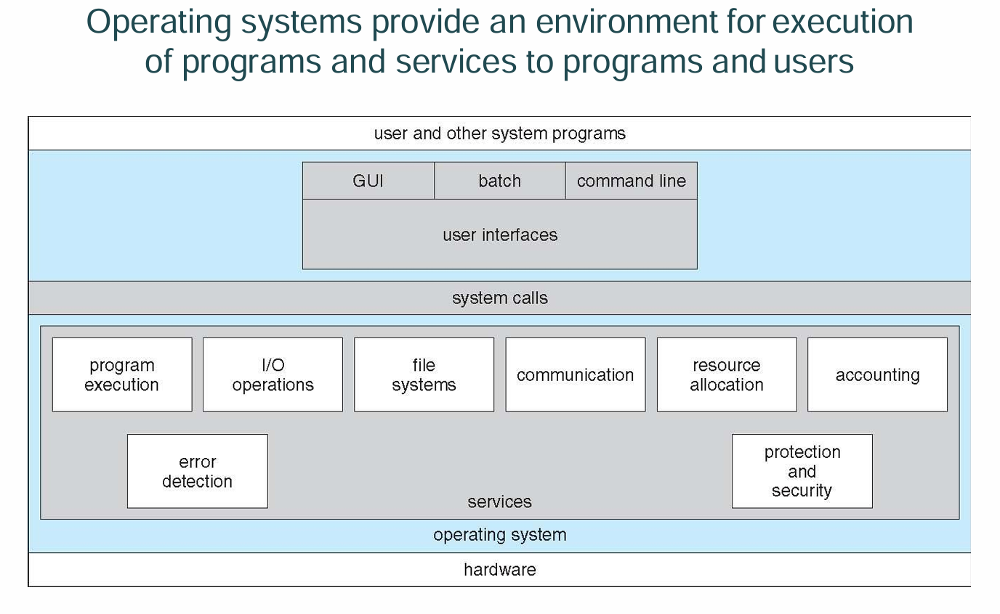

操作系统提供一系列服务来支持程序执行和用户交互：

- **用户界面 (User Interface)**：

    - 命令行界面 (CLI)

        > - **CLI（命令行界面）** 或 **命令解释器** 允许用户进行**直接的命令输入**。
        > - 它的实现方式有两种：
        >     - 直接内置于**操作系统内核**中。
        >     - 作为一个**系统程序**来实现（这是更常见和灵活的方式）。
        > - 存在**多种风格或不同的 shell**（壳程序）。
        >     - **Shell** 是命令解释器的另一种称呼，不同的 shell 提供不同的特性和语法。
        >     - 常见例子：在 Windows 上有 Command Prompt（CMD）和 PowerShell；在 Linux/Unix 上有 Bash, Zsh, Ksh 等。
        > - 它的主要功能是**获取用户输入的命令**并**执行它**。
        > - 命令分为两种类型：
        >     - **内置命令 (Built-in)**：命令的功能由 shell **自身直接实现**（例如 `cd` 改变目录命令）。
        >     - **外部程序 (Names a program on disk)**：命令是**磁盘上的一个可执行程序的文件名**。Shell 会找到这个程序文件，将其加载到内存并执行（例如 `ls`, `ping`, `notepad` 等）。

    - 图形用户界面 (GUI)

        > - **GUI（图形用户界面）** 提供了**用户友好的桌面隐喻界面**。
        >     - **桌面隐喻 (Desktop Metaphor)**：使用熟悉的办公桌元素（如文档、文件夹、垃圾桶）来代表数字对象和操作，使得用户更容易理解和学习。
        > - 其主要交互设备包括：**鼠标、键盘、显示器** 和 **图标**。
        > - 这项技术最初发明于 **Xerox PARC**（施乐帕洛阿尔托研究中心）。
        > - 如今，许多操作系统都**同时包含 CLI 和 GUI 两种界面**，以满足不同用户的需求。
        > - **各操作系统的GUI特点：**
        >     - **Microsoft Windows**：以 **GUI 为核心**，同时提供“命令提示符”（CMD）和 PowerShell 等 **CLI shell** 作为补充。
        >     - **Apple Mac OS X**（现为 macOS）：使用名为 **“Aqua”** 的 GUI 界面，但其底层核心是一个 **UNIX 内核**，并同样提供了终端（Terminal）等 **shell** 访问功能。
        >     - **Unix 和 Linux**：传统上以 **CLI 为核心**，但用户可以**选择安装**各种可选的 GUI 界面，例如 **CDE、KDE、GNOME** 等。

    - 批处理界面 (Batch)

    - 触摸屏界面 (Touchscreen)

- **程序执行 (Program Execution)**：

    - 将程序加载到内存、运行程序、正常或异常结束执行。

- **I/O 操作 (I/O Operations)**：

    - 处理文件和设备I/O，无需用户直接控制。

- **文件系统操作 (File System Manipulation)**：

    - 创建、删除、读写文件和目录，管理权限。

    > 程序需要操作系统提供以下文件操作功能：
    >
    > - **读取和写入 (read and write)**：对文件内容进行读和写操作。
    > - **创建和删除 (create and delete)**：创建新的文件或目录；删除已存在的文件或目录。
    > - **搜索和列表 (search, and list file Information)**：
    >     - **搜索**：在文件系统中查找特定的文件或目录。
    >     - **列表**：列出目录中包含的文件和子目录的信息（如文件名、大小、修改日期等）。
    > - **执行权限管理 (perform permission management)**：管理谁可以访问文件以及可以执行何种操作（例如：设置读、写、执行的权限）。

- **通信 (Communications)**：

    - 同一计算机或网络上的进程间通信（通过共享内存或消息传递）。

    > 进程（Processes）之间可能需要交换信息，这种通信发生在两种场景中：
    >
    > - **在同一台计算机上**的不同进程之间。
    > - 在通过网络连接的**不同计算机**的进程之间。
    >
    > 实现这种通信主要通过两种方式：
    >
    > - **共享内存 (Shared Memory)**：
    >     - 多个进程可以访问共同的同一块内存区域。
    >     - **特点**：速度非常快，但需要进程自己处理同步问题（例如，防止同时写入造成数据混乱）。
    > - **消息传递 (Message Passing)**：
    >     - 进程通过互相发送和接收消息（数据包）来通信。
    >     - **特点**：这些消息由**操作系统负责移动和传递**。这种方式比共享内存慢，但更易于构建和控制，尤其适用于网络通信。

- **错误检测 (Error Detection)**：

    - 持续监控硬件和软件错误，并提供调试支持。

    > - 操作系统需要**持续不断地监控**系统中可能发生的**错误**。
    > - 错误可能发生在多个部件上：
    >     - **CPU**（如算术溢出、非法指令）
    >     - **内存**（如访问越界、奇偶校验错误）
    >     - **I/O 设备**（如打印机缺纸、磁盘读写失败）
    >     - **用户程序**（如除以零、试图访问无效内存地址）等等。
    > - 每一种类型的错误都有其**特定的错误处理程序 (Error Handler)** 来负责处理。
    > - 操作系统必须采取**适当的措施**来确保计算的**正确性和一致性**。
    >     - **措施可能包括**：向用户报告错误、终止出错的程序、自动重试操作、或者在不影响整体系统的情况下安全地忽略某些错误。
    > - 为用户程序提供**调试 (Debugging) 功能**（如核心转储、程序跟踪、调试器接口）可以**大大增强系统的可用性**，因为它能帮助程序员找出并修复程序中的错误（Bug）。

- **资源分配 (Resource Allocation)**：

    - 在多用户/多任务环境中分配CPU、内存、设备等资源。

- **审计与安全 (Accounting & Security)**：

    - 跟踪资源使用情况，实施访问控制和保护机制。


## System Calls

**系统调用 (System Calls)**

*   操作系统（OS）为其服务提供了**编程接口**。
*   这些接口通常使用**高级语言**（如 C 或 C++）编写。
*   系统调用是一个程序向操作系统**内核请求服务**的方式。
*   这些服务可能包括：
    *   **硬件相关服务**（例如，访问硬盘驱动器）
    *   **创建和执行新进程**
    *   与核心内核服务（如**进程调度**）进行通信

**应用程序编程接口 (API) – 更高层次的抽象**

*   **高级接口**：API 是更高层次的接口，**程序通常使用它**，而不是直接使用复杂的系统调用。
*   **间接性**：它是对系统调用的封装，程序员通过调用API函数来间接使用系统调用，而无需关心底层细节。
*   **简化性**：与原始的系统调用相比，API **通常更易于使用且细节更少**（隐藏了复杂的底层实现）。

**常见的 API 示例：**

*   **Win32 API**：用于 Microsoft Windows 操作系统。
*   **POSIX API**：用于基于 POSIX 标准的系统（例如 UNIX、Linux 和 Mac OS X）。
*   **Java API**：用于 Java 虚拟机（JVM）。


**系统调用参数传递 (System Call Parameter Passing)**

当程序需要请求操作系统服务（进行系统调用）时，它必须将必要的参数传递给操作系统内核。主要有三种方法来实现参数传递：

方法 1：通过寄存器传递 (Pass the parameters in registers)

- **描述**：将参数直接存放在**CPU的寄存器**中。
- **优点**：这是**最简单**、最快速的方法。
- **缺点**：在某些情况下，需要传递的**参数数量可能超过寄存器的数量**，导致此方法不可行。

方法 2：通过内存块传递 (Parameters stored in a block/table in memory)

- **描述**：程序将所有的参数存储到内存中的一个**连续的块或表**中，然后只需将该内存块的**起始地址**作为一个参数，存放在一个寄存器中传递给操作系统。
- **优点**：可以传递大量参数，克服了寄存器数量的限制。
- **例子**：**Linux** 和 **Solaris** 等操作系统广泛使用这种方法。

方法 3：通过栈传递 (Parameters placed in the Stack)

- **描述**：
    - **压栈 (Push)**：由**程序**将参数按顺序压入**栈**（一种特殊的内存结构）。
    - **出栈 (Pop)**：由**操作系统**从栈中弹出（读取）这些参数。
- **优点**：对传递参数的**数量和长度几乎没有限制**，非常灵活。

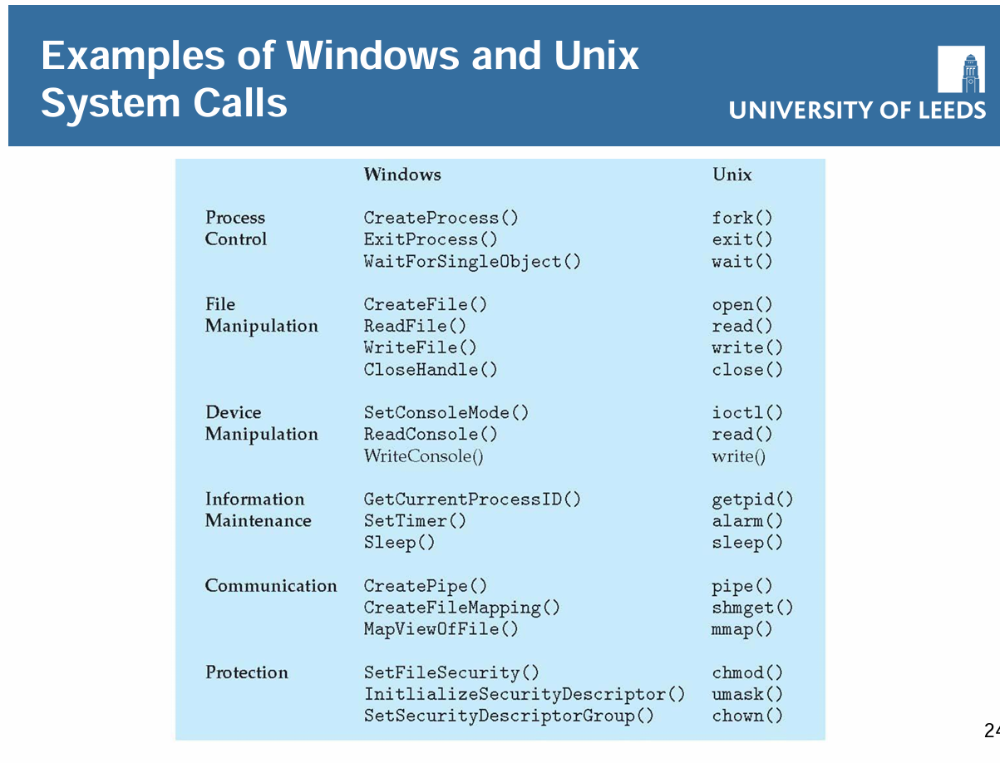


**系统调用类型 (Types of System Calls)**

系统调用通常可以分为以下几大类：

---

1. 进程控制 (Process Control)

*   创建进程 (`fork` / `CreateProcess`)
*   终止进程 (`exit` / `ExitProcess`)
*   结束、中止程序
*   加载、执行程序 (`exec`)
*   获取和设置进程属性 (`getpid` / `getpriority`)
*   等待时间 (`sleep`)
*   等待事件、通知事件 (`wait` / `signal`)
*   分配和释放内存 (`brk` / `sbrk`)
*   出错时转储内存 (生成 core dump)
*   用于确定错误的调试器，单步执行
*   管理进程间共享数据访问的锁 (互斥锁、信号量)

---

2. 文件管理 (File Management)

*   创建文件 (`create`)
*   删除文件 (`unlink`)
*   打开、关闭文件 (`open`, `close`)
*   读、写、重新定位文件指针 (`read`, `write`, `lseek`)
*   获取和设置文件属性 (`stat`, `chmod`)

---

3. 设备管理 (Device Management)

*   请求设备、释放设备
*   从设备读、向设备写、重新定位设备 (`read`, `write`, `ioctl`)
*   获取设备属性、设置设备属性 (`ioctl`)
*   逻辑上连接或断开设备

**补充说明**：在类Unix系统中，设备通常被抽象为**特殊文件**，因此很多用于文件管理的系统调用（如 `read`, `write`）也同样适用于设备管理。

---

4. 信息维护 (Information Maintenance)

*   获取时间或日期、设置时间或日期 (`gettimeofday`, `settimeofday`)
*   获取系统数据、设置系统数据 (`sysinfo`)
*   获取和设置进程、文件或设备的属性

---

5. 通信 (Communications)

*   创建、删除通信连接 (`socket`)
*   **消息传递模型 (Message Passing Model)**:
    *   发送、接收消息 (`send`, `recv`)
    *   发送到主机名或进程名
    *   从客户端到服务器
*   **共享内存模型 (Shared-Memory Model)**:
    *   创建和获取对内存区域的访问权限 (`shmget`, `shmat`)
    *   传输状态信息
    *   连接和分离远程设备

---

6. 保护 (Protection)

*   控制对资源的访问
*   获取和设置权限 (`getuid`, `chmod`, `setacl`)
*   允许和拒绝用户访问


**系统程序 (System Programs)**

- **系统程序**提供了一个方便的**程序开发**和**执行环境**。
    - 它们不是操作系统内核的一部分，但通常随操作系统一起提供，是操作系统整体生态和用户体验的关键组成部分。
- 系统程序可以分为以下几类：
    - **文件操作 (File manipulation)**：提供创建、删除、复制、重命名、打印、列出和操作文件和目录的工具（如 `cp`, `rm`, `ls`, `mkdir` 等命令）。
    - **状态信息 (Status information)**：提供用于查询系统状态（如日期、时间、可用内存、磁盘空间、用户列表、进程状态）的工具（如 `ps`, `top`, `df`, `date` 等命令）。这些信息有时会存储在一个文件中以供修改或后续查看。
    - **编程语言支持 (Programming language support)**：提供编译器、汇编器、调试器和解释器（如 `gcc`, `python`, `gdb`），用于开发新的程序。
    - **程序加载和执行 (Program loading and execution)**：提供加载器、链接器和解释器，用于将程序装入内存并执行它们。
    - **通信 (Communications)**：提供用于进程间、用户间、乃至计算机间建立连接的工具（如 `ssh`, `ftp`, `mail` 等命令）。
    - **后台服务 (Background services)**：指在系统启动时即加载并持续运行的服务或守护进程（daemons），例如网络服务、打印调度、错误监控等。
    - **应用程序 (Application programs)**：除了系统工具之外，操作系统包中可能还包含一些不直接属于系统管理范畴的应用程序（例如文本编辑器、计算器、简单的游戏等）。
- **最重要的一点**：对于大多数用户来说，他们对操作系统的看法和体验是由这些**系统程序（如图形界面、浏览器、终端命令）所定义的**，而不是由底层那些不可见的**实际系统调用**所定义的。系统程序是用户与操作系统内核交互的主要桥梁。


## OS Structures

**操作系统内核（OS Kernel）**

操作系统内核（OS Kernel）是一个构成计算机操作系统核心的计算机程序。它全面掌控系统中发生的一切操作，因此成为启动时首个加载的程序，负责管理后续启动流程以及处理软件发出的输入/输出请求，并将其转换为中央处理器的数据处理指令。

该程序还负责管理内存、协调外部设备（如打印机、扬声器等）并进行通信。作为现代计算机操作系统的基础组成部分，内核发挥着至关重要的作用。

**操作系统的不同组织方式**：

- **简单结构 (Simple Structure)**：
  
    - 如 MS-DOS，功能集中，模块化程度低。
    
- **单体内核 (Monolithic Kernel)**：
    - 如 UNIX，所有服务在内核中运行，效率高但复杂。
    
- **微内核 (Microkernel)**：
    - 如 MINIX，仅核心功能在内核，其余在用户空间，通过消息通信；模块化好，但性能较低。
    
    | 特性         | 单片内核 (Monolithic Kernel)                           | 微内核 (Microkernel)                                         |
    | :----------- | :----------------------------------------------------- | :----------------------------------------------------------- |
    | **核心服务** | 调度、驱动、文件系统、安全等大量服务均在内核空间运行   | 仅最核心服务（如调度、IPC）在内核空间，其他作为用户空间服务  |
    | **安全性**   | 不一定比微内核更不安全，同样实现进程隔离               | 不一定比单片内核更安全，同样实现进程隔离                     |
    | **架构特点** | 庞大、单一，常通过内核模块扩展                         | 微小、模块化，通过用户空间服务扩展                           |
    | **主要优势** | 性能高（组件间通信高效）                               | **稳定性好**（服务故障不易引起内核崩溃）、**易于审计和维护**（核心小） |
    | **主要劣势** | **稳定性风险**（组件错误易致内核崩溃）、更复杂难以审计 | **性能开销**（因频繁的进程间通信）                           |
    
- **分层结构 (Layered Approach)**：
    - 每层仅与相邻层通信，模块化清晰。
    
- **模块化结构 (Modules)**：
    - 如 Linux、Solaris，支持动态加载内核模块，灵活性强。
    
- **混合系统 (Hybrid Systems)**：

    - **Most modern operating systems are actually not  one pure model**

    - 结合多种结构，如Windows（主体单体+部分微内核）、Linux（单体+模块化）。

- **移动操作系统示例**：
    - **iOS**：基于macOS内核，分层设计。
    - **Android**：基于修改的Linux内核，使用Dalvik虚拟机运行Java应用。


**补充**：

1. **用户空间**
    - **是什么**：这是为**普通应用程序**保留的内存区域。每个进程都有自己独立的用户空间。
    - **限制**：运行在用户空间的代码被称为处于 **“用户态”** 。此时，CPU 执行的是**非特权指令**。这意味着应用程序：
        - **不能**直接访问硬件（如磁盘、网卡、打印机）。
        - **不能**随意修改操作系统的关键数据 structures。
        - 只能操作**分配给它的那部分内存**，无法访问其他进程或内核的内存。
    - **目的**：**保护**。如果一个应用程序（例如你的浏览器或游戏）出现错误（如野指针）、崩溃或被病毒入侵，它最多只能破坏自己的用户空间，而不会影响操作系统的稳定性和其他应用程序的运行。

2. **内核空间**
    - **是什么**：这是为**操作系统内核**保留的受保护的内存区域。**整个系统只有一份**，被所有进程共享。
    - **权限**：运行在内核空间的代码被称为处于 **“内核态”** 。此时，CPU 执行**所有指令**（包括特权指令）。内核可以：
        - **直接访问硬件**和所有物理内存。
        - **管理系统资源**，如CPU、内存、设备。
        - **为所有进程提供服务**。
    - **目的**：**控制与协调**。内核作为系统的最高管理者，负责仲裁所有对硬件和敏感资源的访问请求。


**两者如何交互？—— 系统调用**

应用程序无法直接做所有事情（比如读写文件、申请内存、发送网络数据），因为这些操作需要特权指令。那么它该怎么办？

答案是通过 **系统调用**。

**系统调用是用户程序主动向内核请求服务的唯一接口**。

这个过程就像普通公民（用户程序）需要向政府（内核）申请办理业务（服务）一样：

1. **发起请求**：应用程序在代码中调用一个函数（如 `read()`, `write()`, `fork()`）。这些函数是**系统调用的包装库**。
2. **陷入内核**：这个调用会触发一个特殊的**软件中断**（例如，在 x86 架构上是 `int 0x80`）或使用专门的指令（如 `syscall`）。CPU 会**从用户态切换到内核态**。
3. **执行服务**：内核根据系统调用的编号，找到对应的**中断服务程序**（即系统调用的实现代码）并执行它。这时，内核就在内核空间中代表应用程序完成那些需要特权的操作（例如，从磁盘读取数据到内核缓冲区）。
4. **返回结果**：服务完成后，内核将结果（数据或状态码）返回给应用程序，并**从内核态切换回用户态**。
5. **继续执行**：应用程序收到返回结果，继续执行后续代码。

**整个过程中，身份的切换（用户态<->内核态）和空间的切换（用户空间<->内核空间）是由硬件和操作系统紧密协作完成的。**


# I/O and Interrupts


## I/O Management

- **为什么需要 I/O 管理？**
    - 计算机的两个主要任务是 **I/O** 和**处理**，而在许多情况下，处理是附带的。
    - I/O 设备在功能和速度上差异巨大，需要不同的控制方法。
    - 操作系统的角色是**管理和控制** I/O 操作与设备，并关注性能（如响应时间）。
- **计算机硬件与速度**
    - 介绍了计算机的基本硬件组件（CPU、内存、控制器、总线）。
    - 展示了典型的**内存层次结构**（寄存器、缓存、主存、磁盘、磁带），其访问时间和容量差异巨大。
    - 列举了各种 I/O 设备的**数据速率**（从键盘的 10 字节/秒到系统背板的 20 GB/秒），强调了设备的多样性。

## How devices  communicate?

- **连接方式**
    - 设备通过**端口**（Port）或**总线**（Bus）与计算机系统连接。总线是一组定义了严格协议的导线。
- **设备驱动程序**
    - 设备特定的功能被封装在内核模块中，称为**设备驱动程序**（软件）。
    - 驱动程序与**设备控制器**（硬件，如打印机控制器）交互，控制器操作端口、总线或设备本身。
- **控制器如何工作？**
    - 控制器拥有**寄存器**（数据、状态、控制寄存器）。
    - CPU 通过读写这些寄存器来与控制器通信。
    - **内存映射 I/O** 是一种常用方法：将设备控制寄存器映射到 CPU 的地址空间中，以便 CPU 像访问内存一样直接访问它们。
- **轮询**
    - **握手协议**：CPU 不断读取控制器的**忙位**（Busy Bit），直到它清零（表示就绪）。
    - CPU 然后写入命令和数据，并设置**命令就绪位**（Command-Ready Bit）。
    - 控制器执行操作，完成后清除忙位和命令就绪位。
    - **缺点**：CPU 在**忙等待**，效率低下，尤其对于慢速设备。
- **中断**
    - 更高效的机制：设备控制器在就绪时**通知** CPU。
    - 硬件机制：控制器通过**中断请求线**发出信号。
    - CPU 每执行完一条指令后检查中断线。检测到中断后，保存当前状态，并跳转到内存中固定的**中断处理程序**。
    - **中断向量表**：包含不同中断类型对应的处理程序地址（例如，除零错误、页面错误、定时器中断、系统调用（通过**陷阱**触发）、I/O 完成）。
    - 中断处理程序执行完毕后，CPU 恢复之前的状态继续执行。
    - 优点：允许 CPU 在等待设备时执行其他任务。
    - 挑战：需要区分中断优先级，处理大量数据时可能**中断过于频繁**。
- **直接内存访问**
    - 用于大数据量传输（如磁盘 I/O）。
    - **DMA 控制器** 在内存和设备之间直接传输数据，**无需 CPU 参与**每个字节的传输。
    - CPU 只需向 DMA 控制器发送命令（源/目标地址、字节数等），传输开始和结束时才产生中断通知 CPU。
    - **优点**：极大减轻了 CPU 的负担，提高了效率。

## Software I/O support

- **I/O 软件层次**
    1. **中断处理程序**（最底层）
    2. **设备驱动程序**（与硬件直接交互）
    3. **与设备无关的操作系统软件**（提供通用接口、缓冲、错误报告、设备分配）
    4. **用户级 I/O 软件**（如库函数）
- **性能制约**
    - I/O 是影响系统性能的主要因素，因为它会导致：
        - CPU 执行驱动程序和内核代码。
        - 因中断导致的**上下文切换**。
        - 数据在内存空间之间的**复制**。
    - 网络通信尤其消耗资源。


# Memory Management


## What and why?

- **是什么？**
    - 内存管理是管理计算机内存的行为。
    - 它负责**动态分配**内存给程序，并在程序不再需要时**释放**内存以供重用。
    - 管理可以在两个层面进行：**操作系统 (OS) 级别**和**应用程序级别**（如自动垃圾回收或手动管理）。
- **为什么需要？**
    - 程序必须从磁盘加载到内存中才能被 CPU 执行。
    - CPU 只能直接访问**主内存和寄存器**。
    - 程序员无法预知程序执行时在内存中的具体位置。
    - **内存层次结构**：存在速度、容量和成本不同的多种存储器（如寄存器、缓存、主内存、磁盘），需要有效管理。

## Simple Memory Management

- **内存管理需求**：

    - **重定位**：进程可能因交换（Swapping）而在内存中移动。
    - **保护**：进程不能未经许可访问其他进程的内存（运行时检查至关重要）。
    - **共享**：允许多个进程安全地访问同一内存区域以实现协作和效率。

- **逻辑地址 vs. 物理地址**：

    - **物理地址**：内存中的实际硬件地址。
    - **逻辑地址**：编译时生成的地址，与内存的物理布局无关。执行时由硬件转换为物理地址。

- **逻辑地址空间**：

    - 程序生成的所有逻辑地址的集合。

        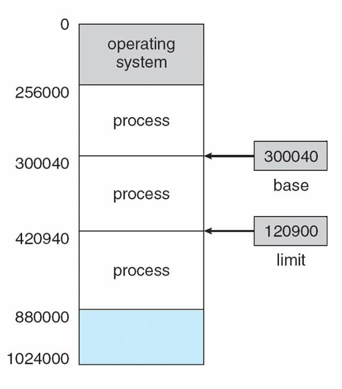

    - 通过**基址（Base）和界限（Limit）寄存器**实现保护和转换。

        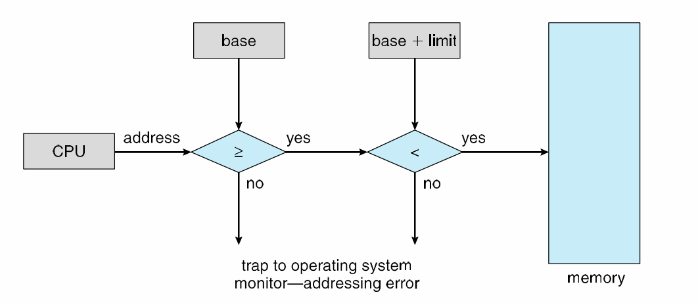

    - CPU 检查每次内存访问是否在界限内，否则触发异常（陷阱）。

- **内存管理单元 (MMU)**：

    - 负责将逻辑地址转换为物理地址的硬件部件（通常是 CPU 的一部分）。

    - **重定位寄存器**（即基址寄存器）是 MMU 的一个例子：`物理地址 = 逻辑地址 + 基址值`。

        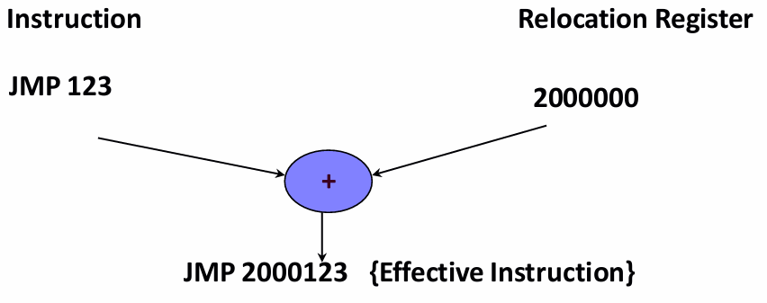

- **内存节约技术**：

    - **动态加载**：

        - 例程在需要被调用时才加载到内存。
        - 由程序设计实现，操作系统可提供库支持。
        - 提高了内存空间利用率。

    - **交换**：

        - 当进程总内存需求超过物理内存时，将进程在内存和磁盘（备份存储）之间移动。
        - **交换时间**主要取决于传输时间，可能很高（例如，传输 100MB 进程可能需要 4 秒）。
        - 现代系统使用**修改版的交换**：仅在空闲内存极低时使用（如 Linux、Windows）。
        - **移动系统**（iOS、Android）通常不支持传统交换（因闪存写入次数限制和性能差），而是采用终止应用或要求应用主动释放内存的策略。

        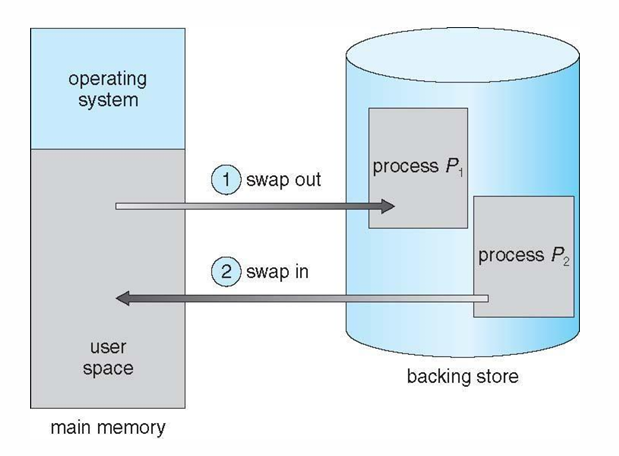

## Memory Allocation Techniques

- **连续内存分配**：

    - 早期方法，每个进程占据一块连续的内存区域。
    - 内存分为两个分区：**操作系统**（低地址）和**用户进程**（高地址）。

- **多分区分配**：

    - 内存被划分为大小可变的分区，分配给进程。
    - 进程结束时释放分区，产生**空闲分区（孔洞，Hole）**。
    - 相邻的空闲分区可合并。
    - 操作系统需跟踪**已分配分区**和**空闲分区**。

    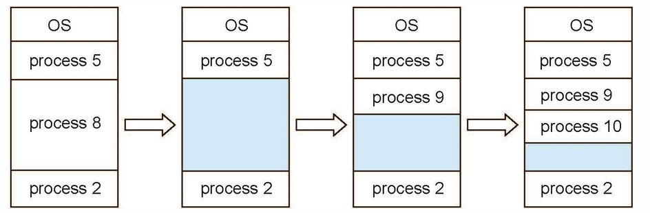

- **管理方法**：

    - **位图**：用一串比特位表示内存块是否空闲。可能很大，搜索可能慢。

        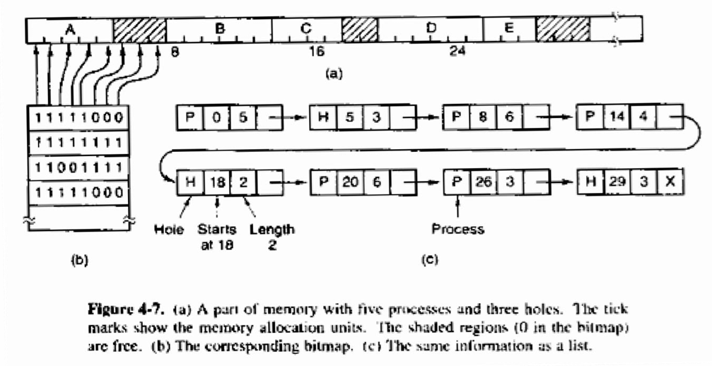

    - **链表**：维护一个空闲/已分配块的链表。更灵活，便于合并空闲块。

        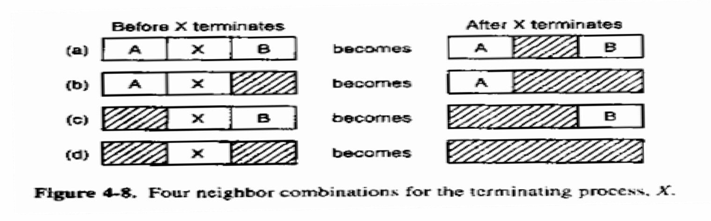

- **动态分配算法**（用于寻找空闲块）：

    - **首次适应**：从头搜索，找到第一个足够大的孔洞就分配。**速度快**，但可能产生碎片。
    - **下次适应**：从上次分配的位置开始搜索。性能略差于首次适应。
    - **最佳适应**：搜索整个链表，找到能满足要求的最小孔洞。**产生大量小碎片**，速度慢。
    - **最差适应**：搜索整个链表，找到最大的孔洞进行分配。旨在避免小碎片，但**平均性能最差**。

- **碎片化**：

    - **外部碎片**：空闲内存被分散成许多小孔洞，无法满足大进程的请求。

    - **内部碎片**：分配给进程的内存块比其实际需要的更大，块内部未使用的内存被浪费。

        

    - **压缩**：通过移动进程来合并外部碎片。**运行时操作，开销大**。


# File Systems


## File

*   **文件是什么？**
    *   由创建者定义的、相关信息的集合。通常代表**程序**和**数据**。
    *   是计算中最核心的概念之一。
    *   本质上是位、字节、行或记录的序列，其含义由创建者和用户定义。
    *   **作用**：存储大量数据、使信息在进程终止后仍能持久保存、允许多个进程并发访问数据。

*   **文件类型（内部结构）**
    *   **字节序列**：最常见的格式，操作系统不解释其内容。
    *   **记录序列**：由固定长度的记录组成，每条记录包含结构化的数据。
    *   **树形结构**：由可变长度的记录组成，通过键（Key）来定位记录（常用于大型机系统）。

*   **文件命名**
    *   文件通过**文件名**被识别。
    *   **文件扩展名**（如 `.txt`, `.jpg`, `.c`) 通常用于指示文件类型和格式。

*   **文件属性（元数据）**
    *   文件除了数据内容外，还有大量描述它的**属性**，例如：
        *   **保护/权限**：谁可以访问以及如何访问。
        *   **标志**：只读、隐藏、系统、存档等。
        *   **所有者、创建者**。
        *   **时间戳**：创建时间、最后访问时间、最后修改时间。
        *   **大小信息**：当前大小和最大大小。

*   **文件组织（目录结构）**
    *   文件被组织在**目录**（文件夹）中，形成树状层次结构（目录树）。
    *   **路径名**用于唯一标识文件在目录树中的位置（例如：`/usr/jim/dict`）。

*   **文件访问方式**
    *   **顺序访问**：按顺序从头到尾读取字节/记录。适用于磁带等介质。
    *   **随机访问**（直接访问）：可以直接跳转到文件的任意位置进行读写。对数据库系统至关重要。

*   **文件操作**
    *   操作系统提供系统调用来操作文件，常见操作包括：**创建、删除、打开、关闭、读、写、追加、定位、获取属性、设置属性、重命名**。

*   **文件碎片化**
    * 当文件被创建、删除和修改时，空闲磁盘空间会变成不连续的**碎片**。
    
    * 一个文件可能被分散存储在磁盘的多个不连续区域。
    
    * 这会导致访问文件时磁头移动增加，**降低性能**。
    
    * 图示展示了文件（A, B, C...）如何分散存储在磁盘块中，以及空闲块（孔洞）的分布。
    
        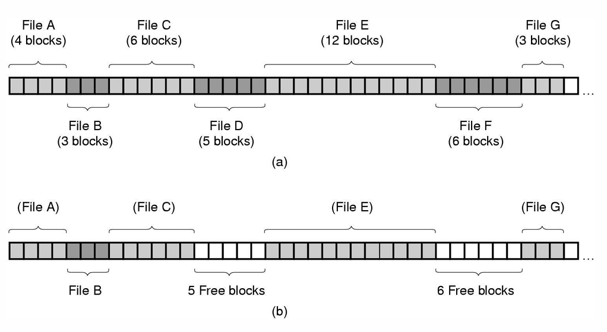

## File Systems

*   **文件系统的复杂性**
    *   文件系统非常复杂，因此采用**分层（抽象）** 设计来管理。
    *   **分层的好处**：降低复杂性和冗余度，各层可以独立实现。
    *   **分层的代价**：增加了开销，可能降低性能。

*   **分层文件系统模型（自底向上）**
    
    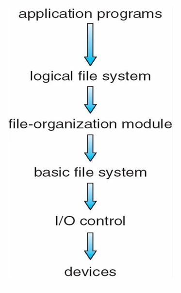
    
    1. **设备**：物理磁盘驱动器。磁盘由盘片、磁道、扇区、柱面组成。
    
        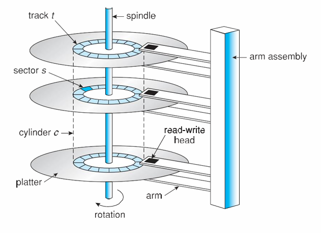

    2. **I/O 控制**：包含**设备驱动程序**和**中断处理程序**。负责向硬件控制器发送低级、特定的命令（如：**“read drive1, cylinder 72, track 2, sector 10,   into memory location1060”**）。
    
    3. **基本文件系统**：发出通用命令（如 **“retrieve block123”**），管理内存**缓冲区**和**缓存**（用于暂存传输中的数据或缓存常用数据）。
    
    4. **文件组织模块**：理解文件、逻辑块和物理块。负责将文件的**逻辑块号**转换为磁盘的**物理块号**。管理**空闲空间**和**磁盘分配**。
    
    5. **逻辑文件系统**：管理**元数据**信息。负责**目录管理**、**保护**（权限）。通过维护**文件控制块**（在 Unix 中称为 **inode**）将**文件名**转换为文件的位置句柄。
    
    6. **应用程序**：使用上述各层提供的服务来访问文件。
    
*   **文件系统类型**
    *   存在多种不同的文件系统类型：
        *   **CD-ROM**: ISO 9660
        *   **Unix**: UFS, FFS
        *   **Windows**: FAT, FAT32, NTFS
        *   **Linux**: ext2, ext3, ext4 等超过 40 种S
        *   **分布式文件系统**：如 NFS
        *   **新式文件系统**：ZFS, Google File System

*   **虚拟文件系统 (VFS)**
    *   VFS 是操作系统内核与具体文件系统（如 ext4, NTFS）之间的一个**抽象接口层**。
    *   **目的**：为上层应用程序提供**统一的系统调用接口**（API），来访问**不同类型**的文件系统（甚至是网络文件系统，如 NFS）。
    *   **工作原理**：应用程序调用通用的文件操作（如 `open`, `read`），VFS 将这些调用**分派**给底层对应的具体文件系统实现例程去执行。


# Processes and Threads


## Processes

*   **进程是什么？**
    
    *   有时称为**任务**或**作业**。
    *   **与程序的区别**：程序是指令（代码）的**静态**集合；进程是执行指令的**动态**活动。多个进程可以执行同一个程序。
    *   进程包含**程序代码**、**数据**和**执行状态**（如程序计数器和变量值）。
    *   **作用**：为各种 OS 和用户程序提供**隔离**（通过独立的地址空间等实现资源保护），并支持**并发**执行。
    
*   **进程隔离**
    *   通过硬件和软件技术保护每个进程免受其他进程干扰，防止进程 A 写入进程 B 的内存。

*   **多道程序设计**
    *   OS 和用户可以启动多个进程。
    *   **并行进程执行**：通常是**交错执行**（伪并行），多处理器可实现真正的并行。
    *   **切换**由调度器、进程状态和优先级决定。

*   **进程状态模型（生命周期）**
    1.  **新建**：进程正在被创建。
    2.  **就绪**：进程已准备好，等待被分配处理器。
    3.  **运行**：指令正在被执行。
    4.  **等待/阻塞**：进程正在等待某个事件发生（如 I/O 完成）。
    5.  **终止**：进程已完成执行。

*   **调度器与分派器**
    
    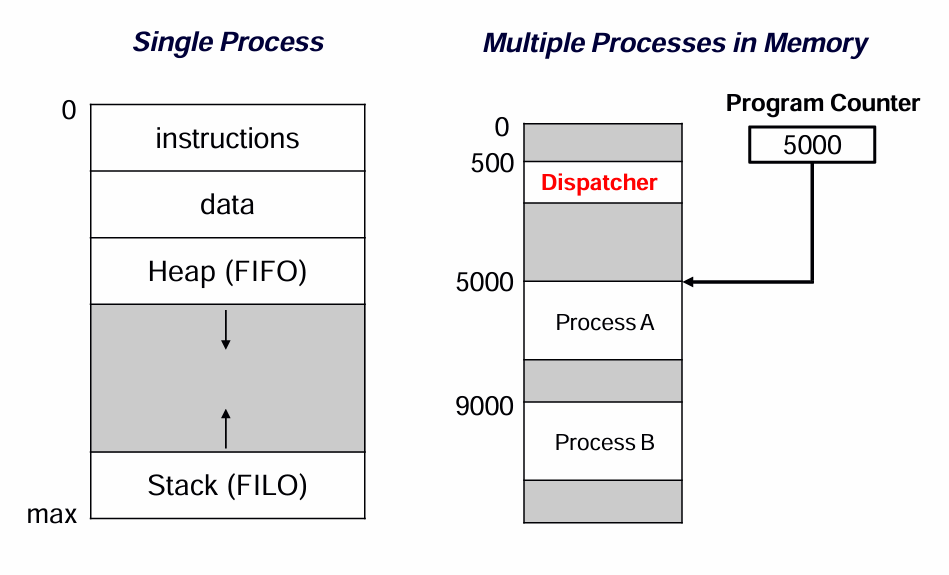
    
    *   **调度器 scheduler**：从就绪队列中选择下一个要运行的进程。
    *   **分派器 dispatcher**：将选中的进程切换到运行状态。其工作包括：
        *   执行**上下文切换**（保存/恢复寄存器等状态）。
        *   从内核模式切换到用户模式。
        *   跳转到用户程序的正确位置以重启它。
    *   上下文切换是**开销**，需要尽可能高效。
    
*   **进程控制块**
    *   **PCB** 是操作系统用于管理进程执行的数据结构。
    *   包含信息：**标识符、状态、优先级、程序计数器、内存指针、寄存器、I/O 信息、记账信息**。
    *   上下文切换时，当前进程的状态存入其 PCB，新进程的状态从其 PCB 加载。

*   **进程创建**
    
    *   **UNIX (`fork()` + `exec()`)**:
        
        * `fork()`: 创建一个新的进程。创建当前进程的**完整副本**（子进程）。子进程从 `fork()` 之后开始执行。**对父进程返回子进程 PID，对子进程返回 0。**
        
            ```c
            #include <stdio.h>
            #include <unistd.h> // 包含 fork() 的定义
            #include <sys/types.h> // 包含 pid_t 的定义
            
            int main() {
                pid_t pid; // 用于存储进程ID的类型
            
                printf("Before fork (PID: %d)\n", getpid());
            
                // 调用 fork()，创建分岔点
                pid = fork();
            
                // --- 从这里开始，代码被执行两次（一次由父进程，一次由子进程） ---
            
                if (pid < 0) {
                    // fork() 失败
                    fprintf(stderr, "Fork failed!\n");
                    return 1;
                } else if (pid == 0) {
                    // 这是子进程的代码分支 (返回值 == 0)
                    printf("I am the CHILD process. My PID is %d, my parent's PID is %d\n", getpid(), getppid());
                } else {
                    // 这是父进程的代码分支 (返回值 > 0，即子进程的PID)
                    printf("I am the PARENT process. My PID is %d, my child's PID is %d\n", getpid(), pid);
                }
            
                // 这个打印语句父子进程都会执行
                printf("This line is printed by both processes (PID: %d)\n", getpid());
            
                return 0;
            }
            ```
        
            **可能的输出结果：**
        
            ```text
            Before fork (PID: 1234)
            I am the PARENT process. My PID is 1234, my child's PID is 1235
            This line is printed by both processes (PID: 1234)
            I am the CHILD process. My PID is 1235, my parent's PID is 1234
            This line is printed by both processes (PID: 1235)
            ```
        
        * `exec()`: **加载**一个新程序到当前进程的地址空间，**覆盖**原有程序。
        
        * **常见用法**
        
            1. **`fork()` + `exec()`**：这是最经典的用法。
                - 父进程使用 `fork()` 创建一个子进程。
                - 子进程立即调用 `exec()` 系列函数（如 `execlp`, `execvp`）来**加载并执行一个全新的程序**，取代自己原有的代码镜像。
                - 这样既创建了新进程，又运行了新的程序。Shell 执行命令、Web 服务器启动新服务都是这么做的。
            2. **并行处理**：父进程创建多个子进程，每个子进程处理任务的一部分（例如，处理网络请求、计算数组的不同部分）。
        
    *   **Windows (`CreateProcess()`)**:
        *   单个函数调用，直接**加载指定程序**创建新进程。
        *   使用 `STARTUPINFO` 和 `PROCESS_INFORMATION` 结构来指定属性和接收信息。
    
*   **进程终止**
    
    *   原因包括：正常结束、边界 violation（段错误）、内存不足、算术错误、OS/操作员终止等。
    *   进程终止时向父进程返回状态码。
    *   UNIX: `exit()`, Windows: `ExitProcess()`。

## Threads

*   **线程是什么？**
    * 进程内的**多个并发执行路径**。
    
        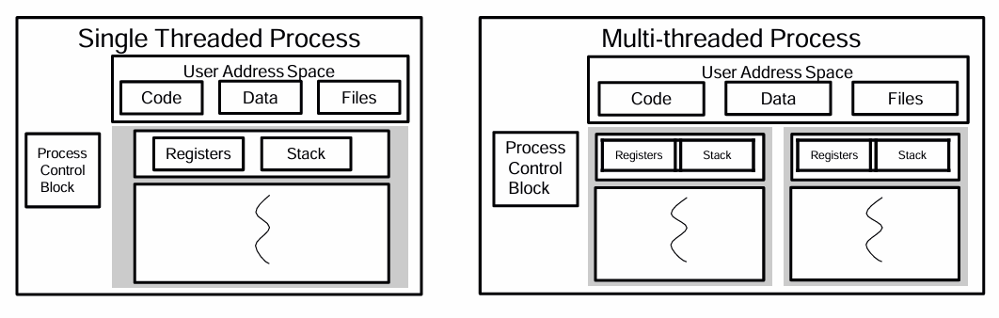
    
    * **轻量级进程**，是调度的基本单位。
    
    * 同一进程内的线程**共享地址空间**（代码、数据、文件），但各有自己的**寄存器**和**栈**。
    
    *   将**并发**（线程）与**保护**（进程）分离。
    
*   **为什么使用多线程？**
    
    *   **响应性**：部分线程阻塞时，程序仍可响应。
    *   **资源共享**：线程天然共享进程资源。
    *   **经济性**：创建线程比创建进程开销小。
    *   **多处理器利用**：线程可在多核上真正并行执行。
    *   **应用场景**：Web 服务器、重型 I/O 或计算、GUI 应用。
    
*   **线程生命周期与操作**
    *   进程通常从单个**主线程**开始。
    *   常见线程操作：
        *   **创建**：指定要运行的过程。
        *   **退出**：线程完成工作。
        *   **连接**：等待另一个特定线程结束。
        *   **让步**：主动放弃 CPU 让其他线程运行。

*   **线程实现**
    *   线程状态保存在**线程控制块**中。
    *   三种主要实现模型：
        1.  **用户级线程**：在用户空间实现，内核无感知。
            
            *   *优点*：创建/切换快，可自定义调度。
            *   *缺点*：一个线程阻塞系统调用会阻塞整个进程；无法利用多处理器。
            
            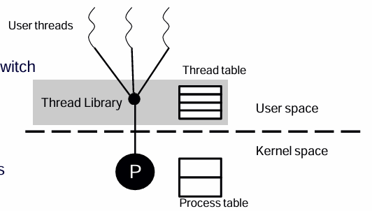
        2.  **内核级线程**：由操作系统内核直接管理。
            *   *优点*：内核充分调度（可利用多核），线程错误不会杀死整个进程。
            *   *缺点*：创建/切换慢，开销大。
            
            
        3.  **混合模型**（如 Solaris）：结合两者优点。
    
*   **Pthreads (POSIX 线程)**
    
    *   线程的**标准化 API**，可用于 UNIX 系统。
    *   关键函数：`pthread_create`, `pthread_exit`, `pthread_join`, `pthread_yield`。
    
*   **线程问题**
    *   **进程创建**：多线程进程调用 `fork()` 时的行为（是否复制所有线程）。
    *   **取消**：如何安全地终止未完成的线程（异步 vs 延迟取消）。
    *   **线程池**：预先创建一组线程，避免频繁创建销毁的开销。
    *   **同步**：多个线程访问共享资源时需要协调（后续讲座重点）。


# Interprocess Communication


## Process Cooperation

*   **进程回顾**
    *   进程是操作系统的执行单位，封装了执行状态，提供并发性和保护。
    *   **独立进程**：状态独立，行为是确定性的、可重现的。
*   **进程通信的需求**
    *   **进程协作**：当两个或多个进程**共享状态**时，它们的行为就不再是独立的。其执行结果取决于多个进程执行的相对顺序（**竞态条件**）。
    *   **两个核心问题**：
        1.  **传递数据**：如何在进程间交换信息。
        2.  **同步**：如何协调多个进程（如“多写者一读者”问题）对共享资源的访问，避免混乱。
    *   **根本挑战**：每个进程都有**独立的地址空间**，一个进程无法直接访问另一个进程的内存。操作系统必须提供机制来促进数据交换。

*   **生产者-消费者问题**
    *   这是一个经典的进程协作和同步模型。
    *   **生产者**：生成数据项并将其放入**缓冲区**。
    *   **消费者**：从缓冲区取出数据项并消费它。
    *   **关键挑战**：
        *   当缓冲区**满**时，生产者必须等待（休眠）。
        *   当缓冲区**空**时，消费者必须等待（休眠）。
        *   当生产者放入一个项使缓冲区从空变为非空，或消费者取出一个项使缓冲区从满变为非满时，需要**唤醒**对方。
    *   幻灯片中的代码示例展示了一个初步实现，但存在一个严重的**竞态条件**问题（`count` 变量可能在被检查和修改之间被中断），这引出了对更强大同步机制（将在后续讲座中讨论）的需求。

## Shared Memory

*   **是什么？**
    *   操作系统分配一块内存区域，并将其**映射**到多个合作进程的地址空间中。
    *   进程 A 暴露一部分内存，进程 B 将其“嫁接”到自己的地址空间。之后，它们就可以像访问普通内存一样读写这块共享区域。
*   **优点**
    *   **速度极快**：通信无需内核介入（在映射建立后），没有系统调用的开销。
    *   **访问方便**：无需特殊函数，直接读写内存即可。
*   **缺点**
    *   **无内置保护**：进程可能意外或恶意覆盖对方的数据。需要应用程序员自己控制访问。
    *   **需要同步**：必须使用额外的同步机制（如信号量、互斥锁）来保护**临界区**（访问共享数据的代码段），防止竞态条件。
    *   **模块化性差**：共享进程必须就共享内存的位置和数据的格式达成一致。
*   **使用方法 (API示例)**
    *   **POSIX** (`shmget`, `shmat`, `shmdt`, `shmctl`)
    *   **Windows** (`CreateFileMapping`, `MapViewOfFile`)
    *   库支持（如 Boost, Qt）
*   **文件映射**
    *   将文件直接映射到内存地址空间，实现对文件的共享内存式访问。
    *   Unix: `mmap`, Windows: `CreateFileMapping`

## Message Passing

*   **是什么？**
    *   内核提供 `send` 和 `receive` 等原语，进程通过调用这些原语来交换数据包（称为**消息**）。
    *   进程**不共享地址空间**，通信通过内核中转。
*   **消息格式**
    *   **定长**：实现简单，但传输大数据不便。
    *   **变长**：更灵活方便，但实现更复杂。
*   **寻址方式**
    *   **直接寻址**：`send` 和 `receive` 调用中直接指定目标进程或源进程的ID。
        *   `send(Q, message)` -> `receive(P, message)` （对称）
        *   `send(Q, message)` -> `receive(&id, message)` （非对称，接收方不指定发送方）
    *   **间接寻址**：通过**邮箱**或**端口**进行通信。进程向一个抽象的邮箱发送消息，从邮箱接收消息。
        *   `send(mailbox_A, message)` -> `receive(mailbox_A, message)`
        *   支持多种通信模式：**一对一、一对多（广播）、多对一（客户端-服务器）、多对多**。
*   **同步 vs. 异步**
    *   **同步（阻塞）**：
        *   `send` 会阻塞，直到消息被对方 `receive`。
        *   `receive` 会阻塞，直到有消息到达。
        *   行为像“约会”， tightly coupled，提供交付确认。
    *   **异步（非阻塞）**：
        *   `send` 立即返回，消息由内核缓冲。
        *   `receive` 立即返回，可能收到消息也可能收到空值。
        *   行为像“寄信”， loosely coupled，需要缓冲区，并发性更高。
    *   **混合**：最常见的组合是**非阻塞发送 + 阻塞接收**。发送方不阻塞，接收方在有工作做之前保持阻塞。
*   **缓冲**
    *   **零容量**：队列长度为0。发送方必须阻塞直到接收方准备好（** rendezvous **）。
    *   **有限容量**：队列有界。队列满时发送方阻塞。
    *   **无限容量**：队列无界。发送方从不阻塞。
*   **丢失的消息**
    *   可能因进程崩溃、网络问题（在分布式系统中）而丢失。
    *   处理机制：**超时、确认机制、内核通知**。
*   **用消息传递实现同步**
    *   幻灯片示例展示了如何使用一个邮箱和空消息来实现**互斥锁**，保护临界区。这证明了消息传递机制的能力。

