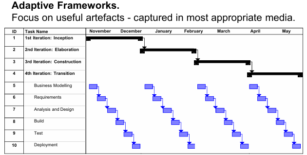

# Professional Computing 

[TOC]

# Objectives

• Describe the characteristics of modern software engineering projects and  employ appropriate project management techniques.

• Use appropriate techniques to manage and evaluate the performance of  software projects.

• Evaluate their strengths and weakness as an individual and as a member of a team  and will be able to develop a personal development plan that reflects their findings.

• Present technical reports and well-reasoned arguments, using credible  sources and cited appropriately, both orally and in written form to a professional  standard. 

• Present themselves as a computer science professional who is aware of  relevant legal, social, ethical and professional issues that affect their discipline.


# 1.British Computer Society

The BCS is the industry body for IT  professionals.

The BCS offers “tools, content,  qualifications and opportunities to network with thought leaders and  renowned organisations”…


# 2.The Age of Computing


## 2.1.The long term trends behind the modern age of computing  


Computing underpins modern life

Digital economy

Information Age


## 2.2.Computers are getting smarter


## 2.3.Artificial Narrow Intelligence


# 3.Introduction to the Computing  Profession

## 3.1.Typical careers in the IT Industry Software Development and Support


## 3.2.Be Professional

 “Meticulous adherence to undeviating courtesy, honesty, and responsibility in one's  dealings with customers and associates, plus a level of excellence that goes over  and above the commercial considerations and legal requirements.”

## 3.3.Computing

A **Process** to build **Products** that Deliver **Value**

## 3.4.Professional responsibility in Computing

1. **Confidentiality（保密性）**：
   - 计算机专业人士应该尊重雇主或客户的机密信息，无论是否签署了正式的保密协议。这意味着，在任何情况下，他们都不应泄露或滥用雇主或客户的敏感信息。
2. **Competence（能力）**：
   - 计算机专业人士不应虚假表示自己的能力水平。他们应确保自己接受的工作在自己的能力范围内。如果任务超出了他们的专业能力，他们应拒绝接受。这样可以避免因能力不足而导致的错误或不当行为。
3. **Intellectual Property Rights（知识产权）**：
   - 计算机专业人士应了解当地的知识产权法律，包括专利、版权等。他们有责任确保雇主或客户的知识产权得到保护，避免侵犯他人的创作成果。
4. **Computer Misuse（计算机滥用）**：
   - 计算机专业人士不应滥用他们的技术技能来损害他人的计算机系统。计算机滥用的范围从相对轻微的行为（如在雇主的机器上玩游戏）到极其严重的行为（如传播病毒）。这种行为不仅违法，而且违反职业道德。
5. **Integrity（诚信）**：
   - 计算机专业人士必须以诚实和负责任的方式行事，才能被尊重为专业人士。伦理行为不仅仅是遵守法律，还包括遵循道德上正确的原则。诚信和道德行为是赢得他人信任和尊重的基础。


## 3.5.BCS Code of Conduct（英国计算机学会职业道德规范）


1. **Public Interest**   You make IT for everyone…

2. **Professional Competence and Integrity**   Show what you know,  learn what you don’t

3. **Duty to Relevant Authority**   Respect the organisation or  individual you work for

4. **Duty to the Profession**    Keep IT real, keep IT professional,  pass IT on.


# 4.Digital Technologies 

## 4.1.Hardware

### The Five Elements in a Computer System

**3 Technical Elements**: Software, Hardware, Networks
**2 Human Elements**: People, Process


### The long term trends in Hardware

Very Early Computers (80 BCE): **The Antikythera Mechanism 安提凯特拉机械**  Greek brass instrument to calculate the position of sun, moon and Venus. 

Early Computers (1842): Charles Babbage designed **the Analytical Engine. 分析机**

First Electronic Computer (1943): **First** **Collossus 科洛苏斯计算机**, Alan Turing built to crack encrypted communications 

First Business Computer (1957): **Lyons Electronic Office (LEO)** **莱昂电子办公室**


### The Pace of Change


### Digital Convergence on hardware standards


### Moore’s Law

“that innovations in technology would allow a doubling  of the number of transistors in a given space every year”


### Dark Sides: e-waste

### Future Trend: Cloud Computing, IoT

### Hardware issue

1. Lifetime Cost of Ownership

    Keeping hardware, **simple, homogenous, from a single supplier** … can keep costs relatively low


## 4.2.Network

### Computer Network

**a group of computers** that use a set of common digital  protocols over wired and wireless connections **to share resources.**

### Development of Networks  

Early Networks (Analogue): Napoleon’s “Telegraph” Networks  **拿破仑时代**

Early Networks (Electronic): Electric Telegraph Victorian era: a race to develop the first electronic version of the mechanical  telegraph networks  **维多利亚时代**

Early Networks (Global): a cable connected Europe and America in （1858）  **1858年欧洲与美洲连接的电缆**

First e-Commerce (1872)  **第一次电子商务**

The Victorian Internet - at the Telegraph Museum  **维多利亚互联网 - 电报系统的形成**

The Telephone Network—Alexander Graham Bell （1876） **电话网络——亚历山大·格雷厄姆·贝尔**


### The Internet revolution - 4 new global communication channels


 Internet communication channels are:  **Global,   Cheap,   Easy to Use,   Public**  

The same public technologies is also used for: **Personal Smartphones,   IoT devices,  Business Intranets ,   Extranets**

## 4.3.Software

### Definition of Software  

the set of **machine-readable instructions and executable code** that runs on hardware **plus** all the related **human-readable program code and documentation** 

### Characteristics of Software

Invisibility, Complexity, Conformity, Flexibility

### Development of Software

First Computer Software: Ada Lovelace **阿达·洛夫莱斯** (algorithm to calculate Bernoulli numbers with Analytical Engine)

### The Value  of Application Software

• Time savings.  • Improved accuracy.  • Automation of routine tasks. • Compatibility.  • Interfaces. 

### Timeline


### Types of  Software Applications( 4-8 networked)

1. **独立应用程序（Stand-alone applications）**： 这些应用程序在本地计算机（如个人电脑）上运行，包含所有必要的功能，不需要连接到网络。它们可以独立工作，通常是单机版软件，如某些桌面软件或本地安装的应用。
2. **嵌入式控制系统（Embedded control systems）**： 嵌入式控制系统是用于控制和管理硬件设备的软件系统。这类系统通常嵌入到特定的硬件中，广泛应用于智能设备、家电、汽车电子、工业自动化等领域。数量上，嵌入式系统可能是目前最多的一种系统类型。
3. **建模与仿真系统（Systems for modelling and simulation）**： 这类系统由科学家和工程师开发，用于模拟物理过程或复杂的情境，通常涉及多个独立的、相互作用的对象。例如，气象模拟、飞行仿真、工程设计中的物理建模等都属于这一类。
4. **娱乐系统（Entertainment systems）**： 这些系统主要是为个人用户提供娱乐功能的软件系统。它们可能包括视频游戏、音乐播放器、电影播放软件等，目的是让用户获得娱乐和放松。
5. **数据采集系统（Data collection systems）**： 数据采集系统通过一组传感器从环境中收集数据，并将数据发送给其他系统进行处理。这类系统常用于监控、环境监测、物联网（IoT）设备等应用。
6. **实时事务型应用（Real-time Transaction-based applications）**： 这类应用程序在远程计算机上执行，用户通过个人电脑或终端访问。这包括企业资源计划（ERP）系统、电子商务应用等，它们通常需要实时处理交易数据，如在线支付、库存管理等。
7. **批处理系统（Batch processing systems）**： 批处理系统是用于处理大量数据的业务系统。它们通常一次处理大量输入数据，然后生成相应的输出。虽然现代系统已经更多采用实时处理，但一些老旧的系统仍然使用批处理方式来处理数据，例如银行的批量结算系统等。
8. **系统中的系统（Systems of systems）**： 这些系统由多个独立的软件系统组成，相互协作、互动，形成一个更为复杂的系统。比如大型的综合管理平台、智能城市的综合信息管理系统等，通常包括多个子系统，如交通管理、环境监控、公共安全等。


### Types of Software products

1. **定制化产品（Customized (one-off) products）**： 这类软件是根据特定客户的需求量身定制的，通常只为该客户提供，且仅满足其特定的功能要求。定制化软件通常在开发过程中会进行详细的需求分析，以确保软件能够精确满足客户的要求。
    **例子**：
   - 英国政府的税务系统
   - 英国国家卫生服务系统（NHS）的COVID-19应用
   - NatWest银行的系统
   - 嵌入式控制系统
   - 交通监控系统
2. **通用产品（Generic products）**： 这些是标准化的软件产品，通常作为独立的系统进行销售，面向广泛的客户群体，任何愿意购买的用户都可以使用。它们也称为“包装软件”（packaged software），这些产品不是为某一个特定客户量身定做，而是广泛应用于不同的用户或市场。
    **例子**：
   - 个人电脑软件，如图形程序
   - 旧版的Sage会计软件
   - 旧版的Microsoft Office
   - 专门针对某些特定市场的软件，如医院的电子健康记录系统
3. **软件即服务（Software-as-a-Service，SaaS）**： SaaS是一种通过云服务提供的软件产品，用户可以租赁或免费使用该软件，通常按订阅模式付费，面向大量的客户。SaaS产品不需要用户安装和维护软件，而是通过互联网提供服务。
    **例子**：
   - Google（例如Gmail、Google Drive等）
   - Facebook
   - 新版的Sage会计软件
   - Microsoft 365
   - MindMeister（思维导图软件）
   - TransferWise（现更名为Wise，用于跨国转账）
   - 几乎所有现代的云服务应用

### Layered architecture model for software in a computer


### The Issues that Affect Software 

1. **异构性（Heterogeneity）**
    随着技术的发展，系统需要作为分布式系统在不同类型的计算机和移动设备之间进行操作。这些设备可能有不同的硬件架构、操作系统和网络协议，导致它们之间的兼容性和协同工作变得更加复杂。
2. **商业和社会变革（Business and social change）**
    随着新兴经济体的崛起和新技术的出现，商业和社会的变化速度越来越快。企业和社会需要能够快速地修改现有软件，并迅速开发新的软件，以适应快速变化的需求。
3. **安全性和信任（Security and trust）**
    随着软件渗透到我们生活的方方面面，确保软件的安全性和可靠性变得至关重要。我们必须能够信任软件的行为和数据处理，防止潜在的安全漏洞或恶意行为。
4. **规模（Scale）**
    软件的开发涉及非常广泛的规模，从非常小的嵌入式系统（如便携式或可穿戴设备）到互联网级别、云计算平台的系统，这些系统需要为全球社区提供服务。这要求软件能够适应不同规模的需求，并且能够在不同层级上高效、稳定地运行。


###  Essential attributes of good software

1. **可维护性（Maintainability）**
    软件的可维护性是指软件在其生命周期内，能够在出现问题时方便地进行修复、更新或改进。这包括代码的可读性、结构的清晰度以及是否能够轻松地进行修改和扩展。
2. **可靠性与安全性（Dependability and Security）**
    软件的可靠性包括多个方面，例如其稳定性、安全性和安全防护。一个可靠的软件系统应当能够在发生系统故障时，不会造成物理或经济上的损害。同时，系统应当具备足够的安全措施，防止恶意用户访问或破坏系统。系统的安全性是保护数据、保持用户隐私和防范网络攻击的关键。
3. **效率（Efficiency）**
    软件应尽量避免浪费系统资源，如内存和处理器周期。效率不仅仅包括响应速度和处理时间，还涉及到内存利用率等因素。高效的软件能够最大限度地优化资源使用，提供快速响应并处理更多的任务。
4. **可接受性（Acceptability）**
    软件必须符合预期用户群体的需求和期望。这意味着软件应当易于理解和使用，同时能够与用户所使用的其他系统兼容。无论是界面友好度、操作便捷性还是与其他软件的集成能力，都是软件是否被接受的重要标准。


# 5.Software Development Processes


## 5.1.Systems Development Life Cycle（SDLC）


### Initiation

### Feasibility Study

### Requirement Analysis

### System Design

### Build

#### Types of reusable software

1. **复制和粘贴（Copy and Paste）**
    这种重用方式是最差的类型，因为它只是简单地将代码从一个地方复制并粘贴到另一个地方。这种方式不仅会导致冗余代码，而且难以维护和更新，且没有良好的模块化，增加了代码出错的风险。
2. **编码库（Coding Libraries）**
    编码库是由一组程序代码组成的集合，这些代码已经被打包好，可以直接集成到其他程序中使用。它们通常提供一些常用的功能或工具，帮助开发人员减少重复工作，提高开发效率。
3. **开源（Open Source）**
    开源是指那些可以自由获取并使用的编码库，这些库是由大量开发者社区开发和维护的。开源代码通常可以根据需要修改和分发，促进了开发者之间的合作和共享。
4. **基于组件的架构（Component-Based Architecture）**
    基于组件的架构是由多个软件组件组成的集合，每个组件都可以独立开发和部署。通过将应用程序拆分成多个小的、独立的组件，可以提高软件的可重用性、可维护性和可扩展性。
5. **Web服务（Web Services）**
    Web服务是指可以通过互联网访问的服务，其他软件可以调用这些服务并执行相应的功能。Web服务通常使用标准的通信协议（如HTTP、SOAP或REST）进行交互，支持跨平台和跨系统的集成。
6. **微服务（Microservices）**
    微服务是指将应用程序分解为多个小而独立的服务，这些服务通过松耦合的方式进行协作。每个微服务执行一个具体的功能，可以独立开发、部署和扩展。这种架构适用于需要高度可伸缩性和灵活性的系统。
7. **软件产品（Software Products）**
    软件产品通常指的是现成的商业应用系统（COTS, Commercial-Off-The-Shelf）。这些系统已经开发好，可以直接购买和使用，并且可以根据特定的环境或需求进行配置和定制。它们不需要从零开始开发，节省了开发时间和成本。

### Implement

### Maintain

### Kill


##  5.2.The software development process

Many different software process approaches but all involve:

- **Specification** –defining what the system should do

- **Design** –making decisions about the architecture of the system

- **Build** –building the software (programming)

- **Validation** –checking that it does what the customer wants

- **Implementation** –actually implementing the software as a business system

- **Evolution** –changing the system in response to changing customer needs.


### Waterfall Model

- 每个阶段按顺序进行，前一阶段的成果完成后才能进入下一阶段。适用于需求明确且不易变动的项目。
- 
- 优点：
  1. **瀑布模型基于一个强大的概念：**
     - 思考要构建什么；
       - 这是指在开发过程中，首先需要明确要构建的目标是什么，进行详细的需求分析，确保项目的目标和要求清晰明确。
     - 确定如何构建的计划；
       - 一旦目标明确，就需要制定详细的计划，包括如何实现这些目标，选择合适的技术、工具和方法。
     - 开始构建；
       - 然后按照计划执行开发工作，编写代码、设计系统等，最终实现产品。
  2. **一种严谨的方法（A disciplined approach）：**
     - 瀑布模型强调严格的阶段划分和执行顺序。每个阶段的输出作为下一个阶段的输入，确保开发过程规范、系统。
  3. **强制精确定义需求（Forces a precise definition of requirements）：**
     - 瀑布模型要求在开发初期明确并详细地定义需求，不允许模糊或随意的需求变动。这有助于减少后期的修改和重工。
  4. **包括一系列分析和设计工具，它们本身非常有用（Includes a range of analysis and design tools that are, in themselves, very useful）：**
     - 瀑布模型采用了一系列的分析和设计工具（如需求分析工具、系统设计图、详细的技术规格文档等），这些工具能够帮助团队清晰地理解需求和设计，提升开发效率和质量。
  5. **避免错误和返工（allegedly）：**
     - 理论上，瀑布模型通过严格的需求定义和阶段性输出检查，可以避免开发过程中出现错误和后期的返工。由于每个阶段都有清晰的验收标准，错误能够在早期发现并纠正。
  6. **大多数人都能理解（It’s understood by most people）：**
     - 瀑布模型是开发中最经典、最基础的模型之一，许多人都熟悉它的流程和结构。因此，团队成员和相关利益方更容易理解和参与项目管理和沟通。
  7. **尽管存在灾难——它仍然被许多组织成功使用（Despite the disasters – it is used successfully by many organisations）：**
     - 尽管瀑布模型曾在一些项目中因其僵化的流程和缺乏灵活性而导致失败（如无法应对需求变化），但它仍被许多组织成功采用，尤其是在需求明确、变化少的项目中，能够有效地管理项目进度和质量。


### V-Model

- 类似于瀑布模型，但每个开发阶段都有相应的验证或测试活动。每个开发阶段（如需求分析、设计、编码、测试等）都会产生一些文档或是未实际使用的代码/软件。也就是说，瀑布模型中的每个阶段往往都会先产生详细的文档（例如需求文档、设计文档），而这些文档本身并不会直接执行，而是作为后续阶段的基础或参考。
- 


### Iterative Model

- 项目分多个迭代周期进行，每个迭代周期都包含需求分析、设计、开发和测试等活动。每次迭代交付一个可运行的部分，逐步完善系统。
- **RAD 快速应用程序开发（Rapid Application Development)**
  1. **快速应用程序开发（RAD）**：
     - RAD是一种快速开发方法，通常由**小型团队**实施。这些团队与**用户社区**保持紧密合作，快速地构建系统的**原型**并进行测试和验证。
     - 在RAD中，开发团队的目标是快速开发出能够展示系统功能的初步版本，便于用户进行反馈。
  2. **原型（A prototype）**：
     - 原型是系统的初步版本，可能是部分功能或者整个信息系统的框架。这个原型通常是一个简化版，目的是帮助**最终用户**对系统进行评估和反馈。
     - **原型的作用**是展示系统的基本功能和设计思路，帮助用户理解系统的工作方式，从而提出改进意见。
  3. **一个迭代过程**：
     - RAD的开发过程是一个**迭代过程**，意味着系统的开发是反复进行的。在每一轮迭代中，开发团队都会根据用户的反馈对原型进行修改和优化。
     - 用户在每个原型版本后提出**修改建议**，然后开发团队基于这些反馈制作新的原型，直到最终版本的系统完成。
- 
- 优点：
  1. **严重的误解会在生命周期的早期显现出来，这时候可以做出反应**：
     - 在项目的初期，通过不断的原型测试和反馈，团队能够及早发现并纠正潜在的严重误解和错误，从而避免在后期阶段出现更大的问题。
  2. **它使得并鼓励用户反馈，以便获取系统的真实需求**：
     - RAD方法强调用户参与，用户可以在早期阶段提供反馈，这有助于准确把握用户的真实需求，确保最终开发的系统符合用户的期望。
  3. **团队被迫首先关注项目中最关键的问题**：
     - 由于项目的开发是通过迭代进行的，团队必须优先处理项目中最为重要和紧急的任务，确保关键问题得到及时解决。
  4. **持续的、迭代的测试使得项目状态能够进行客观评估**：
     - 通过持续进行原型测试和评估，团队能够客观地了解项目的进展和当前状态，及时调整开发方向，确保项目顺利推进。
  5. **需求、设计和实现之间的不一致能在早期被发现**：
     - 在RAD过程中，由于原型和反馈的快速迭代，团队可以早期发现需求、设计和实现之间的差异或冲突，减少后期修改的成本和风险。
  6. **团队的工作负载（甚至测试团队）在整个项目生命周期中更加均衡分配**：
     - RAD方法通过迭代的开发和持续的反馈，使得团队的工作负载不至于集中在某一阶段，而是均匀分布在整个项目生命周期中，从而避免了某一阶段工作过于繁重或紧张的情况。
  7. **团队可以在过程中汲取教训并持续改进**：
     - 由于项目是通过反复的原型和反馈迭代进行的，团队可以在每一轮迭代中总结经验教训，持续改进开发过程和产品质量。
  8. **利益相关者在整个过程中都能获得项目状态的具体证据**：
     - 利益相关者可以通过原型、测试结果和阶段性评估，清楚地了解项目的进展情况，这有助于提高项目的透明度和各方的信任度。

### Spiral Model

- 结合了瀑布模型和迭代模型的特点，重点关注风险管理。每个周期都包含规划、风险分析、工程开发和测试等活动，适用于复杂或风险较高的项目。
- 

### Unified Process




### Rational Unified Process

UP的生命周期分为以下四个阶段，每个阶段都有不同的目标和任务：

(1) **Inception（启动阶段）**

- **目标**：明确系统的范围、关键需求、风险和初步的技术架构。定义项目的可行性，确定项目是否值得进一步投入。
- **活动**：分析需求，编写初步的项目计划，识别风险和约束，创建初步的项目需求文档。
- **产物**：项目章程、初步需求、风险评估。

(2) **Elaboration（详细设计阶段）**

- **目标**：在该阶段中，系统的架构和核心设计得到明确，并且更深入地分析和细化需求。解决关键技术风险，形成系统架构基础。
- **活动**：完善需求，进行详细的分析与设计，选择和验证技术架构，进一步评估和控制项目风险。
- **产物**：架构设计文档、详细需求文档、风险管理计划。

(3) **Construction（构建阶段）**

- **目标**：构建系统的实际产品，完成系统的核心功能，进行模块开发、集成和测试。此阶段的目的是完成大部分功能和系统构建。
- **活动**：开发和集成系统功能，进行单元测试、集成测试，进行详细的编码和文档编写。
- **产物**：功能完备的系统、用户文档、测试结果。

(4) **Transition（过渡阶段）**

- **目标**：将系统交付给用户，进行最终的质量保证和交付工作。该阶段的重点是系统的部署和用户培训。
- **活动**：系统部署、用户培训、数据迁移、最终用户验收测试。
- **产物**：部署文档、最终用户支持、生产环境部署。


### Agile Model

- 强调灵活性和快速交付，使用短周期的开发迭代（通常为1到4周），在每个迭代结束时交付一个可工作的产品增量。适用于需求变化频繁、团队协作密切的项目。

### Incremental Model

- 将系统分解为多个增量，每个增量都是一个完整的小功能模块。每个增量在开发完成后逐步集成，最终形成完整的系统。


# 6.Agile Software Development


## 6.1.Evolution of  Software Engineering Methods

1. 1840年代 - **第一位软件程序员，艾达·洛夫莱斯 (Ada Lovelace)**

艾达·洛夫莱斯是世界上第一位程序员，她通过为查尔斯·巴贝奇的分析机编写算法，成为了计算机科学的先驱之一。她虽然没有实际使用计算机，但她的工作奠定了“程序”这一概念。

2. 1940年代 - **第一台现代计算机，汤米·弗劳尔斯 (Tommy Flowers)**

汤米·弗劳尔斯是英国的一位电信工程师，他设计并实现了“Colossus”计算机，这台计算机被用于破解二战期间的密码。同时，艾伦·图灵等数学家对计算机科学的发展也作出了重要贡献。

3. 1950年代 - **早期的软件开发**

在1950年代，软件开发几乎是随机的、无序的。开发过程缺乏规范和标准，因此很难维持和支持，软件的可靠性和维护性也较差。

4. 1960年代起 - **软件“工程”化**

从1960年代起，软件开发逐渐借鉴其他工程学科的方法，开始采用“生命周期”方法，例如“系统开发生命周期”（SDLC）。这种方法尝试系统化软件开发过程，按阶段进行设计、开发、测试和维护。

5. 1970年代起 - **瀑布模型**

1970年代起，软件开发开始采用“瀑布模型”（Waterfall Model）。瀑布模型是一个线性顺序的开发流程，各个阶段严格按照顺序执行。SSADM（结构化系统分析与设计方法）是当时应用的典型方法，这一时期的软件开发主要用于大型项目。

6. 1980年代起 - **软件与“硬件工程”的差异**

1980年代，软件开发领域逐渐认识到软件与硬件工程存在本质差异。软件开发的灵活性、变化频繁性和抽象性使其与传统硬件工程截然不同。

7. 1990年代起 - **迭代方法 (Iterative (Incremental) methods)** 

1990年代，软件开发开始采用迭代（增量）方法。例如，快速应用开发（Rapid Application Development, RAD）方法强调快速原型和持续改进，允许在开发过程中不断调整和优化需求。

8. 2000年代起 - **软件包和组件化  (Package software and components)，敏捷方法(Agile)**

2000年代，软件开发开始更多地使用现成的软件包和组件，以提高效率和可维护性。同时，敏捷开发（Agile Development）方法兴起，强调快速响应变化、与客户的紧密合作以及灵活应对需求的变化。

9. 2010年代起 - **分布式架构 (Distributed architectures) 和敏捷方法 (Unified Process and Agile)**

2010年代，随着Web浏览器和智能手机应用的发展，软件架构越来越趋向于分布式。统一过程（Unified Process）和敏捷方法成为主流，开发工具也在不断进步，使得软件开发更加高效。

10. 2020年代 - **云平台和多设备应用 (Web dev)**

到了2020年代，Web开发领域更加注重云平台上的多层架构，支持分布式和跨设备应用。DevOps（开发与运维一体化）和有纪律的敏捷开发（Disciplined Agile Development, DAD）成为主流开发模式，促进了软件开发过程的自动化和高效性。


重点：

1980s—recognition that software is fundamentally different from hard engineering  

1990s—Iterative methods (e.g. Rapid Application Development Method)  

2000s—Package software and components. Agile  

2010s—Unified Process and Agile


## 6.2.Agile vs Plan-Driven Development

### agile development


敏捷开发是一种更加灵活、迭代和合作的开发方法，强调快速响应变化、持续交付和团队协作。敏捷开发的特点如下：

- **需求、设计、实现与测试交织进行 Program specification, design and implementation are inter-leaved in agile  development：** 在敏捷开发中，需求分析、设计、实现和测试是并行进行的，它们不是严格分阶段的，而是不断交替进行。这种交织的工作方式使得开发过程更具灵活性，能够快速响应需求变化。
- **版本化开发与持续反馈 The system is developed as a series of versions or increments：** 系统被开发成一系列的版本或增量，每个版本都是可用的产品，开发过程中，利益相关者会参与版本的定义和评估，确保每个增量符合实际需求。
- **频繁交付  Frequent delivery of new versions for evaluation：** 每个版本的开发都需要进行频繁交付，目的是尽早让利益相关者评估软件的功能和质量，以便及时发现问题并进行调整。
- **工具支持 Extensive tool support：** 敏捷开发通常使用大量的工具来支持开发过程，比如自动化测试工具、持续集成工具等，以提高开发效率和质量。
- **最小化文档 Minimal documentation ：** 敏捷开发强调“工作代码”而非过多的文档工作。文档只做最基本的记录，重点是让代码能实际运行和满足需求。

### plan-driven develpoment


计划驱动开发是一种传统的软件工程方法，通常基于明确的、分阶段的开发流程。它的特点是：

- **阶段化开发  Based around separate development stages with the outputs to be produced at each of these stages planned in advance.：** 开发过程分为多个独立的阶段，每个阶段有明确的目标和输出，并且这些输出在项目开始之前就已被规划好。例如，需求分析、设计、实现、测试等阶段是线性进行的，每个阶段完成后才能进入下一个阶段。
- **不一定是瀑布模型 Not necessarily waterfall model：** 计划驱动开发虽然常常被与瀑布模型联系在一起，但它并不一定仅限于瀑布模型。计划驱动开发可以是增量式开发，即在多个小的阶段中逐步完善系统。
- **迭代发生在活动中 Iteration occurs within activities：** 在计划驱动开发中，可能会在某些活动（如设计或开发）中进行迭代，以改进某个方面或解决问题，但整体开发流程仍是严格的、按顺序的。


### Let’s be Agile… 

**No Requirements Specification**    Actually there is a spec but…  In Agile approaches the “specs” are **UML diagrams** and short bits of text like vision,  scope, user stories etc.


## 6.3.The Agile Manifesto (2001)


### Core Value

1. **个人和交互高于流程和工具 Individuals and interactions over processes and tools ：**
    强调团队成员之间的协作与沟通比单纯依赖工具或预定流程更加重要。良好的沟通和团队协作可以帮助项目更高效地推进。
2. **工作的软件高于详尽的文档 Working software over comprehensive documentation：**
    注重交付能够运行的功能和产品，而不是过多的文档工作。虽然文档仍然重要，但核心目的是交付高质量的软件，而不是繁琐的文档。
3. **客户合作高于合同谈判 Customer collaboration over contract negotiation：**
    强调与客户的紧密合作，优先满足客户需求。开发团队与客户保持密切的互动和反馈，以便随时调整开发方向。
4. **响应变化高于遵循计划 Responding to change over following a plan：**
    在项目开发过程中，需求可能会发生变化，因此敏捷方法强调能够灵活应对变化，而不是一味按照预先制定的计划推进。敏捷开发可以快速适应市场或客户需求的变化。

A shorter and easier version:  

- Let's talk to each other  

- Let's just build it and show you  

- Let's trust each other  

- Let's respond to what is happening and what we learn


### 12 Principles

1. **Our highest priority** is to satisfy the customer through early and continuous delivery of valuable software. 
2. **Welcome changing requirements**, even late in development. Agile processes harness change for the customer’s  competitive advantage. 
3. Deliver working software frequently, from a couple of weeks to a couple of months, with a preference to the shorter  timescale. 
4. Business people and developers must work together daily throughout the project. 
5. Build projects around motivated individuals. Give them the environment and support they need and trust them to get the  job done. 
6. Agile processes promote **sustainable development**. The sponsors, developers, and users should be able to maintain a constant pace indefinitely. 
7. Continuous attention to technical excellence and good design enhances agility. 
8. Simplicity–the art of **maximizing** the amount of work not done–is essential. 
9. The most efficient and effective method of conveying information to and within a development team is **face-to-face conversation**. 
10. **Working software** is the primary measure of progress. 
11. The best architectures, requirements, and designs emerge from self-organizing teams. 
12. At regular intervals, the team reflects on how to become more effective, then tunes and adjusts its behaviour accordingly.


1. **高优先级需求是通过早期交付并持续交付可工作的软件来满足客户的需求。**
2. **欢迎需求变化，即便是在开发后期，敏捷过程可以帮助客户获得竞争优势。**
3. **频繁交付功能完善的、可运行的软件，周期可以是几周到几个月，最好是几周。**
4. **业务人员与开发人员必须全天候紧密合作。**
5. **通过建立信任的环境，让开发人员能够以自我组织的方式来高效完成任务。**
6. **为项目提供可持续的进度，以便开发者能够持续工作而不至于疲惫。**
7. **关注技术卓越和良好的设计，使得敏捷开发更具长期价值。**
8. **简化工作，关注最小化不必要的工作，最大化工作产出的价值。**
9. **通过面谈、演示等方式让团队和客户保持频繁的交流和反馈。**
10. **可工作的软件是衡量进度的主要标准。**
11. **敏捷开发过程中，团队成员应为相同目标而努力，以保持高效协作。**
12. **在定期的反思中，团队应该审视自己并不断优化开发过程。**


## 6.4.Example of Agile Development: at least 3 iterations


### Wireframe

在第一个迭代中，主要集中在**快速构建产品的基本结构和功能原型**。这一阶段的目标是快速验证概念，并确保开发的方向是正确的，便于后续的设计和开发工作。

- **内容**：
  - **框架设计**：通过简单的线框图（Wireframe）来展示产品的主要界面和功能布局，而不考虑细节（如颜色、字体等）。这时可以使用工具（如Balsamiq、Figma等）创建低保真的页面原型，快速展示界面元素的组织结构。
  - **目标**：让团队和客户（或产品负责人）快速查看产品的布局和流程，确认核心功能和交互逻辑。
  - **输出**：低保真原型图和用户流程图。
- **反馈**：
  - 通过反馈收集用户需求和改进建议，检查是否符合客户和业务目标。如果有问题，及时调整或重新设计部分结构。

### Design

在第二个迭代中，基于第一阶段的框架设计，团队开始深入工作，重点是**视觉设计和细化用户体验（UI/UX）**。

- **内容**：
  - **设计阶段**：在原型基础上，开始进行高保真的设计。此时，团队将对UI界面进行细化，考虑色彩、字体、图标、按钮、排版、用户交互等方面的细节。设计稿不仅要符合用户需求，还需要确保美观且易用。
  - **工具**：此时可以使用工具（如Adobe XD、Sketch、Figma等）制作高保真的设计图，并进行交互设计。
  - **目标**：确保每个界面不仅满足功能需求，还要在视觉上吸引用户，同时保持一致性和易用性。
- **反馈**：
  - 设计完成后，向团队和客户展示高保真设计，收集反馈并修改不符合需求的部分。

### Polish

在第三个迭代中，重点是对前两个阶段的工作进行**优化和打磨**，确保产品在功能和视觉上都达到最好的效果，能够顺利交付。

- **内容**：
  - **打磨阶段**：根据前两个迭代的设计和反馈，进行产品的最终调整和优化。此时，开发团队会开始实现前面设计好的UI/UX元素，确保设计与实际开发中的功能和表现一致。
  - **技术实现**：开发团队会把前期的设计转化为实际的、可交互的界面。可以使用前端开发框架（如React、Vue等）和工具实现设计图中的交互效果和视觉元素。
  - **优化**：同时，团队会进行性能优化、bug修复和用户体验（UX）改进，确保最终产品流畅、稳定。
- **反馈**：
  - 完成打磨后的版本进行内部测试和用户测试，收集反馈并进行最后的修正。


## 6.5.Agile Modelling  and Agile Tools  

**Modelling Principle**: Travelling Light, Travelling Fast

**Tools**: 

1. **Kanban divided tasks into “backlog”, “to do”, “doing” and “done”**

   任务分为以下四个状态：

   1. **Backlog（待办事项）**：这是任务的初始状态，指那些还没有开始处理、尚未安排的工作。它通常是一个任务池，包含所有待完成的工作项。
   2. **To Do（待做）**：这些任务是已经准备好开始的工作，团队在此阶段可以挑选任务并开始进行。
   3. **Doing（进行中）**：这些任务正在被处理，团队成员正在积极工作以完成它们。
   4. **Done（已完成）**：这些任务已经完成，所有工作都已经做完并通过了验证，标志着工作项的完成。


2. **Unified Modeling Language (UML)**

3. **Use Case Diagrams**

   

    Each Use Case can have a User Story

   

   


## 6.6.eXtreme Programming (XP)


XP 的核心理念是通过采取一些极端的实践来最大化团队的生产力和软件质量。它的特点是快速反馈、频繁迭代，并且高度关注客户需求。XP 在开发过程中强调以下几点：

1. **频繁交付新版本 New versions may be built several times per day**： XP 鼓励每天进行多次构建（build），意味着开发团队会根据需求的变化和反馈，频繁地发布新的版本。这样可以快速响应用户需求，同时也能及早发现和解决潜在问题。
2. **每两周交付增量功能 Increments are delivered to customers every 2 weeks**： 在XP中，功能增量是每两周就交付给客户一次。这确保了客户能快速看到软件的进展，并及时给出反馈，帮助开发团队调整开发方向。
3. **全覆盖测试和自动化构建 All tests must be run for every build and the build is only accepted if tests run successfully**： 在XP中，所有的代码都必须经过测试，且每次构建后都必须运行所有的测试用例。如果测试没有通过，构建就会被拒绝。这保证了软件的质量，确保每个新版本都能稳定运行。


###  Extreme programming practices

**增量规划（Incremental Planning）**
 **描述**：需求通过故事卡（story cards）进行记录，并根据可用时间和需求的相对优先级确定需要在版本中包含的功能模块。开发人员将这些功能模块拆解成开发任务。每个任务的优先级和实现时间根据团队的工作进度和客户需求进行调整。

------

**小规模发布（Small Releases）**
 **描述**：首先开发最小可用的功能集，该功能集提供基本的商业价值。系统的发布频率很高，并且每次发布都会在之前版本的基础上逐步添加新的功能。通过频繁的小版本发布，可以不断获得用户反馈，并快速响应需求变化。

------

**简单设计（Simple Design）**
 **描述**：开发中采用足够的设计，确保能够满足当前的需求，而不做过度设计。只会为当前版本的需求提供必要的设计，并在需求发生变化时快速调整。这样有助于减少不必要的复杂性，并保持开发灵活性。

------

**先测试开发（Test-First Development）**
 **描述**：在实现新功能之前，首先编写自动化的单元测试。这个过程确保了每一项新功能在开发之前已经有了明确的测试标准，从而提高了代码的可靠性和质量。这种方法帮助开发人员在实现代码时，时刻保持关注代码质量。

------

**重构（Refactoring）**
 **描述**：所有开发人员都要不断进行代码重构。当发现代码有改进空间时，及时进行优化。通过持续的重构，团队可以保持代码的简洁性和可维护性，避免代码膨胀和复杂度增加。重构是XP的一个核心实践，有助于提高代码质量和系统的长期可维护性。

------

**结对编程（Pair Programming）**
 **描述**：开发人员两人一组工作，一个编写代码，另一个审查并提供建议。结对编程不仅可以提高代码质量，还能增强团队合作。通过这种方式，开发人员可以互相支持，确保每个功能的实现都是高质量的。

------

**集体所有权（Collective Ownership）**
 **描述**：开发人员共同承担系统中所有代码的责任。不同于传统开发模式中某些部分由特定开发人员负责，XP强调每个开发人员都可以修改任何部分的代码，确保没有“知识孤岛”。这种方式可以减少开发过程中信息的流动障碍，提高团队的协作效率。

------

**持续集成（Continuous Integration）**
 **描述**：每当完成一个任务时，立即将代码集成到整个系统中。每次集成后，系统中的所有单元测试必须通过。这种做法可以及时发现和修复集成问题，确保系统的一致性和稳定性。持续集成的关键是频繁集成和自动化测试。

------

**可持续的工作节奏（Sustainable Pace）**
 **描述**：XP强调保持合理的工作节奏，避免过度加班，因为过度工作会导致代码质量下降，并影响中长期的生产力。团队应保持可持续的工作节奏，避免急功近利的开发方式，从而确保长期有效的开发输出。

------

**现场客户（On-Site Customer）**
 **描述**：XP团队需要有一名代表终端用户的客户（客户代表）全程参与开发过程，确保需求的明确性和及时反馈。客户代表是开发团队的成员之一，负责向团队传递系统需求，帮助开发人员理解需求并确保开发工作符合实际业务需求。这种做法有助于缩短反馈周期，确保开发过程中始终满足用户需求。


## 6.7.The Scrum Framework


### The Scrum sprint cycle


Scrum 是一种敏捷开发框架，其中 **Sprint（冲刺）** 是核心的周期性迭代。每个 Sprint 的时长是固定的，通常为 **2到4周**。以下是 Scrum Sprint 周期的主要流程：

1. **计划阶段**

计划的起点是 **产品待办列表（Product Backlog）**，这是项目中所有需要完成的工作项的清单。这个待办列表包括了客户的需求和优先级。接下来的 **选择阶段** 涉及整个项目团队，团队成员与客户合作，从产品待办列表中选择出本次 Sprint 中要开发的功能和特性。

2. **开发阶段**

在选择了要开发的功能后，团队开始组织自己的工作，集中精力进行开发。这时，开发团队通常会 **与客户和外部组织隔离**，所有的沟通都通过 **Scrum Master（Scrum主管）** 来进行，Scrum Master 的角色是确保团队不受外部干扰和分心。

3. **Scrum Master的角色**

Scrum Master 的主要职责是 **保护开发团队**，避免外部干扰和干预，确保团队可以专注于 Sprint 目标的达成。Scrum Master 是团队与外部之间的桥梁，负责协调和移除开发过程中遇到的障碍。

4. **评审阶段**

当一个 Sprint 完成后，开发团队会对已完成的工作进行 **评审**，并向利益相关者展示成果。这通常是一种演示，团队展示他们在 Sprint 中完成的功能，并收集反馈意见。

5. **下一个Sprint开始**

一旦当前 Sprint 的工作被评审并展示完毕，下一轮的 Sprint 循环将立即开始。每个 Sprint 都是独立的、时间固定的周期，团队会根据客户和产品待办列表的需求，不断迭代开发。


###  Scrum terminology

1. **开发团队 (Development team)**
    是一个**自组织**的开发团队，成员不超过 7 人。团队负责开发软件以及其他必要的项目文档。团队成员有权和责任自主决定如何完成任务。
2. **潜在可交付产品增量 (Potentially shippable product increment)**
    这是一个从 Sprint 中交付的软件增量。其核心思想是，这个增量应该是“潜在可交付的”，即它是完成状态的，不需要进一步的工作（如测试）即可直接整合到最终产品中。然而，实践中这并不总是能够实现。
3. **产品待办列表 (Product backlog)**
    产品待办列表是一个任务清单，列出了 Scrum 团队需要解决的待办事项。它可以包括软件功能的定义、软件需求、用户故事，或者是其他必要的补充任务（如架构定义或用户文档等）。
4. **产品负责人 (Product owner)**
    产品负责人是一个个人（或小组），负责识别产品功能或需求，确定开发优先级，并持续审查产品待办列表，确保项目持续满足关键的业务需求。产品负责人可以是客户，也可以是软件公司中的产品经理或其他利益相关者代表。
5. **每日站会 (Scrum)**
    每日站会是 Scrum 团队的一个日常会议，主要回顾进展并优先处理当天需要完成的工作。理想情况下，这应该是一个简短的面对面会议，所有团队成员都应参与其中。
6. **Scrum Master**
    Scrum Master 的责任是确保 Scrum 过程得到遵循，并指导团队高效地使用 Scrum 方法。他/她负责与公司其他部分的沟通，并确保 Scrum 团队不被外部干扰。需要注意的是，Scrum Master 并不是项目经理，尽管有时外部人员可能难以区分两者的差异。
7. **Sprint**
    Sprint 是一个开发迭代周期，通常为 2 到 4 周。每个 Sprint 都包含了一些特定的目标和任务，团队在 Sprint 内完成这些任务，完成后评审并展示工作成果。
8. **速度 (Velocity)**
    速度是指一个团队在一个 Sprint 中能够完成的产品待办列表中的任务量。通过了解团队的速度，团队可以估算每个 Sprint 可以完成的工作量，并且帮助团队衡量和改进自己的表现。


# 7.Doing an Investigation


## 7.1.The Requirements Engineering  process


## 7.2.Techniques for Investigating Requirements

Investigating Processes: **….SQIRO (or ORIQS...)**

You will need to learn and apply five requirements capture techniques: 

- Sample Documents 

- Questionnaires 

- Interviewing 

- Reading (or Research) 

- Observation 


### Observation

1. Levels of Observation:

   - **First Impression**: should quickly give you a high-level overview

   - **Simple Observation**  

   - **Shadowing/ Tailing**: Following a person as they do their job. 

   - **Formal Observation**

2. Hawthorne Effect 霍桑效应

   The changes from normal behaviour that people exhibit when they know they  are being observed.

3. Observation Techniques

   - **Secret Shopper**: Pretend to be a patient, customer etc.

   - **Passive Observation**: sitting and watching in a waiting room, office,  workplace

   - **Walkabout**: observation while walking and chatting to people. 

   - **Trailing a worker**: following a key  worker, talking to them about their work, challenges..

   - **Surveillance**: watching via video cameras etc.


###  Reading / Research

 **Internal** –Web Site, brochures, newsletters  

ꞏInformation provided to patients, customers, staff  

ꞏFlowcharts 

ꞏProcedure Manuals 

ꞏJob Descriptions 

ꞏReports 

ꞏMinutes of meetings, old presentations etc. 

ꞏDocumentation  


**External** –Look at how rivals do things 

**External** –Industry reports, benchmarking


### Interviews

**Selection**: Interviewees should be stakeholders or people representative of each Actor  

**Before**: Clear Achievable Objectives,  Prepare

**During**: Take Notes, Follow up on Example Documents

**End**: Thanks

**Structure**:  Fixed/Adaptive, Investigative, Informal 

**Personal Style**:  neutral, formal / adaptive


**Be a detective  … not a waiter!**: People might don’t know what they want or won’t say what they want

**Handling People**: tact


### Questionnaires

Questionnaires can be **very effective** when used via the web

Choice of options： Yes/ No， Multiple Choice， Scaled， Open

Types of Questions:


### Sample Documents

Collect Blank AND Completed documents like forms


## 7.3.Reverse Engineering Existing Systems

Current Systems

Basic Data

Detailed Data


# 8.Systems Modelling


## 8.1.UML -Unified Modelling Language

The Unified Modeling Language (UML) is a language for specifying, visualizing,  constructing, and documenting the artifacts of software systems, as well as for  business modeling and other non-software systems. The UML represents a  collection of best engineering practices that have proven successful in the  modeling of large and complex systems.


## 8.2.Nine UML Diagrams


###  1.Use Case Diagrams 

- **The Inheritance arrow** means “is a type of”.

- A use case is a **class** of “cases” of “using” a system.

- **Actors** in a use case may be people or other systems.


- Use Cases can model **interfaces** to other systems，shown using a UML stereotype with **chevrons << System>>**
- **An arrow** means the communication is one way


### 2.Class Diagrams


- **Associations**:

1. `1`（一对一关系）

- **定义**：每个对象只能与 **一个** 对象相关联，且只能关联一次。

- **主体**：在关系中，通常是“主动”方（例如发起联系的类）。

- **客体**：被关联的类（通常是接收关联的一方）。

  **解释**：如果一个类的对象只能与另一个类的 **单个对象** 关联，那么这个类是 **主体**，另一个类是 **客体**。

  例子：如果我们说一个 **学生**（主体）和 **学号**（客体）之间有 `1` 关联，意味着每个学生只能有一个学号，每个学号也只对应一个学生。

  关联线表示：

  ```
  Student 1 --- 1 StudentID
  ```

2. `0..1`（可选一对一关系）

- **定义**：一个对象 **最多** 可以与 **一个** 对象关联，或者完全没有关联。

- **主体**：主动发起关联的类（例如，可能有关联也可能没有）。

- **客体**：被关联的类（只有在需要时才会被关联）。

  **解释**：如果类的对象可选择性地与另一个类的 **一个对象** 关联，或根本不关联，那么此类是 **主体**，另一个类是 **客体**。这种情况常见于可选的关系。

  例子：一个 **学生**（主体）可以有一个 **宿舍房间**（客体），但是也可能没有宿舍房间。

  关联线表示：

  ```
  Student 0..1 --- 1 DormRoom
  ```

3. `*`（多对多关系）

- **定义**：一个对象可以与 **零个或多个** 对象关联。

- **主体**：两边的类都可以看作 **主体**，它们都有可能发起关联。

- **客体**：与主体类关联的类。

  **解释**：如果一个类的对象可以与另一个类的 **多个对象** 关联，那么它们之间就是多对多的关系。通常这意味着两个类的对象都可以互相关联，并且关联的数量是不确定的（零个或多个）。

  例子：一个 **学生**（主体）可以选修 **多个课程**（客体），同时一个 **课程** 也可以被 **多个学生** 选修。

  关联线表示：

  ```
  Student * --- * Course
  ```

4. `1..*`（一对多关系）

- **定义**：每个对象至少要与 **一个** 对象关联，但也可以与多个对象关联。

- **主体**：通常是“多”的一方，也就是每个对象会发起 **多个** 关联。

- **客体**：每个对象至少与一个对象关联。

  **解释**：如果一个类的对象 **至少与一个对象** 关联，并且可能有多个对象关联，这就是一对多的关系。主体类的一方在关系中处于“多”端，而客体类处于“一”端。

  例子：一个 **大学**（主体）可以有 **多个图书馆**（客体），但每个图书馆只能隶属于一个大学。

  关联线表示：

  ```
  University 1..* --- * Library
  ```


###  3.Object Diagrams


### 4.Sequence Diagrams


### 5.Collaboration Diagrams


### 6.State Diagram


### 7.Activity Diagrams


### 8.Component Diagrams


### 9.Deployment Diagrams


# 9.Architecture

## 9.1.Introduction

### Three design qualities

**Durability**- it should stand up robustly and remain in  good condition.  

**Utility**- it should be useful and function well for the  people using it.  

**Beauty**-it should delight people and raise their spirits.


### The elements of Components-based architecture

1. **层次（Layers）**

在软件架构中，“层次”是指将系统划分为不同的层级，每个层级负责特定的功能。这种层次化的结构帮助我们组织复杂系统，通常是从高层的抽象到低层的实现。例如：

- **表示层（Presentation Layer）**：处理用户界面和用户交互。
- **业务逻辑层（Business Logic Layer）**：处理核心业务规则和功能。
- **数据层（Data Layer）**：负责数据存储和管理。

层次结构能够提高系统的可维护性、可扩展性和可重用性，同时简化各个部分之间的依赖关系。

2. **组件（Components）**

组件是软件架构中的基本构建单元，代表一个较为独立的功能模块或子系统。每个组件通常有清晰的输入、输出和功能，能够实现特定的任务。组件之间通过接口进行交互。组件的设计和组织是架构设计的核心之一，良好的组件化设计有助于系统的可扩展性和模块化，简化了开发、测试和维护工作。

3. **接口（Interfaces）**

接口定义了系统中不同组件或层次之间的交互方式。它规定了组件之间如何传递数据、请求服务和处理响应。接口是软件架构中连接各个部分的桥梁，确保不同组件能够按照预定的协议进行通信。通过设计良好的接口，系统的扩展和替换变得更加容易，因为只要接口保持一致，组件的实现就可以独立变化。

### Architectural design decisions

It affects the non-functional characteristics of the system

### The Open Group Architectural Framework (TOGAF)

TOGAF is the most prominent and reliable Enterprise Architecture standard


## 9.2.Principles

### Component-based architectures “Managing Complexity”

在面向对象软件工程中：

1. **类（Classes）是管理程序代码复杂性的基础**： 类是面向对象编程中的基本构建单元，它帮助将程序中的复杂性进行组织和管理。通过类，我们可以将数据和操作这些数据的方法封装在一起，形成模块化的结构。类的使用使得程序的代码更加清晰、易于维护，并且提高了代码的重用性。
2. **组件（Components）帮助管理类的复杂性**： 当系统中的类变得越来越多、越来越复杂时，仅靠类来管理系统的复杂性可能变得困难。此时，**组件**作为更高层次的抽象，帮助我们管理类之间的复杂关系和交互。组件通常由多个类组成，并通过组件的接口向外提供服务。它们是对多个类进行逻辑聚合的方式，帮助简化和组织大量类的设计。

每个组件具有以下特征：

- **内部结构（Internal Structure）**：组件内部由多个类和代码组成，这些类和代码共同完成组件的功能。组件的内部结构是封闭的，外部无法直接访问和修改。
- **外部公开接口（External Publicly Visible Interface）**：组件向外界暴露的接口是其他系统或组件与其交互的唯一途径。这个接口定义了外部可以看到和使用的功能，而不需要关心组件内部的实现细节。通过公开接口，组件与其他部分的交互变得规范化，且能够保护其内部实现不被外部破坏。


1. **每个组件应该有明确的目的 Each component should have a purpose** ：每个组件应当是为了解决特定问题或完成某个任务而设计的。它们应当有明确的职责，避免功能过于分散或混乱。
2. **每个组件内部应该是内聚的，并通过有限的接口提供外部服务 Each component should be internallycohesiveand provide externalservicesvia a  limited interface**：组件内部的各个功能应该紧密相关，构成一个整体，这样能够提高其可维护性和可扩展性。组件与外界的交互通过限定的接口进行，这些接口提供外部所需要的服务，但不暴露组件的内部细节。


### Four Major Principles of Object  Oriented Design -Booch (1990)

1. **模块化（Modularity）**：

“模块化”指的是系统被分解成**一组内聚性强且耦合性松散的模块 a set of cohesive  and loosely coupled modules**。模块化使得系统的各个部分可以独立工作、独立更新和替换，同时减少了不同模块之间的依赖关系。通过这种方式，系统变得更加灵活和易于管理。

在组件设计中，模块化的目标是将系统的复杂性分解成一个个独立、易于理解、并且相对独立的模块（即组件）。这样，系统的开发、维护和扩展都变得更加高效。

2. **封装（Encapsulation）**：

封装的核心思想是**“系统的某个部分不应依赖于其他部分的内部工作方式” “No part of a complex system should be dependent on the internal workings  of another part”**。封装通过隐藏对象的属性和内部操作的细节来实现，使得外部的用户或其他组件只需要关注如何使用该组件，而不必关心其内部的实现细节。

在组件设计中，封装的概念被从面向对象的类扩展到整个组件。一个组件的内部实现应该对外部不可见，外部只能通过暴露的接口与组件进行交互，这样可以降低耦合度，提高系统的灵活性和可维护性。

3. **维护性（Maintainability）**： 

组件的设计应考虑到未来的维护需求。系统一旦投入使用，必然会遇到修改、扩展、修复等维护任务。为了使未来的维护更加容易，组件需要具备良好的结构、清晰的接口和文档，以便于维护人员能够快速理解和修改。

4. **复用性（Reusability）**： 

组件的设计应考虑到未来可能的复用需求。复用性意味着一个组件可以在不同的系统或场景中多次使用，而不需要重复编写相同的代码。为此，组件应具有高度的模块化、低耦合性和明确的接口，使得其他系统能够轻松地集成和使用这些组件。


### Three Tier Software Architecture: Presentation, Application, Data (PAD)


### The Model-View-Controller (MVC)  pattern

1. **模型（Model）**

- **定义**：模型负责应用程序的核心数据和业务逻辑。它处理数据的获取、存储和操作，与数据库或其他数据源进行交互。

- **职责**：

  - 维护应用程序的数据。
  - 执行业务逻辑（如计算、验证等）。
  - 提供数据接口，通知视图数据的变化。

  **举例**：在一个电商应用中，`Model` 可能表示一个商品对象，包含商品的属性（如名称、价格等）和方法（如更新价格、将商品加入购物车等）。

2. **视图（View）**

- **定义**：视图是应用程序的用户界面，负责将模型中的数据呈现给用户，并接收用户的输入。

- **职责**：

  - 显示模型中的数据，并以适合用户阅读的方式呈现（如文本、图像、按钮等）。
  - 接收用户的输入（如鼠标点击、键盘输入），并将其传递给控制器。
  - 一般来说，视图是被动的，只会根据模型的数据更新自己的显示内容。

  **举例**：在同一个电商应用中，`View` 负责显示商品的名称、价格等信息，并提供如“加入购物车”按钮等交互元素。

3. **控制器（Controller）**

- **定义**：控制器是模型和视图之间的中介，接收来自视图的用户输入，处理这些输入后更新模型，并更新视图以反映新的状态。

- **职责**：

  - 处理视图传来的用户输入（如点击按钮）。
  - 根据用户的操作更新模型（如加入商品到购物车）。
  - 更新视图，确保数据的变化能够正确地显示给用户。

  **举例**：当用户点击“加入购物车”按钮时，`Controller` 会将商品添加到购物车（更新模型），然后通知视图更新购物车状态（例如，显示购物车中的商品数量）。


# 10.Systems Design and Implementation


## 10.1.Analysis and Design

Analysis is “Understanding the **Problem**” 

Design is “Understanding the **Solution**”

### Iterative Analysis and Design


## 10.2.A Good Design Principle

**K.I.S.S.** 是 **“Keep It Simple, Stupid”**（保持简单，傻瓜）原则的缩写，有时也解释为 **“Keep It Short and Simple”**（保持简短和简单）。这是一个核心设计原则，强调在设计和解决问题时应追求简洁，避免不必要的复杂性。简单不仅能让系统更容易理解，还能降低维护的难度，并提升效率。


## 10.3.Build or Buy

**解释**：

在许多领域，**购买现成的软件包**（即**商用现货系统**，COTS）比自己开发定制的软件要更加常见和普遍。现成的软件包通常已经经过验证，并可以在市场上广泛使用。组织可以通过购买这些软件包，然后根据其具体需求进行适应和配置。

例如，假设一个医院需要实施一个病历管理系统，医院可以选择购买一个已经在其他医院中使用的系统，而不是从头开始开发一个新系统。使用这种方法，通常比用传统编程语言开发一个新系统更便宜且更快速。

**设计过程**：

当采用购买现成软件包的方式时，设计过程将重点转向如何利用该系统的配置功能来满足用户的需求，而不是从零开始设计和开发系统本身。也就是说，设计工作主要是围绕如何根据现有系统进行定制和调整，以确保它符合特定的业务需求。

**传统模型**：

传统上，组织会购买客户端-服务器（Client-Server）软件包，并将这些软件安装到自己组织的服务器上。这种方式要求组织维护硬件和管理软件的部署。

**新兴模型**：

随着技术的发展，现在有越来越多的公司选择租用**软件即服务**（SaaS，Software-as-a-Service）解决方案，而不是购买并部署本地软件。这些服务通常托管在供应商的云平台上，用户只需要通过互联网访问，而不需要担心硬件管理和软件的安装配置。租用SaaS解决方案能够大大降低IT成本，并且可以随时根据需要进行扩展或缩减。


In a wide range of domains, it is the norm to **buy software packages** rather than  build in-house software. Packaged software is sometimes called **commercial off the-shelf systems (COTS)**. Typically, it is bought and then adapted and configured  to the users’ requirements. 

– For example, if you want to implement a medical records system, you can  buy a package that is already used in hospitals. It can be cheaper and faster  to use this approach rather than developing a system in a conventional  programming language.

When you develop an application in this way, the design process becomes  concerned with how to use the configuration features of that system to deliver the  system requirements. 

**The traditional model** is to **buy client server software packages** and install them on  the organisation's own servers. 

**The emerging model** is to rent **software-as-a-service (SaaS)** and run it on the  supplier’s cloud-based service.   


Example:  The Weather Station


## 10.4.Implementation tools for Construction and Management


1.  Agile tools
2. Standard Development Tools -  IDE (Integrated Development  Environments)


### The Live System - Construction


### Multi-version systems - Management(1.Change Requests 2.System Updates)


### Version control (VC) systems 


**practise: git**


## 10.5.Implementation -Tour

To give a guided tour of some of the software development tools that are  used to construct and manage software including: 

- Incident logging
- Kanban
- Unit and Integration Testing Tools
- Build Automation
- Automated  Deployment. 

### 1.Incident Logging

- **事件记录工具**用于追踪和记录软件开发过程中出现的问题或故障。这些工具帮助团队快速响应并解决软件中的错误和异常情况，确保系统在运行过程中不会受到过多干扰。
- 常见的事件记录工具有：
  - **JIRA**：用于跟踪开发过程中的缺陷、问题、任务和功能请求。
  - **Bugzilla**：一个开源的缺陷追踪系统，用于记录和管理软件缺陷。
  - **Redmine**：集成项目管理和问题跟踪功能的工具。

**功能**：事件记录工具可以帮助开发团队：

- 记录软件问题或故障的详细信息。
- 分配任务并跟踪问题的解决进度。
- 提供问题的优先级、状态和解决历史。

### 2.Kanban

- **看板**是一种可视化的任务管理方法，最初来源于日本制造业，用于优化工作流程和提高效率。在软件开发中，看板工具帮助团队管理工作流，控制任务的进度，确保团队成员能高效协作。
- 常见的看板工具有：
  - **Trello**：一个简单易用的看板工具，可以用来管理开发任务、进度和团队协作。
  - **Jira Kanban**：Jira中的看板功能可以帮助团队可视化任务的进度，方便开发人员和管理者掌控项目进展。

**功能**：看板工具有助于：

- 可视化工作进度和任务状态。
- 控制工作项的流动，防止任务堆积。
- 优化开发流程，减少无效等待和瓶颈。

### 3.Unit and Integration Testing Tools

- **单元测试**和**集成测试**是软件开发中的重要测试阶段，确保代码的正确性和系统组件之间的协同工作。相关的测试工具自动化了测试过程，提高了测试效率和准确性。
- 常见的单元测试工具有：
  - **JUnit**：用于Java应用程序的单元测试框架。
  - **NUnit**：用于.NET应用程序的单元测试工具。
  - **pytest**：用于Python的测试框架，支持单元测试、集成测试等。
- 常见的集成测试工具有：
  - **Selenium**：一个自动化测试工具，用于Web应用的集成测试，支持多种浏览器。
  - **Postman**：用于测试和自动化API的工具，广泛用于进行接口集成测试。

**功能**：单元测试和集成测试工具可以帮助开发团队：

- 自动化执行测试用例，减少人工测试的错误。
- 确保代码在修改和更新后依然能正常运行，减少回归问题。
- 提高软件的可靠性和稳定性。

### 4. Build Automation

- **构建自动化工具**帮助开发团队自动化构建流程，从源代码编译到生成可执行文件或部署包。通过自动化构建，团队可以快速、频繁地生成和发布软件版本，提升开发效率。
- 常见的构建自动化工具有：
  - **Apache Maven**：用于Java项目的构建自动化工具，能自动下载依赖库并执行构建过程。
  - **Gradle**：一种现代化的构建工具，支持Java、Groovy、Kotlin等多种编程语言，灵活且高效。
  - **Ant**：另一个Java构建工具，虽然较老但仍被广泛使用。

**功能**：构建自动化工具有助于：

- 自动化代码的编译、测试、打包等过程。
- 确保每次构建都符合规定的质量标准。
- 降低人工操作的错误风险，提高构建效率。

### 5. Automated Deployment

- **自动化部署工具**帮助将代码和应用程序自动化地部署到开发、测试或生产环境中，确保软件发布流程的一致性、稳定性和高效性。
- 常见的自动化部署工具有：
  - **Jenkins**：一个广泛使用的CI/CD工具，能够自动化执行构建、测试和部署流程。
  - **Docker**：容器化平台，允许将应用及其依赖打包到容器中，从而实现自动化和一致的部署。
  - **Kubernetes**：一个容器编排平台，支持自动化部署、扩展和管理容器化应用程序。

**功能**：自动化部署工具帮助团队：

- 实现代码从开发到生产的快速、可靠交付。
- 减少手动部署带来的风险，提高发布频率。
- 提高环境一致性，确保不同环境中的部署表现一致。


# 11.Testing


## 11.1.Verification and Validation

### 1.Verification

- **验证：“我们是否按正确的方式构建产品？”**
- 验证关注的是软件是否按照**规格说明书**构建。换句话说，就是确保开发出来的软件是**正确构建的**，符合设计文档和技术要求。
- 验证主要检查**内部一致性**，比如代码是否按预期进行实现，是否符合设计文档的规范，确保开发过程中的每个步骤都是合规和合理的。

例如：

- 软件是否按要求实现了所有功能？
- 程序是否没有违反任何既定的设计规范？

### 2.Validation

- **确认：“我们是否在构建正确的产品？”**
- 确认关注的是软件是否**满足用户的实际需求**，即它是否是**正确的产品**，可以解决用户真正的问题。确认确保软件最终能够为用户提供价值，并且满足其需求和期望。
- 这一过程更侧重于**外部验证**，通常通过与实际用户的交互、产品试用和反馈等方式进行，确保软件开发的方向是对的。

例如：

- 软件是否真的解决了用户的痛点？
- 软件功能是否符合用户的需求和期望？

### Aim of Verification and Validation

建立信心，确保系统是“适用的”（**Fit for Purpose**）。也就是说，通过验证和确认，可以确保软件不仅在技术上没有问题，而且在功能上也能满足用户的需求和期望。

### Factor

验证和确认的标准和质量，取决于以下几个因素：

1. **软件的目的（Software Purpose）**：
   - 软件对组织的重要性会直接影响验证和确认的严谨程度。例如，对于一个关键任务或安全性高的系统（如金融系统、医疗设备），我们需要更高的验证和确认标准，确保其正确性和安全性。
   - 相反，对于一些功能不那么关键的软件（如某些娱乐软件或内部工具），可能对验证和确认的要求就相对较低。
2. **用户的期望（User Expectations）**：
   - 用户对软件的期望值会影响验证和确认的过程。不同用户群体对软件的期望不同，可能存在较低的期望。例如，某些用户对于某些应用可能仅仅要求它能完成基本任务，而对高效性、完美性等并不强求。因此，开发团队需要根据目标用户的期望来调整测试的标准。
3. **市场环境（Marketing Environment）**：
   - 在某些情况下，软件推出的速度可能比软件本身的缺陷更重要。例如，在竞争激烈的市场环境中，尽早将产品推向市场可能更具商业价值，而不是等待完美无缺的版本。在这种环境下，可能对验证和确认的要求会有所妥协，重点是快速适应市场需求。


## 11.2.Program testing


### 1.VALIDATION Testing

确认测试的目的是向开发人员和客户证明软件能够满足其需求。具体来说：

- 对于定制软件（Custom Software），确认测试要求至少对需求文档中的每一项需求进行一次测试，确保软件实现了每一个需求。
- 对于通用软件产品（Generic Software Products），确认测试则要求对系统的所有功能、以及这些功能的组合进行测试，以确保在产品发布时所有的功能都能正常工作。

确认测试关注的是“**软件是否做了应该做的事情**”，即软件是否满足需求、符合用户期望。

### 2.DEFECT Testing

缺陷测试的目的是发现软件行为不正确、不符合预期或与规格不符的情况。缺陷测试通常涉及：

- 查找系统崩溃、与其他系统产生不期望的交互、计算错误或数据损坏等问题。
- 它关注的是“**软件不应该做的事情**”，即发现不正常的系统行为和缺陷。

缺陷测试通过暴露软件中潜在的错误、异常和不良行为，帮助开发团队在软件发布之前修复这些问题。


### An input-output model of program  testing


## 11.3.Unit testing

单元测试是测试单个组件（即程序中的最小功能单元）是否按预期工作的一种方法。单元测试通常针对的是程序中最小的功能模块，这些模块可以是：

- **单个函数或方法 Individual functions or methods within an object**：测试一个对象内的函数或方法是否按照设计执行。
- **对象类  Object classes with several attributes and methods**：一个具有多个属性和方法的类，测试这些方法和属性是否符合预期。
- **具有定义接口的组件 Components with defined interfaces used to access their functionality.**：这些组件通过接口与其他系统交互，测试接口是否正确地提供功能。

单元测试的目标是确保每个小的功能单元在隔离环境中独立运行时，能够按预期工作。


### Automated Unit Testing

为了提高效率，单元测试应尽可能自动化进行。自动化单元测试的核心思想是通过编写自动化脚本，运行并检查测试结果，而无需人工干预。

在自动化单元测试中，通常会使用**测试自动化框架**（如 JUnit）来编写和执行测试。这些框架提供了通用的测试类，你可以通过扩展这些测试类来创建特定的测试用例。

自动化单元测试的基本步骤包括：

1. **Setup（初始化）**：在测试开始前，设置测试所需的环境，包括输入数据和期望的输出结果。这一阶段是测试的准备工作。
2. **Call（调用）**：在这一阶段，调用你要测试的对象或方法，传递必要的输入。
3. **Assertion（断言）**：在测试执行后，将实际结果与预期结果进行比较。如果实际结果与预期结果一致，则说明测试通过；如果不一致，则说明测试失败。

通常，单元测试框架会提供一个用户界面（GUI），用于展示测试结果，帮助开发人员快速识别哪些测试通过了，哪些测试失败了。


## 11.4.Software development testing

**Unit testing**

**Component testing**

**System testing**


### Software inspections


### A model of the software testing  process


### Regression Testing

Regression Testing  is testing where all of the unit tests and other test cases are re-executed in order to check whether **the previous functionality** of the application is still working fine and **the new changes** have not introduced **any new bugs**.


## 11.5.Test-driven development

**TDD（Test-Driven Development，测试驱动开发）**是一种软件开发方法论，它强调先写测试用例，再写实现代码。TDD 的核心思想是通过编写测试来驱动代码的设计与实现，确保代码质量和功能的正确性。它的目标是确保每一行代码都有相应的测试，并且通过不断的测试和重构，保持代码的高质量和可维护性。

### TDD Flow

**There are 5 steps in the TDD flow:**

1.Read, understand, and **process** the feature or bug request.

2.Translate the requirement by writing a unit test. ...

3.Write and implement the code that fulfills the requirement. ...

4.Clean up your code by refactoring.

5.Rinse, lather and repeat.

### TDD Process

TDD 遵循一个简明的三步循环 The Test Driven Development Cycle，被称为 **红绿重构循环**（Red-Green-Refactor）：

1. **Red（红）**：**编写一个失败的测试 Write a failing test**。
   - 在这一步，你首先编写一个还没有实现的功能的测试用例。由于当前功能尚未实现，所以测试会失败，显示为红色。
   - 这个步骤的目的是明确测试的目标和需求，确保测试用例覆盖到要实现的功能。
2. **Green（绿）**：**编写足够的代码使测试通过 Make the test pass**
   - 在这个阶段，你编写实现代码，使测试用例能够通过。重点是让测试通过，不要考虑代码的最优解或优化，只关注于让功能正确运行。
   - 这里的目标是快速实现功能，确保测试用例通过，显示为绿色。
3. **Refactor（重构）**：**重构代码，优化结构 Refactor**。
   - 这一步是在测试通过的基础上，进行代码重构，以提高代码的质量、可读性和可维护性。重构过程中确保不会破坏原有的功能，因为测试已经保证了功能的正确性。
   - 重构不需要增加新的功能，只是对现有的实现进行优化。


### Mocking

**Mocking**（模拟）是软件测试中一种常用的技术，用于模拟复杂对象、外部系统或依赖的行为。通过使用 mock 对象，可以在不依赖实际实现的情况下，对单元进行隔离测试，从而保证测试的独立性和可控性。

#### Mocking Key Points

1. **隔离依赖关系**：在测试一个软件单元时，该单元往往依赖于其他模块、外部服务或数据库。Mocking 允许你创建这些依赖的简化版（mock 对象），使得可以在不实际依赖这些依赖项的情况下，专注于测试目标单元。
2. **控制行为**：通过 Mock 对象，你可以配置它们在调用特定方法时返回特定值，抛出异常，或触发回调函数等。这使得你能够精确控制被测单元与依赖对象之间的交互。
3. **避免外部依赖**：Mocking 可以避免与数据库、Web 服务、文件系统等外部资源的真实交互。这些外部资源可能会很慢、不可靠或在测试环境中难以设置。通过模拟这些外部依赖，可以确保测试稳定且高效。
4. **验证交互**：Mock 对象可以用来验证被测单元是否以预期的方式与依赖进行交互。例如，你可以检查 Mock 对象的方法是否被调用过，调用的次数，传入的参数是否符合预期，或调用的顺序是否正确。
5. **Mock 对象的种类**：
   - **Mock**：模拟真实的依赖行为，可以配置返回值、抛出异常等，同时也可以用来验证方法调用的次数和参数等。**Replace an object the system under test (SUT) depends on with a test-specific object that verifies it is being used correctly by the SUT.**
   - **Stub**：提供预设的返回值，通常用于简单的响应，不涉及对交互的验证。**We replace a real object with a test-specific object that feeds the desired indirect inputs into the system under test**
   - **Spy**：记录方法调用的信息（如调用的次数、参数等），通常用于验证方法调用的行为。
   - **Fake**：实现一个简化版的依赖（如内存数据库），功能完整，但仅用于测试目的。**Replace a component that the [system under test (SUT)](http://xunitpatterns.com/SUT.html) depends on with a much lighter-weight implementation**
6. **常见的 Mocking 框架**：
   - **Java**：Mockito, EasyMock
   - **C#**：Moq, NSubstitute
   - **JavaScript**：Jest（内置 Mock 功能）、Sinon.js
   - **Python**：unittest.mock, pytest-mock


### TDD Pros. and Cons.

1. **确保代码质量 Only write code needed**：TDD 强调每一行代码都必须通过测试，因此可以在开发过程中及早发现错误，避免缺陷的积累。
2. **高可维护性 Easier to maintain/refactor**：由于所有的功能都有对应的单元测试，代码的修改和重构时可以依靠测试来验证是否破坏了现有功能，确保代码的稳定性。
3. **更少的 Bug**：TDD 强制开发人员从一开始就考虑代码的可测试性和功能设计，从而降低了后期出错的风险。
4. **快速反馈**：TDD 提供了快速的反馈循环。每次写完代码后，都可以通过运行测试来验证功能是否正确，快速发现问题并解决。
5. **良好的设计**：由于在写代码之前先写测试，开发人员通常会更清晰地思考功能的边界和接口，促使他们编写更好的、模块化的代码。
6. **文档化 Tests are the documentation**：测试用例本身也可以作为文档，描述代码应该具备的行为和功能，便于团队成员理解代码。


1. **学习曲线 Not a silver bullet**：对于不熟悉 TDD 的开发人员，开始时可能会觉得冗余或复杂，尤其是在写测试用例时可能感到不习惯。
2. **初期速度较慢 Can be slow to develop**：刚开始时，编写测试和实现代码可能会比传统开发方法慢，因为每个功能都要经过测试、实现、重构三步。但长期来看，它能提高开发效率，减少bug修复的时间。
3. **维护测试的成本 Tests must be maintained**：随着项目的增大，测试用例的数量也会增加，测试代码的维护可能成为一项额外的负担。
4. **设计缺陷**：虽然 TDD 强调通过测试来设计代码，但也可能导致过度设计或不必要的抽象，特别是当测试驱动的设计与实际需求发生冲突时。


# 12.Software Evolution


## 12.1.Implementation


### deployment

**部署**

### change-over

**切换**

Changeover Method:


Legacy System:

**Legacy systems（遗留系统）**是指企业或组织中仍在使用的旧有技术或系统，这些系统通常已经过时或不再符合当前的技术标准，但由于种种原因仍然在运作并支持业务需求。

**特点**：

1. **技术老旧**：遗留系统可能使用过时的硬件、操作系统或编程语言。例如，可能仍在使用上世纪的编程语言（如COBOL、FORTRAN）或老旧的数据库管理系统（如旧版的Oracle、IBM DB2）。
2. **不易维护**：由于技术过时，遗留系统通常缺乏足够的支持，可能难以找到具备相关技术的开发人员或维护人员。此外，系统的文档、设计或代码也可能难以理解和维护。
3. **集成困难**：遗留系统通常与现代系统的兼容性差，集成和数据交换较为困难。这使得它们难以与新系统或现代技术（如云计算、移动应用等）兼容。
4. **高风险**：由于技术和支持逐渐减少，遗留系统在安全性、稳定性和扩展性上通常较为脆弱，容易受到攻击或出现故障。
5. **重要性**：尽管技术过时，但许多遗留系统仍然承载着关键业务功能或数据，因此，短期内可能无法完全淘汰。它们往往在支撑公司核心业务中起着重要作用。

**常见的遗留系统类型**：

- **旧的财务或企业资源规划（ERP）系统**：这些系统在过去几十年里支撑了公司的财务、生产和库存管理，但可能没有现代化的功能或界面。
- **老旧的数据库系统**：一些公司依然使用较老版本的数据库管理系统，如Oracle 8i、DB2、Sybase等。
- **定制的应用程序**：某些企业可能使用几十年前定制的应用程序，这些程序为特定需求量身定制，但由于缺乏更新，难以扩展或与其他系统对接。
- **硬件依赖系统**：一些遗留系统还可能依赖特定的旧硬件设备，例如早期的主机系统、过时的终端等。

**为什么仍然使用遗留系统**？

- **高迁移成本**：迁移到新系统可能需要大量的资金、人力和时间，尤其是对于那些已运行多年、数据量庞大的系统，迁移过程可能非常复杂。
- **业务依赖**：遗留系统通常深度集成了公司的核心业务流程，任何更改都可能对现有运营造成重大影响。
- **缺乏替代方案**：有时，新的系统无法完全满足旧系统的特定业务需求，因此企业可能决定继续使用遗留系统，直到找到更好的替代方案。

**迁移或替换遗留系统的挑战**：

1. **数据迁移问题**：从遗留系统迁移到新系统可能涉及数据格式的转换、清理和验证，且这些过程可能需要耗费大量资源。
2. **员工培训**：旧系统使用的方式与新系统的操作可能大相径庭，员工需要培训来适应新的技术。
3. **兼容性问题**：新旧系统的兼容性可能存在问题，尤其是当企业业务中存在多个不同的遗留系统时，集成新系统可能会遇到困难。

### go-live

**上线**


## 12.2.Maintenance

维护是指在程序投入使用后，对其进行修改的过程。通常，维护不涉及对系统架构的重大改变，而是通过修改现有组件或添加新组件来实现变更。

1. **故障修复**（Fault repairs）：
    修改系统以修复错误、漏洞，或者纠正系统在满足需求方面的不足。故障修复主要目的是确保系统能够正常运行并满足其预期的功能和安全要求。
2. **环境适应**（Environmental adaptation）：
    为了使软件能够在不同的操作环境中运行，需要对系统进行调整。这种维护旨在确保系统能够在不断变化的技术和业务环境中继续有效运行。例如，适配到新的操作系统、硬件平台或技术环境。
3. **新功能或变更功能**（New or changed functionality）：
    修改系统以满足新的需求或功能要求。这通常是为了应对业务发展、用户需求变化或技术进步带来的变化，可能包括添加新功能或调整现有功能。

维护的成本可能是开发成本的2到100倍。
 如果构建质量较差，维护成本会更高。维护成本随时间的推移增加，主要原因包括：

- **维护不可避免地会腐蚀软件结构  Maintenance inevitably corrupts the software structure**：随着时间的推移，软件可能变得越来越复杂和难以维护，因为修改现有功能可能影响其他部分。
- **老化的软件可能需要更高的支持成本 Ageing software can have high support costs (e.g. old languages)**：例如，使用过时的编程语言（如COBOL、FORTRAN）开发的软件，由于缺乏支持和开发人员的流失，维护成本往往较高。
- **开发人员离职，新开发人员需要重新学习代码  Developers leave and new ones need to learn the code**：系统中的代码可能不易理解，特别是当原开发人员离职时，新加入的开发人员需要花费时间学习旧代码，这也增加了维护的复杂度和成本。


## 12.3.Change Management Process

###  steps in identification and evolution


## 12.4.Refactoring

**重构（Refactoring）** 是对程序进行改进的过程，目的是减缓由于修改而导致的代码质量退化。你可以将重构视为一种“预防性维护”，它通过减少未来变更所带来的问题，从而提高程序的长期可维护性。

重构的主要内容是通过对程序进行修改，来改善其结构、减少复杂性或使其更易于理解。需要注意的是，重构并不意味着增加新功能，而是专注于改善现有代码的质量和可读性。

重构是一个持续的改进过程，贯穿于软件的开发和演进阶段。通过重构，开发团队可以避免代码结构和程序质量的退化，从而减少维护成本和难度，确保系统在不断变化的需求下能够保持良好的结构和可维护性。


Refactoring is the process of making improvements to a program **to slow down  degradation through change**. You can think of refactoring as **‘preventative  maintenance’** that reduces the problems of future change.  

Refactoring involves modifying a program to improve its structure, reduce its  complexity or make it easier to understand. When you refactor a program, you  should not add functionality but rather concentrate on program improvement. 

Refactoring is a continuous process of improvement throughout the development  and evolution process. It is intended to avoid the structure and code degradation  that increases the costs and difficulties of maintaining a system.


## 12.5.When to Replace, Upgrade, Kill?

System replacement is **risky** for a number of reasons

替换遗留系统存在许多风险，具体包括：

- **缺乏完整的系统规格说明**：很多遗留系统没有详细的文档说明，导致开发人员难以准确理解和复现其功能。
- **系统与业务流程紧密集成**：旧系统往往与公司的业务流程紧密结合，替换系统时可能会导致业务中断，影响正常运营。
- **业务规则未文档化**：许多企业的业务规则和逻辑被嵌入到遗留系统中，且没有详细的文档说明，替换时难以捕捉和再现这些规则。
- **新软件开发可能延迟或超预算**：开发新的软件系统可能会面临时间延误和成本超支的问题，尤其是在没有完全理解旧系统复杂性的情况下。


System replacement can be **costly** for a number of reasons:

替换遗留系统可能需要大量资金和资源，原因包括：

- **编程风格不一致**：如果遗留系统的代码风格不一致，开发人员需要花费大量时间来理解和调整不同风格的代码，这增加了开发的难度和成本。
- **使用过时的编程语言**：一些遗留系统使用的是已经过时的编程语言，且能够使用这些语言的开发人员很少，这使得系统的维护和替换变得更加困难和昂贵。
- **系统文档不足**：缺乏详细的系统文档意味着开发人员必须通过逆向工程的方式理解系统的内部工作原理，这需要大量时间和精力。
- **系统结构退化**：随着时间推移，系统结构可能会变得杂乱无章，难以维护，导致替换成本上升。
- **代码难以理解**：遗留系统的代码可能非常复杂且缺乏清晰的结构，难以理解和修改，从而增加了重构和替换的难度。
- **数据错误、重复和不一致**：遗留系统可能存在数据质量问题，如错误、重复和不一致，这使得替换系统时需要额外的工作来清理和处理数据。


# 13.Ethics

## 13.1.Responsibility


### What is Responsibility


**Cognitive Condition**: they have certain **cognitive capacities**  

**Epistemic Condition**: they have **sufficient information** about the situation (except  they ought to have)  

**Voluntariness Condition**: they **chose to perform** the action in question  

**Causal Condition**: their actions make a difference to the relevant outcome


在伦理学中，判断一个人是否对其行为或结果负有责任，需要综合考虑以下四个条件：

1. **认知能力**：个体是否具备理解行为及其后果的能力。
2. **知识条件**：个体是否有足够的信息了解情境，或者他们应当具备该信息。
3. **自愿性**：个体是否自愿选择进行该行为，未受到外界强迫。
4. **因果关系**：个体的行为是否对最终结果产生了实际的影响。


### Complications in Computing


- 多人参与 Many Hands
  - 计算机程序开发涉及众多程序员和组织，难以确定具体责任人
- “漏洞” “Bugs”
  - 由于计算机系统的复杂性，漏洞似乎不可避免，难以归咎于个人
- 归咎于计算机 Blaming the Computer
  - 人们倾向于将责任归咎于计算机本身，而非操作者
- 所有权无责任 Ownership Without Liability
  - 软件行业倾向于接受软件的所有权利益，而不接受责任
- 技术中立论 Tech as Ethically Neutral
  - 技术被视为道德中立，导致责任被转移至用户


## 13.2.Challenging Authority


### The Milgram Experiment

米尔格拉姆权威实验

- 背景
  - 斯坦利·米尔格拉姆1963年论文，研究服从权威对行为的影响
- 实验设置
  - 40名男性受试者，20-50岁，不同教育和职业背景
  - 实验者穿白大褂，严肃冷漠；学习者/受害者表现温和
  - 学习者/受害者被绑在“电椅装置”上，受试者被告知电击与学习者错误答案相关
- 实验过程
  - 电击从15伏至450伏，受试者在学习者回答错误时递增电击
  - 学习者/受害者在150伏时开始反应，315伏后无反应
  - 实验者用预设的四次指令促使受试者继续实验
- 实验结果
  - 米尔格拉姆预期少数参与者会施加最高电击，但超过一半的参与者做到了
  - 受试者在施加电击过程中表现出极度压力
- 启示
  - 人们服从权威的倾向非常强大，即使知道行为错误也难以拒绝


### IBM and the Holocaust

历史案例：IBM与大屠杀

- 赫尔曼·霍勒瑞斯
  - 1860年出生，1879年获得工程学位，1890年设计穿孔卡系统自动化处理人口普查数据
- 纳粹德国
  - 1933年希特勒上台，建立集中营，屠杀约600万犹太人和其他少数群体
- IBM与纳粹的合作
  - 通过子公司“德国霍勒瑞斯机器公司”与纳粹政权紧密合作，帮助进行人口普查和集中营囚犯管理
- 讨论
  - IBM工程师在大屠杀中应承担什么责任？
  - 工程师是否应挑战上级或公司？如何挑战？


### Volkswagen Emissions Scandal

当代案例：大众汽车排放丑闻

- 背景
  - 多个国家法规限制汽车排放，NOx排放可导致严重健康问题
- 事件
  - 2015年9月，美国环保署发现许多大众汽车安装了“失效装置”软件，实际行驶时排放超标40倍
- 影响
  - 全球1100万辆汽车安装了该装置，每年额外排放25万至100万吨NOx
  - 大众汽车总成本达313亿欧元
- 工程师的角色
  - 指令可能来自高层，但软件工程师团队也必须创建该装置/软件
- 讨论
  - 开发该装置的软件工程师应如何应对请求？
  - 工程师在这一案例中应承担多大责任？


## 13.3.Surveillance and Privacy


### What is Surveillance

According to David Lyons, surveillance is: 

 “any collection and processing of personal data, whether  identifiable or not, for the purposes of influencing or managing  those whose data have been garnered” (Lyon, 2001: 2).

监控是收集和处理个人数据，无论是否可识别，目的是影响或管理被收集数据的人


### Key Concept: reasons against surveillance

Privacy

Trust

Authenticity

- 隐私
  - 监控涉及未经同意且通常在不知情的情况下监视个人，损害个体性 individuality、自由 freedom、反思空间 reflect space和亲密关系 Intimacy
- 信任
  - 监控通常意味着对被监控者的不信任，可能导致被监控者感到被贬低、失去对他人信任以及关系破裂
- 真实性
  - 监控可能损害人们做自己的能力，因为知道自己被监控时会改变行为
  - Surveillance might damage people’s ability to be themselves
  -  If we know we are being watched, we tend to change our behavior


### Motivations: reasons for surveillance

Security

Information

Health and Safety

Efficiency

- 安全
  - 监控用于威慑 deterrence和侦查 detection，如公共场所的CCTV和电话窃听
- 信息
  - 收集数据以获取信息，用于安全、研究、规划和商业目的
  - Security purposes (e.g. passport scanning)  
  - Research purposes (e.g. medical information gathering)  
  - Planning purposes (e.g. traffic information online)  
  - Commercial purposes (e.g. collecting data on online shopping  habits)
- 健康与安全
  - 对特定风险人群或更广泛人群进行监控，如父母监控孩子、疾病预防和传播监控
- 效率
  - 自动化监控 Automated surveillance（如CCTV）比人工监控更高效、成本更低


### Legitimate Surveillance

Necessity

Proportionality

Discrimination

- 必要性
  - 监控必须是实现目标的唯一方式
- 比例性
  - 监控的级别和类型应与所解决的问题严重性相匹配
  - Proportionality is connected to **appropriateness** of a response  given the severity of the problem.
  - The **level and type** of surveillance should be **appropriate**  considering the severity of the problem that it is supposed to solve.
- 歧视
  - 合法监控应仅针对实现目标所必需的人，避免不必要的广泛监控
  - treat people differently
  - Legitimate surveillance should be able to discriminate between those who  should be monitored and those that should not.


## 13.4.Hacking and Property


### What is Hacking

People who illegally gain access to computer systems in order to steal information or perform other criminal activities.


**Different Hats**: 

White hat hackers: Access a computer system with  consent to reveal security problems, reporting these to  the owner of the system.

Black hat hackers: Access a computer system without  consent to exploit security problems, typically for their  own gain or amusement.

Grey hat hackers: Access a computer system without  consent to exploit security problems, for the benefit of  the owner of the system or some other public good.


### Key Concept

Privacy

Property

Consent

- 隐私
  - 个人能够控制或决定谁了解他们和谁可以感知他们
  - 对于思想和表达的个性、摆脱控制的自由、调节人际关系的界限以及控制谁体验我们至关重要
- 财产权
  - 财产被视为个人的延伸，个人对其拥有与控制自己身体相同的权利
  - 财产是个人辛勤工作的成果，个人应享有其带来的利益
  - 财产因其有用性而有价值，它使我们能够做某些事情
  - 信息盗窃与实体物品盗窃的异同：在线盗窃信息时，信息所有者仍然拥有信息；信息可以无成本地复制。然而，信息盗窃通常涉及侵犯隐私或虚拟“闯入”以获取信息；如果被盗物品是知识产权（例如一部电影），虽然所有者仍然拥有该财产，但其价值可能不再相同
- 同意
  - 被描述为道德上“神奇”的概念，同意可以将道德上有问题或不道德的情况转变为道德上可接受的情况
  - 同意是一种复杂的概念，但在这里可以将其视为给予许可
  - 一般来说，未经个人同意，其他人对其身体或财产进行某种行为是错误的


### TinKode

案例研究：TinKode

- 背景
  - TinKode是一名罗马尼亚黑客，非法侵入包括政府和军事网站在内的众多计算机系统
  - 他发布截图和密码以使所有者难堪，目的是使组织改善其互联网安全并获得一些知名度，而非寻求经济或个人利益
- 讨论问题
  - 你认为TinKode的行为是否合理？考虑我们讨论的关键概念
  - 受影响的公司应该感谢他还是起诉他？


### Aaron Swartz

案例研究：Aaron Swartz

- 背景
  - Aaron Swartz是一名计算机程序员和互联网活动家，参与了RSS网络饲料格式和Reddit的开发
  - 他认为信息，特别是与学术研究相关的信息，应该是自由的
  - 在他的“开放获取宣言”（2008年）中，Swartz认为大型出版公司拥有个人学者作品的知识产权是不道德的
  - 这意味着大学必须支付大量资金让研究人员获取这些作品，而较贫穷国家的人无法获取最新研究
- 行动与后果
  - Swartz认为，为了纠正这一不公正现象，每个能够获取这些学术期刊的人都有责任与他人分享
  - 2011年，Swartz因从事这些活动而被捕
  - 作为麻省理工学院的学生，他连接了一台计算机到网络，并设置它定期从学术期刊网站JSTOR下载研究到公共领域
  - Swartz面临超过100万美元的罚款和长达35年的监禁
  - 他在审判前自杀
- 讨论问题
  - Aaron Swartz的行为可能是非法的，但它们在道德上是错误的吗？
  - 如果Swartz向公众提供电影或音乐，你的看法会有所不同吗？


### The Free Software Movement

- 历史
  - 1985年，Richard Stallman撰写GNU宣言，开发GNU操作系统
  - 1991年，Linus Torvalds开发Linux操作系统内核
  - GNU/Linux的结合使用现已变得无处不在，它们都是非专有软件，可自由获取
- 关键原则
  - 制作或保留专有软件是不道德的
  - 所有软件都应能够被共享和修改
  - 法律不应支持使用许可证限制用户学习、修改和复制软件的做法
  - 1.It is unethical to make or keep proprietary  software. 
  - 2.That all software should be able to be shared  and modified. 
  - 3.That the law should not support the practice of  using licenses to restrict users from studying,  modifying, and copying software.
- 四大自由
  - 运行程序的自由
  - 研究程序如何工作的自由
  - 分享程序副本的自由
  - 修改程序并发布修改后的版本的自由 
  - The freedom to run the program, for any purpose
  - The freedom to study how the program works, and adapt it to your needs (access to the source code is  a precondition for this)
  - The freedom to redistribute copies so you can help your neighbour
  - The freedom to improve the program, and release your improvements to the public, so that the whole  community benefits (access to the source code is a precondition for this)
- 对“自由”的澄清
  - “自由”软件的“自由”指的是合作的自由，而非免费
  - 自由软件旨在保证前者，而非后者
- 反对知识产权
  - 自由软件运动否认知识产权的重要性，认为信息应该是自由的，不应受到“所有者”的限制
  - 拥有某物意味着有权控制谁可以使用它以及如何使用
  - 软件、电影和音乐通常被视为其创作者的知识产权
- 支持黑客行为
  - 如果自由软件运动的观点正确，这将支持某些类型的黑客行为
  - 自由软件运动的论点将支持修改和复制现有软件，即使这违背了开发者或所有者的意愿
  - 如果他们的观点正确，以财产权为由反对黑客行为的论点将不成立


## 13.5.Equality, Diversity, and Computing


### Implicit Bias and Stereotype Threat

Implicit biases: 

- Unconscious attitudes 

- Affect the ways in which one perceives and interacts with members  of certain groups

- In line with stereotypes

- 刻板印象的定义
  - 刻板印象是对某一群体的虚假或过度简化的概括，例如“男性不擅长家务”
- 隐性偏见
  - 无意识的态度，影响对特定群体成员的感知和互动方式
  - 即使持有有意识的平等态度，大多数人仍存在这些偏见
- 隐性偏见的证据和例子
  - 匿名评分使女性获得更高分数
  - 相同的简历如果名字属于特定种族群体或女性，会收到较少的积极回应
- 隐性偏见在计算领域的表现
  - 影响计算行业的招聘和晋升决策
  - 女性更可能被要求承担非专业任务
- 减少隐性偏见
  - 通过组织变革而非个人行为更有效
  - 匿名化相关流程、群体间接触、反刻板印象示例、“如果-那么”计划、明确减少隐性偏见的目标


Stereotype Threat:

A person’s awareness of their membership of a group (often  unconsciously) has a negative impact on their performance in a  task or leads them to avoid it altogether, as a result of stereotypes  pertinent to the group and task in question.

- 定义
  - 个人对其所属群体的意识（通常是无意识的）对其在任务中的表现产生负面影响，或导致他们完全避免该任务，这是由于与群体和任务相关的刻板印象
- 刻板印象威胁的证据
  - 女性在高风险数学测试中表现较差，如果被提醒性别（勾选方框、被男性包围）则表现更差
  - 如果被告知男女表现相同，女性的分数会提高
  - 5-7岁的女孩在数学测试中表现较差，如果在测试前涂色一个带有洋娃娃的女孩图片
- 刻板印象威胁在计算领域的表现
  - 现在的刻板印象认为女性在计算方面能力较弱，计算是男性化的领域
  - 典型环境减少女孩的兴趣和归属感
  - 所有学生在测试前被提醒刻板印象时表现较差
- 减少刻板印象威胁
  - 避免在物理环境中使用刻板印象
  - 将智力视为可塑的而非固定或天生的天才
  - 打破计算的刻板印象


### Key Concepts

Distributive Injustice:

Discrimination causes distributive injustice when people receive fewer  benefits (or greater harms, burdens, risks), due to their demographic  group (eg. race, gender).

- 分配不公
  - 歧视导致分配不公，当人们因所属人口群体（如种族、性别）而获得较少利益（或更多伤害、负担、风险）时发生
  - 关键概念：损失、伤害、风险、负担
- 分配不公的例子
  - 招聘、薪酬、晋升、解雇中的歧视
  - 住房歧视迫使少数族裔进入犯罪率高、污染更多的地区
  - 不平等的家务和育儿责任，为女性创造更多工作并阻碍职业发展


Recognitional Injustice：

Discrimination causes recognitional injustice when it fails to treat  everyone’s needs and wellbeing as being of equal importance.

- 识别不公
  - 歧视导致识别不公，当未能将每个人的需求和福祉视为同等重要时发生
  - 关键概念：（不）尊重、侮辱、缺乏代表或错误代表
- 识别不公的例子
  - 侮辱性语言
  - 媒体中的错误代表和代表性不足
  - 对（同性、跨种族）婚姻的限制


