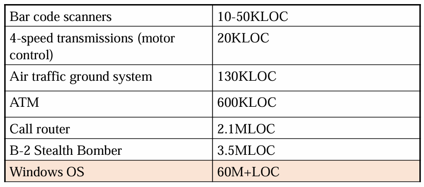
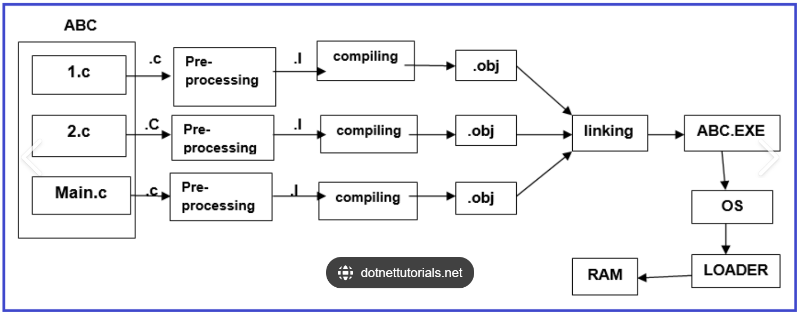

# Progamming Project


# Modular programming and Makefile


## Software Scale

 KLOC = 1000 lines of code; MLOC = 1,000,000 lines of code





## Modularity

**模块化编程**：将大程序拆分为小块（模块或函数），避免代码重复，提高可读性和维护性。

**函数设计原则**：一个函数的功能应能用一句话描述，否则应考虑拆分。

> If you can’t describe what your function does in one  sentence you should consider splitting it.

**模块术语**：

> 模块之间需明确接口和通信方式。

**模块接口（Module Interface, .h 文件）**

- **定义**：这是模块的正式描述，告诉其他模块或程序员这个模块包含什么。
- **内容**：通常包括数据结构定义（如结构体 struct）、函数原型（function prototypes）以及必要的宏定义（#define）。
- **作用**：作为模块的“门面”，它指定了模块对外暴露的功能和数据，其他模块通过包含（#include）这个头文件来使用这些功能，而无需关心内部实现细节。
- **特点**：内容应简洁、稳定，避免频繁修改，因为它会被多个文件依赖。
- **例子**：在 customer.h 中定义 struct customer 和函数 customer_new() 的原型。

**模块实现（Module Implementation, .c 文件）**

- **定义**：这是模块的具体实现，提供人类可读的细节描述。
- **内容**：包含头文件中声明的函数的具体代码实现，以及模块内部使用的私有变量和辅助函数。
- **作用**：实现模块的功能，是程序逻辑的核心部分。程序员通过阅读 .c 文件可以理解模块的工作原理。
- **特点**：与 .h 文件分离，修改 .c 文件通常不会影响依赖此模块的其他代码（只要接口不变）。
- **例子**：在 customer.c 中实现 customer_new() 函数，分配内存并初始化 customer 结构体的字段。

**对象文件（Object File, .o 文件）**

- **定义**：这是模块的机器可读描述，由编译器从 .c 文件生成。
- **内容**：包含编译后的二进制代码（机器指令），不再是人类可读的文本，而是处理器可以理解的格式。
- **作用**：作为编译过程中的中间产物，多个 .o 文件最终会被链接器（linker）组合成可执行文件。
- **特点**：依赖于特定的硬件架构，无法直接阅读，但可以用工具（如 objdump）检查其内容（如符号表或反汇编代码）。
- **例子**：通过 gcc -c customer.c -o customer.o 生成 customer.o，供后续链接使用。


## Pre-processing -> Compilation -> Linking





**Pre-processing**

The pre-processor expands all the directives that start with   “#”, such as: 

#include //importing libraries   

#define //creating macros

#ifdef  #if  #ifndef   #elif   #endif   #else  //conditional comilation


**Seletive Compilation**

**选择性编译** 是一种编译优化策略，主要目的是避免重新编译未改变的代码模块，从而提高编译效率。

1. **如果错误模块没有变化**：当代码中的某个模块没有发生变化时，即使其他部分有更新，也不需要重新编译该模块。
2. **为什么还要重新编译它？**：在大多数情况下，如果模块没有变化，我们就不需要重新编译它，这样可以节省时间和计算资源。只有当模块的代码发生变化或依赖关系发生变化时，才需要重新编译。
3. **对于小代码来说似乎没什么大不了的**：对于小规模的代码项目，重新编译整个项目的时间可能并不长，因此选择性编译的优势不明显。
4. **但是对于大规模代码，它变得很重要**：对于大型项目，代码量庞大，重新编译每个模块的时间开销就会很大。因此，选择性编译能够显著减少编译时间，提高开发效率。
5. **这就是模块化的一个关键思想**：模块化的设计理念就是将代码划分为独立的模块，每个模块可以单独编译。这样，只有发生变化的模块才会被重新编译，避免不必要的重复工作。
6. **我们只想重新编译已更改的模块**：这意味着编译器会根据模块的变化情况，判断哪些模块需要重新编译，而哪些可以跳过。
7. **这本质上是一个“if”语句**：在编译过程中，编译器会判断模块是否发生了变化，如果发生了变化，就重新编译；如果没有变化，就跳过编译。这实际上是一个基于条件判断（"if"）的决策过程。

总结来说，选择性编译通过仅重新编译修改过的模块，优化了编译过程，尤其在大规模项目中尤为重要。


## Makefile

`Makefile` 是用于自动化编译和构建的工具，主要用于 C/C++ 代码，但也可用于其他任务（如打包、部署等）。

------

### 1. Makefile 基本语法

```makefile
target: dependencies
    command
```

- **target**（目标）：要生成的文件或任务名。
- **dependencies**（依赖）：构建 target 之前需要的文件或其他 target。
- **command**（命令）：用于生成目标的 shell 命令（必须使用 Tab 缩进）。

------

### 2. 例子：简单 C 语言编译

假设我们有两个源文件 `main.c` 和 `utils.c`，希望编译成 `program` 可执行文件。

#### 示例代码

**`main.c`**

```c
#include <stdio.h>
#include "utils.h"

int main() {
    print_message();
    return 0;
}
```

**`utils.c`**

```c
#include <stdio.h>

void print_message() {
    printf("Hello from utils!\n");
}
```

**`utils.h`**

```c
#ifndef UTILS_H
#define UTILS_H

void print_message();

#endif
```

#### 基本 Makefile

**`Makefile`**

```makefile
CC = gcc                  # 指定编译器
CFLAGS = -Wall -g         # 编译选项
TARGET = program          # 生成的目标文件
SRCS = main.c utils.c     # 源文件
OBJS = $(SRCS:.c=.o)      # 生成的 .o 文件列表（自动替换 .c -> .o）

# 默认目标
all: $(TARGET)

# 编译目标文件
$(TARGET): $(OBJS)
    $(CC) $(CFLAGS) -o $(TARGET) $(OBJS)

# 编译 .c 文件为 .o 文件
%.o: %.c
    $(CC) $(CFLAGS) -c $< -o $@

# 清理目标
clean:
    rm -f $(OBJS) $(TARGET)
```

#### 运行 `make`

```sh
make         # 编译生成 program
make clean   # 删除编译生成的文件
```

------

### 3. Makefile 变量

- **`CC`**：编译器（默认 `gcc`）。
- **`CFLAGS`**：编译选项，如 `-Wall`（所有警告），`-g`（调试信息）。
- **`TARGET`**：最终生成的可执行文件。
- **`SRCS`**：所有源代码文件。
- **`OBJS`**：所有编译后的 `.o` 文件，`$(SRCS:.c=.o)` 是一个模式替换表达式，表示把 `.c` 改成 `.o`。

------

### 4. Makefile 中的特殊符号

| 符号 | 说明                               |
| ---- | ---------------------------------- |
| `$@` | 目标文件名                         |
| `$<` | 第一个依赖文件（通常是 `.c` 文件） |
| `$^` | 所有的依赖文件                     |

示例：

```makefile
%.o: %.c
    $(CC) $(CFLAGS) -c $< -o $@
```

等价于：

```sh
gcc -Wall -g -c main.c -o main.o
```

------

### 5. 选择性编译（Conditional Compilation）

可以通过 `make` 传递变量来控制选择性编译：

```makefile
CC = gcc
CFLAGS = -Wall
TARGET = program

ifdef DEBUG
    CFLAGS += -g -DDEBUG
endif

SRCS = main.c utils.c
OBJS = $(SRCS:.c=.o)

all: $(TARGET)

$(TARGET): $(OBJS)
    $(CC) $(CFLAGS) -o $(TARGET) $(OBJS)

%.o: %.c
    $(CC) $(CFLAGS) -c $< -o $@

clean:
    rm -f $(OBJS) $(TARGET)
```

编译时选择是否开启 `DEBUG`：

```sh
make             # 正常编译
make DEBUG=1     # 开启 DEBUG 模式编译
```

在 C 代码中：

```c
#ifdef DEBUG
    printf("Debug mode enabled!\n");
#endif
```

------

### 6. 伪目标（PHONY）

`clean` 这种任务不是实际的文件目标，而是用于执行命令，因此可以用 `.PHONY` 避免与同名文件冲突：

```makefile
.PHONY: clean
clean:
    rm -f $(OBJS) $(TARGET)
```

------

### 总结

| 关键点                                 | 说明                         |
| -------------------------------------- | ---------------------------- |
| `target: dependencies`                 | 定义编译目标                 |
| `$(CC) $(CFLAGS) -o $(TARGET) $(OBJS)` | 编译命令                     |
| `$@`, `$<`, `$^`                       | 目标文件、依赖文件等自动变量 |
| `make`                                 | 运行默认目标                 |
| `make clean`                           | 删除编译文件                 |
| `.PHONY: clean`                        | 伪目标，避免与文件重名冲突   |


# Code quality and code review

**代码质量的重要性**：可读性、文档、可维护性、是否符合预期等。

**如何测量代码质量**：代码审查（Code Review）、使用 Linter 自动检查（如 PEP8）。

**如何改进代码质量**：

- **命名清晰**（避免 i/j/x/y 等无意义变量名）
- **适当使用空格**（提高可读性）
- **模块化编程**（拆分函数、遵循单一职责）
- **减少代码重复（DRY，Don’t Repeat Yourself 原则）**
- **避免魔法数（Magic Numbers）**，用常量代替，如 `#define FEBRUARY 2`
- **失败要尽早暴露（Fail Fast）**
- **注释要有意义**（Doxygen 标准等）

**代码审查（Code Review）**：像 Google、Mozilla 等公司都强制要求代码审查，帮助提升代码质量和开发者能力。

- **保证代码质量**：发现逻辑错误、性能问题或安全隐患。
- **统一代码风格**：确保符合团队规范（如命名、格式）。
- **知识共享**：团队成员互相学习，避免“知识孤岛”。
- **提前规避风险**：减少后期测试和维护成本。


# Testing and Test Plan


## Validation

通过以下方法发现程序问题，从而增强对程序正确性的信心：

- **形式化推理 Formal reasoning**（验证）：构建程序正确性的形式化证明
- **代码审查 Code review**：由他人仔细检查代码
- **测试 Testing**：在精选输入上运行程序并检查结果


## Testing methodology


## Testing process - Diagnosis

**诊断错误**：确定错误位置（输入、输出或代码主体），通过逐步缩小范围（从应用层到模块层再到函数层）定位问题。

**规划工具**：

- **笔纸验证**：在纸上执行简单用例并与代码验证。
- **打印调试（printf）**：在关键阶段输出信息或中间变量值。

**编译器选项**：使用 gcc -Wall -Wextra 等选项生成警告，帮助发现潜在问题。


## Testing Plan

**定义**：基于代码功能的系统性测试用例集，应在代码设计时同步规划。

**目标**：

- 测试代码的所有方面。
- 隔离并测试特定功能（单元测试）。
- 展示可预测的预期行为。

**覆盖范围**：尽量覆盖所有代码行，注重合理性而非穷尽。

### Testing Data

**正常值 Normal values**：标准输入数据。

**边界/角落用例 Edge/corner cases**：如最大值、最小值、零、空字符串等。

**鲁棒性测试  robustness**：意外值 **unexpected values**（如超出范围的值）和无效值 **invalid data**（如类型不匹配）。

### Testing Strategies


## Unit Testing

#### Python 单元测试（使用 `unittest`）

**示例代码：计算器函数**

```python
# calculator.py
def add(a, b):
    return a + b

def subtract(a, b):
    return a - b

def divide(a, b):
    if b == 0:
        raise ValueError("Cannot divide by zero!")
    return a / b
```

**单元测试代码**

```python
# test_calculator.py
import unittest
from calculator import add, subtract, divide

class TestCalculator(unittest.TestCase):
    def test_add(self):
        self.assertEqual(add(2, 3), 5)          # 正常情况
        self.assertEqual(add(-1, 1), 0)         # 负数测试
        self.assertEqual(add(0, 0), 0)          # 边界值

    def test_subtract(self):
        self.assertEqual(subtract(5, 3), 2)
        self.assertEqual(subtract(0, 0), 0)

    def test_divide(self):
        self.assertEqual(divide(6, 3), 2)       # 正常除法
        self.assertAlmostEqual(divide(1, 3), 0.333333, places=6)  # 浮点数近似比较
        with self.assertRaises(ValueError):     # 异常测试
            divide(1, 0)

if __name__ == "__main__":
    unittest.main()
```

**运行测试**

```bash
python -m unittest test_calculator.py
```

**输出示例**

```bash
...
----------------------------------------------------------------------
Ran 3 tests in 0.001s

OK
```

[Unit Testing study](https://docs.unity3d.com/Manual/testing-editortestsrunner.html)


## Automated Testing 

**Automated testing** means running the tests and  checking their results automatically.


### Testing frameworks

**测试框架**是用于支持和简化软件测试过程的工具和库。它们提供了一套预定义的功能和规范，用于组织和执行测试，报告测试结果，确保测试的一致性和可维护性。

这些框架主要用于单元测试，即对单个功能模块或代码片段进行验证。

- **JUnit**（Java）：广泛用于Java应用的单元测试。
- **PyTest**（Python）：用于Python程序的测试，支持简单的单元测试和更复杂的集成测试。

### Regression Testing

Once you have test automation, it’s very important  to rerun your tests when you modify your code. 

修改后的再测试。


# Debugging

## Avoid Dedugging

### First Defence: Make Bugs Impossible

Static checking：

Static checking eliminates many bugs by catching them at  compile time.

Dynamic checking：

Check for errors at runtime

### Second Defence: Localise Bugs

If we can’t prevent bugs, we can try to localise them  to **a small part of the program**, so that we don't have  to look too hard to find the cause of a bug.

### Defensive programming


