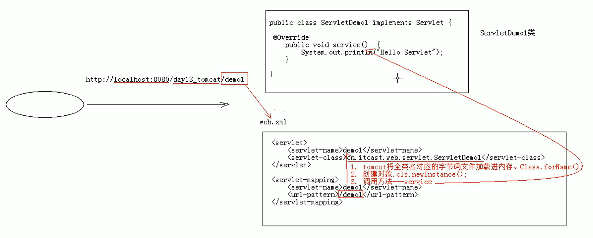
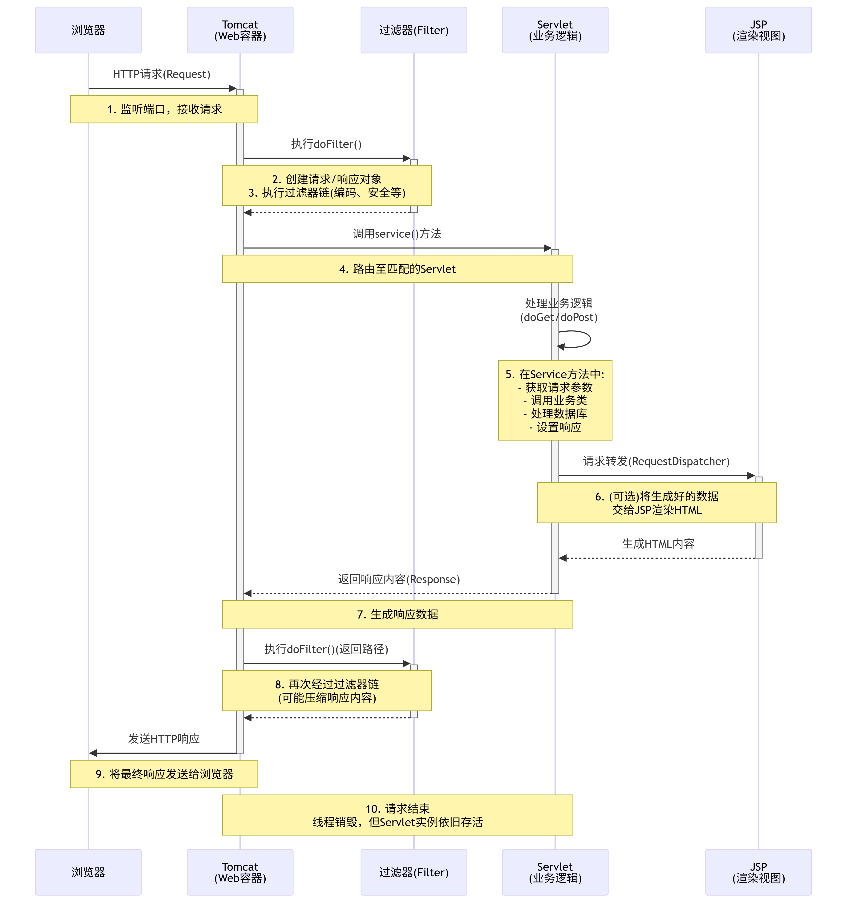

# Servlet

文章参考：[w3school](https://www.w3cschool.cn/servlet)

[TOC]


# 介绍

**Servlet**（Server Applet），全称 Java Servlet，未有中文译文。是用Java编写的服务器端程序，它是**运行在 Web 服务器**（如 Tomcat、Jetty 等）上的 Java 类。其主要功能在于交互式地浏览和修改数据，生成动态Web内容。

狭义的Servlet是指Java语言实现的一个接口，**广义的Servlet**是指任何实现了这个Servlet接口的类，一般情况下，人们将Servlet理解为后者。


## Tomcat

Tomcat 是一个开源的 Java Web 服务器（Web Server）和 Servlet 容器，它主要用于运行 Java Web 应用程序，尤其是基于 Servlet 和 JSP（JavaServer Pages）技术的应用。

Tomcat 的核心功能包括：

1. **Servlet 容器**：提供 Servlet 运行环境，负责管理 Servlet 的生命周期（创建、初始化、调用、销毁等），是实现 Servlet 规范的重要组件。
2. **Web 服务器**：能够处理 HTTP 请求，静态资源（如 HTML、CSS、JavaScript 文件等）的访问请求可以直接由 Tomcat 处理。
3. **JSP 支持**：可以将 JSP 页面翻译成 Servlet 代码并执行，实现动态网页内容的生成。

Tomcat 由 Apache 软件基金会开发和维护，具有轻量级、开源免费、跨平台等特点，是 Java Web 开发中最常用的服务器之一。开发者通常在开发阶段使用 Tomcat 进行本地调试，在**中小型应用**的生产环境中也常采用 Tomcat 作为部署服务器。


## 执行原理

1. 当服务器接受到客户端浏览器的请求后，会解析请求URL路径，获取访问的Servlet的资源路径
2. 查找 `web.xml` 文件，是否有对应的`<url-pattern>`标签内容。
3. 如果有，则在找到对应的`<servlet-class>`全类名
4. tomcat 会将字节码文件加载进内存，并且创建其对象
5. 调用其方法




# 生命周期

Servlet 生命周期可被定义为从创建直到毁灭的整个过程。以下是 Servlet 遵循的过程：

- Servlet 通过调用 **init ()** 方法进行初始化。
- Servlet 调用 **service()** 方法来处理客户端的请求。
- Servlet 通过调用 **destroy()** 方法终止（结束）。
- 最后，Servlet 是由 JVM 的垃圾回收器进行垃圾回收的。

## `init()`

`init` 方法被设计成只调用一次。它在第一次创建 Servlet 时被调用，在后续每次用户请求时不再调用。

> 这说明一个Servlet在内存中只存在一个对象，**Servlet是单例的**：
>
> - 多个用户同时访问时，可能存在线程安全问题。
> - 解决：尽量不要在Servlet中定义成员变量。即使定义了成员变量，也不要对修改值

Servlet 创建于用户第一次调用对应于该 Servlet 的 URL 时，但是您也可以指定 Servlet 在服务器第一次启动时被加载。

当用户调用一个 Servlet 时，就会创建一个 Servlet 实例，每一个用户请求都会产生一个新的线程，适当的时候移交给 `doGet` 或 `doPost` 方法。`init()` 方法简单地创建或加载一些数据，这些数据将被用于 Servlet 的整个生命周期。

init 方法的定义如下：

```java
public void init(ServletConfig servletConfig) throws ServletException {
    
}
```

> 你可以配置执行Servlet的创建时机：在<servlet>标签下配置
>
> 1. 第一次被访问时，创建
>
> - <load-on-startup>的值为负数，默认值-1
>
> 2. 在服务器启动时，创建
>
> - <load-on-startup>的值为0或正整数
>
> ```xml
> <servlet>
> 	<servlet-name>demo</servlet-name>
> 	<servlet-class>com.glim.servletdemo.ServletDemo_</servlet-class>
> 	<load-on-startup>1</load-on-startup>
> </servlet>

## `service()`

`service()` 方法是执行实际任务的主要方法。Servlet 容器（即 Web 服务器）调用 `service()` 方法来处理来自客户端（浏览器）的请求，并把格式化的响应写回给客户端。

每次服务器接收到一个 Servlet 请求时，服务器会产生一个新的线程并调用服务。`service()` 方法检查 HTTP 请求类型（GET、POST、PUT、DELETE 等），并在适当的时候调用 doGet、doPost、doPut，doDelete 等方法。

下面是该方法的特征：

```java
public void service(ServletRequest servletRequest, ServletResponse servletResponse) throws ServletException, IOException {

}
```

`service()` 方法由容器调用，service 方法在适当的时候调用 doGet、doPost、doPut、doDelete 等方法。所以，您不用对 `service()` 方法做任何动作，您只需要根据来自客户端的请求类型来**重载** `doGet()` 或 `doPost()` 即可。

### `doGet()`

GET 请求来自于一个 URL 的正常请求，或者来自于一个未指定 METHOD 的 HTML 表单，它由 `doGet()` 方法处理。

```java
public void doGet(HttpServletRequest request,
                  HttpServletResponse response)
    throws ServletException, IOException {
    // Servlet 代码
}
```

### `doPost()`

POST 请求来自于一个特别指定了 METHOD 为 POST 的 HTML 表单，它由 doPost() 方法处理。

```java
public void doPost(HttpServletRequest request,
                   HttpServletResponse response)
    throws ServletException, IOException {
    // Servlet 代码
}
```

## `destroy()` 

`destroy()` 方法只会被调用一次，在 Servlet 生命周期结束时被调用。`destroy()` 方法可以让您的 Servlet 关闭数据库连接、停止后台线程、把 Cookie 列表或点击计数器写入到磁盘，并执行其他类似的清理活动。

在调用 `destroy()` 方法之后，servlet 对象被标记为垃圾回收。destroy 方法定义如下所示：

```java
  public void destroy() {
    // 终止化代码...
  }
```

### 架构图

下图显示了一个典型的 Servlet 生命周期方案。

- 第一个到达服务器的 HTTP 请求被委派到 Servlet 容器。
- Servlet 容器在调用 service() 方法之前加载 Servlet。
- 然后 Servlet 容器处理由多个线程产生的多个请求，每个线程执行一个单一的 Servlet 实例的 service() 方法。


### 流程图




# 注解配置

**Servlet 的注解配置**，这是一种在 **Servlet 3.0** 及以上版本中引入的、**取代传统 `web.xml` 配置**的现代方式。它通过 Java 注解来配置 Servlet，使得开发更加简洁和直观。

## `web.xml` 配置

传统的`web.xml` 配置：

```xml
<?xml version="1.0" encoding="UTF-8"?>
<web-app xmlns="https://jakarta.ee/xml/ns/jakartaee"
         xmlns:xsi="http://www.w3.org/2001/XMLSchema-instance"
         xsi:schemaLocation="https://jakarta.ee/xml/ns/jakartaee https://jakarta.ee/xml/ns/jakartaee/web-app_6_0.xsd"
         version="6.0">
    <!-- 配置servlet -->
    <servlet>
        <servlet-name>demo</servlet-name>
        <servlet-class>com.glim.servletdemo.ServletDemo_</servlet-class>
        <load-on-startup>1</load-on-startup>
    </servlet>
    <servlet-mapping>
        <servlet-name>demo</servlet-name>
        <url-pattern>/demo</url-pattern>
    </servlet-mapping>
    
    ......
    
</web-app>
```

这样业务复杂了就会有很多的`<servlet>`标签，配置麻烦


## 核心注解：`@WebServlet`

`@WebServlet` 注解用于将一个类声明为 Servlet，并在注解中配置该 Servlet 的元数据（如 URL 映射、初始化参数等）。这个注解是在部署时由容器（如 Tomcat）处理的。

### 基本语法

```java
@WebServlet("/url-pattern")
public class MyServlet extends HttpServlet {
    // ... Servlet 代码
}
```

只需这一行注解，就完全替代了之前在 `web.xml` 中需要写的 `<servlet>` 和 `<servlet-mapping>` 两大段配置。

### 常用属性

| 属性名                           | 描述                                                         | 等效的 web.xml 配置 | 示例                                                        |
| :------------------------------- | :----------------------------------------------------------- | :------------------ | :---------------------------------------------------------- |
| **`value`** 或 **`urlPatterns`** | **最重要的属性**。用于指定 Servlet 的 URL 映射模式。**如果只配置这个属性，可以省略属性名**。 | `<url-pattern>`     | `@WebServlet("/demo")` `@WebServlet(urlPatterns = "/demo")` |
| `name`                           | 指定 Servlet 的名称，相当于 `<servlet-name>`。默认值是类的全限定名。 | `<servlet-name>`    | `@WebServlet(name = "MyDemo", urlPatterns = "/demo")`       |
| `loadOnStartup`                  | 指定 Servlet 的加载顺序（启动时机）。值 >= 0 表示服务器启动时加载；负数表示第一次访问时加载。 | `<load-on-startup>` | `@WebServlet(urlPatterns = "/demo", loadOnStartup = 1)`     |
| `initParams`                     | 配置 Servlet 的**初始化参数**。需要与 `@WebInitParam` 注解一起使用。 | `<init-param>`      | 见下方示例                                                  |
| `description`                    | 为 Servlet 提供描述信息。                                    | `<description>`     |                                                             |

下面是源码，

```java
// WebServlet.class
@Target({ElementType.TYPE})
@Retention(RetentionPolicy.RUNTIME)
@Documented
public @interface WebServlet {
    String name() default "";

    String[] value() default {};

    String[] urlPatterns() default {};

    int loadOnStartup() default -1;

    WebInitParam[] initParams() default {};

    boolean asyncSupported() default false;

    String smallIcon() default "";

    String largeIcon() default "";

    String description() default "";

    String displayName() default "";
}
```

### 配置示例

#### 最基本的配置（只有一个 URL 模式）

```java
@WebServlet("/hello")
public class HelloServlet extends HttpServlet {
    @Override
    protected void doGet(HttpServletRequest req, HttpServletResponse resp) throws ServletException, IOException {
        resp.getWriter().println("Hello, Annotation!");
    }
}
```

访问地址：`http://localhost:8080/你的项目上下文/hello`

#### 配置多个 URL 模式

使用 `urlPatterns` 或 `value` 数组来配置。

```java
// 方式一：使用 urlPatterns
@WebServlet(urlPatterns = {"/path1", "/path2", "/path3"})
// 方式二：使用 value (效果完全相同)
// @WebServlet({"/path1", "/path2", "/path3"})
public class MultiUrlServlet extends HttpServlet {
    // ...
}
```

访问地址：`http://localhost:8080/你的项目上下文/path1`、`path2`、`path3` 均可。

#### 配置初始化参数 (`initParams`)

使用 `{}` 花括号和 `@WebInitParam` 注解来配置多个参数。

```java
@WebServlet(
    urlPatterns = "/config",
    initParams = {
        @WebInitParam(name = "username", value = "admin"),
        @WebInitParam(name = "email", value = "admin@example.com")
    }
)
public class ConfigServlet extends HttpServlet {
    @Override
    public void init() throws ServletException {
        // 在代码中获取初始化参数
        String username = getInitParameter("username");
        String email = getInitParameter("email");
        // ... 使用这些参数
    }
    // ...
}
```

#### 配置启动加载 (`loadOnStartup`)

让 Servlet 在服务器启动时就初始化，而不是等到第一次被访问时。

```java
@WebServlet(urlPatterns = "/startup", loadOnStartup = 1)
public class StartupServlet extends HttpServlet {
    @Override
    public void init() throws ServletException {
        System.out.println("服务器启动时，我就被创建了！");
    }
    // ...
}
```


# HttpServlet

`Servlet` 是服务 HTTP 请求并实现 **javax.servlet.Servlet** 接口的 Java 类。Web 应用程序开发人员通常编写 Servlet 来扩展 `javax.servlet.http.HttpServlet`，并实现 Servlet 接口的抽象类专门用来处理 HTTP 请求。

下面是一个示例，

```java
@WebServlet(urlPatterns = "/demo", loadOnStartup = 1)
public class ServletDemo extends HttpServlet {
    private String message;

    public void init() throws ServletException {
        // 执行必需的初始化
        message = "Servlet Demo Initialized";
        System.out.println(message);
    }

    public void doGet(HttpServletRequest request,
                      HttpServletResponse response)
            throws ServletException, IOException
    {
        // 设置响应内容类型
        response.setContentType("text/html");

        // 实际的逻辑是在这里
        PrintWriter out = response.getWriter();
        out.println("<h1>" + message + "</h1>");
    }

    public void destroy()
    {
        // 什么也不做
        System.out.println("Servlet destroyed");
    }
}
```


## HttpServletRequest


### 如何获取表单数据

Servlet 处理表单数据，这些数据会根据不同的情况使用不同的方法自动解析：

- **getParameter()：**您可以调用 request.getParameter() 方法来获取表单参数的值。
- **getParameterValues()：**如果参数出现一次以上，则调用该方法，并返回多个值，例如**复选框**。
- **getParameterNames()：**如果您想要得到当前请求中的所有参数的完整列表，则调用该方法。

| **方法**                              | **返回类型**            | **描述**              | **使用场景**                         |
| :------------------------------------ | :---------------------- | :-------------------- | :----------------------------------- |
| **`getParameter(String name)`**       | `String`                | 获取单个参数的值      | 文本框、单选按钮、下拉列表等单值参数 |
| **`getParameterValues(String name)`** | `String[]`              | 获取多值参数的所有值  | 复选框、多选列表等多值参数           |
| `getParameterNames()`                 | `Enumeration<String>`   | 获取所有参数名的枚举  | 动态处理未知参数                     |
| `getParameterMap()`                   | `Map<String, String[]>` | 获取所有参数的Map集合 | 批量处理所有参数                     |

#### 使用表单的 GET 方法实例

在上面的例子，你可以修改doGet方法

```java
public void doGet(HttpServletRequest request,
                      HttpServletResponse response)
            throws ServletException, IOException
    {
        
        response.setContentType("text/html");

        PrintWriter out = response.getWriter();
        out.println("<h1>" + message + "</h1>");
        
    	// 你可以通过 http://localhost:8080/demo?name=Glim 访问
    	out.println(request.getParameter("name"));
    }
```

doPost 同理。

#### 将复选框数据传递到 Servlet 程序

在一个 HTTP 请求中，表单数据通常以键值对（`name=value`）的形式发送到服务器。大多数情况下，一个参数名（`name`）只对应一个值（`value`）。例如，一个文本输入框 `<input type="text" name="username">`。

然而，有些表单控件，**特别是复选框（Checkboxes）和多重选择列表（Multi-select lists）**，允许用户选择多个选项，而这些选项都共享同一个参数名。

例如：

```html
<input type="checkbox" name="hobby" value="reading"> Reading
<input type="checkbox" name="hobby" value="gaming"> Gaming
<input type="checkbox" name="hobby" value="traveling"> Traveling
```

如果用户选择了 "Reading" 和 "Gaming"，发送到服务器的数据将会是：

```text
hobby=reading&hobby=gaming
```

你看到了，参数名 `hobby` 出现了两次，但拥有不同的值。

正是为了处理上述这种情况，`HttpServletRequest` 接口提供了 `getParameterValues()` 方法。该方法会返回一个`String[]`。

对应的doGet就应该是，

```java
public void doGet(HttpServletRequest request,
                      HttpServletResponse response)
            throws ServletException, IOException
    {
        
        response.setContentType("text/html");

        PrintWriter out = response.getWriter();
        out.println(Arrays.toString(request.getParameterValues("hobby")) );

    }
```

#### 读取所有的表单参数

以下是通用的实例，使用 HttpServletRequest 的 **getParameterNames()** 方法读取所有可用的表单参数。该方法返回一个**枚举 `Enumeration<String>`**，其中包含未指定顺序的参数名。

一旦我们有一个枚举，我们可以以标准方式循环枚举，使用 `hasMoreElements()` 方法来确定何时停止，使用 `nextElement()` 方法来获取每个参数的名称。

```java
// 获取所有参数名
Enumeration<String> paramNames = request.getParameterNames();
        
// 检查是否有参数
if (!paramNames.hasMoreElements()) {
	out.println("<p>没有收到任何参数！</p>");
	} else {
		out.println("<ul>");
        // 遍历所有参数
        while (paramNames.hasMoreElements()) {
            String paramName = paramNames.nextElement();
            String[] paramValues = request.getParameterValues(paramName);
                
            out.print("<li><strong>" + paramName + ":</strong> ");
            if (paramValues.length == 1) {
                out.print(paramValues[0]);
            } else {
                out.print("[ " + String.join(", ", paramValues) + " ]");
            }
            out.println("</li>");
        }
        out.println("</ul>");
    }
```

直接在浏览器地址栏测试，

```text
http://localhost:8080/demo?name=张三&age=25&city=北京
```

### 获取请求头信息

| **方法**                     | **返回类型**          | **描述**               | **常用示例**                         |
| :--------------------------- | :-------------------- | :--------------------- | :----------------------------------- |
| **`getHeader(String name)`** | `String`              | 获取指定请求头的值     | `getHeader("User-Agent")`            |
| **`getHeaderNames()`**       | `Enumeration<String>` | 获取所有请求头名的枚举 | 遍历所有请求头                       |
| `getIntHeader(String name)`  | `int`                 | 获取整型的请求头值     | `getIntHeader("Content-Length")`     |
| `getDateHeader(String name)` | `long`                | 获取日期类型的请求头值 | `getDateHeader("If-Modified-Since")` |

### 获取客户端和服务器信息

| 方法               | 返回类型       | 描述                  | 示例返回值                          |
| :----------------- | :------------- | :-------------------- | :---------------------------------- |
| `getMethod()`      | `String`       | 获取HTTP方法          | "GET", "POST"                       |
| `getRemoteAddr()`  | `String`       | 获取客户端IP地址      | "192.168.1.100"                     |
| `getRemoteHost()`  | `String`       | 获取客户端主机名      | "client-pc"                         |
| `getRemotePort()`  | `int`          | 获取客户端端口号      | 54321                               |
| `getServerName()`  | `String`       | 获取服务器名          | "localhost"                         |
| `getServerPort()`  | `int`          | 获取服务器端口号      | 8080                                |
| `getRequestURI()`  | `String`       | 获取请求的URI         | "/myapp/login"                      |
| `getRequestURL()`  | `StringBuffer` | 获取请求的URL         | "http://localhost:8080/myapp/login" |
| `getContextPath()` | `String`       | 获取Web应用上下文路径 | "/myapp"                            |
| `getServletPath()` | `String`       | 获取Servlet路径       | "/login"                            |
| `getPathInfo()`    | `String`       | 获取路径信息          | "/extra/path"                       |
| `getQueryString()` | `String`       | 获取查询字符串        | "name=张三&age=25"                  |
| `getProtocol()`    | `String`       | 获取协议版本          | "HTTP/1.1"                          |

### 会话管理

| 方法                               | 返回类型      | 描述                           | 备注                |
| :--------------------------------- | :------------ | :----------------------------- | :------------------ |
| `getSession()`                     | `HttpSession` | 获取当前会话，不存在则创建     | 最常用              |
| `getSession(boolean create)`       | `HttpSession` | 获取会话，可控制是否创建       | `false`时不自动创建 |
| `getRequestedSessionId()`          | `String`      | 获取请求中的Session ID         | 可能为null          |
| `isRequestedSessionIdValid()`      | `boolean`     | 检查请求中的Session ID是否有效 |                     |
| `isRequestedSessionIdFromCookie()` | `boolean`     | Session ID是否来自Cookie       |                     |
| `isRequestedSessionIdFromURL()`    | `boolean`     | Session ID是否来自URL          |                     |

### 输入流和字符编码

`getInputStream()`与`getReader()`主要是用于接受请求体的方法。

| 方法                                   | 返回类型             | 描述               | 使用场景                            |
| :------------------------------------- | :------------------- | :----------------- | :---------------------------------- |
| **`getInputStream()`**                 | `ServletInputStream` | 获取二进制输入流   | 文件上传、处理原始数据              |
| **`getReader()`**                      | `BufferedReader`     | 获取字符输入流     | 读取文本内容                        |
| `getCharacterEncoding()`               | `String`             | 获取字符编码       | "UTF-8", "ISO-8859-1"               |
| **`setCharacterEncoding(String env)`** | `void`               | 设置字符编码       | 必须在getReader()前调用             |
| `getContentType()`                     | `String`             | 获取内容类型       | "application/x-www-form-urlencoded" |
| `getContentLength()`                   | `int`                | 获取内容长度       | -1表示未知                          |
| `getContentLengthLong()`               | `long`               | 获取内容长度(long) | 支持大文件                          |

### 属性操作（请求范围内）

**Request 域**指的是在一次 HTTP 请求范围内有效的数据存储空间。从客户端发起请求开始，到服务器返回响应结束，在这个过程中存储的数据可以在整个请求处理链中共享。

下面的方法是在**Request 域**中才能使用，也就是两个通信的 Servlet对象 (请求转发)

| 方法                                    | 返回类型              | 描述           | 作用范围     |
| :-------------------------------------- | :-------------------- | :------------- | :----------- |
| `setAttribute(String name, Object obj)` | `void`                | 设置属性       | 当前请求有效 |
| `getAttribute(String name)`             | `Object`              | 获取属性       | 需要类型转换 |
| `removeAttribute(String name)`          | `void`                | 移除属性       |              |
| `getAttributeNames()`                   | `Enumeration<String>` | 获取所有属性名 |              |

### 认证和安全相关

| 方法                        | 返回类型    | 描述                     | 备注              |
| :-------------------------- | :---------- | :----------------------- | :---------------- |
| `getAuthType()`             | `String`    | 获取认证类型             | "BASIC", "DIGEST" |
| `getRemoteUser()`           | `String`    | 获取登录用户名           | 需要认证          |
| `getUserPrincipal()`        | `Principal` | 获取用户主体对象         |                   |
| `isUserInRole(String role)` | `boolean`   | 检查用户是否在指定角色中 |                   |
| `isSecure()`                | `boolean`   | 是否使用安全连接         | HTTPS返回true     |

### 本地化和国际化

| 方法           | 返回类型              | 描述                     | 备注         |
| :------------- | :-------------------- | :----------------------- | :----------- |
| `getLocale()`  | `Locale`              | 获取客户端首选区域设置   |              |
| `getLocales()` | `Enumeration<Locale>` | 获取所有可接受的区域设置 | 按优先级排序 |

### 其他实用方法

| 方法                                    | 返回类型            | 描述                   | 使用场景                 |
| :-------------------------------------- | :------------------ | :--------------------- | :----------------------- |
| `getCookies()`                          | `Cookie[]`          | 获取所有Cookie         | 会话管理                 |
| **`getRequestDispatcher(String path)`** | `RequestDispatcher` | 获取请求分发器         | 服务器端跳转（请求转发） |
| `isAsyncStarted()`                      | `boolean`           | 检查是否启用了异步处理 | 异步Servlet              |
| `getAsyncContext()`                     | `AsyncContext`      | 获取异步上下文         | 异步处理                 |


## HttpServletResponse


### 状态码

| 方法                            | 返回类型 | 描述                   | 常用常量                                               |
| :------------------------------ | :------- | :--------------------- | :----------------------------------------------------- |
| `setStatus(int sc)`             | `void`   | 设置状态码             | `SC_OK` (200), `SC_CREATED` (201)                      |
| `sendError(int sc)`             | `void`   | 发送错误状态码         | `SC_NOT_FOUND` (404), `SC_INTERNAL_SERVER_ERROR` (500) |
| `sendError(int sc, String msg)` | `void`   | 发送带消息的错误状态码 | 同上                                                   |

#### 常用HTTP状态码常量

| 常量                       | 值   | 描述           |
| :------------------------- | :--- | :------------- |
| `SC_OK`                    | 200  | 请求成功       |
| `SC_CREATED`               | 201  | 创建成功       |
| `SC_ACCEPTED`              | 202  | 已接受         |
| `SC_NO_CONTENT`            | 204  | 无内容         |
| `SC_MOVED_PERMANENTLY`     | 301  | 永久重定向     |
| `SC_MOVED_TEMPORARILY`     | 302  | 临时重定向     |
| `SC_NOT_MODIFIED`          | 304  | 未修改         |
| `SC_BAD_REQUEST`           | 400  | 错误请求       |
| `SC_UNAUTHORIZED`          | 401  | 未授权         |
| `SC_FORBIDDEN`             | 403  | 禁止访问       |
| `SC_NOT_FOUND`             | 404  | 未找到         |
| `SC_INTERNAL_SERVER_ERROR` | 500  | 服务器内部错误 |
| `SC_SERVICE_UNAVAILABLE`   | 503  | 服务不可用     |

### 响应头

| 方法                                    | 返回类型  | 描述                 | 示例                                                   |
| :-------------------------------------- | :-------- | :------------------- | :----------------------------------------------------- |
| `setHeader(String name, String value)`  | `void`    | 设置响应头           | `setHeader("Content-Type", "text/html")`               |
| `addHeader(String name, String value)`  | `void`    | 添加响应头（可重复） | `addHeader("Set-Cookie", "name=value")`                |
| `setIntHeader(String name, int value)`  | `void`    | 设置整型响应头       | `setIntHeader("Content-Length", 1024)`                 |
| `setDateHeader(String name, long date)` | `void`    | 设置日期响应头       | `setDateHeader("Expires", System.currentTimeMillis())` |
| `containsHeader(String name)`           | `boolean` | 检查是否包含某响应头 | `containsHeader("Location`                             |

### 内容类型和编码方法

| 方法                                   | 返回类型 | 描述         | 示例                                        |
| :------------------------------------- | :------- | :----------- | :------------------------------------------ |
| `setContentType(String type)`          | `void`   | 设置内容类型 | `setContentType("text/html;charset=UTF-8")` |
| `setCharacterEncoding(String charset)` | `void`   | 设置字符编码 | `setCharacterEncoding("UTF-8")`             |
| `getCharacterEncoding()`               | `String` | 获取字符编码 | `getCharacterEncoding()`                    |
| `getContentType()`                     | `String` | 获取内容类型 | `getContentType()`                          |

#### 常用内容类型常量

| 内容类型                   | 描述                 |
| :------------------------- | :------------------- |
| `text/html`                | HTML文档             |
| `text/plain`               | 纯文本               |
| `text/css`                 | CSS样式表            |
| `text/javascript`          | JavaScript           |
| `application/json`         | JSON数据             |
| `application/xml`          | XML数据              |
| `application/pdf`          | PDF文档              |
| `image/jpeg`               | JPEG图像             |
| `image/png`                | PNG图像              |
| `application/octet-stream` | 二进制流（文件下载） |

### 输出流相关方法

| 方法                | 返回类型              | 描述           | 注意事项                                  |
| :------------------ | :-------------------- | :------------- | :---------------------------------------- |
| `getOutputStream()` | `ServletOutputStream` | 获取字节输出流 | 用于二进制数据，不能与getWriter()同时使用 |
| `getWriter()`       | `PrintWriter`         | 获取字符输出流 | 用于文本数据，不能与getOutputStream()同   |

### 重定向和URL编码方法

| 方法                            | 返回类型 | 描述                            | 示例                              |
| :------------------------------ | :------- | :------------------------------ | :-------------------------------- |
| `sendRedirect(String location)` | `void`   | 重定向到指定URL                 | `sendRedirect("/newpage.jsp")`    |
| `encodeURL(String url)`         | `String` | 对URL进行编码（包含jsessionid） | `encodeURL("/app/products")`      |
| `encodeRedirectURL(String url)` | `String` | 对重定向URL进行编码             | `encodeRedirectURL("/app/login")` |

### Cookie 相关方法

| 方法                       | 返回类型 | 描述             | 示例                                     |
| :------------------------- | :------- | :--------------- | :--------------------------------------- |
| `addCookie(Cookie cookie)` | `void`   | 添加Cookie到响应 | `addCookie(new Cookie("name", "value"))` |

### 缓冲区控制方法

| 方法                      | 返回类型  | 描述                     | 示例                  |
| :------------------------ | :-------- | :----------------------- | :-------------------- |
| `setBufferSize(int size)` | `void`    | 设置响应缓冲区大小       | `setBufferSize(8192)` |
| `getBufferSize()`         | `int`     | 获取缓冲区大小           | `getBufferSize()`     |
| `reset()`                 | `void`    | 重置响应（清空头和内容） | `reset()`             |
| `resetBuffer()`           | `void`    | 重置缓冲区（只清空内容） | `resetBuffer()`       |
| `flushBuffer()`           | `void`    | 刷新缓冲区到客户端       | `flushBuffer()`       |
| `isCommitted()`           | `boolean` | 检查响应是否已提交       | `isCommitted()`       |

### 本地化和国际化方法

| 方法                    | 返回类型 | 描述         | 示例                      |
| :---------------------- | :------- | :----------- | :------------------------ |
| `setLocale(Locale loc)` | `void`   | 设置响应地域 | `setLocale(Locale.CHINA)` |
| `getLocale()`           | `Locale` | 获取响应地域 | `getLocale()`             |

### 其他实用方法

| 方法                             | 返回类型 | 描述               | 示例                                 |
| :------------------------------- | :------- | :----------------- | :----------------------------------- |
| `setContentLength(int len)`      | `void`   | 设置内容长度       | `setContentLength(content.length())` |
| `setContentLengthLong(long len)` | `void`   | 设置内容长度(long) | `setContentLengthLarge(filesize)`    |
