# Software Engineering Principles

[TOC]

# Introduction

## Professional Software Development

- **Importance of Software Engineering (SE)**

- **What is software Engineering?** 
    - Software costs
    - Software project failure

- **Software Process Activities**

    | 活动             | 描述                                     |
    | :--------------- | :--------------------------------------- |
    | **软件规格说明** | 客户和工程师定义要生产的软件及其操作约束 |
    | **软件开发**     | 软件设计和编程                           |
    | **软件验证**     | 检查软件是否满足客户需求                 |
    | **软件演化**     | 修改软件以反映变化的客户和市场需求       |

- **Software Products**
    - Generic products 独立系统，面向任何愿意购买的客户 [开发人员拥有]
    - Customized products 由特定客户委托开发以满足自身需求 [客户拥有]

- **Essential attributes of good software**

    | 属性               | 描述                                          |
    | :----------------- | :-------------------------------------------- |
    | **可维护性**       | 能够演进以满足客户变化的需求                  |
    | **可靠性和安全性** | 包括可靠性、安全性和防护性                    |
    | **效率**           | 不浪费系统资源（内存、处理器周期）memory&time |
    | **可接受性**       | 目标用户可理解、可使用且兼容                  |

- **General issues that affect software**
    - **异构性**：需要在包含不同类型计算机和移动设备的网络上作为分布式系统运行
    - **业务和社会变化**：需要能够更改现有软件并快速开发新软件functionality, ethics
    - **安全与信任**：软件与生活的各个方面交织，必须可信
    - **规模**：从便携或可穿戴设备中的非常小的嵌入式系统到服务全球社区的互联网规模、基于云的系统 eg. ERP, CIMS

- **Software engineering diversity**
    - 存在许多不同类型的软件系统
    - 没有适用于所有系统的通用软件技术集
    - 使用的软件工程方法和工具取决于：
        - 开发的应用程序类型
        - 客户需求
        - 开发团队的背景

- **Application types**
    1. **独立应用程序** - 在本地计算机上运行
    2. **交互式事务处理应用** - 远程执行，用户通过PC访问 eg.淘宝
    3. **嵌入式控制系统** - 控制和管理硬件设备 eg.wearable device
    4. **批处理系统** - 处理大批量数据
    5. **娱乐系统** - 主要用于个人娱乐
    6. **建模和仿真系统** - 模拟物理过程或情况
    7. **数据收集系统** - 从环境收集数据并发送处理
    8. **系统之系统** - 由许多其他软件系统组成
    
- **Software engineering fundamentals**

    - 适用于所有类型软件系统的基本原则：
        - 使用**受管理且被理解的开发过程**。
        - **可靠性和性能**对所有系统都很重要。
        - 理解和管理**软件规格和需求**很重要。
        - 在适当情况下，应**重用已有软件**，而不是编写新软件。

- **Internet software engineering**

    - Web已成为运行应用程序的平台，组织越来越多地开发基于Web的系统。
    - **Web服务**允许通过Web访问应用程序功能。
    - **云计算**是一种提供服务的方式，应用程序在“云”上远程运行。

- **Web-based software engineering**

    - **软件重用**是构建Web系统的主要方法。
    - **增量与敏捷开发**适用于Web系统。
    - **面向服务的系统**使用独立的Web服务作为软件组件。
    - **丰富的界面**技术（如AJAX、HTML5）支持在浏览器中创建丰富的用户界面。

- **Frequently asked questions about software engineering**

    - **什么是软件？**
        计算机程序及相关文档。
    - **良好软件的属性是什么？**
        应具备所需功能与性能，且可维护、可靠、可用。
    - **软件工程与计算机科学的区别？**
        计算机科学关注理论与基础，软件工程关注开发与交付实用软件的实践。
    - **软件工程与系统工程的区分？**
        系统工程涉及包括硬件、软件和过程工程在内的所有方面，软件工程是其一部分。
    - **软件工程面临的主要挑战？**
        应对日益增长的多样性、缩短交付时间、开发可信赖软件。
    - **软件工程的成本？**
        约60%为开发成本，40%为测试成本。定制软件的演化成本常超过开发成本。

## Software engineering ethics

> - 软件工程涉及的责任**远不止**技术技能的应用。
> - 软件工程师必须**诚实**且**道德负责**地行事，才能被视为专业人士。
> - 道德行为不仅仅是遵守法律，还涉及遵循一套**道德上正确**的原则。

- **Issues of professional responsibility**

    **1. 保密性**

    - 工程师通常应尊重其雇主或客户的**保密性**，无论是否签署了正式的保密协议。

    **2. 胜任能力**

    - 工程师不应**歪曲**其能力水平。
    - 他们不应明知故犯地接受**超出其能力**的工作。

    **3. 知识产权**

    - 工程师应了解当地关于使用**知识产权**（如专利、版权等）的法律。
    - 他们应小心确保雇主和客户的**知识产权得到保护**。

    **4. 计算机滥用**

    - 软件工程师不应利用其技术技能**滥用**他人的计算机。
    - 计算机滥用的范围从相对琐碎（如在雇主的机器上玩游戏）到极其严重（如传播病毒）。

- **ACM/IEEE Code of Ethics**

    - 软件工程涉及的责任**远不止**技术技能的应用。
    - 软件工程师必须**诚实**且**道德负责**地行事，才能被视为专业人士。
    - 道德行为不仅仅是遵守法律，还涉及遵循一套**道德上正确**的原则。

- **Rationale for the code of ethics**

    - 简短版本的规范在**高层次**上总结了愿望。
    - 完整版本中的条款给出了这些愿望如何改变我们作为软件工程专业人员行为的**示例和细节**。
    - 愿望与细节共同构成一个**连贯的规范**。

    软件工程师应致力于使软件的分析、规格说明、设计、开发、测试和维护成为一个**有益且受尊重**的职业。

## Lab 1

1. why software is soft?

    ans: untouchable, not physical substance

# Software processes

## Software process models

- **What is software process?**
    - 软件过程是导致软件系统生产的一系列相关活动。
    - 所有软件过程都必须包含4个基本活动：
        1. **规格说明** - 定义系统应该做什么
        2. **设计与实现** - 定义系统组织并实现系统
        3. **验证** - 检查系统是否符合客户需求
        4. **演化** - 根据变化的客户需求改变系统

- **What is software process model?**
    - 也称为**软件开发生命周期模型**，是过程的抽象表示
    - 过程描述包括：
        - **产品** - 过程活动的结果
        - **角色** - 参与过程人员的职责
        - **前置和后置条件** - 活动执行前后的状态陈述
- **Plan-driven and agile processes**
    - **计划驱动过程**：所有过程活动都提前计划，进度按计划衡量
    - **敏捷过程**：计划是增量的，更容易响应变化的客户需求
    - 实践中，大多数过程包含两种方法的元素
- **General process models** 
    - The waterfall model
    - Incremental development
    - Integration and configuration

### Waterfall model

- **5 Phases in the waterfall model**

    **1. 需求分析与定义**

    - **目标**：明确系统需要做什么
    - **活动**：收集用户需求，分析系统功能和非功能需求
    - **产出**：需求规格说明书

    **2. 系统与软件设计**

    - **目标**：设计系统的整体架构和组件结构
    - **活动**：
        - 系统架构设计
        - 数据库设计
        - 接口设计
        - 组件设计
    - **产出**：系统设计文档

    **3. 实现与单元测试**

    - **目标**：将设计转换为可执行代码
    - **活动**：
        - 编写程序代码
        - 进行单元测试（测试单个组件）
    - **产出**：可执行的软件单元

    **4. 集成与系统测试**

    - **目标**：确保整个系统正常工作
    - **活动**：
        - 集成各个软件单元
        - 进行系统级测试
        - 验证系统是否符合规格说明
    - **产出**：经过测试的完整系统

    **5. 运行与维护**

    - **目标**：系统投入使用并持续改进
    - **活动**：
        - 部署系统到生产环境
        - 监控系统运行
        - 修复发现的缺陷
        - 根据用户反馈进行改进
    - **产出**：稳定运行的系统

- The waterfall model is suitable for developing **embedded  systems**, **critical systems**, or **large software systems**.

- **The waterfall model problems**

    **1. 难以适应变化**

    - **核心问题**：过程开始后难以容纳变更
    - **原因**：每个阶段必须完成后才能进入下一阶段
    - **后果**：需求变更成本极高

    **2. 阶段划分不灵活**

    - 将项目严格划分为不同阶段
    - 难以响应变化的客户需求

    **3. 适用性有限**

    - **仅适用于**：
        - 需求被充分理解
        - 设计过程中变更相当有限的情况
    - **现实问题**：很少有业务系统具有稳定的需求

### Incremental development

- **Definition**

    **增量开发**是一种将软件开发过程组织为一系列**交织进行**的增量的模型。与瀑布模型的顺序阶段不同，增量开发将**规格说明、开发和验证**这三个核心活动并行且迭代地进行。

    其核心思想是：**先构建一个系统的简化版本（初始版本），然后通过不断添加功能，逐步发展出中间版本，最终形成完整的最终版本。**

- **Working Principles**

    - **并发活动**：规格说明、开发、验证活动不是分离的，而是在每个增量中同时进行。
    - **版本演进**：
        1. **初始版本**：实现最核心的功能。
        2. **中间版本**：在每个后续增量中添加新的功能。
        3. **最终版本**：经过多个增量的迭代后，形成满足所有需求的完整系统。

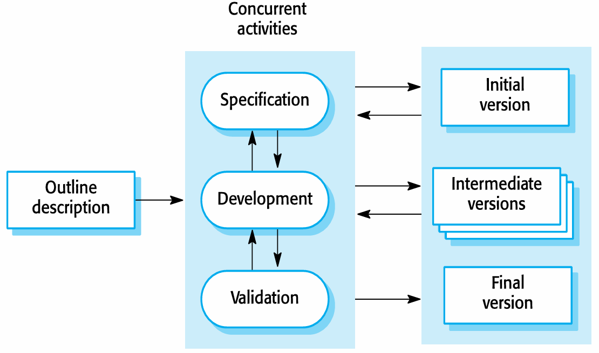

- **Advantages**
    1. **降低变更成本**
        - 由于每个增量的周期短，当客户需求变化时，只需要调整当前或后续的增量，而无需推翻重来。
        - 需要重新进行分析和文档化的工作量远小于瀑布模型。
    2. **更容易获得客户反馈**
        - 客户可以定期看到并试用已开发的软件（演示版），从而提供更具体、更及时的反馈。
        - 这种持续的沟通确保了软件最终能更好地满足客户的真实需求。
    3. **更快速地交付有价值软件**
        - 客户能够更早地使用软件（即使功能不完整），并从中获得商业价值。
        - 与瀑布模型必须等到项目末期才能交付完整系统相比，这大大加快了价值实现的时间。
- **Problems**
    1. **过程可见性低**
        - **问题**：项目经理需要明确的交付物（如大量文档）来衡量项目进度。但在快速迭代的增量开发中，为每个版本都生成详细的文档是**不经济**的。
        - **挑战**：这使得管理层难以像在瀑布模型中那样，通过检查文档来清晰地掌控项目状态。
    2. **系统结构易退化**
        - **问题**：随着新增量的不断添加，如果不加注意，系统的整体架构和代码结构可能会因为快速的修改而逐渐变得混乱（即“代码腐化”）。
        - **后果**：除非投入额外的时间和资金进行**代码重构**来优化结构，否则后续的软件变更会变得越来越困难和昂贵，最终导致系统难以维护。

### Integration and Configuration

- **Definition**

    **集成与配置**模型是一种基于**软件重用**的软件开发方法。其核心思想不是从零开始编写所有代码，而是通过**集成现有的软件组件**或应用系统来组装成新的系统。

    这些可重用的元素通常可以进行**配置**，以使其行为和功能适应用户的特定需求。这种方法（有时也称为**面向复用的开发**）已成为构建许多类型业务系统的标准方法。

- **Three types of frequently reused software components**

    1. **独立应用系统**
        - 也称为 **COTS**。这些是独立的、商业现成的软件产品，可以通过配置在特定环境中使用。
        - **示例**：配置一个现成的客户关系管理（CRM）系统或企业资源规划（ERP）系统来满足企业需求。
    2. **对象集合包**
        - 作为软件包开发的一组对象或组件，可以集成到某个组件框架中。
        - **示例**：用于 .NET 或 J2EE（现在常称为 Java EE）框架的第三方控件、类库或组件。
    3. **Web服务**
        - 根据服务标准（如SOAP, REST）开发的、可通过网络进行远程调用的软件功能。
        - **示例**：调用第三方提供的在线支付服务、地图服务或天气数据服务。

- **Key process stages**

    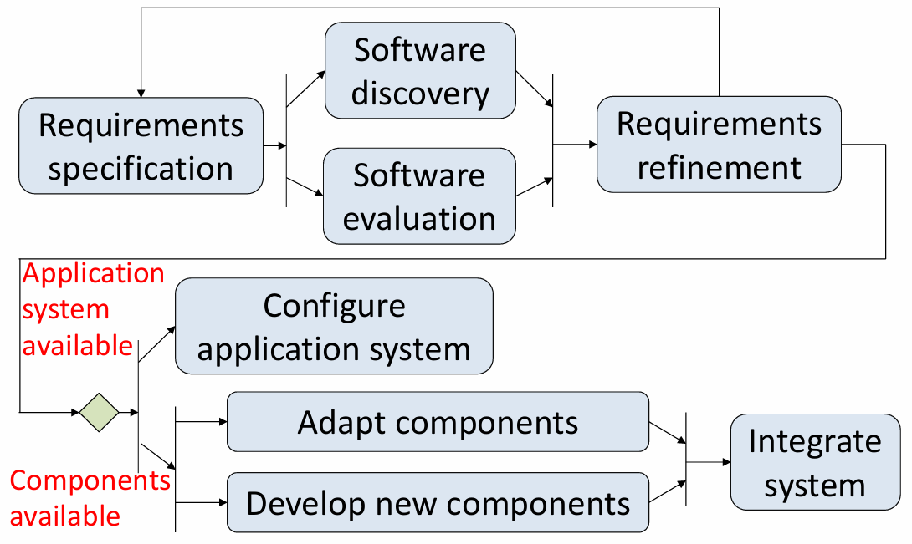

    1. **需求规格说明**
        - 定义系统需要做什么。但此时的规格说明需要考虑到重用的可能性，可能更灵活。
    2. **软件发现与评估**
        - 寻找可能满足全部或部分需求的现有软件组件或系统，并评估其适用性。
    3. **需求精化**
        - 根据找到的可重用组件，调整和细化需求。通常需要在此阶段做出**需求妥协**。
    4. **应用系统配置**
        - 如果选择了现成的应用系统（COTS），则根据用户需求对其进行配置。
    5. **组件适配与集成**
        - **组件适配**：修改或包装现有组件，使其能够在新系统中协同工作。
        - **集成**：将配置好的应用系统、适配后的组件以及必要时**新开发的组件**组装成一个完整的系统。

- **Advantages and disadvantages**

    **优点**

    - **降低成本和风险**
        - 因为减少了从零开始的软件开发工作量，从而降低了开发成本和项目风险。
    - **加快交付和部署速度**
        - 利用现有组件可以显著缩短开发周期，使系统能更快投入使用。

    **缺点**

    - **不可避免的需求妥协**
        - 系统可能无法完全满足用户的真实需求，因为必须迁就可重用组件的功能。
    - **失去对演进的控制**
        - 如果重用的系统元素（如COTS产品）由第三方供应商控制，那么其未来的升级、定价策略或停产决定都可能对您的系统造成巨大影响，导致失去控制权。

## Process activities

- **Key Concepts**
    - **真实软件过程**是**技术、协作和管理活动**交织在一起的序列，其总体目标是**规格说明、设计、实现和测试**一个软件系统。
    - 四个基本过程活动（规格说明、开发、验证和演化）在不同的开发过程中以**不同的方式组织**。
        - **例如**：在瀑布模型中，它们按**顺序**组织；而在增量开发中，它们是**交织**进行的。
    - 现代软件过程普遍得到**软件工具**的支持。

### Software specification

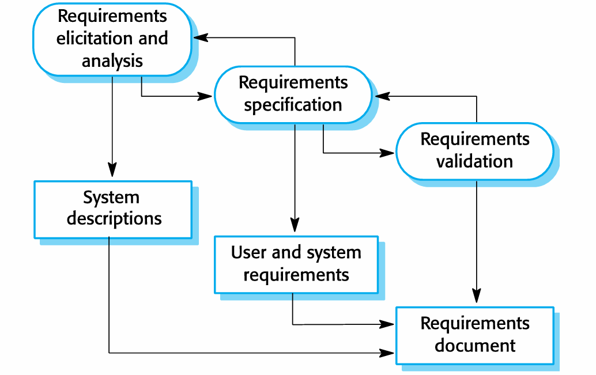

- **Requirements engineering process**

    这是确定系统需要提供哪些**服务**以及系统运行和开发的**约束条件**的过程。这个过程也称为**需求工程**。包含三个主要活动，通常迭代进行：

    1. **需求获取与分析**
        - **核心问题**：系统的**利益相关者**（用户、客户等）对系统有什么要求或期望？
        - **活动**：通过访谈、观察、研讨会等方式收集需求，并进行分析以发现冲突、歧义或不一致性。
    2. **需求规格说明**
        - **活动**：将收集和分析后的需求以清晰、一致、无歧义的方式**详细定义**和文档化。
        - **产出**：通常包括**用户需求**和**系统需求**文档。
    3. **需求验证**
        - **活动**：检查所定义的需求的**有效性**，确保它们准确反映了客户意图，并且是现实、可测试和可实现的。

### Software design and implementation

- **Definition**

    这是将**系统规格说明**转换为**可执行系统**的过程。

    - **软件设计**：设计出一个能够实现规格说明的**软件结构**。
    - **实现**：将这个结构**转换**成可执行的程序。
    - 这两个活动关系紧密，经常**交织进行**。

- **Software design**

    设计过程将**设计输入**（如需求规格、平台信息、数据描述）通过一系列设计活动，转化为**设计输出**：

    - **架构设计**：识别系统的**整体结构**、主要组件（子系统或模块）、它们之间的关系以及分布方式。
    - **接口设计**：定义系统组件之间的**接口**。
    - **组件设计与选择**：搜索可重用的组件。如果找不到，则设计新的组件及其操作方式。
    - **数据库设计**：设计系统的**数据结构**及其在数据库中的表示方式。

    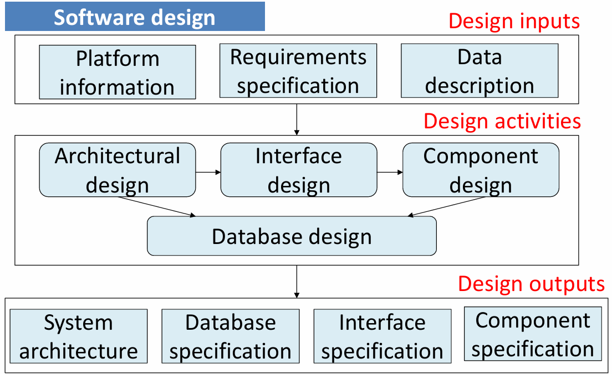

- **System Implementation**

    - 通过**开发程序**或**配置应用系统**来实现软件。
    - **编程**：更多是一种**个人活动**，没有标准化的过程。
    - **调试**：**查找并修复程序缺陷**的活动，即发现程序故障并纠正它们。

### Software validation

- **Definition**

    **验证与确认**旨在表明一个系统**符合其规格说明**，并满足系统客户的**需求**。

    - 涉及**检查和评审**过程以及**系统测试**。
    - **系统测试**：使用从系统要处理的真实数据规格说明中衍生出的**测试用例**来执行系统。
    - **测试**是最常用的V&V活动。

    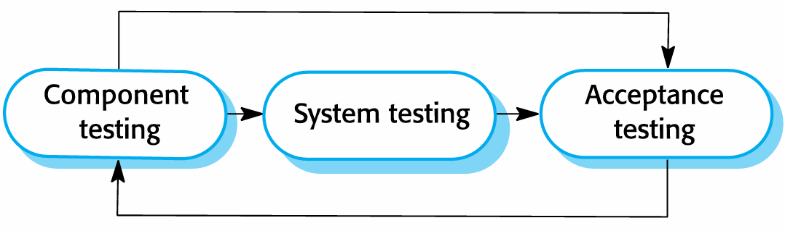

- **Testing**

    1. **组件测试**（单元测试）
        - 独立测试**单个组件**。
        - 组件可以是函数、对象或这些实体的连贯组合。
    2. **系统测试**
        - 将系统作为一个**整体**进行测试。
        - 对**涌现属性**（如性能、安全性、可靠性）的测试尤为重要。
    3. **客户测试**（验收测试）
        - 使用**客户数据**进行测试，以检查系统是否满足客户需求。
        - **例如**：**Beta测试**，将软件交给一组真实用户试用。**Alpha测试**，由公司组织。

- **V model**

    在计划驱动的过程中，测试活动与开发活动并行规划，形成V模型，展示了测试阶段与开发阶段的对应关系。

    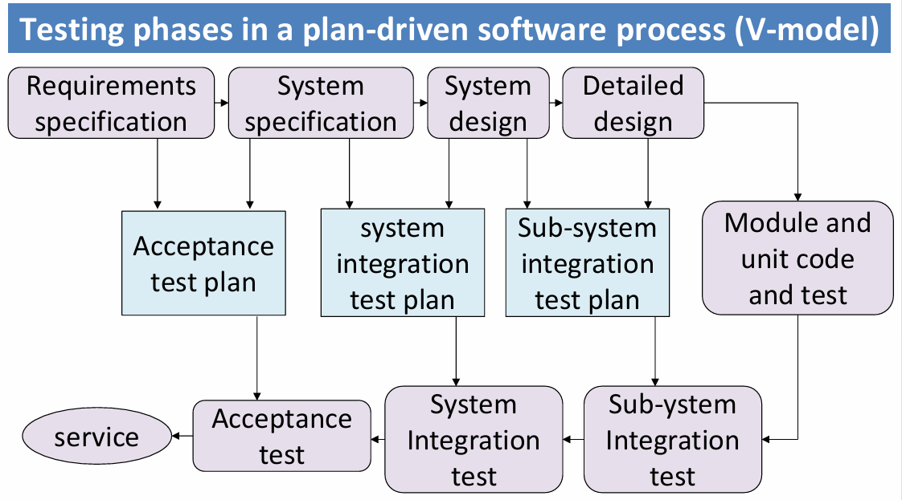

### Software evolution

- **Key Idea**

    - 软件天生具有**灵活性**，可以改变。
    - 当业务环境变化导致需求改变时，支持业务的软件**也必须随之演化和发展**。
    - 虽然传统上区分**开发**和**演化（维护）**，但随着完全全新的系统越来越少，这种区分正变得越来越无关紧要。大多数软件开发工作都是在现有系统上进行的演化。

- **Process**

    这是一个持续循环的过程：

    1. **定义系统需求**（基于新的需求）。
    2. **评估现有系统**。
    3. **提出系统修改需求**。
    4. **修改系统**，从而产生新版本的**现有系统**。

    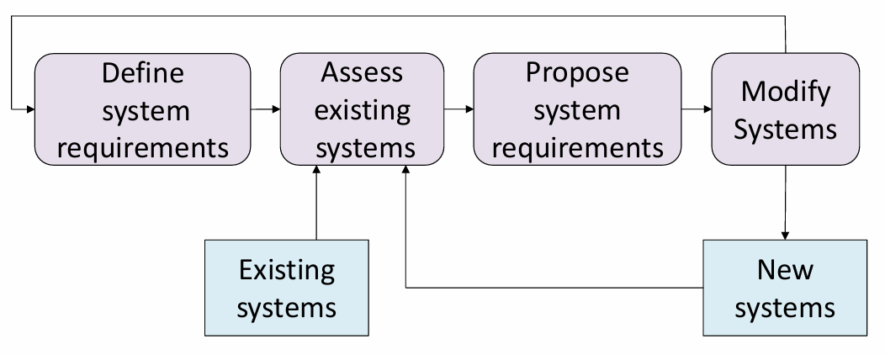

## Coping with change

- **Change is inevitable**

    在所有大型软件项目中，**变化是不可避免的**。主要原因包括：

    - **业务变化**：导致新的和变化的系统需求。
    - **新技术**：为改进实现开辟了新的可能性。
    - **平台变更**：要求应用程序随之改变。

    变化会导致**返工**，因此变化的成本既包括返工的成本（例如重新分析需求），也包括实现新功能的成本。

- **Two approaches to reduce the costs of rework**

    1. **变化预期**
        - **核心思想**：在需要进行重大返工之前，**预先估计**可能发生的变化。
        - **方法**：例如，使用**原型系统**向客户展示系统的某些关键特性，以尽早确认需求和设计的可行性。这旨在**避免**后期因误解而产生的昂贵变更。
    2. **变化容忍**
        - **核心思想**：将过程设计成能够以相对较低的**成本适应**变化。
        - **方法**：这通常涉及某种形式的**增量开发**，通过小步快跑的方式，使变更更容易被吸收。

- **Two ways of coping with change and changing requirements**

    1. **系统原型**
    2. **增量交付**

- **Purpose of process improvement**

    许多软件公司已经转向**软件过程改进**，将其作为提高软件质量、降低成本或加速开发过程的一种途径。

    过程改进意味着**理解现有过程**，并**改变这些过程**，以提高产品质量和/或降低成本和开发时间。

- **Two quite different approaches to process improvement**

    1. **过程成熟度方法**
        - **焦点**：侧重于改进**过程和项目管理**，并引入**良好的软件工程实践**。
        - **核心思想**：过程成熟度的水平反映了在组织软件开发过程中采纳良好技术和管理实践的程度。它是一种**结构化、标准化**的改进路径。
    2. **敏捷方法**
        - **焦点**：侧重于**迭代开发**和减少软件过程中的**开销**。
        - **主要特征**：快速交付功能和响应变化的客户需求。它通过简化流程、减少不必要的文档来寻求改进。

- **The process improvement cycle**

    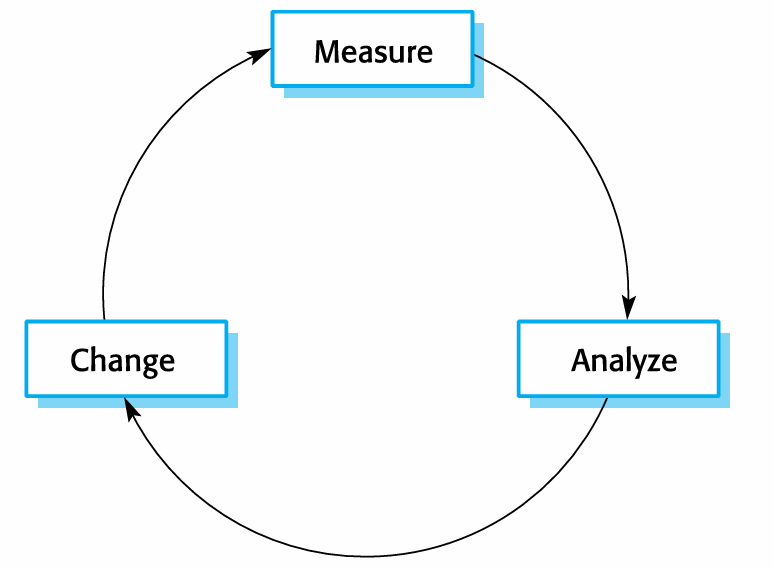

- **Process improvement activities**

    该循环具体体现为三项主要活动：

    1. **过程测量**
        - **活动**：测量软件过程或产品的一个或多个属性。
        - **目的**：这些测量值构成了一个**基线**，帮助你判断过程改进是否有效。
    2. **过程分析**
        - **活动**：评估当前过程，识别过程弱点和瓶颈。可能会开发描述过程的**过程模型**。
        - **目的**：找出需要改进的关键点。
    3. **过程变更**
        - **活动**：提出过程变更以解决已识别的过程弱点。引入变更后，循环重启以收集关于变更有效性的数据。
        - **目的**：实际执行改进。

- **Process measurement**

    - **重要性**：应尽可能收集**定量过程数据**。
    - **挑战**：如果组织没有明确的过程标准，测量会非常困难。有时必须**先定义过程**，然后才能进行测量。
    - **正确用途**：过程测量应用于**评估过程改进**的效果，但**不应由测量来驱动改进本身**。改进的驱动力应该是**组织的目标**。

- **Software Engineering Institute (SEI)  capability of maturity model**

    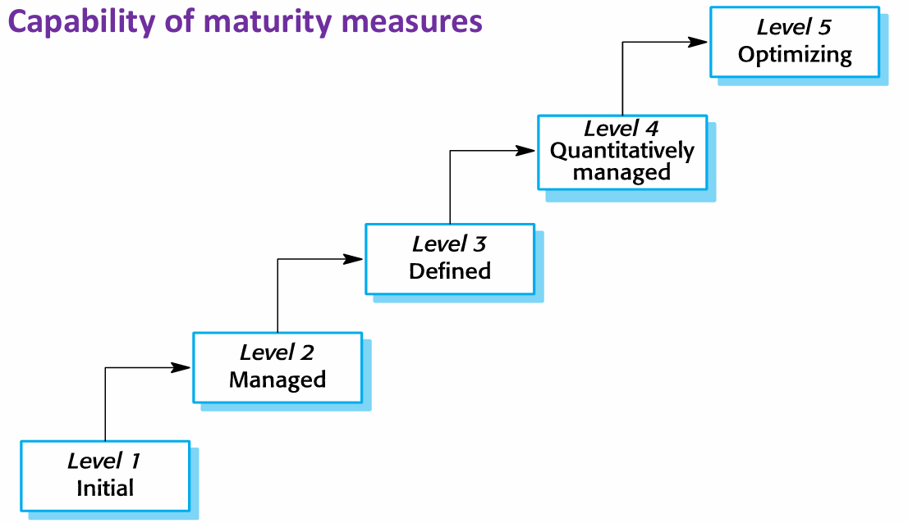

    这是过程成熟度方法的经典框架，由美国软件工程研究所提出。它将组织的过程能力划分为五个成熟度等级：

    **软件工程研究所能力成熟度模型**

    1. **初始级**
        - 过程基本上是无序的，缺乏明确定义。成功依赖个人英雄主义。
    2. **可重复级**
        - 建立了基本的**项目管理**规程，能跟踪成本、进度和功能。能重复早期成功的项目。
    3. **已定义级**
        - 软件过程已经**文档化、标准化**，并集成到组织的标准软件过程中。所有项目都使用统一的过程。
    4. **已管理级**
        - 为过程和产品建立了**定量的质量目标**。通过统计技术对过程和产品进行**定量控制**。
    5. **优化级**
        - 专注于**持续的过程改进**。能够利用来自过程和新技术的定量反馈，持续改进过程。

### Software prototyping

- **Prototyping**

    一个系统的初始版本，用于**演示概念**和**尝试设计选项**。

    **原型的用途**

    - **在需求工程中**：帮助进行需求获取和验证。
    - **在设计过程中**：探索选项并开发用户界面设计。
    - **在测试过程中**：进行背对背测试。

- **Benefits of prototyping**

    - 提高系统可用性。
    - 更贴近用户的真实需求。
    - 提高设计质量。
    - 提高可维护性。
    - 减少开发工作量。

- **The process of prototype development**

    这是一个系统的循环：

    1. **确立原型目标**
    2. **定义原型功能**
    3. **开发原型**
    4. **评估原型**
    5. 根据评估结果，重新定义或优化，进入下一个循环。

    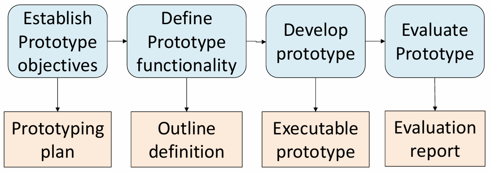

- **Features**

    - 原型可能基于快速原型语言或工具构建。
    - 可能会**省略某些功能**，专注于理解不清晰的产品领域。
    - 通常不包含完整的错误检查和恢复机制。
    - 侧重于**功能性需求**，而非可靠性、安全性等非功能性需求。

- **Throw away prototypes**

    - **抛弃式原型**：原型在开发后**应被丢弃**，不应作为生产系统的基础。因为它们通常无法调整以满足非功能性需求、缺乏文档、结构因快速变更而退化，且不符合组织的质量标准。

### Incremental delivery

- **Key Idea**

    不是一次性交付整个系统，而是将开发和交付分解为多个**增量**，每个增量交付部分所需功能。

- **Incremental development**

    - **确定需求优先级**：用户需求被优先排序，最高优先级的需求包含在早期的增量中。
    - **需求冻结**：一旦某个增量的开发开始，其需求就被**冻结**，但后续增量的需求可以继续演变。
    - **评估与部署**：每个增量都会被评估，并可以部署给最终用户使用，从而获得关于软件实际使用的更现实的反馈。

- **Incremental delivery**

    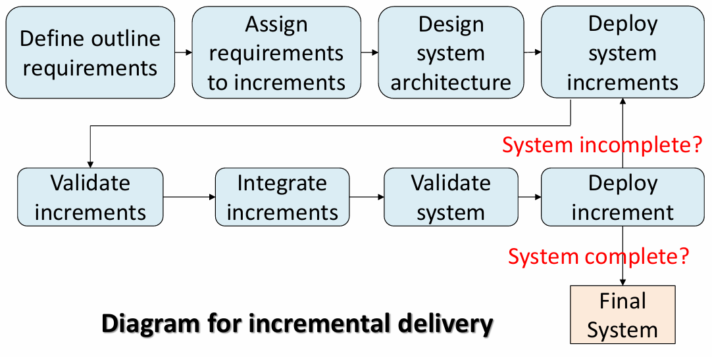

- **Advantages**
    - **早期价值**：每个增量都能为客户带来价值，功能更早可用。
    - **作为原型**：早期增量可作为原型，帮助获取后续增量的需求。
    - **满足关键需求**：第一个增量满足客户最迫切的需求。
    - **易于变更**：相对容易将变更纳入系统。
    - **降低风险**：整体项目失败的风险较低。
    - **重点测试**：最高优先级的服务得到最充分的测试。
- **Problems**
    - **通用设施难识别**：由于需求在增量实现前未详细定义，很难识别所有增量都需要的基础设施。
    - **与采购模型冲突**：迭代过程的本质是与软件共同完善规格说明，但这与许多组织的采购模型（要求在合同中明确完整系统规格）相冲突。

# Agile Software Development

- **Comparison of plan-driven and agile development**

    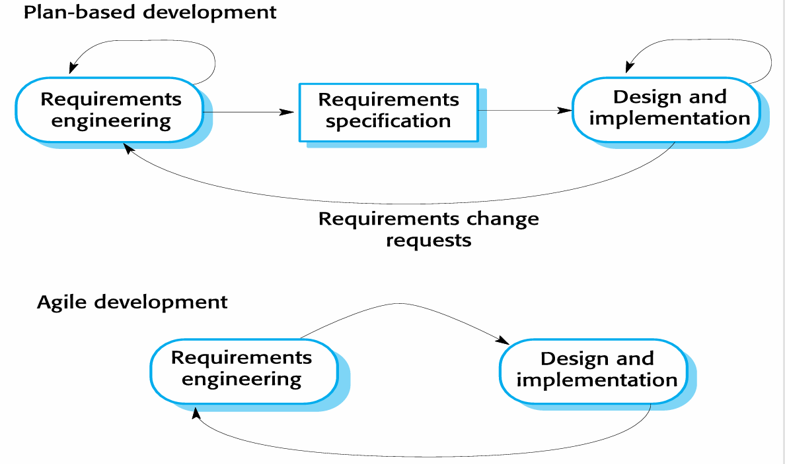

- **Purpose of agile software development**

    应对快速交付的需求，减少流程开销（如文档），**快速响应需求变更(主要目的)**。

- **Characteristics of agile software development**

    - 程序规格说明、设计和实现交织在一起。
    - 系统通过一系列版本或增量进行开发，利益相关者参与版本规范和评估。
    - 频繁交付新版本进行评估。
    - 广泛使用工具支持（如自动化测试工具）。
    - 最小化文档，专注于可工作的代码。

## Agile methods

- **Key Idea**

    敏捷方法的诞生源于对1980年代和1990年代软件设计方法中**过高开销**（如繁重的文档、严格的流程）的不满。其根本目标是**快速交付有价值的软件**，并能够**灵活响应需求变更**。

    **三大核心特征**

    1. **以代码为中心，而非设计**
        - 强调可工作的软件是衡量进度的主要标准，而不是详尽的设计文档。
    2. **基于迭代的开发模式**
        - 软件被分解为一系列小的、可管理的部分，并通过连续的短周期（迭代）进行开发和完善。
    3. **快速交付与演进**
        - 旨在迅速交付可用的软件，并在此基础上快速迭代，以适应不断变化的需求。

- **The principles of agile methods**

    | 原则                                | 描述                                                         |
    | :---------------------------------- | :----------------------------------------------------------- |
    | **客户参与** (Customer Involvement) | 客户应**密切参与**整个开发过程。他们的职责是**提供并优先排序**新的系统需求，并**评估**每个系统迭代版本。 |
    | **增量交付** (Incremental Delivery) | 软件以**增量**方式进行开发，由客户指定每个增量中需要包含的需求。 |
    | **人而非过程** (People not Process) | 应认可并利用开发团队的**技能**。团队成员应被允许**形成自己的工作方式**，而不受规定流程的束缚。 |
    | **拥抱变化** (Embrace Change)       | **预期系统需求会发生变化**，并据此设计系统，使其能够适应这些变化。 |
    | **保持简洁** (Maintain Simplicity)  | 专注于**简化**正在开发的软件和开发过程本身。尽可能主动地**消除系统中的复杂性**。 |

- **Agile methods have been particularly successful for** 

    敏捷方法在以下两种典型环境中取得了显著成功：

    1. **商业产品开发**
        - 适用于软件公司开发**中小型规模的销售产品**。
        - **现状：** 目前，几乎所有的软件产品和应用程序都采用敏捷方法进行开发。
    2. **组织内部定制系统开发**
        - 成功的关键前提是：
            - 客户有**明确的承诺**并**深入参与**开发过程。
            - 软件受**外部规则和法规的约束较少**，灵活性高。

## Agile development techniques

- **Extreme Programing (XP)**

    - **核心理念：** 将敏捷的**迭代开发**原则做到“**极致**”。
    - **典型节奏：**
        - 新版本可能**每天构建多次**。
        - 可工作的增量版本每 **2 周**交付给客户一次。
    - **质量基石：** 所有测试必须为每次构建运行，**只有所有测试都通过，构建才被接受**。

- **The XP release cycle**

    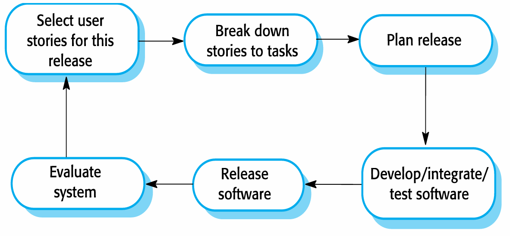

- **Extreme programming practices**

    1. **增量计划**
        - **流程：** 需求记录在**用户故事卡**上 -> 根据时间和优先级选择要纳入发布的用户故事 -> 开发者将故事分解为具体的开发“**任务**”。
    2. **小版本发布**
        - **做法：** 首先开发能提供业务价值的**最小可用功能集**，然后频繁发布，逐步增加功能。
    3. **简单设计**
        - **焦点：** 只专注于满足**当前迭代**需求的设计，不过度设计未来可能需要的功能。
    4. **测试先行开发**
        - **流程：** 在编写某个功能的代码**之前**，先为该功能编写自动化测试。
        - **好处：** 澄清需求、确保代码可测试、提供安全网。
        - **工具：** 依赖自动化测试框架（如 **JUnit**）。
    5. **重构**
        - **定义：** 在不改变代码外部行为的前提下，持续改进代码的**内部结构**，使其更清晰、易于理解和维护。
        - **理由：** XP认为无法可靠预测所有变化，因此通过持续重构使代码**随时准备迎接变化**。
        - **示例：** 重组类层次以消除重复代码、重命名方法使其更易懂、用库方法调用替换内联代码。
    6. **结对编程**
        - **做法：** 所有产品代码都由**两名程序员**在同一台计算机前共同完成。
        - **好处：**
            - 实时代码审查，提高质量。
            - 促进知识在团队内传播，避免“信息孤岛”。
            - 鼓励重构。
        - **效率：** 研究表明，结对编程的长期效率可能高于两名程序员单独工作。
    7. **集体代码所有权**
        - **规则：** 任何结对开发者都可以修改系统中的**任何代码**。
        - **目标：** 打破技术壁垒，让所有开发者对全部代码负责。
    8. **持续集成**
        - **要求：** 一旦完成某个任务，就立即**集成到整个系统**中。
        - **规则：** 每次集成后，**所有单元测试必须100%通过**。
    9. **可持续节奏**
        - **理念：** 不鼓励大量加班。认为过度加班会降低代码质量和中长期生产率。
    10. **现场客户**
        - **要求：** 团队中应包含一名**全职的、能代表最终用户**的客户。
        - **职责：** 负责解答问题、制定需求（用户故事）并验收功能。

