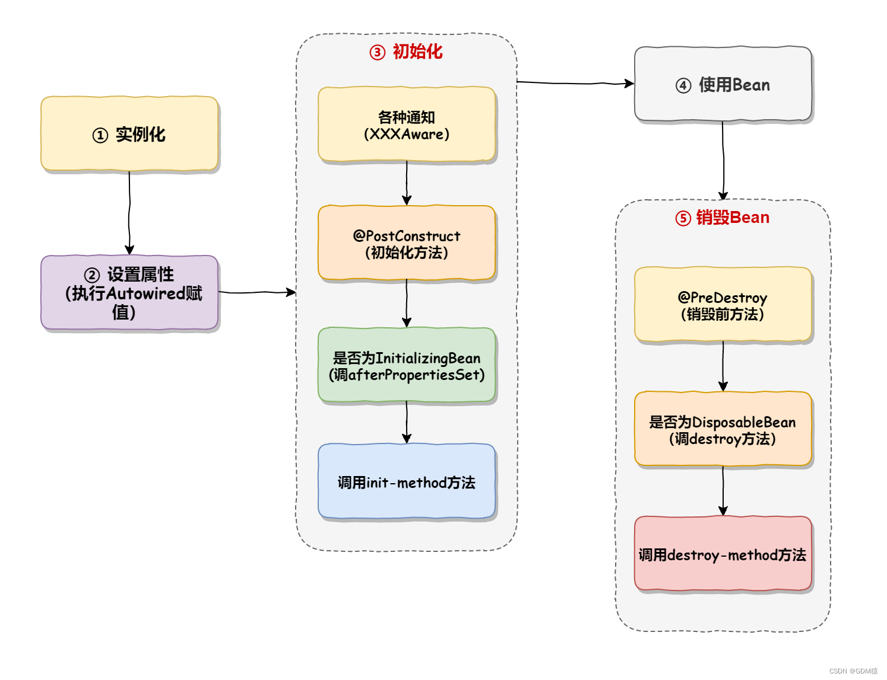
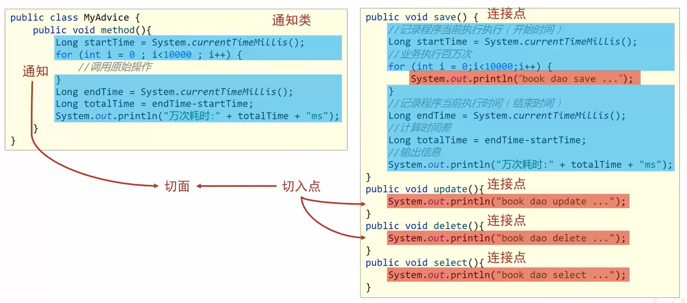
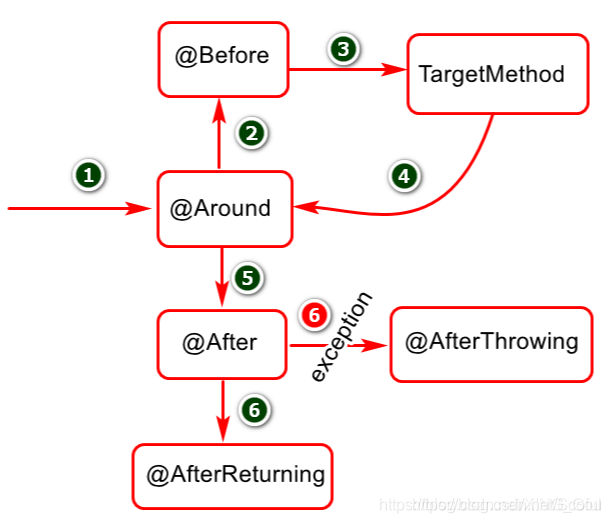
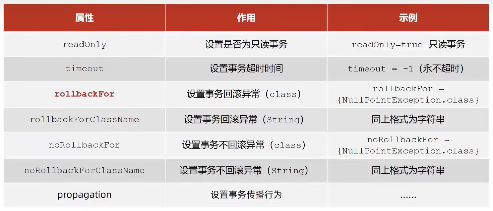
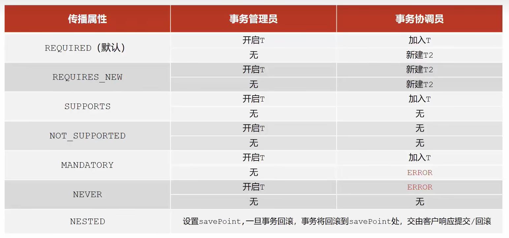

# Spring

[TOC]

# 快速入门


## 核心概念

以下是一些关键特性和概念：

1. **容器**：Spring 容器是框架的核心，负责创建、配置和管理 Bean 的生命周期。容器读取配置元数据（XML、注解或Java配置）来实例化、配置和组装应用程序中的对象。
2. **组件**：组件是Spring管理的基本单元，通常指被`@Component`及其衍生注解（`@Service`, `@Controller`, `@Repository`）标记的类。
3. **耦合**：耦合指模块或组件之间的依赖程度。高耦合意味着组件间紧密依赖，难以独立修改和测试。
4. **分层解耦**：通过分层架构降低系统各层之间的耦合度，通常分为表现层、业务层、数据访问层。
5. **控制反转**：控制反转是一种设计原则，将对象的创建和控制权从应用程序代码转移到外部容器。
6. **依赖注入**：依赖注入是IoC的具体实现方式，容器负责将依赖对象注入到需要它们的组件中。


## 搭建过程


### 1. 创建 Spring 项目

Maven 依赖 (pom.xml)

```xml
<?xml version="1.0" encoding="UTF-8"?>
<project xmlns="http://maven.apache.org/POM/4.0.0"
         xmlns:xsi="http://www.w3.org/2001/XMLSchema-instance"
         xsi:schemaLocation="http://maven.apache.org/POM/4.0.0 
         http://maven.apache.org/xsd/maven-4.0.0.xsd">
    <modelVersion>4.0.0</modelVersion>

    <groupId>com.libelms</groupId>
    <artifactId>spring-demo</artifactId>
    <version>1.0-SNAPSHOT</version>

    <properties>
        <maven.compiler.source>11</maven.compiler.source>
        <maven.compiler.target>11</maven.compiler.target>
        <spring.version>5.3.23</spring.version>
    </properties>

    <dependencies>
        <!-- Spring Core -->
        <dependency>
            <groupId>org.springframework</groupId>
            <artifactId>spring-context</artifactId>
            <version>${spring.version}</version>
        </dependency>

        <!-- Spring Test -->
        <dependency>
            <groupId>org.springframework</groupId>
            <artifactId>spring-test</artifactId>
            <version>${spring.version}</version>
            <scope>test</scope>
        </dependency>

        <!-- JUnit -->
        <dependency>
            <groupId>junit</groupId>
            <artifactId>junit</artifactId>
            <version>4.13.2</version>
            <scope>test</scope>
        </dependency>
    </dependencies>
</project>
```

### 2. 创建 POJO 类

`User.java`

```java
package com.libelms.pojo;

public class User {
    private Integer id;
    private String username;
    private String email;
    
    // 构造方法
    public User() {}
    
    public User(Integer id, String username, String email) {
        this.id = id;
        this.username = username;
        this.email = email;
    }
    
    // Getter 和 Setter 方法
    public Integer getId() { return id; }
    public void setId(Integer id) { this.id = id; }
    
    public String getUsername() { return username; }
    public void setUsername(String username) { this.username = username; }
    
    public String getEmail() { return email; }
    public void setEmail(String email) { this.email = email; }
    
    @Override
    public String toString() {
        return "User{id=" + id + ", username='" + username + "', email='" + email + "'}";
    }
}
```

`UserService.java`

```java
package com.libelms.service;

import com.libelms.pojo.User;
import java.util.List;

public interface UserService {
    List<User> getAllUsers();
    User getUserById(int id);
    void addUser(User user);
}
```

`UserServiceImpl.java`

```java
package com.libelms.service.impl;

import com.libelms.pojo.User;
import com.libelms.service.UserService;
import org.springframework.stereotype.Service;
import java.util.ArrayList;
import java.util.List;

@Service
public class UserServiceImpl implements UserService {
    
    private List<User> users = new ArrayList<>();
    
    public UserServiceImpl() {
        // 初始化一些测试数据
        users.add(new User(1, "zhangsan", "zhangsan@example.com"));
        users.add(new User(2, "lisi", "lisi@example.com"));
        users.add(new User(3, "wangwu", "wangwu@example.com"));
    }
    
    @Override
    public List<User> getAllUsers() {
        return users;
    }
    
    @Override
    public User getUserById(int id) {
        return users.stream()
                .filter(user -> user.getId() == id)
                .findFirst()
                .orElse(null);
    }
    
    @Override
    public void addUser(User user) {
        users.add(user);
    }
}
```

### 3. 配置 Spring

`applicationContext.xml`

```xml
<?xml version="1.0" encoding="UTF-8"?>
<beans xmlns="http://www.springframework.org/schema/beans"
       xmlns:xsi="http://www.w3.org/2001/XMLSchema-instance"
       xmlns:context="http://www.springframework.org/schema/context"
       xsi:schemaLocation="http://www.springframework.org/schema/beans
       http://www.springframework.org/schema/beans/spring-beans.xsd
       http://www.springframework.org/schema/context
       http://www.springframework.org/schema/context/spring-context.xsd">

    <!-- 开启注解扫描 -->
    <context:component-scan base-package="com.libelms"/>
    
    <!-- 定义Bean -->
    <bean id="user" class="com.libelms.pojo.User">
        <property name="id" value="1001"/>
        <property name="username" value="testuser"/>
        <property name="email" value="test@example.com"/>
    </bean>
</beans>
```

### 4. 测试 Spring 应用

`SpringTest.java`

```java
package com.libelms.test;

import com.libelms.config.AppConfig;
import com.libelms.pojo.User;
import com.libelms.service.UserService;
import org.junit.Test;
import org.junit.runner.RunWith;
import org.springframework.beans.factory.annotation.Autowired;
import org.springframework.context.ApplicationContext;
import org.springframework.context.support.ClassPathXmlApplicationContext;
import org.springframework.test.context.ContextConfiguration;
import org.springframework.test.context.junit4.SpringJUnit4ClassRunner;

import java.util.List;

// 方式1: 使用XML配置测试
public class SpringTest {
    
    @Test
    public void testXmlConfig() {
        // 1. 加载Spring配置文件
        ApplicationContext context = 
            new ClassPathXmlApplicationContext("applicationContext.xml");
        
        // 2. 获取Bean
        UserService userService = context.getBean(UserService.class);
        User user = context.getBean("user", User.class);
        
        // 3. 使用Bean
        System.out.println("获取的User Bean: " + user);
        
        List<User> users = userService.getAllUsers();
        System.out.println("所有用户:");
        users.forEach(System.out::println);
        
        // 4. 关闭容器
        ((ClassPathXmlApplicationContext) context).close();
    }
}

// 方式2: 使用注解配置测试
@RunWith(SpringJUnit4ClassRunner.class)
@ContextConfiguration(classes = AppConfig.class)
class SpringAnnotationTest {
    
    @Autowired
    private UserService userService;
    
    @Autowired
    private ApplicationContext context;
    
    @Test
    public void testAnnotationConfig() {
        // 测试获取所有用户
        List<User> users = userService.getAllUsers();
        System.out.println("所有用户:");
        users.forEach(System.out::println);
        
        // 测试根据ID查询
        User user = userService.getUserById(1);
        System.out.println("ID为1的用户: " + user);
        
        // 测试添加用户
        User newUser = new User(4, "zhaoliu", "zhaoliu@example.com");
        userService.addUser(newUser);
        
        System.out.println("添加后的所有用户:");
        userService.getAllUsers().forEach(System.out::println);
    }
    
    @Test
    public void testGetBean() {
        // 通过名称获取Bean
        UserService service = (UserService) context.getBean("userServiceImpl");
        System.out.println("通过名称获取的Service: " + service);
        
        // 通过类型获取Bean
        UserService service2 = context.getBean(UserService.class);
        System.out.println("通过类型获取的Service: " + service2);
    }
}
```

### 5. 使用 Spring 的依赖注入

创建 `UserController.java`

```java
package com.libelms.controller;

import com.libelms.pojo.User;
import com.libelms.service.UserService;
import org.springframework.beans.factory.annotation.Autowired;
import org.springframework.stereotype.Controller;

@Controller
public class UserController {
    
    // 依赖注入的三种方式
    
    // 方式1: 字段注入（不推荐）
    @Autowired
    private UserService userService;
    
    // 方式2: 构造器注入（推荐）
    private final UserService constructorInjectedService;
    
    @Autowired
    public UserController(UserService userService) {
        this.constructorInjectedService = userService;
    }
    
    // 方式3: Setter方法注入
    private UserService setterInjectedService;
    
    @Autowired
    public void setSetterInjectedService(UserService userService) {
        this.setterInjectedService = userService;
    }
    
    public void showAllUsers() {
        System.out.println("字段注入的Service:");
        userService.getAllUsers().forEach(System.out::println);
        
        System.out.println("构造器注入的Service:");
        constructorInjectedService.getAllUsers().forEach(System.out::println);
    }
}
```

## 项目结构

```
src/
├── main/
│   ├── java/
│   │   └── com/
│   │       └── libelms/
│   │           ├── config/
│   │           │   └── AppConfig.java
│   │           ├── controller/
│   │           │   └── UserController.java
│   │           ├── pojo/
│   │           │   └── User.java
│   │           ├── service/
│   │           │   ├── UserService.java
│   │           │   └── impl/
│   │           │       └── UserServiceImpl.java
│   │           └── test/
│   │               └── SpringTest.java
│   └── resources/
│       └── applicationContext.xml
└── test/
    └── java/
        └── com/
            └── libelms/
                └── test/
                    └── SpringTest.java
```


# 容器

好的，我们来全面深入地讲解 Spring 容器。Spring 容器是 Spring 框架的核心，理解容器是掌握 Spring 的关键。

## 什么是 Spring 容器？

Spring 容器（Spring Container）是一个**负责创建、配置、组装和管理 Bean 生命周期**的运行时环境。它实现了**控制反转（IoC）** 和**依赖注入（DI）** 的核心功能。

### 容器的核心作用
1. **实例化 Bean**：创建应用程序中的对象
2. **配置 Bean**：设置对象的属性和依赖关系
3. **组装 Bean**：将相互依赖的对象连接起来
4. **管理生命周期**：控制 Bean 的创建、初始化和销毁

## Spring 容器的两种主要类型

Spring 提供了两种类型的容器实现，它们都实现了 `BeanFactory` 接口：

### BeanFactory（基础容器）
- **功能**：提供基本的 DI 支持
- **特点**：懒加载模式，只有在真正需要时才创建 Bean
- **适用场景**：资源紧张的移动设备应用

```java
// BeanFactory 的使用
BeanFactory factory = new XmlBeanFactory(new ClassPathResource("beans.xml"));
MyService service = factory.getBean("myService", MyService.class);
```

### ApplicationContext（应用上下文，推荐使用）
- **功能**：继承 BeanFactory，提供更多企业级功能
- **特点**：预加载模式，容器启动时就创建所有单例 Bean
- **额外功能**：国际化、事件发布、AOP 集成、资源访问等

```java
// ApplicationContext 的使用
ApplicationContext context = new ClassPathXmlApplicationContext("beans.xml");
MyService service = context.getBean("myService", MyService.class);
```

## ApplicationContext 的主要实现类

根据不同的配置方式和应用场景，ApplicationContext 有多个实现类：

### 基于 XML 配置的上下文
```java
// 从类路径加载XML配置
ApplicationContext context = new ClassPathXmlApplicationContext("applicationContext.xml");

// 从文件系统加载XML配置
ApplicationContext context = new FileSystemXmlApplicationContext("/etc/app/config/applicationContext.xml");

// 加载多个配置文件
ApplicationContext context = new ClassPathXmlApplicationContext(
    new String[] {"services.xml", "daos.xml", "security.xml"});
```

### 基于注解配置的上下文
```java
// 基于Java配置类
ApplicationContext context = new AnnotationConfigApplicationContext(AppConfig.class);

// 扫描指定包
ApplicationContext context = new AnnotationConfigApplicationContext("com.example");

// 同时使用配置类和包扫描
AnnotationConfigApplicationContext context = new AnnotationConfigApplicationContext();
context.register(AppConfig.class);
context.scan("com.example");
context.refresh();
```

### Web 应用上下文
```java
// Web应用使用的上下文（在web.xml中配置）
<context-param>
    <param-name>contextConfigLocation</param-name>
    <param-value>/WEB-INF/applicationContext.xml</param-value>
</context-param>

<listener>
    <listener-class>org.springframework.web.context.ContextLoaderListener</listener-class>
</listener>
```

## 核心功能

### Bean 的创建和管理
容器负责管理 Bean 的完整生命周期：

```java
public class BeanLifecycleDemo {
    public static void main(String[] args) {
        // 1. 容器启动 - 加载配置，创建BeanDefinition
        ApplicationContext context = new ClassPathXmlApplicationContext("beans.xml");
        
        // 2. Bean实例化 - 通过反射创建对象
        // 3. 依赖注入 - 设置属性和依赖
        // 4. 初始化 - 调用init方法
        
        // 5. Bean就绪 - 可以被使用
        MyService service = context.getBean("myService", MyService.class);
        service.doSomething();
        
        // 6. 容器关闭 - 调用destroy方法
        ((ConfigurableApplicationContext) context).close();
    }
}
```

### 依赖注入的实现
容器自动处理对象之间的依赖关系：

```xml
<!-- XML配置方式 -->
<bean id="userRepository" class="com.example.JdbcUserRepository"/>
<bean id="userService" class="com.example.UserService">
    <property name="userRepository" ref="userRepository"/>
</bean>
```

```java
// 注解方式
@Service
public class UserService {
    @Autowired
    private UserRepository userRepository;
}
```

### 作用域管理
容器管理不同作用域的 Bean：

```java
@Component
@Scope("prototype") // 原型模式，每次请求都创建新实例
public class PrototypeBean {
    // ...
}

@Component
@Scope("singleton") // 单例模式，默认值
public class SingletonBean {
    // ...
}

@Component
@Scope(value = WebApplicationContext.SCOPE_SESSION, proxyMode = ScopedProxyMode.TARGET_CLASS)
public class SessionScopedBean {
    // Session作用域
}
```

### 国际化和消息源
```java
public class I18nDemo {
    public static void main(String[] args) {
        ApplicationContext context = new ClassPathXmlApplicationContext("beans.xml");
        
        // 获取国际化消息
        String message = context.getMessage("welcome.message", 
                                          new Object[]{"John"}, 
                                          Locale.US);
        System.out.println(message); // Hello, John!
    }
}
```

### 事件发布和监听
```java
// 自定义事件
public class CustomEvent extends ApplicationEvent {
    private String message;
    public CustomEvent(Object source, String message) {
        super(source);
        this.message = message;
    }
    public String getMessage() { return message; }
}

// 事件监听器
@Component
public class CustomEventListener implements ApplicationListener<CustomEvent> {
    @Override
    public void onApplicationEvent(CustomEvent event) {
        System.out.println("Received event: " + event.getMessage());
    }
}

// 事件发布
@Service
public class EventPublisherService {
    @Autowired
    private ApplicationEventPublisher eventPublisher;
    
    public void publishEvent(String message) {
        eventPublisher.publishEvent(new CustomEvent(this, message));
    }
}
```

## 层次结构

Spring 容器支持层次结构，子容器可以访问父容器的 Bean，但父容器不能访问子容器的 Bean。

```java
// 创建父容器
ApplicationContext parentContext = new ClassPathXmlApplicationContext("parent-context.xml");

// 创建子容器，并设置父容器
ApplicationContext childContext = new ClassPathXmlApplicationContext(
    new String[] {"child-context.xml"}, parentContext);

// 子容器可以访问父容器的Bean
Object parentBean = childContext.getBean("parentBean");

// 但父容器不能访问子容器的Bean
// Object childBean = parentContext.getBean("childBean"); // 这会抛出异常
```

**典型应用场景**：在 Web 应用中，通常有：
- 父容器：包含 service、dao 等业务层组件
- 子容器：包含 controller、handler 等web层组件

## 配置方式

### XML 配置（传统方式）
```xml
<?xml version="1.0" encoding="UTF-8"?>
<beans xmlns="http://www.springframework.org/schema/beans"
       xmlns:xsi="http://www.w3.org/2001/XMLSchema-instance"
       xmlns:context="http://www.springframework.org/schema/context"
       xsi:schemaLocation="
           http://www.springframework.org/schema/beans
           http://www.springframework.org/schema/beans/spring-beans.xsd
           http://www.springframework.org/schema/context
           http://www.springframework.org/schema/context/spring-context.xsd">

    <!-- 组件扫描 -->
    <context:component-scan base-package="com.example"/>
    
    <!-- 属性占位符 -->
    <context:property-placeholder location="classpath:app.properties"/>
    
    <!-- Bean定义 -->
    <bean id="dataSource" class="com.zaxxer.hikari.HikariDataSource">
        <property name="jdbcUrl" value="${db.url}"/>
        <property name="username" value="${db.username}"/>
        <property name="password" value="${db.password}"/>
    </bean>
</beans>
```

### Java 配置（现代方式）
```java
@Configuration
@ComponentScan("com.example")
@PropertySource("classpath:app.properties")
@EnableAspectJAutoProxy
@EnableTransactionManagement
public class AppConfig {
    
    @Bean
    public DataSource dataSource(
            @Value("${db.url}") String url,
            @Value("${db.username}") String username,
            @Value("${db.password}") String password) {
        HikariDataSource dataSource = new HikariDataSource();
        dataSource.setJdbcUrl(url);
        dataSource.setUsername(username);
        dataSource.setPassword(password);
        return dataSource;
    }
    
    @Bean
    public PlatformTransactionManager transactionManager(DataSource dataSource) {
        return new DataSourceTransactionManager(dataSource);
    }
}
```

### 混合配置
```java
@Configuration
@ImportResource("classpath:legacy-beans.xml") // 导入XML配置
@Import({SecurityConfig.class, WebConfig.class}) // 导入其他Java配置
public class MainConfig {
    // 主配置类
}
```

## 高级特性

### 环境抽象（Profiles）
```java
@Configuration
public class DatabaseConfig {
    
    @Bean
    @Profile("development")
    public DataSource developmentDataSource() {
        // 开发环境数据源
        return new EmbeddedDatabaseBuilder()
            .setType(EmbeddedDatabaseType.H2)
            .build();
    }
    
    @Bean
    @Profile("production")
    public DataSource productionDataSource(
            @Value("${db.url}") String url,
            @Value("${db.username}") String username,
            @Value("${db.password}") String password) {
        // 生产环境数据源
        HikariDataSource dataSource = new HikariDataSource();
        dataSource.setJdbcUrl(url);
        dataSource.setUsername(username);
        dataSource.setPassword(password);
        return dataSource;
    }
}
```

### 条件化配置（Conditional）
```java
@Bean
@ConditionalOnClass(name = "javax.servlet.Servlet")
@ConditionalOnProperty(name = "feature.enabled", havingValue = "true")
public MyService myService() {
    return new MyService();
}
```

### 懒加载（Lazy Initialization）
```java
@Configuration
public class LazyConfig {
    
    @Bean
    @Lazy // 只有在第一次使用时才创建
    public ExpensiveBean expensiveBean() {
        return new ExpensiveBean();
    }
}
```

## 总结

Spring 容器是 Spring 框架的心脏，它通过以下方式简化了企业级应用开发：

1. **控制反转**：将对象的创建和管理权交给容器
2. **依赖注入**：自动处理对象之间的依赖关系
3. **生命周期管理**：统一管理 Bean 的创建、初始化和销毁
4. **配置抽象**：支持多种配置方式（XML、注解、Java配置）
5. **模块化设计**：通过Profile和Conditional实现环境特定的配置

理解 Spring 容器的工作原理和特性，是掌握 Spring 框架的关键所在。


# Bean

Bean 是 Spring 框架的核心，它代表了由 Spring IoC 容器**实例化、组装和管理**的对象。配置 Bean 的本质就是告诉 Spring：
1.  **创建哪个对象**（Bean 的定义）
2.  **如何创建它**（通过构造函数、工厂方法等）
3.  **它的生命周期和依赖关系**（依赖注入）

## XML 配置

这是最早期、最经典的方式，将所有 Bean 的配置集中在一个或多个 XML 文件中。

### 基本步骤

1.  **创建 XML 配置文件**：通常命名为 `applicationContext.xml`。
2.  **添加 Schema 约束**：在文件头部声明命名空间，以便使用各种标签。
3.  **使用 `<bean>` 标签**：定义 Bean。

### 示例

假设我们有一个 `UserService` 接口和其实现类 `UserServiceImpl`，以及一个依赖 `UserService` 的 `UserController`。

**UserServiceImpl.java**
```java
public class UserServiceImpl implements UserService {
    @Override
    public void addUser() {
        System.out.println("添加用户成功");
    }
}
```

**UserController.java**
```java
public class UserController {
    private UserService userService;

    // 必须提供 setter 方法以便 Spring 进行依赖注入
    public void setUserService(UserService userService) {
        this.userService = userService;
    }

    public void doSomething() {
        userService.addUser();
    }
}
```

**applicationContext.xml**
```xml
<?xml version="1.0" encoding="UTF-8"?>
<beans xmlns="http://www.springframework.org/schema/beans"
       xmlns:xsi="http://www.w3.org/2001/XMLSchema-instance"
       xsi:schemaLocation="http://www.springframework.org/schema/beans
        http://www.springframework.org/schema/beans/spring-beans.xsd">

    <!-- 1. 定义一个简单的 Bean -->
    <bean id="userService" class="com.example.service.impl.UserServiceImpl"/>

    <!-- 2. 定义另一个 Bean，并注入（装配）第一个 Bean 作为依赖 -->
    <bean id="userController" class="com.example.controller.UserController">
        <!-- 
            property 标签用于通过 setter 方法注入依赖
            name 属性：对应类中的属性名（userService）
            ref 属性：引用另一个 Bean 的 ID（userService）
        -->
        <property name="userService" ref="userService"/>
    </bean>

    <!-- 也可以通过构造函数注入 -->
    <!-- <bean id="userController" class="com.example.controller.UserController">
        <constructor-arg ref="userService"/>
    </bean> -->

</beans>
```

### 配置项

Spring XML 配置中 `<bean>` 标签的各种配置项。

#### Bean 的标识符：`id` vs `name`

*   **`id`**:
    *   一个 Bean 的唯一标识符。
    *   在整个 XML 文件中必须是唯一的。
    *   遵守 XML ID 的命名规则（不能以数字开头，不能包含特殊字符等）。

*   **`name`**:
    *   也可以作为 Bean 的标识符，**功能上与 `id` 几乎相同**。
    *   **优势1**：命名规则更宽松，可以包含任何字符，例如 `/userService`。
    *   **优势2**：可以指定**多个名称（别名）**，用逗号、分号或空格分隔。

```xml
<bean id="userService" name="userService, myService, serviceImpl" class="com.example.service.impl.UserServiceImpl"/>
<!-- 现在可以通过 userService、myService 或 serviceImpl 来获取这个 Bean -->
```

#### 作用范围（Scope）

通过 `scope` 属性定义 Bean 的作用域，即 Bean 的生命周期和创建方式。

*   **`singleton`** (默认值)：单例。IoC 容器中**只存在一个**该 Bean 的实例。所有对该 Bean 的请求都返回同一个实例。
*   **`prototype`**：原型。每次请求（`getBean()` 或注入）时都会**创建一个新的**实例。
*   **`request`**：Web 环境。每次 HTTP 请求都会创建一个新的 Bean，请求结束后销毁。
*   **`session`**：Web 环境。每个 HTTP Session 会创建一个新的 Bean，Session 过期后销毁。
*   **`application`**：Web 环境。每个 `ServletContext` 生命周期内只创建一个 Bean。
*   **`websocket`**：Web 环境。每个 WebSocket 会话内只创建一个 Bean。

```xml
<bean id="userService" class="com.example.service.impl.UserServiceImpl" scope="prototype"/>
```

#### 生命周期回调方法

可以指定 Bean 在**初始化后**和**销毁前**要执行的方法。

*   **`init-method`**: 指定一个方法，在 Bean 的依赖注入完成后，立即执行该方法进行自定义初始化。
*   **`destroy-method`**: 指定一个方法，在 Bean 被容器销毁之前（如容器关闭）调用，用于执行清理工作（如关闭连接、释放资源）。

**UserServiceImpl.java**
```java
public class UserServiceImpl implements UserService {
    
    public void init() {
        System.out.println("UserService Bean 被初始化了...");
        // 例如：建立数据库连接池
    }
    
    public void cleanup() {
        System.out.println("UserService Bean 即将被销毁，正在清理资源...");
        // 例如：关闭数据库连接池
    }
    
    // ... 其他方法
}
```

**applicationContext.xml**
```xml
<bean id="userService" class="com.example.service.impl.UserServiceImpl" 
      init-method="init" destroy-method="cleanup"/>
```

#### 延迟初始化（Lazy Init）

默认情况下，Spring 容器在启动时就会创建所有的 **`singleton`** Bean（预初始化）。如果希望某个 Bean 只在第一次被请求时才创建，可以使用 `lazy-init` 属性。

*   **`true`**: 延迟初始化。
*   **`false`** (默认): 不延迟。

```xml
<bean id="expensiveBean" class="com.example.ExpensiveObject" lazy-init="true"/>
```

#### 依赖注入（Dependency Injection）的多种方式

除了用 `<property ref="...">` 注入其他 Bean，还可以注入简单值和集合。

**a) 注入简单值（字面量）**

使用 `<property name="..." value="...">` 或 `<constructor-arg value="...">`

```xml
<bean id="dataSource" class="com.example.BasicDataSource">
    <property name="driverClassName" value="com.mysql.jdbc.Driver"/>
    <property name="url" value="jdbc:mysql://localhost:3306/mydb"/>
    <property name="username" value="root"/>
    <property name="password" value="secret"/>
    <property name="initialPoolSize" value="5"/> <!-- 注入整型值 -->
</bean>
```

**b) 注入集合（List, Set, Map, Properties）**

```xml
<bean id="complexBean" class="com.example.ComplexBean">
    <!-- 注入 List -->
    <property name="list">
        <list>
            <value>value1</value>
            <value>value2</value>
            <ref bean="userService"/> <!-- 也可以注入其他Bean的引用 -->
        </list>
    </property>

    <!-- 注入 Set -->
    <property name="set">
        <set>
            <value>value1</value>
            <value>value2</value>
        </set>
    </property>

    <!-- 注入 Map -->
    <property name="map">
        <map>
            <entry key="key1" value="value1"/>
            <entry key="key2" value-ref="userService"/> <!-- value-ref 引用另一个Bean -->
        </map>
    </property>

    <!-- 注入 Properties (键值对都是String) -->
    <property name="properties">
        <props>
            <prop key="user">root</prop>
            <prop key="password">pass123</prop>
        </props>
    </property>
</bean>
```

**c) 自动装配（Autowiring）**

无需使用 `<property>` 或 `<constructor-arg>` 显式指定依赖，Spring 容器可以自动寻找并注入。通过 `autowire` 属性设置。

*   **`no`** (默认)：不自动装配。
*   **`byName`**：根据属性名自动装配。它会查找与属性名**相同**的 Bean ID。
*   **`byType`**：根据属性类型自动装配。如果容器中存在**一个**该类型的 Bean，则注入。如果存在多个，会抛出异常。
*   **`constructor`**：类似于 `byType`，但是应用于构造函数的参数。

```xml
<!-- UserController 有一个名为 userService 的属性 -->
<bean id="userController" class="com.example.controller.UserController" autowire="byName"/>
<!-- Spring 会自动寻找 id 为 "userService" 的 Bean 并注入 -->

<bean id="userController" class="com.example.controller.UserController" autowire="byType"/>
<!-- Spring 会自动寻找类型为 UserService 的 Bean 并注入 -->
```

**注意**：虽然自动装配很方便，但显式配置更清晰、更安全，大型项目中推荐显式配置。

#### 继承配置：`parent` 属性

Bean 定义可以继承另一个 Bean 的定义，从而共享公共的配置。子 Bean 可以覆盖父 Bean 的属性。

```xml
<!-- 定义一个抽象的父Bean模板 (abstract="true" 表示这个Bean不会被实例化) -->
<bean id="abstractDataSource" class="com.example.BasicDataSource" abstract="true">
    <property name="driverClassName" value="com.mysql.jdbc.Driver"/>
    <property name="initialPoolSize" value="5"/>
</bean>

<!-- 子Bean继承父Bean的配置，并覆盖或添加自己的配置 -->
<bean id="developmentDataSource" parent="abstractDataSource">
    <property name="url" value="jdbc:mysql://dev-server:3306/devdb"/>
    <property name="username" value="dev_user"/>
</bean>

<bean id="productionDataSource" parent="abstractDataSource">
    <property name="url" value="jdbc:mysql://prod-server:3306/proddb"/>
    <property name="username" value="prod_user"/>
    <property name="maxPoolSize" value="50"/> <!-- 添加新属性 -->
</bean>
```

#### 引入外部属性文件

```xml
<!-- 加载单个 properties 文件 -->
<context:property-placeholder location="classpath:jdbc.properties"/>

<!-- 加载多个 properties 文件 -->
<context:property-placeholder location="classpath:jdbc.properties,classpath:redis.properties"/>

<!-- 使用通配符加载多个文件 -->
<context:property-placeholder location="classpath:*.properties"/>
<context:property-placeholder location="classpath:config/*.properties"/>
```

### 实例化

Spring 提供了三种方式来实例化 Bean：

1.  **通过构造函数实例化**（最常用）
2.  **通过静态工厂方法实例化**
3.  **通过实例工厂方法实例化**

#### 构造函数实例化

这是**最直接、最常用**的方式。Spring IoC 容器调用类的**无参构造函数**（默认）或**有参构造函数**来创建 Bean 的实例。

**a) 默认无参构造**

**要求**：类必须有一个无参数的构造函数（如果没有显式定义任何构造函数，Java 会默认提供一个无参构造）。

**UserService.java**
```java
public class UserService {
    // 显式或无显式定义无参构造函数都可以
    public UserService() {
        System.out.println("UserService 的无参构造函数被调用");
    }
    // ... 其他方法
}
```

**XML 配置**

```xml
<bean id="userService" class="com.example.service.UserService"/>
<!-- 非常简单，只需要指定 class 属性 -->
```

**b) 带参数的构造（构造器注入）**

如果构造函数需要参数，Spring 会通过依赖注入来提供这些参数。

**OrderService.java**
```java
public class OrderService {
    private UserService userService;
    private int timeout;

    // 带参数的构造函数
    public OrderService(UserService userService, int timeout) {
        this.userService = userService;
        this.timeout = timeout;
        System.out.println("OrderService 的有参构造函数被调用，timeout: " + timeout);
    }
}
```

**XML 配置**
```xml
<bean id="userService" class="com.example.service.UserService"/>

<bean id="orderService" class="com.example.service.OrderService">
    <!-- constructor-arg 标签用于给构造函数传参 -->
    <!-- index 属性表示参数的位置（从0开始） -->
    <!-- ref 属性用于引用其他 Bean -->
    <constructor-arg index="0" ref="userService"/>
    <!-- value 属性用于注入基本类型或字符串值 -->
    <constructor-arg index="1" value="30"/>
</bean>

<!-- 也可以使用 name 属性，根据参数名注入 -->
<!-- <constructor-arg name="userService" ref="userService"/>
<constructor-arg name="timeout" value="30"/> -->

<!-- 如果参数类型不同，可以省略 index/name，Spring 会尝试类型匹配 -->
<!-- <constructor-arg ref="userService"/>
<constructor-arg value="30"/> -->
```

#### 静态工厂方法实例化

当你无法直接通过 `new` 创建对象（例如构造函数是私有的），或者对象的创建过程非常复杂时，可以使用静态工厂方法。Spring 会调用指定的类的**静态方法**来获取 Bean 的实例。

**StaticServiceFactory.java**

```java
public class StaticServiceFactory {
    
    // 私有的构造函数，防止外部实例化
    private StaticServiceFactory() {}
    
    // 静态工厂方法，负责创建并返回 Bean 实例
    public static UserService createUserService() {
        System.out.println("静态工厂方法 createUserService 被调用");
        // 这里可以包含复杂的创建逻辑
        return new UserService();
    }
    
    public static UserService createUserService(String type) {
        System.out.println("静态工厂方法 createUserService(String) 被调用，type: " + type);
        if ("admin".equals(type)) {
            return new AdminUserService();
        } else {
            return new UserService();
        }
    }
}
```

**XML 配置**
```xml
<!-- 
    factory-method: 指定静态工厂方法的名称
    class: 指定包含静态工厂方法的类
-->
<bean id="userService" 
      class="com.example.factory.StaticServiceFactory" 
      factory-method="createUserService"/>

<!-- 如果工厂方法需要参数，使用 constructor-arg -->
<bean id="adminUserService" 
      class="com.example.factory.StaticServiceFactory" 
      factory-method="createUserService">
    <constructor-arg value="admin"/>
</bean>
```

#### 实例工厂方法实例化

与静态工厂方法类似，但工厂方法不是静态的，因此需要先创建一个**工厂 Bean 的实例**，然后调用该实例的方法来创建目标 Bean。

**InstanceServiceFactory.java**
```java
public class InstanceServiceFactory {
    
    // 实例工厂方法
    public UserService createUserService() {
        System.out.println("实例工厂方法 createUserService 被调用");
        return new UserService();
    }
    
    public UserService createUserService(String type) {
        System.out.println("实例工厂方法 createUserService(String) 被调用，type: " + type);
        if ("vip".equals(type)) {
            return new VipUserService();
        } else {
            return new UserService();
        }
    }
}
```

**XML 配置**
```xml
<!-- 1. 首先创建工厂 Bean 的实例 -->
<bean id="serviceFactory" class="com.example.factory.InstanceServiceFactory"/>

<!-- 2. 使用工厂 Bean 的方法来创建目标 Bean -->
<!-- 
    factory-bean: 引用工厂 Bean 的实例
    factory-method: 指定实例工厂方法的名称
-->
<bean id="userService" 
      factory-bean="serviceFactory" 
      factory-method="createUserService"/>

<!-- 带参数的实例工厂方法 -->
<bean id="vipUserService" 
      factory-bean="serviceFactory" 
      factory-method="createUserService">
    <constructor-arg value="vip"/>
</bean>
```

### 实例化过程的核心步骤

无论采用哪种方式，Spring IoC 容器实例化一个 Bean 的大致流程如下：

1.  **加载与解析配置**：容器读取 XML、注解或 Java 配置，解析出所有的 Bean 定义（`BeanDefinition`）。
2.  **实例化前**：如果配置了 `lazy-init="true"`，则延迟到第一次请求时才进行后续步骤。
3.  **创建实例**：根据配置选择上述三种方式之一来创建 Bean 的原始对象。
    *   构造函数：反射调用 `Class.newInstance()` 或 `Constructor.newInstance()`
    *   静态工厂：反射调用 `Class.getMethod().invoke(null, args)`
    *   实例工厂：先获取工厂实例，再反射调用其方法
4.  **填充属性（依赖注入）**：将 Bean 所依赖的其他 Bean 或值注入到属性中（通过 setter 或构造函数）。
5.  **aware 接口回调**：如果 Bean 实现了各种 `Aware` 接口（如 `BeanNameAware`, `ApplicationContextAware`），Spring 会回调这些接口的方法。
6.  **BeanPostProcessor 前置处理**：调用所有 `BeanPostProcessor` 的 `postProcessBeforeInitialization` 方法。
7.  **初始化**：如果指定了 `init-method` 或者 Bean 实现了 `InitializingBean` 接口，则执行初始化方法。
8.  **BeanPostProcessor 后置处理**：调用所有 `BeanPostProcessor` 的 `postProcessAfterInitialization` 方法。**AOP 代理就是在此处生成的**。
9.  **Bean 就绪**：此时，Bean 已经完全初始化完毕，可以被应用程序使用了。
10. **销毁**：当容器关闭时，如果指定了 `destroy-method` 或者 Bean 实现了 `DisposableBean` 接口，则执行销毁方法。

### 总结与选择

| 实例化方式   | 适用场景                                                     | 优点                           | 缺点                                       |
| :----------- | :----------------------------------------------------------- | :----------------------------- | :----------------------------------------- |
| **构造函数** | **绝大多数场景**，类是自己编写的，有简单或复杂的构造逻辑     | 配置简单直观，最常用           | 无法用于构造函数私有或创建逻辑极其复杂的类 |
| **静态工厂** | 需要封装复杂创建逻辑，或用于无法直接实例化的类（如第三方库） | 将创建逻辑集中化，更灵活       | 配置稍复杂                                 |
| **实例工厂** | 工厂方法本身需要依赖其他资源，或者需要有状态地创建对象       | 灵活性最高，工厂本身也可被管理 | 配置最复杂，需要先创建工厂 Bean            |

**一般建议**：优先使用**构造函数**方式，只有在遇到特殊需求时（如集成遗留代码、第三方库）才考虑使用静态或实例工厂方法。


## 生命周期

Spring Bean 的生命周期指的是一个 Bean 从被创建、初始化、使用到最终被销毁的整个过程。Spring IoC 容器精细地管理着这个过程的每一个阶段。

下图清晰地展示了 Spring Bean 的完整生命周期：



### 各个阶段的详细说明

#### 1. 实例化 (Instantiation)
Spring 容器根据 Bean 的定义（配置元数据），通过以下方式之一创建 Bean 的实例：
- **构造函数**（最常见）：反射调用无参或有参构造函数
- **静态工厂方法**：调用类的静态方法
- **实例工厂方法**：调用工厂对象的方法

此时对象已经被 JVM 分配内存，但属性都是默认值（null, 0 等），是一个"半成品"。

#### 2. 依赖注入 (Populate Properties)
Spring 容器将 Bean 所依赖的其他 Bean 和配置值注入到对象中。
- 通过 Setter 方法注入
- 通过构造函数注入（如果在实例化时未完成）
- 注入简单值（`value`）和引用（`ref`）

#### 3. Aware 接口回调 (Aware Interfaces)
如果 Bean 实现了各种 `Aware` 接口，Spring 会按顺序回调这些接口的方法，让 Bean 能感知到容器的存在：

**执行顺序：**
1.  **`BeanNameAware.setBeanName()`**：感知自己的 Bean ID
2.  **`BeanClassLoaderAware.setBeanClassLoader()`**：感知类加载器
3.  **`BeanFactoryAware.setBeanFactory()`**：感知 BeanFactory 容器
4.  **`EnvironmentAware.setEnvironment()`**：感知环境变量
5.  **`EmbeddedValueResolverAware.setEmbeddedValueResolver()`**：感知值解析器
6.  **`ResourceLoaderAware.setResourceLoader()`**：感知资源加载器
7.  **`ApplicationEventPublisherAware.setApplicationEventPublisher()`**：感知事件发布器
8.  **`MessageSourceAware.setMessageSource()`**：感知国际化消息源
9.  **`ApplicationContextAware.setApplicationContext()`**：感知 ApplicationContext（最常用）

```java
public class AwareBean implements BeanNameAware, ApplicationContextAware {
    private String beanName;
    private ApplicationContext applicationContext;

    @Override
    public void setBeanName(String name) {
        this.beanName = name;
        System.out.println("BeanNameAware: " + name);
    }

    @Override
    public void setApplicationContext(ApplicationContext applicationContext) {
        this.applicationContext = applicationContext;
        System.out.println("ApplicationContextAware");
    }
}
```

#### 4. BeanPostProcessor 前置处理
Spring 容器中所有的 **`BeanPostProcessor`** 的 `postProcessBeforeInitialization()` 方法会被调用。这是对 Bean 进行增强的关键扩展点。

```java
@Component
public class CustomBeanPostProcessor implements BeanPostProcessor {
    @Override
    public Object postProcessBeforeInitialization(Object bean, String beanName) {
        System.out.println("BeanPostProcessor before: " + beanName);
        return bean; // 可以返回原始bean或包装后的代理对象
    }
}
```

#### 5. 初始化 (Initialization)
Bean 的真正初始化阶段，按顺序执行：

1.  **`@PostConstruct` 注解方法**（JSR-250 标准）
2.  **`InitializingBean.afterPropertiesSet()`** 方法
3.  **自定义的 `init-method`**（XML 中配置或 `@Bean(initMethod = "init")`）

```java
@Component
public class LifecycleBean implements InitializingBean {
    
    // 1. @PostConstruct (最先执行)
    @PostConstruct
    public void postConstruct() {
        System.out.println("@PostConstruct method");
    }
    
    // 2. InitializingBean接口 (其次执行)
    @Override
    public void afterPropertiesSet() {
        System.out.println("InitializingBean.afterPropertiesSet()");
    }
    
    // 3. 自定义init方法 (最后执行)
    public void customInit() {
        System.out.println("Custom init-method");
    }
}
```

**XML 配置对应：**
```xml
<bean id="lifecycleBean" class="com.example.LifecycleBean" 
      init-method="customInit"/>
```

#### 6. BeanPostProcessor 后置处理
所有 **`BeanPostProcessor`** 的 `postProcessAfterInitialization()` 方法被调用。**这是生成 AOP 代理对象的关键时机！**

```java
@Component
public class CustomBeanPostProcessor implements BeanPostProcessor {
    @Override
    public Object postProcessAfterInitialization(Object bean, String beanName) {
        System.out.println("BeanPostProcessor after: " + beanName);
        // 这里可能会返回一个代理对象而不是原始Bean
        return bean;
    }
}
```

#### 7. Bean 就绪 (Ready)
此时 Bean 已经完全初始化完毕，驻留在应用上下文中，可以被其他 Bean 依赖和使用。

#### 8. 销毁 (Destruction)
当 Spring 容器关闭时（调用 `context.close()`），销毁过程开始，执行顺序与初始化相反：

1.  **`@PreDestroy` 注解方法**（JSR-250 标准）
2.  **`DisposableBean.destroy()`** 方法
3.  **自定义的 `destroy-method`**

```java
@Component
public class LifecycleBean implements DisposableBean {
    
    // 1. @PreDestroy (最先执行)
    @PreDestroy
    public void preDestroy() {
        System.out.println("@PreDestroy method");
    }
    
    // 2. DisposableBean接口 (其次执行)
    @Override
    public void destroy() {
        System.out.println("DisposableBean.destroy()");
    }
    
    // 3. 自定义destroy方法 (最后执行)
    public void customDestroy() {
        System.out.println("Custom destroy-method");
    }
}
```

**XML 配置对应：**
```xml
<bean id="lifecycleBean" class="com.example.LifecycleBean" 
      init-method="customInit" destroy-method="customDestroy"/>
```

### 完整示例代码

```java
import org.springframework.beans.BeansException;
import org.springframework.beans.factory.*;
import org.springframework.context.ApplicationContext;
import org.springframework.context.ApplicationContextAware;
import javax.annotation.PostConstruct;
import javax.annotation.PreDestroy;

@Component
public class CompleteLifecycleBean implements 
        BeanNameAware, BeanFactoryAware, ApplicationContextAware,
        InitializingBean, DisposableBean {
    
    public CompleteLifecycleBean() {
        System.out.println("1. Constructor - 实例化");
    }
    
    @Override
    public void setBeanName(String name) {
        System.out.println("3. BeanNameAware: " + name);
    }
    
    @Override
    public void setBeanFactory(BeanFactory beanFactory) {
        System.out.println("4. BeanFactoryAware");
    }
    
    @Override
    public void setApplicationContext(ApplicationContext applicationContext) {
        System.out.println("5. ApplicationContextAware");
    }
    
    @PostConstruct
    public void postConstruct() {
        System.out.println("7. @PostConstruct");
    }
    
    @Override
    public void afterPropertiesSet() {
        System.out.println("8. InitializingBean.afterPropertiesSet()");
    }
    
    public void customInit() {
        System.out.println("9. Custom init-method");
    }
    
    @PreDestroy
    public void preDestroy() {
        System.out.println("11. @PreDestroy");
    }
    
    @Override
    public void destroy() {
        System.out.println("12. DisposableBean.destroy()");
    }
    
    public void customDestroy() {
        System.out.println("13. Custom destroy-method");
    }
    
    public void doBusiness() {
        System.out.println("10. Business method - Bean在使用中");
    }
}
```

### 总结与记忆技巧

**创建阶段**：实例化 → 注入 → Aware回调 → 后处理前 → 初始化 → 后处理后 → 就绪
**销毁阶段**：@PreDestroy → DisposableBean → destroy-method

**关键点**：
- `BeanPostProcessor` 是 Spring 扩展的利器
- Aware 接口让 Bean 能感知容器环境
- 三种初始化方法的执行顺序：`@PostConstruct` → `InitializingBean` → `init-method`
- 三种销毁方法的执行顺序：`@PreDestroy` → `DisposableBean` → `destroy-method`

理解 Bean 的生命周期有助于：
- 更好地进行调试和问题排查
- 在合适的时机执行自定义逻辑
- 理解 Spring 的扩展机制（如 AOP、事务管理等如何实现）


## 依赖注入

**依赖注入**是一种设计模式，也是实现**控制反转（IoC）** 的具体技术。它的核心思想是：

**对象的依赖关系由外部容器（Spring IoC）在运行时注入，而不是由对象自己创建或查找。**

### 三种主要方式

#### 构造函数注入 (Constructor Injection)
推荐方式，特别是对于必需依赖。

**代码示例：**

```java
public class OrderService {
    // 引用类型依赖
    private final PaymentService paymentService;
    private final InventoryService inventoryService;
    private final int timeout; // 基本类型依赖
    
    // 构造函数注入
    public OrderService(PaymentService paymentService, 
                       InventoryService inventoryService,
                       @Value("${order.timeout:30}") int timeout) {
        this.paymentService = paymentService;
        this.inventoryService = inventoryService;
        this.timeout = timeout;
    }
}
```

**XML 配置：**

```xml
<bean id="orderService" class="com.example.OrderService">
    <constructor-arg ref="paymentService"/>
    <constructor-arg ref="inventoryService"/>
    <constructor-arg value="30"/>
</bean>
```

**注解配置（Spring 4.3+）：**

```java
@Component
public class OrderService {
    private final PaymentService paymentService;
    private final InventoryService inventoryService;
    
    // @Autowired 可省略（只有一个构造函数时）
    public OrderService(PaymentService paymentService, 
                       InventoryService inventoryService) {
        this.paymentService = paymentService;
        this.inventoryService = inventoryService;
    }
}
```

**优点**：
- 依赖不可变（`final` 字段）
- 保证依赖不为 null
- 适合必需依赖
- 易于测试

#### Setter 方法注入 (Setter Injection)
适合可选依赖。

**代码示例：**

```java
@Component
public class UserService {
    private UserRepository userRepository;
    private EmailService emailService;
    private int cacheSize;
    
    // Setter 方法注入
    @Autowired
    public void setUserRepository(UserRepository userRepository) {
        this.userRepository = userRepository;
    }
    
    @Autowired(required = false) // 可选依赖
    public void setEmailService(EmailService emailService) {
        this.emailService = emailService;
    }
    
    @Value("${cache.size:100}")
    public void setCacheSize(int cacheSize) {
        this.cacheSize = cacheSize;
    }
}
```

**XML 配置：**

```xml
<bean id="userService" class="com.example.UserService">
    <!-- 引用类型 -->
    <property name="userRepository" ref="userRepository"/>
    <property name="emailService" ref="emailService"/>
    <!-- 简单类型 -->
    <property name="cacheSize" value="100"/>
</bean>
```

**优点**：
- 灵活性高，可以重新注入
- 适合可选依赖
- 符合 JavaBean 规范

#### 自动装配注入

XML 自动装配是指通过在 `<bean>` 标签中设置 `autowire` 属性，让 Spring 容器根据一定的规则**自动发现**和**注入**依赖关系，而无需显式使用 `<property>` 或 `<constructor-arg>` 标签。

Spring XML 提供了四种自动装配模式：

**1. `byName` (按名称自动装配)**

Spring 会查找与属性名**相同**的 Bean ID 进行注入。

示例：

```java
public class OrderService {
    private UserService userService;
    private ProductRepository productRepository;
    
    // Setter 方法
    public void setUserService(UserService userService) {
        this.userService = userService;
    }
    
    public void setProductRepository(ProductRepository productRepository) {
        this.productRepository = productRepository;
    }
}
```

```xml
<!-- XML 配置 -->
<bean id="orderService" class="com.example.OrderService" autowire="byName"/>

<!-- Bean 名称必须与属性名称匹配 -->
<bean id="userService" class="com.example.UserServiceImpl"/>
<bean id="productRepository" class="com.example.JdbcProductRepository"/>
```

**工作原理**：

- Spring 看到 `orderService` 有 `userService` 属性
- 查找容器中 ID 为 `userService` 的 Bean
- 找到后通过 setter 方法注入

**2. `byType` (按类型自动装配)**

Spring 会查找与属性类型**匹配**的 Bean 进行注入。

示例：

```java
public class PaymentProcessor {
    private PaymentGateway paymentGateway;
    private Validator validator;
    
    public void setPaymentGateway(PaymentGateway paymentGateway) {
        this.paymentGateway = paymentGateway;
    }
    
    public void setValidator(Validator validator) {
        this.validator = validator;
    }
}
```

```xml
<!-- XML 配置 -->
<bean id="paymentProcessor" class="com.example.PaymentProcessor" autowire="byType"/>

<!-- 类型匹配的 Bean -->
<bean id="paypalGateway" class="com.example.PaypalGateway"/>
<bean id="validationService" class="com.example.ValidationServiceImpl"/>
```

**注意事项**：
- 如果存在多个相同类型的 Bean，会抛出 `NoUniqueBeanDefinitionException`
- 可以使用 `primary="true"` 指定首选 Bean
- 可以使用 `autowire-candidate="false"` 排除某些 Bean

```xml
<!-- 解决多个同类型Bean的问题 -->
<bean id="paypalGateway" class="com.example.PaypalGateway" primary="true"/>
<bean id="stripeGateway" class="com.example.StripeGateway"/>

<!-- 或者排除某些Bean -->
<bean id="stripeGateway" class="com.example.StripeGateway" autowire-candidate="false"/>
```

**3. `constructor` (构造函数自动装配)**

类似于 `byType`，但是应用于构造函数的参数。

示例：

```java
public class UserService {
    private final UserRepository userRepository;
    private final EmailService emailService;
    
    public UserService(UserRepository userRepository, EmailService emailService) {
        this.userRepository = userRepository;
        this.emailService = emailService;
    }
}
```

```xml
<!-- XML 配置 -->
<bean id="userService" class="com.example.UserService" autowire="constructor"/>

<!-- 构造函数参数类型的 Bean -->
<bean id="userRepository" class="com.example.JdbcUserRepository"/>
<bean id="emailService" class="com.example.SmtpEmailService"/>
```

**工作原理**：
- Spring 分析构造函数的参数类型
- 查找容器中匹配类型的 Bean
- 按参数顺序注入

**4. `autodetect` (自动检测)**

Spring 会自动选择使用 `constructor` 还是 `byType` 模式。
- 如果有默认构造函数，使用 `byType`
- 如果没有默认构造函数，使用 `constructor`

**注意**：这个模式在 Spring 3.0 之后已**不推荐使用**。


# 注解配置


好的，我们来全面深入地讲解 Spring 的注解配置。这是现代 Spring 开发的主要方式，相比 XML 配置更加简洁和强大。

## 核心注解

### 配置类注解 `@Configuration`
**作用**：标记一个类为配置类，替代 XML 配置文件`applicationContext.xml`，一般配合`@ComponentScan`一起使用。

```java
@Configuration // 声明这是一个配置类，相当于XML配置文件
public class AppConfig {
    // 这里定义Bean
    @Bean
}
```

### 组件扫描注解 `@ComponentScan`
**作用**：自动扫描并注册组件。

```java
@Configuration
@ComponentScan(
    basePackages = "com.example", // 扫描的包路径
    includeFilters = @ComponentScan.Filter(type = FilterType.ANNOTATION, classes = Service.class), // 包含的过滤器
    excludeFilters = @ComponentScan.Filter(type = FilterType.ANNOTATION, classes = Repository.class) // 排除的过滤器
)
public class AppConfig {
    // 会扫描com.example包下所有@Component、@Service等注解的类
}
```

加载初始化容器，

```java
ApplicationContext ctx = new AnnotationConfigApplicationContext(AppConfig.class)
```

### Bean 定义注解 `@Bean`

**作用**：在方法上定义 Bean，替代 `<bean>` 标签。

```java
@Configuration
public class DataSourceConfig {
    
    @Bean // 方法返回值将作为一个Bean注册到容器中
    public DataSource dataSource() {
        HikariDataSource dataSource = new HikariDataSource();
        dataSource.setJdbcUrl("jdbc:mysql://localhost:3306/mydb");
        dataSource.setUsername("root");
        dataSource.setPassword("password");
        return dataSource;
    }
    
    @Bean(name = "myJdbcTemplate") // 可以指定Bean的名称
    public JdbcTemplate jdbcTemplate(DataSource dataSource) { // 参数自动注入
        return new JdbcTemplate(dataSource);
    }
    
    @Bean
    @Lazy // 懒加载
    @Scope("prototype") // 作用域
    public ExpensiveService expensiveService() {
        return new ExpensiveService();
    }
}
```

## 组件注册注解（ Stereotype Annotations）

### `@Component` - 通用组件
```java
@Component // 通用的组件注解
public class GenericComponent { 
    // 类会被自动扫描并注册为Bean
}
```

### `@Service` - 服务层组件
```java
@Service // 标识服务层组件
public class UserService {
    // 业务逻辑
}
```

### `@Repository` - 数据访问层组件
```java
@Repository // 标识数据访问层组件，有特殊的事务处理
public class UserRepository {
    // 数据访问逻辑
}
```

### `@Controller` - Web控制层组件
```java
@Controller // 标识Web控制层组件
public class UserController {
    // 处理Web请求
}
```

### `@RestController` - RESTful Web服务
```java
@RestController // @Controller + @ResponseBody
@RequestMapping("/api/users")
public class UserRestController {
    // RESTful API
}
```

## 控制反转注解

### `@Scope` - 作用域

```java
@Component
@Scope("singleton") // 单例作用域，默认值
public class SingletonBean {
    // 整个应用中只有一个实例
}

@Component
@Scope("prototype") // 原型作用域
public class PrototypeBean {
    // 每次请求都创建新实例
}
```

**支持的作用域类型**

| 作用域        | 说明                                 | 适用场景                   |
| :------------ | :----------------------------------- | :------------------------- |
| `singleton`   | 单例，整个容器中只有一个实例         | 无状态服务、工具类         |
| `prototype`   | 原型，每次请求都创建新实例           | 有状态对象、需要隔离的实例 |
| `request`     | 每个 HTTP 请求创建一个实例           | Web 请求相关的状态         |
| `session`     | 每个 HTTP Session 创建一个实例       | 用户会话相关的状态         |
| `application` | 每个 ServletContext 生命周期一个实例 | 全局应用状态               |
| `websocket`   | 每个 WebSocket 会话一个实例          | WebSocket 连接状态         |

###  `@PostConstruct` - 初始化

```java
@Component
public class MyBean {
    @PostConstruct
    public void init() {
        System.out.println("Bean 初始化完成，执行 PostConstruct 方法");
        // 初始化逻辑
    }
}
```

### `@PreDestroy` - 销毁

```java
@Component
public class MyBean {
    @PreDestroy
    public void destroy() {
        System.out.println("Bean 即将被销毁，执行 PreDestroy 方法");
        // 清理逻辑
    }
}
```


## 依赖注入注解

### `@Autowired` - 自动注入
```java
@Service
public class UserService {
    
    @Autowired // 字段注入（不推荐）
    private UserRepository userRepository;
    
    private final RoleRepository roleRepository;
    
    @Autowired // 构造函数注入（推荐）
    public UserService(RoleRepository roleRepository) {
        this.roleRepository = roleRepository;
    }
    
    private EmailService emailService;
    
    @Autowired // Setter方法注入
    public void setEmailService(EmailService emailService) {
        this.emailService = emailService;
    }
    
    @Autowired // 任意方法注入
    public void prepare(NotificationService notificationService) {
        // 初始化逻辑
    }
}
```

### `@Qualifier` - 指定具体Bean
```java
@Service
public class PaymentService {
    
    @Autowired
    @Qualifier("alipayGateway") // 指定具体的Bean名称
    private PaymentGateway paymentGateway;
}

@Configuration
class PaymentConfig {
    
    @Bean("alipayGateway")
    public PaymentGateway alipayGateway() {
        return new AlipayGateway();
    }
    
    @Bean("wechatGateway")
    public PaymentGateway wechatGateway() {
        return new WechatGateway();
    }
}
```

### `@Value` - 注入值

```properties
# 注入配置文件 application.properties 中的值 
app.name=MyApplication
server.port=8080
```

```java
@Service
public class ConfigService {
    
    @Value("${app.name:MyApp}") // 注入属性值，支持默认值
    private String appName;
    
    @Value("${server.port}")
    private int serverPort;
    
    @Value("${feature.enabled:true}")
    private boolean featureEnabled;
    
    @Value("#{systemProperties['user.home']}") // SpEL表达式
    private String userHome;
    
    @Value("#{T(java.lang.Math).random() * 100.0}") // 静态方法调用
    private double randomNumber;
}
```

### `@Resource` - JSR-250 标准注入
```java
@Service
public class OrderService {
    
    @Resource(name = "jdbcOrderRepository") // 按名称注入
    private OrderRepository orderRepository;
    
    @Resource // 按类型注入
    private PaymentService paymentService;
}
```


## 配置相关注解

### `@PropertySource` - 加载属性文件
```java
@Configuration
@PropertySource("classpath:app.properties") // 加载单个文件
@PropertySource("classpath:database.properties")
@PropertySource(value = "file:/etc/app/config.properties", ignoreResourceNotFound = true)
public class AppConfig {
    
    @Autowired
    private Environment env; // 通过Environment访问属性
    
    @Bean
    public DataSource dataSource() {
        HikariDataSource dataSource = new HikariDataSource();
        dataSource.setJdbcUrl(env.getProperty("db.url"));
        dataSource.setUsername(env.getProperty("db.username"));
        dataSource.setPassword(env.getProperty("db.password"));
        return dataSource;
    }
}
```

### `@Import` - 导入其他配置
```java
@Configuration
@Import({DatabaseConfig.class, SecurityConfig.class, WebConfig.class}) // 导入其他配置类
@ImportResource("classpath:legacy-config.xml") // 导入XML配置
public class MainConfig {
    // 主配置类
}

@Configuration
class DatabaseConfig {
    // 数据库配置
}

@Configuration
class SecurityConfig {
    // 安全配置
}
```

### `@Profile` - 环境配置
```java
@Configuration
public class EnvironmentConfig {
    
    @Bean
    @Profile("development") // 开发环境
    public DataSource developmentDataSource() {
        return new EmbeddedDatabaseBuilder()
            .setType(EmbeddedDatabaseType.H2)
            .build();
    }
    
    @Bean
    @Profile("production") // 生产环境
    public DataSource productionDataSource(
            @Value("${db.url}") String url,
            @Value("${db.username}") String username,
            @Value("${db.password}") String password) {
        HikariDataSource dataSource = new HikariDataSource();
        dataSource.setJdbcUrl(url);
        dataSource.setUsername(username);
        dataSource.setPassword(password);
        return dataSource;
    }
}
```

### `@Conditional` - 条件化配置
```java
@Configuration
public class ConditionalConfig {
    
    @Bean
    @ConditionalOnProperty(name = "cache.enabled", havingValue = "true") // 条件注解
    public CacheManager cacheManager() {
        return new CacheManager();
    }
    
    @Bean
    @ConditionalOnClass(name = "redis.clients.jedis.Jedis") // 类路径条件
    public RedisTemplate redisTemplate() {
        return new RedisTemplate();
    }
    
    @Bean
    @ConditionalOnMissingBean(DataSource.class) // 缺失Bean条件
    public DataSource defaultDataSource() {
        return new EmbeddedDatabaseBuilder()
            .setType(EmbeddedDatabaseType.H2)
            .build();
    }
}
```


# AOP

AOP（Aspect-Oriented Programming）面向切面编程，是一种编程范式，用于将横切关注点（如日志、事务、安全等）从业务逻辑中分离出来。

**作用**：在不惊动原始设计的基础上为其进行功能增强。

## 核心概念

- **连接点（JoinPoint）**：程序执行过程中的任意位置，粒度为执行方法、抛出异常、设置变量等
    - 在SpringAOP中，理解为方法的执行
- **切入点（Pointcut）**：匹配连接点的式子
    - 在SpringAOP中，一个切入点可以只描述一个具体方法，也可以匹配多个方法
        - 一个具体方法：com.itheima.dao包下的BookDao接口中的无形参无返回值的save方法
        - 匹配多个方法：所有的save方法，所有的get开头的方法，所有以Dao结尾的接口中的任意方法，所有带有一个参数的方法
- **通知（Advice）**：在切入点处执行的操作，也就是共性功能
    - 在SpringAOP中，功能最终以方法的形式呈现
- **通知类**：定义通知的类
- **切面（Aspect）**：描述通知与切入点的对应关系



## 入门案例


### 1. 导入坐标 (pom.xml)

```xml
<dependencies>
    <!-- Spring Context -->
    <dependency>
        <groupId>org.springframework</groupId>
        <artifactId>spring-context</artifactId>
        <version>5.3.23</version>
    </dependency>
    
    <!-- Spring AOP -->
    <dependency>
        <groupId>org.springframework</groupId>
        <artifactId>spring-aop</artifactId>
        <version>5.3.23</version>
    </dependency>
    
    <!-- AspectJ Weaver -->
    <dependency>
        <groupId>org.aspectj</groupId>
        <artifactId>aspectjweaver</artifactId>
        <version>1.9.7</version>
    </dependency>
    
    <!-- 测试 -->
    <dependency>
        <groupId>junit</groupId>
        <artifactId>junit</artifactId>
        <version>4.13.2</version>
        <scope>test</scope>
    </dependency>
    
    <dependency>
        <groupId>org.springframework</groupId>
        <artifactId>spring-test</artifactId>
        <version>5.3.23</version>
        <scope>test</scope>
    </dependency>
</dependencies>
```

### 2. 制作连接点方法（Dao接口与实现类）

`UserDao` 接口

```java
package com.libelms.dao;

public interface UserDao {
    void save();
    void update();
    void delete();
    void findById(int id);
    void findAll();
}
```

`UserDaoImpl` 实现类

```java
package com.libelms.dao.impl;

import com.libelms.dao.UserDao;
import org.springframework.stereotype.Repository;

@Repository
public class UserDaoImpl implements UserDao {
    
    @Override
    public void save() {
        System.out.println("用户保存成功...");
        // 模拟业务操作耗时
        try {
            Thread.sleep(100);
        } catch (InterruptedException e) {
            Thread.currentThread().interrupt();
        }
    }
    
    @Override
    public void update() {
        System.out.println("用户更新成功...");
        try {
            Thread.sleep(150);
        } catch (InterruptedException e) {
            Thread.currentThread().interrupt();
        }
    }
    
    @Override
    public void delete() {
        System.out.println("用户删除成功...");
        try {
            Thread.sleep(80);
        } catch (InterruptedException e) {
            Thread.currentThread().interrupt();
        }
    }
    
    @Override
    public void findById(int id) {
        System.out.println("查询用户ID: " + id);
        try {
            Thread.sleep(50);
        } catch (InterruptedException e) {
            Thread.currentThread().interrupt();
        }
    }
    
    @Override
    public void findAll() {
        System.out.println("查询所有用户...");
        try {
            Thread.sleep(200);
        } catch (InterruptedException e) {
            Thread.currentThread().interrupt();
        }
    }
}
```

### 3. 制作共性功能（通知类与通知）

`PerformanceAspect` 性能监控切面

```java
package com.libelms.aspect;

import org.aspectj.lang.ProceedingJoinPoint;
import org.aspectj.lang.annotation.*;
import org.springframework.stereotype.Component;

@Component
@Aspect
public class PerformanceAspect {
    
    // 前置通知：在方法执行前记录开始时间
    @Before("execution(* com.libelms.dao.*.*(..))")
    public void beforeMethod() {
        System.out.println("【前置通知】开始执行时间: " + System.currentTimeMillis());
    }
    
    // 后置通知：在方法执行后输出结束时间
    @After("execution(* com.libelms.dao.*.*(..))")
    public void afterMethod() {
        System.out.println("【后置通知】执行结束时间: " + System.currentTimeMillis());
    }
    
    // 环绕通知：计算方法执行耗时（推荐方式）
    @Around("execution(* com.libelms.dao.*.*(..))")
    public Object aroundMethod(ProceedingJoinPoint joinPoint) throws Throwable {
        // 1. 获取方法签名信息
        String className = joinPoint.getTarget().getClass().getSimpleName();
        String methodName = joinPoint.getSignature().getName();
        
        // 2. 记录开始时间
        long startTime = System.currentTimeMillis();
        System.out.println("【环绕通知】开始执行 " + className + "." + methodName + "()");
        
        // 3. 执行目标方法
        Object result = joinPoint.proceed();
        
        // 4. 记录结束时间并计算耗时
        long endTime = System.currentTimeMillis();
        long executionTime = endTime - startTime;
        
        // 5. 输出执行效率
        System.out.println("【环绕通知】" + className + "." + methodName + 
                          "() 执行完成，耗时: " + executionTime + "ms");
        
        return result;
    }
    
    // 返回通知：获取方法返回值
    @AfterReturning(pointcut = "execution(* com.libelms.dao.*.*(..))", returning = "result")
    public void afterReturningMethod(Object result) {
        System.out.println("【返回通知】方法执行成功，返回值: " + result);
    }
    
    // 异常通知：处理方法执行异常
    @AfterThrowing(pointcut = "execution(* com.libelms.dao.*.*(..))", throwing = "ex")
    public void afterThrowingMethod(Exception ex) {
        System.out.println("【异常通知】方法执行异常: " + ex.getMessage());
    }
}
```

### 4. 定义切入点（使用更精确的表达式）

**优化切入点定义**

```java
@Component
@Aspect
public class PerformanceAspect {
    
    // 定义切入点：Dao层所有方法
    @Pointcut("execution(* com.libelms.dao.*.*(..))")
    public void daoLayer() {}
    
    // 定义切入点：查询相关方法
    @Pointcut("execution(* com.libelms.dao.*.find*(..))")
    public void findMethods() {}
    
    // 定义切入点：修改相关方法
    @Pointcut("execution(* com.libelms.dao.*.save(..)) || " +
              "execution(* com.libelms.dao.*.update(..)) || " +
              "execution(* com.libelms.dao.*.delete(..))")
    public void modifyMethods() {}
    
    // 使用定义的切入点
    @Around("daoLayer()")
    public Object aroundDaoMethods(ProceedingJoinPoint joinPoint) throws Throwable {
        String methodName = joinPoint.getSignature().getName();
        long startTime = System.currentTimeMillis();
        
        System.out.println("【开始执行】方法: " + methodName);
        
        Object result = joinPoint.proceed();
        
        long endTime = System.currentTimeMillis();
        System.out.println("【执行完成】方法: " + methodName + 
                          ", 耗时: " + (endTime - startTime) + "ms");
        
        return result;
    }
    
    // 对查询方法特殊处理
    @Around("findMethods()")
    public Object aroundFindMethods(ProceedingJoinPoint joinPoint) throws Throwable {
        System.out.println("【查询操作监控】开始...");
        long startTime = System.nanoTime(); // 使用纳秒更精确
        
        Object result = joinPoint.proceed();
        
        long endTime = System.nanoTime();
        double executionTimeMs = (endTime - startTime) / 1_000_000.0;
        
        System.out.printf("【查询操作完成】耗时: %.3fms%n", executionTimeMs);
        return result;
    }
}
```

### 5. 绑定切入点与通知关系（配置类）

`Spring` 配置类

```java
package com.libelms.config;

import org.springframework.context.annotation.ComponentScan;
import org.springframework.context.annotation.Configuration;
import org.springframework.context.annotation.EnableAspectJAutoProxy;

@Configuration
@ComponentScan("com.libelms") // 扫描所有组件
@EnableAspectJAutoProxy // 开启AOP自动代理
public class AppConfig {
    // 配置类，启用注解驱动的AOP
}
```

### 6. 测试类

**AOP 功能测试**

```java
package com.libelms.test;

import com.libelms.config.AppConfig;
import com.libelms.dao.UserDao;
import org.junit.Test;
import org.junit.runner.RunWith;
import org.springframework.beans.factory.annotation.Autowired;
import org.springframework.test.context.ContextConfiguration;
import org.springframework.test.context.junit4.SpringJUnit4ClassRunner;

@RunWith(SpringJUnit4ClassRunner.class)
@ContextConfiguration(classes = AppConfig.class)
public class UserDaoTest {
    
    @Autowired
    private UserDao userDao;
    
    @Test
    public void testSave() {
        System.out.println("=== 测试save方法 ===");
        userDao.save();
    }
    
    @Test
    public void testUpdate() {
        System.out.println("=== 测试update方法 ===");
        userDao.update();
    }
    
    @Test
    public void testDelete() {
        System.out.println("=== 测试delete方法 ===");
        userDao.delete();
    }
    
    @Test
    public void testFindById() {
        System.out.println("=== 测试findById方法 ===");
        userDao.findById(1);
    }
    
    @Test
    public void testFindAll() {
        System.out.println("=== 测试findAll方法 ===");
        userDao.findAll();
    }
    
    @Test
    public void testAllMethods() {
        System.out.println("=== 测试所有方法 ===");
        userDao.save();
        userDao.update();
        userDao.delete();
        userDao.findById(1);
        userDao.findAll();
    }
}
```

**运行结果示例**

运行 `testAllMethods()` 后的输出：
```
=== 测试所有方法 ===
【开始执行】方法: save
用户保存成功...
【执行完成】方法: save, 耗时: 105ms
【开始执行】方法: update
用户更新成功...
【执行完成】方法: update, 耗时: 152ms
【开始执行】方法: delete
用户删除成功...
【执行完成】方法: delete, 耗时: 83ms
【查询操作监控】开始...
查询用户ID: 1
【查询操作完成】耗时: 52.345ms
【查询操作监控】开始...
查询所有用户...
【查询操作完成】耗时: 201.123ms
```

### 项目结构

```
src/
├── main/
│   ├── java/
│   │   └── com/
│   │       └── libelms/
│   │           ├── config/
│   │           │   └── AppConfig.java
│   │           ├── dao/
│   │           │   ├── UserDao.java
│   │           │   └── impl/
│   │           │       └── UserDaoImpl.java
│   │           ├── aspect/
│   │           │   └── PerformanceAspect.java
│   │           └── test/
│   │               └── UserDaoTest.java
│   └── resources/
└── test/
    └── java/
        └── com/
            └── libelms/
                └── test/
                    └── UserDaoTest.java
```


## 工作流程

以下是提取的文字：

1. Spring容器启动
2. 读取所有切面配置中的切入点
3. 初始化bean，判定bean对应的类中的方法是否匹配到任意切入点
   - 匹配失败，创建对象
   - 匹配成功，创建原始对象（**目标对象**）的**代理对象**
4. 获取bean执行方法
   - 获取bean，调用方法并执行，完成操作
   - 获取的bean是代理对象时，根据代理对象的运行模式运行原始方法与增强的内容，完成操作

> 1. **目标对象（Target）**：这是原始功能去掉共性功能对应的类产生的对象。这种对象是无法直接完成最终工作的，因为它缺少了某些共性功能。
> 2. **代理（Proxy）**：由于目标对象无法直接完成工作，需要对其进行功能回填，即通过代理对象来实现。代理对象是目标对象的代理，它在执行目标对象的方法时，会添加额外的行为（如日志记录、事务管理等），从而实现共性功能。


## 切口表达式


### 切入点表达式基本结构

#### 基本语法格式

```
execution([修饰符] 返回类型 [类名].方法名(参数) [异常])
```

#### 通配符说明

- `*`: 匹配任意数量的字符（除包分隔符外）
- `..`: 匹配任意数量的字符（包括包分隔符）或任意数量的参数
- `+`: 匹配指定类型的子类型

### 方法匹配表达式

#### 基本方法匹配
```java
// 匹配所有public方法
@Pointcut("execution(public * *(..))")
public void anyPublicMethod() {}

// 匹配所有方法（不限修饰符）
@Pointcut("execution(* *(..))")
public void anyMethod() {}

// 匹配所有以get开头的方法
@Pointcut("execution(* get*(..))")
public void getterMethods() {}

// 匹配指定返回类型的方法
@Pointcut("execution(String *(..))")      // 返回String类型的方法
@Pointcut("execution(void *(..))")        // 返回void类型的方法
@Pointcut("execution(* *(..))")           // 任意返回类型的方法
```

#### 参数匹配
```java
// 匹配无参数的方法
@Pointcut("execution(* *())")
public void noArgsMethods() {}

// 匹配只有一个参数的方法
@Pointcut("execution(* *(*))")
public void singleArgMethods() {}

// 匹配第一个参数为String的方法
@Pointcut("execution(* *(String, ..))")
public void firstArgStringMethods() {}

// 匹配至少有一个参数的方法
@Pointcut("execution(* *(*, ..))")
public void atLeastOneArgMethods() {}

// 匹配参数数量任意的方法
@Pointcut("execution(* *(..))")
public void anyArgsMethods() {}

// 匹配最后一个参数为Long的方法
@Pointcut("execution(* *(.., Long))")
public void lastArgLongMethods() {}
```

### 类匹配表达式

#### 包匹配
```java
// 匹配指定包下的所有类
@Pointcut("execution(* com.libelms.service.*.*(..))")
public void servicePackage() {}

// 匹配指定包及其子包下的所有类
@Pointcut("execution(* com.libelms.service..*.*(..))")
public void serviceSubPackage() {}

// 匹配service包下以Service结尾的类
@Pointcut("execution(* com.libelms.service.*Service.*(..))")
public void serviceClasses() {}
```

#### 类名匹配

```java
// 匹配UserService类中的所有方法
@Pointcut("execution(* com.libelms.service.UserService.*(..))")
public void userServiceMethods() {}

// 匹配以Service结尾的类中的所有方法
@Pointcut("execution(* *..*Service.*(..))")
public void allServiceClasses() {}

// 匹配实现特定接口的类
@Pointcut("execution(* com.libelms.service.UserService+.*(..))")
public void userServiceAndSubClasses() {}
```

### within 表达式

#### 包和类匹配
```java
// 匹配service包下的所有类
@Pointcut("within(com.libelms.service.*)")
public void inServicePackage() {}

// 匹配service包及其子包下的所有类
@Pointcut("within(com.libelms.service..*)")
public void inServiceSubPackages() {}

// 匹配UserService类
@Pointcut("within(com.libelms.service.UserService)")
public void inUserServiceClass() {}

// 匹配实现UserService接口的类
@Pointcut("within(com.libelms.service.UserService+)")
public void inUserServiceSubClasses() {}
```

#### 注解匹配

```java
// 匹配带有@Service注解的类
@Pointcut("within(@org.springframework.stereotype.Service *)")
public void inServiceAnnotatedClasses() {}

// 匹配带有@Controller注解的类
@Pointcut("within(@org.springframework.stereotype.Controller *)")
public void inControllerAnnotatedClasses() {}
```

### this 和 target 表达式

#### target 表达式

```java
// 匹配代理目标对象是UserService类型的方法
@Pointcut("target(com.libelms.service.UserService)")
public void targetUserService() {}

// 匹配代理目标对象实现UserService接口的方法
@Pointcut("target(com.libelms.service.UserService+)")
public void targetUserServiceInterface() {}
```

#### this 表达式

```java
// 匹配AOP代理对象是UserService类型的方法
@Pointcut("this(com.libelms.service.UserService)")
public void thisUserService() {}
```


## 通知


### 分类

AOP 提供了5种类型的通知，它们在目标方法执行的不同阶段被触发：



```java
// BookDao.java
public interface BookDao {
    public void update();
    public int select();
}
// BookDaoImpl.java
public class BookDaoImpl implements BookDao {
    public void update() {
        System.out.println("update is running...");
    }
    
    public int select() {
        System.out.println("select is running...");
        return 100;
    }
}

// aop/MyAdvice.java
@Aspect
@Component
public class MyAdvice {
    
    @Pointcut("execution(void com.glim.dao.BookDao.update())")
    public void uPt() {}
    
    @Pointcut("execution(int com.glim.dao.BookDao.select())")
    public void sPt() {}
}
```

#### 前置通知 (@Before)

**执行时机**：在目标方法执行之前执行

```java
@Before("uPt()")
public void beforePrint() {
    System.out.println("before is running...");
}
```

#### 最终通知 (@After)

**执行时机**：在目标方法执行之后执行（无论是否抛出异常）

```java
@After("uPt()")
public void afterPrint() {
    System.out.println("after is running...");
}
```

#### 环绕通知 (@Around)

**执行时机**：包围目标方法的执行，可以控制是否执行目标方法

```java
@Around("uPt()")
public void aroundPrintU(ProceedingJoinPoint jpt) throws Throwable {
    System.out.println("before is running...");
    jpt.proceed();
    System.out.println("after is running...");
}

@Around("sPt()")
public Object aroundPrintS(ProceedingJoinPoint jpt) throws Throwable {
    System.out.println("before is running...");
    Integer ret = (Integer) jpt.proceed(); // 这里是100
    System.out.println("after is running...");
    return 200; // 实际返回两百
}
```

- **注意事项**
  1. 环绕通知必须依赖形参ProceedingJoinPoint才能实现对原始方法的调用，进而实现原始方法调用前后同时添加通知
  2. 通知中如果未使用ProceedingJoinPoint对原始方法进行调用将跳过原始方法的执行
  3. 对原始方法的调用可以不接收返回值，通知方法设置成void即可，如果接收返回值，必须设定为Object类型
  4. 原始方法的返回值如果是void类型，通知方法的返回值类型可以设置成void，也可以设置成Object
  5. 由于无法预知原始方法运行后是否会抛出异常，因此环绕通知方法必须抛出Throwable对象

#### 后置通知 (@AfterReturning)

**执行时机**：在目标方法成功执行之后执行（不抛出异常时）

```java
@AfterReturning("uPt()")
public void afterReturningPrint() {
    System.out.println("afterReturning is running...");
}
```

#### 异常通知 (@AfterThrowing)

**执行时机**：在目标方法抛出异常时执行

```java
@AfterThrowing("uPt()")
public void afterThrowingPrint() {
    System.out.println("afterThrowing is running...");
}
```


### 获取数据

#### 通过 JoinPoint 获取方法信息

```java
@Around("sPt()")
public Object aroundPrintS(ProceedingJoinPoint jpt) throws Throwable {
    // 获取方法参数
    Object[] args = pjp.getArgs();
    System.out.println(Arrays.toString(args));
    // 修改方法参数
    args[0] = 666;
    // 执行方法
    Object ret = pjp.proceed(args);
    return ret;
}
```

#### 通过 returning 获取方法返回值

```java
@AfterReturning(value = "uPt()", returning = "ret")
public void afterReturningPrint(JoinPoint jp, Object ret) { // jp必须在最前
    System.out.println("afterReturning advice ..." + ret);
}
```

#### 通过 throwing 获取方法异常

```java
@AfterThrowing(value = "uPt()", throwing = "t")
public void afterThrowingPrint(Throwable t) {
    System.out.println("afterThrowing advice ..." + t);
}
```


# 事务

- Spring事务作用：在**数据层**或**业务层**保障一系列的数据库操作**同成功同失败**

## Spring 事务管理接口

```java
public interface PlatformTransactionManager {
    TransactionStatus getTransaction(TransactionDefinition definition);
    void commit(TransactionStatus status);
    void rollback(TransactionStatus status);
}

public interface TransactionDefinition {
    int getIsolationLevel();
    int getPropagationBehavior();
    int getTimeout();
    boolean isReadOnly();
}
```

## 入门案例

### 1. 事务配置

**注解配置**

```java
@Configuration
@EnableTransactionManagement // 开启注解事务管理
@ComponentScan("com.libelms")
public class AppConfig {
    
    // 下面的也可以分到JdbcConfig里管理，最后import一下就行
    @Bean
    public DataSource dataSource() {
        // 配置数据源
        return new HikariDataSource();
    }
    
    @Bean
    public PlatformTransactionManager transactionManager(DataSource dataSource) {
        return new DataSourceTransactionManager(dataSource);
    }
}
```

### 2. 在接口上添加事务管理 `@Transactional`

```java
public interface AccountService {
    @Transactional
    public void transfer(String out, String in, Double money);
}

// AccountServiceImpl.java 实现transfer方法
public void transfer(String out, String in, Double money) {
    accountDao.outMoney(out, money);
    accountDao.inMoney(in, money);
}
```

> - Spring注解式事务通常添加在业务层接口中而不会添加到业务层实现类中，**降低耦合**
> - 注解式事务可以添加到业务方法上表示当前方法开启事务，也可以添加到接口上表示**当前接口所有方法开启事务**


## 事务角色

- 事务管理员：发起事务方，在Spring中通常指代业务层开启事务的方法
- 事务协调员：加入事务方，在Spring中通常指代数据层方法，也可以是业务层方法

如上面的案例 `transfer` 就是事务管理员，`outMoney`与`inMoney`就是事务协调员。


## 事务属性



```java
@Service
public class OrderService {
    
    @Transactional(
        propagation = Propagation.REQUIRED,        // 传播行为
        isolation = Isolation.DEFAULT,             // 隔离级别
        timeout = 30,                              // 超时时间(秒)
        readOnly = false,                          // 是否只读
        rollbackFor = Exception.class,             // 回滚异常类型
        noRollbackFor = RuntimeException.class     // 不回滚异常类型
    )
    public void createOrder(Order order) {
        // 业务逻辑
    }
    
    @Transactional(
        propagation = Propagation.REQUIRES_NEW,
        timeout = 60,
        rollbackFor = {SQLException.class, DataAccessException.class}
    )
    public void processPayment(Order order) {
        // 支付处理逻辑
    }
}
```

### 事务传播行为

```java
public enum Propagation {
    REQUIRED,        // 如果当前存在事务，则加入该事务；否则创建一个新事务
    REQUIRES_NEW,    // 创建一个新事务，如果当前存在事务，则挂起当前事务
    SUPPORTS,        // 如果当前存在事务，则加入该事务；否则以非事务方式执行
    NOT_SUPPORTED,   // 以非事务方式执行，如果当前存在事务，则挂起当前事务
    MANDATORY,       // 必须在一个已有的事务中执行，否则抛出异常
    NEVER,           // 必须在没有事务的情况下执行，否则抛出异常
    NESTED           // 如果当前存在事务，则在嵌套事务内执行；否则创建新事务
}
```



示例：

```java
// AccountServiceImpl.java 实现transfer方法
public void transfer(String out, String in, Double money) {
    try {
        accountDao.outMoney(out, money);
    	accountDao.inMoney(in, money);
    } finally {
        logService.log(out, in, money);
    }
}

// 让log不加入transfer事务
public interface LogService {
    @Transaction(propagation = Propagation.REQUIRES_NEW)
    void log(String out, String in, Double money);
}
```


