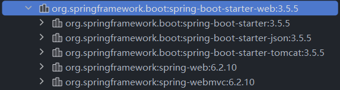

# SpringBoot

[TOC]

# 快速入门


## 简介

Spring Boot 帮助你创建可直接运行的、生产级别的基于 Spring 的独立应用。我们对 Spring 平台和第三方库持一种“约定优于配置”的观点，这样你就可以轻松入门。大多数 Spring Boot 应用只需要很少的 Spring 配置。

你可以使用 Spring Boot 创建可以通过 `java -jar` 或更传统的 war 部署方式启动的 Java 应用。

我们的主要目标是

- 为所有 Spring 开发提供更快速、更易上手的入门体验。
- 开箱即用时带有明确的观点，但当需求开始偏离默认设置时，能够迅速让路。
- 提供一系列非功能性特性，这些特性是许多大型项目所共有的（例如嵌入式服务器、安全性、指标、健康检查和外部化配置）。
- 绝对没有代码生成（除非目标是 Native Image），也不强制要求 XML 配置。

### 脚手架

原生：[Spring Initializr](https://start.spring.io/)

阿里：[Cloud Native App Initializer](https://start.aliyun.com/)

### pom.xml

Spring Boot 项目默认有个父工程`spring-boot-starter-parent`，它可以管理所需依赖版本

```xml
<parent>
    <groupId>org.springframework.boot</groupId>
    <artifactId>spring-boot-starter-parent</artifactId>
    <version>3.5.5</version>
    <relativePath/> <!-- lookup parent from repository -->
</parent>

<dependencies>
        <dependency>
            <groupId>org.springframework.boot</groupId>
            <artifactId>spring-boot-starter-web</artifactId>
        </dependency>
        <dependency>
            <groupId>org.springframework.boot</groupId>
            <artifactId>spring-boot-starter-test</artifactId>
            <scope>test</scope>
        </dependency>
    </dependencies>
```

`spring-boot-starter-parent`的父工程又是`spring-boot-dependencies`

```xml
<parent>
    <groupId>org.springframework.boot</groupId>
    <artifactId>spring-boot-dependencies</artifactId>
    <version>3.5.5</version>
</parent>
<!-- parent只有这一个依赖 -->
<dependencies>
	<dependency>
	  <groupId>org.springframework.boot</groupId>
	  <artifactId>spring-boot-maven-plugin</artifactId>
	  <version>3.5.5</version>
	</dependency>
</dependencies>
```

实际就是`spring-boot-dependencies`在管理依赖

```xml
<properties>
    <activemq.version>6.1.7</activemq.version>
    <angus-mail.version>2.0.4</angus-mail.version>
    <artemis.version>2.40.0</artemis.version>
    <aspectj.version>1.9.24</aspectj.version>
    <assertj.version>3.27.4</assertj.version>
    <awaitility.version>4.2.2</awaitility.version>
    <zipkin-reporter.version>3.5.1</zipkin-reporter.version>
    ...
</properties>
<dependencyManagement>
    <dependencies>
      <dependency>
        <groupId>org.apache.activemq</groupId>
        <artifactId>activemq-console</artifactId>
        <version>${activemq.version}</version>
        <exclusions>
          <exclusion>
            <groupId>commons-logging</groupId>
            <artifactId>commons-logging</artifactId>
          </exclusion>
        </exclusions>
      </dependency>
      ...
    </dependencies>
</dependencyManagement>
```

### 启动器

启动器是一组方便的依赖描述符，您可以将其包含在您的应用程序中。您无需翻遍示例代码并复制粘贴大量的依赖描述符，即可获得所需的所有 Spring 及相关技术的一站式服务。例如，如果您想开始使用 Spring 和 JPA 进行数据库访问，只需在项目中包含 `spring-boot-starter-data-jpa` 依赖项即可；**或者你想进行web开发，只需在项目中包含 `spring-boot-starter-web` 依赖项即可，他自动包含了开发web所需的 json, tomcat, webmvc…**



启动器包含您快速启动和运行项目所需的大量依赖项，并提供一套一致、受支持的托管传递依赖项。

> 命名的含义
>
> 所有**官方**启动器都遵循相似的命名模式：`spring-boot-starter-*`，其中 `*` 代表特定类型的应用程序。这种命名结构旨在帮助您查找启动器。许多 IDE 中的 Maven 集成允许您按名称搜索依赖项。例如，安装相应的 Eclipse 或 Spring Tools 插件后，您可以在 POM 编辑器中按下 `ctrl-space` 并输入“spring-boot-starter”以获取完整列表。
>
> 正如[创建自己的启动器](https://docs.springframework.org.cn/spring-boot/reference/features/developing-auto-configuration.html#features.developing-auto-configuration.custom-starter)部分所解释的，第三方启动器不应以 `spring-boot` 开头，因为这是为官方 Spring Boot 构件保留的。相反，第三方启动器通常以项目名称开头。例如，一个名为 `thirdpartyproject` 的第三方启动器项目通常会被命名为 `thirdpartyproject-spring-boot-starter`。

以下应用程序启动器由 Spring Boot 在 `org.springframework.boot` 组下提供

| 名称                                              | 描述                                                         |
| :------------------------------------------------ | :----------------------------------------------------------- |
| `spring-boot-starter`                             | 核心启动器，包括自动配置支持、日志记录和 YAML                |
| `spring-boot-starter-activemq`                    | 使用 Apache ActiveMQ 进行 JMS 消息传递的启动器               |
| `spring-boot-starter-amqp`                        | 使用 Spring AMQP 和 Rabbit MQ 的启动器                       |
| `spring-boot-starter-aop`                         | 使用 Spring AOP 和 AspectJ 进行面向切面编程的启动器          |
| `spring-boot-starter-artemis`                     | 使用 Apache Artemis 进行 JMS 消息传递的启动器                |
| `spring-boot-starter-batch`                       | 使用 Spring Batch 的启动器                                   |
| `spring-boot-starter-cache`                       | 使用 Spring Framework 缓存支持的启动器                       |
| `spring-boot-starter-data-cassandra`              | 使用 Cassandra 分布式数据库和 Spring Data Cassandra 的启动器 |
| `spring-boot-starter-data-cassandra-reactive`     | 使用 Cassandra 分布式数据库和 Spring Data Cassandra Reactive 的启动器 |
| `spring-boot-starter-data-couchbase`              | 使用 Couchbase 面向文档数据库和 Spring Data Couchbase 的启动器 |
| `spring-boot-starter-data-couchbase-reactive`     | 使用 Couchbase 面向文档数据库和 Spring Data Couchbase Reactive 的启动器 |
| `spring-boot-starter-data-elasticsearch`          | 使用 Elasticsearch 搜索和分析引擎以及 Spring Data Elasticsearch 的启动器 |
| `spring-boot-starter-data-jdbc`                   | 使用 Spring Data JDBC 的启动器                               |
| `spring-boot-starter-data-jpa`                    | 使用 Spring Data JPA 和 Hibernate 的启动器                   |
| `spring-boot-starter-data-ldap`                   | 使用 Spring Data LDAP 的启动器                               |
| `spring-boot-starter-data-mongodb`                | 使用 MongoDB 面向文档数据库和 Spring Data MongoDB 的启动器   |
| `spring-boot-starter-data-mongodb-reactive`       | 使用 MongoDB 面向文档数据库和 Spring Data MongoDB Reactive 的启动器 |
| `spring-boot-starter-data-neo4j`                  | 使用 Neo4j 图数据库和 Spring Data Neo4j 的启动器             |
| `spring-boot-starter-data-r2dbc`                  | 使用 Spring Data R2DBC 的启动器                              |
| `spring-boot-starter-data-redis`                  | 使用 Spring Data Redis 和 Lettuce 客户端访问 Redis 键值数据存储的启动器 |
| `spring-boot-starter-data-redis-reactive`         | 使用 Spring Data Redis Reactive 和 Lettuce 客户端访问 Redis 键值数据存储的启动器 |
| `spring-boot-starter-data-rest`                   | 使用 Spring Data REST 和 Spring MVC 通过 REST 暴露 Spring Data 仓库的启动器 |
| `spring-boot-starter-freemarker`                  | 使用 FreeMarker 视图构建 MVC Web 应用程序的启动器            |
| `spring-boot-starter-graphql`                     | 使用 Spring GraphQL 构建 GraphQL 应用程序的启动器            |
| `spring-boot-starter-groovy-templates`            | 使用 Groovy 模板视图构建 MVC Web 应用程序的启动器            |
| `spring-boot-starter-hateoas`                     | 使用 Spring MVC 和 Spring HATEOAS 构建基于超媒体的 RESTful Web 应用程序的启动器 |
| `spring-boot-starter-integration`                 | 使用 Spring Integration 的启动器                             |
| `spring-boot-starter-jdbc`                        | 使用 HikariCP 连接池访问 JDBC 的启动器                       |
| `spring-boot-starter-jersey`                      | 使用 JAX-RS 和 Jersey 构建 RESTful Web 应用程序的启动器。是 [`spring-boot-starter-web`](https://docs.springframework.org.cn/spring-boot/reference/using/build-systems.html#spring-boot-starter-web) 的替代品 |
| `spring-boot-starter-jooq`                        | 使用 jOOQ 通过 JDBC 访问 SQL 数据库的启动器。是 [`spring-boot-starter-data-jpa`](https://docs.springframework.org.cn/spring-boot/reference/using/build-systems.html#spring-boot-starter-data-jpa) 或 [`spring-boot-starter-jdbc`](https://docs.springframework.org.cn/spring-boot/reference/using/build-systems.html#spring-boot-starter-jdbc) 的替代品 |
| `spring-boot-starter-json`                        | 用于读写 JSON 的启动器                                       |
| `spring-boot-starter-mail`                        | 使用 Java Mail 和 Spring Framework 邮件发送支持的启动器      |
| `spring-boot-starter-mustache`                    | 使用 Mustache 视图构建 Web 应用程序的启动器                  |
| `spring-boot-starter-oauth2-authorization-server` | 使用 Spring Authorization Server 特性的启动器                |
| `spring-boot-starter-oauth2-client`               | 使用 Spring Security OAuth2/OpenID Connect 客户端特性的启动器 |
| `spring-boot-starter-oauth2-resource-server`      | 使用 Spring Security OAuth2 资源服务器特性的启动器           |
| `spring-boot-starter-pulsar`                      | 使用 Spring for Apache Pulsar 的启动器                       |
| `spring-boot-starter-pulsar-reactive`             | 使用 Spring for Apache Pulsar Reactive 的启动器              |
| `spring-boot-starter-quartz`                      | 使用 Quartz 调度器的启动器                                   |
| `spring-boot-starter-rsocket`                     | 构建 RSocket 客户端和服务器的启动器                          |
| `spring-boot-starter-security`                    | 使用 Spring Security 的启动器                                |
| `spring-boot-starter-test`                        | 用于使用 JUnit Jupiter、Hamcrest 和 Mockito 等库测试 Spring Boot 应用程序的启动器 |
| `spring-boot-starter-thymeleaf`                   | 使用 Thymeleaf 视图构建 MVC Web 应用程序的启动器             |
| `spring-boot-starter-validation`                  | 使用 Java Bean Validation 和 Hibernate Validator 的启动器    |
| `spring-boot-starter-web`                         | 使用 Spring MVC 构建 Web（包括 RESTful）应用程序的启动器。使用 Tomcat 作为默认的嵌入式容器 |
| `spring-boot-starter-web-services`                | 使用 Spring Web Services 的启动器                            |
| `spring-boot-starter-webflux`                     | 使用 Spring Framework 响应式 Web 支持构建 WebFlux 应用程序的启动器 |
| `spring-boot-starter-websocket`                   | 使用 Spring Framework MVC WebSocket 支持构建 WebSocket 应用程序的启动器 |


## 第一个Spring Boot程序

为了完成我们的应用，我们需要创建一个 Java 文件。默认情况下，Maven 和 Gradle 从 `src/main/java` 编译源代码，因此您需要创建该目录结构，然后添加一个名为 `src/main/java/com/example/MyApplication.java` 的文件来包含以下代码

```java
@RestController
@SpringBootApplication
public class MyApplication {

	@RequestMapping("/")
	String home() {
		return "Hello World!";
	}

	public static void main(String[] args) {
		SpringApplication.run(MyApplication.class, args);
	}

}
```

虽然这里的代码不多，但它包含了很多内容。我们将在接下来的几个部分中逐步介绍重要的部分。

### @RestController 和 @RequestMapping 注解

我们的 `MyApplication` 类上的第一个注解是 [`@RestController`](https://docs.springframework.org.cn/spring-framework/docs/6.2.x/javadoc-api/org/springframework/web/bind/annotation/RestController.html)。这被称为一个 *stereotype* 注解。它为阅读代码的人以及 Spring 提供了提示，表明该类扮演着特定的角色。在本例中，我们的类是一个 web [`@Controller`](https://docs.springframework.org.cn/spring-framework/docs/6.2.x/javadoc-api/org/springframework/stereotype/Controller.html)，因此 Spring 在处理传入的 web 请求时会考虑它。

[`@RequestMapping`](https://docs.springframework.org.cn/spring-framework/docs/6.2.x/javadoc-api/org/springframework/web/bind/annotation/RequestMapping.html) 注解提供了“路由”信息。它告诉 Spring，任何路径为 `/` 的 HTTP 请求都应该映射到 `home` 方法。[`@RestController`](https://docs.springframework.org.cn/spring-framework/docs/6.2.x/javadoc-api/org/springframework/web/bind/annotation/RestController.html) 注解告诉 Spring 直接将结果字符串渲染回调用者。

> [`@RestController`](https://docs.springframework.org.cn/spring-framework/docs/6.2.x/javadoc-api/org/springframework/web/bind/annotation/RestController.html) 和 [`@RequestMapping`](https://docs.springframework.org.cn/spring-framework/docs/6.2.x/javadoc-api/org/springframework/web/bind/annotation/RequestMapping.html) 注解是 Spring MVC 注解（它们并非 Spring Boot 特有）。

### @SpringBootApplication 注解

第二个类级别注解是 [`@SpringBootApplication`](https://docs.springframework.org.cn/spring-boot/3.4.5/api/java/org/springframework/boot/autoconfigure/SpringBootApplication.html)。这个注解被称为一个 *meta-annotation*，它结合了 [`@SpringBootConfiguration`](https://docs.springframework.org.cn/spring-boot/3.4.5/api/java/org/springframework/boot/SpringBootConfiguration.html)、[`@EnableAutoConfiguration`](https://docs.springframework.org.cn/spring-boot/3.4.5/api/java/org/springframework/boot/autoconfigure/EnableAutoConfiguration.html) 和 [`@ComponentScan`](https://docs.springframework.org.cn/spring-framework/docs/6.2.x/javadoc-api/org/springframework/context/annotation/ComponentScan.html)。

其中，我们最感兴趣的注解是 [`@EnableAutoConfiguration`](https://docs.springframework.org.cn/spring-boot/3.4.5/api/java/org/springframework/boot/autoconfigure/EnableAutoConfiguration.html)。[`@EnableAutoConfiguration`](https://docs.springframework.org.cn/spring-boot/3.4.5/api/java/org/springframework/boot/autoconfigure/EnableAutoConfiguration.html) 会根据您添加的 jar 依赖项，指示 Spring Boot“猜测”您希望如何配置 Spring。由于 `spring-boot-starter-web` 添加了 Tomcat 和 Spring MVC，自动配置会假定您正在开发一个 Web 应用并相应地设置 Spring。

> **Starters 与自动配置**
>
> 自动配置旨在与 starter 很好地配合使用，但这两个概念并非直接绑定。您可以自由选择 starter 之外的 jar 依赖项。Spring Boot 仍然会尽力自动配置您的应用。

### “main” 方法

我们应用的最后一部分是 `main` 方法。这是一个遵循 Java 应用入口点约定的标准方法。我们的 main 方法通过调用 `run` 方法，将职责委托给 Spring Boot 的 [`SpringApplication`](https://docs.springframework.org.cn/spring-boot/3.4.5/api/java/org/springframework/boot/SpringApplication.html) 类。[`SpringApplication`](https://docs.springframework.org.cn/spring-boot/3.4.5/api/java/org/springframework/boot/SpringApplication.html) 会引导我们的应用，启动 Spring，进而启动自动配置的 Tomcat web 服务器。我们需要将 `MyApplication.class` 作为参数传递给 `run` 方法，以告诉 [`SpringApplication`](https://docs.springframework.org.cn/spring-boot/3.4.5/api/java/org/springframework/boot/SpringApplication.html) 哪个是主要的 Spring 组件。`args` 数组也会被传递进去，以暴露任何命令行参数。

### 运行示例 - Maven

此时，您的应用应该可以工作了。由于您使用了 `spring-boot-starter-parent` POM，您有一个很有用的 `run` 目标可以用来启动应用。在项目根目录下输入 `mvn spring-boot:run` 来启动应用。您应该会看到类似于以下的输出

```shell
$ mvn spring-boot:run

  .   ____          _            __ _ _
 /\\ / ___'_ __ _ _(_)_ __  __ _ \ \ \ \
( ( )\___ | '_ | '_| | '_ \/ _` | \ \ \ \
 \\/  ___)| |_)| | | | | || (_| |  ) ) ) )
  '  |____| .__|_| |_|_| |_\__, | / / / /
 =========|_|==============|___/=/_/_/_/
 :: Spring Boot ::  (v3.4.5)
....... . . .
....... . . . (log output here)
....... . . .
........ Started MyApplication in 0.906 seconds (process running for 6.514)
```

如果您在 Web 浏览器中打开 `localhost:8080`，您应该会看到以下输出

```none
Hello World!
```

要平滑退出应用，请按 `ctrl-c`。

### 创建可执行 Jar

最后，我们将创建完全自包含的可执行 jar 文件，以便在生产环境中运行。可执行 jar（有时称为“uber jar”或“fat jar”）是包含您的编译类以及代码运行所需的所有 jar 依赖项的归档文件。

> 可执行 jar 和 Java
>
> Java 没有提供一种标准方法来加载嵌套的 jar 文件（即 jar 文件本身包含在另一个 jar 文件中）。如果您希望分发一个自包含的应用，这可能会带来问题。

为了解决这个问题，许多开发者使用“uber” jar。Uber jar 将应用所有依赖项中的所有类打包到一个归档文件中。这种方法的问题在于很难看出应用中包含了哪些库。如果多个 jar 中使用了相同的文件名（但内容不同），也可能会出现问题。

Spring Boot 采取了一种[不同的方法](https://docs.springframework.org.cn/spring-boot/specification/executable-jar/index.html)，允许您直接嵌套 jar。

**Maven**

要创建可执行 jar，我们需要将 `spring-boot-maven-plugin` 添加到我们的 `pom.xml` 中。为此，请在 `dependencies` 部分正下方插入以下行

```xml
<build>
	<plugins>
		<plugin>
			<groupId>org.springframework.boot</groupId>
			<artifactId>spring-boot-maven-plugin</artifactId>
		</plugin>
	</plugins>
</build>
```

> `spring-boot-starter-parent` POM 包含 `<executions>` 配置，用于绑定 `repackage` 目标。如果您不使用父 POM，则需要自行声明此配置。详细信息请参阅[插件文档](https://docs.springframework.org.cn/spring-boot/maven-plugin/getting-started.html)。

保存您的 `pom.xml` 并在命令行运行 `mvn package`。

如果您查看 `target` 目录，您应该会看到 `myproject-0.0.1-SNAPSHOT.jar`。文件大小约为 18 MB。如果您想查看其内部，可以使用 `jar tvf`，如下所示

```shell
$ jar tvf target/myproject-0.0.1-SNAPSHOT.jar
```

您还应该在 `target` 目录中看到一个名为 `myproject-0.0.1-SNAPSHOT.jar.original` 的小得多的文件。这是 Spring Boot 重新打包之前 Maven 创建的原始 jar 文件。

要运行该应用，请使用 `java -jar` 命令，如下所示

```shell
$ java -jar target/myproject-0.0.1-SNAPSHOT.jar

  .   ____          _            __ _ _
 /\\ / ___'_ __ _ _(_)_ __  __ _ \ \ \ \
( ( )\___ | '_ | '_| | '_ \/ _` | \ \ \ \
 \\/  ___)| |_)| | | | | || (_| |  ) ) ) )
  '  |____| .__|_| |_|_| |_\__, | / / / /
 =========|_|==============|___/=/_/_/_/
 :: Spring Boot ::  (v3.4.5)
....... . . .
....... . . . (log output here)
....... . . .
........ Started MyApplication in 0.999 seconds (process running for 1.253)
```

和之前一样，要退出应用，请按 `ctrl-c`。


# 外部化配置

Spring Boot 允许你将配置外部化，以便在不同环境中使用相同的应用程序代码。你可以使用多种外部配置源，包括 Java properties 文件、YAML 文件、环境变量和命令行参数。


## 配置属性

### 命令行属性

默认情况下，`SpringApplication` 会将任何命令行选项参数（即以 `--` 开头的参数，例如 `--server.port=9000`）转换为一个 `property` 并将其添加到 Spring [`Environment`](https://docs.springframework.org.cn/spring-framework/docs/6.2.x/javadoc-api/org/springframework/core/env/Environment.html) 中。如前所述，命令行属性始终优先于基于文件的属性源。

如果你不想将命令行属性添加到 `Environment` 中，可以通过使用 `SpringApplication.setAddCommandLineProperties(false)` 来禁用它们。

### JSON 应用程序属性

环境变量和系统属性通常有一些限制，导致某些属性名称无法使用。为了解决这个问题，Spring Boot 允许你将一组属性编码成一个 JSON 结构。

当你的应用程序启动时，任何 `spring.application.json` 或 `SPRING_APPLICATION_JSON` 属性都将被解析并添加到 [`Environment`](https://docs.spring-framework-docs/6.2.x/javadoc-api/org/springframework/core/env/Environment.html) 中。

例如，在 UN*X shell 中，可以在命令行上以环境变量的形式提供 `SPRING_APPLICATION_JSON` 属性：

```shell
$ SPRING_APPLICATION_JSON='{"my":{"name":"test"}}' java -jar myapp.jar
```

在上面的例子中，你在 Spring [`Environment`](https://docs.spring-framework-docs/6.2.x/javadoc-api/org/springframework/core/env/Environment.html) 中得到了 `my.name=test`。

相同的 JSON 也可以作为系统属性提供：

```shell
$ java -Dspring.application.json='{"my":{"name":"test"}}' -jar myapp.jar
```

或者你可以使用命令行参数提供 JSON：

```shell
$ java -jar myapp.jar --spring.application.json='{"my":{"name":"test"}}'
```

如果你部署到传统的应用服务器，你还可以使用名为 `java:comp/env/spring.application.json` 的 JNDI 变量。

### 配置文件加载优先级

当你的应用程序启动时，Spring Boot 会自动从以下位置查找并加载 `application.properties` 和 `application.yaml` 文件：

> 列表按优先级排序（较低项的值会覆盖较早项的值）。

1. 从类路径
    1. 类路径根目录 `classpath:./`
    2. 类路径下的 /config 包 `classpath:./config/`
2. 从当前目录
    1. 当前目录 `file:./`
    2. 当前目录下的 config/ 子目录 `file:./config/`
    3. config/ 子目录的直接子目录 `file:./config/*/`

### 指定配置文件名 `spring.config.name`

如果你不喜欢使用 `application` 作为配置文件名，可以通过指定 `spring.config.name` 环境变量属性来切换到另一个文件名。例如，要查找 `myproject.properties` 和 `myproject.yaml` 文件，你可以按如下方式运行你的应用程序：

```shell
$ java -jar myproject.jar --spring.config.name=myproject
```

### 指定配置文件位置 `spring.config.location`

你还可以通过使用 `spring.config.location` 环境变量属性来指定显式位置。此属性接受一个逗号分隔的一个或多个位置列表，用于检查。

以下示例展示了如何指定两个不同的文件：

```shell
$ java -jar myproject.jar --spring.config.location=\
	optional:classpath:/default.properties,\
	optional:classpath:/override.properties
```

#### 可选位置

默认情况下，当指定的配置数据位置不存在时，Spring Boot 会抛出 [`ConfigDataLocationNotFoundException`](https://docs.spring-boot/3.4.5/api/java/org/springframework/boot/context/config/ConfigDataLocationNotFoundException.html)，并且你的应用程序将不会启动。

如果你想指定一个位置，但不介意它不总是存在，可以使用 `optional:` 前缀。

#### 通配符

如果配置文件位置在最后一个路径段包含 `*` 字符，则将其视为通配符位置。加载配置时会扩展通配符，以便也检查直接子目录。在 Kubernetes 等环境中，**当存在多个配置属性源时，通配符位置特别有用**。

例如，如果你有一些 Redis 配置和一些 MySQL 配置，你可能希望**将这两部分配置分开**，同时要求它们都存在于 `application.properties` 文件中。这可能导致**两个单独的 `application.properties` 文件挂载在不同的位置**，例如 `/config/redis/application.properties` 和 `/config/mysql/application.properties`。在这种情况下，设置通配符位置为 `config/*/`，将导致这两个文件都被处理。

> 默认情况下，Spring Boot 在默认搜索位置中包含了 `config/*/`。这意味着将搜索你的 jar 外部 `/config` 目录的所有子目录。

### 特定 Profile 文件 `spring.profiles.active`

除了 `application` 属性文件外，Spring Boot 还会尝试使用命名约定 `application-{profile}` 加载特定 profile 的文件。例如，如果你的应用程序激活了名为 `prod` 的 profile 并使用 YAML 文件，则会同时考虑 `application.yaml` 和 `application-prod.yaml`。

特定 profile 的属性会从与标准 `application.properties` 相同的位置加载，特定 profile 的文件总是会覆盖非特定文件。如果指定了多个 profile，则应用后一个优先的策略。例如，如果 `spring.profiles.active` 属性指定了 `prod,live` 这两个 profile，则 `application-prod.properties` 中的值可以被 `application-live.properties` 中的值覆盖。

> 后一个优先的策略适用于[位置组](https://docs.springframework.org.cn/spring-boot/reference/features/external-config.html#features.external-config.files.location-groups)级别。`spring.config.location` 的值为 `classpath:/cfg/,classpath:/ext/` 与值为 `classpath:/cfg/;classpath:/ext/` 的覆盖规则不同。
>
> 例如，沿用上面 `prod,live` 的例子，我们可能有以下文件：
>
> ```
> /cfg
>   application-live.properties
> /ext
>   application-live.properties
>   application-prod.properties
> ```
>
> 当我们设置 `spring.config.location` 为 `classpath:/cfg/,classpath:/ext/` 时，我们会先处理所有 `/cfg` 下的文件，再处理所有 `/ext` 下的文件：
>
> 1. `/cfg/application-live.properties`
> 2. `/ext/application-prod.properties`
> 3. `/ext/application-live.properties`
>
> 当我们改为使用 `classpath:/cfg/;classpath:/ext/`（使用 `;` 分隔符）时，我们会将 `/cfg` 和 `/ext` 视为同一级别处理：
>
> 1. `/ext/application-prod.properties`
> 2. `/cfg/application-live.properties`
> 3. `/ext/application-live.properties`

[`Environment`](https://docs.spring-framework-docs/6.2.x/javadoc-api/org/springframework/core/env/Environment.html) 有一组默认 profile（默认情况下是 `[default]`），如果在没有设置活动 profile 的情况下使用它们。换句话说，如果没有显式激活任何 profile，则会考虑来自 `application-default` 的属性。

### 导入额外数据 `spring.config.import`

应用程序属性可以使用 `spring.config.import` 属性从其他位置导入进一步的配置数据。**导入会根据发现的顺序进行处理**，并被视为紧接在声明导入的文档下方插入的额外文档。

例如，你的类路径下的 `application.properties` 文件中可能包含以下内容：

```properties
spring.application.name=myapp
spring.config.import=optional:file:./dev.properties
```

这将触发导入当前目录下的 `dev.properties` 文件（如果该文件存在）。从导入的 `dev.properties` 文件中获取的值将优先于触发导入的文件。在上面的例子中，`dev.properties` 可以将 `spring.application.name` 重新定义为不同的值。


## 属性源顺序

Spring Boot 使用了一种非常特定的 [`PropertySource`](https://docs.springframework.org.cn/spring-framework/docs/6.2.x/javadoc-api/org/springframework/core/env/PropertySource.html) 顺序，旨在允许合理地覆盖值。后加载的属性源可以覆盖先加载的属性源中定义的值。属性源按以下顺序考虑：

1. 默认属性（通过设置 [`SpringApplication.setDefaultProperties(Map)`](https://docs.springframework.org.cn/spring-boot/3.4.5/api/java/org/springframework/boot/SpringApplication.html#setDefaultProperties(java.util.Map)) 指定）。
2. 你的 [`@Configuration`](https://docs.springframework.org.cn/spring-framework/docs/6.2.x/javadoc-api/org/springframework/context/annotation/Configuration.html) 类上的 [`@PropertySource`](https://docs.springframework.org.cn/spring-framework/docs/6.2.x/javadoc-api/org/springframework/context/annotation/PropertySource.html) 注解。请注意，此类属性源直到应用程序上下文刷新时才会添加到 [`Environment`](https://docs.springframework.org.cn/spring-framework/docs/6.2.x/javadoc-api/org/springframework/core/env/Environment.html) 中。这对于配置某些属性（例如 `logging.*` 和 `spring.main.*`，它们在刷新开始之前就被读取）来说太晚了。
3. 配置数据（例如 `application.properties` 文件）。
4. 一个 [`RandomValuePropertySource`](https://docs.springframework.org.cn/spring-boot/3.4.5/api/java/org/springframework/boot/env/RandomValuePropertySource.html)，其属性仅包含在 `random.*` 中。
5. 操作系统环境变量。
6. Java 系统属性（`System.getProperties()`）。
7. 来自 `java:comp/env` 的 JNDI 属性。
8. [`ServletContext`](https://jakarta.ee/specifications/servlet/6.0/apidocs/jakarta.servlet/jakarta/servlet/ServletContext.html) 初始化参数。
9. [`ServletConfig`](https://jakarta.ee/specifications/servlet/6.0/apidocs/jakarta.servlet/jakarta/servlet/ServletConfig.html) 初始化参数。
10. 来自 `SPRING_APPLICATION_JSON` 的属性（嵌入在环境变量或系统属性中的内联 JSON）。
11. 命令行参数。
12. 测试中的 `properties` 属性。在 [`@SpringBootTest`](https://docs.springframework.org.cn/spring-boot/3.4.5/api/java/org/springframework/boot/test/context/SpringBootTest.html) 和[用于测试应用程序特定部分的测试注解](https://docs.springframework.org.cn/spring-boot/reference/testing/spring-boot-applications.html#testing.spring-boot-applications.autoconfigured-tests)上可用。
13. 你的测试中的 [`@DynamicPropertySource`](https://docs.springframework.org.cn/spring-framework/docs/6.2.x/javadoc-api/org/springframework/test/context/DynamicPropertySource.html) 注解。
14. 你的测试中的 [`@TestPropertySource`](https://docs.springframework.org.cn/spring-framework/docs/6.2.x/javadoc-api/org/springframework/test/context/TestPropertySource.html) 注解。
15. 当 devtools 处于活动状态时，位于 `$HOME/.config/spring-boot` 目录中的[Devtools 全局设置属性](https://docs.springframework.org.cn/spring-boot/reference/using/devtools.html#using.devtools.globalsettings)。

配置数据文件按以下顺序考虑：

1. 打包在你的 jar 内部的[应用程序属性](https://docs.springframework.org.cn/spring-boot/reference/features/external-config.html#features.external-config.files)（`application.properties` 及其 YAML 变体）。
2. 打包在你的 jar 内部的[特定 Profile 的应用程序属性](https://docs.springframework.org.cn/spring-boot/reference/features/external-config.html#features.external-config.files.profile-specific)（`application-{profile}.properties` 及其 YAML 变体）。
3. 打包在你的 jar 外部的[应用程序属性](https://docs.springframework.org.cn/spring-boot/reference/features/external-config.html#features.external-config.files)（`application.properties` 及其 YAML 变体）。
4. 打包在你的 jar 外部的[特定 Profile 的应用程序属性](https://docs.springframework.org.cn/spring-boot/reference/features/external-config.html#features.external-config.files.profile-specific)（`application-{profile}.properties` 及其 YAML 变体）。


## 访问属性

**属性值**可以通过使用 [`@Value`](https://docs.springframework.org.cn/spring-framework/docs/6.2.x/javadoc-api/org/springframework/beans/factory/annotation/Value.html) 注解直接注入到你的 Bean 中，通过 Spring 的 [`Environment`](https://docs.springframework.org.cn/spring-framework/docs/6.2.x/javadoc-api/org/springframework/core/env/Environment.html) 抽象访问，或者通过 [`@ConfigurationProperties`](https://docs.springframework.org.cn/spring-boot/3.4.5/api/java/org/springframework/boot/context/properties/ConfigurationProperties.html) 绑定到结构化对象。

您提供的这段描述准确概括了 Spring/Spring Boot 中获取属性值的三种核心方式。这是一个非常经典的配置管理方案。下面我将对这三种方式进行详细解释和对比，以帮助更好地理解。

### 使用 `@Value` 注解直接注入

`@Value` 是一种轻量级、直接的属性注入方式，适用于注入单个属性或简单的 SpEL 表达式。

**工作机制**：它直接从 Spring 的 `Environment` 中解析占位符或 SpEL 表达式，并将值注入到字段、构造函数或方法参数中。

**常见用法**：

```java
@Component
public class MyComponent {

    // 注入简单值
    @Value("${app.name}")
    private String appName;

    // 注入带默认值的属性（如果"app.description"不存在，则使用"Default description"）
    @Value("${app.description:Default description}")
    private String appDescription;

    // 使用 SpEL 表达式
    @Value("#{systemProperties['user.home']}")
    private String userHome;

    // 注入数组或列表 (需要是逗号分隔的字符串)
    @Value("${app.servers:localhost}")
    private String[] servers;
}
```

**优点**：
- **简单直接**：代码简洁，一目了然。
- **灵活**：支持 SpEL 表达式，可以实现简单的逻辑。

**缺点**：
- **类型不安全**：如果属性不存在且没有默认值，应用启动时会抛出 `IllegalArgumentException`。
- **分散配置**：当需要注入大量相关属性时，代码会变得冗长且难以维护。
- **弱类型**：集合类型的注入需要手动分割字符串。

**适用场景**：注入少量、分散的、独立的配置值。

### 通过 `Environment` 抽象访问

Spring Boot 框架在启动的时候会将系统配置、环境信息全部封装到`Environment`接口中，如果要获取这些环境信息，可以调用`Environment` 接口的方法。

Environment 对象封装的主要数据包括：

1. **Active Profiles**：当前激活的配置文件列表。Spring Boot 支持不同的运行环境（如开发环境、测试环境和生产环境），通过激活不同的配置文件来改变应用程序的行为。

2. **System Properties**：系统属性，通常是操作系统级别的属性，比如操作系统名称、Java版本等。

3. **System Environment Variables**：系统环境变量，可以在启动应用程序时设置特定的值。

4. **Command Line Arguments**：应用程序启动时传递给主方法的命令行参数。

5. **Property Sources**：`Environment` 还包含了一个 `PropertySource` 列表，这个列表包含了从不同来源加载的所有属性。`PropertySource` 可以来自多种地方，比如配置文件、系统属性、环境变量等。

**工作机制**：你可以将 `Environment` 对象自动注入到任何 Spring 管理的 Bean 中，然后调用其方法来获取属性。

**常见用法**：

```java
@Component
public class MyComponent {

    private final Environment env;

    // 通过构造器注入
    public MyComponent(Environment env) {
        this.env = env;
    }

    public void someMethod() {
        // 获取属性，如果不存在则返回 null
        String appName = env.getProperty("app.name");

        // 获取属性，如果不存在则提供默认值
        String appDesc = env.getProperty("app.description", "Default Description");

        // 获取指定类型的属性
        Integer appPort = env.getProperty("app.port", Integer.class, 8080);

        // 检查属性是否存在
        if (env.containsProperty("app.secret")) {
            // 处理敏感配置
        }
    }
}
```

**优点**：
- **灵活性高**：可以在运行时动态地获取和检查属性。
- **控制力强**：可以处理属性不存在的情况，避免启动时异常。

**缺点**：
- **非类型安全**：与 `@Value` 一样，需要手动处理类型转换。
- **代码冗长**：相比 `@Value`，获取每个属性都需要写更多代码。

**适用场景**：需要在运行时根据条件动态获取配置，或者在非 Bean 类中需要访问配置的情况。

### 使用 `@ConfigurationProperties` 绑定到结构化对象

这是 Spring Boot 推荐的配置管理方式，特别适用于一组相关的配置属性。它将属性前缀绑定到一个类型安全的 Java Bean 上。

**工作机制**：定义一个 Java Bean，使用 `@ConfigurationProperties` 指定一个前缀，Spring Boot 会自动将对应前缀的属性绑定到该 Bean 的字段上。

**常见用法**：

**步骤 1：定义配置属性类**

```java
import org.springframework.boot.context.properties.ConfigurationProperties;
import org.springframework.stereotype.Component;
import java.util.List;

@Component
@ConfigurationProperties(prefix = "app")
public class AppProperties {
    
    private String name;
    private String description;
    private Integer port;
    private List<String> servers;
    private Security security = new Security();

    // 必须提供 getter 和 setter 方法
    public String getName() { return name; }
    public void setName(String name) { this.name = name; }
    
    public String getDescription() { return description; }
    public void setDescription(String description) { this.description = description; }
    
    public Integer getPort() { return port; }
    public void setPort(Integer port) { this.port = port; }
    
    public List<String> getServers() { return servers; }
    public void setServers(List<String> servers) { this.servers = servers; }
    
    public Security getSecurity() { return security; }
    public void setSecurity(Security security) { this.security = security; }

    // 嵌套配置类
    public static class Security {
        private String username;
        private String password;
        
        public String getUsername() { return username; }
        public void setUsername(String username) { this.username = username; }
        
        public String getPassword() { return password; }
        public void setPassword(String password) { this.password = password; }
    }
}
```

**步骤 2：在 application.yml 或 application.properties 中配置**

```yaml
app:
  name: My Application
  description: A Spring Boot application
  port: 9090
  servers:
    - server1.example.com
    - server2.example.com
  security:
    username: admin
    password: secret
```

**步骤 3：在业务 Bean 中注入使用**

```java
@Service
public class MyService {

    private final AppProperties appProperties;

    // 通过构造器注入
    public MyService(AppProperties appProperties) {
        this.appProperties = appProperties;
    }

    public void businessMethod() {
        System.out.println("App name: " + appProperties.getName());
        System.out.println("Server count: " + appProperties.getServers().size());
        System.out.println("Username: " + appProperties.getSecurity().getUsername());
    }
}
```

**优点**：
- **类型安全**：编译时检查，避免类型转换错误。
- **集中管理**：相关的配置集中在一个类中，易于维护和理解。
- **IDE 支持**：良好的 IDE 自动补全和提示。
- **验证支持**：可以结合 JSR-303 验证注解（如 `@NotNull`, `@Size` 等）进行属性验证。
- **复杂结构**：天然支持嵌套对象、列表、映射等复杂数据结构。

**缺点**：
- **稍显繁琐**：需要创建额外的配置类。
- **启动时绑定**：配置错误通常在应用启动时被发现。

**适用场景**：管理一组相关的、复杂的配置，特别是当配置具有层次结构时。

#### 独立配置类

在上面代码中，我们使用了@Component将 AppConfig 类纳入IoC容器管理，我们也可以不用`@Component`，配置类不需要添加 `@Component` 注解，保持纯粹的配置性质。

改成直接在入口程序添加注解**`@EnableConfigurationProperties`**

```java
@EnableConfigurationProperties({AppProperties.class})
@SpringBootApplication
public class MyApplication {
	public static void main(String[] args) {
		SpringApplication.run(MyApplication.class, args);
	}
}
```

或者使用**`@ConfigurationPropertiesScan`**告诉 Spring Boot 在哪些包中扫描被 `@ConfigurationProperties` 注解的类。

```java
@SpringBootApplication
@ConfigurationPropertiesScan({"com.example.config", "com.example.common.props"})
public class MyApplication {
    public static void main(String[] args) {
        SpringApplication.run(MyApplication.class, args);
    }
}
```


## Profiles

Spring Profiles 提供了一种方法，可以将应用程序配置的不同部分分开，并使其仅在特定环境中可用。任何 [`@Component`](https://docs.springframework.org.cn/spring-framework/docs/6.2.x/javadoc-api/org/springframework/stereotype/Component.html)、[`@Configuration`](https://docs.springframework.org.cn/spring-framework/docs/6.2.x/javadoc-api/org/springframework/context/annotation/Configuration.html) 或 [`@ConfigurationProperties`](https://docs.springframework.org.cn/spring-boot/3.4.5/api/java/org/springframework/boot/context/properties/ConfigurationProperties.html) 都可以用 [`@Profile`](https://docs.springframework.org.cn/spring-framework/docs/6.2.x/javadoc-api/org/springframework/context/annotation/Profile.html) 标记，以限制其加载时机，如下例所示：

```java
@Configuration(proxyBeanMethods = false)
@Profile("production")
public class ProductionConfiguration {

	// ...

}
```

> 如果 @ConfigurationProperties Bean 是通过 @EnableConfigurationProperties 注册而非自动扫描，则 @Profile 注解需要指定在带有 @EnableConfigurationProperties 注解的 @Configuration 类上。
>
> 如果 @ConfigurationProperties 是被扫描发现的，则 @Profile 可以指定在 @ConfigurationProperties 类本身上。

你可以使用 `spring.profiles.active` [`Environment`](https://docs.springframework.org.cn/spring-framework/docs/6.2.x/javadoc-api/org/springframework/core/env/Environment.html) 属性来指定哪些 profile 是活动的。例如，你可以将其包含在 `application.properties` 中，如下例所示：

```properties
spring.profiles.active=dev,hsqldb
```

你也可以通过命令行使用以下开关来指定：`--spring.profiles.active=dev,hsqldb`。

如果没有活动的 profile，则会启用一个默认 profile。默认 profile 的名称是 `default`，可以通过 `spring.profiles.default` [`Environment`](https://docs.springframework.org.cn/spring-framework/docs/6.2.x/javadoc-api/org/springframework/core/env/Environment.html) 属性进行调整，如下例所示：

```properties
spring.profiles.default=none
```

> `spring.profiles.active` 和 `spring.profiles.default` 只能用于非 profile 特定的文档中。这意味着它们不能包含在 [profile 特定的文件](https://docs.springframework.org.cn/spring-boot/reference/features/external-config.html#features.external-config.files.profile-specific) 或 由 `spring.config.activate.on-profile` 激活的[文档](https://docs.springframework.org.cn/spring-boot/reference/features/external-config.html#features.external-config.files.activation-properties)中。
>
> 例如，第二个文档配置是无效的：
>
> ```properties
> spring.profiles.active=prod
> #---
> spring.config.activate.on-profile=prod
> spring.profiles.active=metrics
> ```

### 添加活动 Profile

`spring.profiles.active` 属性遵循与其他属性相同的排序规则：优先级最高的 [`PropertySource`](https://docs.springframework.org.cn/spring-framework/docs/6.2.x/javadoc-api/org/springframework/core/env/PropertySource.html) 获胜。这意味着你可以在 `application.properties` 中指定活动的 profile，然后通过命令行开关来**替换**它们。

有时，拥有能够**添加**而非替换活动 profile 的属性很有用。**`spring.profiles.include`** 属性可用于在由 `spring.profiles.active` 属性激活的 profile 之外添加额外的活动 profile。[`SpringApplication`](https://docs.springframework.org.cn/spring-boot/3.4.5/api/java/org/springframework/boot/SpringApplication.html) 入口点也提供了用于设置附加 profile 的 Java API。请参阅 [`SpringApplication`](https://docs.springframework.org.cn/spring-boot/3.4.5/api/java/org/springframework/boot/SpringApplication.html) 中的 `setAdditionalProfiles()` 方法。

例如，当运行一个带有以下属性的应用程序时，即使使用 `--spring.profiles.active` 开关运行，common 和 local profile 也会被激活：

```properties
spring.profiles.include[0]=common
spring.profiles.include[1]=local
```

> 与 `spring.profiles.active` 类似，`spring.profiles.include` 只能用于非 profile 特定的文档中。这意味着它不能包含在 [profile 特定的文件](https://docs.springframework.org.cn/spring-boot/reference/features/external-config.html#features.external-config.files.profile-specific) 或 由 `spring.config.activate.on-profile` 激活的[文档](https://docs.springframework.org.cn/spring-boot/reference/features/external-config.html#features.external-config.files.activation-properties)中。

### Profile 组

有时你在应用程序中定义和使用的 profile 过于细粒度，变得使用起来很麻烦。例如，你可能有 `proddb` 和 `prodmq` 这两个 profile，用于独立启用数据库和消息功能。

为了解决这个问题，Spring Boot 允许你定义 profile 组。一个 profile 组允许你为一组相关的 profile 定义一个逻辑名称。

例如，我们可以创建一个 `production` 组，该组包含我们的 `proddb` 和 `prodmq` profile。

```properties
spring.profiles.group.production[0]=proddb
spring.profiles.group.production[1]=prodmq
```

现在，我们的应用程序可以使用 `--spring.profiles.active=production` 启动，一次性激活 `production`、`proddb` 和 `prodmq` 这三个 profile。

>   与 `spring.profiles.active` 和 `spring.profiles.include` 类似，`spring.profiles.group` 只能用于非 profile 特定的文档中。这意味着它不能包含在 [profile 特定的文件](https://docs.springframework.org.cn/spring-boot/reference/features/external-config.html#features.external-config.files.profile-specific) 或 由 `spring.config.activate.on-profile` 激活的[文档](https://docs.springframework.org.cn/spring-boot/reference/features/external-config.html#features.external-config.files.activation-properties)中。

# SSM 整合


## MyBatis


### 添加依赖

如果手动添加依赖，在 `pom.xml` 中加入：

```xml
<dependencies>
    <!-- Spring Boot Starter -->
    <dependency>
        <groupId>org.springframework.boot</groupId>
        <artifactId>spring-boot-starter-web</artifactId>
    </dependency>

    <!-- MyBatis Spring Boot Starter -->
    <!-- 第三方启动器 -->
    <dependency>
        <groupId>org.mybatis.spring.boot</groupId>
        <artifactId>mybatis-spring-boot-starter</artifactId>
        <version>2.3.1</version>
    </dependency>

    <!-- MySQL 驱动 -->
    <dependency>
        <groupId>com.mysql</groupId>
        <artifactId>mysql-connector-j</artifactId>
        <scope>runtime</scope>
    </dependency>

    <!-- Lombok -->
    <dependency>
        <groupId>org.projectlombok</groupId>
        <artifactId>lombok</artifactId>
        <optional>true</optional>
    </dependency>
</dependencies>
```

### 配置文件

`application.yml` 配置

```yaml
server:
  port: 8080

spring:
  datasource:
    url: jdbc:mysql://localhost:3306/mybatis_demo?useUnicode=true&characterEncoding=utf-8&serverTimezone=Asia/Shanghai
    username: root
    password: 123456
    driver-class-name: com.mysql.cj.jdbc.Driver
    # HikariCP (性能最好，Spring Boot 2.x 默认)
    type: com.zaxxer.hikari.HikariDataSource

# MyBatis 配置
mybatis:
  # mapper.xml 文件位置
  mapper-locations: classpath:mapper/*.xml
  # 实体类包路径
  type-aliases-package: com.example.demo.entity
  configuration:
    # 开启驼峰命名自动映射
    map-underscore-to-camel-case: true
    # 日志实现
    log-impl: org.apache.ibatis.logging.stdout.StdOutImpl
```

### 代码实现

#### 实体类 (POJO)

```java
package com.example.demo.entity;

import lombok.Data;
import java.time.LocalDateTime;

@Data
public class User {
    private Long id;
    private String username;
    private String email;
    private Integer age;
    private LocalDateTime createTime;
    private LocalDateTime updateTime;
}
```

#### Mapper 接口

```java
package com.example.demo.mapper;

import com.example.demo.entity.User;
import org.apache.ibatis.annotations.Mapper;
import org.apache.ibatis.annotations.Param;
import java.util.List;

@Mapper  // 重要：标识这是 MyBatis 的 Mapper
public interface UserMapper {
    
    // 查询所有用户
    List<User> findAll();
    
    // 根据ID查询用户
    User findById(Long id);
    
    // 插入用户
    int insert(User user);
    
    // 更新用户
    int update(User user);
    
    // 删除用户
    int deleteById(Long id);
    
    // 根据用户名查询
    User findByUsername(String username);
    
    // 分页查询
    List<User> findByPage(@Param("offset") int offset, 
                         @Param("pageSize") int pageSize);
    
    // 统计用户数量
    int count();
}
```

#### mapper.xml 文件

实际开发中基本不用注解配置映射关系。

在 `resources/mapper` 目录下创建 `UserMapper.xml`：

```xml
<?xml version="1.0" encoding="UTF-8" ?>
<!DOCTYPE mapper PUBLIC "-//mybatis.org//DTD Mapper 3.0//EN" 
    "http://mybatis.org/dtd/mybatis-3-mapper.dtd">

<mapper namespace="com.example.demo.mapper.UserMapper">

    <!-- 定义结果映射 -->
    <resultMap id="UserResultMap" type="User">
        <id property="id" column="id"/>
        <result property="username" column="username"/>
        <result property="email" column="email"/>
        <result property="age" column="age"/>
        <result property="createTime" column="create_time"/>
        <result property="updateTime" column="update_time"/>
    </resultMap>

    <!-- 查询所有用户 -->
    <select id="findAll" resultMap="UserResultMap">
        SELECT * FROM user
    </select>

    <!-- 根据ID查询用户 -->
    <select id="findById" parameterType="Long" resultMap="UserResultMap">
        SELECT * FROM user WHERE id = #{id}
    </select>

    <!-- 插入用户 -->
    <insert id="insert" parameterType="User" useGeneratedKeys="true" keyProperty="id">
        INSERT INTO user (username, email, age, create_time, update_time)
        VALUES (#{username}, #{email}, #{age}, #{createTime}, #{updateTime})
    </insert>

    <!-- 更新用户 -->
    <update id="update" parameterType="User">
        UPDATE user 
        SET username = #{username}, 
            email = #{email}, 
            age = #{age},
            update_time = #{updateTime}
        WHERE id = #{id}
    </update>

    <!-- 删除用户 -->
    <delete id="deleteById" parameterType="Long">
        DELETE FROM user WHERE id = #{id}
    </delete>

    <!-- 根据用户名查询 -->
    <select id="findByUsername" parameterType="String" resultMap="UserResultMap">
        SELECT * FROM user WHERE username = #{username}
    </select>

    <!-- 分页查询 -->
    <select id="findByPage" resultMap="UserResultMap">
        SELECT * FROM user LIMIT #{offset}, #{pageSize}
    </select>

    <!-- 统计用户数量 -->
    <select id="count" resultType="int">
        SELECT COUNT(*) FROM user
    </select>

</mapper>
```


## Spring MVC

### 添加依赖

Spring Boot 通过 `spring-boot-starter-web` 依赖自动配置了 Spring MVC

```xml
<dependencies>
    <dependency>
        <groupId>org.springframework.boot</groupId>
        <artifactId>spring-boot-starter-web</artifactId>
    </dependency>
</dependencies>
```

### 自动配置的内容

Spring Boot 会自动配置：

- **DispatcherServlet**：前端控制器
- **内置 Tomcat**：Web 服务器
- **Jackson**：JSON 序列化/反序列化
- **静态资源处理**：`/static`, `/public`, `/resources`, `/META-INF/resources`
- **视图解析器**：默认支持 Thymeleaf、FreeMarker 等
- **错误处理**：默认错误页面
- **文件上传**：Multipart 解析器

### 基础配置文件

```yaml
server:
  port: 8080
  servlet:
    context-path: /api  # 应用上下文路径
  tomcat:
    uri-encoding: UTF-8

spring:
  mvc:
    # 静态资源路径匹配
    static-path-pattern: /**
    # 日期格式化
    format:
      date: yyyy-MM-dd
      date-time: yyyy-MM-dd HH:mm:ss
  web:
    resources:
      # 静态资源位置
      static-locations: classpath:/static/
  servlet:
    multipart:
      # 文件上传配置
      max-file-size: 10MB
      max-request-size: 100MB
```

### RESTful API 控制器

```java
package com.example.demo.controller;

import com.example.demo.entity.User;
import com.example.demo.service.UserService;
import org.springframework.beans.factory.annotation.Autowired;
import org.springframework.http.ResponseEntity;
import org.springframework.web.bind.annotation.*;

import java.util.List;

@RestController
@RequestMapping("/api/users")
public class UserController {
    
    @Autowired
    private UserService userService;

    // GET - 获取所有用户
    @GetMapping
    public ResponseEntity<List<User>> getAllUsers() {
        return ResponseEntity.ok(userService.getAllUsers());
    }

    // GET - 根据ID获取用户
    @GetMapping("/{id}")
    public ResponseEntity<User> getUserById(@PathVariable Long id) {
        User user = userService.getUserById(id);
        return user != null ? ResponseEntity.ok(user) : ResponseEntity.notFound().build();
    }

    // POST - 创建用户
    @PostMapping
    public ResponseEntity<User> createUser(@RequestBody User user) {
        User savedUser = userService.createUser(user);
        return ResponseEntity.ok(savedUser);
    }

    // PUT - 更新用户
    @PutMapping("/{id}")
    public ResponseEntity<User> updateUser(@PathVariable Long id, @RequestBody User user) {
        user.setId(id);
        User updatedUser = userService.updateUser(user);
        return ResponseEntity.ok(updatedUser);
    }

    // DELETE - 删除用户
    @DeleteMapping("/{id}")
    public ResponseEntity<Void> deleteUser(@PathVariable Long id) {
        userService.deleteUser(id);
        return ResponseEntity.noContent().build();
    }

    // GET - 带查询参数
    @GetMapping("/search")
    public ResponseEntity<List<User>> searchUsers(
            @RequestParam String keyword,
            @RequestParam(defaultValue = "0") int page,
            @RequestParam(defaultValue = "10") int size) {
        return ResponseEntity.ok(userService.searchUsers(keyword, page, size));
    }
}
```


# 自动配置

好的，我们来详细、系统地讲解一下 Spring Boot 自动配置。这是一个 Spring Boot 最核心、最重要的特性，也是它能够“开箱即用”的基石。

## 什么是自动配置

简单来说，**自动配置就是 Spring Boot 根据你项目中引入的 Jar 包依赖，自动为你配置 Spring 应用的行为**。

在没有 Spring Boot 的时代，我们需要手动编写大量的 XML 配置或 Java 配置来整合第三方库，比如配置数据源、事务管理器、MVC 视图解析器等。而 Spring Boot 通过自动配置机制，替我们完成了这些繁琐的工作。

**核心思想：** 约定优于配置。Spring Boot 提前为我们做好了各种场景下的默认配置，我们只有在需要修改这些默认行为时才提供自己的配置。

## 工作原理

自动配置的实现依赖于以下几个核心组件和流程：

### `@SpringBootApplication` 注解

这是整个 Spring Boot 应用的入口注解。它是一个组合注解，核心包含三个注解：

*   `@SpringBootConfiguration`: 表明该类是一个配置类。
*   `@ComponentScan`: 开启组件扫描，自动发现并注册 Bean。
*   **`@EnableAutoConfiguration`**: **这是开启自动配置的关键**。

```java
@SpringBootApplication
public class MyApplication {
    public static void main(String[] args) {
        SpringApplication.run(MyApplication.class, args);
    }
}
```

### `@EnableAutoConfiguration` 注解

这个注解的作用是**启用 Spring Boot 的自动配置机制**。它通过 `@Import` 注解导入了另一个关键组件：

```java
@Import(AutoConfigurationImportSelector.class)
public @interface EnableAutoConfiguration {
    // ...
}
```

### `AutoConfigurationImportSelector` 类

这个类是自动配置的“大脑”，它的核心工作是：

1.  **定位和加载自动配置类：** 它使用 `SpringFactoriesLoader` 机制，从所有 Jar 包的 `META-INF/spring.factories` 文件中查找 `EnableAutoConfiguration` 对应的所有配置类的全限定名。
2.  **筛选有效的配置类：** 它不会加载所有的配置类，而是会根据项目类路径下的依赖和已有的 Bean 定义，进行条件判断，只加载那些条件成立的配置类。

### `spring.factories` 文件

这个文件是 Spring Boot 的“配置清单”，位于第三方 Starter 或 Spring Boot 自身的 `spring-boot-autoconfigure` Jar 包中。

在 `spring-boot-autoconfigure-xxx.jar/META-INF/spring.factories` 里，你可以找到一长串的**自动配置类**：

```properties
# Auto Configure
org.springframework.boot.autoconfigure.EnableAutoConfiguration=\
org.springframework.boot.autoconfigure.admin.SpringApplicationAdminJmxAutoConfiguration,\
org.springframework.boot.autoconfigure.aop.AopAutoConfiguration,\
org.springframework.boot.autoconfigure.amqp.RabbitAutoConfiguration,\
org.springframework.boot.autoconfigure.batch.BatchAutoConfiguration,\
org.springframework.boot.autoconfigure.cache.CacheAutoConfiguration,\
org.springframework.boot.autoconfigure.cassandra.CassandraAutoConfiguration,\
org.springframework.boot.autoconfigure.context.ConfigurationPropertiesAutoConfiguration,\
org.springframework.boot.autoconfigure.context.MessageSourceAutoConfiguration,\
org.springframework.boot.autoconfigure.context.PropertyPlaceholderAutoConfiguration,\
org.springframework.boot.autoconfigure.couchbase.CouchbaseAutoConfiguration,\
org.springframework.boot.autoconfigure.dao.PersistenceExceptionTranslationAutoConfiguration,\
org.springframework.boot.autoconfigure.data.cassandra.CassandraDataAutoConfiguration,\
org.springframework.boot.autoconfigure.data.cassandra.CassandraReactiveDataAutoConfiguration,\
...
```

### 条件注解 `@Conditional`

条件注解是自动配置类按需加载的手段。

这是实现“智能”自动配置的关键。Spring Boot 提供了一系列 `@Conditional` 派生注解，用于控制配置类或 Bean 的创建时机。

*   `@ConditionalOnClass`: 当类路径下存在指定的类时，配置才生效。
*   `@ConditionalOnMissingBean`: 当容器中不存在指定的 Bean 时，配置才生效。
*   `@ConditionalOnProperty`: 当指定的配置属性有特定值时，配置才生效。
*   `@ConditionalOnResource`: 当指定资源存在时，配置才生效。
*   `@ConditionalOnWebApplication`: 当应用是一个 Web 应用时，配置才生效。
*   `@ConditionalOnJava`: 当指定的 JVM 版本时，配置才生效。
*   ... 等等

**示例：查看 `DataSourceAutoConfiguration`**

```java
@Configuration(proxyBeanMethods = false) // 表明这是一个配置类
@ConditionalOnClass({ DataSource.class, EmbeddedDatabaseType.class }) // 条件1：类路径存在DataSource和EmbeddedDatabaseType
@ConditionalOnMissingBean(type = "io.r2dbc.spi.ConnectionFactory") // 条件2：容器中不存在R2DBC的ConnectionFactory
@EnableConfigurationProperties(DataSourceProperties.class) // 启用配置属性绑定，对应`spring.datasource`前缀
@Import({ DataSourcePoolMetadataProvidersConfiguration.class, 
          DataSourceInitializationConfiguration.class })
public class DataSourceAutoConfiguration {

    @Configuration(proxyBeanMethods = false)
    @Conditional(EmbeddedDatabaseCondition.class) // 内嵌数据库条件
    @ConditionalOnMissingBean({ DataSource.class, XADataSource.class }) // 如果用户没有自己配置DataSource
    @Import(EmbeddedDataSourceConfiguration.class) // 导入内嵌数据源（如H2, HSQL）的配置
    protected static class EmbeddedDatabaseConfiguration {
    }

    @Configuration(proxyBeanMethods = false)
    @Conditional(PooledDataSourceCondition.class) // 连接池条件
    @ConditionalOnMissingBean({ DataSource.class, XADataSource.class }) // 如果用户没有自己配置DataSource
    @Import({ DataSourceConfiguration.Hikari.class, // 导入HikariCP连接池配置
              DataSourceConfiguration.Tomcat.class,
              DataSourceConfiguration.Dbcp2.class,
              DataSourceConfiguration.Generic.class,
              DataSourceJmxConfiguration.class })
    protected static class PooledDataSourceConfiguration {
    }
    // ... 其他代码
}
```

从上面的代码可以看到：
1.  只有项目中引入了 `DataSource` 类（通常是引入了 JDBC 相关的 Starter），这个自动配置才会生效。
2.  如果用户没有自己在配置类中显式定义 `DataSource` Bean，Spring Boot 才会自动为我们配置。
3.  它会根据情况选择是创建一个内嵌数据库还是一个带连接池的数据源。


## 自动配置的完整流程

总结一下，当你启动一个 Spring Boot 应用时：

1. `SpringApplication.run()` 启动。

2. 检测到主类上有 `@SpringBootApplication`（包含 `@EnableAutoConfiguration`）。

3. `@EnableAutoConfiguration` 触发 `AutoConfigurationImportSelector` 工作。

    ```java
    // EnableAutoConfiguration.java
    @Import(AutoConfigurationImportSelector.class)

4. `AutoConfigurationImportSelector` 扫描所有 Jar 包的 `META-INF/spring.factories`，获取所有自动配置类的全限定名。

    ```java
    // AutoConfigurationImportSelector.java
    protected AutoConfigurationEntry getAutoConfigurationEntry(AnnotationMetadata annotationMetadata) {
    	if (!isEnabled(annotationMetadata)) {
    		return EMPTY_ENTRY;
    	}
    	AnnotationAttributes attributes = getAttributes(annotationMetadata);
        // 获取所有自动配置类的类名
    	List<String> configurations = getCandidateConfigurations(annotationMetadata, attributes);
        // 移除重复类名
    	configurations = removeDuplicates(configurations);
        // 从候选列表中移除排除的类
    	Set<String> exclusions = getExclusions(annotationMetadata, attributes);
    	checkExcludedClasses(configurations, exclusions);
    	configurations.removeAll(exclusions);
        // 使用过滤器进行条件筛选（条件注解生效）
    	configurations = getConfigurationClassFilter().filter(configurations);
        // 触发自动配置导入事件
    	fireAutoConfigurationImportEvents(configurations, exclusions);
    	return new AutoConfigurationEntry(configurations, exclusions);
    }
    ```

5. 遍历这些自动配置类，利用条件注解（`@ConditionalOnXxx`）逐一进行筛选。

6. 将最终筛选出的配置类加载到 Spring 容器中，这些配置类中定义的 Bean 就被创建并加入到应用上下文里。

7. 应用启动完成，你就可以直接使用这些自动配置好的 Bean（如 `DataSource`, `JdbcTemplate`, `RedisTemplate` 等）。


## 查看和调试

Spring Boot 提供了两种非常实用的方式来了解自动配置的情况。

### 自动配置报告

在应用启动时，增加 `--debug` 参数，Spring Boot 会打印一份自动配置报告。

**方式一：命令行**

```bash
java -jar myapp.jar --debug
```

**方式二：在 `application.properties` 中配置**
```properties
debug=true
```

报告会分为两部分：
*   **Positive matches**: 条件匹配成功，已生效的自动配置。
*   **Negative matches**: 条件不匹配，未生效的自动配置。

这份报告对于理解为什么某个功能被自动配置了（或没有被配置）非常有帮助。

### Actuator 端点

如果你引入了 `spring-boot-starter-actuator` 依赖，可以通过 HTTP 端点 `/actuator/conditions` 来查看更详细的条件评估信息。

在 `application.properties` 中启用：
```properties
management.endpoints.web.exposure.include=conditions
```

然后访问 `http://localhost:8080/actuator/conditions` 即可。


## 自定义和覆盖自动配置

自动配置不是强制的，它遵循一个重要的原则：**用户自定义的配置优先**。

### 显式定义自己的 Bean

如果你想替换掉自动配置的 Bean，只需要在你的配置类中 `@Bean` 方法即可。因为自动配置类上通常有 `@ConditionalOnMissingBean` 注解，当它检测到容器中已经存在该类型的 Bean 时，就不会再自动创建了。

例如，你想用自己的 `DataSource`：
```java
@Configuration
public class MyDataSourceConfig {

    @Bean
    @ConfigurationProperties(prefix = "app.datasource") // 绑定自己的配置前缀
    public DataSource myDataSource() {
        return DataSourceBuilder.create().build();
    }
}
```

### 使用外部化配置

通过 `application.properties` 或 `application.yml` 文件，你可以轻松地修改自动配置为我们准备好的配置属性。

例如，修改数据源：
```properties
spring.datasource.url=jdbc:mysql://localhost:3306/mydb
spring.datasource.username=myuser
spring.datasource.password=mypass
spring.datasource.driver-class-name=com.mysql.cj.jdbc.Driver
```

这些属性会被自动配置类（如 `DataSourceProperties`）读取并应用到自动创建的 Bean 上。

### 排除特定自动配置

如果你完全不想要某个自动配置，可以将其排除。

**方式一：在 `@SpringBootApplication` 注解上排除**
```java
@SpringBootApplication(exclude = { DataSourceAutoConfiguration.class })
public class MyApplication {
    // ...
}
```

**方式二：在 `application.properties` 中排除**
```properties
spring.autoconfigure.exclude=org.springframework.boot.autoconfigure.jdbc.DataSourceAutoConfiguration
```

## 总结

| 核心概念     | 说明                                                         |
| :----------- | :----------------------------------------------------------- |
| **目标**     | 简化配置，开箱即用，约定优于配置。                           |
| **核心机制** | 通过 `@EnableAutoConfiguration` 触发，利用 `spring.factories` 发现配置，利用 `@Conditional` 条件注解智能加载。 |
| **关键文件** | `META-INF/spring.factories`（自动配置清单）。                |
| **用户控制** | 1. **自定义 Bean**（覆盖自动配置的 Bean）。<br>2. **外部化配置**（通过 `.properties/.yml` 调整参数）。<br>3. **排除配置**（完全禁用某些自动配置）。 |

理解自动配置是掌握 Spring Boot 的关键，它能让你从一个“使用者”变成一个“掌控者”，明白其内部原理后，无论是使用、调试还是扩展，都会得心应手。

