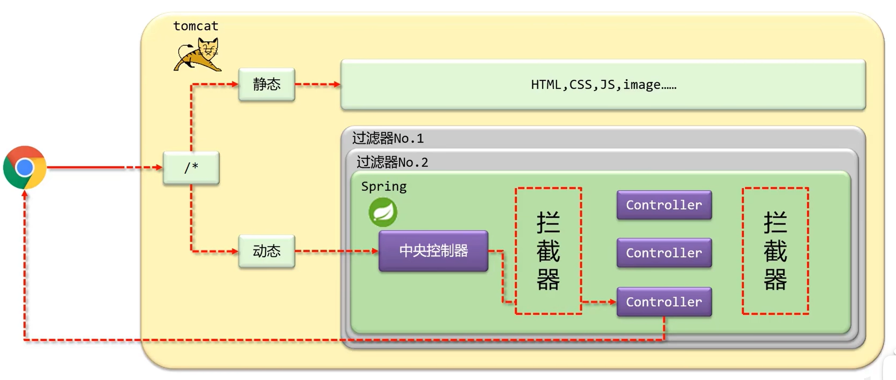
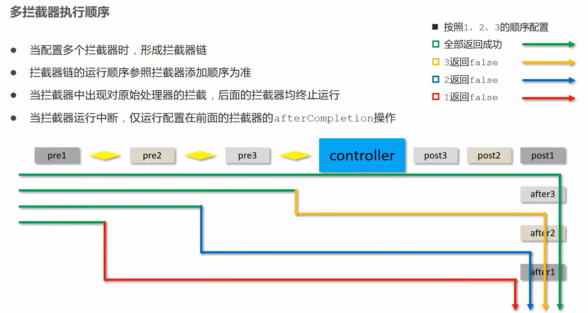

# SpringMVC

[TOC]

# 快速入门


## 核心概念


### 起源

1. 三层架构：一个 Servlet 只能处理一个请求，耦合度高，复用性差，整页刷新用户体验差

2. MVC 模式：部分解耦但后端仍负责 View层，高并发有限

3. 前后端分离：2异步调用，复用性强，支持复杂交互，用户体验性强

### 概念

- SpringMVC 是 Spring 框架中的一个模块，用于构建 Web 的 MVC 架构，提供了简洁、优雅的方式来开发 Web 程序，尤其是 HTTP 请求和响应。
- MVC：Model-View-Contorller，是一种软件设计模式，用于实现应用程序的分层和职责分离，达到解耦的目的。

#### Model（模型 )

- 包含程序的**业务逻辑和数据**。
- 通常由 Service 层和 Dao 层支持。
- 在 SpringMVC 中，Model 的数据可以通过 `Model`或 `ModelAndView`对象传递到 View 层。

#### View（视图）

- 用户界面部分，**负责展示页面和数据给用户**。
- SpringMVC 支持多种视图技术（之前的 JSP，Thymeleaf 等）

#### Controller（控制器）

- **负责接受用户请求**，调用业务逻辑（Model），并将结果返回给 View。
- SpringMVC 使用注解方式来定义控制器，如@Controller，@RestController等。


## 案例


### 导入坐标

```xml
<dependency>
    <groupId>javax.servlet</groupId>
    <artifactId>javax.servlet-api</artifactId>
    <version>3.1.0</version>
    <scope>provided</scope>
</dependency>
<dependency>
    <groupId>org.springframework</groupId>
    <artifactId>spring-webmvc</artifactId>
    <version>5.2.10.RELEASE</version>
</dependency>
```

### 配置SpringMVC

`config/SpringMvcConfig.java`

```java
@Configuration
@ComponentScan("com.itheima.controller")
public class SpringMvcConfig {
}
```

### 初始化Servlet容器，加载SpringMVC环境

`config/ServletContainersInitConfig.java`

```java
public class ServletContainersInitConfig extends AbstractDispatcherServletInitializer {
    protected WebApplicationContext createServletApplicationContext() {
        AnnotationConfigWebApplicationContext ctx = new AnnotationConfigWebApplicationContext();
        ctx.register(SpringMvcConfig.class);
        return ctx;
    }
    
    // 配置地址映射
    protected String[] getServletMappings() {
        return new String[]{"/"};
    }
    protected WebApplicationContext createRootApplicationContext() {
        return null;
    }
}
```

### 创建控制器bean

`controller/UserController.java`

```java
@Controller
public class UserController {
    @RequestMapping("/save")
    @ResponseBody
    public String save(){
        System.out.println("user save ...");
        return "{'info':'springmvc'}";
    }
}
```


# 注解

SpringMVC 中常用的注解可以分为以下几类，分别对应不同的功能和场景：

## 核心控制器注解

### @Controller

- **作用**：标记一个类为控制器，用于处理 HTTP 请求。
- **示例**：

```java
@Controller
public class MyController {
    @RequestMapping("/hello")
    public String hello() {
        return "hello"; // 视图名
    }
}
```

### @RestController

- **作用**：组合注解，相当于 `@Controller + @ResponseBody`，用于返回 JSON 或 XML 数据，而不是视图。
- **示例**：

```java
@RestController
public class ApiController {
    @GetMapping("/api/data")
    public String getData() {
        return "This is JSON response.";
    }
}
```

## 请求映射相关注解

### @RequestMapping

- **作用**：映射请求路径，可以用于类或方法级别。
- **示例**：

```java
@Controller
@RequestMapping("/user")
public class UserController {
    @RequestMapping("/profile")
    public String userProfile() {
        return "profile";
    }
}
```

### @GetMapping / @PostMapping / @PutMapping / @DeleteMapping / @PatchMapping

- **作用**：对应 HTTP 请求方法的快捷注解，等价于 `@RequestMapping(method = RequestMethod.GET/POST/PUT/DELETE/PATCH)`。
- **示例**：

```java
@GetMapping("/getUser")
public String getUser() {
    return "getUser";
}
```

## 请求参数相关注解

在 SpringMVC 中，HTTP 请求中的参数通常是简单类型（如 `String`、`int` 等），使用其他类型时，最好加上 **@RequestParam**，日期格式使用@DateTimeFormat

### @RequestParam

- **作用**：获取请求参数（常见于查询参数）。
- **示例**：

```java
@GetMapping("/search")
public String search(@RequestParam("keyword") String keyword) {
    return "Search for: " + keyword;
}
```

### @PathVariable

- **作用**：获取路径中的动态参数。
- **示例**：

```java
@GetMapping("/user/{id}")
public String getUserById(@PathVariable("id") String id) {
    return "User ID: " + id;
}
```

### @RequestBody

- **作用**：解析请求体中的 JSON 或 XML 数据，并将其绑定到对象。
- **示例**：

```java
@PostMapping("/addUser")
public String addUser(@RequestBody User user) {
    return "User Name: " + user.getName();
}
```

### @RequestHeader

- **作用**：获取 HTTP 请求头的值。
- **示例**：

```java
@GetMapping("/header")
public String getHeader(@RequestHeader("Authorization") String auth) {
    return "Auth: " + auth;
}
```

### @CookieValue

- **作用**：获取 Cookie 值。
- **示例**：

```java
@GetMapping("/cookie")
public String getCookie(@CookieValue("sessionId") String sessionId) {
    return "Session ID: " + sessionId;
}
```

## 返回结果相关注解

### @ResponseBody

- **作用**：将返回结果直接写入 HTTP 响应体（通常用于返回 JSON 或 XML 数据）。
- **示例**：

```java
@ResponseBody
@GetMapping("/json")
public String jsonResponse() {
    return "{"key":"value"}";
}
```

### @ModelAttribute

- **作用**：将方法返回值或请求参数绑定到模型中，在视图渲染时可用。
- **示例**：

```typescript
@ModelAttribute
public void addAttributes(Model model) {
    model.addAttribute("message", "Hello World");
}
```

## 数据验证相关注解

### @Valid

- **作用**：对方法参数进行校验（需要配合 Java Bean Validation API）。
- **示例**：

```java
@PostMapping("/save")
public String saveUser(@Valid @RequestBody User user, BindingResult result) {
    if (result.hasErrors()) {
        return "Validation failed";
    }
    return "Success";
}
```

## 其他注解

### @SessionAttributes

- **作用**：将某些模型属性存储到会话中，便于后续访问。
- **示例**：

```java
@SessionAttributes("user")
@Controller
public class SessionController {
    @GetMapping("/setSession")
    public String setSession(Model model) {
        model.addAttribute("user", "John");
        return "session";
    }
}
```

### @RequestPart

- **作用**：处理 `multipart/form-data` 请求，常用于文件上传。
- **示例**：

```java
@PostMapping("/upload")
public String handleFileUpload(@RequestPart("file") MultipartFile file) {
    return "Uploaded: " + file.getOriginalFilename();
}
```

## 总结

| 注解                   | 功能描述                     |
| ---------------------- | ---------------------------- |
| **@Controller**        | 标记类为控制器，用于返回视图 |
| **@RestController**    | 返回 JSON 或 XML 数据        |
| **@RequestMapping**    | 映射请求路径                 |
| **@RequestParam**      | 获取请求参数                 |
| **@PathVariable**      | 获取路径参数                 |
| **@RequestBody**       | 获取请求体数据               |
| **@ResponseBody**      | 返回数据到响应体             |
| **@ModelAttribute**    | 绑定模型数据                 |
| **@SessionAttributes** | 保存会话属性                 |
| **@Valid**             | 数据校验                     |
| **@RequestHeader**     | 获取请求头参数               |
| **@CookieValue**       | 获取 Cookie 数据             |

## 综合案例

`pojo/User.java`

```java
package com.glim.javawebdemo.pojo;

/**
 * @author glim137137
 */

public class User {
    private Integer id;
    private String name;
    private Short age;
    private Short gender;
    private String phone;

    public User() {
    }

    public User(Integer id, String name, Short age, Short gender, String phone) {
        this.id = id;
        this.name = name;
        this.age = age;
        this.gender = gender;
        this.phone = phone;
    }

    @Override
    public String toString() {
        return "User{" +
                "id=" + id +
                ", name='" + name + '\'' +
                ", age=" + age +
                ", gender=" + gender +
                ", phone='" + phone + '\'' +
                '}';
    }

    public Integer getId() {
        return id;
    }

    public void setId(Integer id) {
        this.id = id;
    }

    public String getName() {
        return name;
    }

    public void setName(String name) {
        this.name = name;
    }

    public Short getAge() {
        return age;
    }

    public void setAge(Short age) {
        this.age = age;
    }

    public Short getGender() {
        return gender;
    }

    public void setGender(Short gender) {
        this.gender = gender;
    }

    public String getPhone() {
        return phone;
    }

    public void setPhone(String phone) {
        this.phone = phone;
    }
}

```

`controller/UserController.java`

```java
package com.glim.javawebdemo.controller;

import com.glim.javawebdemo.pojo.User;
import jakarta.servlet.http.HttpServletRequest;
import org.springframework.format.annotation.DateTimeFormat;
import org.springframework.web.bind.annotation.*;

import java.lang.reflect.Array;
import java.time.LocalDateTime;
import java.util.Arrays;
import java.util.List;

/**
 * @author glim137137
 */
@RestController
public class UserController {
    // 简单参数
    @RequestMapping("/simpleParam")
    public String simpleParam(HttpServletRequest request) {
        String name = request.getParameter("name");
        String age = request.getParameter("age");

        int ageInt = Integer.parseInt(age);
        System.out.println(name + ": " + ageInt);
        return "200 OK";
    }

    @RequestMapping("/springbootParam")
    public String springbootParam(@RequestParam(name="username", required = false) String name, int age) {
        System.out.println(name + ": " + age);
        return "200 OK";
    }

    // 实体参数
    @RequestMapping("/simplePojo")
    public User simplePojo(User user) {
        System.out.println(user);
        return user;
    }

    // 数组集合参数
    @RequestMapping("/arrayParam")
    public String arrayParam(String[] hobbies) {
        System.out.println(Arrays.toString(hobbies));
        return "arrayParam 200 OK";
    }

    @RequestMapping("/listParam")
    public List<String> listParam(@RequestParam List<String> hobbies) {
        System.out.println(hobbies);
        return hobbies;
    }

    // 日期参数
    @RequestMapping("/dateParam")
    public String dateParam(@DateTimeFormat(pattern = "yyyy-MM-dd HH:mm:ss") LocalDateTime updateTime) {
        System.out.println(updateTime);
        return "OK";
    }

    // json参数
    @RequestMapping("/jsonParam")
    public String jsonParam(@RequestBody User user) {
        System.out.println(user);
        return "OK";
    }

    // 路径参数
    @RequestMapping("/path/{id}/{name}")
    public String pathParam(@PathVariable Integer id, @PathVariable String name) {
        System.out.println(id);
        System.out.println(name);
        return "OK";
    }
}
```


# RESTful


## 简介

**REST（Representational State Transfer）**，即**表现形式状态转换**，是一种软件架构风格，用于设计网络应用程序，使应用程序可以通过标准的Web协议进行交互。它由Roy Fielding在2000年的博士论文中提出，是现代Web开发中非常流行的一种架构风格。

### 传统风格与REST风格的对比

- **传统风格资源描述形式**
    - `http://localhost/user/getById?id=1`：通过方法名（如`getById`）和参数（如`id=1`）来指定操作和资源。
    - `http://localhost/user/saveUser`：通过方法名（如`saveUser`）来指定操作。
- **REST风格描述形式**
    - `http://localhost/user/1`：通过资源的URI（统一资源标识符）来指定资源，操作通过HTTP方法（如GET、POST、PUT、DELETE）来指定。
    - `http://localhost/user`：同样通过资源的URI来指定资源集合，操作通过HTTP方法来指定。

### 核心原则

1. **无状态（Stateless）**
    - 每个请求从客户端到服务器都必须包含理解请求所必需的信息。服务器不会保存任何客户端请求之间的状态信息。这意味着每次请求都是独立的，服务器不会依赖于之前请求的状态。
2. **统一接口（Uniform Interface）**
    - REST通过统一的接口来简化和解耦系统之间的交互。无论资源的类型如何，客户端都可以通过相同的接口来访问和操作资源。统一接口包括：
        - **资源的URI**：每个资源都有一个唯一的URI来标识。
        - **HTTP方法**：通过HTTP方法（如GET、POST、PUT、DELETE）来指定对资源的操作。
        - **超媒体作为应用状态的引擎（HATEOAS）**：客户端通过超链接动态发现可用的动作和资源，而不是事先硬编码。
3. **资源导向（Resource-Oriented）**
    - REST将系统中的数据和功能抽象为资源，每个资源都有一个唯一的URI来标识。资源可以通过标准的HTTP方法进行操作。
4. **超媒体作为应用状态的引擎（HATEOAS）**
    - 客户端通过超链接动态发现可用的动作和资源，而不是事先硬编码。这使得客户端可以在运行时发现资源的可用操作，而不需要提前知道这些操作。
5. **分层系统（Layered System）**
    - REST架构可以由多个层次组成，每个层次都有特定的职责。客户端通常不知道它们是直接与服务器通信，还是与中间层（如代理、网关）通信。这种分层结构提高了系统的可扩展性和安全性。
6. **可缓存（Cacheable）**
    - REST架构中的响应必须被定义为可缓存或不可缓存。如果响应是可缓存的，客户端就可以重用响应数据，从而提高效率和性能。


## 示例操作

- `http://localhost/users`：使用GET方法查询全部用户信息。这里的`/users`代表用户资源的集合。
- `http://localhost/users/1`：使用GET方法查询指定用户信息（例如用户ID为1）。这里的`/users/1`代表单个用户资源。
- `http://localhost/users`：使用POST方法添加用户信息。POST通常用于创建新的资源。
- `http://localhost/users`：使用PUT方法修改用户信息。PUT通常用于更新整个资源。
- `http://localhost/users/1`：使用DELETE方法删除用户信息。DELETE用于删除指定的资源。


# 拦截器

**拦截器**（Interceptor）是一种动态拦截请求并对其进行预处理和后处理的机制，类似于 Servlet 的过滤器（Filter），但功能更强大且更精细化。拦截器的核心是实现 `HandlerInterceptor` 接口或继承其实现类，并通过配置注册到应用程序中。



## 用途

- **日志记录**：记录请求的处理时间或访问记录。
- **权限校验**：检查用户是否有权限访问某些资源。
- **参数预处理**：对请求参数进行统一校验或修改。
- **响应后处理**：在响应数据返回之前进行修改或处理。
- **全局异常处理**：捕获和处理控制器未捕获的异常。

**拦截器与过滤器区别**：

- 归属不同：`Filter`属于`Servlet`技术，`Interceptor`属于`SpringMVC`技术

    > `Filter`技术
    >
    > ```java
    > @Override
    >     protected Filter[] getServletFilters() {
    >         CharacterEncodingFilter cef = new CharacterEncodingFilter();
    >         cef.setEncoding("UTF-8");
    >         return new Filter[]{cef};
    >     }
    > ```

- 拦截内容不同：`Filter`对所有访问进行增强，`Interceptor`仅针对`SpringMVC`的访问进行增强


## 核心接口

`HandlerInterceptor` 接口定义了拦截器的三个核心方法，分别在不同的生命周期阶段调用。

**接口方法**：

```java
public interface HandlerInterceptor {

    // 在处理请求之前调用
    default boolean preHandle(HttpServletRequest request, HttpServletResponse response, Object handler) throws Exception {
        return true;
    }

    // 在处理请求之后，渲染视图之前调用
    default void postHandle(HttpServletRequest request, HttpServletResponse response, Object handler, ModelAndView modelAndView) throws Exception {
    }

    // 在整个请求完成之后调用
    default void afterCompletion(HttpServletRequest request, HttpServletResponse response, Object handler, Exception ex) throws Exception {
    }
}
```


## 拦截器的注册

拦截器需要注册到 SpringMVC 的拦截器链中，通过实现 `WebMvcConfigurer` 来完成。

注册示例：

`config/WebMvcConfig.java`

```java
@Configuration
public class WebMvcConfig implements WebMvcConfigurer {

    @Autowired
    private LoggingInterceptor loggingInterceptor;
    
    @Autowired
    private AuthenticationInterceptor authenticationInterceptor;

    @Override
    public void addInterceptors(InterceptorRegistry registry) {
        // 日志拦截器 - 拦截所有请求
        registry.addInterceptor(loggingInterceptor)
                .addPathPatterns("/**")
                .order(1); // 执行顺序，数字越小优先级越高

        // 认证拦截器 - 拦截API请求
        registry.addInterceptor(authenticationInterceptor)
                .addPathPatterns("/api/**")
                .excludePathPatterns("/api/public/**", "/api/auth/login")
                .order(2);

        // 添加更多拦截器...
    }
}
```

- `addPathPatterns`：指定拦截的路径模式。
- `excludePathPatterns`：指定不拦截的路径模式。

### 拦截器链

多个拦截器按注册顺序执行：

- `preHandle`：按注册顺序执行。
- `postHandle` 和 `afterCompletion`：按注册顺序的逆序执行。

> `preHandler`执行顺序类似队列，`postHandler`与 `afterCompletion`类似栈。



## 实现一个登录拦截器

```java
@Component
public class LoggingInterceptor implements HandlerInterceptor {
    
    private static final Logger logger = LoggerFactory.getLogger(LoggingInterceptor.class);

    /**
     * 在控制器方法执行之前调用
     * 返回 true 继续执行，false 中断执行
     */
    @Override
    public boolean preHandle(HttpServletRequest request, HttpServletResponse response, Object handler) throws Exception {
        long startTime = System.currentTimeMillis();
        request.setAttribute("startTime", startTime);
        
        logger.info("Request URL: {} - Start Time: {}", request.getRequestURL(), startTime);
        logger.info("Request Method: {}", request.getMethod());
        logger.info("Remote Address: {}", request.getRemoteAddr());
        
        // 可以在这里进行权限检查
        String token = request.getHeader("Authorization");
        if (token == null && requiresAuth(request)) {
            response.sendError(HttpStatus.UNAUTHORIZED.value(), "Missing authorization token");
            return false; // 中断请求
        }
        
        return true; // 继续执行
    }

    /**
     * 在控制器方法执行之后，视图渲染之前调用
     */
    @Override
    public void postHandle(HttpServletRequest request, HttpServletResponse response, Object handler, 
                         ModelAndView modelAndView) throws Exception {
        long startTime = (Long) request.getAttribute("startTime");
        long endTime = System.currentTimeMillis();
        long executeTime = endTime - startTime;
        
        logger.info("Request URL: {} - Execute Time: {}ms", request.getRequestURL(), executeTime);
        
        if (modelAndView != null) {
            modelAndView.addObject("executeTime", executeTime);
        }
    }

    /**
     * 在整个请求完成之后调用（视图渲染完成后）
     */
    @Override
    public void afterCompletion(HttpServletRequest request, HttpServletResponse response, 
                              Object handler, Exception ex) throws Exception {
        if (ex != null) {
            logger.error("Request URL: {} - Exception: {}", request.getRequestURL(), ex.getMessage());
            // 可以在这里进行异常统计或通知
        }
        logger.info("Request URL: {} - Completed", request.getRequestURL());
    }

    private boolean requiresAuth(HttpServletRequest request) {
        return request.getRequestURI().startsWith("/api/secure/");
    }
}
```


### 前置处理

```java
public boolean preHandle(HttpServletRequest request,
        HttpServletResponse response,
        Object handler) throws Exception {
    System.out.println("preHandle...");
    return true;
}
```

- 参数
    - `request`: 请求对象
    - `response`: 响应对象
    - `handler`: 被调用的处理器对象，本质上是一个方法对象，对**反射技术**中的`Method`对象进行了再包装
- 返回值
    - 返回值为false，被拦截的处理器将不执行

### 后置处理

```java
public void postHandle(HttpServletRequest request,
        HttpServletResponse response,
        Object handler,
        ModelAndView modelAndView) throws Exception {
    System.out.println("postHandle...");
}
```

- `modelAndView`: 如果处理器执行完成具有返回结果，可以读取到对应数据与页面信息，并进行调整

### 完成后处理

- `ex`: 如果处理器执行过程中出现异常对象，可以针对异常情况进行单独处理

```java
public void afterCompletion(HttpServletRequest request,
        HttpServletResponse response,
        Object handler,
        Exception ex) throws Exception {
    System.out.println("afterCompletion...");
}
```


