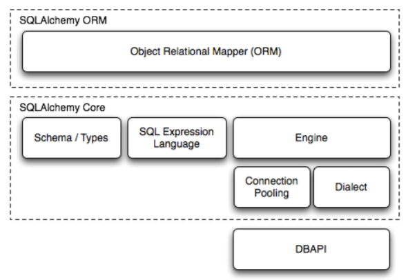

# SQLAlchemy

文章参考：[sqlalchemy](https://docs.sqlalchemy.org.cn/en/20/index.html)

[TOC]

SQLAlchemy SQL 工具包和对象关系映射器是一套全面的工具，用于处理数据库和 Python。它有几个不同的功能领域，可以单独使用或组合使用。其主要组件如下所示，组件依赖关系按层组织



## 两个不同的 API 

SQLAlchemy 以两个不同的 API 呈现，一个构建在另一个之上。这些 API 被称为 **Core** 和 **ORM**。

**SQLAlchemy Core** 是 SQLAlchemy 作为“数据库工具包”的基础架构。该库提供了用于管理数据库连接、与数据库查询和结果交互以及程序化构建 SQL 语句的工具。

**SQLAlchemy ORM** 构建在 Core 之上，以提供可选的 **对象关系映射** 功能。ORM 提供了一个额外的配置层，允许用户定义的 Python 类 **映射** 到数据库表和其他构造，以及一种称为 **会话** 的对象持久化机制。然后，它扩展了 Core 级别的 SQL 表达式语言，以允许根据用户定义的对象组成和调用 SQL 查询。


# SQLAlchemy Core


## 建立连接 - 引擎

任何 SQLAlchemy 应用程序的开始都是一个名为 [`Engine`](https://docs.sqlalchemy.org.cn/en/20/core/connections.html#sqlalchemy.engine.Engine) 的对象。此对象充当特定数据库连接的中心来源，既提供工厂，又为这些数据库连接提供名为 [连接池](https://docs.sqlalchemy.org.cn/en/20/core/pooling.html) 的持有空间。引擎通常是为特定数据库服务器创建一次的全局对象，并使用 URL 字符串进行配置，该字符串将描述应如何连接到数据库主机或后端。

在本教程中，我们将使用仅在内存中的 SQLite 数据库。这是一种轻松测试方法，无需预先设置实际的数据库。 [`Engine`](https://docs.sqlalchemy.org.cn/en/20/core/connections.html#sqlalchemy.engine.Engine) 是通过使用 [`create_engine()`](https://docs.sqlalchemy.org.cn/en/20/core/engines.html#sqlalchemy.create_engine) 函数创建的

```python
from sqlalchemy import create_engine
engine = create_engine("sqlite+pysqlite:///:memory:", echo=True)
```

[`create_engine`](https://docs.sqlalchemy.org.cn/en/20/core/engines.html#sqlalchemy.create_engine) 的主要参数是字符串 URL，上面作为字符串 `"sqlite+pysqlite:///:memory:"` 传递。此字符串向 [`Engine`](https://docs.sqlalchemy.org.cn/en/20/core/connections.html#sqlalchemy.engine.Engine) 指示三个重要事实

1. 我们正在与哪种数据库通信？ 这是上面的 `sqlite` 部分，它在 SQLAlchemy 中链接到一个称为 [方言](https://docs.sqlalchemy.org.cn/en/20/glossary.html#term-dialect) 的对象。
2. 我们正在使用什么 [DBAPI](https://docs.sqlalchemy.org.cn/en/20/glossary.html#term-DBAPI)？ Python [DBAPI](https://docs.sqlalchemy.org.cn/en/20/glossary.html#term-DBAPI) 是 SQLAlchemy 用来与特定数据库交互的第三方驱动程序。 在这种情况下，我们使用名称 `pysqlite`，在现代 Python 用法中，它是 SQLite 的 [sqlite3](https://docs.pythonlang.cn/library/sqlite3.html) 标准库接口。 如果省略，SQLAlchemy 将使用所选特定数据库的默认 [DBAPI](https://docs.sqlalchemy.org.cn/en/20/glossary.html#term-DBAPI)。
3. 我们如何定位数据库？ 在这种情况下，我们的 URL 包括短语 `/:memory:`，它是 `sqlite3` 模块的指示符，表明我们将使用**仅在内存中**的数据库。 这种数据库非常适合实验，因为它不需要任何服务器，也不需要创建新文件。

> **延迟连接**：[`Engine`](https://docs.sqlalchemy.org.cn/en/20/core/connections.html#sqlalchemy.engine.Engine) 在首次由 [`create_engine()`](https://docs.sqlalchemy.org.cn/en/20/core/engines.html#sqlalchemy.create_engine) 返回时，实际上尚未尝试连接到数据库； 这只会在首次要求它对数据库执行任务时发生。 这是一种称为 [延迟初始化](https://docs.sqlalchemy.org.cn/en/20/glossary.html#term-lazy-initialization) 的软件设计模式。

我们还指定了一个参数 [`create_engine.echo`](https://docs.sqlalchemy.org.cn/en/20/core/engines.html#sqlalchemy.create_engine.params.echo)，它将指示 [`Engine`](https://docs.sqlalchemy.org.cn/en/20/core/connections.html#sqlalchemy.engine.Engine) 将其发出的所有 SQL 记录到将写入标准输出的 Python 记录器中。 此标志是设置 [更正式的 Python 日志记录](https://docs.sqlalchemy.org.cn/en/20/core/engines.html#dbengine-logging) 的简写方式，对于脚本中的实验非常有用。 许多 SQL 示例将在 `[SQL]` 链接下方包含此 SQL 日志记录输出，单击该链接将显示完整的 SQL 交互。


## 事务和 DBAPI

SQLAlchemy 是 Python 中一个功能强大的 ORM（对象关系映射）工具，它既可以使用 ORM 的方式操作数据库，也可以直接使用 DBAPI（数据库API）进行底层的数据库操作。

### 获取连接

`Engine` 提供了 `connect()` 方法来获取一个 `Connection` 对象，该对象用于执行 SQL 语句。为了确保资源正确管理，建议使用 Python 的上下文管理器（`with` 语句）来管理连接。

```python
from sqlalchemy import create_engine, text

# 创建数据库引擎
engine = create_engine('sqlite:///example.db', echo=True)

# 使用上下文管理器获取连接
with engine.connect() as conn:
    result = conn.execute(text("SELECT 'hello world'"))
    print(result.all())
```

在上面的示例中，上下文管理器创建数据库连接并在事务中执行操作。Python DBAPI 的默认行为是事务始终在进行中；当连接 [释放](https://docs.sqlalchemy.org.cn/en/20/glossary.html#term-released) 时，会发出 ROLLBACK 以结束事务。事务**不会自动提交**；如果我们想提交数据，我们需要调用 `Connection.commit()`

```sql
BEGIN (implicit)
select 'hello world'
[...] ()
[('hello world',)]
ROLLBACK
```

### 提交更改

默认情况下，DBAPI 连接不会自动提交事务。如果需要提交更改，必须显式调用 `Connection.commit()` 方法。SQLAlchemy 提供了两种提交方式：

- **逐个提交**：在代码块内部调用 `Connection.commit()`。
- **一次开始**：使用 `Engine.begin()` 方法获取连接，该方法会自动管理事务。

**逐个提交**

```python
with engine.connect() as conn:
    conn.execute(text("CREATE TABLE some_table (x int, y int)"))
    conn.execute(
        text("INSERT INTO some_table (x, y) VALUES (:x, :y)"),
        [{"x": 1, "y": 1}, {"x": 2, "y": 4}],
    )
    conn.commit()
```

为了提交我们在代码块中完成的工作，我们调用 [`Connection.commit()`]方法，该方法提交事务。在此之后，我们可以继续运行更多 SQL 语句并再次调用 [`Connection.commit()`] 以提交这些语句。

```sql
BEGIN (implicit)
CREATE TABLE some_table (x int, y int)
[...] ()
<sqlalchemy.engine.cursor.CursorResult object at 0x...>
INSERT INTO some_table (x, y) VALUES (?, ?)
[...] [(1, 1), (2, 4)]
<sqlalchemy.engine.cursor.CursorResult object at 0x...>
COMMIT
```

**一次开始**

```python
with engine.begin() as conn:
    conn.execute(
        text("INSERT INTO some_table (x, y) VALUES (:x, :y)"),
        [{"x": 6, "y": 8}, {"x": 9, "y": 10}],
    )
```

你应该主要首选 “一次开始” 样式，因为它更简洁，并且预先显示了整个代码块的意图。

```sql
BEGIN (implicit)
INSERT INTO some_table (x, y) VALUES (?, ?)
[...] [(6, 8), (9, 10)]
<sqlalchemy.engine.cursor.CursorResult object at 0x...>
COMMIT
```

### 获取行

SQLAlchemy 支持通过绑定参数的方式传递数据到 SQL 语句中。绑定参数可以使用命名参数（`:` 前缀）的方式，然后将参数值作为字典传递给 `Connection.execute()` 方法。

```python
with engine.connect() as conn:
    result = conn.execute(text("SELECT x, y FROM some_table WHERE y > :y"), {"y": 2})
    for row in result:
        print(f"x: {row.x}  y: {row.y}")
```

### 发送多个参数

对于 DML 语句（如 `INSERT`、`UPDATE`、`DELETE`），可以一次性传递多个参数集，这称为 `executemany`。

```python
with engine.connect() as conn:
    conn.execute(
        text("INSERT INTO some_table (x, y) VALUES (:x, :y)"),
        [{"x": 11, "y": 12}, {"x": 13, "y": 14}],
    )
    conn.commit()
```

上面的操作等效于为每个参数集运行给定的 INSERT 语句一次，但该操作将针对多行进行优化以获得更好的性能。


## 数据库元数据

### 使用 Table 对象设置 MetaData

SQLAlchemy 中数据库元数据最常见的基石对象被称为 [`MetaData`](https://docs.sqlalchemy.org.cn/en/20/core/metadata.html#sqlalchemy.schema.MetaData)、 [`Table`](https://docs.sqlalchemy.org.cn/en/20/core/metadata.html#sqlalchemy.schema.Table) 和 [`Column`](https://docs.sqlalchemy.org.cn/en/20/core/metadata.html#sqlalchemy.schema.Column)。

我们总是从一个集合开始，该集合将是我们放置表的 [`MetaData`](https://docs.sqlalchemy.org.cn/en/20/core/metadata.html#sqlalchemy.schema.MetaData) 对象。

```python
from sqlalchemy import MetaData
metadata_obj = MetaData()
```

一旦我们有了 [`MetaData`](https://docs.sqlalchemy.org.cn/en/20/core/metadata.html#sqlalchemy.schema.MetaData) 对象，我们就可以声明一些 [`Table`](https://docs.sqlalchemy.org.cn/en/20/core/metadata.html#sqlalchemy.schema.Table) 对象。

```python
from sqlalchemy import Table, Column, Integer, String
user_table = Table(
    "user_account",
    metadata_obj,
    Column("id", Integer, primary_key=True),
    Column("name", String(30)),
    Column("fullname", String),
)
```

### `Table` 的组件

- **表名**：表的名称。
- **`MetaData` 对象**：存储表的元数据。
- **`Column` 对象**：表示表中的列，包括列名、数据类型、约束等。

```
>>> user_table.c.name
Column('name', String(length=30), table=<user_account>)

>>> user_table.c.keys()
['id', 'name', 'fullname']
```

### 声明简单约束

`user_table` 中的第一个 [`Column`](https://docs.sqlalchemy.org.cn/en/20/core/metadata.html#sqlalchemy.schema.Column) 包括 [`Column.primary_key`](https://docs.sqlalchemy.org.cn/en/20/core/metadata.html#sqlalchemy.schema.Column.params.primary_key) 参数，这是一种简写技术，用于指示此 [`Column`](https://docs.sqlalchemy.org.cn/en/20/core/metadata.html#sqlalchemy.schema.Column) 应该是此表的主键的一部分。主键本身通常是隐式声明的，由 [`PrimaryKeyConstraint`](https://docs.sqlalchemy.org.cn/en/20/core/constraints.html#sqlalchemy.schema.PrimaryKeyConstraint) 构造表示。

```
>>> user_table.primary_key
PrimaryKeyConstraint(Column('id', Integer(), table=<user_account>, primary_key=True, nullable=False))
```

最常显式声明的约束是 [`ForeignKeyConstraint`](https://docs.sqlalchemy.org.cn/en/20/core/constraints.html#sqlalchemy.schema.ForeignKeyConstraint) 对象，它对应于数据库 [外键约束](https://docs.sqlalchemy.org.cn/en/20/glossary.html#term-foreign-key-constraint)。

下面我们声明第二个表 `address`，它将具有引用 `user` 表的外键约束：

```python
from sqlalchemy import ForeignKey
address_table = Table(
    "address",
    metadata_obj,
    Column("id", Integer, primary_key=True),
    Column("user_id", ForeignKey("user_account.id"), nullable=False),
    Column("email_address", String, nullable=False),
)
```

上面的表还具有第三种约束，在 SQL 中是“NOT NULL”约束，上面使用 [`Column.nullable`](https://docs.sqlalchemy.org.cn/en/20/core/metadata.html#sqlalchemy.schema.Column.params.nullable) 参数指示。

### 向数据库发出 DDL

我们已经构建了一个对象结构，该结构表示数据库中的两个数据库表，从根 [`MetaData`](https://docs.sqlalchemy.org.cn/en/20/core/metadata.html#sqlalchemy.schema.MetaData) 对象开始，然后进入两个 [`Table`](https://docs.sqlalchemy.org.cn/en/20/core/metadata.html#sqlalchemy.schema.Table) 对象，每个对象都保存着 [`Column`](https://docs.sqlalchemy.org.cn/en/20/core/metadata.html#sqlalchemy.schema.Column) 和 [`Constraint`](https://docs.sqlalchemy.org.cn/en/20/core/constraints.html#sqlalchemy.schema.Constraint) 对象的集合。

定义了表结构后，可以使用 `MetaData.create_all()` 方法将表结构创建到数据库中。这会生成并执行相应的 DDL（数据定义语言）SQL 语句。

```python
metadata_obj.create_all(engine)
```

```sql
BEGIN (implicit)
PRAGMA main.table_...info("user_account")
...
PRAGMA main.table_...info("address")
...
CREATE TABLE user_account (
    id INTEGER NOT NULL,
    name VARCHAR(30),
    fullname VARCHAR,
    PRIMARY KEY (id)
)
...
CREATE TABLE address (
    id INTEGER NOT NULL,
    user_id INTEGER NOT NULL,
    email_address VARCHAR NOT NULL,
    PRIMARY KEY (id),
    FOREIGN KEY(user_id) REFERENCES user_account (id)
)
...
COMMIT
```

`MetaData` 对象还具有 `MetaData.drop_all()` 方法，该方法将以与发出 CREATE 时相反的顺序发出 DROP 语句，以便删除架构元素。


## 处理数据

### INSERT 语句

#### `insert()` SQL 表达式构造

`Insert`的一个简单示例，说明了目标表和 VALUES 子句

```python
from sqlalchemy import insert
stmt = insert(user_table).values(name="spongebob", fullname="Spongebob Squarepants")
```

大多数 SQL 表达式可以就地字符串化，以此查看正在生成的内容的一般形式

```python
print(stmt)
```

```sql
INSERT INTO user_account (name, fullname) VALUES (:name, :fullname)
```

字符串化形式是通过**生成对象**的 `Compiled`形式来创建的，其中包含语句的数据库特定字符串 SQL 表示形式；我们可以使用 [`ClauseElement.compile()`](https://docs.sqlalchemy.org.cn/en/20/core/foundation.html#sqlalchemy.sql.expression.ClauseElement.compile) 方法直接获取此对象

```
compiled = stmt.compile()
```

我们的 `Insert` 构造是**“参数化”**构造的一个示例，之前在发送参数中说明过；要查看 `name` 和 `fullname` 绑定参数，这些参数也可以从 `Compiled`构造中获得

```
>>> compiled.params
{'name': 'spongebob', 'fullname': 'Spongebob Squarepants'}
```

#### 执行语句

调用该语句，我们可以将一行 INSERT 到 `user_table` 中。

```python
with engine.connect() as conn:
    result = conn.execute(stmt)
    conn.commit()
```

INSERT SQL 以及捆绑的参数可以在 SQL 日志中看到

```sql
BEGIN (implicit)
INSERT INTO user_account (name, fullname) VALUES (?, ?)
[...] ('spongebob', 'Spongebob Squarepants')
COMMIT
```

#### INSERT 通常自动生成 “values” 子句

如果我们实际上不使用 `Insert.values()`而只是打印一个“空”语句`print(insert(user_table))`，我们将获得表中每一列的 INSERT

```sql
INSERT INTO user_account (id, name, fullname) VALUES (:id, :name, :fullname)
```

实际上，你无需键入显式的 VALUES 子句。

```python
with engine.connect() as conn:
    result = conn.execute(
        insert(user_table),
        [
            {"name": "sandy", "fullname": "Sandy Cheeks"},
            {"name": "patrick", "fullname": "Patrick Star"},
        ],
    )
    conn.commit()
```

### SELECT 语句

对于 Core 和 ORM，`select()` 函数生成一个 `Select` 构造，该构造用于所有 SELECT 查询。传递给 Core 中的 `Connection.execute()` 和 ORM 中的 `Session.execute()` 等方法时，将在当前事务中发出 SELECT 语句，并且可以通过返回的 `Result` 对象获得结果行。

#### `select()` SQL 表达式构造

与其他 SQL 构造一样，它可以就地字符串化。

```python
from sqlalchemy import select
stmt = select(user_table).where(user_table.c.name == "spongebob")
print(stmt)
```

同样，与所有其他语句级 SQL 构造一样，要实际运行语句，我们将其传递给执行方法。

```python
with engine.connect() as conn:
    for row in conn.execute(stmt):
        print(row) # (1, 'spongebob', 'Spongebob Squarepants')
```

```sql
BEGIN (implicit)
SELECT user_account.id, user_account.name, user_account.fullname
FROM user_account
WHERE user_account.name = ?
[...] ('spongebob',)
ROLLBACK
```

#### 设置 COLUMNS 和 FROM 子句

最简单的情况是你都没有设置

```python
print(select(user_table))
'''
SELECT user_account.id, user_account.name, user_account.fullname
FROM user_account
'''
```

要使用 Core 方法从单个列中进行 SELECT，可以从 **`Table.c`** 访问器访问 `Column` 对象，并且可以直接发送；FROM 子句将被推断为由这些列表示的所有 `Table` 和其他 `FromClause` 对象的集合。

```python
print(select(user_table.c.name, user_table.c.fullname))
'''
SELECT user_account.name, user_account.fullname
FROM user_account
'''
print(select(user_table.c["name", "fullname"]))
'''
SELECT user_account.name, user_account.fullname
FROM user_account
'''
```

#### 使用文本列表达式选择

在使用事务和 DBAPI中介绍的 `text()` 构造实际上可以直接嵌入到 `Select` 构造中，如下所示，我们制造了一个**硬编码的字符串**文字 `'some phrase'` 并将其嵌入到 SELECT 语句中。

```python
from sqlalchemy import text
stmt = select(text("'some phrase'"), user_table.c.name).order_by(user_table.c.name)
with engine.connect() as conn:
    print(conn.execute(stmt).all()) # [('some phrase', 'patrick'), ('some phrase', 'sandy'), ('some phrase', 'spongebob')]
    

```

我们可以使用 [`literal_column()`](https://docs.sqlalchemy.org.cn/en/20/core/sqlelement.html#sqlalchemy.sql.expression.literal_column) 构造从我们的文本片段中获得更多功能，如下的`label`。

```sql
from sqlalchemy import literal_column
stmt = select(literal_column("'some phrase'").label("p"), user_table.c.name).order_by(
    user_table.c.name
)
with engine.connect() as conn:
    for row in conn.execute(stmt):
        print(f"{row.p}, {row.name}")
```

```sql
BEGIN (implicit)
SELECT 'some phrase' AS p, user_account.name
FROM user_account ORDER BY user_account.name
[generated in ...] ()
ROLLBACK
```

#### WHERE 子句

我们通过使用标准 Python 运算符与 [`Column`](https://docs.sqlalchemy.org.cn/en/20/core/metadata.html#sqlalchemy.schema.Column) 和类似对象结合使用来组合 SQL 表达式

```python
print(user_table.c.name == "squidward")
# user_account.name = :name_1
print(address_table.c.user_id > 10)
# address.user_id > :user_id_1
```

我们可以使用这样的表达式通过将结果对象传递给 `Select.where()`方法来生成 WHERE 子句

```python
print(select(user_table).where(user_table.c.name == "squidward"))
```

要生成由 AND 连接的多个表达式，可以**多次调用** `Select.where()` 方法，或者单次调用接受多个表达式。

```python
print(
    select(address_table.c.email_address)
    .where(user_table.c.name == "squidward")
    .where(address_table.c.user_id == user_table.c.id)
)
print(
    select(address_table.c.email_address).where(
        user_table.c.name == "squidward",
        address_table.c.user_id == user_table.c.id,
    )
)
```

对于针对单个实体的简单“相等”比较，你也可以用 `Select.filter_by()`，

```python
print(select(User).filter_by(name="spongebob", fullname="Spongebob Squarepants"))
```

#### 显式的 FROM 子句和 JOIN

隐式的 FROM：放入来自两个表的列，那么我们将得到一个逗号分隔的 FROM 子句

```python
print(select(user_table.c.name, address_table.c.email_address))
'''
SELECT user_account.name, address.email_address
FROM user_account, address
'''
```

为了将这两个表 JOIN 在一起，我们通常在 `Select` 上使用两种方法之一。第一个是 `Select.join_from`() 方法，它允许我们**显式**指示 JOIN 的左侧和右侧

```python
print(
    select(user_table.c.name, address_table.c.email_address).join_from(
        user_table, address_table
    )
)
'''
SELECT user_account.name, address.email_address
FROM user_account JOIN address ON user_account.id = address.user_id
'''
```

> **ON 子句是推断出来的**

另一个是 `Select.join()` 方法，它仅指示 **JOIN 的右侧**，左侧是推断出来的

```python
print(select(user_table.c.name, address_table.c.email_address).join(address_table))
'''
SELECT user_account.name, address.email_address
FROM user_account JOIN address ON user_account.id = address.user_id
'''
```

`select_from()` 用于指定 SELECT 查询的 FROM 子句中的表，提供了灵活的方式来定义查询的来源。

```python
print(select(address_table.c.email_address).select_from(user_table).join(address_table))
'''
SELECT address.email_address
FROM user_account JOIN address ON user_account.id = address.user_id
'''
```

##### ON 子句

先前的 JOIN 示例说明，[`Select`](https://docs.sqlalchemy.org.cn/en/20/core/selectable.html#sqlalchemy.sql.expression.Select) 构造可以在两个表之间进行 join 并自动生成 ON 子句。

你也可以在 `join()` 里直接指定。

```python
print(
    select(address_table.c.email_address)
    .select_from(user_table)
    .join(address_table, user_table.c.id == address_table.c.user_id)
)
'''
SELECT address.email_address
FROM user_account JOIN address ON user_account.id = address.user_id
'''
```

##### OUTER 和 FULL join

```python
print(select(user_table).join(address_table, isouter=True))
print(select(user_table).join(address_table, full=True))
```

#### ORDER BY

ORDER BY 子句是根据 SQL 表达式构造（通常基于 [`Column`](https://docs.sqlalchemy.org.cn/en/20/core/metadata.html#sqlalchemy.schema.Column) 或类似对象）构造的。[`Select.order_by()`](https://docs.sqlalchemy.org.cn/en/20/core/selectable.html#sqlalchemy.sql.expression.Select.order_by) 方法接受一个或多个位置表达式

```python
print(select(user_table).order_by(user_table.c.name))
'''
SELECT user_account.id, user_account.name, user_account.fullname
FROM user_account ORDER BY user_account.name
'''
```

#### 带有 GROUP BY / HAVING 的聚合函数

```python
from sqlalchemy import func

with engine.connect() as conn:
    result = conn.execute(
        select(User.name, func.count(Address.id).label("count"))
        .join(Address)
        .group_by(User.name)
        .having(func.count(Address.id) > 1)
    )
    print(result.all())
```

#### 别名

 `Alias` 构造就像 `Table` 构造一样，因为它在 `Alias.c` 集合中也具有 `Column` 对象的命名空间。

```python
user_alias_1 = user_table.alias()
user_alias_2 = user_table.alias()
print(
    select(user_alias_1.c.name, user_alias_2.c.name).join_from(
        user_alias_1, user_alias_2, user_alias_1.c.id > user_alias_2.c.id
    )
)
```

#### 子查询

我们先用 `Select.subquery()` 构建一个子查询，

```python
subq = (
    select(func.count(address_table.c.id).label("count"), address_table.c.user_id)
    .group_by(address_table.c.user_id)
    .subquery()
)
```

使用子查询

```python
stmt = select(user_table.c.name, user_table.c.fullname, subq.c.count).join_from(
    user_table, subq
)

print(stmt)
```

#### 集合操作

你可以使用 UNION 或 UNION ALL SQL 操作将 SELECT 语句合并在一起。

```python
from sqlalchemy import union_all
stmt1 = select(user_table).where(user_table.c.name == "sandy")
stmt2 = select(user_table).where(user_table.c.name == "spongebob")
u = union_all(stmt1, stmt2)
with engine.connect() as conn:
    result = conn.execute(u)
    print(result.all())
```

还有其他集合操作（例如 INTERSECT [ALL] 和 EXCEPT [ALL]）也是可能的。

SQLAlchemy 的 [`Select`](https://docs.sqlalchemy.org.cn/en/20/core/selectable.html#sqlalchemy.sql.expression.Select) 构造使用诸如 [`union()`](https://docs.sqlalchemy.org.cn/en/20/core/selectable.html#sqlalchemy.sql.expression.union)、[`intersect()`](https://docs.sqlalchemy.org.cn/en/20/core/selectable.html#sqlalchemy.sql.expression.intersect) 和 [`except_()`](https://docs.sqlalchemy.org.cn/en/20/core/selectable.html#sqlalchemy.sql.expression.except_) 以及“all”对应项 [`union_all()`](https://docs.sqlalchemy.org.cn/en/20/core/selectable.html#sqlalchemy.sql.expression.union_all)、[`intersect_all()`](https://docs.sqlalchemy.org.cn/en/20/core/selectable.html#sqlalchemy.sql.expression.intersect_all) 和 [`except_all()`](https://docs.sqlalchemy.org.cn/en/20/core/selectable.html#sqlalchemy.sql.expression.except_all) 等函数支持这种性质的组合。

#### 使用 SQL 函数

- `count()` 函数，一个聚合函数，用于计算返回的行数。

```python
print(select(func.count()).select_from(user_table))
```

- `lower()` 函数，一个字符串函数，用于将字符串转换为小写。

```python
print(select(func.lower("A String With Much UPPERCASE")))
```

- `now()` 函数，用于提供当前日期和时间；由于这是一个常用函数，SQLAlchemy 知道如何为每个后端以不同的方式渲染它，在 SQLite 的情况下使用 CURRENT_TIMESTAMP 函数。

```python
stmt = select(func.now())
with engine.connect() as conn:
    result = conn.execute(stmt)
    print(result.all())
```

同时，一小部分极其常见的 SQL 函数，例如 [`count`](https://docs.sqlalchemy.org.cn/en/20/core/functions.html#sqlalchemy.sql.functions.count)、[`now`](https://docs.sqlalchemy.org.cn/en/20/core/functions.html#sqlalchemy.sql.functions.now)、[`max`](https://docs.sqlalchemy.org.cn/en/20/core/functions.html#sqlalchemy.sql.functions.max)、[`concat`](https://docs.sqlalchemy.org.cn/en/20/core/functions.html#sqlalchemy.sql.functions.concat)，包括它们自己的预打包版本，这些版本提供正确的类型信息，以及在某些情况下特定于后端的 SQL 生成。下面的示例对比了 PostgreSQL 方言和 Oracle Database 方言对于 [`now`](https://docs.sqlalchemy.org.cn/en/20/core/functions.html#sqlalchemy.sql.functions.now) 函数发生的 SQL 生成。

```python
from sqlalchemy.dialects import postgresql
print(select(func.now()).compile(dialect=postgresql.dialect()))
# SELECT now() AS now_1
from sqlalchemy.dialects import oracle
print(select(func.now()).compile(dialect=oracle.dialect()))
# SELECT CURRENT_TIMESTAMP AS now_1 FROM DUAL
```

### UPDATE 语句

#### `update()` SQL 表达式构造

与`insert`类似，

```python
from sqlalchemy import update
stmt = (
    update(user_table)
    .where(user_table.c.name == "patrick")
    .values(fullname="Patrick the Star")
)
print(stmt)
```

### DELETE 语句

#### `delete()` SQL 表达式构造

`delete()` 用于从数据库表中删除符合条件的记录

```python
from sqlalchemy import delete
stmt = delete(user_table).where(user_table.c.name == "patrick")
print(stmt)
```


# SQLAlchemy ORM

## 建立连接 - 引擎

ORM 建立连接的方式与 Core 一样。

## ORM Session 执行事务

使用 ORM 时，基本的事务/数据库交互对象称为 [`Session`](https://docs.sqlalchemy.org.cn/en/20/orm/session_api.html#sqlalchemy.orm.Session)。在现代 SQLAlchemy 中，此对象的使用方式与 [`Connection`](https://docs.sqlalchemy.org.cn/en/20/core/connections.html#sqlalchemy.engine.Connection) 非常相似，事实上，当使用 [`Session`](https://docs.sqlalchemy.org.cn/en/20/orm/session_api.html#sqlalchemy.orm.Session) 时，它在内部引用 [`Connection`](https://docs.sqlalchemy.org.cn/en/20/core/connections.html#sqlalchemy.engine.Connection)，并使用它来发出 SQL。

```python
from sqlalchemy.orm import Session

stmt = text("SELECT x, y FROM some_table WHERE y > :y ORDER BY x, y")
# 你在上下文管理器中构造 Session
with Session(engine) as session:
    result = session.execute(stmt, {"y": 6})
    for row in result:
        print(f"x: {row.x}  y: {row.y}")
```

## ORM 声明式表单定义表元数据

> **制作 Table 对象的另一种方法？**
>
> 如前所述，SQLAlchemy ORM 提供了围绕 `Table` 声明过程的外观，称为**声明式表**。它还为我们提供了称为 **ORM 映射类**或简称为“映射类”的其他内容。映射类是在使用 ORM 时 SQL 最常见的基石单元，并且在现代 SQLAlchemy 中也可以非常有效地与以 Core 为中心的使用结合使用。

当使用 ORM 时，我们声明 [`Table`](https://docs.sqlalchemy.org.cn/en/20/core/metadata.html#sqlalchemy.schema.Table) 元数据的过程通常与声明 [映射](https://docs.sqlalchemy.org.cn/en/20/glossary.html#term-mapped) 类的过程相结合。**映射类**是我们想要创建的任何 Python 类，它将具有与其关联的属性，这些属性将链接到数据库表中的列。

### 建立声明基类

```python
from sqlalchemy.orm import DeclarativeBase
class Base(DeclarativeBase):
    pass
```

声明基类引用为我们自动创建的 `MetaData` 集合。此 `MetaData`集合可通过[`DeclarativeBase.metadata`](https://docs.sqlalchemy.org.cn/en/20/orm/mapping_api.html#sqlalchemy.orm.DeclarativeBase.metadata) 类级属性访问。

```python
>>> Base.metadata
MetaData()
```

### 声明映射类

建立 `Base` 类后，我们现在可以根据新类 `User` 和 `Address` 为 `user_account` 和 `address` 表定义 ORM 映射类。我们在下面说明了声明式的最现代形式，它由 [**PEP 484**](https://peps.pythonlang.cn/pep-0484/) 类型注解驱动，使用特殊的类型 `Mapped`，它指示要映射为特定类型的属性

```python
from typing import List
from typing import Optional
from sqlalchemy.orm import Mapped
from sqlalchemy.orm import mapped_column
from sqlalchemy.orm import relationship

class User(Base):
    __tablename__ = "user_account" # 表名
    id: Mapped[int] = mapped_column(primary_key=True) # 主键
    name: Mapped[str] = mapped_column(String(30))
    fullname: Mapped[Optional[str]]
    addresses: Mapped[List["Address"]] = relationship(back_populates="user")
    def __repr__(self) -> str:
        return f"User(id={self.id!r}, name={self.name!r}, fullname={self.fullname!r})"

class Address(Base):
    __tablename__ = "address"
    id: Mapped[int] = mapped_column(primary_key=True)
    email_address: Mapped[str]
    user_id = mapped_column(ForeignKey("user_account.id"))
    user: Mapped[User] = relationship(back_populates="addresses")
    def __repr__(self) -> str:
        return f"Address(id={self.id!r}, email_address={self.email_address!r})"
```

### 从 ORM 映射向数据库发出 DDL

```python
Base.metadata.create_all(engine)
```

```sql
BEGIN (implicit)
PRAGMA main.table_...info("user_account")
...
PRAGMA main.table_...info("address")
...
COMMIT
```

## 处理数据


### ORM 工作单元模式

**工作单元模式**（Unit of Work Pattern） 是一种设计模式，用于管理数据库操作的事务性和一致性。它是 SQLAlchemy ORM（对象关系映射）的核心机制之一，负责**跟踪对象的状态变化**并将这些变化**批量提交**到数据库。


### 插入 ORM 对象 [Insert]

当使用 ORM 时，`Session` 对象负责构造 `Insert` 构造并在正在进行的事务中发出它们作为 INSERT 语句。我们指示 `Session` 这样做的方式是**添加对象条目**到它；`Session` 然后确保这些新条目将在需要时使用称为**刷新**的过程发出到数据库。 

#### 类的实例代表行

下面我们将创建两个 `User` 对象，每个对象代表一个要 INSERT 的潜在数据库行。

`User` 类包含一个由 ORM 映射自动生成的 `__init__()` 构造函数，以便我们可以使用列名作为构造函数中的键来创建每个对象。

```python
squidward = User(name="squidward", fullname="Squidward Tentacles")
krabs = User(name="ehkrabs", fullname="Eugene H. Krabs")
```

我们没有包含主键（即 `id` 列的条目），因为我们想利用数据库的**自动递增主键**功能，在本例中为 SQLite，ORM 也与之集成。如果我们查看上面对象的 `id` 属性的值，它会显示为 `None`

```
>>> squidward
User(id=None, name='squidward', fullname='Squidward Tentacles')
```

`None` 值由 SQLAlchemy 提供，以指示该属性目前没有值。 SQLAlchemy 映射的属性始终在 Python 中返回值，并且在处理尚未赋值的新对象时，不会引发 **`AttributeError`**。

目前，我们上面的两个对象据说处于称为[瞬态](https://docs.sqlalchemy.org.cn/en/20/glossary.html#term-transient)的状态 - 它们**不与任何数据库状态关联**，并且尚未与可以为它们生成 INSERT 语句的 `Session` 对象关联。

#### 向 Session 添加对象

为了逐步说明添加过程，我们将创建一个不使用上下文管理器的 `Session`（因此我们必须确保稍后关闭它！）

```python
>>> session = Session(engine)
```

然后使用 [`Session.add()`](https://docs.sqlalchemy.org.cn/en/20/orm/session_api.html#sqlalchemy.orm.Session.add) 方法将对象添加到 `Session`。调用此方法时，对象处于称为**挂起**的状态，并且尚未插入

```python
>>> session.add(squidward)
>>> session.add(krabs)
```

当我们有挂起对象时，我们可以通过查看 `Session` 上名为 [`Session.new`](https://docs.sqlalchemy.org.cn/en/20/orm/session_api.html#sqlalchemy.orm.Session.new) 的集合来查看此状态

```python
>>> session.new
'''
IdentitySet([User(id=None, name='squidward', fullname='Squidward Tentacles'), User(id=None, name='ehkrabs', fullname='Eugene H. Krabs')])
'''
```

上面的视图正在使用一个名为 `IdentitySet` 的集合，它本质上是一个 **Python 集合**，在所有情况下都基于对象标识进行哈希（即，使用 Python 内置的 `id()` 函数，而不是 Python `hash()` 函数）。

#### 刷新

我们可以通过调用 [`Session.flush()`](https://docs.sqlalchemy.org.cn/en/20/orm/session_api.html#sqlalchemy.orm.Session.flush) 方法手动说明刷新过程

```python
>>> session.flush()
'''
BEGIN (implicit)
INSERT INTO user_account (name, fullname) VALUES (?, ?) RETURNING id
[... (insertmanyvalues) 1/2 (ordered; batch not supported)] ('squidward', 'Squidward Tentacles')
INSERT INTO user_account (name, fullname) VALUES (?, ?) RETURNING id
[insertmanyvalues 2/2 (ordered; batch not supported)] ('ehkrabs', 'Eugene H. Krabs')
'''
```

上面我们观察到它创建了一个新事务并为这两个对象发出了适当的 INSERT 语句。 事务现在**保持打开状态**，直到我们调用 [`Session.commit()`](https://docs.sqlalchemy.org.cn/en/20/orm/session_api.html#sqlalchemy.orm.Session.commit), [`Session.rollback()`](https://docs.sqlalchemy.org.cn/en/20/orm/session_api.html#sqlalchemy.orm.Session.rollback), 或 [`Session.close()`](https://docs.sqlalchemy.org.cn/en/20/orm/session_api.html#sqlalchemy.orm.Session.close) 方法中的任何一个 [`Session`](https://docs.sqlalchemy.org.cn/en/20/orm/session_api.html#sqlalchemy.orm.Session)。

虽然 `Session.flush()`可用于手动将挂起的更改推送到当前事务，但通常是不必要的，因为 `Session` 具有称为 **自动刷新** 的行为。

#### 自动生成的主键属性

一旦插入行，我们创建的两个 Python 对象就处于称为[持久化](https://docs.sqlalchemy.org.cn/en/20/glossary.html#term-persistent)的状态，它们与添加或加载它们的 [`Session`](https://docs.sqlalchemy.org.cn/en/20/orm/session_api.html#sqlalchemy.orm.Session) 对象关联

`squidward` 和 `krabs` 对象现在具有与它们关联的这些新的主键标识符，我们可以通过访问 `id` 属性来查看它们。

```
>>> squidward.id
4
>>> krabs.id
5
```

#### 从 Identity Map 中按主键获取对象

Identity map 是一个内存中存储，它将当前加载到内存中的所有对象链接到它们的主键标识。 

我们可以通过使用 [`Session.get()`](https://docs.sqlalchemy.org.cn/en/20/orm/session_api.html#sqlalchemy.orm.Session.get) 方法检索上述对象之一来观察这一点，如果本地存在，它将从 identity map 返回一个条目，否则发出一个 SELECT

```python
>>> some_squidward = session.get(User, 4)
>>> some_squidward
# User(id=4, name='squidward', fullname='Squidward Tentacles')
```

Identity map 在特定 [`Session`](https://docs.sqlalchemy.org.cn/en/20/orm/session_api.html#sqlalchemy.orm.Session) 对象的范围内，为每个特定的数据库标识维护一个特定的 Python 对象的**唯一实例**。

 我们可以观察到 `some_squidward` 指的是与之前的 `squidward` **相同的对象**

```python
>>> some_squidward is squidward
True
```

#### 提交

```python
>>> session.commit()
COMMIT
```


### 查询 ORM 对象 [Select]

`select()` 使用此方法，我们继续从结果中获取 [`Row`](https://docs.sqlalchemy.org.cn/en/20/core/connections.html#sqlalchemy.engine.Row) 对象，但是这些行现在能够包含完整的实体，例如 `User` 类的实例，作为**每行中的单个元素**

```python
stmt = select(User).where(User.name == "spongebob")
with Session(engine) as session:
    for row in session.execute(stmt):
        print(row)
        
# (User(id=1, name='spongebob', fullname='Spongebob Squarepants'),)
```

#### 选择行与列

```python
row = session.execute(select(User)).first()

>>> row
(User(id=1, name='spongebob', fullname='Spongebob Squarepants'),)
>>> row[0]
User(id=1, name='spongebob', fullname='Spongebob Squarepants')
```

结果获取：

- `.all()`：返回所有结果的列表。
- `.first()`：返回第一个结果。
- `.one()`：返回且仅返回一个结果（多于或少于一个结果会抛异常）。
- `.scalar()`：返回单个值（通常用于单列查询）。

这里有个便捷方法，`Session.scalars()` 从查询结果中提取第一列的值，忽略其他列，返回一个可迭代的 `ScalarResult` 对象。

```python
user = session.scalars(select(User)).first()

>>> user
User(id=1, name='spongebob', fullname='Spongebob Squarepants')
```

或者，我们可以通过使用类绑定属性在结果行中选择 ORM 实体的单个列作为不同的元素；

```python
row = session.execute(select(User.name, User.fullname)).first()

>>> row
('spongebob', 'Spongebob Squarepants')
```

这些方法也可以混合使用，如下所示，我们在行的第一个元素中 SELECT `User` 实体的 `name` 属性，并将其与第二个元素中的完整 `Address` 实体组合在一起

```python
session.execute(
    select(User.name, Address).where(User.id == Address.user_id).order_by(Address.id)
).all()

'''
[('spongebob', Address(id=1, email_address='spongebob@sqlalchemy.org')),
('sandy', Address(id=2, email_address='sandy@sqlalchemy.org')),
('sandy', Address(id=3, email_address='sandy@squirrelpower.org'))]
''' 
```

### 更新 ORM 对象 [Update]

假设我们将用户名为 `sandy` 的 `User` 对象加载到事务中

```python
sandy = session.execute(select(User).filter_by(name="sandy")).scalar_one()
```

Python 对象 `sandy` 如前所述充当数据库中行的**代理**，更具体地说是**当前事务中的**数据库行，其主键标识为 `2`

```python
>>> sandy
User(id=2, name='sandy', fullname='Sandy Cheeks')
```

如果我们更改此对象的属性，[`Session`](https://docs.sqlalchemy.org.cn/en/20/orm/session_api.html#sqlalchemy.orm.Session) 会跟踪此更改

```python
>>> sandy.fullname = "Sandy Squirrel"
```

该对象出现在名为 [`Session.dirty`](https://docs.sqlalchemy.org.cn/en/20/orm/session_api.html#sqlalchemy.orm.Session.dirty) 的集合中，指示该对象为“脏”

```python
>>> sandy in session.dirty
True
```

当 [`Session`](https://docs.sqlalchemy.org.cn/en/20/orm/session_api.html#sqlalchemy.orm.Session) 下次发出刷新时，将发出一个 UPDATE，该 UPDATE 将更新数据库中的此值。 如前所述，刷新会在我们发出任何 SELECT 之前自动发生，使用称为 **自动刷新** 的行为。 

我们可以直接从该行查询 `User.fullname` 列，我们将获得更新后的值

```python
>>> sandy_fullname = session.execute(select(User.fullname).where(User.id == 2)).scalar_one()
>>> print(sandy_fullname)
Sandy Squirrel
```

```sql
UPDATE user_account SET fullname=? WHERE user_account.id = ?
[...] ('Sandy Squirrel', 2)
SELECT user_account.fullname
FROM user_account
WHERE user_account.id = ?
[...] (2,)
```

我们可以在上面看到，我们请求 [`Session`](https://docs.sqlalchemy.org.cn/en/20/orm/session_api.html#sqlalchemy.orm.Session) 执行单个 [`select()`](https://docs.sqlalchemy.org.cn/en/20/core/selectable.html#sqlalchemy.sql.expression.select) 语句。 但是，发出的 SQL 显示也发出了 UPDATE，这是刷新过程推送挂起的更改。 `sandy` Python 对象现在不再被认为是脏的

```python
>>> sandy in session.dirty
False
```


### 删除 ORM 对象 [Delete]

为了完善基本持久化操作，可以使用 [`Session.delete()`](https://docs.sqlalchemy.org.cn/en/20/orm/session_api.html#sqlalchemy.orm.Session.delete) 方法在[工作单元](https://docs.sqlalchemy.org.cn/en/20/glossary.html#term-unit-of-work)过程中将单个 ORM 对象标记为删除。 让我们从数据库中加载 `patrick`

```python
>>> patrick = session.get(User, 3)
```

如果我们将 `patrick` 标记为删除，与其他操作一样，在刷新进行之前实际上什么都不会发生

```python
>>> session.delete(patrick)
```

当前的 ORM 行为是 `patrick` 停留在 [`Session`](https://docs.sqlalchemy.org.cn/en/20/orm/session_api.html#sqlalchemy.orm.Session) 中，直到刷新进行，如前所述，如果我们发出查询，则会发生刷新

除此之外，现在被删除的 `patrick` 对象实例不再被认为在 [`Session`](https://docs.sqlalchemy.org.cn/en/20/orm/session_api.html#sqlalchemy.orm.Session) 中是持久的，如包含检查所示

```python
>>> patrick in session
False
```

但是，就像我们对 `sandy` 对象所做的 UPDATE 一样，我们在这里所做的每个更改都仅限于正在进行的事务，如果我们不提交它，这些更改将不会变为永久性的。 

### 回滚 [Rollback]

调用 [`Session.rollback()`](https://docs.sqlalchemy.org.cn/en/20/orm/session_api.html#sqlalchemy.orm.Session.rollback) 不仅会回滚事务，还会**使**当前与此 [`Session`](https://docs.sqlalchemy.org.cn/en/20/orm/session_api.html#sqlalchemy.orm.Session) 关联的所有对象**过期**，这将导致它们在下次访问时使用称为[延迟加载](https://docs.sqlalchemy.org.cn/en/20/glossary.html#term-lazy-loading) 的过程**自行刷新**。

```python
>>> session.rollback()
ROLLBACK
```

要更仔细地查看“过期”过程，我们可以观察到 Python 对象 `sandy` 的 Python `__dict__` 中没有留下任何状态，除了一个特殊的 SQLAlchemy 内部状态对象

```python
>>> sandy.__dict__
{'_sa_instance_state': <sqlalchemy.orm.state.InstanceState object at 0x...>}
```

这就是“[已过期](https://docs.sqlalchemy.org.cn/en/20/glossary.html#term-expired)”状态；再次访问该属性将自动开始一个新的事务，并使用当前的数据库行刷新 `sandy`

```python
>>> sandy.fullname
'Sandy Cheeks'

'''
BEGIN (implicit)
SELECT user_account.id AS user_account_id, user_account.name AS user_account_name,
user_account.fullname AS user_account_fullname
FROM user_account
WHERE user_account.id = ?
[...] (2,)
'''
```

对于已删除的对象，当我们之前注意到 `patrick` 不再会话中时，该对象的标识也会恢复

```
>>> patrick in session
True
```

### 关闭会话

在以上部分中，我们在 Python 上下文管理器之外使用了 [`Session`](https://docs.sqlalchemy.org.cn/en/20/orm/session_api.html#sqlalchemy.orm.Session) 对象，也就是说，我们没有使用 `with` 语句。这没关系，但是如果我们以这种方式做事，最好在我们完成 [`Session`](https://docs.sqlalchemy.org.cn/en/20/orm/session_api.html#sqlalchemy.orm.Session) 后显式关闭它

```python
>>> session.close()
ROLLBACK
```

关闭 [`Session`](https://docs.sqlalchemy.org.cn/en/20/orm/session_api.html#sqlalchemy.orm.Session)（当我们也在上下文管理器中使用它时也会发生这种情况）完成了以下事情

- 它[释放](https://docs.sqlalchemy.org.cn/en/20/glossary.html#term-releases)所有连接资源到连接池，取消（例如，回滚）任何正在进行的事务。

    这意味着当我们使用会话执行一些只读任务，然后关闭它时，我们不需要显式调用 [`Session.rollback()`](https://docs.sqlalchemy.org.cn/en/20/orm/session_api.html#sqlalchemy.orm.Session.rollback) 以确保事务被回滚；连接池会处理这个问题。

- 它从 [`Session`](https://docs.sqlalchemy.org.cn/en/20/orm/session_api.html#sqlalchemy.orm.Session) 中**驱逐**所有对象。

    这意味着我们为此 [`Session`](https://docs.sqlalchemy.org.cn/en/20/orm/session_api.html#sqlalchemy.orm.Session) 加载的所有 Python 对象，如 `sandy`、`patrick` 和 `squidward`，现在都处于称为[已分离(没有挂载)](https://docs.sqlalchemy.org.cn/en/20/glossary.html#term-detached)的状态。

    特别是，我们会注意到，仍然处于[已过期(没有刷新)](https://docs.sqlalchemy.org.cn/en/20/glossary.html#term-expired)状态的对象（例如，由于调用 [`Session.commit()`](https://docs.sqlalchemy.org.cn/en/20/orm/session_api.html#sqlalchemy.orm.Session.commit)），现在是无法使用的，因为它们不包含当前行的状态，并且不再与任何数据库事务关联，因此无法刷新

### 关联对象

举个例子：

- 数据库中有 `users` 表和 `orders` 表
- 一个用户可以有多个订单（一对多关系）
- 使用 relationship，你可以直接通过 `user.orders` 获取该用户的所有订单

#### 反向引用

反向引用（Back Reference）是 SQLAlchemy 中用于建立双向关系的重要机制，它允许你从关联的任何一方都能访问另一方。

这是 ORM（对象关系映射）比纯 SQL 更强大的特性之一。

例如：

- 一个作者（Author）可以写多本书（Book）
- 通过反向引用，你既可以通过 `author.books` 获取作者的所有书
- 也可以通过 `book.author` 获取书的作者

当你使用反向引用时，SQLAlchemy 会在底层维护这种双向关系：

1. 数据添加时：

```python
author = Author(name="J.K. Rowling")
book = Book(title="Harry Potter")

# 下面两种方式是等价的
author.books.append(book)
# 等价于
book.author = author
```

2. 数据查询时：

```python
# 通过作者查书籍
books = author.books

# 通过书籍查作者
author_name = book.author.name
```

##### relationship 的两种反向引用方式

1. back_populates（推荐）

```python
# User 类中
orders = relationship("Order", back_populates="user")

# Order 类中
user = relationship("User", back_populates="orders")
```

2. backref（简洁写法）

```python
# 只需要在一方定义
class User(Base):
    orders = relationship("Order", backref="user")

# Order 类中不需要再定义 user 关系
```

两种方式效果相同，但 back_populates 更明确，适合复杂项目。

#### 一对多关系

一个用户有多个订单，

```python
class User(Base):
    __tablename__ = 'users'
    id = Column(Integer, primary_key=True)
    name = Column(String)
    
    # 一对多关系：一个用户有多个订单
    orders = relationship("Order", back_populates="user")
```

#### 多对一关系

```python
class Order(Base):
    __tablename__ = 'orders'
    id = Column(Integer, primary_key=True)
    order_number = Column(String)
    
    # 外键指向 users 表的 id 字段
    user_id = Column(Integer, ForeignKey('users.id'))
    
    # 多对一关系：一个订单属于一个用户
    user = relationship("User", back_populates="orders")
```

#### 一对一关系

`uselist=False` 表示不是列表，单个对象

```python
class User(Base):
    profile = relationship("Profile", uselist=False, back_populates="user")

class Profile(Base):
    user_id = Column(Integer, ForeignKey('user.id'))
    user = relationship("User", back_populates="profile")
```

#### 多对多关系

需要额外关联表，

```python
# 关联表
user_group = Table('user_group', Base.metadata,
    Column('user_id', Integer, ForeignKey('user.id')),
    Column('group_id', Integer, ForeignKey('group.id'))
)

class User(Base):
    groups = relationship("Group", secondary=user_group, back_populates="users")

class Group(Base):
    users = relationship("User", secondary=user_group, back_populates="groups")
```

#### 参数详解

##### 集合类型参数

- `uselist`: 布尔值，False 表示**一对一关系**
- `collection_class`: 指定集合类型，如 set, list 等

##### 加载策略参数

- `lazy`: 控制关联对象的加载时机
    - `select` (默认): 首次访问时加载
    - `joined`: 使用 JOIN 立即加载
    - `subquery`: 使用子查询立即加载
    - `dynamic`: 返回可额外过滤的查询对象

##### 级联行为参数

- `cascade`: 控制操作如何级联到关联对象
    - `save-update` (默认): 自动将新对象添加到会话
    - `merge`: 合并操作传播到关联对象
    - `expunge`: 从会话中移除会传播
    - `delete`: 删除父对象时删除关联对象
    - `delete-orphan`: 删除不再与任何父对象关联的子对象
    - `all`: 除 `delete-orphan` 外的所有操作

##### 查询条件参数

- `primaryjoin`: 指定主连接条件

    ```python
    class User(Base):
        __tablename__ = 'users'
        id = Column(Integer, primary_key=True)
        
        # 只获取未删除的订单
        orders = relationship("Order",
                            primaryjoin="and_(User.id==Order.user_id, Order.is_deleted==False)",
                            back_populates="user")
    ```

- `secondary`: **多对多关系**中指定辅助连接条件

- `foreign_keys`: 明确指定外键列（表中有多个外键指向同一个表时）

    ```python
    class Message(Base):
        __tablename__ = 'messages'
        id = Column(Integer, primary_key=True)
        
        # 两个外键都指向User表
        sender_id = Column(Integer, ForeignKey('users.id'))
        receiver_id = Column(Integer, ForeignKey('users.id'))
        
        # 明确指定使用的外键
        sender = relationship("User", foreign_keys=[sender_id])
        receiver = relationship("User", foreign_keys=[receiver_id])
    ```

    