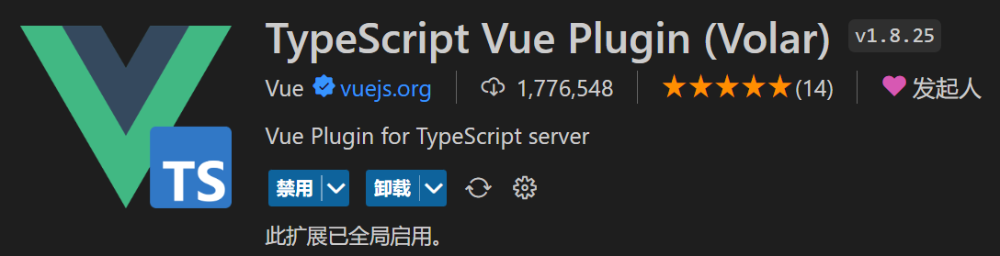
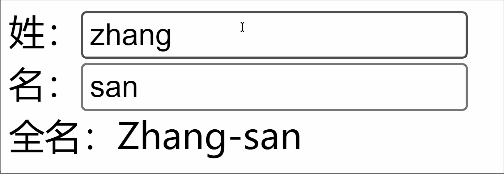

# VUE

[TOC]


# 1.简介

- 2020年9月18日，`Vue.js`发布版`3.0`版本，代号：`One Piece`（n
- 经历了：[4800+次提交](https://github.com/vuejs/core/commits/main)、[40+个RFC](https://github.com/vuejs/rfcs/tree/master/active-rfcs)、[600+次PR](https://github.com/vuejs/vue-next/pulls?q=is%3Apr+is%3Amerged+-author%3Aapp%2Fdependabot-preview+)、[300+贡献者](https://github.com/vuejs/core/graphs/contributors)
- 官方发版地址：[Release v3.0.0 One Piece · vuejs/core](https://github.com/vuejs/core/releases/tag/v3.0.0)
- 截止2023年10月，最新的公开版本为：`3.3.4`

   

## 1.1.性能的提升

- 打包大小减少`41%`。

- 初次渲染快`55%`, 更新渲染快`133%`。

- 内存减少`54%`。

  
## 1.2.源码的升级

- 使用`Proxy`代替`defineProperty`实现响应式。

- 重写虚拟`DOM`的实现和`Tree-Shaking`。

  
## 1.3.拥抱TypeScript

- `Vue3`可以更好的支持`TypeScript`。

  
## 1.4.新的特性

1. `Composition API`（组合`API`）：
   - `setup`
   - `ref`与`reactive`
   - `computed`与`watch`
   
     ......
   
2. 新的内置组件：
   - `Fragment`
   - `Teleport`
   - `Suspense`

     ......

3. 其他改变：
   - 新的生命周期钩子
   - `data` 选项应始终被声明为一个函数
   - 移除`keyCode`支持作为` v-on` 的修饰符

     ......


## 1.5.源码典型结构

```
src/
  ├── assets/
  ├── components/
  ├── views/
  │    ├── Home.vue
  │    ├── About.vue
  │    ├── User.vue
  ├── router/
  ├── store/
  └── App.vue

```


# 2.创建工程

## 2.1.基于 vue-cli 创建
点击查看[官方文档](https://cli.vuejs.org/zh/guide/creating-a-project.html#vue-create)

> 备注：目前`vue-cli`已处于维护模式，官方推荐基于 `Vite` 创建项目。

```powershell
## 查看@vue/cli版本，确保@vue/cli版本在4.5.0以上
vue --version

## 安装或者升级你的@vue/cli 
npm install -g @vue/cli

## 执行创建命令
vue create vue_test

##  随后选择3.x
##  Choose a version of Vue.js that you want to start the project with (Use arrow keys)
##  > 3.x
##    2.x

## 启动
cd vue_test
npm run serve
```

---

## 2.2.基于 vite 创建
`vite` 是新一代前端构建工具，官网地址：[https://vitejs.cn](https://vitejs.cn/)，`vite`的优势如下：

- 轻量快速的热重载（`HMR`），能实现极速的服务启动。
- 对 `TypeScript`、`JSX`、`CSS` 等支持开箱即用。
- 真正的按需编译，不再等待整个应用编译完成。
- `webpack`构建 与 `vite`构建对比图如下：
	
* 具体操作如下（点击查看[官方文档](https://cn.vuejs.org/guide/quick-start.html#creating-a-vue-application)）

```powershell
## 1.创建命令
npm create vue@latest

## 2.具体配置
## 配置项目名称
√ Project name: vue3_test
## 是否添加TypeScript支持
√ Add TypeScript?  Yes
## 是否添加JSX支持
√ Add JSX Support?  No
## 是否添加路由环境
√ Add Vue Router for Single Page Application development?  No
## 是否添加pinia环境
√ Add Pinia for state management?  No
## 是否添加单元测试
√ Add Vitest for Unit Testing?  No
## 是否添加端到端测试方案
√ Add an End-to-End Testing Solution? » No
## 是否添加ESLint语法检查
√ Add ESLint for code quality?  Yes
## 是否添加Prettiert代码格式化
√ Add Prettier for code formatting?  No

## 3.安装依赖
cd vue3_test
npm install
## 4.运行
npm run dev
Local: http://localhost:5173
```
创建空项目

```vue
<!-- 删除文件 -->
src\style.css
src\components\HelloWorld.vue
<!-- 删除代码-->
main.js
import './style.css'
<!-- 修改代码 -->
src\App.vue

<script setup>
</script>

<template>
</template>

<style scoped>
</style>
```

安装官方推荐的`vscode`插件：

 

 

总结：

- `Vite` 项目中，`index.html` 是项目的入口文件，在项目最外层。
- 加载`index.html`后，`Vite` 解析 `<script type="module" src="xxx">` 指向的`JavaScript`。
- `Vue3`**中是通过 **`createApp` 函数创建一个应用实例。


## 2.3.基于 CDN 创建

### 使用全局构建版本[](https://cn.vuejs.org/guide/quick-start.html#using-the-global-build)

上面的链接使用了*全局构建版本*的 Vue，该版本的所有顶层 API 都以属性的形式暴露在了全局的 `Vue` 对象上。这里有一个使用全局构建版本的例子：

```html
<script src="https://unpkg.com/vue@3/dist/vue.global.js"></script>

<div id="app">{{ message }}</div>

<script>
  const { createApp, ref } = Vue

  createApp({
    setup() {
      const message = ref('Hello vue!')
      return {
        message
      }
    }
  }).mount('#app')
</script>
```


### 使用 ES 模块构建版本[](https://cn.vuejs.org/guide/quick-start.html#using-the-es-module-build)

在本文档的其余部分我们使用的主要是 [ES 模块](https://developer.mozilla.org/zh-CN/docs/Web/JavaScript/Guide/Modules)语法。现代浏览器大多都已原生支持 ES 模块。因此我们可以像这样通过 CDN 以及原生 ES 模块使用 Vue：

```html
<script type="importmap">
  {
    "imports": {
      "vue": "https://unpkg.com/vue@3/dist/vue.esm-browser.js"
    }
  }
</script>

<div id="app">{{ message }}</div>

<script type="module">
  import { createApp, ref } from 'vue'

  createApp({
    setup() {
      const message = ref('Hello Vue!')
      return {
        message
      }
    }
  }).mount('#app')
</script>
```

注意我们使用了 `<script type="module">`，且导入的 CDN URL 指向的是 Vue 的 **ES 模块构建版本**。

我们可以使用[导入映射表 (Import Maps)](https://caniuse.com/import-maps) 来告诉浏览器如何定位到导入的 `vue`


# 3.核心语法
## 3.1.OptionsAPI 与 CompositionAPI

- `Vue2`的`API`设计是`Options`（配置）风格的。
- `Vue3`的`API`设计是`Composition`（组合）风格的。
###  Options API 的弊端

`Options`类型的 `API`，数据、方法、计算属性等，是分散在：`data`、`methods`、`computed`中的，若想新增或者修改一个需求，就需要分别修改：`data`、`methods`、`computed`，不便于维护和复用。


### Composition API 的优势

可以用函数的方式，更加优雅的组织代码，让相关功能的代码更加有序的组织在一起。


> 说明：以上四张动图原创作者：大帅老猿

## 3.2.setup语法糖
### setup 概述
`setup`是`Vue3`中一个新的配置项，值是一个函数，它是 `Composition API` **“表演的舞台**_**”**_，组件中所用到的：数据、方法、计算属性、监视......等等，均配置在`setup`中。

特点如下：

- `setup`函数返回的对象中的内容，可直接在模板中使用。
- `setup`中访问`this`是`undefined`。
- `setup`函数会在`beforeCreate`之前调用，它是“领先”所有钩子执行的。
```vue
<template>
  <div class="person">
    <h2>姓名：{{name}}</h2>
    <h2>年龄：{{age}}</h2>
    <button @click="changeName">修改名字</button>
    <button @click="changeAge">年龄+1</button>
    <button @click="showTel">点我查看联系方式</button>
  </div>
</template>

<script lang="ts">
  export default {
    name:'Person',
    setup(){
      // 数据，原来写在data中（注意：此时的name、age、tel数据都不是响应式数据）
      let name = '张三'
      let age = 18
      let tel = '13888888888'

      // 方法，原来写在methods中
      function changeName(){
        name = 'zhang-san' //注意：此时这么修改name页面是不变化的
        console.log(name)
      }
      function changeAge(){
        age += 1 //注意：此时这么修改age页面是不变化的
        console.log(age)
      }
      function showTel(){
        alert(tel)
      }

      // 返回一个对象，对象中的内容，模板中可以直接使用
      return {name,age,tel,changeName,changeAge,showTel}
    }
  }
</script>
```
### setup 的返回值

- 若返回一个**对象**：则对象中的：属性、方法等，在模板中均可以直接使用**（重点关注）。**
- 若返回一个**函数**：则可以自定义渲染内容，代码如下：
```jsx
setup(){
  return ()=> '你好啊！'
}
```
### setup 与 Options API 的关系

- `Vue2` 的配置（`data`、`methos`......）中**可以访问到** `setup`中的属性、方法。
- 但在`setup`中**不能访问到**`Vue2`的配置（`data`、`methos`......）。
- 如果与`Vue2`冲突，则`setup`优先。
### setup 语法糖
`setup`函数有一个语法糖，这个语法糖，可以让我们把`setup`独立出去，代码如下：

```vue
<template>
  <div class="person">
    <h2>姓名：{{name}}</h2>
    <h2>年龄：{{age}}</h2>
    <button @click="changName">修改名字</button>
    <button @click="changAge">年龄+1</button>
    <button @click="showTel">点我查看联系方式</button>
  </div>
</template>

<script lang="ts">
  export default {
    name:'Person',
  }
</script>

<!-- 下面的写法是setup语法糖 -->
<script setup lang="ts">
  console.log(this) //undefined
  
  // 数据（注意：此时的name、age、tel都不是响应式数据）
  let name = '张三'
  let age = 18
  let tel = '13888888888'

  // 方法
  function changName(){
    name = '李四'//注意：此时这么修改name页面是不变化的
  }
  function changAge(){
    console.log(age)
    age += 1 //注意：此时这么修改age页面是不变化的
  }
  function showTel(){
    alert(tel)
  }
</script>
```
扩展：上述代码，还需要编写一个不写`setup`的`script`标签，去指定组件名字，比较麻烦，我们可以借助`vite`中的插件简化

1. 第一步：`npm i vite-plugin-vue-setup-extend -D`
2. 第二步：`vite.config.ts`
```jsx
import { defineConfig } from 'vite'
import VueSetupExtend from 'vite-plugin-vue-setup-extend'

export default defineConfig({
  plugins: [ VueSetupExtend() ]
})
```

3. 第三步：`<script setup lang="ts" name="Person">`
## 3.3.ref: 基本类型的响应式数据

- **作用：**定义响应式变量。
- **语法：**`let xxx = ref(初始值)`。
- **返回值：**一个`RefImpl`的实例对象，简称`ref对象`或`ref`，`ref`对象的`value`**属性是响应式的**。
- **注意点：**
   - `JS`中操作数据需要：`xxx.value`，但模板中不需要`.value`，直接使用即可。
   - 对于`let name = ref('张三')`来说，`name`不是响应式的，`name.value`是响应式的。
```vue
<template>
  <div class="person">
    <h2>姓名：{{name}}</h2>
    <h2>年龄：{{age}}</h2>
    <button @click="changeName">修改名字</button>
    <button @click="changeAge">年龄+1</button>
    <button @click="showTel">点我查看联系方式</button>
  </div>
</template>

<script setup lang="ts" name="Person">
  import {ref} from 'vue'
  // name和age是一个RefImpl的实例对象，简称ref对象，它们的value属性是响应式的。
  let name = ref('张三')
  let age = ref(18)
  // tel就是一个普通的字符串，不是响应式的
  let tel = '13888888888'

  function changeName(){
    // JS中操作ref对象时候需要.value
    name.value = '李四'
    console.log(name.value)

    // 注意：name不是响应式的，name.value是响应式的，所以如下代码并不会引起页面的更新。
    // name = ref('zhang-san')
  }
  function changeAge(){
    // JS中操作ref对象时候需要.value
    age.value += 1 
    console.log(age.value)
  }
  function showTel(){
    alert(tel)
  }
</script>
```


- 其实`ref`接收的数据可以是：**基本类型**、**对象类型**。
- 若`ref`接收的是对象类型，内部其实也是调用了`reactive`函数。

```vue
<template>
  <div class="person">
    <h2>汽车信息：一台{{ car.brand }}汽车，价值{{ car.price }}万</h2>
    <h2>游戏列表：</h2>
    <ul>
      <li v-for="g in games" :key="g.id">{{ g.name }}</li>
    </ul>
    <h2>测试：{{obj.a.b.c.d}}</h2>
    <button @click="changeCarPrice">修改汽车价格</button>
    <button @click="changeFirstGame">修改第一游戏</button>
    <button @click="test">测试</button>
  </div>
</template>

<script lang="ts" setup name="Person">
import { ref } from 'vue'

// 数据
let car = ref({ brand: '奔驰', price: 100 })
let games = ref([
  { id: 'ahsgdyfa01', name: '英雄联盟' },
  { id: 'ahsgdyfa02', name: '王者荣耀' },
  { id: 'ahsgdyfa03', name: '原神' }
])
let obj = ref({
  a:{
    b:{
      c:{
        d:666
      }
    }
  }
})

console.log(car)

function changeCarPrice() {
  car.value.price += 10
}
function changeFirstGame() {
  games.value[0].name = '流星蝴蝶剑'
}
function test(){
  obj.value.a.b.c.d = 999
}
</script>
```


## 3.4.reactive: 对象类型的响应式数据

- **作用：**定义一个**响应式对象**（基本类型不要用它，要用`ref`，否则报错）
- **语法：**`let 响应式对象= reactive(源对象)`。
- **返回值：**一个`Proxy`的实例对象，简称：响应式对象。
- **注意点：**`reactive`定义的响应式数据是“深层次”的。
```vue
<template>
  <div class="person">
    <h2>汽车信息：一台{{ car.brand }}汽车，价值{{ car.price }}万</h2>
    <h2>游戏列表：</h2>
    <ul>
      <li v-for="g in games" :key="g.id">{{ g.name }}</li>
    </ul>
    <h2>测试：{{obj.a.b.c.d}}</h2>
    <button @click="changeCarPrice">修改汽车价格</button>
    <button @click="changeFirstGame">修改第一游戏</button>
    <button @click="test">测试</button>
  </div>
</template>

<script lang="ts" setup name="Person">
import { reactive } from 'vue'

// 数据
let car = reactive({ brand: '奔驰', price: 100 })
let games = reactive([
  { id: 'ahsgdyfa01', name: '英雄联盟' },
  { id: 'ahsgdyfa02', name: '王者荣耀' },
  { id: 'ahsgdyfa03', name: '原神' }
])
let obj = reactive({
  a:{
    b:{
      c:{
        d:666
      }
    }
  }
})

function changeCarPrice() {
  car.price += 10
}
function changeFirstGame() {
  games[0].name = '流星蝴蝶剑'
}
function test(){
  obj.a.b.c.d = 999
}
</script>
```


## 3.5.ref v.s. reactive

宏观角度看：

> 1. `ref`用来定义：**基本类型数据**、**对象类型数据**；
>
> 2. `reactive`用来定义：**对象类型数据**。

- 区别：

> 1. `ref`创建的变量必须使用`.value`（可以使用`volar`插件自动添加`.value`）。
>
>     
>
> 2. `reactive`重新分配一个新对象，会**失去**响应式（可以使用`Object.assign`去整体替换）。

- 使用原则：
> 1. 若需要一个基本类型的响应式数据，必须使用`ref`。
> 2. 若需要一个响应式对象，层级不深，`ref`、`reactive`都可以。
> 3. 若需要一个响应式对象，且层级较深，推荐使用`reactive`。

## 3.6.toRefs v.s. toRef

- 作用：将一个响应式对象中的每一个属性，转换为`ref`对象。
- 备注：`toRefs`与`toRef`功能一致，但`toRefs`可以批量转换。
- 语法如下：
```vue
<template>
  <div class="person">
    <h2>姓名：{{person.name}}</h2>
    <h2>年龄：{{person.age}}</h2>
    <h2>性别：{{person.gender}}</h2>
    <button @click="changeName">修改名字</button>
    <button @click="changeAge">修改年龄</button>
    <button @click="changeGender">修改性别</button>
  </div>
</template>

<script lang="ts" setup name="Person">
  import {ref,reactive,toRefs,toRef} from 'vue'

  // 数据
  let person = reactive({name:'张三', age:18, gender:'男'})
	
  // 通过toRefs将person对象中的n个属性批量取出，且依然保持响应式的能力
  let {name,gender} =  toRefs(person)
	
  // 通过toRef将person对象中的gender属性取出，且依然保持响应式的能力
  let age = toRef(person,'age')

  // 方法
  function changeName(){
    name.value += '~'
  }
  function changeAge(){
    age.value += 1
  }
  function changeGender(){
    gender.value = '女'
  }
</script>
```
## 3.7.computed

作用：根据已有数据计算出新数据（和`Vue2`中的`computed`作用一致）。

  

```vue
<template>
  <div class="person">
    姓：<input type="text" v-model="firstName"> <br>
    名：<input type="text" v-model="lastName"> <br>
    全名：<span>{{fullName}}</span> <br>
    <button @click="changeFullName">全名改为：li-si</button>
  </div>
</template>

<script setup lang="ts" name="App">
  import {ref,computed} from 'vue'

  let firstName = ref('zhang')
  let lastName = ref('san')

  // 计算属性——只读取，不修改
  /* let fullName = computed(()=>{
    return firstName.value + '-' + lastName.value
  }) */


  // 计算属性——既读取又修改
  let fullName = computed({
    // 读取
    get(){
      return firstName.value + '-' + lastName.value
    },
    // 修改
    set(val){
      console.log('有人修改了fullName',val)
      firstName.value = val.split('-')[0]
      lastName.value = val.split('-')[1]
    }
  })

  function changeFullName(){
    fullName.value = 'li-si'
  } 
</script>
```
## 3.8.watch

- 作用：监视数据的变化（和`Vue2`中的`watch`作用一致）
- 特点：`Vue3`中的`watch`只能监视以下**四种数据**：
> 1. `ref`定义的数据。
> 2. `reactive`定义的数据。
> 3. 函数返回一个值（`getter`函数）。
> 4. 一个包含上述内容的数组。

我们在`Vue3`中使用`watch`的时候，通常会遇到以下几种情况：
### * 情况一
监视`ref`定义的【基本类型】数据：直接写数据名即可，监视的是其`value`值的改变。

```vue
<template>
  <div class="person">
    <h1>情况一：监视【ref】定义的【基本类型】数据</h1>
    <h2>当前求和为：{{sum}}</h2>
    <button @click="changeSum">点我sum+1</button>
  </div>
</template>

<script lang="ts" setup name="Person">
  import {ref,watch} from 'vue'
  // 数据
  let sum = ref(0)
  // 方法
  function changeSum(){
    sum.value += 1
  }
  // 监视，情况一：监视【ref】定义的【基本类型】数据
  const stopWatch = watch(sum,(newValue,oldValue)=>{
    console.log('sum变化了',newValue,oldValue)
    if(newValue >= 10){
      stopWatch()
    }
  })
</script>
```
### * 情况二
监视`ref`定义的【对象类型】数据：直接写数据名，监视的是对象的【地址值】，若想监视对象内部的数据，要手动开启深度监视。

> 注意：
>
> * 若修改的是`ref`定义的对象中的属性，`newValue` 和 `oldValue` 都是新值，因为它们是同一个对象。
>
> * 若修改整个`ref`定义的对象，`newValue` 是新值， `oldValue` 是旧值，因为不是同一个对象了。

```vue
<template>
  <div class="person">
    <h1>情况二：监视【ref】定义的【对象类型】数据</h1>
    <h2>姓名：{{ person.name }}</h2>
    <h2>年龄：{{ person.age }}</h2>
    <button @click="changeName">修改名字</button>
    <button @click="changeAge">修改年龄</button>
    <button @click="changePerson">修改整个人</button>
  </div>
</template>

<script lang="ts" setup name="Person">
  import {ref,watch} from 'vue'
  // 数据
  let person = ref({
    name:'张三',
    age:18
  })
  // 方法
  function changeName(){
    person.value.name += '~'
  }
  function changeAge(){
    person.value.age += 1
  }
  function changePerson(){
    person.value = {name:'李四',age:90}
  }
  /* 
    监视，情况一：监视【ref】定义的【对象类型】数据，监视的是对象的地址值，若想监视对象内部属性的变化，需要手动开启深度监视
    watch的第一个参数是：被监视的数据
    watch的第二个参数是：监视的回调
    watch的第三个参数是：配置对象（deep、immediate等等.....） 
  */
  watch(person,(newValue,oldValue)=>{
    console.log('person变化了',newValue,oldValue)
  },{deep:true})
  
</script>
```
### * 情况三
监视`reactive`定义的【对象类型】数据，且默认开启了深度监视。
```vue
<template>
  <div class="person">
    <h1>情况三：监视【reactive】定义的【对象类型】数据</h1>
    <h2>姓名：{{ person.name }}</h2>
    <h2>年龄：{{ person.age }}</h2>
    <button @click="changeName">修改名字</button>
    <button @click="changeAge">修改年龄</button>
    <button @click="changePerson">修改整个人</button>
    <hr>
    <h2>测试：{{obj.a.b.c}}</h2>
    <button @click="test">修改obj.a.b.c</button>
  </div>
</template>

<script lang="ts" setup name="Person">
  import {reactive,watch} from 'vue'
  // 数据
  let person = reactive({
    name:'张三',
    age:18
  })
  let obj = reactive({
    a:{
      b:{
        c:666
      }
    }
  })
  // 方法
  function changeName(){
    person.name += '~'
  }
  function changeAge(){
    person.age += 1
  }
  function changePerson(){
    Object.assign(person,{name:'李四',age:80})
  }
  function test(){
    obj.a.b.c = 888
  }

  // 监视，情况三：监视【reactive】定义的【对象类型】数据，且默认是开启深度监视的
  watch(person,(newValue,oldValue)=>{
    console.log('person变化了',newValue,oldValue)
  })
  watch(obj,(newValue,oldValue)=>{
    console.log('Obj变化了',newValue,oldValue)
  })
</script>
```
### * 情况四
监视`ref`或`reactive`定义的【对象类型】数据中的**某个属性**，注意点如下：

1. 若该属性值**不是**【对象类型】，需要写成函数形式。
2. 若该属性值是**依然**是【对象类型】，可直接编，也可写成函数，建议写成函数。

结论：监视的要是对象里的属性，那么最好写函数式，注意点：若是对象监视的是地址值，需要关注对象内部，需要手动开启深度监视。

```vue
<template>
  <div class="person">
    <h1>情况四：监视【ref】或【reactive】定义的【对象类型】数据中的某个属性</h1>
    <h2>姓名：{{ person.name }}</h2>
    <h2>年龄：{{ person.age }}</h2>
    <h2>汽车：{{ person.car.c1 }}、{{ person.car.c2 }}</h2>
    <button @click="changeName">修改名字</button>
    <button @click="changeAge">修改年龄</button>
    <button @click="changeC1">修改第一台车</button>
    <button @click="changeC2">修改第二台车</button>
    <button @click="changeCar">修改整个车</button>
  </div>
</template>

<script lang="ts" setup name="Person">
  import {reactive,watch} from 'vue'

  // 数据
  let person = reactive({
    name:'张三',
    age:18,
    car:{
      c1:'奔驰',
      c2:'宝马'
    }
  })
  // 方法
  function changeName(){
    person.name += '~'
  }
  function changeAge(){
    person.age += 1
  }
  function changeC1(){
    person.car.c1 = '奥迪'
  }
  function changeC2(){
    person.car.c2 = '大众'
  }
  function changeCar(){
    person.car = {c1:'雅迪',c2:'爱玛'}
  }

  // 监视，情况四：监视响应式对象中的某个属性，且该属性是基本类型的，要写成函数式
  /* watch(()=> person.name,(newValue,oldValue)=>{
    console.log('person.name变化了',newValue,oldValue)
  }) */

  // 监视，情况四：监视响应式对象中的某个属性，且该属性是对象类型的，可以直接写，也能写函数，更推荐写函数
  watch(()=>person.car,(newValue,oldValue)=>{
    console.log('person.car变化了',newValue,oldValue)
  },{deep:true})
</script>
```
### * 情况五
监视上述的多个数据
```vue
<template>
  <div class="person">
    <h1>情况五：监视上述的多个数据</h1>
    <h2>姓名：{{ person.name }}</h2>
    <h2>年龄：{{ person.age }}</h2>
    <h2>汽车：{{ person.car.c1 }}、{{ person.car.c2 }}</h2>
    <button @click="changeName">修改名字</button>
    <button @click="changeAge">修改年龄</button>
    <button @click="changeC1">修改第一台车</button>
    <button @click="changeC2">修改第二台车</button>
    <button @click="changeCar">修改整个车</button>
  </div>
</template>

<script lang="ts" setup name="Person">
  import {reactive,watch} from 'vue'

  // 数据
  let person = reactive({
    name:'张三',
    age:18,
    car:{
      c1:'奔驰',
      c2:'宝马'
    }
  })
  // 方法
  function changeName(){
    person.name += '~'
  }
  function changeAge(){
    person.age += 1
  }
  function changeC1(){
    person.car.c1 = '奥迪'
  }
  function changeC2(){
    person.car.c2 = '大众'
  }
  function changeCar(){
    person.car = {c1:'雅迪',c2:'爱玛'}
  }

  // 监视，情况五：监视上述的多个数据
  watch([()=>person.name,person.car],(newValue,oldValue)=>{
    console.log('person.car变化了',newValue,oldValue)
  },{deep:true})

</script>
```
## 3.9.watchEffect

* 官网：立即运行一个函数，同时响应式地追踪其依赖，并在依赖更改时重新执行该函数。

* `watch`对比`watchEffect`

  > 1. 都能监听响应式数据的变化，不同的是监听数据变化的方式不同
  >
  > 2. `watch`：要明确指出监视的数据
  >
  > 3. `watchEffect`：不用明确指出监视的数据（函数中用到哪些属性，那就监视哪些属性）。

* 示例代码：

  ```vue
  <template>
    <div class="person">
      <h1>需求：水温达到50℃，或水位达到20cm，则联系服务器</h1>
      <h2 id="demo">水温：{{temp}}</h2>
      <h2>水位：{{height}}</h2>
      <button @click="changePrice">水温+1</button>
      <button @click="changeSum">水位+10</button>
    </div>
  </template>
  
  <script lang="ts" setup name="Person">
    import {ref,watch,watchEffect} from 'vue'
    // 数据
    let temp = ref(0)
    let height = ref(0)
  
    // 方法
    function changePrice(){
      temp.value += 10
    }
    function changeSum(){
      height.value += 1
    }
  
    // 用watch实现，需要明确的指出要监视：temp、height
    watch([temp,height],(value)=>{
      // 从value中获取最新的temp值、height值
      const [newTemp,newHeight] = value
      // 室温达到50℃，或水位达到20cm，立刻联系服务器
      if(newTemp >= 50 || newHeight >= 20){
        console.log('联系服务器')
      }
    })
  
    // 用watchEffect实现，不用
    const stopWtach = watchEffect(()=>{
      // 室温达到50℃，或水位达到20cm，立刻联系服务器
      if(temp.value >= 50 || height.value >= 20){
        console.log(document.getElementById('demo')?.innerText)
        console.log('联系服务器')
      }
      // 水温达到100，或水位达到50，取消监视
      if(temp.value === 100 || height.value === 50){
        console.log('清理了')
        stopWtach()
      }
    })
  </script>
  ```
  
  

## 3.10标签的 ref 属性

作用：用于注册模板引用。

> * 用在普通`DOM`标签上，获取的是`DOM`节点。
>
> * 用在组件标签上，获取的是组件实例对象。

用在普通`DOM`标签上：

```vue
<template>
  <div class="person">
    <h1 ref="title1">尚硅谷</h1>
    <h2 ref="title2">前端</h2>
    <h3 ref="title3">Vue</h3>
    <input type="text" ref="inpt"> <br><br>
    <button @click="showLog">点我打印内容</button>
  </div>
</template>

<script lang="ts" setup name="Person">
  import {ref} from 'vue'
	
  // 准备ref标记的容器
  let title1 = ref()
  let title2 = ref()
  let title3 = ref()

  function showLog(){
    // 通过id获取元素
    const t1 = document.getElementById('title1')
		
    // 通过ref获取元素
    console.log(title1.value)
    console.log(title2.value)
    console.log(title3.value)
  }
</script>
```

用在组件标签上：

```vue
<!-- 父组件App.vue -->
<template>
  <Person ref="ren"/>
  <button @click="test">测试</button>
</template>

<script lang="ts" setup name="App">
  import Person from './components/Person.vue'
  import {ref} from 'vue'

  let ren = ref()

  function test(){
    console.log(ren.value.name)
    console.log(ren.value.age)
  }
</script>


<!-- 子组件Person.vue中要使用defineExpose暴露内容 -->
<script lang="ts" setup name="Person">
  import {ref,defineExpose} from 'vue'
	// 数据
  let name = ref('张三')
  let age = ref(18)
  /****************************/
  /****************************/
  // 使用defineExpose将组件中的数据交给外部
  defineExpose({name,age})
</script>
```


## 3.11.生命周期

* 概念：`Vue`组件实例在创建时要经历一系列的初始化步骤，在此过程中`Vue`会在合适的时机，调用特定的函数，从而让开发者有机会在特定阶段运行自己的代码，这些特定的函数统称为：生命周期钩子

* 规律：

  > 生命周期整体分为四个阶段，分别是：**创建、挂载、更新、销毁**，每个阶段都有两个钩子，一前一后。

* `Vue2`的生命周期

  > 创建阶段：`beforeCreate`、`created`
  >
  > 挂载阶段：`beforeMount`、`mounted`
  >
  > 更新阶段：`beforeUpdate`、`updated`
  >
  > 销毁阶段：`beforeDestroy`、`destroyed`

* `Vue3`的生命周期

  > 创建阶段：`setup`
  >
  > 挂载阶段：`onBeforeMount`、`onMounted`
  >
  > 更新阶段：`onBeforeUpdate`、`onUpdated`
  >
  > 卸载阶段：`onBeforeUnmount`、`onUnmounted`

* 

* 常用的钩子：`onMounted`(挂载完毕)、`onUpdated`(更新完毕)、`onBeforeUnmount`(卸载之前)

* 示例代码：

  ```vue
  <template>
    <div class="person">
      <h2>当前求和为：{{ sum }}</h2>
      <button @click="changeSum">点我sum+1</button>
    </div>
  </template>
  
  <!-- vue3写法 -->
  <script lang="ts" setup name="Person">
    import { 
      ref, 
      onBeforeMount, 
      onMounted, 
      onBeforeUpdate, 
      onUpdated, 
      onBeforeUnmount, 
      onUnmounted 
    } from 'vue'
  
    // 数据
    let sum = ref(0)
    // 方法
    function changeSum() {
      sum.value += 1
    }
    console.log('setup')
    // 生命周期钩子
    onBeforeMount(()=>{
      console.log('挂载之前')
    })
    onMounted(()=>{
      console.log('挂载完毕')
    })
    onBeforeUpdate(()=>{
      console.log('更新之前')
    })
    onUpdated(()=>{
      console.log('更新完毕')
    })
    onBeforeUnmount(()=>{
      console.log('卸载之前')
    })
    onUnmounted(()=>{
      console.log('卸载完毕')
    })
  </script>
  ```

## 3.12.hook

- 什么是`hook`？—— 本质是一个函数，把`setup`函数中使用的`Composition API`进行了封装，类似于`vue2.x`中的`mixin`。

- 自定义`hook`的优势：复用代码, 让`setup`中的逻辑更清楚易懂。

示例代码：

- `useSum.ts`中内容如下：

  ```js
  import {ref,onMounted} from 'vue'
  
  export default function(){
    let sum = ref(0)
  
    const increment = ()=>{
      sum.value += 1
    }
    const decrement = ()=>{
      sum.value -= 1
    }
    onMounted(()=>{
      increment()
    })
  
    //向外部暴露数据
    return {sum,increment,decrement}
  }		
  ```
  
- `useDog.ts`中内容如下：

  ```js
  import {reactive,onMounted} from 'vue'
  import axios,{AxiosError} from 'axios'
  
  export default function(){
    let dogList = reactive<string[]>([])
  
    // 方法
    async function getDog(){
      try {
        // 发请求
        let {data} = await axios.get('https://dog.ceo/api/breed/pembroke/images/random')
        // 维护数据
        dogList.push(data.message)
      } catch (error) {
        // 处理错误
        const err = <AxiosError>error
        console.log(err.message)
      }
    }
  
    // 挂载钩子
    onMounted(()=>{
      getDog()
    })
  	
    //向外部暴露数据
    return {dogList,getDog}
  }
  ```

- 组件中具体使用：

  ```vue
  <template>
    <h2>当前求和为：{{sum}}</h2>
    <button @click="increment">点我+1</button>
    <button @click="decrement">点我-1</button>
    <hr>
     
    <span v-show="dogList.isLoading">加载中......</span><br>
    <button @click="getDog">再来一只狗</button>
  </template>
  
  <script lang="ts">
    import {defineComponent} from 'vue'
  
    export default defineComponent({
      name:'App',
    })
  </script>
  
  <script setup lang="ts">
    import useSum from './hooks/useSum'
    import useDog from './hooks/useDog'
  	
    let {sum,increment,decrement} = useSum()
    let {dogList,getDog} = useDog()
  </script>
  ```

    

---

# 4. vue-router

## 4.1.简介

 

Vue Router 是 Vue 官方的客户端路由解决方案。

客户端路由的作用是在单页应用 (SPA) 中将浏览器的 URL 和用户看到的内容绑定起来。当用户在应用中浏览不同页面时，URL 会随之更新，但页面不需要从服务器重新加载。

Vue Router 基于 Vue 的组件系统构建，你可以通过配置**路由**来告诉 Vue Router 为每个 URL 路径显示哪些组件。


**典型结构**：

```
src/
  ├── assets/
  ├── components/
  ├── views/
  │    ├── Home.vue
  │    ├── About.vue
  │    ├── User.vue
  ├── router/
  ├── store/
  ├── main.js
  └── App.vue
```


## 4.2.配置路径别名@，VSCode路径提示

1. 在`vite.config.js`里配置

   ```js
   // 原vite.config.js
   import { defineConfig } from 'vite'
   import vue from '@vitejs/plugin-vue'
   import vueDevTools from 'vite-plugin-vue-devtools'
   
   // https://vite.dev/config/
   export default defineConfig({
     plugins: [
       vue(),
       vueDevTools(),
     ],
   })
   ```

   ```js
   // vite.config.js
   import { fileURLToPath, URL } from 'node:url' // 导入node.js里的路径模块
   
   import { defineConfig } from 'vite'
   import vue from '@vitejs/plugin-vue'
   import vueDevTools from 'vite-plugin-vue-devtools'
   
   // https://vite.dev/config/
   export default defineConfig({
     plugins: [
       vue(),
       vueDevTools(),
     ],
     resolve: {
       alias: {  // 配置路径别名
         '@': fileURLToPath(new URL('./src', import.meta.url))
       },
     },
   })
   
   ```

2. 在`jsconfig.json`里配置

   ```json
   {
     "compilerOptions": { // 配置编译选项中的paths
       "paths": {
         "@/*": ["./src/*"]
       }
     },
     "exclude": ["node_modules", "dist"]
   }
   
   ```

   

## 4.3.安装并设置路由

1. 对于一个现有的使用 JavaScript 包管理器的项目，你可以从 npm registry 中安装 Vue Router

   ```bash
   npm install vue-router@4
   ```

2. 在`src`文件夹下建立`views`目录

   `views` 目录通常用于存放**页面级别**的组件

3. 在`src`文件夹下建立`router/index.js`，并**创建路由器实例**

   ```js
   // index.js
   import { createRouter, createWebHistory } from "vue-router";
   
   const routes = [
       {
           path:"/",
           component: () => import("@/views/index.vue")
       }
   ]
   
   const router = createRouter({
       history: createWebHistory(),
       routes,
   })
   
   export default router
   ```

   这里的 `routes` 选项定义了一组路由，把 URL 路径映射到组件。其中，由 `component` 参数指定的组件就是先前在 `App.vue` 中被 `<RouterView>` 渲染的组件。这些路由组件通常被称为*视图*，但本质上它们只是普通的 Vue 组件。

4. 在`main.js`导入`router`，并**注册路由器插件**

   ```js
   // main.js
   import { createApp } from 'vue'
   import App from './App.vue'
   import router from "./router"
   
   const app = createApp(App)
   app.use(router)
   app.mount('#app')
   ```

5. 在App.vue中插入<RouterView />标签

   ```vue
   <script setup>
   </script>
   
   <template>
     <main>
       <RouterView />
     </main>
   </template>
   
   <style scoped>
   </style>
   ```
   
   在这个 `template` 中使用了两个由 Vue Router 提供的组件: `RouterLink` 和 `RouterView`。
   
   

### RouterLink

不同于常规的 `<a>` 标签，我们使用组件 `RouterLink` 来创建链接。这使得 Vue Router 能够在不重新加载页面的情况下改变 URL，处理 URL 的生成、编码和其他功能。我们将会在之后的部分深入了解 `RouterLink` 组件。

**to的两种写法**

```vue
<!-- 第一种：to的字符串写法 -->
<router-link active-class="active" to="/home">主页</router-link>

<!-- 第二种：to的对象写法 -->
<router-link active-class="active" :to="{path:'/home'}">Home</router-link>
```


### RouterView

`RouterView` 组件可以使 Vue Router 知道你想要在哪里渲染当前 URL 路径对应的**路由组件**。它不一定要在 `App.vue` 中，**你可以把它放在任何地方，但它需要在某处被导入**，否则 Vue Router 就不会渲染任何东西。


## 4.4.路由器不同的历史模式history

### HTML5 模式

> 优点：`URL`更加美观，不带有`#`，更接近传统的网站`URL`。
>
> 缺点：后期项目上线，需要服务端配合处理路径问题，否则刷新会有`404`错误。
>
> ```js
> import { createRouter, createWebHistory } from 'vue-router'
> 
> const router = createRouter({
>   history: createWebHistory(),
>   routes: [
>     //...
>   ],
> })
> ```

### Hash 模式

> 优点：兼容性更好，因为不需要服务器端处理路径。
>
> 缺点：`URL`带有`#`不太美观，且在`SEO`优化方面相对较差。
>
> ```js
> import { createRouter, createWebHashHistory } from 'vue-router'
> 
> const router = createRouter({
>   history: createWebHashHistory(),
>   routes: [
>     //...
>   ],
> })
> ```

### Memory 模式

> Memory 模式不会假定自己处于浏览器环境，因此不会与 URL 交互**也不会自动触发初始导航**。这使得它非常适合 Node 环境和 SSR。它是用 `createMemoryHistory()` 创建的，并且**需要你在调用 `app.use(router)` 之后手动 push 到初始导航**。
>
> ```js
> import { createRouter, createMemoryHistory } from 'vue-router'
> const router = createRouter({
>   history: createMemoryHistory(),
>   routes: [
>     //...
>   ],
> })
> ```
>
> 虽然不推荐，你仍可以在浏览器应用程序中使用此模式，但请注意**它不会有历史记录**，这意味着你无法*后退*或*前进*。


## 4.5.访问路由器和当前路由

### [`router` 和 `route`](https://router.vuejs.org/zh/guide/#router-和-route)

在本教程中，我们常常以 `router` 作为路由器实例提及。即由 `createRouter()` 返回的对象。在应用中，访问该对象的方式取决于上下文。例如，在组合式 API 中，它可以通过调用 `useRouter()` 来访问。在选项式 API 中，它可以通过 `this.$router` 来访问。

类似地，当前路由会以 `route` 被提及。基于不同 API 风格的组件，它可以通过 `useRoute()` 或 `this.$route` 来访问。

### 组合式API

```vue
<script setup>
import { computed } from 'vue'
import { useRoute, useRouter } from 'vue-router'

const router = useRouter()
const route = useRoute()

const search = computed({
  get() {
    return route.query.search ?? ''
  },
  set(search) {
    router.replace({ query: { search } })
  }
})
</script>
```

### 选项式API

```js
export default {
  methods: {
    goToAbout() {
      this.$router.push('/about')
    },
  },
}
```


## 4.6.vue-router组件

### [`RouterView` 和 `RouterLink`](https://router.vuejs.org/zh/guide/#RouterView-和-RouterLink)

组件 `RouterView` 和 `RouterLink` 都是[全局注册](https://cn.vuejs.org/guide/components/registration.html#global-registration)的，因此它们不需要在组件模板中导入。但你也可以通过局部导入它们，例如 `import { RouterLink } from 'vue-router'`。

在模板中，组件的名字可以是 PascalCase 风格或 kebab-case 风格的。Vue 的模板编译器支持两种格式，因此 `<RouterView>` 和 `<router-view>` 通常是等效的。此时应该遵循你自己项目中使用的约定。

如果使用 DOM 内模板，那么需要[注意](https://cn.vuejs.org/guide/essentials/component-basics.html#in-dom-template-parsing-caveats)：组件名字必须使用 kebab-case 风格且不支持自闭合标签。因此你不能直接写 `<RouterView />`，而需要使用 `<router-view></router-view>`。

### RouterLink

不同于常规的 `<a>` 标签，我们使用组件 `RouterLink` 来创建链接。这使得 Vue Router 能够在不重新加载页面的情况下改变 URL，处理 URL 的生成、编码和其他功能。我们将会在之后的部分深入了解 `RouterLink` 组件。

**常用属性**

- **`to`**：指定跳转的目标路径，可以是字符串或对象。

  对象形式支持：

  - **`name`**: 路由的名称。
  - **`params`**: 路由参数。
  - **`query`**: 查询字符串参数。

- **`replace`**：如果设置为 `true`，则会替换当前的历史记录，而不是添加新记录。默认为 `false`。

- **`exact`**：如果设置为 `true`，则只有在路径完全匹配时，才会应用激活类（`router-link-active`）。默认为 `false`。

- **`active-class`**：自定义激活时的类名，默认为 `router-link-active`。

```vue
<template>
  <div>
    <!-- 普通链接 -->
    <router-link to="/home">Home</router-link>
    <router-link :to="{ name: 'about' }">About</router-link>

    
    <!-- 精确匹配路径 -->
    <router-link to="/about" exact>About</router-link>
    
    <!-- 使用 replace -->
    <router-link to="/profile" replace>Profile</router-link>
  </div>
</template>

```

### RouterView

`RouterView` 组件可以使 Vue Router 知道你想要在哪里渲染当前 URL 路径对应的**路由组件**。它不一定要在 `App.vue` 中，**你可以把它放在任何地方，但它需要在某处被导入**，否则 Vue Router 就不会渲染任何东西。

**示例**：

假设我们有以下路由配置：

```js
const routes = [
  {
    path: '/home',
    component: Home
  },
  {
    path: '/about',
    component: About
  }
];
```

在根组件中使用 `<RouterView>`：

```vue
<template>
  <div>
    <router-view></router-view>
  </div>
</template>
```

- 当访问 `/home` 路径时，`<RouterView>` 会渲染 `Home` 组件。
- 当访问 `/about` 路径时，`<RouterView>` 会渲染 `About` 组件。


## 4.7.路由传参

### query参数

**query 参数**（也称为查询字符串或查询参数）是 URL 中的一部分，通常用于传递客户端与服务器之间的信息。它们位于 URL 的 `?` 后面，并且以 `&` 分隔每个键值对。

   1. 传递参数

      ```vue
      <!-- 跳转并携带query参数（to的字符串写法） -->
      <router-link to="/news/detail?a=1&b=2&content=欢迎你">
      	跳转
      </router-link>
      				
      <!-- 跳转并携带query参数（to的对象写法） -->
      <RouterLink 
        :to="{
          path:'/news/detail',
          query:{
            id:news.id,
            title:news.title,
            content:news.content
          }
        }"
      >
        {{news.title}}
      </RouterLink>
      ```
      
   2. 接收参数：

      ```vue
      <script setup>
      import {useRoute} from 'vue-router'
      const thisRoute = useRoute()
      // 打印query参数
      console.log(thisRoute.query)
      </script>
      
      <template>
      id: {{ $route.query.id }}
      </template>
      ```

### params参数

**params 参数**是用于处理 **路径参数** 的对象，它可以通过动态路径的 `:paramName` 语法来定义和访问。

你可以在同一个路由中设置有多个 *路径参数*，它们会映射到 `$route.params` 上的相应字段。例如：

| 匹配模式                       | 匹配路径                 | route.params                             |
| :----------------------------- | :----------------------- | :--------------------------------------- |
| /users/:username               | /users/eduardo           | `{ username: 'eduardo' }`                |
| /users/:username/posts/:postId | /users/eduardo/posts/123 | `{ username: 'eduardo', postId: '123' }` |

   1. 传递参数

      ```vue
      <!-- 跳转并携带params参数（to的字符串写法） -->
      <RouterLink :to="`/news/detail/001/新闻001/内容001`">{{news.title}}</RouterLink>
      				
      <!-- 跳转并携带params参数（to的对象写法） -->
      <RouterLink 
        :to="{
          params:{
            id:news.id,
            title:news.title,
            content:news.title
          }
        }"
      >
        {{news.title}}
      </RouterLink>
      ```
      
   2. 接收参数：

      ```vue
      <script setup>
      import {useRoute} from 'vue-router'
      const thisRoute = useRoute()
      // 打印params参数
      console.log(thisRoute.params)
      </script>
      
      <template>
      id: {{ $route.params.id }}
      </template>
      ```

> 备注1：传递`params`参数时，若使用`to`的对象写法，必须使用`name`配置项，不能用`path`。
>
> 备注2：传递`params`参数时，需要提前在规则中占位。


## 4.8.路由分类


### 静态路由

```js
import About from "@/views/about.vue"

const routes = [
    {
        path:"/",
        alias:["/home","/index"], // 定义别名
        component: () => import("@/views/home.vue")
    },
    {
        path:"/about",
        component: About // 另一种方式import
    },
]
```


### 动态路由

```js
const routes = [
    {
        path:"/users/:userId/posts/:postId?",  // 两个动态参数，且后面的 ? 表示这个参数是可选的（不是必选的）
        component: () => import("@/views/user.vue")
    }
]
```


### 嵌套路由

1. 编写`News`的子路由：`Detail.vue`

2. 配置路由规则，使用`children`配置项：

   ```ts
   const router = createRouter({
     history:createWebHistory(),
     routes:[
   		{
   			path:'/home',
   			component:Home
   		},
   		{
   			path:'/news',
   			component:News,
   			children:[
   				{
   					path:'detail',
   					component:Detail
   				}
   			]
   		},
   		{
   			path:'/about',
   			component:About
   		}
   	]
   })
   export default router
   ```

   


## 4.9.命名路由

当创建一个路由时，我们可以选择给路由一个 `name`：

```js
const routes = [
  {
    path: '/user/:username',
    name: 'profile', 
    component: User
  }
]
```

然后我们可以使用 `name` 而不是 `path` 来传递 `to` 属性给 `<router-link>`：

```vue
<router-link :to="{ name: 'profile', params: { username: 'erina' } }">
  User profile
</router-link>
```

上述示例将创建一个指向 `/user/erina` 的链接。

使用 `name` 有很多优点：

- 没有硬编码的 URL。
- `params` 的自动编码/解码。
- 防止你在 URL 中出现打字错误。
- 绕过路径排序，例如展示一个匹配相同路径但排序较低的路由。


## 4.10.编程式导航

**编程式导航** 是 Vue Router 提供的一种通过编程方式控制路由跳转的方式，而不是依赖用户点击 `<router-link>`。你可以在 JavaScript 代码中，使用 Vue Router 提供的 API 来进行路由跳转。

**常用方法**：

1. **`router.push()`** — 导航到新的路由。
2. **`router.replace()`** — 导航到新的路由，但不会在历史记录中添加新条目。
3. **`router.go()`** — 在历史记录中前进或后退指定的次数。


### `router.push()`

```vue
<template>
  <button @click="goToUserPage">Go to User Page</button>
</template>

<script setup>
import { useRouter } from 'vue-router'

const router = useRouter()

// 跳转到某个用户页面
const goToUserPage = () => {
  router.push({ name: 'user', params: { userId: 123 } }) // 编程式导航，带参数
}
</script>

```

### `router.replace()` 

与 `router.push()` 相比，`router.replace()` 会替换当前的历史记录项，不会在浏览器的历史记录中添加新记录，用户不能通过点击“返回”按钮返回到跳转前的页面。

```
javascriptrouter.replace('/login')  // 替换当前页面，跳转到登录页面
```

### `router.go()` 

`router.go()` 方法可以让你在浏览器的历史记录中前进或后退指定的次数，类似于浏览器的前进和后退按钮。

```
javascriptrouter.go(-1) // 后退一页
router.go(1)  // 前进一页
```


## 4.9.路由的props配置

作用：让路由组件更方便的收到参数（可以将路由参数作为`props`传给组件）

```js
{
	name:'xiang',
	path:'detail/:id/:title/:content',
	component:Detail,

  // props的对象写法，作用：把对象中的每一组key-value作为props传给Detail组件
  // props:{a:1,b:2,c:3}, 

  // props的布尔值写法，作用：把收到了每一组params参数，作为props传给Detail组件
  // props:true
  
  // props的函数写法，作用：把返回的对象中每一组key-value作为props传给Detail组件
  props(route){
    return route.query
  }
}
```


## 4.12.重定向

1. 作用：将特定的路径，重新定向到已有路由。

2. 具体编码：

   ```js
   // 1.
   const routes = [{ path: '/home', redirect: '/' }]
   
   // 2.重定向的目标也可以是一个命名的路由
   const routes = [{ path: '/home', redirect: { name: 'homepage' } }]
   
   // 3.甚至是一个方法，动态返回重定向目标
   const routes = [
     {
       // /search/screens -> /search?q=screens
       path: '/search/:searchText',
       redirect: to => {
         // 方法接收目标路由作为参数
         // return 重定向的字符串路径/路径对象
         return { path: '/search', query: { q: to.params.searchText } }
       },
     },
     {
       path: '/search',
       // ...
     },
   ]
   ```
   
3. 在写 `redirect` 的时候，可以省略 `component` 配置，因为它从来没有被直接访问过，所以没有组件要渲染。唯一的例外是[嵌套路由](https://router.vuejs.org/zh/guide/essentials/nested-routes.html)：如果一个路由记录有 `children` 和 `redirect` 属性，它也应该有 `component` 属性。


# 5. pinia 

## 5.1.简介

**Pinia** 是 Vue 3 推荐的状态管理库，它是 Vuex 的继任者，并且专为 Vue 3 设计，充分利用了 Vue 3 的 Composition API。Pinia 提供了一种简单、灵活且性能优秀的方式来管理应用中的全局状态。

**Pinia 的特点**：

- 基于 Composition API 和 Vue 3，具有更简洁和现代的 API。
- 内建类型支持，TypeScript 使用体验更佳。
- 支持模块化的状态管理。
- 自动化的热重载和持久化支持。
- 更高效的性能，减少了 Vuex 中的冗余代码。

 

## 5.2.搭建 pinia 环境

第一步：`npm install pinia`

第二步：操作`src/main.js`

```ts
import { createApp } from 'vue'
import App from './App.vue'

/* 引入createPinia，用于创建pinia */
import { createPinia } from 'pinia'

/* 创建pinia */
const pinia = createPinia()
const app = createApp(App)

/* 使用插件 */{}
app.use(pinia)
app.mount('#app')
```

此时开发者工具中已经有了`pinia`选项


## 5.3.Store

### Store 是什么?

Store (如 Pinia) 是一个保存状态和业务逻辑的实体，它并不与你的组件树绑定。换句话说，**它承载着全局状态**。它有点像一个永远存在的组件，每个组件都可以读取和写入它。它有**三个概念**，[state](https://pinia.vuejs.org/zh/core-concepts/state.html)、[getter](https://pinia.vuejs.org/zh/core-concepts/getters.html) 和 [action](https://pinia.vuejs.org/zh/core-concepts/actions.html)，我们可以假设这些概念相当于组件中的 `data`、 `computed` 和 `methods`。

### 应该在什么时候使用 Store?

一个 Store 应该包含可以在整个应用中访问的数据。这包括在许多地方使用的数据，例如显示在导航栏中的用户信息，以及需要通过页面保存的数据，例如一个非常复杂的多步骤表单。

另一方面，你应该避免在 Store 中引入那些原本可以在组件中保存的本地数据，例如，一个元素在页面中的可见性。

并非所有的应用都需要访问全局状态，但如果你的应用确实需要一个全局状态，那 Pinia 将使你的开发过程更轻松。


### 定义 Store

`src/store/count.ts`

```ts
// 引入defineStore用于创建store
import {defineStore} from 'pinia'

// 定义并暴露一个store
// 你可以任意命名 `defineStore()` 的返回值，但最好使用 store 的名字，同时以 `use` 开头且以 `Store` 结尾。
// (比如 `useUserStore`，`useCartStore`，`useProductStore`)
// 第一个参数是你的应用中 Store 的唯一 ID。
export const useCounterStore = defineStore('alerts', {
  // 其他配置...
})
```


#### Option Store

```js
export const useCounterStore = defineStore('counter', {
  state: () => ({ count: 0, name: 'Eduardo' }),
  getters: {
    doubleCount: (state) => state.count * 2,
  },
  actions: {
    increment() {
      this.count++
    },
  },
})
```

你可以认为 `state` 是 store 的数据 (`data`)，`getters` 是 store 的计算属性 (`computed`)，而 `actions` 则是方法 (`methods`)。

为方便上手使用，Option Store 应尽可能直观简单。


#### Setup Store

```js
export const useCounterStore = defineStore('counter', () => {
  const count = ref(0)
  const doubleCount = computed(() => count.value * 2)
  function increment() {
    count.value++
  }

  return { count, doubleCount, increment }
})
```

在 *Setup Store* 中：

- `ref()` 就是 `state` 属性
- `computed()` 就是 `getters`
- `function()` 就是 `actions`

注意，要让 pinia 正确识别 `state`，你**必须**在 setup store 中返回 **`state` 的所有属性**。这意味着，你不能在 store 中使用**私有**属性。不完整返回会影响 [SSR](https://pinia.vuejs.org/zh/cookbook/composables.html) ，开发工具和其他插件的正常运行。

Setup store 比 [Option Store](https://pinia.vuejs.org/zh/core-concepts/#option-stores) 带来了更多的灵活性，因为你可以在一个 store 内创建侦听器，并自由地使用任何[组合式函数](https://cn.vuejs.org/guide/reusability/composables.html#composables)。不过，请记住，使用组合式函数会让 SSR 变得更加复杂。


### 使用 Store

虽然我们前面定义了一个 store，但在我们使用 `<script setup>` 调用 `useStore()`(或者使用 `setup()` 函数，**像所有的组件那样**) 之前，store 实例是不会被创建的：

```vue
<script setup>
import { useCounterStore } from '@/stores/counter'
// 可以在组件中的任意位置访问 `store` 变量 ✨
const store = useCounterStore()
</script>
```


### 从 Store 解构

为了从 store 中提取属性时保持其响应性，你需要使用 `storeToRefs()`。它将为每一个响应式属性创建引用。当你只使用 store 的状态而不调用任何 action 时，它会非常有用。请注意，你可以直接从 store 中解构 action，因为它们也被绑定到 store 上：

```vue
<script setup>
import { storeToRefs } from 'pinia'
const store = useCounterStore()
// `name` 和 `doubleCount` 是响应式的 ref
// 同时通过插件添加的属性也会被提取为 ref
// 并且会跳过所有的 action 或非响应式 (不是 ref 或 reactive) 的属性
const { name, doubleCount } = storeToRefs(store)
// 作为 action 的 increment 可以直接解构
const { increment } = store
</script>
```


## 5.4.state

在大多数情况下，state 都是你的 store 的核心。人们通常会先定义能代表他们 APP 的 state。在 Pinia 中，state 被定义为一个返回初始状态的函数。这使得 Pinia 可以同时支持服务端和客户端。

```js
import { defineStore } from 'pinia'

const useStore = defineStore('storeId', {
  // 为了完整类型推理，推荐使用箭头函数
  state: () => {
    return {
      // 所有这些属性都将自动推断出它们的类型
      count: 0,
      name: 'Eduardo',
      isAdmin: true,
      items: [],
      hasChanged: true,
    }
  },
})
```


### 访问 state

默认情况下，你可以通过 `store` 实例访问 state，直接对其进行读写。

```js
const store = useStore()

store.count++
```

注意，新的属性**如果没有在 `state()` 中被定义**，则不能被添加。它必须包含初始状态。例如：如果 `secondCount` 没有在 `state()` 中定义，我们无法执行 `store.secondCount = 2`。


### 重置 state

使用[选项式 API](https://pinia.vuejs.org/zh/core-concepts/#option-stores) 时，你可以通过调用 store 的 `$reset()` 方法将 state 重置为初始值。

```js
const store = useStore()

store.$reset()
```

在 `$reset()` 内部，会调用 `state()` 函数来创建一个新的状态对象，并用它替换当前状态。

### 变更 state

除了用 `store.count++` 直接改变 store，你还可以调用 `$patch` 方法。它允许你用一个 `state` 的补丁对象在同一时间**更改多个属性**：

```js
store.$patch({
  count: store.count + 1,
  age: 120,
  name: 'DIO',
})
```

不过，用这种语法的话，有些变更真的很难实现或者很耗时：任何集合的修改（例如，向数组中添加、移除一个元素或是做 `splice` 操作）都需要你创建一个新的集合。因此，`$patch` 方法也接受一个函数来组合这种难以用补丁对象实现的变更。

```js
store.$patch((state) => {
  state.items.push({ name: 'shoes', quantity: 1 })
  state.hasChanged = true
})
```

两种变更 store 方法的主要区别是，`$patch()` 允许你将多个变更归入 devtools 的同一个条目中。同时请注意，**直接修改 `state`，`$patch()` 也会出现在 devtools 中**，而且可以进行 time travel (在 Vue 3 中还没有)。


## 5.6.getters

Getter 完全等同于 store 的 state 的[计算值](https://cn.vuejs.org/guide/essentials/computed.html)。可以通过 `defineStore()` 中的 `getters` 属性来定义它们。**推荐**使用箭头函数，并且它将接收 `state` 作为第一个参数：

大多数时候，getter 仅依赖 state。不过，有时它们也可能会使用其他 getter。因此，即使在使用常规函数定义 getter 时，我们也可以通过 `this` 访问到**整个 store 实例**。

```js
export const useCounterStore = defineStore('counter', {
  state: () => ({
    count: 0,
  }),
  getters: {
    // 自动推断出返回类型是一个 number
    doubleCount(state) {
      return state.count * 2
    },
    // 返回类型**必须**明确设置
    doublePlusOne(): number {
      // 整个 store 的 自动补全和类型标注 ✨
      return this.doubleCount + 1
    },
  },
})
```


### 访问 getter

```vue
<script setup>
import { useCounterStore } from './counterStore'

const store = useCounterStore()
</script>

<template>
  <p>Double count is {{ store.doubleCount }}</p>
</template>
```


### 传参 getter

*Getter* 只是幕后的**计算**属性，所以不可以向它们传递任何参数。不过，你可以从 *getter* 返回一个函数，该函数可以接受任意参数：

```js
export const useUserListStore = defineStore('userList', {
  getters: {
    getUserById: (state) => {
      return (userId) => state.users.find((user) => user.id === userId)
    },
  },
})
```

并在组件中使用：

```vue
<script setup>
import { useUserListStore } from './store'
const userList = useUserListStore()
const { getUserById } = storeToRefs(userList)
// 请注意，你需要使用 `getUserById.value` 来访问
// <script setup> 中的函数
</script>

<template>
  <p>User 2: {{ getUserById(2) }}</p>
</template>
```

请注意，当你这样做时，**getter 将不再被缓存**。


## 5.7.actions

Action 相当于组件中的 [method](https://cn.vuejs.org/api/options-state.html#methods)。它们可以通过 `defineStore()` 中的 `actions` 属性来定义，**并且它们也是定义业务逻辑的完美选择。**

```js
export const useCounterStore = defineStore('main', {
  state: () => ({
    count: 0,
  }),
  actions: {
    increment() {
      this.count++
    },
    randomizeCounter() {
      this.count = Math.round(100 * Math.random())
    },
  },
})
```

类似 [getter](https://pinia.vuejs.org/zh/core-concepts/getters.html)，action 也可通过 `this` 访问**整个 store 实例**，并支持**完整的类型标注(以及自动补全✨)**。**不同的是，`action` 可以是异步的**，你可以在它们里面 `await` 调用任何 API，以及其他 action！

下面是一个使用 [Mande](https://github.com/posva/mande) 的例子。请注意，你使用什么库并不重要，只要你得到的是一个`Promise`。你甚至可以 (在浏览器中) 使用原生 `fetch` 函数：

```js
import { mande } from 'mande'

const api = mande('/api/users')

export const useUsers = defineStore('users', {
  state: () => ({
    userData: null,
    // ...
  }),

  actions: {
    async registerUser(login, password) {
      try {
        this.userData = await api.post({ login, password })
        showTooltip(`Welcome back ${this.userData.name}!`)
      } catch (error) {
        showTooltip(error)
        // 让表单组件显示错误
        return error
      }
    },
  },
})
```


### 调用 action

```vue
<script setup>
const store = useCounterStore()
// 将 action 作为 store 的方法进行调用
store.randomizeCounter()
</script>
<template>
  <!-- 即使在模板中也可以 -->
  <button @click="store.randomizeCounter()">Randomize</button>
</template>
```


# 6. 组件通信

**`Vue3`组件通信和`Vue2`的区别：**

* 移出事件总线，使用`mitt`代替。

- `vuex`换成了`pinia`。
- 把`.sync`优化到了`v-model`里面了。
- 把`$listeners`所有的东西，合并到`$attrs`中了。
- `$children`被砍掉了。

**常见搭配形式：**

 

## 6.1.props

概述：`props`是使用频率最高的一种通信方式，常用与 ：**父 ↔ 子**。

- 若 **父传子**：属性值是**非函数**。
- 若 **子传父**：属性值是**函数**。

父组件：

```vue
<template>
  <div class="father">
    <h3>父组件，</h3>
		<h4>我的车：{{ car }}</h4>
		<h4>儿子给的玩具：{{ toy }}</h4>
		<Child :car="car" :getToy="getToy"/>
  </div>
</template>

<script setup lang="ts" name="Father">
	import Child from './Child.vue'
	import { ref } from "vue";
	// 数据
	const car = ref('奔驰')
	const toy = ref()
	// 方法
	function getToy(value:string){
		toy.value = value
	}
</script>
```

子组件

```vue
<template>
  <div class="child">
    <h3>子组件</h3>
		<h4>我的玩具：{{ toy }}</h4>
		<h4>父给我的车：{{ car }}</h4>
		<button @click="getToy(toy)">玩具给父亲</button>
  </div>
</template>

<script setup lang="ts" name="Child">
	import { ref } from "vue";
	const toy = ref('奥特曼')
	
	defineProps(['car','getToy'])
</script>
```


[**Prop 校验**](https://cn.vuejs.org/guide/components/props.html#prop-validation)

Vue 组件可以更细致地声明对传入的 props 的校验要求。比如我们上面已经看到过的类型声明，如果传入的值不满足类型要求，Vue 会在浏览器控制台中抛出警告来提醒使用者。这在开发给其他开发者使用的组件时非常有用。

要声明对 props 的校验，你可以向 `defineProps()` 宏提供一个带有 props 校验选项的对象，例如：


```js
defineProps({
  // 基础类型检查
  // （给出 `null` 和 `undefined` 值则会跳过任何类型检查）
  propA: Number,
  // 多种可能的类型
  propB: [String, Number],
  // 必传，且为 String 类型
  propC: {
    type: String,
    required: true
  },
  // 必传但可为 null 的字符串
  propD: {
    type: [String, null],
    required: true
  },
  // Number 类型的默认值
  propE: {
    type: Number,
    default: 100
  },
  // 对象类型的默认值
  propF: {
    type: Object,
    // 对象或数组的默认值
    // 必须从一个工厂函数返回。
    // 该函数接收组件所接收到的原始 prop 作为参数。
    default(rawProps) {
      return { message: 'hello' }
    }
  },
  // 自定义类型校验函数
  // 在 3.4+ 中完整的 props 作为第二个参数传入
  propG: {
    validator(value, props) {
      // The value must match one of these strings
      return ['success', 'warning', 'danger'].includes(value)
    }
  },
  // 函数类型的默认值
  propH: {
    type: Function,
    // 不像对象或数组的默认，这不是一个
    // 工厂函数。这会是一个用来作为默认值的函数
    default() {
      return 'Default function'
    }
  }
})
```


## 6.2.自定义事件 emit

1. 概述：**自定义事件**常用于：**子 => 父。**
2. 注意区分好：原生事件、自定义事件。

- 原生事件：
  - 事件名是特定的（`click`、`mosueenter`等等）	
  - 事件对象`$event`: 是包含事件相关信息的对象（`pageX`、`pageY`、`target`、`keyCode`）
- 自定义事件：
  - 事件名是任意名称
  - <strong style="color:red">事件对象`$event`: 是调用`emit`时所提供的数据，可以是任意类型！！！</strong >

3. 示例：

   - **触发与监听事件**
   
   ```vue
   <!-- MyComponent -->
   <button @click="$emit('someEvent')">Click Me</button>
   ```
   
   ```vue
   <MyComponent @some-event="callback" />
   ```
   
   - **事件参数**
   
   ```vue
   <!-- MyComponent -->
   <button @click="$emit('increaseBy', 1)">
     Increase by 1
   </button>
   ```
   
   ```vue
   <!-- 1.可以先简单写一个内联的箭头函数作为监听器 -->
   <MyButton @increase-by="(n) => count += n" />
   
   <!-- 2.也可以用一个组件方法来作为事件处理函数 -->
   <script setup>
   	function increaseCount(n) {
     		count.value += n
   	}
   </script>
   
   <MyButton @increase-by="increaseCount" />
   
   ```
   
   - **声明触发的事件**
   
   ```vue
   <!-- MyComponent -->
   <script setup>
   	const emit = defineEmits(['inFocus', 'submit', 'check'])
   
   	function buttonClick() {
     		emit('check', { id: 1, name: "pen", price: 5, number: 0, stock: 5 })
   	}
   </script>
   ```
   
   ```vue
   <script setup>
   	function emitsCheck(data) {
           console.log(data)
   	}
   </script>
   
   <MyButton @check="emitsCheck" />
   ```
   
   

## 6.3.mitt

概述：与消息订阅与发布（`pubsub`）功能类似，可以实现任意组件间通信。

安装`mitt`

```shell
npm i mitt
```

新建文件：`src\utils\emitter.ts`

```javascript
// 引入mitt 
import mitt from "mitt";

// 创建emitter
const emitter = mitt()

/*
  // 绑定事件
  emitter.on('abc',(value)=>{
    console.log('abc事件被触发',value)
  })
  emitter.on('xyz',(value)=>{
    console.log('xyz事件被触发',value)
  })

  setInterval(() => {
    // 触发事件
    emitter.emit('abc',666)
    emitter.emit('xyz',777)
  }, 1000);

  setTimeout(() => {
    // 清理事件
    emitter.all.clear()
  }, 3000); 
*/

// 创建并暴露mitt
export default emitter
```

接收数据的组件中：绑定事件、同时在销毁前解绑事件：

```typescript
import emitter from "@/utils/emitter";
import { onUnmounted } from "vue";

// 绑定事件
emitter.on('send-toy',(value)=>{
  console.log('send-toy事件被触发',value)
})

onUnmounted(()=>{
  // 解绑事件
  emitter.off('send-toy')
})
```

【第三步】：提供数据的组件，在合适的时候触发事件

```javascript
import emitter from "@/utils/emitter";

function sendToy(){
  // 触发事件
  emitter.emit('send-toy',toy.value)
}
```

**注意这个重要的内置关系，总线依赖着这个内置关系**

## 6.4.v-model

1. 概述：实现 **父↔子** 之间相互通信。

2. 前序知识 —— `v-model`的本质

   ```vue
   <!-- 使用v-model指令 -->
   <input type="text" v-model="userName">
   
   <!-- v-model的本质是下面这行代码 -->
   <input 
     type="text" 
     :value="userName" 
     @input="userName =(<HTMLInputElement>$event.target).value"
   >
   ```

3. 组件标签上的`v-model`的本质：`:moldeValue` ＋ `update:modelValue`事件。

   ```vue
   <!-- 组件标签上使用v-model指令 -->
   <AtguiguInput v-model="userName"/>
   
   <!-- 组件标签上v-model的本质 -->
   <AtguiguInput :modelValue="userName" @update:model-value="userName = $event"/>
   ```

   `AtguiguInput`组件中：

   ```vue
   <template>
     <div class="box">
       <!--将接收的value值赋给input元素的value属性，目的是：为了呈现数据 -->
   		<!--给input元素绑定原生input事件，触发input事件时，进而触发update:model-value事件-->
       <input 
          type="text" 
          :value="modelValue" 
          @input="emit('update:model-value',$event.target.value)"
       >
     </div>
   </template>
   
   <script setup lang="ts" name="AtguiguInput">
     // 接收props
     defineProps(['modelValue'])
     // 声明事件
     const emit = defineEmits(['update:model-value'])
   </script>
   ```

4. 也可以更换`value`，例如改成`abc`

   ```vue
   <!-- 也可以更换value，例如改成abc-->
   <AtguiguInput v-model:abc="userName"/>
   
   <!-- 上面代码的本质如下 -->
   <AtguiguInput :abc="userName" @update:abc="userName = $event"/>
   ```

   `AtguiguInput`组件中：

   ```vue
   <template>
     <div class="box">
       <input 
          type="text" 
          :value="abc" 
          @input="emit('update:abc',$event.target.value)"
       >
     </div>
   </template>
   
   <script setup lang="ts" name="AtguiguInput">
     // 接收props
     defineProps(['abc'])
     // 声明事件
     const emit = defineEmits(['update:abc'])
   </script>
   ```

5. 如果`value`可以更换，那么就可以在组件标签上多次使用`v-model`

   ```vue
   <AtguiguInput v-model:abc="userName" v-model:xyz="password"/>
   ```

   


## 6.5.透传 Attributes

1. 概述：`$attrs`用于实现**当前组件的父组件**，向**当前组件的子组件**通信（**祖→孙**）。

2. 具体说明：`$attrs`是一个对象，包含所有父组件传入的标签属性。

   >  注意：`$attrs`会自动排除`props`中声明的属性(可以认为声明过的 `props` 被子组件自己“消费”了)

父组件：

```vue
<template>
  <div class="father">
    <h3>父组件</h3>
		<Child :a="a" :b="b" :c="c" :d="d" v-bind="{x:100,y:200}" :updateA="updateA"/>
  </div>
</template>

<script setup lang="ts" name="Father">
	import Child from './Child.vue'
	import { ref } from "vue";
	let a = ref(1)
	let b = ref(2)
	let c = ref(3)
	let d = ref(4)

	function updateA(value){
		a.value = value
	}
</script>
```

子组件：

```vue
<template>
	<div class="child">
		<h3>子组件</h3>
		<GrandChild v-bind="$attrs"/>
	</div>
</template>

<script setup lang="ts" name="Child">
	import GrandChild from './GrandChild.vue'
</script>
```

孙组件：

```vue
<template>
	<div class="grand-child">
		<h3>孙组件</h3>
		<h4>a：{{ a }}</h4>
		<h4>b：{{ b }}</h4>
		<h4>c：{{ c }}</h4>
		<h4>d：{{ d }}</h4>
		<h4>x：{{ x }}</h4>
		<h4>y：{{ y }}</h4>
		<button @click="updateA(666)">点我更新A</button>
	</div>
</template>

<script setup lang="ts" name="GrandChild">
	defineProps(['a','b','c','d','x','y','updateA'])
</script>
```

## 6.6.refs, parent

1. 概述：

   * `$refs`用于 ：**父→子。**
   * `$parent`用于：**子→父。**

2. 原理如下：

   | 属性      | 说明                                                     |
   | --------- | -------------------------------------------------------- |
   | `$refs`   | 值为对象，包含所有被`ref`属性标识的`DOM`元素或组件实例。 |
   | `$parent` | 值为对象，当前组件的父组件实例对象。                     |

## 6.7.依赖注入 provide inject 

1. 概述：实现**祖孙组件**直接通信，避免“prop 逐级透传”。

   一个父组件相对于其所有的后代组件，会作为**依赖提供者**。任何后代的组件树，无论层级有多深，都可以**注入**由父组件提供给整条链路的依赖。

2. 具体使用：

   * 在祖先组件中通过`provide`配置向后代组件提供数据
   * 在后代组件中通过`inject`配置来声明接收数据

3. 具体编码：

   【第一步】父组件中，使用`provide`提供数据

   ```vue
   <template>
     <div class="father">
       <h3>父组件</h3>
       <h4>资产：{{ money }}</h4>
       <h4>汽车：{{ car }}</h4>
       <button @click="money += 1">资产+1</button>
       <button @click="car.price += 1">汽车价格+1</button>
       <Child/>
     </div>
   </template>
   
   <script setup lang="ts" name="Father">
     import Child from './Child.vue'
     import { ref,reactive,provide } from "vue";
     // 数据
     let money = ref(100)
     let car = reactive({
       brand:'奔驰',
       price:100
     })
     // 用于更新money的方法
     function updateMoney(value:number){
       money.value += value
     }
     // 提供数据
     provide('moneyContext',{money,updateMoney})
     provide('car',car)
   </script>
   ```

   > 注意：子组件中不用编写任何东西，是不受到任何打扰的

   【第二步】孙组件中使用`inject`配置项接受数据。

   ```vue
   <template>
     <div class="grand-child">
       <h3>我是孙组件</h3>
       <h4>资产：{{ money }}</h4>
       <h4>汽车：{{ car }}</h4>
       <button @click="updateMoney(6)">点我</button>
     </div>
   </template>
   
   <script setup lang="ts" name="GrandChild">
     import { inject } from 'vue';
     // 注入数据
    let {money,updateMoney} = inject('moneyContext',{money:0,updateMoney:(x:number)=>{}})
     let car = inject('car')
   </script>
   ```


## 6.8.slot

### 1.默认插槽


```vue
父组件中：
        <Category title="今日热门游戏">
          <!-- 被显式提供的内容会取代默认内容 -->
          <ul>
            <li v-for="g in games" :key="g.id">{{ g.name }}</li>
          </ul>
        </Category>
子组件中：
        <template>
          <div class="item">
            <h3>{{ title }}</h3>
            <!-- 默认插槽 -->
            <slot>
                <!-- 默认内容 -->
                <ul>
          		  <li>no game</li>
         		</ul>
            </slot>
          </div>
        </template>
```

### 2.具名插槽

```vue
父组件中：
        <Category title="今日热门游戏">
            <!-- 使用一个含 v-slot 指令的 <template> 元素，并将目标插槽的名字传给该指令 -->
          <template v-slot:s1>
            <ul>
              <li v-for="g in games" :key="g.id">{{ g.name }}</li>
            </ul>
          </template>
            <!-- v-slot 有对应的简写 # -->
          <template #s2>
            <a href="">更多</a>
          </template>
        </Category>
子组件中：
        <template>
          <div class="item">
            <h3>{{ title }}</h3>
              
            <slot name="s1"></slot>
            <slot name="s2"></slot>
              
          </div>
        </template>
```

### 3.作用域插槽 

1. 理解：<span style="color:red">数据在组件的自身，但根据数据生成的结构需要组件的使用者来决定。</span>（新闻数据在`News`组件中，但使用数据所遍历出来的结构由`App`组件决定）

   插槽内容**无法访问**子组件的数据。然而在某些场景下插槽的内容可能想要同时使用父组件域内和子组件域内的数据。要做到这一点，我们需要一种方法来让子组件在渲染时将一部分数据提供给插槽。

2. 具体编码：

   ```vue
   父组件中：
         <Game v-slot="params">
         <!-- <Game v-slot:default="params"> -->
         <!-- <Game #default="params"> -->
           <ul>
             <li v-for="g in params.games" :key="g.id">{{ g.name }}</li>
           </ul>
         </Game>
   
   子组件中：
         <template>
           <div class="category">
             <h2>今日游戏榜单</h2>
             <slot :games="games" a="哈哈"></slot>
           </div>
         </template>
   
         <script setup lang="ts" name="Category">
           import {reactive} from 'vue'
           let games = reactive([
             {id:'asgdytsa01',name:'英雄联盟'},
             {id:'asgdytsa02',name:'王者荣耀'},
             {id:'asgdytsa03',name:'红色警戒'},
             {id:'asgdytsa04',name:'斗罗大陆'}
           ])
         </script>
   ```

### 4.条件插槽

有时你需要根据插槽是否存在来渲染某些内容。

你可以结合使用 [$slots](https://cn.vuejs.org/api/component-instance.html#slots) 属性与 [v-if](https://cn.vuejs.org/guide/essentials/conditional.html#v-if) 来实现。

在下面的示例中，我们定义了一个卡片组件，它拥有三个条件插槽：`header`、`footer` 和 `default`。 当 header、footer 或 default 存在时，我们希望包装它们以提供额外的样式：

```vue
<template>
  <div class="card">
    <div v-if="$slots.header" class="card-header">
      <slot name="header" />
    </div>
    
    <div v-if="$slots.default" class="card-content">
      <slot />
    </div>
    
    <div v-if="$slots.footer" class="card-footer">
      <slot name="footer" />
    </div>
  </div>
</template>
```


# 7. 其它 API

## 7.1.shallowRef 与 shallowReactive 

### `shallowRef`

1. 作用：创建一个响应式数据，但只对顶层属性进行响应式处理。

2. 用法：

   ```js
   let myVar = shallowRef(initialValue);
   ```

3. 特点：只跟踪引用值的变化，不关心值内部的属性变化。

### `shallowReactive`

1. 作用：创建一个浅层响应式对象，只会使对象的最顶层属性变成响应式的，对象内部的嵌套属性则不会变成响应式的

2. 用法：

   ```js
   const myObj = shallowReactive({ ... });
   ```

3. 特点：对象的顶层属性是响应式的，但嵌套对象的属性不是。

### 总结

> 通过使用 [`shallowRef()`](https://cn.vuejs.org/api/reactivity-advanced.html#shallowref) 和 [`shallowReactive()`](https://cn.vuejs.org/api/reactivity-advanced.html#shallowreactive) 来绕开深度响应。浅层式 `API` 创建的状态只在其顶层是响应式的，对所有深层的对象不会做任何处理，避免了对每一个内部属性做响应式所带来的性能成本，这使得属性的访问变得更快，可提升性能。


## 7.2.readonly 与 shallowReadonly

### **`readonly`**

1. 作用：用于创建一个对象的深只读副本。

2. 用法：

   ```js
   const original = reactive({ ... });
   const readOnlyCopy = readonly(original);
   ```

3. 特点：

   * 对象的所有嵌套属性都将变为只读。
   * 任何尝试修改这个对象的操作都会被阻止（在开发模式下，还会在控制台中发出警告）。

4. 应用场景：
   * 创建不可变的状态快照。
   * 保护全局状态或配置不被修改。

### **`shallowReadonly`**

1. 作用：与 `readonly` 类似，但只作用于对象的顶层属性。

2. 用法：

   ```js
   const original = reactive({ ... });
   const shallowReadOnlyCopy = shallowReadonly(original);
   ```

3. 特点：

   * 只将对象的顶层属性设置为只读，对象内部的嵌套属性仍然是可变的。

   * 适用于只需保护对象顶层属性的场景。

     

## 7.3.toRaw 与 markRaw

### `toRaw`

1. 作用：用于获取一个响应式对象的原始对象， `toRaw` 返回的对象不再是响应式的，不会触发视图更新。

   > 官网描述：这是一个可以用于临时读取而不引起代理访问/跟踪开销，或是写入而不触发更改的特殊方法。不建议保存对原始对象的持久引用，请谨慎使用。

   > 何时使用？ —— 在需要将响应式对象传递给非 `Vue` 的库或外部系统时，使用 `toRaw` 可以确保它们收到的是普通对象

2. 具体编码：

   ```js
   import { reactive,toRaw,markRaw,isReactive } from "vue";
   
   /* toRaw */
   // 响应式对象
   let person = reactive({name:'tony',age:18})
   // 原始对象
   let rawPerson = toRaw(person)
   
   
   /* markRaw */
   let citysd = markRaw([
     {id:'asdda01',name:'北京'},
     {id:'asdda02',name:'上海'},
     {id:'asdda03',name:'天津'},
     {id:'asdda04',name:'重庆'}
   ])
   // 根据原始对象citys去创建响应式对象citys2 —— 创建失败，因为citys被markRaw标记了
   let citys2 = reactive(citys)
   console.log(isReactive(person))
   console.log(isReactive(rawPerson))
   console.log(isReactive(citys))
   console.log(isReactive(citys2))
   ```

### `markRaw`

1. 作用：标记一个对象，使其**永远不会**变成响应式的。

   > 例如使用`mockjs`时，为了防止误把`mockjs`变为响应式对象，可以使用 `markRaw` 去标记`mockjs`

2. 编码：

   ```js
   /* markRaw */
   let citys = markRaw([
     {id:'asdda01',name:'北京'},
     {id:'asdda02',name:'上海'},
     {id:'asdda03',name:'天津'},
     {id:'asdda04',name:'重庆'}
   ])
   // 根据原始对象citys去创建响应式对象citys2 —— 创建失败，因为citys被markRaw标记了
   let citys2 = reactive(citys)
   ```

## 7.4.customRef

作用：创建一个自定义的`ref`，并对其依赖项跟踪和更新触发进行逻辑控制。

实现防抖效果（`useSumRef.ts`）：

```typescript
import {customRef } from "vue";

export default function(initValue:string,delay:number){
  let msg = customRef((track,trigger)=>{
    let timer:number
    return {
      get(){
        track() // 告诉Vue数据msg很重要，要对msg持续关注，一旦变化就更新
        return initValue
      },
      set(value){
        clearTimeout(timer)
        timer = setTimeout(() => {
          initValue = value
          trigger() //通知Vue数据msg变化了
        }, delay);
      }
    }
  }) 
  return {msg}
}
```

组件中使用：


# 8. Vue3新组件

## 8.1.Teleport

- 什么是Teleport？—— Teleport 是一种能够将我们的**组件html结构**移动到指定位置的技术。

```html
<teleport to='body' >
    <div class="modal" v-show="isShow">
      <h2>我是一个弹窗</h2>
      <p>我是弹窗中的一些内容</p>
      <button @click="isShow = false">关闭弹窗</button>
    </div>
</teleport>
```

## 8.2.Suspense

-  等待异步组件时渲染一些额外内容，让应用有更好的用户体验 
-  使用步骤： 
   -  异步引入组件
   -  使用`Suspense`包裹组件，并配置好`default` 与 `fallback`

```tsx
import { defineAsyncComponent,Suspense } from "vue";
const Child = defineAsyncComponent(()=>import('./Child.vue'))
```

```vue
<template>
    <div class="app">
        <h3>我是App组件</h3>
        <Suspense>
          <template v-slot:default>
            <Child/>
          </template>
          <template v-slot:fallback>
            <h3>加载中.......</h3>
          </template>
        </Suspense>
    </div>
</template>
```


## 8.3.全局API转移到应用对象

- `app.component`
- `app.config`
- `app.directive`
- `app.mount`
- `app.unmount`
- `app.use`

## 8.4.其他

- 过渡类名 `v-enter` 修改为 `v-enter-from`、过渡类名 `v-leave` 修改为 `v-leave-from`。


- `keyCode` 作为 `v-on` 修饰符的支持。

- `v-model` 指令在组件上的使用已经被重新设计，替换掉了 `v-bind.sync。`

- `v-if` 和 `v-for` 在同一个元素身上使用时的优先级发生了变化。

- 移除了`$on`、`$off` 和 `$once` 实例方法。

- 移除了过滤器 `filter`。

- 移除了`$children` 实例 `propert`。

  ......


# 9.模板语法

## 9.1.Vue2

### 1.插值表达式（Mustache Syntax）

插值语法用于将 Vue 实例的数据绑定到模板中的 HTML 元素：

```html
<!-- 单向数据绑定 -->
<div id="app">
  <p>{{ message }}</p> <!-- 输出 message 的值 -->
</div>

<script>
  new Vue({
    el: '#app',
    data: {
      message: 'Hello, Vue!'
    }
  });
</script>
```

这里，`{{ message }}` 会被 Vue 实例中的 `message` 属性的值替换。

### 2.指令（Directives）

Vue 提供了多个指令用于在 DOM 中绑定数据、控制渲染等。指令通常以 `v-` 开头。

#### 2.1.`v-bind`：动态绑定属性

`v-bind` 用于动态绑定 HTML 属性：

```html

```

上述代码会将 `imageSrc` 变量的值绑定到 `src` 属性。

#### 2.2.`v-if`：条件渲染

`v-if` 用于基于条件来渲染 DOM 元素：

```html
<p v-if="seen">现在你看到我了！</p>
```

`v-if` 会根据表达式的布尔值决定是否渲染该元素。

#### 2.3.`v-for`：列表渲染

`v-for` 用于渲染列表：

```html
<ul>
  <li v-for="item in items" :key="item.id">{{ item.text }}</li>
</ul>
```

这里，`v-for` 会根据 `items` 数组渲染出列表项。每个项目需要一个唯一的 `key` 来帮助 Vue 跟踪元素的变动。

#### 2.4.`v-model`：双向数据绑定

`v-model` 用于实现表单元素和数据的双向绑定：

```html
<input v-model="message" placeholder="输入内容">
<p>你输入的内容是：{{ message }}</p>
```

`v-model` 绑定了一个输入框的值和 Vue 实例中的 `message` 数据，实现了双向绑定。

### 3.事件绑定（`v-on`）

`v-on` 用于监听 DOM 事件并执行一些方法。

```html
<button v-on:click="sayHello">点击我</button>
```

上面的代码将会在点击按钮时触发 `sayHello` 方法。你也可以使用简写 `@` 来绑定事件：

```html
<button @click="sayHello">点击我</button>
```

### 4.计算属性（Computed Properties）

计算属性是基于其依赖进行缓存的，并且在相关依赖发生变化时才会重新计算。

```html
<div id="app">
  <p>{{ reversedMessage }}</p>
</div>

<script>
  new Vue({
    el: '#app',
    data: {
      message: 'Hello, Vue!'
    },
    computed: {
      reversedMessage: function() {
        return this.message.split('').reverse().join('');
      }
    }
  });
</script>
```

在这个例子中，`reversedMessage` 会返回 `message` 的反转值，且只有当 `message` 改变时，`reversedMessage` 才会重新计算。

### 5.方法（Methods）

你可以通过 `methods` 来处理事件或执行其他操作。

```html
<div id="app">
  <button @click="greet">点击我</button>
</div>

<script>
  new Vue({
    el: '#app',
    methods: {
      greet() {
        alert('你好，Vue!');
      }
    }
  });
</script>
```

### 6.样式绑定（`v-bind:style` 和 `v-bind:class`）

Vue 支持动态绑定样式和类。

#### 6.1.`v-bind:style` 动态样式

```html
<div v-bind:style="{ color: activeColor, fontSize: fontSize + 'px' }">
  动态样式
</div>
```

#### 6.2.`v-bind:class` 动态类

```html
<div v-bind:class="{ active: isActive, 'text-danger': hasError }">
  动态类
</div>
```

这里，`v-bind:class` 允许你动态地给元素添加或移除类。

### 7.组件插槽（Slots）

Vue 允许你在父组件中定义插槽，并将子组件内容传递给父组件的插槽。

#### 父组件：

```html
<child-component>
  <template #default>
    <p>这是父组件插槽的内容！</p>
  </template>
</child-component>
```

#### 子组件：

```html
<template>
  <div>
    <slot></slot>
  </div>
</template>
```

### 8.生命周期钩子

Vue 实例提供了多种生命周期钩子，在不同的阶段执行不同的操作。

```
new Vue({
  el: '#app',
  data: {
    message: 'Hello, Vue!'
  },
  created() {
    console.log('Vue 实例已创建');
  },
  mounted() {
    console.log('Vue 实例已挂载到 DOM');
  }
});
```


## 9.2.Vue3

### 1.插值表达式（Mustache Syntax）

Vue 3 中插值语法依然是 `{{ }}`，用于将 Vue 实例的数据绑定到 HTML 元素：

```html
<div id="app">
  <p>{{ message }}</p>
</div>

<script>
  const app = Vue.createApp({
    data() {
      return {
        message: 'Hello, Vue 3!'
      }
    }
  });
  app.mount('#app');
</script>
```

### 2.指令（Directives）

Vue 3 延续了 Vue 2 的指令，但在使用时有一些改进和新特性。

#### 2.1.`v-bind`：动态绑定属性

`v-bind` 依然用于动态绑定 HTML 属性：

```html
html
```

你还可以使用简写 `:src` 来代替：

```html
html
```

#### 2.2.`v-if`：条件渲染

`v-if` 用于条件渲染：

```html
html<p v-if="isVisible">显示内容</p>
```

#### 2.3.`v-for`：列表渲染

`v-for` 用于遍历数组并渲染列表项：

```html
html<ul>
  <li v-for="item in items" :key="item.id">{{ item.name }}</li>
</ul>
```

#### 2.4.`v-model`：双向数据绑定

Vue 3 对 `v-model` 做了一些改进，支持多个 `v-model` 绑定到同一个组件的不同 prop。默认情况下，它绑定的是 `modelValue`，你可以通过自定义 `modelValue` 来绑定到不同的属性。

```html
html<input v-model="message" placeholder="输入内容">
```

如果你在自定义组件中使用 `v-model`，可以指定绑定的 prop 名：

```html
html<MyComponent v-model:myProp="value"></MyComponent>
```

#### 2.5.`v-on`：事件绑定

事件绑定依然使用 `v-on`，你可以使用简写 `@` 来绑定事件：

```html
html<button @click="handleClick">点击我</button>
```

Vue 为事件绑定还提供了一些修饰符：

**事件修饰符**

| 修饰符     | 作用                                                         | 使用场景                 |
| ---------- | ------------------------------------------------------------ | ------------------------ |
| `.prevent` | 阻止事件的默认行为（如阻止表单提交、链接跳转等）             | 例如：阻止表单提交等     |
| `.stop`    | 阻止事件冒泡，防止事件传递到父元素                           | 例如：阻止点击事件冒泡   |
| `.once`    | 事件处理函数只会执行一次，执行后自动解除绑定                 | 例如：点击只触发一次事件 |
| `.capture` | 事件在捕获阶段触发（即父元素先于子元素触发事件）             | 例如：优先捕获父元素事件 |
| `.passive` | 不调用 `preventDefault()`，优化性能（主要用于滚动等事件）    | 例如：提高滚动性能       |
| `.self`    | 用于避免父元素的事件被触发。仅当事件在绑定元素本身触发时才有效。 |                          |

```html
<!-- 单击事件将停止传递 -->
<a @click.stop="doThis"></a>

<!-- 提交事件将不再重新加载页面 -->
 <form @submit.prevent="onSubmit"></form>
 
<!-- 修饰语可以使用链式书写 -->
 <a @click.stop.prevent="doThat"></a>
 
<!-- 也可以只有修饰符 -->
 <form @submit.prevent></form>
 
<!-- 仅当 event.target 是元素本身时才会触发事件处理器 -->
 <!-- 例如：事件处理器不来自子元素 -->
 <div @click.self="doThat">...</div>
 
<!-- 添加事件监听器时，使用 `capture` 捕获模式 -->
 <!-- 例如：指向内部元素的事件，在被内部元素处理前，先被外部处理 -->
 <div @click.capture="doThis">...</div>
 
<!-- 点击事件最多被触发一次 -->
 <a @click.once="doThis"></a>
```

**按键修饰符( keyup, keydown, keypress )**

```html
<!-- 仅在 `key` 为 `Enter` 时调用 `submit` -->
<input @keyup.enter="submit" />
```

 Vue 为一些常用的按键提供了别名：

`.enter` 

`.tab` 

`.delete` (捕获“Delete”和“Backspace”两个按键) 

`.esc` 

`.space` 

`.up` / `.down` / `.left` / `.right`

**鼠标修饰符( click )**

`.left`

`.right`

`.middle`

**`.exact` 修饰符**

此外还有 `.exact` 修饰符，允许控制触发一个事件所需的确定组合的系统按键修饰符：

```html
<!-- 当按下 Ctrl 时，即使同时按下 Alt 或 Shift 也会触发 -->
<button @click.ctrl="onClick">A</button>
 
<!-- 仅当按下 Ctrl 且未按任何其他键时才会触发 -->
<button @click.ctrl.exact="onCtrlClick">A</button>
 
<!-- 仅当没有按下任何系统按键时触发 -->
<button @click.exact="onClick">A</button>
```


#### 2.6.`v-show`：条件显示

与 `v-if` 类似，`v-show` 也用于条件渲染，但是 `v-show` 会始终渲染元素，并通过控制元素的 `display` 样式来显示或隐藏它：

```html
html<p v-show="isVisible">显示内容</p>
```

### 3.计算属性（Computed Properties）

计算属性的使用和 Vue 2 类似。它是基于它们的依赖进行缓存的，只有在依赖项变化时，才会重新计算。

```html
html<div id="app">
  <p>{{ reversedMessage }}</p>
</div>

<script>
  const app = Vue.createApp({
    data() {
      return {
        message: 'Hello, Vue 3!'
      }
    },
    computed: {
      reversedMessage() {
        return this.message.split('').reverse().join('');
      }
    }
  });
  app.mount('#app');
</script>
```

### 4.方法（Methods）

在 Vue 3 中，方法与 Vue 2 相同。它们用于处理事件或执行其他操作。

```html
html<div id="app">
  <button @click="greet">点击我</button>
</div>

<script>
  const app = Vue.createApp({
    methods: {
      greet() {
        alert('Hello from Vue 3!');
      }
    }
  });
  app.mount('#app');
</script>
```

### 5.组件插槽（Slots）

Vue 3 中插槽的使用与 Vue 2 类似，但 Vue 3 支持具名插槽和作用域插槽的更灵活的写法。

#### 5.1 默认插槽

```html
html<ChildComponent>
  <p>这是父组件传递给子组件的内容</p>
</ChildComponent>
```

#### 5.2.具名插槽

```html
html<ChildComponent>
  <template v-slot:header>
    <h1>这是头部内容</h1>
  </template>
  <template v-slot:footer>
    <p>这是底部内容</p>
  </template>
</ChildComponent>
```

#### 5.3.作用域插槽

```html
<ChildComponent v-slot:default="slotProps">
  <p>{{ slotProps.msg }}</p>
</ChildComponent>
```

### 6.`<script setup>`（Composition API）

Vue 3 引入了 Composition API，`<script setup>` 是一种新的简洁语法，用于编写组件的逻辑。

```html
<template>
  <p>{{ message }}</p>
  <button @click="greet">点击我</button>
</template>

<script setup>
import { ref } from 'vue';

const message = ref('Hello from Vue 3');
const greet = () => {
  alert('Hello!');
};
</script>
```

- `ref` 用于声明响应式数据。
- `setup` 中的代码会在组件创建之前执行。

### 7.响应式引用（ref）

在 Vue 3 中，`ref` 被用来创建响应式数据。它通常用于普通数据类型，而 `reactive` 则用于对象。

```html
<div id="app">
  <p>{{ count }}</p>
  <button @click="count++">增加</button>
</div>

<script>
  const { createApp, ref } = Vue;

  const app = createApp({
    setup() {
      const count = ref(0);
      return { count };
    }
  });

  app.mount('#app');
</script>
```

### 8.`<Suspense>` 组件

Vue 3 引入了 `<Suspense>` 组件，用于处理异步组件的加载。它允许你在组件加载时展示一个等待状态。

```html
<Suspense>
  <template #default>
    <AsyncComponent />
  </template>
  <template #fallback>
    <p>加载中...</p>
  </template>
</Suspense>
```

### 9.生命周期钩子

Vue 3 保留了大部分生命周期钩子，但它们被纳入了 Composition API 中的 `setup` 函数。你可以使用 `onMounted`, `onUpdated`, `onUnmounted` 等 API 来管理组件的生命周期。

```html
<script setup>
import { onMounted } from 'vue';

onMounted(() => {
  console.log('组件已挂载');
});
</script>
```


