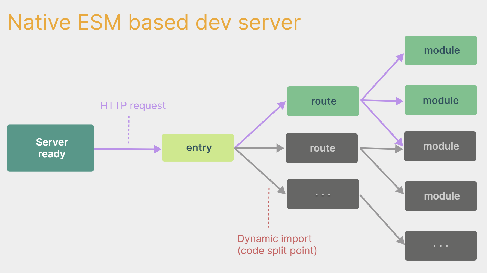
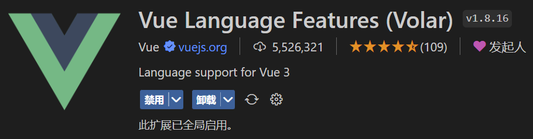

# VUE3（View）

文章参考：

[TOC]


# 简介

2020年9月18日，`Vue.js`发布版`3.0`版本，代号：`One Piece`。

经历了：[4800+次提交](https://github.com/vuejs/core/commits/main)、[40+个RFC](https://github.com/vuejs/rfcs/tree/master/active-rfcs)、[600+次PR](https://github.com/vuejs/vue-next/pulls?q=is%3Apr+is%3Amerged+-author%3Aapp%2Fdependabot-preview+)、[300+贡献者](https://github.com/vuejs/core/graphs/contributors)。官方发版地址：[Release v3.0.0 One Piece · vuejs/core](https://github.com/vuejs/core/releases/tag/v3.0.0)。截止2023年10月，最新的公开版本为：`3.3.4` 

## 性能的提升

- 打包大小减少`41%`。

- 初次渲染快`55%`, 更新渲染快`133%`。

- 内存减少`54%`。

## 源码的升级

- 使用`Proxy`代替`defineProperty`实现响应式。

- 重写虚拟`DOM`的实现和`Tree-Shaking`。


## 新的特性

1. `Composition API`（组合`API`）：
   - `setup`
   - `ref`与`reactive`
   - `computed`与`watch`
   
     ......
   
2. 新的内置组件：
   - `Fragment`
   - `Teleport`
   - `Suspense`

     ......

3. 其他改变：
   - 新的生命周期钩子
   - `data` 选项应始终被声明为一个函数
   - 移除`keyCode`支持作为` v-on` 的修饰符

     ......

## 源码典型结构

```
src/
  ├── assets/
  ├── components/
  ├── views/
  │    ├── Home.vue
  │    ├── About.vue
  │    ├── User.vue
  ├── router/
  ├── store/
  └── App.vue

```


# 创建工程

## 基于 vue-cli 创建
点击查看[官方文档](https://cli.vuejs.org/zh/guide/creating-a-project.html#vue-create)

> 备注：目前`vue-cli`已处于维护模式，官方推荐基于 `Vite` 创建项目。

```powershell
## 查看@vue/cli版本，确保@vue/cli版本在4.5.0以上
vue --version

## 安装或者升级你的@vue/cli 
npm install -g @vue/cli

## 执行创建命令
vue create vue_test

##  随后选择3.x
##  Choose a version of Vue.js that you want to start the project with (Use arrow keys)
##  > 3.x
##    2.x

## 启动
cd vue_test
npm run serve
```

---

## 基于 vite 创建
`vite` 是新一代前端构建工具，官网地址：[https://vitejs.cn](https://vitejs.cn/)，`vite`的优势如下：

- 轻量快速的热重载（`HMR`），能实现极速的服务启动。
- 对 `TypeScript`、`JSX`、`CSS` 等支持开箱即用。
- 真正的按需编译，不再等待整个应用编译完成。
- `webpack`构建 与 `vite`构建对比图如下：
	
* 具体操作如下（点击查看[官方文档](https://cn.vuejs.org/guide/quick-start.html#creating-a-vue-application)）

```powershell
## 1.创建命令
npm create vue@latest

## 2.具体配置
## 配置项目名称
√ Project name: vue3_test
## 是否添加TypeScript支持
√ Add TypeScript?  Yes
## 是否添加JSX支持
√ Add JSX Support?  No
## 是否添加路由环境
√ Add Vue Router for Single Page Application development?  No
## 是否添加pinia环境
√ Add Pinia for state management?  No
## 是否添加单元测试
√ Add Vitest for Unit Testing?  No
## 是否添加端到端测试方案
√ Add an End-to-End Testing Solution? » No
## 是否添加ESLint语法检查
√ Add ESLint for code quality?  Yes
## 是否添加Prettiert代码格式化
√ Add Prettier for code formatting?  No

## 3.安装依赖
cd vue3_test
npm install
## 4.运行
npm run dev
Local: http://localhost:5173
```
创建空项目

```vue
<!-- 删除文件 -->
src\style.css
src\components\HelloWorld.vue
<!-- 删除代码-->
main.js
import './style.css'
<!-- 修改代码 -->
src\App.vue

<script setup>
</script>

<template>
</template>

<style scoped>
</style>
```

安装官方推荐的`vscode`插件：

 

 

总结：

- `Vite` 项目中，`index.html` 是项目的入口文件，在项目最外层。
- 加载`index.html`后，`Vite` 解析 `<script type="module" src="xxx">` 指向的`JavaScript`。
- `Vue3`**中是通过 **`createApp` 函数创建一个应用实例。


## 基于 CDN 创建

### 使用全局构建版本

使用[全局构建版本的 Vue](https://cn.vuejs.org/guide/quick-start.html#using-the-global-build)，该版本的所有顶层 API 都以属性的形式暴露在了全局的 `Vue` 对象上。这里有一个使用全局构建版本的例子：

```html
<script src="https://unpkg.com/vue@3/dist/vue.global.js"></script>

<div id="app">{{ message }}</div>

<script>
  const { createApp, ref } = Vue

  createApp({
    setup() {
      const message = ref('Hello vue!')
      return {
        message
      }
    }
  }).mount('#app')
</script>
```


### 使用 ES 模块构建版本

在本文档的其余部分我们使用的主要是 [ES 模块](https://developer.mozilla.org/zh-CN/docs/Web/JavaScript/Guide/Modules)语法。现代浏览器大多都已原生支持 ES 模块。因此我们可以像这样通过 CDN 以及[原生 ES 模块使用 Vue](https://cn.vuejs.org/guide/quick-start.html#using-the-es-module-build)：

```html
<script type="importmap">
  {
    "imports": {
      "vue": "https://unpkg.com/vue@3/dist/vue.esm-browser.js"
    }
  }
</script>

<div id="app">{{ message }}</div>

<script type="module">
  import { createApp, ref } from 'vue'

  createApp({
    setup() {
      const message = ref('Hello Vue!')
      return {
        message
      }
    }
  }).mount('#app')
</script>
```

注意我们使用了 `<script type="module">`，且导入的 CDN URL 指向的是 Vue 的 **ES 模块构建版本**。

我们可以使用[导入映射表 (Import Maps)](https://caniuse.com/import-maps) 来告诉浏览器如何定位到导入的 `vue`


# Vue 应用


## 创建一个 Vue 应用

每个 Vue 应用都是通过 [`createApp`](https://cn.vuejs.org/api/application.html#createapp) 函数创建一个新的 **应用实例**：

```js
import { createApp } from 'vue'

const app = createApp({
  /* 根组件选项 */
})
```

## 挂载应用

应用实例必须在调用了 `.mount()` 方法后才会渲染出来。该方法接收一个“容器”参数，可以是一个实际的 **DOM 元素**或是一个 **CSS 选择器字符串**：

```html
<div id="app"></div>
```

```js
app.mount('#app')
```

应用根组件的内容将会被渲染在容器元素里面。容器元素自己将**不会**被视为应用的一部分。

`.mount()` 方法应该始终在整个应用配置和资源注册完成后被调用。同时请注意，不同于其他资源注册方法，它的返回值是根组件实例而非应用实例。

### DOM 中的根组件模板

根组件的模板通常是组件本身的一部分，但也可以直接通过在挂载容器内编写模板来单独提供：

```html
<div id="app">
  <button @click="count++">{{ count }}</button>
</div>
```

```js
import { createApp } from 'vue'

const app = createApp({
  data() {
    return {
      count: 0
    }
  }
})

app.mount('#app')
```

当根组件没有设置 `template` 选项时，Vue 将自动使用容器的 `innerHTML` 作为模板。

## 应用配置

应用实例会暴露一个 `.config` 对象允许我们配置一些应用级的选项，例如定义一个应用级的错误处理器，用来捕获所有子组件上的错误：

```js
app.config.errorHandler = (err) => {
  /* 处理错误 */
}
```

应用实例还提供了一些方法来注册应用范围内可用的资源，例如注册一个组件：

```js
app.component('TodoDeleteButton', TodoDeleteButton)
```

这使得 `TodoDeleteButton` 在应用的任何地方都是可用的。


# 组合式 API


## OptionsAPI 与 CompositionAPI

- `Vue2`的`API`设计是`Options`（配置）风格的。
- `Vue3`的`API`设计是`Composition`（组合）风格的。

### Options API 的弊端

`Options`类型的 `API`，数据、方法、计算属性等，是分散在：`data`、`methods`、`computed`中的，若想新增或者修改一个需求，就需要分别修改：`data`、`methods`、`computed`，不便于维护和复用。


### Composition API 的优势

可以用函数的方式，更加优雅的组织代码，让相关功能的代码更加有序的组织在一起。


> 说明：以上四张动图原创作者：大帅老猿

## setup 语法糖

### `setup()` 钩子

`setup()` 钩子是在组件中使用组合式 API 的入口，通常只在以下情况下使用：

1. 需要**在非单文件组件中**使用组合式 API 时。
2. 需要**在基于选项式 API 的组件中**集成基于组合式 API 的代码时。

> :grey_exclamation:对于结合单文件组件使用的组合式 API，推荐通过`<script setup>`以获得更加简洁及符合人体工程学的语法。

我们可以使用[响应式 API](https://cn.vuejs.org/api/reactivity-core.html) 来声明响应式的状态，在 `setup()` 函数中返回的对象会暴露给模板和组件实例。其他的选项也可以通过组件实例来获取 `setup()` 暴露的属性：

```vue
<script>
import { ref } from 'vue'

export default {
  setup() {
    const count = ref(0)

    // 返回值会暴露给模板和其他的选项式 API 钩子
    return {
      count
    }
  },

  mounted() {
    console.log(this.count) // 0
  }
}
</script>

<template>
  <button @click="count++">{{ count }}</button>
</template>
```

在模板中访问从 `setup` 返回的 [ref](https://cn.vuejs.org/api/reactivity-core.html#ref) 时，它会[自动浅层解包](https://cn.vuejs.org/guide/essentials/reactivity-fundamentals.html#deep-reactivity)，因此你无须再在模板中为它写 `.value`。当通过 `this` 访问时也会同样如此解包。

`setup()` 自身并不含对组件实例的访问权，即在 `setup()` 中访问 `this` 会是 `undefined`。你可以在选项式 API 中访问组合式 API 暴露的值，但反过来则不行。

#### 向 `setup()` 传参

##### 访问 Props

`setup` 函数的第一个参数是这个组件声明的 `props`。和标准的组件一致，一个 `setup` 函数的 `props` 是响应式的，并且会在传入新的 props 时同步更新。

```js
export default {
  props: {
    title: String
  },
  setup(props) {
    console.log(props.title)
  }
}
```

请注意如果你解构了 `props` 对象，解构出的变量将会丢失响应性。因此我们推荐通过 `props.xxx` 的形式来使用其中的 props。

##### 访问 Setup 上下文对象

传入 `setup` 函数的第二个参数是一个 **Setup 上下文**对象。它是一个包含多个方法和属性的对象，能够帮助你更灵活地操作组件的生命周期和事件。

上下文对象暴露了其他一些在 `setup` 中可能会用到的值：

```js
export default {
  setup(props, context) {
    // 透传 Attributes（非响应式的对象，等价于 $attrs）
    console.log(context.attrs)

    // 插槽（非响应式的对象，等价于 $slots）
    console.log(context.slots)

    // 触发事件（函数，等价于 $emit）
    console.log(context.emit)

    // 暴露公共属性（函数）
    console.log(context.expose)
  }
}
```

该上下文对象是非响应式的，可以安全地**解构**：

```js
export default {
  setup(props, { attrs, slots, emit, expose }) {
    ...
  }
}
```


### `<script setup>`

在 `setup()` 函数中手动暴露大量的状态和方法非常繁琐。幸运的是，我们可以通过使用[单文件组件 (SFC)](https://cn.vuejs.org/guide/scaling-up/sfc.html) 来避免这种情况。我们可以使用 `<script setup>` 来大幅度地简化代码：

```vue
<script setup>
import { ref } from 'vue'

const count = ref(0)

function increment() {
  count.value++
}
</script>

<template>
  <button @click="increment">
    {{ count }}
  </button>
</template>
```

\<script setup> 中的顶层的导入、声明的变量和函数可在同一组件的模板中直接使用。你可以理解为模板是在同一作用域内声明的一个 JavaScript 函数——它自然可以访问与它一起声明的所有内容。

> TIP: 如果你没有使用单文件组件，你仍然可以在 [`setup()`](https://cn.vuejs.org/api/composition-api-setup.html) 选项中使用组合式 API。


## 响应式数据


### 基本类型数据 ref

在组合式 API 中，推荐使用 [`ref()`](https://cn.vuejs.org/api/reactivity-core.html#ref) 函数来声明响应式状态：

`ref()` 接收参数，并将其包裹在一个带有 `.value` 属性的 ref 对象中返回：

```js
const count = ref(0)

console.log(count) // { value: 0 }
console.log(count.value) // 0

count.value++
console.log(count.value) // 1
```

> 参考：[为 refs 标注类型](https://cn.vuejs.org/guide/typescript/composition-api.html#typing-ref) 

要在组件模板中访问 ref，请从组件的 `setup()` 函数中声明并返回它们：

```js
import { ref } from 'vue'

export default {
  // `setup` 是一个特殊的钩子，专门用于组合式 API。
  setup() {
    const count = ref(0)

    // 将 ref 暴露给模板
    return {
      count
    }
  }
}
```

```html
<div>{{ count }}</div>
```

注意，在模板中使用 ref 时，我们**不需要**附加 `.value`。为了方便起见，当在模板中使用时，ref 会自动解包 (有一些[注意事项](https://cn.vuejs.org/guide/essentials/reactivity-fundamentals.html#caveat-when-unwrapping-in-templates))。

你也可以直接在事件监听器中改变一个 ref：

```html
<button @click="count++">
  {{ count }}
</button>
```

对于更复杂的逻辑，我们可以在同一作用域内声明更改 ref 的函数，并将它们作为方法与状态一起公开：

```js
import { ref } from 'vue'

export default {
  setup() {
    const count = ref(0)

    function increment() {
      // 在 JavaScript 中需要 .value
      count.value++
    }

    // 不要忘记同时暴露 increment 函数
    return {
      count,
      increment
    }
  }
}
```

然后，暴露的方法可以被用作事件监听器：

```html
<button @click="increment">
  {{ count }}
</button>
```

#### 为什么要使用 ref ?

你可能会好奇：为什么我们需要使用带有 `.value` 的 ref，而不是普通的变量？为了解释这一点，我们需要简单地讨论一下 Vue 的响应式系统是如何工作的。

当你在模板中使用了一个 ref，然后改变了这个 ref 的值时，Vue 会自动检测到这个变化，并且相应地更新 DOM。这是通过一个基于依赖追踪的响应式系统实现的。当一个组件首次渲染时，Vue 会**追踪**在渲染过程中使用的每一个 ref。然后，当一个 ref 被修改时，它会**触发**追踪它的组件的一次重新渲染。

在标准的 JavaScript 中，检测普通变量的访问或修改是行不通的。然而，我们可以通过 getter 和 setter 方法来拦截对象属性的 get 和 set 操作。

该 `.value` 属性给予了 Vue 一个机会来检测 ref 何时被访问或修改。在其内部，Vue 在它的 getter 中执行追踪，在它的 setter 中执行触发。从概念上讲，你可以将 ref 看作是一个像这样的对象：

```js
// 伪代码，不是真正的实现
const myRef = {
  _value: 0,
  get value() {
    track()
    return this._value
  },
  set value(newValue) {
    this._value = newValue
    trigger()
  }
}
```

另一个 ref 的好处是，与普通变量不同，你可以将 ref 传递给函数，同时保留对最新值和响应式连接的访问。当将复杂的逻辑重构为可重用的代码时，这将非常有用。

#### DOM 更新时机 `tick`

当你在 Vue 中更改响应式状态时，最终的 DOM 更新并不是同步生效的，而是由 Vue 将它们缓存在一个 队列中，直到下一个“tick”才一起执行。这样是为了确保每个组件无论发生多少状态改变，都仅执行一次 更新。 

`nextTick()` 可以在状态改变后立即使用，以等待 DOM 更新完成。你可以传递一个回调函数作为参 数，或者 `await` 返回的 `Promise`。

```vue
<script setup>
	import { ref, nextTick } from 'vue'
 	const count = ref(0)
 	async function increment() {
 		count.value++
 		// DOM 还未更新
		console.log(document.getElementById('counter').textContent) // 0
        await nextTick()
 		// DOM 此时已经更新
		console.log(document.getElementById('counter').textContent) // 1
 	}
 </script>

 <template>
 	<button id="counter" @click="increment">{{ count }}</button>
 </template>
```


### 响应式对象 reactive

还有另一种声明响应式状态的方式，即使用 `reactive()` API。与将内部值包装在特殊对象中的 ref 不同，`reactive()` 将使对象本身具有响应性：

```js
import { reactive } from 'vue'

const state = reactive({ count: 0 })
```

> 参考：[为 `reactive()` 标注类型](https://cn.vuejs.org/guide/typescript/composition-api.html#typing-reactive) 

在模板中使用：

```html
<button @click="state.count++">
  {{ state.count }}
</button>
```

响应式对象是 [JavaScript 代理](https://developer.mozilla.org/en-US/docs/Web/JavaScript/Reference/Global_Objects/Proxy)，其行为就和普通对象一样。不同的是，Vue 能够拦截对响应式对象所有属性的访问和修改，以便进行依赖追踪和触发更新。

`reactive()` 将深层地转换对象：当访问嵌套对象时，它们也会被 `reactive()` 包装。当 ref 的值是一个对象时，`ref()` 也会在内部调用它。与浅层 ref 类似，这里也有一个 [`shallowReactive()`](https://cn.vuejs.org/api/reactivity-advanced.html#shallowreactive) API 可以选择退出深层响应性。

#### Reactive Proxy vs. Original

值得注意的是，`reactive()` 返回的是一个原始对象的 [Proxy](https://developer.mozilla.org/en-US/docs/Web/JavaScript/Reference/Global_Objects/Proxy)，它和原始对象是不相等的：

```js
const raw = {}
const proxy = reactive(raw)

// 代理对象和原始对象不是全等的
console.log(proxy === raw) // false
```

只有代理对象是响应式的，更改原始对象不会触发更新。因此，使用 Vue 的响应式系统的最佳实践是**仅使用你声明对象的代理版本**。

为保证访问代理的一致性，对同一个原始对象调用 `reactive()` 会总是返回同样的代理对象，而对一个已存在的代理对象调用 `reactive()` 会返回其本身：

```js
// 在同一个对象上调用 reactive() 会返回相同的代理
console.log(reactive(raw) === proxy) // true

// 在一个代理上调用 reactive() 会返回它自己
console.log(reactive(proxy) === proxy) // true
```

这个规则对嵌套对象也适用。依靠深层响应性，响应式对象内的嵌套对象依然是代理：

```js
const proxy = reactive({})

const raw = {}
proxy.nested = raw

console.log(proxy.nested === raw) // false
```

#### `reactive()` 的局限性

`reactive()` API 有一些局限性：

1. **有限的值类型**：它只能用于对象类型 (对象、数组和如 `Map`、`Set` 这样的[集合类型](https://developer.mozilla.org/en-US/docs/Web/JavaScript/Reference/Global_Objects#keyed_collections))。它不能持有如 `string`、`number` 或 `boolean` 这样的[原始类型](https://developer.mozilla.org/en-US/docs/Glossary/Primitive)。

2. **不能替换整个对象**：由于 Vue 的响应式跟踪是通过属性访问实现的，因此我们必须始终保持对响应式对象的相同引用。这意味着我们不能轻易地“替换”响应式对象，因为这样的话与第一个引用的响应性连接将丢失：

    ```js
    let state = reactive({ count: 0 })
    
    // 上面的 ({ count: 0 }) 引用将不再被追踪
    // (响应性连接已丢失！)
    state = reactive({ count: 1 })
    ```

3. **对解构操作不友好**：当我们将响应式对象的原始类型属性解构为本地变量时，或者将该属性传递给函数时，我们将丢失响应性连接：

    ```js
    const state = reactive({ count: 0 })
    
    // 当解构时，count 已经与 state.count 断开连接
    let { count } = state
    // 不会影响原始的 state
    count++
    
    // 该函数接收到的是一个普通的数字
    // 并且无法追踪 state.count 的变化
    // 我们必须传入整个对象以保持响应性
    callSomeFunction(state.count)
    ```

由于这些限制，我们建议使用 `ref()` 作为声明响应式状态的主要 API。

## 方法

在组合式API，`methods` 的概念并不存在，取而代之的是使用 **函数** 来定义组件中的方法。由于组合式 API 是基于 `setup()` 函数来组织和处理组件逻辑的，因此你可以在 `setup` 中直接定义方法（即函数），并将它们暴露到模板中。

```vue
<template>
  <div>
    <h1>{{ message }}</h1>
    <button @click="increment">Increment</button>
    <p>Count: {{ count }}</p>
  </div>
</template>

<script setup>
import { ref } from 'vue'

// 定义响应式数据
const message = ref('Hello, Vue 3!')
const count = ref(0)

// 定义方法
const increment = () => {
  count.value++
}
</script>
```

## 计算属性

我们推荐使用**计算属性**来描述依赖响应式状态的复杂逻辑，这里我们使用 `setup()` 写法。

```vue
<template>
  <p>Has published books:</p>
  <span>{{ publishedBooksMessage }}</span>
</template>

<script>
import { reactive, computed } from 'vue'

export default {
  setup() {
    // 定义响应式数据
    const author = reactive({
      name: 'John Doe',
      books: [
        'Vue 2 - Advanced Guide',
        'Vue 3 - Basic Guide',
        'Vue 4 - The Mystery'
      ]
    })

    // 计算属性
    const publishedBooksMessage = computed(() => {
      return author.books.length > 0 ? 'Yes' : 'No'
    })

    // 返回数据和计算属性
    return {
      publishedBooksMessage
    }
  }
}
</script>
```

我们在这里定义了一个计算属性 `publishedBooksMessage`。`computed()` 方法期望接收一个 [getter 函数](https://developer.mozilla.org/zh-CN/docs/Web/JavaScript/Reference/Functions/get#description)，返回值为一个**计算属性 ref**。和其他一般的 ref 类似，你可以通过 `publishedBooksMessage.value` 访问计算结果。计算属性 ref 也会在模板中自动解包，因此在模板表达式中引用时无需添加 `.value`。

Vue 的计算属性会自动追踪响应式依赖。它会检测到 `publishedBooksMessage` 依赖于 `author.books`，所以当 `author.books` 改变时，任何依赖于 `publishedBooksMessage` 的绑定都会同时更新。

### 可写计算属性 set()

计算属性默认是只读的。当你尝试修改一个计算属性时，你会收到一个运行时警告。只在某些特殊场景中你可能才需要用到“可写”的属性，你可以通过同时提供 getter 和 setter 来创建：

```vue
<script setup>
import { ref, computed } from 'vue'

const firstName = ref('John')
const lastName = ref('Doe')

const fullName = computed({
  // getter
  get() {
    return firstName.value + ' ' + lastName.value
  },
  // setter
  set(newValue) {
    // 注意：我们这里使用的是解构赋值语法
    [firstName.value, lastName.value] = newValue.split(' ')
  }
})
</script>
```

现在当你再运行 `fullName.value = 'John Doe'` 时，setter 会被调用而 `firstName` 和 `lastName` 会随之更新。

### 计算属性缓存 vs 方法

若我们将同样的函数定义为一个方法而不是计算属性，两种方式在结果上确实是完全相同的，然而，不同之处在于**计算属性值会基于其响应式依赖被缓存**。

也就是说，只要计算属性的依赖不改变，无论多少次访问都会立即返回先前的计算结果。而方法每次调用都会重新执行一遍。

### 最佳实践

#### Getter 不应有副作用

计算属性的 getter 应只做计算而没有任何其他的副作用，这一点非常重要，请务必牢记。举例来说，**不要改变其他状态、在 getter 中做异步请求或者更改 DOM**！一个计算属性的声明中描述的是如何根据其他值派生一个值。因此 getter 的职责应该仅为计算和返回该值。在之后的指引中我们会讨论如何使用[侦听器](https://cn.vuejs.org/guide/essentials/watchers.html)根据其他响应式状态的变更来创建副作用。

#### 避免直接修改计算属性值

从计算属性返回的值是派生状态。可以把它看作是一个“临时快照”，每当源状态发生变化时，就会创建一个新的快照。更改快照是没有意义的，因此计算属性的返回值应该被视为只读的，并且永远不应该被更改——应该更新它所依赖的源状态以触发新的计算。


## 侦听器

计算属性允许我们声明性地计算衍生值。然而在有些情况下，我们需要在状态变化时执行一些“副作用”：例如更改 DOM，或是根据异步操作的结果去修改另一处的状态。

在组合式 API 中，我们可以使用 [`watch` 函数](https://cn.vuejs.org/api/reactivity-core.html#watch)在每次响应式状态发生变化时触发回调函数：

```vue
<script setup>
import { ref, watch } from 'vue'

const question = ref('')
const answer = ref('Questions usually contain a question mark. ;-)')
const loading = ref(false)

// 可以直接侦听一个 ref
watch(question, async (newQuestion, oldQuestion) => {
  if (newQuestion.includes('?')) {
    loading.value = true
    answer.value = 'Thinking...'
    try {
      const res = await fetch('https://yesno.wtf/api')
      answer.value = (await res.json()).answer
    } catch (error) {
      answer.value = 'Error! Could not reach the API. ' + error
    } finally {
      loading.value = false
    }
  }
})
</script>

<template>
  <p>
    Ask a yes/no question:
    <input v-model="question" :disabled="loading" />
  </p>
  <p>{{ answer }}</p>
</template>
```

> **`async`**：表示该函数是异步函数，它允许在函数内部使用 `await` 关键字。

### 侦听数据源类型

`watch` 的第一个参数可以是不同形式的“数据源”：它可以是一个 ref (包括计算属性)、一个响应式对象、一个 [getter 函数](https://developer.mozilla.org/zh-CN/docs/Web/JavaScript/Reference/Functions/get#description)、或多个数据源组成的数组：

```js
const x = ref(0)
const y = ref(0)

// 单个 ref (默认是新值)
watch(x, (newX) => {
  console.log(`x is ${newX}`)
})

watch(x, (newX, oldX) => {
  console.log(`newX is ${newX}; oldX is ${oldX}`)
})

// getter 函数
watch(
  () => x.value + y.value,
  (sum) => {
    console.log(`sum of x + y is: ${sum}`)
  }
)

// 多个来源组成的数组
watch([x, () => y.value], ([newX, newY]) => {
  console.log(`x is ${newX} and y is ${newY}`)
})
```

注意，你不能直接侦听**响应式对象的属性值**，而是用一个返回该属性的 getter 函数，例如:

```js
const obj = reactive({ count: 0 })

// 错误，因为 watch() 得到的参数是一个 number
watch(obj.count, (count) => {
  console.log(`Count is: ${count}`)
})

// 正确，提供一个 getter 函数
watch(
  () => obj.count,
  (count) => {
    console.log(`Count is: ${count}`)
  }
)
```

### 深层侦听器

直接给 `watch()` 传入一个响应式对象，会隐式地创建一个深层侦听器——该回调函数在所有嵌套的变更时都会被触发：

```js
const obj = reactive({ count: 0 })

watch(obj, (newValue, oldValue) => {
  // 在嵌套的属性变更时触发
  // 注意：`newValue` 此处和 `oldValue` 是相等的
  // 因为它们是同一个对象！
})

obj.count++
```

相比之下，一个返回响应式对象的 getter 函数，只有在返回不同的对象时，才会触发回调：

```js
watch(
  () => state.someObject,
  () => {
    // 仅当 state.someObject 被替换时触发
  }
)
```

你也可以给上面这个例子显式地加上 `deep` 选项，强制转成深层侦听器：

```js
watch(
  () => state.someObject,
  (newValue, oldValue) => {
    // 注意：`newValue` 此处和 `oldValue` 是相等的
    // *除非* state.someObject 被整个替换了
  },
  { deep: true }
)
```

在 Vue 3.5+ 中，`deep` 选项还可以是一个数字，表示最大遍历深度——即 Vue 应该遍历对象嵌套属性的级数。

### `watchEffect`

我们可以用 [`watchEffect` 函数](https://cn.vuejs.org/api/reactivity-core.html#watcheffect) 来简化`watch`的代码。`watchEffect()` 允许我们自动跟踪回调的响应式依赖。

```js
const todoId = ref(1)
const data = ref(null)

watch(
  todoId,
  async () => {
    const response = await fetch(
      `https://jsonplaceholder.typicode.com/todos/${todoId.value}`
    )
    data.value = await response.json()
  },
  { immediate: true }
)
```

也就是说，`watch` 只追踪明确侦听的数据源；`watchEffect`不用明确指出监视的数据（函数中用到哪些属性，那就监视哪些属性）。

```js
watchEffect(async () => {
  const response = await fetch(
    `https://jsonplaceholder.typicode.com/todos/${todoId.value}`
  )
  data.value = await response.json()
})
```


## 生命周期钩子

`Vue`组件实例在创建时要经历一系列的初始化步骤，在此过程中`Vue`会在合适的时机，调用特定的函数，从而让开发者有机会在特定阶段运行自己的代码，这些特定的函数统称为：生命周期钩子

* 规律：

  > 生命周期整体分为四个阶段，分别是：**创建、挂载、更新、销毁**，每个阶段都有两个钩子，一前一后。

* `Vue2`的生命周期

  > 创建阶段：`beforeCreate`、`created`
  >
  > 挂载阶段：`beforeMount`、`mounted`
  >
  > 更新阶段：`beforeUpdate`、`updated`
  >
  > 销毁阶段：`beforeDestroy`、`destroyed`

* `Vue3`的生命周期

  > 创建阶段：`setup`
  >
  > 挂载阶段：`onBeforeMount`、`onMounted`
  >
  > 更新阶段：`onBeforeUpdate`、`onUpdated`
  >
  > 卸载阶段：`onBeforeUnmount`、`onUnmounted`

```vue
<template>
  <div class="person">
    <h2>当前求和为：{{ sum }}</h2>
    <button @click="changeSum">点我sum+1</button>
  </div>
</template>

<!-- vue3写法 -->
<script lang="ts" setup name="Person">
  import { 
    ref, 
    onBeforeMount, 
    onMounted, 
    onBeforeUpdate, 
    onUpdated, 
    onBeforeUnmount, 
    onUnmounted 
  } from 'vue'

  // 数据
  let sum = ref(0)
  // 方法
  function changeSum() {
    sum.value += 1
  }
  console.log('setup')
  // 生命周期钩子
  onBeforeMount(()=>{
    console.log('挂载之前')
  })
  onMounted(()=>{
    console.log('挂载完毕')
  })
  onBeforeUpdate(()=>{
    console.log('更新之前')
  })
  onUpdated(()=>{
    console.log('更新完毕')
  })
  onBeforeUnmount(()=>{
    console.log('卸载之前')
  })
  onUnmounted(()=>{
    console.log('卸载完毕')
  })
</script>
```

> 最常用的生命周期钩子函数有
>
> **`setup`**：Vue 3 的核心，初始化数据、计算属性、方法和侦听器。
>
> **`onMounted`**：常用的挂载钩子，组件挂载后执行一些操作（如获取数据、初始化外部库等）。
>
> **`onUpdated`**：当组件更新后，执行一些 DOM 操作。
>
> **`onUnmounted`**：组件卸载时，清理定时器、事件监听器等资源。


## 组合式 API + 选项式 API 结合使用

你也可以在同一个组件中同时使用选项式 API 和组合式 API：

```js
import { ref, onMounted } from 'vue';

export default {
  data() {
    return {
      message: 'Hello from data!'
    };
  },
  // 这里setup()可以看作钩子
  setup() {
    const count = ref(0);

    onMounted(() => {
      console.log('Component mounted using Composition API');
    });

    return {
      count
    };
  }
};
```


# 组件

**`Vue3`组件通信和`Vue2`的区别：**

* 移出事件总线，使用`mitt`代替。

- `vuex`换成了`pinia`。
- 把`.sync`优化到了`v-model`里面了。
- 把`$listeners`所有的东西，合并到`$attrs`中了。
- `$children`被砍掉了。

**常见搭配形式：**

 


## Props

`props`是使用频率最高的一种通信方式。在 Vue 中，`prop` 的中文意思是 **"属性"** 或 **"传入的属性"**。它用于父组件向子组件传递数据。

### Props 声明

一个组件需要显式声明它所接受的 props，这样 Vue 才能知道外部传入的哪些是 props，哪些是透传 attribute (关于透传 attribute，我们会在[专门的章节](https://cn.vuejs.org/guide/components/attrs.html)中讨论)。

在使用 `<script setup>` 的单文件组件中，props 可以使用 `defineProps()` 宏来声明：

```vue
<script setup>
const props = defineProps(['foo'])

console.log(props.foo)
</script>
```

在没有使用 `<script setup>` 的组件中，props 可以使用 [`props`](https://cn.vuejs.org/api/options-state.html#props) 选项来声明：

```js
export default {
  props: ['foo'],
  setup(props) {
    // setup() 接收 props 作为第一个参数
    console.log(props.foo)
  }
}
```

注意传递给 `defineProps()` 的参数和提供给 `props` 选项的值是相同的，两种声明方式背后其实使用的都是 props 选项。

除了使用**字符串数组**来声明 props 外，还可以使用**对象**的形式：

```js
// 使用 <script setup>
defineProps({
  title: String,
  likes: Number
})
```

```js
// 非 <script setup>
export default {
  props: {
    title: String,
    likes: Number
  }
}
```

对于以对象形式声明的每个属性，key 是 prop 的名称，而值则是该 prop 预期类型的构造函数。比如，如果要求一个 prop 的值是 `number` 类型，则可使用 `Number` 构造函数作为其声明的值。

### 传递细节

#### Boolean

```vue
 <!-- 仅写上 prop 但不传值，会隐式转换为 `true` -->
 <BlogPost is-published />
 <!-- 虽然 `false` 是静态的值，我们还是需要使用 v-bind -->
 <!-- 因为这是一个 JavaScript 表达式而不是一个字符串 -->
 <BlogPost :is-published="false" />
```

#### Object

如果你想要将一个对象的所有属性都当作 props 传入，你可以使用没有参数的 v-bind.

```js
 const post = {
 	id: 1,
 	title: 'My Journey with Vue'
 }
```

```vue
<BlogPost v-bind="post" />
<!-- 等价于 -->
<BlogPost :id="post.id" :title="post.title" />
```

### Props 校验

Vue 组件可以更细致地声明对传入的 props 的校验要求。比如我们上面已经看到过的类型声明，如果传入的值不满足类型要求，Vue 会在浏览器控制台中抛出警告来提醒使用者。这在开发给其他开发者使用的组件时非常有用。

要声明对 props 的校验，你可以向 `defineProps()` 宏提供一个带有 props 校验选项的对象，例如：

```js
defineProps({
  // 基础类型检查
  // （给出 `null` 和 `undefined` 值则会跳过任何类型检查）
  propA: Number,
  // 多种可能的类型
  propB: [String, Number],
  // 必传，且为 String 类型
  propC: {
    type: String,
    required: true
  },
  // 必传但可为 null 的字符串
  propD: {
    type: [String, null],
    required: true
  },
  // Number 类型的默认值
  propE: {
    type: Number,
    default: 100
  },
  // 对象类型的默认值
  propF: {
    type: Object,
    // 对象或数组的默认值
    // 必须从一个工厂函数返回。
    // 该函数接收组件所接收到的原始 prop 作为参数。
    default(rawProps) {
      return { message: 'hello' }
    }
  },
  // 自定义类型校验函数
  // 在 3.4+ 中完整的 props 作为第二个参数传入
  propG: {
    validator(value, props) {
      // The value must match one of these strings
      return ['success', 'warning', 'danger'].includes(value)
    }
  },
  // 函数类型的默认值
  propH: {
    type: Function,
    // 不像对象或数组的默认，这不是一个
    // 工厂函数。这会是一个用来作为默认值的函数
    default() {
      return 'Default function'
    }
  }
})
```

一些补充细节：

- 所有 prop 默认都是可选的，除非声明了 `required: true`。
- 除 `Boolean` 外的未传递的可选 prop 将会有一个默认值 `undefined`。
- `Boolean` 类型的未传递 prop 将被转换为 `false`。这可以通过为它设置 `default` 来更改——例如：设置为 `default: undefined` 将与非布尔类型的 prop 的行为保持一致。
- 如果声明了 `default` 值，那么在 prop 的值被解析为 `undefined` 时，无论 prop 是未被传递还是显式指明的 `undefined`，都会改为 `default` 值。

当 prop 的校验失败后，Vue 会抛出一个控制台警告 (在开发模式下)。

#### 运行时类型检查

校验选项中的 `type` 可以是下列这些原生构造函数：

- `String`
- `Number`
- `Boolean`
- `Array`
- `Object`
- `Date`
- `Function`
- `Symbol`
- `Error`

另外，`type` 也可以是自定义的类或构造函数，Vue 将会通过 `instanceof` 来检查类型是否匹配。例如下面这个类：

```js
class Person {
  constructor(firstName, lastName) {
    this.firstName = firstName
    this.lastName = lastName
  }
}
```

你可以将其作为一个 prop 的类型：

```js
defineProps({
  author: Person
})
```

Vue 会通过 `instanceof Person` 来校验 `author` prop 的值是否是 `Person` 类的一个实例。


## 透传 Attributes

“透传 attribute”指的是传递给一个组件，却没有被该组件声明为 [props](https://cn.vuejs.org/guide/components/props.html) 或 [emits](https://cn.vuejs.org/guide/components/events.html#defining-custom-events) 的 attribute 或者 `v-on` 事件监听器。最常见的例子就是 `class`、`style` 和 `id`。

### `class` 和 `style` 的合并

当一个组件以单个元素为根作渲染时，透传的 attribute 会自动被添加到根元素上。举例来说，假如我们有一个 `<MyButton>` 组件，它的模板长这样：

```html
<!-- <MyButton> 的模板 -->
<button class="btn">Click Me</button>
```

一个父组件使用了这个组件，并且传入了 `class`：

```html
<MyButton class="large" />
```

最后渲染出的 DOM 结果是：

```html
<button class="btn large">Click Me</button>
```

这里，`<MyButton>` 并没有将 `class` 声明为一个它所接受的 prop，所以 `class` 被视作透传 attribute，自动透传到了 `<MyButton>` 的根元素上。

### `v-on` 监听器继承

同样的规则也适用于 `v-on` 事件监听器：

```html
<MyButton @click="onClick" />
```

`click` 监听器会被添加到 `<MyButton>` 的根元素，即那个原生的 `<button>` 元素之上。当原生的 `<button>` 被点击，会触发父组件的 `onClick` 方法。同样的，如果原生 `button` 元素自身也通过 `v-on` 绑定了一个事件监听器，则这个监听器和从父组件继承的监听器都会被触发。


## 自定义事件

在 Vue 中，`emit` 的中文意思是 **"触发"** 或 **"发射"**。具体来说，`emit` 是用来把子组件中触发事件传递给父组件，通常用于子组件向父组件传递信息或请求操作。

在组件的模板表达式中，可以直接使用 `$emit` 方法触发**自定义事件**。

```vue
<!-- MyComponent -->
<button @click="$emit('someEvent')">Click Me</button>
```

父组件可以通过 `v-on` (缩写为 `@`) 来监听事件：

```vue
<MyComponent @some-event="callback" />
```

像组件与 prop 一样，事件的名字也提供了自动的格式转换。注意这里我们触发了一个以 camelCase 形式命名的事件，但在父组件中可以使用 kebab-case 形式来监听。与 [prop 大小写格式](https://cn.vuejs.org/guide/components/props.html#prop-name-casing)一样，在模板中我们也推荐使用 kebab-case 形式来编写监听器。

### 事件参数

有时候我们会需要在触发事件时附带一个特定的值。举例来说，我们想要 `<BlogPost>` 组件来管理文本会缩放得多大。在这个场景下，我们可以给 `$emit` 提供一个额外的参数：

```vue
<button @click="$emit('increaseBy', 1)">
  Increase by 1
</button>
```

然后我们在父组件中监听事件，我们可以先简单写一个内联的箭头函数作为监听器，此函数会接收到事件附带的参数：

```vue
<MyButton @increase-by="(n) => count += n" />
```

或者，也可以用一个组件方法来作为事件处理函数：

```vue
<MyButton @increase-by="increaseCount" />
```

该方法也会接收到事件所传递的参数：

```js
function increaseCount(n) {
  count.value += n
}
```

### 声明事件

组件可以显式地通过 [`defineEmits()`](https://cn.vuejs.org/api/sfc-script-setup.html#defineprops-defineemits) 宏来声明它要触发的事件：

```vue
<script setup>
defineEmits(['inFocus', 'submit'])
</script>
```

我们还可以在`<script setup>`里面使用自定义事件，但不是使用 `$emit` 方法。`defineEmits()` 会返回一个相同作用的函数供我们使用：

```vue
<script setup>
const emit = defineEmits(['inFocus', 'submit'])

function buttonClick() {
  emit('submit')
}
</script>
```

如果你显式地使用了 `setup` 函数而不是 `<script setup>`，则事件需要通过 [`emits`](https://cn.vuejs.org/api/options-state.html#emits) 选项来定义，`emit` 函数也被暴露在 `setup()` 的上下文对象上：

```js
export default {
  emits: ['inFocus', 'submit'],
  setup(props, ctx) {
    ctx.emit('submit')
  }
}
```


## 组件 `v-model`

`v-model` 可以在组件上使用以实现双向绑定。

从 Vue 3.4 开始，推荐的实现方式是使用 [`defineModel()`](https://cn.vuejs.org/api/sfc-script-setup.html#definemodel) 宏：

```vue
<!-- Child.vue -->
<template>
  <div>Parent bound v-model is: {{ model }}</div>
  <button @click="update">Increment</button>
</template>

<script setup>
const model = defineModel()

function update() {
  model.value++
}
</script>
```

父组件可以用 `v-model` 绑定一个值：

```vue
<!-- Parent.vue -->
<Child v-model="countModel" />
```

`defineModel()` 返回的值是一个 **`ref`**。它可以像其他 `ref` 一样被访问以及修改，不过它能起到在父组件和当前变量之间的双向绑定的作用：

- 它的 `.value` 和父组件的 `v-model` 的值同步；
- 当它被子组件变更了，会触发父组件绑定的值一起更新。

### 底层机制

`defineModel` 是一个便利宏。编译器将其展开为以下内容：

- 一个名为 `modelValue` 的 prop，本地 ref 的值与其同步；
- 一个名为 `update:modelValue` 的事件，当本地 ref 的值发生变更时触发。

在 3.4 版本之前，你一般会按照如下的方式来实现上述相同的子组件：

```vue
<!-- Child.vue -->
<script setup>
const props = defineProps(['modelValue'])
const emit = defineEmits(['updateModelValue'])
</script>

<template>
  <input
    :value="props.modelValue"
    @input="emit('updateModelValue', $event.target.value)"
  />
</template>
```

然后，父组件中的 `v-model="foo"` 将被编译为：

```vue
<!-- Parent.vue -->
<Child
  :modelValue="foo"
  @update:modelValue="$event => (foo = $event)"
/>
```

如你所见，这显得冗长得多。然而，这样写有助于理解其底层机制。

###  `defineModel` 的 Prop 选项

因为 `defineModel` 声明了一个 prop，你可以通过给 `defineModel` 传递选项，来声明底层 prop 的选项：

```js
// 使 v-model 必填
const model = defineModel({ required: true })

// 提供一个默认值
const model = defineModel({ default: 0 })
```

如果需要额外的 prop 选项，应该在 model 名称之后传递：

```js
const title = defineModel('title', { required: true })
```

### `v-model` 的参数

组件上的 `v-model` 也可以接受一个参数：

```vue
<MyComponent v-model:title="bookTitle" />
```

在子组件中，我们可以通过将字符串作为第一个参数传递给 `defineModel()` 来支持相应的参数：

```vue
<!-- MyComponent.vue -->
<script setup>
const title = defineModel('title')
</script>

<template>
  <input type="text" v-model="title" />
</template>
```

我们还可以在单个组件实例上创建**多个 `v-model`** 双向绑定。

组件上的每一个 `v-model` 都会同步不同的 prop，而无需额外的选项：

```vue
<UserName
  v-model:first-name="first"
  v-model:last-name="last"
/>
```

```vue
<script setup>
const firstName = defineModel('firstName')
const lastName = defineModel('lastName')
</script>

<template>
  <input type="text" v-model="firstName" />
  <input type="text" v-model="lastName" />
</template>
```


## 插槽

在之前的章节中，我们已经了解到组件能够接收任意类型的 JavaScript 值作为 props，但组件要如何接收模板内容呢？在某些场景中，我们可能想要为子组件传递一些模板片段，让子组件在它们的组件中渲染这些片段。

举例来说，这里有一个 `<FancyButton>` 组件，可以像这样使用：

```vue
<FancyButton>
  Click me! <!-- 插槽内容 -->
</FancyButton>
```

而 `<FancyButton>` 的模板是这样的：

```vue
<button class="fancy-btn">
  <slot></slot> <!-- 插槽出口 -->
</button>
```

`<slot>` 元素是一个**插槽出口** (slot outlet)，标示了父元素提供的**插槽内容** (slot content) 将在哪里被渲染。


### 默认内容

如果我们想在父组件没有提供任何插槽内容时在 `<button>` 内渲染“Submit”，只需要将“Submit”写在 `<slot>` 标签之间来作为默认内容：

```vue
<button type="submit">
  <slot>
    Submit <!-- 默认内容 -->
  </slot>
</button>
```

但如果我们提供了插槽内容，那么被显式提供的内容会**取代**默认内容。

### 具名插槽

```vue
<div class="container">
  <header>
    <slot name="header"></slot>
  </header>
  <main>
    <slot></slot>
  </main>
  <footer>
    <slot name="footer"></slot>
  </footer>
</div>
```

这类带 `name` 的插槽被称为具名插槽 (named slots)。没有提供 `name` 的 `<slot>` 出口会隐式地命名为“default”。

```vue
<BaseLayout>
  <template v-slot:header>
    <!-- header 插槽的内容放这里 -->
  </template>
</BaseLayout>
```

`v-slot` 有对应的简写 `#`，因此 `<template v-slot:header>` 可以简写为 `<template #header>`。其意思就是“将这部分模板片段传入子组件的 header 插槽中”。


### 条件插槽

有时你需要根据内容是否被传入了插槽来渲染某些内容。

你可以结合使用 [$slots](https://cn.vuejs.org/api/component-instance.html#slots) 属性与 [v-if](https://cn.vuejs.org/guide/essentials/conditional.html#v-if) 来实现。

在下面的示例中，我们定义了一个卡片组件，它拥有三个条件插槽：`header`、`footer` 和 `default`。 当 header、footer 或 default 的内容存在时，我们希望包装它以提供额外的样式：

```vue
<template>
  <div class="card">
    <div v-if="$slots.header" class="card-header">
      <h1>header</h1>
      <slot name="header" />
    </div>
    
    <div v-if="$slots.default" class="card-content">
      <slot />
    </div>
    
    <div v-if="$slots.footer" class="card-footer">
      <slot name="footer" />
    </div>
  </div>
</template>
```

### 作用域插槽

#### 渲染作用域

插槽内容可以访问到父组件的数据作用域，因为插槽内容本身是在父组件模板中定义的。举例来说：

```vue
<span>{{ message }}</span>
<!-- 无法访问message -->
<FancyButton>{{ message }}</FancyButton>
```

这里的两个 `{{ message }}` 插值表达式渲染的内容都是一样的。

插槽内容**无法访问**子组件的数据。Vue 模板中的表达式只能访问其定义时所处的作用域，这和 JavaScript 的词法作用域规则是一致的。换言之：

> 父组件模板中的表达式只能访问父组件的作用域；子组件模板中的表达式只能访问子组件的作用域。

#### 插槽 Props

在上面的[渲染作用域](https://cn.vuejs.org/guide/components/slots#render-scope)中我们讨论到，插槽的内容无法访问到子组件的状态。

然而在某些场景下插槽的内容可能想要同时使用父组件域内和子组件域内的数据。要做到这一点，我们需要一种方法来让子组件在渲染时将一部分数据提供给插槽。

这就是**插槽 Props**。它可以像对组件传递 props 那样，向一个插槽的出口上传递 attributes：

```vue
<!-- <MyComponent> 的模板 -->
<div>
  <slot :text="greetingMessage" :count="1"></slot>
</div>
```

这是**默认插槽**接受 props。通过子组件标签上的 `v-slot` 指令（`v-slot`命名随意），直接接收到了一个插槽 props 对象：

```vue
<MyComponent v-slot="slotProps">
  {{ slotProps.text }} {{ slotProps.count }}
</MyComponent>
```


若是**具名插槽**，`v-slot` 指令就必须绑定对应插槽的`name`属性

#### 在 `v-slot` 中使用解构

`v-slot="slotProps"` 可以类比这里的函数签名，和函数的参数类似，我们也可以在 `v-slot` 中使用解构：

```vue
<MyComponent v-slot="{ text, count }">
  {{ text }} {{ count }}
</MyComponent>
```


## 依赖注入

为了避免 **Prop 逐级透传问题**，实现**祖孙组件**直接通信。一个父组件相对于其所有的后代组件，会作为**依赖提供者**。任何后代的组件树，无论层级有多深，都可以**注入**由父组件提供给整条链路的依赖。


### 提供 `provide()`

要为组件后代提供数据，需要使用到 [`provide()`](https://cn.vuejs.org/api/composition-api-dependency-injection.html#provide) 函数：

```vue
<script setup>
import { provide } from 'vue'

provide(/* 注入名 */ 'message', /* 值 */ 'hello!')
</script>
```

如果不使用 `<script setup>`，请确保 `provide()` 是在 `setup()` 同步调用的：

```js
import { provide } from 'vue'

export default {
  setup() {
    provide(/* 注入名 */ 'message', /* 值 */ 'hello!')
  }
}
```

`provide()` 函数接收两个参数。第一个参数被称为**注入名**，可以是一个字符串或是一个 `Symbol`。后代组件会用注入名来查找期望注入的值。一个组件可以多次调用 `provide()`，使用不同的注入名，注入不同的依赖值。

第二个参数是提供的值，值可以是任意类型，包括响应式的状态，比如一个 ref：

```js
import { ref, provide } from 'vue'

const count = ref(0)
provide('key', count)
```

提供的响应式状态使后代组件可以由此和提供者建立响应式的联系。

#### 应用层 Provide

除了在一个组件中提供依赖，我们还可以在整个应用层面提供依赖：

```js
import { createApp } from 'vue'

const app = createApp({})

app.provide(/* 注入名 */ 'message', /* 值 */ 'hello!')
```

在应用级别提供的数据在该应用内的所有组件中都可以注入。

### 注入 `inject()`

要注入上层组件提供的数据，需使用 [`inject()`](https://cn.vuejs.org/api/composition-api-dependency-injection.html#inject) 函数：

```vue
<script setup>
import { inject } from 'vue'

const message = inject('message')
</script>
```

如果提供的值是一个 ref，注入进来的会是该 ref 对象，而**不会**自动解包为其内部的值。这使得注入方组件能够通过 ref 对象保持了和供给方的响应性链接。

同样的，如果没有使用 `<script setup>`，`inject()` 需要在 `setup()` 内同步调用：

```js
import { inject } from 'vue'

export default {
  setup() {
    const message = inject('message')
    return { message }
  }
}
```

#### 注入默认值

如果在注入一个值时不要求必须有提供者，那么我们应该声明一个默认值，和 props 类似：

```js
// 如果没有祖先组件提供 "message"
// `value` 会是 "这是默认值"
const value = inject('message', '这是默认值')
```

在一些场景中，默认值可能需要通过调用一个函数或初始化一个类来取得。为了避免在用不到默认值的情况下进行不必要的计算或产生副作用，我们可以使用工厂函数来创建默认值：

```js
const value = inject('key', () => new ExpensiveClass(), true)
```

第三个参数表示默认值应该被当作一个**工厂函数**。


# vue-router

## 简介

 

Vue Router 是 Vue 官方的客户端路由解决方案。

客户端路由的作用是在单页应用 (SPA) 中将浏览器的 URL 和用户看到的内容绑定起来。当用户在应用中浏览不同页面时，URL 会随之更新，但页面不需要从服务器重新加载。

Vue Router 基于 Vue 的组件系统构建，你可以通过配置**路由**来告诉 Vue Router 为每个 URL 路径显示哪些组件。


**典型结构**：

```
src/
  ├── assets/
  ├── components/
  ├── views/
  │    ├── Home.vue
  │    ├── About.vue
  │    ├── User.vue
  ├── router/
  ├── store/
  ├── main.js
  └── App.vue
```


## 配置路径别名@，VSCode路径提示

1. 在`vite.config.js`里配置

   ```js
   // 原vite.config.js
   import { defineConfig } from 'vite'
   import vue from '@vitejs/plugin-vue'
   import vueDevTools from 'vite-plugin-vue-devtools'
   
   // https://vite.dev/config/
   export default defineConfig({
     plugins: [
       vue(),
       vueDevTools(),
     ],
   })
   ```

   ```js
   // vite.config.js
   import { fileURLToPath, URL } from 'node:url' // 导入node.js里的路径模块
   
   import { defineConfig } from 'vite'
   import vue from '@vitejs/plugin-vue'
   import vueDevTools from 'vite-plugin-vue-devtools'
   
   // https://vite.dev/config/
   export default defineConfig({
     plugins: [
       vue(),
       vueDevTools(),
     ],
     resolve: {
       alias: {  // 配置路径别名
         '@': fileURLToPath(new URL('./src', import.meta.url))
       },
     },
   })
   
   ```

2. 在`jsconfig.json`里配置

   ```json
   {
     "compilerOptions": { // 配置编译选项中的paths
       "paths": {
         "@/*": ["./src/*"]
       }
     },
     "exclude": ["node_modules", "dist"]
   }
   
   ```

   

## 安装并设置路由

1. 对于一个现有的使用 JavaScript 包管理器的项目，你可以从 npm registry 中安装 Vue Router

   ```bash
   npm install vue-router@4
   ```

2. 在`src`文件夹下建立`views`目录

   `views` 目录通常用于存放**页面级别**的组件

3. 在`src`文件夹下建立`router/index.js`，并**创建路由器实例**

   ```js
   // index.js
   import { createRouter, createWebHistory } from "vue-router";
   
   const routes = [
       {
           path:"/",
           component: () => import("@/views/index.vue")
       }
   ]
   
   const router = createRouter({
       history: createWebHistory(),
       routes,
   })
   
   export default router
   ```

   这里的 `routes` 选项定义了一组路由，把 URL 路径映射到组件。其中，由 `component` 参数指定的组件就是先前在 `App.vue` 中被 `<RouterView>` 渲染的组件。这些路由组件通常被称为*视图*，但本质上它们只是普通的 Vue 组件。

4. 在`main.js`导入`router`，并**注册路由器插件**

   ```js
   // main.js
   import { createApp } from 'vue'
   import App from './App.vue'
   import router from "./router"
   
   const app = createApp(App)
   app.use(router)
   app.mount('#app')
   ```

5. 在App.vue中插入<RouterView />标签

   ```vue
   <script setup>
   </script>
   
   <template>
     <main>
       <RouterView />
     </main>
   </template>
   
   <style scoped>
   </style>
   ```
   
   在这个 `template` 中使用了两个由 Vue Router 提供的组件: `RouterLink` 和 `RouterView`。
   
   

### RouterLink

不同于常规的 `<a>` 标签，我们使用组件 `RouterLink` 来创建链接。这使得 Vue Router 能够在不重新加载页面的情况下改变 URL，处理 URL 的生成、编码和其他功能。我们将会在之后的部分深入了解 `RouterLink` 组件。

**to的两种写法**

```vue
<!-- 第一种：to的字符串写法 -->
<router-link active-class="active" to="/home">主页</router-link>

<!-- 第二种：to的对象写法 -->
<router-link active-class="active" :to="{path:'/home'}">Home</router-link>
```


### RouterView

`RouterView` 组件可以使 Vue Router 知道你想要在哪里渲染当前 URL 路径对应的**路由组件**。它不一定要在 `App.vue` 中，**你可以把它放在任何地方，但它需要在某处被导入**，否则 Vue Router 就不会渲染任何东西。


## 路由器不同的历史模式history

### HTML5 模式

> 优点：`URL`更加美观，不带有`#`，更接近传统的网站`URL`。
>
> 缺点：后期项目上线，需要服务端配合处理路径问题，否则刷新会有`404`错误。
>
> ```js
> import { createRouter, createWebHistory } from 'vue-router'
> 
> const router = createRouter({
>   history: createWebHistory(),
>   routes: [
>     //...
>   ],
> })
> ```

### Hash 模式

> 优点：兼容性更好，因为不需要服务器端处理路径。
>
> 缺点：`URL`带有`#`不太美观，且在`SEO`优化方面相对较差。
>
> ```js
> import { createRouter, createWebHashHistory } from 'vue-router'
> 
> const router = createRouter({
>   history: createWebHashHistory(),
>   routes: [
>     //...
>   ],
> })
> ```

### Memory 模式

> Memory 模式不会假定自己处于浏览器环境，因此不会与 URL 交互**也不会自动触发初始导航**。这使得它非常适合 Node 环境和 SSR。它是用 `createMemoryHistory()` 创建的，并且**需要你在调用 `app.use(router)` 之后手动 push 到初始导航**。
>
> ```js
> import { createRouter, createMemoryHistory } from 'vue-router'
> const router = createRouter({
>   history: createMemoryHistory(),
>   routes: [
>     //...
>   ],
> })
> ```
>
> 虽然不推荐，你仍可以在浏览器应用程序中使用此模式，但请注意**它不会有历史记录**，这意味着你无法*后退*或*前进*。


## 访问路由器和当前路由

### [`router` 和 `route`](https://router.vuejs.org/zh/guide/#router-和-route)

在本教程中，我们常常以 `router` 作为路由器实例提及。即由 `createRouter()` 返回的对象。在应用中，访问该对象的方式取决于上下文。例如，在组合式 API 中，它可以通过调用 `useRouter()` 来访问。在选项式 API 中，它可以通过 `this.$router` 来访问。

类似地，当前路由会以 `route` 被提及。基于不同 API 风格的组件，它可以通过 `useRoute()` 或 `this.$route` 来访问。

### 组合式API

```vue
<script setup>
import { computed } from 'vue'
import { useRoute, useRouter } from 'vue-router'

const router = useRouter()
const route = useRoute()

const search = computed({
  get() {
    return route.query.search ?? ''
  },
  set(search) {
    router.replace({ query: { search } })
  }
})
</script>
```

### 选项式API

```js
export default {
  methods: {
    goToAbout() {
      this.$router.push('/about')
    },
  },
}
```


## vue-router 组件

### [`RouterView` 和 `RouterLink`](https://router.vuejs.org/zh/guide/#RouterView-和-RouterLink)

组件 `RouterView` 和 `RouterLink` 都是[全局注册](https://cn.vuejs.org/guide/components/registration.html#global-registration)的，因此它们不需要在组件模板中导入。但你也可以通过局部导入它们，例如 `import { RouterLink } from 'vue-router'`。

在模板中，组件的名字可以是 PascalCase 风格或 kebab-case 风格的。Vue 的模板编译器支持两种格式，因此 `<RouterView>` 和 `<router-view>` 通常是等效的。此时应该遵循你自己项目中使用的约定。

如果使用 DOM 内模板，那么需要[注意](https://cn.vuejs.org/guide/essentials/component-basics.html#in-dom-template-parsing-caveats)：组件名字必须使用 kebab-case 风格且不支持自闭合标签。因此你不能直接写 `<RouterView />`，而需要使用 `<router-view></router-view>`。

### RouterLink

不同于常规的 `<a>` 标签，我们使用组件 `RouterLink` 来创建链接。这使得 Vue Router 能够在不重新加载页面的情况下改变 URL，处理 URL 的生成、编码和其他功能。我们将会在之后的部分深入了解 `RouterLink` 组件。

**常用属性**

- **`to`**：指定跳转的目标路径，可以是字符串或对象。

  对象形式支持：

  - **`name`**: 路由的名称。
  - **`params`**: 路由参数。
  - **`query`**: 查询字符串参数。

- **`replace`**：如果设置为 `true`，则会替换当前的历史记录，而不是添加新记录。默认为 `false`。

- **`exact`**：如果设置为 `true`，则只有在路径完全匹配时，才会应用激活类（`router-link-active`）。默认为 `false`。

- **`active-class`**：自定义激活时的类名，默认为 `router-link-active`。

```vue
<template>
  <div>
    <!-- 普通链接 -->
    <router-link to="/home">Home</router-link>
    <router-link :to="{ name: 'about' }">About</router-link>

    
    <!-- 精确匹配路径 -->
    <router-link to="/about" exact>About</router-link>
    
    <!-- 使用 replace -->
    <router-link to="/profile" replace>Profile</router-link>
  </div>
</template>

```

### RouterView

`RouterView` 组件可以使 Vue Router 知道你想要在哪里渲染当前 URL 路径对应的**路由组件**。它不一定要在 `App.vue` 中，**你可以把它放在任何地方，但它需要在某处被导入**，否则 Vue Router 就不会渲染任何东西。

**示例**：

假设我们有以下路由配置：

```js
const routes = [
  {
    path: '/home',
    component: Home
  },
  {
    path: '/about',
    component: About
  }
];
```

在根组件中使用 `<RouterView>`：

```vue
<template>
  <div>
    <router-view></router-view>
  </div>
</template>
```

- 当访问 `/home` 路径时，`<RouterView>` 会渲染 `Home` 组件。
- 当访问 `/about` 路径时，`<RouterView>` 会渲染 `About` 组件。


## 路由传参

### query参数

**query 参数**（也称为查询字符串或查询参数）是 URL 中的一部分，通常用于传递客户端与服务器之间的信息。它们位于 URL 的 `?` 后面，并且以 `&` 分隔每个键值对。

   1. 传递参数

      ```vue
      <!-- 跳转并携带query参数（to的字符串写法） -->
      <router-link to="/news/detail?a=1&b=2&content=欢迎你">
      	跳转
      </router-link>
      				
      <!-- 跳转并携带query参数（to的对象写法） -->
      <RouterLink 
        :to="{
          path:'/news/detail',
          query:{
            id:news.id,
            title:news.title,
            content:news.content
          }
        }"
      >
        {{news.title}}
      </RouterLink>
      ```
      
   2. 接收参数：

      ```vue
      <script setup>
      import {useRoute} from 'vue-router'
      const thisRoute = useRoute()
      // 打印query参数
      console.log(thisRoute.query)
      </script>
      
      <template>
      id: {{ $route.query.id }}
      </template>
      ```

### params参数

**params 参数**是用于处理 **路径参数** 的对象，它可以通过动态路径的 `:paramName` 语法来定义和访问。

你可以在同一个路由中设置有多个 *路径参数*，它们会映射到 `$route.params` 上的相应字段。例如：

| 匹配模式                       | 匹配路径                 | route.params                             |
| :----------------------------- | :----------------------- | :--------------------------------------- |
| /users/:username               | /users/eduardo           | `{ username: 'eduardo' }`                |
| /users/:username/posts/:postId | /users/eduardo/posts/123 | `{ username: 'eduardo', postId: '123' }` |

   1. 传递参数

      ```vue
      <!-- 跳转并携带params参数（to的字符串写法） -->
      <RouterLink :to="`/news/detail/001/新闻001/内容001`">{{news.title}}</RouterLink>
      				
      <!-- 跳转并携带params参数（to的对象写法） -->
      <RouterLink 
        :to="{
          params:{
            id:news.id,
            title:news.title,
            content:news.title
          }
        }"
      >
        {{news.title}}
      </RouterLink>
      ```
      
   2. 接收参数：

      ```vue
      <script setup>
      import {useRoute} from 'vue-router'
      const thisRoute = useRoute()
      // 打印params参数
      console.log(thisRoute.params)
      </script>
      
      <template>
      id: {{ $route.params.id }}
      </template>
      ```

> 备注1：传递`params`参数时，若使用`to`的对象写法，必须使用`name`配置项，不能用`path`。
>
> 备注2：传递`params`参数时，需要提前在规则中占位。


## 路由分类


### 静态路由

```js
import About from "@/views/about.vue"

const routes = [
    {
        path:"/",
        alias:["/home","/index"], // 定义别名
        component: () => import("@/views/home.vue")
    },
    {
        path:"/about",
        component: About // 另一种方式import
    },
]
```


### 动态路由

```js
const routes = [
    {
        path:"/users/:userId/posts/:postId?",  // 两个动态参数，且后面的 ? 表示这个参数是可选的（不是必选的）
        component: () => import("@/views/user.vue")
    }
]
```


### 嵌套路由

1. 编写`News`的子路由：`Detail.vue`

2. 配置路由规则，使用`children`配置项：

   ```ts
   const router = createRouter({
     history:createWebHistory(),
     routes:[
   		{
   			path:'/home',
   			component:Home
   		},
   		{
   			path:'/news',
   			component:News,
   			children:[
   				{
   					path:'detail',
   					component:Detail
   				}
   			]
   		},
   		{
   			path:'/about',
   			component:About
   		}
   	]
   })
   export default router
   ```

   


## 命名路由

当创建一个路由时，我们可以选择给路由一个 `name`：

```js
const routes = [
  {
    path: '/user/:username',
    name: 'profile', 
    component: User
  }
]
```

然后我们可以使用 `name` 而不是 `path` 来传递 `to` 属性给 `<router-link>`：

```vue
<router-link :to="{ name: 'profile', params: { username: 'erina' } }">
  User profile
</router-link>
```

上述示例将创建一个指向 `/user/erina` 的链接。

使用 `name` 有很多优点：

- 没有硬编码的 URL。
- `params` 的自动编码/解码。
- 防止你在 URL 中出现打字错误。
- 绕过路径排序，例如展示一个匹配相同路径但排序较低的路由。


## 编程式导航

**编程式导航** 是 Vue Router 提供的一种通过编程方式控制路由跳转的方式，而不是依赖用户点击 `<router-link>`。你可以在 JavaScript 代码中，使用 Vue Router 提供的 API 来进行路由跳转。

**常用方法**：

1. **`router.push()`** — 导航到新的路由。
2. **`router.replace()`** — 导航到新的路由，但不会在历史记录中添加新条目。
3. **`router.go()`** — 在历史记录中前进或后退指定的次数。


### `router.push()`

```vue
<template>
  <button @click="goToUserPage">Go to User Page</button>
</template>

<script setup>
import { useRouter } from 'vue-router'

const router = useRouter()

// 跳转到某个用户页面
const goToUserPage = () => {
  router.push({ name: 'user', params: { userId: 123 } }) // 编程式导航，带参数
}
</script>

```

### `router.replace()` 

与 `router.push()` 相比，`router.replace()` 会替换当前的历史记录项，不会在浏览器的历史记录中添加新记录，用户不能通过点击“返回”按钮返回到跳转前的页面。

```
javascriptrouter.replace('/login')  // 替换当前页面，跳转到登录页面
```

### `router.go()` 

`router.go()` 方法可以让你在浏览器的历史记录中前进或后退指定的次数，类似于浏览器的前进和后退按钮。

```
javascriptrouter.go(-1) // 后退一页
router.go(1)  // 前进一页
```


## 路由的props配置

作用：让路由组件更方便的收到参数（可以将路由参数作为`props`传给组件）

```js
{
	name:'xiang',
	path:'detail/:id/:title/:content',
	component:Detail,

  // props的对象写法，作用：把对象中的每一组key-value作为props传给Detail组件
  // props:{a:1,b:2,c:3}, 

  // props的布尔值写法，作用：把收到了每一组params参数，作为props传给Detail组件
  // props:true
  
  // props的函数写法，作用：把返回的对象中每一组key-value作为props传给Detail组件
  props(route){
    return route.query
  }
}
```


## 重定向

1. 作用：将特定的路径，重新定向到已有路由。

2. 具体编码：

   ```js
   // 1.
   const routes = [{ path: '/home', redirect: '/' }]
   
   // 2.重定向的目标也可以是一个命名的路由
   const routes = [{ path: '/home', redirect: { name: 'homepage' } }]
   
   // 3.甚至是一个方法，动态返回重定向目标
   const routes = [
     {
       // /search/screens -> /search?q=screens
       path: '/search/:searchText',
       redirect: to => {
         // 方法接收目标路由作为参数
         // return 重定向的字符串路径/路径对象
         return { path: '/search', query: { q: to.params.searchText } }
       },
     },
     {
       path: '/search',
       // ...
     },
   ]
   ```
   
3. 在写 `redirect` 的时候，可以省略 `component` 配置，因为它从来没有被直接访问过，所以没有组件要渲染。唯一的例外是[嵌套路由](https://router.vuejs.org/zh/guide/essentials/nested-routes.html)：如果一个路由记录有 `children` 和 `redirect` 属性，它也应该有 `component` 属性。


# pinia 

## 简介

**Pinia** 是 Vue 3 推荐的状态管理库，它是 Vuex 的继任者，并且专为 Vue 3 设计，充分利用了 Vue 3 的 Composition API。Pinia 提供了一种简单、灵活且性能优秀的方式来管理应用中的全局状态。

**Pinia 的特点**：

- 基于 Composition API 和 Vue 3，具有更简洁和现代的 API。
- 内建类型支持，TypeScript 使用体验更佳。
- 支持模块化的状态管理。
- 自动化的热重载和持久化支持。
- 更高效的性能，减少了 Vuex 中的冗余代码。

 

## 搭建 pinia 环境

第一步：`npm install pinia`

第二步：操作`src/main.js`

```ts
import { createApp } from 'vue'
import App from './App.vue'

/* 引入createPinia，用于创建pinia */
import { createPinia } from 'pinia'

/* 创建pinia */
const pinia = createPinia()
const app = createApp(App)

/* 使用插件 */{}
app.use(pinia)
app.mount('#app')
```

此时开发者工具中已经有了`pinia`选项


## Store

### Store 是什么 ?

Store (如 Pinia) 是一个保存状态和业务逻辑的实体，它并不与你的组件树绑定。换句话说，**它承载着全局状态**。它有点像一个永远存在的组件，每个组件都可以读取和写入它。它有**三个概念**，[state](https://pinia.vuejs.org/zh/core-concepts/state.html)、[getter](https://pinia.vuejs.org/zh/core-concepts/getters.html) 和 [action](https://pinia.vuejs.org/zh/core-concepts/actions.html)，我们可以假设这些概念相当于组件中的 `data`、 `computed` 和 `methods`。

### 应该在什么时候使用 Store ?

一个 Store 应该包含可以在整个应用中访问的数据。这包括在许多地方使用的数据，例如显示在导航栏中的用户信息，以及需要通过页面保存的数据，例如一个非常复杂的多步骤表单。

另一方面，你应该避免在 Store 中引入那些原本可以在组件中保存的本地数据，例如，一个元素在页面中的可见性。

并非所有的应用都需要访问全局状态，但如果你的应用确实需要一个全局状态，那 Pinia 将使你的开发过程更轻松。


### 定义 Store

`src/store/count.ts`

```ts
// 引入defineStore用于创建store
import {defineStore} from 'pinia'

// 定义并暴露一个store
// 你可以任意命名 `defineStore()` 的返回值，但最好使用 store 的名字，同时以 `use` 开头且以 `Store` 结尾。
// (比如 `useUserStore`，`useCartStore`，`useProductStore`)
// 第一个参数是你的应用中 Store 的唯一 ID。
export const useCounterStore = defineStore('counter', {
  // 其他配置...
})
```


#### Option Store

```js
export const useCounterStore = defineStore('counter', {
  state: () => ({ count: 0, name: 'Eduardo' }),
  getters: {
    doubleCount: (state) => state.count * 2,
  },
  actions: {
    increment() {
      this.count++
    },
  },
})
```

你可以认为 `state` 是 store 的数据 (`data`)，`getters` 是 store 的计算属性 (`computed`)，而 `actions` 则是方法 (`methods`)。

为方便上手使用，Option Store 应尽可能直观简单。


#### Setup Store

```js
export const useCounterStore = defineStore('counter', () => {
  const count = ref(0)
  const doubleCount = computed(() => count.value * 2)
  function increment() {
    count.value++
  }

  return { count, doubleCount, increment }
})
```

在 *Setup Store* 中：

- `ref()` 就是 `state` 属性
- `computed()` 就是 `getters`
- `function()` 就是 `actions`

注意，要让 pinia 正确识别 `state`，你**必须**在 setup store 中返回 **`state` 的所有属性**。这意味着，你不能在 store 中使用**私有**属性。不完整返回会影响 [SSR](https://pinia.vuejs.org/zh/cookbook/composables.html) ，开发工具和其他插件的正常运行。

Setup store 比 [Option Store](https://pinia.vuejs.org/zh/core-concepts/#option-stores) 带来了更多的灵活性，因为你可以在一个 store 内创建侦听器，并自由地使用任何[组合式函数](https://cn.vuejs.org/guide/reusability/composables.html#composables)。不过，请记住，使用组合式函数会让 SSR 变得更加复杂。


### 使用 Store

虽然我们前面定义了一个 store，但在我们使用 `<script setup>` 调用 `useStore()`(或者使用 `setup()` 函数，**像所有的组件那样**) 之前，store 实例是不会被创建的：

```vue
<script setup>
import { useCounterStore } from '@/stores/counter'
// 可以在组件中的任意位置访问 `store` 变量 ✨
const store = useCounterStore()
</script>
```


### 从 Store 解构

为了从 store 中提取属性时保持其响应性，你需要使用 `storeToRefs()`。它将为每一个响应式属性创建引用。当你只使用 store 的状态而不调用任何 action 时，它会非常有用。请注意，你可以直接从 store 中解构 action，因为它们也被绑定到 store 上：

```vue
<script setup>
import { storeToRefs } from 'pinia'
const store = useCounterStore()
// `name` 和 `doubleCount` 是响应式的 ref
// 同时通过插件添加的属性也会被提取为 ref
// 并且会跳过所有的 action 或非响应式 (不是 ref 或 reactive) 的属性
const { name, doubleCount } = storeToRefs(store)
// 作为 action 的 increment 可以直接解构
const { increment } = store
</script>
```


## state

在大多数情况下，state 都是你的 store 的核心。人们通常会先定义能代表他们 APP 的 state。在 Pinia 中，state 被定义为一个返回初始状态的函数。这使得 Pinia 可以同时支持服务端和客户端。

```js
import { defineStore } from 'pinia'

const useStore = defineStore('storeId', {
  // 为了完整类型推理，推荐使用箭头函数
  state: () => {
    return {
      // 所有这些属性都将自动推断出它们的类型
      count: 0,
      name: 'Eduardo',
      isAdmin: true,
      items: [],
      hasChanged: true,
    }
  },
})
```


### 访问 state

默认情况下，你可以通过 `store` 实例访问 state，直接对其进行读写。

```js
const store = useStore()

store.count++
```

注意，新的属性**如果没有在 `state()` 中被定义**，则不能被添加。它必须包含初始状态。例如：如果 `secondCount` 没有在 `state()` 中定义，我们无法执行 `store.secondCount = 2`。


### 重置 state

使用[选项式 API](https://pinia.vuejs.org/zh/core-concepts/#option-stores) 时，你可以通过调用 store 的 `$reset()` 方法将 state 重置为初始值。

```js
const store = useStore()

store.$reset()
```

在 `$reset()` 内部，会调用 `state()` 函数来创建一个新的状态对象，并用它替换当前状态。

### 变更 state

除了用 `store.count++` 直接改变 store，你还可以调用 `$patch` 方法。它允许你用一个 `state` 的补丁对象在同一时间**更改多个属性**：

```js
store.$patch({
  count: store.count + 1,
  age: 120,
  name: 'DIO',
})
```

不过，用这种语法的话，有些变更真的很难实现或者很耗时：任何集合的修改（例如，向数组中添加、移除一个元素或是做 `splice` 操作）都需要你创建一个新的集合。因此，`$patch` 方法也接受一个函数来组合这种难以用补丁对象实现的变更。

```js
store.$patch((state) => {
  state.items.push({ name: 'shoes', quantity: 1 })
  state.hasChanged = true
})
```

两种变更 store 方法的主要区别是，`$patch()` 允许你将多个变更归入 devtools 的同一个条目中。同时请注意，**直接修改 `state`，`$patch()` 也会出现在 devtools 中**，而且可以进行 time travel (在 Vue 3 中还没有)。


## getters

Getter 完全等同于 store 的 state 的[计算值](https://cn.vuejs.org/guide/essentials/computed.html)。可以通过 `defineStore()` 中的 `getters` 属性来定义它们。**推荐**使用箭头函数，并且它将接收 `state` 作为第一个参数：

大多数时候，getter 仅依赖 state。不过，有时它们也可能会使用其他 getter。因此，即使在使用常规函数定义 getter 时，我们也可以通过 `this` 访问到**整个 store 实例**。

```js
export const useCounterStore = defineStore('counter', {
  state: () => ({
    count: 0,
  }),
  getters: {
    // 自动推断出返回类型是一个 number
    doubleCount(state) {
      return state.count * 2
    },
    // 返回类型**必须**明确设置
    doublePlusOne(): number {
      // 整个 store 的 自动补全和类型标注 ✨
      return this.doubleCount + 1
    },
  },
})
```


### 访问 getter

```vue
<script setup>
import { useCounterStore } from './counterStore'

const store = useCounterStore()
</script>

<template>
  <p>Double count is {{ store.doubleCount }}</p>
</template>
```


### 传参 getter

*Getter* 只是幕后的**计算**属性，所以不可以向它们传递任何参数。不过，你可以从 *getter* 返回一个函数，该函数可以接受任意参数：

```js
export const useUserListStore = defineStore('userList', {
  getters: {
    getUserById: (state) => {
      return (userId) => state.users.find((user) => user.id === userId)
    },
  },
})
```

并在组件中使用：

```vue
<script setup>
import { useUserListStore } from './store'
const userList = useUserListStore()
const { getUserById } = storeToRefs(userList)
// 请注意，你需要使用 `getUserById.value` 来访问
// <script setup> 中的函数
</script>

<template>
  <p>User 2: {{ getUserById(2) }}</p>
</template>
```

请注意，当你这样做时，**getter 将不再被缓存**。


## actions

Action 相当于组件中的 [method](https://cn.vuejs.org/api/options-state.html#methods)。它们可以通过 `defineStore()` 中的 `actions` 属性来定义，**并且它们也是定义业务逻辑的完美选择。**

```js
export const useCounterStore = defineStore('main', {
  state: () => ({
    count: 0,
  }),
  actions: {
    increment() {
      this.count++
    },
    randomizeCounter() {
      this.count = Math.round(100 * Math.random())
    },
  },
})
```

类似 [getter](https://pinia.vuejs.org/zh/core-concepts/getters.html)，action 也可通过 `this` 访问**整个 store 实例**，并支持**完整的类型标注(以及自动补全✨)**。**不同的是，`action` 可以是异步的**，你可以在它们里面 `await` 调用任何 API，以及其他 action！

下面是一个使用 [Mande](https://github.com/posva/mande) 的例子。请注意，你使用什么库并不重要，只要你得到的是一个`Promise`。你甚至可以 (在浏览器中) 使用原生 `fetch` 函数：

```js
import { mande } from 'mande'

const api = mande('/api/users')

export const useUsers = defineStore('users', {
  state: () => ({
    userData: null,
    // ...
  }),

  actions: {
    async registerUser(login, password) {
      try {
        this.userData = await api.post({ login, password })
        showTooltip(`Welcome back ${this.userData.name}!`)
      } catch (error) {
        showTooltip(error)
        // 让表单组件显示错误
        return error
      }
    },
  },
})
```


### 调用 action

```vue
<script setup>
const store = useCounterStore()
// 将 action 作为 store 的方法进行调用
store.randomizeCounter()
</script>
<template>
  <!-- 即使在模板中也可以 -->
  <button @click="store.randomizeCounter()">Randomize</button>
</template>
```


# 其它 API

## shallowRef 与 shallowReactive 

### `shallowRef`

1. 作用：创建一个响应式数据，但只对顶层属性进行响应式处理。

2. 用法：

   ```js
   let myVar = shallowRef(initialValue);
   ```

3. 特点：只跟踪引用值的变化，不关心值内部的属性变化。

### `shallowReactive`

1. 作用：创建一个浅层响应式对象，只会使对象的最顶层属性变成响应式的，对象内部的嵌套属性则不会变成响应式的

2. 用法：

   ```js
   const myObj = shallowReactive({ ... });
   ```

3. 特点：对象的顶层属性是响应式的，但嵌套对象的属性不是。

### 总结

> 通过使用 [`shallowRef()`](https://cn.vuejs.org/api/reactivity-advanced.html#shallowref) 和 [`shallowReactive()`](https://cn.vuejs.org/api/reactivity-advanced.html#shallowreactive) 来绕开深度响应。浅层式 `API` 创建的状态只在其顶层是响应式的，对所有深层的对象不会做任何处理，避免了对每一个内部属性做响应式所带来的性能成本，这使得属性的访问变得更快，可提升性能。


## readonly 与 shallowReadonly

### **`readonly`**

1. 作用：用于创建一个对象的深只读副本。

2. 用法：

   ```js
   const original = reactive({ ... });
   const readOnlyCopy = readonly(original);
   ```

3. 特点：

   * 对象的所有嵌套属性都将变为只读。
   * 任何尝试修改这个对象的操作都会被阻止（在开发模式下，还会在控制台中发出警告）。

4. 应用场景：
   * 创建不可变的状态快照。
   * 保护全局状态或配置不被修改。

### **`shallowReadonly`**

1. 作用：与 `readonly` 类似，但只作用于对象的顶层属性。

2. 用法：

   ```js
   const original = reactive({ ... });
   const shallowReadOnlyCopy = shallowReadonly(original);
   ```

3. 特点：

   * 只将对象的顶层属性设置为只读，对象内部的嵌套属性仍然是可变的。

   * 适用于只需保护对象顶层属性的场景。

     

## toRaw 与 markRaw

### `toRaw`

1. 作用：用于获取一个响应式对象的原始对象， `toRaw` 返回的对象不再是响应式的，不会触发视图更新。

   > 官网描述：这是一个可以用于临时读取而不引起代理访问/跟踪开销，或是写入而不触发更改的特殊方法。不建议保存对原始对象的持久引用，请谨慎使用。

   > 何时使用？ —— 在需要将响应式对象传递给非 `Vue` 的库或外部系统时，使用 `toRaw` 可以确保它们收到的是普通对象

2. 具体编码：

   ```js
   import { reactive,toRaw,markRaw,isReactive } from "vue";
   
   /* toRaw */
   // 响应式对象
   let person = reactive({name:'tony',age:18})
   // 原始对象
   let rawPerson = toRaw(person)
   
   
   /* markRaw */
   let citysd = markRaw([
     {id:'asdda01',name:'北京'},
     {id:'asdda02',name:'上海'},
     {id:'asdda03',name:'天津'},
     {id:'asdda04',name:'重庆'}
   ])
   // 根据原始对象citys去创建响应式对象citys2 —— 创建失败，因为citys被markRaw标记了
   let citys2 = reactive(citys)
   console.log(isReactive(person))
   console.log(isReactive(rawPerson))
   console.log(isReactive(citys))
   console.log(isReactive(citys2))
   ```

### `markRaw`

1. 作用：标记一个对象，使其**永远不会**变成响应式的。

   > 例如使用`mockjs`时，为了防止误把`mockjs`变为响应式对象，可以使用 `markRaw` 去标记`mockjs`

2. 编码：

   ```js
   /* markRaw */
   let citys = markRaw([
     {id:'asdda01',name:'北京'},
     {id:'asdda02',name:'上海'},
     {id:'asdda03',name:'天津'},
     {id:'asdda04',name:'重庆'}
   ])
   // 根据原始对象citys去创建响应式对象citys2 —— 创建失败，因为citys被markRaw标记了
   let citys2 = reactive(citys)
   ```

## customRef

作用：创建一个自定义的`ref`，并对其依赖项跟踪和更新触发进行逻辑控制。

实现防抖效果（`useSumRef.ts`）：

```typescript
import {customRef } from "vue";

export default function(initValue:string,delay:number){
  let msg = customRef((track,trigger)=>{
    let timer:number
    return {
      get(){
        track() // 告诉Vue数据msg很重要，要对msg持续关注，一旦变化就更新
        return initValue
      },
      set(value){
        clearTimeout(timer)
        timer = setTimeout(() => {
          initValue = value
          trigger() //通知Vue数据msg变化了
        }, delay);
      }
    }
  }) 
  return {msg}
}
```

组件中使用：


# Vue3新组件

## Teleport

- 什么是Teleport？—— Teleport 是一种能够将我们的**组件html结构**移动到指定位置的技术。

```html
<teleport to='body' >
    <div class="modal" v-show="isShow">
      <h2>我是一个弹窗</h2>
      <p>我是弹窗中的一些内容</p>
      <button @click="isShow = false">关闭弹窗</button>
    </div>
</teleport>
```

## Suspense

-  等待异步组件时渲染一些额外内容，让应用有更好的用户体验 
-  使用步骤： 
   -  异步引入组件
   -  使用`Suspense`包裹组件，并配置好`default` 与 `fallback`

```tsx
import { defineAsyncComponent,Suspense } from "vue";
const Child = defineAsyncComponent(()=>import('./Child.vue'))
```

```vue
<template>
    <div class="app">
        <h3>我是App组件</h3>
        <Suspense>
          <template v-slot:default>
            <Child/>
          </template>
          <template v-slot:fallback>
            <h3>加载中.......</h3>
          </template>
        </Suspense>
    </div>
</template>
```


## 全局API转移到应用对象

- `app.component`
- `app.config`
- `app.directive`
- `app.mount`
- `app.unmount`
- `app.use`

## 其他

- 过渡类名 `v-enter` 修改为 `v-enter-from`、过渡类名 `v-leave` 修改为 `v-leave-from`。


- `keyCode` 作为 `v-on` 修饰符的支持。

- `v-model` 指令在组件上的使用已经被重新设计，替换掉了 `v-bind.sync。`

- `v-if` 和 `v-for` 在同一个元素身上使用时的优先级发生了变化。

- 移除了`$on`、`$off` 和 `$once` 实例方法。

- 移除了过滤器 `filter`。

- 移除了`$children` 实例 `propert`。

  ......


